cola Report for Consensus Partitioning
==================

**Date**: 2019-12-03 17:26:50 CET, **cola version**: 1.3.2

----------------------------------------------------------------

<style type='text/css'>

body, td, th {
   font-family: Arial,Helvetica,sans-serif;
   background-color: white;
   font-size: 13px;
  max-width: 800px;
  margin: auto;
  margin-left:210px;
  padding: 0px 10px 0px 10px;
  border-left: 1px solid #EEEEEE;
  line-height: 150%;
}

tt, code, pre {
   font-family: 'DejaVu Sans Mono', 'Droid Sans Mono', 'Lucida Console', Consolas, Monaco, 

monospace;
}

h1 {
   font-size:2.2em;
}

h2 {
   font-size:1.8em;
}

h3 {
   font-size:1.4em;
}

h4 {
   font-size:1.0em;
}

h5 {
   font-size:0.9em;
}

h6 {
   font-size:0.8em;
}

a {
  text-decoration: none;
  color: #0366d6;
}

a:hover {
  text-decoration: underline;
}

a:visited {
   color: #0366d6;
}

pre, img {
  max-width: 100%;
}
pre {
  overflow-x: auto;
}
pre code {
   display: block; padding: 0.5em;
}

code {
  font-size: 92%;
  border: 1px solid #ccc;
}

code[class] {
  background-color: #F8F8F8;
}

table, td, th {
  border: 1px solid #ccc;
}

blockquote {
   color:#666666;
   margin:0;
   padding-left: 1em;
   border-left: 0.5em #EEE solid;
}

hr {
   height: 0px;
   border-bottom: none;
   border-top-width: thin;
   border-top-style: dotted;
   border-top-color: #999999;
}

@media print {
   * {
      background: transparent !important;
      color: black !important;
      filter:none !important;
      -ms-filter: none !important;
   }

   body {
      font-size:12pt;
      max-width:100%;
   }

   a, a:visited {
      text-decoration: underline;
   }

   hr {
      visibility: hidden;
      page-break-before: always;
   }

   pre, blockquote {
      padding-right: 1em;
      page-break-inside: avoid;
   }

   tr, img {
      page-break-inside: avoid;
   }

   img {
      max-width: 100% !important;
   }

   @page :left {
      margin: 15mm 20mm 15mm 10mm;
   }

   @page :right {
      margin: 15mm 10mm 15mm 20mm;
   }

   p, h2, h3 {
      orphans: 3; widows: 3;
   }

   h2, h3 {
      page-break-after: avoid;
   }
}
</style>


## Summary


All available functions which can be applied to this `res_list` object:


```r
res_list
```

```
#> A 'ConsensusPartitionList' object with 24 methods.
#>   On a matrix with 51941 rows and 130 columns.
#>   Top rows are extracted by 'SD, CV, MAD, ATC' methods.
#>   Subgroups are detected by 'hclust, kmeans, skmeans, pam, mclust, NMF' method.
#>   Number of partitions are tried for k = 2, 3, 4, 5, 6.
#>   Performed in total 30000 partitions by row resampling.
#> 
#> Following methods can be applied to this 'ConsensusPartitionList' object:
#>  [1] "cola_report"           "collect_classes"       "collect_plots"         "collect_stats"        
#>  [5] "colnames"              "functional_enrichment" "get_anno_col"          "get_anno"             
#>  [9] "get_classes"           "get_matrix"            "get_membership"        "get_stats"            
#> [13] "is_best_k"             "is_stable_k"           "ncol"                  "nrow"                 
#> [17] "rownames"              "show"                  "suggest_best_k"        "test_to_known_factors"
#> [21] "top_rows_heatmap"      "top_rows_overlap"     
#> 
#> You can get result for a single method by, e.g. object["SD", "hclust"] or object["SD:hclust"]
#> or a subset of methods by object[c("SD", "CV")], c("hclust", "kmeans")]
```

The call of `run_all_consensus_partition_methods()` was:


```
#> run_all_consensus_partition_methods(data = mat, mc.cores = 4, anno = anno)
```

Dimension of the input matrix:


```r
mat = get_matrix(res_list)
dim(mat)
```

```
#> [1] 51941   130
```

### Density distribution

The density distribution for each sample is visualized as in one column in the
following heatmap. The clustering is based on the distance which is the
Kolmogorov-Smirnov statistic between two distributions.


```r
library(ComplexHeatmap)
densityHeatmap(mat, top_annotation = HeatmapAnnotation(df = get_anno(res_list), 
    col = get_anno_col(res_list)), ylab = "value", cluster_columns = TRUE, show_column_names = FALSE,
    mc.cores = 4)
```

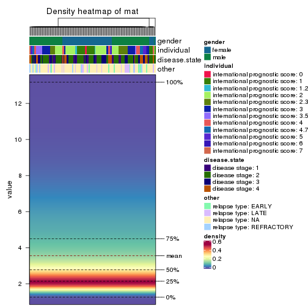


### Suggest the best k


Folowing table shows the best `k` (number of partitions) for each combination
of top-value methods and partition methods. Clicking on the method name in
the table goes to the section for a single combination of methods.

[The cola vignette](http://bioconductor.org/packages/devel/bioc/vignettes/cola/inst/doc/cola.html#toc_13)
explains the definition of the metrics used for determining the best
number of partitions.


```r
suggest_best_k(res_list)
```


|                            | The best k| 1-PAC| Mean silhouette| Concordance|   |Optional k |
|:---------------------------|----------:|-----:|---------------:|-----------:|:--|:----------|
|[ATC:kmeans](#ATC-kmeans)   |          2| 1.000|           0.992|       0.996|** |           |
|[ATC:NMF](#ATC-NMF)         |          2| 0.984|           0.949|       0.980|** |           |
|[ATC:pam](#ATC-pam)         |          5| 0.953|           0.917|       0.956|** |2          |
|[ATC:skmeans](#ATC-skmeans) |          6| 0.920|           0.835|       0.925|*  |2,3,4      |
|[MAD:skmeans](#MAD-skmeans) |          3| 0.917|           0.921|       0.957|*  |2          |
|[MAD:NMF](#MAD-NMF)         |          2| 0.905|           0.922|       0.969|*  |           |
|[CV:skmeans](#CV-skmeans)   |          4| 0.902|           0.898|       0.950|*  |           |
|[MAD:kmeans](#MAD-kmeans)   |          2| 0.876|           0.928|       0.969|   |           |
|[ATC:mclust](#ATC-mclust)   |          3| 0.871|           0.920|       0.953|   |           |
|[SD:NMF](#SD-NMF)           |          2| 0.846|           0.908|       0.962|   |           |
|[CV:mclust](#CV-mclust)     |          4| 0.830|           0.886|       0.940|   |           |
|[SD:skmeans](#SD-skmeans)   |          3| 0.808|           0.904|       0.949|   |           |
|[CV:NMF](#CV-NMF)           |          2| 0.802|           0.900|       0.957|   |           |
|[MAD:mclust](#MAD-mclust)   |          2| 0.756|           0.864|       0.942|   |           |
|[SD:kmeans](#SD-kmeans)     |          2| 0.743|           0.896|       0.949|   |           |
|[SD:mclust](#SD-mclust)     |          4| 0.728|           0.830|       0.903|   |           |
|[CV:kmeans](#CV-kmeans)     |          2| 0.725|           0.878|       0.939|   |           |
|[MAD:pam](#MAD-pam)         |          2| 0.719|           0.872|       0.936|   |           |
|[SD:pam](#SD-pam)           |          2| 0.534|           0.706|       0.885|   |           |
|[ATC:hclust](#ATC-hclust)   |          2| 0.526|           0.872|       0.923|   |           |
|[MAD:hclust](#MAD-hclust)   |          2| 0.360|           0.684|       0.855|   |           |
|[CV:pam](#CV-pam)           |          2| 0.330|           0.842|       0.877|   |           |
|[CV:hclust](#CV-hclust)     |          2| 0.277|           0.777|       0.872|   |           |
|[SD:hclust](#SD-hclust)     |          2| 0.268|           0.698|       0.848|   |           |

\*\*: 1-PAC > 0.95, \*: 1-PAC > 0.9


### CDF of consensus matrices

Cumulative distribution function curves of consensus matrix for all methods.


```r
collect_plots(res_list, fun = plot_ecdf)
```

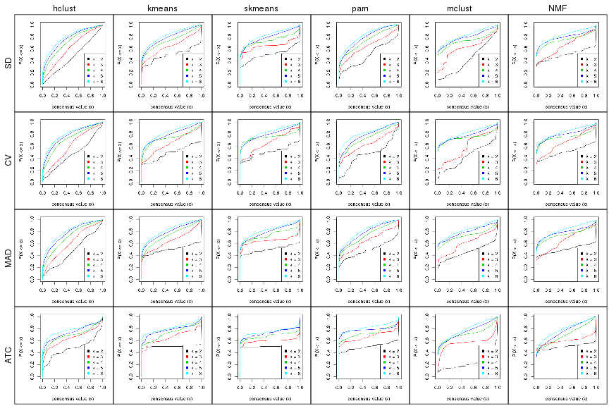


### Consensus heatmap

Consensus heatmaps for all methods. ([What is a consensus heatmap?](http://bioconductor.org/packages/devel/bioc/vignettes/cola/inst/doc/cola.html#toc_9))


<style type='text/css'>


.ui-helper-hidden {
	display: none;
}
.ui-helper-hidden-accessible {
	border: 0;
	clip: rect(0 0 0 0);
	height: 1px;
	margin: -1px;
	overflow: hidden;
	padding: 0;
	position: absolute;
	width: 1px;
}
.ui-helper-reset {
	margin: 0;
	padding: 0;
	border: 0;
	outline: 0;
	line-height: 1.3;
	text-decoration: none;
	font-size: 100%;
	list-style: none;
}
.ui-helper-clearfix:before,
.ui-helper-clearfix:after {
	content: "";
	display: table;
	border-collapse: collapse;
}
.ui-helper-clearfix:after {
	clear: both;
}
.ui-helper-zfix {
	width: 100%;
	height: 100%;
	top: 0;
	left: 0;
	position: absolute;
	opacity: 0;
	filter:Alpha(Opacity=0); 
}

.ui-front {
	z-index: 100;
}


.ui-state-disabled {
	cursor: default !important;
	pointer-events: none;
}


.ui-icon {
	display: inline-block;
	vertical-align: middle;
	margin-top: -.25em;
	position: relative;
	text-indent: -99999px;
	overflow: hidden;
	background-repeat: no-repeat;
}

.ui-widget-icon-block {
	left: 50%;
	margin-left: -8px;
	display: block;
}


.ui-widget-overlay {
	position: fixed;
	top: 0;
	left: 0;
	width: 100%;
	height: 100%;
}
.ui-accordion .ui-accordion-header {
	display: block;
	cursor: pointer;
	position: relative;
	margin: 2px 0 0 0;
	padding: .5em .5em .5em .7em;
	font-size: 100%;
}
.ui-accordion .ui-accordion-content {
	padding: 1em 2.2em;
	border-top: 0;
	overflow: auto;
}
.ui-autocomplete {
	position: absolute;
	top: 0;
	left: 0;
	cursor: default;
}
.ui-menu {
	list-style: none;
	padding: 0;
	margin: 0;
	display: block;
	outline: 0;
}
.ui-menu .ui-menu {
	position: absolute;
}
.ui-menu .ui-menu-item {
	margin: 0;
	cursor: pointer;
	
	list-style-image: url("data:image/gif;base64,R0lGODlhAQABAIAAAAAAAP///yH5BAEAAAAALAAAAAABAAEAAAIBRAA7");
}
.ui-menu .ui-menu-item-wrapper {
	position: relative;
	padding: 3px 1em 3px .4em;
}
.ui-menu .ui-menu-divider {
	margin: 5px 0;
	height: 0;
	font-size: 0;
	line-height: 0;
	border-width: 1px 0 0 0;
}
.ui-menu .ui-state-focus,
.ui-menu .ui-state-active {
	margin: -1px;
}


.ui-menu-icons {
	position: relative;
}
.ui-menu-icons .ui-menu-item-wrapper {
	padding-left: 2em;
}


.ui-menu .ui-icon {
	position: absolute;
	top: 0;
	bottom: 0;
	left: .2em;
	margin: auto 0;
}


.ui-menu .ui-menu-icon {
	left: auto;
	right: 0;
}
.ui-button {
	padding: .4em 1em;
	display: inline-block;
	position: relative;
	line-height: normal;
	margin-right: .1em;
	cursor: pointer;
	vertical-align: middle;
	text-align: center;
	-webkit-user-select: none;
	-moz-user-select: none;
	-ms-user-select: none;
	user-select: none;

	
	overflow: visible;
}

.ui-button,
.ui-button:link,
.ui-button:visited,
.ui-button:hover,
.ui-button:active {
	text-decoration: none;
}


.ui-button-icon-only {
	width: 2em;
	box-sizing: border-box;
	text-indent: -9999px;
	white-space: nowrap;
}


input.ui-button.ui-button-icon-only {
	text-indent: 0;
}


.ui-button-icon-only .ui-icon {
	position: absolute;
	top: 50%;
	left: 50%;
	margin-top: -8px;
	margin-left: -8px;
}

.ui-button.ui-icon-notext .ui-icon {
	padding: 0;
	width: 2.1em;
	height: 2.1em;
	text-indent: -9999px;
	white-space: nowrap;

}

input.ui-button.ui-icon-notext .ui-icon {
	width: auto;
	height: auto;
	text-indent: 0;
	white-space: normal;
	padding: .4em 1em;
}


input.ui-button::-moz-focus-inner,
button.ui-button::-moz-focus-inner {
	border: 0;
	padding: 0;
}
.ui-controlgroup {
	vertical-align: middle;
	display: inline-block;
}
.ui-controlgroup > .ui-controlgroup-item {
	float: left;
	margin-left: 0;
	margin-right: 0;
}
.ui-controlgroup > .ui-controlgroup-item:focus,
.ui-controlgroup > .ui-controlgroup-item.ui-visual-focus {
	z-index: 9999;
}
.ui-controlgroup-vertical > .ui-controlgroup-item {
	display: block;
	float: none;
	width: 100%;
	margin-top: 0;
	margin-bottom: 0;
	text-align: left;
}
.ui-controlgroup-vertical .ui-controlgroup-item {
	box-sizing: border-box;
}
.ui-controlgroup .ui-controlgroup-label {
	padding: .4em 1em;
}
.ui-controlgroup .ui-controlgroup-label span {
	font-size: 80%;
}
.ui-controlgroup-horizontal .ui-controlgroup-label + .ui-controlgroup-item {
	border-left: none;
}
.ui-controlgroup-vertical .ui-controlgroup-label + .ui-controlgroup-item {
	border-top: none;
}
.ui-controlgroup-horizontal .ui-controlgroup-label.ui-widget-content {
	border-right: none;
}
.ui-controlgroup-vertical .ui-controlgroup-label.ui-widget-content {
	border-bottom: none;
}


.ui-controlgroup-vertical .ui-spinner-input {

	
	width: 75%;
	width: calc( 100% - 2.4em );
}
.ui-controlgroup-vertical .ui-spinner .ui-spinner-up {
	border-top-style: solid;
}

.ui-checkboxradio-label .ui-icon-background {
	box-shadow: inset 1px 1px 1px #ccc;
	border-radius: .12em;
	border: none;
}
.ui-checkboxradio-radio-label .ui-icon-background {
	width: 16px;
	height: 16px;
	border-radius: 1em;
	overflow: visible;
	border: none;
}
.ui-checkboxradio-radio-label.ui-checkboxradio-checked .ui-icon,
.ui-checkboxradio-radio-label.ui-checkboxradio-checked:hover .ui-icon {
	background-image: none;
	width: 8px;
	height: 8px;
	border-width: 4px;
	border-style: solid;
}
.ui-checkboxradio-disabled {
	pointer-events: none;
}
.ui-datepicker {
	width: 17em;
	padding: .2em .2em 0;
	display: none;
}
.ui-datepicker .ui-datepicker-header {
	position: relative;
	padding: .2em 0;
}
.ui-datepicker .ui-datepicker-prev,
.ui-datepicker .ui-datepicker-next {
	position: absolute;
	top: 2px;
	width: 1.8em;
	height: 1.8em;
}
.ui-datepicker .ui-datepicker-prev-hover,
.ui-datepicker .ui-datepicker-next-hover {
	top: 1px;
}
.ui-datepicker .ui-datepicker-prev {
	left: 2px;
}
.ui-datepicker .ui-datepicker-next {
	right: 2px;
}
.ui-datepicker .ui-datepicker-prev-hover {
	left: 1px;
}
.ui-datepicker .ui-datepicker-next-hover {
	right: 1px;
}
.ui-datepicker .ui-datepicker-prev span,
.ui-datepicker .ui-datepicker-next span {
	display: block;
	position: absolute;
	left: 50%;
	margin-left: -8px;
	top: 50%;
	margin-top: -8px;
}
.ui-datepicker .ui-datepicker-title {
	margin: 0 2.3em;
	line-height: 1.8em;
	text-align: center;
}
.ui-datepicker .ui-datepicker-title select {
	font-size: 1em;
	margin: 1px 0;
}
.ui-datepicker select.ui-datepicker-month,
.ui-datepicker select.ui-datepicker-year {
	width: 45%;
}
.ui-datepicker table {
	width: 100%;
	font-size: .9em;
	border-collapse: collapse;
	margin: 0 0 .4em;
}
.ui-datepicker th {
	padding: .7em .3em;
	text-align: center;
	font-weight: bold;
	border: 0;
}
.ui-datepicker td {
	border: 0;
	padding: 1px;
}
.ui-datepicker td span,
.ui-datepicker td a {
	display: block;
	padding: .2em;
	text-align: right;
	text-decoration: none;
}
.ui-datepicker .ui-datepicker-buttonpane {
	background-image: none;
	margin: .7em 0 0 0;
	padding: 0 .2em;
	border-left: 0;
	border-right: 0;
	border-bottom: 0;
}
.ui-datepicker .ui-datepicker-buttonpane button {
	float: right;
	margin: .5em .2em .4em;
	cursor: pointer;
	padding: .2em .6em .3em .6em;
	width: auto;
	overflow: visible;
}
.ui-datepicker .ui-datepicker-buttonpane button.ui-datepicker-current {
	float: left;
}


.ui-datepicker.ui-datepicker-multi {
	width: auto;
}
.ui-datepicker-multi .ui-datepicker-group {
	float: left;
}
.ui-datepicker-multi .ui-datepicker-group table {
	width: 95%;
	margin: 0 auto .4em;
}
.ui-datepicker-multi-2 .ui-datepicker-group {
	width: 50%;
}
.ui-datepicker-multi-3 .ui-datepicker-group {
	width: 33.3%;
}
.ui-datepicker-multi-4 .ui-datepicker-group {
	width: 25%;
}
.ui-datepicker-multi .ui-datepicker-group-last .ui-datepicker-header,
.ui-datepicker-multi .ui-datepicker-group-middle .ui-datepicker-header {
	border-left-width: 0;
}
.ui-datepicker-multi .ui-datepicker-buttonpane {
	clear: left;
}
.ui-datepicker-row-break {
	clear: both;
	width: 100%;
	font-size: 0;
}


.ui-datepicker-rtl {
	direction: rtl;
}
.ui-datepicker-rtl .ui-datepicker-prev {
	right: 2px;
	left: auto;
}
.ui-datepicker-rtl .ui-datepicker-next {
	left: 2px;
	right: auto;
}
.ui-datepicker-rtl .ui-datepicker-prev:hover {
	right: 1px;
	left: auto;
}
.ui-datepicker-rtl .ui-datepicker-next:hover {
	left: 1px;
	right: auto;
}
.ui-datepicker-rtl .ui-datepicker-buttonpane {
	clear: right;
}
.ui-datepicker-rtl .ui-datepicker-buttonpane button {
	float: left;
}
.ui-datepicker-rtl .ui-datepicker-buttonpane button.ui-datepicker-current,
.ui-datepicker-rtl .ui-datepicker-group {
	float: right;
}
.ui-datepicker-rtl .ui-datepicker-group-last .ui-datepicker-header,
.ui-datepicker-rtl .ui-datepicker-group-middle .ui-datepicker-header {
	border-right-width: 0;
	border-left-width: 1px;
}


.ui-datepicker .ui-icon {
	display: block;
	text-indent: -99999px;
	overflow: hidden;
	background-repeat: no-repeat;
	left: .5em;
	top: .3em;
}
.ui-dialog {
	position: absolute;
	top: 0;
	left: 0;
	padding: .2em;
	outline: 0;
}
.ui-dialog .ui-dialog-titlebar {
	padding: .4em 1em;
	position: relative;
}
.ui-dialog .ui-dialog-title {
	float: left;
	margin: .1em 0;
	white-space: nowrap;
	width: 90%;
	overflow: hidden;
	text-overflow: ellipsis;
}
.ui-dialog .ui-dialog-titlebar-close {
	position: absolute;
	right: .3em;
	top: 50%;
	width: 20px;
	margin: -10px 0 0 0;
	padding: 1px;
	height: 20px;
}
.ui-dialog .ui-dialog-content {
	position: relative;
	border: 0;
	padding: .5em 1em;
	background: none;
	overflow: auto;
}
.ui-dialog .ui-dialog-buttonpane {
	text-align: left;
	border-width: 1px 0 0 0;
	background-image: none;
	margin-top: .5em;
	padding: .3em 1em .5em .4em;
}
.ui-dialog .ui-dialog-buttonpane .ui-dialog-buttonset {
	float: right;
}
.ui-dialog .ui-dialog-buttonpane button {
	margin: .5em .4em .5em 0;
	cursor: pointer;
}
.ui-dialog .ui-resizable-n {
	height: 2px;
	top: 0;
}
.ui-dialog .ui-resizable-e {
	width: 2px;
	right: 0;
}
.ui-dialog .ui-resizable-s {
	height: 2px;
	bottom: 0;
}
.ui-dialog .ui-resizable-w {
	width: 2px;
	left: 0;
}
.ui-dialog .ui-resizable-se,
.ui-dialog .ui-resizable-sw,
.ui-dialog .ui-resizable-ne,
.ui-dialog .ui-resizable-nw {
	width: 7px;
	height: 7px;
}
.ui-dialog .ui-resizable-se {
	right: 0;
	bottom: 0;
}
.ui-dialog .ui-resizable-sw {
	left: 0;
	bottom: 0;
}
.ui-dialog .ui-resizable-ne {
	right: 0;
	top: 0;
}
.ui-dialog .ui-resizable-nw {
	left: 0;
	top: 0;
}
.ui-draggable .ui-dialog-titlebar {
	cursor: move;
}
.ui-draggable-handle {
	-ms-touch-action: none;
	touch-action: none;
}
.ui-resizable {
	position: relative;
}
.ui-resizable-handle {
	position: absolute;
	font-size: 0.1px;
	display: block;
	-ms-touch-action: none;
	touch-action: none;
}
.ui-resizable-disabled .ui-resizable-handle,
.ui-resizable-autohide .ui-resizable-handle {
	display: none;
}
.ui-resizable-n {
	cursor: n-resize;
	height: 7px;
	width: 100%;
	top: -5px;
	left: 0;
}
.ui-resizable-s {
	cursor: s-resize;
	height: 7px;
	width: 100%;
	bottom: -5px;
	left: 0;
}
.ui-resizable-e {
	cursor: e-resize;
	width: 7px;
	right: -5px;
	top: 0;
	height: 100%;
}
.ui-resizable-w {
	cursor: w-resize;
	width: 7px;
	left: -5px;
	top: 0;
	height: 100%;
}
.ui-resizable-se {
	cursor: se-resize;
	width: 12px;
	height: 12px;
	right: 1px;
	bottom: 1px;
}
.ui-resizable-sw {
	cursor: sw-resize;
	width: 9px;
	height: 9px;
	left: -5px;
	bottom: -5px;
}
.ui-resizable-nw {
	cursor: nw-resize;
	width: 9px;
	height: 9px;
	left: -5px;
	top: -5px;
}
.ui-resizable-ne {
	cursor: ne-resize;
	width: 9px;
	height: 9px;
	right: -5px;
	top: -5px;
}
.ui-progressbar {
	height: 2em;
	text-align: left;
	overflow: hidden;
}
.ui-progressbar .ui-progressbar-value {
	margin: -1px;
	height: 100%;
}
.ui-progressbar .ui-progressbar-overlay {
	background: url("");
	height: 100%;
	filter: alpha(opacity=25); 
	opacity: 0.25;
}
.ui-progressbar-indeterminate .ui-progressbar-value {
	background-image: none;
}
.ui-selectable {
	-ms-touch-action: none;
	touch-action: none;
}
.ui-selectable-helper {
	position: absolute;
	z-index: 100;
	border: 1px dotted black;
}
.ui-selectmenu-menu {
	padding: 0;
	margin: 0;
	position: absolute;
	top: 0;
	left: 0;
	display: none;
}
.ui-selectmenu-menu .ui-menu {
	overflow: auto;
	overflow-x: hidden;
	padding-bottom: 1px;
}
.ui-selectmenu-menu .ui-menu .ui-selectmenu-optgroup {
	font-size: 1em;
	font-weight: bold;
	line-height: 1.5;
	padding: 2px 0.4em;
	margin: 0.5em 0 0 0;
	height: auto;
	border: 0;
}
.ui-selectmenu-open {
	display: block;
}
.ui-selectmenu-text {
	display: block;
	margin-right: 20px;
	overflow: hidden;
	text-overflow: ellipsis;
}
.ui-selectmenu-button.ui-button {
	text-align: left;
	white-space: nowrap;
	width: 14em;
}
.ui-selectmenu-icon.ui-icon {
	float: right;
	margin-top: 0;
}
.ui-slider {
	position: relative;
	text-align: left;
}
.ui-slider .ui-slider-handle {
	position: absolute;
	z-index: 2;
	width: 1.2em;
	height: 1.2em;
	cursor: default;
	-ms-touch-action: none;
	touch-action: none;
}
.ui-slider .ui-slider-range {
	position: absolute;
	z-index: 1;
	font-size: .7em;
	display: block;
	border: 0;
	background-position: 0 0;
}


.ui-slider.ui-state-disabled .ui-slider-handle,
.ui-slider.ui-state-disabled .ui-slider-range {
	filter: inherit;
}

.ui-slider-horizontal {
	height: .8em;
}
.ui-slider-horizontal .ui-slider-handle {
	top: -.3em;
	margin-left: -.6em;
}
.ui-slider-horizontal .ui-slider-range {
	top: 0;
	height: 100%;
}
.ui-slider-horizontal .ui-slider-range-min {
	left: 0;
}
.ui-slider-horizontal .ui-slider-range-max {
	right: 0;
}

.ui-slider-vertical {
	width: .8em;
	height: 100px;
}
.ui-slider-vertical .ui-slider-handle {
	left: -.3em;
	margin-left: 0;
	margin-bottom: -.6em;
}
.ui-slider-vertical .ui-slider-range {
	left: 0;
	width: 100%;
}
.ui-slider-vertical .ui-slider-range-min {
	bottom: 0;
}
.ui-slider-vertical .ui-slider-range-max {
	top: 0;
}
.ui-sortable-handle {
	-ms-touch-action: none;
	touch-action: none;
}
.ui-spinner {
	position: relative;
	display: inline-block;
	overflow: hidden;
	padding: 0;
	vertical-align: middle;
}
.ui-spinner-input {
	border: none;
	background: none;
	color: inherit;
	padding: .222em 0;
	margin: .2em 0;
	vertical-align: middle;
	margin-left: .4em;
	margin-right: 2em;
}
.ui-spinner-button {
	width: 1.6em;
	height: 50%;
	font-size: .5em;
	padding: 0;
	margin: 0;
	text-align: center;
	position: absolute;
	cursor: default;
	display: block;
	overflow: hidden;
	right: 0;
}

.ui-spinner a.ui-spinner-button {
	border-top-style: none;
	border-bottom-style: none;
	border-right-style: none;
}
.ui-spinner-up {
	top: 0;
}
.ui-spinner-down {
	bottom: 0;
}
.ui-tabs {
	position: relative;
	padding: .2em;
}
.ui-tabs .ui-tabs-nav {
	margin: 0;
	padding: .2em .2em 0;
}
.ui-tabs .ui-tabs-nav li {
	list-style: none;
	float: left;
	position: relative;
	top: 0;
	margin: 1px .2em 0 0;
	border-bottom-width: 0;
	padding: 0;
	white-space: nowrap;
}
.ui-tabs .ui-tabs-nav .ui-tabs-anchor {
	float: left;
	padding: .5em 1em;
	text-decoration: none;
}
.ui-tabs .ui-tabs-nav li.ui-tabs-active {
	margin-bottom: -1px;
	padding-bottom: 1px;
}
.ui-tabs .ui-tabs-nav li.ui-tabs-active .ui-tabs-anchor,
.ui-tabs .ui-tabs-nav li.ui-state-disabled .ui-tabs-anchor,
.ui-tabs .ui-tabs-nav li.ui-tabs-loading .ui-tabs-anchor {
	cursor: text;
}
.ui-tabs-collapsible .ui-tabs-nav li.ui-tabs-active .ui-tabs-anchor {
	cursor: pointer;
}
.ui-tabs .ui-tabs-panel {
	display: block;
	border-width: 0;
	padding: 1em 1.4em;
	background: none;
}
.ui-tooltip {
	padding: 8px;
	position: absolute;
	z-index: 9999;
	max-width: 300px;
}
body .ui-tooltip {
	border-width: 2px;
}

.ui-widget {
	font-family: Arial,Helvetica,sans-serif;
	font-size: 1em;
}
.ui-widget .ui-widget {
	font-size: 1em;
}
.ui-widget input,
.ui-widget select,
.ui-widget textarea,
.ui-widget button {
	font-family: Arial,Helvetica,sans-serif;
	font-size: 1em;
}
.ui-widget.ui-widget-content {
	border: 1px solid #c5c5c5;
}
.ui-widget-content {
	border: 1px solid #dddddd;
	background: #ffffff;
	color: #333333;
}
.ui-widget-content a {
	color: #333333;
}
.ui-widget-header {
	border: 1px solid #dddddd;
	background: #e9e9e9;
	color: #333333;
	font-weight: bold;
}
.ui-widget-header a {
	color: #333333;
}


.ui-state-default,
.ui-widget-content .ui-state-default,
.ui-widget-header .ui-state-default,
.ui-button,


html .ui-button.ui-state-disabled:hover,
html .ui-button.ui-state-disabled:active {
	border: 1px solid #c5c5c5;
	background: #f6f6f6;
	font-weight: normal;
	color: #454545;
}
.ui-state-default a,
.ui-state-default a:link,
.ui-state-default a:visited,
a.ui-button,
a:link.ui-button,
a:visited.ui-button,
.ui-button {
	color: #454545;
	text-decoration: none;
}
.ui-state-hover,
.ui-widget-content .ui-state-hover,
.ui-widget-header .ui-state-hover,
.ui-state-focus,
.ui-widget-content .ui-state-focus,
.ui-widget-header .ui-state-focus,
.ui-button:hover,
.ui-button:focus {
	border: 1px solid #cccccc;
	background: #ededed;
	font-weight: normal;
	color: #2b2b2b;
}
.ui-state-hover a,
.ui-state-hover a:hover,
.ui-state-hover a:link,
.ui-state-hover a:visited,
.ui-state-focus a,
.ui-state-focus a:hover,
.ui-state-focus a:link,
.ui-state-focus a:visited,
a.ui-button:hover,
a.ui-button:focus {
	color: #2b2b2b;
	text-decoration: none;
}

.ui-visual-focus {
	box-shadow: 0 0 3px 1px rgb(94, 158, 214);
}
.ui-state-active,
.ui-widget-content .ui-state-active,
.ui-widget-header .ui-state-active,
a.ui-button:active,
.ui-button:active,
.ui-button.ui-state-active:hover {
	border: 1px solid #003eff;
	background: #007fff;
	font-weight: normal;
	color: #ffffff;
}
.ui-icon-background,
.ui-state-active .ui-icon-background {
	border: #003eff;
	background-color: #ffffff;
}
.ui-state-active a,
.ui-state-active a:link,
.ui-state-active a:visited {
	color: #ffffff;
	text-decoration: none;
}


.ui-state-highlight,
.ui-widget-content .ui-state-highlight,
.ui-widget-header .ui-state-highlight {
	border: 1px solid #dad55e;
	background: #fffa90;
	color: #777620;
}
.ui-state-checked {
	border: 1px solid #dad55e;
	background: #fffa90;
}
.ui-state-highlight a,
.ui-widget-content .ui-state-highlight a,
.ui-widget-header .ui-state-highlight a {
	color: #777620;
}
.ui-state-error,
.ui-widget-content .ui-state-error,
.ui-widget-header .ui-state-error {
	border: 1px solid #f1a899;
	background: #fddfdf;
	color: #5f3f3f;
}
.ui-state-error a,
.ui-widget-content .ui-state-error a,
.ui-widget-header .ui-state-error a {
	color: #5f3f3f;
}
.ui-state-error-text,
.ui-widget-content .ui-state-error-text,
.ui-widget-header .ui-state-error-text {
	color: #5f3f3f;
}
.ui-priority-primary,
.ui-widget-content .ui-priority-primary,
.ui-widget-header .ui-priority-primary {
	font-weight: bold;
}
.ui-priority-secondary,
.ui-widget-content .ui-priority-secondary,
.ui-widget-header .ui-priority-secondary {
	opacity: .7;
	filter:Alpha(Opacity=70); 
	font-weight: normal;
}
.ui-state-disabled,
.ui-widget-content .ui-state-disabled,
.ui-widget-header .ui-state-disabled {
	opacity: .35;
	filter:Alpha(Opacity=35); 
	background-image: none;
}
.ui-state-disabled .ui-icon {
	filter:Alpha(Opacity=35); 
}


.ui-icon {
	width: 16px;
	height: 16px;
}
.ui-icon,
.ui-widget-content .ui-icon {
	background-image: url("images/ui-icons_444444_256x240.png");
}
.ui-widget-header .ui-icon {
	background-image: url("images/ui-icons_444444_256x240.png");
}
.ui-state-hover .ui-icon,
.ui-state-focus .ui-icon,
.ui-button:hover .ui-icon,
.ui-button:focus .ui-icon {
	background-image: url("images/ui-icons_555555_256x240.png");
}
.ui-state-active .ui-icon,
.ui-button:active .ui-icon {
	background-image: url("images/ui-icons_ffffff_256x240.png");
}
.ui-state-highlight .ui-icon,
.ui-button .ui-state-highlight.ui-icon {
	background-image: url("images/ui-icons_777620_256x240.png");
}
.ui-state-error .ui-icon,
.ui-state-error-text .ui-icon {
	background-image: url("images/ui-icons_cc0000_256x240.png");
}
.ui-button .ui-icon {
	background-image: url("images/ui-icons_777777_256x240.png");
}


.ui-icon-blank { background-position: 16px 16px; }
.ui-icon-caret-1-n { background-position: 0 0; }
.ui-icon-caret-1-ne { background-position: -16px 0; }
.ui-icon-caret-1-e { background-position: -32px 0; }
.ui-icon-caret-1-se { background-position: -48px 0; }
.ui-icon-caret-1-s { background-position: -65px 0; }
.ui-icon-caret-1-sw { background-position: -80px 0; }
.ui-icon-caret-1-w { background-position: -96px 0; }
.ui-icon-caret-1-nw { background-position: -112px 0; }
.ui-icon-caret-2-n-s { background-position: -128px 0; }
.ui-icon-caret-2-e-w { background-position: -144px 0; }
.ui-icon-triangle-1-n { background-position: 0 -16px; }
.ui-icon-triangle-1-ne { background-position: -16px -16px; }
.ui-icon-triangle-1-e { background-position: -32px -16px; }
.ui-icon-triangle-1-se { background-position: -48px -16px; }
.ui-icon-triangle-1-s { background-position: -65px -16px; }
.ui-icon-triangle-1-sw { background-position: -80px -16px; }
.ui-icon-triangle-1-w { background-position: -96px -16px; }
.ui-icon-triangle-1-nw { background-position: -112px -16px; }
.ui-icon-triangle-2-n-s { background-position: -128px -16px; }
.ui-icon-triangle-2-e-w { background-position: -144px -16px; }
.ui-icon-arrow-1-n { background-position: 0 -32px; }
.ui-icon-arrow-1-ne { background-position: -16px -32px; }
.ui-icon-arrow-1-e { background-position: -32px -32px; }
.ui-icon-arrow-1-se { background-position: -48px -32px; }
.ui-icon-arrow-1-s { background-position: -65px -32px; }
.ui-icon-arrow-1-sw { background-position: -80px -32px; }
.ui-icon-arrow-1-w { background-position: -96px -32px; }
.ui-icon-arrow-1-nw { background-position: -112px -32px; }
.ui-icon-arrow-2-n-s { background-position: -128px -32px; }
.ui-icon-arrow-2-ne-sw { background-position: -144px -32px; }
.ui-icon-arrow-2-e-w { background-position: -160px -32px; }
.ui-icon-arrow-2-se-nw { background-position: -176px -32px; }
.ui-icon-arrowstop-1-n { background-position: -192px -32px; }
.ui-icon-arrowstop-1-e { background-position: -208px -32px; }
.ui-icon-arrowstop-1-s { background-position: -224px -32px; }
.ui-icon-arrowstop-1-w { background-position: -240px -32px; }
.ui-icon-arrowthick-1-n { background-position: 1px -48px; }
.ui-icon-arrowthick-1-ne { background-position: -16px -48px; }
.ui-icon-arrowthick-1-e { background-position: -32px -48px; }
.ui-icon-arrowthick-1-se { background-position: -48px -48px; }
.ui-icon-arrowthick-1-s { background-position: -64px -48px; }
.ui-icon-arrowthick-1-sw { background-position: -80px -48px; }
.ui-icon-arrowthick-1-w { background-position: -96px -48px; }
.ui-icon-arrowthick-1-nw { background-position: -112px -48px; }
.ui-icon-arrowthick-2-n-s { background-position: -128px -48px; }
.ui-icon-arrowthick-2-ne-sw { background-position: -144px -48px; }
.ui-icon-arrowthick-2-e-w { background-position: -160px -48px; }
.ui-icon-arrowthick-2-se-nw { background-position: -176px -48px; }
.ui-icon-arrowthickstop-1-n { background-position: -192px -48px; }
.ui-icon-arrowthickstop-1-e { background-position: -208px -48px; }
.ui-icon-arrowthickstop-1-s { background-position: -224px -48px; }
.ui-icon-arrowthickstop-1-w { background-position: -240px -48px; }
.ui-icon-arrowreturnthick-1-w { background-position: 0 -64px; }
.ui-icon-arrowreturnthick-1-n { background-position: -16px -64px; }
.ui-icon-arrowreturnthick-1-e { background-position: -32px -64px; }
.ui-icon-arrowreturnthick-1-s { background-position: -48px -64px; }
.ui-icon-arrowreturn-1-w { background-position: -64px -64px; }
.ui-icon-arrowreturn-1-n { background-position: -80px -64px; }
.ui-icon-arrowreturn-1-e { background-position: -96px -64px; }
.ui-icon-arrowreturn-1-s { background-position: -112px -64px; }
.ui-icon-arrowrefresh-1-w { background-position: -128px -64px; }
.ui-icon-arrowrefresh-1-n { background-position: -144px -64px; }
.ui-icon-arrowrefresh-1-e { background-position: -160px -64px; }
.ui-icon-arrowrefresh-1-s { background-position: -176px -64px; }
.ui-icon-arrow-4 { background-position: 0 -80px; }
.ui-icon-arrow-4-diag { background-position: -16px -80px; }
.ui-icon-extlink { background-position: -32px -80px; }
.ui-icon-newwin { background-position: -48px -80px; }
.ui-icon-refresh { background-position: -64px -80px; }
.ui-icon-shuffle { background-position: -80px -80px; }
.ui-icon-transfer-e-w { background-position: -96px -80px; }
.ui-icon-transferthick-e-w { background-position: -112px -80px; }
.ui-icon-folder-collapsed { background-position: 0 -96px; }
.ui-icon-folder-open { background-position: -16px -96px; }
.ui-icon-document { background-position: -32px -96px; }
.ui-icon-document-b { background-position: -48px -96px; }
.ui-icon-note { background-position: -64px -96px; }
.ui-icon-mail-closed { background-position: -80px -96px; }
.ui-icon-mail-open { background-position: -96px -96px; }
.ui-icon-suitcase { background-position: -112px -96px; }
.ui-icon-comment { background-position: -128px -96px; }
.ui-icon-person { background-position: -144px -96px; }
.ui-icon-print { background-position: -160px -96px; }
.ui-icon-trash { background-position: -176px -96px; }
.ui-icon-locked { background-position: -192px -96px; }
.ui-icon-unlocked { background-position: -208px -96px; }
.ui-icon-bookmark { background-position: -224px -96px; }
.ui-icon-tag { background-position: -240px -96px; }
.ui-icon-home { background-position: 0 -112px; }
.ui-icon-flag { background-position: -16px -112px; }
.ui-icon-calendar { background-position: -32px -112px; }
.ui-icon-cart { background-position: -48px -112px; }
.ui-icon-pencil { background-position: -64px -112px; }
.ui-icon-clock { background-position: -80px -112px; }
.ui-icon-disk { background-position: -96px -112px; }
.ui-icon-calculator { background-position: -112px -112px; }
.ui-icon-zoomin { background-position: -128px -112px; }
.ui-icon-zoomout { background-position: -144px -112px; }
.ui-icon-search { background-position: -160px -112px; }
.ui-icon-wrench { background-position: -176px -112px; }
.ui-icon-gear { background-position: -192px -112px; }
.ui-icon-heart { background-position: -208px -112px; }
.ui-icon-star { background-position: -224px -112px; }
.ui-icon-link { background-position: -240px -112px; }
.ui-icon-cancel { background-position: 0 -128px; }
.ui-icon-plus { background-position: -16px -128px; }
.ui-icon-plusthick { background-position: -32px -128px; }
.ui-icon-minus { background-position: -48px -128px; }
.ui-icon-minusthick { background-position: -64px -128px; }
.ui-icon-close { background-position: -80px -128px; }
.ui-icon-closethick { background-position: -96px -128px; }
.ui-icon-key { background-position: -112px -128px; }
.ui-icon-lightbulb { background-position: -128px -128px; }
.ui-icon-scissors { background-position: -144px -128px; }
.ui-icon-clipboard { background-position: -160px -128px; }
.ui-icon-copy { background-position: -176px -128px; }
.ui-icon-contact { background-position: -192px -128px; }
.ui-icon-image { background-position: -208px -128px; }
.ui-icon-video { background-position: -224px -128px; }
.ui-icon-script { background-position: -240px -128px; }
.ui-icon-alert { background-position: 0 -144px; }
.ui-icon-info { background-position: -16px -144px; }
.ui-icon-notice { background-position: -32px -144px; }
.ui-icon-help { background-position: -48px -144px; }
.ui-icon-check { background-position: -64px -144px; }
.ui-icon-bullet { background-position: -80px -144px; }
.ui-icon-radio-on { background-position: -96px -144px; }
.ui-icon-radio-off { background-position: -112px -144px; }
.ui-icon-pin-w { background-position: -128px -144px; }
.ui-icon-pin-s { background-position: -144px -144px; }
.ui-icon-play { background-position: 0 -160px; }
.ui-icon-pause { background-position: -16px -160px; }
.ui-icon-seek-next { background-position: -32px -160px; }
.ui-icon-seek-prev { background-position: -48px -160px; }
.ui-icon-seek-end { background-position: -64px -160px; }
.ui-icon-seek-start { background-position: -80px -160px; }

.ui-icon-seek-first { background-position: -80px -160px; }
.ui-icon-stop { background-position: -96px -160px; }
.ui-icon-eject { background-position: -112px -160px; }
.ui-icon-volume-off { background-position: -128px -160px; }
.ui-icon-volume-on { background-position: -144px -160px; }
.ui-icon-power { background-position: 0 -176px; }
.ui-icon-signal-diag { background-position: -16px -176px; }
.ui-icon-signal { background-position: -32px -176px; }
.ui-icon-battery-0 { background-position: -48px -176px; }
.ui-icon-battery-1 { background-position: -64px -176px; }
.ui-icon-battery-2 { background-position: -80px -176px; }
.ui-icon-battery-3 { background-position: -96px -176px; }
.ui-icon-circle-plus { background-position: 0 -192px; }
.ui-icon-circle-minus { background-position: -16px -192px; }
.ui-icon-circle-close { background-position: -32px -192px; }
.ui-icon-circle-triangle-e { background-position: -48px -192px; }
.ui-icon-circle-triangle-s { background-position: -64px -192px; }
.ui-icon-circle-triangle-w { background-position: -80px -192px; }
.ui-icon-circle-triangle-n { background-position: -96px -192px; }
.ui-icon-circle-arrow-e { background-position: -112px -192px; }
.ui-icon-circle-arrow-s { background-position: -128px -192px; }
.ui-icon-circle-arrow-w { background-position: -144px -192px; }
.ui-icon-circle-arrow-n { background-position: -160px -192px; }
.ui-icon-circle-zoomin { background-position: -176px -192px; }
.ui-icon-circle-zoomout { background-position: -192px -192px; }
.ui-icon-circle-check { background-position: -208px -192px; }
.ui-icon-circlesmall-plus { background-position: 0 -208px; }
.ui-icon-circlesmall-minus { background-position: -16px -208px; }
.ui-icon-circlesmall-close { background-position: -32px -208px; }
.ui-icon-squaresmall-plus { background-position: -48px -208px; }
.ui-icon-squaresmall-minus { background-position: -64px -208px; }
.ui-icon-squaresmall-close { background-position: -80px -208px; }
.ui-icon-grip-dotted-vertical { background-position: 0 -224px; }
.ui-icon-grip-dotted-horizontal { background-position: -16px -224px; }
.ui-icon-grip-solid-vertical { background-position: -32px -224px; }
.ui-icon-grip-solid-horizontal { background-position: -48px -224px; }
.ui-icon-gripsmall-diagonal-se { background-position: -64px -224px; }
.ui-icon-grip-diagonal-se { background-position: -80px -224px; }


.ui-corner-all,
.ui-corner-top,
.ui-corner-left,
.ui-corner-tl {
	border-top-left-radius: 3px;
}
.ui-corner-all,
.ui-corner-top,
.ui-corner-right,
.ui-corner-tr {
	border-top-right-radius: 3px;
}
.ui-corner-all,
.ui-corner-bottom,
.ui-corner-left,
.ui-corner-bl {
	border-bottom-left-radius: 3px;
}
.ui-corner-all,
.ui-corner-bottom,
.ui-corner-right,
.ui-corner-br {
	border-bottom-right-radius: 3px;
}


.ui-widget-overlay {
	background: #aaaaaa;
	opacity: .3;
	filter: Alpha(Opacity=30); 
}
.ui-widget-shadow {
	-webkit-box-shadow: 0px 0px 5px #666666;
	box-shadow: 0px 0px 5px #666666;
} 
</style>
<script src='js/jquery-1.12.4.js'></script>
<script src='js/jquery-ui.js'></script>

<script>
$( function() {
	$( '#tabs-collect-consensus-heatmap' ).tabs();
} );
</script>
<div id='tabs-collect-consensus-heatmap'>
<ul>
<li><a href='#tab-collect-consensus-heatmap-1'>k = 2</a></li>
<li><a href='#tab-collect-consensus-heatmap-2'>k = 3</a></li>
<li><a href='#tab-collect-consensus-heatmap-3'>k = 4</a></li>
<li><a href='#tab-collect-consensus-heatmap-4'>k = 5</a></li>
<li><a href='#tab-collect-consensus-heatmap-5'>k = 6</a></li>
</ul>
<div id='tab-collect-consensus-heatmap-1'>
<pre><code class="r">collect_plots(res_list, k = 2, fun = consensus_heatmap, mc.cores = 4)
</code></pre>

<p>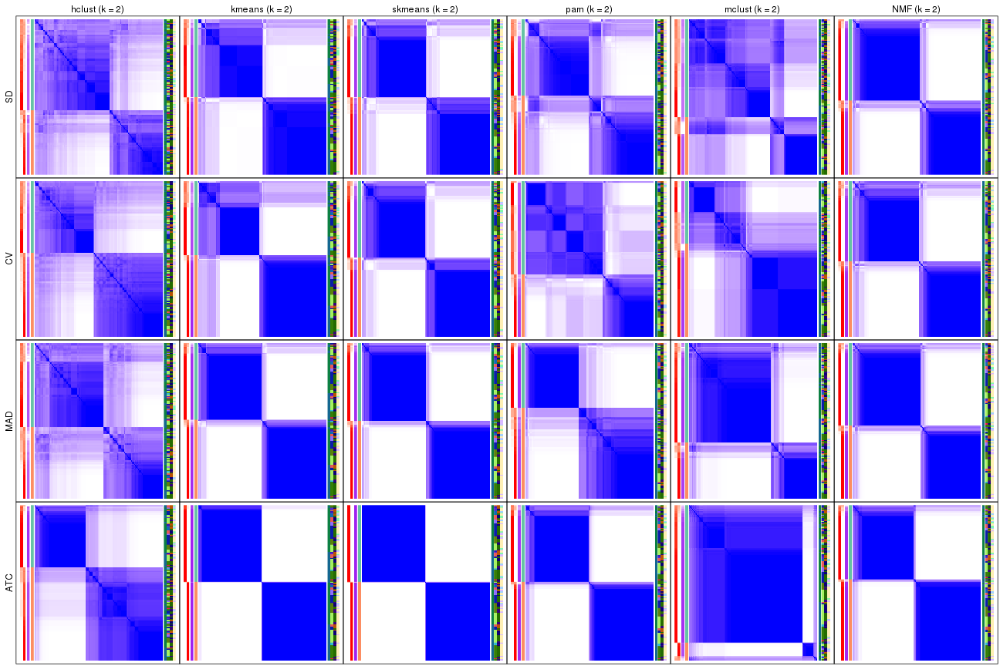</p>

</div>
<div id='tab-collect-consensus-heatmap-2'>
<pre><code class="r">collect_plots(res_list, k = 3, fun = consensus_heatmap, mc.cores = 4)
</code></pre>

<p>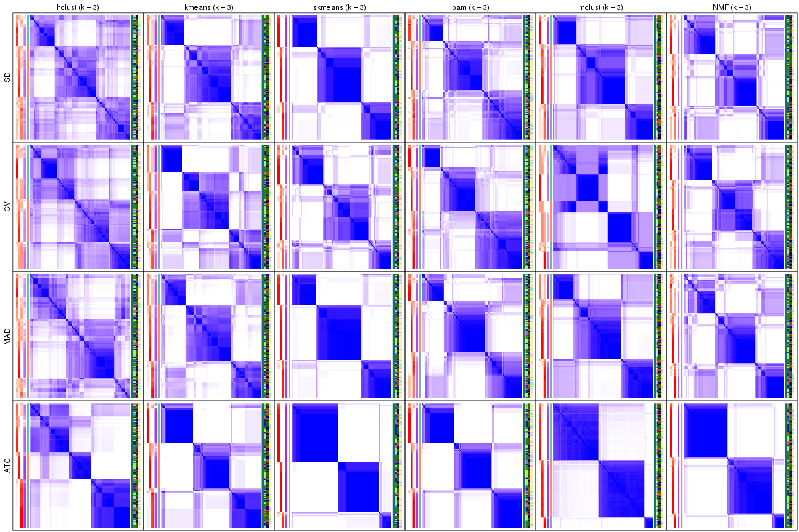</p>

</div>
<div id='tab-collect-consensus-heatmap-3'>
<pre><code class="r">collect_plots(res_list, k = 4, fun = consensus_heatmap, mc.cores = 4)
</code></pre>

<p>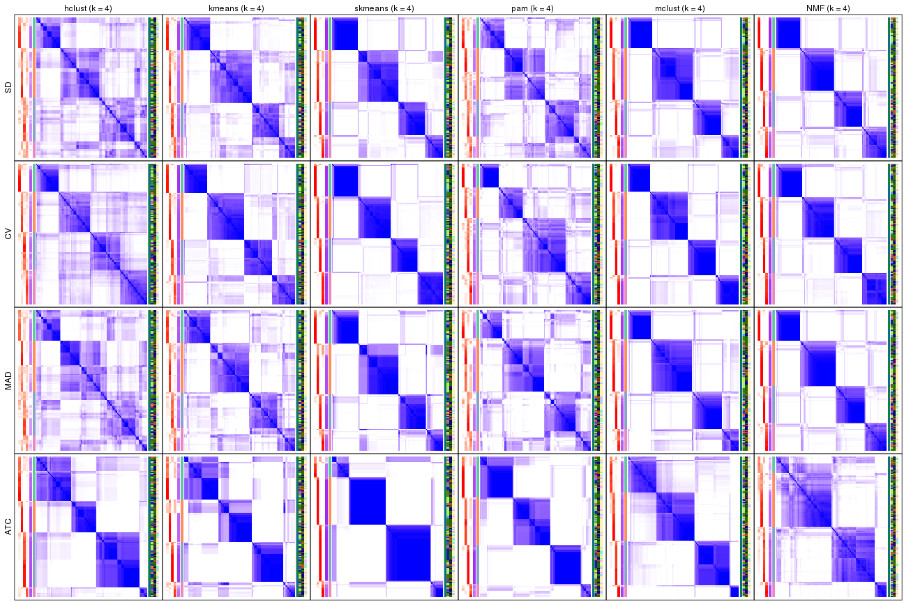</p>

</div>
<div id='tab-collect-consensus-heatmap-4'>
<pre><code class="r">collect_plots(res_list, k = 5, fun = consensus_heatmap, mc.cores = 4)
</code></pre>

<p>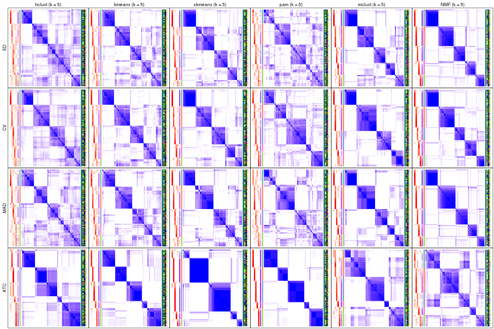</p>

</div>
<div id='tab-collect-consensus-heatmap-5'>
<pre><code class="r">collect_plots(res_list, k = 6, fun = consensus_heatmap, mc.cores = 4)
</code></pre>

<p>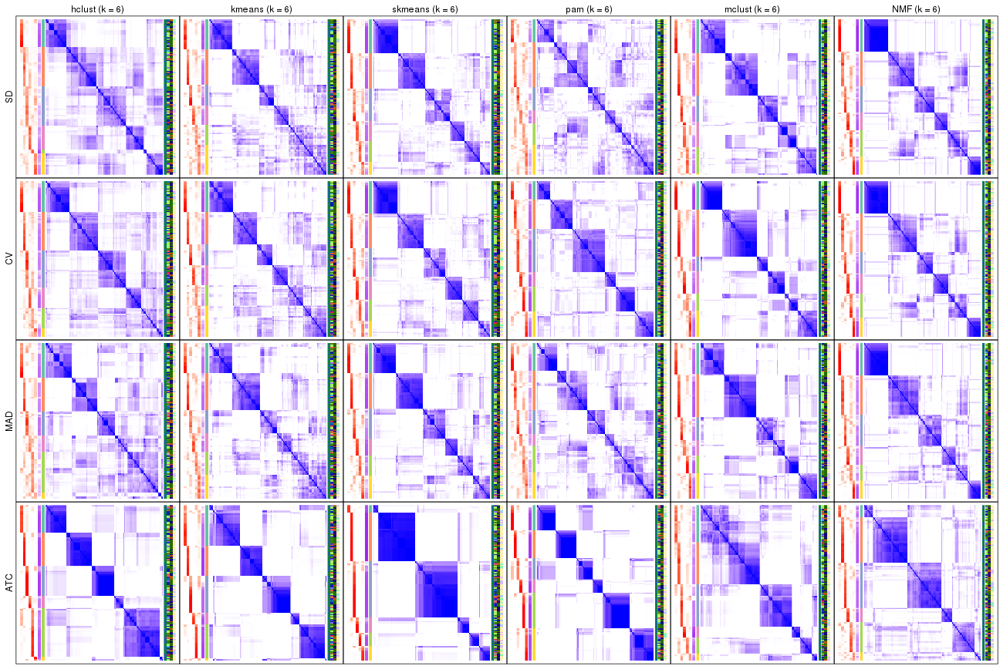</p>

</div>
</div>


### Membership heatmap

Membership heatmaps for all methods. ([What is a membership heatmap?](http://bioconductor.org/packages/devel/bioc/vignettes/cola/inst/doc/cola.html#toc_12))


<script>
$( function() {
	$( '#tabs-collect-membership-heatmap' ).tabs();
} );
</script>
<div id='tabs-collect-membership-heatmap'>
<ul>
<li><a href='#tab-collect-membership-heatmap-1'>k = 2</a></li>
<li><a href='#tab-collect-membership-heatmap-2'>k = 3</a></li>
<li><a href='#tab-collect-membership-heatmap-3'>k = 4</a></li>
<li><a href='#tab-collect-membership-heatmap-4'>k = 5</a></li>
<li><a href='#tab-collect-membership-heatmap-5'>k = 6</a></li>
</ul>
<div id='tab-collect-membership-heatmap-1'>
<pre><code class="r">collect_plots(res_list, k = 2, fun = membership_heatmap, mc.cores = 4)
</code></pre>

<p>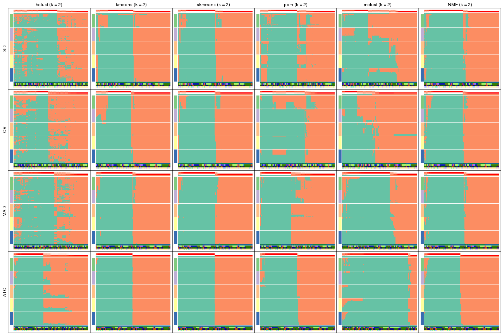</p>

</div>
<div id='tab-collect-membership-heatmap-2'>
<pre><code class="r">collect_plots(res_list, k = 3, fun = membership_heatmap, mc.cores = 4)
</code></pre>

<p>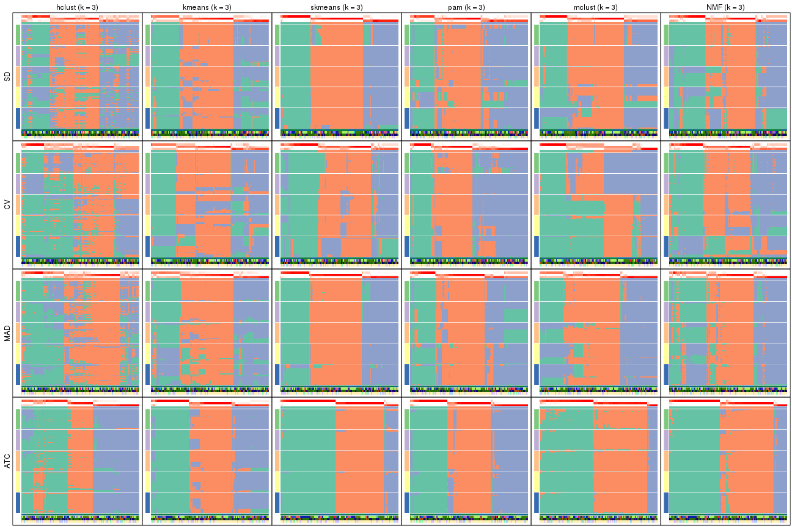</p>

</div>
<div id='tab-collect-membership-heatmap-3'>
<pre><code class="r">collect_plots(res_list, k = 4, fun = membership_heatmap, mc.cores = 4)
</code></pre>

<p>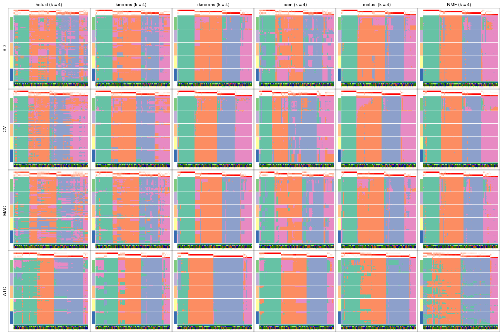</p>

</div>
<div id='tab-collect-membership-heatmap-4'>
<pre><code class="r">collect_plots(res_list, k = 5, fun = membership_heatmap, mc.cores = 4)
</code></pre>

<p>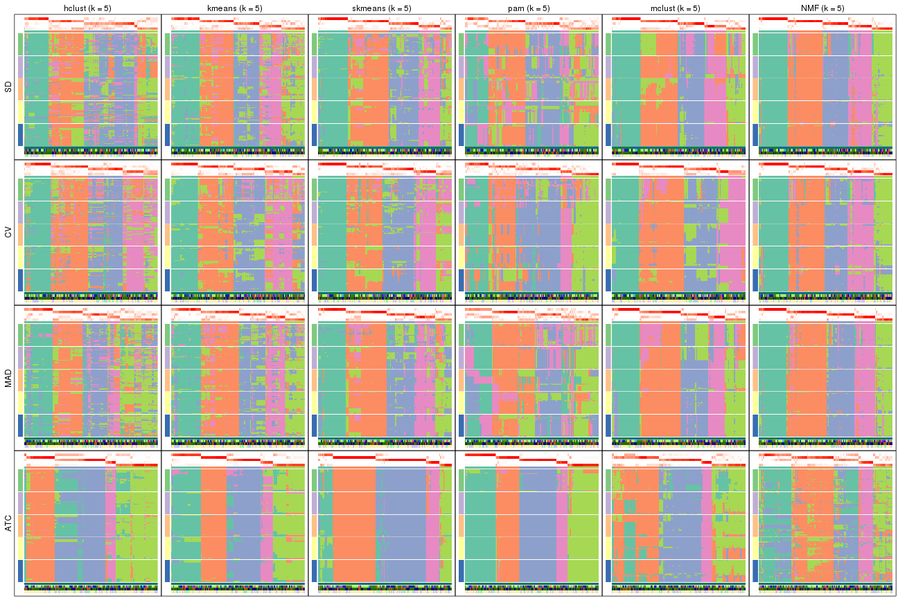</p>

</div>
<div id='tab-collect-membership-heatmap-5'>
<pre><code class="r">collect_plots(res_list, k = 6, fun = membership_heatmap, mc.cores = 4)
</code></pre>

<p>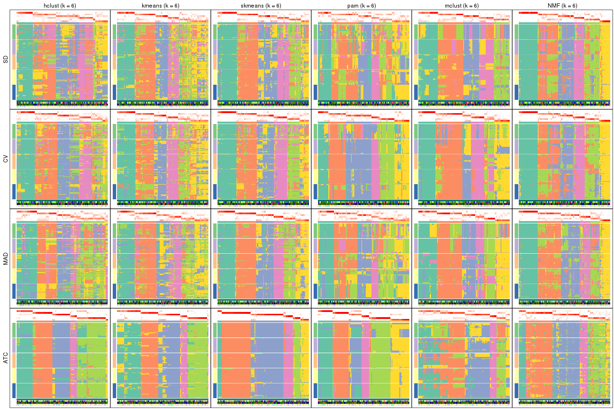</p>

</div>
</div>


### Signature heatmap

Signature heatmaps for all methods. ([What is a signature heatmap?](http://bioconductor.org/packages/devel/bioc/vignettes/cola/inst/doc/cola.html#toc_22))


Note in following heatmaps, rows are scaled.


<script>
$( function() {
	$( '#tabs-collect-get-signatures' ).tabs();
} );
</script>
<div id='tabs-collect-get-signatures'>
<ul>
<li><a href='#tab-collect-get-signatures-1'>k = 2</a></li>
<li><a href='#tab-collect-get-signatures-2'>k = 3</a></li>
<li><a href='#tab-collect-get-signatures-3'>k = 4</a></li>
<li><a href='#tab-collect-get-signatures-4'>k = 5</a></li>
<li><a href='#tab-collect-get-signatures-5'>k = 6</a></li>
</ul>
<div id='tab-collect-get-signatures-1'>
<pre><code class="r">collect_plots(res_list, k = 2, fun = get_signatures, mc.cores = 4)
</code></pre>

<p>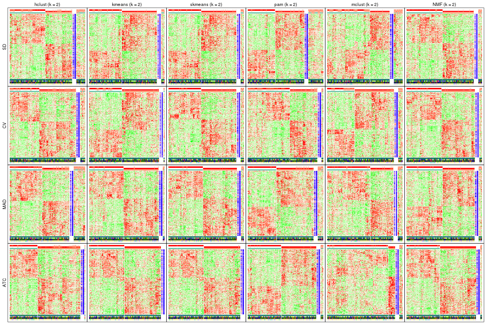</p>

</div>
<div id='tab-collect-get-signatures-2'>
<pre><code class="r">collect_plots(res_list, k = 3, fun = get_signatures, mc.cores = 4)
</code></pre>

<p>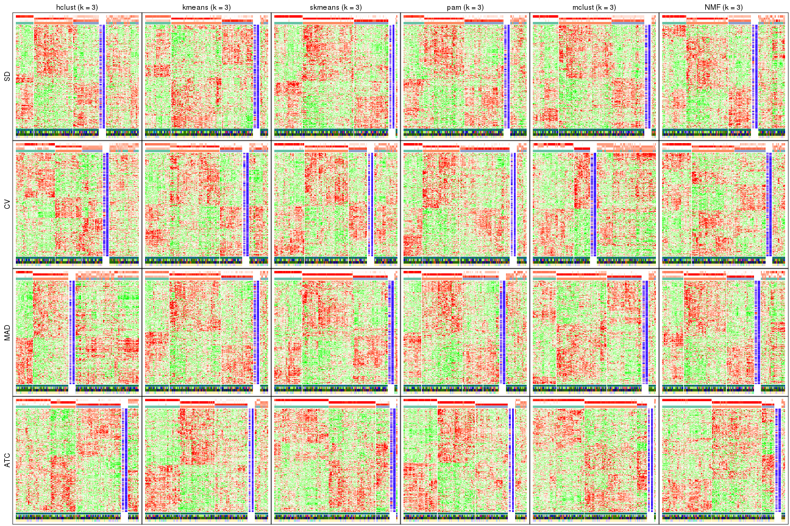</p>

</div>
<div id='tab-collect-get-signatures-3'>
<pre><code class="r">collect_plots(res_list, k = 4, fun = get_signatures, mc.cores = 4)
</code></pre>

<p>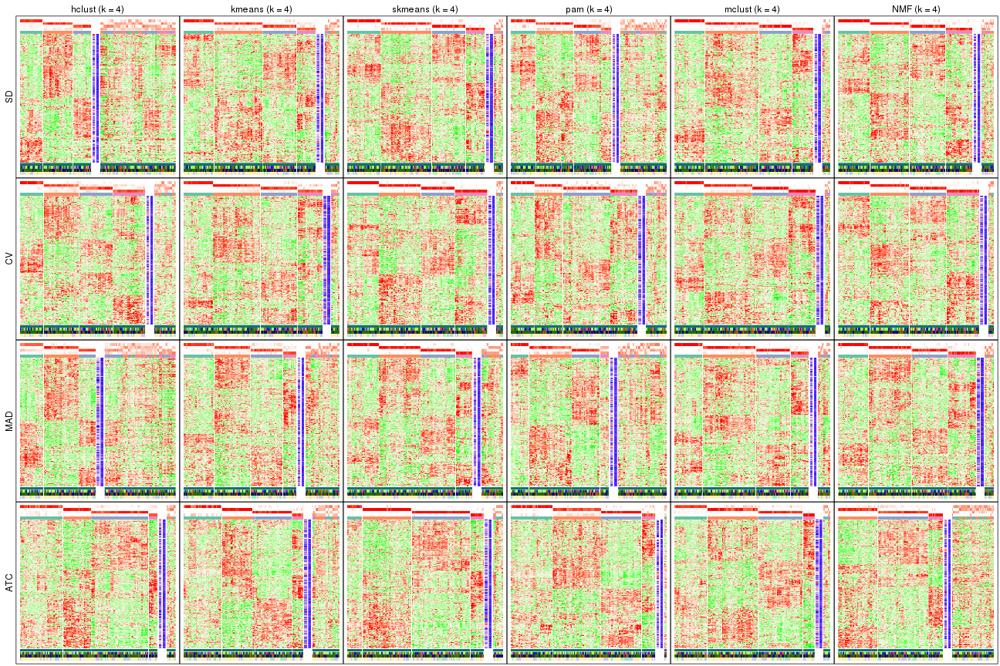</p>

</div>
<div id='tab-collect-get-signatures-4'>
<pre><code class="r">collect_plots(res_list, k = 5, fun = get_signatures, mc.cores = 4)
</code></pre>

<p>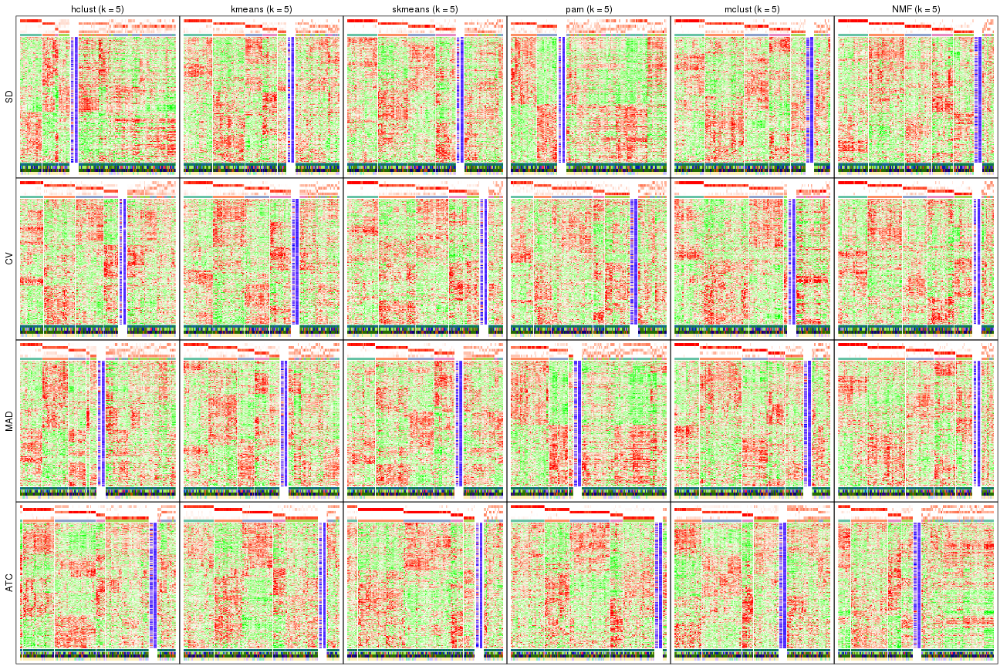</p>

</div>
<div id='tab-collect-get-signatures-5'>
<pre><code class="r">collect_plots(res_list, k = 6, fun = get_signatures, mc.cores = 4)
</code></pre>

<p>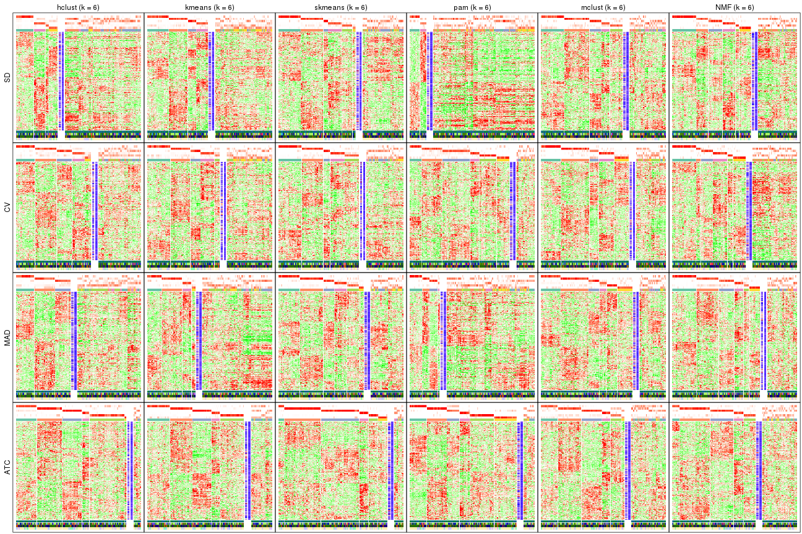</p>

</div>
</div>


### Statistics table

The statistics used for measuring the stability of consensus partitioning.
([How are they
defined?](http://bioconductor.org/packages/devel/bioc/vignettes/cola/inst/doc/cola.html#toc_13))


<script>
$( function() {
	$( '#tabs-get-stats-from-consensus-partition-list' ).tabs();
} );
</script>
<div id='tabs-get-stats-from-consensus-partition-list'>
<ul>
<li><a href='#tab-get-stats-from-consensus-partition-list-1'>k = 2</a></li>
<li><a href='#tab-get-stats-from-consensus-partition-list-2'>k = 3</a></li>
<li><a href='#tab-get-stats-from-consensus-partition-list-3'>k = 4</a></li>
<li><a href='#tab-get-stats-from-consensus-partition-list-4'>k = 5</a></li>
<li><a href='#tab-get-stats-from-consensus-partition-list-5'>k = 6</a></li>
</ul>
<div id='tab-get-stats-from-consensus-partition-list-1'>
<pre><code class="r">get_stats(res_list, k = 2)
</code></pre>

<pre><code>#&gt;             k 1-PAC mean_silhouette concordance area_increased  Rand Jaccard
#&gt; SD:NMF      2 0.846           0.908       0.962          0.502 0.497   0.497
#&gt; CV:NMF      2 0.802           0.900       0.957          0.503 0.497   0.497
#&gt; MAD:NMF     2 0.905           0.922       0.969          0.502 0.498   0.498
#&gt; ATC:NMF     2 0.984           0.949       0.980          0.501 0.497   0.497
#&gt; SD:skmeans  2 0.772           0.899       0.954          0.504 0.496   0.496
#&gt; CV:skmeans  2 0.758           0.899       0.956          0.504 0.496   0.496
#&gt; MAD:skmeans 2 0.921           0.934       0.972          0.504 0.496   0.496
#&gt; ATC:skmeans 2 1.000           0.994       0.997          0.504 0.496   0.496
#&gt; SD:mclust   2 0.316           0.619       0.817          0.419 0.531   0.531
#&gt; CV:mclust   2 0.542           0.778       0.888          0.428 0.516   0.516
#&gt; MAD:mclust  2 0.756           0.864       0.942          0.458 0.535   0.535
#&gt; ATC:mclust  2 0.878           0.901       0.956          0.224 0.794   0.794
#&gt; SD:kmeans   2 0.743           0.896       0.949          0.499 0.496   0.496
#&gt; CV:kmeans   2 0.725           0.878       0.939          0.486 0.497   0.497
#&gt; MAD:kmeans  2 0.876           0.928       0.969          0.504 0.496   0.496
#&gt; ATC:kmeans  2 1.000           0.992       0.996          0.504 0.496   0.496
#&gt; SD:pam      2 0.534           0.706       0.885          0.492 0.496   0.496
#&gt; CV:pam      2 0.330           0.842       0.877          0.468 0.516   0.516
#&gt; MAD:pam     2 0.719           0.872       0.936          0.493 0.511   0.511
#&gt; ATC:pam     2 0.921           0.937       0.974          0.502 0.496   0.496
#&gt; SD:hclust   2 0.268           0.698       0.848          0.471 0.511   0.511
#&gt; CV:hclust   2 0.277           0.777       0.872          0.465 0.499   0.499
#&gt; MAD:hclust  2 0.360           0.684       0.855          0.478 0.499   0.499
#&gt; ATC:hclust  2 0.526           0.872       0.923          0.475 0.516   0.516
</code></pre>

</div>
<div id='tab-get-stats-from-consensus-partition-list-2'>
<pre><code class="r">get_stats(res_list, k = 3)
</code></pre>

<pre><code>#&gt;             k 1-PAC mean_silhouette concordance area_increased  Rand Jaccard
#&gt; SD:NMF      3 0.535           0.621       0.783          0.305 0.758   0.552
#&gt; CV:NMF      3 0.559           0.705       0.782          0.314 0.753   0.543
#&gt; MAD:NMF     3 0.553           0.633       0.810          0.302 0.748   0.535
#&gt; ATC:NMF     3 0.898           0.907       0.961          0.204 0.865   0.739
#&gt; SD:skmeans  3 0.808           0.904       0.949          0.295 0.797   0.612
#&gt; CV:skmeans  3 0.509           0.646       0.823          0.307 0.819   0.649
#&gt; MAD:skmeans 3 0.917           0.921       0.957          0.291 0.807   0.628
#&gt; ATC:skmeans 3 1.000           0.957       0.975          0.190 0.891   0.783
#&gt; SD:mclust   3 0.549           0.819       0.859          0.470 0.662   0.452
#&gt; CV:mclust   3 0.470           0.407       0.697          0.364 0.603   0.375
#&gt; MAD:mclust  3 0.627           0.815       0.849          0.322 0.655   0.448
#&gt; ATC:mclust  3 0.871           0.920       0.953          1.551 0.573   0.480
#&gt; SD:kmeans   3 0.591           0.758       0.828          0.298 0.818   0.648
#&gt; CV:kmeans   3 0.538           0.694       0.786          0.331 0.797   0.616
#&gt; MAD:kmeans  3 0.593           0.753       0.798          0.285 0.805   0.627
#&gt; ATC:kmeans  3 0.837           0.809       0.908          0.310 0.733   0.512
#&gt; SD:pam      3 0.524           0.699       0.832          0.308 0.707   0.487
#&gt; CV:pam      3 0.589           0.770       0.883          0.356 0.820   0.663
#&gt; MAD:pam     3 0.613           0.687       0.847          0.312 0.687   0.466
#&gt; ATC:pam     3 0.884           0.854       0.941          0.332 0.735   0.515
#&gt; SD:hclust   3 0.253           0.541       0.708          0.308 0.832   0.671
#&gt; CV:hclust   3 0.271           0.533       0.672          0.294 0.831   0.670
#&gt; MAD:hclust  3 0.329           0.437       0.713          0.293 0.833   0.681
#&gt; ATC:hclust  3 0.668           0.797       0.890          0.360 0.821   0.657
</code></pre>

</div>
<div id='tab-get-stats-from-consensus-partition-list-3'>
<pre><code class="r">get_stats(res_list, k = 4)
</code></pre>

<pre><code>#&gt;             k 1-PAC mean_silhouette concordance area_increased  Rand Jaccard
#&gt; SD:NMF      4 0.790           0.831       0.915         0.1433 0.779   0.455
#&gt; CV:NMF      4 0.857           0.888       0.939         0.1375 0.782   0.455
#&gt; MAD:NMF     4 0.796           0.835       0.920         0.1418 0.826   0.545
#&gt; ATC:NMF     4 0.593           0.627       0.812         0.1565 0.885   0.725
#&gt; SD:skmeans  4 0.808           0.819       0.902         0.1366 0.881   0.675
#&gt; CV:skmeans  4 0.902           0.898       0.950         0.1422 0.784   0.472
#&gt; MAD:skmeans 4 0.801           0.760       0.897         0.1381 0.891   0.700
#&gt; ATC:skmeans 4 0.933           0.875       0.950         0.1336 0.883   0.715
#&gt; SD:mclust   4 0.728           0.830       0.903         0.1864 0.855   0.627
#&gt; CV:mclust   4 0.830           0.886       0.940         0.2696 0.707   0.354
#&gt; MAD:mclust  4 0.741           0.803       0.905         0.2018 0.865   0.650
#&gt; ATC:mclust  4 0.730           0.822       0.900         0.2427 0.799   0.558
#&gt; SD:kmeans   4 0.603           0.704       0.825         0.1428 0.885   0.690
#&gt; CV:kmeans   4 0.690           0.825       0.870         0.1437 0.832   0.570
#&gt; MAD:kmeans  4 0.575           0.601       0.792         0.1430 0.860   0.629
#&gt; ATC:kmeans  4 0.738           0.662       0.852         0.1047 0.895   0.703
#&gt; SD:pam      4 0.536           0.517       0.753         0.1445 0.873   0.662
#&gt; CV:pam      4 0.544           0.693       0.834         0.1531 0.847   0.616
#&gt; MAD:pam     4 0.556           0.494       0.742         0.1393 0.858   0.631
#&gt; ATC:pam     4 0.802           0.822       0.900         0.0926 0.894   0.704
#&gt; SD:hclust   4 0.416           0.413       0.681         0.1627 0.888   0.694
#&gt; CV:hclust   4 0.429           0.668       0.794         0.2029 0.827   0.554
#&gt; MAD:hclust  4 0.390           0.399       0.628         0.1563 0.765   0.475
#&gt; ATC:hclust  4 0.663           0.789       0.877         0.0824 0.947   0.849
</code></pre>

</div>
<div id='tab-get-stats-from-consensus-partition-list-4'>
<pre><code class="r">get_stats(res_list, k = 5)
</code></pre>

<pre><code>#&gt;             k 1-PAC mean_silhouette concordance area_increased  Rand Jaccard
#&gt; SD:NMF      5 0.803           0.792       0.899         0.0604 0.882   0.584
#&gt; CV:NMF      5 0.759           0.785       0.879         0.0596 0.918   0.691
#&gt; MAD:NMF     5 0.795           0.797       0.902         0.0574 0.875   0.575
#&gt; ATC:NMF     5 0.569           0.462       0.707         0.0841 0.835   0.534
#&gt; SD:skmeans  5 0.700           0.620       0.792         0.0710 0.948   0.809
#&gt; CV:skmeans  5 0.714           0.713       0.803         0.0586 0.924   0.714
#&gt; MAD:skmeans 5 0.725           0.618       0.794         0.0710 0.902   0.662
#&gt; ATC:skmeans 5 0.869           0.802       0.914         0.0726 0.939   0.809
#&gt; SD:mclust   5 0.697           0.702       0.822         0.0856 0.917   0.700
#&gt; CV:mclust   5 0.730           0.676       0.802         0.0555 0.982   0.932
#&gt; MAD:mclust  5 0.730           0.701       0.820         0.0812 0.878   0.598
#&gt; ATC:mclust  5 0.609           0.551       0.771         0.0618 0.993   0.977
#&gt; SD:kmeans   5 0.617           0.562       0.752         0.0731 0.878   0.590
#&gt; CV:kmeans   5 0.682           0.600       0.734         0.0727 0.942   0.780
#&gt; MAD:kmeans  5 0.628           0.567       0.746         0.0730 0.882   0.599
#&gt; ATC:kmeans  5 0.812           0.813       0.886         0.0716 0.851   0.527
#&gt; SD:pam      5 0.523           0.338       0.632         0.0686 0.872   0.587
#&gt; CV:pam      5 0.560           0.621       0.776         0.0627 0.869   0.584
#&gt; MAD:pam     5 0.554           0.380       0.615         0.0651 0.833   0.498
#&gt; ATC:pam     5 0.953           0.917       0.956         0.0732 0.889   0.633
#&gt; SD:hclust   5 0.477           0.420       0.648         0.0692 0.818   0.498
#&gt; CV:hclust   5 0.532           0.561       0.723         0.0691 0.960   0.841
#&gt; MAD:hclust  5 0.506           0.444       0.655         0.0832 0.795   0.416
#&gt; ATC:hclust  5 0.703           0.640       0.822         0.0639 0.984   0.947
</code></pre>

</div>
<div id='tab-get-stats-from-consensus-partition-list-5'>
<pre><code class="r">get_stats(res_list, k = 6)
</code></pre>

<pre><code>#&gt;             k 1-PAC mean_silhouette concordance area_increased  Rand Jaccard
#&gt; SD:NMF      6 0.732           0.595       0.790         0.0409 0.875   0.496
#&gt; CV:NMF      6 0.752           0.597       0.766         0.0402 0.877   0.507
#&gt; MAD:NMF     6 0.711           0.618       0.764         0.0454 0.939   0.730
#&gt; ATC:NMF     6 0.641           0.582       0.775         0.0495 0.847   0.485
#&gt; SD:skmeans  6 0.701           0.573       0.747         0.0416 0.920   0.665
#&gt; CV:skmeans  6 0.711           0.617       0.780         0.0413 0.927   0.677
#&gt; MAD:skmeans 6 0.722           0.647       0.800         0.0408 0.890   0.556
#&gt; ATC:skmeans 6 0.920           0.835       0.925         0.0352 0.973   0.902
#&gt; SD:mclust   6 0.688           0.525       0.739         0.0383 0.970   0.861
#&gt; CV:mclust   6 0.746           0.629       0.773         0.0431 0.912   0.661
#&gt; MAD:mclust  6 0.705           0.630       0.778         0.0408 0.944   0.750
#&gt; ATC:mclust  6 0.617           0.554       0.702         0.0465 0.916   0.709
#&gt; SD:kmeans   6 0.646           0.463       0.673         0.0422 0.905   0.589
#&gt; CV:kmeans   6 0.659           0.554       0.713         0.0443 0.890   0.551
#&gt; MAD:kmeans  6 0.640           0.432       0.650         0.0427 0.898   0.573
#&gt; ATC:kmeans  6 0.813           0.665       0.845         0.0402 0.962   0.833
#&gt; SD:pam      6 0.554           0.228       0.573         0.0431 0.780   0.298
#&gt; CV:pam      6 0.707           0.675       0.810         0.0547 0.902   0.612
#&gt; MAD:pam     6 0.598           0.357       0.632         0.0435 0.835   0.413
#&gt; ATC:pam     6 0.835           0.789       0.874         0.0484 0.947   0.762
#&gt; SD:hclust   6 0.535           0.434       0.609         0.0419 0.855   0.520
#&gt; CV:hclust   6 0.575           0.517       0.690         0.0383 0.949   0.777
#&gt; MAD:hclust  6 0.574           0.396       0.579         0.0405 0.895   0.592
#&gt; ATC:hclust  6 0.756           0.776       0.874         0.0547 0.925   0.742
</code></pre>

</div>
</div>

Following heatmap plots the partition for each combination of methods and the
lightness correspond to the silhouette scores for samples in each method. On
top the consensus subgroup is inferred from all methods by taking the mean
silhouette scores as weight.


<script>
$( function() {
	$( '#tabs-collect-stats-from-consensus-partition-list' ).tabs();
} );
</script>
<div id='tabs-collect-stats-from-consensus-partition-list'>
<ul>
<li><a href='#tab-collect-stats-from-consensus-partition-list-1'>k = 2</a></li>
<li><a href='#tab-collect-stats-from-consensus-partition-list-2'>k = 3</a></li>
<li><a href='#tab-collect-stats-from-consensus-partition-list-3'>k = 4</a></li>
<li><a href='#tab-collect-stats-from-consensus-partition-list-4'>k = 5</a></li>
<li><a href='#tab-collect-stats-from-consensus-partition-list-5'>k = 6</a></li>
</ul>
<div id='tab-collect-stats-from-consensus-partition-list-1'>
<pre><code class="r">collect_stats(res_list, k = 2)
</code></pre>

<p>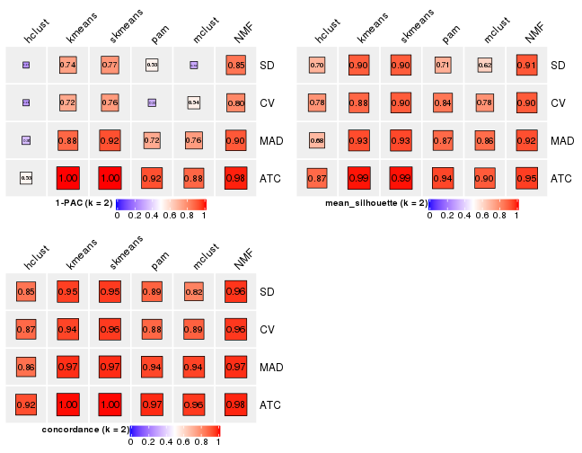</p>

</div>
<div id='tab-collect-stats-from-consensus-partition-list-2'>
<pre><code class="r">collect_stats(res_list, k = 3)
</code></pre>

<p>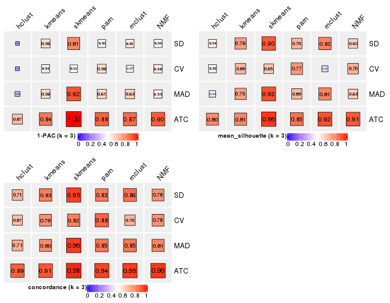</p>

</div>
<div id='tab-collect-stats-from-consensus-partition-list-3'>
<pre><code class="r">collect_stats(res_list, k = 4)
</code></pre>

<p>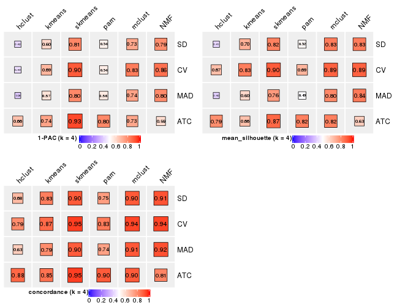</p>

</div>
<div id='tab-collect-stats-from-consensus-partition-list-4'>
<pre><code class="r">collect_stats(res_list, k = 5)
</code></pre>

<p>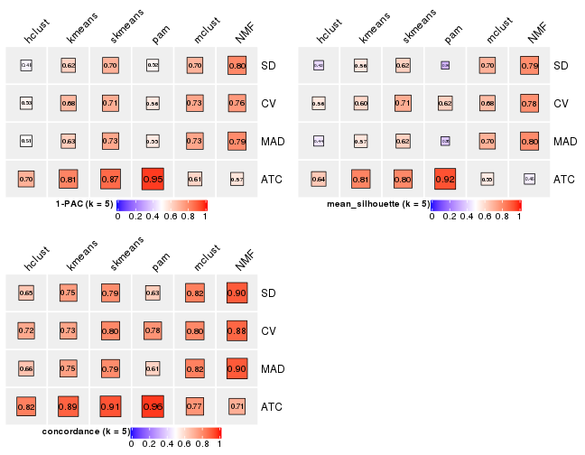</p>

</div>
<div id='tab-collect-stats-from-consensus-partition-list-5'>
<pre><code class="r">collect_stats(res_list, k = 6)
</code></pre>

<p>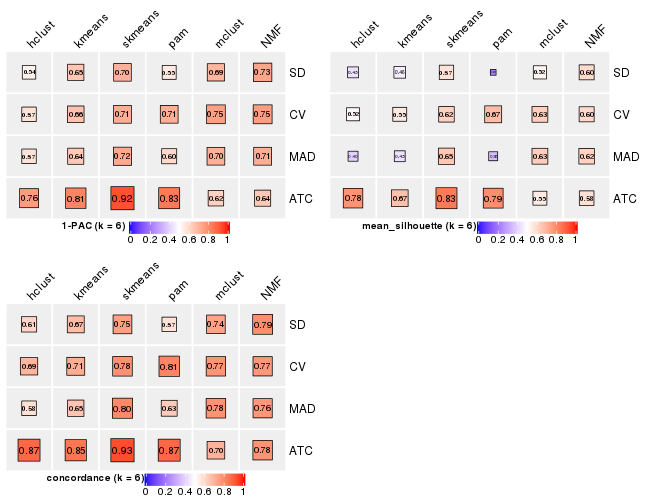</p>

</div>
</div>

### Partition from all methods


Collect partitions from all methods:


<script>
$( function() {
	$( '#tabs-collect-classes-from-consensus-partition-list' ).tabs();
} );
</script>
<div id='tabs-collect-classes-from-consensus-partition-list'>
<ul>
<li><a href='#tab-collect-classes-from-consensus-partition-list-1'>k = 2</a></li>
<li><a href='#tab-collect-classes-from-consensus-partition-list-2'>k = 3</a></li>
<li><a href='#tab-collect-classes-from-consensus-partition-list-3'>k = 4</a></li>
<li><a href='#tab-collect-classes-from-consensus-partition-list-4'>k = 5</a></li>
<li><a href='#tab-collect-classes-from-consensus-partition-list-5'>k = 6</a></li>
</ul>
<div id='tab-collect-classes-from-consensus-partition-list-1'>
<pre><code class="r">collect_classes(res_list, k = 2)
</code></pre>

<p>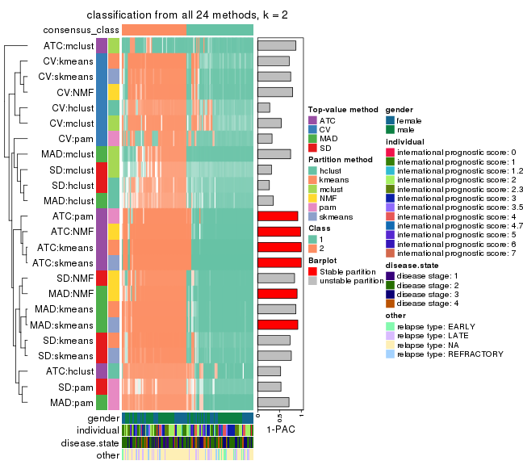</p>

</div>
<div id='tab-collect-classes-from-consensus-partition-list-2'>
<pre><code class="r">collect_classes(res_list, k = 3)
</code></pre>

<p>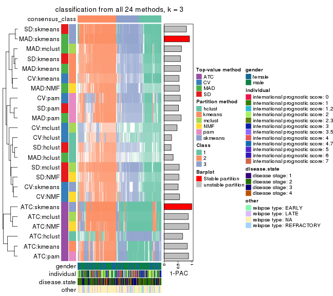</p>

</div>
<div id='tab-collect-classes-from-consensus-partition-list-3'>
<pre><code class="r">collect_classes(res_list, k = 4)
</code></pre>

<p>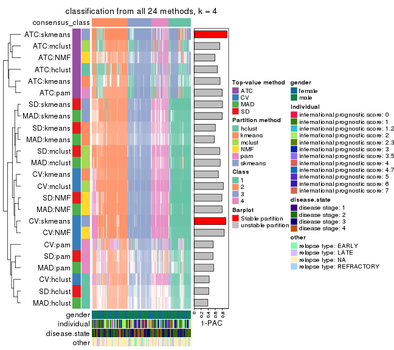</p>

</div>
<div id='tab-collect-classes-from-consensus-partition-list-4'>
<pre><code class="r">collect_classes(res_list, k = 5)
</code></pre>

<p>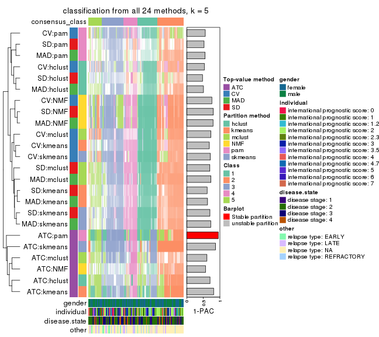</p>

</div>
<div id='tab-collect-classes-from-consensus-partition-list-5'>
<pre><code class="r">collect_classes(res_list, k = 6)
</code></pre>

<p>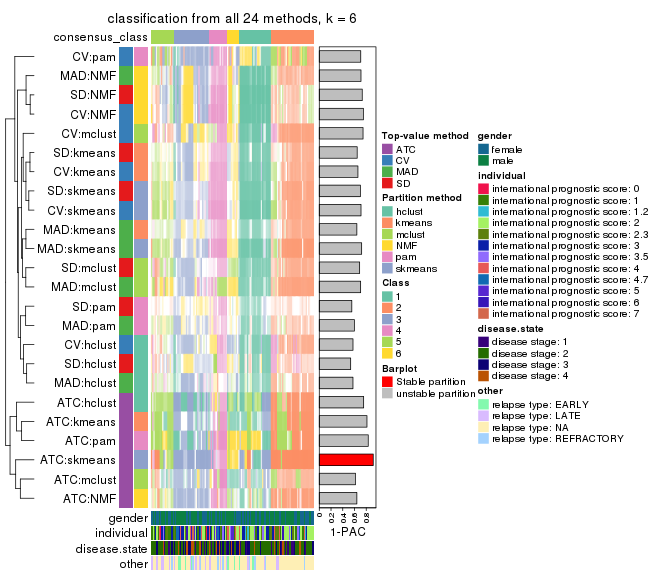</p>

</div>
</div>


### Top rows overlap


Overlap of top rows from different top-row methods:


<script>
$( function() {
	$( '#tabs-top-rows-overlap-by-euler' ).tabs();
} );
</script>
<div id='tabs-top-rows-overlap-by-euler'>
<ul>
<li><a href='#tab-top-rows-overlap-by-euler-1'>top_n = 1000</a></li>
<li><a href='#tab-top-rows-overlap-by-euler-2'>top_n = 2000</a></li>
<li><a href='#tab-top-rows-overlap-by-euler-3'>top_n = 3000</a></li>
<li><a href='#tab-top-rows-overlap-by-euler-4'>top_n = 4000</a></li>
<li><a href='#tab-top-rows-overlap-by-euler-5'>top_n = 5000</a></li>
</ul>
<div id='tab-top-rows-overlap-by-euler-1'>
<pre><code class="r">top_rows_overlap(res_list, top_n = 1000, method = &quot;euler&quot;)
</code></pre>

<p>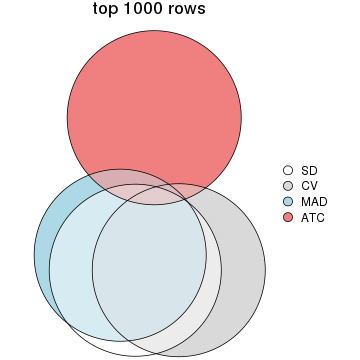</p>

</div>
<div id='tab-top-rows-overlap-by-euler-2'>
<pre><code class="r">top_rows_overlap(res_list, top_n = 2000, method = &quot;euler&quot;)
</code></pre>

<p>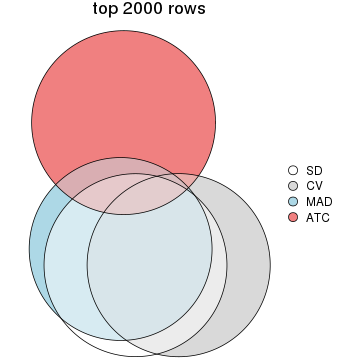</p>

</div>
<div id='tab-top-rows-overlap-by-euler-3'>
<pre><code class="r">top_rows_overlap(res_list, top_n = 3000, method = &quot;euler&quot;)
</code></pre>

<p>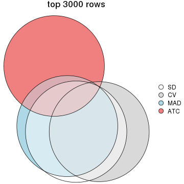</p>

</div>
<div id='tab-top-rows-overlap-by-euler-4'>
<pre><code class="r">top_rows_overlap(res_list, top_n = 4000, method = &quot;euler&quot;)
</code></pre>

<p>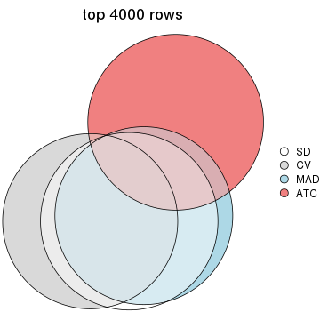</p>

</div>
<div id='tab-top-rows-overlap-by-euler-5'>
<pre><code class="r">top_rows_overlap(res_list, top_n = 5000, method = &quot;euler&quot;)
</code></pre>

<p>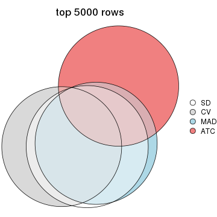</p>

</div>
</div>

Also visualize the correspondance of rankings between different top-row methods:


<script>
$( function() {
	$( '#tabs-top-rows-overlap-by-correspondance' ).tabs();
} );
</script>
<div id='tabs-top-rows-overlap-by-correspondance'>
<ul>
<li><a href='#tab-top-rows-overlap-by-correspondance-1'>top_n = 1000</a></li>
<li><a href='#tab-top-rows-overlap-by-correspondance-2'>top_n = 2000</a></li>
<li><a href='#tab-top-rows-overlap-by-correspondance-3'>top_n = 3000</a></li>
<li><a href='#tab-top-rows-overlap-by-correspondance-4'>top_n = 4000</a></li>
<li><a href='#tab-top-rows-overlap-by-correspondance-5'>top_n = 5000</a></li>
</ul>
<div id='tab-top-rows-overlap-by-correspondance-1'>
<pre><code class="r">top_rows_overlap(res_list, top_n = 1000, method = &quot;correspondance&quot;)
</code></pre>

<p>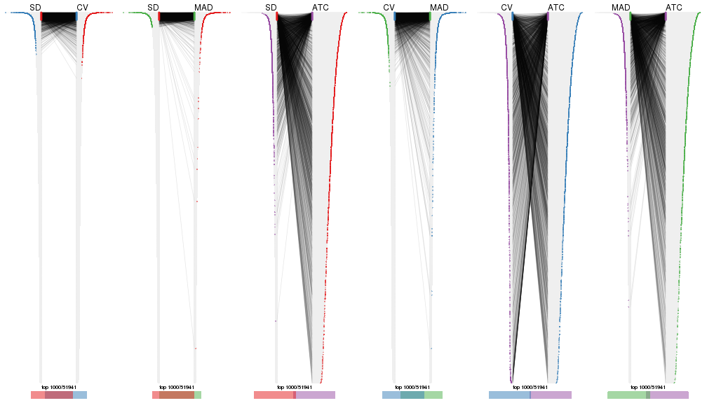</p>

</div>
<div id='tab-top-rows-overlap-by-correspondance-2'>
<pre><code class="r">top_rows_overlap(res_list, top_n = 2000, method = &quot;correspondance&quot;)
</code></pre>

<p>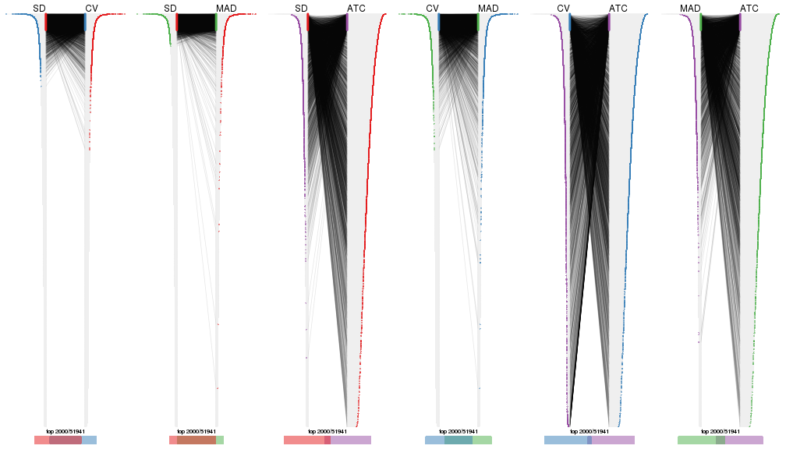</p>

</div>
<div id='tab-top-rows-overlap-by-correspondance-3'>
<pre><code class="r">top_rows_overlap(res_list, top_n = 3000, method = &quot;correspondance&quot;)
</code></pre>

<p>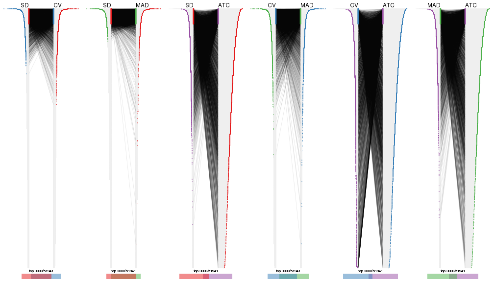</p>

</div>
<div id='tab-top-rows-overlap-by-correspondance-4'>
<pre><code class="r">top_rows_overlap(res_list, top_n = 4000, method = &quot;correspondance&quot;)
</code></pre>

<p>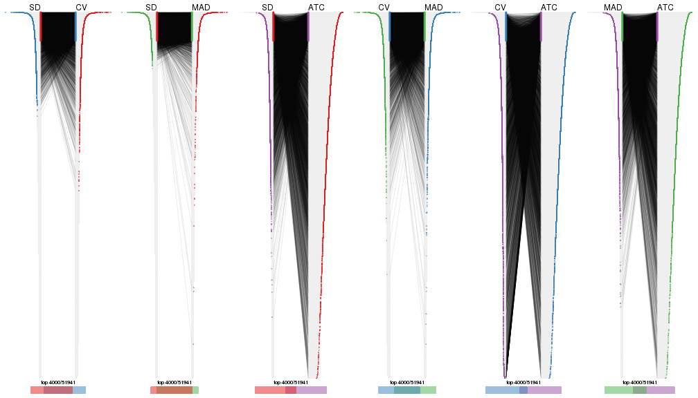</p>

</div>
<div id='tab-top-rows-overlap-by-correspondance-5'>
<pre><code class="r">top_rows_overlap(res_list, top_n = 5000, method = &quot;correspondance&quot;)
</code></pre>

<p>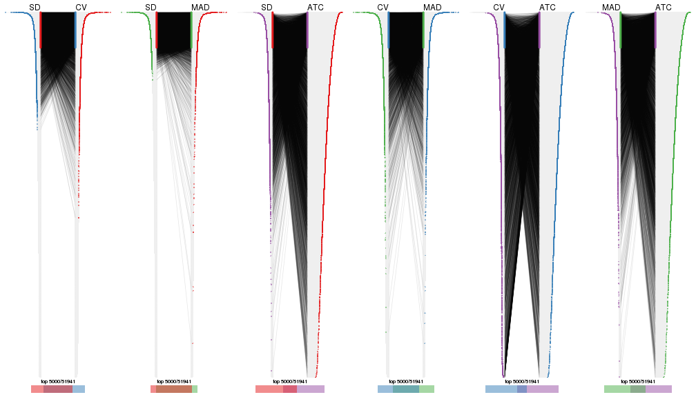</p>

</div>
</div>


Heatmaps of the top rows:


<script>
$( function() {
	$( '#tabs-top-rows-heatmap' ).tabs();
} );
</script>
<div id='tabs-top-rows-heatmap'>
<ul>
<li><a href='#tab-top-rows-heatmap-1'>top_n = 1000</a></li>
<li><a href='#tab-top-rows-heatmap-2'>top_n = 2000</a></li>
<li><a href='#tab-top-rows-heatmap-3'>top_n = 3000</a></li>
<li><a href='#tab-top-rows-heatmap-4'>top_n = 4000</a></li>
<li><a href='#tab-top-rows-heatmap-5'>top_n = 5000</a></li>
</ul>
<div id='tab-top-rows-heatmap-1'>
<pre><code class="r">top_rows_heatmap(res_list, top_n = 1000)
</code></pre>

<p>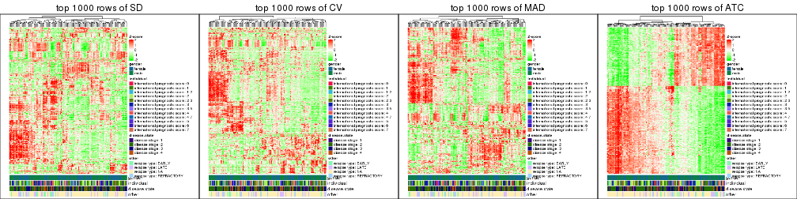</p>

</div>
<div id='tab-top-rows-heatmap-2'>
<pre><code class="r">top_rows_heatmap(res_list, top_n = 2000)
</code></pre>

<p>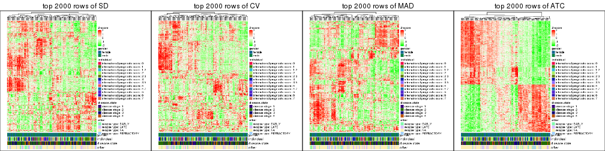</p>

</div>
<div id='tab-top-rows-heatmap-3'>
<pre><code class="r">top_rows_heatmap(res_list, top_n = 3000)
</code></pre>

<p>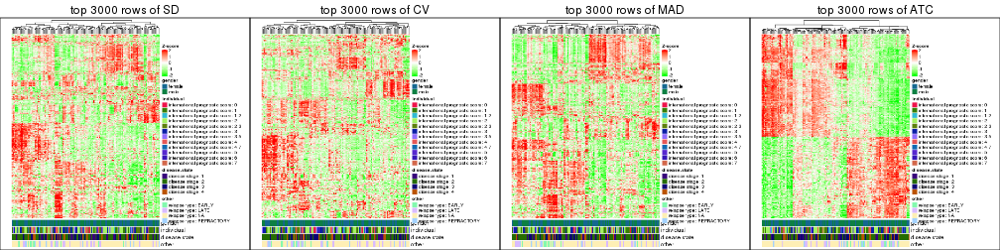</p>

</div>
<div id='tab-top-rows-heatmap-4'>
<pre><code class="r">top_rows_heatmap(res_list, top_n = 4000)
</code></pre>

<p>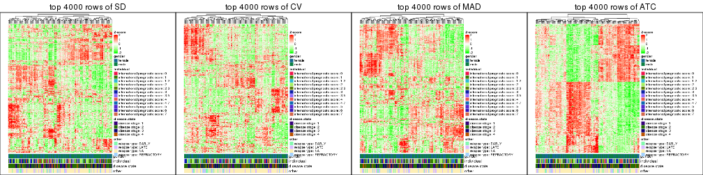</p>

</div>
<div id='tab-top-rows-heatmap-5'>
<pre><code class="r">top_rows_heatmap(res_list, top_n = 5000)
</code></pre>

<p>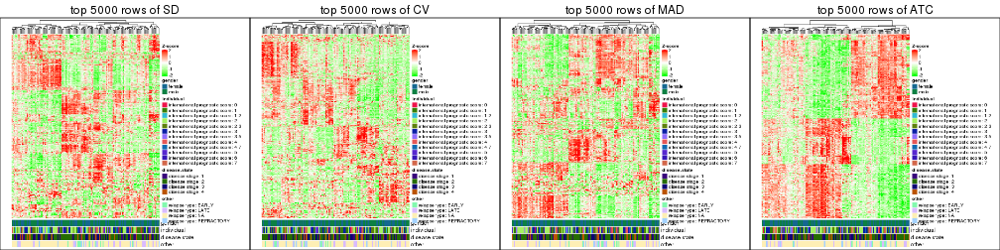</p>

</div>
</div>


### Test to known annotations


Test correlation between subgroups and known annotations. If the known
annotation is numeric, one-way ANOVA test is applied, and if the known
annotation is discrete, chi-squared contingency table test is applied.


<script>
$( function() {
	$( '#tabs-test-to-known-factors-from-consensus-partition-list' ).tabs();
} );
</script>
<div id='tabs-test-to-known-factors-from-consensus-partition-list'>
<ul>
<li><a href='#tab-test-to-known-factors-from-consensus-partition-list-1'>k = 2</a></li>
<li><a href='#tab-test-to-known-factors-from-consensus-partition-list-2'>k = 3</a></li>
<li><a href='#tab-test-to-known-factors-from-consensus-partition-list-3'>k = 4</a></li>
<li><a href='#tab-test-to-known-factors-from-consensus-partition-list-4'>k = 5</a></li>
<li><a href='#tab-test-to-known-factors-from-consensus-partition-list-5'>k = 6</a></li>
</ul>
<div id='tab-test-to-known-factors-from-consensus-partition-list-1'>
<pre><code class="r">test_to_known_factors(res_list, k = 2)
</code></pre>

<pre><code>#&gt;               n gender(p) individual(p) disease.state(p) other(p) k
#&gt; SD:NMF      123     0.367         0.828           0.2493  0.07250 2
#&gt; CV:NMF      125     0.812         0.938           0.0500  0.02184 2
#&gt; MAD:NMF     124     0.404         0.861           0.5666  0.02328 2
#&gt; ATC:NMF     127     0.617         0.808           0.5560  0.02365 2
#&gt; SD:skmeans  124     0.445         0.781           0.0387  0.07083 2
#&gt; CV:skmeans  124     0.436         0.874           0.0331  0.05345 2
#&gt; MAD:skmeans 125     0.535         0.801           0.5132  0.09377 2
#&gt; ATC:skmeans 130     0.581         0.794           0.5667  0.01764 2
#&gt; SD:mclust   114     0.788         0.760           0.3326  0.04034 2
#&gt; CV:mclust   122     0.329         0.695           0.0464  0.01225 2
#&gt; MAD:mclust  121     0.576         0.793           0.2405  0.07140 2
#&gt; ATC:mclust  124     0.575         0.305           0.8129  0.52240 2
#&gt; SD:kmeans   124     0.445         0.781           0.0387  0.07083 2
#&gt; CV:kmeans   128     0.414         0.813           0.0230  0.04068 2
#&gt; MAD:kmeans  127     0.647         0.732           0.4082  0.10462 2
#&gt; ATC:kmeans  130     0.581         0.794           0.5667  0.01764 2
#&gt; SD:pam      103     0.732         0.761           0.4224  0.05508 2
#&gt; CV:pam      127     0.955         0.813           0.9757  0.13701 2
#&gt; MAD:pam     120     0.586         0.779           0.3203  0.02920 2
#&gt; ATC:pam     125     0.902         0.946           0.7638  0.02564 2
#&gt; SD:hclust   114     0.444         0.698           0.5020  0.03393 2
#&gt; CV:hclust   121     0.171         0.822           0.0416  0.00286 2
#&gt; MAD:hclust  109     0.852         0.932           0.2412  0.02037 2
#&gt; ATC:hclust  129     0.338         0.374           0.2267  0.00222 2
</code></pre>

</div>
<div id='tab-test-to-known-factors-from-consensus-partition-list-2'>
<pre><code class="r">test_to_known_factors(res_list, k = 3)
</code></pre>

<pre><code>#&gt;               n gender(p) individual(p) disease.state(p) other(p) k
#&gt; SD:NMF      100     0.286        0.1997           0.0641  0.06200 3
#&gt; CV:NMF      116     0.200        0.4109           0.1165  0.27825 3
#&gt; MAD:NMF     103     0.127        0.1158           0.0359  0.09407 3
#&gt; ATC:NMF     126     0.425        0.5862           0.8324  0.13112 3
#&gt; SD:skmeans  128     0.439        0.1093           0.1389  0.12221 3
#&gt; CV:skmeans  104     0.440        0.3754           0.1437  0.10332 3
#&gt; MAD:skmeans 127     0.431        0.0918           0.1625  0.11169 3
#&gt; ATC:skmeans 129     0.424        0.9584           0.5868  0.05873 3
#&gt; SD:mclust   125     0.402        0.2130           0.1042  0.30469 3
#&gt; CV:mclust    64     0.958        0.8245           0.3751  0.53739 3
#&gt; MAD:mclust  122     0.512        0.1916           0.1879  0.12437 3
#&gt; ATC:mclust  128     0.512        0.7133           0.7900  0.03483 3
#&gt; SD:kmeans   121     0.533        0.2633           0.2487  0.39668 3
#&gt; CV:kmeans   109     0.218        0.2786           0.0709  0.49968 3
#&gt; MAD:kmeans  121     0.571        0.5229           0.2044  0.31412 3
#&gt; ATC:kmeans  115     0.346        0.5569           0.7123  0.25984 3
#&gt; SD:pam      112     0.878        0.4606           0.5269  0.19144 3
#&gt; CV:pam      119     0.712        0.7567           0.3034  0.26615 3
#&gt; MAD:pam     107     0.885        0.5338           0.4316  0.28099 3
#&gt; ATC:pam     117     0.596        0.5418           0.6178  0.29943 3
#&gt; SD:hclust    93     0.807        0.4022           0.0806  0.43297 3
#&gt; CV:hclust    97     0.491        0.8605           0.0953  0.03254 3
#&gt; MAD:hclust   59     0.913        0.8384           0.1407  0.13826 3
#&gt; ATC:hclust  118     0.288        0.5807           0.4357  0.00924 3
</code></pre>

</div>
<div id='tab-test-to-known-factors-from-consensus-partition-list-3'>
<pre><code class="r">test_to_known_factors(res_list, k = 4)
</code></pre>

<pre><code>#&gt;               n gender(p) individual(p) disease.state(p) other(p) k
#&gt; SD:NMF      119     0.268         0.129          0.19996   0.1713 4
#&gt; CV:NMF      125     0.212         0.120          0.20230   0.0653 4
#&gt; MAD:NMF     122     0.267         0.252          0.26298   0.0693 4
#&gt; ATC:NMF      93     0.348         0.523          0.93279   0.0486 4
#&gt; SD:skmeans  122     0.276         0.514          0.18293   0.1530 4
#&gt; CV:skmeans  124     0.156         0.116          0.08913   0.2375 4
#&gt; MAD:skmeans 111     0.217         0.386          0.16597   0.0888 4
#&gt; ATC:skmeans 121     0.560         0.658          0.91202   0.3357 4
#&gt; SD:mclust   123     0.246         0.264          0.04653   0.1432 4
#&gt; CV:mclust   125     0.337         0.247          0.03598   0.0492 4
#&gt; MAD:mclust  119     0.250         0.325          0.17638   0.1256 4
#&gt; ATC:mclust  124     0.859         0.462          0.94975   0.2203 4
#&gt; SD:kmeans   117     0.153         0.255          0.07441   0.0852 4
#&gt; CV:kmeans   123     0.234         0.167          0.04961   0.0522 4
#&gt; MAD:kmeans  100     0.351         0.279          0.24056   0.1138 4
#&gt; ATC:kmeans  106     0.514         0.852          0.81642   0.1850 4
#&gt; SD:pam       89     0.951         0.501          0.11185   0.2450 4
#&gt; CV:pam      112     0.819         0.895          0.13752   0.5011 4
#&gt; MAD:pam      87     0.992         0.380          0.24745   0.0850 4
#&gt; ATC:pam     128     0.764         0.560          0.87502   0.2907 4
#&gt; SD:hclust    63     0.486         0.444          0.00129   0.3327 4
#&gt; CV:hclust   111     0.389         0.515          0.00430   0.0314 4
#&gt; MAD:hclust   67     0.513         0.364          0.01040   0.2254 4
#&gt; ATC:hclust  122     0.387         0.778          0.60925   0.0410 4
</code></pre>

</div>
<div id='tab-test-to-known-factors-from-consensus-partition-list-4'>
<pre><code class="r">test_to_known_factors(res_list, k = 5)
</code></pre>

<pre><code>#&gt;               n gender(p) individual(p) disease.state(p) other(p) k
#&gt; SD:NMF      120     0.619       0.07740          0.12791 0.170055 5
#&gt; CV:NMF      119     0.636       0.05147          0.12450 0.037886 5
#&gt; MAD:NMF     119     0.734       0.09127          0.04153 0.079088 5
#&gt; ATC:NMF      66     0.639       0.51458          0.39410 0.314818 5
#&gt; SD:skmeans   96     0.113       0.18459          0.16342 0.008311 5
#&gt; CV:skmeans  117     0.161       0.21904          0.06524 0.138909 5
#&gt; MAD:skmeans  95     0.338       0.13993          0.46553 0.104140 5
#&gt; ATC:skmeans 113     0.627       0.34321          0.40110 0.425877 5
#&gt; SD:mclust   116     0.633       0.40885          0.59219 0.024642 5
#&gt; CV:mclust   100     0.057       0.02355          0.02658 0.122307 5
#&gt; MAD:mclust  114     0.980       0.38729          0.41829 0.161393 5
#&gt; ATC:mclust   92     0.945       0.37334          0.64382 0.791563 5
#&gt; SD:kmeans    91     0.593       0.27210          0.09700 0.026396 5
#&gt; CV:kmeans    95     0.145       0.05381          0.01674 0.000324 5
#&gt; MAD:kmeans   85     0.832       0.29058          0.40909 0.060066 5
#&gt; ATC:kmeans  119     0.667       0.96662          0.76289 0.084526 5
#&gt; SD:pam       41     0.538       0.59162          0.44362 0.072546 5
#&gt; CV:pam      105     0.890       0.65529          0.23493 0.593445 5
#&gt; MAD:pam      55     0.785       0.66803          0.18343 0.087748 5
#&gt; ATC:pam     127     0.675       0.74573          0.95270 0.416991 5
#&gt; SD:hclust    44     0.404       0.00255          0.46874 0.862222 5
#&gt; CV:hclust    87     0.357       0.50596          0.00454 0.054670 5
#&gt; MAD:hclust   68     0.919       0.57128          0.04100 0.496292 5
#&gt; ATC:hclust  114     0.182       0.66135          0.63713 0.036671 5
</code></pre>

</div>
<div id='tab-test-to-known-factors-from-consensus-partition-list-5'>
<pre><code class="r">test_to_known_factors(res_list, k = 6)
</code></pre>

<pre><code>#&gt;               n gender(p) individual(p) disease.state(p) other(p) k
#&gt; SD:NMF       87     0.944        0.2416           0.2491 8.01e-01 6
#&gt; CV:NMF       81     0.945        0.6669           0.1894 4.97e-01 6
#&gt; MAD:NMF      97     0.717        0.3481           0.1105 2.69e-01 6
#&gt; ATC:NMF      93     0.568        0.9592           0.4310 1.61e-01 6
#&gt; SD:skmeans   85     0.982        0.0655           0.2014 6.10e-03 6
#&gt; CV:skmeans   90     0.849        0.0649           0.0820 2.37e-05 6
#&gt; MAD:skmeans  94     0.893        0.4091           0.4725 3.09e-02 6
#&gt; ATC:skmeans 120     0.633        0.4819           0.3556 7.11e-02 6
#&gt; SD:mclust    90     0.526        0.1409           0.2222 1.41e-01 6
#&gt; CV:mclust    97     0.189        0.0529           0.1177 6.07e-04 6
#&gt; MAD:mclust  101     0.673        0.2168           0.1723 7.45e-03 6
#&gt; ATC:mclust   92     0.974        0.5912           0.5996 3.35e-01 6
#&gt; SD:kmeans    67     0.860        0.1879           0.1925 1.57e-02 6
#&gt; CV:kmeans    81     0.807        0.1955           0.0321 7.57e-05 6
#&gt; MAD:kmeans   53     0.339        0.4081           0.7216 5.66e-02 6
#&gt; ATC:kmeans  107     0.315        0.8659           0.6585 7.40e-02 6
#&gt; SD:pam       18     1.000        0.7920           0.9615 7.92e-01 6
#&gt; CV:pam      110     0.699        0.4264           0.3447 4.92e-01 6
#&gt; MAD:pam      33     0.952        0.7194           0.2525 1.07e-01 6
#&gt; ATC:pam     118     0.801        0.7387           0.8573 4.56e-01 6
#&gt; SD:hclust    46     0.599        0.0166           0.0403 4.35e-01 6
#&gt; CV:hclust    83     0.508        0.3305           0.0229 2.63e-02 6
#&gt; MAD:hclust   60     0.667        0.3330           0.0100 2.67e-01 6
#&gt; ATC:hclust  122     0.354        0.7680           0.5900 1.22e-01 6
</code></pre>

</div>
</div>


 
## Results for each method


---------------------------------------------------


### SD:hclust


The object with results only for a single top-value method and a single partition method 
can be extracted as:

```r
res = res_list["SD", "hclust"]
# you can also extract it by
# res = res_list["SD:hclust"]
```

A summary of `res` and all the functions that can be applied to it:

```r
res
```

```
#> A 'ConsensusPartition' object with k = 2, 3, 4, 5, 6.
#>   On a matrix with 51941 rows and 130 columns.
#>   Top rows (1000, 2000, 3000, 4000, 5000) are extracted by 'SD' method.
#>   Subgroups are detected by 'hclust' method.
#>   Performed in total 1250 partitions by row resampling.
#>   Best k for subgroups seems to be 2.
#> 
#> Following methods can be applied to this 'ConsensusPartition' object:
#>  [1] "cola_report"             "collect_classes"         "collect_plots"          
#>  [4] "collect_stats"           "colnames"                "compare_signatures"     
#>  [7] "consensus_heatmap"       "dimension_reduction"     "functional_enrichment"  
#> [10] "get_anno_col"            "get_anno"                "get_classes"            
#> [13] "get_consensus"           "get_matrix"              "get_membership"         
#> [16] "get_param"               "get_signatures"          "get_stats"              
#> [19] "is_best_k"               "is_stable_k"             "membership_heatmap"     
#> [22] "ncol"                    "nrow"                    "plot_ecdf"              
#> [25] "rownames"                "select_partition_number" "show"                   
#> [28] "suggest_best_k"          "test_to_known_factors"
```

`collect_plots()` function collects all the plots made from `res` for all `k` (number of partitions)
into one single page to provide an easy and fast comparison between different `k`.

```r
collect_plots(res)
```

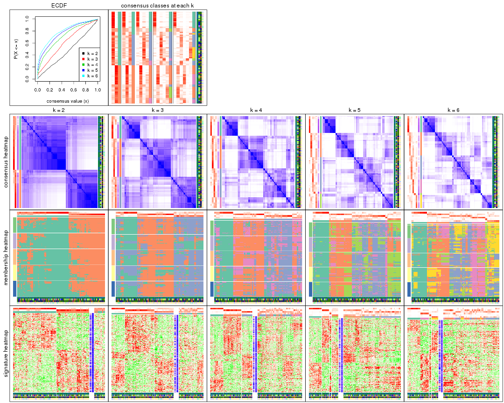

The plots are:

- The first row: a plot of the ECDF (Empirical cumulative distribution
  function) curves of the consensus matrix for each `k` and the heatmap of
  predicted classes for each `k`.
- The second row: heatmaps of the consensus matrix for each `k`.
- The third row: heatmaps of the membership matrix for each `k`.
- The fouth row: heatmaps of the signatures for each `k`.

All the plots in panels can be made by individual functions and they are
plotted later in this section.

`select_partition_number()` produces several plots showing different
statistics for choosing "optimized" `k`. There are following statistics:

- ECDF curves of the consensus matrix for each `k`;
- 1-PAC. [The PAC
  score](https://en.wikipedia.org/wiki/Consensus_clustering#Over-interpretation_potential_of_consensus_clustering)
  measures the proportion of the ambiguous subgrouping.
- Mean silhouette score.
- Concordance. The mean probability of fiting the consensus class ids in all
  partitions.
- Area increased. Denote $A_k$ as the area under the ECDF curve for current
  `k`, the area increased is defined as $A_k - A_{k-1}$.
- Rand index. The percent of pairs of samples that are both in a same cluster
  or both are not in a same cluster in the partition of k and k-1.
- Jaccard index. The ratio of pairs of samples are both in a same cluster in
  the partition of k and k-1 and the pairs of samples are both in a same
  cluster in the partition k or k-1.

The detailed explanations of these statistics can be found in [the cola
vignette](http://bioconductor.org/packages/devel/bioc/vignettes/cola/inst/doc/cola.html#toc_13).

Generally speaking, lower PAC score, higher mean silhouette score or higher
concordance corresponds to better partition. Rand index and Jaccard index
measure how similar the current partition is compared to partition with `k-1`.
If they are too similar, we won't accept `k` is better than `k-1`.

```r
select_partition_number(res)
```

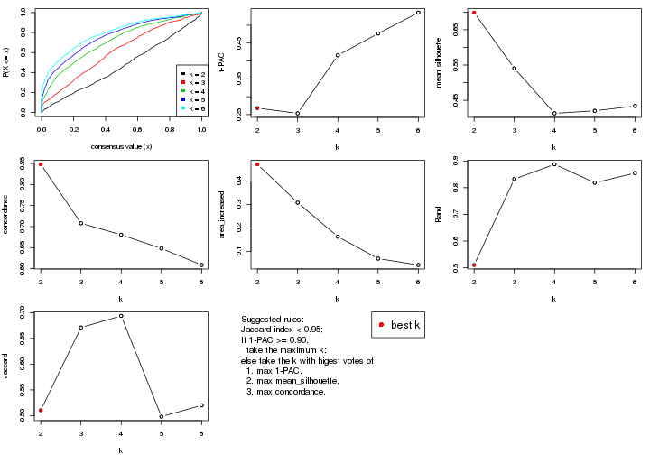

The numeric values for all these statistics can be obtained by `get_stats()`.

```r
get_stats(res)
```

```
#>   k 1-PAC mean_silhouette concordance area_increased  Rand Jaccard
#> 2 2 0.268           0.698       0.848         0.4712 0.511   0.511
#> 3 3 0.253           0.541       0.708         0.3077 0.832   0.671
#> 4 4 0.416           0.413       0.681         0.1627 0.888   0.694
#> 5 5 0.477           0.420       0.648         0.0692 0.818   0.498
#> 6 6 0.535           0.434       0.609         0.0419 0.855   0.520
```

`suggest_best_k()` suggests the best $k$ based on these statistics. The rules are as follows:

- All $k$ with Jaccard index larger than 0.95 are removed because the increase of
  the partition number does not provides enough extra information. If all $k$ are removed,
  the best $k$ is assigned by `NA`.
- For $k$ with 1-PAC larger than 0.9, the maximal $k$ is taken as the "best k". Other $k$ is called "optional k".
- If it does not fit the second rule. The $k$ with the highest vote of highest
  1-PAC, mean silhouette and concordance is taken as the "best k".

```r
suggest_best_k(res)
```

```
#> [1] 2
```


Following shows the table of the partitions (You need to click the **show/hide
code output** link to see it). The membership matrix (columns with name `p*`)
is inferred by
[`clue::cl_consensus()`](https://www.rdocumentation.org/link/cl_consensus?package=clue)
function with the `SE` method. Basically the value in the membership matrix
represents the probability to belong to a certain group. The finall class
label for an item is determined with the group with highest probability it
belongs to.

In `get_classes()` function, the entropy is calculated from the membership
matrix and the silhouette score is calculated from the consensus matrix.


<script>
$( function() {
	$( '#tabs-SD-hclust-get-classes' ).tabs();
} );
</script>
<div id='tabs-SD-hclust-get-classes'>
<ul>
<li><a href='#tab-SD-hclust-get-classes-1'>k = 2</a></li>
<li><a href='#tab-SD-hclust-get-classes-2'>k = 3</a></li>
<li><a href='#tab-SD-hclust-get-classes-3'>k = 4</a></li>
<li><a href='#tab-SD-hclust-get-classes-4'>k = 5</a></li>
<li><a href='#tab-SD-hclust-get-classes-5'>k = 6</a></li>
</ul>

<div id='tab-SD-hclust-get-classes-1'>
<p><a id='tab-SD-hclust-get-classes-1-a' style='color:#0366d6' href='#'>show/hide code output</a></p>
<pre><code class="r">cbind(get_classes(res, k = 2), get_membership(res, k = 2))
</code></pre>

<pre><code>#&gt;           class entropy silhouette    p1    p2
#&gt; GSM447671     2  1.0000   -0.09503 0.500 0.500
#&gt; GSM447694     1  0.5294    0.79716 0.880 0.120
#&gt; GSM447618     2  0.9996   -0.04380 0.488 0.512
#&gt; GSM447691     2  0.8499    0.61964 0.276 0.724
#&gt; GSM447733     1  0.9044    0.61374 0.680 0.320
#&gt; GSM447620     1  0.9850    0.34832 0.572 0.428
#&gt; GSM447627     1  0.7745    0.72530 0.772 0.228
#&gt; GSM447630     1  0.9815    0.37992 0.580 0.420
#&gt; GSM447642     1  0.3114    0.80060 0.944 0.056
#&gt; GSM447649     2  0.1184    0.83540 0.016 0.984
#&gt; GSM447654     2  0.4562    0.81872 0.096 0.904
#&gt; GSM447655     2  0.0000    0.82992 0.000 1.000
#&gt; GSM447669     1  0.9993    0.16399 0.516 0.484
#&gt; GSM447676     1  0.3114    0.80122 0.944 0.056
#&gt; GSM447678     2  0.7528    0.71623 0.216 0.784
#&gt; GSM447681     2  0.0376    0.83134 0.004 0.996
#&gt; GSM447698     2  0.8267    0.65271 0.260 0.740
#&gt; GSM447713     1  0.0000    0.80149 1.000 0.000
#&gt; GSM447722     2  0.8267    0.65271 0.260 0.740
#&gt; GSM447726     1  0.9248    0.52617 0.660 0.340
#&gt; GSM447735     1  0.8763    0.63838 0.704 0.296
#&gt; GSM447737     1  0.0376    0.80122 0.996 0.004
#&gt; GSM447657     2  0.0376    0.83134 0.004 0.996
#&gt; GSM447674     2  0.0376    0.83134 0.004 0.996
#&gt; GSM447636     1  0.3114    0.80060 0.944 0.056
#&gt; GSM447723     1  0.9922    0.19952 0.552 0.448
#&gt; GSM447699     1  0.9491    0.51270 0.632 0.368
#&gt; GSM447708     2  0.7299    0.72537 0.204 0.796
#&gt; GSM447721     1  0.0376    0.80295 0.996 0.004
#&gt; GSM447623     1  0.0000    0.80149 1.000 0.000
#&gt; GSM447621     1  0.0000    0.80149 1.000 0.000
#&gt; GSM447650     2  0.0672    0.83350 0.008 0.992
#&gt; GSM447651     2  0.3431    0.83184 0.064 0.936
#&gt; GSM447653     1  0.7376    0.74149 0.792 0.208
#&gt; GSM447658     1  0.3114    0.80060 0.944 0.056
#&gt; GSM447675     2  0.5294    0.80895 0.120 0.880
#&gt; GSM447680     2  0.6048    0.78768 0.148 0.852
#&gt; GSM447686     2  0.9087    0.54994 0.324 0.676
#&gt; GSM447736     1  0.7219    0.75621 0.800 0.200
#&gt; GSM447629     2  0.8813    0.59996 0.300 0.700
#&gt; GSM447648     1  0.2236    0.80980 0.964 0.036
#&gt; GSM447660     1  0.9896    0.22941 0.560 0.440
#&gt; GSM447661     2  0.0672    0.83350 0.008 0.992
#&gt; GSM447663     1  0.5629    0.79521 0.868 0.132
#&gt; GSM447704     2  0.1184    0.83540 0.016 0.984
#&gt; GSM447720     1  0.6048    0.78747 0.852 0.148
#&gt; GSM447652     2  0.6048    0.77713 0.148 0.852
#&gt; GSM447679     2  0.0938    0.83416 0.012 0.988
#&gt; GSM447712     1  0.0000    0.80149 1.000 0.000
#&gt; GSM447664     2  0.5178    0.81582 0.116 0.884
#&gt; GSM447637     1  0.2236    0.80980 0.964 0.036
#&gt; GSM447639     1  0.9522    0.50492 0.628 0.372
#&gt; GSM447615     1  0.3879    0.80901 0.924 0.076
#&gt; GSM447656     2  0.8861    0.59694 0.304 0.696
#&gt; GSM447673     2  0.1843    0.83388 0.028 0.972
#&gt; GSM447719     1  0.7219    0.74735 0.800 0.200
#&gt; GSM447706     1  0.2236    0.80980 0.964 0.036
#&gt; GSM447612     1  0.8713    0.64356 0.708 0.292
#&gt; GSM447665     2  0.9815    0.22623 0.420 0.580
#&gt; GSM447677     2  0.4161    0.82467 0.084 0.916
#&gt; GSM447613     1  0.0000    0.80149 1.000 0.000
#&gt; GSM447659     1  0.8144    0.69786 0.748 0.252
#&gt; GSM447662     1  0.2423    0.81022 0.960 0.040
#&gt; GSM447666     1  0.9358    0.51201 0.648 0.352
#&gt; GSM447668     2  0.0672    0.83350 0.008 0.992
#&gt; GSM447682     2  0.4022    0.82697 0.080 0.920
#&gt; GSM447683     2  0.3733    0.82763 0.072 0.928
#&gt; GSM447688     2  0.0938    0.83364 0.012 0.988
#&gt; GSM447702     2  0.0000    0.82992 0.000 1.000
#&gt; GSM447709     2  0.9209    0.47475 0.336 0.664
#&gt; GSM447711     1  0.0000    0.80149 1.000 0.000
#&gt; GSM447715     1  0.9922    0.19952 0.552 0.448
#&gt; GSM447693     1  0.2236    0.80980 0.964 0.036
#&gt; GSM447611     2  0.5946    0.79777 0.144 0.856
#&gt; GSM447672     2  0.0000    0.82992 0.000 1.000
#&gt; GSM447703     2  0.0938    0.83364 0.012 0.988
#&gt; GSM447727     1  0.9833    0.28463 0.576 0.424
#&gt; GSM447638     1  0.7745    0.69441 0.772 0.228
#&gt; GSM447670     1  0.2236    0.80316 0.964 0.036
#&gt; GSM447700     1  0.9933    0.27944 0.548 0.452
#&gt; GSM447738     2  0.0938    0.83364 0.012 0.988
#&gt; GSM447739     1  0.0000    0.80149 1.000 0.000
#&gt; GSM447617     1  0.0000    0.80149 1.000 0.000
#&gt; GSM447628     2  0.4022    0.82351 0.080 0.920
#&gt; GSM447632     2  0.2603    0.83698 0.044 0.956
#&gt; GSM447619     1  0.2423    0.81022 0.960 0.040
#&gt; GSM447643     1  1.0000    0.00279 0.504 0.496
#&gt; GSM447724     1  0.9209    0.58511 0.664 0.336
#&gt; GSM447728     2  0.5294    0.80100 0.120 0.880
#&gt; GSM447610     1  0.6887    0.76030 0.816 0.184
#&gt; GSM447633     2  0.9815    0.22623 0.420 0.580
#&gt; GSM447634     1  0.7219    0.75325 0.800 0.200
#&gt; GSM447622     1  0.1843    0.80917 0.972 0.028
#&gt; GSM447667     2  0.8955    0.58139 0.312 0.688
#&gt; GSM447687     2  0.0938    0.83364 0.012 0.988
#&gt; GSM447695     1  0.5294    0.79780 0.880 0.120
#&gt; GSM447696     1  0.0000    0.80149 1.000 0.000
#&gt; GSM447697     1  0.0000    0.80149 1.000 0.000
#&gt; GSM447714     1  0.4431    0.80506 0.908 0.092
#&gt; GSM447717     1  0.3114    0.80060 0.944 0.056
#&gt; GSM447725     1  0.0000    0.80149 1.000 0.000
#&gt; GSM447729     2  0.4690    0.81717 0.100 0.900
#&gt; GSM447644     1  0.9993    0.16399 0.516 0.484
#&gt; GSM447710     1  0.4431    0.80506 0.908 0.092
#&gt; GSM447614     1  0.6887    0.76030 0.816 0.184
#&gt; GSM447685     2  0.6531    0.77172 0.168 0.832
#&gt; GSM447690     1  0.0000    0.80149 1.000 0.000
#&gt; GSM447730     2  0.0938    0.83498 0.012 0.988
#&gt; GSM447646     2  0.4022    0.82351 0.080 0.920
#&gt; GSM447689     1  0.6712    0.78189 0.824 0.176
#&gt; GSM447635     2  0.9087    0.54764 0.324 0.676
#&gt; GSM447641     1  0.3114    0.80060 0.944 0.056
#&gt; GSM447716     2  0.9087    0.54994 0.324 0.676
#&gt; GSM447718     1  0.7376    0.75133 0.792 0.208
#&gt; GSM447616     1  0.1843    0.80917 0.972 0.028
#&gt; GSM447626     1  0.6438    0.76181 0.836 0.164
#&gt; GSM447640     2  0.2236    0.83560 0.036 0.964
#&gt; GSM447734     1  0.5408    0.79656 0.876 0.124
#&gt; GSM447692     1  0.5294    0.79780 0.880 0.120
#&gt; GSM447647     2  0.1184    0.83540 0.016 0.984
#&gt; GSM447624     1  0.0000    0.80149 1.000 0.000
#&gt; GSM447625     1  0.5408    0.79656 0.876 0.124
#&gt; GSM447707     2  0.0938    0.83498 0.012 0.988
#&gt; GSM447732     1  0.5294    0.79740 0.880 0.120
#&gt; GSM447684     1  0.7453    0.71326 0.788 0.212
#&gt; GSM447731     1  0.8955    0.61286 0.688 0.312
#&gt; GSM447705     1  0.9881    0.33733 0.564 0.436
#&gt; GSM447631     1  0.2236    0.80980 0.964 0.036
#&gt; GSM447701     2  0.0672    0.83350 0.008 0.992
#&gt; GSM447645     1  0.2236    0.80980 0.964 0.036
</code></pre>

<script>
$('#tab-SD-hclust-get-classes-1-a').parent().next().next().hide();
$('#tab-SD-hclust-get-classes-1-a').click(function(){
  $('#tab-SD-hclust-get-classes-1-a').parent().next().next().toggle();
  return(false);
});
</script>
</div>

<div id='tab-SD-hclust-get-classes-2'>
<p><a id='tab-SD-hclust-get-classes-2-a' style='color:#0366d6' href='#'>show/hide code output</a></p>
<pre><code class="r">cbind(get_classes(res, k = 3), get_membership(res, k = 3))
</code></pre>

<pre><code>#&gt;           class entropy silhouette    p1    p2    p3
#&gt; GSM447671     2  0.9188    -0.1829 0.152 0.468 0.380
#&gt; GSM447694     3  0.7890     0.4363 0.432 0.056 0.512
#&gt; GSM447618     2  0.9464    -0.2508 0.180 0.412 0.408
#&gt; GSM447691     2  0.8249     0.5359 0.200 0.636 0.164
#&gt; GSM447733     3  0.7724     0.5811 0.156 0.164 0.680
#&gt; GSM447620     3  0.9223     0.4166 0.172 0.324 0.504
#&gt; GSM447627     3  0.7782     0.6063 0.248 0.100 0.652
#&gt; GSM447630     3  0.9389     0.4479 0.180 0.352 0.468
#&gt; GSM447642     1  0.0747     0.6633 0.984 0.000 0.016
#&gt; GSM447649     2  0.2711     0.7576 0.000 0.912 0.088
#&gt; GSM447654     2  0.5815     0.6470 0.004 0.692 0.304
#&gt; GSM447655     2  0.0424     0.7638 0.000 0.992 0.008
#&gt; GSM447669     3  0.9434     0.2880 0.176 0.408 0.416
#&gt; GSM447676     1  0.3129     0.6347 0.904 0.008 0.088
#&gt; GSM447678     2  0.7637     0.5734 0.076 0.640 0.284
#&gt; GSM447681     2  0.1337     0.7632 0.016 0.972 0.012
#&gt; GSM447698     2  0.7896     0.4944 0.076 0.600 0.324
#&gt; GSM447713     1  0.1964     0.6859 0.944 0.000 0.056
#&gt; GSM447722     2  0.7896     0.4944 0.076 0.600 0.324
#&gt; GSM447726     3  0.9701     0.3614 0.284 0.260 0.456
#&gt; GSM447735     3  0.9099     0.5468 0.264 0.192 0.544
#&gt; GSM447737     1  0.3500     0.6491 0.880 0.004 0.116
#&gt; GSM447657     2  0.1337     0.7632 0.016 0.972 0.012
#&gt; GSM447674     2  0.1337     0.7632 0.016 0.972 0.012
#&gt; GSM447636     1  0.0747     0.6633 0.984 0.000 0.016
#&gt; GSM447723     1  0.9008     0.1177 0.500 0.360 0.140
#&gt; GSM447699     3  0.9034     0.5421 0.188 0.260 0.552
#&gt; GSM447708     2  0.7424     0.6115 0.128 0.700 0.172
#&gt; GSM447721     1  0.2165     0.6846 0.936 0.000 0.064
#&gt; GSM447623     1  0.3192     0.6548 0.888 0.000 0.112
#&gt; GSM447621     1  0.3192     0.6548 0.888 0.000 0.112
#&gt; GSM447650     2  0.1491     0.7635 0.016 0.968 0.016
#&gt; GSM447651     2  0.4371     0.7413 0.032 0.860 0.108
#&gt; GSM447653     3  0.4045     0.5338 0.104 0.024 0.872
#&gt; GSM447658     1  0.0892     0.6635 0.980 0.000 0.020
#&gt; GSM447675     2  0.6200     0.6446 0.012 0.676 0.312
#&gt; GSM447680     2  0.6510     0.6823 0.156 0.756 0.088
#&gt; GSM447686     2  0.8518     0.4931 0.272 0.592 0.136
#&gt; GSM447736     3  0.8674     0.6112 0.296 0.136 0.568
#&gt; GSM447629     2  0.8278     0.5335 0.248 0.620 0.132
#&gt; GSM447648     3  0.6204     0.4316 0.424 0.000 0.576
#&gt; GSM447660     1  0.8691     0.1361 0.528 0.356 0.116
#&gt; GSM447661     2  0.1491     0.7635 0.016 0.968 0.016
#&gt; GSM447663     3  0.7507     0.6315 0.288 0.068 0.644
#&gt; GSM447704     2  0.2711     0.7576 0.000 0.912 0.088
#&gt; GSM447720     3  0.7724     0.6179 0.308 0.072 0.620
#&gt; GSM447652     2  0.6245     0.6896 0.060 0.760 0.180
#&gt; GSM447679     2  0.0892     0.7652 0.000 0.980 0.020
#&gt; GSM447712     1  0.1964     0.6859 0.944 0.000 0.056
#&gt; GSM447664     2  0.6601     0.6564 0.028 0.676 0.296
#&gt; GSM447637     3  0.5835     0.5565 0.340 0.000 0.660
#&gt; GSM447639     3  0.8853     0.5424 0.176 0.252 0.572
#&gt; GSM447615     1  0.6225    -0.1367 0.568 0.000 0.432
#&gt; GSM447656     2  0.8287     0.5306 0.256 0.616 0.128
#&gt; GSM447673     2  0.3267     0.7488 0.000 0.884 0.116
#&gt; GSM447719     3  0.3618     0.5289 0.104 0.012 0.884
#&gt; GSM447706     3  0.5810     0.5583 0.336 0.000 0.664
#&gt; GSM447612     3  0.8263     0.6127 0.188 0.176 0.636
#&gt; GSM447665     2  0.8858     0.1062 0.136 0.532 0.332
#&gt; GSM447677     2  0.5492     0.7182 0.080 0.816 0.104
#&gt; GSM447613     1  0.2165     0.6843 0.936 0.000 0.064
#&gt; GSM447659     3  0.6546     0.5975 0.148 0.096 0.756
#&gt; GSM447662     3  0.6008     0.5633 0.332 0.004 0.664
#&gt; GSM447666     3  0.9128     0.4449 0.204 0.252 0.544
#&gt; GSM447668     2  0.1491     0.7635 0.016 0.968 0.016
#&gt; GSM447682     2  0.4475     0.7412 0.072 0.864 0.064
#&gt; GSM447683     2  0.4602     0.7316 0.108 0.852 0.040
#&gt; GSM447688     2  0.2711     0.7558 0.000 0.912 0.088
#&gt; GSM447702     2  0.1170     0.7634 0.016 0.976 0.008
#&gt; GSM447709     2  0.7980     0.3055 0.072 0.572 0.356
#&gt; GSM447711     1  0.2066     0.6851 0.940 0.000 0.060
#&gt; GSM447715     1  0.9008     0.1177 0.500 0.360 0.140
#&gt; GSM447693     3  0.5835     0.5565 0.340 0.000 0.660
#&gt; GSM447611     2  0.7065     0.6279 0.040 0.644 0.316
#&gt; GSM447672     2  0.0424     0.7638 0.000 0.992 0.008
#&gt; GSM447703     2  0.2711     0.7558 0.000 0.912 0.088
#&gt; GSM447727     1  0.8720     0.1631 0.540 0.336 0.124
#&gt; GSM447638     3  0.9152     0.3018 0.424 0.144 0.432
#&gt; GSM447670     1  0.6140    -0.0330 0.596 0.000 0.404
#&gt; GSM447700     3  0.9338     0.4081 0.172 0.360 0.468
#&gt; GSM447738     2  0.2711     0.7558 0.000 0.912 0.088
#&gt; GSM447739     1  0.1964     0.6859 0.944 0.000 0.056
#&gt; GSM447617     1  0.3192     0.6548 0.888 0.000 0.112
#&gt; GSM447628     2  0.5497     0.6557 0.000 0.708 0.292
#&gt; GSM447632     2  0.3340     0.7595 0.000 0.880 0.120
#&gt; GSM447619     3  0.6008     0.5633 0.332 0.004 0.664
#&gt; GSM447643     1  0.8826    -0.0512 0.472 0.412 0.116
#&gt; GSM447724     3  0.8212     0.5761 0.168 0.192 0.640
#&gt; GSM447728     2  0.5564     0.7050 0.128 0.808 0.064
#&gt; GSM447610     3  0.8701     0.4386 0.400 0.108 0.492
#&gt; GSM447633     2  0.8858     0.1062 0.136 0.532 0.332
#&gt; GSM447634     3  0.9015     0.5503 0.348 0.144 0.508
#&gt; GSM447622     1  0.6313     0.3079 0.676 0.016 0.308
#&gt; GSM447667     2  0.8379     0.5127 0.268 0.604 0.128
#&gt; GSM447687     2  0.2711     0.7558 0.000 0.912 0.088
#&gt; GSM447695     1  0.7920    -0.3606 0.476 0.056 0.468
#&gt; GSM447696     1  0.1964     0.6859 0.944 0.000 0.056
#&gt; GSM447697     1  0.2165     0.6843 0.936 0.000 0.064
#&gt; GSM447714     3  0.6908     0.6098 0.308 0.036 0.656
#&gt; GSM447717     1  0.0592     0.6621 0.988 0.000 0.012
#&gt; GSM447725     1  0.1964     0.6859 0.944 0.000 0.056
#&gt; GSM447729     2  0.6082     0.6487 0.012 0.692 0.296
#&gt; GSM447644     3  0.9434     0.2880 0.176 0.408 0.416
#&gt; GSM447710     3  0.6908     0.6098 0.308 0.036 0.656
#&gt; GSM447614     3  0.8701     0.4386 0.400 0.108 0.492
#&gt; GSM447685     2  0.6622     0.6708 0.164 0.748 0.088
#&gt; GSM447690     1  0.1964     0.6859 0.944 0.000 0.056
#&gt; GSM447730     2  0.2625     0.7586 0.000 0.916 0.084
#&gt; GSM447646     2  0.5497     0.6557 0.000 0.708 0.292
#&gt; GSM447689     3  0.7880     0.6190 0.268 0.096 0.636
#&gt; GSM447635     2  0.8670     0.4812 0.240 0.592 0.168
#&gt; GSM447641     1  0.0892     0.6635 0.980 0.000 0.020
#&gt; GSM447716     2  0.8518     0.4931 0.272 0.592 0.136
#&gt; GSM447718     3  0.8594     0.6268 0.268 0.144 0.588
#&gt; GSM447616     1  0.6313     0.3079 0.676 0.016 0.308
#&gt; GSM447626     3  0.8526     0.4728 0.376 0.100 0.524
#&gt; GSM447640     2  0.1753     0.7636 0.000 0.952 0.048
#&gt; GSM447734     3  0.7367     0.6272 0.292 0.060 0.648
#&gt; GSM447692     1  0.7920    -0.3606 0.476 0.056 0.468
#&gt; GSM447647     2  0.2711     0.7576 0.000 0.912 0.088
#&gt; GSM447624     1  0.5560     0.3706 0.700 0.000 0.300
#&gt; GSM447625     3  0.7367     0.6272 0.292 0.060 0.648
#&gt; GSM447707     2  0.2625     0.7586 0.000 0.916 0.084
#&gt; GSM447732     3  0.7279     0.6260 0.292 0.056 0.652
#&gt; GSM447684     3  0.9065     0.3202 0.416 0.136 0.448
#&gt; GSM447731     3  0.6023     0.5014 0.092 0.120 0.788
#&gt; GSM447705     3  0.9183     0.4251 0.168 0.324 0.508
#&gt; GSM447631     3  0.5835     0.5565 0.340 0.000 0.660
#&gt; GSM447701     2  0.1491     0.7635 0.016 0.968 0.016
#&gt; GSM447645     3  0.5835     0.5565 0.340 0.000 0.660
</code></pre>

<script>
$('#tab-SD-hclust-get-classes-2-a').parent().next().next().hide();
$('#tab-SD-hclust-get-classes-2-a').click(function(){
  $('#tab-SD-hclust-get-classes-2-a').parent().next().next().toggle();
  return(false);
});
</script>
</div>

<div id='tab-SD-hclust-get-classes-3'>
<p><a id='tab-SD-hclust-get-classes-3-a' style='color:#0366d6' href='#'>show/hide code output</a></p>
<pre><code class="r">cbind(get_classes(res, k = 4), get_membership(res, k = 4))
</code></pre>

<pre><code>#&gt;           class entropy silhouette    p1    p2    p3    p4
#&gt; GSM447671     2  0.7765    -0.1408 0.028 0.432 0.424 0.116
#&gt; GSM447694     3  0.7961     0.2013 0.264 0.004 0.412 0.320
#&gt; GSM447618     4  0.8635     0.1708 0.048 0.208 0.308 0.436
#&gt; GSM447691     2  0.8627     0.3302 0.140 0.480 0.084 0.296
#&gt; GSM447733     4  0.7162    -0.1530 0.028 0.064 0.444 0.464
#&gt; GSM447620     3  0.7211     0.3082 0.012 0.264 0.580 0.144
#&gt; GSM447627     3  0.7315     0.2080 0.108 0.012 0.468 0.412
#&gt; GSM447630     3  0.7590     0.1961 0.028 0.340 0.520 0.112
#&gt; GSM447642     1  0.2107     0.7489 0.940 0.016 0.020 0.024
#&gt; GSM447649     2  0.3266     0.5680 0.000 0.832 0.000 0.168
#&gt; GSM447654     2  0.5296    -0.0124 0.000 0.500 0.008 0.492
#&gt; GSM447655     2  0.1211     0.6184 0.000 0.960 0.000 0.040
#&gt; GSM447669     3  0.7482     0.0887 0.016 0.396 0.472 0.116
#&gt; GSM447676     1  0.4115     0.6983 0.836 0.016 0.120 0.028
#&gt; GSM447678     4  0.7372     0.1675 0.028 0.432 0.080 0.460
#&gt; GSM447681     2  0.0657     0.6275 0.000 0.984 0.004 0.012
#&gt; GSM447698     4  0.7710     0.2160 0.032 0.404 0.104 0.460
#&gt; GSM447713     1  0.1389     0.7662 0.952 0.000 0.048 0.000
#&gt; GSM447722     4  0.7710     0.2160 0.032 0.404 0.104 0.460
#&gt; GSM447726     3  0.8382     0.3293 0.108 0.220 0.548 0.124
#&gt; GSM447735     4  0.7310     0.0106 0.108 0.020 0.324 0.548
#&gt; GSM447737     1  0.3523     0.7214 0.856 0.000 0.112 0.032
#&gt; GSM447657     2  0.0657     0.6275 0.000 0.984 0.004 0.012
#&gt; GSM447674     2  0.0657     0.6275 0.000 0.984 0.004 0.012
#&gt; GSM447636     1  0.2107     0.7489 0.940 0.016 0.020 0.024
#&gt; GSM447723     1  0.8935     0.1697 0.436 0.272 0.072 0.220
#&gt; GSM447699     3  0.7679     0.0338 0.032 0.100 0.448 0.420
#&gt; GSM447708     2  0.7923     0.4255 0.084 0.580 0.104 0.232
#&gt; GSM447721     1  0.1890     0.7665 0.936 0.000 0.056 0.008
#&gt; GSM447623     1  0.3325     0.7244 0.864 0.000 0.112 0.024
#&gt; GSM447621     1  0.3325     0.7244 0.864 0.000 0.112 0.024
#&gt; GSM447650     2  0.0657     0.6269 0.000 0.984 0.004 0.012
#&gt; GSM447651     2  0.4733     0.5675 0.008 0.800 0.064 0.128
#&gt; GSM447653     3  0.5636     0.2614 0.024 0.000 0.552 0.424
#&gt; GSM447658     1  0.2215     0.7485 0.936 0.016 0.024 0.024
#&gt; GSM447675     4  0.5438     0.0253 0.008 0.452 0.004 0.536
#&gt; GSM447680     2  0.6543     0.4939 0.100 0.648 0.012 0.240
#&gt; GSM447686     2  0.8571     0.3216 0.212 0.460 0.048 0.280
#&gt; GSM447736     3  0.6881     0.4301 0.060 0.052 0.640 0.248
#&gt; GSM447629     2  0.8460     0.3563 0.184 0.484 0.052 0.280
#&gt; GSM447648     3  0.3863     0.5383 0.144 0.000 0.828 0.028
#&gt; GSM447660     1  0.8568     0.2315 0.468 0.240 0.048 0.244
#&gt; GSM447661     2  0.0657     0.6269 0.000 0.984 0.004 0.012
#&gt; GSM447663     3  0.4741     0.5491 0.032 0.024 0.800 0.144
#&gt; GSM447704     2  0.3266     0.5680 0.000 0.832 0.000 0.168
#&gt; GSM447720     3  0.6021     0.5171 0.072 0.028 0.720 0.180
#&gt; GSM447652     2  0.5427     0.4200 0.000 0.736 0.100 0.164
#&gt; GSM447679     2  0.2125     0.6236 0.000 0.920 0.004 0.076
#&gt; GSM447712     1  0.1807     0.7673 0.940 0.000 0.052 0.008
#&gt; GSM447664     4  0.5675    -0.0312 0.016 0.472 0.004 0.508
#&gt; GSM447637     3  0.1936     0.5729 0.028 0.000 0.940 0.032
#&gt; GSM447639     4  0.7154    -0.0822 0.020 0.076 0.444 0.460
#&gt; GSM447615     3  0.5487     0.3733 0.328 0.004 0.644 0.024
#&gt; GSM447656     2  0.8372     0.3711 0.196 0.500 0.048 0.256
#&gt; GSM447673     2  0.4103     0.4932 0.000 0.744 0.000 0.256
#&gt; GSM447719     3  0.5611     0.2739 0.024 0.000 0.564 0.412
#&gt; GSM447706     3  0.1411     0.5742 0.020 0.000 0.960 0.020
#&gt; GSM447612     3  0.7357     0.3357 0.032 0.108 0.584 0.276
#&gt; GSM447665     2  0.7187     0.0821 0.012 0.520 0.364 0.104
#&gt; GSM447677     2  0.5738     0.5506 0.036 0.748 0.060 0.156
#&gt; GSM447613     1  0.1716     0.7638 0.936 0.000 0.064 0.000
#&gt; GSM447659     3  0.5816     0.1953 0.012 0.012 0.492 0.484
#&gt; GSM447662     3  0.1911     0.5773 0.020 0.004 0.944 0.032
#&gt; GSM447666     3  0.6581     0.3729 0.012 0.200 0.660 0.128
#&gt; GSM447668     2  0.0657     0.6269 0.000 0.984 0.004 0.012
#&gt; GSM447682     2  0.5308     0.5770 0.052 0.768 0.024 0.156
#&gt; GSM447683     2  0.5294     0.5696 0.060 0.764 0.016 0.160
#&gt; GSM447688     2  0.3688     0.5338 0.000 0.792 0.000 0.208
#&gt; GSM447702     2  0.0188     0.6267 0.000 0.996 0.000 0.004
#&gt; GSM447709     2  0.7472     0.2050 0.012 0.516 0.332 0.140
#&gt; GSM447711     1  0.1890     0.7667 0.936 0.000 0.056 0.008
#&gt; GSM447715     1  0.8935     0.1697 0.436 0.272 0.072 0.220
#&gt; GSM447693     3  0.1936     0.5729 0.028 0.000 0.940 0.032
#&gt; GSM447611     4  0.5991     0.0453 0.032 0.432 0.004 0.532
#&gt; GSM447672     2  0.1211     0.6184 0.000 0.960 0.000 0.040
#&gt; GSM447703     2  0.3688     0.5338 0.000 0.792 0.000 0.208
#&gt; GSM447727     1  0.8639     0.2360 0.476 0.256 0.060 0.208
#&gt; GSM447638     3  0.8017     0.3891 0.208 0.100 0.584 0.108
#&gt; GSM447670     3  0.5610     0.3014 0.356 0.004 0.616 0.024
#&gt; GSM447700     4  0.8398     0.1041 0.032 0.196 0.376 0.396
#&gt; GSM447738     2  0.3726     0.5332 0.000 0.788 0.000 0.212
#&gt; GSM447739     1  0.1389     0.7662 0.952 0.000 0.048 0.000
#&gt; GSM447617     1  0.3325     0.7244 0.864 0.000 0.112 0.024
#&gt; GSM447628     2  0.5097     0.1229 0.000 0.568 0.004 0.428
#&gt; GSM447632     2  0.4343     0.5300 0.000 0.732 0.004 0.264
#&gt; GSM447619     3  0.1911     0.5773 0.020 0.004 0.944 0.032
#&gt; GSM447643     1  0.8784     0.0542 0.408 0.296 0.048 0.248
#&gt; GSM447724     4  0.7645    -0.1122 0.028 0.104 0.424 0.444
#&gt; GSM447728     2  0.6183     0.5435 0.084 0.716 0.032 0.168
#&gt; GSM447610     4  0.7697    -0.0722 0.240 0.000 0.316 0.444
#&gt; GSM447633     2  0.7187     0.0821 0.012 0.520 0.364 0.104
#&gt; GSM447634     3  0.7526     0.3730 0.104 0.052 0.596 0.248
#&gt; GSM447622     1  0.6474     0.2320 0.536 0.000 0.388 0.076
#&gt; GSM447667     2  0.8589     0.3458 0.204 0.476 0.056 0.264
#&gt; GSM447687     2  0.3688     0.5338 0.000 0.792 0.000 0.208
#&gt; GSM447695     3  0.7904     0.1463 0.308 0.000 0.368 0.324
#&gt; GSM447696     1  0.1389     0.7662 0.952 0.000 0.048 0.000
#&gt; GSM447697     1  0.1716     0.7638 0.936 0.000 0.064 0.000
#&gt; GSM447714     3  0.3877     0.5615 0.032 0.004 0.840 0.124
#&gt; GSM447717     1  0.1993     0.7484 0.944 0.016 0.016 0.024
#&gt; GSM447725     1  0.1576     0.7664 0.948 0.000 0.048 0.004
#&gt; GSM447729     4  0.5328    -0.0189 0.004 0.472 0.004 0.520
#&gt; GSM447644     3  0.7482     0.0887 0.016 0.396 0.472 0.116
#&gt; GSM447710     3  0.3822     0.5622 0.032 0.004 0.844 0.120
#&gt; GSM447614     4  0.7697    -0.0722 0.240 0.000 0.316 0.444
#&gt; GSM447685     2  0.6730     0.4926 0.108 0.640 0.016 0.236
#&gt; GSM447690     1  0.1389     0.7662 0.952 0.000 0.048 0.000
#&gt; GSM447730     2  0.3123     0.5759 0.000 0.844 0.000 0.156
#&gt; GSM447646     2  0.5097     0.1229 0.000 0.568 0.004 0.428
#&gt; GSM447689     3  0.4861     0.5509 0.016 0.080 0.804 0.100
#&gt; GSM447635     2  0.8943     0.3067 0.184 0.460 0.092 0.264
#&gt; GSM447641     1  0.2215     0.7485 0.936 0.016 0.024 0.024
#&gt; GSM447716     2  0.8571     0.3216 0.212 0.460 0.048 0.280
#&gt; GSM447718     3  0.6347     0.4920 0.032 0.104 0.708 0.156
#&gt; GSM447616     1  0.6474     0.2320 0.536 0.000 0.388 0.076
#&gt; GSM447626     3  0.6319     0.4900 0.136 0.060 0.724 0.080
#&gt; GSM447640     2  0.2888     0.6134 0.000 0.872 0.004 0.124
#&gt; GSM447734     3  0.4693     0.5396 0.032 0.012 0.788 0.168
#&gt; GSM447692     3  0.7904     0.1463 0.308 0.000 0.368 0.324
#&gt; GSM447647     2  0.3266     0.5680 0.000 0.832 0.000 0.168
#&gt; GSM447624     1  0.5137     0.1839 0.544 0.000 0.452 0.004
#&gt; GSM447625     3  0.4693     0.5396 0.032 0.012 0.788 0.168
#&gt; GSM447707     2  0.3123     0.5759 0.000 0.844 0.000 0.156
#&gt; GSM447732     3  0.4360     0.5511 0.032 0.012 0.816 0.140
#&gt; GSM447684     3  0.7793     0.4051 0.208 0.080 0.600 0.112
#&gt; GSM447731     3  0.7405     0.1402 0.020 0.100 0.484 0.396
#&gt; GSM447705     3  0.7563     0.3113 0.012 0.252 0.544 0.192
#&gt; GSM447631     3  0.1936     0.5729 0.028 0.000 0.940 0.032
#&gt; GSM447701     2  0.0657     0.6269 0.000 0.984 0.004 0.012
#&gt; GSM447645     3  0.1936     0.5729 0.028 0.000 0.940 0.032
</code></pre>

<script>
$('#tab-SD-hclust-get-classes-3-a').parent().next().next().hide();
$('#tab-SD-hclust-get-classes-3-a').click(function(){
  $('#tab-SD-hclust-get-classes-3-a').parent().next().next().toggle();
  return(false);
});
</script>
</div>

<div id='tab-SD-hclust-get-classes-4'>
<p><a id='tab-SD-hclust-get-classes-4-a' style='color:#0366d6' href='#'>show/hide code output</a></p>
<pre><code class="r">cbind(get_classes(res, k = 5), get_membership(res, k = 5))
</code></pre>

<pre><code>#&gt;           class entropy silhouette    p1    p2    p3    p4    p5
#&gt; GSM447671     3  0.7136     0.0808 0.012 0.228 0.480 0.012 0.268
#&gt; GSM447694     3  0.7395     0.2463 0.228 0.000 0.524 0.144 0.104
#&gt; GSM447618     3  0.7354     0.2276 0.016 0.092 0.432 0.060 0.400
#&gt; GSM447691     5  0.7227     0.6024 0.100 0.176 0.108 0.020 0.596
#&gt; GSM447733     3  0.7443     0.0114 0.016 0.088 0.488 0.328 0.080
#&gt; GSM447620     3  0.6862     0.1733 0.000 0.040 0.476 0.120 0.364
#&gt; GSM447627     3  0.7422     0.0908 0.096 0.024 0.500 0.320 0.060
#&gt; GSM447630     3  0.6012     0.3128 0.004 0.200 0.636 0.012 0.148
#&gt; GSM447642     1  0.2130     0.7956 0.908 0.000 0.012 0.000 0.080
#&gt; GSM447649     2  0.2069     0.5762 0.000 0.912 0.012 0.000 0.076
#&gt; GSM447654     2  0.5574     0.3626 0.000 0.680 0.032 0.212 0.076
#&gt; GSM447655     2  0.4508     0.4204 0.000 0.648 0.000 0.020 0.332
#&gt; GSM447669     3  0.6639     0.2036 0.004 0.208 0.548 0.012 0.228
#&gt; GSM447676     1  0.4363     0.7407 0.816 0.008 0.064 0.048 0.064
#&gt; GSM447678     2  0.7930     0.2627 0.016 0.484 0.124 0.116 0.260
#&gt; GSM447681     2  0.4875     0.3434 0.000 0.576 0.004 0.020 0.400
#&gt; GSM447698     2  0.8269     0.1641 0.016 0.392 0.172 0.100 0.320
#&gt; GSM447713     1  0.0510     0.8361 0.984 0.000 0.016 0.000 0.000
#&gt; GSM447722     2  0.8269     0.1641 0.016 0.392 0.172 0.100 0.320
#&gt; GSM447726     3  0.8531     0.1364 0.100 0.036 0.380 0.156 0.328
#&gt; GSM447735     3  0.8221     0.1604 0.076 0.028 0.452 0.224 0.220
#&gt; GSM447737     1  0.3152     0.7920 0.868 0.000 0.084 0.016 0.032
#&gt; GSM447657     2  0.4866     0.3458 0.000 0.580 0.004 0.020 0.396
#&gt; GSM447674     2  0.4866     0.3458 0.000 0.580 0.004 0.020 0.396
#&gt; GSM447636     1  0.2130     0.7956 0.908 0.000 0.012 0.000 0.080
#&gt; GSM447723     5  0.7096     0.3434 0.396 0.064 0.064 0.016 0.460
#&gt; GSM447699     3  0.6641     0.3425 0.012 0.048 0.592 0.084 0.264
#&gt; GSM447708     5  0.7158     0.5346 0.048 0.264 0.124 0.016 0.548
#&gt; GSM447721     1  0.1059     0.8363 0.968 0.000 0.020 0.008 0.004
#&gt; GSM447623     1  0.2965     0.7964 0.876 0.000 0.084 0.012 0.028
#&gt; GSM447621     1  0.2965     0.7964 0.876 0.000 0.084 0.012 0.028
#&gt; GSM447650     2  0.4908     0.3311 0.000 0.560 0.004 0.020 0.416
#&gt; GSM447651     5  0.6181     0.1692 0.000 0.348 0.052 0.048 0.552
#&gt; GSM447653     4  0.3435     0.8935 0.008 0.012 0.148 0.828 0.004
#&gt; GSM447658     1  0.2289     0.7949 0.904 0.000 0.012 0.004 0.080
#&gt; GSM447675     2  0.6285     0.3317 0.008 0.636 0.028 0.200 0.128
#&gt; GSM447680     5  0.5155     0.5318 0.068 0.196 0.004 0.016 0.716
#&gt; GSM447686     5  0.6787     0.6434 0.172 0.164 0.044 0.012 0.608
#&gt; GSM447736     3  0.4526     0.4466 0.036 0.012 0.796 0.036 0.120
#&gt; GSM447629     5  0.6395     0.6443 0.144 0.172 0.044 0.004 0.636
#&gt; GSM447648     3  0.6385     0.2429 0.128 0.000 0.584 0.260 0.028
#&gt; GSM447660     5  0.6478     0.2581 0.416 0.052 0.036 0.012 0.484
#&gt; GSM447661     2  0.4908     0.3311 0.000 0.560 0.004 0.020 0.416
#&gt; GSM447663     3  0.2138     0.4430 0.012 0.004 0.928 0.024 0.032
#&gt; GSM447704     2  0.2069     0.5762 0.000 0.912 0.012 0.000 0.076
#&gt; GSM447720     3  0.3467     0.4504 0.048 0.004 0.864 0.032 0.052
#&gt; GSM447652     2  0.6513     0.4149 0.000 0.624 0.140 0.064 0.172
#&gt; GSM447679     2  0.4774     0.3108 0.000 0.556 0.000 0.020 0.424
#&gt; GSM447712     1  0.0932     0.8372 0.972 0.000 0.020 0.004 0.004
#&gt; GSM447664     2  0.6492     0.3617 0.016 0.632 0.028 0.176 0.148
#&gt; GSM447637     3  0.4796     0.2995 0.012 0.000 0.680 0.280 0.028
#&gt; GSM447639     3  0.6845     0.3114 0.004 0.052 0.576 0.132 0.236
#&gt; GSM447615     3  0.7745     0.1120 0.312 0.000 0.412 0.200 0.076
#&gt; GSM447656     5  0.6248     0.6474 0.160 0.172 0.036 0.000 0.632
#&gt; GSM447673     2  0.3130     0.5742 0.000 0.872 0.016 0.040 0.072
#&gt; GSM447719     4  0.3193     0.8915 0.008 0.008 0.136 0.844 0.004
#&gt; GSM447706     3  0.4775     0.3063 0.008 0.000 0.688 0.268 0.036
#&gt; GSM447612     3  0.5552     0.4044 0.012 0.044 0.724 0.068 0.152
#&gt; GSM447665     3  0.7154    -0.1506 0.000 0.268 0.392 0.016 0.324
#&gt; GSM447677     5  0.5879     0.3204 0.004 0.312 0.064 0.020 0.600
#&gt; GSM447613     1  0.1059     0.8343 0.968 0.000 0.020 0.008 0.004
#&gt; GSM447659     3  0.6022    -0.0988 0.004 0.016 0.492 0.428 0.060
#&gt; GSM447662     3  0.4394     0.3323 0.008 0.000 0.744 0.212 0.036
#&gt; GSM447666     3  0.6706     0.1375 0.000 0.008 0.452 0.188 0.352
#&gt; GSM447668     2  0.4908     0.3311 0.000 0.560 0.004 0.020 0.416
#&gt; GSM447682     5  0.5686     0.2452 0.024 0.448 0.016 0.012 0.500
#&gt; GSM447683     5  0.4875     0.3608 0.024 0.336 0.000 0.008 0.632
#&gt; GSM447688     2  0.1799     0.5814 0.000 0.940 0.012 0.020 0.028
#&gt; GSM447702     2  0.4835     0.3674 0.000 0.592 0.004 0.020 0.384
#&gt; GSM447709     5  0.7424     0.2665 0.000 0.232 0.308 0.040 0.420
#&gt; GSM447711     1  0.1059     0.8368 0.968 0.000 0.020 0.008 0.004
#&gt; GSM447715     5  0.7096     0.3434 0.396 0.064 0.064 0.016 0.460
#&gt; GSM447693     3  0.4796     0.2995 0.012 0.000 0.680 0.280 0.028
#&gt; GSM447611     2  0.6758     0.2942 0.032 0.608 0.024 0.216 0.120
#&gt; GSM447672     2  0.4508     0.4204 0.000 0.648 0.000 0.020 0.332
#&gt; GSM447703     2  0.1799     0.5814 0.000 0.940 0.012 0.020 0.028
#&gt; GSM447727     1  0.6965    -0.3209 0.436 0.060 0.056 0.016 0.432
#&gt; GSM447638     3  0.8486     0.1017 0.192 0.004 0.364 0.180 0.260
#&gt; GSM447670     3  0.7783     0.1232 0.336 0.000 0.400 0.176 0.088
#&gt; GSM447700     3  0.7387     0.2966 0.016 0.088 0.496 0.076 0.324
#&gt; GSM447738     2  0.1885     0.5813 0.000 0.936 0.012 0.020 0.032
#&gt; GSM447739     1  0.0510     0.8361 0.984 0.000 0.016 0.000 0.000
#&gt; GSM447617     1  0.2965     0.7964 0.876 0.000 0.084 0.012 0.028
#&gt; GSM447628     2  0.4495     0.4114 0.000 0.752 0.024 0.196 0.028
#&gt; GSM447632     2  0.2929     0.5588 0.000 0.856 0.012 0.004 0.128
#&gt; GSM447619     3  0.4394     0.3323 0.008 0.000 0.744 0.212 0.036
#&gt; GSM447643     5  0.6547     0.4202 0.360 0.064 0.036 0.012 0.528
#&gt; GSM447724     3  0.7578     0.1621 0.016 0.112 0.540 0.224 0.108
#&gt; GSM447728     5  0.5916     0.3907 0.048 0.404 0.028 0.000 0.520
#&gt; GSM447610     3  0.8310     0.1517 0.208 0.004 0.416 0.204 0.168
#&gt; GSM447633     3  0.7154    -0.1506 0.000 0.268 0.392 0.016 0.324
#&gt; GSM447634     3  0.5096     0.4357 0.076 0.008 0.748 0.024 0.144
#&gt; GSM447622     1  0.7074     0.3520 0.540 0.000 0.264 0.108 0.088
#&gt; GSM447667     5  0.6470     0.6484 0.160 0.164 0.044 0.004 0.628
#&gt; GSM447687     2  0.1967     0.5814 0.000 0.932 0.012 0.020 0.036
#&gt; GSM447695     3  0.7623     0.2124 0.272 0.000 0.476 0.144 0.108
#&gt; GSM447696     1  0.0510     0.8361 0.984 0.000 0.016 0.000 0.000
#&gt; GSM447697     1  0.1059     0.8343 0.968 0.000 0.020 0.008 0.004
#&gt; GSM447714     3  0.2604     0.4332 0.012 0.000 0.896 0.072 0.020
#&gt; GSM447717     1  0.2069     0.7976 0.912 0.000 0.012 0.000 0.076
#&gt; GSM447725     1  0.0671     0.8363 0.980 0.000 0.016 0.000 0.004
#&gt; GSM447729     2  0.5973     0.3361 0.004 0.648 0.024 0.220 0.104
#&gt; GSM447644     3  0.6639     0.2036 0.004 0.208 0.548 0.012 0.228
#&gt; GSM447710     3  0.2666     0.4322 0.012 0.000 0.892 0.076 0.020
#&gt; GSM447614     3  0.8310     0.1517 0.208 0.004 0.416 0.204 0.168
#&gt; GSM447685     5  0.5009     0.5448 0.072 0.216 0.000 0.008 0.704
#&gt; GSM447690     1  0.0510     0.8361 0.984 0.000 0.016 0.000 0.000
#&gt; GSM447730     2  0.2818     0.5611 0.000 0.856 0.012 0.000 0.132
#&gt; GSM447646     2  0.4495     0.4114 0.000 0.752 0.024 0.196 0.028
#&gt; GSM447689     3  0.4780     0.3905 0.012 0.008 0.768 0.096 0.116
#&gt; GSM447635     5  0.7318     0.6254 0.140 0.160 0.108 0.012 0.580
#&gt; GSM447641     1  0.2289     0.7949 0.904 0.000 0.012 0.004 0.080
#&gt; GSM447716     5  0.6787     0.6434 0.172 0.164 0.044 0.012 0.608
#&gt; GSM447718     3  0.4366     0.4450 0.024 0.036 0.820 0.040 0.080
#&gt; GSM447616     1  0.7074     0.3520 0.540 0.000 0.264 0.108 0.088
#&gt; GSM447626     3  0.7675     0.2156 0.120 0.000 0.496 0.204 0.180
#&gt; GSM447640     2  0.4827     0.2200 0.000 0.504 0.000 0.020 0.476
#&gt; GSM447734     3  0.1475     0.4433 0.012 0.004 0.956 0.012 0.016
#&gt; GSM447692     3  0.7623     0.2124 0.272 0.000 0.476 0.144 0.108
#&gt; GSM447647     2  0.2069     0.5762 0.000 0.912 0.012 0.000 0.076
#&gt; GSM447624     1  0.6417     0.3421 0.576 0.000 0.260 0.140 0.024
#&gt; GSM447625     3  0.1475     0.4433 0.012 0.004 0.956 0.012 0.016
#&gt; GSM447707     2  0.2818     0.5611 0.000 0.856 0.012 0.000 0.132
#&gt; GSM447732     3  0.1667     0.4394 0.012 0.004 0.948 0.024 0.012
#&gt; GSM447684     3  0.8398     0.1259 0.188 0.004 0.392 0.176 0.240
#&gt; GSM447731     4  0.5078     0.8169 0.004 0.112 0.136 0.736 0.012
#&gt; GSM447705     3  0.6365     0.2170 0.000 0.040 0.540 0.076 0.344
#&gt; GSM447631     3  0.4796     0.2995 0.012 0.000 0.680 0.280 0.028
#&gt; GSM447701     2  0.4908     0.3311 0.000 0.560 0.004 0.020 0.416
#&gt; GSM447645     3  0.4796     0.2995 0.012 0.000 0.680 0.280 0.028
</code></pre>

<script>
$('#tab-SD-hclust-get-classes-4-a').parent().next().next().hide();
$('#tab-SD-hclust-get-classes-4-a').click(function(){
  $('#tab-SD-hclust-get-classes-4-a').parent().next().next().toggle();
  return(false);
});
</script>
</div>

<div id='tab-SD-hclust-get-classes-5'>
<p><a id='tab-SD-hclust-get-classes-5-a' style='color:#0366d6' href='#'>show/hide code output</a></p>
<pre><code class="r">cbind(get_classes(res, k = 6), get_membership(res, k = 6))
</code></pre>

<pre><code>#&gt;           class entropy silhouette    p1    p2    p3    p4    p5    p6
#&gt; GSM447671     3  0.6406    0.25596 0.000 0.288 0.520 0.104 0.000 0.088
#&gt; GSM447694     3  0.6900    0.33050 0.200 0.036 0.556 0.000 0.088 0.120
#&gt; GSM447618     3  0.5156    0.36610 0.000 0.204 0.688 0.064 0.016 0.028
#&gt; GSM447691     2  0.6191    0.41557 0.048 0.608 0.252 0.044 0.016 0.032
#&gt; GSM447733     3  0.6056    0.24544 0.000 0.004 0.572 0.132 0.252 0.040
#&gt; GSM447620     6  0.6821    0.34394 0.000 0.236 0.188 0.012 0.060 0.504
#&gt; GSM447627     3  0.6553    0.28567 0.084 0.000 0.576 0.052 0.236 0.052
#&gt; GSM447630     3  0.7434    0.19371 0.000 0.204 0.432 0.092 0.020 0.252
#&gt; GSM447642     1  0.4455    0.72685 0.780 0.108 0.048 0.000 0.040 0.024
#&gt; GSM447649     4  0.3543    0.60266 0.000 0.248 0.004 0.740 0.004 0.004
#&gt; GSM447654     4  0.4096    0.51161 0.000 0.016 0.052 0.800 0.104 0.028
#&gt; GSM447655     2  0.5431    0.13449 0.000 0.512 0.004 0.404 0.016 0.064
#&gt; GSM447669     3  0.7508    0.19141 0.000 0.244 0.424 0.100 0.020 0.212
#&gt; GSM447676     1  0.5790    0.65142 0.688 0.088 0.080 0.000 0.040 0.104
#&gt; GSM447678     4  0.6465    0.26914 0.000 0.080 0.336 0.508 0.048 0.028
#&gt; GSM447681     2  0.5451    0.28263 0.000 0.576 0.008 0.324 0.012 0.080
#&gt; GSM447698     3  0.6784   -0.16442 0.000 0.112 0.416 0.400 0.040 0.032
#&gt; GSM447713     1  0.0520    0.81574 0.984 0.000 0.008 0.000 0.008 0.000
#&gt; GSM447722     3  0.6784   -0.16442 0.000 0.112 0.416 0.400 0.040 0.032
#&gt; GSM447726     6  0.7121    0.44045 0.044 0.216 0.148 0.012 0.044 0.536
#&gt; GSM447735     3  0.6286    0.36946 0.068 0.048 0.676 0.048 0.116 0.044
#&gt; GSM447737     1  0.3378    0.76595 0.852 0.016 0.068 0.000 0.028 0.036
#&gt; GSM447657     2  0.5463    0.28012 0.000 0.572 0.008 0.328 0.012 0.080
#&gt; GSM447674     2  0.5463    0.28012 0.000 0.572 0.008 0.328 0.012 0.080
#&gt; GSM447636     1  0.4455    0.72685 0.780 0.108 0.048 0.000 0.040 0.024
#&gt; GSM447723     2  0.7533    0.18368 0.280 0.436 0.192 0.016 0.036 0.040
#&gt; GSM447699     3  0.4493    0.41732 0.000 0.060 0.776 0.056 0.012 0.096
#&gt; GSM447708     2  0.5988    0.45013 0.008 0.640 0.192 0.096 0.012 0.052
#&gt; GSM447721     1  0.1533    0.81583 0.948 0.008 0.016 0.000 0.016 0.012
#&gt; GSM447623     1  0.3262    0.77078 0.860 0.016 0.060 0.000 0.028 0.036
#&gt; GSM447621     1  0.3262    0.77078 0.860 0.016 0.060 0.000 0.028 0.036
#&gt; GSM447650     2  0.5480    0.29424 0.000 0.588 0.008 0.308 0.016 0.080
#&gt; GSM447651     2  0.6588    0.36446 0.000 0.592 0.032 0.184 0.084 0.108
#&gt; GSM447653     5  0.3984    0.91164 0.000 0.000 0.044 0.080 0.800 0.076
#&gt; GSM447658     1  0.4574    0.72385 0.772 0.112 0.048 0.000 0.040 0.028
#&gt; GSM447675     4  0.4984    0.47250 0.004 0.032 0.104 0.748 0.084 0.028
#&gt; GSM447680     2  0.4039    0.48156 0.024 0.828 0.048 0.028 0.020 0.052
#&gt; GSM447686     2  0.5795    0.45338 0.080 0.660 0.196 0.024 0.028 0.012
#&gt; GSM447736     3  0.5307    0.30134 0.024 0.040 0.640 0.012 0.008 0.276
#&gt; GSM447629     2  0.5221    0.47234 0.064 0.700 0.188 0.024 0.012 0.012
#&gt; GSM447648     6  0.4534    0.53581 0.112 0.004 0.124 0.000 0.016 0.744
#&gt; GSM447660     2  0.7461    0.11591 0.280 0.448 0.180 0.016 0.048 0.028
#&gt; GSM447661     2  0.5480    0.29424 0.000 0.588 0.008 0.308 0.016 0.080
#&gt; GSM447663     3  0.4764    0.09793 0.000 0.020 0.540 0.000 0.020 0.420
#&gt; GSM447704     4  0.3543    0.60266 0.000 0.248 0.004 0.740 0.004 0.004
#&gt; GSM447720     3  0.5101    0.23675 0.032 0.008 0.612 0.000 0.028 0.320
#&gt; GSM447652     4  0.7039    0.29868 0.000 0.276 0.164 0.480 0.044 0.036
#&gt; GSM447679     2  0.5124    0.27911 0.000 0.620 0.008 0.300 0.012 0.060
#&gt; GSM447712     1  0.1026    0.81538 0.968 0.012 0.004 0.000 0.008 0.008
#&gt; GSM447664     4  0.5695    0.50007 0.012 0.092 0.072 0.708 0.088 0.028
#&gt; GSM447637     6  0.3087    0.56337 0.004 0.000 0.176 0.000 0.012 0.808
#&gt; GSM447639     3  0.5125    0.42229 0.000 0.056 0.740 0.072 0.036 0.096
#&gt; GSM447615     6  0.6258    0.44657 0.240 0.060 0.092 0.000 0.020 0.588
#&gt; GSM447656     2  0.5064    0.48184 0.064 0.728 0.156 0.020 0.016 0.016
#&gt; GSM447673     4  0.3968    0.65932 0.000 0.196 0.016 0.760 0.008 0.020
#&gt; GSM447719     5  0.3730    0.91087 0.000 0.000 0.024 0.076 0.812 0.088
#&gt; GSM447706     6  0.2703    0.56685 0.000 0.000 0.172 0.000 0.004 0.824
#&gt; GSM447612     3  0.4700    0.37595 0.000 0.032 0.736 0.044 0.016 0.172
#&gt; GSM447665     3  0.6968    0.00908 0.000 0.344 0.408 0.140 0.000 0.108
#&gt; GSM447677     2  0.5201    0.43257 0.000 0.712 0.052 0.140 0.012 0.084
#&gt; GSM447613     1  0.1337    0.81558 0.956 0.008 0.008 0.000 0.012 0.016
#&gt; GSM447659     3  0.5717    0.13228 0.000 0.000 0.536 0.060 0.352 0.052
#&gt; GSM447662     6  0.3592    0.50929 0.000 0.000 0.240 0.000 0.020 0.740
#&gt; GSM447666     6  0.6034    0.45616 0.000 0.204 0.120 0.000 0.076 0.600
#&gt; GSM447668     2  0.5480    0.29424 0.000 0.588 0.008 0.308 0.016 0.080
#&gt; GSM447682     2  0.4033    0.37582 0.000 0.724 0.052 0.224 0.000 0.000
#&gt; GSM447683     2  0.2404    0.46443 0.000 0.872 0.016 0.112 0.000 0.000
#&gt; GSM447688     4  0.2527    0.66559 0.000 0.168 0.000 0.832 0.000 0.000
#&gt; GSM447702     2  0.5602    0.23947 0.000 0.548 0.008 0.348 0.016 0.080
#&gt; GSM447709     2  0.7866    0.13367 0.000 0.396 0.176 0.112 0.044 0.272
#&gt; GSM447711     1  0.1446    0.81262 0.952 0.012 0.012 0.000 0.012 0.012
#&gt; GSM447715     2  0.7533    0.18368 0.280 0.436 0.192 0.016 0.036 0.040
#&gt; GSM447693     6  0.3087    0.56337 0.004 0.000 0.176 0.000 0.012 0.808
#&gt; GSM447611     4  0.5571    0.44748 0.024 0.044 0.072 0.720 0.112 0.028
#&gt; GSM447672     2  0.5431    0.13449 0.000 0.512 0.004 0.404 0.016 0.064
#&gt; GSM447703     4  0.2527    0.66559 0.000 0.168 0.000 0.832 0.000 0.000
#&gt; GSM447727     2  0.7514    0.11761 0.316 0.412 0.184 0.016 0.036 0.036
#&gt; GSM447638     6  0.6836    0.49001 0.100 0.204 0.104 0.000 0.032 0.560
#&gt; GSM447670     6  0.6400    0.43550 0.268 0.068 0.084 0.000 0.020 0.560
#&gt; GSM447700     3  0.4720    0.41176 0.000 0.116 0.756 0.072 0.016 0.040
#&gt; GSM447738     4  0.2668    0.66572 0.000 0.168 0.004 0.828 0.000 0.000
#&gt; GSM447739     1  0.0146    0.81519 0.996 0.000 0.000 0.000 0.004 0.000
#&gt; GSM447617     1  0.3262    0.77078 0.860 0.016 0.060 0.000 0.028 0.036
#&gt; GSM447628     4  0.2878    0.56278 0.000 0.004 0.020 0.872 0.076 0.028
#&gt; GSM447632     4  0.3817    0.62160 0.000 0.252 0.028 0.720 0.000 0.000
#&gt; GSM447619     6  0.3592    0.50929 0.000 0.000 0.240 0.000 0.020 0.740
#&gt; GSM447643     2  0.7160    0.24471 0.232 0.492 0.200 0.016 0.040 0.020
#&gt; GSM447724     3  0.6335    0.40478 0.000 0.020 0.620 0.140 0.116 0.104
#&gt; GSM447728     2  0.4927    0.43826 0.008 0.700 0.092 0.188 0.008 0.004
#&gt; GSM447610     3  0.7102    0.31792 0.176 0.060 0.560 0.012 0.148 0.044
#&gt; GSM447633     3  0.6968    0.00908 0.000 0.344 0.408 0.140 0.000 0.108
#&gt; GSM447634     3  0.5715    0.32349 0.052 0.068 0.636 0.004 0.008 0.232
#&gt; GSM447622     1  0.6398    0.35092 0.536 0.032 0.132 0.000 0.020 0.280
#&gt; GSM447667     2  0.5514    0.46982 0.076 0.684 0.184 0.024 0.020 0.012
#&gt; GSM447687     4  0.2597    0.66146 0.000 0.176 0.000 0.824 0.000 0.000
#&gt; GSM447695     3  0.6809    0.31652 0.232 0.036 0.552 0.000 0.088 0.092
#&gt; GSM447696     1  0.0146    0.81519 0.996 0.000 0.000 0.000 0.004 0.000
#&gt; GSM447697     1  0.1223    0.81512 0.960 0.008 0.004 0.000 0.012 0.016
#&gt; GSM447714     3  0.4225   -0.00691 0.000 0.004 0.508 0.000 0.008 0.480
#&gt; GSM447717     1  0.3908    0.74396 0.816 0.096 0.036 0.000 0.028 0.024
#&gt; GSM447725     1  0.0146    0.81625 0.996 0.004 0.000 0.000 0.000 0.000
#&gt; GSM447729     4  0.4768    0.48019 0.004 0.032 0.064 0.764 0.108 0.028
#&gt; GSM447644     3  0.7508    0.19141 0.000 0.244 0.424 0.100 0.020 0.212
#&gt; GSM447710     3  0.4226   -0.01345 0.000 0.004 0.504 0.000 0.008 0.484
#&gt; GSM447614     3  0.7102    0.31792 0.176 0.060 0.560 0.012 0.148 0.044
#&gt; GSM447685     2  0.2257    0.49094 0.016 0.912 0.044 0.020 0.008 0.000
#&gt; GSM447690     1  0.0146    0.81519 0.996 0.000 0.000 0.000 0.004 0.000
#&gt; GSM447730     4  0.4389    0.48888 0.000 0.304 0.008 0.660 0.004 0.024
#&gt; GSM447646     4  0.2878    0.56278 0.000 0.004 0.020 0.872 0.076 0.028
#&gt; GSM447689     6  0.5578    0.20850 0.004 0.068 0.376 0.000 0.024 0.528
#&gt; GSM447635     2  0.6186    0.41419 0.076 0.612 0.236 0.024 0.012 0.040
#&gt; GSM447641     1  0.4574    0.72385 0.772 0.112 0.048 0.000 0.040 0.028
#&gt; GSM447716     2  0.5795    0.45338 0.080 0.660 0.196 0.024 0.028 0.012
#&gt; GSM447718     3  0.6076    0.21031 0.004 0.044 0.556 0.028 0.044 0.324
#&gt; GSM447616     1  0.6398    0.35092 0.536 0.032 0.132 0.000 0.020 0.280
#&gt; GSM447626     6  0.5850    0.55420 0.048 0.136 0.132 0.000 0.024 0.660
#&gt; GSM447640     2  0.5346    0.30634 0.000 0.640 0.028 0.260 0.012 0.060
#&gt; GSM447734     3  0.4407    0.17287 0.000 0.004 0.592 0.000 0.024 0.380
#&gt; GSM447692     3  0.6809    0.31652 0.232 0.036 0.552 0.000 0.088 0.092
#&gt; GSM447647     4  0.3543    0.60266 0.000 0.248 0.004 0.740 0.004 0.004
#&gt; GSM447624     1  0.5014    0.26253 0.556 0.008 0.028 0.000 0.016 0.392
#&gt; GSM447625     3  0.4407    0.17287 0.000 0.004 0.592 0.000 0.024 0.380
#&gt; GSM447707     4  0.4389    0.48888 0.000 0.304 0.008 0.660 0.004 0.024
#&gt; GSM447732     3  0.4498    0.09299 0.000 0.004 0.544 0.000 0.024 0.428
#&gt; GSM447684     6  0.6877    0.50011 0.104 0.192 0.112 0.000 0.032 0.560
#&gt; GSM447731     5  0.4095    0.84652 0.000 0.004 0.028 0.176 0.764 0.028
#&gt; GSM447705     6  0.6897    0.28237 0.000 0.236 0.236 0.012 0.048 0.468
#&gt; GSM447631     6  0.3087    0.56337 0.004 0.000 0.176 0.000 0.012 0.808
#&gt; GSM447701     2  0.5480    0.29424 0.000 0.588 0.008 0.308 0.016 0.080
#&gt; GSM447645     6  0.3087    0.56337 0.004 0.000 0.176 0.000 0.012 0.808
</code></pre>

<script>
$('#tab-SD-hclust-get-classes-5-a').parent().next().next().hide();
$('#tab-SD-hclust-get-classes-5-a').click(function(){
  $('#tab-SD-hclust-get-classes-5-a').parent().next().next().toggle();
  return(false);
});
</script>
</div>
</div>

Heatmaps for the consensus matrix. It visualizes the probability of two
samples to be in a same group.


<script>
$( function() {
	$( '#tabs-SD-hclust-consensus-heatmap' ).tabs();
} );
</script>
<div id='tabs-SD-hclust-consensus-heatmap'>
<ul>
<li><a href='#tab-SD-hclust-consensus-heatmap-1'>k = 2</a></li>
<li><a href='#tab-SD-hclust-consensus-heatmap-2'>k = 3</a></li>
<li><a href='#tab-SD-hclust-consensus-heatmap-3'>k = 4</a></li>
<li><a href='#tab-SD-hclust-consensus-heatmap-4'>k = 5</a></li>
<li><a href='#tab-SD-hclust-consensus-heatmap-5'>k = 6</a></li>
</ul>
<div id='tab-SD-hclust-consensus-heatmap-1'>
<pre><code class="r">consensus_heatmap(res, k = 2)
</code></pre>

<p>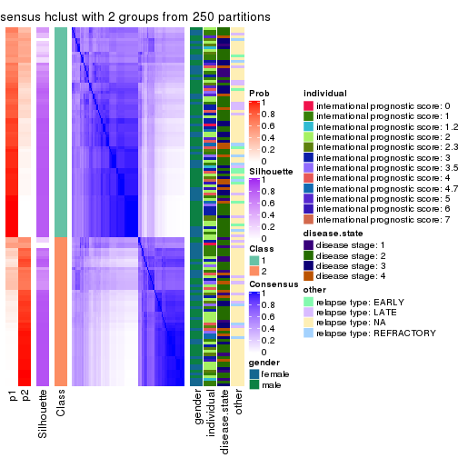</p>

</div>
<div id='tab-SD-hclust-consensus-heatmap-2'>
<pre><code class="r">consensus_heatmap(res, k = 3)
</code></pre>

<p>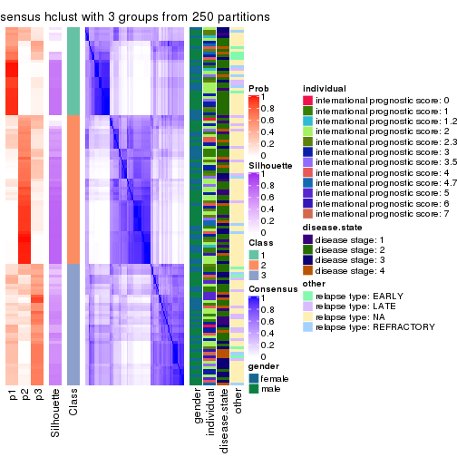</p>

</div>
<div id='tab-SD-hclust-consensus-heatmap-3'>
<pre><code class="r">consensus_heatmap(res, k = 4)
</code></pre>

<p>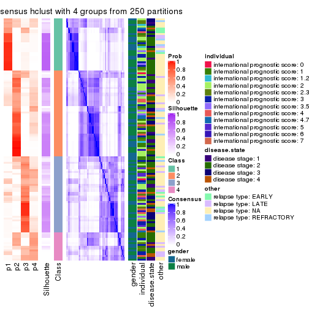</p>

</div>
<div id='tab-SD-hclust-consensus-heatmap-4'>
<pre><code class="r">consensus_heatmap(res, k = 5)
</code></pre>

<p>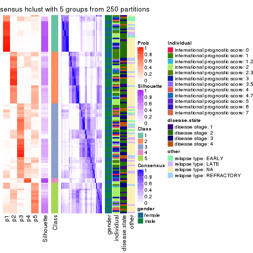</p>

</div>
<div id='tab-SD-hclust-consensus-heatmap-5'>
<pre><code class="r">consensus_heatmap(res, k = 6)
</code></pre>

<p>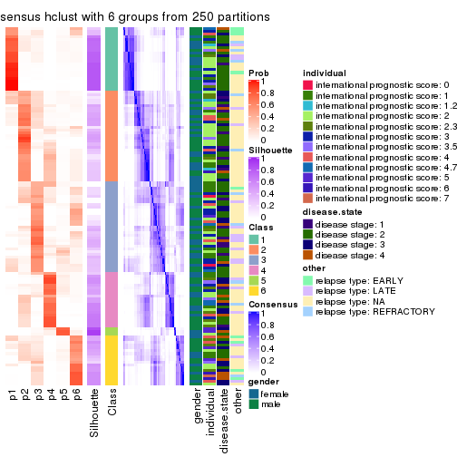</p>

</div>
</div>

Heatmaps for the membership of samples in all partitions to see how consistent they are:


<script>
$( function() {
	$( '#tabs-SD-hclust-membership-heatmap' ).tabs();
} );
</script>
<div id='tabs-SD-hclust-membership-heatmap'>
<ul>
<li><a href='#tab-SD-hclust-membership-heatmap-1'>k = 2</a></li>
<li><a href='#tab-SD-hclust-membership-heatmap-2'>k = 3</a></li>
<li><a href='#tab-SD-hclust-membership-heatmap-3'>k = 4</a></li>
<li><a href='#tab-SD-hclust-membership-heatmap-4'>k = 5</a></li>
<li><a href='#tab-SD-hclust-membership-heatmap-5'>k = 6</a></li>
</ul>
<div id='tab-SD-hclust-membership-heatmap-1'>
<pre><code class="r">membership_heatmap(res, k = 2)
</code></pre>

<p>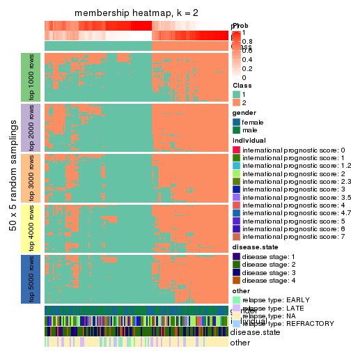</p>

</div>
<div id='tab-SD-hclust-membership-heatmap-2'>
<pre><code class="r">membership_heatmap(res, k = 3)
</code></pre>

<p>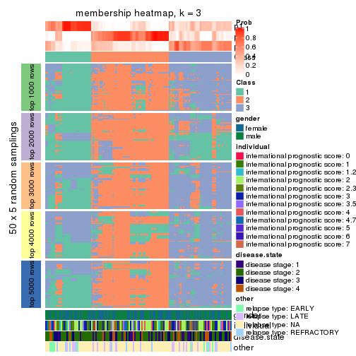</p>

</div>
<div id='tab-SD-hclust-membership-heatmap-3'>
<pre><code class="r">membership_heatmap(res, k = 4)
</code></pre>

<p>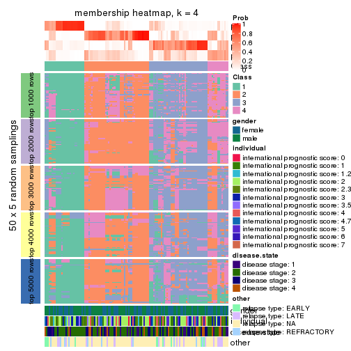</p>

</div>
<div id='tab-SD-hclust-membership-heatmap-4'>
<pre><code class="r">membership_heatmap(res, k = 5)
</code></pre>

<p>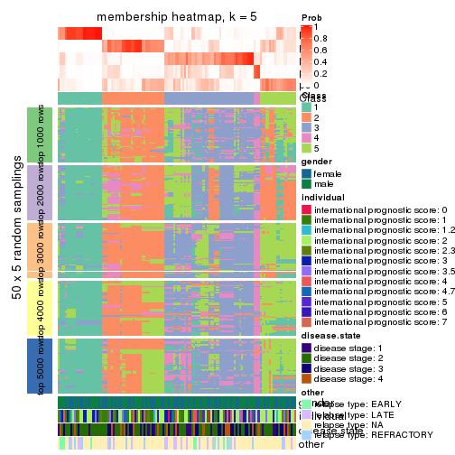</p>

</div>
<div id='tab-SD-hclust-membership-heatmap-5'>
<pre><code class="r">membership_heatmap(res, k = 6)
</code></pre>

<p>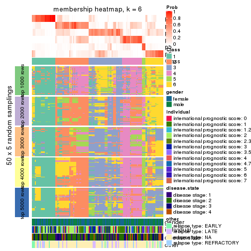</p>

</div>
</div>

As soon as we have had the classes for columns, we can look for signatures
which are significantly different between classes which can be candidate marks
for certain classes. Following are the heatmaps for signatures.


Signature heatmaps where rows are scaled:


<script>
$( function() {
	$( '#tabs-SD-hclust-get-signatures' ).tabs();
} );
</script>
<div id='tabs-SD-hclust-get-signatures'>
<ul>
<li><a href='#tab-SD-hclust-get-signatures-1'>k = 2</a></li>
<li><a href='#tab-SD-hclust-get-signatures-2'>k = 3</a></li>
<li><a href='#tab-SD-hclust-get-signatures-3'>k = 4</a></li>
<li><a href='#tab-SD-hclust-get-signatures-4'>k = 5</a></li>
<li><a href='#tab-SD-hclust-get-signatures-5'>k = 6</a></li>
</ul>
<div id='tab-SD-hclust-get-signatures-1'>
<pre><code class="r">get_signatures(res, k = 2)
</code></pre>

<p>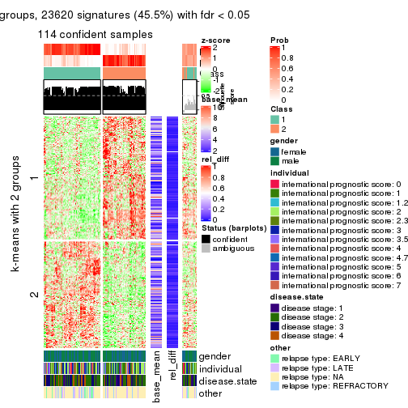</p>

</div>
<div id='tab-SD-hclust-get-signatures-2'>
<pre><code class="r">get_signatures(res, k = 3)
</code></pre>

<p>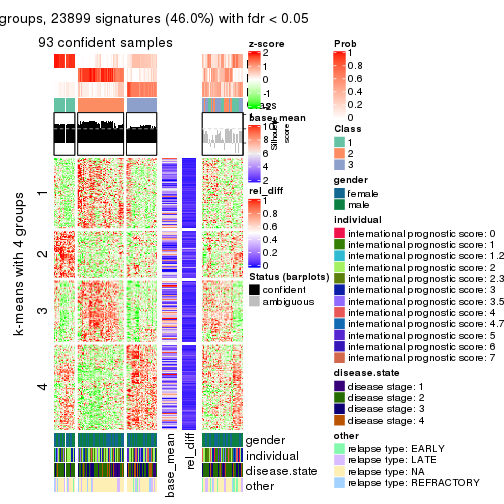</p>

</div>
<div id='tab-SD-hclust-get-signatures-3'>
<pre><code class="r">get_signatures(res, k = 4)
</code></pre>

<p>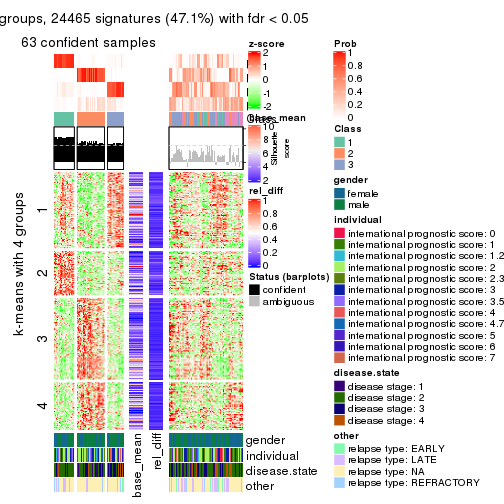</p>

</div>
<div id='tab-SD-hclust-get-signatures-4'>
<pre><code class="r">get_signatures(res, k = 5)
</code></pre>

<p>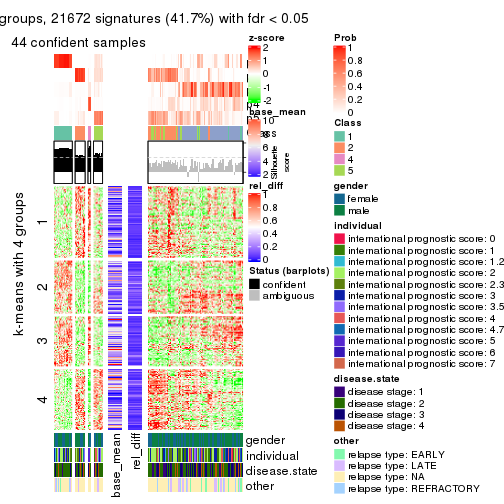</p>

</div>
<div id='tab-SD-hclust-get-signatures-5'>
<pre><code class="r">get_signatures(res, k = 6)
</code></pre>

<p>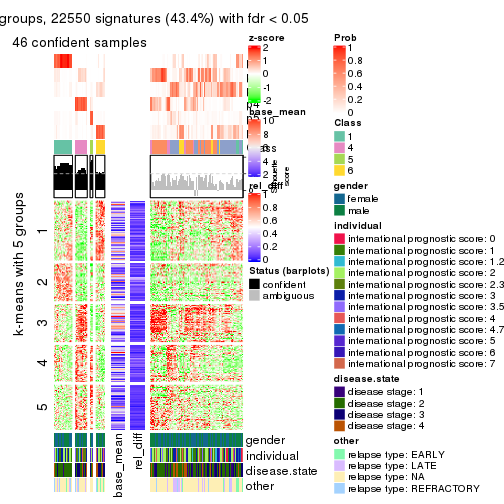</p>

</div>
</div>


Signature heatmaps where rows are not scaled:


<script>
$( function() {
	$( '#tabs-SD-hclust-get-signatures-no-scale' ).tabs();
} );
</script>
<div id='tabs-SD-hclust-get-signatures-no-scale'>
<ul>
<li><a href='#tab-SD-hclust-get-signatures-no-scale-1'>k = 2</a></li>
<li><a href='#tab-SD-hclust-get-signatures-no-scale-2'>k = 3</a></li>
<li><a href='#tab-SD-hclust-get-signatures-no-scale-3'>k = 4</a></li>
<li><a href='#tab-SD-hclust-get-signatures-no-scale-4'>k = 5</a></li>
<li><a href='#tab-SD-hclust-get-signatures-no-scale-5'>k = 6</a></li>
</ul>
<div id='tab-SD-hclust-get-signatures-no-scale-1'>
<pre><code class="r">get_signatures(res, k = 2, scale_rows = FALSE)
</code></pre>

<p>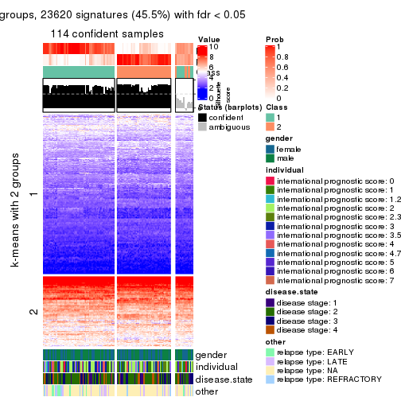</p>

</div>
<div id='tab-SD-hclust-get-signatures-no-scale-2'>
<pre><code class="r">get_signatures(res, k = 3, scale_rows = FALSE)
</code></pre>

<p>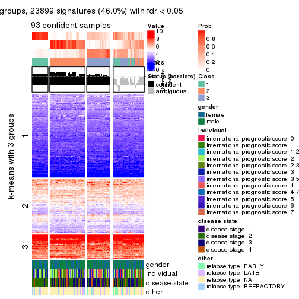</p>

</div>
<div id='tab-SD-hclust-get-signatures-no-scale-3'>
<pre><code class="r">get_signatures(res, k = 4, scale_rows = FALSE)
</code></pre>

<p>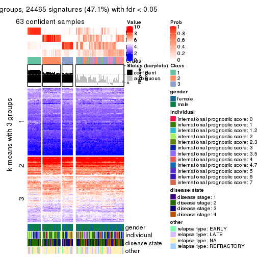</p>

</div>
<div id='tab-SD-hclust-get-signatures-no-scale-4'>
<pre><code class="r">get_signatures(res, k = 5, scale_rows = FALSE)
</code></pre>

<p>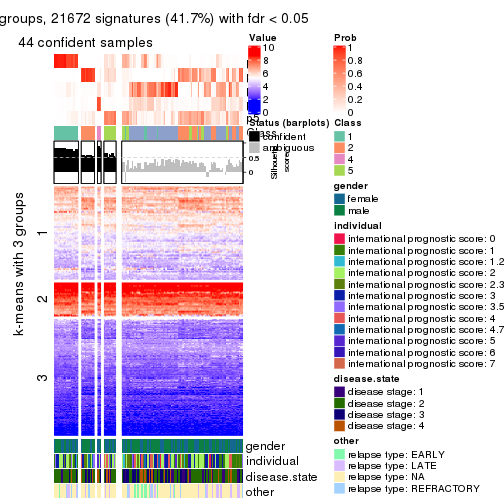</p>

</div>
<div id='tab-SD-hclust-get-signatures-no-scale-5'>
<pre><code class="r">get_signatures(res, k = 6, scale_rows = FALSE)
</code></pre>

<p>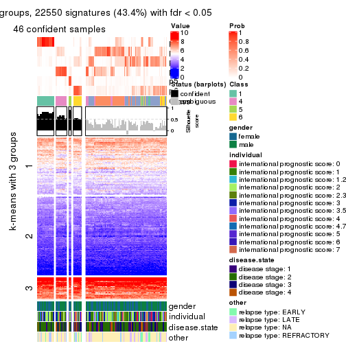</p>

</div>
</div>


Compare the overlap of signatures from different k:

```r
compare_signatures(res)
```

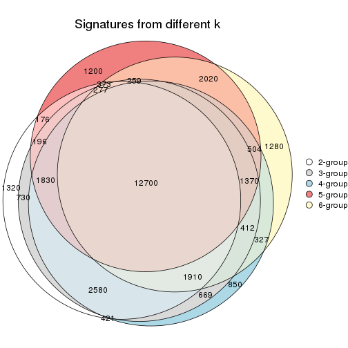

`get_signature()` returns a data frame invisibly. TO get the list of signatures, the function
call should be assigned to a variable explicitly. In following code, if `plot` argument is set
to `FALSE`, no heatmap is plotted while only the differential analysis is performed.

```r
# code only for demonstration
tb = get_signature(res, k = ..., plot = FALSE)
```

An example of the output of `tb` is:

```
#>   which_row         fdr    mean_1    mean_2 scaled_mean_1 scaled_mean_2 km
#> 1        38 0.042760348  8.373488  9.131774    -0.5533452     0.5164555  1
#> 2        40 0.018707592  7.106213  8.469186    -0.6173731     0.5762149  1
#> 3        55 0.019134737 10.221463 11.207825    -0.6159697     0.5749050  1
#> 4        59 0.006059896  5.921854  7.869574    -0.6899429     0.6439467  1
#> 5        60 0.018055526  8.928898 10.211722    -0.6204761     0.5791110  1
#> 6        98 0.009384629 15.714769 14.887706     0.6635654    -0.6193277  2
...
```

The columns in `tb` are:

1. `which_row`: row indices corresponding to the input matrix.
2. `fdr`: FDR for the differential test. 
3. `mean_x`: The mean value in group x.
4. `scaled_mean_x`: The mean value in group x after rows are scaled.
5. `km`: Row groups if k-means clustering is applied to rows.


UMAP plot which shows how samples are separated.


<script>
$( function() {
	$( '#tabs-SD-hclust-dimension-reduction' ).tabs();
} );
</script>
<div id='tabs-SD-hclust-dimension-reduction'>
<ul>
<li><a href='#tab-SD-hclust-dimension-reduction-1'>k = 2</a></li>
<li><a href='#tab-SD-hclust-dimension-reduction-2'>k = 3</a></li>
<li><a href='#tab-SD-hclust-dimension-reduction-3'>k = 4</a></li>
<li><a href='#tab-SD-hclust-dimension-reduction-4'>k = 5</a></li>
<li><a href='#tab-SD-hclust-dimension-reduction-5'>k = 6</a></li>
</ul>
<div id='tab-SD-hclust-dimension-reduction-1'>
<pre><code class="r">dimension_reduction(res, k = 2, method = &quot;UMAP&quot;)
</code></pre>

<p>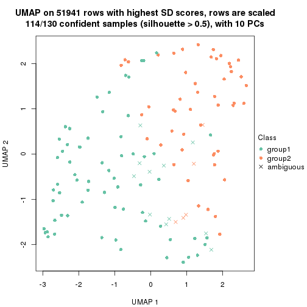</p>

</div>
<div id='tab-SD-hclust-dimension-reduction-2'>
<pre><code class="r">dimension_reduction(res, k = 3, method = &quot;UMAP&quot;)
</code></pre>

<p>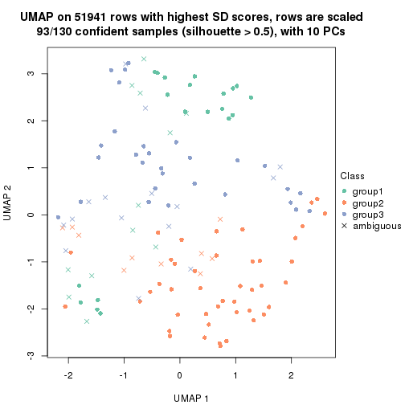</p>

</div>
<div id='tab-SD-hclust-dimension-reduction-3'>
<pre><code class="r">dimension_reduction(res, k = 4, method = &quot;UMAP&quot;)
</code></pre>

<p>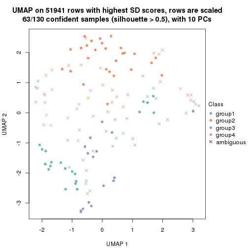</p>

</div>
<div id='tab-SD-hclust-dimension-reduction-4'>
<pre><code class="r">dimension_reduction(res, k = 5, method = &quot;UMAP&quot;)
</code></pre>

<p>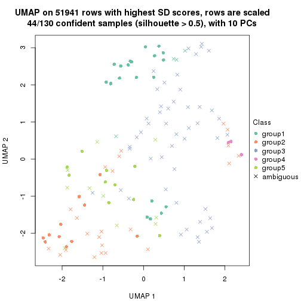</p>

</div>
<div id='tab-SD-hclust-dimension-reduction-5'>
<pre><code class="r">dimension_reduction(res, k = 6, method = &quot;UMAP&quot;)
</code></pre>

<p>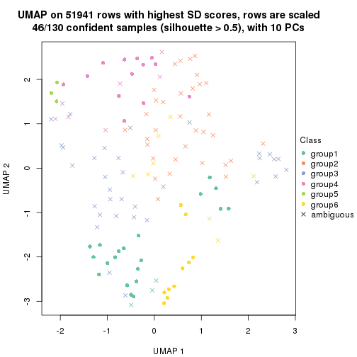</p>

</div>
</div>


Following heatmap shows how subgroups are split when increasing `k`:

```r
collect_classes(res)
```

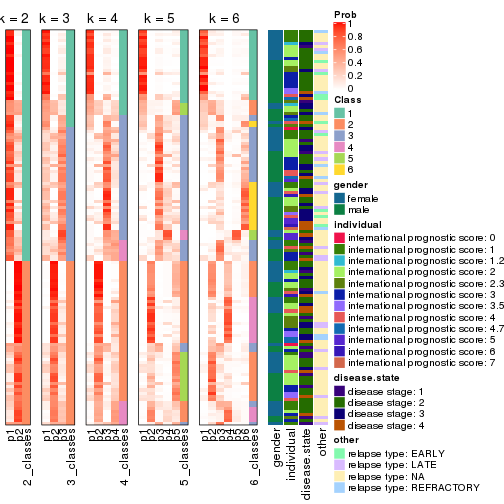


Test correlation between subgroups and known annotations. If the known
annotation is numeric, one-way ANOVA test is applied, and if the known
annotation is discrete, chi-squared contingency table test is applied.

```r
test_to_known_factors(res)
```

```
#>             n gender(p) individual(p) disease.state(p) other(p) k
#> SD:hclust 114     0.444       0.69812          0.50199   0.0339 2
#> SD:hclust  93     0.807       0.40216          0.08058   0.4330 3
#> SD:hclust  63     0.486       0.44396          0.00129   0.3327 4
#> SD:hclust  44     0.404       0.00255          0.46874   0.8622 5
#> SD:hclust  46     0.599       0.01659          0.04028   0.4354 6
```


If matrix rows can be associated to genes, consider to use `GO_Enrichment(res,
...)` to perform function enrichment for the signature genes.


 

---------------------------------------------------


### SD:kmeans


The object with results only for a single top-value method and a single partition method 
can be extracted as:

```r
res = res_list["SD", "kmeans"]
# you can also extract it by
# res = res_list["SD:kmeans"]
```

A summary of `res` and all the functions that can be applied to it:

```r
res
```

```
#> A 'ConsensusPartition' object with k = 2, 3, 4, 5, 6.
#>   On a matrix with 51941 rows and 130 columns.
#>   Top rows (1000, 2000, 3000, 4000, 5000) are extracted by 'SD' method.
#>   Subgroups are detected by 'kmeans' method.
#>   Performed in total 1250 partitions by row resampling.
#>   Best k for subgroups seems to be 2.
#> 
#> Following methods can be applied to this 'ConsensusPartition' object:
#>  [1] "cola_report"             "collect_classes"         "collect_plots"          
#>  [4] "collect_stats"           "colnames"                "compare_signatures"     
#>  [7] "consensus_heatmap"       "dimension_reduction"     "functional_enrichment"  
#> [10] "get_anno_col"            "get_anno"                "get_classes"            
#> [13] "get_consensus"           "get_matrix"              "get_membership"         
#> [16] "get_param"               "get_signatures"          "get_stats"              
#> [19] "is_best_k"               "is_stable_k"             "membership_heatmap"     
#> [22] "ncol"                    "nrow"                    "plot_ecdf"              
#> [25] "rownames"                "select_partition_number" "show"                   
#> [28] "suggest_best_k"          "test_to_known_factors"
```

`collect_plots()` function collects all the plots made from `res` for all `k` (number of partitions)
into one single page to provide an easy and fast comparison between different `k`.

```r
collect_plots(res)
```

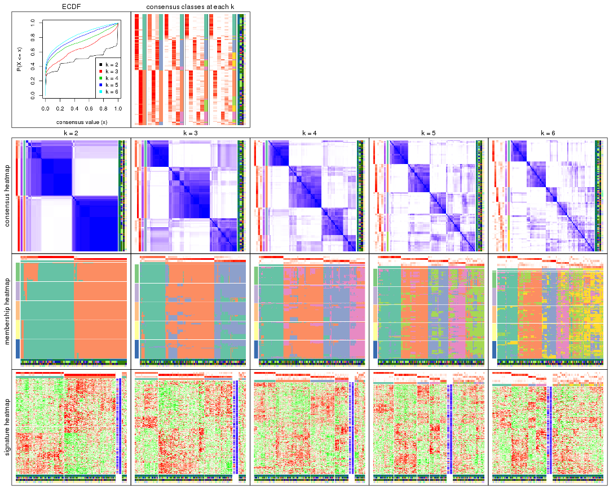

The plots are:

- The first row: a plot of the ECDF (Empirical cumulative distribution
  function) curves of the consensus matrix for each `k` and the heatmap of
  predicted classes for each `k`.
- The second row: heatmaps of the consensus matrix for each `k`.
- The third row: heatmaps of the membership matrix for each `k`.
- The fouth row: heatmaps of the signatures for each `k`.

All the plots in panels can be made by individual functions and they are
plotted later in this section.

`select_partition_number()` produces several plots showing different
statistics for choosing "optimized" `k`. There are following statistics:

- ECDF curves of the consensus matrix for each `k`;
- 1-PAC. [The PAC
  score](https://en.wikipedia.org/wiki/Consensus_clustering#Over-interpretation_potential_of_consensus_clustering)
  measures the proportion of the ambiguous subgrouping.
- Mean silhouette score.
- Concordance. The mean probability of fiting the consensus class ids in all
  partitions.
- Area increased. Denote $A_k$ as the area under the ECDF curve for current
  `k`, the area increased is defined as $A_k - A_{k-1}$.
- Rand index. The percent of pairs of samples that are both in a same cluster
  or both are not in a same cluster in the partition of k and k-1.
- Jaccard index. The ratio of pairs of samples are both in a same cluster in
  the partition of k and k-1 and the pairs of samples are both in a same
  cluster in the partition k or k-1.

The detailed explanations of these statistics can be found in [the cola
vignette](http://bioconductor.org/packages/devel/bioc/vignettes/cola/inst/doc/cola.html#toc_13).

Generally speaking, lower PAC score, higher mean silhouette score or higher
concordance corresponds to better partition. Rand index and Jaccard index
measure how similar the current partition is compared to partition with `k-1`.
If they are too similar, we won't accept `k` is better than `k-1`.

```r
select_partition_number(res)
```

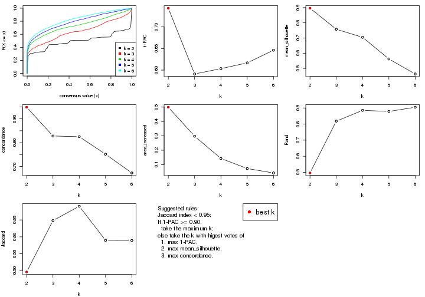

The numeric values for all these statistics can be obtained by `get_stats()`.

```r
get_stats(res)
```

```
#>   k 1-PAC mean_silhouette concordance area_increased  Rand Jaccard
#> 2 2 0.743           0.896       0.949         0.4991 0.496   0.496
#> 3 3 0.591           0.758       0.828         0.2978 0.818   0.648
#> 4 4 0.603           0.704       0.825         0.1428 0.885   0.690
#> 5 5 0.617           0.562       0.752         0.0731 0.878   0.590
#> 6 6 0.646           0.463       0.673         0.0422 0.905   0.589
```

`suggest_best_k()` suggests the best $k$ based on these statistics. The rules are as follows:

- All $k$ with Jaccard index larger than 0.95 are removed because the increase of
  the partition number does not provides enough extra information. If all $k$ are removed,
  the best $k$ is assigned by `NA`.
- For $k$ with 1-PAC larger than 0.9, the maximal $k$ is taken as the "best k". Other $k$ is called "optional k".
- If it does not fit the second rule. The $k$ with the highest vote of highest
  1-PAC, mean silhouette and concordance is taken as the "best k".

```r
suggest_best_k(res)
```

```
#> [1] 2
```


Following shows the table of the partitions (You need to click the **show/hide
code output** link to see it). The membership matrix (columns with name `p*`)
is inferred by
[`clue::cl_consensus()`](https://www.rdocumentation.org/link/cl_consensus?package=clue)
function with the `SE` method. Basically the value in the membership matrix
represents the probability to belong to a certain group. The finall class
label for an item is determined with the group with highest probability it
belongs to.

In `get_classes()` function, the entropy is calculated from the membership
matrix and the silhouette score is calculated from the consensus matrix.


<script>
$( function() {
	$( '#tabs-SD-kmeans-get-classes' ).tabs();
} );
</script>
<div id='tabs-SD-kmeans-get-classes'>
<ul>
<li><a href='#tab-SD-kmeans-get-classes-1'>k = 2</a></li>
<li><a href='#tab-SD-kmeans-get-classes-2'>k = 3</a></li>
<li><a href='#tab-SD-kmeans-get-classes-3'>k = 4</a></li>
<li><a href='#tab-SD-kmeans-get-classes-4'>k = 5</a></li>
<li><a href='#tab-SD-kmeans-get-classes-5'>k = 6</a></li>
</ul>

<div id='tab-SD-kmeans-get-classes-1'>
<p><a id='tab-SD-kmeans-get-classes-1-a' style='color:#0366d6' href='#'>show/hide code output</a></p>
<pre><code class="r">cbind(get_classes(res, k = 2), get_membership(res, k = 2))
</code></pre>

<pre><code>#&gt;           class entropy silhouette    p1    p2
#&gt; GSM447671     2  0.0672      0.975 0.008 0.992
#&gt; GSM447694     1  0.0000      0.909 1.000 0.000
#&gt; GSM447618     2  0.0000      0.979 0.000 1.000
#&gt; GSM447691     2  0.0000      0.979 0.000 1.000
#&gt; GSM447733     2  0.0938      0.972 0.012 0.988
#&gt; GSM447620     2  0.0672      0.975 0.008 0.992
#&gt; GSM447627     1  0.0000      0.909 1.000 0.000
#&gt; GSM447630     2  0.0000      0.979 0.000 1.000
#&gt; GSM447642     1  0.0672      0.910 0.992 0.008
#&gt; GSM447649     2  0.0000      0.979 0.000 1.000
#&gt; GSM447654     2  0.0000      0.979 0.000 1.000
#&gt; GSM447655     2  0.0000      0.979 0.000 1.000
#&gt; GSM447669     2  0.0000      0.979 0.000 1.000
#&gt; GSM447676     1  0.0672      0.910 0.992 0.008
#&gt; GSM447678     2  0.0000      0.979 0.000 1.000
#&gt; GSM447681     2  0.0000      0.979 0.000 1.000
#&gt; GSM447698     2  0.0000      0.979 0.000 1.000
#&gt; GSM447713     1  0.0672      0.910 0.992 0.008
#&gt; GSM447722     2  0.0000      0.979 0.000 1.000
#&gt; GSM447726     2  0.1414      0.963 0.020 0.980
#&gt; GSM447735     1  0.6438      0.824 0.836 0.164
#&gt; GSM447737     1  0.0672      0.910 0.992 0.008
#&gt; GSM447657     2  0.0000      0.979 0.000 1.000
#&gt; GSM447674     2  0.0000      0.979 0.000 1.000
#&gt; GSM447636     1  0.7299      0.737 0.796 0.204
#&gt; GSM447723     1  0.0672      0.910 0.992 0.008
#&gt; GSM447699     1  0.9661      0.466 0.608 0.392
#&gt; GSM447708     2  0.0000      0.979 0.000 1.000
#&gt; GSM447721     1  0.0672      0.910 0.992 0.008
#&gt; GSM447623     1  0.0672      0.910 0.992 0.008
#&gt; GSM447621     1  0.0672      0.910 0.992 0.008
#&gt; GSM447650     2  0.0000      0.979 0.000 1.000
#&gt; GSM447651     2  0.0672      0.975 0.008 0.992
#&gt; GSM447653     1  0.3733      0.879 0.928 0.072
#&gt; GSM447658     1  0.0672      0.910 0.992 0.008
#&gt; GSM447675     2  0.0000      0.979 0.000 1.000
#&gt; GSM447680     2  0.1184      0.967 0.016 0.984
#&gt; GSM447686     2  0.7056      0.746 0.192 0.808
#&gt; GSM447736     1  0.6623      0.811 0.828 0.172
#&gt; GSM447629     2  0.1184      0.967 0.016 0.984
#&gt; GSM447648     1  0.0000      0.909 1.000 0.000
#&gt; GSM447660     1  0.0672      0.910 0.992 0.008
#&gt; GSM447661     2  0.0000      0.979 0.000 1.000
#&gt; GSM447663     1  0.7056      0.794 0.808 0.192
#&gt; GSM447704     2  0.0000      0.979 0.000 1.000
#&gt; GSM447720     1  0.6801      0.811 0.820 0.180
#&gt; GSM447652     2  0.0000      0.979 0.000 1.000
#&gt; GSM447679     2  0.0000      0.979 0.000 1.000
#&gt; GSM447712     1  0.0672      0.910 0.992 0.008
#&gt; GSM447664     2  0.1184      0.967 0.016 0.984
#&gt; GSM447637     1  0.0000      0.909 1.000 0.000
#&gt; GSM447639     2  0.9635      0.238 0.388 0.612
#&gt; GSM447615     1  0.0000      0.909 1.000 0.000
#&gt; GSM447656     2  0.1184      0.967 0.016 0.984
#&gt; GSM447673     2  0.0000      0.979 0.000 1.000
#&gt; GSM447719     1  0.0000      0.909 1.000 0.000
#&gt; GSM447706     1  0.0000      0.909 1.000 0.000
#&gt; GSM447612     1  0.9710      0.447 0.600 0.400
#&gt; GSM447665     2  0.0672      0.975 0.008 0.992
#&gt; GSM447677     2  0.0672      0.975 0.008 0.992
#&gt; GSM447613     1  0.0672      0.910 0.992 0.008
#&gt; GSM447659     1  0.8763      0.655 0.704 0.296
#&gt; GSM447662     1  0.7056      0.794 0.808 0.192
#&gt; GSM447666     1  0.6623      0.811 0.828 0.172
#&gt; GSM447668     2  0.0000      0.979 0.000 1.000
#&gt; GSM447682     2  0.0000      0.979 0.000 1.000
#&gt; GSM447683     2  0.0000      0.979 0.000 1.000
#&gt; GSM447688     2  0.0000      0.979 0.000 1.000
#&gt; GSM447702     2  0.0000      0.979 0.000 1.000
#&gt; GSM447709     2  0.0672      0.975 0.008 0.992
#&gt; GSM447711     1  0.0672      0.910 0.992 0.008
#&gt; GSM447715     1  0.9686      0.369 0.604 0.396
#&gt; GSM447693     1  0.0000      0.909 1.000 0.000
#&gt; GSM447611     2  0.7056      0.746 0.192 0.808
#&gt; GSM447672     2  0.0000      0.979 0.000 1.000
#&gt; GSM447703     2  0.0000      0.979 0.000 1.000
#&gt; GSM447727     1  0.0672      0.910 0.992 0.008
#&gt; GSM447638     1  0.9754      0.337 0.592 0.408
#&gt; GSM447670     1  0.0000      0.909 1.000 0.000
#&gt; GSM447700     2  0.0672      0.975 0.008 0.992
#&gt; GSM447738     2  0.0000      0.979 0.000 1.000
#&gt; GSM447739     1  0.0672      0.910 0.992 0.008
#&gt; GSM447617     1  0.0672      0.910 0.992 0.008
#&gt; GSM447628     2  0.0000      0.979 0.000 1.000
#&gt; GSM447632     2  0.0000      0.979 0.000 1.000
#&gt; GSM447619     1  0.6973      0.798 0.812 0.188
#&gt; GSM447643     1  0.9775      0.326 0.588 0.412
#&gt; GSM447724     2  0.3431      0.919 0.064 0.936
#&gt; GSM447728     2  0.0000      0.979 0.000 1.000
#&gt; GSM447610     1  0.0672      0.910 0.992 0.008
#&gt; GSM447633     2  0.0672      0.975 0.008 0.992
#&gt; GSM447634     1  0.6801      0.811 0.820 0.180
#&gt; GSM447622     1  0.0000      0.909 1.000 0.000
#&gt; GSM447667     2  0.4815      0.869 0.104 0.896
#&gt; GSM447687     2  0.0000      0.979 0.000 1.000
#&gt; GSM447695     1  0.0672      0.910 0.992 0.008
#&gt; GSM447696     1  0.0672      0.910 0.992 0.008
#&gt; GSM447697     1  0.0672      0.910 0.992 0.008
#&gt; GSM447714     1  0.7056      0.794 0.808 0.192
#&gt; GSM447717     1  0.0672      0.910 0.992 0.008
#&gt; GSM447725     1  0.0672      0.910 0.992 0.008
#&gt; GSM447729     2  0.0000      0.979 0.000 1.000
#&gt; GSM447644     2  0.0672      0.975 0.008 0.992
#&gt; GSM447710     1  0.0376      0.909 0.996 0.004
#&gt; GSM447614     1  0.0672      0.910 0.992 0.008
#&gt; GSM447685     2  0.0000      0.979 0.000 1.000
#&gt; GSM447690     1  0.0672      0.910 0.992 0.008
#&gt; GSM447730     2  0.0672      0.975 0.008 0.992
#&gt; GSM447646     2  0.0000      0.979 0.000 1.000
#&gt; GSM447689     1  0.6531      0.815 0.832 0.168
#&gt; GSM447635     2  0.0000      0.979 0.000 1.000
#&gt; GSM447641     1  0.0672      0.910 0.992 0.008
#&gt; GSM447716     2  0.0000      0.979 0.000 1.000
#&gt; GSM447718     1  0.9170      0.592 0.668 0.332
#&gt; GSM447616     1  0.0000      0.909 1.000 0.000
#&gt; GSM447626     1  0.0000      0.909 1.000 0.000
#&gt; GSM447640     2  0.0000      0.979 0.000 1.000
#&gt; GSM447734     1  0.7056      0.794 0.808 0.192
#&gt; GSM447692     1  0.0672      0.910 0.992 0.008
#&gt; GSM447647     2  0.0376      0.977 0.004 0.996
#&gt; GSM447624     1  0.0000      0.909 1.000 0.000
#&gt; GSM447625     1  0.7056      0.794 0.808 0.192
#&gt; GSM447707     2  0.0000      0.979 0.000 1.000
#&gt; GSM447732     1  0.6623      0.811 0.828 0.172
#&gt; GSM447684     1  0.0000      0.909 1.000 0.000
#&gt; GSM447731     2  0.0672      0.975 0.008 0.992
#&gt; GSM447705     2  0.3431      0.919 0.064 0.936
#&gt; GSM447631     1  0.0000      0.909 1.000 0.000
#&gt; GSM447701     2  0.0672      0.975 0.008 0.992
#&gt; GSM447645     1  0.0000      0.909 1.000 0.000
</code></pre>

<script>
$('#tab-SD-kmeans-get-classes-1-a').parent().next().next().hide();
$('#tab-SD-kmeans-get-classes-1-a').click(function(){
  $('#tab-SD-kmeans-get-classes-1-a').parent().next().next().toggle();
  return(false);
});
</script>
</div>

<div id='tab-SD-kmeans-get-classes-2'>
<p><a id='tab-SD-kmeans-get-classes-2-a' style='color:#0366d6' href='#'>show/hide code output</a></p>
<pre><code class="r">cbind(get_classes(res, k = 3), get_membership(res, k = 3))
</code></pre>

<pre><code>#&gt;           class entropy silhouette    p1    p2    p3
#&gt; GSM447671     2  0.4291      0.770 0.000 0.820 0.180
#&gt; GSM447694     3  0.2066      0.764 0.060 0.000 0.940
#&gt; GSM447618     2  0.3921      0.852 0.036 0.884 0.080
#&gt; GSM447691     2  0.3412      0.819 0.000 0.876 0.124
#&gt; GSM447733     3  0.6562      0.619 0.264 0.036 0.700
#&gt; GSM447620     2  0.5650      0.580 0.000 0.688 0.312
#&gt; GSM447627     3  0.3551      0.756 0.132 0.000 0.868
#&gt; GSM447630     2  0.5763      0.651 0.008 0.716 0.276
#&gt; GSM447642     1  0.5291      0.891 0.732 0.000 0.268
#&gt; GSM447649     2  0.0000      0.874 0.000 1.000 0.000
#&gt; GSM447654     2  0.6839      0.691 0.272 0.684 0.044
#&gt; GSM447655     2  0.0000      0.874 0.000 1.000 0.000
#&gt; GSM447669     2  0.4291      0.770 0.000 0.820 0.180
#&gt; GSM447676     1  0.5291      0.891 0.732 0.000 0.268
#&gt; GSM447678     2  0.5812      0.726 0.264 0.724 0.012
#&gt; GSM447681     2  0.0237      0.873 0.004 0.996 0.000
#&gt; GSM447698     2  0.1647      0.866 0.036 0.960 0.004
#&gt; GSM447713     1  0.5327      0.889 0.728 0.000 0.272
#&gt; GSM447722     2  0.8430      0.624 0.260 0.604 0.136
#&gt; GSM447726     2  0.6451      0.447 0.008 0.608 0.384
#&gt; GSM447735     3  0.7995      0.603 0.304 0.088 0.608
#&gt; GSM447737     1  0.5678      0.839 0.684 0.000 0.316
#&gt; GSM447657     2  0.0237      0.873 0.004 0.996 0.000
#&gt; GSM447674     2  0.0237      0.873 0.004 0.996 0.000
#&gt; GSM447636     1  0.5291      0.891 0.732 0.000 0.268
#&gt; GSM447723     1  0.5327      0.890 0.728 0.000 0.272
#&gt; GSM447699     3  0.6151      0.639 0.068 0.160 0.772
#&gt; GSM447708     2  0.1289      0.868 0.000 0.968 0.032
#&gt; GSM447721     1  0.5327      0.889 0.728 0.000 0.272
#&gt; GSM447623     1  0.5397      0.884 0.720 0.000 0.280
#&gt; GSM447621     1  0.5397      0.884 0.720 0.000 0.280
#&gt; GSM447650     2  0.0000      0.874 0.000 1.000 0.000
#&gt; GSM447651     2  0.1031      0.870 0.000 0.976 0.024
#&gt; GSM447653     3  0.5835      0.637 0.340 0.000 0.660
#&gt; GSM447658     1  0.5291      0.891 0.732 0.000 0.268
#&gt; GSM447675     2  0.6839      0.691 0.272 0.684 0.044
#&gt; GSM447680     2  0.1585      0.867 0.008 0.964 0.028
#&gt; GSM447686     1  0.7726      0.343 0.572 0.372 0.056
#&gt; GSM447736     3  0.1399      0.777 0.028 0.004 0.968
#&gt; GSM447629     2  0.1267      0.871 0.004 0.972 0.024
#&gt; GSM447648     3  0.4121      0.662 0.168 0.000 0.832
#&gt; GSM447660     1  0.5291      0.891 0.732 0.000 0.268
#&gt; GSM447661     2  0.0000      0.874 0.000 1.000 0.000
#&gt; GSM447663     3  0.2339      0.759 0.012 0.048 0.940
#&gt; GSM447704     2  0.0000      0.874 0.000 1.000 0.000
#&gt; GSM447720     3  0.1877      0.767 0.012 0.032 0.956
#&gt; GSM447652     2  0.0000      0.874 0.000 1.000 0.000
#&gt; GSM447679     2  0.0000      0.874 0.000 1.000 0.000
#&gt; GSM447712     1  0.5254      0.891 0.736 0.000 0.264
#&gt; GSM447664     2  0.5884      0.720 0.272 0.716 0.012
#&gt; GSM447637     3  0.4121      0.662 0.168 0.000 0.832
#&gt; GSM447639     3  0.9299      0.423 0.292 0.196 0.512
#&gt; GSM447615     1  0.6154      0.660 0.592 0.000 0.408
#&gt; GSM447656     2  0.1585      0.867 0.008 0.964 0.028
#&gt; GSM447673     2  0.2400      0.857 0.064 0.932 0.004
#&gt; GSM447719     3  0.5948      0.632 0.360 0.000 0.640
#&gt; GSM447706     3  0.3412      0.713 0.124 0.000 0.876
#&gt; GSM447612     3  0.2066      0.755 0.000 0.060 0.940
#&gt; GSM447665     2  0.1964      0.860 0.000 0.944 0.056
#&gt; GSM447677     2  0.1031      0.870 0.000 0.976 0.024
#&gt; GSM447613     1  0.5254      0.891 0.736 0.000 0.264
#&gt; GSM447659     3  0.5497      0.640 0.292 0.000 0.708
#&gt; GSM447662     3  0.0829      0.774 0.004 0.012 0.984
#&gt; GSM447666     3  0.3918      0.700 0.012 0.120 0.868
#&gt; GSM447668     2  0.1031      0.870 0.000 0.976 0.024
#&gt; GSM447682     2  0.0237      0.873 0.004 0.996 0.000
#&gt; GSM447683     2  0.1031      0.870 0.000 0.976 0.024
#&gt; GSM447688     2  0.5365      0.741 0.252 0.744 0.004
#&gt; GSM447702     2  0.0000      0.874 0.000 1.000 0.000
#&gt; GSM447709     2  0.2537      0.848 0.000 0.920 0.080
#&gt; GSM447711     1  0.5254      0.891 0.736 0.000 0.264
#&gt; GSM447715     1  0.7999      0.575 0.656 0.196 0.148
#&gt; GSM447693     3  0.2356      0.757 0.072 0.000 0.928
#&gt; GSM447611     2  0.7634      0.509 0.432 0.524 0.044
#&gt; GSM447672     2  0.0000      0.874 0.000 1.000 0.000
#&gt; GSM447703     2  0.2400      0.857 0.064 0.932 0.004
#&gt; GSM447727     1  0.5327      0.890 0.728 0.000 0.272
#&gt; GSM447638     1  0.8604      0.442 0.564 0.312 0.124
#&gt; GSM447670     1  0.5363      0.887 0.724 0.000 0.276
#&gt; GSM447700     2  0.6034      0.741 0.036 0.752 0.212
#&gt; GSM447738     2  0.1878      0.864 0.044 0.952 0.004
#&gt; GSM447739     1  0.5327      0.889 0.728 0.000 0.272
#&gt; GSM447617     1  0.5397      0.884 0.720 0.000 0.280
#&gt; GSM447628     2  0.5812      0.726 0.264 0.724 0.012
#&gt; GSM447632     2  0.1878      0.864 0.044 0.952 0.004
#&gt; GSM447619     3  0.1525      0.774 0.032 0.004 0.964
#&gt; GSM447643     1  0.7769      0.570 0.660 0.232 0.108
#&gt; GSM447724     3  0.7146      0.605 0.264 0.060 0.676
#&gt; GSM447728     2  0.1031      0.870 0.000 0.976 0.024
#&gt; GSM447610     1  0.3192      0.589 0.888 0.000 0.112
#&gt; GSM447633     2  0.6359      0.491 0.008 0.628 0.364
#&gt; GSM447634     3  0.3590      0.746 0.028 0.076 0.896
#&gt; GSM447622     3  0.5178      0.503 0.256 0.000 0.744
#&gt; GSM447667     2  0.3459      0.820 0.096 0.892 0.012
#&gt; GSM447687     2  0.2400      0.857 0.064 0.932 0.004
#&gt; GSM447695     3  0.3267      0.716 0.116 0.000 0.884
#&gt; GSM447696     1  0.5327      0.889 0.728 0.000 0.272
#&gt; GSM447697     1  0.5327      0.889 0.728 0.000 0.272
#&gt; GSM447714     3  0.1620      0.778 0.024 0.012 0.964
#&gt; GSM447717     1  0.5291      0.891 0.732 0.000 0.268
#&gt; GSM447725     1  0.5254      0.891 0.736 0.000 0.264
#&gt; GSM447729     2  0.5884      0.720 0.272 0.716 0.012
#&gt; GSM447644     2  0.4700      0.765 0.008 0.812 0.180
#&gt; GSM447710     3  0.1399      0.776 0.028 0.004 0.968
#&gt; GSM447614     3  0.5363      0.677 0.276 0.000 0.724
#&gt; GSM447685     2  0.1031      0.870 0.000 0.976 0.024
#&gt; GSM447690     1  0.5327      0.889 0.728 0.000 0.272
#&gt; GSM447730     2  0.0000      0.874 0.000 1.000 0.000
#&gt; GSM447646     2  0.5812      0.726 0.264 0.724 0.012
#&gt; GSM447689     3  0.1182      0.772 0.012 0.012 0.976
#&gt; GSM447635     2  0.5849      0.733 0.028 0.756 0.216
#&gt; GSM447641     1  0.5291      0.891 0.732 0.000 0.268
#&gt; GSM447716     2  0.1878      0.864 0.044 0.952 0.004
#&gt; GSM447718     3  0.2280      0.757 0.008 0.052 0.940
#&gt; GSM447616     3  0.5397      0.446 0.280 0.000 0.720
#&gt; GSM447626     3  0.1989      0.759 0.048 0.004 0.948
#&gt; GSM447640     2  0.0000      0.874 0.000 1.000 0.000
#&gt; GSM447734     3  0.1399      0.777 0.028 0.004 0.968
#&gt; GSM447692     3  0.5291      0.477 0.268 0.000 0.732
#&gt; GSM447647     2  0.5656      0.729 0.264 0.728 0.008
#&gt; GSM447624     1  0.5882      0.789 0.652 0.000 0.348
#&gt; GSM447625     3  0.1399      0.777 0.028 0.004 0.968
#&gt; GSM447707     2  0.0000      0.874 0.000 1.000 0.000
#&gt; GSM447732     3  0.1525      0.775 0.032 0.004 0.964
#&gt; GSM447684     3  0.6298     -0.153 0.388 0.004 0.608
#&gt; GSM447731     2  0.9909      0.024 0.268 0.368 0.364
#&gt; GSM447705     3  0.5728      0.514 0.008 0.272 0.720
#&gt; GSM447631     3  0.3619      0.700 0.136 0.000 0.864
#&gt; GSM447701     2  0.1031      0.870 0.000 0.976 0.024
#&gt; GSM447645     3  0.4121      0.662 0.168 0.000 0.832
</code></pre>

<script>
$('#tab-SD-kmeans-get-classes-2-a').parent().next().next().hide();
$('#tab-SD-kmeans-get-classes-2-a').click(function(){
  $('#tab-SD-kmeans-get-classes-2-a').parent().next().next().toggle();
  return(false);
});
</script>
</div>

<div id='tab-SD-kmeans-get-classes-3'>
<p><a id='tab-SD-kmeans-get-classes-3-a' style='color:#0366d6' href='#'>show/hide code output</a></p>
<pre><code class="r">cbind(get_classes(res, k = 4), get_membership(res, k = 4))
</code></pre>

<pre><code>#&gt;           class entropy silhouette    p1    p2    p3    p4
#&gt; GSM447671     2  0.6907     0.5457 0.012 0.632 0.180 0.176
#&gt; GSM447694     3  0.2999     0.7951 0.004 0.000 0.864 0.132
#&gt; GSM447618     2  0.5523     0.6466 0.012 0.696 0.032 0.260
#&gt; GSM447691     2  0.6515     0.5877 0.012 0.672 0.156 0.160
#&gt; GSM447733     4  0.4277     0.5388 0.000 0.000 0.280 0.720
#&gt; GSM447620     2  0.4991     0.6120 0.008 0.744 0.220 0.028
#&gt; GSM447627     3  0.4905     0.4901 0.004 0.000 0.632 0.364
#&gt; GSM447630     2  0.6852     0.3366 0.012 0.576 0.324 0.088
#&gt; GSM447642     1  0.1151     0.9021 0.968 0.000 0.008 0.024
#&gt; GSM447649     2  0.2704     0.7492 0.000 0.876 0.000 0.124
#&gt; GSM447654     4  0.3074     0.7320 0.000 0.152 0.000 0.848
#&gt; GSM447655     2  0.2469     0.7543 0.000 0.892 0.000 0.108
#&gt; GSM447669     2  0.6426     0.5575 0.012 0.676 0.188 0.124
#&gt; GSM447676     1  0.0921     0.8995 0.972 0.000 0.000 0.028
#&gt; GSM447678     4  0.3208     0.7230 0.000 0.148 0.004 0.848
#&gt; GSM447681     2  0.3157     0.7560 0.000 0.852 0.004 0.144
#&gt; GSM447698     2  0.4819     0.6050 0.000 0.652 0.004 0.344
#&gt; GSM447713     1  0.0804     0.9027 0.980 0.000 0.012 0.008
#&gt; GSM447722     4  0.2843     0.7265 0.000 0.088 0.020 0.892
#&gt; GSM447726     2  0.6730     0.4975 0.012 0.628 0.252 0.108
#&gt; GSM447735     4  0.4284     0.5570 0.012 0.000 0.224 0.764
#&gt; GSM447737     1  0.2443     0.8634 0.916 0.000 0.060 0.024
#&gt; GSM447657     2  0.3539     0.7529 0.000 0.820 0.004 0.176
#&gt; GSM447674     2  0.3402     0.7536 0.000 0.832 0.004 0.164
#&gt; GSM447636     1  0.1118     0.8966 0.964 0.000 0.000 0.036
#&gt; GSM447723     1  0.1389     0.8924 0.952 0.000 0.000 0.048
#&gt; GSM447699     3  0.4955     0.6523 0.004 0.024 0.728 0.244
#&gt; GSM447708     2  0.3774     0.7335 0.008 0.844 0.020 0.128
#&gt; GSM447721     1  0.0804     0.9027 0.980 0.000 0.012 0.008
#&gt; GSM447623     1  0.0937     0.9016 0.976 0.000 0.012 0.012
#&gt; GSM447621     1  0.0937     0.9016 0.976 0.000 0.012 0.012
#&gt; GSM447650     2  0.2408     0.7548 0.000 0.896 0.000 0.104
#&gt; GSM447651     2  0.0188     0.7587 0.000 0.996 0.004 0.000
#&gt; GSM447653     4  0.4277     0.5186 0.000 0.000 0.280 0.720
#&gt; GSM447658     1  0.1118     0.8966 0.964 0.000 0.000 0.036
#&gt; GSM447675     4  0.2814     0.7355 0.000 0.132 0.000 0.868
#&gt; GSM447680     2  0.2342     0.7479 0.008 0.912 0.000 0.080
#&gt; GSM447686     1  0.5323     0.6867 0.748 0.172 0.004 0.076
#&gt; GSM447736     3  0.2773     0.7964 0.004 0.000 0.880 0.116
#&gt; GSM447629     2  0.3612     0.7334 0.012 0.840 0.004 0.144
#&gt; GSM447648     3  0.3895     0.7344 0.132 0.000 0.832 0.036
#&gt; GSM447660     1  0.1118     0.8966 0.964 0.000 0.000 0.036
#&gt; GSM447661     2  0.2408     0.7548 0.000 0.896 0.000 0.104
#&gt; GSM447663     3  0.5011     0.7520 0.016 0.120 0.792 0.072
#&gt; GSM447704     2  0.2760     0.7478 0.000 0.872 0.000 0.128
#&gt; GSM447720     3  0.6360     0.6645 0.012 0.128 0.684 0.176
#&gt; GSM447652     2  0.2714     0.7540 0.000 0.884 0.004 0.112
#&gt; GSM447679     2  0.3024     0.7599 0.000 0.852 0.000 0.148
#&gt; GSM447712     1  0.0927     0.9029 0.976 0.000 0.008 0.016
#&gt; GSM447664     4  0.2530     0.7302 0.000 0.112 0.000 0.888
#&gt; GSM447637     3  0.3707     0.7342 0.132 0.000 0.840 0.028
#&gt; GSM447639     4  0.4562     0.6200 0.000 0.028 0.208 0.764
#&gt; GSM447615     1  0.5781     0.2941 0.584 0.000 0.380 0.036
#&gt; GSM447656     2  0.3447     0.7380 0.020 0.852 0.000 0.128
#&gt; GSM447673     2  0.4889     0.5625 0.000 0.636 0.004 0.360
#&gt; GSM447719     3  0.5167    -0.1493 0.004 0.000 0.508 0.488
#&gt; GSM447706     3  0.1584     0.7985 0.012 0.000 0.952 0.036
#&gt; GSM447612     3  0.2198     0.8043 0.008 0.000 0.920 0.072
#&gt; GSM447665     2  0.1575     0.7496 0.004 0.956 0.028 0.012
#&gt; GSM447677     2  0.0188     0.7587 0.000 0.996 0.004 0.000
#&gt; GSM447613     1  0.0336     0.9035 0.992 0.000 0.008 0.000
#&gt; GSM447659     4  0.4746     0.3443 0.000 0.000 0.368 0.632
#&gt; GSM447662     3  0.1004     0.8079 0.004 0.000 0.972 0.024
#&gt; GSM447666     3  0.3703     0.7298 0.012 0.140 0.840 0.008
#&gt; GSM447668     2  0.0000     0.7592 0.000 1.000 0.000 0.000
#&gt; GSM447682     2  0.3448     0.7536 0.000 0.828 0.004 0.168
#&gt; GSM447683     2  0.1940     0.7630 0.000 0.924 0.000 0.076
#&gt; GSM447688     4  0.4313     0.6328 0.000 0.260 0.004 0.736
#&gt; GSM447702     2  0.2469     0.7543 0.000 0.892 0.000 0.108
#&gt; GSM447709     2  0.1406     0.7489 0.000 0.960 0.024 0.016
#&gt; GSM447711     1  0.0336     0.9035 0.992 0.000 0.008 0.000
#&gt; GSM447715     1  0.5511     0.7039 0.752 0.148 0.012 0.088
#&gt; GSM447693     3  0.1488     0.7981 0.012 0.000 0.956 0.032
#&gt; GSM447611     4  0.2748     0.7356 0.020 0.072 0.004 0.904
#&gt; GSM447672     2  0.2530     0.7541 0.000 0.888 0.000 0.112
#&gt; GSM447703     2  0.4720     0.5649 0.000 0.672 0.004 0.324
#&gt; GSM447727     1  0.1302     0.8937 0.956 0.000 0.000 0.044
#&gt; GSM447638     2  0.7688     0.4217 0.232 0.584 0.140 0.044
#&gt; GSM447670     1  0.2179     0.8767 0.924 0.000 0.064 0.012
#&gt; GSM447700     2  0.7832     0.3752 0.012 0.492 0.204 0.292
#&gt; GSM447738     2  0.4905     0.5624 0.000 0.632 0.004 0.364
#&gt; GSM447739     1  0.0804     0.9027 0.980 0.000 0.012 0.008
#&gt; GSM447617     1  0.1059     0.8999 0.972 0.000 0.012 0.016
#&gt; GSM447628     4  0.3837     0.6905 0.000 0.224 0.000 0.776
#&gt; GSM447632     2  0.4920     0.5603 0.000 0.628 0.004 0.368
#&gt; GSM447619     3  0.1004     0.8079 0.004 0.000 0.972 0.024
#&gt; GSM447643     1  0.3962     0.7859 0.832 0.124 0.000 0.044
#&gt; GSM447724     4  0.4511     0.5699 0.000 0.008 0.268 0.724
#&gt; GSM447728     2  0.2197     0.7632 0.000 0.916 0.004 0.080
#&gt; GSM447610     1  0.5643     0.2210 0.548 0.000 0.024 0.428
#&gt; GSM447633     2  0.6459     0.4986 0.012 0.648 0.252 0.088
#&gt; GSM447634     3  0.5281     0.7249 0.016 0.044 0.752 0.188
#&gt; GSM447622     3  0.4951     0.6782 0.212 0.000 0.744 0.044
#&gt; GSM447667     2  0.4912     0.7089 0.060 0.776 0.004 0.160
#&gt; GSM447687     2  0.4720     0.5649 0.000 0.672 0.004 0.324
#&gt; GSM447695     3  0.4590     0.7567 0.036 0.000 0.772 0.192
#&gt; GSM447696     1  0.0804     0.9027 0.980 0.000 0.012 0.008
#&gt; GSM447697     1  0.0804     0.9027 0.980 0.000 0.012 0.008
#&gt; GSM447714     3  0.1661     0.8071 0.004 0.000 0.944 0.052
#&gt; GSM447717     1  0.0921     0.8989 0.972 0.000 0.000 0.028
#&gt; GSM447725     1  0.0524     0.9036 0.988 0.000 0.008 0.004
#&gt; GSM447729     4  0.2973     0.7244 0.000 0.144 0.000 0.856
#&gt; GSM447644     2  0.5898     0.5775 0.012 0.716 0.184 0.088
#&gt; GSM447710     3  0.0376     0.8042 0.004 0.000 0.992 0.004
#&gt; GSM447614     4  0.5075     0.3481 0.012 0.000 0.344 0.644
#&gt; GSM447685     2  0.2647     0.7569 0.000 0.880 0.000 0.120
#&gt; GSM447690     1  0.0804     0.9027 0.980 0.000 0.012 0.008
#&gt; GSM447730     2  0.2760     0.7478 0.000 0.872 0.000 0.128
#&gt; GSM447646     4  0.3837     0.6905 0.000 0.224 0.000 0.776
#&gt; GSM447689     3  0.2781     0.7839 0.016 0.072 0.904 0.008
#&gt; GSM447635     2  0.7726     0.4027 0.012 0.500 0.180 0.308
#&gt; GSM447641     1  0.0469     0.9021 0.988 0.000 0.000 0.012
#&gt; GSM447716     2  0.5415     0.5055 0.008 0.552 0.004 0.436
#&gt; GSM447718     3  0.4900     0.7571 0.016 0.112 0.800 0.072
#&gt; GSM447616     3  0.5358     0.6286 0.252 0.000 0.700 0.048
#&gt; GSM447626     3  0.2853     0.7821 0.016 0.076 0.900 0.008
#&gt; GSM447640     2  0.3266     0.7530 0.000 0.832 0.000 0.168
#&gt; GSM447734     3  0.2266     0.8031 0.004 0.000 0.912 0.084
#&gt; GSM447692     3  0.6461     0.6622 0.216 0.000 0.640 0.144
#&gt; GSM447647     4  0.3907     0.6868 0.000 0.232 0.000 0.768
#&gt; GSM447624     1  0.5696    -0.0715 0.496 0.000 0.480 0.024
#&gt; GSM447625     3  0.2266     0.8031 0.004 0.000 0.912 0.084
#&gt; GSM447707     2  0.2760     0.7478 0.000 0.872 0.000 0.128
#&gt; GSM447732     3  0.2561     0.8057 0.004 0.016 0.912 0.068
#&gt; GSM447684     3  0.6809     0.6302 0.128 0.140 0.684 0.048
#&gt; GSM447731     4  0.5619     0.7055 0.000 0.152 0.124 0.724
#&gt; GSM447705     3  0.3920     0.7780 0.012 0.076 0.856 0.056
#&gt; GSM447631     3  0.3707     0.7342 0.132 0.000 0.840 0.028
#&gt; GSM447701     2  0.0188     0.7587 0.000 0.996 0.004 0.000
#&gt; GSM447645     3  0.3707     0.7342 0.132 0.000 0.840 0.028
</code></pre>

<script>
$('#tab-SD-kmeans-get-classes-3-a').parent().next().next().hide();
$('#tab-SD-kmeans-get-classes-3-a').click(function(){
  $('#tab-SD-kmeans-get-classes-3-a').parent().next().next().toggle();
  return(false);
});
</script>
</div>

<div id='tab-SD-kmeans-get-classes-4'>
<p><a id='tab-SD-kmeans-get-classes-4-a' style='color:#0366d6' href='#'>show/hide code output</a></p>
<pre><code class="r">cbind(get_classes(res, k = 5), get_membership(res, k = 5))
</code></pre>

<pre><code>#&gt;           class entropy silhouette    p1    p2    p3    p4    p5
#&gt; GSM447671     5  0.4107    0.57575 0.004 0.112 0.008 0.068 0.808
#&gt; GSM447694     3  0.4712    0.54879 0.000 0.000 0.684 0.048 0.268
#&gt; GSM447618     5  0.5314    0.46251 0.000 0.136 0.000 0.192 0.672
#&gt; GSM447691     5  0.4806    0.56431 0.004 0.156 0.004 0.092 0.744
#&gt; GSM447733     4  0.4385    0.62658 0.000 0.000 0.068 0.752 0.180
#&gt; GSM447620     5  0.6563    0.24142 0.000 0.384 0.132 0.016 0.468
#&gt; GSM447627     3  0.6538    0.23730 0.000 0.000 0.480 0.272 0.248
#&gt; GSM447630     5  0.4800    0.57468 0.004 0.176 0.056 0.016 0.748
#&gt; GSM447642     1  0.1568    0.86737 0.944 0.000 0.000 0.020 0.036
#&gt; GSM447649     2  0.1117    0.77004 0.000 0.964 0.000 0.016 0.020
#&gt; GSM447654     4  0.2881    0.67220 0.000 0.124 0.004 0.860 0.012
#&gt; GSM447655     2  0.0162    0.77327 0.000 0.996 0.000 0.004 0.000
#&gt; GSM447669     5  0.4539    0.59096 0.004 0.184 0.020 0.032 0.760
#&gt; GSM447676     1  0.1750    0.86639 0.936 0.000 0.000 0.028 0.036
#&gt; GSM447678     4  0.5136    0.51586 0.000 0.080 0.000 0.660 0.260
#&gt; GSM447681     2  0.2450    0.76691 0.000 0.900 0.000 0.052 0.048
#&gt; GSM447698     2  0.6554    0.36747 0.000 0.476 0.000 0.272 0.252
#&gt; GSM447713     1  0.1267    0.86602 0.960 0.000 0.012 0.004 0.024
#&gt; GSM447722     4  0.5533    0.43481 0.000 0.064 0.004 0.560 0.372
#&gt; GSM447726     5  0.5720    0.47494 0.004 0.276 0.040 0.040 0.640
#&gt; GSM447735     4  0.6319    0.42952 0.000 0.000 0.196 0.520 0.284
#&gt; GSM447737     1  0.4751    0.66937 0.732 0.000 0.204 0.016 0.048
#&gt; GSM447657     2  0.5060    0.62256 0.000 0.692 0.000 0.104 0.204
#&gt; GSM447674     2  0.2974    0.75528 0.000 0.868 0.000 0.080 0.052
#&gt; GSM447636     1  0.2300    0.85666 0.908 0.000 0.000 0.040 0.052
#&gt; GSM447723     1  0.2974    0.83888 0.868 0.000 0.000 0.052 0.080
#&gt; GSM447699     5  0.5821   -0.18898 0.000 0.000 0.400 0.096 0.504
#&gt; GSM447708     5  0.5853   -0.00674 0.000 0.432 0.000 0.096 0.472
#&gt; GSM447721     1  0.1267    0.86602 0.960 0.000 0.012 0.004 0.024
#&gt; GSM447623     1  0.2844    0.81958 0.876 0.000 0.092 0.004 0.028
#&gt; GSM447621     1  0.2548    0.83310 0.896 0.000 0.072 0.004 0.028
#&gt; GSM447650     2  0.0609    0.77166 0.000 0.980 0.000 0.000 0.020
#&gt; GSM447651     2  0.2286    0.73069 0.000 0.888 0.000 0.004 0.108
#&gt; GSM447653     4  0.4929    0.59589 0.000 0.000 0.136 0.716 0.148
#&gt; GSM447658     1  0.2228    0.85795 0.912 0.000 0.000 0.040 0.048
#&gt; GSM447675     4  0.2520    0.67208 0.000 0.056 0.000 0.896 0.048
#&gt; GSM447680     2  0.4953    0.61200 0.000 0.696 0.000 0.088 0.216
#&gt; GSM447686     1  0.5642    0.57902 0.644 0.008 0.000 0.112 0.236
#&gt; GSM447736     3  0.5175    0.41861 0.000 0.000 0.548 0.044 0.408
#&gt; GSM447629     5  0.6464   -0.10792 0.004 0.408 0.000 0.156 0.432
#&gt; GSM447648     3  0.1461    0.66262 0.028 0.000 0.952 0.004 0.016
#&gt; GSM447660     1  0.1830    0.86458 0.932 0.000 0.000 0.028 0.040
#&gt; GSM447661     2  0.0609    0.77166 0.000 0.980 0.000 0.000 0.020
#&gt; GSM447663     5  0.4947   -0.00214 0.004 0.024 0.396 0.000 0.576
#&gt; GSM447704     2  0.1106    0.76918 0.000 0.964 0.000 0.024 0.012
#&gt; GSM447720     5  0.4124    0.45791 0.004 0.008 0.124 0.060 0.804
#&gt; GSM447652     2  0.1750    0.77118 0.000 0.936 0.000 0.036 0.028
#&gt; GSM447679     2  0.2233    0.76747 0.000 0.904 0.000 0.080 0.016
#&gt; GSM447712     1  0.0671    0.87191 0.980 0.000 0.000 0.004 0.016
#&gt; GSM447664     4  0.2659    0.66134 0.000 0.052 0.000 0.888 0.060
#&gt; GSM447637     3  0.1082    0.66209 0.028 0.000 0.964 0.000 0.008
#&gt; GSM447639     4  0.5325    0.51037 0.000 0.000 0.076 0.616 0.308
#&gt; GSM447615     3  0.5495    0.20781 0.364 0.000 0.576 0.012 0.048
#&gt; GSM447656     2  0.6170    0.22530 0.004 0.492 0.000 0.120 0.384
#&gt; GSM447673     2  0.5342    0.51343 0.000 0.612 0.000 0.312 0.076
#&gt; GSM447719     4  0.4841    0.33121 0.000 0.000 0.416 0.560 0.024
#&gt; GSM447706     3  0.1329    0.66496 0.008 0.000 0.956 0.004 0.032
#&gt; GSM447612     5  0.4971   -0.21271 0.000 0.000 0.460 0.028 0.512
#&gt; GSM447665     2  0.4708    0.11396 0.000 0.548 0.000 0.016 0.436
#&gt; GSM447677     2  0.2763    0.70571 0.000 0.848 0.000 0.004 0.148
#&gt; GSM447613     1  0.0000    0.87108 1.000 0.000 0.000 0.000 0.000
#&gt; GSM447659     4  0.5892    0.47031 0.000 0.000 0.220 0.600 0.180
#&gt; GSM447662     3  0.3391    0.62194 0.000 0.000 0.800 0.012 0.188
#&gt; GSM447666     3  0.4505    0.29855 0.004 0.000 0.620 0.008 0.368
#&gt; GSM447668     2  0.2536    0.72404 0.000 0.868 0.000 0.004 0.128
#&gt; GSM447682     2  0.3239    0.75346 0.000 0.852 0.000 0.080 0.068
#&gt; GSM447683     2  0.4254    0.70250 0.000 0.772 0.000 0.080 0.148
#&gt; GSM447688     4  0.6224    0.20523 0.000 0.388 0.000 0.468 0.144
#&gt; GSM447702     2  0.0000    0.77398 0.000 1.000 0.000 0.000 0.000
#&gt; GSM447709     2  0.4227    0.48220 0.000 0.692 0.000 0.016 0.292
#&gt; GSM447711     1  0.0290    0.87044 0.992 0.000 0.000 0.000 0.008
#&gt; GSM447715     1  0.6113    0.29521 0.508 0.004 0.000 0.116 0.372
#&gt; GSM447693     3  0.0324    0.66384 0.004 0.000 0.992 0.000 0.004
#&gt; GSM447611     4  0.2300    0.66937 0.000 0.040 0.000 0.908 0.052
#&gt; GSM447672     2  0.0000    0.77398 0.000 1.000 0.000 0.000 0.000
#&gt; GSM447703     2  0.4666    0.56473 0.000 0.704 0.000 0.240 0.056
#&gt; GSM447727     1  0.2632    0.84703 0.888 0.000 0.000 0.040 0.072
#&gt; GSM447638     5  0.8954    0.27879 0.144 0.208 0.232 0.040 0.376
#&gt; GSM447670     1  0.4723    0.60114 0.688 0.000 0.272 0.008 0.032
#&gt; GSM447700     5  0.4249    0.51590 0.000 0.056 0.024 0.120 0.800
#&gt; GSM447738     2  0.5522    0.50580 0.000 0.600 0.000 0.308 0.092
#&gt; GSM447739     1  0.1267    0.86602 0.960 0.000 0.012 0.004 0.024
#&gt; GSM447617     1  0.3880    0.72822 0.784 0.000 0.184 0.004 0.028
#&gt; GSM447628     4  0.3618    0.64493 0.000 0.196 0.004 0.788 0.012
#&gt; GSM447632     2  0.5505    0.51032 0.000 0.604 0.000 0.304 0.092
#&gt; GSM447619     3  0.2818    0.64921 0.000 0.000 0.856 0.012 0.132
#&gt; GSM447643     1  0.3875    0.79031 0.816 0.012 0.000 0.048 0.124
#&gt; GSM447724     4  0.6017    0.36954 0.000 0.000 0.116 0.480 0.404
#&gt; GSM447728     2  0.4083    0.71751 0.000 0.788 0.000 0.080 0.132
#&gt; GSM447610     1  0.6626   -0.01700 0.436 0.000 0.088 0.436 0.040
#&gt; GSM447633     5  0.4952    0.55320 0.000 0.252 0.040 0.016 0.692
#&gt; GSM447634     5  0.5200    0.30828 0.004 0.004 0.208 0.088 0.696
#&gt; GSM447622     3  0.3461    0.63451 0.076 0.000 0.848 0.008 0.068
#&gt; GSM447667     5  0.6793   -0.09908 0.016 0.396 0.000 0.164 0.424
#&gt; GSM447687     2  0.4666    0.56523 0.000 0.704 0.000 0.240 0.056
#&gt; GSM447695     3  0.5872    0.27612 0.004 0.000 0.480 0.084 0.432
#&gt; GSM447696     1  0.1471    0.86347 0.952 0.000 0.020 0.004 0.024
#&gt; GSM447697     1  0.1560    0.86381 0.948 0.000 0.020 0.004 0.028
#&gt; GSM447714     3  0.4297    0.55232 0.000 0.000 0.692 0.020 0.288
#&gt; GSM447717     1  0.1386    0.86851 0.952 0.000 0.000 0.016 0.032
#&gt; GSM447725     1  0.0404    0.87136 0.988 0.000 0.000 0.012 0.000
#&gt; GSM447729     4  0.1956    0.66594 0.000 0.076 0.000 0.916 0.008
#&gt; GSM447644     5  0.4782    0.51189 0.004 0.300 0.020 0.008 0.668
#&gt; GSM447710     3  0.2629    0.63282 0.000 0.000 0.860 0.004 0.136
#&gt; GSM447614     4  0.6362    0.40166 0.000 0.000 0.224 0.520 0.256
#&gt; GSM447685     2  0.4855    0.66001 0.000 0.720 0.000 0.112 0.168
#&gt; GSM447690     1  0.1267    0.86602 0.960 0.000 0.012 0.004 0.024
#&gt; GSM447730     2  0.1106    0.76918 0.000 0.964 0.000 0.024 0.012
#&gt; GSM447646     4  0.3548    0.64852 0.000 0.188 0.004 0.796 0.012
#&gt; GSM447689     3  0.4253    0.38212 0.004 0.000 0.660 0.004 0.332
#&gt; GSM447635     5  0.4072    0.52152 0.004 0.056 0.004 0.136 0.800
#&gt; GSM447641     1  0.1211    0.86930 0.960 0.000 0.000 0.016 0.024
#&gt; GSM447716     4  0.6819   -0.19962 0.000 0.340 0.000 0.348 0.312
#&gt; GSM447718     5  0.5423    0.24486 0.004 0.036 0.308 0.020 0.632
#&gt; GSM447616     3  0.4130    0.61204 0.108 0.000 0.804 0.012 0.076
#&gt; GSM447626     3  0.4102    0.42352 0.004 0.000 0.692 0.004 0.300
#&gt; GSM447640     2  0.2189    0.76789 0.000 0.904 0.000 0.084 0.012
#&gt; GSM447734     3  0.4585    0.51662 0.000 0.000 0.628 0.020 0.352
#&gt; GSM447692     3  0.7153    0.45757 0.152 0.000 0.524 0.064 0.260
#&gt; GSM447647     4  0.3455    0.63834 0.000 0.208 0.000 0.784 0.008
#&gt; GSM447624     3  0.4725    0.44373 0.280 0.000 0.680 0.004 0.036
#&gt; GSM447625     3  0.4585    0.51545 0.000 0.000 0.628 0.020 0.352
#&gt; GSM447707     2  0.1106    0.76918 0.000 0.964 0.000 0.024 0.012
#&gt; GSM447732     3  0.4517    0.47672 0.000 0.000 0.600 0.012 0.388
#&gt; GSM447684     5  0.5820    0.07172 0.048 0.000 0.392 0.024 0.536
#&gt; GSM447731     4  0.5150    0.63762 0.000 0.140 0.080 0.740 0.040
#&gt; GSM447705     5  0.4837   -0.03542 0.004 0.000 0.424 0.016 0.556
#&gt; GSM447631     3  0.0992    0.66293 0.024 0.000 0.968 0.000 0.008
#&gt; GSM447701     2  0.2377    0.72016 0.000 0.872 0.000 0.000 0.128
#&gt; GSM447645     3  0.1082    0.66209 0.028 0.000 0.964 0.000 0.008
</code></pre>

<script>
$('#tab-SD-kmeans-get-classes-4-a').parent().next().next().hide();
$('#tab-SD-kmeans-get-classes-4-a').click(function(){
  $('#tab-SD-kmeans-get-classes-4-a').parent().next().next().toggle();
  return(false);
});
</script>
</div>

<div id='tab-SD-kmeans-get-classes-5'>
<p><a id='tab-SD-kmeans-get-classes-5-a' style='color:#0366d6' href='#'>show/hide code output</a></p>
<pre><code class="r">cbind(get_classes(res, k = 6), get_membership(res, k = 6))
</code></pre>

<pre><code>#&gt;           class entropy silhouette    p1    p2    p3    p4    p5    p6
#&gt; GSM447671     6  0.5487    0.16479 0.000 0.040 0.000 0.052 0.368 0.540
#&gt; GSM447694     6  0.5809    0.04902 0.000 0.000 0.432 0.044 0.068 0.456
#&gt; GSM447618     5  0.6056    0.28440 0.000 0.040 0.000 0.136 0.548 0.276
#&gt; GSM447691     5  0.5669   -0.00592 0.000 0.060 0.000 0.040 0.464 0.436
#&gt; GSM447733     4  0.4573    0.60588 0.000 0.000 0.024 0.716 0.060 0.200
#&gt; GSM447620     5  0.7902    0.14470 0.000 0.272 0.148 0.016 0.300 0.264
#&gt; GSM447627     6  0.6977    0.04288 0.000 0.000 0.224 0.276 0.076 0.424
#&gt; GSM447630     6  0.5214    0.34315 0.000 0.140 0.008 0.004 0.196 0.652
#&gt; GSM447642     1  0.2473    0.81827 0.856 0.000 0.000 0.000 0.136 0.008
#&gt; GSM447649     2  0.1851    0.69377 0.000 0.928 0.000 0.012 0.036 0.024
#&gt; GSM447654     4  0.1442    0.67589 0.000 0.040 0.000 0.944 0.004 0.012
#&gt; GSM447655     2  0.0665    0.69746 0.000 0.980 0.000 0.008 0.004 0.008
#&gt; GSM447669     6  0.5584    0.24934 0.000 0.132 0.000 0.016 0.268 0.584
#&gt; GSM447676     1  0.2743    0.80696 0.828 0.000 0.000 0.000 0.164 0.008
#&gt; GSM447678     5  0.5716    0.05696 0.000 0.024 0.000 0.388 0.496 0.092
#&gt; GSM447681     2  0.3381    0.63779 0.000 0.808 0.000 0.040 0.148 0.004
#&gt; GSM447698     5  0.6750    0.24509 0.000 0.248 0.000 0.200 0.480 0.072
#&gt; GSM447713     1  0.1515    0.83177 0.944 0.000 0.008 0.000 0.020 0.028
#&gt; GSM447722     5  0.6597    0.10738 0.000 0.028 0.004 0.316 0.432 0.220
#&gt; GSM447726     6  0.5948    0.02974 0.000 0.168 0.008 0.000 0.376 0.448
#&gt; GSM447735     6  0.7067   -0.14702 0.000 0.000 0.108 0.332 0.160 0.400
#&gt; GSM447737     1  0.5921    0.54605 0.644 0.000 0.136 0.016 0.052 0.152
#&gt; GSM447657     5  0.5521   -0.08538 0.000 0.444 0.000 0.052 0.468 0.036
#&gt; GSM447674     2  0.3658    0.63517 0.000 0.792 0.000 0.048 0.152 0.008
#&gt; GSM447636     1  0.2882    0.79753 0.812 0.000 0.000 0.000 0.180 0.008
#&gt; GSM447723     1  0.3705    0.74590 0.740 0.000 0.000 0.004 0.236 0.020
#&gt; GSM447699     6  0.6377    0.38789 0.000 0.000 0.196 0.088 0.152 0.564
#&gt; GSM447708     5  0.6288    0.23681 0.000 0.320 0.000 0.032 0.480 0.168
#&gt; GSM447721     1  0.1623    0.83169 0.940 0.000 0.004 0.004 0.020 0.032
#&gt; GSM447623     1  0.3163    0.78568 0.856 0.000 0.076 0.004 0.020 0.044
#&gt; GSM447621     1  0.3087    0.79250 0.864 0.000 0.056 0.004 0.024 0.052
#&gt; GSM447650     2  0.0820    0.69376 0.000 0.972 0.000 0.000 0.016 0.012
#&gt; GSM447651     2  0.2433    0.67036 0.000 0.884 0.000 0.000 0.072 0.044
#&gt; GSM447653     4  0.4323    0.61655 0.000 0.000 0.028 0.744 0.048 0.180
#&gt; GSM447658     1  0.2848    0.79995 0.816 0.000 0.000 0.000 0.176 0.008
#&gt; GSM447675     4  0.2933    0.62844 0.000 0.012 0.000 0.844 0.128 0.016
#&gt; GSM447680     2  0.4845    0.29329 0.000 0.540 0.000 0.000 0.400 0.060
#&gt; GSM447686     5  0.4459   -0.23749 0.460 0.000 0.000 0.004 0.516 0.020
#&gt; GSM447736     6  0.5374    0.31050 0.000 0.000 0.296 0.028 0.076 0.600
#&gt; GSM447629     5  0.5088    0.41471 0.000 0.184 0.000 0.032 0.684 0.100
#&gt; GSM447648     3  0.0551    0.68117 0.004 0.000 0.984 0.000 0.004 0.008
#&gt; GSM447660     1  0.2778    0.80466 0.824 0.000 0.000 0.000 0.168 0.008
#&gt; GSM447661     2  0.0820    0.69376 0.000 0.972 0.000 0.000 0.016 0.012
#&gt; GSM447663     6  0.5448    0.36460 0.000 0.068 0.232 0.000 0.060 0.640
#&gt; GSM447704     2  0.2415    0.68440 0.000 0.900 0.000 0.036 0.040 0.024
#&gt; GSM447720     6  0.3984    0.40277 0.000 0.008 0.012 0.012 0.236 0.732
#&gt; GSM447652     2  0.1933    0.69603 0.000 0.924 0.000 0.032 0.032 0.012
#&gt; GSM447679     2  0.2954    0.66868 0.000 0.852 0.000 0.048 0.096 0.004
#&gt; GSM447712     1  0.0790    0.84022 0.968 0.000 0.000 0.000 0.032 0.000
#&gt; GSM447664     4  0.3672    0.55772 0.000 0.004 0.000 0.712 0.276 0.008
#&gt; GSM447637     3  0.0291    0.68269 0.004 0.000 0.992 0.000 0.004 0.000
#&gt; GSM447639     4  0.5934    0.15652 0.000 0.000 0.016 0.452 0.136 0.396
#&gt; GSM447615     3  0.5361    0.42106 0.252 0.000 0.644 0.008 0.052 0.044
#&gt; GSM447656     5  0.5266    0.16761 0.016 0.328 0.000 0.000 0.580 0.076
#&gt; GSM447673     2  0.6280    0.21481 0.000 0.456 0.000 0.240 0.288 0.016
#&gt; GSM447719     4  0.4980    0.54984 0.000 0.000 0.248 0.660 0.024 0.068
#&gt; GSM447706     3  0.0858    0.68025 0.004 0.000 0.968 0.000 0.000 0.028
#&gt; GSM447612     6  0.4898    0.36142 0.000 0.000 0.252 0.024 0.060 0.664
#&gt; GSM447665     2  0.5899    0.02043 0.000 0.504 0.000 0.004 0.256 0.236
#&gt; GSM447677     2  0.3316    0.62346 0.000 0.812 0.000 0.000 0.136 0.052
#&gt; GSM447613     1  0.0260    0.83956 0.992 0.000 0.000 0.000 0.008 0.000
#&gt; GSM447659     4  0.5577    0.53791 0.000 0.000 0.080 0.640 0.068 0.212
#&gt; GSM447662     3  0.4056    0.50475 0.000 0.000 0.704 0.008 0.024 0.264
#&gt; GSM447666     3  0.4543    0.36732 0.000 0.004 0.604 0.000 0.036 0.356
#&gt; GSM447668     2  0.2905    0.64633 0.000 0.856 0.000 0.004 0.092 0.048
#&gt; GSM447682     2  0.4400    0.57027 0.000 0.708 0.000 0.052 0.228 0.012
#&gt; GSM447683     2  0.5063    0.50596 0.000 0.656 0.000 0.048 0.252 0.044
#&gt; GSM447688     5  0.6843    0.09091 0.000 0.276 0.000 0.332 0.348 0.044
#&gt; GSM447702     2  0.0436    0.69720 0.000 0.988 0.000 0.004 0.004 0.004
#&gt; GSM447709     2  0.4933    0.46957 0.000 0.684 0.000 0.012 0.136 0.168
#&gt; GSM447711     1  0.0000    0.83889 1.000 0.000 0.000 0.000 0.000 0.000
#&gt; GSM447715     5  0.4908    0.09016 0.348 0.000 0.000 0.004 0.584 0.064
#&gt; GSM447693     3  0.0146    0.68258 0.000 0.000 0.996 0.000 0.004 0.000
#&gt; GSM447611     4  0.2718    0.66617 0.004 0.004 0.000 0.876 0.072 0.044
#&gt; GSM447672     2  0.1262    0.69633 0.000 0.956 0.000 0.020 0.016 0.008
#&gt; GSM447703     2  0.5942    0.34412 0.000 0.552 0.000 0.232 0.196 0.020
#&gt; GSM447727     1  0.3217    0.76409 0.768 0.000 0.000 0.000 0.224 0.008
#&gt; GSM447638     5  0.8125    0.13524 0.112 0.160 0.092 0.000 0.416 0.220
#&gt; GSM447670     1  0.5155    0.19098 0.508 0.000 0.432 0.004 0.040 0.016
#&gt; GSM447700     6  0.5307    0.17361 0.000 0.004 0.004 0.080 0.384 0.528
#&gt; GSM447738     2  0.6270    0.11711 0.000 0.408 0.000 0.228 0.352 0.012
#&gt; GSM447739     1  0.1401    0.83260 0.948 0.000 0.004 0.000 0.020 0.028
#&gt; GSM447617     1  0.4538    0.63680 0.724 0.000 0.200 0.004 0.024 0.048
#&gt; GSM447628     4  0.3710    0.62104 0.000 0.108 0.000 0.804 0.076 0.012
#&gt; GSM447632     2  0.6325    0.11516 0.000 0.404 0.000 0.220 0.360 0.016
#&gt; GSM447619     3  0.2834    0.63110 0.000 0.000 0.852 0.008 0.020 0.120
#&gt; GSM447643     1  0.4170    0.62727 0.660 0.000 0.000 0.000 0.308 0.032
#&gt; GSM447724     6  0.6767    0.08923 0.000 0.000 0.052 0.216 0.312 0.420
#&gt; GSM447728     2  0.4799    0.53858 0.000 0.688 0.000 0.048 0.228 0.036
#&gt; GSM447610     4  0.7381    0.14894 0.368 0.000 0.032 0.384 0.088 0.128
#&gt; GSM447633     6  0.5934    0.22197 0.000 0.148 0.008 0.020 0.248 0.576
#&gt; GSM447634     6  0.4480    0.48381 0.000 0.008 0.072 0.032 0.124 0.764
#&gt; GSM447622     3  0.4559    0.54601 0.072 0.000 0.760 0.016 0.024 0.128
#&gt; GSM447667     5  0.5143    0.42529 0.008 0.168 0.000 0.036 0.700 0.088
#&gt; GSM447687     2  0.5918    0.35226 0.000 0.556 0.000 0.232 0.192 0.020
#&gt; GSM447695     6  0.6066    0.30934 0.004 0.000 0.244 0.048 0.124 0.580
#&gt; GSM447696     1  0.1942    0.82674 0.928 0.000 0.020 0.004 0.020 0.028
#&gt; GSM447697     1  0.1882    0.82919 0.928 0.000 0.020 0.000 0.024 0.028
#&gt; GSM447714     3  0.4565    0.00145 0.000 0.000 0.496 0.008 0.020 0.476
#&gt; GSM447717     1  0.2234    0.82281 0.872 0.000 0.000 0.000 0.124 0.004
#&gt; GSM447725     1  0.1082    0.83906 0.956 0.000 0.000 0.000 0.040 0.004
#&gt; GSM447729     4  0.2615    0.63280 0.000 0.008 0.000 0.852 0.136 0.004
#&gt; GSM447644     6  0.5679    0.17781 0.000 0.208 0.000 0.004 0.236 0.552
#&gt; GSM447710     3  0.3608    0.49978 0.000 0.000 0.716 0.000 0.012 0.272
#&gt; GSM447614     4  0.6583    0.19528 0.000 0.000 0.080 0.408 0.112 0.400
#&gt; GSM447685     2  0.5124    0.30908 0.000 0.544 0.000 0.028 0.392 0.036
#&gt; GSM447690     1  0.1515    0.83177 0.944 0.000 0.008 0.000 0.020 0.028
#&gt; GSM447730     2  0.2622    0.67922 0.000 0.888 0.000 0.044 0.044 0.024
#&gt; GSM447646     4  0.3710    0.62104 0.000 0.108 0.000 0.804 0.076 0.012
#&gt; GSM447689     3  0.4252    0.36231 0.000 0.000 0.604 0.000 0.024 0.372
#&gt; GSM447635     5  0.4555   -0.00791 0.000 0.000 0.000 0.036 0.540 0.424
#&gt; GSM447641     1  0.1970    0.83072 0.900 0.000 0.000 0.000 0.092 0.008
#&gt; GSM447716     5  0.5595    0.41307 0.000 0.116 0.000 0.160 0.656 0.068
#&gt; GSM447718     6  0.5795    0.44840 0.000 0.056 0.132 0.008 0.156 0.648
#&gt; GSM447616     3  0.5592    0.44864 0.096 0.000 0.660 0.016 0.036 0.192
#&gt; GSM447626     3  0.4047    0.38400 0.000 0.000 0.604 0.000 0.012 0.384
#&gt; GSM447640     2  0.2966    0.67100 0.000 0.856 0.000 0.048 0.088 0.008
#&gt; GSM447734     6  0.4079    0.18533 0.000 0.000 0.380 0.004 0.008 0.608
#&gt; GSM447692     6  0.7718    0.00130 0.172 0.000 0.320 0.048 0.080 0.380
#&gt; GSM447647     4  0.4176    0.61153 0.000 0.120 0.000 0.768 0.096 0.016
#&gt; GSM447624     3  0.4671    0.45594 0.268 0.000 0.672 0.004 0.016 0.040
#&gt; GSM447625     6  0.3905    0.20929 0.000 0.000 0.356 0.004 0.004 0.636
#&gt; GSM447707     2  0.2622    0.67922 0.000 0.888 0.000 0.044 0.044 0.024
#&gt; GSM447732     6  0.4371    0.21873 0.000 0.012 0.352 0.000 0.016 0.620
#&gt; GSM447684     6  0.6623    0.21838 0.056 0.004 0.152 0.000 0.312 0.476
#&gt; GSM447731     4  0.4153    0.64427 0.000 0.100 0.028 0.800 0.024 0.048
#&gt; GSM447705     6  0.5284    0.21919 0.000 0.000 0.332 0.012 0.084 0.572
#&gt; GSM447631     3  0.0146    0.68258 0.000 0.000 0.996 0.000 0.004 0.000
#&gt; GSM447701     2  0.2852    0.64428 0.000 0.856 0.000 0.000 0.080 0.064
#&gt; GSM447645     3  0.0291    0.68269 0.004 0.000 0.992 0.000 0.004 0.000
</code></pre>

<script>
$('#tab-SD-kmeans-get-classes-5-a').parent().next().next().hide();
$('#tab-SD-kmeans-get-classes-5-a').click(function(){
  $('#tab-SD-kmeans-get-classes-5-a').parent().next().next().toggle();
  return(false);
});
</script>
</div>
</div>

Heatmaps for the consensus matrix. It visualizes the probability of two
samples to be in a same group.


<script>
$( function() {
	$( '#tabs-SD-kmeans-consensus-heatmap' ).tabs();
} );
</script>
<div id='tabs-SD-kmeans-consensus-heatmap'>
<ul>
<li><a href='#tab-SD-kmeans-consensus-heatmap-1'>k = 2</a></li>
<li><a href='#tab-SD-kmeans-consensus-heatmap-2'>k = 3</a></li>
<li><a href='#tab-SD-kmeans-consensus-heatmap-3'>k = 4</a></li>
<li><a href='#tab-SD-kmeans-consensus-heatmap-4'>k = 5</a></li>
<li><a href='#tab-SD-kmeans-consensus-heatmap-5'>k = 6</a></li>
</ul>
<div id='tab-SD-kmeans-consensus-heatmap-1'>
<pre><code class="r">consensus_heatmap(res, k = 2)
</code></pre>

<p>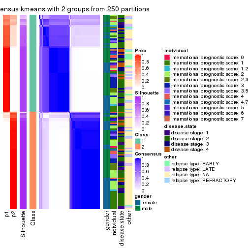</p>

</div>
<div id='tab-SD-kmeans-consensus-heatmap-2'>
<pre><code class="r">consensus_heatmap(res, k = 3)
</code></pre>

<p>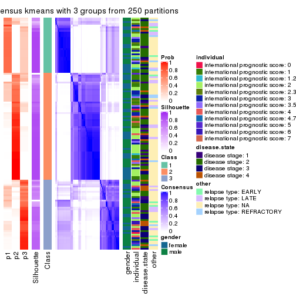</p>

</div>
<div id='tab-SD-kmeans-consensus-heatmap-3'>
<pre><code class="r">consensus_heatmap(res, k = 4)
</code></pre>

<p>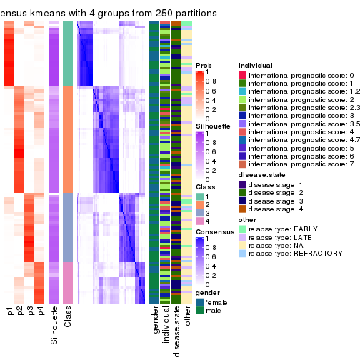</p>

</div>
<div id='tab-SD-kmeans-consensus-heatmap-4'>
<pre><code class="r">consensus_heatmap(res, k = 5)
</code></pre>

<p>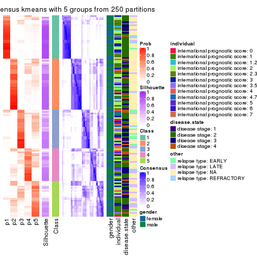</p>

</div>
<div id='tab-SD-kmeans-consensus-heatmap-5'>
<pre><code class="r">consensus_heatmap(res, k = 6)
</code></pre>

<p>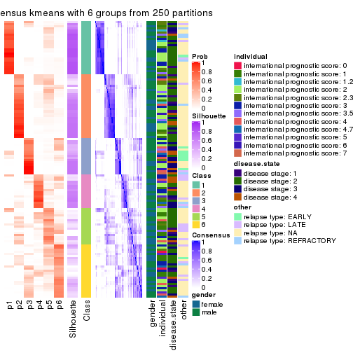</p>

</div>
</div>

Heatmaps for the membership of samples in all partitions to see how consistent they are:


<script>
$( function() {
	$( '#tabs-SD-kmeans-membership-heatmap' ).tabs();
} );
</script>
<div id='tabs-SD-kmeans-membership-heatmap'>
<ul>
<li><a href='#tab-SD-kmeans-membership-heatmap-1'>k = 2</a></li>
<li><a href='#tab-SD-kmeans-membership-heatmap-2'>k = 3</a></li>
<li><a href='#tab-SD-kmeans-membership-heatmap-3'>k = 4</a></li>
<li><a href='#tab-SD-kmeans-membership-heatmap-4'>k = 5</a></li>
<li><a href='#tab-SD-kmeans-membership-heatmap-5'>k = 6</a></li>
</ul>
<div id='tab-SD-kmeans-membership-heatmap-1'>
<pre><code class="r">membership_heatmap(res, k = 2)
</code></pre>

<p>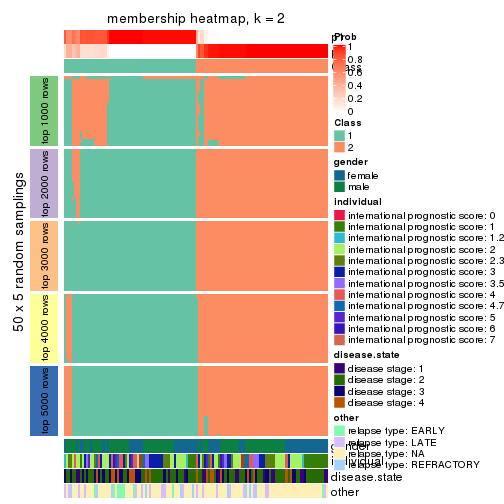</p>

</div>
<div id='tab-SD-kmeans-membership-heatmap-2'>
<pre><code class="r">membership_heatmap(res, k = 3)
</code></pre>

<p>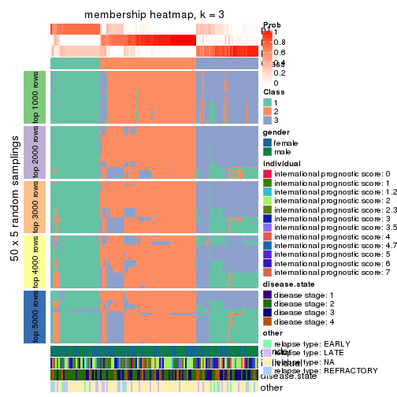</p>

</div>
<div id='tab-SD-kmeans-membership-heatmap-3'>
<pre><code class="r">membership_heatmap(res, k = 4)
</code></pre>

<p>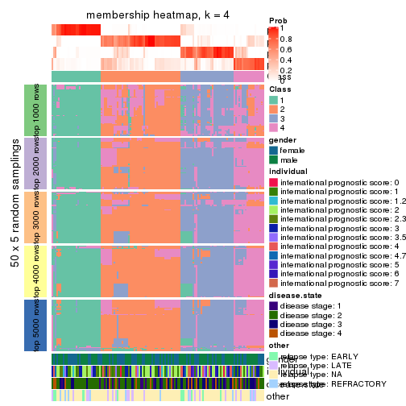</p>

</div>
<div id='tab-SD-kmeans-membership-heatmap-4'>
<pre><code class="r">membership_heatmap(res, k = 5)
</code></pre>

<p>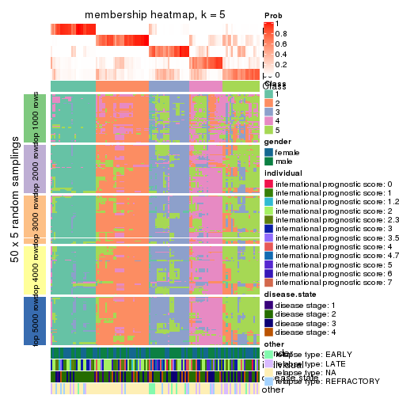</p>

</div>
<div id='tab-SD-kmeans-membership-heatmap-5'>
<pre><code class="r">membership_heatmap(res, k = 6)
</code></pre>

<p>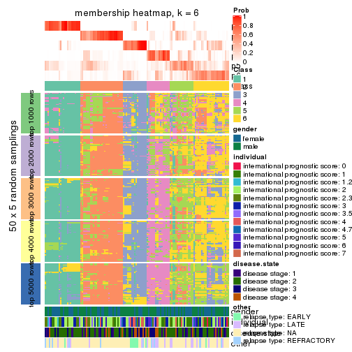</p>

</div>
</div>

As soon as we have had the classes for columns, we can look for signatures
which are significantly different between classes which can be candidate marks
for certain classes. Following are the heatmaps for signatures.


Signature heatmaps where rows are scaled:


<script>
$( function() {
	$( '#tabs-SD-kmeans-get-signatures' ).tabs();
} );
</script>
<div id='tabs-SD-kmeans-get-signatures'>
<ul>
<li><a href='#tab-SD-kmeans-get-signatures-1'>k = 2</a></li>
<li><a href='#tab-SD-kmeans-get-signatures-2'>k = 3</a></li>
<li><a href='#tab-SD-kmeans-get-signatures-3'>k = 4</a></li>
<li><a href='#tab-SD-kmeans-get-signatures-4'>k = 5</a></li>
<li><a href='#tab-SD-kmeans-get-signatures-5'>k = 6</a></li>
</ul>
<div id='tab-SD-kmeans-get-signatures-1'>
<pre><code class="r">get_signatures(res, k = 2)
</code></pre>

<p>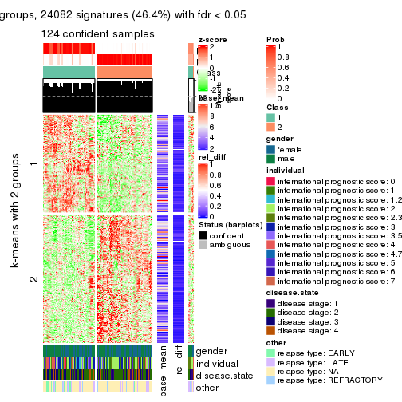</p>

</div>
<div id='tab-SD-kmeans-get-signatures-2'>
<pre><code class="r">get_signatures(res, k = 3)
</code></pre>

<p>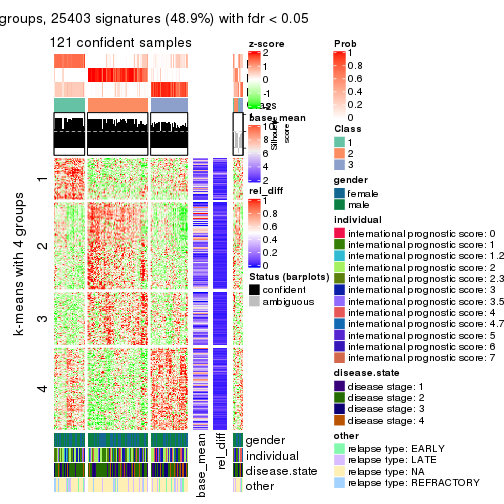</p>

</div>
<div id='tab-SD-kmeans-get-signatures-3'>
<pre><code class="r">get_signatures(res, k = 4)
</code></pre>

<p>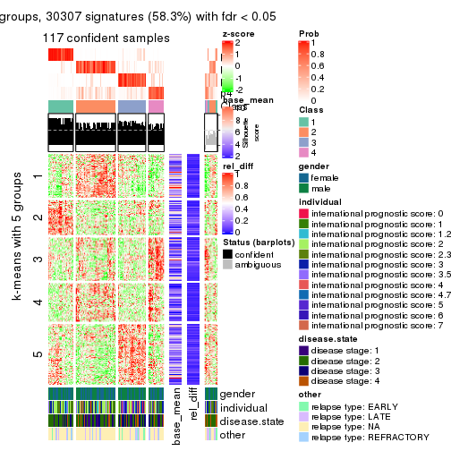</p>

</div>
<div id='tab-SD-kmeans-get-signatures-4'>
<pre><code class="r">get_signatures(res, k = 5)
</code></pre>

<pre><code>#&gt; Error: The width or height of the raster image is zero, maybe you forget to turn off the
#&gt; previous graphic device or it was corrupted. Run `dev.off()` to close it.
</code></pre>

<p></p>

</div>
<div id='tab-SD-kmeans-get-signatures-5'>
<pre><code class="r">get_signatures(res, k = 6)
</code></pre>

<p>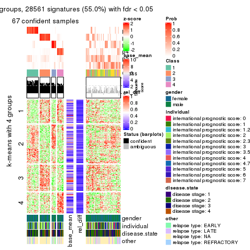</p>

</div>
</div>


Signature heatmaps where rows are not scaled:


<script>
$( function() {
	$( '#tabs-SD-kmeans-get-signatures-no-scale' ).tabs();
} );
</script>
<div id='tabs-SD-kmeans-get-signatures-no-scale'>
<ul>
<li><a href='#tab-SD-kmeans-get-signatures-no-scale-1'>k = 2</a></li>
<li><a href='#tab-SD-kmeans-get-signatures-no-scale-2'>k = 3</a></li>
<li><a href='#tab-SD-kmeans-get-signatures-no-scale-3'>k = 4</a></li>
<li><a href='#tab-SD-kmeans-get-signatures-no-scale-4'>k = 5</a></li>
<li><a href='#tab-SD-kmeans-get-signatures-no-scale-5'>k = 6</a></li>
</ul>
<div id='tab-SD-kmeans-get-signatures-no-scale-1'>
<pre><code class="r">get_signatures(res, k = 2, scale_rows = FALSE)
</code></pre>

<p>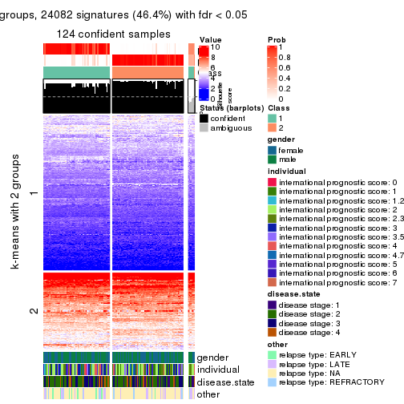</p>

</div>
<div id='tab-SD-kmeans-get-signatures-no-scale-2'>
<pre><code class="r">get_signatures(res, k = 3, scale_rows = FALSE)
</code></pre>

<p>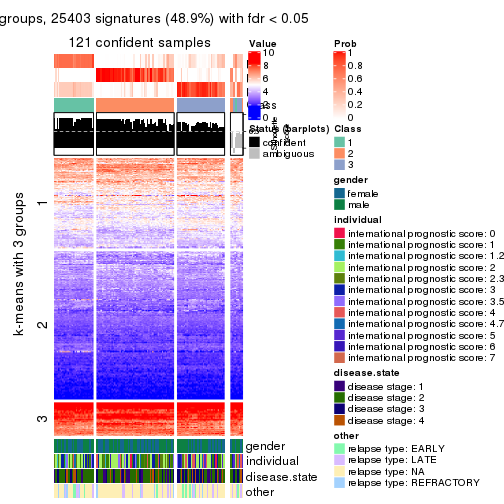</p>

</div>
<div id='tab-SD-kmeans-get-signatures-no-scale-3'>
<pre><code class="r">get_signatures(res, k = 4, scale_rows = FALSE)
</code></pre>

<p>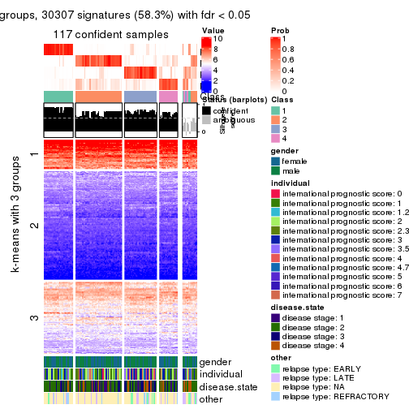</p>

</div>
<div id='tab-SD-kmeans-get-signatures-no-scale-4'>
<pre><code class="r">get_signatures(res, k = 5, scale_rows = FALSE)
</code></pre>

<p>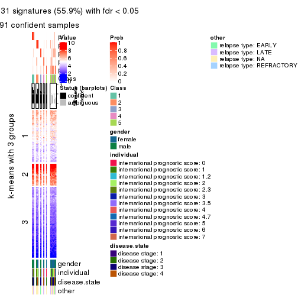</p>

</div>
<div id='tab-SD-kmeans-get-signatures-no-scale-5'>
<pre><code class="r">get_signatures(res, k = 6, scale_rows = FALSE)
</code></pre>

<p>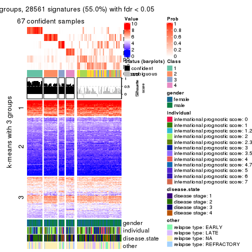</p>

</div>
</div>


Compare the overlap of signatures from different k:

```r
compare_signatures(res)
```

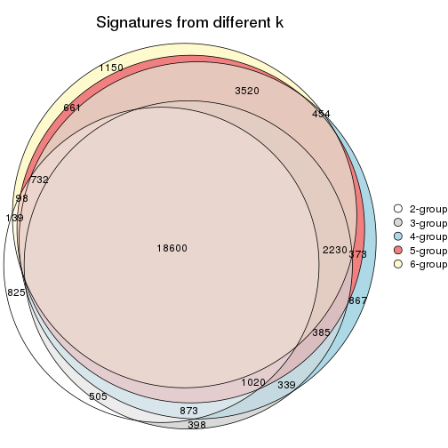

`get_signature()` returns a data frame invisibly. TO get the list of signatures, the function
call should be assigned to a variable explicitly. In following code, if `plot` argument is set
to `FALSE`, no heatmap is plotted while only the differential analysis is performed.

```r
# code only for demonstration
tb = get_signature(res, k = ..., plot = FALSE)
```

An example of the output of `tb` is:

```
#>   which_row         fdr    mean_1    mean_2 scaled_mean_1 scaled_mean_2 km
#> 1        38 0.042760348  8.373488  9.131774    -0.5533452     0.5164555  1
#> 2        40 0.018707592  7.106213  8.469186    -0.6173731     0.5762149  1
#> 3        55 0.019134737 10.221463 11.207825    -0.6159697     0.5749050  1
#> 4        59 0.006059896  5.921854  7.869574    -0.6899429     0.6439467  1
#> 5        60 0.018055526  8.928898 10.211722    -0.6204761     0.5791110  1
#> 6        98 0.009384629 15.714769 14.887706     0.6635654    -0.6193277  2
...
```

The columns in `tb` are:

1. `which_row`: row indices corresponding to the input matrix.
2. `fdr`: FDR for the differential test. 
3. `mean_x`: The mean value in group x.
4. `scaled_mean_x`: The mean value in group x after rows are scaled.
5. `km`: Row groups if k-means clustering is applied to rows.


UMAP plot which shows how samples are separated.


<script>
$( function() {
	$( '#tabs-SD-kmeans-dimension-reduction' ).tabs();
} );
</script>
<div id='tabs-SD-kmeans-dimension-reduction'>
<ul>
<li><a href='#tab-SD-kmeans-dimension-reduction-1'>k = 2</a></li>
<li><a href='#tab-SD-kmeans-dimension-reduction-2'>k = 3</a></li>
<li><a href='#tab-SD-kmeans-dimension-reduction-3'>k = 4</a></li>
<li><a href='#tab-SD-kmeans-dimension-reduction-4'>k = 5</a></li>
<li><a href='#tab-SD-kmeans-dimension-reduction-5'>k = 6</a></li>
</ul>
<div id='tab-SD-kmeans-dimension-reduction-1'>
<pre><code class="r">dimension_reduction(res, k = 2, method = &quot;UMAP&quot;)
</code></pre>

<p>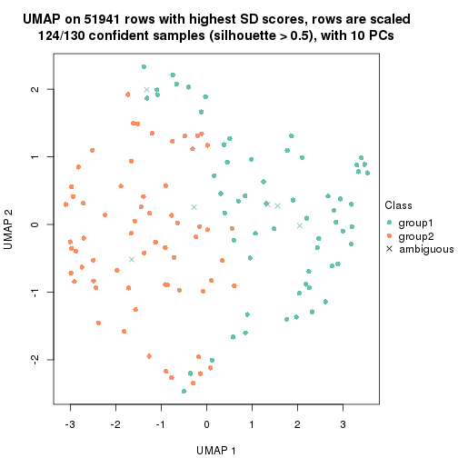</p>

</div>
<div id='tab-SD-kmeans-dimension-reduction-2'>
<pre><code class="r">dimension_reduction(res, k = 3, method = &quot;UMAP&quot;)
</code></pre>

<p>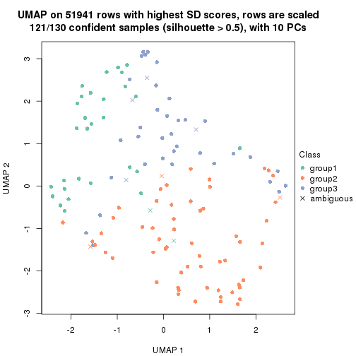</p>

</div>
<div id='tab-SD-kmeans-dimension-reduction-3'>
<pre><code class="r">dimension_reduction(res, k = 4, method = &quot;UMAP&quot;)
</code></pre>

<p>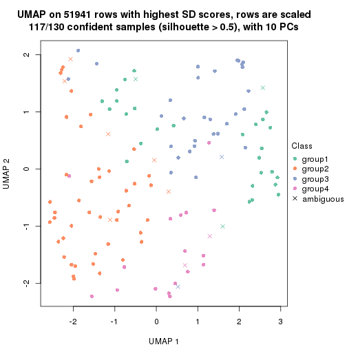</p>

</div>
<div id='tab-SD-kmeans-dimension-reduction-4'>
<pre><code class="r">dimension_reduction(res, k = 5, method = &quot;UMAP&quot;)
</code></pre>

<p>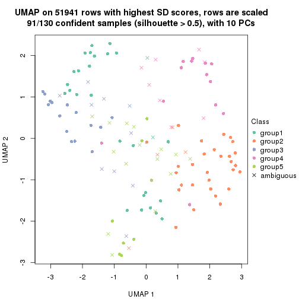</p>

</div>
<div id='tab-SD-kmeans-dimension-reduction-5'>
<pre><code class="r">dimension_reduction(res, k = 6, method = &quot;UMAP&quot;)
</code></pre>

<p>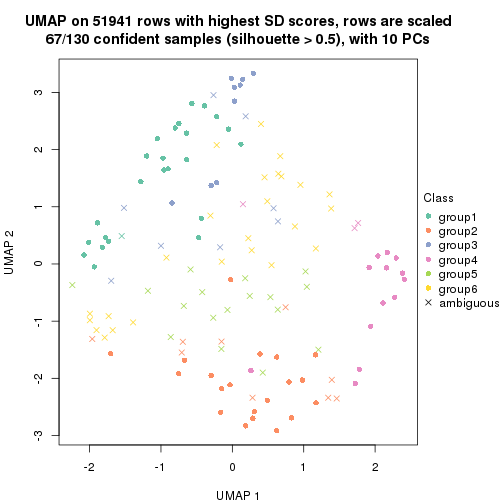</p>

</div>
</div>


Following heatmap shows how subgroups are split when increasing `k`:

```r
collect_classes(res)
```

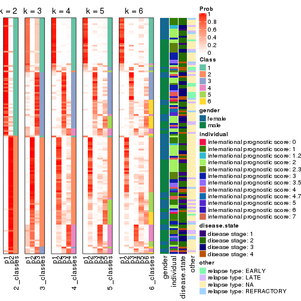


Test correlation between subgroups and known annotations. If the known
annotation is numeric, one-way ANOVA test is applied, and if the known
annotation is discrete, chi-squared contingency table test is applied.

```r
test_to_known_factors(res)
```

```
#>             n gender(p) individual(p) disease.state(p) other(p) k
#> SD:kmeans 124     0.445         0.781           0.0387   0.0708 2
#> SD:kmeans 121     0.533         0.263           0.2487   0.3967 3
#> SD:kmeans 117     0.153         0.255           0.0744   0.0852 4
#> SD:kmeans  91     0.593         0.272           0.0970   0.0264 5
#> SD:kmeans  67     0.860         0.188           0.1925   0.0157 6
```


If matrix rows can be associated to genes, consider to use `GO_Enrichment(res,
...)` to perform function enrichment for the signature genes.


 

---------------------------------------------------


### SD:skmeans


The object with results only for a single top-value method and a single partition method 
can be extracted as:

```r
res = res_list["SD", "skmeans"]
# you can also extract it by
# res = res_list["SD:skmeans"]
```

A summary of `res` and all the functions that can be applied to it:

```r
res
```

```
#> A 'ConsensusPartition' object with k = 2, 3, 4, 5, 6.
#>   On a matrix with 51941 rows and 130 columns.
#>   Top rows (1000, 2000, 3000, 4000, 5000) are extracted by 'SD' method.
#>   Subgroups are detected by 'skmeans' method.
#>   Performed in total 1250 partitions by row resampling.
#>   Best k for subgroups seems to be 3.
#> 
#> Following methods can be applied to this 'ConsensusPartition' object:
#>  [1] "cola_report"             "collect_classes"         "collect_plots"          
#>  [4] "collect_stats"           "colnames"                "compare_signatures"     
#>  [7] "consensus_heatmap"       "dimension_reduction"     "functional_enrichment"  
#> [10] "get_anno_col"            "get_anno"                "get_classes"            
#> [13] "get_consensus"           "get_matrix"              "get_membership"         
#> [16] "get_param"               "get_signatures"          "get_stats"              
#> [19] "is_best_k"               "is_stable_k"             "membership_heatmap"     
#> [22] "ncol"                    "nrow"                    "plot_ecdf"              
#> [25] "rownames"                "select_partition_number" "show"                   
#> [28] "suggest_best_k"          "test_to_known_factors"
```

`collect_plots()` function collects all the plots made from `res` for all `k` (number of partitions)
into one single page to provide an easy and fast comparison between different `k`.

```r
collect_plots(res)
```

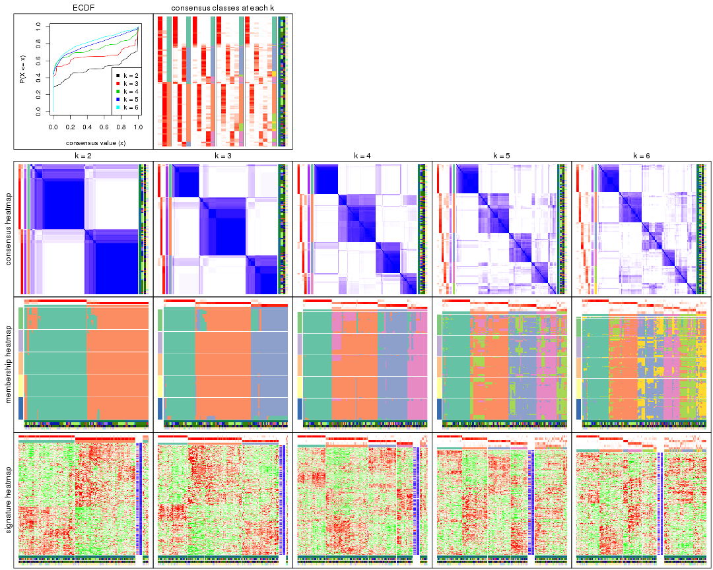

The plots are:

- The first row: a plot of the ECDF (Empirical cumulative distribution
  function) curves of the consensus matrix for each `k` and the heatmap of
  predicted classes for each `k`.
- The second row: heatmaps of the consensus matrix for each `k`.
- The third row: heatmaps of the membership matrix for each `k`.
- The fouth row: heatmaps of the signatures for each `k`.

All the plots in panels can be made by individual functions and they are
plotted later in this section.

`select_partition_number()` produces several plots showing different
statistics for choosing "optimized" `k`. There are following statistics:

- ECDF curves of the consensus matrix for each `k`;
- 1-PAC. [The PAC
  score](https://en.wikipedia.org/wiki/Consensus_clustering#Over-interpretation_potential_of_consensus_clustering)
  measures the proportion of the ambiguous subgrouping.
- Mean silhouette score.
- Concordance. The mean probability of fiting the consensus class ids in all
  partitions.
- Area increased. Denote $A_k$ as the area under the ECDF curve for current
  `k`, the area increased is defined as $A_k - A_{k-1}$.
- Rand index. The percent of pairs of samples that are both in a same cluster
  or both are not in a same cluster in the partition of k and k-1.
- Jaccard index. The ratio of pairs of samples are both in a same cluster in
  the partition of k and k-1 and the pairs of samples are both in a same
  cluster in the partition k or k-1.

The detailed explanations of these statistics can be found in [the cola
vignette](http://bioconductor.org/packages/devel/bioc/vignettes/cola/inst/doc/cola.html#toc_13).

Generally speaking, lower PAC score, higher mean silhouette score or higher
concordance corresponds to better partition. Rand index and Jaccard index
measure how similar the current partition is compared to partition with `k-1`.
If they are too similar, we won't accept `k` is better than `k-1`.

```r
select_partition_number(res)
```

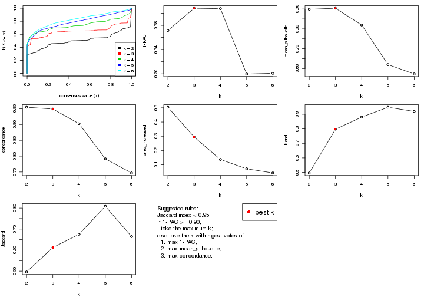

The numeric values for all these statistics can be obtained by `get_stats()`.

```r
get_stats(res)
```

```
#>   k 1-PAC mean_silhouette concordance area_increased  Rand Jaccard
#> 2 2 0.772           0.899       0.954         0.5040 0.496   0.496
#> 3 3 0.808           0.904       0.949         0.2945 0.797   0.612
#> 4 4 0.808           0.819       0.902         0.1366 0.881   0.675
#> 5 5 0.700           0.620       0.792         0.0710 0.948   0.809
#> 6 6 0.701           0.573       0.747         0.0416 0.920   0.665
```

`suggest_best_k()` suggests the best $k$ based on these statistics. The rules are as follows:

- All $k$ with Jaccard index larger than 0.95 are removed because the increase of
  the partition number does not provides enough extra information. If all $k$ are removed,
  the best $k$ is assigned by `NA`.
- For $k$ with 1-PAC larger than 0.9, the maximal $k$ is taken as the "best k". Other $k$ is called "optional k".
- If it does not fit the second rule. The $k$ with the highest vote of highest
  1-PAC, mean silhouette and concordance is taken as the "best k".

```r
suggest_best_k(res)
```

```
#> [1] 3
```


Following shows the table of the partitions (You need to click the **show/hide
code output** link to see it). The membership matrix (columns with name `p*`)
is inferred by
[`clue::cl_consensus()`](https://www.rdocumentation.org/link/cl_consensus?package=clue)
function with the `SE` method. Basically the value in the membership matrix
represents the probability to belong to a certain group. The finall class
label for an item is determined with the group with highest probability it
belongs to.

In `get_classes()` function, the entropy is calculated from the membership
matrix and the silhouette score is calculated from the consensus matrix.


<script>
$( function() {
	$( '#tabs-SD-skmeans-get-classes' ).tabs();
} );
</script>
<div id='tabs-SD-skmeans-get-classes'>
<ul>
<li><a href='#tab-SD-skmeans-get-classes-1'>k = 2</a></li>
<li><a href='#tab-SD-skmeans-get-classes-2'>k = 3</a></li>
<li><a href='#tab-SD-skmeans-get-classes-3'>k = 4</a></li>
<li><a href='#tab-SD-skmeans-get-classes-4'>k = 5</a></li>
<li><a href='#tab-SD-skmeans-get-classes-5'>k = 6</a></li>
</ul>

<div id='tab-SD-skmeans-get-classes-1'>
<p><a id='tab-SD-skmeans-get-classes-1-a' style='color:#0366d6' href='#'>show/hide code output</a></p>
<pre><code class="r">cbind(get_classes(res, k = 2), get_membership(res, k = 2))
</code></pre>

<pre><code>#&gt;           class entropy silhouette    p1    p2
#&gt; GSM447671     2  0.0000      0.962 0.000 1.000
#&gt; GSM447694     1  0.0000      0.938 1.000 0.000
#&gt; GSM447618     2  0.0000      0.962 0.000 1.000
#&gt; GSM447691     2  0.0000      0.962 0.000 1.000
#&gt; GSM447733     2  0.3114      0.915 0.056 0.944
#&gt; GSM447620     2  0.0000      0.962 0.000 1.000
#&gt; GSM447627     1  0.0000      0.938 1.000 0.000
#&gt; GSM447630     2  0.0000      0.962 0.000 1.000
#&gt; GSM447642     1  0.0000      0.938 1.000 0.000
#&gt; GSM447649     2  0.0000      0.962 0.000 1.000
#&gt; GSM447654     2  0.0000      0.962 0.000 1.000
#&gt; GSM447655     2  0.0000      0.962 0.000 1.000
#&gt; GSM447669     2  0.0000      0.962 0.000 1.000
#&gt; GSM447676     1  0.0000      0.938 1.000 0.000
#&gt; GSM447678     2  0.0000      0.962 0.000 1.000
#&gt; GSM447681     2  0.0000      0.962 0.000 1.000
#&gt; GSM447698     2  0.0000      0.962 0.000 1.000
#&gt; GSM447713     1  0.0000      0.938 1.000 0.000
#&gt; GSM447722     2  0.0000      0.962 0.000 1.000
#&gt; GSM447726     2  0.6712      0.796 0.176 0.824
#&gt; GSM447735     1  0.0376      0.936 0.996 0.004
#&gt; GSM447737     1  0.0000      0.938 1.000 0.000
#&gt; GSM447657     2  0.0000      0.962 0.000 1.000
#&gt; GSM447674     2  0.0000      0.962 0.000 1.000
#&gt; GSM447636     1  0.4298      0.865 0.912 0.088
#&gt; GSM447723     1  0.0000      0.938 1.000 0.000
#&gt; GSM447699     1  0.9661      0.425 0.608 0.392
#&gt; GSM447708     2  0.0000      0.962 0.000 1.000
#&gt; GSM447721     1  0.0000      0.938 1.000 0.000
#&gt; GSM447623     1  0.0000      0.938 1.000 0.000
#&gt; GSM447621     1  0.0000      0.938 1.000 0.000
#&gt; GSM447650     2  0.0000      0.962 0.000 1.000
#&gt; GSM447651     2  0.0000      0.962 0.000 1.000
#&gt; GSM447653     1  0.0000      0.938 1.000 0.000
#&gt; GSM447658     1  0.0000      0.938 1.000 0.000
#&gt; GSM447675     2  0.0000      0.962 0.000 1.000
#&gt; GSM447680     2  0.5408      0.857 0.124 0.876
#&gt; GSM447686     2  0.7453      0.748 0.212 0.788
#&gt; GSM447736     1  0.0000      0.938 1.000 0.000
#&gt; GSM447629     2  0.5737      0.844 0.136 0.864
#&gt; GSM447648     1  0.0000      0.938 1.000 0.000
#&gt; GSM447660     1  0.0000      0.938 1.000 0.000
#&gt; GSM447661     2  0.0000      0.962 0.000 1.000
#&gt; GSM447663     1  0.7219      0.767 0.800 0.200
#&gt; GSM447704     2  0.0000      0.962 0.000 1.000
#&gt; GSM447720     1  0.0000      0.938 1.000 0.000
#&gt; GSM447652     2  0.0000      0.962 0.000 1.000
#&gt; GSM447679     2  0.0000      0.962 0.000 1.000
#&gt; GSM447712     1  0.0000      0.938 1.000 0.000
#&gt; GSM447664     2  0.6438      0.811 0.164 0.836
#&gt; GSM447637     1  0.0000      0.938 1.000 0.000
#&gt; GSM447639     2  0.9710      0.261 0.400 0.600
#&gt; GSM447615     1  0.0000      0.938 1.000 0.000
#&gt; GSM447656     2  0.5408      0.857 0.124 0.876
#&gt; GSM447673     2  0.0000      0.962 0.000 1.000
#&gt; GSM447719     1  0.0000      0.938 1.000 0.000
#&gt; GSM447706     1  0.0000      0.938 1.000 0.000
#&gt; GSM447612     1  0.9815      0.352 0.580 0.420
#&gt; GSM447665     2  0.0000      0.962 0.000 1.000
#&gt; GSM447677     2  0.0000      0.962 0.000 1.000
#&gt; GSM447613     1  0.0000      0.938 1.000 0.000
#&gt; GSM447659     1  0.7745      0.731 0.772 0.228
#&gt; GSM447662     1  0.7219      0.767 0.800 0.200
#&gt; GSM447666     1  0.4431      0.871 0.908 0.092
#&gt; GSM447668     2  0.0000      0.962 0.000 1.000
#&gt; GSM447682     2  0.0000      0.962 0.000 1.000
#&gt; GSM447683     2  0.0000      0.962 0.000 1.000
#&gt; GSM447688     2  0.0000      0.962 0.000 1.000
#&gt; GSM447702     2  0.0000      0.962 0.000 1.000
#&gt; GSM447709     2  0.0000      0.962 0.000 1.000
#&gt; GSM447711     1  0.0000      0.938 1.000 0.000
#&gt; GSM447715     1  0.9427      0.423 0.640 0.360
#&gt; GSM447693     1  0.0000      0.938 1.000 0.000
#&gt; GSM447611     2  0.7745      0.724 0.228 0.772
#&gt; GSM447672     2  0.0000      0.962 0.000 1.000
#&gt; GSM447703     2  0.0000      0.962 0.000 1.000
#&gt; GSM447727     1  0.0000      0.938 1.000 0.000
#&gt; GSM447638     1  0.9710      0.316 0.600 0.400
#&gt; GSM447670     1  0.0000      0.938 1.000 0.000
#&gt; GSM447700     2  0.0000      0.962 0.000 1.000
#&gt; GSM447738     2  0.0000      0.962 0.000 1.000
#&gt; GSM447739     1  0.0000      0.938 1.000 0.000
#&gt; GSM447617     1  0.0000      0.938 1.000 0.000
#&gt; GSM447628     2  0.0000      0.962 0.000 1.000
#&gt; GSM447632     2  0.0000      0.962 0.000 1.000
#&gt; GSM447619     1  0.5408      0.844 0.876 0.124
#&gt; GSM447643     1  0.9732      0.305 0.596 0.404
#&gt; GSM447724     2  0.4298      0.883 0.088 0.912
#&gt; GSM447728     2  0.0000      0.962 0.000 1.000
#&gt; GSM447610     1  0.0000      0.938 1.000 0.000
#&gt; GSM447633     2  0.0000      0.962 0.000 1.000
#&gt; GSM447634     1  0.0000      0.938 1.000 0.000
#&gt; GSM447622     1  0.0000      0.938 1.000 0.000
#&gt; GSM447667     2  0.7139      0.769 0.196 0.804
#&gt; GSM447687     2  0.0000      0.962 0.000 1.000
#&gt; GSM447695     1  0.0000      0.938 1.000 0.000
#&gt; GSM447696     1  0.0000      0.938 1.000 0.000
#&gt; GSM447697     1  0.0000      0.938 1.000 0.000
#&gt; GSM447714     1  0.7139      0.771 0.804 0.196
#&gt; GSM447717     1  0.0000      0.938 1.000 0.000
#&gt; GSM447725     1  0.0000      0.938 1.000 0.000
#&gt; GSM447729     2  0.0000      0.962 0.000 1.000
#&gt; GSM447644     2  0.0000      0.962 0.000 1.000
#&gt; GSM447710     1  0.0000      0.938 1.000 0.000
#&gt; GSM447614     1  0.0000      0.938 1.000 0.000
#&gt; GSM447685     2  0.0000      0.962 0.000 1.000
#&gt; GSM447690     1  0.0000      0.938 1.000 0.000
#&gt; GSM447730     2  0.0000      0.962 0.000 1.000
#&gt; GSM447646     2  0.0000      0.962 0.000 1.000
#&gt; GSM447689     1  0.1633      0.923 0.976 0.024
#&gt; GSM447635     2  0.5178      0.866 0.116 0.884
#&gt; GSM447641     1  0.0000      0.938 1.000 0.000
#&gt; GSM447716     2  0.4431      0.888 0.092 0.908
#&gt; GSM447718     1  0.7139      0.771 0.804 0.196
#&gt; GSM447616     1  0.0000      0.938 1.000 0.000
#&gt; GSM447626     1  0.0000      0.938 1.000 0.000
#&gt; GSM447640     2  0.0000      0.962 0.000 1.000
#&gt; GSM447734     1  0.6973      0.780 0.812 0.188
#&gt; GSM447692     1  0.0000      0.938 1.000 0.000
#&gt; GSM447647     2  0.0000      0.962 0.000 1.000
#&gt; GSM447624     1  0.0000      0.938 1.000 0.000
#&gt; GSM447625     1  0.6247      0.813 0.844 0.156
#&gt; GSM447707     2  0.0000      0.962 0.000 1.000
#&gt; GSM447732     1  0.2423      0.912 0.960 0.040
#&gt; GSM447684     1  0.0000      0.938 1.000 0.000
#&gt; GSM447731     2  0.0000      0.962 0.000 1.000
#&gt; GSM447705     2  0.4431      0.878 0.092 0.908
#&gt; GSM447631     1  0.0000      0.938 1.000 0.000
#&gt; GSM447701     2  0.0000      0.962 0.000 1.000
#&gt; GSM447645     1  0.0000      0.938 1.000 0.000
</code></pre>

<script>
$('#tab-SD-skmeans-get-classes-1-a').parent().next().next().hide();
$('#tab-SD-skmeans-get-classes-1-a').click(function(){
  $('#tab-SD-skmeans-get-classes-1-a').parent().next().next().toggle();
  return(false);
});
</script>
</div>

<div id='tab-SD-skmeans-get-classes-2'>
<p><a id='tab-SD-skmeans-get-classes-2-a' style='color:#0366d6' href='#'>show/hide code output</a></p>
<pre><code class="r">cbind(get_classes(res, k = 3), get_membership(res, k = 3))
</code></pre>

<pre><code>#&gt;           class entropy silhouette    p1    p2    p3
#&gt; GSM447671     2  0.0000      0.954 0.000 1.000 0.000
#&gt; GSM447694     3  0.1289      0.921 0.032 0.000 0.968
#&gt; GSM447618     2  0.0000      0.954 0.000 1.000 0.000
#&gt; GSM447691     2  0.0000      0.954 0.000 1.000 0.000
#&gt; GSM447733     3  0.0000      0.907 0.000 0.000 1.000
#&gt; GSM447620     2  0.4605      0.768 0.000 0.796 0.204
#&gt; GSM447627     3  0.0237      0.909 0.004 0.000 0.996
#&gt; GSM447630     2  0.5926      0.400 0.000 0.644 0.356
#&gt; GSM447642     1  0.0000      0.968 1.000 0.000 0.000
#&gt; GSM447649     2  0.0000      0.954 0.000 1.000 0.000
#&gt; GSM447654     2  0.1289      0.940 0.000 0.968 0.032
#&gt; GSM447655     2  0.0000      0.954 0.000 1.000 0.000
#&gt; GSM447669     2  0.0000      0.954 0.000 1.000 0.000
#&gt; GSM447676     1  0.0000      0.968 1.000 0.000 0.000
#&gt; GSM447678     2  0.1289      0.940 0.000 0.968 0.032
#&gt; GSM447681     2  0.0000      0.954 0.000 1.000 0.000
#&gt; GSM447698     2  0.0000      0.954 0.000 1.000 0.000
#&gt; GSM447713     1  0.0000      0.968 1.000 0.000 0.000
#&gt; GSM447722     2  0.1289      0.940 0.000 0.968 0.032
#&gt; GSM447726     2  0.4555      0.773 0.000 0.800 0.200
#&gt; GSM447735     3  0.4555      0.760 0.200 0.000 0.800
#&gt; GSM447737     1  0.4291      0.746 0.820 0.000 0.180
#&gt; GSM447657     2  0.0000      0.954 0.000 1.000 0.000
#&gt; GSM447674     2  0.0000      0.954 0.000 1.000 0.000
#&gt; GSM447636     1  0.0237      0.965 0.996 0.004 0.000
#&gt; GSM447723     1  0.0000      0.968 1.000 0.000 0.000
#&gt; GSM447699     3  0.5778      0.750 0.032 0.200 0.768
#&gt; GSM447708     2  0.0000      0.954 0.000 1.000 0.000
#&gt; GSM447721     1  0.0000      0.968 1.000 0.000 0.000
#&gt; GSM447623     1  0.0000      0.968 1.000 0.000 0.000
#&gt; GSM447621     1  0.0000      0.968 1.000 0.000 0.000
#&gt; GSM447650     2  0.0000      0.954 0.000 1.000 0.000
#&gt; GSM447651     2  0.0000      0.954 0.000 1.000 0.000
#&gt; GSM447653     3  0.0000      0.907 0.000 0.000 1.000
#&gt; GSM447658     1  0.0000      0.968 1.000 0.000 0.000
#&gt; GSM447675     2  0.1289      0.940 0.000 0.968 0.032
#&gt; GSM447680     2  0.3340      0.856 0.120 0.880 0.000
#&gt; GSM447686     1  0.1289      0.940 0.968 0.032 0.000
#&gt; GSM447736     3  0.1289      0.921 0.032 0.000 0.968
#&gt; GSM447629     2  0.3879      0.821 0.152 0.848 0.000
#&gt; GSM447648     3  0.1289      0.921 0.032 0.000 0.968
#&gt; GSM447660     1  0.0000      0.968 1.000 0.000 0.000
#&gt; GSM447661     2  0.0000      0.954 0.000 1.000 0.000
#&gt; GSM447663     3  0.1289      0.921 0.032 0.000 0.968
#&gt; GSM447704     2  0.0000      0.954 0.000 1.000 0.000
#&gt; GSM447720     3  0.4452      0.799 0.192 0.000 0.808
#&gt; GSM447652     2  0.0000      0.954 0.000 1.000 0.000
#&gt; GSM447679     2  0.0000      0.954 0.000 1.000 0.000
#&gt; GSM447712     1  0.0000      0.968 1.000 0.000 0.000
#&gt; GSM447664     2  0.5778      0.743 0.200 0.768 0.032
#&gt; GSM447637     3  0.1289      0.921 0.032 0.000 0.968
#&gt; GSM447639     3  0.4555      0.740 0.000 0.200 0.800
#&gt; GSM447615     1  0.0000      0.968 1.000 0.000 0.000
#&gt; GSM447656     2  0.3340      0.856 0.120 0.880 0.000
#&gt; GSM447673     2  0.0237      0.952 0.000 0.996 0.004
#&gt; GSM447719     3  0.0000      0.907 0.000 0.000 1.000
#&gt; GSM447706     3  0.1289      0.921 0.032 0.000 0.968
#&gt; GSM447612     3  0.1289      0.921 0.032 0.000 0.968
#&gt; GSM447665     2  0.0000      0.954 0.000 1.000 0.000
#&gt; GSM447677     2  0.0000      0.954 0.000 1.000 0.000
#&gt; GSM447613     1  0.0000      0.968 1.000 0.000 0.000
#&gt; GSM447659     3  0.0000      0.907 0.000 0.000 1.000
#&gt; GSM447662     3  0.1289      0.921 0.032 0.000 0.968
#&gt; GSM447666     3  0.1491      0.913 0.016 0.016 0.968
#&gt; GSM447668     2  0.0000      0.954 0.000 1.000 0.000
#&gt; GSM447682     2  0.0000      0.954 0.000 1.000 0.000
#&gt; GSM447683     2  0.0000      0.954 0.000 1.000 0.000
#&gt; GSM447688     2  0.1289      0.940 0.000 0.968 0.032
#&gt; GSM447702     2  0.0000      0.954 0.000 1.000 0.000
#&gt; GSM447709     2  0.3116      0.873 0.000 0.892 0.108
#&gt; GSM447711     1  0.0000      0.968 1.000 0.000 0.000
#&gt; GSM447715     1  0.1289      0.940 0.968 0.032 0.000
#&gt; GSM447693     3  0.1289      0.921 0.032 0.000 0.968
#&gt; GSM447611     1  0.4799      0.799 0.836 0.132 0.032
#&gt; GSM447672     2  0.0000      0.954 0.000 1.000 0.000
#&gt; GSM447703     2  0.0000      0.954 0.000 1.000 0.000
#&gt; GSM447727     1  0.0000      0.968 1.000 0.000 0.000
#&gt; GSM447638     1  0.1289      0.940 0.968 0.032 0.000
#&gt; GSM447670     1  0.0000      0.968 1.000 0.000 0.000
#&gt; GSM447700     2  0.0237      0.952 0.000 0.996 0.004
#&gt; GSM447738     2  0.0000      0.954 0.000 1.000 0.000
#&gt; GSM447739     1  0.0000      0.968 1.000 0.000 0.000
#&gt; GSM447617     1  0.0000      0.968 1.000 0.000 0.000
#&gt; GSM447628     2  0.1289      0.940 0.000 0.968 0.032
#&gt; GSM447632     2  0.0000      0.954 0.000 1.000 0.000
#&gt; GSM447619     3  0.1289      0.921 0.032 0.000 0.968
#&gt; GSM447643     1  0.1289      0.940 0.968 0.032 0.000
#&gt; GSM447724     3  0.0000      0.907 0.000 0.000 1.000
#&gt; GSM447728     2  0.0000      0.954 0.000 1.000 0.000
#&gt; GSM447610     1  0.1289      0.942 0.968 0.000 0.032
#&gt; GSM447633     2  0.4555      0.773 0.000 0.800 0.200
#&gt; GSM447634     3  0.4974      0.751 0.236 0.000 0.764
#&gt; GSM447622     3  0.5016      0.746 0.240 0.000 0.760
#&gt; GSM447667     2  0.4555      0.760 0.200 0.800 0.000
#&gt; GSM447687     2  0.0000      0.954 0.000 1.000 0.000
#&gt; GSM447695     3  0.4974      0.751 0.236 0.000 0.764
#&gt; GSM447696     1  0.0000      0.968 1.000 0.000 0.000
#&gt; GSM447697     1  0.0000      0.968 1.000 0.000 0.000
#&gt; GSM447714     3  0.1289      0.921 0.032 0.000 0.968
#&gt; GSM447717     1  0.0000      0.968 1.000 0.000 0.000
#&gt; GSM447725     1  0.0000      0.968 1.000 0.000 0.000
#&gt; GSM447729     2  0.1289      0.940 0.000 0.968 0.032
#&gt; GSM447644     2  0.0000      0.954 0.000 1.000 0.000
#&gt; GSM447710     3  0.1289      0.921 0.032 0.000 0.968
#&gt; GSM447614     3  0.4555      0.760 0.200 0.000 0.800
#&gt; GSM447685     2  0.0000      0.954 0.000 1.000 0.000
#&gt; GSM447690     1  0.0000      0.968 1.000 0.000 0.000
#&gt; GSM447730     2  0.0000      0.954 0.000 1.000 0.000
#&gt; GSM447646     2  0.1289      0.940 0.000 0.968 0.032
#&gt; GSM447689     3  0.1289      0.921 0.032 0.000 0.968
#&gt; GSM447635     2  0.4629      0.775 0.188 0.808 0.004
#&gt; GSM447641     1  0.0000      0.968 1.000 0.000 0.000
#&gt; GSM447716     2  0.4409      0.796 0.172 0.824 0.004
#&gt; GSM447718     3  0.1289      0.921 0.032 0.000 0.968
#&gt; GSM447616     3  0.5016      0.746 0.240 0.000 0.760
#&gt; GSM447626     3  0.1289      0.921 0.032 0.000 0.968
#&gt; GSM447640     2  0.0000      0.954 0.000 1.000 0.000
#&gt; GSM447734     3  0.1289      0.921 0.032 0.000 0.968
#&gt; GSM447692     3  0.5016      0.746 0.240 0.000 0.760
#&gt; GSM447647     2  0.1289      0.940 0.000 0.968 0.032
#&gt; GSM447624     1  0.5926      0.363 0.644 0.000 0.356
#&gt; GSM447625     3  0.1289      0.921 0.032 0.000 0.968
#&gt; GSM447707     2  0.0000      0.954 0.000 1.000 0.000
#&gt; GSM447732     3  0.1289      0.921 0.032 0.000 0.968
#&gt; GSM447684     1  0.0000      0.968 1.000 0.000 0.000
#&gt; GSM447731     3  0.5497      0.519 0.000 0.292 0.708
#&gt; GSM447705     3  0.1289      0.900 0.000 0.032 0.968
#&gt; GSM447631     3  0.1289      0.921 0.032 0.000 0.968
#&gt; GSM447701     2  0.0000      0.954 0.000 1.000 0.000
#&gt; GSM447645     3  0.1289      0.921 0.032 0.000 0.968
</code></pre>

<script>
$('#tab-SD-skmeans-get-classes-2-a').parent().next().next().hide();
$('#tab-SD-skmeans-get-classes-2-a').click(function(){
  $('#tab-SD-skmeans-get-classes-2-a').parent().next().next().toggle();
  return(false);
});
</script>
</div>

<div id='tab-SD-skmeans-get-classes-3'>
<p><a id='tab-SD-skmeans-get-classes-3-a' style='color:#0366d6' href='#'>show/hide code output</a></p>
<pre><code class="r">cbind(get_classes(res, k = 4), get_membership(res, k = 4))
</code></pre>

<pre><code>#&gt;           class entropy silhouette    p1    p2    p3    p4
#&gt; GSM447671     2  0.2198      0.854 0.000 0.920 0.008 0.072
#&gt; GSM447694     3  0.0592      0.891 0.000 0.000 0.984 0.016
#&gt; GSM447618     2  0.4877      0.549 0.000 0.592 0.000 0.408
#&gt; GSM447691     2  0.2011      0.852 0.000 0.920 0.000 0.080
#&gt; GSM447733     4  0.3569      0.748 0.000 0.000 0.196 0.804
#&gt; GSM447620     2  0.3610      0.725 0.000 0.800 0.200 0.000
#&gt; GSM447627     3  0.4008      0.596 0.000 0.000 0.756 0.244
#&gt; GSM447630     2  0.5004      0.237 0.000 0.604 0.392 0.004
#&gt; GSM447642     1  0.0000      0.979 1.000 0.000 0.000 0.000
#&gt; GSM447649     2  0.0469      0.858 0.000 0.988 0.000 0.012
#&gt; GSM447654     4  0.1302      0.840 0.000 0.044 0.000 0.956
#&gt; GSM447655     2  0.0469      0.858 0.000 0.988 0.000 0.012
#&gt; GSM447669     2  0.1004      0.846 0.000 0.972 0.024 0.004
#&gt; GSM447676     1  0.0000      0.979 1.000 0.000 0.000 0.000
#&gt; GSM447678     4  0.0336      0.842 0.000 0.008 0.000 0.992
#&gt; GSM447681     2  0.2149      0.851 0.000 0.912 0.000 0.088
#&gt; GSM447698     2  0.4916      0.530 0.000 0.576 0.000 0.424
#&gt; GSM447713     1  0.0000      0.979 1.000 0.000 0.000 0.000
#&gt; GSM447722     4  0.0336      0.842 0.000 0.008 0.000 0.992
#&gt; GSM447726     2  0.0895      0.848 0.000 0.976 0.020 0.004
#&gt; GSM447735     4  0.1576      0.833 0.004 0.000 0.048 0.948
#&gt; GSM447737     1  0.3402      0.775 0.832 0.000 0.164 0.004
#&gt; GSM447657     2  0.2589      0.840 0.000 0.884 0.000 0.116
#&gt; GSM447674     2  0.2149      0.851 0.000 0.912 0.000 0.088
#&gt; GSM447636     1  0.0000      0.979 1.000 0.000 0.000 0.000
#&gt; GSM447723     1  0.0000      0.979 1.000 0.000 0.000 0.000
#&gt; GSM447699     3  0.3945      0.691 0.000 0.004 0.780 0.216
#&gt; GSM447708     2  0.1716      0.855 0.000 0.936 0.000 0.064
#&gt; GSM447721     1  0.0000      0.979 1.000 0.000 0.000 0.000
#&gt; GSM447623     1  0.0000      0.979 1.000 0.000 0.000 0.000
#&gt; GSM447621     1  0.0000      0.979 1.000 0.000 0.000 0.000
#&gt; GSM447650     2  0.0469      0.856 0.000 0.988 0.000 0.012
#&gt; GSM447651     2  0.0188      0.854 0.000 0.996 0.000 0.004
#&gt; GSM447653     4  0.3528      0.750 0.000 0.000 0.192 0.808
#&gt; GSM447658     1  0.0000      0.979 1.000 0.000 0.000 0.000
#&gt; GSM447675     4  0.0336      0.842 0.000 0.008 0.000 0.992
#&gt; GSM447680     2  0.0895      0.850 0.020 0.976 0.000 0.004
#&gt; GSM447686     1  0.0592      0.963 0.984 0.016 0.000 0.000
#&gt; GSM447736     3  0.0592      0.891 0.000 0.000 0.984 0.016
#&gt; GSM447629     2  0.3463      0.834 0.040 0.864 0.000 0.096
#&gt; GSM447648     3  0.0707      0.890 0.020 0.000 0.980 0.000
#&gt; GSM447660     1  0.0000      0.979 1.000 0.000 0.000 0.000
#&gt; GSM447661     2  0.0336      0.857 0.000 0.992 0.000 0.008
#&gt; GSM447663     3  0.1978      0.858 0.000 0.068 0.928 0.004
#&gt; GSM447704     2  0.0707      0.858 0.000 0.980 0.000 0.020
#&gt; GSM447720     3  0.4591      0.781 0.148 0.028 0.804 0.020
#&gt; GSM447652     2  0.1118      0.854 0.000 0.964 0.000 0.036
#&gt; GSM447679     2  0.2149      0.851 0.000 0.912 0.000 0.088
#&gt; GSM447712     1  0.0000      0.979 1.000 0.000 0.000 0.000
#&gt; GSM447664     4  0.1637      0.830 0.060 0.000 0.000 0.940
#&gt; GSM447637     3  0.0336      0.895 0.008 0.000 0.992 0.000
#&gt; GSM447639     4  0.0672      0.844 0.000 0.008 0.008 0.984
#&gt; GSM447615     1  0.0000      0.979 1.000 0.000 0.000 0.000
#&gt; GSM447656     2  0.2300      0.851 0.028 0.924 0.000 0.048
#&gt; GSM447673     2  0.4925      0.523 0.000 0.572 0.000 0.428
#&gt; GSM447719     4  0.4948      0.343 0.000 0.000 0.440 0.560
#&gt; GSM447706     3  0.0000      0.896 0.000 0.000 1.000 0.000
#&gt; GSM447612     3  0.0000      0.896 0.000 0.000 1.000 0.000
#&gt; GSM447665     2  0.0000      0.855 0.000 1.000 0.000 0.000
#&gt; GSM447677     2  0.0000      0.855 0.000 1.000 0.000 0.000
#&gt; GSM447613     1  0.0000      0.979 1.000 0.000 0.000 0.000
#&gt; GSM447659     4  0.4877      0.406 0.000 0.000 0.408 0.592
#&gt; GSM447662     3  0.0000      0.896 0.000 0.000 1.000 0.000
#&gt; GSM447666     3  0.1022      0.876 0.000 0.032 0.968 0.000
#&gt; GSM447668     2  0.0188      0.854 0.000 0.996 0.000 0.004
#&gt; GSM447682     2  0.2011      0.853 0.000 0.920 0.000 0.080
#&gt; GSM447683     2  0.2011      0.852 0.000 0.920 0.000 0.080
#&gt; GSM447688     4  0.0707      0.838 0.000 0.020 0.000 0.980
#&gt; GSM447702     2  0.0336      0.857 0.000 0.992 0.000 0.008
#&gt; GSM447709     2  0.0592      0.851 0.000 0.984 0.016 0.000
#&gt; GSM447711     1  0.0000      0.979 1.000 0.000 0.000 0.000
#&gt; GSM447715     1  0.0336      0.971 0.992 0.008 0.000 0.000
#&gt; GSM447693     3  0.0000      0.896 0.000 0.000 1.000 0.000
#&gt; GSM447611     4  0.2530      0.796 0.112 0.000 0.000 0.888
#&gt; GSM447672     2  0.0469      0.858 0.000 0.988 0.000 0.012
#&gt; GSM447703     2  0.4855      0.537 0.000 0.600 0.000 0.400
#&gt; GSM447727     1  0.0000      0.979 1.000 0.000 0.000 0.000
#&gt; GSM447638     1  0.2053      0.898 0.924 0.072 0.000 0.004
#&gt; GSM447670     1  0.0000      0.979 1.000 0.000 0.000 0.000
#&gt; GSM447700     2  0.5558      0.497 0.000 0.548 0.020 0.432
#&gt; GSM447738     2  0.4916      0.530 0.000 0.576 0.000 0.424
#&gt; GSM447739     1  0.0000      0.979 1.000 0.000 0.000 0.000
#&gt; GSM447617     1  0.0000      0.979 1.000 0.000 0.000 0.000
#&gt; GSM447628     4  0.1302      0.840 0.000 0.044 0.000 0.956
#&gt; GSM447632     2  0.4916      0.530 0.000 0.576 0.000 0.424
#&gt; GSM447619     3  0.0000      0.896 0.000 0.000 1.000 0.000
#&gt; GSM447643     1  0.0336      0.971 0.992 0.008 0.000 0.000
#&gt; GSM447724     4  0.2281      0.817 0.000 0.000 0.096 0.904
#&gt; GSM447728     2  0.2149      0.851 0.000 0.912 0.000 0.088
#&gt; GSM447610     4  0.4977      0.155 0.460 0.000 0.000 0.540
#&gt; GSM447633     2  0.1637      0.834 0.000 0.940 0.060 0.000
#&gt; GSM447634     3  0.4652      0.749 0.192 0.012 0.776 0.020
#&gt; GSM447622     3  0.4188      0.715 0.244 0.000 0.752 0.004
#&gt; GSM447667     2  0.4245      0.704 0.196 0.784 0.000 0.020
#&gt; GSM447687     2  0.4916      0.530 0.000 0.576 0.000 0.424
#&gt; GSM447695     3  0.4253      0.741 0.208 0.000 0.776 0.016
#&gt; GSM447696     1  0.0000      0.979 1.000 0.000 0.000 0.000
#&gt; GSM447697     1  0.0000      0.979 1.000 0.000 0.000 0.000
#&gt; GSM447714     3  0.0000      0.896 0.000 0.000 1.000 0.000
#&gt; GSM447717     1  0.0000      0.979 1.000 0.000 0.000 0.000
#&gt; GSM447725     1  0.0000      0.979 1.000 0.000 0.000 0.000
#&gt; GSM447729     4  0.0707      0.838 0.000 0.020 0.000 0.980
#&gt; GSM447644     2  0.1004      0.846 0.000 0.972 0.024 0.004
#&gt; GSM447710     3  0.0000      0.896 0.000 0.000 1.000 0.000
#&gt; GSM447614     4  0.6785      0.497 0.184 0.000 0.208 0.608
#&gt; GSM447685     2  0.2281      0.849 0.000 0.904 0.000 0.096
#&gt; GSM447690     1  0.0000      0.979 1.000 0.000 0.000 0.000
#&gt; GSM447730     2  0.0592      0.858 0.000 0.984 0.000 0.016
#&gt; GSM447646     4  0.1302      0.840 0.000 0.044 0.000 0.956
#&gt; GSM447689     3  0.0188      0.896 0.000 0.004 0.996 0.000
#&gt; GSM447635     2  0.5244      0.505 0.008 0.556 0.000 0.436
#&gt; GSM447641     1  0.0000      0.979 1.000 0.000 0.000 0.000
#&gt; GSM447716     2  0.5570      0.484 0.020 0.540 0.000 0.440
#&gt; GSM447718     3  0.1902      0.859 0.000 0.064 0.932 0.004
#&gt; GSM447616     3  0.4188      0.715 0.244 0.000 0.752 0.004
#&gt; GSM447626     3  0.0376      0.895 0.000 0.004 0.992 0.004
#&gt; GSM447640     2  0.2149      0.851 0.000 0.912 0.000 0.088
#&gt; GSM447734     3  0.0000      0.896 0.000 0.000 1.000 0.000
#&gt; GSM447692     3  0.4468      0.722 0.232 0.000 0.752 0.016
#&gt; GSM447647     4  0.1792      0.831 0.000 0.068 0.000 0.932
#&gt; GSM447624     3  0.4855      0.416 0.400 0.000 0.600 0.000
#&gt; GSM447625     3  0.0000      0.896 0.000 0.000 1.000 0.000
#&gt; GSM447707     2  0.0592      0.858 0.000 0.984 0.000 0.016
#&gt; GSM447732     3  0.0376      0.895 0.000 0.004 0.992 0.004
#&gt; GSM447684     1  0.4234      0.670 0.764 0.004 0.228 0.004
#&gt; GSM447731     4  0.4656      0.757 0.000 0.056 0.160 0.784
#&gt; GSM447705     3  0.0188      0.896 0.000 0.004 0.996 0.000
#&gt; GSM447631     3  0.0336      0.895 0.008 0.000 0.992 0.000
#&gt; GSM447701     2  0.0188      0.854 0.000 0.996 0.000 0.004
#&gt; GSM447645     3  0.0469      0.894 0.012 0.000 0.988 0.000
</code></pre>

<script>
$('#tab-SD-skmeans-get-classes-3-a').parent().next().next().hide();
$('#tab-SD-skmeans-get-classes-3-a').click(function(){
  $('#tab-SD-skmeans-get-classes-3-a').parent().next().next().toggle();
  return(false);
});
</script>
</div>

<div id='tab-SD-skmeans-get-classes-4'>
<p><a id='tab-SD-skmeans-get-classes-4-a' style='color:#0366d6' href='#'>show/hide code output</a></p>
<pre><code class="r">cbind(get_classes(res, k = 5), get_membership(res, k = 5))
</code></pre>

<pre><code>#&gt;           class entropy silhouette    p1    p2    p3    p4    p5
#&gt; GSM447671     5  0.4820    0.46183 0.000 0.236 0.000 0.068 0.696
#&gt; GSM447694     3  0.3821    0.67574 0.000 0.000 0.764 0.020 0.216
#&gt; GSM447618     5  0.6083    0.25719 0.000 0.176 0.000 0.260 0.564
#&gt; GSM447691     5  0.4930    0.38488 0.000 0.220 0.000 0.084 0.696
#&gt; GSM447733     4  0.3612    0.72595 0.000 0.004 0.100 0.832 0.064
#&gt; GSM447620     2  0.5199    0.45238 0.000 0.704 0.176 0.008 0.112
#&gt; GSM447627     3  0.6439    0.19682 0.000 0.000 0.476 0.332 0.192
#&gt; GSM447630     5  0.5935    0.34138 0.000 0.408 0.092 0.004 0.496
#&gt; GSM447642     1  0.0162    0.93406 0.996 0.000 0.000 0.000 0.004
#&gt; GSM447649     2  0.0609    0.69881 0.000 0.980 0.000 0.020 0.000
#&gt; GSM447654     4  0.1282    0.74595 0.000 0.044 0.000 0.952 0.004
#&gt; GSM447655     2  0.0404    0.69755 0.000 0.988 0.000 0.012 0.000
#&gt; GSM447669     5  0.4047    0.42343 0.000 0.320 0.000 0.004 0.676
#&gt; GSM447676     1  0.0000    0.93473 1.000 0.000 0.000 0.000 0.000
#&gt; GSM447678     4  0.4147    0.45937 0.000 0.008 0.000 0.676 0.316
#&gt; GSM447681     2  0.4679    0.58514 0.000 0.716 0.000 0.068 0.216
#&gt; GSM447698     2  0.6757    0.23887 0.000 0.400 0.000 0.280 0.320
#&gt; GSM447713     1  0.0162    0.93381 0.996 0.000 0.000 0.000 0.004
#&gt; GSM447722     4  0.4430    0.39195 0.000 0.012 0.000 0.628 0.360
#&gt; GSM447726     2  0.5754   -0.12900 0.004 0.536 0.080 0.000 0.380
#&gt; GSM447735     4  0.4974    0.63723 0.000 0.000 0.092 0.696 0.212
#&gt; GSM447737     1  0.5719    0.41271 0.596 0.000 0.284 0.000 0.120
#&gt; GSM447657     2  0.5238    0.54683 0.000 0.652 0.000 0.088 0.260
#&gt; GSM447674     2  0.4637    0.61389 0.000 0.728 0.000 0.076 0.196
#&gt; GSM447636     1  0.0162    0.93406 0.996 0.000 0.000 0.000 0.004
#&gt; GSM447723     1  0.0000    0.93473 1.000 0.000 0.000 0.000 0.000
#&gt; GSM447699     3  0.6134    0.40317 0.000 0.004 0.540 0.132 0.324
#&gt; GSM447708     2  0.3875    0.67297 0.000 0.804 0.000 0.072 0.124
#&gt; GSM447721     1  0.0404    0.92930 0.988 0.000 0.000 0.000 0.012
#&gt; GSM447623     1  0.2110    0.87177 0.912 0.000 0.072 0.000 0.016
#&gt; GSM447621     1  0.2208    0.86791 0.908 0.000 0.072 0.000 0.020
#&gt; GSM447650     2  0.0404    0.69192 0.000 0.988 0.000 0.000 0.012
#&gt; GSM447651     2  0.1043    0.67277 0.000 0.960 0.000 0.000 0.040
#&gt; GSM447653     4  0.4155    0.70422 0.000 0.000 0.144 0.780 0.076
#&gt; GSM447658     1  0.0162    0.93406 0.996 0.000 0.000 0.000 0.004
#&gt; GSM447675     4  0.0579    0.74443 0.000 0.008 0.000 0.984 0.008
#&gt; GSM447680     2  0.3205    0.65651 0.056 0.864 0.000 0.008 0.072
#&gt; GSM447686     1  0.0992    0.91201 0.968 0.000 0.000 0.008 0.024
#&gt; GSM447736     3  0.3496    0.68955 0.000 0.000 0.788 0.012 0.200
#&gt; GSM447629     2  0.6750    0.43239 0.068 0.540 0.000 0.084 0.308
#&gt; GSM447648     3  0.0703    0.75128 0.000 0.000 0.976 0.000 0.024
#&gt; GSM447660     1  0.0162    0.93406 0.996 0.000 0.000 0.000 0.004
#&gt; GSM447661     2  0.0290    0.69223 0.000 0.992 0.000 0.000 0.008
#&gt; GSM447663     3  0.5507    0.17796 0.000 0.064 0.480 0.000 0.456
#&gt; GSM447704     2  0.0880    0.70000 0.000 0.968 0.000 0.032 0.000
#&gt; GSM447720     5  0.5395   -0.15111 0.008 0.024 0.352 0.016 0.600
#&gt; GSM447652     2  0.1300    0.69343 0.000 0.956 0.000 0.028 0.016
#&gt; GSM447679     2  0.3180    0.68995 0.000 0.856 0.000 0.076 0.068
#&gt; GSM447712     1  0.0000    0.93473 1.000 0.000 0.000 0.000 0.000
#&gt; GSM447664     4  0.2984    0.71465 0.108 0.000 0.000 0.860 0.032
#&gt; GSM447637     3  0.0000    0.75169 0.000 0.000 1.000 0.000 0.000
#&gt; GSM447639     4  0.2548    0.74230 0.000 0.004 0.028 0.896 0.072
#&gt; GSM447615     1  0.3586    0.74665 0.792 0.000 0.188 0.000 0.020
#&gt; GSM447656     2  0.3627    0.65039 0.092 0.836 0.000 0.008 0.064
#&gt; GSM447673     2  0.6583    0.35578 0.000 0.468 0.000 0.276 0.256
#&gt; GSM447719     4  0.4066    0.58147 0.000 0.000 0.324 0.672 0.004
#&gt; GSM447706     3  0.0510    0.75137 0.000 0.000 0.984 0.000 0.016
#&gt; GSM447612     3  0.4607    0.50017 0.000 0.008 0.620 0.008 0.364
#&gt; GSM447665     2  0.4415   -0.02136 0.000 0.604 0.000 0.008 0.388
#&gt; GSM447677     2  0.1205    0.67157 0.000 0.956 0.000 0.004 0.040
#&gt; GSM447613     1  0.0000    0.93473 1.000 0.000 0.000 0.000 0.000
#&gt; GSM447659     4  0.4981    0.64882 0.000 0.000 0.188 0.704 0.108
#&gt; GSM447662     3  0.2732    0.70308 0.000 0.000 0.840 0.000 0.160
#&gt; GSM447666     3  0.4416    0.40440 0.000 0.012 0.632 0.000 0.356
#&gt; GSM447668     2  0.1270    0.67054 0.000 0.948 0.000 0.000 0.052
#&gt; GSM447682     2  0.3303    0.68873 0.000 0.848 0.000 0.076 0.076
#&gt; GSM447683     2  0.3362    0.69105 0.000 0.844 0.000 0.076 0.080
#&gt; GSM447688     4  0.5200    0.38865 0.000 0.068 0.000 0.628 0.304
#&gt; GSM447702     2  0.0451    0.69356 0.000 0.988 0.000 0.004 0.008
#&gt; GSM447709     2  0.2694    0.61825 0.000 0.876 0.008 0.008 0.108
#&gt; GSM447711     1  0.0000    0.93473 1.000 0.000 0.000 0.000 0.000
#&gt; GSM447715     1  0.0771    0.91906 0.976 0.000 0.000 0.004 0.020
#&gt; GSM447693     3  0.0162    0.75166 0.000 0.000 0.996 0.000 0.004
#&gt; GSM447611     4  0.2920    0.70373 0.132 0.000 0.000 0.852 0.016
#&gt; GSM447672     2  0.0912    0.70088 0.000 0.972 0.000 0.016 0.012
#&gt; GSM447703     2  0.6326    0.39135 0.000 0.524 0.000 0.268 0.208
#&gt; GSM447727     1  0.0162    0.93406 0.996 0.000 0.000 0.000 0.004
#&gt; GSM447638     1  0.6210    0.41990 0.620 0.248 0.076 0.000 0.056
#&gt; GSM447670     1  0.1877    0.88703 0.924 0.000 0.064 0.000 0.012
#&gt; GSM447700     5  0.4238    0.40002 0.000 0.052 0.000 0.192 0.756
#&gt; GSM447738     2  0.6715    0.29531 0.000 0.424 0.000 0.288 0.288
#&gt; GSM447739     1  0.0162    0.93381 0.996 0.000 0.000 0.000 0.004
#&gt; GSM447617     1  0.4276    0.62507 0.716 0.000 0.256 0.000 0.028
#&gt; GSM447628     4  0.1410    0.74078 0.000 0.060 0.000 0.940 0.000
#&gt; GSM447632     2  0.6712    0.30147 0.000 0.424 0.000 0.276 0.300
#&gt; GSM447619     3  0.1197    0.75132 0.000 0.000 0.952 0.000 0.048
#&gt; GSM447643     1  0.0162    0.93406 0.996 0.000 0.000 0.000 0.004
#&gt; GSM447724     4  0.5230    0.59868 0.000 0.008 0.064 0.660 0.268
#&gt; GSM447728     2  0.2853    0.69400 0.000 0.876 0.000 0.072 0.052
#&gt; GSM447610     4  0.5781    0.53598 0.256 0.000 0.028 0.640 0.076
#&gt; GSM447633     5  0.5491    0.20795 0.000 0.468 0.044 0.008 0.480
#&gt; GSM447634     5  0.6137   -0.34787 0.044 0.008 0.424 0.028 0.496
#&gt; GSM447622     3  0.4238    0.65830 0.088 0.000 0.776 0.000 0.136
#&gt; GSM447667     2  0.7370    0.31499 0.152 0.472 0.000 0.068 0.308
#&gt; GSM447687     2  0.6374    0.38757 0.000 0.512 0.000 0.280 0.208
#&gt; GSM447695     3  0.5536    0.60017 0.060 0.000 0.668 0.032 0.240
#&gt; GSM447696     1  0.0162    0.93381 0.996 0.000 0.000 0.000 0.004
#&gt; GSM447697     1  0.0162    0.93381 0.996 0.000 0.000 0.000 0.004
#&gt; GSM447714     3  0.1671    0.74779 0.000 0.000 0.924 0.000 0.076
#&gt; GSM447717     1  0.0162    0.93406 0.996 0.000 0.000 0.000 0.004
#&gt; GSM447725     1  0.0000    0.93473 1.000 0.000 0.000 0.000 0.000
#&gt; GSM447729     4  0.1216    0.74198 0.000 0.020 0.000 0.960 0.020
#&gt; GSM447644     2  0.4557   -0.22346 0.000 0.516 0.008 0.000 0.476
#&gt; GSM447710     3  0.1410    0.74395 0.000 0.000 0.940 0.000 0.060
#&gt; GSM447614     4  0.5861    0.62431 0.056 0.000 0.088 0.680 0.176
#&gt; GSM447685     2  0.3400    0.68891 0.004 0.848 0.000 0.076 0.072
#&gt; GSM447690     1  0.0162    0.93381 0.996 0.000 0.000 0.000 0.004
#&gt; GSM447730     2  0.0794    0.69907 0.000 0.972 0.000 0.028 0.000
#&gt; GSM447646     4  0.1478    0.74092 0.000 0.064 0.000 0.936 0.000
#&gt; GSM447689     3  0.3480    0.59365 0.000 0.000 0.752 0.000 0.248
#&gt; GSM447635     5  0.3780    0.41026 0.000 0.072 0.000 0.116 0.812
#&gt; GSM447641     1  0.0000    0.93473 1.000 0.000 0.000 0.000 0.000
#&gt; GSM447716     2  0.7002    0.26710 0.008 0.396 0.000 0.292 0.304
#&gt; GSM447718     3  0.3921    0.69257 0.000 0.072 0.800 0.000 0.128
#&gt; GSM447616     3  0.4789    0.62613 0.116 0.000 0.728 0.000 0.156
#&gt; GSM447626     3  0.3452    0.60656 0.000 0.000 0.756 0.000 0.244
#&gt; GSM447640     2  0.3056    0.69194 0.000 0.864 0.000 0.068 0.068
#&gt; GSM447734     3  0.3013    0.73777 0.000 0.000 0.832 0.008 0.160
#&gt; GSM447692     3  0.5677    0.60039 0.112 0.000 0.676 0.024 0.188
#&gt; GSM447647     4  0.1908    0.73482 0.000 0.092 0.000 0.908 0.000
#&gt; GSM447624     3  0.4318    0.47019 0.292 0.000 0.688 0.000 0.020
#&gt; GSM447625     3  0.2690    0.74134 0.000 0.000 0.844 0.000 0.156
#&gt; GSM447707     2  0.0609    0.69881 0.000 0.980 0.000 0.020 0.000
#&gt; GSM447732     3  0.2920    0.73512 0.000 0.016 0.852 0.000 0.132
#&gt; GSM447684     5  0.6796   -0.00293 0.336 0.000 0.292 0.000 0.372
#&gt; GSM447731     4  0.4583    0.68609 0.000 0.084 0.120 0.776 0.020
#&gt; GSM447705     3  0.4183    0.50378 0.000 0.008 0.668 0.000 0.324
#&gt; GSM447631     3  0.0000    0.75169 0.000 0.000 1.000 0.000 0.000
#&gt; GSM447701     2  0.1544    0.66000 0.000 0.932 0.000 0.000 0.068
#&gt; GSM447645     3  0.0000    0.75169 0.000 0.000 1.000 0.000 0.000
</code></pre>

<script>
$('#tab-SD-skmeans-get-classes-4-a').parent().next().next().hide();
$('#tab-SD-skmeans-get-classes-4-a').click(function(){
  $('#tab-SD-skmeans-get-classes-4-a').parent().next().next().toggle();
  return(false);
});
</script>
</div>

<div id='tab-SD-skmeans-get-classes-5'>
<p><a id='tab-SD-skmeans-get-classes-5-a' style='color:#0366d6' href='#'>show/hide code output</a></p>
<pre><code class="r">cbind(get_classes(res, k = 6), get_membership(res, k = 6))
</code></pre>

<pre><code>#&gt;           class entropy silhouette    p1    p2    p3    p4    p5    p6
#&gt; GSM447671     5  0.6390    0.20975 0.000 0.088 0.000 0.112 0.536 0.264
#&gt; GSM447694     3  0.5758    0.40526 0.004 0.000 0.524 0.096 0.020 0.356
#&gt; GSM447618     5  0.2342    0.66448 0.000 0.024 0.000 0.040 0.904 0.032
#&gt; GSM447691     5  0.5132    0.33838 0.000 0.112 0.000 0.008 0.632 0.248
#&gt; GSM447733     4  0.2677    0.72774 0.000 0.008 0.040 0.892 0.032 0.028
#&gt; GSM447620     2  0.6659    0.41674 0.000 0.600 0.176 0.080 0.072 0.072
#&gt; GSM447627     3  0.6502    0.34645 0.004 0.000 0.436 0.236 0.020 0.304
#&gt; GSM447630     6  0.4494    0.58557 0.000 0.216 0.000 0.000 0.092 0.692
#&gt; GSM447642     1  0.0748    0.89088 0.976 0.000 0.000 0.004 0.016 0.004
#&gt; GSM447649     2  0.1261    0.79546 0.000 0.952 0.000 0.024 0.024 0.000
#&gt; GSM447654     4  0.3571    0.74501 0.000 0.048 0.000 0.812 0.124 0.016
#&gt; GSM447655     2  0.0603    0.79708 0.000 0.980 0.000 0.004 0.016 0.000
#&gt; GSM447669     6  0.5223    0.56490 0.000 0.208 0.000 0.000 0.180 0.612
#&gt; GSM447676     1  0.0520    0.89302 0.984 0.000 0.000 0.000 0.008 0.008
#&gt; GSM447678     5  0.3134    0.57833 0.000 0.004 0.000 0.208 0.784 0.004
#&gt; GSM447681     2  0.4387    0.23452 0.000 0.572 0.000 0.004 0.404 0.020
#&gt; GSM447698     5  0.3409    0.69321 0.000 0.144 0.000 0.044 0.808 0.004
#&gt; GSM447713     1  0.0508    0.88877 0.984 0.000 0.004 0.000 0.000 0.012
#&gt; GSM447722     5  0.3329    0.60308 0.000 0.012 0.000 0.180 0.796 0.012
#&gt; GSM447726     6  0.5857    0.47428 0.000 0.352 0.052 0.000 0.072 0.524
#&gt; GSM447735     4  0.7297   -0.16062 0.004 0.000 0.272 0.336 0.080 0.308
#&gt; GSM447737     3  0.7122    0.18706 0.356 0.000 0.356 0.044 0.016 0.228
#&gt; GSM447657     5  0.4364    0.20040 0.000 0.424 0.000 0.008 0.556 0.012
#&gt; GSM447674     2  0.3405    0.64500 0.000 0.724 0.000 0.000 0.272 0.004
#&gt; GSM447636     1  0.0748    0.89088 0.976 0.000 0.000 0.004 0.016 0.004
#&gt; GSM447723     1  0.0146    0.89331 0.996 0.000 0.000 0.000 0.004 0.000
#&gt; GSM447699     3  0.7699    0.24185 0.000 0.008 0.356 0.168 0.196 0.272
#&gt; GSM447708     2  0.4292    0.71062 0.000 0.740 0.000 0.052 0.188 0.020
#&gt; GSM447721     1  0.0862    0.88362 0.972 0.000 0.004 0.008 0.000 0.016
#&gt; GSM447623     1  0.3891    0.68393 0.768 0.000 0.164 0.004 0.000 0.064
#&gt; GSM447621     1  0.4293    0.64289 0.736 0.000 0.164 0.004 0.000 0.096
#&gt; GSM447650     2  0.1141    0.78651 0.000 0.948 0.000 0.000 0.000 0.052
#&gt; GSM447651     2  0.0837    0.78994 0.000 0.972 0.000 0.004 0.004 0.020
#&gt; GSM447653     4  0.2872    0.73816 0.000 0.000 0.076 0.864 0.008 0.052
#&gt; GSM447658     1  0.0748    0.89088 0.976 0.000 0.000 0.004 0.016 0.004
#&gt; GSM447675     4  0.2902    0.71723 0.000 0.004 0.000 0.800 0.196 0.000
#&gt; GSM447680     2  0.3771    0.74999 0.056 0.812 0.000 0.008 0.108 0.016
#&gt; GSM447686     1  0.1787    0.85482 0.920 0.000 0.000 0.008 0.068 0.004
#&gt; GSM447736     3  0.5514    0.44824 0.000 0.000 0.596 0.128 0.016 0.260
#&gt; GSM447629     5  0.4377    0.61514 0.044 0.220 0.000 0.008 0.720 0.008
#&gt; GSM447648     3  0.1984    0.51275 0.000 0.000 0.912 0.032 0.000 0.056
#&gt; GSM447660     1  0.0653    0.89176 0.980 0.000 0.000 0.004 0.012 0.004
#&gt; GSM447661     2  0.0865    0.79062 0.000 0.964 0.000 0.000 0.000 0.036
#&gt; GSM447663     6  0.5309    0.49725 0.000 0.068 0.156 0.012 0.064 0.700
#&gt; GSM447704     2  0.1934    0.78622 0.000 0.916 0.000 0.040 0.044 0.000
#&gt; GSM447720     6  0.2996    0.44717 0.000 0.016 0.036 0.008 0.072 0.868
#&gt; GSM447652     2  0.2186    0.78025 0.000 0.908 0.000 0.024 0.012 0.056
#&gt; GSM447679     2  0.2738    0.75443 0.000 0.820 0.000 0.000 0.176 0.004
#&gt; GSM447712     1  0.0291    0.89329 0.992 0.000 0.000 0.004 0.004 0.000
#&gt; GSM447664     4  0.3979    0.70216 0.076 0.000 0.000 0.752 0.172 0.000
#&gt; GSM447637     3  0.0000    0.51390 0.000 0.000 1.000 0.000 0.000 0.000
#&gt; GSM447639     4  0.3485    0.73724 0.000 0.020 0.004 0.824 0.120 0.032
#&gt; GSM447615     1  0.4808    0.22681 0.524 0.000 0.436 0.008 0.004 0.028
#&gt; GSM447656     2  0.3883    0.72841 0.076 0.792 0.000 0.008 0.120 0.004
#&gt; GSM447673     5  0.4606    0.38909 0.000 0.344 0.000 0.052 0.604 0.000
#&gt; GSM447719     4  0.3151    0.65953 0.000 0.000 0.252 0.748 0.000 0.000
#&gt; GSM447706     3  0.1890    0.49871 0.000 0.000 0.916 0.024 0.000 0.060
#&gt; GSM447612     3  0.6773    0.01225 0.000 0.004 0.424 0.092 0.108 0.372
#&gt; GSM447665     2  0.5496    0.21227 0.000 0.608 0.000 0.016 0.140 0.236
#&gt; GSM447677     2  0.0964    0.79011 0.000 0.968 0.000 0.004 0.016 0.012
#&gt; GSM447613     1  0.0000    0.89284 1.000 0.000 0.000 0.000 0.000 0.000
#&gt; GSM447659     4  0.3009    0.70420 0.000 0.004 0.064 0.868 0.024 0.040
#&gt; GSM447662     3  0.5021    0.27790 0.000 0.004 0.636 0.076 0.008 0.276
#&gt; GSM447666     3  0.4184   -0.02558 0.000 0.000 0.556 0.004 0.008 0.432
#&gt; GSM447668     2  0.1643    0.77956 0.000 0.924 0.000 0.000 0.008 0.068
#&gt; GSM447682     2  0.3329    0.71768 0.000 0.768 0.000 0.008 0.220 0.004
#&gt; GSM447683     2  0.2902    0.75279 0.000 0.800 0.000 0.000 0.196 0.004
#&gt; GSM447688     5  0.4131    0.60357 0.000 0.072 0.000 0.180 0.744 0.004
#&gt; GSM447702     2  0.0632    0.79324 0.000 0.976 0.000 0.000 0.000 0.024
#&gt; GSM447709     2  0.3847    0.69641 0.000 0.812 0.000 0.068 0.064 0.056
#&gt; GSM447711     1  0.0000    0.89284 1.000 0.000 0.000 0.000 0.000 0.000
#&gt; GSM447715     1  0.1606    0.86417 0.932 0.000 0.000 0.008 0.056 0.004
#&gt; GSM447693     3  0.0146    0.51283 0.000 0.000 0.996 0.000 0.000 0.004
#&gt; GSM447611     4  0.3664    0.72841 0.108 0.000 0.000 0.804 0.080 0.008
#&gt; GSM447672     2  0.1010    0.79843 0.000 0.960 0.000 0.000 0.036 0.004
#&gt; GSM447703     2  0.5087    0.00679 0.000 0.508 0.000 0.080 0.412 0.000
#&gt; GSM447727     1  0.0748    0.89088 0.976 0.000 0.000 0.004 0.016 0.004
#&gt; GSM447638     1  0.7403    0.07982 0.432 0.300 0.144 0.004 0.016 0.104
#&gt; GSM447670     1  0.3892    0.66649 0.744 0.000 0.220 0.004 0.004 0.028
#&gt; GSM447700     5  0.4667    0.50617 0.000 0.016 0.000 0.144 0.720 0.120
#&gt; GSM447738     5  0.3555    0.66452 0.000 0.184 0.000 0.040 0.776 0.000
#&gt; GSM447739     1  0.0000    0.89284 1.000 0.000 0.000 0.000 0.000 0.000
#&gt; GSM447617     1  0.5505    0.25987 0.544 0.000 0.340 0.012 0.000 0.104
#&gt; GSM447628     4  0.3493    0.73820 0.000 0.064 0.000 0.800 0.136 0.000
#&gt; GSM447632     5  0.3481    0.65137 0.000 0.192 0.000 0.032 0.776 0.000
#&gt; GSM447619     3  0.3503    0.46746 0.000 0.004 0.820 0.076 0.004 0.096
#&gt; GSM447643     1  0.0862    0.88909 0.972 0.000 0.000 0.008 0.016 0.004
#&gt; GSM447724     5  0.5668    0.38534 0.000 0.016 0.028 0.352 0.552 0.052
#&gt; GSM447728     2  0.2773    0.76452 0.000 0.836 0.000 0.008 0.152 0.004
#&gt; GSM447610     4  0.5522    0.51939 0.240 0.000 0.032 0.620 0.000 0.108
#&gt; GSM447633     6  0.7148    0.47887 0.000 0.288 0.024 0.080 0.140 0.468
#&gt; GSM447634     6  0.5363   -0.01624 0.008 0.004 0.228 0.044 0.052 0.664
#&gt; GSM447622     3  0.5361    0.44532 0.072 0.000 0.628 0.040 0.000 0.260
#&gt; GSM447667     5  0.4871    0.60818 0.104 0.196 0.000 0.008 0.688 0.004
#&gt; GSM447687     2  0.5052    0.14526 0.000 0.532 0.000 0.080 0.388 0.000
#&gt; GSM447695     3  0.6947    0.37494 0.040 0.000 0.460 0.100 0.056 0.344
#&gt; GSM447696     1  0.0622    0.88760 0.980 0.000 0.008 0.000 0.000 0.012
#&gt; GSM447697     1  0.0972    0.87948 0.964 0.000 0.028 0.000 0.000 0.008
#&gt; GSM447714     3  0.4411    0.34273 0.000 0.004 0.700 0.036 0.012 0.248
#&gt; GSM447717     1  0.0748    0.89088 0.976 0.000 0.000 0.004 0.016 0.004
#&gt; GSM447725     1  0.0146    0.89331 0.996 0.000 0.000 0.000 0.004 0.000
#&gt; GSM447729     4  0.2933    0.71441 0.000 0.004 0.000 0.796 0.200 0.000
#&gt; GSM447644     6  0.5048    0.57373 0.000 0.272 0.000 0.000 0.116 0.612
#&gt; GSM447710     3  0.2912    0.35713 0.000 0.000 0.784 0.000 0.000 0.216
#&gt; GSM447614     4  0.5628    0.48976 0.028 0.000 0.076 0.632 0.020 0.244
#&gt; GSM447685     2  0.3163    0.73652 0.000 0.780 0.000 0.004 0.212 0.004
#&gt; GSM447690     1  0.0603    0.88719 0.980 0.000 0.004 0.000 0.000 0.016
#&gt; GSM447730     2  0.1865    0.78728 0.000 0.920 0.000 0.040 0.040 0.000
#&gt; GSM447646     4  0.3426    0.74231 0.000 0.068 0.000 0.808 0.124 0.000
#&gt; GSM447689     3  0.3915    0.04182 0.000 0.000 0.584 0.004 0.000 0.412
#&gt; GSM447635     5  0.3777    0.54812 0.004 0.000 0.000 0.056 0.776 0.164
#&gt; GSM447641     1  0.0260    0.89323 0.992 0.000 0.000 0.000 0.008 0.000
#&gt; GSM447716     5  0.3175    0.67427 0.000 0.164 0.000 0.028 0.808 0.000
#&gt; GSM447718     6  0.5217    0.07678 0.000 0.044 0.440 0.016 0.004 0.496
#&gt; GSM447616     3  0.5928    0.43327 0.076 0.000 0.584 0.064 0.004 0.272
#&gt; GSM447626     3  0.3860   -0.06576 0.000 0.000 0.528 0.000 0.000 0.472
#&gt; GSM447640     2  0.2697    0.74990 0.000 0.812 0.000 0.000 0.188 0.000
#&gt; GSM447734     3  0.5291    0.24878 0.000 0.000 0.476 0.060 0.016 0.448
#&gt; GSM447692     3  0.6775    0.38670 0.080 0.000 0.476 0.088 0.020 0.336
#&gt; GSM447647     4  0.3514    0.74133 0.000 0.088 0.000 0.804 0.108 0.000
#&gt; GSM447624     3  0.4966    0.35556 0.264 0.000 0.640 0.008 0.000 0.088
#&gt; GSM447625     3  0.5238    0.25703 0.000 0.000 0.492 0.056 0.016 0.436
#&gt; GSM447707     2  0.1723    0.78925 0.000 0.928 0.000 0.036 0.036 0.000
#&gt; GSM447732     6  0.4393   -0.11482 0.000 0.012 0.448 0.008 0.000 0.532
#&gt; GSM447684     6  0.6164    0.25591 0.236 0.000 0.196 0.004 0.024 0.540
#&gt; GSM447731     4  0.4415    0.73127 0.000 0.056 0.120 0.776 0.028 0.020
#&gt; GSM447705     3  0.5960   -0.03204 0.000 0.004 0.464 0.076 0.040 0.416
#&gt; GSM447631     3  0.0000    0.51390 0.000 0.000 1.000 0.000 0.000 0.000
#&gt; GSM447701     2  0.2170    0.76081 0.000 0.888 0.000 0.000 0.012 0.100
#&gt; GSM447645     3  0.0000    0.51390 0.000 0.000 1.000 0.000 0.000 0.000
</code></pre>

<script>
$('#tab-SD-skmeans-get-classes-5-a').parent().next().next().hide();
$('#tab-SD-skmeans-get-classes-5-a').click(function(){
  $('#tab-SD-skmeans-get-classes-5-a').parent().next().next().toggle();
  return(false);
});
</script>
</div>
</div>

Heatmaps for the consensus matrix. It visualizes the probability of two
samples to be in a same group.


<script>
$( function() {
	$( '#tabs-SD-skmeans-consensus-heatmap' ).tabs();
} );
</script>
<div id='tabs-SD-skmeans-consensus-heatmap'>
<ul>
<li><a href='#tab-SD-skmeans-consensus-heatmap-1'>k = 2</a></li>
<li><a href='#tab-SD-skmeans-consensus-heatmap-2'>k = 3</a></li>
<li><a href='#tab-SD-skmeans-consensus-heatmap-3'>k = 4</a></li>
<li><a href='#tab-SD-skmeans-consensus-heatmap-4'>k = 5</a></li>
<li><a href='#tab-SD-skmeans-consensus-heatmap-5'>k = 6</a></li>
</ul>
<div id='tab-SD-skmeans-consensus-heatmap-1'>
<pre><code class="r">consensus_heatmap(res, k = 2)
</code></pre>

<p>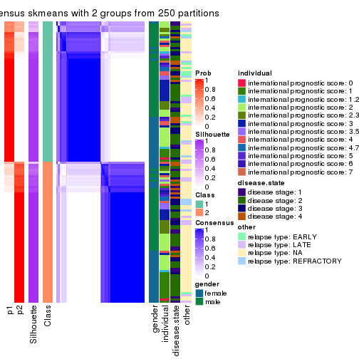</p>

</div>
<div id='tab-SD-skmeans-consensus-heatmap-2'>
<pre><code class="r">consensus_heatmap(res, k = 3)
</code></pre>

<p>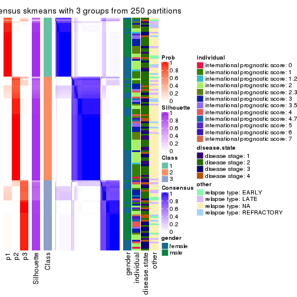</p>

</div>
<div id='tab-SD-skmeans-consensus-heatmap-3'>
<pre><code class="r">consensus_heatmap(res, k = 4)
</code></pre>

<p>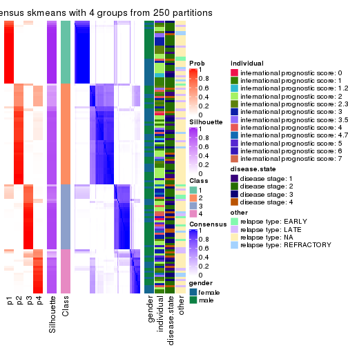</p>

</div>
<div id='tab-SD-skmeans-consensus-heatmap-4'>
<pre><code class="r">consensus_heatmap(res, k = 5)
</code></pre>

<p>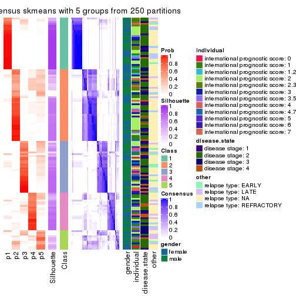</p>

</div>
<div id='tab-SD-skmeans-consensus-heatmap-5'>
<pre><code class="r">consensus_heatmap(res, k = 6)
</code></pre>

<p>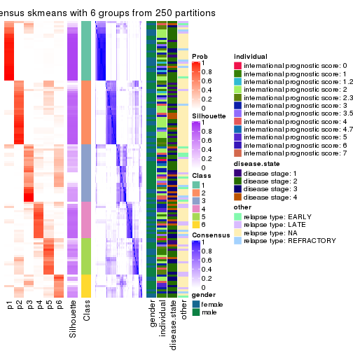</p>

</div>
</div>

Heatmaps for the membership of samples in all partitions to see how consistent they are:


<script>
$( function() {
	$( '#tabs-SD-skmeans-membership-heatmap' ).tabs();
} );
</script>
<div id='tabs-SD-skmeans-membership-heatmap'>
<ul>
<li><a href='#tab-SD-skmeans-membership-heatmap-1'>k = 2</a></li>
<li><a href='#tab-SD-skmeans-membership-heatmap-2'>k = 3</a></li>
<li><a href='#tab-SD-skmeans-membership-heatmap-3'>k = 4</a></li>
<li><a href='#tab-SD-skmeans-membership-heatmap-4'>k = 5</a></li>
<li><a href='#tab-SD-skmeans-membership-heatmap-5'>k = 6</a></li>
</ul>
<div id='tab-SD-skmeans-membership-heatmap-1'>
<pre><code class="r">membership_heatmap(res, k = 2)
</code></pre>

<p>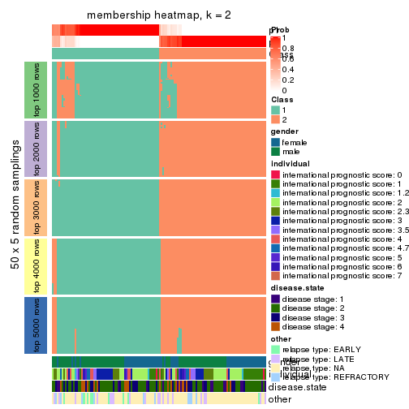</p>

</div>
<div id='tab-SD-skmeans-membership-heatmap-2'>
<pre><code class="r">membership_heatmap(res, k = 3)
</code></pre>

<p>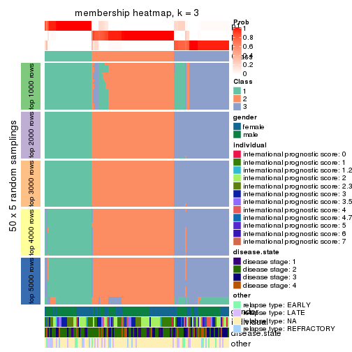</p>

</div>
<div id='tab-SD-skmeans-membership-heatmap-3'>
<pre><code class="r">membership_heatmap(res, k = 4)
</code></pre>

<p>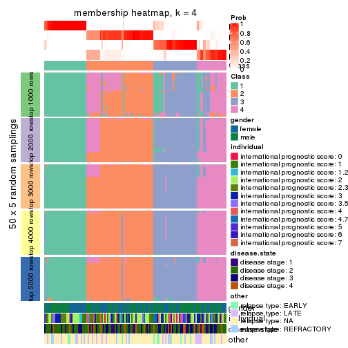</p>

</div>
<div id='tab-SD-skmeans-membership-heatmap-4'>
<pre><code class="r">membership_heatmap(res, k = 5)
</code></pre>

<p>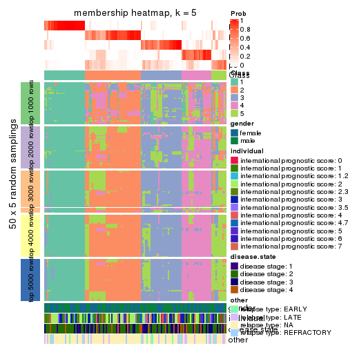</p>

</div>
<div id='tab-SD-skmeans-membership-heatmap-5'>
<pre><code class="r">membership_heatmap(res, k = 6)
</code></pre>

<p>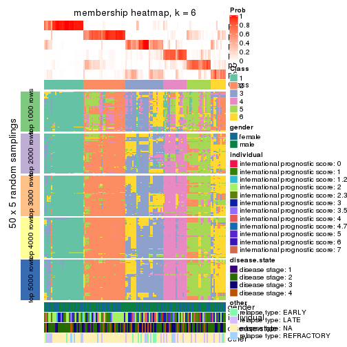</p>

</div>
</div>

As soon as we have had the classes for columns, we can look for signatures
which are significantly different between classes which can be candidate marks
for certain classes. Following are the heatmaps for signatures.


Signature heatmaps where rows are scaled:


<script>
$( function() {
	$( '#tabs-SD-skmeans-get-signatures' ).tabs();
} );
</script>
<div id='tabs-SD-skmeans-get-signatures'>
<ul>
<li><a href='#tab-SD-skmeans-get-signatures-1'>k = 2</a></li>
<li><a href='#tab-SD-skmeans-get-signatures-2'>k = 3</a></li>
<li><a href='#tab-SD-skmeans-get-signatures-3'>k = 4</a></li>
<li><a href='#tab-SD-skmeans-get-signatures-4'>k = 5</a></li>
<li><a href='#tab-SD-skmeans-get-signatures-5'>k = 6</a></li>
</ul>
<div id='tab-SD-skmeans-get-signatures-1'>
<pre><code class="r">get_signatures(res, k = 2)
</code></pre>

<p>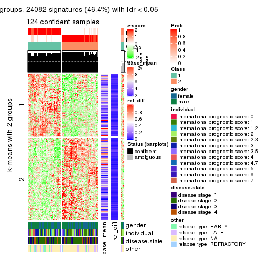</p>

</div>
<div id='tab-SD-skmeans-get-signatures-2'>
<pre><code class="r">get_signatures(res, k = 3)
</code></pre>

<p>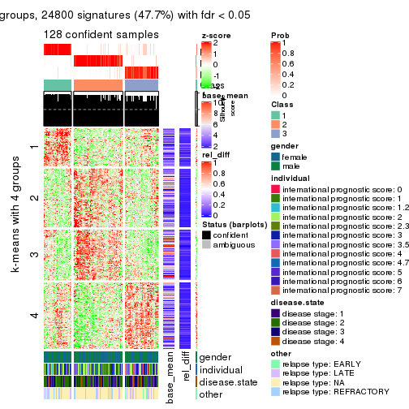</p>

</div>
<div id='tab-SD-skmeans-get-signatures-3'>
<pre><code class="r">get_signatures(res, k = 4)
</code></pre>

<p>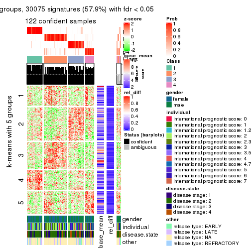</p>

</div>
<div id='tab-SD-skmeans-get-signatures-4'>
<pre><code class="r">get_signatures(res, k = 5)
</code></pre>

<p>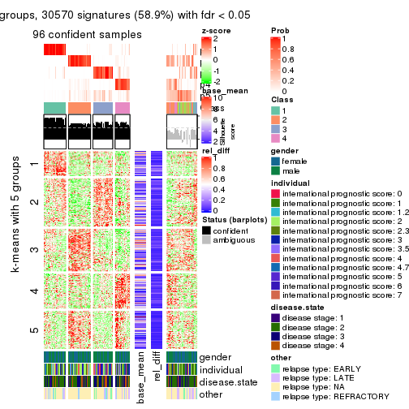</p>

</div>
<div id='tab-SD-skmeans-get-signatures-5'>
<pre><code class="r">get_signatures(res, k = 6)
</code></pre>

<pre><code>#&gt; Error: The width or height of the raster image is zero, maybe you forget to turn off the
#&gt; previous graphic device or it was corrupted. Run `dev.off()` to close it.
</code></pre>

<p></p>

</div>
</div>


Signature heatmaps where rows are not scaled:


<script>
$( function() {
	$( '#tabs-SD-skmeans-get-signatures-no-scale' ).tabs();
} );
</script>
<div id='tabs-SD-skmeans-get-signatures-no-scale'>
<ul>
<li><a href='#tab-SD-skmeans-get-signatures-no-scale-1'>k = 2</a></li>
<li><a href='#tab-SD-skmeans-get-signatures-no-scale-2'>k = 3</a></li>
<li><a href='#tab-SD-skmeans-get-signatures-no-scale-3'>k = 4</a></li>
<li><a href='#tab-SD-skmeans-get-signatures-no-scale-4'>k = 5</a></li>
<li><a href='#tab-SD-skmeans-get-signatures-no-scale-5'>k = 6</a></li>
</ul>
<div id='tab-SD-skmeans-get-signatures-no-scale-1'>
<pre><code class="r">get_signatures(res, k = 2, scale_rows = FALSE)
</code></pre>

<p>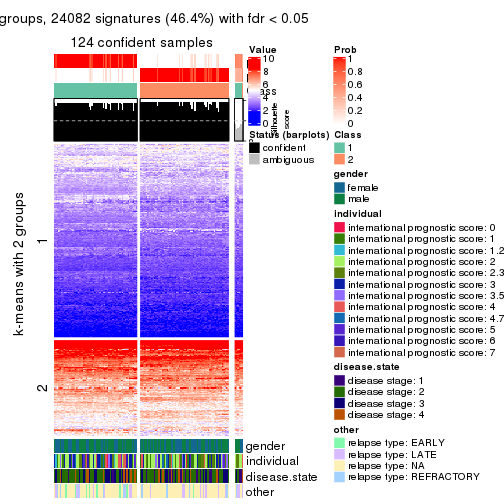</p>

</div>
<div id='tab-SD-skmeans-get-signatures-no-scale-2'>
<pre><code class="r">get_signatures(res, k = 3, scale_rows = FALSE)
</code></pre>

<p>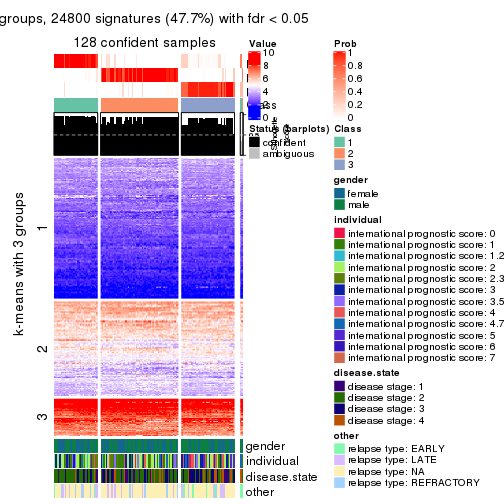</p>

</div>
<div id='tab-SD-skmeans-get-signatures-no-scale-3'>
<pre><code class="r">get_signatures(res, k = 4, scale_rows = FALSE)
</code></pre>

<p>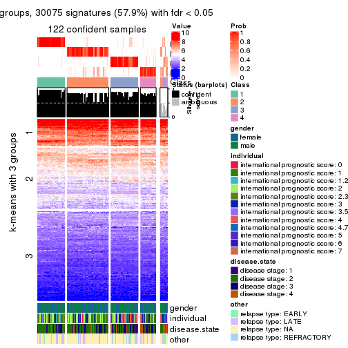</p>

</div>
<div id='tab-SD-skmeans-get-signatures-no-scale-4'>
<pre><code class="r">get_signatures(res, k = 5, scale_rows = FALSE)
</code></pre>

<p>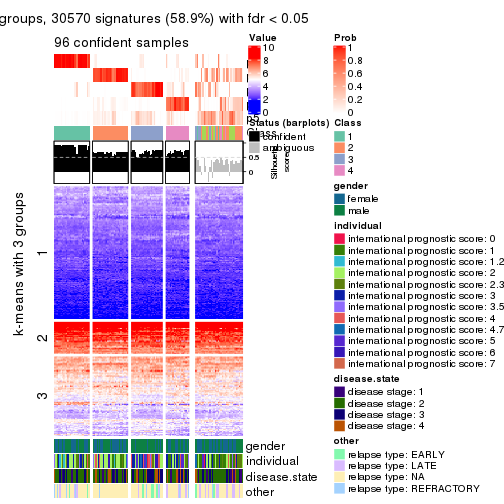</p>

</div>
<div id='tab-SD-skmeans-get-signatures-no-scale-5'>
<pre><code class="r">get_signatures(res, k = 6, scale_rows = FALSE)
</code></pre>

<pre><code>#&gt; Error in mat[ceiling(1:nr/h_ratio), ceiling(1:nc/w_ratio), drop = FALSE]: subscript out of bounds
</code></pre>

<p></p>

</div>
</div>


Compare the overlap of signatures from different k:

```r
compare_signatures(res)
```

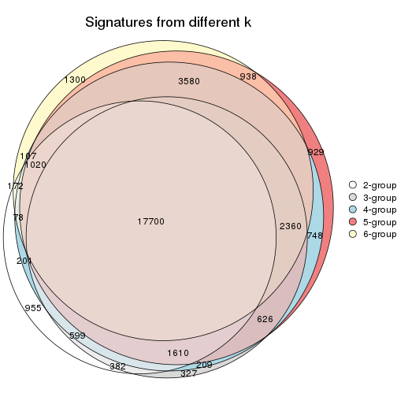

`get_signature()` returns a data frame invisibly. TO get the list of signatures, the function
call should be assigned to a variable explicitly. In following code, if `plot` argument is set
to `FALSE`, no heatmap is plotted while only the differential analysis is performed.

```r
# code only for demonstration
tb = get_signature(res, k = ..., plot = FALSE)
```

An example of the output of `tb` is:

```
#>   which_row         fdr    mean_1    mean_2 scaled_mean_1 scaled_mean_2 km
#> 1        38 0.042760348  8.373488  9.131774    -0.5533452     0.5164555  1
#> 2        40 0.018707592  7.106213  8.469186    -0.6173731     0.5762149  1
#> 3        55 0.019134737 10.221463 11.207825    -0.6159697     0.5749050  1
#> 4        59 0.006059896  5.921854  7.869574    -0.6899429     0.6439467  1
#> 5        60 0.018055526  8.928898 10.211722    -0.6204761     0.5791110  1
#> 6        98 0.009384629 15.714769 14.887706     0.6635654    -0.6193277  2
...
```

The columns in `tb` are:

1. `which_row`: row indices corresponding to the input matrix.
2. `fdr`: FDR for the differential test. 
3. `mean_x`: The mean value in group x.
4. `scaled_mean_x`: The mean value in group x after rows are scaled.
5. `km`: Row groups if k-means clustering is applied to rows.


UMAP plot which shows how samples are separated.


<script>
$( function() {
	$( '#tabs-SD-skmeans-dimension-reduction' ).tabs();
} );
</script>
<div id='tabs-SD-skmeans-dimension-reduction'>
<ul>
<li><a href='#tab-SD-skmeans-dimension-reduction-1'>k = 2</a></li>
<li><a href='#tab-SD-skmeans-dimension-reduction-2'>k = 3</a></li>
<li><a href='#tab-SD-skmeans-dimension-reduction-3'>k = 4</a></li>
<li><a href='#tab-SD-skmeans-dimension-reduction-4'>k = 5</a></li>
<li><a href='#tab-SD-skmeans-dimension-reduction-5'>k = 6</a></li>
</ul>
<div id='tab-SD-skmeans-dimension-reduction-1'>
<pre><code class="r">dimension_reduction(res, k = 2, method = &quot;UMAP&quot;)
</code></pre>

<p>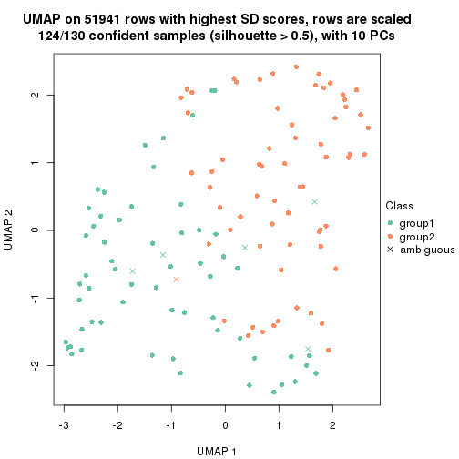</p>

</div>
<div id='tab-SD-skmeans-dimension-reduction-2'>
<pre><code class="r">dimension_reduction(res, k = 3, method = &quot;UMAP&quot;)
</code></pre>

<p>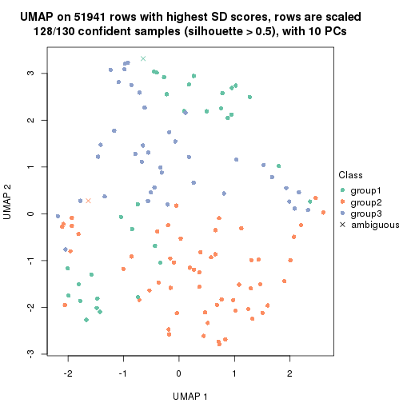</p>

</div>
<div id='tab-SD-skmeans-dimension-reduction-3'>
<pre><code class="r">dimension_reduction(res, k = 4, method = &quot;UMAP&quot;)
</code></pre>

<p>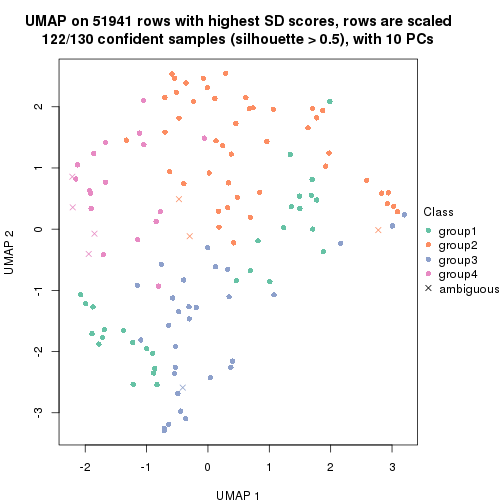</p>

</div>
<div id='tab-SD-skmeans-dimension-reduction-4'>
<pre><code class="r">dimension_reduction(res, k = 5, method = &quot;UMAP&quot;)
</code></pre>

<p>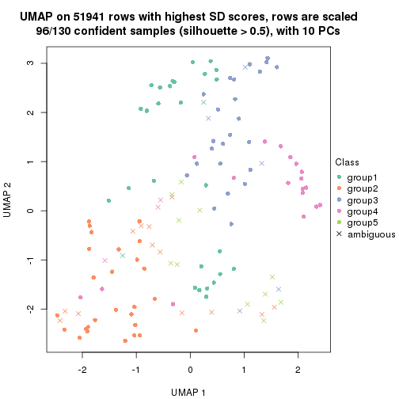</p>

</div>
<div id='tab-SD-skmeans-dimension-reduction-5'>
<pre><code class="r">dimension_reduction(res, k = 6, method = &quot;UMAP&quot;)
</code></pre>

<p>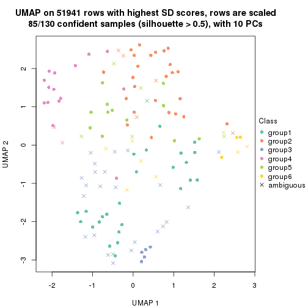</p>

</div>
</div>


Following heatmap shows how subgroups are split when increasing `k`:

```r
collect_classes(res)
```

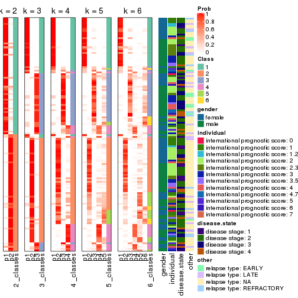


Test correlation between subgroups and known annotations. If the known
annotation is numeric, one-way ANOVA test is applied, and if the known
annotation is discrete, chi-squared contingency table test is applied.

```r
test_to_known_factors(res)
```

```
#>              n gender(p) individual(p) disease.state(p) other(p) k
#> SD:skmeans 124     0.445        0.7806           0.0387  0.07083 2
#> SD:skmeans 128     0.439        0.1093           0.1389  0.12221 3
#> SD:skmeans 122     0.276        0.5143           0.1829  0.15297 4
#> SD:skmeans  96     0.113        0.1846           0.1634  0.00831 5
#> SD:skmeans  85     0.982        0.0655           0.2014  0.00610 6
```


If matrix rows can be associated to genes, consider to use `GO_Enrichment(res,
...)` to perform function enrichment for the signature genes.


 

---------------------------------------------------


### SD:pam


The object with results only for a single top-value method and a single partition method 
can be extracted as:

```r
res = res_list["SD", "pam"]
# you can also extract it by
# res = res_list["SD:pam"]
```

A summary of `res` and all the functions that can be applied to it:

```r
res
```

```
#> A 'ConsensusPartition' object with k = 2, 3, 4, 5, 6.
#>   On a matrix with 51941 rows and 130 columns.
#>   Top rows (1000, 2000, 3000, 4000, 5000) are extracted by 'SD' method.
#>   Subgroups are detected by 'pam' method.
#>   Performed in total 1250 partitions by row resampling.
#>   Best k for subgroups seems to be 2.
#> 
#> Following methods can be applied to this 'ConsensusPartition' object:
#>  [1] "cola_report"             "collect_classes"         "collect_plots"          
#>  [4] "collect_stats"           "colnames"                "compare_signatures"     
#>  [7] "consensus_heatmap"       "dimension_reduction"     "functional_enrichment"  
#> [10] "get_anno_col"            "get_anno"                "get_classes"            
#> [13] "get_consensus"           "get_matrix"              "get_membership"         
#> [16] "get_param"               "get_signatures"          "get_stats"              
#> [19] "is_best_k"               "is_stable_k"             "membership_heatmap"     
#> [22] "ncol"                    "nrow"                    "plot_ecdf"              
#> [25] "rownames"                "select_partition_number" "show"                   
#> [28] "suggest_best_k"          "test_to_known_factors"
```

`collect_plots()` function collects all the plots made from `res` for all `k` (number of partitions)
into one single page to provide an easy and fast comparison between different `k`.

```r
collect_plots(res)
```

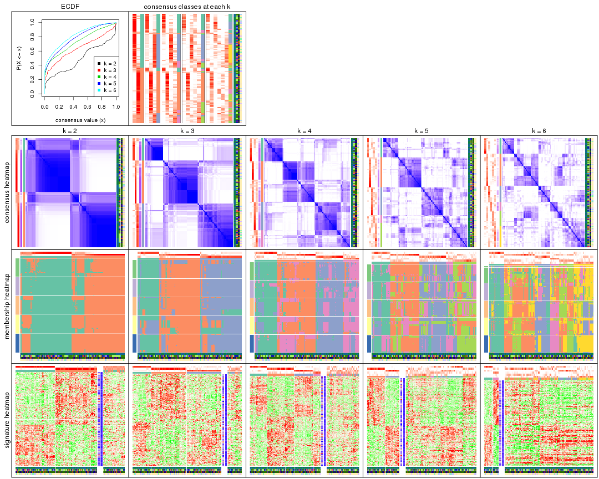

The plots are:

- The first row: a plot of the ECDF (Empirical cumulative distribution
  function) curves of the consensus matrix for each `k` and the heatmap of
  predicted classes for each `k`.
- The second row: heatmaps of the consensus matrix for each `k`.
- The third row: heatmaps of the membership matrix for each `k`.
- The fouth row: heatmaps of the signatures for each `k`.

All the plots in panels can be made by individual functions and they are
plotted later in this section.

`select_partition_number()` produces several plots showing different
statistics for choosing "optimized" `k`. There are following statistics:

- ECDF curves of the consensus matrix for each `k`;
- 1-PAC. [The PAC
  score](https://en.wikipedia.org/wiki/Consensus_clustering#Over-interpretation_potential_of_consensus_clustering)
  measures the proportion of the ambiguous subgrouping.
- Mean silhouette score.
- Concordance. The mean probability of fiting the consensus class ids in all
  partitions.
- Area increased. Denote $A_k$ as the area under the ECDF curve for current
  `k`, the area increased is defined as $A_k - A_{k-1}$.
- Rand index. The percent of pairs of samples that are both in a same cluster
  or both are not in a same cluster in the partition of k and k-1.
- Jaccard index. The ratio of pairs of samples are both in a same cluster in
  the partition of k and k-1 and the pairs of samples are both in a same
  cluster in the partition k or k-1.

The detailed explanations of these statistics can be found in [the cola
vignette](http://bioconductor.org/packages/devel/bioc/vignettes/cola/inst/doc/cola.html#toc_13).

Generally speaking, lower PAC score, higher mean silhouette score or higher
concordance corresponds to better partition. Rand index and Jaccard index
measure how similar the current partition is compared to partition with `k-1`.
If they are too similar, we won't accept `k` is better than `k-1`.

```r
select_partition_number(res)
```

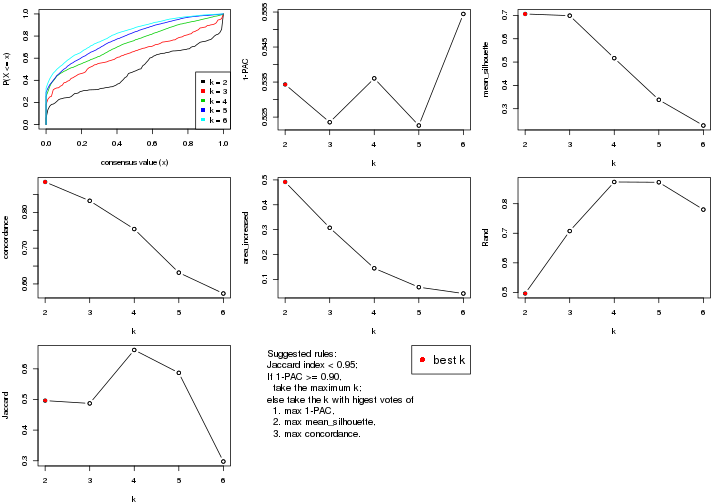

The numeric values for all these statistics can be obtained by `get_stats()`.

```r
get_stats(res)
```

```
#>   k 1-PAC mean_silhouette concordance area_increased  Rand Jaccard
#> 2 2 0.534           0.706       0.885         0.4917 0.496   0.496
#> 3 3 0.524           0.699       0.832         0.3075 0.707   0.487
#> 4 4 0.536           0.517       0.753         0.1445 0.873   0.662
#> 5 5 0.523           0.338       0.632         0.0686 0.872   0.587
#> 6 6 0.554           0.228       0.573         0.0431 0.780   0.298
```

`suggest_best_k()` suggests the best $k$ based on these statistics. The rules are as follows:

- All $k$ with Jaccard index larger than 0.95 are removed because the increase of
  the partition number does not provides enough extra information. If all $k$ are removed,
  the best $k$ is assigned by `NA`.
- For $k$ with 1-PAC larger than 0.9, the maximal $k$ is taken as the "best k". Other $k$ is called "optional k".
- If it does not fit the second rule. The $k$ with the highest vote of highest
  1-PAC, mean silhouette and concordance is taken as the "best k".

```r
suggest_best_k(res)
```

```
#> [1] 2
```


Following shows the table of the partitions (You need to click the **show/hide
code output** link to see it). The membership matrix (columns with name `p*`)
is inferred by
[`clue::cl_consensus()`](https://www.rdocumentation.org/link/cl_consensus?package=clue)
function with the `SE` method. Basically the value in the membership matrix
represents the probability to belong to a certain group. The finall class
label for an item is determined with the group with highest probability it
belongs to.

In `get_classes()` function, the entropy is calculated from the membership
matrix and the silhouette score is calculated from the consensus matrix.


<script>
$( function() {
	$( '#tabs-SD-pam-get-classes' ).tabs();
} );
</script>
<div id='tabs-SD-pam-get-classes'>
<ul>
<li><a href='#tab-SD-pam-get-classes-1'>k = 2</a></li>
<li><a href='#tab-SD-pam-get-classes-2'>k = 3</a></li>
<li><a href='#tab-SD-pam-get-classes-3'>k = 4</a></li>
<li><a href='#tab-SD-pam-get-classes-4'>k = 5</a></li>
<li><a href='#tab-SD-pam-get-classes-5'>k = 6</a></li>
</ul>

<div id='tab-SD-pam-get-classes-1'>
<p><a id='tab-SD-pam-get-classes-1-a' style='color:#0366d6' href='#'>show/hide code output</a></p>
<pre><code class="r">cbind(get_classes(res, k = 2), get_membership(res, k = 2))
</code></pre>

<pre><code>#&gt;           class entropy silhouette    p1    p2
#&gt; GSM447671     2  0.9954     0.1291 0.460 0.540
#&gt; GSM447694     1  0.0672     0.8616 0.992 0.008
#&gt; GSM447618     2  0.3431     0.8184 0.064 0.936
#&gt; GSM447691     2  0.9944     0.1472 0.456 0.544
#&gt; GSM447733     2  0.9996     0.0470 0.488 0.512
#&gt; GSM447620     1  0.9866     0.2006 0.568 0.432
#&gt; GSM447627     1  0.0672     0.8616 0.992 0.008
#&gt; GSM447630     2  0.0000     0.8500 0.000 1.000
#&gt; GSM447642     1  0.0000     0.8616 1.000 0.000
#&gt; GSM447649     2  0.0000     0.8500 0.000 1.000
#&gt; GSM447654     2  0.0938     0.8470 0.012 0.988
#&gt; GSM447655     2  0.0000     0.8500 0.000 1.000
#&gt; GSM447669     2  0.9866     0.2110 0.432 0.568
#&gt; GSM447676     1  0.0000     0.8616 1.000 0.000
#&gt; GSM447678     2  0.8763     0.5363 0.296 0.704
#&gt; GSM447681     2  0.0000     0.8500 0.000 1.000
#&gt; GSM447698     2  0.0000     0.8500 0.000 1.000
#&gt; GSM447713     1  0.0000     0.8616 1.000 0.000
#&gt; GSM447722     2  0.9954     0.1291 0.460 0.540
#&gt; GSM447726     2  0.9866     0.2790 0.432 0.568
#&gt; GSM447735     1  0.3431     0.8291 0.936 0.064
#&gt; GSM447737     1  0.0000     0.8616 1.000 0.000
#&gt; GSM447657     2  0.0376     0.8492 0.004 0.996
#&gt; GSM447674     2  0.0000     0.8500 0.000 1.000
#&gt; GSM447636     2  0.6247     0.7466 0.156 0.844
#&gt; GSM447723     1  0.0000     0.8616 1.000 0.000
#&gt; GSM447699     1  0.5842     0.7595 0.860 0.140
#&gt; GSM447708     1  0.9850     0.1998 0.572 0.428
#&gt; GSM447721     1  0.0000     0.8616 1.000 0.000
#&gt; GSM447623     1  0.0000     0.8616 1.000 0.000
#&gt; GSM447621     1  0.0000     0.8616 1.000 0.000
#&gt; GSM447650     2  0.0000     0.8500 0.000 1.000
#&gt; GSM447651     2  0.0000     0.8500 0.000 1.000
#&gt; GSM447653     1  0.4431     0.8019 0.908 0.092
#&gt; GSM447658     2  0.9795     0.3504 0.416 0.584
#&gt; GSM447675     2  0.6887     0.7103 0.184 0.816
#&gt; GSM447680     2  0.5946     0.7548 0.144 0.856
#&gt; GSM447686     2  0.4161     0.8078 0.084 0.916
#&gt; GSM447736     1  0.0938     0.8603 0.988 0.012
#&gt; GSM447629     2  0.3584     0.8217 0.068 0.932
#&gt; GSM447648     1  0.0376     0.8622 0.996 0.004
#&gt; GSM447660     1  0.8813     0.4825 0.700 0.300
#&gt; GSM447661     2  0.0000     0.8500 0.000 1.000
#&gt; GSM447663     1  0.5946     0.7649 0.856 0.144
#&gt; GSM447704     2  0.0000     0.8500 0.000 1.000
#&gt; GSM447720     1  0.9815     0.2216 0.580 0.420
#&gt; GSM447652     2  0.0000     0.8500 0.000 1.000
#&gt; GSM447679     2  0.0376     0.8492 0.004 0.996
#&gt; GSM447712     1  0.9795     0.1835 0.584 0.416
#&gt; GSM447664     2  0.3431     0.8218 0.064 0.936
#&gt; GSM447637     1  0.0376     0.8622 0.996 0.004
#&gt; GSM447639     1  0.9909     0.2171 0.556 0.444
#&gt; GSM447615     1  0.0376     0.8622 0.996 0.004
#&gt; GSM447656     2  0.6973     0.7194 0.188 0.812
#&gt; GSM447673     2  0.0376     0.8492 0.004 0.996
#&gt; GSM447719     1  0.0376     0.8622 0.996 0.004
#&gt; GSM447706     1  0.0672     0.8616 0.992 0.008
#&gt; GSM447612     1  0.6887     0.7194 0.816 0.184
#&gt; GSM447665     2  0.0000     0.8500 0.000 1.000
#&gt; GSM447677     2  0.0000     0.8500 0.000 1.000
#&gt; GSM447613     1  0.0000     0.8616 1.000 0.000
#&gt; GSM447659     1  0.6048     0.7525 0.852 0.148
#&gt; GSM447662     1  0.1843     0.8538 0.972 0.028
#&gt; GSM447666     1  0.9732     0.2612 0.596 0.404
#&gt; GSM447668     2  0.0000     0.8500 0.000 1.000
#&gt; GSM447682     2  0.0376     0.8492 0.004 0.996
#&gt; GSM447683     2  0.0376     0.8492 0.004 0.996
#&gt; GSM447688     2  0.0000     0.8500 0.000 1.000
#&gt; GSM447702     2  0.0000     0.8500 0.000 1.000
#&gt; GSM447709     2  0.9129     0.4618 0.328 0.672
#&gt; GSM447711     1  0.9933     0.0853 0.548 0.452
#&gt; GSM447715     2  0.6148     0.7489 0.152 0.848
#&gt; GSM447693     1  0.0938     0.8606 0.988 0.012
#&gt; GSM447611     2  0.7883     0.6568 0.236 0.764
#&gt; GSM447672     2  0.0000     0.8500 0.000 1.000
#&gt; GSM447703     2  0.0000     0.8500 0.000 1.000
#&gt; GSM447727     1  0.9580     0.3062 0.620 0.380
#&gt; GSM447638     2  0.6148     0.7489 0.152 0.848
#&gt; GSM447670     1  0.0000     0.8616 1.000 0.000
#&gt; GSM447700     2  0.9954     0.1291 0.460 0.540
#&gt; GSM447738     2  0.0000     0.8500 0.000 1.000
#&gt; GSM447739     1  0.0000     0.8616 1.000 0.000
#&gt; GSM447617     1  0.0000     0.8616 1.000 0.000
#&gt; GSM447628     2  0.0000     0.8500 0.000 1.000
#&gt; GSM447632     2  0.0376     0.8492 0.004 0.996
#&gt; GSM447619     1  0.1633     0.8556 0.976 0.024
#&gt; GSM447643     2  0.6887     0.7252 0.184 0.816
#&gt; GSM447724     2  0.9954     0.1291 0.460 0.540
#&gt; GSM447728     2  0.0000     0.8500 0.000 1.000
#&gt; GSM447610     1  0.0000     0.8616 1.000 0.000
#&gt; GSM447633     2  0.9933     0.1524 0.452 0.548
#&gt; GSM447634     1  0.3114     0.8372 0.944 0.056
#&gt; GSM447622     1  0.0376     0.8622 0.996 0.004
#&gt; GSM447667     1  0.9815     0.1963 0.580 0.420
#&gt; GSM447687     2  0.0000     0.8500 0.000 1.000
#&gt; GSM447695     1  0.0672     0.8616 0.992 0.008
#&gt; GSM447696     1  0.0000     0.8616 1.000 0.000
#&gt; GSM447697     1  0.0000     0.8616 1.000 0.000
#&gt; GSM447714     1  0.1633     0.8556 0.976 0.024
#&gt; GSM447717     2  0.9427     0.4221 0.360 0.640
#&gt; GSM447725     1  0.2778     0.8299 0.952 0.048
#&gt; GSM447729     2  0.1414     0.8428 0.020 0.980
#&gt; GSM447644     2  0.9896     0.1881 0.440 0.560
#&gt; GSM447710     1  0.0938     0.8606 0.988 0.012
#&gt; GSM447614     1  0.0376     0.8622 0.996 0.004
#&gt; GSM447685     2  0.0938     0.8461 0.012 0.988
#&gt; GSM447690     1  0.0000     0.8616 1.000 0.000
#&gt; GSM447730     2  0.0000     0.8500 0.000 1.000
#&gt; GSM447646     2  0.0000     0.8500 0.000 1.000
#&gt; GSM447689     1  0.9686     0.2742 0.604 0.396
#&gt; GSM447635     1  0.9944     0.1157 0.544 0.456
#&gt; GSM447641     1  0.0000     0.8616 1.000 0.000
#&gt; GSM447716     2  0.1184     0.8445 0.016 0.984
#&gt; GSM447718     2  0.2948     0.8282 0.052 0.948
#&gt; GSM447616     1  0.0376     0.8622 0.996 0.004
#&gt; GSM447626     1  0.0376     0.8622 0.996 0.004
#&gt; GSM447640     2  0.0000     0.8500 0.000 1.000
#&gt; GSM447734     1  0.2948     0.8396 0.948 0.052
#&gt; GSM447692     1  0.0376     0.8622 0.996 0.004
#&gt; GSM447647     2  0.0376     0.8490 0.004 0.996
#&gt; GSM447624     1  0.0000     0.8616 1.000 0.000
#&gt; GSM447625     1  0.2778     0.8419 0.952 0.048
#&gt; GSM447707     2  0.0000     0.8500 0.000 1.000
#&gt; GSM447732     1  0.1843     0.8528 0.972 0.028
#&gt; GSM447684     1  0.9580     0.3061 0.620 0.380
#&gt; GSM447731     2  0.7376     0.6741 0.208 0.792
#&gt; GSM447705     1  0.9909     0.1675 0.556 0.444
#&gt; GSM447631     1  0.0376     0.8622 0.996 0.004
#&gt; GSM447701     2  0.0000     0.8500 0.000 1.000
#&gt; GSM447645     1  0.0376     0.8622 0.996 0.004
</code></pre>

<script>
$('#tab-SD-pam-get-classes-1-a').parent().next().next().hide();
$('#tab-SD-pam-get-classes-1-a').click(function(){
  $('#tab-SD-pam-get-classes-1-a').parent().next().next().toggle();
  return(false);
});
</script>
</div>

<div id='tab-SD-pam-get-classes-2'>
<p><a id='tab-SD-pam-get-classes-2-a' style='color:#0366d6' href='#'>show/hide code output</a></p>
<pre><code class="r">cbind(get_classes(res, k = 3), get_membership(res, k = 3))
</code></pre>

<pre><code>#&gt;           class entropy silhouette    p1    p2    p3
#&gt; GSM447671     3  0.4750     0.6697 0.000 0.216 0.784
#&gt; GSM447694     3  0.3686     0.7451 0.140 0.000 0.860
#&gt; GSM447618     2  0.4504     0.7668 0.000 0.804 0.196
#&gt; GSM447691     3  0.5529     0.5087 0.000 0.296 0.704
#&gt; GSM447733     3  0.2796     0.7179 0.092 0.000 0.908
#&gt; GSM447620     3  0.4796     0.6665 0.000 0.220 0.780
#&gt; GSM447627     3  0.3686     0.7451 0.140 0.000 0.860
#&gt; GSM447630     2  0.2682     0.8588 0.004 0.920 0.076
#&gt; GSM447642     1  0.2796     0.8502 0.908 0.000 0.092
#&gt; GSM447649     2  0.0237     0.8690 0.000 0.996 0.004
#&gt; GSM447654     2  0.7987     0.4925 0.092 0.616 0.292
#&gt; GSM447655     2  0.0000     0.8699 0.000 1.000 0.000
#&gt; GSM447669     3  0.6180     0.2307 0.000 0.416 0.584
#&gt; GSM447676     1  0.6095     0.4060 0.608 0.000 0.392
#&gt; GSM447678     3  0.7529     0.3211 0.060 0.316 0.624
#&gt; GSM447681     2  0.2356     0.8596 0.000 0.928 0.072
#&gt; GSM447698     2  0.4235     0.7851 0.000 0.824 0.176
#&gt; GSM447713     1  0.2796     0.8502 0.908 0.000 0.092
#&gt; GSM447722     3  0.2878     0.7264 0.000 0.096 0.904
#&gt; GSM447726     2  0.6577     0.1657 0.008 0.572 0.420
#&gt; GSM447735     3  0.3686     0.7451 0.140 0.000 0.860
#&gt; GSM447737     3  0.5497     0.5607 0.292 0.000 0.708
#&gt; GSM447657     2  0.1529     0.8675 0.000 0.960 0.040
#&gt; GSM447674     2  0.1529     0.8675 0.000 0.960 0.040
#&gt; GSM447636     1  0.4062     0.6570 0.836 0.164 0.000
#&gt; GSM447723     1  0.6309     0.0757 0.504 0.000 0.496
#&gt; GSM447699     3  0.0237     0.7463 0.004 0.000 0.996
#&gt; GSM447708     3  0.6081     0.4044 0.004 0.344 0.652
#&gt; GSM447721     1  0.2796     0.8502 0.908 0.000 0.092
#&gt; GSM447623     1  0.2796     0.8502 0.908 0.000 0.092
#&gt; GSM447621     1  0.2959     0.8453 0.900 0.000 0.100
#&gt; GSM447650     2  0.1529     0.8675 0.000 0.960 0.040
#&gt; GSM447651     2  0.0000     0.8699 0.000 1.000 0.000
#&gt; GSM447653     3  0.5743     0.7233 0.172 0.044 0.784
#&gt; GSM447658     1  0.3619     0.6850 0.864 0.136 0.000
#&gt; GSM447675     3  0.8447    -0.0258 0.092 0.392 0.516
#&gt; GSM447680     2  0.2031     0.8660 0.016 0.952 0.032
#&gt; GSM447686     2  0.3816     0.7697 0.148 0.852 0.000
#&gt; GSM447736     3  0.3686     0.7451 0.140 0.000 0.860
#&gt; GSM447629     2  0.4465     0.7854 0.004 0.820 0.176
#&gt; GSM447648     3  0.3752     0.7429 0.144 0.000 0.856
#&gt; GSM447660     1  0.3967     0.7908 0.884 0.072 0.044
#&gt; GSM447661     2  0.0000     0.8699 0.000 1.000 0.000
#&gt; GSM447663     3  0.0237     0.7463 0.000 0.004 0.996
#&gt; GSM447704     2  0.0000     0.8699 0.000 1.000 0.000
#&gt; GSM447720     3  0.3030     0.7274 0.004 0.092 0.904
#&gt; GSM447652     2  0.1529     0.8675 0.000 0.960 0.040
#&gt; GSM447679     2  0.1529     0.8675 0.000 0.960 0.040
#&gt; GSM447712     1  0.2796     0.8502 0.908 0.000 0.092
#&gt; GSM447664     2  0.8104     0.5028 0.104 0.616 0.280
#&gt; GSM447637     3  0.4178     0.7272 0.172 0.000 0.828
#&gt; GSM447639     3  0.4521     0.6675 0.004 0.180 0.816
#&gt; GSM447615     3  0.3816     0.7411 0.148 0.000 0.852
#&gt; GSM447656     2  0.5062     0.7198 0.016 0.800 0.184
#&gt; GSM447673     2  0.2116     0.8661 0.012 0.948 0.040
#&gt; GSM447719     3  0.4931     0.7274 0.232 0.000 0.768
#&gt; GSM447706     3  0.4811     0.7343 0.148 0.024 0.828
#&gt; GSM447612     3  0.1643     0.7395 0.000 0.044 0.956
#&gt; GSM447665     2  0.3686     0.7829 0.000 0.860 0.140
#&gt; GSM447677     2  0.0000     0.8699 0.000 1.000 0.000
#&gt; GSM447613     1  0.2796     0.8502 0.908 0.000 0.092
#&gt; GSM447659     3  0.4289     0.7085 0.092 0.040 0.868
#&gt; GSM447662     3  0.3669     0.7465 0.064 0.040 0.896
#&gt; GSM447666     3  0.4978     0.6685 0.004 0.216 0.780
#&gt; GSM447668     2  0.1529     0.8675 0.000 0.960 0.040
#&gt; GSM447682     2  0.1529     0.8675 0.000 0.960 0.040
#&gt; GSM447683     2  0.1529     0.8675 0.000 0.960 0.040
#&gt; GSM447688     2  0.3619     0.7848 0.000 0.864 0.136
#&gt; GSM447702     2  0.0000     0.8699 0.000 1.000 0.000
#&gt; GSM447709     3  0.6235     0.2505 0.000 0.436 0.564
#&gt; GSM447711     1  0.2796     0.8502 0.908 0.000 0.092
#&gt; GSM447715     2  0.2176     0.8652 0.020 0.948 0.032
#&gt; GSM447693     3  0.5094     0.7329 0.136 0.040 0.824
#&gt; GSM447611     2  0.8627     0.2337 0.104 0.504 0.392
#&gt; GSM447672     2  0.0000     0.8699 0.000 1.000 0.000
#&gt; GSM447703     2  0.0000     0.8699 0.000 1.000 0.000
#&gt; GSM447727     1  0.6968     0.6123 0.732 0.120 0.148
#&gt; GSM447638     2  0.7276     0.2715 0.404 0.564 0.032
#&gt; GSM447670     1  0.2878     0.8482 0.904 0.000 0.096
#&gt; GSM447700     3  0.4654     0.6756 0.000 0.208 0.792
#&gt; GSM447738     2  0.0000     0.8699 0.000 1.000 0.000
#&gt; GSM447739     1  0.2796     0.8502 0.908 0.000 0.092
#&gt; GSM447617     1  0.2878     0.8482 0.904 0.000 0.096
#&gt; GSM447628     2  0.2796     0.8187 0.092 0.908 0.000
#&gt; GSM447632     2  0.0000     0.8699 0.000 1.000 0.000
#&gt; GSM447619     3  0.5094     0.7329 0.136 0.040 0.824
#&gt; GSM447643     1  0.5178     0.5882 0.744 0.256 0.000
#&gt; GSM447724     3  0.3551     0.7202 0.000 0.132 0.868
#&gt; GSM447728     2  0.1753     0.8668 0.000 0.952 0.048
#&gt; GSM447610     1  0.6286    -0.1530 0.536 0.000 0.464
#&gt; GSM447633     3  0.6062     0.3850 0.000 0.384 0.616
#&gt; GSM447634     3  0.3686     0.7451 0.140 0.000 0.860
#&gt; GSM447622     3  0.4178     0.7275 0.172 0.000 0.828
#&gt; GSM447667     2  0.6955    -0.1086 0.016 0.496 0.488
#&gt; GSM447687     2  0.0000     0.8699 0.000 1.000 0.000
#&gt; GSM447695     3  0.3686     0.7451 0.140 0.000 0.860
#&gt; GSM447696     1  0.2796     0.8502 0.908 0.000 0.092
#&gt; GSM447697     1  0.2796     0.8502 0.908 0.000 0.092
#&gt; GSM447714     3  0.1529     0.7393 0.000 0.040 0.960
#&gt; GSM447717     1  0.6208     0.7326 0.772 0.152 0.076
#&gt; GSM447725     1  0.0000     0.7938 1.000 0.000 0.000
#&gt; GSM447729     2  0.6168     0.7468 0.096 0.780 0.124
#&gt; GSM447644     3  0.6204     0.2048 0.000 0.424 0.576
#&gt; GSM447710     3  0.3619     0.7459 0.136 0.000 0.864
#&gt; GSM447614     3  0.3686     0.7451 0.140 0.000 0.860
#&gt; GSM447685     2  0.1711     0.8674 0.008 0.960 0.032
#&gt; GSM447690     1  0.2796     0.8502 0.908 0.000 0.092
#&gt; GSM447730     2  0.0237     0.8690 0.000 0.996 0.004
#&gt; GSM447646     2  0.2796     0.8187 0.092 0.908 0.000
#&gt; GSM447689     3  0.3267     0.7247 0.000 0.116 0.884
#&gt; GSM447635     3  0.3030     0.7274 0.004 0.092 0.904
#&gt; GSM447641     1  0.2796     0.8502 0.908 0.000 0.092
#&gt; GSM447716     2  0.3715     0.8240 0.004 0.868 0.128
#&gt; GSM447718     2  0.5690     0.5793 0.004 0.708 0.288
#&gt; GSM447616     3  0.4121     0.7306 0.168 0.000 0.832
#&gt; GSM447626     3  0.6302    -0.0135 0.480 0.000 0.520
#&gt; GSM447640     2  0.0000     0.8699 0.000 1.000 0.000
#&gt; GSM447734     3  0.3116     0.7524 0.108 0.000 0.892
#&gt; GSM447692     3  0.4178     0.7271 0.172 0.000 0.828
#&gt; GSM447647     2  0.5260     0.7653 0.092 0.828 0.080
#&gt; GSM447624     1  0.2878     0.8482 0.904 0.000 0.096
#&gt; GSM447625     3  0.3619     0.7459 0.136 0.000 0.864
#&gt; GSM447707     2  0.0000     0.8699 0.000 1.000 0.000
#&gt; GSM447732     3  0.3686     0.7450 0.140 0.000 0.860
#&gt; GSM447684     1  0.8743     0.0549 0.512 0.116 0.372
#&gt; GSM447731     2  0.8389     0.2190 0.092 0.536 0.372
#&gt; GSM447705     3  0.3551     0.7202 0.000 0.132 0.868
#&gt; GSM447631     3  0.3816     0.7410 0.148 0.000 0.852
#&gt; GSM447701     2  0.0000     0.8699 0.000 1.000 0.000
#&gt; GSM447645     3  0.3816     0.7410 0.148 0.000 0.852
</code></pre>

<script>
$('#tab-SD-pam-get-classes-2-a').parent().next().next().hide();
$('#tab-SD-pam-get-classes-2-a').click(function(){
  $('#tab-SD-pam-get-classes-2-a').parent().next().next().toggle();
  return(false);
});
</script>
</div>

<div id='tab-SD-pam-get-classes-3'>
<p><a id='tab-SD-pam-get-classes-3-a' style='color:#0366d6' href='#'>show/hide code output</a></p>
<pre><code class="r">cbind(get_classes(res, k = 4), get_membership(res, k = 4))
</code></pre>

<pre><code>#&gt;           class entropy silhouette    p1    p2    p3    p4
#&gt; GSM447671     4  0.5478    0.53285 0.000 0.056 0.248 0.696
#&gt; GSM447694     3  0.0000    0.72001 0.000 0.000 1.000 0.000
#&gt; GSM447618     4  0.6478    0.21246 0.000 0.336 0.088 0.576
#&gt; GSM447691     4  0.6516    0.47470 0.000 0.092 0.332 0.576
#&gt; GSM447733     3  0.4877    0.24752 0.000 0.000 0.592 0.408
#&gt; GSM447620     4  0.3732    0.58626 0.000 0.056 0.092 0.852
#&gt; GSM447627     3  0.0188    0.72016 0.000 0.000 0.996 0.004
#&gt; GSM447630     2  0.6400    0.55379 0.000 0.632 0.116 0.252
#&gt; GSM447642     1  0.1118    0.76691 0.964 0.000 0.000 0.036
#&gt; GSM447649     2  0.3726    0.66477 0.000 0.788 0.000 0.212
#&gt; GSM447654     2  0.3920    0.64399 0.012 0.856 0.056 0.076
#&gt; GSM447655     2  0.4164    0.63811 0.000 0.736 0.000 0.264
#&gt; GSM447669     4  0.6790    0.50066 0.000 0.168 0.228 0.604
#&gt; GSM447676     1  0.5359    0.43731 0.676 0.000 0.288 0.036
#&gt; GSM447678     2  0.7333   -0.07200 0.000 0.496 0.172 0.332
#&gt; GSM447681     2  0.3837    0.64529 0.000 0.776 0.000 0.224
#&gt; GSM447698     4  0.4916   -0.03657 0.000 0.424 0.000 0.576
#&gt; GSM447713     1  0.1824    0.76228 0.936 0.000 0.060 0.004
#&gt; GSM447722     3  0.5698    0.27867 0.000 0.044 0.636 0.320
#&gt; GSM447726     4  0.9767    0.00390 0.172 0.288 0.208 0.332
#&gt; GSM447735     3  0.1629    0.71108 0.000 0.024 0.952 0.024
#&gt; GSM447737     3  0.4122    0.53357 0.236 0.000 0.760 0.004
#&gt; GSM447657     2  0.0817    0.69865 0.000 0.976 0.024 0.000
#&gt; GSM447674     2  0.0000    0.70045 0.000 1.000 0.000 0.000
#&gt; GSM447636     1  0.2401    0.74682 0.904 0.004 0.000 0.092
#&gt; GSM447723     1  0.5931    0.08662 0.504 0.000 0.460 0.036
#&gt; GSM447699     3  0.5291    0.33120 0.000 0.024 0.652 0.324
#&gt; GSM447708     4  0.7635    0.49769 0.068 0.092 0.248 0.592
#&gt; GSM447721     1  0.5113    0.63993 0.712 0.000 0.252 0.036
#&gt; GSM447623     1  0.4964    0.52189 0.616 0.000 0.380 0.004
#&gt; GSM447621     1  0.5016    0.50437 0.600 0.000 0.396 0.004
#&gt; GSM447650     2  0.0817    0.69865 0.000 0.976 0.024 0.000
#&gt; GSM447651     2  0.4713    0.57027 0.000 0.640 0.000 0.360
#&gt; GSM447653     3  0.6410    0.46898 0.208 0.028 0.684 0.080
#&gt; GSM447658     1  0.1557    0.76384 0.944 0.000 0.000 0.056
#&gt; GSM447675     2  0.6414    0.13056 0.004 0.544 0.060 0.392
#&gt; GSM447680     2  0.7462    0.41142 0.156 0.516 0.008 0.320
#&gt; GSM447686     2  0.7812    0.26421 0.348 0.396 0.000 0.256
#&gt; GSM447736     3  0.0336    0.72016 0.000 0.000 0.992 0.008
#&gt; GSM447629     2  0.6957    0.27003 0.000 0.472 0.112 0.416
#&gt; GSM447648     3  0.3266    0.69075 0.108 0.000 0.868 0.024
#&gt; GSM447660     1  0.2197    0.75451 0.928 0.000 0.048 0.024
#&gt; GSM447661     2  0.4677    0.60432 0.000 0.680 0.004 0.316
#&gt; GSM447663     4  0.5000   -0.10151 0.000 0.000 0.496 0.504
#&gt; GSM447704     2  0.2704    0.69037 0.000 0.876 0.000 0.124
#&gt; GSM447720     3  0.5533    0.39689 0.028 0.020 0.708 0.244
#&gt; GSM447652     2  0.0000    0.70045 0.000 1.000 0.000 0.000
#&gt; GSM447679     2  0.0000    0.70045 0.000 1.000 0.000 0.000
#&gt; GSM447712     1  0.0000    0.77059 1.000 0.000 0.000 0.000
#&gt; GSM447664     2  0.3202    0.65805 0.012 0.888 0.024 0.076
#&gt; GSM447637     3  0.4057    0.66584 0.152 0.000 0.816 0.032
#&gt; GSM447639     3  0.6862    0.16016 0.000 0.128 0.560 0.312
#&gt; GSM447615     3  0.2868    0.67659 0.136 0.000 0.864 0.000
#&gt; GSM447656     2  0.9673    0.02148 0.188 0.328 0.164 0.320
#&gt; GSM447673     2  0.0336    0.69805 0.000 0.992 0.000 0.008
#&gt; GSM447719     3  0.5850    0.51265 0.244 0.000 0.676 0.080
#&gt; GSM447706     3  0.3550    0.69328 0.044 0.000 0.860 0.096
#&gt; GSM447612     4  0.4877    0.06970 0.000 0.000 0.408 0.592
#&gt; GSM447665     4  0.2760    0.52014 0.000 0.128 0.000 0.872
#&gt; GSM447677     2  0.4454    0.60752 0.000 0.692 0.000 0.308
#&gt; GSM447613     1  0.1118    0.76691 0.964 0.000 0.000 0.036
#&gt; GSM447659     3  0.4761    0.30651 0.000 0.000 0.628 0.372
#&gt; GSM447662     3  0.4967    0.24823 0.000 0.000 0.548 0.452
#&gt; GSM447666     4  0.4991    0.51409 0.104 0.056 0.036 0.804
#&gt; GSM447668     2  0.5088    0.60331 0.000 0.688 0.024 0.288
#&gt; GSM447682     2  0.0817    0.69865 0.000 0.976 0.024 0.000
#&gt; GSM447683     2  0.4134    0.62285 0.000 0.740 0.000 0.260
#&gt; GSM447688     2  0.4605    0.28028 0.000 0.664 0.000 0.336
#&gt; GSM447702     2  0.4277    0.61838 0.000 0.720 0.000 0.280
#&gt; GSM447709     4  0.3266    0.57544 0.000 0.084 0.040 0.876
#&gt; GSM447711     1  0.0188    0.77016 0.996 0.000 0.000 0.004
#&gt; GSM447715     2  0.7872    0.37402 0.188 0.492 0.016 0.304
#&gt; GSM447693     3  0.4072    0.56392 0.000 0.000 0.748 0.252
#&gt; GSM447611     2  0.6504    0.47357 0.216 0.676 0.032 0.076
#&gt; GSM447672     2  0.0707    0.70156 0.000 0.980 0.000 0.020
#&gt; GSM447703     2  0.0000    0.70045 0.000 1.000 0.000 0.000
#&gt; GSM447727     1  0.7297    0.41432 0.532 0.028 0.356 0.084
#&gt; GSM447638     1  0.8689   -0.21195 0.332 0.308 0.032 0.328
#&gt; GSM447670     1  0.5052    0.65034 0.720 0.000 0.244 0.036
#&gt; GSM447700     4  0.5598    0.54835 0.000 0.076 0.220 0.704
#&gt; GSM447738     2  0.0000    0.70045 0.000 1.000 0.000 0.000
#&gt; GSM447739     1  0.1661    0.76463 0.944 0.000 0.052 0.004
#&gt; GSM447617     1  0.4632    0.60138 0.688 0.000 0.308 0.004
#&gt; GSM447628     2  0.2081    0.66179 0.000 0.916 0.000 0.084
#&gt; GSM447632     2  0.0000    0.70045 0.000 1.000 0.000 0.000
#&gt; GSM447619     3  0.4222    0.54912 0.000 0.000 0.728 0.272
#&gt; GSM447643     1  0.3084    0.73316 0.896 0.028 0.012 0.064
#&gt; GSM447724     4  0.5408    0.08895 0.000 0.016 0.408 0.576
#&gt; GSM447728     2  0.4193    0.61944 0.000 0.732 0.000 0.268
#&gt; GSM447610     1  0.6586    0.13914 0.500 0.000 0.420 0.080
#&gt; GSM447633     4  0.3216    0.58192 0.000 0.076 0.044 0.880
#&gt; GSM447634     3  0.0188    0.72021 0.000 0.000 0.996 0.004
#&gt; GSM447622     3  0.1902    0.70551 0.064 0.000 0.932 0.004
#&gt; GSM447667     2  0.9696   -0.00905 0.156 0.336 0.208 0.300
#&gt; GSM447687     2  0.0000    0.70045 0.000 1.000 0.000 0.000
#&gt; GSM447695     3  0.0817    0.71694 0.000 0.000 0.976 0.024
#&gt; GSM447696     1  0.2053    0.75906 0.924 0.000 0.072 0.004
#&gt; GSM447697     1  0.1576    0.76570 0.948 0.000 0.048 0.004
#&gt; GSM447714     4  0.4972   -0.02405 0.000 0.000 0.456 0.544
#&gt; GSM447717     1  0.0000    0.77059 1.000 0.000 0.000 0.000
#&gt; GSM447725     1  0.0000    0.77059 1.000 0.000 0.000 0.000
#&gt; GSM447729     2  0.4966    0.54810 0.156 0.768 0.000 0.076
#&gt; GSM447644     4  0.6400    0.52365 0.000 0.168 0.180 0.652
#&gt; GSM447710     3  0.4706    0.55962 0.020 0.000 0.732 0.248
#&gt; GSM447614     3  0.0000    0.72001 0.000 0.000 1.000 0.000
#&gt; GSM447685     2  0.4869    0.61930 0.016 0.720 0.004 0.260
#&gt; GSM447690     1  0.1824    0.76264 0.936 0.000 0.060 0.004
#&gt; GSM447730     2  0.4977    0.42726 0.000 0.540 0.000 0.460
#&gt; GSM447646     2  0.2081    0.66179 0.000 0.916 0.000 0.084
#&gt; GSM447689     4  0.7019    0.06667 0.084 0.016 0.356 0.544
#&gt; GSM447635     3  0.5047    0.31816 0.000 0.016 0.668 0.316
#&gt; GSM447641     1  0.0336    0.77044 0.992 0.000 0.000 0.008
#&gt; GSM447716     2  0.5097    0.40652 0.004 0.568 0.000 0.428
#&gt; GSM447718     2  0.5587    0.28093 0.000 0.600 0.372 0.028
#&gt; GSM447616     3  0.1792    0.71026 0.068 0.000 0.932 0.000
#&gt; GSM447626     3  0.6465   -0.12312 0.412 0.000 0.516 0.072
#&gt; GSM447640     2  0.0000    0.70045 0.000 1.000 0.000 0.000
#&gt; GSM447734     3  0.3123    0.66022 0.000 0.000 0.844 0.156
#&gt; GSM447692     3  0.1389    0.70928 0.048 0.000 0.952 0.000
#&gt; GSM447647     2  0.2760    0.65790 0.000 0.872 0.000 0.128
#&gt; GSM447624     1  0.5578    0.59443 0.648 0.000 0.312 0.040
#&gt; GSM447625     3  0.0188    0.72053 0.000 0.000 0.996 0.004
#&gt; GSM447707     2  0.2408    0.69322 0.000 0.896 0.000 0.104
#&gt; GSM447732     3  0.0657    0.71946 0.004 0.000 0.984 0.012
#&gt; GSM447684     1  0.7847    0.24328 0.444 0.044 0.416 0.096
#&gt; GSM447731     2  0.7874   -0.09139 0.000 0.372 0.280 0.348
#&gt; GSM447705     4  0.5339    0.13397 0.000 0.016 0.384 0.600
#&gt; GSM447631     3  0.3970    0.68496 0.084 0.000 0.840 0.076
#&gt; GSM447701     2  0.5331    0.57786 0.000 0.644 0.024 0.332
#&gt; GSM447645     3  0.4706    0.64006 0.140 0.000 0.788 0.072
</code></pre>

<script>
$('#tab-SD-pam-get-classes-3-a').parent().next().next().hide();
$('#tab-SD-pam-get-classes-3-a').click(function(){
  $('#tab-SD-pam-get-classes-3-a').parent().next().next().toggle();
  return(false);
});
</script>
</div>

<div id='tab-SD-pam-get-classes-4'>
<p><a id='tab-SD-pam-get-classes-4-a' style='color:#0366d6' href='#'>show/hide code output</a></p>
<pre><code class="r">cbind(get_classes(res, k = 5), get_membership(res, k = 5))
</code></pre>

<pre><code>#&gt;           class entropy silhouette    p1    p2    p3    p4    p5
#&gt; GSM447671     5  0.5513    0.34153 0.000 0.004 0.188 0.144 0.664
#&gt; GSM447694     3  0.0290    0.64688 0.000 0.000 0.992 0.008 0.000
#&gt; GSM447618     5  0.7069    0.26948 0.000 0.272 0.052 0.156 0.520
#&gt; GSM447691     5  0.7169    0.34121 0.000 0.072 0.224 0.164 0.540
#&gt; GSM447733     3  0.6158    0.40976 0.000 0.000 0.528 0.316 0.156
#&gt; GSM447620     5  0.1243    0.44154 0.000 0.008 0.028 0.004 0.960
#&gt; GSM447627     3  0.0963    0.64912 0.000 0.000 0.964 0.036 0.000
#&gt; GSM447630     2  0.8286    0.02299 0.000 0.396 0.192 0.220 0.192
#&gt; GSM447642     1  0.4304   -0.17897 0.516 0.000 0.000 0.484 0.000
#&gt; GSM447649     2  0.3838    0.50707 0.000 0.716 0.000 0.004 0.280
#&gt; GSM447654     2  0.5844    0.51585 0.004 0.652 0.108 0.220 0.016
#&gt; GSM447655     2  0.4135    0.40730 0.000 0.656 0.000 0.004 0.340
#&gt; GSM447669     5  0.5758    0.42741 0.000 0.112 0.188 0.028 0.672
#&gt; GSM447676     1  0.6749   -0.18218 0.396 0.000 0.268 0.336 0.000
#&gt; GSM447678     2  0.7356    0.16367 0.000 0.528 0.132 0.108 0.232
#&gt; GSM447681     2  0.3878    0.50689 0.000 0.748 0.000 0.016 0.236
#&gt; GSM447698     5  0.6200    0.20181 0.000 0.320 0.000 0.160 0.520
#&gt; GSM447713     1  0.1851    0.47550 0.912 0.000 0.088 0.000 0.000
#&gt; GSM447722     3  0.7605    0.25323 0.000 0.096 0.480 0.164 0.260
#&gt; GSM447726     5  0.7696   -0.02481 0.092 0.028 0.080 0.320 0.480
#&gt; GSM447735     3  0.3518    0.61836 0.000 0.048 0.840 0.008 0.104
#&gt; GSM447737     1  0.4821    0.14419 0.516 0.000 0.464 0.020 0.000
#&gt; GSM447657     2  0.2654    0.64290 0.000 0.888 0.048 0.000 0.064
#&gt; GSM447674     2  0.0566    0.66295 0.000 0.984 0.000 0.004 0.012
#&gt; GSM447636     1  0.4517   -0.05058 0.556 0.008 0.000 0.436 0.000
#&gt; GSM447723     4  0.7380    0.41209 0.260 0.000 0.120 0.512 0.108
#&gt; GSM447699     3  0.7582    0.21057 0.000 0.048 0.364 0.356 0.232
#&gt; GSM447708     5  0.7707    0.41224 0.000 0.136 0.240 0.140 0.484
#&gt; GSM447721     4  0.6682    0.00512 0.368 0.000 0.236 0.396 0.000
#&gt; GSM447623     1  0.3932    0.37564 0.672 0.000 0.328 0.000 0.000
#&gt; GSM447621     1  0.3966    0.37216 0.664 0.000 0.336 0.000 0.000
#&gt; GSM447650     2  0.3570    0.60357 0.000 0.836 0.048 0.008 0.108
#&gt; GSM447651     5  0.4425   -0.06177 0.000 0.452 0.000 0.004 0.544
#&gt; GSM447653     3  0.6302    0.38128 0.156 0.000 0.584 0.244 0.016
#&gt; GSM447658     4  0.4304    0.08806 0.484 0.000 0.000 0.516 0.000
#&gt; GSM447675     2  0.6738    0.33457 0.000 0.532 0.032 0.292 0.144
#&gt; GSM447680     5  0.7566    0.20996 0.004 0.196 0.052 0.304 0.444
#&gt; GSM447686     1  0.8086   -0.10349 0.440 0.228 0.004 0.208 0.120
#&gt; GSM447736     3  0.1082    0.65043 0.000 0.000 0.964 0.008 0.028
#&gt; GSM447629     5  0.6248    0.19393 0.000 0.316 0.124 0.012 0.548
#&gt; GSM447648     3  0.3509    0.58014 0.004 0.000 0.792 0.196 0.008
#&gt; GSM447660     1  0.4900   -0.15791 0.512 0.000 0.024 0.464 0.000
#&gt; GSM447661     2  0.4359    0.28754 0.000 0.584 0.000 0.004 0.412
#&gt; GSM447663     3  0.5883    0.36750 0.000 0.000 0.508 0.104 0.388
#&gt; GSM447704     2  0.3333    0.57948 0.000 0.788 0.000 0.004 0.208
#&gt; GSM447720     3  0.5112    0.41348 0.012 0.012 0.668 0.024 0.284
#&gt; GSM447652     2  0.0566    0.66193 0.000 0.984 0.000 0.004 0.012
#&gt; GSM447679     2  0.2017    0.65086 0.000 0.912 0.000 0.008 0.080
#&gt; GSM447712     1  0.3305    0.31001 0.776 0.000 0.000 0.224 0.000
#&gt; GSM447664     2  0.4936    0.57485 0.004 0.724 0.048 0.208 0.016
#&gt; GSM447637     3  0.6805    0.09989 0.220 0.000 0.452 0.320 0.008
#&gt; GSM447639     4  0.8172   -0.26507 0.000 0.124 0.320 0.352 0.204
#&gt; GSM447615     3  0.2873    0.58121 0.016 0.000 0.856 0.128 0.000
#&gt; GSM447656     5  0.8252    0.00594 0.092 0.084 0.064 0.316 0.444
#&gt; GSM447673     2  0.0290    0.66114 0.000 0.992 0.000 0.008 0.000
#&gt; GSM447719     3  0.6349    0.40549 0.116 0.000 0.524 0.344 0.016
#&gt; GSM447706     3  0.4479    0.48419 0.000 0.000 0.700 0.264 0.036
#&gt; GSM447612     5  0.6374   -0.24637 0.000 0.000 0.360 0.172 0.468
#&gt; GSM447665     5  0.3193    0.44384 0.000 0.028 0.000 0.132 0.840
#&gt; GSM447677     5  0.4449   -0.18024 0.000 0.484 0.000 0.004 0.512
#&gt; GSM447613     1  0.3612    0.18660 0.732 0.000 0.000 0.268 0.000
#&gt; GSM447659     3  0.6438    0.33870 0.000 0.000 0.496 0.212 0.292
#&gt; GSM447662     3  0.6110    0.50185 0.000 0.000 0.568 0.216 0.216
#&gt; GSM447666     5  0.5077    0.20204 0.088 0.004 0.000 0.212 0.696
#&gt; GSM447668     5  0.5605   -0.10987 0.000 0.468 0.052 0.008 0.472
#&gt; GSM447682     2  0.1331    0.65724 0.000 0.952 0.040 0.000 0.008
#&gt; GSM447683     2  0.5052    0.30305 0.000 0.612 0.000 0.048 0.340
#&gt; GSM447688     2  0.6088    0.19239 0.000 0.548 0.000 0.156 0.296
#&gt; GSM447702     2  0.4321    0.29535 0.000 0.600 0.000 0.004 0.396
#&gt; GSM447709     5  0.2513    0.41965 0.000 0.116 0.000 0.008 0.876
#&gt; GSM447711     1  0.3177    0.32202 0.792 0.000 0.000 0.208 0.000
#&gt; GSM447715     4  0.7910    0.42442 0.116 0.052 0.060 0.500 0.272
#&gt; GSM447693     3  0.4350    0.59745 0.000 0.000 0.764 0.084 0.152
#&gt; GSM447611     2  0.7855    0.36613 0.208 0.492 0.076 0.208 0.016
#&gt; GSM447672     2  0.1701    0.65631 0.000 0.936 0.000 0.016 0.048
#&gt; GSM447703     2  0.0000    0.66175 0.000 1.000 0.000 0.000 0.000
#&gt; GSM447727     4  0.7492    0.46247 0.220 0.000 0.100 0.512 0.168
#&gt; GSM447638     5  0.7857   -0.05834 0.104 0.040 0.064 0.336 0.456
#&gt; GSM447670     1  0.6740    0.12372 0.404 0.000 0.268 0.328 0.000
#&gt; GSM447700     5  0.6642    0.33542 0.000 0.084 0.136 0.160 0.620
#&gt; GSM447738     2  0.2069    0.64695 0.000 0.912 0.000 0.012 0.076
#&gt; GSM447739     1  0.1851    0.47550 0.912 0.000 0.088 0.000 0.000
#&gt; GSM447617     1  0.5671    0.32674 0.568 0.000 0.336 0.096 0.000
#&gt; GSM447628     2  0.3663    0.58915 0.000 0.776 0.000 0.208 0.016
#&gt; GSM447632     2  0.0880    0.66080 0.000 0.968 0.000 0.000 0.032
#&gt; GSM447619     3  0.4385    0.59233 0.000 0.000 0.752 0.068 0.180
#&gt; GSM447643     4  0.5181    0.17002 0.452 0.000 0.004 0.512 0.032
#&gt; GSM447724     5  0.6690   -0.17538 0.000 0.020 0.340 0.148 0.492
#&gt; GSM447728     2  0.5668    0.27255 0.000 0.580 0.004 0.084 0.332
#&gt; GSM447610     1  0.6946    0.17178 0.468 0.000 0.232 0.284 0.016
#&gt; GSM447633     5  0.3247    0.44459 0.000 0.016 0.008 0.136 0.840
#&gt; GSM447634     3  0.0963    0.64912 0.000 0.000 0.964 0.036 0.000
#&gt; GSM447622     3  0.4132    0.38944 0.260 0.000 0.720 0.020 0.000
#&gt; GSM447667     5  0.8172    0.24893 0.004 0.220 0.100 0.304 0.372
#&gt; GSM447687     2  0.0000    0.66175 0.000 1.000 0.000 0.000 0.000
#&gt; GSM447695     3  0.2074    0.63300 0.000 0.000 0.896 0.000 0.104
#&gt; GSM447696     1  0.2280    0.46777 0.880 0.000 0.120 0.000 0.000
#&gt; GSM447697     1  0.2248    0.47375 0.900 0.000 0.088 0.012 0.000
#&gt; GSM447714     3  0.6545    0.38872 0.000 0.000 0.476 0.240 0.284
#&gt; GSM447717     1  0.3336    0.30873 0.772 0.000 0.000 0.228 0.000
#&gt; GSM447725     1  0.3336    0.30873 0.772 0.000 0.000 0.228 0.000
#&gt; GSM447729     2  0.4848    0.55871 0.052 0.724 0.000 0.208 0.016
#&gt; GSM447644     5  0.6637    0.34774 0.000 0.184 0.236 0.024 0.556
#&gt; GSM447710     3  0.5568    0.50642 0.000 0.000 0.596 0.096 0.308
#&gt; GSM447614     3  0.0000    0.64635 0.000 0.000 1.000 0.000 0.000
#&gt; GSM447685     2  0.5200    0.25173 0.004 0.580 0.012 0.020 0.384
#&gt; GSM447690     1  0.1851    0.47550 0.912 0.000 0.088 0.000 0.000
#&gt; GSM447730     5  0.4452   -0.16430 0.000 0.496 0.000 0.004 0.500
#&gt; GSM447646     2  0.3727    0.58661 0.000 0.768 0.000 0.216 0.016
#&gt; GSM447689     5  0.7677   -0.23471 0.088 0.000 0.376 0.152 0.384
#&gt; GSM447635     3  0.5954    0.34516 0.000 0.000 0.576 0.152 0.272
#&gt; GSM447641     1  0.3752    0.23288 0.708 0.000 0.000 0.292 0.000
#&gt; GSM447716     2  0.6142    0.10468 0.000 0.488 0.012 0.092 0.408
#&gt; GSM447718     2  0.9508   -0.18881 0.088 0.284 0.252 0.244 0.132
#&gt; GSM447616     3  0.3601    0.56151 0.128 0.000 0.820 0.052 0.000
#&gt; GSM447626     4  0.7899    0.37619 0.128 0.000 0.280 0.436 0.156
#&gt; GSM447640     2  0.0955    0.66089 0.000 0.968 0.000 0.004 0.028
#&gt; GSM447734     3  0.3593    0.64090 0.000 0.000 0.828 0.084 0.088
#&gt; GSM447692     3  0.3424    0.43080 0.240 0.000 0.760 0.000 0.000
#&gt; GSM447647     2  0.4404    0.59571 0.000 0.760 0.000 0.152 0.088
#&gt; GSM447624     1  0.6793    0.15870 0.376 0.000 0.332 0.292 0.000
#&gt; GSM447625     3  0.1121    0.64913 0.000 0.000 0.956 0.044 0.000
#&gt; GSM447707     2  0.3196    0.59020 0.000 0.804 0.000 0.004 0.192
#&gt; GSM447732     3  0.4679    0.51211 0.000 0.000 0.740 0.136 0.124
#&gt; GSM447684     4  0.7428    0.47303 0.132 0.000 0.120 0.524 0.224
#&gt; GSM447731     5  0.8211   -0.10776 0.000 0.116 0.296 0.244 0.344
#&gt; GSM447705     5  0.5906   -0.06510 0.000 0.000 0.284 0.140 0.576
#&gt; GSM447631     3  0.3675    0.56198 0.004 0.000 0.772 0.216 0.008
#&gt; GSM447701     5  0.5112   -0.00990 0.000 0.408 0.016 0.016 0.560
#&gt; GSM447645     3  0.4541    0.33729 0.004 0.000 0.608 0.380 0.008
</code></pre>

<script>
$('#tab-SD-pam-get-classes-4-a').parent().next().next().hide();
$('#tab-SD-pam-get-classes-4-a').click(function(){
  $('#tab-SD-pam-get-classes-4-a').parent().next().next().toggle();
  return(false);
});
</script>
</div>

<div id='tab-SD-pam-get-classes-5'>
<p><a id='tab-SD-pam-get-classes-5-a' style='color:#0366d6' href='#'>show/hide code output</a></p>
<pre><code class="r">cbind(get_classes(res, k = 6), get_membership(res, k = 6))
</code></pre>

<pre><code>#&gt;           class entropy silhouette    p1    p2    p3    p4    p5    p6
#&gt; GSM447671     5  0.6021    0.04501 0.000 0.344 0.000 0.016 0.480 0.160
#&gt; GSM447694     6  0.4432    0.30084 0.000 0.000 0.364 0.036 0.000 0.600
#&gt; GSM447618     2  0.6581   -0.00935 0.004 0.452 0.000 0.120 0.360 0.064
#&gt; GSM447691     2  0.6755   -0.02189 0.000 0.424 0.000 0.072 0.348 0.156
#&gt; GSM447733     6  0.5865    0.25415 0.000 0.000 0.000 0.296 0.228 0.476
#&gt; GSM447620     2  0.6880    0.06928 0.000 0.372 0.000 0.068 0.372 0.188
#&gt; GSM447627     6  0.4316    0.40863 0.008 0.000 0.248 0.036 0.004 0.704
#&gt; GSM447630     6  0.6337    0.01393 0.212 0.304 0.000 0.016 0.004 0.464
#&gt; GSM447642     1  0.1610    0.62667 0.916 0.000 0.084 0.000 0.000 0.000
#&gt; GSM447649     5  0.4179   -0.04378 0.000 0.472 0.000 0.000 0.516 0.012
#&gt; GSM447654     4  0.5430    0.66084 0.000 0.200 0.000 0.632 0.020 0.148
#&gt; GSM447655     5  0.3860   -0.05120 0.000 0.472 0.000 0.000 0.528 0.000
#&gt; GSM447669     2  0.7019    0.10659 0.000 0.360 0.000 0.072 0.220 0.348
#&gt; GSM447676     1  0.4760    0.28051 0.668 0.000 0.120 0.000 0.000 0.212
#&gt; GSM447678     5  0.7351   -0.00648 0.000 0.144 0.000 0.188 0.388 0.280
#&gt; GSM447681     2  0.4060    0.30375 0.000 0.764 0.000 0.120 0.112 0.004
#&gt; GSM447698     2  0.6362   -0.00385 0.000 0.464 0.000 0.120 0.360 0.056
#&gt; GSM447713     3  0.3672   -0.06411 0.368 0.000 0.632 0.000 0.000 0.000
#&gt; GSM447722     5  0.7243   -0.03773 0.000 0.180 0.000 0.120 0.360 0.340
#&gt; GSM447726     2  0.6363    0.16235 0.308 0.396 0.000 0.000 0.012 0.284
#&gt; GSM447735     6  0.7636    0.21995 0.000 0.068 0.360 0.096 0.096 0.380
#&gt; GSM447737     3  0.3352    0.44956 0.112 0.000 0.816 0.000 0.000 0.072
#&gt; GSM447657     2  0.3146    0.31989 0.000 0.848 0.000 0.012 0.060 0.080
#&gt; GSM447674     2  0.3967    0.13462 0.000 0.632 0.000 0.012 0.356 0.000
#&gt; GSM447636     1  0.2300    0.62310 0.856 0.000 0.144 0.000 0.000 0.000
#&gt; GSM447723     1  0.0291    0.63331 0.992 0.000 0.004 0.000 0.000 0.004
#&gt; GSM447699     5  0.8072   -0.12530 0.200 0.068 0.000 0.088 0.348 0.296
#&gt; GSM447708     2  0.6741    0.05722 0.028 0.424 0.000 0.008 0.292 0.248
#&gt; GSM447721     1  0.3789    0.29025 0.584 0.000 0.416 0.000 0.000 0.000
#&gt; GSM447623     3  0.1010    0.42733 0.036 0.000 0.960 0.000 0.000 0.004
#&gt; GSM447621     3  0.1010    0.42733 0.036 0.000 0.960 0.000 0.000 0.004
#&gt; GSM447650     5  0.5917   -0.11800 0.000 0.416 0.000 0.012 0.428 0.144
#&gt; GSM447651     5  0.5480   -0.05582 0.000 0.328 0.000 0.000 0.528 0.144
#&gt; GSM447653     4  0.3955    0.37153 0.008 0.000 0.000 0.608 0.000 0.384
#&gt; GSM447658     1  0.0260    0.63519 0.992 0.000 0.008 0.000 0.000 0.000
#&gt; GSM447675     4  0.4368    0.52846 0.000 0.116 0.000 0.740 0.136 0.008
#&gt; GSM447680     2  0.5643    0.19375 0.368 0.476 0.000 0.000 0.000 0.156
#&gt; GSM447686     1  0.5033    0.10499 0.476 0.452 0.072 0.000 0.000 0.000
#&gt; GSM447736     6  0.4653    0.31804 0.000 0.000 0.360 0.000 0.052 0.588
#&gt; GSM447629     2  0.4939    0.30196 0.056 0.704 0.000 0.004 0.044 0.192
#&gt; GSM447648     3  0.6807   -0.05619 0.056 0.000 0.396 0.204 0.000 0.344
#&gt; GSM447660     1  0.2191    0.61099 0.876 0.004 0.120 0.000 0.000 0.000
#&gt; GSM447661     5  0.4631   -0.03879 0.000 0.440 0.000 0.012 0.528 0.020
#&gt; GSM447663     6  0.3747    0.44217 0.048 0.000 0.000 0.048 0.088 0.816
#&gt; GSM447704     2  0.3868   -0.00686 0.000 0.504 0.000 0.000 0.496 0.000
#&gt; GSM447720     6  0.3699    0.41788 0.036 0.112 0.000 0.000 0.040 0.812
#&gt; GSM447652     2  0.5377    0.12102 0.000 0.596 0.000 0.016 0.288 0.100
#&gt; GSM447679     2  0.1995    0.32483 0.000 0.912 0.000 0.052 0.036 0.000
#&gt; GSM447712     1  0.3482    0.53936 0.684 0.000 0.316 0.000 0.000 0.000
#&gt; GSM447664     4  0.5601    0.61960 0.020 0.324 0.004 0.584 0.020 0.048
#&gt; GSM447637     3  0.6036    0.32649 0.108 0.000 0.600 0.208 0.000 0.084
#&gt; GSM447639     6  0.7992    0.07939 0.204 0.084 0.000 0.060 0.324 0.328
#&gt; GSM447615     6  0.5934    0.10843 0.216 0.000 0.364 0.000 0.000 0.420
#&gt; GSM447656     2  0.5675    0.14601 0.400 0.444 0.000 0.000 0.000 0.156
#&gt; GSM447673     2  0.5002    0.11891 0.000 0.556 0.000 0.080 0.364 0.000
#&gt; GSM447719     4  0.4497    0.42902 0.024 0.000 0.032 0.688 0.000 0.256
#&gt; GSM447706     3  0.7888    0.08116 0.192 0.000 0.396 0.220 0.028 0.164
#&gt; GSM447612     5  0.4689   -0.21839 0.000 0.000 0.000 0.044 0.516 0.440
#&gt; GSM447665     5  0.4713   -0.00771 0.000 0.364 0.000 0.016 0.592 0.028
#&gt; GSM447677     2  0.4108    0.29190 0.000 0.744 0.000 0.000 0.164 0.092
#&gt; GSM447613     1  0.3515    0.43497 0.676 0.000 0.324 0.000 0.000 0.000
#&gt; GSM447659     6  0.4739    0.23473 0.000 0.000 0.000 0.048 0.436 0.516
#&gt; GSM447662     6  0.6533    0.38067 0.000 0.000 0.088 0.140 0.244 0.528
#&gt; GSM447666     2  0.8324    0.10418 0.032 0.360 0.016 0.220 0.140 0.232
#&gt; GSM447668     2  0.4266    0.31545 0.000 0.756 0.000 0.012 0.116 0.116
#&gt; GSM447682     2  0.5345    0.12614 0.048 0.584 0.000 0.012 0.336 0.020
#&gt; GSM447683     2  0.0622    0.33672 0.008 0.980 0.000 0.000 0.000 0.012
#&gt; GSM447688     5  0.6458   -0.02485 0.000 0.368 0.000 0.132 0.444 0.056
#&gt; GSM447702     2  0.3854    0.03227 0.000 0.536 0.000 0.000 0.464 0.000
#&gt; GSM447709     2  0.6472    0.11018 0.000 0.416 0.000 0.044 0.384 0.156
#&gt; GSM447711     1  0.3634    0.49527 0.644 0.000 0.356 0.000 0.000 0.000
#&gt; GSM447715     1  0.4921    0.37058 0.656 0.180 0.000 0.000 0.000 0.164
#&gt; GSM447693     3  0.7043   -0.12850 0.000 0.000 0.356 0.248 0.068 0.328
#&gt; GSM447611     4  0.6116    0.66327 0.020 0.252 0.028 0.608 0.020 0.072
#&gt; GSM447672     2  0.4945    0.07492 0.000 0.484 0.000 0.064 0.452 0.000
#&gt; GSM447703     2  0.3992    0.12593 0.000 0.624 0.000 0.012 0.364 0.000
#&gt; GSM447727     1  0.3219    0.53793 0.820 0.020 0.012 0.000 0.000 0.148
#&gt; GSM447638     2  0.6519    0.13586 0.344 0.388 0.000 0.000 0.024 0.244
#&gt; GSM447670     1  0.3756    0.23804 0.600 0.000 0.400 0.000 0.000 0.000
#&gt; GSM447700     2  0.6947   -0.07233 0.000 0.380 0.000 0.144 0.376 0.100
#&gt; GSM447738     2  0.2658    0.31979 0.000 0.864 0.000 0.100 0.036 0.000
#&gt; GSM447739     3  0.3672   -0.06411 0.368 0.000 0.632 0.000 0.000 0.000
#&gt; GSM447617     3  0.2178    0.42856 0.132 0.000 0.868 0.000 0.000 0.000
#&gt; GSM447628     4  0.4406    0.48208 0.000 0.476 0.000 0.500 0.024 0.000
#&gt; GSM447632     2  0.3494    0.19996 0.000 0.736 0.000 0.012 0.252 0.000
#&gt; GSM447619     6  0.7171    0.10236 0.000 0.000 0.340 0.216 0.092 0.352
#&gt; GSM447643     1  0.0405    0.63245 0.988 0.008 0.000 0.000 0.000 0.004
#&gt; GSM447724     5  0.6171   -0.07946 0.000 0.100 0.000 0.060 0.516 0.324
#&gt; GSM447728     2  0.1873    0.33391 0.000 0.924 0.000 0.048 0.020 0.008
#&gt; GSM447610     4  0.5635    0.40151 0.120 0.000 0.240 0.608 0.000 0.032
#&gt; GSM447633     5  0.5340    0.02240 0.000 0.352 0.000 0.044 0.564 0.040
#&gt; GSM447634     6  0.4260    0.41103 0.000 0.000 0.248 0.048 0.004 0.700
#&gt; GSM447622     3  0.4443    0.22920 0.052 0.000 0.648 0.000 0.000 0.300
#&gt; GSM447667     2  0.4926    0.24969 0.360 0.580 0.000 0.000 0.012 0.048
#&gt; GSM447687     2  0.3992    0.12593 0.000 0.624 0.000 0.012 0.364 0.000
#&gt; GSM447695     6  0.6425    0.27521 0.028 0.000 0.364 0.024 0.108 0.476
#&gt; GSM447696     3  0.3151    0.13781 0.252 0.000 0.748 0.000 0.000 0.000
#&gt; GSM447697     3  0.3706   -0.07794 0.380 0.000 0.620 0.000 0.000 0.000
#&gt; GSM447714     6  0.5529    0.37958 0.000 0.000 0.016 0.132 0.256 0.596
#&gt; GSM447717     1  0.3482    0.53929 0.684 0.000 0.316 0.000 0.000 0.000
#&gt; GSM447725     1  0.3499    0.53665 0.680 0.000 0.320 0.000 0.000 0.000
#&gt; GSM447729     4  0.4679    0.60425 0.000 0.376 0.020 0.584 0.020 0.000
#&gt; GSM447644     2  0.5917    0.17073 0.000 0.428 0.000 0.012 0.144 0.416
#&gt; GSM447710     6  0.5215    0.38974 0.000 0.000 0.080 0.128 0.092 0.700
#&gt; GSM447614     6  0.4541    0.30165 0.000 0.000 0.360 0.044 0.000 0.596
#&gt; GSM447685     2  0.3175    0.33648 0.080 0.832 0.000 0.000 0.000 0.088
#&gt; GSM447690     3  0.3672   -0.06411 0.368 0.000 0.632 0.000 0.000 0.000
#&gt; GSM447730     5  0.3944   -0.02607 0.000 0.428 0.000 0.004 0.568 0.000
#&gt; GSM447646     4  0.4118    0.60995 0.000 0.352 0.000 0.628 0.020 0.000
#&gt; GSM447689     6  0.5917    0.36905 0.068 0.016 0.012 0.100 0.128 0.676
#&gt; GSM447635     6  0.5209    0.24223 0.000 0.112 0.000 0.000 0.324 0.564
#&gt; GSM447641     1  0.3198    0.57745 0.740 0.000 0.260 0.000 0.000 0.000
#&gt; GSM447716     2  0.5096    0.25479 0.056 0.712 0.000 0.020 0.172 0.040
#&gt; GSM447718     6  0.5861    0.04909 0.224 0.260 0.000 0.004 0.000 0.512
#&gt; GSM447616     3  0.5271    0.02747 0.104 0.000 0.516 0.000 0.000 0.380
#&gt; GSM447626     6  0.4542   -0.00993 0.412 0.000 0.028 0.004 0.000 0.556
#&gt; GSM447640     2  0.3965    0.10974 0.000 0.604 0.000 0.008 0.388 0.000
#&gt; GSM447734     6  0.4544    0.45462 0.000 0.000 0.172 0.020 0.080 0.728
#&gt; GSM447692     3  0.4408    0.12310 0.000 0.000 0.608 0.036 0.000 0.356
#&gt; GSM447647     5  0.6031   -0.16701 0.000 0.312 0.000 0.268 0.420 0.000
#&gt; GSM447624     3  0.4244    0.40284 0.200 0.000 0.720 0.080 0.000 0.000
#&gt; GSM447625     6  0.3754    0.42903 0.000 0.000 0.212 0.016 0.016 0.756
#&gt; GSM447707     5  0.3862   -0.04982 0.000 0.476 0.000 0.000 0.524 0.000
#&gt; GSM447732     6  0.4219    0.38292 0.144 0.000 0.080 0.016 0.000 0.760
#&gt; GSM447684     1  0.6110    0.25636 0.536 0.120 0.048 0.000 0.000 0.296
#&gt; GSM447731     4  0.5575    0.50842 0.000 0.028 0.000 0.620 0.216 0.136
#&gt; GSM447705     5  0.6289   -0.07023 0.000 0.104 0.000 0.068 0.508 0.320
#&gt; GSM447631     3  0.7203    0.00617 0.104 0.000 0.388 0.208 0.000 0.300
#&gt; GSM447701     2  0.5678    0.26996 0.000 0.580 0.000 0.012 0.212 0.196
#&gt; GSM447645     3  0.7401    0.01257 0.136 0.000 0.360 0.208 0.000 0.296
</code></pre>

<script>
$('#tab-SD-pam-get-classes-5-a').parent().next().next().hide();
$('#tab-SD-pam-get-classes-5-a').click(function(){
  $('#tab-SD-pam-get-classes-5-a').parent().next().next().toggle();
  return(false);
});
</script>
</div>
</div>

Heatmaps for the consensus matrix. It visualizes the probability of two
samples to be in a same group.


<script>
$( function() {
	$( '#tabs-SD-pam-consensus-heatmap' ).tabs();
} );
</script>
<div id='tabs-SD-pam-consensus-heatmap'>
<ul>
<li><a href='#tab-SD-pam-consensus-heatmap-1'>k = 2</a></li>
<li><a href='#tab-SD-pam-consensus-heatmap-2'>k = 3</a></li>
<li><a href='#tab-SD-pam-consensus-heatmap-3'>k = 4</a></li>
<li><a href='#tab-SD-pam-consensus-heatmap-4'>k = 5</a></li>
<li><a href='#tab-SD-pam-consensus-heatmap-5'>k = 6</a></li>
</ul>
<div id='tab-SD-pam-consensus-heatmap-1'>
<pre><code class="r">consensus_heatmap(res, k = 2)
</code></pre>

<p>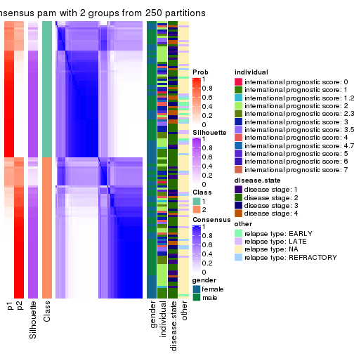</p>

</div>
<div id='tab-SD-pam-consensus-heatmap-2'>
<pre><code class="r">consensus_heatmap(res, k = 3)
</code></pre>

<p>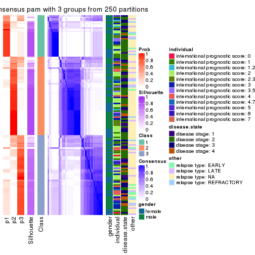</p>

</div>
<div id='tab-SD-pam-consensus-heatmap-3'>
<pre><code class="r">consensus_heatmap(res, k = 4)
</code></pre>

<p>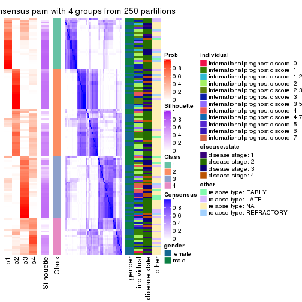</p>

</div>
<div id='tab-SD-pam-consensus-heatmap-4'>
<pre><code class="r">consensus_heatmap(res, k = 5)
</code></pre>

<p>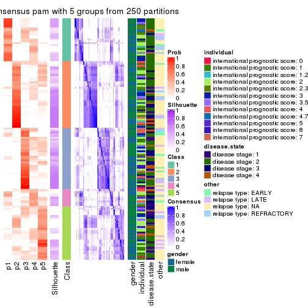</p>

</div>
<div id='tab-SD-pam-consensus-heatmap-5'>
<pre><code class="r">consensus_heatmap(res, k = 6)
</code></pre>

<p>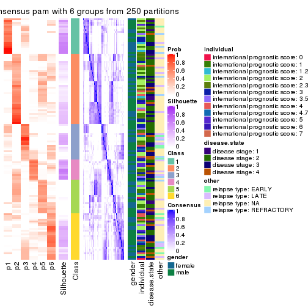</p>

</div>
</div>

Heatmaps for the membership of samples in all partitions to see how consistent they are:


<script>
$( function() {
	$( '#tabs-SD-pam-membership-heatmap' ).tabs();
} );
</script>
<div id='tabs-SD-pam-membership-heatmap'>
<ul>
<li><a href='#tab-SD-pam-membership-heatmap-1'>k = 2</a></li>
<li><a href='#tab-SD-pam-membership-heatmap-2'>k = 3</a></li>
<li><a href='#tab-SD-pam-membership-heatmap-3'>k = 4</a></li>
<li><a href='#tab-SD-pam-membership-heatmap-4'>k = 5</a></li>
<li><a href='#tab-SD-pam-membership-heatmap-5'>k = 6</a></li>
</ul>
<div id='tab-SD-pam-membership-heatmap-1'>
<pre><code class="r">membership_heatmap(res, k = 2)
</code></pre>

<p>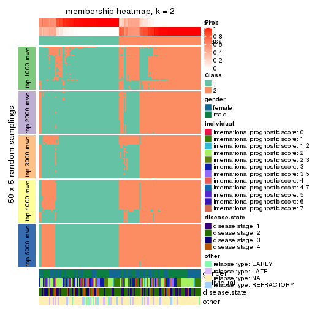</p>

</div>
<div id='tab-SD-pam-membership-heatmap-2'>
<pre><code class="r">membership_heatmap(res, k = 3)
</code></pre>

<p>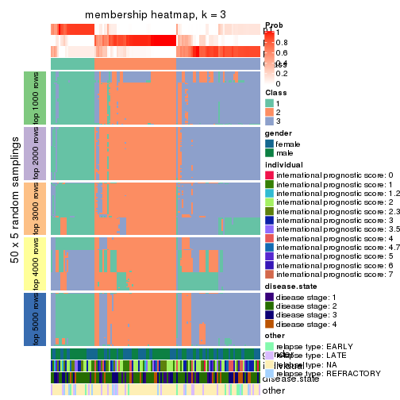</p>

</div>
<div id='tab-SD-pam-membership-heatmap-3'>
<pre><code class="r">membership_heatmap(res, k = 4)
</code></pre>

<p>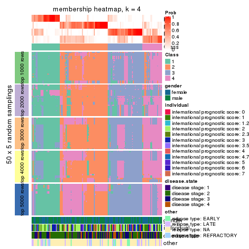</p>

</div>
<div id='tab-SD-pam-membership-heatmap-4'>
<pre><code class="r">membership_heatmap(res, k = 5)
</code></pre>

<p>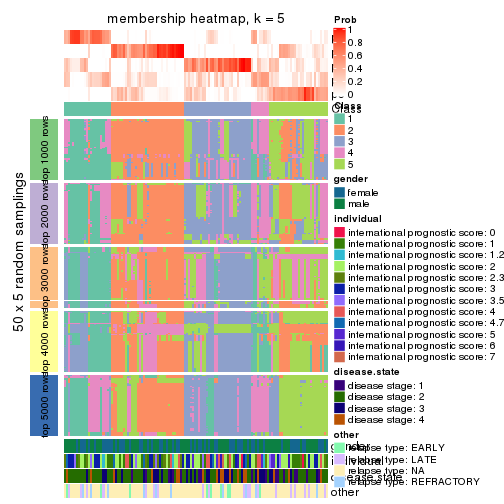</p>

</div>
<div id='tab-SD-pam-membership-heatmap-5'>
<pre><code class="r">membership_heatmap(res, k = 6)
</code></pre>

<p>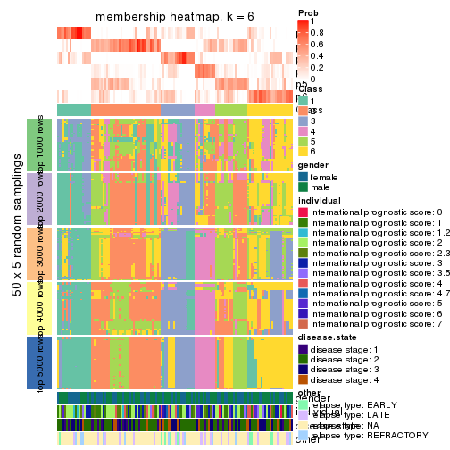</p>

</div>
</div>

As soon as we have had the classes for columns, we can look for signatures
which are significantly different between classes which can be candidate marks
for certain classes. Following are the heatmaps for signatures.


Signature heatmaps where rows are scaled:


<script>
$( function() {
	$( '#tabs-SD-pam-get-signatures' ).tabs();
} );
</script>
<div id='tabs-SD-pam-get-signatures'>
<ul>
<li><a href='#tab-SD-pam-get-signatures-1'>k = 2</a></li>
<li><a href='#tab-SD-pam-get-signatures-2'>k = 3</a></li>
<li><a href='#tab-SD-pam-get-signatures-3'>k = 4</a></li>
<li><a href='#tab-SD-pam-get-signatures-4'>k = 5</a></li>
<li><a href='#tab-SD-pam-get-signatures-5'>k = 6</a></li>
</ul>
<div id='tab-SD-pam-get-signatures-1'>
<pre><code class="r">get_signatures(res, k = 2)
</code></pre>

<p>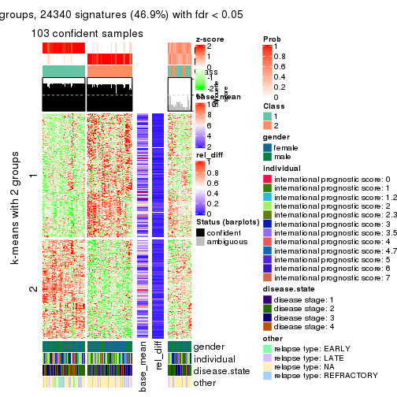</p>

</div>
<div id='tab-SD-pam-get-signatures-2'>
<pre><code class="r">get_signatures(res, k = 3)
</code></pre>

<p>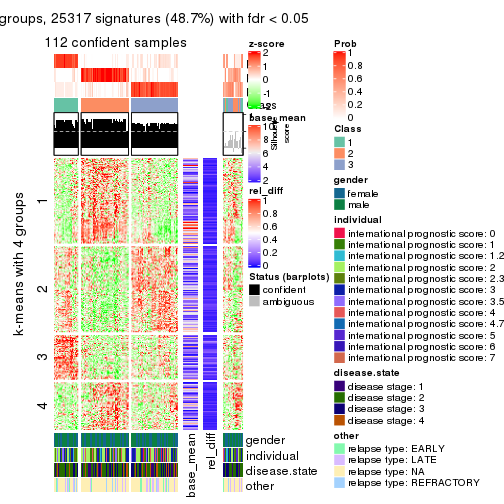</p>

</div>
<div id='tab-SD-pam-get-signatures-3'>
<pre><code class="r">get_signatures(res, k = 4)
</code></pre>

<p>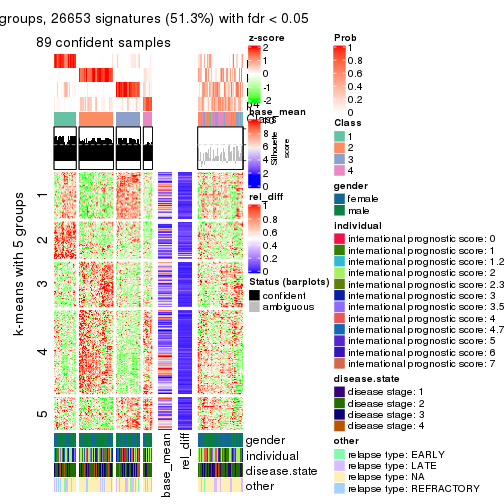</p>

</div>
<div id='tab-SD-pam-get-signatures-4'>
<pre><code class="r">get_signatures(res, k = 5)
</code></pre>

<p>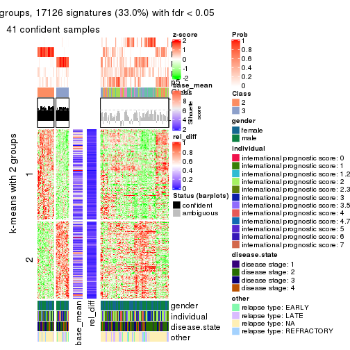</p>

</div>
<div id='tab-SD-pam-get-signatures-5'>
<pre><code class="r">get_signatures(res, k = 6)
</code></pre>

<p>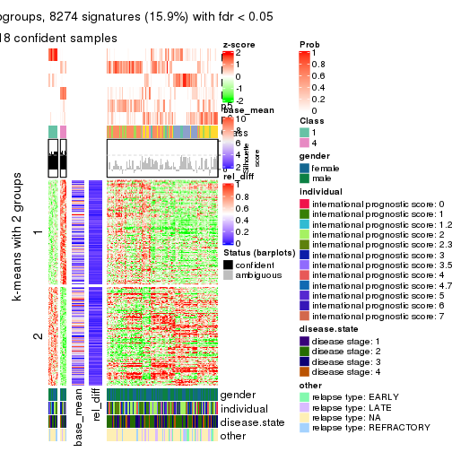</p>

</div>
</div>


Signature heatmaps where rows are not scaled:


<script>
$( function() {
	$( '#tabs-SD-pam-get-signatures-no-scale' ).tabs();
} );
</script>
<div id='tabs-SD-pam-get-signatures-no-scale'>
<ul>
<li><a href='#tab-SD-pam-get-signatures-no-scale-1'>k = 2</a></li>
<li><a href='#tab-SD-pam-get-signatures-no-scale-2'>k = 3</a></li>
<li><a href='#tab-SD-pam-get-signatures-no-scale-3'>k = 4</a></li>
<li><a href='#tab-SD-pam-get-signatures-no-scale-4'>k = 5</a></li>
<li><a href='#tab-SD-pam-get-signatures-no-scale-5'>k = 6</a></li>
</ul>
<div id='tab-SD-pam-get-signatures-no-scale-1'>
<pre><code class="r">get_signatures(res, k = 2, scale_rows = FALSE)
</code></pre>

<p>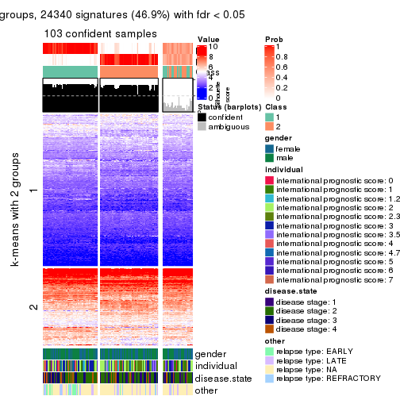</p>

</div>
<div id='tab-SD-pam-get-signatures-no-scale-2'>
<pre><code class="r">get_signatures(res, k = 3, scale_rows = FALSE)
</code></pre>

<p>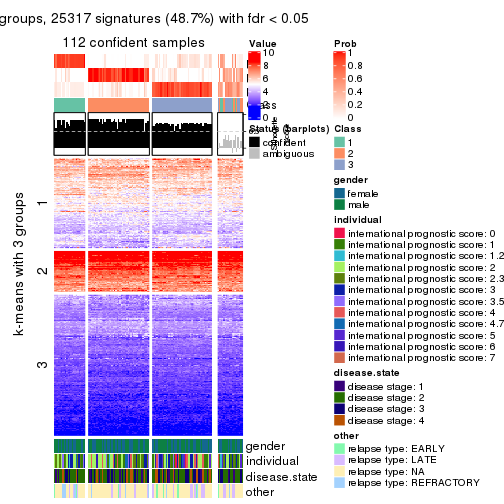</p>

</div>
<div id='tab-SD-pam-get-signatures-no-scale-3'>
<pre><code class="r">get_signatures(res, k = 4, scale_rows = FALSE)
</code></pre>

<p>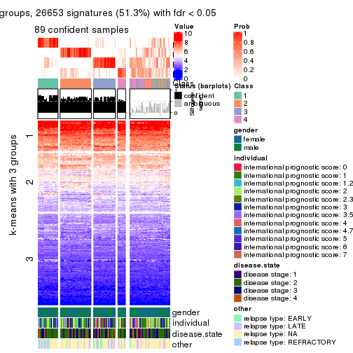</p>

</div>
<div id='tab-SD-pam-get-signatures-no-scale-4'>
<pre><code class="r">get_signatures(res, k = 5, scale_rows = FALSE)
</code></pre>

<p>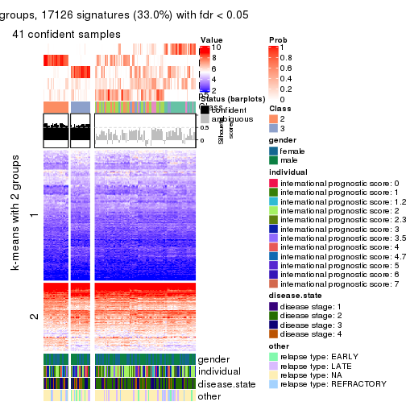</p>

</div>
<div id='tab-SD-pam-get-signatures-no-scale-5'>
<pre><code class="r">get_signatures(res, k = 6, scale_rows = FALSE)
</code></pre>

<p>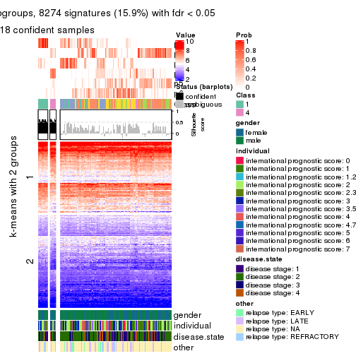</p>

</div>
</div>


Compare the overlap of signatures from different k:

```r
compare_signatures(res)
```

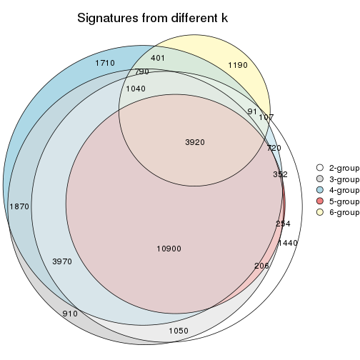

`get_signature()` returns a data frame invisibly. TO get the list of signatures, the function
call should be assigned to a variable explicitly. In following code, if `plot` argument is set
to `FALSE`, no heatmap is plotted while only the differential analysis is performed.

```r
# code only for demonstration
tb = get_signature(res, k = ..., plot = FALSE)
```

An example of the output of `tb` is:

```
#>   which_row         fdr    mean_1    mean_2 scaled_mean_1 scaled_mean_2 km
#> 1        38 0.042760348  8.373488  9.131774    -0.5533452     0.5164555  1
#> 2        40 0.018707592  7.106213  8.469186    -0.6173731     0.5762149  1
#> 3        55 0.019134737 10.221463 11.207825    -0.6159697     0.5749050  1
#> 4        59 0.006059896  5.921854  7.869574    -0.6899429     0.6439467  1
#> 5        60 0.018055526  8.928898 10.211722    -0.6204761     0.5791110  1
#> 6        98 0.009384629 15.714769 14.887706     0.6635654    -0.6193277  2
...
```

The columns in `tb` are:

1. `which_row`: row indices corresponding to the input matrix.
2. `fdr`: FDR for the differential test. 
3. `mean_x`: The mean value in group x.
4. `scaled_mean_x`: The mean value in group x after rows are scaled.
5. `km`: Row groups if k-means clustering is applied to rows.


UMAP plot which shows how samples are separated.


<script>
$( function() {
	$( '#tabs-SD-pam-dimension-reduction' ).tabs();
} );
</script>
<div id='tabs-SD-pam-dimension-reduction'>
<ul>
<li><a href='#tab-SD-pam-dimension-reduction-1'>k = 2</a></li>
<li><a href='#tab-SD-pam-dimension-reduction-2'>k = 3</a></li>
<li><a href='#tab-SD-pam-dimension-reduction-3'>k = 4</a></li>
<li><a href='#tab-SD-pam-dimension-reduction-4'>k = 5</a></li>
<li><a href='#tab-SD-pam-dimension-reduction-5'>k = 6</a></li>
</ul>
<div id='tab-SD-pam-dimension-reduction-1'>
<pre><code class="r">dimension_reduction(res, k = 2, method = &quot;UMAP&quot;)
</code></pre>

<p>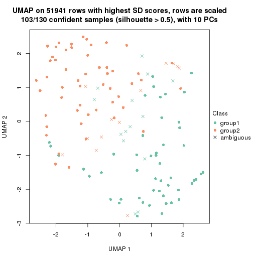</p>

</div>
<div id='tab-SD-pam-dimension-reduction-2'>
<pre><code class="r">dimension_reduction(res, k = 3, method = &quot;UMAP&quot;)
</code></pre>

<p>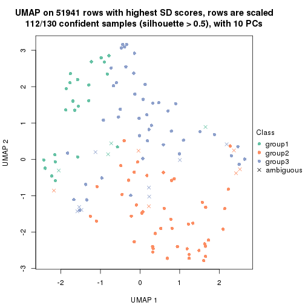</p>

</div>
<div id='tab-SD-pam-dimension-reduction-3'>
<pre><code class="r">dimension_reduction(res, k = 4, method = &quot;UMAP&quot;)
</code></pre>

<p>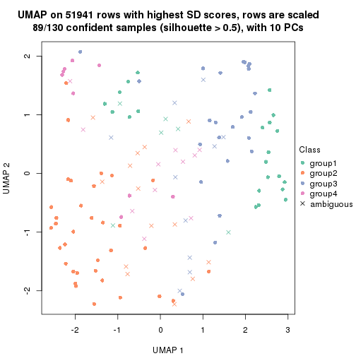</p>

</div>
<div id='tab-SD-pam-dimension-reduction-4'>
<pre><code class="r">dimension_reduction(res, k = 5, method = &quot;UMAP&quot;)
</code></pre>

<p>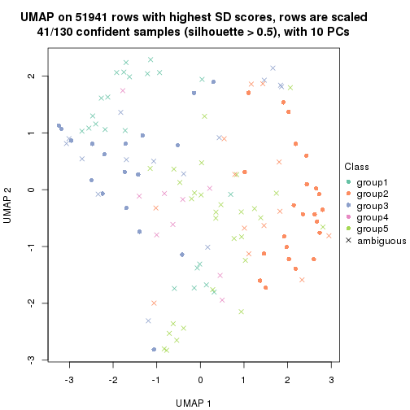</p>

</div>
<div id='tab-SD-pam-dimension-reduction-5'>
<pre><code class="r">dimension_reduction(res, k = 6, method = &quot;UMAP&quot;)
</code></pre>

<p>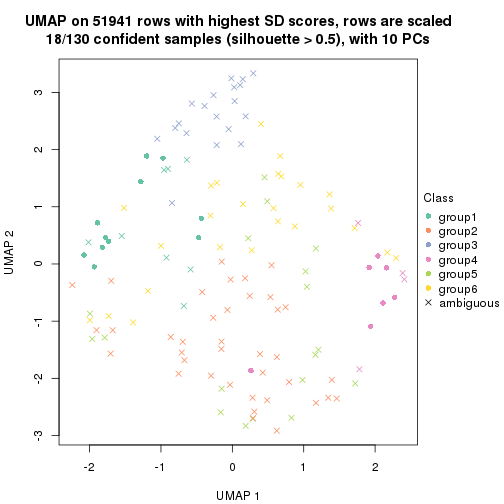</p>

</div>
</div>


Following heatmap shows how subgroups are split when increasing `k`:

```r
collect_classes(res)
```

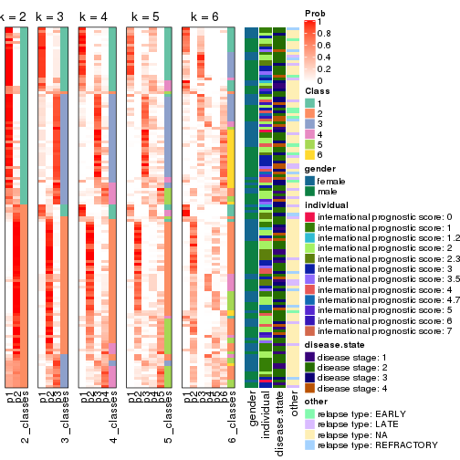


Test correlation between subgroups and known annotations. If the known
annotation is numeric, one-way ANOVA test is applied, and if the known
annotation is discrete, chi-squared contingency table test is applied.

```r
test_to_known_factors(res)
```

```
#>          n gender(p) individual(p) disease.state(p) other(p) k
#> SD:pam 103     0.732         0.761            0.422   0.0551 2
#> SD:pam 112     0.878         0.461            0.527   0.1914 3
#> SD:pam  89     0.951         0.501            0.112   0.2450 4
#> SD:pam  41     0.538         0.592            0.444   0.0725 5
#> SD:pam  18     1.000         0.792            0.961   0.7915 6
```


If matrix rows can be associated to genes, consider to use `GO_Enrichment(res,
...)` to perform function enrichment for the signature genes.


 

---------------------------------------------------


### SD:mclust


The object with results only for a single top-value method and a single partition method 
can be extracted as:

```r
res = res_list["SD", "mclust"]
# you can also extract it by
# res = res_list["SD:mclust"]
```

A summary of `res` and all the functions that can be applied to it:

```r
res
```

```
#> A 'ConsensusPartition' object with k = 2, 3, 4, 5, 6.
#>   On a matrix with 51941 rows and 130 columns.
#>   Top rows (1000, 2000, 3000, 4000, 5000) are extracted by 'SD' method.
#>   Subgroups are detected by 'mclust' method.
#>   Performed in total 1250 partitions by row resampling.
#>   Best k for subgroups seems to be 4.
#> 
#> Following methods can be applied to this 'ConsensusPartition' object:
#>  [1] "cola_report"             "collect_classes"         "collect_plots"          
#>  [4] "collect_stats"           "colnames"                "compare_signatures"     
#>  [7] "consensus_heatmap"       "dimension_reduction"     "functional_enrichment"  
#> [10] "get_anno_col"            "get_anno"                "get_classes"            
#> [13] "get_consensus"           "get_matrix"              "get_membership"         
#> [16] "get_param"               "get_signatures"          "get_stats"              
#> [19] "is_best_k"               "is_stable_k"             "membership_heatmap"     
#> [22] "ncol"                    "nrow"                    "plot_ecdf"              
#> [25] "rownames"                "select_partition_number" "show"                   
#> [28] "suggest_best_k"          "test_to_known_factors"
```

`collect_plots()` function collects all the plots made from `res` for all `k` (number of partitions)
into one single page to provide an easy and fast comparison between different `k`.

```r
collect_plots(res)
```

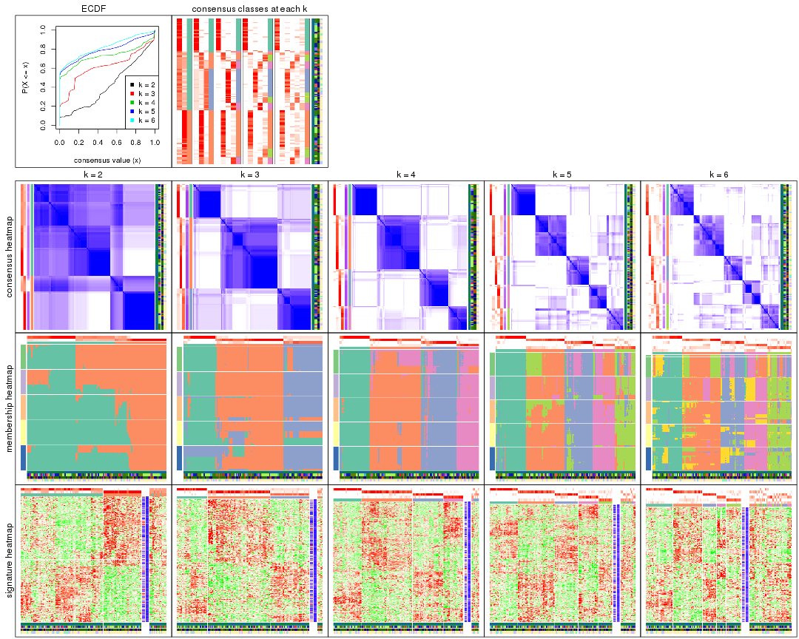

The plots are:

- The first row: a plot of the ECDF (Empirical cumulative distribution
  function) curves of the consensus matrix for each `k` and the heatmap of
  predicted classes for each `k`.
- The second row: heatmaps of the consensus matrix for each `k`.
- The third row: heatmaps of the membership matrix for each `k`.
- The fouth row: heatmaps of the signatures for each `k`.

All the plots in panels can be made by individual functions and they are
plotted later in this section.

`select_partition_number()` produces several plots showing different
statistics for choosing "optimized" `k`. There are following statistics:

- ECDF curves of the consensus matrix for each `k`;
- 1-PAC. [The PAC
  score](https://en.wikipedia.org/wiki/Consensus_clustering#Over-interpretation_potential_of_consensus_clustering)
  measures the proportion of the ambiguous subgrouping.
- Mean silhouette score.
- Concordance. The mean probability of fiting the consensus class ids in all
  partitions.
- Area increased. Denote $A_k$ as the area under the ECDF curve for current
  `k`, the area increased is defined as $A_k - A_{k-1}$.
- Rand index. The percent of pairs of samples that are both in a same cluster
  or both are not in a same cluster in the partition of k and k-1.
- Jaccard index. The ratio of pairs of samples are both in a same cluster in
  the partition of k and k-1 and the pairs of samples are both in a same
  cluster in the partition k or k-1.

The detailed explanations of these statistics can be found in [the cola
vignette](http://bioconductor.org/packages/devel/bioc/vignettes/cola/inst/doc/cola.html#toc_13).

Generally speaking, lower PAC score, higher mean silhouette score or higher
concordance corresponds to better partition. Rand index and Jaccard index
measure how similar the current partition is compared to partition with `k-1`.
If they are too similar, we won't accept `k` is better than `k-1`.

```r
select_partition_number(res)
```

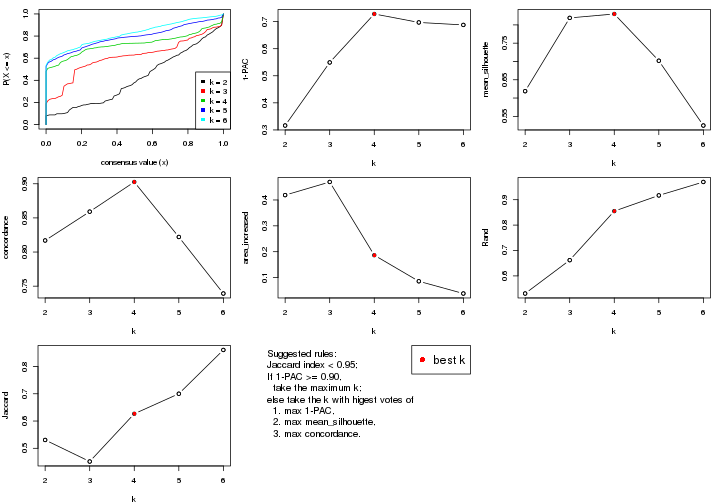

The numeric values for all these statistics can be obtained by `get_stats()`.

```r
get_stats(res)
```

```
#>   k 1-PAC mean_silhouette concordance area_increased  Rand Jaccard
#> 2 2 0.316           0.619       0.817         0.4188 0.531   0.531
#> 3 3 0.549           0.819       0.859         0.4696 0.662   0.452
#> 4 4 0.728           0.830       0.903         0.1864 0.855   0.627
#> 5 5 0.697           0.702       0.822         0.0856 0.917   0.700
#> 6 6 0.688           0.525       0.739         0.0383 0.970   0.861
```

`suggest_best_k()` suggests the best $k$ based on these statistics. The rules are as follows:

- All $k$ with Jaccard index larger than 0.95 are removed because the increase of
  the partition number does not provides enough extra information. If all $k$ are removed,
  the best $k$ is assigned by `NA`.
- For $k$ with 1-PAC larger than 0.9, the maximal $k$ is taken as the "best k". Other $k$ is called "optional k".
- If it does not fit the second rule. The $k$ with the highest vote of highest
  1-PAC, mean silhouette and concordance is taken as the "best k".

```r
suggest_best_k(res)
```

```
#> [1] 4
```


Following shows the table of the partitions (You need to click the **show/hide
code output** link to see it). The membership matrix (columns with name `p*`)
is inferred by
[`clue::cl_consensus()`](https://www.rdocumentation.org/link/cl_consensus?package=clue)
function with the `SE` method. Basically the value in the membership matrix
represents the probability to belong to a certain group. The finall class
label for an item is determined with the group with highest probability it
belongs to.

In `get_classes()` function, the entropy is calculated from the membership
matrix and the silhouette score is calculated from the consensus matrix.


<script>
$( function() {
	$( '#tabs-SD-mclust-get-classes' ).tabs();
} );
</script>
<div id='tabs-SD-mclust-get-classes'>
<ul>
<li><a href='#tab-SD-mclust-get-classes-1'>k = 2</a></li>
<li><a href='#tab-SD-mclust-get-classes-2'>k = 3</a></li>
<li><a href='#tab-SD-mclust-get-classes-3'>k = 4</a></li>
<li><a href='#tab-SD-mclust-get-classes-4'>k = 5</a></li>
<li><a href='#tab-SD-mclust-get-classes-5'>k = 6</a></li>
</ul>

<div id='tab-SD-mclust-get-classes-1'>
<p><a id='tab-SD-mclust-get-classes-1-a' style='color:#0366d6' href='#'>show/hide code output</a></p>
<pre><code class="r">cbind(get_classes(res, k = 2), get_membership(res, k = 2))
</code></pre>

<pre><code>#&gt;           class entropy silhouette    p1    p2
#&gt; GSM447671     2  0.9866    -0.1321 0.432 0.568
#&gt; GSM447694     1  0.7299     0.7185 0.796 0.204
#&gt; GSM447618     2  0.7950     0.4963 0.240 0.760
#&gt; GSM447691     2  0.9686     0.0182 0.396 0.604
#&gt; GSM447733     1  0.9833     0.5569 0.576 0.424
#&gt; GSM447620     2  0.7056     0.5904 0.192 0.808
#&gt; GSM447627     1  0.9427     0.6359 0.640 0.360
#&gt; GSM447630     2  0.9993    -0.3188 0.484 0.516
#&gt; GSM447642     1  0.0000     0.6954 1.000 0.000
#&gt; GSM447649     2  0.0000     0.8169 0.000 1.000
#&gt; GSM447654     1  0.9977     0.4408 0.528 0.472
#&gt; GSM447655     2  0.0000     0.8169 0.000 1.000
#&gt; GSM447669     2  0.9552     0.0999 0.376 0.624
#&gt; GSM447676     1  0.0000     0.6954 1.000 0.000
#&gt; GSM447678     2  1.0000    -0.3585 0.496 0.504
#&gt; GSM447681     2  0.0000     0.8169 0.000 1.000
#&gt; GSM447698     2  0.0000     0.8169 0.000 1.000
#&gt; GSM447713     1  0.0000     0.6954 1.000 0.000
#&gt; GSM447722     2  0.9996    -0.3321 0.488 0.512
#&gt; GSM447726     1  0.9833     0.5569 0.576 0.424
#&gt; GSM447735     1  0.9552     0.6205 0.624 0.376
#&gt; GSM447737     1  0.3114     0.7141 0.944 0.056
#&gt; GSM447657     2  0.0000     0.8169 0.000 1.000
#&gt; GSM447674     2  0.0000     0.8169 0.000 1.000
#&gt; GSM447636     1  0.0000     0.6954 1.000 0.000
#&gt; GSM447723     1  0.4815     0.7275 0.896 0.104
#&gt; GSM447699     1  0.9775     0.5750 0.588 0.412
#&gt; GSM447708     2  0.0000     0.8169 0.000 1.000
#&gt; GSM447721     1  0.0000     0.6954 1.000 0.000
#&gt; GSM447623     1  0.0000     0.6954 1.000 0.000
#&gt; GSM447621     1  0.0000     0.6954 1.000 0.000
#&gt; GSM447650     2  0.0000     0.8169 0.000 1.000
#&gt; GSM447651     2  0.0000     0.8169 0.000 1.000
#&gt; GSM447653     1  0.9580     0.6166 0.620 0.380
#&gt; GSM447658     1  0.0000     0.6954 1.000 0.000
#&gt; GSM447675     1  0.9833     0.5569 0.576 0.424
#&gt; GSM447680     1  0.9998     0.3372 0.508 0.492
#&gt; GSM447686     1  0.3114     0.6936 0.944 0.056
#&gt; GSM447736     1  0.9552     0.6205 0.624 0.376
#&gt; GSM447629     2  0.0000     0.8169 0.000 1.000
#&gt; GSM447648     1  0.5842     0.7323 0.860 0.140
#&gt; GSM447660     1  0.0000     0.6954 1.000 0.000
#&gt; GSM447661     2  0.0000     0.8169 0.000 1.000
#&gt; GSM447663     1  0.9580     0.6128 0.620 0.380
#&gt; GSM447704     2  0.0000     0.8169 0.000 1.000
#&gt; GSM447720     1  0.9815     0.5633 0.580 0.420
#&gt; GSM447652     2  0.0000     0.8169 0.000 1.000
#&gt; GSM447679     2  0.0000     0.8169 0.000 1.000
#&gt; GSM447712     1  0.0000     0.6954 1.000 0.000
#&gt; GSM447664     1  0.9896     0.5219 0.560 0.440
#&gt; GSM447637     1  0.5519     0.7323 0.872 0.128
#&gt; GSM447639     1  0.9833     0.5569 0.576 0.424
#&gt; GSM447615     1  0.5519     0.7323 0.872 0.128
#&gt; GSM447656     1  0.9983     0.3900 0.524 0.476
#&gt; GSM447673     2  0.0000     0.8169 0.000 1.000
#&gt; GSM447719     1  0.7139     0.7203 0.804 0.196
#&gt; GSM447706     1  0.5737     0.7325 0.864 0.136
#&gt; GSM447612     1  0.9815     0.5633 0.580 0.420
#&gt; GSM447665     2  0.0000     0.8169 0.000 1.000
#&gt; GSM447677     2  0.0000     0.8169 0.000 1.000
#&gt; GSM447613     1  0.0000     0.6954 1.000 0.000
#&gt; GSM447659     1  0.9775     0.5750 0.588 0.412
#&gt; GSM447662     1  0.9129     0.6572 0.672 0.328
#&gt; GSM447666     1  0.9686     0.5975 0.604 0.396
#&gt; GSM447668     2  0.0000     0.8169 0.000 1.000
#&gt; GSM447682     2  0.0000     0.8169 0.000 1.000
#&gt; GSM447683     2  0.0000     0.8169 0.000 1.000
#&gt; GSM447688     2  0.6973     0.5953 0.188 0.812
#&gt; GSM447702     2  0.0000     0.8169 0.000 1.000
#&gt; GSM447709     2  0.0000     0.8169 0.000 1.000
#&gt; GSM447711     1  0.0000     0.6954 1.000 0.000
#&gt; GSM447715     1  0.6712     0.7265 0.824 0.176
#&gt; GSM447693     1  0.7815     0.7087 0.768 0.232
#&gt; GSM447611     1  0.9833     0.5569 0.576 0.424
#&gt; GSM447672     2  0.0000     0.8169 0.000 1.000
#&gt; GSM447703     2  0.0000     0.8169 0.000 1.000
#&gt; GSM447727     1  0.5178     0.7303 0.884 0.116
#&gt; GSM447638     1  0.5946     0.7311 0.856 0.144
#&gt; GSM447670     1  0.0000     0.6954 1.000 0.000
#&gt; GSM447700     2  0.9996    -0.3321 0.488 0.512
#&gt; GSM447738     2  0.0000     0.8169 0.000 1.000
#&gt; GSM447739     1  0.0000     0.6954 1.000 0.000
#&gt; GSM447617     1  0.0000     0.6954 1.000 0.000
#&gt; GSM447628     2  0.9954    -0.2358 0.460 0.540
#&gt; GSM447632     2  0.0000     0.8169 0.000 1.000
#&gt; GSM447619     1  0.9087     0.6598 0.676 0.324
#&gt; GSM447643     1  0.0672     0.6948 0.992 0.008
#&gt; GSM447724     1  0.9833     0.5569 0.576 0.424
#&gt; GSM447728     2  0.0000     0.8169 0.000 1.000
#&gt; GSM447610     1  0.6712     0.7247 0.824 0.176
#&gt; GSM447633     1  0.9922     0.5026 0.552 0.448
#&gt; GSM447634     1  0.9552     0.6205 0.624 0.376
#&gt; GSM447622     1  0.5519     0.7323 0.872 0.128
#&gt; GSM447667     2  0.4690     0.7218 0.100 0.900
#&gt; GSM447687     2  0.0000     0.8169 0.000 1.000
#&gt; GSM447695     1  0.8081     0.7021 0.752 0.248
#&gt; GSM447696     1  0.0000     0.6954 1.000 0.000
#&gt; GSM447697     1  0.0000     0.6954 1.000 0.000
#&gt; GSM447714     1  0.9661     0.6022 0.608 0.392
#&gt; GSM447717     1  0.0000     0.6954 1.000 0.000
#&gt; GSM447725     1  0.0000     0.6954 1.000 0.000
#&gt; GSM447729     1  0.9833     0.5569 0.576 0.424
#&gt; GSM447644     1  0.9998     0.3772 0.508 0.492
#&gt; GSM447710     1  0.9248     0.6506 0.660 0.340
#&gt; GSM447614     1  0.9170     0.6576 0.668 0.332
#&gt; GSM447685     2  0.3114     0.7552 0.056 0.944
#&gt; GSM447690     1  0.0000     0.6954 1.000 0.000
#&gt; GSM447730     2  0.0000     0.8169 0.000 1.000
#&gt; GSM447646     2  0.9954    -0.2358 0.460 0.540
#&gt; GSM447689     1  0.9358     0.6414 0.648 0.352
#&gt; GSM447635     1  0.9833     0.5569 0.576 0.424
#&gt; GSM447641     1  0.0000     0.6954 1.000 0.000
#&gt; GSM447716     2  0.9996    -0.3374 0.488 0.512
#&gt; GSM447718     1  0.9833     0.5569 0.576 0.424
#&gt; GSM447616     1  0.5519     0.7323 0.872 0.128
#&gt; GSM447626     1  0.6048     0.7317 0.852 0.148
#&gt; GSM447640     2  0.0000     0.8169 0.000 1.000
#&gt; GSM447734     1  0.9552     0.6205 0.624 0.376
#&gt; GSM447692     1  0.5519     0.7323 0.872 0.128
#&gt; GSM447647     2  0.8861     0.3388 0.304 0.696
#&gt; GSM447624     1  0.0938     0.6999 0.988 0.012
#&gt; GSM447625     1  0.9580     0.6164 0.620 0.380
#&gt; GSM447707     2  0.0000     0.8169 0.000 1.000
#&gt; GSM447732     1  0.9087     0.6598 0.676 0.324
#&gt; GSM447684     1  0.5629     0.7323 0.868 0.132
#&gt; GSM447731     1  0.9922     0.5050 0.552 0.448
#&gt; GSM447705     1  0.9815     0.5633 0.580 0.420
#&gt; GSM447631     1  0.5946     0.7322 0.856 0.144
#&gt; GSM447701     2  0.0000     0.8169 0.000 1.000
#&gt; GSM447645     1  0.5519     0.7323 0.872 0.128
</code></pre>

<script>
$('#tab-SD-mclust-get-classes-1-a').parent().next().next().hide();
$('#tab-SD-mclust-get-classes-1-a').click(function(){
  $('#tab-SD-mclust-get-classes-1-a').parent().next().next().toggle();
  return(false);
});
</script>
</div>

<div id='tab-SD-mclust-get-classes-2'>
<p><a id='tab-SD-mclust-get-classes-2-a' style='color:#0366d6' href='#'>show/hide code output</a></p>
<pre><code class="r">cbind(get_classes(res, k = 3), get_membership(res, k = 3))
</code></pre>

<pre><code>#&gt;           class entropy silhouette    p1    p2    p3
#&gt; GSM447671     2  0.3921      0.795 0.112 0.872 0.016
#&gt; GSM447694     3  0.6719      0.907 0.160 0.096 0.744
#&gt; GSM447618     2  0.0424      0.877 0.008 0.992 0.000
#&gt; GSM447691     2  0.0892      0.873 0.020 0.980 0.000
#&gt; GSM447733     3  0.4413      0.833 0.160 0.008 0.832
#&gt; GSM447620     2  0.4452      0.690 0.000 0.808 0.192
#&gt; GSM447627     3  0.4002      0.832 0.160 0.000 0.840
#&gt; GSM447630     2  0.6865      0.606 0.160 0.736 0.104
#&gt; GSM447642     1  0.0000      0.922 1.000 0.000 0.000
#&gt; GSM447649     2  0.0000      0.880 0.000 1.000 0.000
#&gt; GSM447654     2  0.5178      0.793 0.000 0.744 0.256
#&gt; GSM447655     2  0.0000      0.880 0.000 1.000 0.000
#&gt; GSM447669     2  0.3043      0.827 0.084 0.908 0.008
#&gt; GSM447676     1  0.0000      0.922 1.000 0.000 0.000
#&gt; GSM447678     2  0.5178      0.793 0.000 0.744 0.256
#&gt; GSM447681     2  0.0000      0.880 0.000 1.000 0.000
#&gt; GSM447698     2  0.2261      0.861 0.000 0.932 0.068
#&gt; GSM447713     1  0.0000      0.922 1.000 0.000 0.000
#&gt; GSM447722     2  0.8300      0.585 0.136 0.620 0.244
#&gt; GSM447726     2  0.3500      0.802 0.116 0.880 0.004
#&gt; GSM447735     3  0.8022      0.677 0.160 0.184 0.656
#&gt; GSM447737     1  0.4178      0.697 0.828 0.000 0.172
#&gt; GSM447657     2  0.0000      0.880 0.000 1.000 0.000
#&gt; GSM447674     2  0.0000      0.880 0.000 1.000 0.000
#&gt; GSM447636     1  0.0000      0.922 1.000 0.000 0.000
#&gt; GSM447723     1  0.0000      0.922 1.000 0.000 0.000
#&gt; GSM447699     3  0.8964      0.683 0.160 0.296 0.544
#&gt; GSM447708     2  0.0000      0.880 0.000 1.000 0.000
#&gt; GSM447721     1  0.0000      0.922 1.000 0.000 0.000
#&gt; GSM447623     1  0.0000      0.922 1.000 0.000 0.000
#&gt; GSM447621     1  0.0000      0.922 1.000 0.000 0.000
#&gt; GSM447650     2  0.0000      0.880 0.000 1.000 0.000
#&gt; GSM447651     2  0.0000      0.880 0.000 1.000 0.000
#&gt; GSM447653     3  0.4413      0.833 0.160 0.008 0.832
#&gt; GSM447658     1  0.0000      0.922 1.000 0.000 0.000
#&gt; GSM447675     2  0.5178      0.793 0.000 0.744 0.256
#&gt; GSM447680     2  0.2878      0.832 0.096 0.904 0.000
#&gt; GSM447686     1  0.5138      0.584 0.748 0.252 0.000
#&gt; GSM447736     3  0.6719      0.907 0.160 0.096 0.744
#&gt; GSM447629     2  0.0000      0.880 0.000 1.000 0.000
#&gt; GSM447648     3  0.6719      0.907 0.160 0.096 0.744
#&gt; GSM447660     1  0.0000      0.922 1.000 0.000 0.000
#&gt; GSM447661     2  0.0000      0.880 0.000 1.000 0.000
#&gt; GSM447663     3  0.6719      0.907 0.160 0.096 0.744
#&gt; GSM447704     2  0.0000      0.880 0.000 1.000 0.000
#&gt; GSM447720     3  0.9065      0.654 0.160 0.316 0.524
#&gt; GSM447652     2  0.0000      0.880 0.000 1.000 0.000
#&gt; GSM447679     2  0.0000      0.880 0.000 1.000 0.000
#&gt; GSM447712     1  0.0000      0.922 1.000 0.000 0.000
#&gt; GSM447664     2  0.5178      0.793 0.000 0.744 0.256
#&gt; GSM447637     3  0.6719      0.907 0.160 0.096 0.744
#&gt; GSM447639     2  0.8817      0.433 0.160 0.568 0.272
#&gt; GSM447615     1  0.6274     -0.182 0.544 0.000 0.456
#&gt; GSM447656     2  0.2448      0.856 0.076 0.924 0.000
#&gt; GSM447673     2  0.4504      0.819 0.000 0.804 0.196
#&gt; GSM447719     3  0.4002      0.832 0.160 0.000 0.840
#&gt; GSM447706     3  0.6652      0.899 0.172 0.084 0.744
#&gt; GSM447612     3  0.6719      0.907 0.160 0.096 0.744
#&gt; GSM447665     2  0.0000      0.880 0.000 1.000 0.000
#&gt; GSM447677     2  0.0000      0.880 0.000 1.000 0.000
#&gt; GSM447613     1  0.0000      0.922 1.000 0.000 0.000
#&gt; GSM447659     3  0.4002      0.832 0.160 0.000 0.840
#&gt; GSM447662     3  0.6719      0.907 0.160 0.096 0.744
#&gt; GSM447666     3  0.6719      0.907 0.160 0.096 0.744
#&gt; GSM447668     2  0.0000      0.880 0.000 1.000 0.000
#&gt; GSM447682     2  0.0000      0.880 0.000 1.000 0.000
#&gt; GSM447683     2  0.0000      0.880 0.000 1.000 0.000
#&gt; GSM447688     2  0.5138      0.795 0.000 0.748 0.252
#&gt; GSM447702     2  0.0000      0.880 0.000 1.000 0.000
#&gt; GSM447709     2  0.0000      0.880 0.000 1.000 0.000
#&gt; GSM447711     1  0.0000      0.922 1.000 0.000 0.000
#&gt; GSM447715     1  0.5560      0.500 0.700 0.300 0.000
#&gt; GSM447693     3  0.6719      0.907 0.160 0.096 0.744
#&gt; GSM447611     2  0.5502      0.794 0.008 0.744 0.248
#&gt; GSM447672     2  0.0000      0.880 0.000 1.000 0.000
#&gt; GSM447703     2  0.3340      0.842 0.000 0.880 0.120
#&gt; GSM447727     1  0.0000      0.922 1.000 0.000 0.000
#&gt; GSM447638     2  0.6286      0.251 0.464 0.536 0.000
#&gt; GSM447670     1  0.0000      0.922 1.000 0.000 0.000
#&gt; GSM447700     2  0.7878      0.461 0.160 0.668 0.172
#&gt; GSM447738     2  0.3116      0.844 0.000 0.892 0.108
#&gt; GSM447739     1  0.0000      0.922 1.000 0.000 0.000
#&gt; GSM447617     1  0.0000      0.922 1.000 0.000 0.000
#&gt; GSM447628     2  0.5178      0.793 0.000 0.744 0.256
#&gt; GSM447632     2  0.1411      0.872 0.000 0.964 0.036
#&gt; GSM447619     3  0.6719      0.907 0.160 0.096 0.744
#&gt; GSM447643     1  0.2165      0.851 0.936 0.064 0.000
#&gt; GSM447724     3  0.8282      0.644 0.160 0.208 0.632
#&gt; GSM447728     2  0.0000      0.880 0.000 1.000 0.000
#&gt; GSM447610     1  0.4121      0.752 0.832 0.000 0.168
#&gt; GSM447633     2  0.4663      0.745 0.156 0.828 0.016
#&gt; GSM447634     3  0.8941      0.688 0.160 0.292 0.548
#&gt; GSM447622     3  0.5178      0.798 0.256 0.000 0.744
#&gt; GSM447667     2  0.0237      0.879 0.004 0.996 0.000
#&gt; GSM447687     2  0.3551      0.839 0.000 0.868 0.132
#&gt; GSM447695     3  0.7044      0.897 0.168 0.108 0.724
#&gt; GSM447696     1  0.0000      0.922 1.000 0.000 0.000
#&gt; GSM447697     1  0.0000      0.922 1.000 0.000 0.000
#&gt; GSM447714     3  0.6719      0.907 0.160 0.096 0.744
#&gt; GSM447717     1  0.0000      0.922 1.000 0.000 0.000
#&gt; GSM447725     1  0.0000      0.922 1.000 0.000 0.000
#&gt; GSM447729     2  0.5178      0.793 0.000 0.744 0.256
#&gt; GSM447644     2  0.4172      0.755 0.156 0.840 0.004
#&gt; GSM447710     3  0.6719      0.907 0.160 0.096 0.744
#&gt; GSM447614     3  0.4413      0.833 0.160 0.008 0.832
#&gt; GSM447685     2  0.2878      0.832 0.096 0.904 0.000
#&gt; GSM447690     1  0.0000      0.922 1.000 0.000 0.000
#&gt; GSM447730     2  0.0000      0.880 0.000 1.000 0.000
#&gt; GSM447646     2  0.5178      0.793 0.000 0.744 0.256
#&gt; GSM447689     3  0.6719      0.907 0.160 0.096 0.744
#&gt; GSM447635     2  0.4002      0.754 0.160 0.840 0.000
#&gt; GSM447641     1  0.0000      0.922 1.000 0.000 0.000
#&gt; GSM447716     2  0.1860      0.856 0.052 0.948 0.000
#&gt; GSM447718     2  0.9176     -0.161 0.160 0.496 0.344
#&gt; GSM447616     3  0.7525      0.855 0.228 0.096 0.676
#&gt; GSM447626     3  0.6652      0.899 0.172 0.084 0.744
#&gt; GSM447640     2  0.0000      0.880 0.000 1.000 0.000
#&gt; GSM447734     3  0.6719      0.907 0.160 0.096 0.744
#&gt; GSM447692     3  0.8159      0.735 0.320 0.092 0.588
#&gt; GSM447647     2  0.5178      0.793 0.000 0.744 0.256
#&gt; GSM447624     1  0.5138      0.540 0.748 0.000 0.252
#&gt; GSM447625     3  0.6719      0.907 0.160 0.096 0.744
#&gt; GSM447707     2  0.0000      0.880 0.000 1.000 0.000
#&gt; GSM447732     3  0.6719      0.907 0.160 0.096 0.744
#&gt; GSM447684     3  0.6404      0.669 0.344 0.012 0.644
#&gt; GSM447731     2  0.5656      0.784 0.008 0.728 0.264
#&gt; GSM447705     3  0.6719      0.907 0.160 0.096 0.744
#&gt; GSM447631     3  0.6719      0.907 0.160 0.096 0.744
#&gt; GSM447701     2  0.0000      0.880 0.000 1.000 0.000
#&gt; GSM447645     3  0.6719      0.907 0.160 0.096 0.744
</code></pre>

<script>
$('#tab-SD-mclust-get-classes-2-a').parent().next().next().hide();
$('#tab-SD-mclust-get-classes-2-a').click(function(){
  $('#tab-SD-mclust-get-classes-2-a').parent().next().next().toggle();
  return(false);
});
</script>
</div>

<div id='tab-SD-mclust-get-classes-3'>
<p><a id='tab-SD-mclust-get-classes-3-a' style='color:#0366d6' href='#'>show/hide code output</a></p>
<pre><code class="r">cbind(get_classes(res, k = 4), get_membership(res, k = 4))
</code></pre>

<pre><code>#&gt;           class entropy silhouette    p1    p2    p3    p4
#&gt; GSM447671     2  0.6571      0.590 0.000 0.612 0.264 0.124
#&gt; GSM447694     3  0.1940      0.843 0.000 0.000 0.924 0.076
#&gt; GSM447618     2  0.3400      0.847 0.000 0.820 0.000 0.180
#&gt; GSM447691     2  0.2704      0.885 0.000 0.876 0.000 0.124
#&gt; GSM447733     4  0.2149      0.800 0.000 0.000 0.088 0.912
#&gt; GSM447620     2  0.3356      0.786 0.000 0.824 0.176 0.000
#&gt; GSM447627     3  0.4817      0.393 0.000 0.000 0.612 0.388
#&gt; GSM447630     2  0.6587      0.534 0.000 0.596 0.292 0.112
#&gt; GSM447642     1  0.0000      0.960 1.000 0.000 0.000 0.000
#&gt; GSM447649     2  0.0000      0.882 0.000 1.000 0.000 0.000
#&gt; GSM447654     4  0.1940      0.878 0.000 0.076 0.000 0.924
#&gt; GSM447655     2  0.0000      0.882 0.000 1.000 0.000 0.000
#&gt; GSM447669     2  0.5798      0.714 0.000 0.704 0.184 0.112
#&gt; GSM447676     1  0.0000      0.960 1.000 0.000 0.000 0.000
#&gt; GSM447678     4  0.1940      0.878 0.000 0.076 0.000 0.924
#&gt; GSM447681     2  0.1637      0.890 0.000 0.940 0.000 0.060
#&gt; GSM447698     2  0.2973      0.875 0.000 0.856 0.000 0.144
#&gt; GSM447713     1  0.0000      0.960 1.000 0.000 0.000 0.000
#&gt; GSM447722     4  0.1940      0.878 0.000 0.076 0.000 0.924
#&gt; GSM447726     2  0.2480      0.859 0.000 0.904 0.088 0.008
#&gt; GSM447735     4  0.0000      0.859 0.000 0.000 0.000 1.000
#&gt; GSM447737     1  0.3688      0.697 0.792 0.000 0.208 0.000
#&gt; GSM447657     2  0.2704      0.885 0.000 0.876 0.000 0.124
#&gt; GSM447674     2  0.2530      0.887 0.000 0.888 0.000 0.112
#&gt; GSM447636     1  0.0000      0.960 1.000 0.000 0.000 0.000
#&gt; GSM447723     1  0.0000      0.960 1.000 0.000 0.000 0.000
#&gt; GSM447699     3  0.4761      0.510 0.000 0.000 0.628 0.372
#&gt; GSM447708     2  0.2704      0.885 0.000 0.876 0.000 0.124
#&gt; GSM447721     1  0.0000      0.960 1.000 0.000 0.000 0.000
#&gt; GSM447623     1  0.0000      0.960 1.000 0.000 0.000 0.000
#&gt; GSM447621     1  0.0000      0.960 1.000 0.000 0.000 0.000
#&gt; GSM447650     2  0.0000      0.882 0.000 1.000 0.000 0.000
#&gt; GSM447651     2  0.0000      0.882 0.000 1.000 0.000 0.000
#&gt; GSM447653     4  0.1557      0.831 0.000 0.000 0.056 0.944
#&gt; GSM447658     1  0.0000      0.960 1.000 0.000 0.000 0.000
#&gt; GSM447675     4  0.1940      0.878 0.000 0.076 0.000 0.924
#&gt; GSM447680     2  0.1637      0.890 0.000 0.940 0.000 0.060
#&gt; GSM447686     1  0.2011      0.868 0.920 0.080 0.000 0.000
#&gt; GSM447736     3  0.1940      0.843 0.000 0.000 0.924 0.076
#&gt; GSM447629     2  0.2704      0.885 0.000 0.876 0.000 0.124
#&gt; GSM447648     3  0.0000      0.873 0.000 0.000 1.000 0.000
#&gt; GSM447660     1  0.0000      0.960 1.000 0.000 0.000 0.000
#&gt; GSM447661     2  0.0000      0.882 0.000 1.000 0.000 0.000
#&gt; GSM447663     3  0.0188      0.872 0.000 0.004 0.996 0.000
#&gt; GSM447704     2  0.0707      0.886 0.000 0.980 0.000 0.020
#&gt; GSM447720     3  0.5352      0.669 0.000 0.092 0.740 0.168
#&gt; GSM447652     2  0.0000      0.882 0.000 1.000 0.000 0.000
#&gt; GSM447679     2  0.2081      0.890 0.000 0.916 0.000 0.084
#&gt; GSM447712     1  0.0000      0.960 1.000 0.000 0.000 0.000
#&gt; GSM447664     4  0.2469      0.856 0.000 0.108 0.000 0.892
#&gt; GSM447637     3  0.0000      0.873 0.000 0.000 1.000 0.000
#&gt; GSM447639     4  0.0469      0.865 0.000 0.012 0.000 0.988
#&gt; GSM447615     1  0.4830      0.323 0.608 0.000 0.392 0.000
#&gt; GSM447656     2  0.2704      0.885 0.000 0.876 0.000 0.124
#&gt; GSM447673     2  0.3024      0.873 0.000 0.852 0.000 0.148
#&gt; GSM447719     4  0.4855      0.375 0.000 0.000 0.400 0.600
#&gt; GSM447706     3  0.0000      0.873 0.000 0.000 1.000 0.000
#&gt; GSM447612     3  0.0469      0.870 0.000 0.000 0.988 0.012
#&gt; GSM447665     2  0.0000      0.882 0.000 1.000 0.000 0.000
#&gt; GSM447677     2  0.0000      0.882 0.000 1.000 0.000 0.000
#&gt; GSM447613     1  0.0000      0.960 1.000 0.000 0.000 0.000
#&gt; GSM447659     4  0.3074      0.729 0.000 0.000 0.152 0.848
#&gt; GSM447662     3  0.0000      0.873 0.000 0.000 1.000 0.000
#&gt; GSM447666     3  0.0000      0.873 0.000 0.000 1.000 0.000
#&gt; GSM447668     2  0.0000      0.882 0.000 1.000 0.000 0.000
#&gt; GSM447682     2  0.2704      0.885 0.000 0.876 0.000 0.124
#&gt; GSM447683     2  0.2704      0.885 0.000 0.876 0.000 0.124
#&gt; GSM447688     4  0.2530      0.851 0.000 0.112 0.000 0.888
#&gt; GSM447702     2  0.0000      0.882 0.000 1.000 0.000 0.000
#&gt; GSM447709     2  0.0000      0.882 0.000 1.000 0.000 0.000
#&gt; GSM447711     1  0.0000      0.960 1.000 0.000 0.000 0.000
#&gt; GSM447715     1  0.4365      0.686 0.784 0.188 0.000 0.028
#&gt; GSM447693     3  0.0000      0.873 0.000 0.000 1.000 0.000
#&gt; GSM447611     4  0.0524      0.864 0.004 0.008 0.000 0.988
#&gt; GSM447672     2  0.0000      0.882 0.000 1.000 0.000 0.000
#&gt; GSM447703     2  0.1118      0.888 0.000 0.964 0.000 0.036
#&gt; GSM447727     1  0.0000      0.960 1.000 0.000 0.000 0.000
#&gt; GSM447638     2  0.3610      0.735 0.200 0.800 0.000 0.000
#&gt; GSM447670     1  0.0000      0.960 1.000 0.000 0.000 0.000
#&gt; GSM447700     3  0.7630      0.124 0.000 0.208 0.428 0.364
#&gt; GSM447738     2  0.2868      0.880 0.000 0.864 0.000 0.136
#&gt; GSM447739     1  0.0000      0.960 1.000 0.000 0.000 0.000
#&gt; GSM447617     1  0.0000      0.960 1.000 0.000 0.000 0.000
#&gt; GSM447628     4  0.2011      0.878 0.000 0.080 0.000 0.920
#&gt; GSM447632     2  0.2868      0.880 0.000 0.864 0.000 0.136
#&gt; GSM447619     3  0.0000      0.873 0.000 0.000 1.000 0.000
#&gt; GSM447643     1  0.0000      0.960 1.000 0.000 0.000 0.000
#&gt; GSM447724     4  0.0376      0.861 0.000 0.004 0.004 0.992
#&gt; GSM447728     2  0.2704      0.885 0.000 0.876 0.000 0.124
#&gt; GSM447610     4  0.4916      0.240 0.424 0.000 0.000 0.576
#&gt; GSM447633     2  0.4855      0.511 0.000 0.644 0.352 0.004
#&gt; GSM447634     3  0.3751      0.742 0.000 0.004 0.800 0.196
#&gt; GSM447622     3  0.0336      0.872 0.000 0.000 0.992 0.008
#&gt; GSM447667     2  0.2999      0.882 0.004 0.864 0.000 0.132
#&gt; GSM447687     2  0.2814      0.882 0.000 0.868 0.000 0.132
#&gt; GSM447695     3  0.3610      0.746 0.000 0.000 0.800 0.200
#&gt; GSM447696     1  0.0000      0.960 1.000 0.000 0.000 0.000
#&gt; GSM447697     1  0.0000      0.960 1.000 0.000 0.000 0.000
#&gt; GSM447714     3  0.0000      0.873 0.000 0.000 1.000 0.000
#&gt; GSM447717     1  0.0000      0.960 1.000 0.000 0.000 0.000
#&gt; GSM447725     1  0.0000      0.960 1.000 0.000 0.000 0.000
#&gt; GSM447729     4  0.1940      0.878 0.000 0.076 0.000 0.924
#&gt; GSM447644     2  0.2944      0.788 0.000 0.868 0.128 0.004
#&gt; GSM447710     3  0.0000      0.873 0.000 0.000 1.000 0.000
#&gt; GSM447614     4  0.1474      0.835 0.000 0.000 0.052 0.948
#&gt; GSM447685     2  0.2704      0.885 0.000 0.876 0.000 0.124
#&gt; GSM447690     1  0.0000      0.960 1.000 0.000 0.000 0.000
#&gt; GSM447730     2  0.0000      0.882 0.000 1.000 0.000 0.000
#&gt; GSM447646     4  0.2011      0.878 0.000 0.080 0.000 0.920
#&gt; GSM447689     3  0.0000      0.873 0.000 0.000 1.000 0.000
#&gt; GSM447635     2  0.4304      0.746 0.000 0.716 0.000 0.284
#&gt; GSM447641     1  0.0000      0.960 1.000 0.000 0.000 0.000
#&gt; GSM447716     2  0.4304      0.716 0.000 0.716 0.000 0.284
#&gt; GSM447718     3  0.6409      0.271 0.000 0.364 0.560 0.076
#&gt; GSM447616     3  0.3390      0.781 0.132 0.000 0.852 0.016
#&gt; GSM447626     3  0.0000      0.873 0.000 0.000 1.000 0.000
#&gt; GSM447640     2  0.2704      0.885 0.000 0.876 0.000 0.124
#&gt; GSM447734     3  0.0336      0.872 0.000 0.000 0.992 0.008
#&gt; GSM447692     3  0.5143      0.715 0.172 0.000 0.752 0.076
#&gt; GSM447647     4  0.2921      0.821 0.000 0.140 0.000 0.860
#&gt; GSM447624     3  0.4855      0.346 0.400 0.000 0.600 0.000
#&gt; GSM447625     3  0.1474      0.855 0.000 0.000 0.948 0.052
#&gt; GSM447707     2  0.0000      0.882 0.000 1.000 0.000 0.000
#&gt; GSM447732     3  0.0000      0.873 0.000 0.000 1.000 0.000
#&gt; GSM447684     3  0.5022      0.627 0.044 0.220 0.736 0.000
#&gt; GSM447731     4  0.3873      0.783 0.000 0.228 0.000 0.772
#&gt; GSM447705     3  0.0000      0.873 0.000 0.000 1.000 0.000
#&gt; GSM447631     3  0.0000      0.873 0.000 0.000 1.000 0.000
#&gt; GSM447701     2  0.0000      0.882 0.000 1.000 0.000 0.000
#&gt; GSM447645     3  0.0000      0.873 0.000 0.000 1.000 0.000
</code></pre>

<script>
$('#tab-SD-mclust-get-classes-3-a').parent().next().next().hide();
$('#tab-SD-mclust-get-classes-3-a').click(function(){
  $('#tab-SD-mclust-get-classes-3-a').parent().next().next().toggle();
  return(false);
});
</script>
</div>

<div id='tab-SD-mclust-get-classes-4'>
<p><a id='tab-SD-mclust-get-classes-4-a' style='color:#0366d6' href='#'>show/hide code output</a></p>
<pre><code class="r">cbind(get_classes(res, k = 5), get_membership(res, k = 5))
</code></pre>

<pre><code>#&gt;           class entropy silhouette    p1    p2    p3    p4    p5
#&gt; GSM447671     5  0.5169      0.658 0.000 0.128 0.000 0.184 0.688
#&gt; GSM447694     3  0.3305      0.729 0.000 0.000 0.776 0.224 0.000
#&gt; GSM447618     2  0.5140      0.376 0.000 0.664 0.000 0.084 0.252
#&gt; GSM447691     5  0.4045      0.535 0.000 0.356 0.000 0.000 0.644
#&gt; GSM447733     4  0.0000      0.728 0.000 0.000 0.000 1.000 0.000
#&gt; GSM447620     5  0.6395      0.668 0.000 0.180 0.116 0.068 0.636
#&gt; GSM447627     3  0.4126      0.600 0.000 0.000 0.620 0.380 0.000
#&gt; GSM447630     5  0.3480      0.626 0.000 0.248 0.000 0.000 0.752
#&gt; GSM447642     1  0.0000      0.927 1.000 0.000 0.000 0.000 0.000
#&gt; GSM447649     2  0.3177      0.751 0.000 0.792 0.000 0.000 0.208
#&gt; GSM447654     4  0.4883      0.791 0.000 0.200 0.000 0.708 0.092
#&gt; GSM447655     2  0.3242      0.750 0.000 0.784 0.000 0.000 0.216
#&gt; GSM447669     5  0.3305      0.643 0.000 0.224 0.000 0.000 0.776
#&gt; GSM447676     1  0.0000      0.927 1.000 0.000 0.000 0.000 0.000
#&gt; GSM447678     4  0.4883      0.791 0.000 0.200 0.000 0.708 0.092
#&gt; GSM447681     2  0.0290      0.790 0.000 0.992 0.000 0.000 0.008
#&gt; GSM447698     2  0.1124      0.770 0.000 0.960 0.000 0.004 0.036
#&gt; GSM447713     1  0.0000      0.927 1.000 0.000 0.000 0.000 0.000
#&gt; GSM447722     4  0.4779      0.791 0.000 0.200 0.000 0.716 0.084
#&gt; GSM447726     5  0.2068      0.672 0.000 0.092 0.004 0.000 0.904
#&gt; GSM447735     4  0.0000      0.728 0.000 0.000 0.000 1.000 0.000
#&gt; GSM447737     1  0.3949      0.527 0.668 0.000 0.332 0.000 0.000
#&gt; GSM447657     2  0.0000      0.787 0.000 1.000 0.000 0.000 0.000
#&gt; GSM447674     2  0.0000      0.787 0.000 1.000 0.000 0.000 0.000
#&gt; GSM447636     1  0.0000      0.927 1.000 0.000 0.000 0.000 0.000
#&gt; GSM447723     1  0.0000      0.927 1.000 0.000 0.000 0.000 0.000
#&gt; GSM447699     3  0.5167      0.539 0.000 0.000 0.552 0.404 0.044
#&gt; GSM447708     2  0.3074      0.667 0.000 0.804 0.000 0.000 0.196
#&gt; GSM447721     1  0.0000      0.927 1.000 0.000 0.000 0.000 0.000
#&gt; GSM447623     1  0.2074      0.852 0.896 0.000 0.104 0.000 0.000
#&gt; GSM447621     1  0.2605      0.809 0.852 0.000 0.148 0.000 0.000
#&gt; GSM447650     2  0.3424      0.741 0.000 0.760 0.000 0.000 0.240
#&gt; GSM447651     2  0.4074      0.626 0.000 0.636 0.000 0.000 0.364
#&gt; GSM447653     4  0.0000      0.728 0.000 0.000 0.000 1.000 0.000
#&gt; GSM447658     1  0.0000      0.927 1.000 0.000 0.000 0.000 0.000
#&gt; GSM447675     4  0.4883      0.791 0.000 0.200 0.000 0.708 0.092
#&gt; GSM447680     2  0.3796      0.674 0.000 0.700 0.000 0.000 0.300
#&gt; GSM447686     1  0.3756      0.610 0.744 0.248 0.000 0.000 0.008
#&gt; GSM447736     3  0.3727      0.732 0.000 0.000 0.768 0.216 0.016
#&gt; GSM447629     2  0.2424      0.737 0.000 0.868 0.000 0.000 0.132
#&gt; GSM447648     3  0.0000      0.785 0.000 0.000 1.000 0.000 0.000
#&gt; GSM447660     1  0.0000      0.927 1.000 0.000 0.000 0.000 0.000
#&gt; GSM447661     2  0.3395      0.743 0.000 0.764 0.000 0.000 0.236
#&gt; GSM447663     5  0.4242      0.185 0.000 0.000 0.428 0.000 0.572
#&gt; GSM447704     2  0.3003      0.759 0.000 0.812 0.000 0.000 0.188
#&gt; GSM447720     5  0.5696      0.594 0.000 0.060 0.060 0.196 0.684
#&gt; GSM447652     2  0.3109      0.752 0.000 0.800 0.000 0.000 0.200
#&gt; GSM447679     2  0.1043      0.789 0.000 0.960 0.000 0.000 0.040
#&gt; GSM447712     1  0.0000      0.927 1.000 0.000 0.000 0.000 0.000
#&gt; GSM447664     4  0.5287      0.750 0.000 0.260 0.000 0.648 0.092
#&gt; GSM447637     3  0.0000      0.785 0.000 0.000 1.000 0.000 0.000
#&gt; GSM447639     4  0.1270      0.749 0.000 0.052 0.000 0.948 0.000
#&gt; GSM447615     1  0.3366      0.660 0.768 0.000 0.232 0.000 0.000
#&gt; GSM447656     2  0.3752      0.550 0.000 0.708 0.000 0.000 0.292
#&gt; GSM447673     2  0.2068      0.729 0.000 0.904 0.000 0.004 0.092
#&gt; GSM447719     4  0.4074      0.394 0.000 0.000 0.364 0.636 0.000
#&gt; GSM447706     3  0.0000      0.785 0.000 0.000 1.000 0.000 0.000
#&gt; GSM447612     3  0.5970      0.319 0.000 0.000 0.524 0.120 0.356
#&gt; GSM447665     5  0.4297     -0.266 0.000 0.472 0.000 0.000 0.528
#&gt; GSM447677     2  0.4074      0.626 0.000 0.636 0.000 0.000 0.364
#&gt; GSM447613     1  0.0000      0.927 1.000 0.000 0.000 0.000 0.000
#&gt; GSM447659     4  0.0162      0.726 0.000 0.000 0.004 0.996 0.000
#&gt; GSM447662     3  0.3048      0.651 0.000 0.000 0.820 0.004 0.176
#&gt; GSM447666     5  0.4015      0.413 0.000 0.000 0.348 0.000 0.652
#&gt; GSM447668     2  0.3752      0.706 0.000 0.708 0.000 0.000 0.292
#&gt; GSM447682     2  0.0000      0.787 0.000 1.000 0.000 0.000 0.000
#&gt; GSM447683     2  0.1792      0.774 0.000 0.916 0.000 0.000 0.084
#&gt; GSM447688     4  0.5488      0.707 0.000 0.300 0.000 0.608 0.092
#&gt; GSM447702     2  0.3242      0.750 0.000 0.784 0.000 0.000 0.216
#&gt; GSM447709     5  0.4235     -0.146 0.000 0.424 0.000 0.000 0.576
#&gt; GSM447711     1  0.0000      0.927 1.000 0.000 0.000 0.000 0.000
#&gt; GSM447715     1  0.4728      0.470 0.664 0.040 0.000 0.000 0.296
#&gt; GSM447693     3  0.0000      0.785 0.000 0.000 1.000 0.000 0.000
#&gt; GSM447611     4  0.4883      0.791 0.000 0.200 0.000 0.708 0.092
#&gt; GSM447672     2  0.3109      0.752 0.000 0.800 0.000 0.000 0.200
#&gt; GSM447703     2  0.2074      0.737 0.000 0.896 0.000 0.000 0.104
#&gt; GSM447727     1  0.0880      0.906 0.968 0.000 0.000 0.000 0.032
#&gt; GSM447638     5  0.5167      0.607 0.200 0.116 0.000 0.000 0.684
#&gt; GSM447670     1  0.0290      0.923 0.992 0.000 0.008 0.000 0.000
#&gt; GSM447700     5  0.6839      0.474 0.000 0.088 0.060 0.364 0.488
#&gt; GSM447738     2  0.2011      0.732 0.000 0.908 0.000 0.004 0.088
#&gt; GSM447739     1  0.0000      0.927 1.000 0.000 0.000 0.000 0.000
#&gt; GSM447617     1  0.3561      0.660 0.740 0.000 0.260 0.000 0.000
#&gt; GSM447628     4  0.5004      0.780 0.000 0.216 0.000 0.692 0.092
#&gt; GSM447632     2  0.1357      0.763 0.000 0.948 0.000 0.004 0.048
#&gt; GSM447619     3  0.0451      0.784 0.000 0.000 0.988 0.004 0.008
#&gt; GSM447643     1  0.1124      0.895 0.960 0.004 0.000 0.000 0.036
#&gt; GSM447724     4  0.0000      0.728 0.000 0.000 0.000 1.000 0.000
#&gt; GSM447728     2  0.1121      0.788 0.000 0.956 0.000 0.000 0.044
#&gt; GSM447610     4  0.4182      0.264 0.400 0.000 0.000 0.600 0.000
#&gt; GSM447633     5  0.2769      0.686 0.000 0.092 0.000 0.032 0.876
#&gt; GSM447634     3  0.6680      0.245 0.000 0.000 0.400 0.236 0.364
#&gt; GSM447622     3  0.1410      0.783 0.000 0.000 0.940 0.060 0.000
#&gt; GSM447667     2  0.1908      0.763 0.000 0.908 0.000 0.000 0.092
#&gt; GSM447687     2  0.1908      0.732 0.000 0.908 0.000 0.000 0.092
#&gt; GSM447695     3  0.3661      0.699 0.000 0.000 0.724 0.276 0.000
#&gt; GSM447696     1  0.0000      0.927 1.000 0.000 0.000 0.000 0.000
#&gt; GSM447697     1  0.0000      0.927 1.000 0.000 0.000 0.000 0.000
#&gt; GSM447714     3  0.1638      0.756 0.000 0.000 0.932 0.004 0.064
#&gt; GSM447717     1  0.0000      0.927 1.000 0.000 0.000 0.000 0.000
#&gt; GSM447725     1  0.0000      0.927 1.000 0.000 0.000 0.000 0.000
#&gt; GSM447729     4  0.4883      0.791 0.000 0.200 0.000 0.708 0.092
#&gt; GSM447644     5  0.1908      0.670 0.000 0.092 0.000 0.000 0.908
#&gt; GSM447710     3  0.0000      0.785 0.000 0.000 1.000 0.000 0.000
#&gt; GSM447614     4  0.0162      0.726 0.000 0.000 0.004 0.996 0.000
#&gt; GSM447685     2  0.1197      0.787 0.000 0.952 0.000 0.000 0.048
#&gt; GSM447690     1  0.0000      0.927 1.000 0.000 0.000 0.000 0.000
#&gt; GSM447730     2  0.3109      0.752 0.000 0.800 0.000 0.000 0.200
#&gt; GSM447646     4  0.4901      0.791 0.000 0.196 0.000 0.708 0.096
#&gt; GSM447689     3  0.4210      0.195 0.000 0.000 0.588 0.000 0.412
#&gt; GSM447635     5  0.6405      0.505 0.000 0.252 0.000 0.236 0.512
#&gt; GSM447641     1  0.0000      0.927 1.000 0.000 0.000 0.000 0.000
#&gt; GSM447716     2  0.3267      0.664 0.000 0.844 0.000 0.112 0.044
#&gt; GSM447718     5  0.3291      0.681 0.000 0.088 0.064 0.000 0.848
#&gt; GSM447616     3  0.3821      0.698 0.148 0.000 0.800 0.052 0.000
#&gt; GSM447626     3  0.3966      0.390 0.000 0.000 0.664 0.000 0.336
#&gt; GSM447640     2  0.0510      0.789 0.000 0.984 0.000 0.000 0.016
#&gt; GSM447734     3  0.2179      0.772 0.000 0.000 0.888 0.112 0.000
#&gt; GSM447692     3  0.4678      0.699 0.064 0.000 0.712 0.224 0.000
#&gt; GSM447647     4  0.5450      0.742 0.000 0.216 0.000 0.652 0.132
#&gt; GSM447624     3  0.3774      0.516 0.296 0.000 0.704 0.000 0.000
#&gt; GSM447625     3  0.3596      0.739 0.000 0.000 0.784 0.200 0.016
#&gt; GSM447707     2  0.3109      0.752 0.000 0.800 0.000 0.000 0.200
#&gt; GSM447732     3  0.0162      0.784 0.000 0.000 0.996 0.000 0.004
#&gt; GSM447684     5  0.5092      0.548 0.092 0.008 0.192 0.000 0.708
#&gt; GSM447731     4  0.3491      0.647 0.000 0.004 0.000 0.768 0.228
#&gt; GSM447705     5  0.4211      0.384 0.000 0.000 0.360 0.004 0.636
#&gt; GSM447631     3  0.0000      0.785 0.000 0.000 1.000 0.000 0.000
#&gt; GSM447701     2  0.4030      0.641 0.000 0.648 0.000 0.000 0.352
#&gt; GSM447645     3  0.0000      0.785 0.000 0.000 1.000 0.000 0.000
</code></pre>

<script>
$('#tab-SD-mclust-get-classes-4-a').parent().next().next().hide();
$('#tab-SD-mclust-get-classes-4-a').click(function(){
  $('#tab-SD-mclust-get-classes-4-a').parent().next().next().toggle();
  return(false);
});
</script>
</div>

<div id='tab-SD-mclust-get-classes-5'>
<p><a id='tab-SD-mclust-get-classes-5-a' style='color:#0366d6' href='#'>show/hide code output</a></p>
<pre><code class="r">cbind(get_classes(res, k = 6), get_membership(res, k = 6))
</code></pre>

<pre><code>#&gt;           class entropy silhouette    p1    p2    p3    p4    p5    p6
#&gt; GSM447671     5  0.4205     0.5857 0.000 0.060 0.000 0.184 0.744 0.012
#&gt; GSM447694     3  0.4821     0.0922 0.000 0.000 0.668 0.184 0.000 0.148
#&gt; GSM447618     5  0.6342    -0.1336 0.000 0.276 0.000 0.200 0.492 0.032
#&gt; GSM447691     5  0.2566     0.5696 0.000 0.112 0.000 0.012 0.868 0.008
#&gt; GSM447733     4  0.3862     0.1155 0.000 0.000 0.000 0.608 0.004 0.388
#&gt; GSM447620     5  0.5311     0.6354 0.000 0.092 0.192 0.000 0.668 0.048
#&gt; GSM447627     6  0.6006     0.0000 0.000 0.000 0.332 0.248 0.000 0.420
#&gt; GSM447630     5  0.3265     0.6608 0.000 0.248 0.000 0.004 0.748 0.000
#&gt; GSM447642     1  0.2915     0.7776 0.808 0.000 0.000 0.000 0.008 0.184
#&gt; GSM447649     2  0.0000     0.7006 0.000 1.000 0.000 0.000 0.000 0.000
#&gt; GSM447654     4  0.2664     0.5923 0.000 0.000 0.000 0.816 0.184 0.000
#&gt; GSM447655     2  0.0632     0.6988 0.000 0.976 0.000 0.000 0.000 0.024
#&gt; GSM447669     5  0.3314     0.6587 0.000 0.256 0.000 0.004 0.740 0.000
#&gt; GSM447676     1  0.2562     0.7868 0.828 0.000 0.000 0.000 0.000 0.172
#&gt; GSM447678     4  0.2664     0.5923 0.000 0.000 0.000 0.816 0.184 0.000
#&gt; GSM447681     2  0.3386     0.7076 0.000 0.788 0.000 0.016 0.188 0.008
#&gt; GSM447698     2  0.5683     0.5224 0.000 0.564 0.000 0.240 0.188 0.008
#&gt; GSM447713     1  0.0547     0.8196 0.980 0.000 0.000 0.000 0.000 0.020
#&gt; GSM447722     4  0.0000     0.4694 0.000 0.000 0.000 1.000 0.000 0.000
#&gt; GSM447726     5  0.4606     0.6120 0.000 0.268 0.000 0.000 0.656 0.076
#&gt; GSM447735     4  0.3737     0.1143 0.000 0.000 0.000 0.608 0.000 0.392
#&gt; GSM447737     1  0.5088     0.5375 0.632 0.000 0.200 0.000 0.000 0.168
#&gt; GSM447657     2  0.3473     0.7073 0.000 0.780 0.000 0.024 0.192 0.004
#&gt; GSM447674     2  0.3245     0.7093 0.000 0.796 0.000 0.016 0.184 0.004
#&gt; GSM447636     1  0.4022     0.7346 0.708 0.000 0.000 0.000 0.040 0.252
#&gt; GSM447723     1  0.0891     0.8196 0.968 0.000 0.000 0.000 0.008 0.024
#&gt; GSM447699     3  0.7096    -0.3800 0.000 0.000 0.448 0.184 0.120 0.248
#&gt; GSM447708     2  0.5526     0.5673 0.000 0.536 0.000 0.012 0.348 0.104
#&gt; GSM447721     1  0.0547     0.8196 0.980 0.000 0.000 0.000 0.000 0.020
#&gt; GSM447623     1  0.3770     0.7147 0.776 0.000 0.076 0.000 0.000 0.148
#&gt; GSM447621     1  0.4148     0.6846 0.744 0.000 0.108 0.000 0.000 0.148
#&gt; GSM447650     2  0.0632     0.6988 0.000 0.976 0.000 0.000 0.000 0.024
#&gt; GSM447651     2  0.3542     0.6035 0.000 0.788 0.000 0.000 0.052 0.160
#&gt; GSM447653     4  0.3737     0.1143 0.000 0.000 0.000 0.608 0.000 0.392
#&gt; GSM447658     1  0.3133     0.7710 0.780 0.000 0.000 0.000 0.008 0.212
#&gt; GSM447675     4  0.2664     0.5923 0.000 0.000 0.000 0.816 0.184 0.000
#&gt; GSM447680     2  0.5166     0.4475 0.000 0.524 0.000 0.000 0.092 0.384
#&gt; GSM447686     1  0.5228     0.6283 0.648 0.012 0.000 0.000 0.172 0.168
#&gt; GSM447736     3  0.6797    -0.2114 0.000 0.000 0.508 0.184 0.108 0.200
#&gt; GSM447629     2  0.4884     0.6848 0.000 0.660 0.000 0.012 0.248 0.080
#&gt; GSM447648     3  0.2048     0.6181 0.000 0.000 0.880 0.000 0.000 0.120
#&gt; GSM447660     1  0.0713     0.8197 0.972 0.000 0.000 0.000 0.000 0.028
#&gt; GSM447661     2  0.0632     0.6988 0.000 0.976 0.000 0.000 0.000 0.024
#&gt; GSM447663     5  0.3592     0.4928 0.000 0.000 0.344 0.000 0.656 0.000
#&gt; GSM447704     2  0.0291     0.7025 0.000 0.992 0.000 0.000 0.004 0.004
#&gt; GSM447720     5  0.2744     0.6266 0.000 0.016 0.052 0.028 0.888 0.016
#&gt; GSM447652     2  0.0405     0.6997 0.000 0.988 0.000 0.000 0.004 0.008
#&gt; GSM447679     2  0.4402     0.7127 0.000 0.732 0.000 0.016 0.184 0.068
#&gt; GSM447712     1  0.0146     0.8210 0.996 0.000 0.000 0.000 0.000 0.004
#&gt; GSM447664     4  0.4171     0.5382 0.000 0.068 0.000 0.736 0.192 0.004
#&gt; GSM447637     3  0.2048     0.6181 0.000 0.000 0.880 0.000 0.000 0.120
#&gt; GSM447639     4  0.3727     0.1221 0.000 0.000 0.000 0.612 0.000 0.388
#&gt; GSM447615     1  0.4664     0.4026 0.584 0.000 0.364 0.000 0.000 0.052
#&gt; GSM447656     2  0.5701     0.4058 0.000 0.564 0.000 0.008 0.212 0.216
#&gt; GSM447673     2  0.6057     0.2588 0.000 0.412 0.000 0.392 0.188 0.008
#&gt; GSM447719     4  0.5880    -0.0139 0.000 0.000 0.200 0.424 0.000 0.376
#&gt; GSM447706     3  0.0405     0.6384 0.000 0.000 0.988 0.000 0.008 0.004
#&gt; GSM447612     5  0.3989     0.2680 0.000 0.000 0.468 0.000 0.528 0.004
#&gt; GSM447665     2  0.4642     0.0865 0.000 0.592 0.000 0.000 0.356 0.052
#&gt; GSM447677     2  0.3786     0.5845 0.000 0.768 0.000 0.000 0.064 0.168
#&gt; GSM447613     1  0.2378     0.7961 0.848 0.000 0.000 0.000 0.000 0.152
#&gt; GSM447659     4  0.3862     0.1155 0.000 0.000 0.000 0.608 0.004 0.388
#&gt; GSM447662     3  0.2300     0.5788 0.000 0.000 0.856 0.000 0.144 0.000
#&gt; GSM447666     5  0.3578     0.5009 0.000 0.000 0.340 0.000 0.660 0.000
#&gt; GSM447668     2  0.3240     0.6228 0.000 0.812 0.000 0.000 0.040 0.148
#&gt; GSM447682     2  0.3104     0.7098 0.000 0.800 0.000 0.016 0.184 0.000
#&gt; GSM447683     2  0.5637     0.6559 0.000 0.592 0.000 0.016 0.228 0.164
#&gt; GSM447688     4  0.5038     0.4100 0.000 0.176 0.000 0.664 0.152 0.008
#&gt; GSM447702     2  0.0632     0.6988 0.000 0.976 0.000 0.000 0.000 0.024
#&gt; GSM447709     5  0.5076     0.2860 0.000 0.444 0.008 0.000 0.492 0.056
#&gt; GSM447711     1  0.0000     0.8209 1.000 0.000 0.000 0.000 0.000 0.000
#&gt; GSM447715     1  0.6086     0.2913 0.416 0.012 0.000 0.000 0.396 0.176
#&gt; GSM447693     3  0.0713     0.6343 0.000 0.000 0.972 0.000 0.000 0.028
#&gt; GSM447611     4  0.2697     0.5917 0.000 0.000 0.000 0.812 0.188 0.000
#&gt; GSM447672     2  0.0551     0.7008 0.000 0.984 0.000 0.004 0.004 0.008
#&gt; GSM447703     2  0.6012     0.3597 0.000 0.460 0.000 0.344 0.188 0.008
#&gt; GSM447727     1  0.4449     0.7354 0.696 0.000 0.000 0.000 0.088 0.216
#&gt; GSM447638     5  0.5189     0.4566 0.004 0.068 0.004 0.000 0.532 0.392
#&gt; GSM447670     1  0.5088     0.6567 0.628 0.000 0.152 0.000 0.000 0.220
#&gt; GSM447700     5  0.6572     0.4512 0.000 0.060 0.056 0.196 0.596 0.092
#&gt; GSM447738     2  0.5834     0.4723 0.000 0.528 0.000 0.276 0.188 0.008
#&gt; GSM447739     1  0.0547     0.8196 0.980 0.000 0.000 0.000 0.000 0.020
#&gt; GSM447617     1  0.4893     0.5829 0.660 0.000 0.172 0.000 0.000 0.168
#&gt; GSM447628     4  0.2664     0.5923 0.000 0.000 0.000 0.816 0.184 0.000
#&gt; GSM447632     2  0.5721     0.5109 0.000 0.556 0.000 0.248 0.188 0.008
#&gt; GSM447619     3  0.1663     0.6210 0.000 0.000 0.912 0.000 0.088 0.000
#&gt; GSM447643     1  0.5077     0.6219 0.564 0.000 0.000 0.000 0.092 0.344
#&gt; GSM447724     4  0.3862     0.1155 0.000 0.000 0.000 0.608 0.004 0.388
#&gt; GSM447728     2  0.4497     0.7053 0.000 0.712 0.000 0.016 0.212 0.060
#&gt; GSM447610     4  0.5984     0.1201 0.344 0.000 0.000 0.420 0.000 0.236
#&gt; GSM447633     5  0.3971     0.6356 0.000 0.068 0.184 0.000 0.748 0.000
#&gt; GSM447634     5  0.6201     0.2211 0.000 0.004 0.300 0.152 0.516 0.028
#&gt; GSM447622     3  0.4603     0.4301 0.000 0.000 0.696 0.148 0.000 0.156
#&gt; GSM447667     2  0.3998     0.7069 0.000 0.728 0.000 0.016 0.236 0.020
#&gt; GSM447687     2  0.6034     0.3284 0.000 0.444 0.000 0.360 0.188 0.008
#&gt; GSM447695     3  0.5531    -0.3942 0.000 0.000 0.552 0.184 0.000 0.264
#&gt; GSM447696     1  0.0632     0.8190 0.976 0.000 0.000 0.000 0.000 0.024
#&gt; GSM447697     1  0.3351     0.7591 0.712 0.000 0.000 0.000 0.000 0.288
#&gt; GSM447714     3  0.2003     0.6005 0.000 0.000 0.884 0.000 0.116 0.000
#&gt; GSM447717     1  0.0713     0.8197 0.972 0.000 0.000 0.000 0.000 0.028
#&gt; GSM447725     1  0.0363     0.8209 0.988 0.000 0.000 0.000 0.000 0.012
#&gt; GSM447729     4  0.2697     0.5917 0.000 0.000 0.000 0.812 0.188 0.000
#&gt; GSM447644     5  0.3175     0.6552 0.000 0.256 0.000 0.000 0.744 0.000
#&gt; GSM447710     3  0.1141     0.6323 0.000 0.000 0.948 0.000 0.052 0.000
#&gt; GSM447614     4  0.3737     0.1143 0.000 0.000 0.000 0.608 0.000 0.392
#&gt; GSM447685     2  0.5610     0.6542 0.000 0.588 0.000 0.012 0.228 0.172
#&gt; GSM447690     1  0.0547     0.8196 0.980 0.000 0.000 0.000 0.000 0.020
#&gt; GSM447730     2  0.0405     0.6997 0.000 0.988 0.000 0.000 0.004 0.008
#&gt; GSM447646     4  0.2664     0.5923 0.000 0.000 0.000 0.816 0.184 0.000
#&gt; GSM447689     5  0.3782     0.3862 0.000 0.000 0.412 0.000 0.588 0.000
#&gt; GSM447635     5  0.3322     0.5696 0.000 0.104 0.000 0.012 0.832 0.052
#&gt; GSM447641     1  0.0260     0.8211 0.992 0.000 0.000 0.000 0.000 0.008
#&gt; GSM447716     2  0.5898     0.4499 0.000 0.512 0.000 0.288 0.192 0.008
#&gt; GSM447718     5  0.4428     0.6504 0.000 0.220 0.084 0.000 0.696 0.000
#&gt; GSM447616     3  0.5063     0.3533 0.008 0.000 0.660 0.184 0.000 0.148
#&gt; GSM447626     3  0.3659     0.2052 0.000 0.000 0.636 0.000 0.364 0.000
#&gt; GSM447640     2  0.3706     0.7123 0.000 0.776 0.000 0.016 0.184 0.024
#&gt; GSM447734     3  0.0767     0.6348 0.000 0.000 0.976 0.012 0.004 0.008
#&gt; GSM447692     3  0.6558    -0.2813 0.044 0.000 0.444 0.184 0.000 0.328
#&gt; GSM447647     4  0.3764     0.5532 0.000 0.088 0.000 0.796 0.108 0.008
#&gt; GSM447624     3  0.3470     0.5543 0.052 0.000 0.796 0.000 0.000 0.152
#&gt; GSM447625     3  0.5552     0.3587 0.000 0.000 0.668 0.116 0.132 0.084
#&gt; GSM447707     2  0.0146     0.7003 0.000 0.996 0.000 0.000 0.000 0.004
#&gt; GSM447732     3  0.1765     0.6147 0.000 0.000 0.904 0.000 0.096 0.000
#&gt; GSM447684     5  0.3622     0.6011 0.000 0.004 0.024 0.000 0.760 0.212
#&gt; GSM447731     4  0.6292     0.2900 0.000 0.200 0.000 0.564 0.068 0.168
#&gt; GSM447705     5  0.3409     0.5398 0.000 0.000 0.300 0.000 0.700 0.000
#&gt; GSM447631     3  0.1765     0.6256 0.000 0.000 0.904 0.000 0.000 0.096
#&gt; GSM447701     2  0.3227     0.6193 0.000 0.828 0.000 0.000 0.088 0.084
#&gt; GSM447645     3  0.2092     0.6159 0.000 0.000 0.876 0.000 0.000 0.124
</code></pre>

<script>
$('#tab-SD-mclust-get-classes-5-a').parent().next().next().hide();
$('#tab-SD-mclust-get-classes-5-a').click(function(){
  $('#tab-SD-mclust-get-classes-5-a').parent().next().next().toggle();
  return(false);
});
</script>
</div>
</div>

Heatmaps for the consensus matrix. It visualizes the probability of two
samples to be in a same group.


<script>
$( function() {
	$( '#tabs-SD-mclust-consensus-heatmap' ).tabs();
} );
</script>
<div id='tabs-SD-mclust-consensus-heatmap'>
<ul>
<li><a href='#tab-SD-mclust-consensus-heatmap-1'>k = 2</a></li>
<li><a href='#tab-SD-mclust-consensus-heatmap-2'>k = 3</a></li>
<li><a href='#tab-SD-mclust-consensus-heatmap-3'>k = 4</a></li>
<li><a href='#tab-SD-mclust-consensus-heatmap-4'>k = 5</a></li>
<li><a href='#tab-SD-mclust-consensus-heatmap-5'>k = 6</a></li>
</ul>
<div id='tab-SD-mclust-consensus-heatmap-1'>
<pre><code class="r">consensus_heatmap(res, k = 2)
</code></pre>

<p>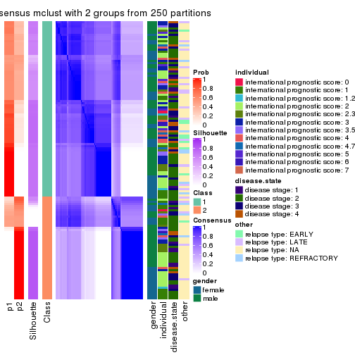</p>

</div>
<div id='tab-SD-mclust-consensus-heatmap-2'>
<pre><code class="r">consensus_heatmap(res, k = 3)
</code></pre>

<p>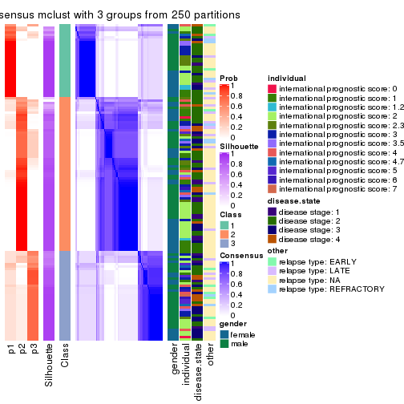</p>

</div>
<div id='tab-SD-mclust-consensus-heatmap-3'>
<pre><code class="r">consensus_heatmap(res, k = 4)
</code></pre>

<p>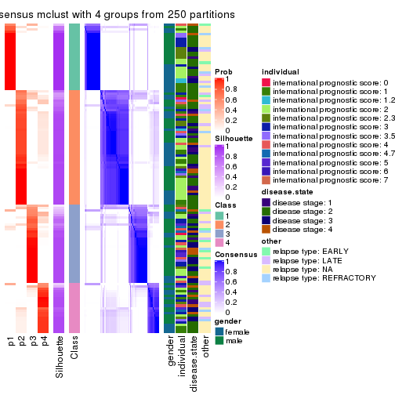</p>

</div>
<div id='tab-SD-mclust-consensus-heatmap-4'>
<pre><code class="r">consensus_heatmap(res, k = 5)
</code></pre>

<p>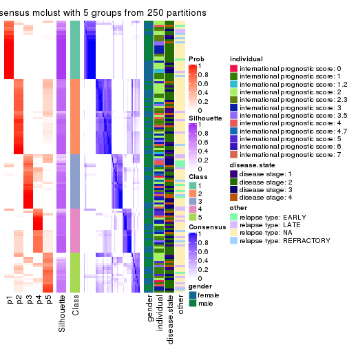</p>

</div>
<div id='tab-SD-mclust-consensus-heatmap-5'>
<pre><code class="r">consensus_heatmap(res, k = 6)
</code></pre>

<p>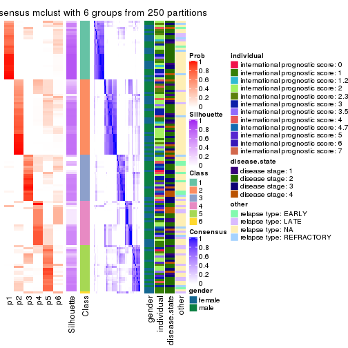</p>

</div>
</div>

Heatmaps for the membership of samples in all partitions to see how consistent they are:


<script>
$( function() {
	$( '#tabs-SD-mclust-membership-heatmap' ).tabs();
} );
</script>
<div id='tabs-SD-mclust-membership-heatmap'>
<ul>
<li><a href='#tab-SD-mclust-membership-heatmap-1'>k = 2</a></li>
<li><a href='#tab-SD-mclust-membership-heatmap-2'>k = 3</a></li>
<li><a href='#tab-SD-mclust-membership-heatmap-3'>k = 4</a></li>
<li><a href='#tab-SD-mclust-membership-heatmap-4'>k = 5</a></li>
<li><a href='#tab-SD-mclust-membership-heatmap-5'>k = 6</a></li>
</ul>
<div id='tab-SD-mclust-membership-heatmap-1'>
<pre><code class="r">membership_heatmap(res, k = 2)
</code></pre>

<p>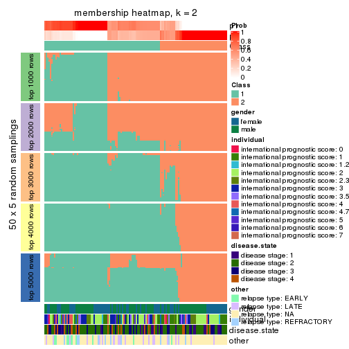</p>

</div>
<div id='tab-SD-mclust-membership-heatmap-2'>
<pre><code class="r">membership_heatmap(res, k = 3)
</code></pre>

<p>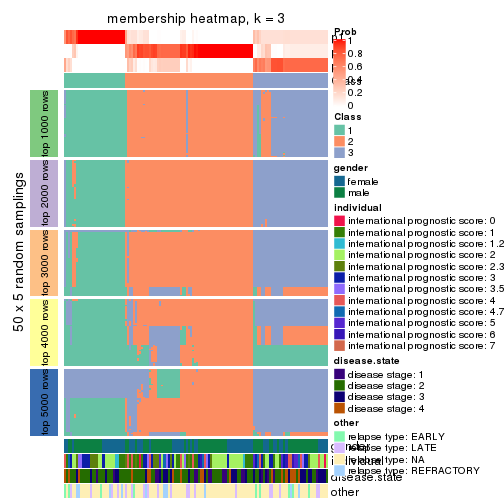</p>

</div>
<div id='tab-SD-mclust-membership-heatmap-3'>
<pre><code class="r">membership_heatmap(res, k = 4)
</code></pre>

<p>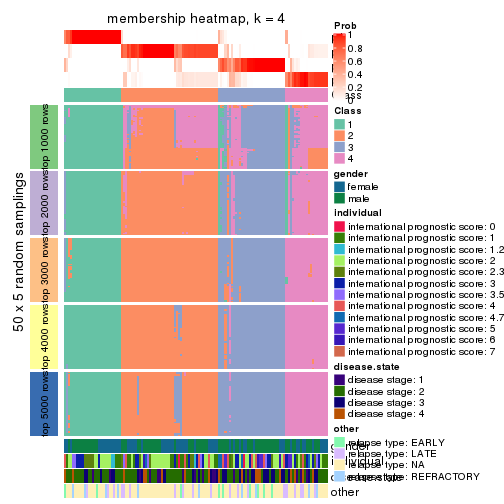</p>

</div>
<div id='tab-SD-mclust-membership-heatmap-4'>
<pre><code class="r">membership_heatmap(res, k = 5)
</code></pre>

<p>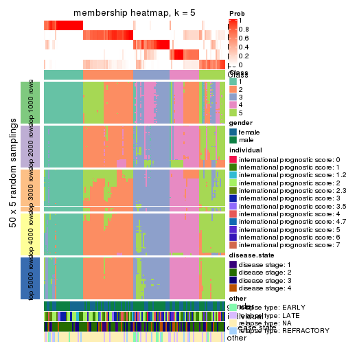</p>

</div>
<div id='tab-SD-mclust-membership-heatmap-5'>
<pre><code class="r">membership_heatmap(res, k = 6)
</code></pre>

<p>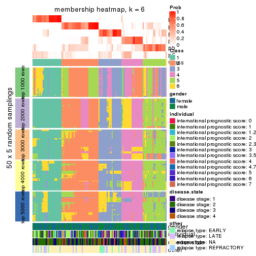</p>

</div>
</div>

As soon as we have had the classes for columns, we can look for signatures
which are significantly different between classes which can be candidate marks
for certain classes. Following are the heatmaps for signatures.


Signature heatmaps where rows are scaled:


<script>
$( function() {
	$( '#tabs-SD-mclust-get-signatures' ).tabs();
} );
</script>
<div id='tabs-SD-mclust-get-signatures'>
<ul>
<li><a href='#tab-SD-mclust-get-signatures-1'>k = 2</a></li>
<li><a href='#tab-SD-mclust-get-signatures-2'>k = 3</a></li>
<li><a href='#tab-SD-mclust-get-signatures-3'>k = 4</a></li>
<li><a href='#tab-SD-mclust-get-signatures-4'>k = 5</a></li>
<li><a href='#tab-SD-mclust-get-signatures-5'>k = 6</a></li>
</ul>
<div id='tab-SD-mclust-get-signatures-1'>
<pre><code class="r">get_signatures(res, k = 2)
</code></pre>

<p>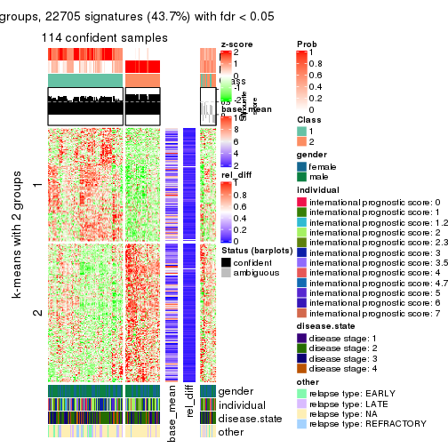</p>

</div>
<div id='tab-SD-mclust-get-signatures-2'>
<pre><code class="r">get_signatures(res, k = 3)
</code></pre>

<p>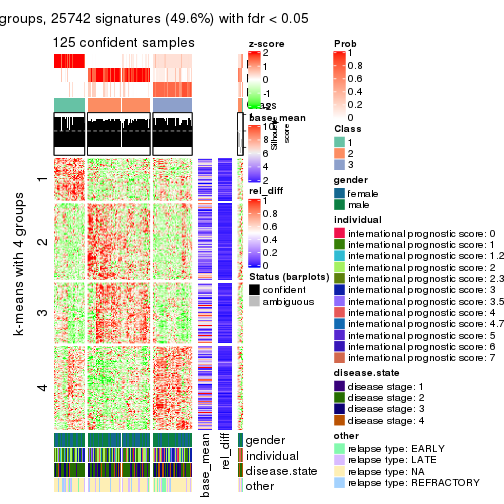</p>

</div>
<div id='tab-SD-mclust-get-signatures-3'>
<pre><code class="r">get_signatures(res, k = 4)
</code></pre>

<p>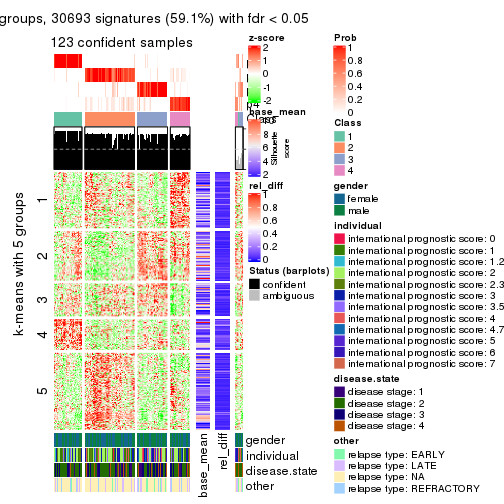</p>

</div>
<div id='tab-SD-mclust-get-signatures-4'>
<pre><code class="r">get_signatures(res, k = 5)
</code></pre>

<pre><code>#&gt; Error: The width or height of the raster image is zero, maybe you forget to turn off the
#&gt; previous graphic device or it was corrupted. Run `dev.off()` to close it.
</code></pre>

<p></p>

</div>
<div id='tab-SD-mclust-get-signatures-5'>
<pre><code class="r">get_signatures(res, k = 6)
</code></pre>

<pre><code>#&gt; Error: The width or height of the raster image is zero, maybe you forget to turn off the
#&gt; previous graphic device or it was corrupted. Run `dev.off()` to close it.
</code></pre>

<p></p>

</div>
</div>


Signature heatmaps where rows are not scaled:


<script>
$( function() {
	$( '#tabs-SD-mclust-get-signatures-no-scale' ).tabs();
} );
</script>
<div id='tabs-SD-mclust-get-signatures-no-scale'>
<ul>
<li><a href='#tab-SD-mclust-get-signatures-no-scale-1'>k = 2</a></li>
<li><a href='#tab-SD-mclust-get-signatures-no-scale-2'>k = 3</a></li>
<li><a href='#tab-SD-mclust-get-signatures-no-scale-3'>k = 4</a></li>
<li><a href='#tab-SD-mclust-get-signatures-no-scale-4'>k = 5</a></li>
<li><a href='#tab-SD-mclust-get-signatures-no-scale-5'>k = 6</a></li>
</ul>
<div id='tab-SD-mclust-get-signatures-no-scale-1'>
<pre><code class="r">get_signatures(res, k = 2, scale_rows = FALSE)
</code></pre>

<p>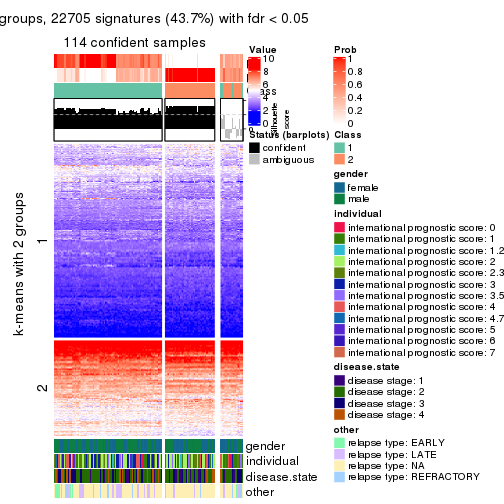</p>

</div>
<div id='tab-SD-mclust-get-signatures-no-scale-2'>
<pre><code class="r">get_signatures(res, k = 3, scale_rows = FALSE)
</code></pre>

<p>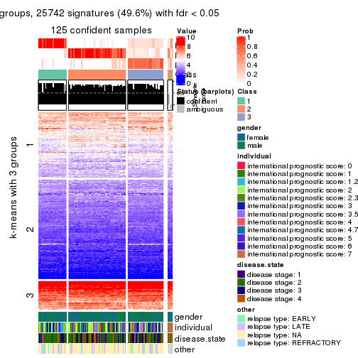</p>

</div>
<div id='tab-SD-mclust-get-signatures-no-scale-3'>
<pre><code class="r">get_signatures(res, k = 4, scale_rows = FALSE)
</code></pre>

<p>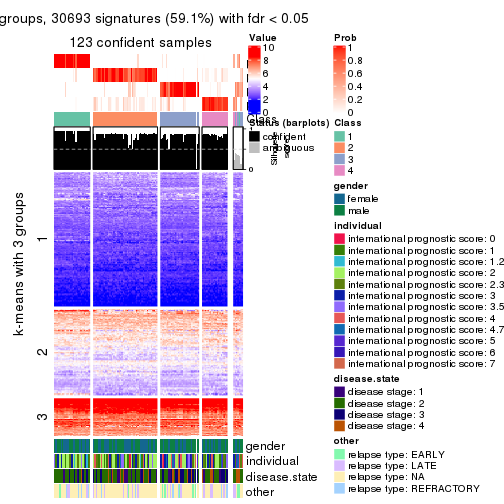</p>

</div>
<div id='tab-SD-mclust-get-signatures-no-scale-4'>
<pre><code class="r">get_signatures(res, k = 5, scale_rows = FALSE)
</code></pre>

<p>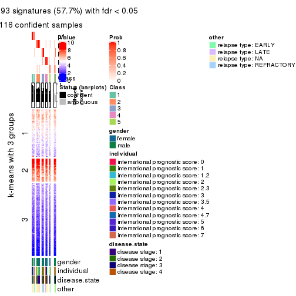</p>

</div>
<div id='tab-SD-mclust-get-signatures-no-scale-5'>
<pre><code class="r">get_signatures(res, k = 6, scale_rows = FALSE)
</code></pre>

<p>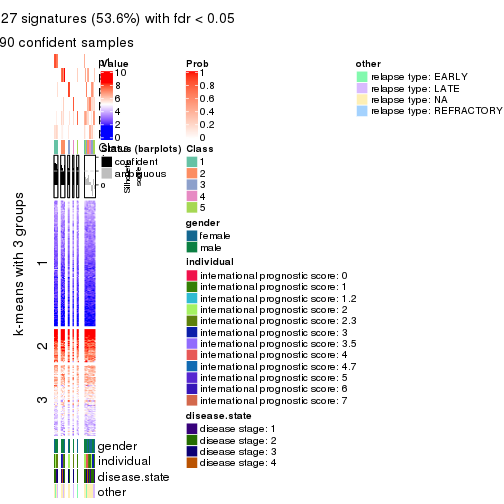</p>

</div>
</div>


Compare the overlap of signatures from different k:

```r
compare_signatures(res)
```

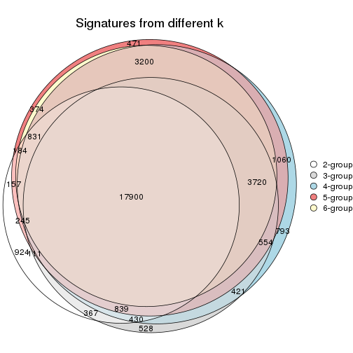

`get_signature()` returns a data frame invisibly. TO get the list of signatures, the function
call should be assigned to a variable explicitly. In following code, if `plot` argument is set
to `FALSE`, no heatmap is plotted while only the differential analysis is performed.

```r
# code only for demonstration
tb = get_signature(res, k = ..., plot = FALSE)
```

An example of the output of `tb` is:

```
#>   which_row         fdr    mean_1    mean_2 scaled_mean_1 scaled_mean_2 km
#> 1        38 0.042760348  8.373488  9.131774    -0.5533452     0.5164555  1
#> 2        40 0.018707592  7.106213  8.469186    -0.6173731     0.5762149  1
#> 3        55 0.019134737 10.221463 11.207825    -0.6159697     0.5749050  1
#> 4        59 0.006059896  5.921854  7.869574    -0.6899429     0.6439467  1
#> 5        60 0.018055526  8.928898 10.211722    -0.6204761     0.5791110  1
#> 6        98 0.009384629 15.714769 14.887706     0.6635654    -0.6193277  2
...
```

The columns in `tb` are:

1. `which_row`: row indices corresponding to the input matrix.
2. `fdr`: FDR for the differential test. 
3. `mean_x`: The mean value in group x.
4. `scaled_mean_x`: The mean value in group x after rows are scaled.
5. `km`: Row groups if k-means clustering is applied to rows.


UMAP plot which shows how samples are separated.


<script>
$( function() {
	$( '#tabs-SD-mclust-dimension-reduction' ).tabs();
} );
</script>
<div id='tabs-SD-mclust-dimension-reduction'>
<ul>
<li><a href='#tab-SD-mclust-dimension-reduction-1'>k = 2</a></li>
<li><a href='#tab-SD-mclust-dimension-reduction-2'>k = 3</a></li>
<li><a href='#tab-SD-mclust-dimension-reduction-3'>k = 4</a></li>
<li><a href='#tab-SD-mclust-dimension-reduction-4'>k = 5</a></li>
<li><a href='#tab-SD-mclust-dimension-reduction-5'>k = 6</a></li>
</ul>
<div id='tab-SD-mclust-dimension-reduction-1'>
<pre><code class="r">dimension_reduction(res, k = 2, method = &quot;UMAP&quot;)
</code></pre>

<p>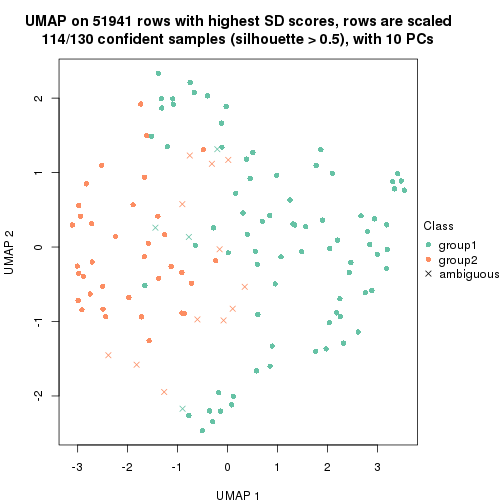</p>

</div>
<div id='tab-SD-mclust-dimension-reduction-2'>
<pre><code class="r">dimension_reduction(res, k = 3, method = &quot;UMAP&quot;)
</code></pre>

<p>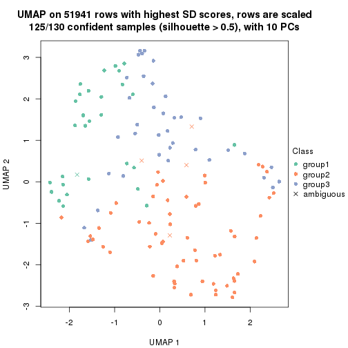</p>

</div>
<div id='tab-SD-mclust-dimension-reduction-3'>
<pre><code class="r">dimension_reduction(res, k = 4, method = &quot;UMAP&quot;)
</code></pre>

<p>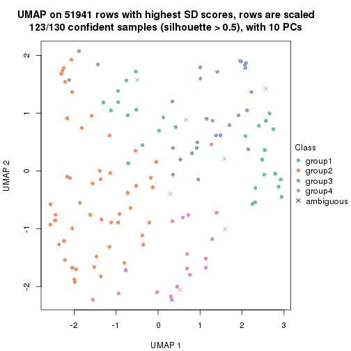</p>

</div>
<div id='tab-SD-mclust-dimension-reduction-4'>
<pre><code class="r">dimension_reduction(res, k = 5, method = &quot;UMAP&quot;)
</code></pre>

<p>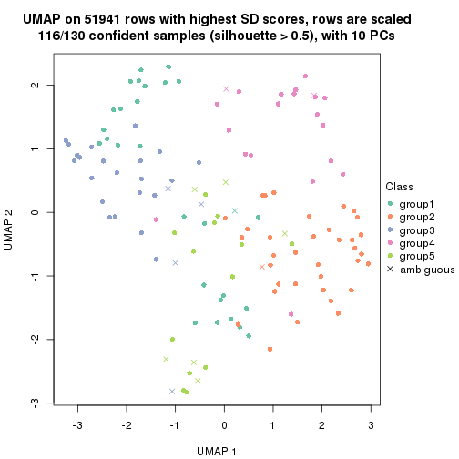</p>

</div>
<div id='tab-SD-mclust-dimension-reduction-5'>
<pre><code class="r">dimension_reduction(res, k = 6, method = &quot;UMAP&quot;)
</code></pre>

<p>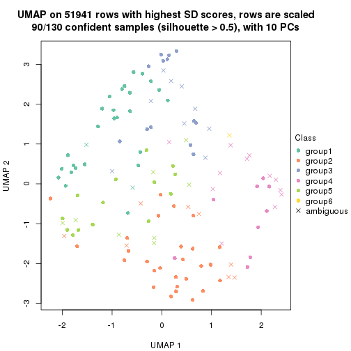</p>

</div>
</div>


Following heatmap shows how subgroups are split when increasing `k`:

```r
collect_classes(res)
```

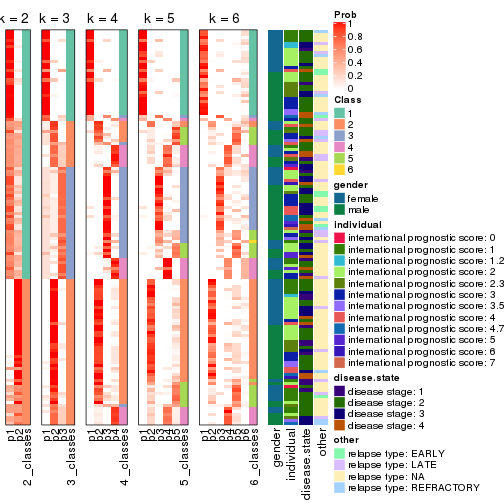


Test correlation between subgroups and known annotations. If the known
annotation is numeric, one-way ANOVA test is applied, and if the known
annotation is discrete, chi-squared contingency table test is applied.

```r
test_to_known_factors(res)
```

```
#>             n gender(p) individual(p) disease.state(p) other(p) k
#> SD:mclust 114     0.788         0.760           0.3326   0.0403 2
#> SD:mclust 125     0.402         0.213           0.1042   0.3047 3
#> SD:mclust 123     0.246         0.264           0.0465   0.1432 4
#> SD:mclust 116     0.633         0.409           0.5922   0.0246 5
#> SD:mclust  90     0.526         0.141           0.2222   0.1408 6
```


If matrix rows can be associated to genes, consider to use `GO_Enrichment(res,
...)` to perform function enrichment for the signature genes.


 

---------------------------------------------------


### SD:NMF


The object with results only for a single top-value method and a single partition method 
can be extracted as:

```r
res = res_list["SD", "NMF"]
# you can also extract it by
# res = res_list["SD:NMF"]
```

A summary of `res` and all the functions that can be applied to it:

```r
res
```

```
#> A 'ConsensusPartition' object with k = 2, 3, 4, 5, 6.
#>   On a matrix with 51941 rows and 130 columns.
#>   Top rows (1000, 2000, 3000, 4000, 5000) are extracted by 'SD' method.
#>   Subgroups are detected by 'NMF' method.
#>   Performed in total 1250 partitions by row resampling.
#>   Best k for subgroups seems to be 2.
#> 
#> Following methods can be applied to this 'ConsensusPartition' object:
#>  [1] "cola_report"             "collect_classes"         "collect_plots"          
#>  [4] "collect_stats"           "colnames"                "compare_signatures"     
#>  [7] "consensus_heatmap"       "dimension_reduction"     "functional_enrichment"  
#> [10] "get_anno_col"            "get_anno"                "get_classes"            
#> [13] "get_consensus"           "get_matrix"              "get_membership"         
#> [16] "get_param"               "get_signatures"          "get_stats"              
#> [19] "is_best_k"               "is_stable_k"             "membership_heatmap"     
#> [22] "ncol"                    "nrow"                    "plot_ecdf"              
#> [25] "rownames"                "select_partition_number" "show"                   
#> [28] "suggest_best_k"          "test_to_known_factors"
```

`collect_plots()` function collects all the plots made from `res` for all `k` (number of partitions)
into one single page to provide an easy and fast comparison between different `k`.

```r
collect_plots(res)
```

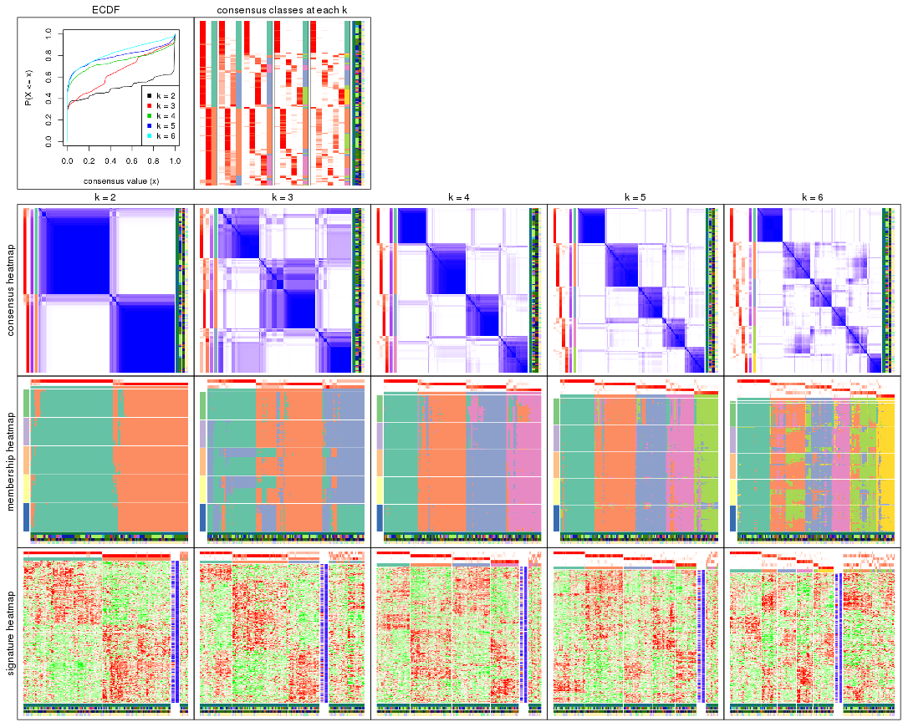

The plots are:

- The first row: a plot of the ECDF (Empirical cumulative distribution
  function) curves of the consensus matrix for each `k` and the heatmap of
  predicted classes for each `k`.
- The second row: heatmaps of the consensus matrix for each `k`.
- The third row: heatmaps of the membership matrix for each `k`.
- The fouth row: heatmaps of the signatures for each `k`.

All the plots in panels can be made by individual functions and they are
plotted later in this section.

`select_partition_number()` produces several plots showing different
statistics for choosing "optimized" `k`. There are following statistics:

- ECDF curves of the consensus matrix for each `k`;
- 1-PAC. [The PAC
  score](https://en.wikipedia.org/wiki/Consensus_clustering#Over-interpretation_potential_of_consensus_clustering)
  measures the proportion of the ambiguous subgrouping.
- Mean silhouette score.
- Concordance. The mean probability of fiting the consensus class ids in all
  partitions.
- Area increased. Denote $A_k$ as the area under the ECDF curve for current
  `k`, the area increased is defined as $A_k - A_{k-1}$.
- Rand index. The percent of pairs of samples that are both in a same cluster
  or both are not in a same cluster in the partition of k and k-1.
- Jaccard index. The ratio of pairs of samples are both in a same cluster in
  the partition of k and k-1 and the pairs of samples are both in a same
  cluster in the partition k or k-1.

The detailed explanations of these statistics can be found in [the cola
vignette](http://bioconductor.org/packages/devel/bioc/vignettes/cola/inst/doc/cola.html#toc_13).

Generally speaking, lower PAC score, higher mean silhouette score or higher
concordance corresponds to better partition. Rand index and Jaccard index
measure how similar the current partition is compared to partition with `k-1`.
If they are too similar, we won't accept `k` is better than `k-1`.

```r
select_partition_number(res)
```

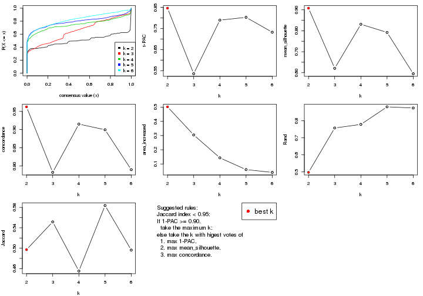

The numeric values for all these statistics can be obtained by `get_stats()`.

```r
get_stats(res)
```

```
#>   k 1-PAC mean_silhouette concordance area_increased  Rand Jaccard
#> 2 2 0.846           0.908       0.962         0.5022 0.497   0.497
#> 3 3 0.535           0.621       0.783         0.3046 0.758   0.552
#> 4 4 0.790           0.831       0.915         0.1433 0.779   0.455
#> 5 5 0.803           0.792       0.899         0.0604 0.882   0.584
#> 6 6 0.732           0.595       0.790         0.0409 0.875   0.496
```

`suggest_best_k()` suggests the best $k$ based on these statistics. The rules are as follows:

- All $k$ with Jaccard index larger than 0.95 are removed because the increase of
  the partition number does not provides enough extra information. If all $k$ are removed,
  the best $k$ is assigned by `NA`.
- For $k$ with 1-PAC larger than 0.9, the maximal $k$ is taken as the "best k". Other $k$ is called "optional k".
- If it does not fit the second rule. The $k$ with the highest vote of highest
  1-PAC, mean silhouette and concordance is taken as the "best k".

```r
suggest_best_k(res)
```

```
#> [1] 2
```


Following shows the table of the partitions (You need to click the **show/hide
code output** link to see it). The membership matrix (columns with name `p*`)
is inferred by
[`clue::cl_consensus()`](https://www.rdocumentation.org/link/cl_consensus?package=clue)
function with the `SE` method. Basically the value in the membership matrix
represents the probability to belong to a certain group. The finall class
label for an item is determined with the group with highest probability it
belongs to.

In `get_classes()` function, the entropy is calculated from the membership
matrix and the silhouette score is calculated from the consensus matrix.


<script>
$( function() {
	$( '#tabs-SD-NMF-get-classes' ).tabs();
} );
</script>
<div id='tabs-SD-NMF-get-classes'>
<ul>
<li><a href='#tab-SD-NMF-get-classes-1'>k = 2</a></li>
<li><a href='#tab-SD-NMF-get-classes-2'>k = 3</a></li>
<li><a href='#tab-SD-NMF-get-classes-3'>k = 4</a></li>
<li><a href='#tab-SD-NMF-get-classes-4'>k = 5</a></li>
<li><a href='#tab-SD-NMF-get-classes-5'>k = 6</a></li>
</ul>

<div id='tab-SD-NMF-get-classes-1'>
<p><a id='tab-SD-NMF-get-classes-1-a' style='color:#0366d6' href='#'>show/hide code output</a></p>
<pre><code class="r">cbind(get_classes(res, k = 2), get_membership(res, k = 2))
</code></pre>

<pre><code>#&gt;           class entropy silhouette    p1    p2
#&gt; GSM447671     2  0.0000      0.952 0.000 1.000
#&gt; GSM447694     1  0.0000      0.966 1.000 0.000
#&gt; GSM447618     2  0.0000      0.952 0.000 1.000
#&gt; GSM447691     2  0.0000      0.952 0.000 1.000
#&gt; GSM447733     2  0.9710      0.336 0.400 0.600
#&gt; GSM447620     2  0.0000      0.952 0.000 1.000
#&gt; GSM447627     1  0.0000      0.966 1.000 0.000
#&gt; GSM447630     2  0.8207      0.647 0.256 0.744
#&gt; GSM447642     1  0.0000      0.966 1.000 0.000
#&gt; GSM447649     2  0.0000      0.952 0.000 1.000
#&gt; GSM447654     2  0.0376      0.949 0.004 0.996
#&gt; GSM447655     2  0.0000      0.952 0.000 1.000
#&gt; GSM447669     2  0.0000      0.952 0.000 1.000
#&gt; GSM447676     1  0.0000      0.966 1.000 0.000
#&gt; GSM447678     2  0.0000      0.952 0.000 1.000
#&gt; GSM447681     2  0.0000      0.952 0.000 1.000
#&gt; GSM447698     2  0.0000      0.952 0.000 1.000
#&gt; GSM447713     1  0.0000      0.966 1.000 0.000
#&gt; GSM447722     2  0.0000      0.952 0.000 1.000
#&gt; GSM447726     2  0.9635      0.395 0.388 0.612
#&gt; GSM447735     1  0.0000      0.966 1.000 0.000
#&gt; GSM447737     1  0.0000      0.966 1.000 0.000
#&gt; GSM447657     2  0.0000      0.952 0.000 1.000
#&gt; GSM447674     2  0.0000      0.952 0.000 1.000
#&gt; GSM447636     1  0.0000      0.966 1.000 0.000
#&gt; GSM447723     1  0.0000      0.966 1.000 0.000
#&gt; GSM447699     1  0.7219      0.746 0.800 0.200
#&gt; GSM447708     2  0.0000      0.952 0.000 1.000
#&gt; GSM447721     1  0.0000      0.966 1.000 0.000
#&gt; GSM447623     1  0.0000      0.966 1.000 0.000
#&gt; GSM447621     1  0.0000      0.966 1.000 0.000
#&gt; GSM447650     2  0.0000      0.952 0.000 1.000
#&gt; GSM447651     2  0.0000      0.952 0.000 1.000
#&gt; GSM447653     1  0.0000      0.966 1.000 0.000
#&gt; GSM447658     1  0.0000      0.966 1.000 0.000
#&gt; GSM447675     2  0.0000      0.952 0.000 1.000
#&gt; GSM447680     2  0.1184      0.940 0.016 0.984
#&gt; GSM447686     2  0.9635      0.395 0.388 0.612
#&gt; GSM447736     1  0.0000      0.966 1.000 0.000
#&gt; GSM447629     2  0.0672      0.946 0.008 0.992
#&gt; GSM447648     1  0.0000      0.966 1.000 0.000
#&gt; GSM447660     1  0.0000      0.966 1.000 0.000
#&gt; GSM447661     2  0.0000      0.952 0.000 1.000
#&gt; GSM447663     1  0.1633      0.948 0.976 0.024
#&gt; GSM447704     2  0.0000      0.952 0.000 1.000
#&gt; GSM447720     1  0.0000      0.966 1.000 0.000
#&gt; GSM447652     2  0.0000      0.952 0.000 1.000
#&gt; GSM447679     2  0.0000      0.952 0.000 1.000
#&gt; GSM447712     1  0.0000      0.966 1.000 0.000
#&gt; GSM447664     2  0.5842      0.819 0.140 0.860
#&gt; GSM447637     1  0.0000      0.966 1.000 0.000
#&gt; GSM447639     1  0.8016      0.679 0.756 0.244
#&gt; GSM447615     1  0.0000      0.966 1.000 0.000
#&gt; GSM447656     2  0.6438      0.790 0.164 0.836
#&gt; GSM447673     2  0.0000      0.952 0.000 1.000
#&gt; GSM447719     1  0.0000      0.966 1.000 0.000
#&gt; GSM447706     1  0.0000      0.966 1.000 0.000
#&gt; GSM447612     1  0.7219      0.746 0.800 0.200
#&gt; GSM447665     2  0.0000      0.952 0.000 1.000
#&gt; GSM447677     2  0.0000      0.952 0.000 1.000
#&gt; GSM447613     1  0.0000      0.966 1.000 0.000
#&gt; GSM447659     1  0.7219      0.746 0.800 0.200
#&gt; GSM447662     1  0.2043      0.941 0.968 0.032
#&gt; GSM447666     1  0.0000      0.966 1.000 0.000
#&gt; GSM447668     2  0.0000      0.952 0.000 1.000
#&gt; GSM447682     2  0.0000      0.952 0.000 1.000
#&gt; GSM447683     2  0.0000      0.952 0.000 1.000
#&gt; GSM447688     2  0.0000      0.952 0.000 1.000
#&gt; GSM447702     2  0.0000      0.952 0.000 1.000
#&gt; GSM447709     2  0.0000      0.952 0.000 1.000
#&gt; GSM447711     1  0.0000      0.966 1.000 0.000
#&gt; GSM447715     1  0.0672      0.960 0.992 0.008
#&gt; GSM447693     1  0.0000      0.966 1.000 0.000
#&gt; GSM447611     1  0.9998     -0.033 0.508 0.492
#&gt; GSM447672     2  0.0000      0.952 0.000 1.000
#&gt; GSM447703     2  0.0000      0.952 0.000 1.000
#&gt; GSM447727     1  0.0000      0.966 1.000 0.000
#&gt; GSM447638     1  0.4815      0.864 0.896 0.104
#&gt; GSM447670     1  0.0000      0.966 1.000 0.000
#&gt; GSM447700     2  0.0000      0.952 0.000 1.000
#&gt; GSM447738     2  0.0000      0.952 0.000 1.000
#&gt; GSM447739     1  0.0000      0.966 1.000 0.000
#&gt; GSM447617     1  0.0000      0.966 1.000 0.000
#&gt; GSM447628     2  0.0000      0.952 0.000 1.000
#&gt; GSM447632     2  0.0000      0.952 0.000 1.000
#&gt; GSM447619     1  0.0000      0.966 1.000 0.000
#&gt; GSM447643     1  0.7745      0.690 0.772 0.228
#&gt; GSM447724     2  0.9635      0.369 0.388 0.612
#&gt; GSM447728     2  0.0000      0.952 0.000 1.000
#&gt; GSM447610     1  0.0000      0.966 1.000 0.000
#&gt; GSM447633     2  0.0000      0.952 0.000 1.000
#&gt; GSM447634     1  0.0000      0.966 1.000 0.000
#&gt; GSM447622     1  0.0000      0.966 1.000 0.000
#&gt; GSM447667     2  0.7299      0.737 0.204 0.796
#&gt; GSM447687     2  0.0000      0.952 0.000 1.000
#&gt; GSM447695     1  0.0000      0.966 1.000 0.000
#&gt; GSM447696     1  0.0000      0.966 1.000 0.000
#&gt; GSM447697     1  0.0000      0.966 1.000 0.000
#&gt; GSM447714     1  0.1184      0.954 0.984 0.016
#&gt; GSM447717     1  0.0000      0.966 1.000 0.000
#&gt; GSM447725     1  0.0000      0.966 1.000 0.000
#&gt; GSM447729     2  0.0376      0.949 0.004 0.996
#&gt; GSM447644     2  0.0000      0.952 0.000 1.000
#&gt; GSM447710     1  0.0000      0.966 1.000 0.000
#&gt; GSM447614     1  0.0000      0.966 1.000 0.000
#&gt; GSM447685     2  0.0000      0.952 0.000 1.000
#&gt; GSM447690     1  0.0000      0.966 1.000 0.000
#&gt; GSM447730     2  0.0000      0.952 0.000 1.000
#&gt; GSM447646     2  0.0000      0.952 0.000 1.000
#&gt; GSM447689     1  0.0000      0.966 1.000 0.000
#&gt; GSM447635     1  0.9286      0.474 0.656 0.344
#&gt; GSM447641     1  0.0000      0.966 1.000 0.000
#&gt; GSM447716     2  0.0000      0.952 0.000 1.000
#&gt; GSM447718     1  0.1414      0.951 0.980 0.020
#&gt; GSM447616     1  0.0000      0.966 1.000 0.000
#&gt; GSM447626     1  0.0000      0.966 1.000 0.000
#&gt; GSM447640     2  0.0000      0.952 0.000 1.000
#&gt; GSM447734     1  0.0672      0.960 0.992 0.008
#&gt; GSM447692     1  0.0000      0.966 1.000 0.000
#&gt; GSM447647     2  0.0000      0.952 0.000 1.000
#&gt; GSM447624     1  0.0000      0.966 1.000 0.000
#&gt; GSM447625     1  0.0000      0.966 1.000 0.000
#&gt; GSM447707     2  0.0000      0.952 0.000 1.000
#&gt; GSM447732     1  0.0000      0.966 1.000 0.000
#&gt; GSM447684     1  0.0000      0.966 1.000 0.000
#&gt; GSM447731     2  0.1633      0.933 0.024 0.976
#&gt; GSM447705     2  0.9732      0.324 0.404 0.596
#&gt; GSM447631     1  0.0000      0.966 1.000 0.000
#&gt; GSM447701     2  0.0000      0.952 0.000 1.000
#&gt; GSM447645     1  0.0000      0.966 1.000 0.000
</code></pre>

<script>
$('#tab-SD-NMF-get-classes-1-a').parent().next().next().hide();
$('#tab-SD-NMF-get-classes-1-a').click(function(){
  $('#tab-SD-NMF-get-classes-1-a').parent().next().next().toggle();
  return(false);
});
</script>
</div>

<div id='tab-SD-NMF-get-classes-2'>
<p><a id='tab-SD-NMF-get-classes-2-a' style='color:#0366d6' href='#'>show/hide code output</a></p>
<pre><code class="r">cbind(get_classes(res, k = 3), get_membership(res, k = 3))
</code></pre>

<pre><code>#&gt;           class entropy silhouette    p1    p2    p3
#&gt; GSM447671     3  0.6225     0.2284 0.000 0.432 0.568
#&gt; GSM447694     3  0.5882     0.7285 0.348 0.000 0.652
#&gt; GSM447618     2  0.0000     0.8273 0.000 1.000 0.000
#&gt; GSM447691     2  0.0747     0.8199 0.000 0.984 0.016
#&gt; GSM447733     3  0.1950     0.4235 0.008 0.040 0.952
#&gt; GSM447620     2  0.6308    -0.0281 0.000 0.508 0.492
#&gt; GSM447627     3  0.5968     0.6319 0.364 0.000 0.636
#&gt; GSM447630     2  0.8231     0.3435 0.136 0.628 0.236
#&gt; GSM447642     1  0.0237     0.7592 0.996 0.000 0.004
#&gt; GSM447649     2  0.0000     0.8273 0.000 1.000 0.000
#&gt; GSM447654     2  0.9229     0.4970 0.164 0.488 0.348
#&gt; GSM447655     2  0.0000     0.8273 0.000 1.000 0.000
#&gt; GSM447669     2  0.4555     0.6441 0.000 0.800 0.200
#&gt; GSM447676     1  0.0000     0.7599 1.000 0.000 0.000
#&gt; GSM447678     2  0.6427     0.6538 0.012 0.640 0.348
#&gt; GSM447681     2  0.0000     0.8273 0.000 1.000 0.000
#&gt; GSM447698     2  0.3879     0.7788 0.000 0.848 0.152
#&gt; GSM447713     1  0.0000     0.7599 1.000 0.000 0.000
#&gt; GSM447722     2  0.5905     0.6591 0.000 0.648 0.352
#&gt; GSM447726     2  0.7634     0.4975 0.100 0.668 0.232
#&gt; GSM447735     1  0.6079     0.4605 0.612 0.000 0.388
#&gt; GSM447737     1  0.0424     0.7575 0.992 0.000 0.008
#&gt; GSM447657     2  0.0424     0.8259 0.000 0.992 0.008
#&gt; GSM447674     2  0.0000     0.8273 0.000 1.000 0.000
#&gt; GSM447636     1  0.0000     0.7599 1.000 0.000 0.000
#&gt; GSM447723     1  0.0237     0.7592 0.996 0.000 0.004
#&gt; GSM447699     3  0.8162     0.6470 0.348 0.084 0.568
#&gt; GSM447708     2  0.0000     0.8273 0.000 1.000 0.000
#&gt; GSM447721     1  0.0237     0.7592 0.996 0.000 0.004
#&gt; GSM447623     1  0.0424     0.7569 0.992 0.000 0.008
#&gt; GSM447621     1  0.0892     0.7482 0.980 0.000 0.020
#&gt; GSM447650     2  0.0000     0.8273 0.000 1.000 0.000
#&gt; GSM447651     2  0.0424     0.8242 0.000 0.992 0.008
#&gt; GSM447653     1  0.5905     0.4776 0.648 0.000 0.352
#&gt; GSM447658     1  0.0000     0.7599 1.000 0.000 0.000
#&gt; GSM447675     2  0.8872     0.5400 0.132 0.520 0.348
#&gt; GSM447680     2  0.2165     0.7942 0.064 0.936 0.000
#&gt; GSM447686     1  0.7034     0.4374 0.668 0.284 0.048
#&gt; GSM447736     3  0.5882     0.7285 0.348 0.000 0.652
#&gt; GSM447629     2  0.1411     0.8111 0.036 0.964 0.000
#&gt; GSM447648     3  0.5882     0.7285 0.348 0.000 0.652
#&gt; GSM447660     1  0.0000     0.7599 1.000 0.000 0.000
#&gt; GSM447661     2  0.0000     0.8273 0.000 1.000 0.000
#&gt; GSM447663     3  0.5882     0.7285 0.348 0.000 0.652
#&gt; GSM447704     2  0.0000     0.8273 0.000 1.000 0.000
#&gt; GSM447720     1  0.6793    -0.3292 0.536 0.012 0.452
#&gt; GSM447652     2  0.0000     0.8273 0.000 1.000 0.000
#&gt; GSM447679     2  0.0000     0.8273 0.000 1.000 0.000
#&gt; GSM447712     1  0.0000     0.7599 1.000 0.000 0.000
#&gt; GSM447664     3  0.9987    -0.2954 0.344 0.308 0.348
#&gt; GSM447637     3  0.5882     0.7285 0.348 0.000 0.652
#&gt; GSM447639     2  0.8524     0.4690 0.092 0.460 0.448
#&gt; GSM447615     1  0.4002     0.5779 0.840 0.000 0.160
#&gt; GSM447656     2  0.3340     0.7518 0.120 0.880 0.000
#&gt; GSM447673     2  0.5882     0.6616 0.000 0.652 0.348
#&gt; GSM447719     3  0.6204    -0.2385 0.424 0.000 0.576
#&gt; GSM447706     3  0.5882     0.7285 0.348 0.000 0.652
#&gt; GSM447612     3  0.5882     0.7285 0.348 0.000 0.652
#&gt; GSM447665     2  0.0237     0.8256 0.000 0.996 0.004
#&gt; GSM447677     2  0.0000     0.8273 0.000 1.000 0.000
#&gt; GSM447613     1  0.0237     0.7592 0.996 0.000 0.004
#&gt; GSM447659     3  0.0237     0.4510 0.004 0.000 0.996
#&gt; GSM447662     3  0.5882     0.7285 0.348 0.000 0.652
#&gt; GSM447666     3  0.7984     0.6285 0.216 0.132 0.652
#&gt; GSM447668     2  0.0000     0.8273 0.000 1.000 0.000
#&gt; GSM447682     2  0.0000     0.8273 0.000 1.000 0.000
#&gt; GSM447683     2  0.0000     0.8273 0.000 1.000 0.000
#&gt; GSM447688     2  0.5882     0.6616 0.000 0.652 0.348
#&gt; GSM447702     2  0.0000     0.8273 0.000 1.000 0.000
#&gt; GSM447709     2  0.5497     0.5110 0.000 0.708 0.292
#&gt; GSM447711     1  0.0000     0.7599 1.000 0.000 0.000
#&gt; GSM447715     1  0.3482     0.6584 0.872 0.128 0.000
#&gt; GSM447693     3  0.5882     0.7285 0.348 0.000 0.652
#&gt; GSM447611     1  0.6104     0.4763 0.648 0.004 0.348
#&gt; GSM447672     2  0.0000     0.8273 0.000 1.000 0.000
#&gt; GSM447703     2  0.4121     0.7713 0.000 0.832 0.168
#&gt; GSM447727     1  0.2066     0.7114 0.940 0.000 0.060
#&gt; GSM447638     1  0.6688     0.2571 0.580 0.408 0.012
#&gt; GSM447670     1  0.4555     0.4943 0.800 0.000 0.200
#&gt; GSM447700     2  0.5785     0.4021 0.000 0.668 0.332
#&gt; GSM447738     2  0.4178     0.7695 0.000 0.828 0.172
#&gt; GSM447739     1  0.0000     0.7599 1.000 0.000 0.000
#&gt; GSM447617     1  0.1643     0.7277 0.956 0.000 0.044
#&gt; GSM447628     2  0.6275     0.6564 0.008 0.644 0.348
#&gt; GSM447632     2  0.3816     0.7805 0.000 0.852 0.148
#&gt; GSM447619     3  0.5882     0.7285 0.348 0.000 0.652
#&gt; GSM447643     1  0.5016     0.5259 0.760 0.240 0.000
#&gt; GSM447724     3  0.0237     0.4526 0.000 0.004 0.996
#&gt; GSM447728     2  0.0000     0.8273 0.000 1.000 0.000
#&gt; GSM447610     1  0.5882     0.4789 0.652 0.000 0.348
#&gt; GSM447633     3  0.5926     0.3857 0.000 0.356 0.644
#&gt; GSM447634     1  0.5948     0.0296 0.640 0.000 0.360
#&gt; GSM447622     3  0.5882     0.7285 0.348 0.000 0.652
#&gt; GSM447667     2  0.5420     0.6072 0.240 0.752 0.008
#&gt; GSM447687     2  0.4796     0.7436 0.000 0.780 0.220
#&gt; GSM447695     1  0.6244    -0.2664 0.560 0.000 0.440
#&gt; GSM447696     1  0.0000     0.7599 1.000 0.000 0.000
#&gt; GSM447697     1  0.0237     0.7592 0.996 0.000 0.004
#&gt; GSM447714     3  0.5882     0.7285 0.348 0.000 0.652
#&gt; GSM447717     1  0.0000     0.7599 1.000 0.000 0.000
#&gt; GSM447725     1  0.2261     0.7183 0.932 0.000 0.068
#&gt; GSM447729     2  0.9745     0.3825 0.232 0.420 0.348
#&gt; GSM447644     3  0.6286     0.1590 0.000 0.464 0.536
#&gt; GSM447710     3  0.5882     0.7285 0.348 0.000 0.652
#&gt; GSM447614     1  0.6095     0.4641 0.608 0.000 0.392
#&gt; GSM447685     2  0.0000     0.8273 0.000 1.000 0.000
#&gt; GSM447690     1  0.2711     0.7028 0.912 0.000 0.088
#&gt; GSM447730     2  0.0000     0.8273 0.000 1.000 0.000
#&gt; GSM447646     2  0.6104     0.6591 0.004 0.648 0.348
#&gt; GSM447689     3  0.5882     0.7285 0.348 0.000 0.652
#&gt; GSM447635     2  0.6422     0.4483 0.324 0.660 0.016
#&gt; GSM447641     1  0.0237     0.7592 0.996 0.000 0.004
#&gt; GSM447716     2  0.8700     0.5657 0.120 0.536 0.344
#&gt; GSM447718     3  0.7867     0.6682 0.348 0.068 0.584
#&gt; GSM447616     3  0.6267     0.5439 0.452 0.000 0.548
#&gt; GSM447626     3  0.5882     0.7285 0.348 0.000 0.652
#&gt; GSM447640     2  0.0000     0.8273 0.000 1.000 0.000
#&gt; GSM447734     3  0.5882     0.7285 0.348 0.000 0.652
#&gt; GSM447692     1  0.3412     0.6358 0.876 0.000 0.124
#&gt; GSM447647     2  0.6104     0.6591 0.004 0.648 0.348
#&gt; GSM447624     1  0.6095    -0.0985 0.608 0.000 0.392
#&gt; GSM447625     3  0.5882     0.7285 0.348 0.000 0.652
#&gt; GSM447707     2  0.0000     0.8273 0.000 1.000 0.000
#&gt; GSM447732     3  0.5882     0.7285 0.348 0.000 0.652
#&gt; GSM447684     1  0.6302    -0.3934 0.520 0.000 0.480
#&gt; GSM447731     3  0.6912    -0.2484 0.028 0.344 0.628
#&gt; GSM447705     3  0.7748     0.5279 0.096 0.252 0.652
#&gt; GSM447631     3  0.5882     0.7285 0.348 0.000 0.652
#&gt; GSM447701     2  0.0000     0.8273 0.000 1.000 0.000
#&gt; GSM447645     3  0.5882     0.7285 0.348 0.000 0.652
</code></pre>

<script>
$('#tab-SD-NMF-get-classes-2-a').parent().next().next().hide();
$('#tab-SD-NMF-get-classes-2-a').click(function(){
  $('#tab-SD-NMF-get-classes-2-a').parent().next().next().toggle();
  return(false);
});
</script>
</div>

<div id='tab-SD-NMF-get-classes-3'>
<p><a id='tab-SD-NMF-get-classes-3-a' style='color:#0366d6' href='#'>show/hide code output</a></p>
<pre><code class="r">cbind(get_classes(res, k = 4), get_membership(res, k = 4))
</code></pre>

<pre><code>#&gt;           class entropy silhouette    p1    p2    p3    p4
#&gt; GSM447671     3  0.6469    0.63448 0.000 0.164 0.644 0.192
#&gt; GSM447694     3  0.2704    0.84930 0.000 0.000 0.876 0.124
#&gt; GSM447618     2  0.4948    0.26972 0.000 0.560 0.000 0.440
#&gt; GSM447691     2  0.2216    0.84208 0.000 0.908 0.000 0.092
#&gt; GSM447733     4  0.0188    0.82719 0.000 0.000 0.004 0.996
#&gt; GSM447620     2  0.4925    0.36036 0.000 0.572 0.428 0.000
#&gt; GSM447627     3  0.3444    0.80762 0.000 0.000 0.816 0.184
#&gt; GSM447630     2  0.4134    0.60673 0.000 0.740 0.260 0.000
#&gt; GSM447642     1  0.0000    0.99091 1.000 0.000 0.000 0.000
#&gt; GSM447649     2  0.0000    0.90400 0.000 1.000 0.000 0.000
#&gt; GSM447654     4  0.3570    0.82747 0.048 0.092 0.000 0.860
#&gt; GSM447655     2  0.0000    0.90400 0.000 1.000 0.000 0.000
#&gt; GSM447669     2  0.1474    0.87096 0.000 0.948 0.052 0.000
#&gt; GSM447676     1  0.0000    0.99091 1.000 0.000 0.000 0.000
#&gt; GSM447678     4  0.0000    0.82755 0.000 0.000 0.000 1.000
#&gt; GSM447681     2  0.0336    0.90050 0.000 0.992 0.000 0.008
#&gt; GSM447698     4  0.1022    0.83209 0.000 0.032 0.000 0.968
#&gt; GSM447713     1  0.0000    0.99091 1.000 0.000 0.000 0.000
#&gt; GSM447722     4  0.0000    0.82755 0.000 0.000 0.000 1.000
#&gt; GSM447726     2  0.2081    0.84986 0.000 0.916 0.084 0.000
#&gt; GSM447735     4  0.0188    0.82664 0.000 0.000 0.004 0.996
#&gt; GSM447737     1  0.2722    0.89472 0.904 0.000 0.064 0.032
#&gt; GSM447657     2  0.0336    0.90025 0.000 0.992 0.000 0.008
#&gt; GSM447674     2  0.0000    0.90400 0.000 1.000 0.000 0.000
#&gt; GSM447636     1  0.0000    0.99091 1.000 0.000 0.000 0.000
#&gt; GSM447723     1  0.0000    0.99091 1.000 0.000 0.000 0.000
#&gt; GSM447699     3  0.4040    0.74289 0.000 0.000 0.752 0.248
#&gt; GSM447708     2  0.0469    0.89914 0.000 0.988 0.000 0.012
#&gt; GSM447721     1  0.0000    0.99091 1.000 0.000 0.000 0.000
#&gt; GSM447623     1  0.0000    0.99091 1.000 0.000 0.000 0.000
#&gt; GSM447621     1  0.0000    0.99091 1.000 0.000 0.000 0.000
#&gt; GSM447650     2  0.0000    0.90400 0.000 1.000 0.000 0.000
#&gt; GSM447651     2  0.0469    0.89944 0.000 0.988 0.012 0.000
#&gt; GSM447653     4  0.1867    0.81156 0.072 0.000 0.000 0.928
#&gt; GSM447658     1  0.0000    0.99091 1.000 0.000 0.000 0.000
#&gt; GSM447675     4  0.0000    0.82755 0.000 0.000 0.000 1.000
#&gt; GSM447680     2  0.0188    0.90247 0.004 0.996 0.000 0.000
#&gt; GSM447686     1  0.0000    0.99091 1.000 0.000 0.000 0.000
#&gt; GSM447736     3  0.2589    0.85375 0.000 0.000 0.884 0.116
#&gt; GSM447629     2  0.2345    0.82694 0.100 0.900 0.000 0.000
#&gt; GSM447648     3  0.0000    0.90074 0.000 0.000 1.000 0.000
#&gt; GSM447660     1  0.0000    0.99091 1.000 0.000 0.000 0.000
#&gt; GSM447661     2  0.0000    0.90400 0.000 1.000 0.000 0.000
#&gt; GSM447663     3  0.0336    0.89737 0.000 0.008 0.992 0.000
#&gt; GSM447704     2  0.0000    0.90400 0.000 1.000 0.000 0.000
#&gt; GSM447720     3  0.4426    0.77719 0.168 0.004 0.796 0.032
#&gt; GSM447652     2  0.0000    0.90400 0.000 1.000 0.000 0.000
#&gt; GSM447679     2  0.0000    0.90400 0.000 1.000 0.000 0.000
#&gt; GSM447712     1  0.0000    0.99091 1.000 0.000 0.000 0.000
#&gt; GSM447664     4  0.4019    0.72125 0.196 0.012 0.000 0.792
#&gt; GSM447637     3  0.0000    0.90074 0.000 0.000 1.000 0.000
#&gt; GSM447639     4  0.0000    0.82755 0.000 0.000 0.000 1.000
#&gt; GSM447615     1  0.1940    0.91288 0.924 0.000 0.076 0.000
#&gt; GSM447656     2  0.0707    0.89362 0.020 0.980 0.000 0.000
#&gt; GSM447673     4  0.2814    0.81880 0.000 0.132 0.000 0.868
#&gt; GSM447719     4  0.5300    0.36625 0.012 0.000 0.408 0.580
#&gt; GSM447706     3  0.0000    0.90074 0.000 0.000 1.000 0.000
#&gt; GSM447612     3  0.0000    0.90074 0.000 0.000 1.000 0.000
#&gt; GSM447665     2  0.0000    0.90400 0.000 1.000 0.000 0.000
#&gt; GSM447677     2  0.0000    0.90400 0.000 1.000 0.000 0.000
#&gt; GSM447613     1  0.0000    0.99091 1.000 0.000 0.000 0.000
#&gt; GSM447659     4  0.4972    0.03306 0.000 0.000 0.456 0.544
#&gt; GSM447662     3  0.0000    0.90074 0.000 0.000 1.000 0.000
#&gt; GSM447666     3  0.0188    0.89866 0.000 0.004 0.996 0.000
#&gt; GSM447668     2  0.0000    0.90400 0.000 1.000 0.000 0.000
#&gt; GSM447682     2  0.0000    0.90400 0.000 1.000 0.000 0.000
#&gt; GSM447683     2  0.0000    0.90400 0.000 1.000 0.000 0.000
#&gt; GSM447688     4  0.1211    0.83531 0.000 0.040 0.000 0.960
#&gt; GSM447702     2  0.0000    0.90400 0.000 1.000 0.000 0.000
#&gt; GSM447709     2  0.3528    0.75481 0.000 0.808 0.192 0.000
#&gt; GSM447711     1  0.0000    0.99091 1.000 0.000 0.000 0.000
#&gt; GSM447715     1  0.1022    0.95640 0.968 0.032 0.000 0.000
#&gt; GSM447693     3  0.0000    0.90074 0.000 0.000 1.000 0.000
#&gt; GSM447611     4  0.3356    0.74443 0.176 0.000 0.000 0.824
#&gt; GSM447672     2  0.0000    0.90400 0.000 1.000 0.000 0.000
#&gt; GSM447703     4  0.3528    0.77683 0.000 0.192 0.000 0.808
#&gt; GSM447727     1  0.0000    0.99091 1.000 0.000 0.000 0.000
#&gt; GSM447638     2  0.3751    0.72739 0.196 0.800 0.004 0.000
#&gt; GSM447670     1  0.0000    0.99091 1.000 0.000 0.000 0.000
#&gt; GSM447700     3  0.4866    0.46855 0.000 0.000 0.596 0.404
#&gt; GSM447738     4  0.3444    0.78096 0.000 0.184 0.000 0.816
#&gt; GSM447739     1  0.0000    0.99091 1.000 0.000 0.000 0.000
#&gt; GSM447617     1  0.0592    0.97595 0.984 0.000 0.016 0.000
#&gt; GSM447628     4  0.2814    0.81880 0.000 0.132 0.000 0.868
#&gt; GSM447632     4  0.4907    0.35935 0.000 0.420 0.000 0.580
#&gt; GSM447619     3  0.0000    0.90074 0.000 0.000 1.000 0.000
#&gt; GSM447643     1  0.0000    0.99091 1.000 0.000 0.000 0.000
#&gt; GSM447724     4  0.0592    0.82224 0.000 0.000 0.016 0.984
#&gt; GSM447728     2  0.0336    0.90028 0.000 0.992 0.000 0.008
#&gt; GSM447610     4  0.4776    0.42288 0.376 0.000 0.000 0.624
#&gt; GSM447633     2  0.4941    0.34056 0.000 0.564 0.436 0.000
#&gt; GSM447634     3  0.5559    0.68021 0.240 0.000 0.696 0.064
#&gt; GSM447622     3  0.1792    0.87778 0.000 0.000 0.932 0.068
#&gt; GSM447667     2  0.4761    0.44744 0.372 0.628 0.000 0.000
#&gt; GSM447687     4  0.3266    0.79689 0.000 0.168 0.000 0.832
#&gt; GSM447695     3  0.3945    0.77718 0.004 0.000 0.780 0.216
#&gt; GSM447696     1  0.0000    0.99091 1.000 0.000 0.000 0.000
#&gt; GSM447697     1  0.0000    0.99091 1.000 0.000 0.000 0.000
#&gt; GSM447714     3  0.0000    0.90074 0.000 0.000 1.000 0.000
#&gt; GSM447717     1  0.0000    0.99091 1.000 0.000 0.000 0.000
#&gt; GSM447725     1  0.0000    0.99091 1.000 0.000 0.000 0.000
#&gt; GSM447729     4  0.3674    0.82484 0.044 0.104 0.000 0.852
#&gt; GSM447644     2  0.1716    0.86795 0.000 0.936 0.064 0.000
#&gt; GSM447710     3  0.0000    0.90074 0.000 0.000 1.000 0.000
#&gt; GSM447614     4  0.0895    0.82081 0.004 0.000 0.020 0.976
#&gt; GSM447685     2  0.0000    0.90400 0.000 1.000 0.000 0.000
#&gt; GSM447690     1  0.0000    0.99091 1.000 0.000 0.000 0.000
#&gt; GSM447730     2  0.0000    0.90400 0.000 1.000 0.000 0.000
#&gt; GSM447646     4  0.2530    0.82714 0.000 0.112 0.000 0.888
#&gt; GSM447689     3  0.0000    0.90074 0.000 0.000 1.000 0.000
#&gt; GSM447635     4  0.5497    0.00877 0.000 0.460 0.016 0.524
#&gt; GSM447641     1  0.0000    0.99091 1.000 0.000 0.000 0.000
#&gt; GSM447716     4  0.2224    0.83640 0.032 0.040 0.000 0.928
#&gt; GSM447718     3  0.3024    0.79070 0.000 0.148 0.852 0.000
#&gt; GSM447616     3  0.3796    0.84171 0.056 0.000 0.848 0.096
#&gt; GSM447626     3  0.0000    0.90074 0.000 0.000 1.000 0.000
#&gt; GSM447640     2  0.0000    0.90400 0.000 1.000 0.000 0.000
#&gt; GSM447734     3  0.0707    0.89575 0.000 0.000 0.980 0.020
#&gt; GSM447692     3  0.6063    0.69627 0.196 0.000 0.680 0.124
#&gt; GSM447647     4  0.2704    0.82224 0.000 0.124 0.000 0.876
#&gt; GSM447624     3  0.4040    0.69940 0.248 0.000 0.752 0.000
#&gt; GSM447625     3  0.0336    0.89913 0.000 0.000 0.992 0.008
#&gt; GSM447707     2  0.0000    0.90400 0.000 1.000 0.000 0.000
#&gt; GSM447732     3  0.0000    0.90074 0.000 0.000 1.000 0.000
#&gt; GSM447684     2  0.6575    0.24118 0.412 0.508 0.080 0.000
#&gt; GSM447731     4  0.4988    0.66855 0.000 0.036 0.236 0.728
#&gt; GSM447705     3  0.0000    0.90074 0.000 0.000 1.000 0.000
#&gt; GSM447631     3  0.0000    0.90074 0.000 0.000 1.000 0.000
#&gt; GSM447701     2  0.0469    0.89938 0.000 0.988 0.012 0.000
#&gt; GSM447645     3  0.0000    0.90074 0.000 0.000 1.000 0.000
</code></pre>

<script>
$('#tab-SD-NMF-get-classes-3-a').parent().next().next().hide();
$('#tab-SD-NMF-get-classes-3-a').click(function(){
  $('#tab-SD-NMF-get-classes-3-a').parent().next().next().toggle();
  return(false);
});
</script>
</div>

<div id='tab-SD-NMF-get-classes-4'>
<p><a id='tab-SD-NMF-get-classes-4-a' style='color:#0366d6' href='#'>show/hide code output</a></p>
<pre><code class="r">cbind(get_classes(res, k = 5), get_membership(res, k = 5))
</code></pre>

<pre><code>#&gt;           class entropy silhouette    p1    p2    p3    p4    p5
#&gt; GSM447671     3  0.0865     0.8809 0.000 0.024 0.972 0.000 0.004
#&gt; GSM447694     3  0.0162     0.8845 0.000 0.000 0.996 0.000 0.004
#&gt; GSM447618     3  0.2669     0.8302 0.000 0.020 0.876 0.104 0.000
#&gt; GSM447691     2  0.4420     0.1365 0.000 0.548 0.448 0.004 0.000
#&gt; GSM447733     4  0.1282     0.7764 0.000 0.000 0.004 0.952 0.044
#&gt; GSM447620     5  0.1197     0.8201 0.000 0.048 0.000 0.000 0.952
#&gt; GSM447627     3  0.1894     0.8501 0.000 0.000 0.920 0.072 0.008
#&gt; GSM447630     3  0.3452     0.7040 0.000 0.244 0.756 0.000 0.000
#&gt; GSM447642     1  0.0000     0.9613 1.000 0.000 0.000 0.000 0.000
#&gt; GSM447649     2  0.3355     0.8021 0.000 0.832 0.000 0.132 0.036
#&gt; GSM447654     4  0.0880     0.7798 0.000 0.000 0.000 0.968 0.032
#&gt; GSM447655     2  0.0000     0.9070 0.000 1.000 0.000 0.000 0.000
#&gt; GSM447669     3  0.3452     0.7069 0.000 0.244 0.756 0.000 0.000
#&gt; GSM447676     1  0.0609     0.9474 0.980 0.000 0.000 0.000 0.020
#&gt; GSM447678     4  0.2389     0.7387 0.000 0.004 0.116 0.880 0.000
#&gt; GSM447681     2  0.1043     0.8923 0.000 0.960 0.000 0.040 0.000
#&gt; GSM447698     4  0.6789     0.1374 0.000 0.348 0.284 0.368 0.000
#&gt; GSM447713     1  0.0000     0.9613 1.000 0.000 0.000 0.000 0.000
#&gt; GSM447722     3  0.2286     0.8268 0.000 0.004 0.888 0.108 0.000
#&gt; GSM447726     2  0.0290     0.9061 0.000 0.992 0.000 0.000 0.008
#&gt; GSM447735     3  0.1270     0.8683 0.000 0.000 0.948 0.052 0.000
#&gt; GSM447737     3  0.2929     0.7362 0.180 0.000 0.820 0.000 0.000
#&gt; GSM447657     2  0.1282     0.8883 0.000 0.952 0.004 0.044 0.000
#&gt; GSM447674     2  0.0510     0.9039 0.000 0.984 0.000 0.016 0.000
#&gt; GSM447636     1  0.0000     0.9613 1.000 0.000 0.000 0.000 0.000
#&gt; GSM447723     1  0.0000     0.9613 1.000 0.000 0.000 0.000 0.000
#&gt; GSM447699     3  0.0000     0.8846 0.000 0.000 1.000 0.000 0.000
#&gt; GSM447708     2  0.0566     0.9055 0.000 0.984 0.012 0.004 0.000
#&gt; GSM447721     1  0.0000     0.9613 1.000 0.000 0.000 0.000 0.000
#&gt; GSM447623     1  0.0000     0.9613 1.000 0.000 0.000 0.000 0.000
#&gt; GSM447621     1  0.2230     0.8429 0.884 0.000 0.116 0.000 0.000
#&gt; GSM447650     2  0.0162     0.9069 0.000 0.996 0.000 0.000 0.004
#&gt; GSM447651     2  0.0609     0.9025 0.000 0.980 0.000 0.000 0.020
#&gt; GSM447653     4  0.4360     0.6266 0.184 0.000 0.000 0.752 0.064
#&gt; GSM447658     1  0.0000     0.9613 1.000 0.000 0.000 0.000 0.000
#&gt; GSM447675     4  0.0290     0.7842 0.000 0.000 0.008 0.992 0.000
#&gt; GSM447680     2  0.0162     0.9069 0.000 0.996 0.000 0.000 0.004
#&gt; GSM447686     1  0.0162     0.9583 0.996 0.004 0.000 0.000 0.000
#&gt; GSM447736     3  0.0162     0.8845 0.000 0.000 0.996 0.000 0.004
#&gt; GSM447629     2  0.1281     0.8946 0.012 0.956 0.000 0.032 0.000
#&gt; GSM447648     5  0.1341     0.8479 0.000 0.000 0.056 0.000 0.944
#&gt; GSM447660     1  0.0000     0.9613 1.000 0.000 0.000 0.000 0.000
#&gt; GSM447661     2  0.0162     0.9069 0.000 0.996 0.000 0.000 0.004
#&gt; GSM447663     3  0.3391     0.7535 0.000 0.188 0.800 0.000 0.012
#&gt; GSM447704     2  0.3430     0.7127 0.000 0.776 0.000 0.220 0.004
#&gt; GSM447720     3  0.1430     0.8689 0.000 0.052 0.944 0.000 0.004
#&gt; GSM447652     2  0.0162     0.9069 0.000 0.996 0.000 0.004 0.000
#&gt; GSM447679     2  0.0000     0.9070 0.000 1.000 0.000 0.000 0.000
#&gt; GSM447712     1  0.0000     0.9613 1.000 0.000 0.000 0.000 0.000
#&gt; GSM447664     4  0.3388     0.6390 0.200 0.000 0.000 0.792 0.008
#&gt; GSM447637     5  0.1341     0.8478 0.000 0.000 0.056 0.000 0.944
#&gt; GSM447639     3  0.4273     0.2390 0.000 0.000 0.552 0.448 0.000
#&gt; GSM447615     5  0.3274     0.6359 0.220 0.000 0.000 0.000 0.780
#&gt; GSM447656     2  0.0794     0.8959 0.028 0.972 0.000 0.000 0.000
#&gt; GSM447673     4  0.0703     0.7837 0.000 0.024 0.000 0.976 0.000
#&gt; GSM447719     5  0.3816     0.5123 0.000 0.000 0.000 0.304 0.696
#&gt; GSM447706     5  0.1608     0.8466 0.000 0.000 0.072 0.000 0.928
#&gt; GSM447612     3  0.3177     0.6979 0.000 0.000 0.792 0.000 0.208
#&gt; GSM447665     2  0.0000     0.9070 0.000 1.000 0.000 0.000 0.000
#&gt; GSM447677     2  0.0290     0.9064 0.000 0.992 0.000 0.000 0.008
#&gt; GSM447613     1  0.0000     0.9613 1.000 0.000 0.000 0.000 0.000
#&gt; GSM447659     4  0.4841     0.5061 0.000 0.000 0.084 0.708 0.208
#&gt; GSM447662     5  0.3366     0.7107 0.000 0.000 0.232 0.000 0.768
#&gt; GSM447666     5  0.1195     0.8334 0.000 0.028 0.012 0.000 0.960
#&gt; GSM447668     2  0.0162     0.9069 0.000 0.996 0.000 0.000 0.004
#&gt; GSM447682     2  0.2127     0.8461 0.000 0.892 0.000 0.108 0.000
#&gt; GSM447683     2  0.0000     0.9070 0.000 1.000 0.000 0.000 0.000
#&gt; GSM447688     4  0.0451     0.7842 0.000 0.004 0.008 0.988 0.000
#&gt; GSM447702     2  0.0000     0.9070 0.000 1.000 0.000 0.000 0.000
#&gt; GSM447709     2  0.3305     0.7069 0.000 0.776 0.000 0.000 0.224
#&gt; GSM447711     1  0.0000     0.9613 1.000 0.000 0.000 0.000 0.000
#&gt; GSM447715     1  0.0963     0.9279 0.964 0.036 0.000 0.000 0.000
#&gt; GSM447693     5  0.1270     0.8474 0.000 0.000 0.052 0.000 0.948
#&gt; GSM447611     4  0.0963     0.7786 0.000 0.000 0.000 0.964 0.036
#&gt; GSM447672     2  0.1121     0.8941 0.000 0.956 0.000 0.044 0.000
#&gt; GSM447703     4  0.1410     0.7696 0.000 0.060 0.000 0.940 0.000
#&gt; GSM447727     1  0.0000     0.9613 1.000 0.000 0.000 0.000 0.000
#&gt; GSM447638     5  0.5983     0.4863 0.200 0.212 0.000 0.000 0.588
#&gt; GSM447670     1  0.1851     0.8854 0.912 0.000 0.000 0.000 0.088
#&gt; GSM447700     3  0.0880     0.8769 0.000 0.000 0.968 0.032 0.000
#&gt; GSM447738     4  0.4299     0.2975 0.000 0.388 0.004 0.608 0.000
#&gt; GSM447739     1  0.0000     0.9613 1.000 0.000 0.000 0.000 0.000
#&gt; GSM447617     1  0.0162     0.9582 0.996 0.000 0.004 0.000 0.000
#&gt; GSM447628     4  0.0290     0.7841 0.000 0.000 0.000 0.992 0.008
#&gt; GSM447632     4  0.4287     0.0681 0.000 0.460 0.000 0.540 0.000
#&gt; GSM447619     5  0.2605     0.8010 0.000 0.000 0.148 0.000 0.852
#&gt; GSM447643     1  0.0000     0.9613 1.000 0.000 0.000 0.000 0.000
#&gt; GSM447724     4  0.2280     0.7308 0.000 0.000 0.120 0.880 0.000
#&gt; GSM447728     2  0.0510     0.9058 0.000 0.984 0.000 0.016 0.000
#&gt; GSM447610     4  0.4567     0.1584 0.448 0.000 0.004 0.544 0.004
#&gt; GSM447633     2  0.3962     0.7700 0.000 0.800 0.112 0.000 0.088
#&gt; GSM447634     3  0.0324     0.8847 0.000 0.004 0.992 0.000 0.004
#&gt; GSM447622     3  0.0290     0.8838 0.000 0.000 0.992 0.000 0.008
#&gt; GSM447667     2  0.4958     0.3853 0.372 0.592 0.000 0.036 0.000
#&gt; GSM447687     4  0.2127     0.7404 0.000 0.108 0.000 0.892 0.000
#&gt; GSM447695     3  0.0000     0.8846 0.000 0.000 1.000 0.000 0.000
#&gt; GSM447696     1  0.0000     0.9613 1.000 0.000 0.000 0.000 0.000
#&gt; GSM447697     1  0.0000     0.9613 1.000 0.000 0.000 0.000 0.000
#&gt; GSM447714     5  0.4015     0.5075 0.000 0.000 0.348 0.000 0.652
#&gt; GSM447717     1  0.0000     0.9613 1.000 0.000 0.000 0.000 0.000
#&gt; GSM447725     1  0.0000     0.9613 1.000 0.000 0.000 0.000 0.000
#&gt; GSM447729     4  0.0000     0.7843 0.000 0.000 0.000 1.000 0.000
#&gt; GSM447644     2  0.1124     0.8880 0.000 0.960 0.036 0.000 0.004
#&gt; GSM447710     5  0.1908     0.8394 0.000 0.000 0.092 0.000 0.908
#&gt; GSM447614     4  0.3906     0.5521 0.004 0.000 0.292 0.704 0.000
#&gt; GSM447685     2  0.1043     0.8951 0.000 0.960 0.000 0.040 0.000
#&gt; GSM447690     1  0.0000     0.9613 1.000 0.000 0.000 0.000 0.000
#&gt; GSM447730     2  0.5673     0.5141 0.000 0.616 0.000 0.252 0.132
#&gt; GSM447646     4  0.0404     0.7838 0.000 0.000 0.000 0.988 0.012
#&gt; GSM447689     5  0.0963     0.8444 0.000 0.000 0.036 0.000 0.964
#&gt; GSM447635     3  0.1549     0.8684 0.000 0.016 0.944 0.040 0.000
#&gt; GSM447641     1  0.0000     0.9613 1.000 0.000 0.000 0.000 0.000
#&gt; GSM447716     4  0.4289     0.5454 0.012 0.272 0.008 0.708 0.000
#&gt; GSM447718     5  0.4765     0.6647 0.000 0.168 0.092 0.004 0.736
#&gt; GSM447616     3  0.0162     0.8845 0.000 0.000 0.996 0.000 0.004
#&gt; GSM447626     5  0.1671     0.8454 0.000 0.000 0.076 0.000 0.924
#&gt; GSM447640     2  0.0703     0.9026 0.000 0.976 0.000 0.024 0.000
#&gt; GSM447734     3  0.0404     0.8829 0.000 0.000 0.988 0.000 0.012
#&gt; GSM447692     3  0.0162     0.8844 0.004 0.000 0.996 0.000 0.000
#&gt; GSM447647     4  0.1043     0.7769 0.000 0.000 0.000 0.960 0.040
#&gt; GSM447624     1  0.3579     0.7872 0.828 0.000 0.072 0.000 0.100
#&gt; GSM447625     3  0.2179     0.8134 0.000 0.000 0.888 0.000 0.112
#&gt; GSM447707     2  0.3745     0.7328 0.000 0.780 0.000 0.196 0.024
#&gt; GSM447732     3  0.2966     0.7843 0.000 0.016 0.848 0.000 0.136
#&gt; GSM447684     1  0.4958     0.0788 0.524 0.452 0.004 0.000 0.020
#&gt; GSM447731     5  0.4262     0.2013 0.000 0.000 0.000 0.440 0.560
#&gt; GSM447705     5  0.1851     0.8408 0.000 0.000 0.088 0.000 0.912
#&gt; GSM447631     5  0.0703     0.8390 0.000 0.000 0.024 0.000 0.976
#&gt; GSM447701     2  0.0162     0.9069 0.000 0.996 0.000 0.000 0.004
#&gt; GSM447645     5  0.0703     0.8404 0.000 0.000 0.024 0.000 0.976
</code></pre>

<script>
$('#tab-SD-NMF-get-classes-4-a').parent().next().next().hide();
$('#tab-SD-NMF-get-classes-4-a').click(function(){
  $('#tab-SD-NMF-get-classes-4-a').parent().next().next().toggle();
  return(false);
});
</script>
</div>

<div id='tab-SD-NMF-get-classes-5'>
<p><a id='tab-SD-NMF-get-classes-5-a' style='color:#0366d6' href='#'>show/hide code output</a></p>
<pre><code class="r">cbind(get_classes(res, k = 6), get_membership(res, k = 6))
</code></pre>

<pre><code>#&gt;           class entropy silhouette    p1    p2    p3    p4    p5    p6
#&gt; GSM447671     3  0.4058    0.55022 0.000 0.320 0.660 0.000 0.016 0.004
#&gt; GSM447694     3  0.1806    0.71208 0.000 0.000 0.908 0.000 0.088 0.004
#&gt; GSM447618     2  0.4049   -0.00764 0.000 0.580 0.412 0.004 0.004 0.000
#&gt; GSM447691     3  0.5520    0.34474 0.000 0.240 0.560 0.000 0.200 0.000
#&gt; GSM447733     4  0.4105    0.76932 0.000 0.132 0.040 0.780 0.000 0.048
#&gt; GSM447620     6  0.3659    0.32059 0.000 0.364 0.000 0.000 0.000 0.636
#&gt; GSM447627     3  0.4453    0.43295 0.000 0.000 0.636 0.328 0.020 0.016
#&gt; GSM447630     5  0.3584    0.21062 0.000 0.000 0.308 0.004 0.688 0.000
#&gt; GSM447642     1  0.0000    0.97294 1.000 0.000 0.000 0.000 0.000 0.000
#&gt; GSM447649     2  0.3971    0.54378 0.000 0.704 0.000 0.004 0.268 0.024
#&gt; GSM447654     4  0.0146    0.82846 0.000 0.004 0.000 0.996 0.000 0.000
#&gt; GSM447655     2  0.3862    0.43474 0.000 0.608 0.000 0.000 0.388 0.004
#&gt; GSM447669     5  0.3528    0.23887 0.000 0.004 0.296 0.000 0.700 0.000
#&gt; GSM447676     1  0.1663    0.90319 0.912 0.000 0.000 0.000 0.000 0.088
#&gt; GSM447678     2  0.5831   -0.18091 0.000 0.456 0.196 0.348 0.000 0.000
#&gt; GSM447681     5  0.3995   -0.20546 0.000 0.480 0.004 0.000 0.516 0.000
#&gt; GSM447698     2  0.4146    0.36300 0.000 0.720 0.232 0.040 0.008 0.000
#&gt; GSM447713     1  0.0146    0.97309 0.996 0.004 0.000 0.000 0.000 0.000
#&gt; GSM447722     3  0.4087    0.58695 0.000 0.276 0.692 0.028 0.004 0.000
#&gt; GSM447726     5  0.1663    0.51285 0.000 0.088 0.000 0.000 0.912 0.000
#&gt; GSM447735     3  0.1528    0.72916 0.000 0.048 0.936 0.016 0.000 0.000
#&gt; GSM447737     3  0.3276    0.59452 0.228 0.004 0.764 0.000 0.004 0.000
#&gt; GSM447657     5  0.2809    0.47313 0.000 0.168 0.004 0.004 0.824 0.000
#&gt; GSM447674     2  0.3854    0.31022 0.000 0.536 0.000 0.000 0.464 0.000
#&gt; GSM447636     1  0.0000    0.97294 1.000 0.000 0.000 0.000 0.000 0.000
#&gt; GSM447723     1  0.0146    0.97309 0.996 0.004 0.000 0.000 0.000 0.000
#&gt; GSM447699     3  0.0922    0.73334 0.000 0.024 0.968 0.000 0.004 0.004
#&gt; GSM447708     2  0.3133    0.56212 0.000 0.780 0.008 0.000 0.212 0.000
#&gt; GSM447721     1  0.0146    0.97309 0.996 0.004 0.000 0.000 0.000 0.000
#&gt; GSM447623     1  0.0000    0.97294 1.000 0.000 0.000 0.000 0.000 0.000
#&gt; GSM447621     1  0.2212    0.85710 0.880 0.000 0.112 0.000 0.008 0.000
#&gt; GSM447650     5  0.2219    0.48585 0.000 0.136 0.000 0.000 0.864 0.000
#&gt; GSM447651     5  0.4897   -0.17591 0.000 0.448 0.000 0.000 0.492 0.060
#&gt; GSM447653     4  0.1285    0.81765 0.052 0.004 0.000 0.944 0.000 0.000
#&gt; GSM447658     1  0.0000    0.97294 1.000 0.000 0.000 0.000 0.000 0.000
#&gt; GSM447675     4  0.3481    0.72433 0.000 0.192 0.032 0.776 0.000 0.000
#&gt; GSM447680     5  0.4076   -0.07634 0.004 0.428 0.000 0.000 0.564 0.004
#&gt; GSM447686     1  0.1806    0.89077 0.908 0.088 0.000 0.000 0.004 0.000
#&gt; GSM447736     3  0.0922    0.73242 0.000 0.004 0.968 0.000 0.004 0.024
#&gt; GSM447629     2  0.2422    0.54068 0.012 0.892 0.024 0.000 0.072 0.000
#&gt; GSM447648     6  0.0260    0.87478 0.000 0.000 0.008 0.000 0.000 0.992
#&gt; GSM447660     1  0.0000    0.97294 1.000 0.000 0.000 0.000 0.000 0.000
#&gt; GSM447661     5  0.3265    0.35853 0.000 0.248 0.000 0.000 0.748 0.004
#&gt; GSM447663     5  0.3937   -0.08626 0.000 0.000 0.424 0.000 0.572 0.004
#&gt; GSM447704     2  0.3192    0.56544 0.000 0.776 0.000 0.004 0.216 0.004
#&gt; GSM447720     5  0.3804   -0.07664 0.000 0.000 0.424 0.000 0.576 0.000
#&gt; GSM447652     5  0.3821    0.46587 0.000 0.040 0.000 0.220 0.740 0.000
#&gt; GSM447679     2  0.3828    0.35494 0.000 0.560 0.000 0.000 0.440 0.000
#&gt; GSM447712     1  0.0146    0.97309 0.996 0.004 0.000 0.000 0.000 0.000
#&gt; GSM447664     4  0.2912    0.72298 0.172 0.012 0.000 0.816 0.000 0.000
#&gt; GSM447637     6  0.0363    0.87529 0.000 0.000 0.012 0.000 0.000 0.988
#&gt; GSM447639     3  0.5203    0.20201 0.000 0.040 0.528 0.404 0.028 0.000
#&gt; GSM447615     6  0.2491    0.68808 0.164 0.000 0.000 0.000 0.000 0.836
#&gt; GSM447656     2  0.4086    0.54679 0.048 0.728 0.000 0.000 0.220 0.004
#&gt; GSM447673     2  0.4323    0.16584 0.000 0.612 0.012 0.364 0.012 0.000
#&gt; GSM447719     4  0.3371    0.56484 0.000 0.000 0.000 0.708 0.000 0.292
#&gt; GSM447706     6  0.0146    0.87358 0.000 0.000 0.004 0.000 0.000 0.996
#&gt; GSM447612     3  0.3734    0.51937 0.000 0.000 0.716 0.000 0.020 0.264
#&gt; GSM447665     5  0.3866   -0.15710 0.000 0.484 0.000 0.000 0.516 0.000
#&gt; GSM447677     2  0.4057    0.33064 0.000 0.556 0.000 0.000 0.436 0.008
#&gt; GSM447613     1  0.0000    0.97294 1.000 0.000 0.000 0.000 0.000 0.000
#&gt; GSM447659     4  0.3689    0.75164 0.000 0.004 0.068 0.792 0.000 0.136
#&gt; GSM447662     6  0.1387    0.84642 0.000 0.000 0.068 0.000 0.000 0.932
#&gt; GSM447666     6  0.0260    0.86955 0.000 0.000 0.000 0.000 0.008 0.992
#&gt; GSM447668     5  0.2048    0.49699 0.000 0.120 0.000 0.000 0.880 0.000
#&gt; GSM447682     2  0.5153    0.29470 0.000 0.460 0.000 0.084 0.456 0.000
#&gt; GSM447683     2  0.3843    0.30750 0.000 0.548 0.000 0.000 0.452 0.000
#&gt; GSM447688     2  0.4332    0.31081 0.000 0.672 0.052 0.276 0.000 0.000
#&gt; GSM447702     5  0.3288    0.33587 0.000 0.276 0.000 0.000 0.724 0.000
#&gt; GSM447709     2  0.6001    0.28905 0.000 0.448 0.000 0.004 0.208 0.340
#&gt; GSM447711     1  0.0146    0.97309 0.996 0.004 0.000 0.000 0.000 0.000
#&gt; GSM447715     1  0.2278    0.85066 0.868 0.128 0.000 0.000 0.004 0.000
#&gt; GSM447693     6  0.0363    0.87529 0.000 0.000 0.012 0.000 0.000 0.988
#&gt; GSM447611     4  0.0508    0.83051 0.012 0.004 0.000 0.984 0.000 0.000
#&gt; GSM447672     2  0.3508    0.53312 0.000 0.704 0.000 0.004 0.292 0.000
#&gt; GSM447703     2  0.4243    0.43296 0.000 0.688 0.008 0.272 0.032 0.000
#&gt; GSM447727     1  0.0146    0.97309 0.996 0.004 0.000 0.000 0.000 0.000
#&gt; GSM447638     5  0.7010    0.12124 0.256 0.064 0.000 0.000 0.368 0.312
#&gt; GSM447670     1  0.1327    0.92642 0.936 0.000 0.000 0.000 0.000 0.064
#&gt; GSM447700     3  0.2135    0.70637 0.000 0.128 0.872 0.000 0.000 0.000
#&gt; GSM447738     2  0.2122    0.52824 0.000 0.900 0.024 0.076 0.000 0.000
#&gt; GSM447739     1  0.0146    0.97309 0.996 0.004 0.000 0.000 0.000 0.000
#&gt; GSM447617     1  0.0291    0.97100 0.992 0.004 0.004 0.000 0.000 0.000
#&gt; GSM447628     4  0.1007    0.83022 0.000 0.044 0.000 0.956 0.000 0.000
#&gt; GSM447632     2  0.1448    0.54098 0.000 0.948 0.024 0.016 0.012 0.000
#&gt; GSM447619     6  0.1007    0.86343 0.000 0.000 0.044 0.000 0.000 0.956
#&gt; GSM447643     1  0.0000    0.97294 1.000 0.000 0.000 0.000 0.000 0.000
#&gt; GSM447724     3  0.5089    0.41018 0.000 0.384 0.540 0.072 0.004 0.000
#&gt; GSM447728     2  0.3852    0.45996 0.000 0.612 0.000 0.004 0.384 0.000
#&gt; GSM447610     4  0.4734    0.34482 0.404 0.024 0.016 0.556 0.000 0.000
#&gt; GSM447633     5  0.6613    0.09358 0.000 0.300 0.044 0.000 0.448 0.208
#&gt; GSM447634     3  0.3857    0.26822 0.000 0.000 0.532 0.000 0.468 0.000
#&gt; GSM447622     3  0.1542    0.72708 0.000 0.004 0.936 0.000 0.008 0.052
#&gt; GSM447667     2  0.4584    0.37795 0.244 0.688 0.016 0.000 0.052 0.000
#&gt; GSM447687     2  0.4279    0.50274 0.000 0.716 0.008 0.224 0.052 0.000
#&gt; GSM447695     3  0.0748    0.73166 0.000 0.004 0.976 0.000 0.016 0.004
#&gt; GSM447696     1  0.0146    0.97309 0.996 0.004 0.000 0.000 0.000 0.000
#&gt; GSM447697     1  0.0260    0.96920 0.992 0.000 0.000 0.008 0.000 0.000
#&gt; GSM447714     6  0.4437    0.25535 0.000 0.000 0.392 0.000 0.032 0.576
#&gt; GSM447717     1  0.0146    0.97309 0.996 0.004 0.000 0.000 0.000 0.000
#&gt; GSM447725     1  0.0000    0.97294 1.000 0.000 0.000 0.000 0.000 0.000
#&gt; GSM447729     4  0.1555    0.82809 0.004 0.060 0.004 0.932 0.000 0.000
#&gt; GSM447644     5  0.1327    0.52663 0.000 0.000 0.064 0.000 0.936 0.000
#&gt; GSM447710     6  0.5043    0.52788 0.000 0.000 0.196 0.008 0.136 0.660
#&gt; GSM447614     4  0.3962    0.67428 0.000 0.024 0.196 0.756 0.024 0.000
#&gt; GSM447685     2  0.3468    0.53351 0.004 0.712 0.000 0.000 0.284 0.000
#&gt; GSM447690     1  0.0146    0.97309 0.996 0.004 0.000 0.000 0.000 0.000
#&gt; GSM447730     2  0.5567    0.54417 0.000 0.632 0.000 0.116 0.212 0.040
#&gt; GSM447646     4  0.1007    0.83070 0.000 0.044 0.000 0.956 0.000 0.000
#&gt; GSM447689     6  0.0291    0.87425 0.000 0.000 0.004 0.000 0.004 0.992
#&gt; GSM447635     3  0.3403    0.65132 0.000 0.212 0.768 0.000 0.020 0.000
#&gt; GSM447641     1  0.0000    0.97294 1.000 0.000 0.000 0.000 0.000 0.000
#&gt; GSM447716     2  0.4196    0.44942 0.124 0.776 0.076 0.020 0.004 0.000
#&gt; GSM447718     5  0.5441    0.30071 0.000 0.012 0.060 0.280 0.620 0.028
#&gt; GSM447616     3  0.1642    0.72926 0.032 0.004 0.936 0.000 0.000 0.028
#&gt; GSM447626     5  0.4876    0.03979 0.004 0.000 0.044 0.004 0.560 0.388
#&gt; GSM447640     2  0.3198    0.55163 0.000 0.740 0.000 0.000 0.260 0.000
#&gt; GSM447734     3  0.3583    0.58604 0.000 0.000 0.728 0.004 0.260 0.008
#&gt; GSM447692     3  0.1858    0.71603 0.012 0.000 0.912 0.000 0.076 0.000
#&gt; GSM447647     4  0.1957    0.79874 0.000 0.112 0.000 0.888 0.000 0.000
#&gt; GSM447624     1  0.2384    0.89338 0.900 0.000 0.040 0.000 0.016 0.044
#&gt; GSM447625     3  0.4158    0.57973 0.000 0.000 0.708 0.012 0.252 0.028
#&gt; GSM447707     2  0.5543    0.50092 0.000 0.552 0.000 0.128 0.312 0.008
#&gt; GSM447732     3  0.4211    0.28873 0.000 0.000 0.532 0.008 0.456 0.004
#&gt; GSM447684     5  0.2425    0.50758 0.100 0.012 0.008 0.000 0.880 0.000
#&gt; GSM447731     4  0.1610    0.80812 0.000 0.000 0.000 0.916 0.000 0.084
#&gt; GSM447705     6  0.0547    0.87362 0.000 0.000 0.020 0.000 0.000 0.980
#&gt; GSM447631     6  0.0870    0.87096 0.000 0.000 0.012 0.012 0.004 0.972
#&gt; GSM447701     5  0.1204    0.52138 0.000 0.056 0.000 0.000 0.944 0.000
#&gt; GSM447645     6  0.0146    0.87358 0.000 0.000 0.004 0.000 0.000 0.996
</code></pre>

<script>
$('#tab-SD-NMF-get-classes-5-a').parent().next().next().hide();
$('#tab-SD-NMF-get-classes-5-a').click(function(){
  $('#tab-SD-NMF-get-classes-5-a').parent().next().next().toggle();
  return(false);
});
</script>
</div>
</div>

Heatmaps for the consensus matrix. It visualizes the probability of two
samples to be in a same group.


<script>
$( function() {
	$( '#tabs-SD-NMF-consensus-heatmap' ).tabs();
} );
</script>
<div id='tabs-SD-NMF-consensus-heatmap'>
<ul>
<li><a href='#tab-SD-NMF-consensus-heatmap-1'>k = 2</a></li>
<li><a href='#tab-SD-NMF-consensus-heatmap-2'>k = 3</a></li>
<li><a href='#tab-SD-NMF-consensus-heatmap-3'>k = 4</a></li>
<li><a href='#tab-SD-NMF-consensus-heatmap-4'>k = 5</a></li>
<li><a href='#tab-SD-NMF-consensus-heatmap-5'>k = 6</a></li>
</ul>
<div id='tab-SD-NMF-consensus-heatmap-1'>
<pre><code class="r">consensus_heatmap(res, k = 2)
</code></pre>

<p>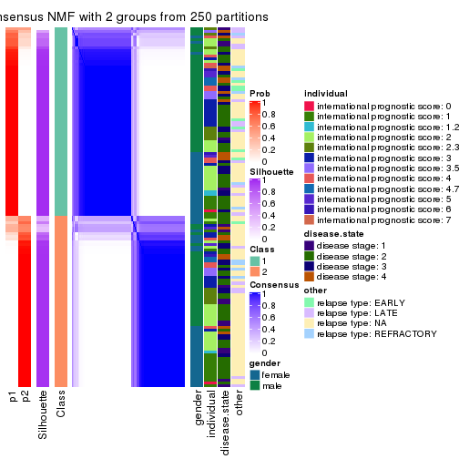</p>

</div>
<div id='tab-SD-NMF-consensus-heatmap-2'>
<pre><code class="r">consensus_heatmap(res, k = 3)
</code></pre>

<p>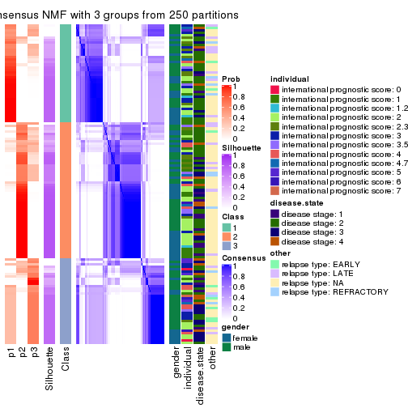</p>

</div>
<div id='tab-SD-NMF-consensus-heatmap-3'>
<pre><code class="r">consensus_heatmap(res, k = 4)
</code></pre>

<p>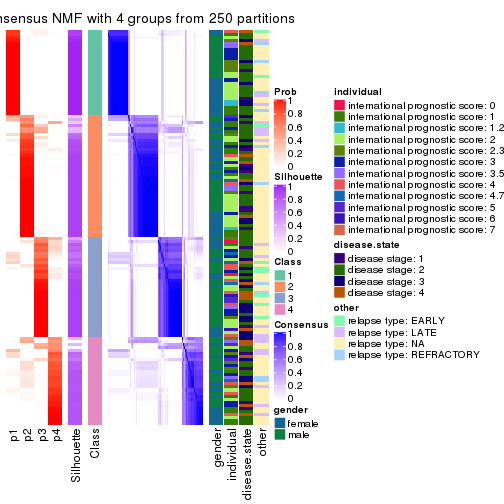</p>

</div>
<div id='tab-SD-NMF-consensus-heatmap-4'>
<pre><code class="r">consensus_heatmap(res, k = 5)
</code></pre>

<p>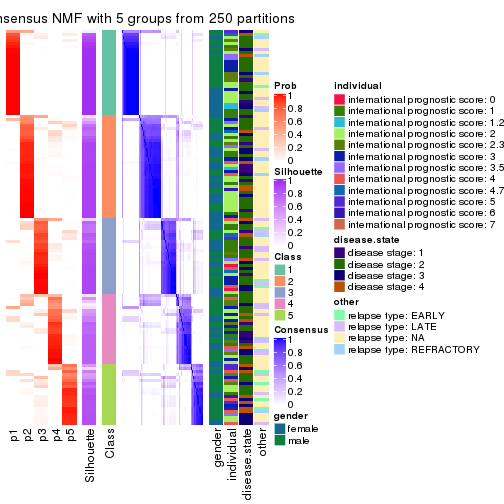</p>

</div>
<div id='tab-SD-NMF-consensus-heatmap-5'>
<pre><code class="r">consensus_heatmap(res, k = 6)
</code></pre>

<p>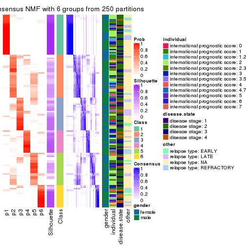</p>

</div>
</div>

Heatmaps for the membership of samples in all partitions to see how consistent they are:


<script>
$( function() {
	$( '#tabs-SD-NMF-membership-heatmap' ).tabs();
} );
</script>
<div id='tabs-SD-NMF-membership-heatmap'>
<ul>
<li><a href='#tab-SD-NMF-membership-heatmap-1'>k = 2</a></li>
<li><a href='#tab-SD-NMF-membership-heatmap-2'>k = 3</a></li>
<li><a href='#tab-SD-NMF-membership-heatmap-3'>k = 4</a></li>
<li><a href='#tab-SD-NMF-membership-heatmap-4'>k = 5</a></li>
<li><a href='#tab-SD-NMF-membership-heatmap-5'>k = 6</a></li>
</ul>
<div id='tab-SD-NMF-membership-heatmap-1'>
<pre><code class="r">membership_heatmap(res, k = 2)
</code></pre>

<p>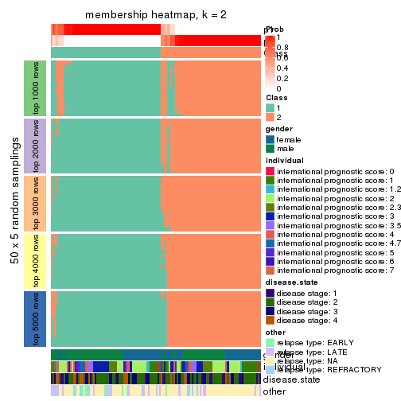</p>

</div>
<div id='tab-SD-NMF-membership-heatmap-2'>
<pre><code class="r">membership_heatmap(res, k = 3)
</code></pre>

<p>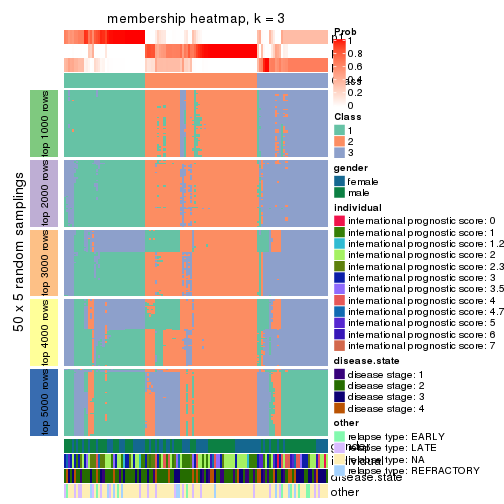</p>

</div>
<div id='tab-SD-NMF-membership-heatmap-3'>
<pre><code class="r">membership_heatmap(res, k = 4)
</code></pre>

<p>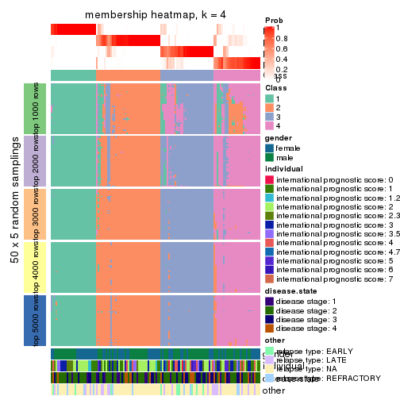</p>

</div>
<div id='tab-SD-NMF-membership-heatmap-4'>
<pre><code class="r">membership_heatmap(res, k = 5)
</code></pre>

<p>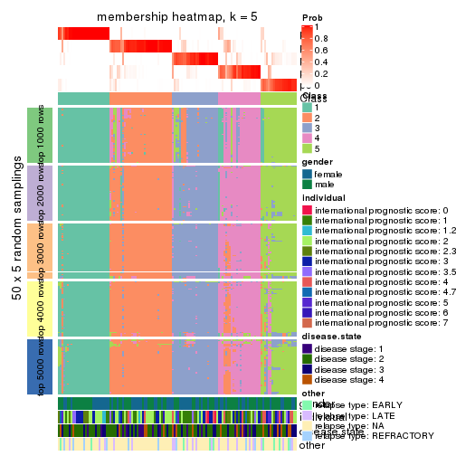</p>

</div>
<div id='tab-SD-NMF-membership-heatmap-5'>
<pre><code class="r">membership_heatmap(res, k = 6)
</code></pre>

<p>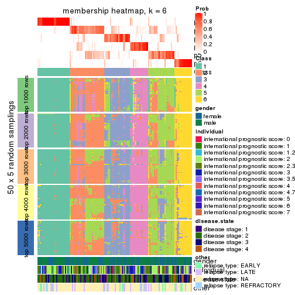</p>

</div>
</div>

As soon as we have had the classes for columns, we can look for signatures
which are significantly different between classes which can be candidate marks
for certain classes. Following are the heatmaps for signatures.


Signature heatmaps where rows are scaled:


<script>
$( function() {
	$( '#tabs-SD-NMF-get-signatures' ).tabs();
} );
</script>
<div id='tabs-SD-NMF-get-signatures'>
<ul>
<li><a href='#tab-SD-NMF-get-signatures-1'>k = 2</a></li>
<li><a href='#tab-SD-NMF-get-signatures-2'>k = 3</a></li>
<li><a href='#tab-SD-NMF-get-signatures-3'>k = 4</a></li>
<li><a href='#tab-SD-NMF-get-signatures-4'>k = 5</a></li>
<li><a href='#tab-SD-NMF-get-signatures-5'>k = 6</a></li>
</ul>
<div id='tab-SD-NMF-get-signatures-1'>
<pre><code class="r">get_signatures(res, k = 2)
</code></pre>

<p>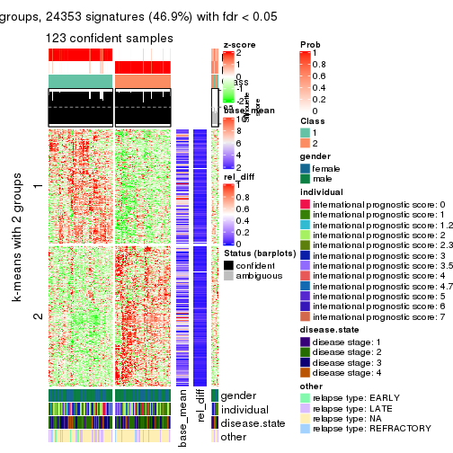</p>

</div>
<div id='tab-SD-NMF-get-signatures-2'>
<pre><code class="r">get_signatures(res, k = 3)
</code></pre>

<p>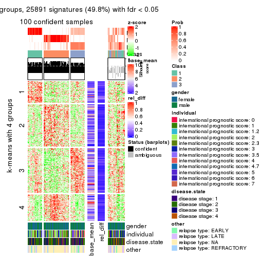</p>

</div>
<div id='tab-SD-NMF-get-signatures-3'>
<pre><code class="r">get_signatures(res, k = 4)
</code></pre>

<p>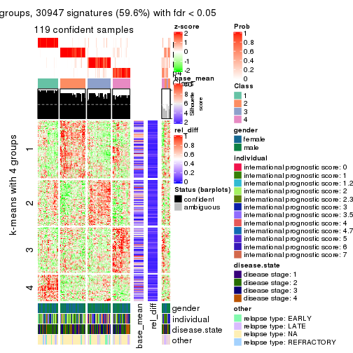</p>

</div>
<div id='tab-SD-NMF-get-signatures-4'>
<pre><code class="r">get_signatures(res, k = 5)
</code></pre>

<pre><code>#&gt; Error: The width or height of the raster image is zero, maybe you forget to turn off the
#&gt; previous graphic device or it was corrupted. Run `dev.off()` to close it.
</code></pre>

<p></p>

</div>
<div id='tab-SD-NMF-get-signatures-5'>
<pre><code class="r">get_signatures(res, k = 6)
</code></pre>

<pre><code>#&gt; Error: The width or height of the raster image is zero, maybe you forget to turn off the
#&gt; previous graphic device or it was corrupted. Run `dev.off()` to close it.
</code></pre>

<p></p>

</div>
</div>


Signature heatmaps where rows are not scaled:


<script>
$( function() {
	$( '#tabs-SD-NMF-get-signatures-no-scale' ).tabs();
} );
</script>
<div id='tabs-SD-NMF-get-signatures-no-scale'>
<ul>
<li><a href='#tab-SD-NMF-get-signatures-no-scale-1'>k = 2</a></li>
<li><a href='#tab-SD-NMF-get-signatures-no-scale-2'>k = 3</a></li>
<li><a href='#tab-SD-NMF-get-signatures-no-scale-3'>k = 4</a></li>
<li><a href='#tab-SD-NMF-get-signatures-no-scale-4'>k = 5</a></li>
<li><a href='#tab-SD-NMF-get-signatures-no-scale-5'>k = 6</a></li>
</ul>
<div id='tab-SD-NMF-get-signatures-no-scale-1'>
<pre><code class="r">get_signatures(res, k = 2, scale_rows = FALSE)
</code></pre>

<p>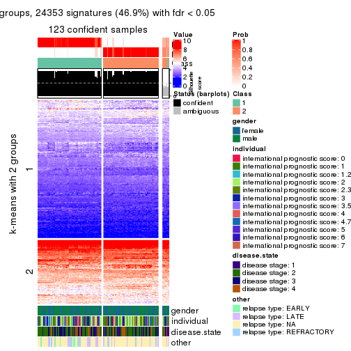</p>

</div>
<div id='tab-SD-NMF-get-signatures-no-scale-2'>
<pre><code class="r">get_signatures(res, k = 3, scale_rows = FALSE)
</code></pre>

<p>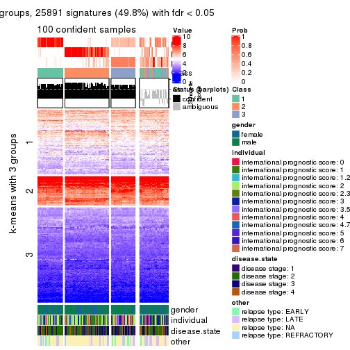</p>

</div>
<div id='tab-SD-NMF-get-signatures-no-scale-3'>
<pre><code class="r">get_signatures(res, k = 4, scale_rows = FALSE)
</code></pre>

<p>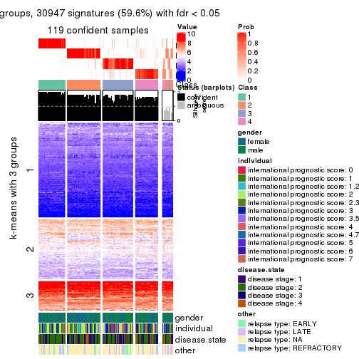</p>

</div>
<div id='tab-SD-NMF-get-signatures-no-scale-4'>
<pre><code class="r">get_signatures(res, k = 5, scale_rows = FALSE)
</code></pre>

<p>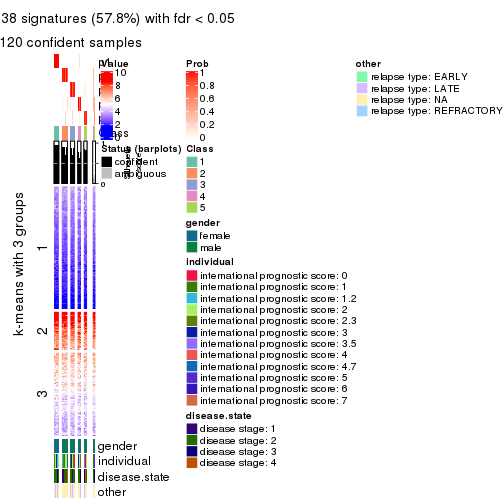</p>

</div>
<div id='tab-SD-NMF-get-signatures-no-scale-5'>
<pre><code class="r">get_signatures(res, k = 6, scale_rows = FALSE)
</code></pre>

<pre><code>#&gt; Error in mat[ceiling(1:nr/h_ratio), ceiling(1:nc/w_ratio), drop = FALSE]: subscript out of bounds
</code></pre>

<p>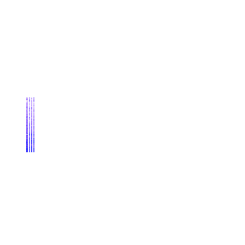</p>

</div>
</div>


Compare the overlap of signatures from different k:

```r
compare_signatures(res)
```

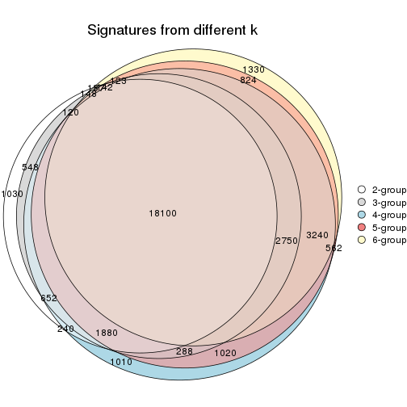

`get_signature()` returns a data frame invisibly. TO get the list of signatures, the function
call should be assigned to a variable explicitly. In following code, if `plot` argument is set
to `FALSE`, no heatmap is plotted while only the differential analysis is performed.

```r
# code only for demonstration
tb = get_signature(res, k = ..., plot = FALSE)
```

An example of the output of `tb` is:

```
#>   which_row         fdr    mean_1    mean_2 scaled_mean_1 scaled_mean_2 km
#> 1        38 0.042760348  8.373488  9.131774    -0.5533452     0.5164555  1
#> 2        40 0.018707592  7.106213  8.469186    -0.6173731     0.5762149  1
#> 3        55 0.019134737 10.221463 11.207825    -0.6159697     0.5749050  1
#> 4        59 0.006059896  5.921854  7.869574    -0.6899429     0.6439467  1
#> 5        60 0.018055526  8.928898 10.211722    -0.6204761     0.5791110  1
#> 6        98 0.009384629 15.714769 14.887706     0.6635654    -0.6193277  2
...
```

The columns in `tb` are:

1. `which_row`: row indices corresponding to the input matrix.
2. `fdr`: FDR for the differential test. 
3. `mean_x`: The mean value in group x.
4. `scaled_mean_x`: The mean value in group x after rows are scaled.
5. `km`: Row groups if k-means clustering is applied to rows.


UMAP plot which shows how samples are separated.


<script>
$( function() {
	$( '#tabs-SD-NMF-dimension-reduction' ).tabs();
} );
</script>
<div id='tabs-SD-NMF-dimension-reduction'>
<ul>
<li><a href='#tab-SD-NMF-dimension-reduction-1'>k = 2</a></li>
<li><a href='#tab-SD-NMF-dimension-reduction-2'>k = 3</a></li>
<li><a href='#tab-SD-NMF-dimension-reduction-3'>k = 4</a></li>
<li><a href='#tab-SD-NMF-dimension-reduction-4'>k = 5</a></li>
<li><a href='#tab-SD-NMF-dimension-reduction-5'>k = 6</a></li>
</ul>
<div id='tab-SD-NMF-dimension-reduction-1'>
<pre><code class="r">dimension_reduction(res, k = 2, method = &quot;UMAP&quot;)
</code></pre>

<p>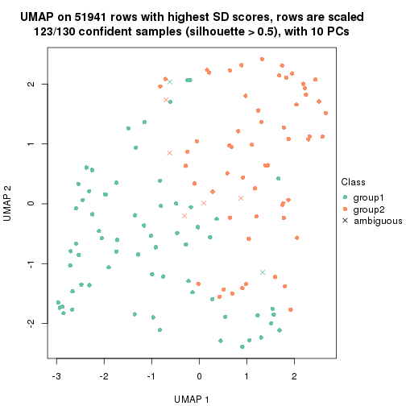</p>

</div>
<div id='tab-SD-NMF-dimension-reduction-2'>
<pre><code class="r">dimension_reduction(res, k = 3, method = &quot;UMAP&quot;)
</code></pre>

<p>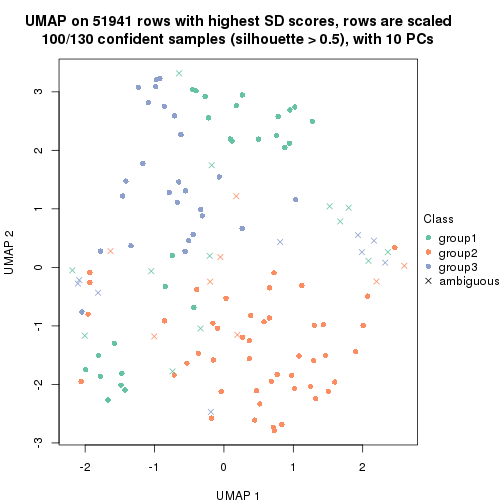</p>

</div>
<div id='tab-SD-NMF-dimension-reduction-3'>
<pre><code class="r">dimension_reduction(res, k = 4, method = &quot;UMAP&quot;)
</code></pre>

<p>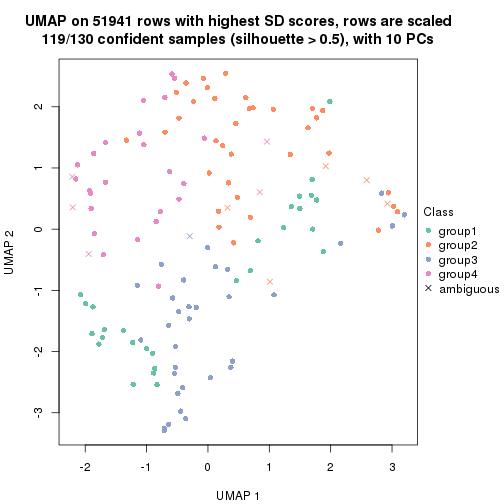</p>

</div>
<div id='tab-SD-NMF-dimension-reduction-4'>
<pre><code class="r">dimension_reduction(res, k = 5, method = &quot;UMAP&quot;)
</code></pre>

<p>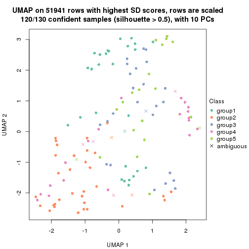</p>

</div>
<div id='tab-SD-NMF-dimension-reduction-5'>
<pre><code class="r">dimension_reduction(res, k = 6, method = &quot;UMAP&quot;)
</code></pre>

<p>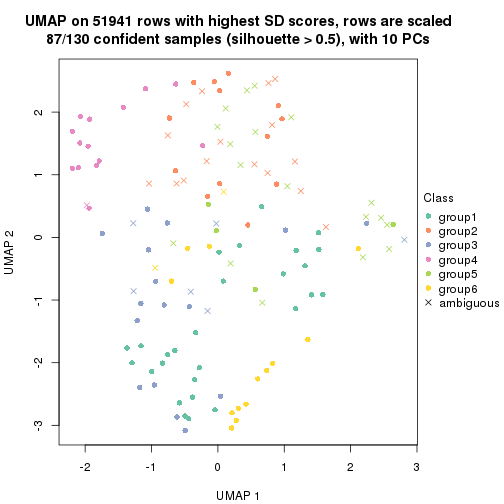</p>

</div>
</div>


Following heatmap shows how subgroups are split when increasing `k`:

```r
collect_classes(res)
```

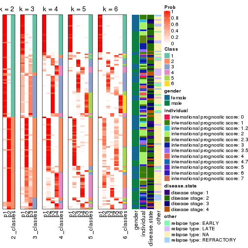


Test correlation between subgroups and known annotations. If the known
annotation is numeric, one-way ANOVA test is applied, and if the known
annotation is discrete, chi-squared contingency table test is applied.

```r
test_to_known_factors(res)
```

```
#>          n gender(p) individual(p) disease.state(p) other(p) k
#> SD:NMF 123     0.367        0.8283           0.2493   0.0725 2
#> SD:NMF 100     0.286        0.1997           0.0641   0.0620 3
#> SD:NMF 119     0.268        0.1286           0.2000   0.1713 4
#> SD:NMF 120     0.619        0.0774           0.1279   0.1701 5
#> SD:NMF  87     0.944        0.2416           0.2491   0.8012 6
```


If matrix rows can be associated to genes, consider to use `GO_Enrichment(res,
...)` to perform function enrichment for the signature genes.


 

---------------------------------------------------


### CV:hclust


The object with results only for a single top-value method and a single partition method 
can be extracted as:

```r
res = res_list["CV", "hclust"]
# you can also extract it by
# res = res_list["CV:hclust"]
```

A summary of `res` and all the functions that can be applied to it:

```r
res
```

```
#> A 'ConsensusPartition' object with k = 2, 3, 4, 5, 6.
#>   On a matrix with 51941 rows and 130 columns.
#>   Top rows (1000, 2000, 3000, 4000, 5000) are extracted by 'CV' method.
#>   Subgroups are detected by 'hclust' method.
#>   Performed in total 1250 partitions by row resampling.
#>   Best k for subgroups seems to be 2.
#> 
#> Following methods can be applied to this 'ConsensusPartition' object:
#>  [1] "cola_report"             "collect_classes"         "collect_plots"          
#>  [4] "collect_stats"           "colnames"                "compare_signatures"     
#>  [7] "consensus_heatmap"       "dimension_reduction"     "functional_enrichment"  
#> [10] "get_anno_col"            "get_anno"                "get_classes"            
#> [13] "get_consensus"           "get_matrix"              "get_membership"         
#> [16] "get_param"               "get_signatures"          "get_stats"              
#> [19] "is_best_k"               "is_stable_k"             "membership_heatmap"     
#> [22] "ncol"                    "nrow"                    "plot_ecdf"              
#> [25] "rownames"                "select_partition_number" "show"                   
#> [28] "suggest_best_k"          "test_to_known_factors"
```

`collect_plots()` function collects all the plots made from `res` for all `k` (number of partitions)
into one single page to provide an easy and fast comparison between different `k`.

```r
collect_plots(res)
```

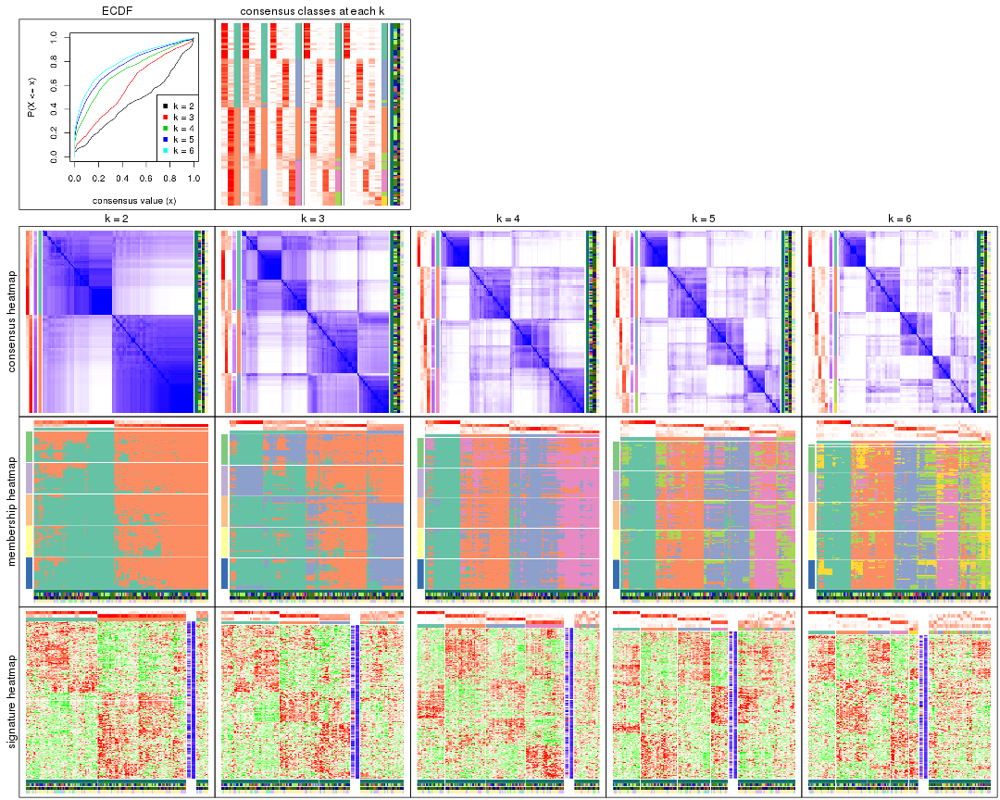

The plots are:

- The first row: a plot of the ECDF (Empirical cumulative distribution
  function) curves of the consensus matrix for each `k` and the heatmap of
  predicted classes for each `k`.
- The second row: heatmaps of the consensus matrix for each `k`.
- The third row: heatmaps of the membership matrix for each `k`.
- The fouth row: heatmaps of the signatures for each `k`.

All the plots in panels can be made by individual functions and they are
plotted later in this section.

`select_partition_number()` produces several plots showing different
statistics for choosing "optimized" `k`. There are following statistics:

- ECDF curves of the consensus matrix for each `k`;
- 1-PAC. [The PAC
  score](https://en.wikipedia.org/wiki/Consensus_clustering#Over-interpretation_potential_of_consensus_clustering)
  measures the proportion of the ambiguous subgrouping.
- Mean silhouette score.
- Concordance. The mean probability of fiting the consensus class ids in all
  partitions.
- Area increased. Denote $A_k$ as the area under the ECDF curve for current
  `k`, the area increased is defined as $A_k - A_{k-1}$.
- Rand index. The percent of pairs of samples that are both in a same cluster
  or both are not in a same cluster in the partition of k and k-1.
- Jaccard index. The ratio of pairs of samples are both in a same cluster in
  the partition of k and k-1 and the pairs of samples are both in a same
  cluster in the partition k or k-1.

The detailed explanations of these statistics can be found in [the cola
vignette](http://bioconductor.org/packages/devel/bioc/vignettes/cola/inst/doc/cola.html#toc_13).

Generally speaking, lower PAC score, higher mean silhouette score or higher
concordance corresponds to better partition. Rand index and Jaccard index
measure how similar the current partition is compared to partition with `k-1`.
If they are too similar, we won't accept `k` is better than `k-1`.

```r
select_partition_number(res)
```

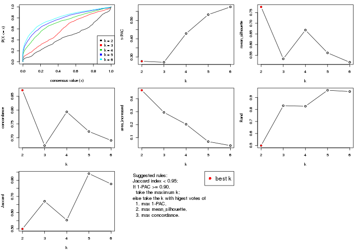

The numeric values for all these statistics can be obtained by `get_stats()`.

```r
get_stats(res)
```

```
#>   k 1-PAC mean_silhouette concordance area_increased  Rand Jaccard
#> 2 2 0.277           0.777       0.872         0.4650 0.499   0.499
#> 3 3 0.271           0.533       0.672         0.2944 0.831   0.670
#> 4 4 0.429           0.668       0.794         0.2029 0.827   0.554
#> 5 5 0.532           0.561       0.723         0.0691 0.960   0.841
#> 6 6 0.575           0.517       0.690         0.0383 0.949   0.777
```

`suggest_best_k()` suggests the best $k$ based on these statistics. The rules are as follows:

- All $k$ with Jaccard index larger than 0.95 are removed because the increase of
  the partition number does not provides enough extra information. If all $k$ are removed,
  the best $k$ is assigned by `NA`.
- For $k$ with 1-PAC larger than 0.9, the maximal $k$ is taken as the "best k". Other $k$ is called "optional k".
- If it does not fit the second rule. The $k$ with the highest vote of highest
  1-PAC, mean silhouette and concordance is taken as the "best k".

```r
suggest_best_k(res)
```

```
#> [1] 2
```


Following shows the table of the partitions (You need to click the **show/hide
code output** link to see it). The membership matrix (columns with name `p*`)
is inferred by
[`clue::cl_consensus()`](https://www.rdocumentation.org/link/cl_consensus?package=clue)
function with the `SE` method. Basically the value in the membership matrix
represents the probability to belong to a certain group. The finall class
label for an item is determined with the group with highest probability it
belongs to.

In `get_classes()` function, the entropy is calculated from the membership
matrix and the silhouette score is calculated from the consensus matrix.


<script>
$( function() {
	$( '#tabs-CV-hclust-get-classes' ).tabs();
} );
</script>
<div id='tabs-CV-hclust-get-classes'>
<ul>
<li><a href='#tab-CV-hclust-get-classes-1'>k = 2</a></li>
<li><a href='#tab-CV-hclust-get-classes-2'>k = 3</a></li>
<li><a href='#tab-CV-hclust-get-classes-3'>k = 4</a></li>
<li><a href='#tab-CV-hclust-get-classes-4'>k = 5</a></li>
<li><a href='#tab-CV-hclust-get-classes-5'>k = 6</a></li>
</ul>

<div id='tab-CV-hclust-get-classes-1'>
<p><a id='tab-CV-hclust-get-classes-1-a' style='color:#0366d6' href='#'>show/hide code output</a></p>
<pre><code class="r">cbind(get_classes(res, k = 2), get_membership(res, k = 2))
</code></pre>

<pre><code>#&gt;           class entropy silhouette    p1    p2
#&gt; GSM447671     2  0.6247      0.819 0.156 0.844
#&gt; GSM447694     1  0.8955      0.665 0.688 0.312
#&gt; GSM447618     2  0.6801      0.798 0.180 0.820
#&gt; GSM447691     2  0.6623      0.808 0.172 0.828
#&gt; GSM447733     2  0.5178      0.852 0.116 0.884
#&gt; GSM447620     2  0.7056      0.778 0.192 0.808
#&gt; GSM447627     2  0.7950      0.708 0.240 0.760
#&gt; GSM447630     1  0.9323      0.612 0.652 0.348
#&gt; GSM447642     1  0.0000      0.804 1.000 0.000
#&gt; GSM447649     2  0.0376      0.880 0.004 0.996
#&gt; GSM447654     2  0.0000      0.880 0.000 1.000
#&gt; GSM447655     2  0.0000      0.880 0.000 1.000
#&gt; GSM447669     1  0.9775      0.475 0.588 0.412
#&gt; GSM447676     1  0.0000      0.804 1.000 0.000
#&gt; GSM447678     2  0.4562      0.863 0.096 0.904
#&gt; GSM447681     2  0.1184      0.883 0.016 0.984
#&gt; GSM447698     2  0.4939      0.857 0.108 0.892
#&gt; GSM447713     1  0.0000      0.804 1.000 0.000
#&gt; GSM447722     2  0.4939      0.857 0.108 0.892
#&gt; GSM447726     1  0.9866      0.394 0.568 0.432
#&gt; GSM447735     2  0.7453      0.767 0.212 0.788
#&gt; GSM447737     1  0.1843      0.811 0.972 0.028
#&gt; GSM447657     2  0.1184      0.883 0.016 0.984
#&gt; GSM447674     2  0.1184      0.883 0.016 0.984
#&gt; GSM447636     1  0.0000      0.804 1.000 0.000
#&gt; GSM447723     1  0.9427      0.526 0.640 0.360
#&gt; GSM447699     2  0.9608      0.343 0.384 0.616
#&gt; GSM447708     2  0.7056      0.784 0.192 0.808
#&gt; GSM447721     1  0.2043      0.810 0.968 0.032
#&gt; GSM447623     1  0.0000      0.804 1.000 0.000
#&gt; GSM447621     1  0.0000      0.804 1.000 0.000
#&gt; GSM447650     2  0.1843      0.883 0.028 0.972
#&gt; GSM447651     2  0.2236      0.880 0.036 0.964
#&gt; GSM447653     2  0.2778      0.875 0.048 0.952
#&gt; GSM447658     1  0.0000      0.804 1.000 0.000
#&gt; GSM447675     2  0.0000      0.880 0.000 1.000
#&gt; GSM447680     2  0.4298      0.854 0.088 0.912
#&gt; GSM447686     2  0.8713      0.621 0.292 0.708
#&gt; GSM447736     1  0.9896      0.379 0.560 0.440
#&gt; GSM447629     2  0.7056      0.796 0.192 0.808
#&gt; GSM447648     1  0.4815      0.818 0.896 0.104
#&gt; GSM447660     1  0.5629      0.805 0.868 0.132
#&gt; GSM447661     2  0.0000      0.880 0.000 1.000
#&gt; GSM447663     1  0.9323      0.613 0.652 0.348
#&gt; GSM447704     2  0.0000      0.880 0.000 1.000
#&gt; GSM447720     1  0.9850      0.415 0.572 0.428
#&gt; GSM447652     2  0.3733      0.875 0.072 0.928
#&gt; GSM447679     2  0.1414      0.882 0.020 0.980
#&gt; GSM447712     1  0.0000      0.804 1.000 0.000
#&gt; GSM447664     2  0.0938      0.882 0.012 0.988
#&gt; GSM447637     1  0.5059      0.817 0.888 0.112
#&gt; GSM447639     2  0.7883      0.715 0.236 0.764
#&gt; GSM447615     1  0.4562      0.818 0.904 0.096
#&gt; GSM447656     2  0.7139      0.777 0.196 0.804
#&gt; GSM447673     2  0.0000      0.880 0.000 1.000
#&gt; GSM447719     2  0.3274      0.871 0.060 0.940
#&gt; GSM447706     1  0.4939      0.817 0.892 0.108
#&gt; GSM447612     2  0.9635      0.330 0.388 0.612
#&gt; GSM447665     2  0.6247      0.819 0.156 0.844
#&gt; GSM447677     2  0.1184      0.883 0.016 0.984
#&gt; GSM447613     1  0.0000      0.804 1.000 0.000
#&gt; GSM447659     2  0.5178      0.852 0.116 0.884
#&gt; GSM447662     1  0.5408      0.814 0.876 0.124
#&gt; GSM447666     1  0.7453      0.775 0.788 0.212
#&gt; GSM447668     2  0.0000      0.880 0.000 1.000
#&gt; GSM447682     2  0.6343      0.825 0.160 0.840
#&gt; GSM447683     2  0.1414      0.883 0.020 0.980
#&gt; GSM447688     2  0.0000      0.880 0.000 1.000
#&gt; GSM447702     2  0.0000      0.880 0.000 1.000
#&gt; GSM447709     2  0.5294      0.849 0.120 0.880
#&gt; GSM447711     1  0.0000      0.804 1.000 0.000
#&gt; GSM447715     1  0.9427      0.526 0.640 0.360
#&gt; GSM447693     1  0.5178      0.816 0.884 0.116
#&gt; GSM447611     2  0.1414      0.879 0.020 0.980
#&gt; GSM447672     2  0.0000      0.880 0.000 1.000
#&gt; GSM447703     2  0.0000      0.880 0.000 1.000
#&gt; GSM447727     1  0.9248      0.549 0.660 0.340
#&gt; GSM447638     1  0.7883      0.753 0.764 0.236
#&gt; GSM447670     1  0.3733      0.818 0.928 0.072
#&gt; GSM447700     2  0.6438      0.815 0.164 0.836
#&gt; GSM447738     2  0.0000      0.880 0.000 1.000
#&gt; GSM447739     1  0.0000      0.804 1.000 0.000
#&gt; GSM447617     1  0.0000      0.804 1.000 0.000
#&gt; GSM447628     2  0.0000      0.880 0.000 1.000
#&gt; GSM447632     2  0.0000      0.880 0.000 1.000
#&gt; GSM447619     1  0.5408      0.814 0.876 0.124
#&gt; GSM447643     1  0.9909      0.309 0.556 0.444
#&gt; GSM447724     2  0.7299      0.772 0.204 0.796
#&gt; GSM447728     2  0.5629      0.845 0.132 0.868
#&gt; GSM447610     2  0.5842      0.842 0.140 0.860
#&gt; GSM447633     2  0.6247      0.819 0.156 0.844
#&gt; GSM447634     1  0.9209      0.629 0.664 0.336
#&gt; GSM447622     1  0.4431      0.819 0.908 0.092
#&gt; GSM447667     2  0.8207      0.692 0.256 0.744
#&gt; GSM447687     2  0.0000      0.880 0.000 1.000
#&gt; GSM447695     1  0.8386      0.717 0.732 0.268
#&gt; GSM447696     1  0.0000      0.804 1.000 0.000
#&gt; GSM447697     1  0.0000      0.804 1.000 0.000
#&gt; GSM447714     1  0.8499      0.710 0.724 0.276
#&gt; GSM447717     1  0.0000      0.804 1.000 0.000
#&gt; GSM447725     1  0.0000      0.804 1.000 0.000
#&gt; GSM447729     2  0.1184      0.880 0.016 0.984
#&gt; GSM447644     1  0.9775      0.475 0.588 0.412
#&gt; GSM447710     1  0.7815      0.751 0.768 0.232
#&gt; GSM447614     2  0.5842      0.842 0.140 0.860
#&gt; GSM447685     2  0.5842      0.829 0.140 0.860
#&gt; GSM447690     1  0.0000      0.804 1.000 0.000
#&gt; GSM447730     2  0.0000      0.880 0.000 1.000
#&gt; GSM447646     2  0.0000      0.880 0.000 1.000
#&gt; GSM447689     1  0.8081      0.744 0.752 0.248
#&gt; GSM447635     2  0.8144      0.710 0.252 0.748
#&gt; GSM447641     1  0.0000      0.804 1.000 0.000
#&gt; GSM447716     2  0.7453      0.769 0.212 0.788
#&gt; GSM447718     2  0.9286      0.466 0.344 0.656
#&gt; GSM447616     1  0.4431      0.819 0.908 0.092
#&gt; GSM447626     1  0.5946      0.808 0.856 0.144
#&gt; GSM447640     2  0.0672      0.882 0.008 0.992
#&gt; GSM447734     1  0.9552      0.559 0.624 0.376
#&gt; GSM447692     1  0.7453      0.768 0.788 0.212
#&gt; GSM447647     2  0.0000      0.880 0.000 1.000
#&gt; GSM447624     1  0.3733      0.818 0.928 0.072
#&gt; GSM447625     1  0.9286      0.618 0.656 0.344
#&gt; GSM447707     2  0.0000      0.880 0.000 1.000
#&gt; GSM447732     1  0.9248      0.625 0.660 0.340
#&gt; GSM447684     1  0.6887      0.788 0.816 0.184
#&gt; GSM447731     2  0.2236      0.878 0.036 0.964
#&gt; GSM447705     1  0.9358      0.612 0.648 0.352
#&gt; GSM447631     1  0.5059      0.817 0.888 0.112
#&gt; GSM447701     2  0.3431      0.878 0.064 0.936
#&gt; GSM447645     1  0.5059      0.817 0.888 0.112
</code></pre>

<script>
$('#tab-CV-hclust-get-classes-1-a').parent().next().next().hide();
$('#tab-CV-hclust-get-classes-1-a').click(function(){
  $('#tab-CV-hclust-get-classes-1-a').parent().next().next().toggle();
  return(false);
});
</script>
</div>

<div id='tab-CV-hclust-get-classes-2'>
<p><a id='tab-CV-hclust-get-classes-2-a' style='color:#0366d6' href='#'>show/hide code output</a></p>
<pre><code class="r">cbind(get_classes(res, k = 3), get_membership(res, k = 3))
</code></pre>

<pre><code>#&gt;           class entropy silhouette    p1    p2    p3
#&gt; GSM447671     2  0.5304    0.60631 0.108 0.824 0.068
#&gt; GSM447694     1  0.9329    0.51884 0.436 0.164 0.400
#&gt; GSM447618     2  0.6526    0.56237 0.128 0.760 0.112
#&gt; GSM447691     2  0.7624    0.46261 0.104 0.672 0.224
#&gt; GSM447733     3  0.7582    0.60255 0.048 0.380 0.572
#&gt; GSM447620     2  0.6462    0.56629 0.120 0.764 0.116
#&gt; GSM447627     3  0.9086    0.34050 0.148 0.356 0.496
#&gt; GSM447630     1  0.9806    0.44182 0.432 0.292 0.276
#&gt; GSM447642     1  0.0000    0.66933 1.000 0.000 0.000
#&gt; GSM447649     3  0.6518    0.72540 0.004 0.484 0.512
#&gt; GSM447654     3  0.6295    0.72768 0.000 0.472 0.528
#&gt; GSM447655     2  0.0592    0.60126 0.000 0.988 0.012
#&gt; GSM447669     1  0.9928    0.32138 0.372 0.352 0.276
#&gt; GSM447676     1  0.0000    0.66933 1.000 0.000 0.000
#&gt; GSM447678     2  0.7932   -0.29162 0.064 0.552 0.384
#&gt; GSM447681     2  0.1832    0.61198 0.008 0.956 0.036
#&gt; GSM447698     2  0.7969   -0.25729 0.064 0.540 0.396
#&gt; GSM447713     1  0.0237    0.66997 0.996 0.000 0.004
#&gt; GSM447722     2  0.7969   -0.25729 0.064 0.540 0.396
#&gt; GSM447726     2  0.9959   -0.24841 0.324 0.376 0.300
#&gt; GSM447735     3  0.8936    0.42043 0.132 0.368 0.500
#&gt; GSM447737     1  0.2939    0.68051 0.916 0.012 0.072
#&gt; GSM447657     2  0.1832    0.61198 0.008 0.956 0.036
#&gt; GSM447674     2  0.1832    0.61198 0.008 0.956 0.036
#&gt; GSM447636     1  0.0000    0.66933 1.000 0.000 0.000
#&gt; GSM447723     1  0.7368    0.31542 0.604 0.352 0.044
#&gt; GSM447699     2  0.9926    0.00371 0.284 0.388 0.328
#&gt; GSM447708     2  0.6663    0.57203 0.124 0.752 0.124
#&gt; GSM447721     1  0.2681    0.67433 0.932 0.028 0.040
#&gt; GSM447623     1  0.1031    0.67471 0.976 0.000 0.024
#&gt; GSM447621     1  0.1031    0.67471 0.976 0.000 0.024
#&gt; GSM447650     2  0.2176    0.62986 0.020 0.948 0.032
#&gt; GSM447651     2  0.2400    0.62157 0.004 0.932 0.064
#&gt; GSM447653     3  0.6154    0.68497 0.000 0.408 0.592
#&gt; GSM447658     1  0.0000    0.66933 1.000 0.000 0.000
#&gt; GSM447675     3  0.6305    0.72494 0.000 0.484 0.516
#&gt; GSM447680     2  0.3692    0.60026 0.056 0.896 0.048
#&gt; GSM447686     2  0.6929    0.48831 0.260 0.688 0.052
#&gt; GSM447736     1  0.9949    0.26058 0.360 0.284 0.356
#&gt; GSM447629     2  0.7865    0.47238 0.124 0.660 0.216
#&gt; GSM447648     1  0.6813    0.67099 0.520 0.012 0.468
#&gt; GSM447660     1  0.4779    0.63555 0.840 0.124 0.036
#&gt; GSM447661     2  0.0892    0.61540 0.000 0.980 0.020
#&gt; GSM447663     1  0.9792    0.45008 0.436 0.288 0.276
#&gt; GSM447704     3  0.6307    0.72434 0.000 0.488 0.512
#&gt; GSM447720     3  0.9908   -0.39058 0.360 0.268 0.372
#&gt; GSM447652     2  0.4892    0.56697 0.048 0.840 0.112
#&gt; GSM447679     2  0.1529    0.62275 0.000 0.960 0.040
#&gt; GSM447712     1  0.0000    0.66933 1.000 0.000 0.000
#&gt; GSM447664     3  0.6678    0.71884 0.008 0.480 0.512
#&gt; GSM447637     1  0.7067    0.66881 0.512 0.020 0.468
#&gt; GSM447639     3  0.9207    0.27976 0.152 0.392 0.456
#&gt; GSM447615     1  0.6641    0.67744 0.544 0.008 0.448
#&gt; GSM447656     2  0.5777    0.58126 0.160 0.788 0.052
#&gt; GSM447673     3  0.6308    0.71912 0.000 0.492 0.508
#&gt; GSM447719     3  0.6111    0.66879 0.000 0.396 0.604
#&gt; GSM447706     1  0.6948    0.66850 0.512 0.016 0.472
#&gt; GSM447612     2  0.9885    0.03026 0.260 0.372 0.368
#&gt; GSM447665     2  0.5212    0.60883 0.108 0.828 0.064
#&gt; GSM447677     2  0.1289    0.62067 0.000 0.968 0.032
#&gt; GSM447613     1  0.0237    0.67012 0.996 0.000 0.004
#&gt; GSM447659     3  0.7582    0.60255 0.048 0.380 0.572
#&gt; GSM447662     1  0.7484    0.66487 0.504 0.036 0.460
#&gt; GSM447666     1  0.9098    0.62507 0.456 0.140 0.404
#&gt; GSM447668     2  0.0892    0.61540 0.000 0.980 0.020
#&gt; GSM447682     2  0.7835    0.38703 0.112 0.656 0.232
#&gt; GSM447683     2  0.1289    0.62470 0.000 0.968 0.032
#&gt; GSM447688     3  0.6309    0.71486 0.000 0.496 0.504
#&gt; GSM447702     2  0.0424    0.60340 0.000 0.992 0.008
#&gt; GSM447709     2  0.4475    0.62638 0.072 0.864 0.064
#&gt; GSM447711     1  0.0237    0.67054 0.996 0.000 0.004
#&gt; GSM447715     1  0.7368    0.31542 0.604 0.352 0.044
#&gt; GSM447693     1  0.7184    0.66548 0.504 0.024 0.472
#&gt; GSM447611     3  0.6944    0.72052 0.016 0.468 0.516
#&gt; GSM447672     2  0.0592    0.60126 0.000 0.988 0.012
#&gt; GSM447703     3  0.6309    0.71486 0.000 0.496 0.504
#&gt; GSM447727     1  0.7284    0.35046 0.620 0.336 0.044
#&gt; GSM447638     1  0.9256    0.62043 0.488 0.168 0.344
#&gt; GSM447670     1  0.6398    0.68486 0.580 0.004 0.416
#&gt; GSM447700     2  0.8550   -0.14045 0.096 0.492 0.412
#&gt; GSM447738     3  0.6305    0.72379 0.000 0.484 0.516
#&gt; GSM447739     1  0.0000    0.66933 1.000 0.000 0.000
#&gt; GSM447617     1  0.1529    0.67708 0.960 0.000 0.040
#&gt; GSM447628     3  0.6299    0.72648 0.000 0.476 0.524
#&gt; GSM447632     3  0.6307    0.72338 0.000 0.488 0.512
#&gt; GSM447619     1  0.7484    0.66487 0.504 0.036 0.460
#&gt; GSM447643     1  0.7549    0.10359 0.524 0.436 0.040
#&gt; GSM447724     2  0.8742   -0.08888 0.108 0.456 0.436
#&gt; GSM447728     2  0.5060    0.61108 0.100 0.836 0.064
#&gt; GSM447610     3  0.8482    0.61635 0.092 0.408 0.500
#&gt; GSM447633     2  0.5212    0.60883 0.108 0.828 0.064
#&gt; GSM447634     1  0.9872    0.46976 0.408 0.272 0.320
#&gt; GSM447622     1  0.6737    0.68763 0.600 0.016 0.384
#&gt; GSM447667     2  0.6933    0.53022 0.208 0.716 0.076
#&gt; GSM447687     3  0.6305    0.72379 0.000 0.484 0.516
#&gt; GSM447695     1  0.8971    0.59006 0.520 0.144 0.336
#&gt; GSM447696     1  0.0000    0.66933 1.000 0.000 0.000
#&gt; GSM447697     1  0.0237    0.67012 0.996 0.000 0.004
#&gt; GSM447714     1  0.9465    0.56551 0.444 0.184 0.372
#&gt; GSM447717     1  0.0000    0.66933 1.000 0.000 0.000
#&gt; GSM447725     1  0.0000    0.66933 1.000 0.000 0.000
#&gt; GSM447729     3  0.6948    0.72218 0.016 0.472 0.512
#&gt; GSM447644     1  0.9928    0.32138 0.372 0.352 0.276
#&gt; GSM447710     1  0.8983    0.61025 0.444 0.128 0.428
#&gt; GSM447614     3  0.8482    0.61635 0.092 0.408 0.500
#&gt; GSM447685     2  0.4920    0.60936 0.108 0.840 0.052
#&gt; GSM447690     1  0.0000    0.66933 1.000 0.000 0.000
#&gt; GSM447730     2  0.1289    0.58919 0.000 0.968 0.032
#&gt; GSM447646     3  0.6299    0.72648 0.000 0.476 0.524
#&gt; GSM447689     1  0.9300    0.59824 0.428 0.160 0.412
#&gt; GSM447635     2  0.8380    0.43219 0.124 0.600 0.276
#&gt; GSM447641     1  0.0000    0.66933 1.000 0.000 0.000
#&gt; GSM447716     2  0.8992    0.20047 0.176 0.552 0.272
#&gt; GSM447718     2  0.9150    0.33405 0.224 0.544 0.232
#&gt; GSM447616     1  0.6704    0.68804 0.608 0.016 0.376
#&gt; GSM447626     1  0.8220    0.66228 0.516 0.076 0.408
#&gt; GSM447640     2  0.0892    0.61978 0.000 0.980 0.020
#&gt; GSM447734     1  0.9786    0.40840 0.400 0.236 0.364
#&gt; GSM447692     1  0.8513    0.64012 0.596 0.140 0.264
#&gt; GSM447647     3  0.6307    0.72434 0.000 0.488 0.512
#&gt; GSM447624     1  0.6398    0.68486 0.580 0.004 0.416
#&gt; GSM447625     1  0.9809    0.44940 0.432 0.284 0.284
#&gt; GSM447707     2  0.1289    0.58919 0.000 0.968 0.032
#&gt; GSM447732     1  0.9777    0.45677 0.440 0.280 0.280
#&gt; GSM447684     1  0.8800    0.64322 0.488 0.116 0.396
#&gt; GSM447731     3  0.6235    0.70437 0.000 0.436 0.564
#&gt; GSM447705     3  0.9917   -0.55362 0.352 0.272 0.376
#&gt; GSM447631     1  0.7067    0.66881 0.512 0.020 0.468
#&gt; GSM447701     2  0.3356    0.63420 0.036 0.908 0.056
#&gt; GSM447645     1  0.7067    0.66881 0.512 0.020 0.468
</code></pre>

<script>
$('#tab-CV-hclust-get-classes-2-a').parent().next().next().hide();
$('#tab-CV-hclust-get-classes-2-a').click(function(){
  $('#tab-CV-hclust-get-classes-2-a').parent().next().next().toggle();
  return(false);
});
</script>
</div>

<div id='tab-CV-hclust-get-classes-3'>
<p><a id='tab-CV-hclust-get-classes-3-a' style='color:#0366d6' href='#'>show/hide code output</a></p>
<pre><code class="r">cbind(get_classes(res, k = 4), get_membership(res, k = 4))
</code></pre>

<pre><code>#&gt;           class entropy silhouette    p1    p2    p3    p4
#&gt; GSM447671     2  0.5143     0.7001 0.000 0.752 0.172 0.076
#&gt; GSM447694     3  0.6683     0.6568 0.060 0.064 0.680 0.196
#&gt; GSM447618     2  0.7651     0.5131 0.016 0.540 0.184 0.260
#&gt; GSM447691     2  0.7855     0.4868 0.032 0.540 0.160 0.268
#&gt; GSM447733     4  0.4149     0.7355 0.000 0.036 0.152 0.812
#&gt; GSM447620     2  0.5496     0.6472 0.000 0.704 0.232 0.064
#&gt; GSM447627     4  0.5767     0.5438 0.000 0.060 0.280 0.660
#&gt; GSM447630     3  0.5783     0.6694 0.000 0.172 0.708 0.120
#&gt; GSM447642     1  0.0188     0.8597 0.996 0.000 0.004 0.000
#&gt; GSM447649     4  0.3444     0.7542 0.000 0.184 0.000 0.816
#&gt; GSM447654     4  0.2466     0.7776 0.000 0.096 0.004 0.900
#&gt; GSM447655     2  0.1474     0.7543 0.000 0.948 0.000 0.052
#&gt; GSM447669     3  0.6344     0.5981 0.000 0.224 0.648 0.128
#&gt; GSM447676     1  0.0469     0.8595 0.988 0.000 0.012 0.000
#&gt; GSM447678     4  0.5944     0.5910 0.000 0.212 0.104 0.684
#&gt; GSM447681     2  0.2843     0.7538 0.000 0.892 0.020 0.088
#&gt; GSM447698     4  0.6448     0.5272 0.000 0.252 0.120 0.628
#&gt; GSM447713     1  0.0188     0.8599 0.996 0.000 0.004 0.000
#&gt; GSM447722     4  0.6448     0.5272 0.000 0.252 0.120 0.628
#&gt; GSM447726     3  0.6853     0.3597 0.040 0.360 0.560 0.040
#&gt; GSM447735     4  0.5615     0.6458 0.020 0.044 0.212 0.724
#&gt; GSM447737     1  0.4444     0.7130 0.788 0.008 0.184 0.020
#&gt; GSM447657     2  0.2973     0.7551 0.000 0.884 0.020 0.096
#&gt; GSM447674     2  0.2973     0.7551 0.000 0.884 0.020 0.096
#&gt; GSM447636     1  0.0188     0.8597 0.996 0.000 0.004 0.000
#&gt; GSM447723     1  0.7743     0.3642 0.544 0.312 0.072 0.072
#&gt; GSM447699     4  0.7569     0.0417 0.008 0.148 0.412 0.432
#&gt; GSM447708     2  0.7155     0.6113 0.020 0.620 0.184 0.176
#&gt; GSM447721     1  0.3058     0.8271 0.900 0.020 0.056 0.024
#&gt; GSM447623     1  0.2081     0.8232 0.916 0.000 0.084 0.000
#&gt; GSM447621     1  0.2081     0.8232 0.916 0.000 0.084 0.000
#&gt; GSM447650     2  0.2500     0.7690 0.000 0.916 0.040 0.044
#&gt; GSM447651     2  0.2623     0.7647 0.000 0.908 0.064 0.028
#&gt; GSM447653     4  0.2596     0.7714 0.000 0.024 0.068 0.908
#&gt; GSM447658     1  0.0469     0.8595 0.988 0.000 0.012 0.000
#&gt; GSM447675     4  0.1824     0.7753 0.000 0.060 0.004 0.936
#&gt; GSM447680     2  0.3902     0.7285 0.048 0.864 0.028 0.060
#&gt; GSM447686     2  0.7316     0.5519 0.224 0.620 0.044 0.112
#&gt; GSM447736     3  0.7022     0.5641 0.008 0.176 0.608 0.208
#&gt; GSM447629     2  0.7855     0.5343 0.056 0.568 0.124 0.252
#&gt; GSM447648     3  0.0657     0.7518 0.012 0.000 0.984 0.004
#&gt; GSM447660     1  0.4745     0.7612 0.820 0.080 0.032 0.068
#&gt; GSM447661     2  0.1677     0.7612 0.000 0.948 0.012 0.040
#&gt; GSM447663     3  0.5758     0.6787 0.000 0.160 0.712 0.128
#&gt; GSM447704     4  0.3486     0.7535 0.000 0.188 0.000 0.812
#&gt; GSM447720     3  0.6833     0.5921 0.008 0.156 0.628 0.208
#&gt; GSM447652     2  0.6280     0.4947 0.000 0.612 0.084 0.304
#&gt; GSM447679     2  0.2882     0.7542 0.000 0.892 0.024 0.084
#&gt; GSM447712     1  0.0188     0.8596 0.996 0.000 0.000 0.004
#&gt; GSM447664     4  0.2597     0.7713 0.008 0.084 0.004 0.904
#&gt; GSM447637     3  0.0712     0.7540 0.008 0.004 0.984 0.004
#&gt; GSM447639     4  0.6293     0.5269 0.000 0.096 0.276 0.628
#&gt; GSM447615     3  0.2149     0.7312 0.088 0.000 0.912 0.000
#&gt; GSM447656     2  0.6170     0.6724 0.124 0.736 0.060 0.080
#&gt; GSM447673     4  0.2125     0.7760 0.000 0.076 0.004 0.920
#&gt; GSM447719     4  0.3176     0.7664 0.000 0.036 0.084 0.880
#&gt; GSM447706     3  0.0000     0.7528 0.000 0.000 1.000 0.000
#&gt; GSM447612     3  0.7526     0.0354 0.000 0.188 0.440 0.372
#&gt; GSM447665     2  0.4746     0.7108 0.000 0.776 0.168 0.056
#&gt; GSM447677     2  0.2466     0.7641 0.000 0.916 0.028 0.056
#&gt; GSM447613     1  0.0188     0.8596 0.996 0.000 0.004 0.000
#&gt; GSM447659     4  0.4149     0.7355 0.000 0.036 0.152 0.812
#&gt; GSM447662     3  0.0707     0.7565 0.000 0.020 0.980 0.000
#&gt; GSM447666     3  0.2760     0.7224 0.000 0.128 0.872 0.000
#&gt; GSM447668     2  0.1584     0.7595 0.000 0.952 0.012 0.036
#&gt; GSM447682     2  0.7758     0.3549 0.028 0.520 0.136 0.316
#&gt; GSM447683     2  0.2256     0.7630 0.000 0.924 0.020 0.056
#&gt; GSM447688     4  0.3444     0.7537 0.000 0.184 0.000 0.816
#&gt; GSM447702     2  0.1474     0.7559 0.000 0.948 0.000 0.052
#&gt; GSM447709     2  0.4312     0.7392 0.000 0.812 0.132 0.056
#&gt; GSM447711     1  0.0921     0.8531 0.972 0.000 0.028 0.000
#&gt; GSM447715     1  0.7743     0.3642 0.544 0.312 0.072 0.072
#&gt; GSM447693     3  0.0712     0.7548 0.004 0.008 0.984 0.004
#&gt; GSM447611     4  0.1732     0.7651 0.008 0.040 0.004 0.948
#&gt; GSM447672     2  0.1637     0.7553 0.000 0.940 0.000 0.060
#&gt; GSM447703     4  0.3444     0.7537 0.000 0.184 0.000 0.816
#&gt; GSM447727     1  0.7686     0.3933 0.556 0.300 0.080 0.064
#&gt; GSM447638     3  0.6852     0.5363 0.208 0.172 0.616 0.004
#&gt; GSM447670     3  0.3142     0.6960 0.132 0.008 0.860 0.000
#&gt; GSM447700     4  0.7140     0.4350 0.000 0.236 0.204 0.560
#&gt; GSM447738     4  0.3311     0.7636 0.000 0.172 0.000 0.828
#&gt; GSM447739     1  0.0000     0.8595 1.000 0.000 0.000 0.000
#&gt; GSM447617     1  0.2704     0.7932 0.876 0.000 0.124 0.000
#&gt; GSM447628     4  0.2704     0.7693 0.000 0.124 0.000 0.876
#&gt; GSM447632     4  0.3257     0.7660 0.000 0.152 0.004 0.844
#&gt; GSM447619     3  0.0707     0.7565 0.000 0.020 0.980 0.000
#&gt; GSM447643     1  0.8145     0.0811 0.448 0.392 0.092 0.068
#&gt; GSM447724     4  0.7518     0.3642 0.000 0.244 0.260 0.496
#&gt; GSM447728     2  0.5612     0.7242 0.016 0.752 0.132 0.100
#&gt; GSM447610     4  0.4268     0.7429 0.032 0.032 0.096 0.840
#&gt; GSM447633     2  0.4746     0.7108 0.000 0.776 0.168 0.056
#&gt; GSM447634     3  0.5912     0.6824 0.008 0.164 0.716 0.112
#&gt; GSM447622     3  0.4948     0.4704 0.288 0.012 0.696 0.004
#&gt; GSM447667     2  0.7552     0.6197 0.152 0.636 0.088 0.124
#&gt; GSM447687     4  0.3311     0.7636 0.000 0.172 0.000 0.828
#&gt; GSM447695     3  0.8176     0.4670 0.260 0.044 0.520 0.176
#&gt; GSM447696     1  0.0000     0.8595 1.000 0.000 0.000 0.000
#&gt; GSM447697     1  0.0188     0.8596 0.996 0.000 0.004 0.000
#&gt; GSM447714     3  0.4344     0.7369 0.000 0.108 0.816 0.076
#&gt; GSM447717     1  0.0188     0.8597 0.996 0.000 0.004 0.000
#&gt; GSM447725     1  0.0000     0.8595 1.000 0.000 0.000 0.000
#&gt; GSM447729     4  0.1635     0.7656 0.008 0.044 0.000 0.948
#&gt; GSM447644     3  0.6344     0.5981 0.000 0.224 0.648 0.128
#&gt; GSM447710     3  0.3333     0.7530 0.000 0.088 0.872 0.040
#&gt; GSM447614     4  0.4268     0.7429 0.032 0.032 0.096 0.840
#&gt; GSM447685     2  0.5163     0.7079 0.096 0.796 0.036 0.072
#&gt; GSM447690     1  0.0000     0.8595 1.000 0.000 0.000 0.000
#&gt; GSM447730     2  0.3764     0.6489 0.000 0.784 0.000 0.216
#&gt; GSM447646     4  0.2704     0.7693 0.000 0.124 0.000 0.876
#&gt; GSM447689     3  0.3441     0.7453 0.000 0.120 0.856 0.024
#&gt; GSM447635     2  0.8407     0.4822 0.056 0.508 0.188 0.248
#&gt; GSM447641     1  0.0469     0.8595 0.988 0.000 0.012 0.000
#&gt; GSM447716     2  0.8452     0.2430 0.100 0.448 0.088 0.364
#&gt; GSM447718     2  0.8375     0.1088 0.032 0.404 0.372 0.192
#&gt; GSM447616     3  0.5377     0.2615 0.376 0.012 0.608 0.004
#&gt; GSM447626     3  0.2602     0.7546 0.008 0.076 0.908 0.008
#&gt; GSM447640     2  0.2706     0.7648 0.000 0.900 0.020 0.080
#&gt; GSM447734     3  0.5900     0.6325 0.000 0.096 0.684 0.220
#&gt; GSM447692     1  0.8056    -0.1408 0.420 0.040 0.416 0.124
#&gt; GSM447647     4  0.3486     0.7535 0.000 0.188 0.000 0.812
#&gt; GSM447624     3  0.3401     0.6746 0.152 0.008 0.840 0.000
#&gt; GSM447625     3  0.5722     0.6803 0.000 0.148 0.716 0.136
#&gt; GSM447707     2  0.3764     0.6489 0.000 0.784 0.000 0.216
#&gt; GSM447732     3  0.5677     0.6845 0.000 0.140 0.720 0.140
#&gt; GSM447684     3  0.3625     0.7399 0.024 0.120 0.852 0.004
#&gt; GSM447731     4  0.2996     0.7801 0.000 0.064 0.044 0.892
#&gt; GSM447705     3  0.4986     0.6725 0.000 0.216 0.740 0.044
#&gt; GSM447631     3  0.0712     0.7540 0.008 0.004 0.984 0.004
#&gt; GSM447701     2  0.3301     0.7678 0.000 0.876 0.076 0.048
#&gt; GSM447645     3  0.0712     0.7540 0.008 0.004 0.984 0.004
</code></pre>

<script>
$('#tab-CV-hclust-get-classes-3-a').parent().next().next().hide();
$('#tab-CV-hclust-get-classes-3-a').click(function(){
  $('#tab-CV-hclust-get-classes-3-a').parent().next().next().toggle();
  return(false);
});
</script>
</div>

<div id='tab-CV-hclust-get-classes-4'>
<p><a id='tab-CV-hclust-get-classes-4-a' style='color:#0366d6' href='#'>show/hide code output</a></p>
<pre><code class="r">cbind(get_classes(res, k = 5), get_membership(res, k = 5))
</code></pre>

<pre><code>#&gt;           class entropy silhouette    p1    p2    p3    p4    p5
#&gt; GSM447671     2  0.5376     0.6432 0.000 0.724 0.104 0.040 0.132
#&gt; GSM447694     3  0.6634     0.4970 0.048 0.020 0.544 0.048 0.340
#&gt; GSM447618     2  0.7996     0.3673 0.016 0.472 0.084 0.196 0.232
#&gt; GSM447691     2  0.8041     0.3347 0.028 0.444 0.064 0.164 0.300
#&gt; GSM447733     5  0.5681     0.3990 0.000 0.024 0.036 0.424 0.516
#&gt; GSM447620     2  0.5505     0.6116 0.000 0.696 0.180 0.028 0.096
#&gt; GSM447627     5  0.6684     0.4423 0.000 0.024 0.132 0.360 0.484
#&gt; GSM447630     3  0.6512     0.5790 0.000 0.124 0.620 0.064 0.192
#&gt; GSM447642     1  0.0451     0.8509 0.988 0.000 0.000 0.004 0.008
#&gt; GSM447649     4  0.3687     0.6366 0.000 0.180 0.000 0.792 0.028
#&gt; GSM447654     4  0.3255     0.6102 0.000 0.100 0.000 0.848 0.052
#&gt; GSM447655     2  0.0771     0.7244 0.000 0.976 0.000 0.020 0.004
#&gt; GSM447669     3  0.7103     0.5092 0.000 0.168 0.548 0.068 0.216
#&gt; GSM447676     1  0.0671     0.8507 0.980 0.000 0.000 0.004 0.016
#&gt; GSM447678     4  0.6370     0.0275 0.000 0.172 0.008 0.548 0.272
#&gt; GSM447681     2  0.2214     0.7205 0.000 0.916 0.004 0.052 0.028
#&gt; GSM447698     4  0.6915    -0.0485 0.000 0.188 0.020 0.468 0.324
#&gt; GSM447713     1  0.0162     0.8520 0.996 0.000 0.000 0.000 0.004
#&gt; GSM447722     4  0.6915    -0.0485 0.000 0.188 0.020 0.468 0.324
#&gt; GSM447726     3  0.7272     0.3424 0.020 0.296 0.504 0.028 0.152
#&gt; GSM447735     5  0.5915     0.4049 0.012 0.012 0.048 0.388 0.540
#&gt; GSM447737     1  0.4422     0.7244 0.772 0.000 0.120 0.004 0.104
#&gt; GSM447657     2  0.2484     0.7208 0.000 0.900 0.004 0.068 0.028
#&gt; GSM447674     2  0.2484     0.7208 0.000 0.900 0.004 0.068 0.028
#&gt; GSM447636     1  0.0451     0.8509 0.988 0.000 0.000 0.004 0.008
#&gt; GSM447723     1  0.7793     0.3848 0.516 0.224 0.044 0.044 0.172
#&gt; GSM447699     5  0.8173     0.3140 0.008 0.088 0.248 0.260 0.396
#&gt; GSM447708     2  0.7552     0.5012 0.016 0.532 0.092 0.116 0.244
#&gt; GSM447721     1  0.2878     0.8165 0.888 0.000 0.048 0.016 0.048
#&gt; GSM447623     1  0.2208     0.8172 0.908 0.000 0.072 0.000 0.020
#&gt; GSM447621     1  0.2208     0.8172 0.908 0.000 0.072 0.000 0.020
#&gt; GSM447650     2  0.1651     0.7325 0.000 0.944 0.012 0.008 0.036
#&gt; GSM447651     2  0.2459     0.7261 0.000 0.904 0.052 0.004 0.040
#&gt; GSM447653     5  0.5201     0.3160 0.000 0.012 0.024 0.416 0.548
#&gt; GSM447658     1  0.0671     0.8507 0.980 0.000 0.000 0.004 0.016
#&gt; GSM447675     4  0.3192     0.5246 0.000 0.040 0.000 0.848 0.112
#&gt; GSM447680     2  0.4517     0.6743 0.024 0.776 0.004 0.040 0.156
#&gt; GSM447686     2  0.7486     0.4485 0.196 0.500 0.004 0.064 0.236
#&gt; GSM447736     3  0.7625     0.3609 0.004 0.116 0.488 0.116 0.276
#&gt; GSM447629     2  0.7789     0.3911 0.044 0.452 0.024 0.176 0.304
#&gt; GSM447648     3  0.1877     0.6742 0.012 0.000 0.924 0.000 0.064
#&gt; GSM447660     1  0.3964     0.7379 0.796 0.012 0.000 0.032 0.160
#&gt; GSM447661     2  0.0867     0.7280 0.000 0.976 0.008 0.008 0.008
#&gt; GSM447663     3  0.6469     0.5847 0.000 0.104 0.620 0.068 0.208
#&gt; GSM447704     4  0.3621     0.6384 0.000 0.192 0.000 0.788 0.020
#&gt; GSM447720     3  0.7420     0.3946 0.004 0.088 0.508 0.124 0.276
#&gt; GSM447652     2  0.6092     0.4838 0.000 0.608 0.028 0.268 0.096
#&gt; GSM447679     2  0.3599     0.7061 0.000 0.832 0.004 0.060 0.104
#&gt; GSM447712     1  0.0162     0.8519 0.996 0.000 0.000 0.000 0.004
#&gt; GSM447664     4  0.3823     0.4826 0.004 0.048 0.000 0.808 0.140
#&gt; GSM447637     3  0.1764     0.6765 0.008 0.000 0.928 0.000 0.064
#&gt; GSM447639     5  0.7184     0.4218 0.000 0.056 0.132 0.364 0.448
#&gt; GSM447615     3  0.2448     0.6552 0.088 0.000 0.892 0.000 0.020
#&gt; GSM447656     2  0.6446     0.5961 0.104 0.636 0.008 0.052 0.200
#&gt; GSM447673     4  0.3215     0.5471 0.000 0.056 0.000 0.852 0.092
#&gt; GSM447719     5  0.5036     0.3085 0.000 0.000 0.036 0.404 0.560
#&gt; GSM447706     3  0.0290     0.6796 0.000 0.000 0.992 0.000 0.008
#&gt; GSM447612     5  0.8292     0.2088 0.000 0.152 0.288 0.200 0.360
#&gt; GSM447665     2  0.4657     0.6641 0.000 0.768 0.104 0.016 0.112
#&gt; GSM447677     2  0.2072     0.7312 0.000 0.928 0.020 0.016 0.036
#&gt; GSM447613     1  0.0324     0.8520 0.992 0.000 0.004 0.000 0.004
#&gt; GSM447659     5  0.5681     0.3990 0.000 0.024 0.036 0.424 0.516
#&gt; GSM447662     3  0.0693     0.6855 0.000 0.012 0.980 0.000 0.008
#&gt; GSM447666     3  0.2959     0.6538 0.000 0.100 0.864 0.000 0.036
#&gt; GSM447668     2  0.0740     0.7266 0.000 0.980 0.008 0.008 0.004
#&gt; GSM447682     2  0.7941     0.2681 0.028 0.452 0.048 0.280 0.192
#&gt; GSM447683     2  0.3105     0.7198 0.000 0.864 0.004 0.044 0.088
#&gt; GSM447688     4  0.3003     0.6436 0.000 0.188 0.000 0.812 0.000
#&gt; GSM447702     2  0.0771     0.7237 0.000 0.976 0.000 0.020 0.004
#&gt; GSM447709     2  0.4028     0.6952 0.000 0.816 0.084 0.016 0.084
#&gt; GSM447711     1  0.0955     0.8448 0.968 0.000 0.028 0.000 0.004
#&gt; GSM447715     1  0.7793     0.3848 0.516 0.224 0.044 0.044 0.172
#&gt; GSM447693     3  0.1357     0.6785 0.004 0.000 0.948 0.000 0.048
#&gt; GSM447611     4  0.3280     0.4006 0.004 0.004 0.000 0.808 0.184
#&gt; GSM447672     2  0.0955     0.7241 0.000 0.968 0.000 0.028 0.004
#&gt; GSM447703     4  0.3003     0.6436 0.000 0.188 0.000 0.812 0.000
#&gt; GSM447727     1  0.7753     0.4157 0.532 0.216 0.052 0.044 0.156
#&gt; GSM447638     3  0.6810     0.4901 0.200 0.140 0.600 0.008 0.052
#&gt; GSM447670     3  0.3099     0.6332 0.124 0.000 0.848 0.000 0.028
#&gt; GSM447700     4  0.7745    -0.2468 0.000 0.172 0.084 0.376 0.368
#&gt; GSM447738     4  0.3132     0.6516 0.000 0.172 0.000 0.820 0.008
#&gt; GSM447739     1  0.0000     0.8515 1.000 0.000 0.000 0.000 0.000
#&gt; GSM447617     1  0.2932     0.7893 0.864 0.000 0.104 0.000 0.032
#&gt; GSM447628     4  0.3229     0.6226 0.000 0.128 0.000 0.840 0.032
#&gt; GSM447632     4  0.2873     0.6321 0.000 0.128 0.000 0.856 0.016
#&gt; GSM447619     3  0.0693     0.6855 0.000 0.012 0.980 0.000 0.008
#&gt; GSM447643     1  0.8202     0.1216 0.424 0.304 0.060 0.036 0.176
#&gt; GSM447724     5  0.8174     0.2080 0.000 0.200 0.128 0.308 0.364
#&gt; GSM447728     2  0.5814     0.6650 0.016 0.704 0.056 0.056 0.168
#&gt; GSM447610     5  0.4972     0.2943 0.020 0.004 0.000 0.476 0.500
#&gt; GSM447633     2  0.4657     0.6641 0.000 0.768 0.104 0.016 0.112
#&gt; GSM447634     3  0.6369     0.5953 0.004 0.100 0.620 0.044 0.232
#&gt; GSM447622     3  0.5096     0.4618 0.272 0.000 0.656 0.000 0.072
#&gt; GSM447667     2  0.7365     0.5023 0.128 0.520 0.008 0.072 0.272
#&gt; GSM447687     4  0.3132     0.6516 0.000 0.172 0.000 0.820 0.008
#&gt; GSM447695     3  0.7721     0.2880 0.248 0.008 0.396 0.040 0.308
#&gt; GSM447696     1  0.0000     0.8515 1.000 0.000 0.000 0.000 0.000
#&gt; GSM447697     1  0.0324     0.8520 0.992 0.000 0.004 0.000 0.004
#&gt; GSM447714     3  0.5155     0.6443 0.000 0.060 0.720 0.032 0.188
#&gt; GSM447717     1  0.0162     0.8513 0.996 0.000 0.000 0.000 0.004
#&gt; GSM447725     1  0.0000     0.8515 1.000 0.000 0.000 0.000 0.000
#&gt; GSM447729     4  0.3365     0.4070 0.004 0.008 0.000 0.808 0.180
#&gt; GSM447644     3  0.7103     0.5092 0.000 0.168 0.548 0.068 0.216
#&gt; GSM447710     3  0.4268     0.6689 0.000 0.044 0.776 0.012 0.168
#&gt; GSM447614     5  0.4972     0.2943 0.020 0.004 0.000 0.476 0.500
#&gt; GSM447685     2  0.5776     0.6376 0.076 0.700 0.004 0.060 0.160
#&gt; GSM447690     1  0.0000     0.8515 1.000 0.000 0.000 0.000 0.000
#&gt; GSM447730     2  0.3246     0.6358 0.000 0.808 0.000 0.184 0.008
#&gt; GSM447646     4  0.3229     0.6226 0.000 0.128 0.000 0.840 0.032
#&gt; GSM447689     3  0.4353     0.6754 0.000 0.072 0.784 0.012 0.132
#&gt; GSM447635     2  0.8617     0.3108 0.044 0.400 0.088 0.184 0.284
#&gt; GSM447641     1  0.0671     0.8507 0.980 0.000 0.000 0.004 0.016
#&gt; GSM447716     5  0.7879    -0.1475 0.076 0.320 0.004 0.196 0.404
#&gt; GSM447718     2  0.8949     0.0434 0.028 0.336 0.268 0.164 0.204
#&gt; GSM447616     3  0.5509     0.2625 0.360 0.000 0.564 0.000 0.076
#&gt; GSM447626     3  0.2678     0.6840 0.004 0.036 0.896 0.004 0.060
#&gt; GSM447640     2  0.3213     0.7220 0.000 0.860 0.004 0.064 0.072
#&gt; GSM447734     3  0.6402     0.4947 0.000 0.048 0.560 0.076 0.316
#&gt; GSM447692     1  0.7651    -0.0734 0.408 0.008 0.324 0.040 0.220
#&gt; GSM447647     4  0.3621     0.6384 0.000 0.192 0.000 0.788 0.020
#&gt; GSM447624     3  0.3409     0.6201 0.144 0.000 0.824 0.000 0.032
#&gt; GSM447625     3  0.6430     0.5860 0.000 0.096 0.628 0.076 0.200
#&gt; GSM447707     2  0.3246     0.6358 0.000 0.808 0.000 0.184 0.008
#&gt; GSM447732     3  0.6313     0.5906 0.000 0.084 0.636 0.076 0.204
#&gt; GSM447684     3  0.4016     0.6781 0.016 0.072 0.828 0.008 0.076
#&gt; GSM447731     5  0.4961     0.2420 0.000 0.020 0.004 0.456 0.520
#&gt; GSM447705     3  0.5880     0.5934 0.000 0.176 0.648 0.016 0.160
#&gt; GSM447631     3  0.1764     0.6765 0.008 0.000 0.928 0.000 0.064
#&gt; GSM447701     2  0.2494     0.7295 0.000 0.904 0.032 0.008 0.056
#&gt; GSM447645     3  0.1764     0.6765 0.008 0.000 0.928 0.000 0.064
</code></pre>

<script>
$('#tab-CV-hclust-get-classes-4-a').parent().next().next().hide();
$('#tab-CV-hclust-get-classes-4-a').click(function(){
  $('#tab-CV-hclust-get-classes-4-a').parent().next().next().toggle();
  return(false);
});
</script>
</div>

<div id='tab-CV-hclust-get-classes-5'>
<p><a id='tab-CV-hclust-get-classes-5-a' style='color:#0366d6' href='#'>show/hide code output</a></p>
<pre><code class="r">cbind(get_classes(res, k = 6), get_membership(res, k = 6))
</code></pre>

<pre><code>#&gt;           class entropy silhouette    p1    p2    p3    p4    p5    p6
#&gt; GSM447671     2  0.5241    0.54426 0.000 0.676 0.072 0.036 0.208 0.008
#&gt; GSM447694     3  0.5720    0.33382 0.024 0.008 0.472 0.012 0.444 0.040
#&gt; GSM447618     5  0.6725    0.00844 0.004 0.380 0.044 0.140 0.424 0.008
#&gt; GSM447691     5  0.7197    0.02534 0.016 0.360 0.036 0.112 0.436 0.040
#&gt; GSM447733     6  0.6217    0.58202 0.000 0.020 0.016 0.120 0.348 0.496
#&gt; GSM447620     2  0.5473    0.49672 0.000 0.648 0.128 0.020 0.196 0.008
#&gt; GSM447627     5  0.7065   -0.16415 0.000 0.016 0.092 0.132 0.472 0.288
#&gt; GSM447630     3  0.5702    0.42499 0.000 0.076 0.532 0.028 0.360 0.004
#&gt; GSM447642     1  0.1492    0.81261 0.940 0.000 0.000 0.000 0.036 0.024
#&gt; GSM447649     4  0.3331    0.73313 0.000 0.160 0.000 0.808 0.020 0.012
#&gt; GSM447654     4  0.3772    0.69520 0.000 0.068 0.000 0.812 0.032 0.088
#&gt; GSM447655     2  0.1267    0.70103 0.000 0.940 0.000 0.060 0.000 0.000
#&gt; GSM447669     3  0.5873    0.32676 0.000 0.108 0.464 0.024 0.404 0.000
#&gt; GSM447676     1  0.1633    0.81253 0.932 0.000 0.000 0.000 0.044 0.024
#&gt; GSM447678     4  0.6853   -0.11678 0.000 0.104 0.000 0.408 0.364 0.124
#&gt; GSM447681     2  0.2837    0.69397 0.000 0.856 0.000 0.088 0.056 0.000
#&gt; GSM447698     5  0.6412    0.24591 0.000 0.112 0.004 0.388 0.444 0.052
#&gt; GSM447713     1  0.0260    0.81977 0.992 0.000 0.000 0.000 0.008 0.000
#&gt; GSM447722     5  0.6412    0.24591 0.000 0.112 0.004 0.388 0.444 0.052
#&gt; GSM447726     3  0.7359    0.18131 0.012 0.240 0.452 0.044 0.228 0.024
#&gt; GSM447735     5  0.6021   -0.19053 0.000 0.004 0.028 0.196 0.576 0.196
#&gt; GSM447737     1  0.4490    0.67693 0.736 0.000 0.104 0.004 0.148 0.008
#&gt; GSM447657     2  0.3039    0.69341 0.000 0.848 0.000 0.088 0.060 0.004
#&gt; GSM447674     2  0.3039    0.69341 0.000 0.848 0.000 0.088 0.060 0.004
#&gt; GSM447636     1  0.1492    0.81261 0.940 0.000 0.000 0.000 0.036 0.024
#&gt; GSM447723     1  0.8210    0.35533 0.456 0.156 0.040 0.068 0.212 0.068
#&gt; GSM447699     5  0.7007    0.34726 0.000 0.068 0.188 0.156 0.544 0.044
#&gt; GSM447708     2  0.6811    0.16711 0.004 0.444 0.056 0.100 0.376 0.020
#&gt; GSM447721     1  0.3096    0.78363 0.868 0.000 0.048 0.016 0.052 0.016
#&gt; GSM447623     1  0.2384    0.78176 0.888 0.000 0.064 0.000 0.048 0.000
#&gt; GSM447621     1  0.2384    0.78176 0.888 0.000 0.064 0.000 0.048 0.000
#&gt; GSM447650     2  0.2182    0.70557 0.000 0.900 0.004 0.020 0.076 0.000
#&gt; GSM447651     2  0.2825    0.69359 0.000 0.876 0.016 0.008 0.076 0.024
#&gt; GSM447653     6  0.3485    0.64297 0.000 0.008 0.004 0.060 0.104 0.824
#&gt; GSM447658     1  0.1633    0.81253 0.932 0.000 0.000 0.000 0.044 0.024
#&gt; GSM447675     4  0.4919    0.55785 0.000 0.032 0.000 0.696 0.080 0.192
#&gt; GSM447680     2  0.4672    0.61753 0.012 0.756 0.000 0.072 0.120 0.040
#&gt; GSM447686     2  0.7947    0.27863 0.132 0.416 0.000 0.088 0.268 0.096
#&gt; GSM447736     5  0.6312   -0.14279 0.000 0.080 0.416 0.044 0.444 0.016
#&gt; GSM447629     2  0.7544    0.07222 0.028 0.384 0.012 0.132 0.368 0.076
#&gt; GSM447648     3  0.1668    0.63750 0.008 0.000 0.928 0.000 0.060 0.004
#&gt; GSM447660     1  0.5006    0.68500 0.732 0.016 0.000 0.048 0.132 0.072
#&gt; GSM447661     2  0.1321    0.70633 0.000 0.952 0.004 0.020 0.024 0.000
#&gt; GSM447663     3  0.5367    0.43823 0.000 0.060 0.532 0.024 0.384 0.000
#&gt; GSM447704     4  0.3122    0.73550 0.000 0.160 0.000 0.816 0.020 0.004
#&gt; GSM447720     5  0.5964   -0.20045 0.000 0.052 0.436 0.040 0.456 0.016
#&gt; GSM447652     2  0.6348    0.37977 0.000 0.536 0.004 0.236 0.184 0.040
#&gt; GSM447679     2  0.3463    0.66894 0.000 0.832 0.000 0.080 0.064 0.024
#&gt; GSM447712     1  0.0146    0.81958 0.996 0.000 0.000 0.000 0.004 0.000
#&gt; GSM447664     4  0.5224    0.51358 0.000 0.036 0.000 0.668 0.096 0.200
#&gt; GSM447637     3  0.1728    0.63982 0.004 0.000 0.924 0.000 0.064 0.008
#&gt; GSM447639     5  0.7265   -0.04822 0.000 0.032 0.088 0.144 0.484 0.252
#&gt; GSM447615     3  0.2182    0.62163 0.076 0.000 0.900 0.000 0.020 0.004
#&gt; GSM447656     2  0.6693    0.48586 0.056 0.588 0.004 0.084 0.208 0.060
#&gt; GSM447673     4  0.4881    0.59819 0.000 0.044 0.000 0.716 0.084 0.156
#&gt; GSM447719     6  0.2924    0.61771 0.000 0.000 0.024 0.040 0.068 0.868
#&gt; GSM447706     3  0.0260    0.64594 0.000 0.000 0.992 0.000 0.008 0.000
#&gt; GSM447612     5  0.7375    0.37231 0.000 0.140 0.212 0.116 0.496 0.036
#&gt; GSM447665     2  0.4752    0.58192 0.000 0.720 0.072 0.020 0.180 0.008
#&gt; GSM447677     2  0.2332    0.70478 0.000 0.904 0.012 0.016 0.060 0.008
#&gt; GSM447613     1  0.0405    0.82008 0.988 0.000 0.004 0.000 0.008 0.000
#&gt; GSM447659     6  0.6217    0.58202 0.000 0.020 0.016 0.120 0.348 0.496
#&gt; GSM447662     3  0.1218    0.65117 0.000 0.012 0.956 0.000 0.028 0.004
#&gt; GSM447666     3  0.3652    0.60382 0.000 0.084 0.816 0.000 0.080 0.020
#&gt; GSM447668     2  0.1148    0.70540 0.000 0.960 0.004 0.020 0.016 0.000
#&gt; GSM447682     2  0.7162    0.02941 0.000 0.364 0.008 0.272 0.300 0.056
#&gt; GSM447683     2  0.3548    0.68186 0.000 0.824 0.000 0.076 0.080 0.020
#&gt; GSM447688     4  0.2964    0.74063 0.000 0.140 0.000 0.836 0.012 0.012
#&gt; GSM447702     2  0.1204    0.70207 0.000 0.944 0.000 0.056 0.000 0.000
#&gt; GSM447709     2  0.4357    0.63192 0.000 0.760 0.060 0.020 0.152 0.008
#&gt; GSM447711     1  0.1168    0.81202 0.956 0.000 0.028 0.000 0.016 0.000
#&gt; GSM447715     1  0.8210    0.35533 0.456 0.156 0.040 0.068 0.212 0.068
#&gt; GSM447693     3  0.1542    0.64519 0.004 0.000 0.936 0.000 0.052 0.008
#&gt; GSM447611     4  0.4783    0.36018 0.000 0.000 0.000 0.616 0.076 0.308
#&gt; GSM447672     2  0.1387    0.70054 0.000 0.932 0.000 0.068 0.000 0.000
#&gt; GSM447703     4  0.2964    0.74063 0.000 0.140 0.000 0.836 0.012 0.012
#&gt; GSM447727     1  0.8068    0.38088 0.472 0.152 0.048 0.056 0.212 0.060
#&gt; GSM447638     3  0.6784    0.39631 0.172 0.104 0.580 0.004 0.116 0.024
#&gt; GSM447670     3  0.2826    0.59468 0.112 0.000 0.856 0.000 0.024 0.008
#&gt; GSM447700     5  0.6700    0.34431 0.000 0.108 0.044 0.252 0.548 0.048
#&gt; GSM447738     4  0.2445    0.74767 0.000 0.120 0.000 0.868 0.008 0.004
#&gt; GSM447739     1  0.0000    0.81901 1.000 0.000 0.000 0.000 0.000 0.000
#&gt; GSM447617     1  0.3127    0.75112 0.840 0.000 0.100 0.000 0.056 0.004
#&gt; GSM447628     4  0.3317    0.71276 0.000 0.088 0.000 0.828 0.004 0.080
#&gt; GSM447632     4  0.3033    0.72790 0.000 0.108 0.000 0.848 0.032 0.012
#&gt; GSM447619     3  0.1218    0.65117 0.000 0.012 0.956 0.000 0.028 0.004
#&gt; GSM447643     1  0.8730    0.10804 0.352 0.240 0.056 0.052 0.216 0.084
#&gt; GSM447724     5  0.7019    0.36732 0.000 0.148 0.072 0.192 0.544 0.044
#&gt; GSM447728     2  0.5756    0.50954 0.004 0.608 0.032 0.072 0.272 0.012
#&gt; GSM447610     6  0.6205    0.52304 0.012 0.000 0.000 0.208 0.360 0.420
#&gt; GSM447633     2  0.4752    0.58192 0.000 0.720 0.072 0.020 0.180 0.008
#&gt; GSM447634     3  0.5275    0.44307 0.000 0.040 0.548 0.016 0.384 0.012
#&gt; GSM447622     3  0.4970    0.43007 0.248 0.000 0.648 0.000 0.096 0.008
#&gt; GSM447667     2  0.7626    0.33101 0.072 0.460 0.004 0.080 0.276 0.108
#&gt; GSM447687     4  0.2445    0.74767 0.000 0.120 0.000 0.868 0.008 0.004
#&gt; GSM447695     5  0.6892   -0.17248 0.212 0.000 0.340 0.012 0.400 0.036
#&gt; GSM447696     1  0.0000    0.81901 1.000 0.000 0.000 0.000 0.000 0.000
#&gt; GSM447697     1  0.0405    0.82008 0.988 0.000 0.004 0.000 0.008 0.000
#&gt; GSM447714     3  0.4842    0.52701 0.000 0.028 0.636 0.020 0.308 0.008
#&gt; GSM447717     1  0.1092    0.81638 0.960 0.000 0.000 0.000 0.020 0.020
#&gt; GSM447725     1  0.0000    0.81901 1.000 0.000 0.000 0.000 0.000 0.000
#&gt; GSM447729     4  0.4767    0.36407 0.000 0.000 0.000 0.620 0.076 0.304
#&gt; GSM447644     3  0.5873    0.32676 0.000 0.108 0.464 0.024 0.404 0.000
#&gt; GSM447710     3  0.4244    0.57420 0.000 0.012 0.700 0.012 0.264 0.012
#&gt; GSM447614     6  0.6205    0.52304 0.012 0.000 0.000 0.208 0.360 0.420
#&gt; GSM447685     2  0.6028    0.53873 0.028 0.636 0.000 0.088 0.192 0.056
#&gt; GSM447690     1  0.0000    0.81901 1.000 0.000 0.000 0.000 0.000 0.000
#&gt; GSM447730     2  0.3370    0.61444 0.000 0.772 0.000 0.212 0.004 0.012
#&gt; GSM447646     4  0.3317    0.71276 0.000 0.088 0.000 0.828 0.004 0.080
#&gt; GSM447689     3  0.4421    0.59034 0.000 0.036 0.712 0.012 0.232 0.008
#&gt; GSM447635     5  0.8018    0.00140 0.028 0.348 0.068 0.116 0.380 0.060
#&gt; GSM447641     1  0.1633    0.81253 0.932 0.000 0.000 0.000 0.044 0.024
#&gt; GSM447716     5  0.8070    0.09886 0.056 0.248 0.000 0.192 0.384 0.120
#&gt; GSM447718     5  0.8129    0.29392 0.000 0.268 0.196 0.108 0.364 0.064
#&gt; GSM447616     3  0.5367    0.26865 0.336 0.000 0.556 0.000 0.100 0.008
#&gt; GSM447626     3  0.2803    0.63861 0.000 0.016 0.868 0.004 0.096 0.016
#&gt; GSM447640     2  0.3045    0.68918 0.000 0.860 0.000 0.060 0.060 0.020
#&gt; GSM447734     3  0.5895    0.32517 0.000 0.032 0.476 0.028 0.424 0.040
#&gt; GSM447692     1  0.6673   -0.07966 0.372 0.000 0.280 0.012 0.324 0.012
#&gt; GSM447647     4  0.3122    0.73550 0.000 0.160 0.000 0.816 0.020 0.004
#&gt; GSM447624     3  0.3043    0.58143 0.132 0.000 0.836 0.000 0.024 0.008
#&gt; GSM447625     3  0.5405    0.43777 0.000 0.048 0.540 0.028 0.380 0.004
#&gt; GSM447707     2  0.3370    0.61444 0.000 0.772 0.000 0.212 0.004 0.012
#&gt; GSM447732     3  0.5241    0.44719 0.000 0.036 0.548 0.028 0.384 0.004
#&gt; GSM447684     3  0.4038    0.62021 0.012 0.032 0.792 0.004 0.140 0.020
#&gt; GSM447731     6  0.3743    0.58087 0.000 0.008 0.000 0.136 0.064 0.792
#&gt; GSM447705     3  0.5852    0.43595 0.000 0.136 0.572 0.016 0.268 0.008
#&gt; GSM447631     3  0.1728    0.63982 0.004 0.000 0.924 0.000 0.064 0.008
#&gt; GSM447701     2  0.2882    0.69144 0.000 0.860 0.020 0.020 0.100 0.000
#&gt; GSM447645     3  0.1728    0.63982 0.004 0.000 0.924 0.000 0.064 0.008
</code></pre>

<script>
$('#tab-CV-hclust-get-classes-5-a').parent().next().next().hide();
$('#tab-CV-hclust-get-classes-5-a').click(function(){
  $('#tab-CV-hclust-get-classes-5-a').parent().next().next().toggle();
  return(false);
});
</script>
</div>
</div>

Heatmaps for the consensus matrix. It visualizes the probability of two
samples to be in a same group.


<script>
$( function() {
	$( '#tabs-CV-hclust-consensus-heatmap' ).tabs();
} );
</script>
<div id='tabs-CV-hclust-consensus-heatmap'>
<ul>
<li><a href='#tab-CV-hclust-consensus-heatmap-1'>k = 2</a></li>
<li><a href='#tab-CV-hclust-consensus-heatmap-2'>k = 3</a></li>
<li><a href='#tab-CV-hclust-consensus-heatmap-3'>k = 4</a></li>
<li><a href='#tab-CV-hclust-consensus-heatmap-4'>k = 5</a></li>
<li><a href='#tab-CV-hclust-consensus-heatmap-5'>k = 6</a></li>
</ul>
<div id='tab-CV-hclust-consensus-heatmap-1'>
<pre><code class="r">consensus_heatmap(res, k = 2)
</code></pre>

<p>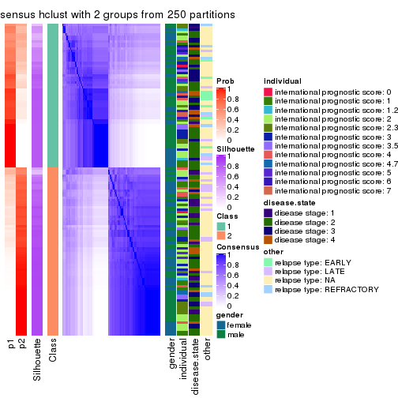</p>

</div>
<div id='tab-CV-hclust-consensus-heatmap-2'>
<pre><code class="r">consensus_heatmap(res, k = 3)
</code></pre>

<p>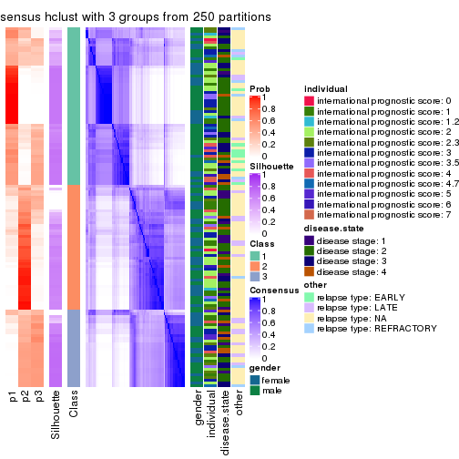</p>

</div>
<div id='tab-CV-hclust-consensus-heatmap-3'>
<pre><code class="r">consensus_heatmap(res, k = 4)
</code></pre>

<p>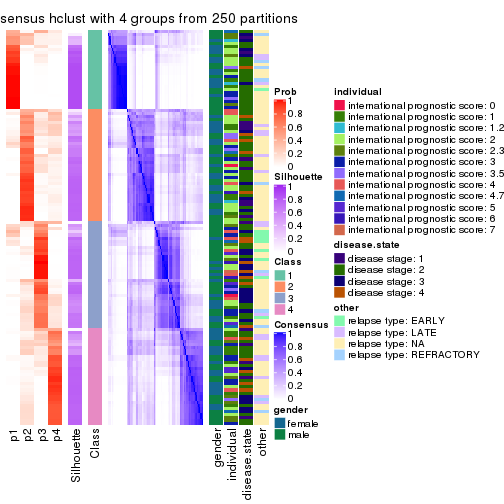</p>

</div>
<div id='tab-CV-hclust-consensus-heatmap-4'>
<pre><code class="r">consensus_heatmap(res, k = 5)
</code></pre>

<p>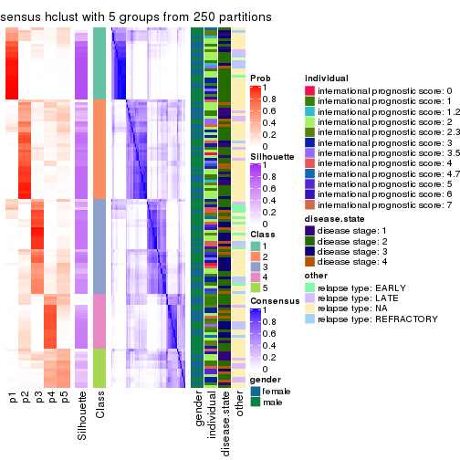</p>

</div>
<div id='tab-CV-hclust-consensus-heatmap-5'>
<pre><code class="r">consensus_heatmap(res, k = 6)
</code></pre>

<p>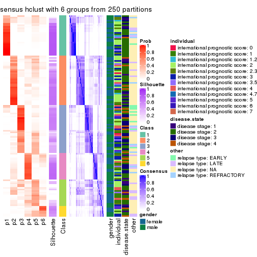</p>

</div>
</div>

Heatmaps for the membership of samples in all partitions to see how consistent they are:


<script>
$( function() {
	$( '#tabs-CV-hclust-membership-heatmap' ).tabs();
} );
</script>
<div id='tabs-CV-hclust-membership-heatmap'>
<ul>
<li><a href='#tab-CV-hclust-membership-heatmap-1'>k = 2</a></li>
<li><a href='#tab-CV-hclust-membership-heatmap-2'>k = 3</a></li>
<li><a href='#tab-CV-hclust-membership-heatmap-3'>k = 4</a></li>
<li><a href='#tab-CV-hclust-membership-heatmap-4'>k = 5</a></li>
<li><a href='#tab-CV-hclust-membership-heatmap-5'>k = 6</a></li>
</ul>
<div id='tab-CV-hclust-membership-heatmap-1'>
<pre><code class="r">membership_heatmap(res, k = 2)
</code></pre>

<p>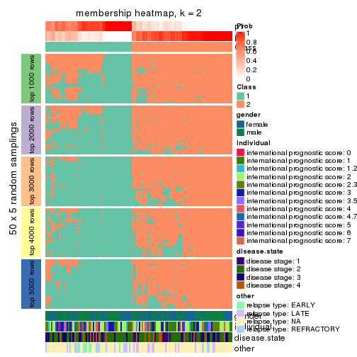</p>

</div>
<div id='tab-CV-hclust-membership-heatmap-2'>
<pre><code class="r">membership_heatmap(res, k = 3)
</code></pre>

<p>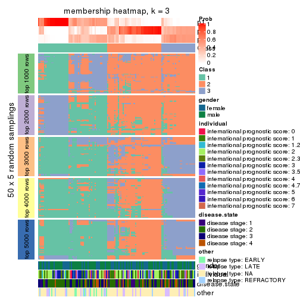</p>

</div>
<div id='tab-CV-hclust-membership-heatmap-3'>
<pre><code class="r">membership_heatmap(res, k = 4)
</code></pre>

<p>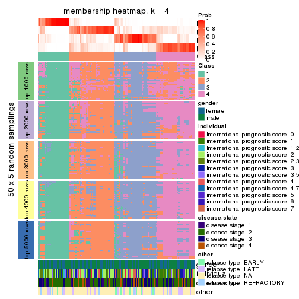</p>

</div>
<div id='tab-CV-hclust-membership-heatmap-4'>
<pre><code class="r">membership_heatmap(res, k = 5)
</code></pre>

<p>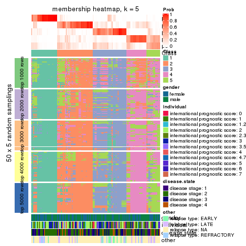</p>

</div>
<div id='tab-CV-hclust-membership-heatmap-5'>
<pre><code class="r">membership_heatmap(res, k = 6)
</code></pre>

<p>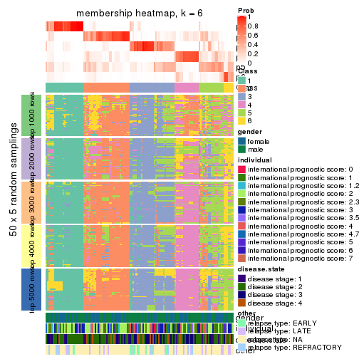</p>

</div>
</div>

As soon as we have had the classes for columns, we can look for signatures
which are significantly different between classes which can be candidate marks
for certain classes. Following are the heatmaps for signatures.


Signature heatmaps where rows are scaled:


<script>
$( function() {
	$( '#tabs-CV-hclust-get-signatures' ).tabs();
} );
</script>
<div id='tabs-CV-hclust-get-signatures'>
<ul>
<li><a href='#tab-CV-hclust-get-signatures-1'>k = 2</a></li>
<li><a href='#tab-CV-hclust-get-signatures-2'>k = 3</a></li>
<li><a href='#tab-CV-hclust-get-signatures-3'>k = 4</a></li>
<li><a href='#tab-CV-hclust-get-signatures-4'>k = 5</a></li>
<li><a href='#tab-CV-hclust-get-signatures-5'>k = 6</a></li>
</ul>
<div id='tab-CV-hclust-get-signatures-1'>
<pre><code class="r">get_signatures(res, k = 2)
</code></pre>

<p>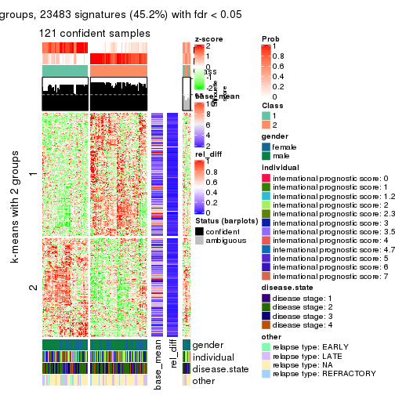</p>

</div>
<div id='tab-CV-hclust-get-signatures-2'>
<pre><code class="r">get_signatures(res, k = 3)
</code></pre>

<p>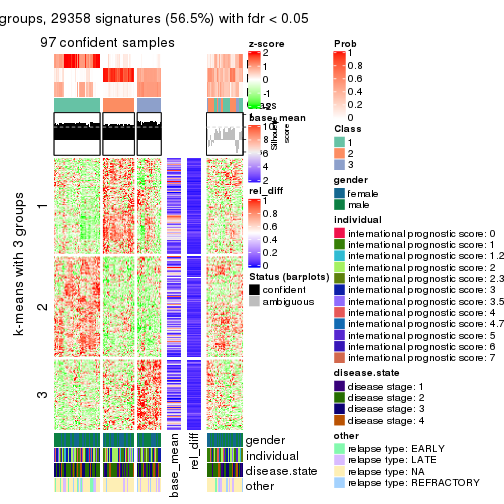</p>

</div>
<div id='tab-CV-hclust-get-signatures-3'>
<pre><code class="r">get_signatures(res, k = 4)
</code></pre>

<p>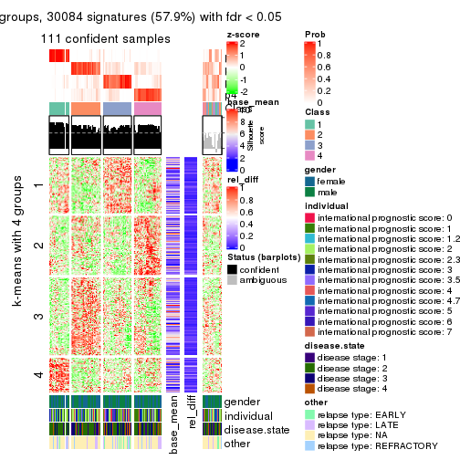</p>

</div>
<div id='tab-CV-hclust-get-signatures-4'>
<pre><code class="r">get_signatures(res, k = 5)
</code></pre>

<p>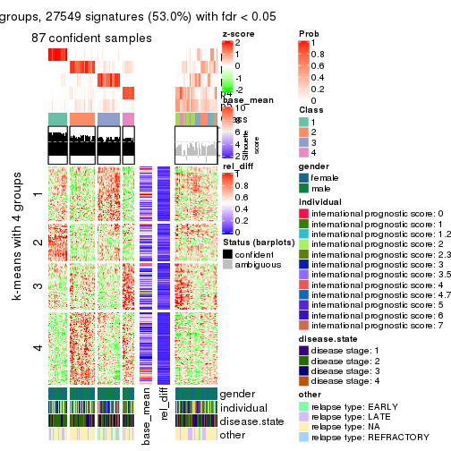</p>

</div>
<div id='tab-CV-hclust-get-signatures-5'>
<pre><code class="r">get_signatures(res, k = 6)
</code></pre>

<pre><code>#&gt; Error: The width or height of the raster image is zero, maybe you forget to turn off the
#&gt; previous graphic device or it was corrupted. Run `dev.off()` to close it.
</code></pre>

<p></p>

</div>
</div>


Signature heatmaps where rows are not scaled:


<script>
$( function() {
	$( '#tabs-CV-hclust-get-signatures-no-scale' ).tabs();
} );
</script>
<div id='tabs-CV-hclust-get-signatures-no-scale'>
<ul>
<li><a href='#tab-CV-hclust-get-signatures-no-scale-1'>k = 2</a></li>
<li><a href='#tab-CV-hclust-get-signatures-no-scale-2'>k = 3</a></li>
<li><a href='#tab-CV-hclust-get-signatures-no-scale-3'>k = 4</a></li>
<li><a href='#tab-CV-hclust-get-signatures-no-scale-4'>k = 5</a></li>
<li><a href='#tab-CV-hclust-get-signatures-no-scale-5'>k = 6</a></li>
</ul>
<div id='tab-CV-hclust-get-signatures-no-scale-1'>
<pre><code class="r">get_signatures(res, k = 2, scale_rows = FALSE)
</code></pre>

<p>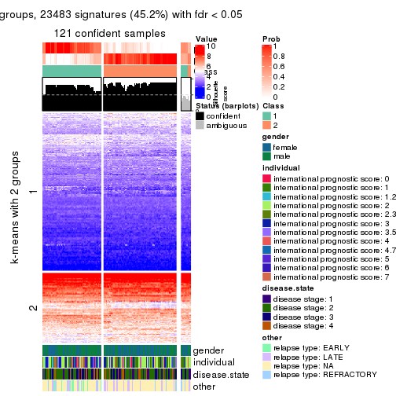</p>

</div>
<div id='tab-CV-hclust-get-signatures-no-scale-2'>
<pre><code class="r">get_signatures(res, k = 3, scale_rows = FALSE)
</code></pre>

<p>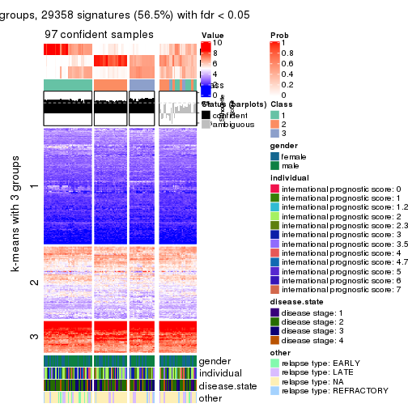</p>

</div>
<div id='tab-CV-hclust-get-signatures-no-scale-3'>
<pre><code class="r">get_signatures(res, k = 4, scale_rows = FALSE)
</code></pre>

<p>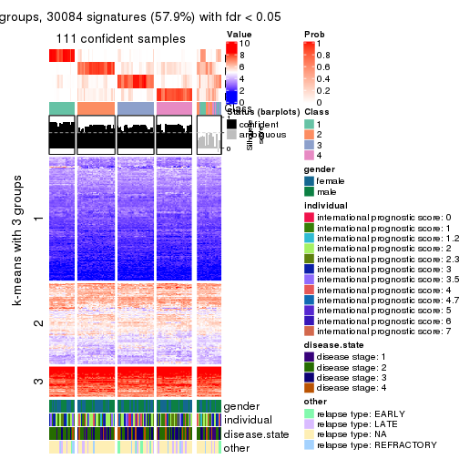</p>

</div>
<div id='tab-CV-hclust-get-signatures-no-scale-4'>
<pre><code class="r">get_signatures(res, k = 5, scale_rows = FALSE)
</code></pre>

<p>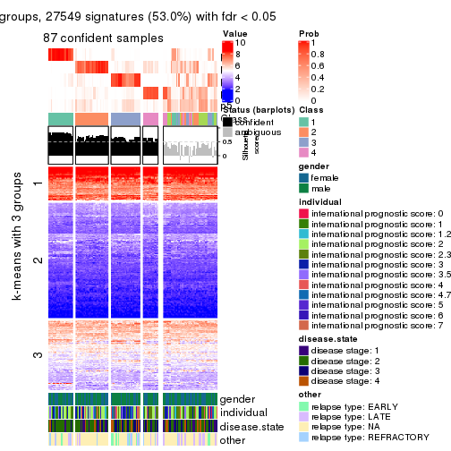</p>

</div>
<div id='tab-CV-hclust-get-signatures-no-scale-5'>
<pre><code class="r">get_signatures(res, k = 6, scale_rows = FALSE)
</code></pre>

<pre><code>#&gt; Error in mat[ceiling(1:nr/h_ratio), ceiling(1:nc/w_ratio), drop = FALSE]: subscript out of bounds
</code></pre>

<p></p>

</div>
</div>


Compare the overlap of signatures from different k:

```r
compare_signatures(res)
```

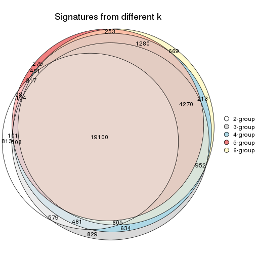

`get_signature()` returns a data frame invisibly. TO get the list of signatures, the function
call should be assigned to a variable explicitly. In following code, if `plot` argument is set
to `FALSE`, no heatmap is plotted while only the differential analysis is performed.

```r
# code only for demonstration
tb = get_signature(res, k = ..., plot = FALSE)
```

An example of the output of `tb` is:

```
#>   which_row         fdr    mean_1    mean_2 scaled_mean_1 scaled_mean_2 km
#> 1        38 0.042760348  8.373488  9.131774    -0.5533452     0.5164555  1
#> 2        40 0.018707592  7.106213  8.469186    -0.6173731     0.5762149  1
#> 3        55 0.019134737 10.221463 11.207825    -0.6159697     0.5749050  1
#> 4        59 0.006059896  5.921854  7.869574    -0.6899429     0.6439467  1
#> 5        60 0.018055526  8.928898 10.211722    -0.6204761     0.5791110  1
#> 6        98 0.009384629 15.714769 14.887706     0.6635654    -0.6193277  2
...
```

The columns in `tb` are:

1. `which_row`: row indices corresponding to the input matrix.
2. `fdr`: FDR for the differential test. 
3. `mean_x`: The mean value in group x.
4. `scaled_mean_x`: The mean value in group x after rows are scaled.
5. `km`: Row groups if k-means clustering is applied to rows.


UMAP plot which shows how samples are separated.


<script>
$( function() {
	$( '#tabs-CV-hclust-dimension-reduction' ).tabs();
} );
</script>
<div id='tabs-CV-hclust-dimension-reduction'>
<ul>
<li><a href='#tab-CV-hclust-dimension-reduction-1'>k = 2</a></li>
<li><a href='#tab-CV-hclust-dimension-reduction-2'>k = 3</a></li>
<li><a href='#tab-CV-hclust-dimension-reduction-3'>k = 4</a></li>
<li><a href='#tab-CV-hclust-dimension-reduction-4'>k = 5</a></li>
<li><a href='#tab-CV-hclust-dimension-reduction-5'>k = 6</a></li>
</ul>
<div id='tab-CV-hclust-dimension-reduction-1'>
<pre><code class="r">dimension_reduction(res, k = 2, method = &quot;UMAP&quot;)
</code></pre>

<p>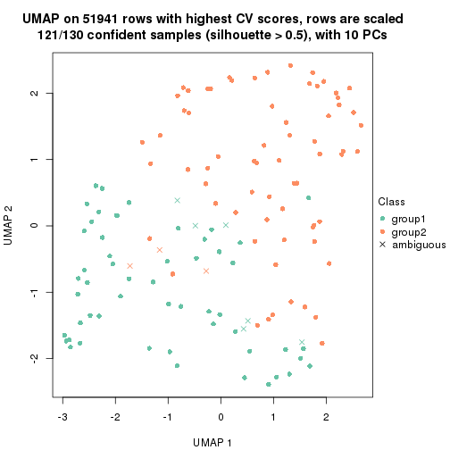</p>

</div>
<div id='tab-CV-hclust-dimension-reduction-2'>
<pre><code class="r">dimension_reduction(res, k = 3, method = &quot;UMAP&quot;)
</code></pre>

<p>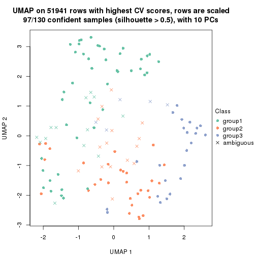</p>

</div>
<div id='tab-CV-hclust-dimension-reduction-3'>
<pre><code class="r">dimension_reduction(res, k = 4, method = &quot;UMAP&quot;)
</code></pre>

<p>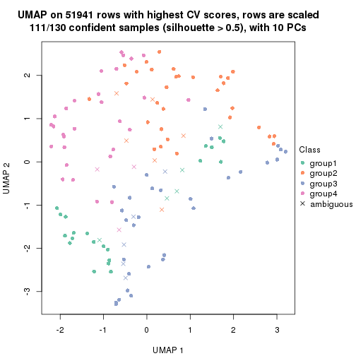</p>

</div>
<div id='tab-CV-hclust-dimension-reduction-4'>
<pre><code class="r">dimension_reduction(res, k = 5, method = &quot;UMAP&quot;)
</code></pre>

<p>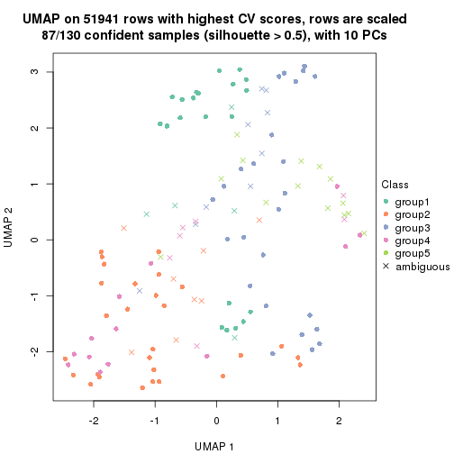</p>

</div>
<div id='tab-CV-hclust-dimension-reduction-5'>
<pre><code class="r">dimension_reduction(res, k = 6, method = &quot;UMAP&quot;)
</code></pre>

<p>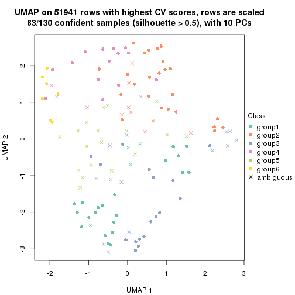</p>

</div>
</div>


Following heatmap shows how subgroups are split when increasing `k`:

```r
collect_classes(res)
```

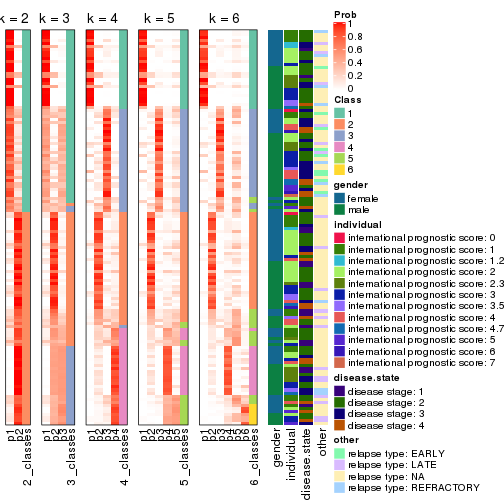


Test correlation between subgroups and known annotations. If the known
annotation is numeric, one-way ANOVA test is applied, and if the known
annotation is discrete, chi-squared contingency table test is applied.

```r
test_to_known_factors(res)
```

```
#>             n gender(p) individual(p) disease.state(p) other(p) k
#> CV:hclust 121     0.171         0.822          0.04157  0.00286 2
#> CV:hclust  97     0.491         0.861          0.09533  0.03254 3
#> CV:hclust 111     0.389         0.515          0.00430  0.03143 4
#> CV:hclust  87     0.357         0.506          0.00454  0.05467 5
#> CV:hclust  83     0.508         0.330          0.02287  0.02633 6
```


If matrix rows can be associated to genes, consider to use `GO_Enrichment(res,
...)` to perform function enrichment for the signature genes.


 

---------------------------------------------------


### CV:kmeans


The object with results only for a single top-value method and a single partition method 
can be extracted as:

```r
res = res_list["CV", "kmeans"]
# you can also extract it by
# res = res_list["CV:kmeans"]
```

A summary of `res` and all the functions that can be applied to it:

```r
res
```

```
#> A 'ConsensusPartition' object with k = 2, 3, 4, 5, 6.
#>   On a matrix with 51941 rows and 130 columns.
#>   Top rows (1000, 2000, 3000, 4000, 5000) are extracted by 'CV' method.
#>   Subgroups are detected by 'kmeans' method.
#>   Performed in total 1250 partitions by row resampling.
#>   Best k for subgroups seems to be 2.
#> 
#> Following methods can be applied to this 'ConsensusPartition' object:
#>  [1] "cola_report"             "collect_classes"         "collect_plots"          
#>  [4] "collect_stats"           "colnames"                "compare_signatures"     
#>  [7] "consensus_heatmap"       "dimension_reduction"     "functional_enrichment"  
#> [10] "get_anno_col"            "get_anno"                "get_classes"            
#> [13] "get_consensus"           "get_matrix"              "get_membership"         
#> [16] "get_param"               "get_signatures"          "get_stats"              
#> [19] "is_best_k"               "is_stable_k"             "membership_heatmap"     
#> [22] "ncol"                    "nrow"                    "plot_ecdf"              
#> [25] "rownames"                "select_partition_number" "show"                   
#> [28] "suggest_best_k"          "test_to_known_factors"
```

`collect_plots()` function collects all the plots made from `res` for all `k` (number of partitions)
into one single page to provide an easy and fast comparison between different `k`.

```r
collect_plots(res)
```

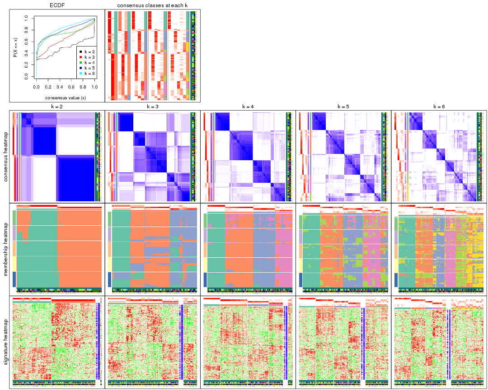

The plots are:

- The first row: a plot of the ECDF (Empirical cumulative distribution
  function) curves of the consensus matrix for each `k` and the heatmap of
  predicted classes for each `k`.
- The second row: heatmaps of the consensus matrix for each `k`.
- The third row: heatmaps of the membership matrix for each `k`.
- The fouth row: heatmaps of the signatures for each `k`.

All the plots in panels can be made by individual functions and they are
plotted later in this section.

`select_partition_number()` produces several plots showing different
statistics for choosing "optimized" `k`. There are following statistics:

- ECDF curves of the consensus matrix for each `k`;
- 1-PAC. [The PAC
  score](https://en.wikipedia.org/wiki/Consensus_clustering#Over-interpretation_potential_of_consensus_clustering)
  measures the proportion of the ambiguous subgrouping.
- Mean silhouette score.
- Concordance. The mean probability of fiting the consensus class ids in all
  partitions.
- Area increased. Denote $A_k$ as the area under the ECDF curve for current
  `k`, the area increased is defined as $A_k - A_{k-1}$.
- Rand index. The percent of pairs of samples that are both in a same cluster
  or both are not in a same cluster in the partition of k and k-1.
- Jaccard index. The ratio of pairs of samples are both in a same cluster in
  the partition of k and k-1 and the pairs of samples are both in a same
  cluster in the partition k or k-1.

The detailed explanations of these statistics can be found in [the cola
vignette](http://bioconductor.org/packages/devel/bioc/vignettes/cola/inst/doc/cola.html#toc_13).

Generally speaking, lower PAC score, higher mean silhouette score or higher
concordance corresponds to better partition. Rand index and Jaccard index
measure how similar the current partition is compared to partition with `k-1`.
If they are too similar, we won't accept `k` is better than `k-1`.

```r
select_partition_number(res)
```

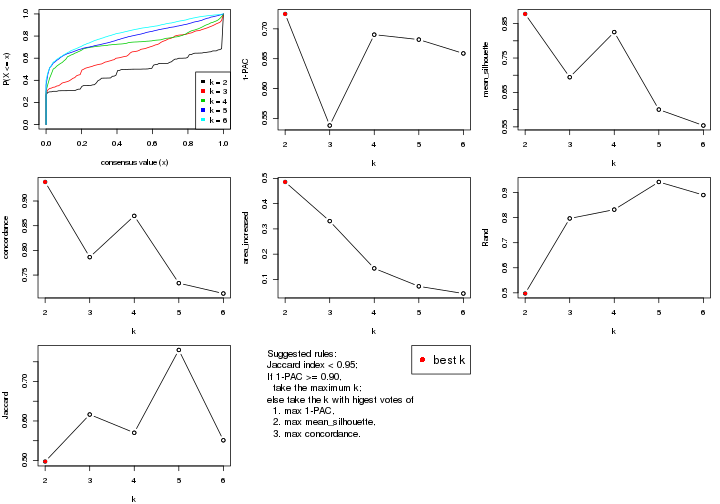

The numeric values for all these statistics can be obtained by `get_stats()`.

```r
get_stats(res)
```

```
#>   k 1-PAC mean_silhouette concordance area_increased  Rand Jaccard
#> 2 2 0.725           0.878       0.939         0.4858 0.497   0.497
#> 3 3 0.538           0.694       0.786         0.3309 0.797   0.616
#> 4 4 0.690           0.825       0.870         0.1437 0.832   0.570
#> 5 5 0.682           0.600       0.734         0.0727 0.942   0.780
#> 6 6 0.659           0.554       0.713         0.0443 0.890   0.551
```

`suggest_best_k()` suggests the best $k$ based on these statistics. The rules are as follows:

- All $k$ with Jaccard index larger than 0.95 are removed because the increase of
  the partition number does not provides enough extra information. If all $k$ are removed,
  the best $k$ is assigned by `NA`.
- For $k$ with 1-PAC larger than 0.9, the maximal $k$ is taken as the "best k". Other $k$ is called "optional k".
- If it does not fit the second rule. The $k$ with the highest vote of highest
  1-PAC, mean silhouette and concordance is taken as the "best k".

```r
suggest_best_k(res)
```

```
#> [1] 2
```


Following shows the table of the partitions (You need to click the **show/hide
code output** link to see it). The membership matrix (columns with name `p*`)
is inferred by
[`clue::cl_consensus()`](https://www.rdocumentation.org/link/cl_consensus?package=clue)
function with the `SE` method. Basically the value in the membership matrix
represents the probability to belong to a certain group. The finall class
label for an item is determined with the group with highest probability it
belongs to.

In `get_classes()` function, the entropy is calculated from the membership
matrix and the silhouette score is calculated from the consensus matrix.


<script>
$( function() {
	$( '#tabs-CV-kmeans-get-classes' ).tabs();
} );
</script>
<div id='tabs-CV-kmeans-get-classes'>
<ul>
<li><a href='#tab-CV-kmeans-get-classes-1'>k = 2</a></li>
<li><a href='#tab-CV-kmeans-get-classes-2'>k = 3</a></li>
<li><a href='#tab-CV-kmeans-get-classes-3'>k = 4</a></li>
<li><a href='#tab-CV-kmeans-get-classes-4'>k = 5</a></li>
<li><a href='#tab-CV-kmeans-get-classes-5'>k = 6</a></li>
</ul>

<div id='tab-CV-kmeans-get-classes-1'>
<p><a id='tab-CV-kmeans-get-classes-1-a' style='color:#0366d6' href='#'>show/hide code output</a></p>
<pre><code class="r">cbind(get_classes(res, k = 2), get_membership(res, k = 2))
</code></pre>

<pre><code>#&gt;           class entropy silhouette    p1    p2
#&gt; GSM447671     2  0.0000      0.983 0.000 1.000
#&gt; GSM447694     1  0.7139      0.768 0.804 0.196
#&gt; GSM447618     2  0.0000      0.983 0.000 1.000
#&gt; GSM447691     2  0.0000      0.983 0.000 1.000
#&gt; GSM447733     2  0.0000      0.983 0.000 1.000
#&gt; GSM447620     2  0.0000      0.983 0.000 1.000
#&gt; GSM447627     1  0.8555      0.695 0.720 0.280
#&gt; GSM447630     2  0.0000      0.983 0.000 1.000
#&gt; GSM447642     1  0.0000      0.876 1.000 0.000
#&gt; GSM447649     2  0.0000      0.983 0.000 1.000
#&gt; GSM447654     2  0.0000      0.983 0.000 1.000
#&gt; GSM447655     2  0.0000      0.983 0.000 1.000
#&gt; GSM447669     2  0.0000      0.983 0.000 1.000
#&gt; GSM447676     1  0.0000      0.876 1.000 0.000
#&gt; GSM447678     2  0.0000      0.983 0.000 1.000
#&gt; GSM447681     2  0.0000      0.983 0.000 1.000
#&gt; GSM447698     2  0.0000      0.983 0.000 1.000
#&gt; GSM447713     1  0.0000      0.876 1.000 0.000
#&gt; GSM447722     2  0.0000      0.983 0.000 1.000
#&gt; GSM447726     2  0.3584      0.906 0.068 0.932
#&gt; GSM447735     1  0.8608      0.691 0.716 0.284
#&gt; GSM447737     1  0.0000      0.876 1.000 0.000
#&gt; GSM447657     2  0.0000      0.983 0.000 1.000
#&gt; GSM447674     2  0.0000      0.983 0.000 1.000
#&gt; GSM447636     1  0.0000      0.876 1.000 0.000
#&gt; GSM447723     1  0.0000      0.876 1.000 0.000
#&gt; GSM447699     1  0.9833      0.457 0.576 0.424
#&gt; GSM447708     2  0.0000      0.983 0.000 1.000
#&gt; GSM447721     1  0.0000      0.876 1.000 0.000
#&gt; GSM447623     1  0.0000      0.876 1.000 0.000
#&gt; GSM447621     1  0.0000      0.876 1.000 0.000
#&gt; GSM447650     2  0.0000      0.983 0.000 1.000
#&gt; GSM447651     2  0.0000      0.983 0.000 1.000
#&gt; GSM447653     2  0.6623      0.748 0.172 0.828
#&gt; GSM447658     1  0.0000      0.876 1.000 0.000
#&gt; GSM447675     2  0.0000      0.983 0.000 1.000
#&gt; GSM447680     2  0.7219      0.712 0.200 0.800
#&gt; GSM447686     1  0.9710      0.331 0.600 0.400
#&gt; GSM447736     1  0.9460      0.578 0.636 0.364
#&gt; GSM447629     2  0.0672      0.975 0.008 0.992
#&gt; GSM447648     1  0.0000      0.876 1.000 0.000
#&gt; GSM447660     1  0.0000      0.876 1.000 0.000
#&gt; GSM447661     2  0.0000      0.983 0.000 1.000
#&gt; GSM447663     1  0.9686      0.520 0.604 0.396
#&gt; GSM447704     2  0.0000      0.983 0.000 1.000
#&gt; GSM447720     1  0.9686      0.520 0.604 0.396
#&gt; GSM447652     2  0.0000      0.983 0.000 1.000
#&gt; GSM447679     2  0.0000      0.983 0.000 1.000
#&gt; GSM447712     1  0.0000      0.876 1.000 0.000
#&gt; GSM447664     2  0.0376      0.979 0.004 0.996
#&gt; GSM447637     1  0.0000      0.876 1.000 0.000
#&gt; GSM447639     2  0.0000      0.983 0.000 1.000
#&gt; GSM447615     1  0.0000      0.876 1.000 0.000
#&gt; GSM447656     2  0.2043      0.950 0.032 0.968
#&gt; GSM447673     2  0.0000      0.983 0.000 1.000
#&gt; GSM447719     1  0.7299      0.762 0.796 0.204
#&gt; GSM447706     1  0.0000      0.876 1.000 0.000
#&gt; GSM447612     2  0.7219      0.697 0.200 0.800
#&gt; GSM447665     2  0.0000      0.983 0.000 1.000
#&gt; GSM447677     2  0.0000      0.983 0.000 1.000
#&gt; GSM447613     1  0.0000      0.876 1.000 0.000
#&gt; GSM447659     2  0.0000      0.983 0.000 1.000
#&gt; GSM447662     1  0.9686      0.520 0.604 0.396
#&gt; GSM447666     1  0.9661      0.527 0.608 0.392
#&gt; GSM447668     2  0.0000      0.983 0.000 1.000
#&gt; GSM447682     2  0.0000      0.983 0.000 1.000
#&gt; GSM447683     2  0.0000      0.983 0.000 1.000
#&gt; GSM447688     2  0.0000      0.983 0.000 1.000
#&gt; GSM447702     2  0.0000      0.983 0.000 1.000
#&gt; GSM447709     2  0.0000      0.983 0.000 1.000
#&gt; GSM447711     1  0.0000      0.876 1.000 0.000
#&gt; GSM447715     1  0.0000      0.876 1.000 0.000
#&gt; GSM447693     1  0.7139      0.768 0.804 0.196
#&gt; GSM447611     2  0.0000      0.983 0.000 1.000
#&gt; GSM447672     2  0.0000      0.983 0.000 1.000
#&gt; GSM447703     2  0.0000      0.983 0.000 1.000
#&gt; GSM447727     1  0.0000      0.876 1.000 0.000
#&gt; GSM447638     1  0.0000      0.876 1.000 0.000
#&gt; GSM447670     1  0.0000      0.876 1.000 0.000
#&gt; GSM447700     2  0.0000      0.983 0.000 1.000
#&gt; GSM447738     2  0.0000      0.983 0.000 1.000
#&gt; GSM447739     1  0.0000      0.876 1.000 0.000
#&gt; GSM447617     1  0.0000      0.876 1.000 0.000
#&gt; GSM447628     2  0.0000      0.983 0.000 1.000
#&gt; GSM447632     2  0.0000      0.983 0.000 1.000
#&gt; GSM447619     1  0.8661      0.686 0.712 0.288
#&gt; GSM447643     1  0.0000      0.876 1.000 0.000
#&gt; GSM447724     2  0.0000      0.983 0.000 1.000
#&gt; GSM447728     2  0.0000      0.983 0.000 1.000
#&gt; GSM447610     1  0.0000      0.876 1.000 0.000
#&gt; GSM447633     2  0.0000      0.983 0.000 1.000
#&gt; GSM447634     1  0.8861      0.666 0.696 0.304
#&gt; GSM447622     1  0.0000      0.876 1.000 0.000
#&gt; GSM447667     2  0.1184      0.967 0.016 0.984
#&gt; GSM447687     2  0.0000      0.983 0.000 1.000
#&gt; GSM447695     1  0.6438      0.789 0.836 0.164
#&gt; GSM447696     1  0.0000      0.876 1.000 0.000
#&gt; GSM447697     1  0.0000      0.876 1.000 0.000
#&gt; GSM447714     1  0.9710      0.511 0.600 0.400
#&gt; GSM447717     1  0.0000      0.876 1.000 0.000
#&gt; GSM447725     1  0.0000      0.876 1.000 0.000
#&gt; GSM447729     2  0.0000      0.983 0.000 1.000
#&gt; GSM447644     2  0.0000      0.983 0.000 1.000
#&gt; GSM447710     1  0.8608      0.690 0.716 0.284
#&gt; GSM447614     1  0.8555      0.695 0.720 0.280
#&gt; GSM447685     2  0.0000      0.983 0.000 1.000
#&gt; GSM447690     1  0.0000      0.876 1.000 0.000
#&gt; GSM447730     2  0.0000      0.983 0.000 1.000
#&gt; GSM447646     2  0.0000      0.983 0.000 1.000
#&gt; GSM447689     1  0.8955      0.656 0.688 0.312
#&gt; GSM447635     2  0.0000      0.983 0.000 1.000
#&gt; GSM447641     1  0.0000      0.876 1.000 0.000
#&gt; GSM447716     2  0.0000      0.983 0.000 1.000
#&gt; GSM447718     2  0.8207      0.579 0.256 0.744
#&gt; GSM447616     1  0.0000      0.876 1.000 0.000
#&gt; GSM447626     1  0.0376      0.875 0.996 0.004
#&gt; GSM447640     2  0.0000      0.983 0.000 1.000
#&gt; GSM447734     1  0.9522      0.564 0.628 0.372
#&gt; GSM447692     1  0.0000      0.876 1.000 0.000
#&gt; GSM447647     2  0.0000      0.983 0.000 1.000
#&gt; GSM447624     1  0.0000      0.876 1.000 0.000
#&gt; GSM447625     1  0.9686      0.520 0.604 0.396
#&gt; GSM447707     2  0.0000      0.983 0.000 1.000
#&gt; GSM447732     1  0.8763      0.677 0.704 0.296
#&gt; GSM447684     1  0.0000      0.876 1.000 0.000
#&gt; GSM447731     2  0.0000      0.983 0.000 1.000
#&gt; GSM447705     2  0.0376      0.979 0.004 0.996
#&gt; GSM447631     1  0.0000      0.876 1.000 0.000
#&gt; GSM447701     2  0.0000      0.983 0.000 1.000
#&gt; GSM447645     1  0.0000      0.876 1.000 0.000
</code></pre>

<script>
$('#tab-CV-kmeans-get-classes-1-a').parent().next().next().hide();
$('#tab-CV-kmeans-get-classes-1-a').click(function(){
  $('#tab-CV-kmeans-get-classes-1-a').parent().next().next().toggle();
  return(false);
});
</script>
</div>

<div id='tab-CV-kmeans-get-classes-2'>
<p><a id='tab-CV-kmeans-get-classes-2-a' style='color:#0366d6' href='#'>show/hide code output</a></p>
<pre><code class="r">cbind(get_classes(res, k = 3), get_membership(res, k = 3))
</code></pre>

<pre><code>#&gt;           class entropy silhouette    p1    p2    p3
#&gt; GSM447671     2  0.4235     0.6686 0.000 0.824 0.176
#&gt; GSM447694     3  0.1860     0.5599 0.052 0.000 0.948
#&gt; GSM447618     2  0.3192     0.7353 0.000 0.888 0.112
#&gt; GSM447691     2  0.4178     0.6735 0.000 0.828 0.172
#&gt; GSM447733     2  0.9633     0.3669 0.340 0.444 0.216
#&gt; GSM447620     2  0.6062     0.1894 0.000 0.616 0.384
#&gt; GSM447627     3  0.4605     0.6100 0.204 0.000 0.796
#&gt; GSM447630     2  0.5327     0.5085 0.000 0.728 0.272
#&gt; GSM447642     1  0.5835     0.9683 0.660 0.000 0.340
#&gt; GSM447649     2  0.0592     0.7884 0.012 0.988 0.000
#&gt; GSM447654     2  0.6057     0.6731 0.340 0.656 0.004
#&gt; GSM447655     2  0.0747     0.7873 0.000 0.984 0.016
#&gt; GSM447669     2  0.4291     0.6638 0.000 0.820 0.180
#&gt; GSM447676     1  0.5835     0.9683 0.660 0.000 0.340
#&gt; GSM447678     2  0.6057     0.6731 0.340 0.656 0.004
#&gt; GSM447681     2  0.0747     0.7873 0.000 0.984 0.016
#&gt; GSM447698     2  0.4931     0.7207 0.232 0.768 0.000
#&gt; GSM447713     1  0.5835     0.9683 0.660 0.000 0.340
#&gt; GSM447722     2  0.6057     0.6731 0.340 0.656 0.004
#&gt; GSM447726     3  0.6244     0.3413 0.000 0.440 0.560
#&gt; GSM447735     3  0.8884     0.3886 0.420 0.120 0.460
#&gt; GSM447737     1  0.5835     0.9683 0.660 0.000 0.340
#&gt; GSM447657     2  0.0000     0.7891 0.000 1.000 0.000
#&gt; GSM447674     2  0.0000     0.7891 0.000 1.000 0.000
#&gt; GSM447636     1  0.5835     0.9683 0.660 0.000 0.340
#&gt; GSM447723     1  0.5835     0.9683 0.660 0.000 0.340
#&gt; GSM447699     3  0.5431     0.6159 0.000 0.284 0.716
#&gt; GSM447708     2  0.2625     0.7555 0.000 0.916 0.084
#&gt; GSM447721     1  0.5835     0.9683 0.660 0.000 0.340
#&gt; GSM447623     1  0.5835     0.9683 0.660 0.000 0.340
#&gt; GSM447621     1  0.5835     0.9683 0.660 0.000 0.340
#&gt; GSM447650     2  0.0747     0.7873 0.000 0.984 0.016
#&gt; GSM447651     2  0.2356     0.7632 0.000 0.928 0.072
#&gt; GSM447653     3  0.9918     0.0760 0.340 0.276 0.384
#&gt; GSM447658     1  0.5835     0.9683 0.660 0.000 0.340
#&gt; GSM447675     2  0.6057     0.6731 0.340 0.656 0.004
#&gt; GSM447680     2  0.2845     0.7610 0.012 0.920 0.068
#&gt; GSM447686     1  0.7865     0.7747 0.660 0.124 0.216
#&gt; GSM447736     3  0.3816     0.7188 0.000 0.148 0.852
#&gt; GSM447629     2  0.0747     0.7873 0.000 0.984 0.016
#&gt; GSM447648     3  0.3482     0.4589 0.128 0.000 0.872
#&gt; GSM447660     1  0.5835     0.9683 0.660 0.000 0.340
#&gt; GSM447661     2  0.0747     0.7873 0.000 0.984 0.016
#&gt; GSM447663     3  0.4235     0.7095 0.000 0.176 0.824
#&gt; GSM447704     2  0.0592     0.7884 0.012 0.988 0.000
#&gt; GSM447720     3  0.3816     0.7188 0.000 0.148 0.852
#&gt; GSM447652     2  0.0424     0.7888 0.008 0.992 0.000
#&gt; GSM447679     2  0.0747     0.7873 0.000 0.984 0.016
#&gt; GSM447712     1  0.5835     0.9683 0.660 0.000 0.340
#&gt; GSM447664     2  0.6057     0.6731 0.340 0.656 0.004
#&gt; GSM447637     3  0.3482     0.4589 0.128 0.000 0.872
#&gt; GSM447639     2  0.9390     0.4620 0.340 0.476 0.184
#&gt; GSM447615     3  0.4235     0.3520 0.176 0.000 0.824
#&gt; GSM447656     2  0.1964     0.7714 0.000 0.944 0.056
#&gt; GSM447673     2  0.5835     0.6750 0.340 0.660 0.000
#&gt; GSM447719     3  0.7534     0.4828 0.428 0.040 0.532
#&gt; GSM447706     3  0.1289     0.5810 0.032 0.000 0.968
#&gt; GSM447612     3  0.5138     0.6543 0.000 0.252 0.748
#&gt; GSM447665     2  0.3412     0.7241 0.000 0.876 0.124
#&gt; GSM447677     2  0.2261     0.7649 0.000 0.932 0.068
#&gt; GSM447613     1  0.5835     0.9683 0.660 0.000 0.340
#&gt; GSM447659     3  0.8261     0.4470 0.340 0.092 0.568
#&gt; GSM447662     3  0.4002     0.7154 0.000 0.160 0.840
#&gt; GSM447666     3  0.5650     0.5770 0.000 0.312 0.688
#&gt; GSM447668     2  0.2261     0.7649 0.000 0.932 0.068
#&gt; GSM447682     2  0.2711     0.7676 0.088 0.912 0.000
#&gt; GSM447683     2  0.1860     0.7734 0.000 0.948 0.052
#&gt; GSM447688     2  0.5560     0.6963 0.300 0.700 0.000
#&gt; GSM447702     2  0.0747     0.7873 0.000 0.984 0.016
#&gt; GSM447709     2  0.3038     0.7412 0.000 0.896 0.104
#&gt; GSM447711     1  0.5835     0.9683 0.660 0.000 0.340
#&gt; GSM447715     1  0.5948     0.9411 0.640 0.000 0.360
#&gt; GSM447693     3  0.3356     0.6361 0.036 0.056 0.908
#&gt; GSM447611     2  0.6057     0.6731 0.340 0.656 0.004
#&gt; GSM447672     2  0.0000     0.7891 0.000 1.000 0.000
#&gt; GSM447703     2  0.5560     0.6963 0.300 0.700 0.000
#&gt; GSM447727     1  0.5835     0.9683 0.660 0.000 0.340
#&gt; GSM447638     3  0.7660     0.4185 0.048 0.404 0.548
#&gt; GSM447670     1  0.5926     0.9483 0.644 0.000 0.356
#&gt; GSM447700     2  0.4291     0.6667 0.000 0.820 0.180
#&gt; GSM447738     2  0.5560     0.6963 0.300 0.700 0.000
#&gt; GSM447739     1  0.5835     0.9683 0.660 0.000 0.340
#&gt; GSM447617     1  0.5835     0.9683 0.660 0.000 0.340
#&gt; GSM447628     2  0.6057     0.6731 0.340 0.656 0.004
#&gt; GSM447632     2  0.5560     0.6963 0.300 0.700 0.000
#&gt; GSM447619     3  0.3816     0.7188 0.000 0.148 0.852
#&gt; GSM447643     1  0.7605     0.8345 0.660 0.088 0.252
#&gt; GSM447724     3  0.9990    -0.0902 0.340 0.312 0.348
#&gt; GSM447728     2  0.1753     0.7752 0.000 0.952 0.048
#&gt; GSM447610     1  0.2261     0.5699 0.932 0.000 0.068
#&gt; GSM447633     3  0.6286     0.2793 0.000 0.464 0.536
#&gt; GSM447634     3  0.3816     0.7188 0.000 0.148 0.852
#&gt; GSM447622     3  0.3482     0.4589 0.128 0.000 0.872
#&gt; GSM447667     2  0.0237     0.7892 0.004 0.996 0.000
#&gt; GSM447687     2  0.5560     0.6963 0.300 0.700 0.000
#&gt; GSM447695     3  0.1860     0.5599 0.052 0.000 0.948
#&gt; GSM447696     1  0.5835     0.9683 0.660 0.000 0.340
#&gt; GSM447697     1  0.5835     0.9683 0.660 0.000 0.340
#&gt; GSM447714     3  0.3816     0.7188 0.000 0.148 0.852
#&gt; GSM447717     1  0.5835     0.9683 0.660 0.000 0.340
#&gt; GSM447725     1  0.5835     0.9683 0.660 0.000 0.340
#&gt; GSM447729     2  0.6057     0.6731 0.340 0.656 0.004
#&gt; GSM447644     2  0.6062     0.2154 0.000 0.616 0.384
#&gt; GSM447710     3  0.3816     0.7188 0.000 0.148 0.852
#&gt; GSM447614     3  0.7192     0.5018 0.412 0.028 0.560
#&gt; GSM447685     2  0.0747     0.7873 0.000 0.984 0.016
#&gt; GSM447690     1  0.5835     0.9683 0.660 0.000 0.340
#&gt; GSM447730     2  0.0592     0.7884 0.012 0.988 0.000
#&gt; GSM447646     2  0.6057     0.6731 0.340 0.656 0.004
#&gt; GSM447689     3  0.3816     0.7188 0.000 0.148 0.852
#&gt; GSM447635     2  0.4121     0.6802 0.000 0.832 0.168
#&gt; GSM447641     1  0.5835     0.9683 0.660 0.000 0.340
#&gt; GSM447716     2  0.5560     0.6963 0.300 0.700 0.000
#&gt; GSM447718     3  0.4399     0.7042 0.000 0.188 0.812
#&gt; GSM447616     3  0.3482     0.4589 0.128 0.000 0.872
#&gt; GSM447626     3  0.4047     0.7171 0.004 0.148 0.848
#&gt; GSM447640     2  0.0000     0.7891 0.000 1.000 0.000
#&gt; GSM447734     3  0.3816     0.7188 0.000 0.148 0.852
#&gt; GSM447692     3  0.3551     0.4523 0.132 0.000 0.868
#&gt; GSM447647     2  0.6057     0.6731 0.340 0.656 0.004
#&gt; GSM447624     3  0.6308    -0.6858 0.492 0.000 0.508
#&gt; GSM447625     3  0.3816     0.7188 0.000 0.148 0.852
#&gt; GSM447707     2  0.0237     0.7891 0.004 0.996 0.000
#&gt; GSM447732     3  0.3816     0.7188 0.000 0.148 0.852
#&gt; GSM447684     3  0.4047     0.7171 0.004 0.148 0.848
#&gt; GSM447731     2  0.6381     0.6682 0.340 0.648 0.012
#&gt; GSM447705     3  0.5835     0.5292 0.000 0.340 0.660
#&gt; GSM447631     3  0.3412     0.4641 0.124 0.000 0.876
#&gt; GSM447701     2  0.2625     0.7559 0.000 0.916 0.084
#&gt; GSM447645     3  0.3482     0.4589 0.128 0.000 0.872
</code></pre>

<script>
$('#tab-CV-kmeans-get-classes-2-a').parent().next().next().hide();
$('#tab-CV-kmeans-get-classes-2-a').click(function(){
  $('#tab-CV-kmeans-get-classes-2-a').parent().next().next().toggle();
  return(false);
});
</script>
</div>

<div id='tab-CV-kmeans-get-classes-3'>
<p><a id='tab-CV-kmeans-get-classes-3-a' style='color:#0366d6' href='#'>show/hide code output</a></p>
<pre><code class="r">cbind(get_classes(res, k = 4), get_membership(res, k = 4))
</code></pre>

<pre><code>#&gt;           class entropy silhouette    p1    p2    p3    p4
#&gt; GSM447671     2  0.4834     0.7771 0.000 0.784 0.096 0.120
#&gt; GSM447694     3  0.3099     0.8971 0.020 0.000 0.876 0.104
#&gt; GSM447618     2  0.4909     0.7865 0.008 0.788 0.068 0.136
#&gt; GSM447691     2  0.5102     0.7663 0.000 0.764 0.100 0.136
#&gt; GSM447733     4  0.3029     0.7798 0.004 0.048 0.052 0.896
#&gt; GSM447620     2  0.4638     0.7427 0.000 0.776 0.180 0.044
#&gt; GSM447627     3  0.4609     0.8255 0.024 0.000 0.752 0.224
#&gt; GSM447630     2  0.4424     0.7817 0.000 0.812 0.088 0.100
#&gt; GSM447642     1  0.0804     0.9610 0.980 0.000 0.012 0.008
#&gt; GSM447649     2  0.0592     0.8700 0.000 0.984 0.000 0.016
#&gt; GSM447654     4  0.3831     0.7983 0.004 0.204 0.000 0.792
#&gt; GSM447655     2  0.0188     0.8711 0.000 0.996 0.000 0.004
#&gt; GSM447669     2  0.4477     0.7809 0.000 0.808 0.084 0.108
#&gt; GSM447676     1  0.1042     0.9571 0.972 0.000 0.008 0.020
#&gt; GSM447678     4  0.4082     0.8030 0.008 0.152 0.020 0.820
#&gt; GSM447681     2  0.0376     0.8714 0.004 0.992 0.004 0.000
#&gt; GSM447698     2  0.5421     0.2947 0.008 0.664 0.020 0.308
#&gt; GSM447713     1  0.0469     0.9617 0.988 0.000 0.012 0.000
#&gt; GSM447722     4  0.3663     0.7903 0.008 0.120 0.020 0.852
#&gt; GSM447726     2  0.6163     0.6730 0.000 0.676 0.160 0.164
#&gt; GSM447735     4  0.2660     0.7565 0.008 0.012 0.072 0.908
#&gt; GSM447737     1  0.0937     0.9585 0.976 0.000 0.012 0.012
#&gt; GSM447657     2  0.2057     0.8567 0.008 0.940 0.020 0.032
#&gt; GSM447674     2  0.0895     0.8686 0.004 0.976 0.000 0.020
#&gt; GSM447636     1  0.1151     0.9559 0.968 0.000 0.008 0.024
#&gt; GSM447723     1  0.2402     0.9249 0.912 0.000 0.012 0.076
#&gt; GSM447699     3  0.4789     0.7772 0.000 0.056 0.772 0.172
#&gt; GSM447708     2  0.2675     0.8488 0.000 0.892 0.008 0.100
#&gt; GSM447721     1  0.0469     0.9617 0.988 0.000 0.012 0.000
#&gt; GSM447623     1  0.0469     0.9617 0.988 0.000 0.012 0.000
#&gt; GSM447621     1  0.0469     0.9617 0.988 0.000 0.012 0.000
#&gt; GSM447650     2  0.0000     0.8715 0.000 1.000 0.000 0.000
#&gt; GSM447651     2  0.0524     0.8717 0.000 0.988 0.008 0.004
#&gt; GSM447653     4  0.2599     0.7611 0.004 0.020 0.064 0.912
#&gt; GSM447658     1  0.1151     0.9559 0.968 0.000 0.008 0.024
#&gt; GSM447675     4  0.3266     0.8041 0.000 0.168 0.000 0.832
#&gt; GSM447680     2  0.3232     0.8271 0.016 0.872 0.004 0.108
#&gt; GSM447686     1  0.2966     0.8949 0.896 0.008 0.020 0.076
#&gt; GSM447736     3  0.3047     0.8905 0.012 0.000 0.872 0.116
#&gt; GSM447629     2  0.4131     0.8098 0.008 0.816 0.020 0.156
#&gt; GSM447648     3  0.2530     0.8681 0.100 0.000 0.896 0.004
#&gt; GSM447660     1  0.1151     0.9559 0.968 0.000 0.008 0.024
#&gt; GSM447661     2  0.0000     0.8715 0.000 1.000 0.000 0.000
#&gt; GSM447663     3  0.3720     0.8903 0.016 0.024 0.860 0.100
#&gt; GSM447704     2  0.0707     0.8691 0.000 0.980 0.000 0.020
#&gt; GSM447720     3  0.3923     0.8687 0.008 0.016 0.828 0.148
#&gt; GSM447652     2  0.0000     0.8715 0.000 1.000 0.000 0.000
#&gt; GSM447679     2  0.0707     0.8694 0.000 0.980 0.000 0.020
#&gt; GSM447712     1  0.0804     0.9611 0.980 0.000 0.012 0.008
#&gt; GSM447664     4  0.2401     0.7920 0.004 0.092 0.000 0.904
#&gt; GSM447637     3  0.2345     0.8681 0.100 0.000 0.900 0.000
#&gt; GSM447639     4  0.3299     0.7865 0.012 0.056 0.044 0.888
#&gt; GSM447615     3  0.3335     0.8509 0.120 0.000 0.860 0.020
#&gt; GSM447656     2  0.3088     0.8274 0.000 0.864 0.008 0.128
#&gt; GSM447673     4  0.5143     0.7501 0.008 0.264 0.020 0.708
#&gt; GSM447719     4  0.4368     0.6322 0.004 0.004 0.244 0.748
#&gt; GSM447706     3  0.0707     0.9005 0.020 0.000 0.980 0.000
#&gt; GSM447612     3  0.2973     0.8828 0.000 0.020 0.884 0.096
#&gt; GSM447665     2  0.2048     0.8538 0.000 0.928 0.008 0.064
#&gt; GSM447677     2  0.0524     0.8717 0.000 0.988 0.008 0.004
#&gt; GSM447613     1  0.0469     0.9617 0.988 0.000 0.012 0.000
#&gt; GSM447659     4  0.2960     0.7439 0.004 0.020 0.084 0.892
#&gt; GSM447662     3  0.1369     0.9029 0.016 0.004 0.964 0.016
#&gt; GSM447666     3  0.1209     0.8883 0.000 0.032 0.964 0.004
#&gt; GSM447668     2  0.0188     0.8723 0.000 0.996 0.004 0.000
#&gt; GSM447682     2  0.2057     0.8518 0.008 0.940 0.020 0.032
#&gt; GSM447683     2  0.0592     0.8704 0.000 0.984 0.000 0.016
#&gt; GSM447688     4  0.5892     0.4798 0.008 0.460 0.020 0.512
#&gt; GSM447702     2  0.0188     0.8711 0.000 0.996 0.000 0.004
#&gt; GSM447709     2  0.1256     0.8683 0.000 0.964 0.008 0.028
#&gt; GSM447711     1  0.0469     0.9617 0.988 0.000 0.012 0.000
#&gt; GSM447715     1  0.2973     0.9026 0.884 0.000 0.020 0.096
#&gt; GSM447693     3  0.0707     0.9005 0.020 0.000 0.980 0.000
#&gt; GSM447611     4  0.2593     0.7966 0.004 0.104 0.000 0.892
#&gt; GSM447672     2  0.0188     0.8711 0.000 0.996 0.000 0.004
#&gt; GSM447703     4  0.5895     0.4773 0.008 0.464 0.020 0.508
#&gt; GSM447727     1  0.1767     0.9458 0.944 0.000 0.012 0.044
#&gt; GSM447638     2  0.6004     0.6099 0.000 0.648 0.276 0.076
#&gt; GSM447670     1  0.5137     0.0888 0.544 0.000 0.452 0.004
#&gt; GSM447700     2  0.6393     0.6353 0.008 0.656 0.100 0.236
#&gt; GSM447738     4  0.5876     0.4935 0.008 0.444 0.020 0.528
#&gt; GSM447739     1  0.0469     0.9617 0.988 0.000 0.012 0.000
#&gt; GSM447617     1  0.0592     0.9602 0.984 0.000 0.016 0.000
#&gt; GSM447628     4  0.3688     0.7953 0.000 0.208 0.000 0.792
#&gt; GSM447632     4  0.5865     0.5010 0.008 0.436 0.020 0.536
#&gt; GSM447619     3  0.0707     0.9005 0.020 0.000 0.980 0.000
#&gt; GSM447643     1  0.2300     0.9225 0.920 0.016 0.000 0.064
#&gt; GSM447724     4  0.3576     0.7831 0.008 0.060 0.060 0.872
#&gt; GSM447728     2  0.0000     0.8715 0.000 1.000 0.000 0.000
#&gt; GSM447610     4  0.4697     0.3474 0.356 0.000 0.000 0.644
#&gt; GSM447633     2  0.5140     0.7375 0.000 0.760 0.144 0.096
#&gt; GSM447634     3  0.4178     0.8792 0.020 0.016 0.824 0.140
#&gt; GSM447622     3  0.3099     0.8669 0.104 0.000 0.876 0.020
#&gt; GSM447667     2  0.4178     0.8075 0.008 0.812 0.020 0.160
#&gt; GSM447687     4  0.5885     0.4851 0.008 0.452 0.020 0.520
#&gt; GSM447695     3  0.3813     0.8821 0.024 0.000 0.828 0.148
#&gt; GSM447696     1  0.0469     0.9617 0.988 0.000 0.012 0.000
#&gt; GSM447697     1  0.0469     0.9617 0.988 0.000 0.012 0.000
#&gt; GSM447714     3  0.2255     0.9015 0.012 0.000 0.920 0.068
#&gt; GSM447717     1  0.0804     0.9611 0.980 0.000 0.012 0.008
#&gt; GSM447725     1  0.0524     0.9603 0.988 0.000 0.008 0.004
#&gt; GSM447729     4  0.2868     0.7991 0.000 0.136 0.000 0.864
#&gt; GSM447644     2  0.4424     0.7817 0.000 0.812 0.088 0.100
#&gt; GSM447710     3  0.0895     0.9012 0.020 0.000 0.976 0.004
#&gt; GSM447614     4  0.2156     0.7486 0.004 0.008 0.060 0.928
#&gt; GSM447685     2  0.2408     0.8363 0.000 0.896 0.000 0.104
#&gt; GSM447690     1  0.0336     0.9605 0.992 0.000 0.008 0.000
#&gt; GSM447730     2  0.0592     0.8679 0.000 0.984 0.000 0.016
#&gt; GSM447646     4  0.3726     0.7943 0.000 0.212 0.000 0.788
#&gt; GSM447689     3  0.0895     0.9012 0.020 0.000 0.976 0.004
#&gt; GSM447635     2  0.6712     0.6068 0.008 0.600 0.096 0.296
#&gt; GSM447641     1  0.0469     0.9617 0.988 0.000 0.012 0.000
#&gt; GSM447716     4  0.5525     0.5802 0.008 0.328 0.020 0.644
#&gt; GSM447718     3  0.3489     0.8857 0.012 0.008 0.856 0.124
#&gt; GSM447616     3  0.3099     0.8669 0.104 0.000 0.876 0.020
#&gt; GSM447626     3  0.0895     0.9011 0.020 0.000 0.976 0.004
#&gt; GSM447640     2  0.0707     0.8694 0.000 0.980 0.000 0.020
#&gt; GSM447734     3  0.3099     0.8966 0.020 0.000 0.876 0.104
#&gt; GSM447692     3  0.5116     0.8620 0.108 0.000 0.764 0.128
#&gt; GSM447647     4  0.3649     0.7961 0.000 0.204 0.000 0.796
#&gt; GSM447624     3  0.4382     0.6342 0.296 0.000 0.704 0.000
#&gt; GSM447625     3  0.3171     0.8959 0.016 0.004 0.876 0.104
#&gt; GSM447707     2  0.0592     0.8679 0.000 0.984 0.000 0.016
#&gt; GSM447732     3  0.3037     0.8968 0.020 0.000 0.880 0.100
#&gt; GSM447684     3  0.2174     0.8961 0.020 0.000 0.928 0.052
#&gt; GSM447731     4  0.3945     0.7934 0.004 0.216 0.000 0.780
#&gt; GSM447705     3  0.2489     0.8906 0.000 0.020 0.912 0.068
#&gt; GSM447631     3  0.2530     0.8681 0.100 0.000 0.896 0.004
#&gt; GSM447701     2  0.0524     0.8725 0.000 0.988 0.008 0.004
#&gt; GSM447645     3  0.2345     0.8681 0.100 0.000 0.900 0.000
</code></pre>

<script>
$('#tab-CV-kmeans-get-classes-3-a').parent().next().next().hide();
$('#tab-CV-kmeans-get-classes-3-a').click(function(){
  $('#tab-CV-kmeans-get-classes-3-a').parent().next().next().toggle();
  return(false);
});
</script>
</div>

<div id='tab-CV-kmeans-get-classes-4'>
<p><a id='tab-CV-kmeans-get-classes-4-a' style='color:#0366d6' href='#'>show/hide code output</a></p>
<pre><code class="r">cbind(get_classes(res, k = 5), get_membership(res, k = 5))
</code></pre>

<pre><code>#&gt;           class entropy silhouette    p1    p2    p3    p4    p5
#&gt; GSM447671     5  0.4905      0.245 0.000 0.464 0.012 0.008 0.516
#&gt; GSM447694     3  0.3932      0.583 0.000 0.000 0.672 0.000 0.328
#&gt; GSM447618     5  0.5487      0.283 0.000 0.252 0.004 0.100 0.644
#&gt; GSM447691     5  0.5324      0.204 0.000 0.420 0.008 0.036 0.536
#&gt; GSM447733     4  0.2548      0.687 0.000 0.004 0.004 0.876 0.116
#&gt; GSM447620     2  0.5994      0.401 0.004 0.608 0.116 0.008 0.264
#&gt; GSM447627     3  0.6452      0.350 0.000 0.000 0.476 0.196 0.328
#&gt; GSM447630     5  0.4886      0.309 0.000 0.448 0.024 0.000 0.528
#&gt; GSM447642     1  0.0865      0.946 0.972 0.000 0.004 0.000 0.024
#&gt; GSM447649     2  0.2102      0.722 0.004 0.916 0.000 0.012 0.068
#&gt; GSM447654     4  0.2293      0.711 0.000 0.084 0.000 0.900 0.016
#&gt; GSM447655     2  0.0451      0.730 0.000 0.988 0.000 0.004 0.008
#&gt; GSM447669     5  0.4827      0.244 0.000 0.476 0.020 0.000 0.504
#&gt; GSM447676     1  0.1970      0.935 0.924 0.000 0.004 0.012 0.060
#&gt; GSM447678     4  0.4270      0.644 0.000 0.012 0.000 0.668 0.320
#&gt; GSM447681     2  0.1043      0.729 0.000 0.960 0.000 0.000 0.040
#&gt; GSM447698     2  0.6733     -0.161 0.000 0.416 0.000 0.288 0.296
#&gt; GSM447713     1  0.0290      0.946 0.992 0.000 0.008 0.000 0.000
#&gt; GSM447722     4  0.5195      0.592 0.000 0.048 0.000 0.564 0.388
#&gt; GSM447726     5  0.6096      0.101 0.000 0.444 0.044 0.040 0.472
#&gt; GSM447735     4  0.4808      0.543 0.000 0.000 0.024 0.576 0.400
#&gt; GSM447737     1  0.2813      0.890 0.884 0.000 0.064 0.004 0.048
#&gt; GSM447657     2  0.4527      0.561 0.000 0.700 0.000 0.040 0.260
#&gt; GSM447674     2  0.2554      0.716 0.000 0.892 0.000 0.036 0.072
#&gt; GSM447636     1  0.1670      0.936 0.936 0.000 0.000 0.012 0.052
#&gt; GSM447723     1  0.2972      0.908 0.872 0.000 0.004 0.040 0.084
#&gt; GSM447699     5  0.6067     -0.287 0.000 0.016 0.420 0.076 0.488
#&gt; GSM447708     2  0.4616      0.555 0.000 0.676 0.000 0.036 0.288
#&gt; GSM447721     1  0.0579      0.945 0.984 0.000 0.008 0.000 0.008
#&gt; GSM447623     1  0.1485      0.928 0.948 0.000 0.032 0.000 0.020
#&gt; GSM447621     1  0.1579      0.926 0.944 0.000 0.032 0.000 0.024
#&gt; GSM447650     2  0.0290      0.730 0.000 0.992 0.000 0.000 0.008
#&gt; GSM447651     2  0.2392      0.710 0.004 0.888 0.000 0.004 0.104
#&gt; GSM447653     4  0.2230      0.686 0.000 0.000 0.000 0.884 0.116
#&gt; GSM447658     1  0.1670      0.936 0.936 0.000 0.000 0.012 0.052
#&gt; GSM447675     4  0.2209      0.718 0.000 0.032 0.000 0.912 0.056
#&gt; GSM447680     2  0.5177      0.610 0.008 0.684 0.000 0.076 0.232
#&gt; GSM447686     1  0.3339      0.873 0.840 0.000 0.000 0.048 0.112
#&gt; GSM447736     3  0.4420      0.467 0.000 0.000 0.548 0.004 0.448
#&gt; GSM447629     2  0.6000      0.350 0.004 0.456 0.000 0.096 0.444
#&gt; GSM447648     3  0.1195      0.679 0.012 0.000 0.960 0.000 0.028
#&gt; GSM447660     1  0.1809      0.933 0.928 0.000 0.000 0.012 0.060
#&gt; GSM447661     2  0.0000      0.730 0.000 1.000 0.000 0.000 0.000
#&gt; GSM447663     3  0.5765      0.306 0.000 0.088 0.488 0.000 0.424
#&gt; GSM447704     2  0.2681      0.700 0.004 0.892 0.000 0.052 0.052
#&gt; GSM447720     5  0.4947     -0.193 0.000 0.024 0.396 0.004 0.576
#&gt; GSM447652     2  0.0703      0.730 0.000 0.976 0.000 0.000 0.024
#&gt; GSM447679     2  0.2370      0.721 0.000 0.904 0.000 0.040 0.056
#&gt; GSM447712     1  0.0566      0.947 0.984 0.000 0.004 0.000 0.012
#&gt; GSM447664     4  0.2124      0.694 0.000 0.004 0.000 0.900 0.096
#&gt; GSM447637     3  0.0404      0.683 0.012 0.000 0.988 0.000 0.000
#&gt; GSM447639     4  0.4218      0.603 0.000 0.004 0.004 0.668 0.324
#&gt; GSM447615     3  0.2797      0.642 0.060 0.000 0.880 0.000 0.060
#&gt; GSM447656     2  0.5592      0.564 0.008 0.628 0.000 0.088 0.276
#&gt; GSM447673     4  0.6538      0.493 0.000 0.272 0.000 0.480 0.248
#&gt; GSM447719     4  0.3769      0.615 0.000 0.000 0.180 0.788 0.032
#&gt; GSM447706     3  0.0162      0.686 0.000 0.000 0.996 0.000 0.004
#&gt; GSM447612     3  0.4995      0.434 0.000 0.024 0.552 0.004 0.420
#&gt; GSM447665     2  0.3561      0.508 0.000 0.740 0.000 0.000 0.260
#&gt; GSM447677     2  0.2179      0.711 0.004 0.896 0.000 0.000 0.100
#&gt; GSM447613     1  0.0290      0.946 0.992 0.000 0.008 0.000 0.000
#&gt; GSM447659     4  0.2672      0.685 0.000 0.004 0.008 0.872 0.116
#&gt; GSM447662     3  0.2848      0.677 0.000 0.000 0.840 0.004 0.156
#&gt; GSM447666     3  0.3751      0.602 0.000 0.012 0.772 0.004 0.212
#&gt; GSM447668     2  0.1908      0.709 0.000 0.908 0.000 0.000 0.092
#&gt; GSM447682     2  0.5054      0.551 0.004 0.696 0.000 0.084 0.216
#&gt; GSM447683     2  0.3355      0.703 0.000 0.832 0.000 0.036 0.132
#&gt; GSM447688     4  0.6689      0.431 0.000 0.344 0.000 0.412 0.244
#&gt; GSM447702     2  0.0451      0.730 0.000 0.988 0.000 0.004 0.008
#&gt; GSM447709     2  0.2848      0.679 0.000 0.840 0.000 0.004 0.156
#&gt; GSM447711     1  0.0290      0.946 0.992 0.000 0.008 0.000 0.000
#&gt; GSM447715     1  0.4219      0.803 0.772 0.000 0.000 0.072 0.156
#&gt; GSM447693     3  0.0451      0.686 0.000 0.000 0.988 0.004 0.008
#&gt; GSM447611     4  0.0865      0.706 0.000 0.004 0.000 0.972 0.024
#&gt; GSM447672     2  0.0566      0.729 0.000 0.984 0.000 0.004 0.012
#&gt; GSM447703     4  0.6671      0.393 0.000 0.372 0.000 0.396 0.232
#&gt; GSM447727     1  0.2775      0.916 0.884 0.000 0.004 0.036 0.076
#&gt; GSM447638     2  0.7509      0.034 0.008 0.428 0.220 0.032 0.312
#&gt; GSM447670     3  0.4703      0.343 0.340 0.000 0.632 0.000 0.028
#&gt; GSM447700     5  0.4811      0.430 0.000 0.160 0.012 0.084 0.744
#&gt; GSM447738     4  0.6670      0.429 0.000 0.308 0.000 0.436 0.256
#&gt; GSM447739     1  0.0290      0.946 0.992 0.000 0.008 0.000 0.000
#&gt; GSM447617     1  0.2761      0.867 0.872 0.000 0.104 0.000 0.024
#&gt; GSM447628     4  0.3102      0.712 0.000 0.084 0.000 0.860 0.056
#&gt; GSM447632     4  0.6699      0.422 0.000 0.304 0.000 0.428 0.268
#&gt; GSM447619     3  0.0865      0.689 0.000 0.000 0.972 0.004 0.024
#&gt; GSM447643     1  0.2754      0.907 0.880 0.000 0.000 0.040 0.080
#&gt; GSM447724     4  0.5043      0.574 0.000 0.012 0.016 0.552 0.420
#&gt; GSM447728     2  0.1792      0.721 0.000 0.916 0.000 0.000 0.084
#&gt; GSM447610     4  0.4599      0.485 0.272 0.000 0.000 0.688 0.040
#&gt; GSM447633     2  0.5042     -0.233 0.000 0.512 0.024 0.004 0.460
#&gt; GSM447634     5  0.4875     -0.220 0.000 0.020 0.400 0.004 0.576
#&gt; GSM447622     3  0.2473      0.670 0.032 0.000 0.896 0.000 0.072
#&gt; GSM447667     2  0.6181      0.352 0.008 0.452 0.000 0.104 0.436
#&gt; GSM447687     4  0.6667      0.400 0.000 0.364 0.000 0.404 0.232
#&gt; GSM447695     3  0.4798      0.442 0.000 0.000 0.540 0.020 0.440
#&gt; GSM447696     1  0.0451      0.945 0.988 0.000 0.008 0.000 0.004
#&gt; GSM447697     1  0.0451      0.945 0.988 0.000 0.008 0.000 0.004
#&gt; GSM447714     3  0.4302      0.558 0.000 0.004 0.648 0.004 0.344
#&gt; GSM447717     1  0.0609      0.946 0.980 0.000 0.000 0.000 0.020
#&gt; GSM447725     1  0.0771      0.946 0.976 0.000 0.000 0.004 0.020
#&gt; GSM447729     4  0.1117      0.714 0.000 0.020 0.000 0.964 0.016
#&gt; GSM447644     2  0.4905     -0.261 0.000 0.500 0.024 0.000 0.476
#&gt; GSM447710     3  0.2763      0.677 0.000 0.000 0.848 0.004 0.148
#&gt; GSM447614     4  0.3621      0.638 0.000 0.000 0.020 0.788 0.192
#&gt; GSM447685     2  0.5195      0.623 0.008 0.692 0.000 0.088 0.212
#&gt; GSM447690     1  0.0324      0.945 0.992 0.000 0.004 0.004 0.000
#&gt; GSM447730     2  0.2387      0.703 0.004 0.908 0.000 0.040 0.048
#&gt; GSM447646     4  0.3226      0.710 0.000 0.088 0.000 0.852 0.060
#&gt; GSM447689     3  0.3048      0.664 0.000 0.000 0.820 0.004 0.176
#&gt; GSM447635     5  0.3911      0.417 0.000 0.100 0.004 0.084 0.812
#&gt; GSM447641     1  0.0771      0.946 0.976 0.000 0.004 0.000 0.020
#&gt; GSM447716     4  0.6539      0.445 0.000 0.200 0.000 0.432 0.368
#&gt; GSM447718     5  0.5944     -0.233 0.004 0.024 0.416 0.044 0.512
#&gt; GSM447616     3  0.2473      0.670 0.032 0.000 0.896 0.000 0.072
#&gt; GSM447626     3  0.2690      0.676 0.000 0.000 0.844 0.000 0.156
#&gt; GSM447640     2  0.2740      0.718 0.004 0.888 0.000 0.044 0.064
#&gt; GSM447734     3  0.4403      0.530 0.000 0.008 0.608 0.000 0.384
#&gt; GSM447692     3  0.5203      0.559 0.052 0.000 0.620 0.004 0.324
#&gt; GSM447647     4  0.2889      0.711 0.000 0.084 0.000 0.872 0.044
#&gt; GSM447624     3  0.3795      0.548 0.192 0.000 0.780 0.000 0.028
#&gt; GSM447625     3  0.4436      0.520 0.000 0.008 0.596 0.000 0.396
#&gt; GSM447707     2  0.2387      0.703 0.004 0.908 0.000 0.040 0.048
#&gt; GSM447732     3  0.4425      0.519 0.000 0.008 0.600 0.000 0.392
#&gt; GSM447684     3  0.5210      0.424 0.004 0.012 0.576 0.020 0.388
#&gt; GSM447731     4  0.3289      0.693 0.000 0.108 0.000 0.844 0.048
#&gt; GSM447705     3  0.4884      0.451 0.000 0.020 0.572 0.004 0.404
#&gt; GSM447631     3  0.0579      0.683 0.008 0.000 0.984 0.000 0.008
#&gt; GSM447701     2  0.2648      0.666 0.000 0.848 0.000 0.000 0.152
#&gt; GSM447645     3  0.0404      0.683 0.012 0.000 0.988 0.000 0.000
</code></pre>

<script>
$('#tab-CV-kmeans-get-classes-4-a').parent().next().next().hide();
$('#tab-CV-kmeans-get-classes-4-a').click(function(){
  $('#tab-CV-kmeans-get-classes-4-a').parent().next().next().toggle();
  return(false);
});
</script>
</div>

<div id='tab-CV-kmeans-get-classes-5'>
<p><a id='tab-CV-kmeans-get-classes-5-a' style='color:#0366d6' href='#'>show/hide code output</a></p>
<pre><code class="r">cbind(get_classes(res, k = 6), get_membership(res, k = 6))
</code></pre>

<pre><code>#&gt;           class entropy silhouette    p1    p2    p3    p4    p5    p6
#&gt; GSM447671     6  0.6108     0.3401 0.000 0.240 0.000 0.044 0.156 0.560
#&gt; GSM447694     6  0.5103     0.0994 0.000 0.000 0.436 0.020 0.040 0.504
#&gt; GSM447618     5  0.6460     0.3644 0.000 0.100 0.000 0.096 0.512 0.292
#&gt; GSM447691     6  0.6349     0.1594 0.000 0.196 0.000 0.028 0.308 0.468
#&gt; GSM447733     4  0.2356     0.7420 0.000 0.000 0.004 0.884 0.016 0.096
#&gt; GSM447620     2  0.7647     0.2741 0.000 0.440 0.168 0.024 0.160 0.208
#&gt; GSM447627     6  0.6988     0.2006 0.000 0.000 0.264 0.264 0.068 0.404
#&gt; GSM447630     6  0.4045     0.4557 0.000 0.268 0.000 0.000 0.036 0.696
#&gt; GSM447642     1  0.2812     0.8477 0.856 0.000 0.000 0.000 0.096 0.048
#&gt; GSM447649     2  0.3129     0.6733 0.000 0.820 0.000 0.024 0.152 0.004
#&gt; GSM447654     4  0.1889     0.7500 0.000 0.056 0.000 0.920 0.020 0.004
#&gt; GSM447655     2  0.1592     0.7202 0.000 0.940 0.000 0.032 0.020 0.008
#&gt; GSM447669     6  0.4767     0.3645 0.000 0.304 0.000 0.000 0.076 0.620
#&gt; GSM447676     1  0.3612     0.8222 0.780 0.000 0.000 0.000 0.168 0.052
#&gt; GSM447678     5  0.4956     0.2424 0.000 0.020 0.000 0.412 0.536 0.032
#&gt; GSM447681     2  0.3124     0.6408 0.000 0.828 0.000 0.008 0.140 0.024
#&gt; GSM447698     5  0.6420     0.5751 0.000 0.252 0.000 0.156 0.528 0.064
#&gt; GSM447713     1  0.0146     0.8624 0.996 0.000 0.000 0.000 0.004 0.000
#&gt; GSM447722     5  0.6491     0.3716 0.000 0.052 0.000 0.284 0.492 0.172
#&gt; GSM447726     6  0.5678     0.3268 0.000 0.220 0.008 0.000 0.204 0.568
#&gt; GSM447735     4  0.6961     0.0835 0.000 0.000 0.056 0.356 0.272 0.316
#&gt; GSM447737     1  0.4162     0.7264 0.784 0.000 0.100 0.000 0.040 0.076
#&gt; GSM447657     5  0.5040     0.1653 0.000 0.456 0.000 0.016 0.488 0.040
#&gt; GSM447674     2  0.3594     0.5939 0.000 0.768 0.000 0.020 0.204 0.008
#&gt; GSM447636     1  0.3493     0.8280 0.796 0.000 0.000 0.000 0.148 0.056
#&gt; GSM447723     1  0.4455     0.7680 0.688 0.000 0.000 0.000 0.232 0.080
#&gt; GSM447699     6  0.6418     0.4185 0.000 0.016 0.212 0.064 0.128 0.580
#&gt; GSM447708     2  0.6394     0.3861 0.000 0.504 0.000 0.044 0.272 0.180
#&gt; GSM447721     1  0.1492     0.8481 0.940 0.000 0.000 0.000 0.024 0.036
#&gt; GSM447623     1  0.2803     0.8028 0.876 0.000 0.064 0.000 0.032 0.028
#&gt; GSM447621     1  0.2950     0.7975 0.868 0.000 0.064 0.000 0.032 0.036
#&gt; GSM447650     2  0.0972     0.7288 0.000 0.964 0.000 0.000 0.008 0.028
#&gt; GSM447651     2  0.3052     0.7108 0.000 0.852 0.000 0.008 0.064 0.076
#&gt; GSM447653     4  0.2002     0.7533 0.000 0.000 0.004 0.908 0.012 0.076
#&gt; GSM447658     1  0.3408     0.8290 0.800 0.000 0.000 0.000 0.152 0.048
#&gt; GSM447675     4  0.2520     0.7193 0.000 0.012 0.000 0.872 0.108 0.008
#&gt; GSM447680     2  0.5443     0.3734 0.000 0.492 0.000 0.000 0.384 0.124
#&gt; GSM447686     1  0.4499     0.7191 0.652 0.000 0.000 0.000 0.288 0.060
#&gt; GSM447736     6  0.5394     0.3800 0.000 0.000 0.296 0.032 0.072 0.600
#&gt; GSM447629     5  0.4982     0.4088 0.000 0.172 0.000 0.020 0.688 0.120
#&gt; GSM447648     3  0.0777     0.7218 0.000 0.000 0.972 0.000 0.004 0.024
#&gt; GSM447660     1  0.3578     0.8240 0.784 0.000 0.000 0.000 0.164 0.052
#&gt; GSM447661     2  0.0777     0.7294 0.000 0.972 0.000 0.000 0.004 0.024
#&gt; GSM447663     6  0.5234     0.4598 0.000 0.112 0.208 0.000 0.024 0.656
#&gt; GSM447704     2  0.3502     0.6364 0.000 0.812 0.000 0.076 0.108 0.004
#&gt; GSM447720     6  0.4169     0.5055 0.000 0.024 0.112 0.016 0.056 0.792
#&gt; GSM447652     2  0.1622     0.7264 0.000 0.940 0.000 0.016 0.016 0.028
#&gt; GSM447679     2  0.3002     0.6754 0.000 0.836 0.000 0.020 0.136 0.008
#&gt; GSM447712     1  0.0547     0.8643 0.980 0.000 0.000 0.000 0.020 0.000
#&gt; GSM447664     4  0.3056     0.6790 0.000 0.004 0.000 0.804 0.184 0.008
#&gt; GSM447637     3  0.0146     0.7305 0.000 0.000 0.996 0.000 0.000 0.004
#&gt; GSM447639     4  0.5906     0.2807 0.000 0.000 0.008 0.512 0.196 0.284
#&gt; GSM447615     3  0.3880     0.6429 0.032 0.000 0.800 0.000 0.056 0.112
#&gt; GSM447656     5  0.5455    -0.2407 0.004 0.392 0.000 0.000 0.496 0.108
#&gt; GSM447673     5  0.5622     0.5526 0.000 0.212 0.000 0.248 0.540 0.000
#&gt; GSM447719     4  0.2783     0.7016 0.000 0.000 0.148 0.836 0.000 0.016
#&gt; GSM447706     3  0.0291     0.7297 0.000 0.000 0.992 0.000 0.004 0.004
#&gt; GSM447612     6  0.4993     0.4065 0.000 0.012 0.304 0.024 0.028 0.632
#&gt; GSM447665     2  0.4933     0.5024 0.000 0.636 0.000 0.008 0.080 0.276
#&gt; GSM447677     2  0.3097     0.7174 0.000 0.852 0.000 0.012 0.072 0.064
#&gt; GSM447613     1  0.0363     0.8638 0.988 0.000 0.000 0.000 0.000 0.012
#&gt; GSM447659     4  0.2454     0.7394 0.000 0.000 0.004 0.876 0.016 0.104
#&gt; GSM447662     3  0.4184     0.3971 0.000 0.000 0.672 0.004 0.028 0.296
#&gt; GSM447666     3  0.4559     0.3417 0.000 0.004 0.628 0.000 0.044 0.324
#&gt; GSM447668     2  0.2608     0.7125 0.000 0.872 0.000 0.000 0.048 0.080
#&gt; GSM447682     2  0.5140    -0.0251 0.000 0.532 0.000 0.076 0.388 0.004
#&gt; GSM447683     2  0.4262     0.6521 0.000 0.740 0.000 0.020 0.192 0.048
#&gt; GSM447688     5  0.6175     0.5229 0.000 0.260 0.000 0.256 0.472 0.012
#&gt; GSM447702     2  0.1167     0.7242 0.000 0.960 0.000 0.020 0.012 0.008
#&gt; GSM447709     2  0.4540     0.6471 0.000 0.732 0.000 0.024 0.076 0.168
#&gt; GSM447711     1  0.0000     0.8629 1.000 0.000 0.000 0.000 0.000 0.000
#&gt; GSM447715     1  0.5243     0.5610 0.532 0.004 0.000 0.000 0.376 0.088
#&gt; GSM447693     3  0.0146     0.7305 0.000 0.000 0.996 0.000 0.000 0.004
#&gt; GSM447611     4  0.1265     0.7562 0.000 0.000 0.000 0.948 0.044 0.008
#&gt; GSM447672     2  0.1864     0.7111 0.000 0.924 0.000 0.032 0.040 0.004
#&gt; GSM447703     5  0.6095     0.4063 0.000 0.384 0.000 0.224 0.388 0.004
#&gt; GSM447727     1  0.4441     0.7824 0.700 0.000 0.000 0.000 0.208 0.092
#&gt; GSM447638     6  0.7631    -0.1074 0.008 0.288 0.096 0.004 0.300 0.304
#&gt; GSM447670     3  0.5452     0.4769 0.216 0.000 0.644 0.000 0.044 0.096
#&gt; GSM447700     6  0.6071    -0.1586 0.000 0.056 0.000 0.080 0.412 0.452
#&gt; GSM447738     5  0.5665     0.5638 0.000 0.224 0.000 0.244 0.532 0.000
#&gt; GSM447739     1  0.0146     0.8624 0.996 0.000 0.000 0.000 0.004 0.000
#&gt; GSM447617     1  0.4426     0.6474 0.736 0.000 0.184 0.000 0.032 0.048
#&gt; GSM447628     4  0.3174     0.6900 0.000 0.056 0.000 0.836 0.104 0.004
#&gt; GSM447632     5  0.5504     0.5793 0.000 0.232 0.000 0.204 0.564 0.000
#&gt; GSM447619     3  0.2002     0.6883 0.000 0.000 0.908 0.004 0.012 0.076
#&gt; GSM447643     1  0.4641     0.7417 0.664 0.000 0.000 0.000 0.248 0.088
#&gt; GSM447724     5  0.6484     0.2368 0.000 0.016 0.008 0.280 0.456 0.240
#&gt; GSM447728     2  0.3270     0.7155 0.000 0.840 0.000 0.016 0.092 0.052
#&gt; GSM447610     4  0.4992     0.5405 0.248 0.000 0.004 0.668 0.044 0.036
#&gt; GSM447633     6  0.5626     0.2479 0.000 0.328 0.000 0.024 0.096 0.552
#&gt; GSM447634     6  0.3718     0.4952 0.000 0.016 0.136 0.020 0.020 0.808
#&gt; GSM447622     3  0.3256     0.6638 0.020 0.000 0.836 0.000 0.032 0.112
#&gt; GSM447667     5  0.5254     0.3957 0.000 0.164 0.000 0.028 0.668 0.140
#&gt; GSM447687     5  0.6002     0.4274 0.000 0.368 0.000 0.236 0.396 0.000
#&gt; GSM447695     6  0.5694     0.3215 0.000 0.000 0.296 0.032 0.100 0.572
#&gt; GSM447696     1  0.0603     0.8589 0.980 0.000 0.000 0.000 0.016 0.004
#&gt; GSM447697     1  0.0725     0.8613 0.976 0.000 0.000 0.000 0.012 0.012
#&gt; GSM447714     6  0.4384     0.1934 0.000 0.000 0.460 0.004 0.016 0.520
#&gt; GSM447717     1  0.1204     0.8628 0.944 0.000 0.000 0.000 0.056 0.000
#&gt; GSM447725     1  0.0632     0.8642 0.976 0.000 0.000 0.000 0.024 0.000
#&gt; GSM447729     4  0.1967     0.7394 0.000 0.012 0.000 0.904 0.084 0.000
#&gt; GSM447644     6  0.4798     0.3506 0.000 0.312 0.000 0.000 0.076 0.612
#&gt; GSM447710     3  0.3742     0.3092 0.000 0.000 0.648 0.000 0.004 0.348
#&gt; GSM447614     4  0.4387     0.6518 0.000 0.000 0.012 0.732 0.076 0.180
#&gt; GSM447685     2  0.5559     0.3653 0.000 0.512 0.000 0.016 0.380 0.092
#&gt; GSM447690     1  0.0146     0.8624 0.996 0.000 0.000 0.000 0.004 0.000
#&gt; GSM447730     2  0.3055     0.6682 0.000 0.852 0.000 0.068 0.072 0.008
#&gt; GSM447646     4  0.3307     0.6911 0.000 0.064 0.000 0.832 0.096 0.008
#&gt; GSM447689     3  0.4118     0.3093 0.000 0.000 0.628 0.000 0.020 0.352
#&gt; GSM447635     5  0.5351     0.2102 0.000 0.016 0.000 0.068 0.508 0.408
#&gt; GSM447641     1  0.1643     0.8611 0.924 0.000 0.000 0.000 0.068 0.008
#&gt; GSM447716     5  0.5376     0.5525 0.000 0.120 0.000 0.148 0.676 0.056
#&gt; GSM447718     6  0.5208     0.4887 0.000 0.048 0.168 0.052 0.024 0.708
#&gt; GSM447616     3  0.3507     0.6498 0.016 0.000 0.816 0.000 0.044 0.124
#&gt; GSM447626     3  0.4049     0.4015 0.000 0.000 0.648 0.000 0.020 0.332
#&gt; GSM447640     2  0.3082     0.6730 0.000 0.828 0.000 0.020 0.144 0.008
#&gt; GSM447734     6  0.4252     0.3658 0.000 0.016 0.344 0.000 0.008 0.632
#&gt; GSM447692     6  0.6872    -0.0372 0.112 0.000 0.396 0.028 0.052 0.412
#&gt; GSM447647     4  0.2527     0.7175 0.000 0.040 0.000 0.876 0.084 0.000
#&gt; GSM447624     3  0.4597     0.5693 0.160 0.000 0.732 0.000 0.028 0.080
#&gt; GSM447625     6  0.4226     0.3818 0.000 0.016 0.328 0.004 0.004 0.648
#&gt; GSM447707     2  0.2888     0.6737 0.000 0.860 0.000 0.068 0.068 0.004
#&gt; GSM447732     6  0.4410     0.3778 0.000 0.020 0.328 0.004 0.008 0.640
#&gt; GSM447684     6  0.5581     0.2317 0.000 0.008 0.220 0.000 0.188 0.584
#&gt; GSM447731     4  0.2668     0.7354 0.000 0.060 0.000 0.884 0.028 0.028
#&gt; GSM447705     6  0.4943     0.3270 0.000 0.012 0.368 0.008 0.032 0.580
#&gt; GSM447631     3  0.0000     0.7298 0.000 0.000 1.000 0.000 0.000 0.000
#&gt; GSM447701     2  0.3771     0.6446 0.000 0.764 0.000 0.000 0.056 0.180
#&gt; GSM447645     3  0.0146     0.7305 0.000 0.000 0.996 0.000 0.000 0.004
</code></pre>

<script>
$('#tab-CV-kmeans-get-classes-5-a').parent().next().next().hide();
$('#tab-CV-kmeans-get-classes-5-a').click(function(){
  $('#tab-CV-kmeans-get-classes-5-a').parent().next().next().toggle();
  return(false);
});
</script>
</div>
</div>

Heatmaps for the consensus matrix. It visualizes the probability of two
samples to be in a same group.


<script>
$( function() {
	$( '#tabs-CV-kmeans-consensus-heatmap' ).tabs();
} );
</script>
<div id='tabs-CV-kmeans-consensus-heatmap'>
<ul>
<li><a href='#tab-CV-kmeans-consensus-heatmap-1'>k = 2</a></li>
<li><a href='#tab-CV-kmeans-consensus-heatmap-2'>k = 3</a></li>
<li><a href='#tab-CV-kmeans-consensus-heatmap-3'>k = 4</a></li>
<li><a href='#tab-CV-kmeans-consensus-heatmap-4'>k = 5</a></li>
<li><a href='#tab-CV-kmeans-consensus-heatmap-5'>k = 6</a></li>
</ul>
<div id='tab-CV-kmeans-consensus-heatmap-1'>
<pre><code class="r">consensus_heatmap(res, k = 2)
</code></pre>

<p>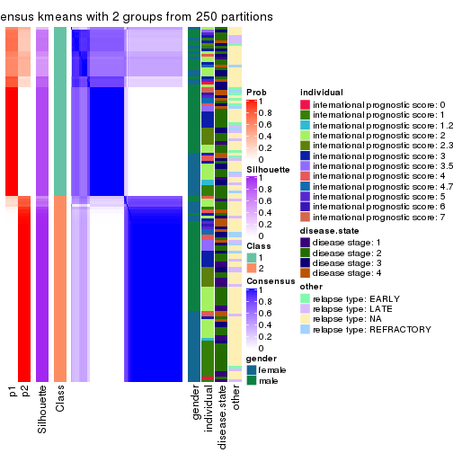</p>

</div>
<div id='tab-CV-kmeans-consensus-heatmap-2'>
<pre><code class="r">consensus_heatmap(res, k = 3)
</code></pre>

<p>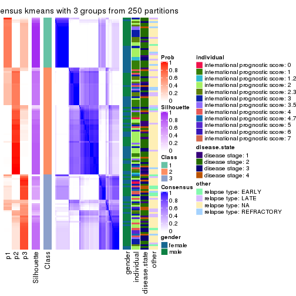</p>

</div>
<div id='tab-CV-kmeans-consensus-heatmap-3'>
<pre><code class="r">consensus_heatmap(res, k = 4)
</code></pre>

<p>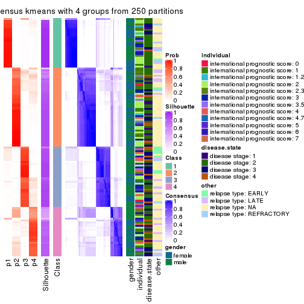</p>

</div>
<div id='tab-CV-kmeans-consensus-heatmap-4'>
<pre><code class="r">consensus_heatmap(res, k = 5)
</code></pre>

<p>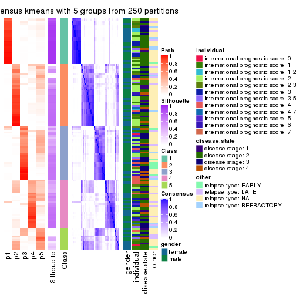</p>

</div>
<div id='tab-CV-kmeans-consensus-heatmap-5'>
<pre><code class="r">consensus_heatmap(res, k = 6)
</code></pre>

<p>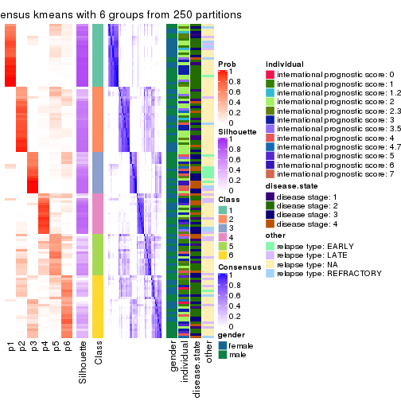</p>

</div>
</div>

Heatmaps for the membership of samples in all partitions to see how consistent they are:


<script>
$( function() {
	$( '#tabs-CV-kmeans-membership-heatmap' ).tabs();
} );
</script>
<div id='tabs-CV-kmeans-membership-heatmap'>
<ul>
<li><a href='#tab-CV-kmeans-membership-heatmap-1'>k = 2</a></li>
<li><a href='#tab-CV-kmeans-membership-heatmap-2'>k = 3</a></li>
<li><a href='#tab-CV-kmeans-membership-heatmap-3'>k = 4</a></li>
<li><a href='#tab-CV-kmeans-membership-heatmap-4'>k = 5</a></li>
<li><a href='#tab-CV-kmeans-membership-heatmap-5'>k = 6</a></li>
</ul>
<div id='tab-CV-kmeans-membership-heatmap-1'>
<pre><code class="r">membership_heatmap(res, k = 2)
</code></pre>

<p>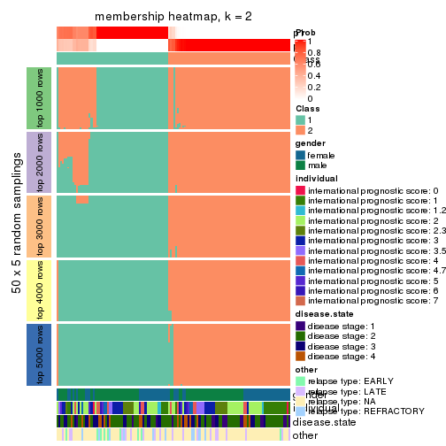</p>

</div>
<div id='tab-CV-kmeans-membership-heatmap-2'>
<pre><code class="r">membership_heatmap(res, k = 3)
</code></pre>

<p>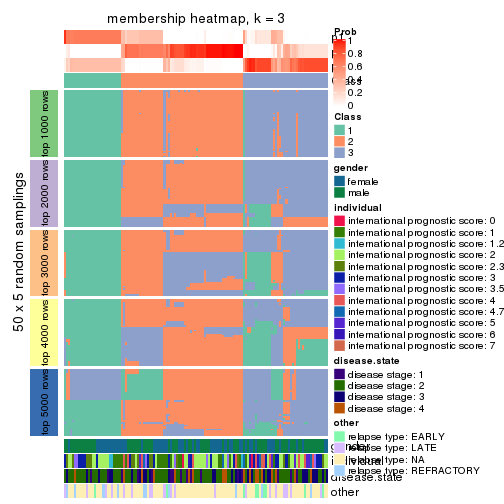</p>

</div>
<div id='tab-CV-kmeans-membership-heatmap-3'>
<pre><code class="r">membership_heatmap(res, k = 4)
</code></pre>

<p>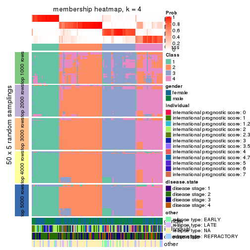</p>

</div>
<div id='tab-CV-kmeans-membership-heatmap-4'>
<pre><code class="r">membership_heatmap(res, k = 5)
</code></pre>

<p>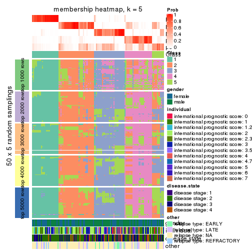</p>

</div>
<div id='tab-CV-kmeans-membership-heatmap-5'>
<pre><code class="r">membership_heatmap(res, k = 6)
</code></pre>

<p>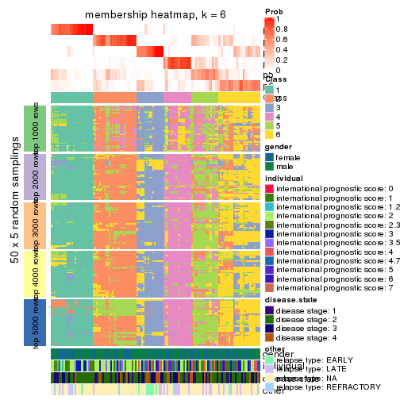</p>

</div>
</div>

As soon as we have had the classes for columns, we can look for signatures
which are significantly different between classes which can be candidate marks
for certain classes. Following are the heatmaps for signatures.


Signature heatmaps where rows are scaled:


<script>
$( function() {
	$( '#tabs-CV-kmeans-get-signatures' ).tabs();
} );
</script>
<div id='tabs-CV-kmeans-get-signatures'>
<ul>
<li><a href='#tab-CV-kmeans-get-signatures-1'>k = 2</a></li>
<li><a href='#tab-CV-kmeans-get-signatures-2'>k = 3</a></li>
<li><a href='#tab-CV-kmeans-get-signatures-3'>k = 4</a></li>
<li><a href='#tab-CV-kmeans-get-signatures-4'>k = 5</a></li>
<li><a href='#tab-CV-kmeans-get-signatures-5'>k = 6</a></li>
</ul>
<div id='tab-CV-kmeans-get-signatures-1'>
<pre><code class="r">get_signatures(res, k = 2)
</code></pre>

<p>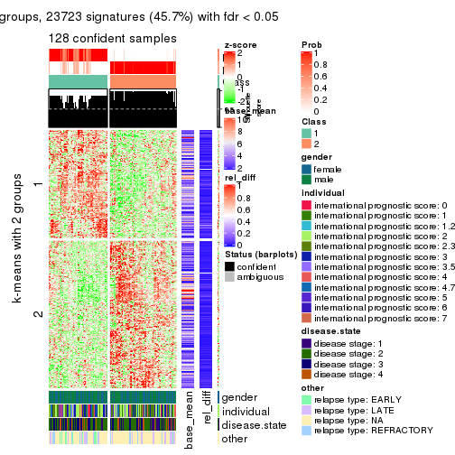</p>

</div>
<div id='tab-CV-kmeans-get-signatures-2'>
<pre><code class="r">get_signatures(res, k = 3)
</code></pre>

<p>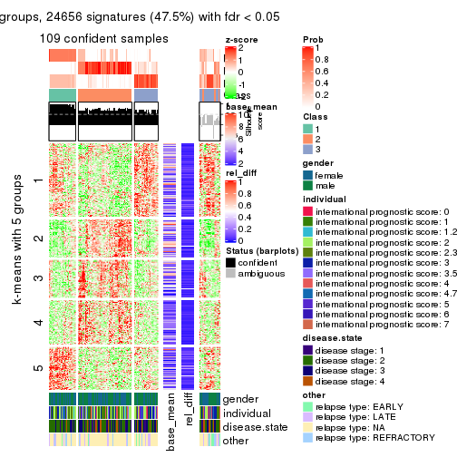</p>

</div>
<div id='tab-CV-kmeans-get-signatures-3'>
<pre><code class="r">get_signatures(res, k = 4)
</code></pre>

<p>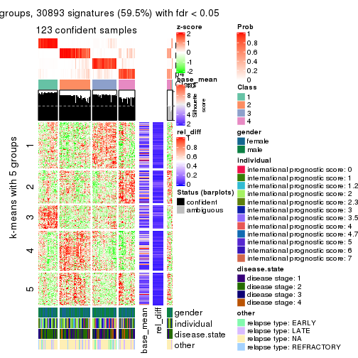</p>

</div>
<div id='tab-CV-kmeans-get-signatures-4'>
<pre><code class="r">get_signatures(res, k = 5)
</code></pre>

<p>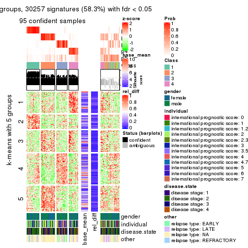</p>

</div>
<div id='tab-CV-kmeans-get-signatures-5'>
<pre><code class="r">get_signatures(res, k = 6)
</code></pre>

<pre><code>#&gt; Error: The width or height of the raster image is zero, maybe you forget to turn off the
#&gt; previous graphic device or it was corrupted. Run `dev.off()` to close it.
</code></pre>

<p></p>

</div>
</div>


Signature heatmaps where rows are not scaled:


<script>
$( function() {
	$( '#tabs-CV-kmeans-get-signatures-no-scale' ).tabs();
} );
</script>
<div id='tabs-CV-kmeans-get-signatures-no-scale'>
<ul>
<li><a href='#tab-CV-kmeans-get-signatures-no-scale-1'>k = 2</a></li>
<li><a href='#tab-CV-kmeans-get-signatures-no-scale-2'>k = 3</a></li>
<li><a href='#tab-CV-kmeans-get-signatures-no-scale-3'>k = 4</a></li>
<li><a href='#tab-CV-kmeans-get-signatures-no-scale-4'>k = 5</a></li>
<li><a href='#tab-CV-kmeans-get-signatures-no-scale-5'>k = 6</a></li>
</ul>
<div id='tab-CV-kmeans-get-signatures-no-scale-1'>
<pre><code class="r">get_signatures(res, k = 2, scale_rows = FALSE)
</code></pre>

<p>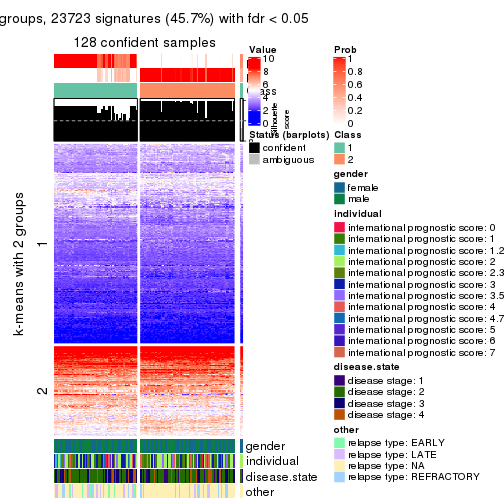</p>

</div>
<div id='tab-CV-kmeans-get-signatures-no-scale-2'>
<pre><code class="r">get_signatures(res, k = 3, scale_rows = FALSE)
</code></pre>

<p>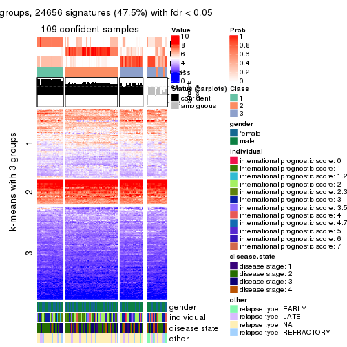</p>

</div>
<div id='tab-CV-kmeans-get-signatures-no-scale-3'>
<pre><code class="r">get_signatures(res, k = 4, scale_rows = FALSE)
</code></pre>

<p>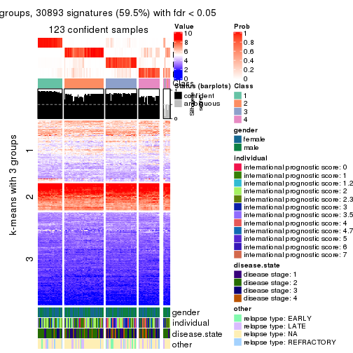</p>

</div>
<div id='tab-CV-kmeans-get-signatures-no-scale-4'>
<pre><code class="r">get_signatures(res, k = 5, scale_rows = FALSE)
</code></pre>

<p>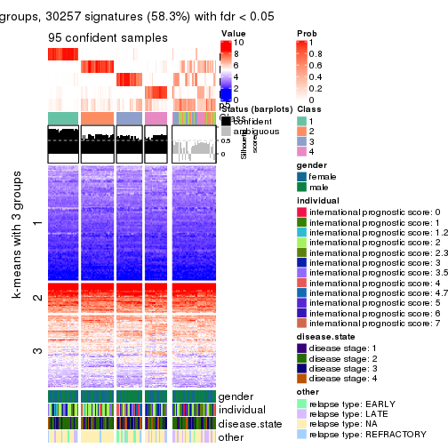</p>

</div>
<div id='tab-CV-kmeans-get-signatures-no-scale-5'>
<pre><code class="r">get_signatures(res, k = 6, scale_rows = FALSE)
</code></pre>

<pre><code>#&gt; Error in mat[ceiling(1:nr/h_ratio), ceiling(1:nc/w_ratio), drop = FALSE]: subscript out of bounds
</code></pre>

<p></p>

</div>
</div>


Compare the overlap of signatures from different k:

```r
compare_signatures(res)
```

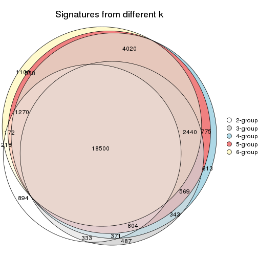

`get_signature()` returns a data frame invisibly. TO get the list of signatures, the function
call should be assigned to a variable explicitly. In following code, if `plot` argument is set
to `FALSE`, no heatmap is plotted while only the differential analysis is performed.

```r
# code only for demonstration
tb = get_signature(res, k = ..., plot = FALSE)
```

An example of the output of `tb` is:

```
#>   which_row         fdr    mean_1    mean_2 scaled_mean_1 scaled_mean_2 km
#> 1        38 0.042760348  8.373488  9.131774    -0.5533452     0.5164555  1
#> 2        40 0.018707592  7.106213  8.469186    -0.6173731     0.5762149  1
#> 3        55 0.019134737 10.221463 11.207825    -0.6159697     0.5749050  1
#> 4        59 0.006059896  5.921854  7.869574    -0.6899429     0.6439467  1
#> 5        60 0.018055526  8.928898 10.211722    -0.6204761     0.5791110  1
#> 6        98 0.009384629 15.714769 14.887706     0.6635654    -0.6193277  2
...
```

The columns in `tb` are:

1. `which_row`: row indices corresponding to the input matrix.
2. `fdr`: FDR for the differential test. 
3. `mean_x`: The mean value in group x.
4. `scaled_mean_x`: The mean value in group x after rows are scaled.
5. `km`: Row groups if k-means clustering is applied to rows.


UMAP plot which shows how samples are separated.


<script>
$( function() {
	$( '#tabs-CV-kmeans-dimension-reduction' ).tabs();
} );
</script>
<div id='tabs-CV-kmeans-dimension-reduction'>
<ul>
<li><a href='#tab-CV-kmeans-dimension-reduction-1'>k = 2</a></li>
<li><a href='#tab-CV-kmeans-dimension-reduction-2'>k = 3</a></li>
<li><a href='#tab-CV-kmeans-dimension-reduction-3'>k = 4</a></li>
<li><a href='#tab-CV-kmeans-dimension-reduction-4'>k = 5</a></li>
<li><a href='#tab-CV-kmeans-dimension-reduction-5'>k = 6</a></li>
</ul>
<div id='tab-CV-kmeans-dimension-reduction-1'>
<pre><code class="r">dimension_reduction(res, k = 2, method = &quot;UMAP&quot;)
</code></pre>

<p>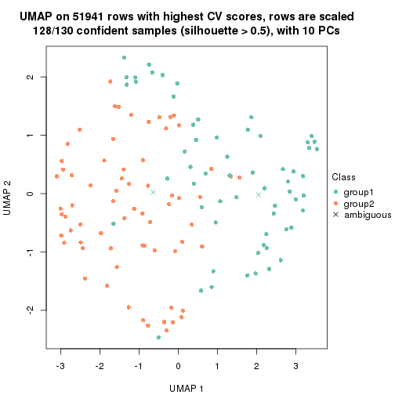</p>

</div>
<div id='tab-CV-kmeans-dimension-reduction-2'>
<pre><code class="r">dimension_reduction(res, k = 3, method = &quot;UMAP&quot;)
</code></pre>

<p>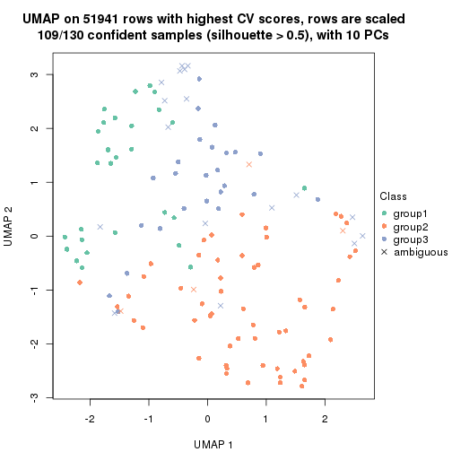</p>

</div>
<div id='tab-CV-kmeans-dimension-reduction-3'>
<pre><code class="r">dimension_reduction(res, k = 4, method = &quot;UMAP&quot;)
</code></pre>

<p>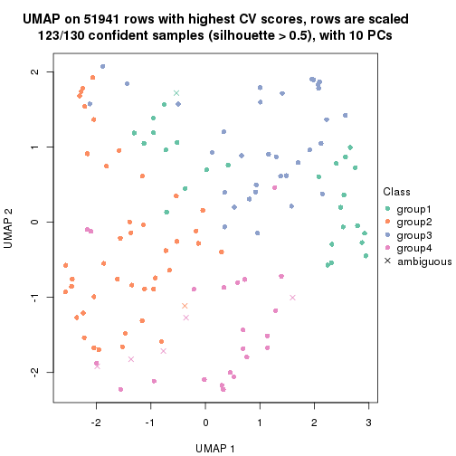</p>

</div>
<div id='tab-CV-kmeans-dimension-reduction-4'>
<pre><code class="r">dimension_reduction(res, k = 5, method = &quot;UMAP&quot;)
</code></pre>

<p>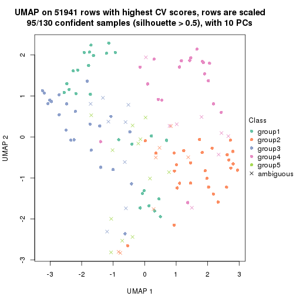</p>

</div>
<div id='tab-CV-kmeans-dimension-reduction-5'>
<pre><code class="r">dimension_reduction(res, k = 6, method = &quot;UMAP&quot;)
</code></pre>

<p>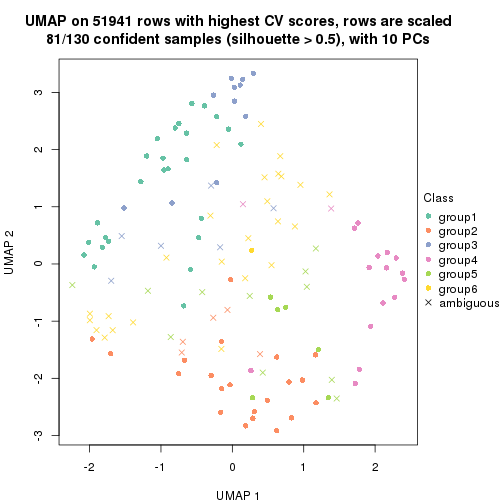</p>

</div>
</div>


Following heatmap shows how subgroups are split when increasing `k`:

```r
collect_classes(res)
```

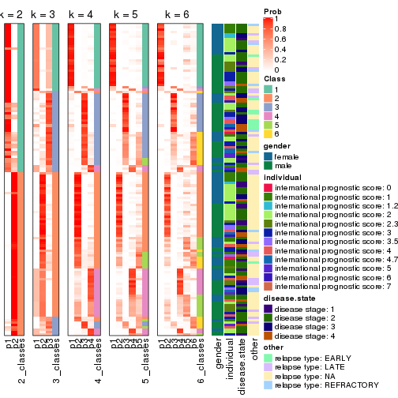


Test correlation between subgroups and known annotations. If the known
annotation is numeric, one-way ANOVA test is applied, and if the known
annotation is discrete, chi-squared contingency table test is applied.

```r
test_to_known_factors(res)
```

```
#>             n gender(p) individual(p) disease.state(p) other(p) k
#> CV:kmeans 128     0.414        0.8129           0.0230 4.07e-02 2
#> CV:kmeans 109     0.218        0.2786           0.0709 5.00e-01 3
#> CV:kmeans 123     0.234        0.1668           0.0496 5.22e-02 4
#> CV:kmeans  95     0.145        0.0538           0.0167 3.24e-04 5
#> CV:kmeans  81     0.807        0.1955           0.0321 7.57e-05 6
```


If matrix rows can be associated to genes, consider to use `GO_Enrichment(res,
...)` to perform function enrichment for the signature genes.


 

---------------------------------------------------


### CV:skmeans*


The object with results only for a single top-value method and a single partition method 
can be extracted as:

```r
res = res_list["CV", "skmeans"]
# you can also extract it by
# res = res_list["CV:skmeans"]
```

A summary of `res` and all the functions that can be applied to it:

```r
res
```

```
#> A 'ConsensusPartition' object with k = 2, 3, 4, 5, 6.
#>   On a matrix with 51941 rows and 130 columns.
#>   Top rows (1000, 2000, 3000, 4000, 5000) are extracted by 'CV' method.
#>   Subgroups are detected by 'skmeans' method.
#>   Performed in total 1250 partitions by row resampling.
#>   Best k for subgroups seems to be 4.
#> 
#> Following methods can be applied to this 'ConsensusPartition' object:
#>  [1] "cola_report"             "collect_classes"         "collect_plots"          
#>  [4] "collect_stats"           "colnames"                "compare_signatures"     
#>  [7] "consensus_heatmap"       "dimension_reduction"     "functional_enrichment"  
#> [10] "get_anno_col"            "get_anno"                "get_classes"            
#> [13] "get_consensus"           "get_matrix"              "get_membership"         
#> [16] "get_param"               "get_signatures"          "get_stats"              
#> [19] "is_best_k"               "is_stable_k"             "membership_heatmap"     
#> [22] "ncol"                    "nrow"                    "plot_ecdf"              
#> [25] "rownames"                "select_partition_number" "show"                   
#> [28] "suggest_best_k"          "test_to_known_factors"
```

`collect_plots()` function collects all the plots made from `res` for all `k` (number of partitions)
into one single page to provide an easy and fast comparison between different `k`.

```r
collect_plots(res)
```

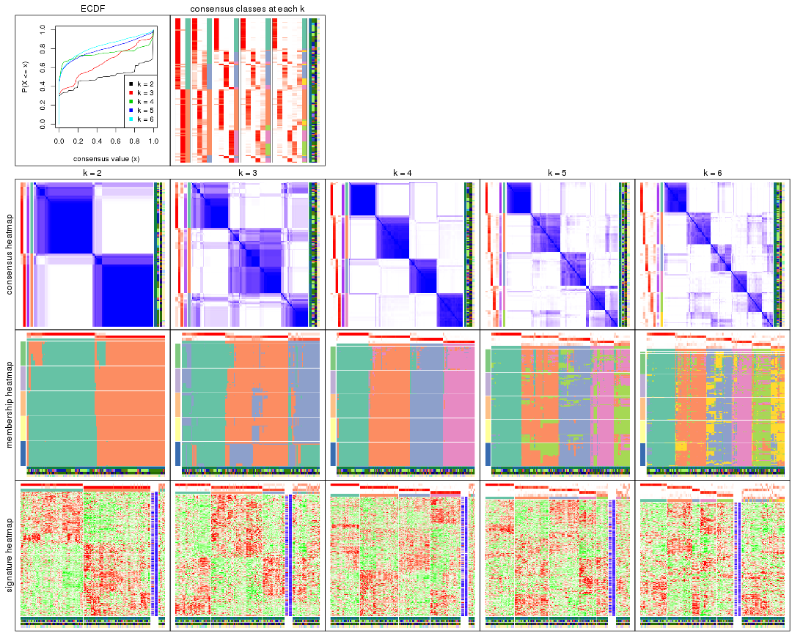

The plots are:

- The first row: a plot of the ECDF (Empirical cumulative distribution
  function) curves of the consensus matrix for each `k` and the heatmap of
  predicted classes for each `k`.
- The second row: heatmaps of the consensus matrix for each `k`.
- The third row: heatmaps of the membership matrix for each `k`.
- The fouth row: heatmaps of the signatures for each `k`.

All the plots in panels can be made by individual functions and they are
plotted later in this section.

`select_partition_number()` produces several plots showing different
statistics for choosing "optimized" `k`. There are following statistics:

- ECDF curves of the consensus matrix for each `k`;
- 1-PAC. [The PAC
  score](https://en.wikipedia.org/wiki/Consensus_clustering#Over-interpretation_potential_of_consensus_clustering)
  measures the proportion of the ambiguous subgrouping.
- Mean silhouette score.
- Concordance. The mean probability of fiting the consensus class ids in all
  partitions.
- Area increased. Denote $A_k$ as the area under the ECDF curve for current
  `k`, the area increased is defined as $A_k - A_{k-1}$.
- Rand index. The percent of pairs of samples that are both in a same cluster
  or both are not in a same cluster in the partition of k and k-1.
- Jaccard index. The ratio of pairs of samples are both in a same cluster in
  the partition of k and k-1 and the pairs of samples are both in a same
  cluster in the partition k or k-1.

The detailed explanations of these statistics can be found in [the cola
vignette](http://bioconductor.org/packages/devel/bioc/vignettes/cola/inst/doc/cola.html#toc_13).

Generally speaking, lower PAC score, higher mean silhouette score or higher
concordance corresponds to better partition. Rand index and Jaccard index
measure how similar the current partition is compared to partition with `k-1`.
If they are too similar, we won't accept `k` is better than `k-1`.

```r
select_partition_number(res)
```

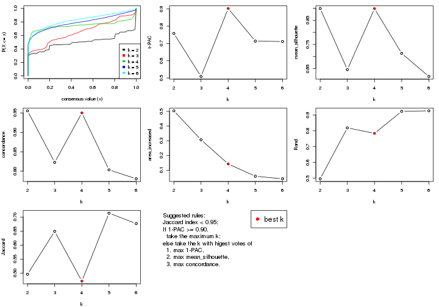

The numeric values for all these statistics can be obtained by `get_stats()`.

```r
get_stats(res)
```

```
#>   k 1-PAC mean_silhouette concordance area_increased  Rand Jaccard
#> 2 2 0.758           0.899       0.956         0.5036 0.496   0.496
#> 3 3 0.509           0.646       0.823         0.3068 0.819   0.649
#> 4 4 0.902           0.898       0.950         0.1422 0.784   0.472
#> 5 5 0.714           0.713       0.803         0.0586 0.924   0.714
#> 6 6 0.711           0.617       0.780         0.0413 0.927   0.677
```

`suggest_best_k()` suggests the best $k$ based on these statistics. The rules are as follows:

- All $k$ with Jaccard index larger than 0.95 are removed because the increase of
  the partition number does not provides enough extra information. If all $k$ are removed,
  the best $k$ is assigned by `NA`.
- For $k$ with 1-PAC larger than 0.9, the maximal $k$ is taken as the "best k". Other $k$ is called "optional k".
- If it does not fit the second rule. The $k$ with the highest vote of highest
  1-PAC, mean silhouette and concordance is taken as the "best k".

```r
suggest_best_k(res)
```

```
#> [1] 4
```


Following shows the table of the partitions (You need to click the **show/hide
code output** link to see it). The membership matrix (columns with name `p*`)
is inferred by
[`clue::cl_consensus()`](https://www.rdocumentation.org/link/cl_consensus?package=clue)
function with the `SE` method. Basically the value in the membership matrix
represents the probability to belong to a certain group. The finall class
label for an item is determined with the group with highest probability it
belongs to.

In `get_classes()` function, the entropy is calculated from the membership
matrix and the silhouette score is calculated from the consensus matrix.


<script>
$( function() {
	$( '#tabs-CV-skmeans-get-classes' ).tabs();
} );
</script>
<div id='tabs-CV-skmeans-get-classes'>
<ul>
<li><a href='#tab-CV-skmeans-get-classes-1'>k = 2</a></li>
<li><a href='#tab-CV-skmeans-get-classes-2'>k = 3</a></li>
<li><a href='#tab-CV-skmeans-get-classes-3'>k = 4</a></li>
<li><a href='#tab-CV-skmeans-get-classes-4'>k = 5</a></li>
<li><a href='#tab-CV-skmeans-get-classes-5'>k = 6</a></li>
</ul>

<div id='tab-CV-skmeans-get-classes-1'>
<p><a id='tab-CV-skmeans-get-classes-1-a' style='color:#0366d6' href='#'>show/hide code output</a></p>
<pre><code class="r">cbind(get_classes(res, k = 2), get_membership(res, k = 2))
</code></pre>

<pre><code>#&gt;           class entropy silhouette    p1    p2
#&gt; GSM447671     2  0.0000     0.9605 0.000 1.000
#&gt; GSM447694     1  0.0000     0.9413 1.000 0.000
#&gt; GSM447618     2  0.0000     0.9605 0.000 1.000
#&gt; GSM447691     2  0.0000     0.9605 0.000 1.000
#&gt; GSM447733     2  0.0000     0.9605 0.000 1.000
#&gt; GSM447620     2  0.0000     0.9605 0.000 1.000
#&gt; GSM447627     1  0.0376     0.9390 0.996 0.004
#&gt; GSM447630     2  0.0000     0.9605 0.000 1.000
#&gt; GSM447642     1  0.0000     0.9413 1.000 0.000
#&gt; GSM447649     2  0.0000     0.9605 0.000 1.000
#&gt; GSM447654     2  0.0000     0.9605 0.000 1.000
#&gt; GSM447655     2  0.0000     0.9605 0.000 1.000
#&gt; GSM447669     2  0.0000     0.9605 0.000 1.000
#&gt; GSM447676     1  0.0000     0.9413 1.000 0.000
#&gt; GSM447678     2  0.0000     0.9605 0.000 1.000
#&gt; GSM447681     2  0.0000     0.9605 0.000 1.000
#&gt; GSM447698     2  0.0000     0.9605 0.000 1.000
#&gt; GSM447713     1  0.0000     0.9413 1.000 0.000
#&gt; GSM447722     2  0.0000     0.9605 0.000 1.000
#&gt; GSM447726     1  0.9775     0.2599 0.588 0.412
#&gt; GSM447735     1  0.4161     0.8836 0.916 0.084
#&gt; GSM447737     1  0.0000     0.9413 1.000 0.000
#&gt; GSM447657     2  0.0000     0.9605 0.000 1.000
#&gt; GSM447674     2  0.0000     0.9605 0.000 1.000
#&gt; GSM447636     1  0.0000     0.9413 1.000 0.000
#&gt; GSM447723     1  0.0000     0.9413 1.000 0.000
#&gt; GSM447699     1  0.9710     0.4112 0.600 0.400
#&gt; GSM447708     2  0.0000     0.9605 0.000 1.000
#&gt; GSM447721     1  0.0000     0.9413 1.000 0.000
#&gt; GSM447623     1  0.0000     0.9413 1.000 0.000
#&gt; GSM447621     1  0.0000     0.9413 1.000 0.000
#&gt; GSM447650     2  0.0000     0.9605 0.000 1.000
#&gt; GSM447651     2  0.0000     0.9605 0.000 1.000
#&gt; GSM447653     2  0.9963     0.0243 0.464 0.536
#&gt; GSM447658     1  0.0000     0.9413 1.000 0.000
#&gt; GSM447675     2  0.0000     0.9605 0.000 1.000
#&gt; GSM447680     2  0.7219     0.7601 0.200 0.800
#&gt; GSM447686     1  0.9710     0.2963 0.600 0.400
#&gt; GSM447736     1  0.2043     0.9221 0.968 0.032
#&gt; GSM447629     2  0.7219     0.7601 0.200 0.800
#&gt; GSM447648     1  0.0000     0.9413 1.000 0.000
#&gt; GSM447660     1  0.0000     0.9413 1.000 0.000
#&gt; GSM447661     2  0.0000     0.9605 0.000 1.000
#&gt; GSM447663     1  0.7219     0.7718 0.800 0.200
#&gt; GSM447704     2  0.0000     0.9605 0.000 1.000
#&gt; GSM447720     1  0.0000     0.9413 1.000 0.000
#&gt; GSM447652     2  0.0000     0.9605 0.000 1.000
#&gt; GSM447679     2  0.0000     0.9605 0.000 1.000
#&gt; GSM447712     1  0.0000     0.9413 1.000 0.000
#&gt; GSM447664     2  0.7219     0.7601 0.200 0.800
#&gt; GSM447637     1  0.0000     0.9413 1.000 0.000
#&gt; GSM447639     2  0.0000     0.9605 0.000 1.000
#&gt; GSM447615     1  0.0000     0.9413 1.000 0.000
#&gt; GSM447656     2  0.7674     0.7273 0.224 0.776
#&gt; GSM447673     2  0.0000     0.9605 0.000 1.000
#&gt; GSM447719     1  0.0000     0.9413 1.000 0.000
#&gt; GSM447706     1  0.0000     0.9413 1.000 0.000
#&gt; GSM447612     2  0.9000     0.4861 0.316 0.684
#&gt; GSM447665     2  0.0000     0.9605 0.000 1.000
#&gt; GSM447677     2  0.0000     0.9605 0.000 1.000
#&gt; GSM447613     1  0.0000     0.9413 1.000 0.000
#&gt; GSM447659     2  0.0000     0.9605 0.000 1.000
#&gt; GSM447662     1  0.7219     0.7718 0.800 0.200
#&gt; GSM447666     1  0.6247     0.8188 0.844 0.156
#&gt; GSM447668     2  0.0000     0.9605 0.000 1.000
#&gt; GSM447682     2  0.0000     0.9605 0.000 1.000
#&gt; GSM447683     2  0.0000     0.9605 0.000 1.000
#&gt; GSM447688     2  0.0000     0.9605 0.000 1.000
#&gt; GSM447702     2  0.0000     0.9605 0.000 1.000
#&gt; GSM447709     2  0.0000     0.9605 0.000 1.000
#&gt; GSM447711     1  0.0000     0.9413 1.000 0.000
#&gt; GSM447715     1  0.0000     0.9413 1.000 0.000
#&gt; GSM447693     1  0.1633     0.9270 0.976 0.024
#&gt; GSM447611     2  0.7219     0.7601 0.200 0.800
#&gt; GSM447672     2  0.0000     0.9605 0.000 1.000
#&gt; GSM447703     2  0.0000     0.9605 0.000 1.000
#&gt; GSM447727     1  0.0000     0.9413 1.000 0.000
#&gt; GSM447638     1  0.0000     0.9413 1.000 0.000
#&gt; GSM447670     1  0.0000     0.9413 1.000 0.000
#&gt; GSM447700     2  0.0000     0.9605 0.000 1.000
#&gt; GSM447738     2  0.0000     0.9605 0.000 1.000
#&gt; GSM447739     1  0.0000     0.9413 1.000 0.000
#&gt; GSM447617     1  0.0000     0.9413 1.000 0.000
#&gt; GSM447628     2  0.0000     0.9605 0.000 1.000
#&gt; GSM447632     2  0.0000     0.9605 0.000 1.000
#&gt; GSM447619     1  0.7219     0.7718 0.800 0.200
#&gt; GSM447643     1  0.0376     0.9387 0.996 0.004
#&gt; GSM447724     2  0.0000     0.9605 0.000 1.000
#&gt; GSM447728     2  0.0000     0.9605 0.000 1.000
#&gt; GSM447610     1  0.0000     0.9413 1.000 0.000
#&gt; GSM447633     2  0.0000     0.9605 0.000 1.000
#&gt; GSM447634     1  0.0000     0.9413 1.000 0.000
#&gt; GSM447622     1  0.0000     0.9413 1.000 0.000
#&gt; GSM447667     2  0.7219     0.7601 0.200 0.800
#&gt; GSM447687     2  0.0000     0.9605 0.000 1.000
#&gt; GSM447695     1  0.0000     0.9413 1.000 0.000
#&gt; GSM447696     1  0.0000     0.9413 1.000 0.000
#&gt; GSM447697     1  0.0000     0.9413 1.000 0.000
#&gt; GSM447714     1  0.7219     0.7718 0.800 0.200
#&gt; GSM447717     1  0.0000     0.9413 1.000 0.000
#&gt; GSM447725     1  0.0000     0.9413 1.000 0.000
#&gt; GSM447729     2  0.0000     0.9605 0.000 1.000
#&gt; GSM447644     2  0.0000     0.9605 0.000 1.000
#&gt; GSM447710     1  0.4690     0.8704 0.900 0.100
#&gt; GSM447614     1  0.0000     0.9413 1.000 0.000
#&gt; GSM447685     2  0.0938     0.9508 0.012 0.988
#&gt; GSM447690     1  0.0000     0.9413 1.000 0.000
#&gt; GSM447730     2  0.0000     0.9605 0.000 1.000
#&gt; GSM447646     2  0.0000     0.9605 0.000 1.000
#&gt; GSM447689     1  0.4690     0.8704 0.900 0.100
#&gt; GSM447635     2  0.6148     0.8164 0.152 0.848
#&gt; GSM447641     1  0.0000     0.9413 1.000 0.000
#&gt; GSM447716     2  0.6247     0.8119 0.156 0.844
#&gt; GSM447718     1  0.9608     0.4505 0.616 0.384
#&gt; GSM447616     1  0.0000     0.9413 1.000 0.000
#&gt; GSM447626     1  0.0000     0.9413 1.000 0.000
#&gt; GSM447640     2  0.0000     0.9605 0.000 1.000
#&gt; GSM447734     1  0.7219     0.7718 0.800 0.200
#&gt; GSM447692     1  0.0000     0.9413 1.000 0.000
#&gt; GSM447647     2  0.0000     0.9605 0.000 1.000
#&gt; GSM447624     1  0.0000     0.9413 1.000 0.000
#&gt; GSM447625     1  0.7219     0.7718 0.800 0.200
#&gt; GSM447707     2  0.0000     0.9605 0.000 1.000
#&gt; GSM447732     1  0.6148     0.8228 0.848 0.152
#&gt; GSM447684     1  0.0000     0.9413 1.000 0.000
#&gt; GSM447731     2  0.0000     0.9605 0.000 1.000
#&gt; GSM447705     2  0.0672     0.9538 0.008 0.992
#&gt; GSM447631     1  0.0000     0.9413 1.000 0.000
#&gt; GSM447701     2  0.0000     0.9605 0.000 1.000
#&gt; GSM447645     1  0.0000     0.9413 1.000 0.000
</code></pre>

<script>
$('#tab-CV-skmeans-get-classes-1-a').parent().next().next().hide();
$('#tab-CV-skmeans-get-classes-1-a').click(function(){
  $('#tab-CV-skmeans-get-classes-1-a').parent().next().next().toggle();
  return(false);
});
</script>
</div>

<div id='tab-CV-skmeans-get-classes-2'>
<p><a id='tab-CV-skmeans-get-classes-2-a' style='color:#0366d6' href='#'>show/hide code output</a></p>
<pre><code class="r">cbind(get_classes(res, k = 3), get_membership(res, k = 3))
</code></pre>

<pre><code>#&gt;           class entropy silhouette    p1    p2    p3
#&gt; GSM447671     2  0.5926    0.40758 0.000 0.644 0.356
#&gt; GSM447694     3  0.4654    0.72804 0.208 0.000 0.792
#&gt; GSM447618     2  0.2356    0.77158 0.000 0.928 0.072
#&gt; GSM447691     2  0.5926    0.40758 0.000 0.644 0.356
#&gt; GSM447733     3  0.6299   -0.28109 0.000 0.476 0.524
#&gt; GSM447620     2  0.6095    0.33129 0.000 0.608 0.392
#&gt; GSM447627     3  0.6305    0.14554 0.484 0.000 0.516
#&gt; GSM447630     2  0.6192    0.25541 0.000 0.580 0.420
#&gt; GSM447642     1  0.0000    0.83265 1.000 0.000 0.000
#&gt; GSM447649     2  0.0000    0.80569 0.000 1.000 0.000
#&gt; GSM447654     2  0.4291    0.76597 0.000 0.820 0.180
#&gt; GSM447655     2  0.0000    0.80569 0.000 1.000 0.000
#&gt; GSM447669     2  0.5988    0.38229 0.000 0.632 0.368
#&gt; GSM447676     1  0.0892    0.82271 0.980 0.000 0.020
#&gt; GSM447678     2  0.4291    0.76597 0.000 0.820 0.180
#&gt; GSM447681     2  0.0000    0.80569 0.000 1.000 0.000
#&gt; GSM447698     2  0.4002    0.77421 0.000 0.840 0.160
#&gt; GSM447713     1  0.0000    0.83265 1.000 0.000 0.000
#&gt; GSM447722     2  0.4291    0.76597 0.000 0.820 0.180
#&gt; GSM447726     3  0.9251    0.37978 0.212 0.260 0.528
#&gt; GSM447735     3  0.7993   -0.18625 0.456 0.060 0.484
#&gt; GSM447737     1  0.0000    0.83265 1.000 0.000 0.000
#&gt; GSM447657     2  0.0000    0.80569 0.000 1.000 0.000
#&gt; GSM447674     2  0.0000    0.80569 0.000 1.000 0.000
#&gt; GSM447636     1  0.1031    0.82006 0.976 0.000 0.024
#&gt; GSM447723     1  0.0000    0.83265 1.000 0.000 0.000
#&gt; GSM447699     3  0.7585    0.66250 0.180 0.132 0.688
#&gt; GSM447708     2  0.1289    0.79308 0.000 0.968 0.032
#&gt; GSM447721     1  0.0000    0.83265 1.000 0.000 0.000
#&gt; GSM447623     1  0.0000    0.83265 1.000 0.000 0.000
#&gt; GSM447621     1  0.0000    0.83265 1.000 0.000 0.000
#&gt; GSM447650     2  0.0000    0.80569 0.000 1.000 0.000
#&gt; GSM447651     2  0.2165    0.77987 0.000 0.936 0.064
#&gt; GSM447653     3  0.8322    0.25658 0.124 0.268 0.608
#&gt; GSM447658     1  0.0892    0.82271 0.980 0.000 0.020
#&gt; GSM447675     2  0.4291    0.76597 0.000 0.820 0.180
#&gt; GSM447680     2  0.7263    0.36304 0.372 0.592 0.036
#&gt; GSM447686     1  0.4409    0.63835 0.824 0.172 0.004
#&gt; GSM447736     3  0.4291    0.75651 0.180 0.000 0.820
#&gt; GSM447629     2  0.4555    0.65978 0.200 0.800 0.000
#&gt; GSM447648     1  0.6286   -0.00459 0.536 0.000 0.464
#&gt; GSM447660     1  0.1031    0.82006 0.976 0.000 0.024
#&gt; GSM447661     2  0.0000    0.80569 0.000 1.000 0.000
#&gt; GSM447663     3  0.4291    0.75651 0.180 0.000 0.820
#&gt; GSM447704     2  0.0000    0.80569 0.000 1.000 0.000
#&gt; GSM447720     3  0.4504    0.74309 0.196 0.000 0.804
#&gt; GSM447652     2  0.0237    0.80562 0.000 0.996 0.004
#&gt; GSM447679     2  0.0000    0.80569 0.000 1.000 0.000
#&gt; GSM447712     1  0.0000    0.83265 1.000 0.000 0.000
#&gt; GSM447664     2  0.8478    0.60210 0.204 0.616 0.180
#&gt; GSM447637     1  0.6299   -0.04773 0.524 0.000 0.476
#&gt; GSM447639     2  0.5968    0.55862 0.000 0.636 0.364
#&gt; GSM447615     1  0.0424    0.82792 0.992 0.000 0.008
#&gt; GSM447656     2  0.6305    0.08743 0.484 0.516 0.000
#&gt; GSM447673     2  0.4291    0.76597 0.000 0.820 0.180
#&gt; GSM447719     3  0.5948    0.12030 0.360 0.000 0.640
#&gt; GSM447706     3  0.4291    0.75651 0.180 0.000 0.820
#&gt; GSM447612     3  0.4465    0.75515 0.176 0.004 0.820
#&gt; GSM447665     2  0.5859    0.43093 0.000 0.656 0.344
#&gt; GSM447677     2  0.1411    0.79112 0.000 0.964 0.036
#&gt; GSM447613     1  0.0000    0.83265 1.000 0.000 0.000
#&gt; GSM447659     3  0.3619    0.54014 0.000 0.136 0.864
#&gt; GSM447662     3  0.4291    0.75651 0.180 0.000 0.820
#&gt; GSM447666     3  0.4862    0.65213 0.020 0.160 0.820
#&gt; GSM447668     2  0.1411    0.79112 0.000 0.964 0.036
#&gt; GSM447682     2  0.0237    0.80562 0.000 0.996 0.004
#&gt; GSM447683     2  0.0000    0.80569 0.000 1.000 0.000
#&gt; GSM447688     2  0.4002    0.77421 0.000 0.840 0.160
#&gt; GSM447702     2  0.0000    0.80569 0.000 1.000 0.000
#&gt; GSM447709     2  0.4931    0.61612 0.000 0.768 0.232
#&gt; GSM447711     1  0.0000    0.83265 1.000 0.000 0.000
#&gt; GSM447715     1  0.0000    0.83265 1.000 0.000 0.000
#&gt; GSM447693     3  0.4291    0.75651 0.180 0.000 0.820
#&gt; GSM447611     2  0.8557    0.59247 0.212 0.608 0.180
#&gt; GSM447672     2  0.0000    0.80569 0.000 1.000 0.000
#&gt; GSM447703     2  0.4002    0.77421 0.000 0.840 0.160
#&gt; GSM447727     1  0.0000    0.83265 1.000 0.000 0.000
#&gt; GSM447638     1  0.6986    0.53863 0.724 0.180 0.096
#&gt; GSM447670     1  0.0000    0.83265 1.000 0.000 0.000
#&gt; GSM447700     2  0.6309    0.38254 0.000 0.504 0.496
#&gt; GSM447738     2  0.4002    0.77421 0.000 0.840 0.160
#&gt; GSM447739     1  0.0000    0.83265 1.000 0.000 0.000
#&gt; GSM447617     1  0.0000    0.83265 1.000 0.000 0.000
#&gt; GSM447628     2  0.4291    0.76597 0.000 0.820 0.180
#&gt; GSM447632     2  0.4002    0.77421 0.000 0.840 0.160
#&gt; GSM447619     3  0.4291    0.75651 0.180 0.000 0.820
#&gt; GSM447643     1  0.4235    0.63593 0.824 0.176 0.000
#&gt; GSM447724     3  0.5882    0.11375 0.000 0.348 0.652
#&gt; GSM447728     2  0.0000    0.80569 0.000 1.000 0.000
#&gt; GSM447610     1  0.4291    0.64823 0.820 0.000 0.180
#&gt; GSM447633     3  0.6095    0.24980 0.000 0.392 0.608
#&gt; GSM447634     3  0.6062    0.44388 0.384 0.000 0.616
#&gt; GSM447622     1  0.5138    0.54221 0.748 0.000 0.252
#&gt; GSM447667     2  0.5024    0.63843 0.220 0.776 0.004
#&gt; GSM447687     2  0.4002    0.77421 0.000 0.840 0.160
#&gt; GSM447695     1  0.6260    0.02371 0.552 0.000 0.448
#&gt; GSM447696     1  0.0000    0.83265 1.000 0.000 0.000
#&gt; GSM447697     1  0.0000    0.83265 1.000 0.000 0.000
#&gt; GSM447714     3  0.4291    0.75651 0.180 0.000 0.820
#&gt; GSM447717     1  0.0000    0.83265 1.000 0.000 0.000
#&gt; GSM447725     1  0.1031    0.82006 0.976 0.000 0.024
#&gt; GSM447729     2  0.4291    0.76597 0.000 0.820 0.180
#&gt; GSM447644     2  0.6154    0.29429 0.000 0.592 0.408
#&gt; GSM447710     3  0.4291    0.75651 0.180 0.000 0.820
#&gt; GSM447614     1  0.6309    0.23839 0.500 0.000 0.500
#&gt; GSM447685     2  0.0237    0.80491 0.004 0.996 0.000
#&gt; GSM447690     1  0.0892    0.82271 0.980 0.000 0.020
#&gt; GSM447730     2  0.0000    0.80569 0.000 1.000 0.000
#&gt; GSM447646     2  0.4291    0.76597 0.000 0.820 0.180
#&gt; GSM447689     3  0.4291    0.75651 0.180 0.000 0.820
#&gt; GSM447635     2  0.8219    0.62899 0.180 0.640 0.180
#&gt; GSM447641     1  0.0000    0.83265 1.000 0.000 0.000
#&gt; GSM447716     2  0.8396    0.61118 0.196 0.624 0.180
#&gt; GSM447718     3  0.4749    0.74984 0.172 0.012 0.816
#&gt; GSM447616     1  0.5016    0.56253 0.760 0.000 0.240
#&gt; GSM447626     3  0.4291    0.75651 0.180 0.000 0.820
#&gt; GSM447640     2  0.0000    0.80569 0.000 1.000 0.000
#&gt; GSM447734     3  0.4291    0.75651 0.180 0.000 0.820
#&gt; GSM447692     1  0.4974    0.56825 0.764 0.000 0.236
#&gt; GSM447647     2  0.4291    0.76597 0.000 0.820 0.180
#&gt; GSM447624     1  0.2711    0.76170 0.912 0.000 0.088
#&gt; GSM447625     3  0.4291    0.75651 0.180 0.000 0.820
#&gt; GSM447707     2  0.0000    0.80569 0.000 1.000 0.000
#&gt; GSM447732     3  0.4291    0.75651 0.180 0.000 0.820
#&gt; GSM447684     1  0.5650    0.34086 0.688 0.000 0.312
#&gt; GSM447731     2  0.5254    0.71361 0.000 0.736 0.264
#&gt; GSM447705     3  0.4862    0.65213 0.020 0.160 0.820
#&gt; GSM447631     1  0.6291   -0.01889 0.532 0.000 0.468
#&gt; GSM447701     2  0.4121    0.68459 0.000 0.832 0.168
#&gt; GSM447645     1  0.6295   -0.03336 0.528 0.000 0.472
</code></pre>

<script>
$('#tab-CV-skmeans-get-classes-2-a').parent().next().next().hide();
$('#tab-CV-skmeans-get-classes-2-a').click(function(){
  $('#tab-CV-skmeans-get-classes-2-a').parent().next().next().toggle();
  return(false);
});
</script>
</div>

<div id='tab-CV-skmeans-get-classes-3'>
<p><a id='tab-CV-skmeans-get-classes-3-a' style='color:#0366d6' href='#'>show/hide code output</a></p>
<pre><code class="r">cbind(get_classes(res, k = 4), get_membership(res, k = 4))
</code></pre>

<pre><code>#&gt;           class entropy silhouette    p1    p2    p3    p4
#&gt; GSM447671     2  0.0707     0.9341 0.000 0.980 0.000 0.020
#&gt; GSM447694     3  0.0188     0.9419 0.000 0.000 0.996 0.004
#&gt; GSM447618     2  0.3649     0.7646 0.000 0.796 0.000 0.204
#&gt; GSM447691     2  0.0707     0.9348 0.000 0.980 0.000 0.020
#&gt; GSM447733     4  0.1059     0.9508 0.000 0.012 0.016 0.972
#&gt; GSM447620     2  0.3583     0.7898 0.000 0.816 0.180 0.004
#&gt; GSM447627     3  0.1022     0.9290 0.000 0.000 0.968 0.032
#&gt; GSM447630     2  0.0000     0.9376 0.000 1.000 0.000 0.000
#&gt; GSM447642     1  0.0000     0.9653 1.000 0.000 0.000 0.000
#&gt; GSM447649     2  0.1022     0.9299 0.000 0.968 0.000 0.032
#&gt; GSM447654     4  0.0921     0.9544 0.000 0.028 0.000 0.972
#&gt; GSM447655     2  0.0188     0.9375 0.000 0.996 0.000 0.004
#&gt; GSM447669     2  0.0188     0.9373 0.000 0.996 0.000 0.004
#&gt; GSM447676     1  0.0000     0.9653 1.000 0.000 0.000 0.000
#&gt; GSM447678     4  0.0000     0.9550 0.000 0.000 0.000 1.000
#&gt; GSM447681     2  0.0336     0.9373 0.000 0.992 0.000 0.008
#&gt; GSM447698     4  0.1022     0.9518 0.000 0.032 0.000 0.968
#&gt; GSM447713     1  0.0000     0.9653 1.000 0.000 0.000 0.000
#&gt; GSM447722     4  0.0921     0.9526 0.000 0.028 0.000 0.972
#&gt; GSM447726     2  0.2032     0.9078 0.028 0.936 0.036 0.000
#&gt; GSM447735     4  0.0000     0.9550 0.000 0.000 0.000 1.000
#&gt; GSM447737     1  0.0000     0.9653 1.000 0.000 0.000 0.000
#&gt; GSM447657     2  0.0707     0.9343 0.000 0.980 0.000 0.020
#&gt; GSM447674     2  0.0707     0.9343 0.000 0.980 0.000 0.020
#&gt; GSM447636     1  0.0000     0.9653 1.000 0.000 0.000 0.000
#&gt; GSM447723     1  0.0000     0.9653 1.000 0.000 0.000 0.000
#&gt; GSM447699     3  0.4095     0.7828 0.000 0.024 0.804 0.172
#&gt; GSM447708     2  0.0707     0.9348 0.000 0.980 0.000 0.020
#&gt; GSM447721     1  0.0000     0.9653 1.000 0.000 0.000 0.000
#&gt; GSM447623     1  0.0000     0.9653 1.000 0.000 0.000 0.000
#&gt; GSM447621     1  0.0000     0.9653 1.000 0.000 0.000 0.000
#&gt; GSM447650     2  0.0000     0.9376 0.000 1.000 0.000 0.000
#&gt; GSM447651     2  0.0000     0.9376 0.000 1.000 0.000 0.000
#&gt; GSM447653     4  0.0592     0.9518 0.000 0.000 0.016 0.984
#&gt; GSM447658     1  0.0000     0.9653 1.000 0.000 0.000 0.000
#&gt; GSM447675     4  0.0000     0.9550 0.000 0.000 0.000 1.000
#&gt; GSM447680     2  0.3486     0.7637 0.188 0.812 0.000 0.000
#&gt; GSM447686     1  0.0000     0.9653 1.000 0.000 0.000 0.000
#&gt; GSM447736     3  0.0188     0.9419 0.000 0.000 0.996 0.004
#&gt; GSM447629     2  0.4012     0.7610 0.184 0.800 0.000 0.016
#&gt; GSM447648     3  0.0000     0.9429 0.000 0.000 1.000 0.000
#&gt; GSM447660     1  0.0000     0.9653 1.000 0.000 0.000 0.000
#&gt; GSM447661     2  0.0000     0.9376 0.000 1.000 0.000 0.000
#&gt; GSM447663     3  0.2345     0.8819 0.000 0.100 0.900 0.000
#&gt; GSM447704     2  0.1118     0.9257 0.000 0.964 0.000 0.036
#&gt; GSM447720     3  0.2401     0.8874 0.000 0.092 0.904 0.004
#&gt; GSM447652     2  0.0000     0.9376 0.000 1.000 0.000 0.000
#&gt; GSM447679     2  0.0817     0.9333 0.000 0.976 0.000 0.024
#&gt; GSM447712     1  0.0000     0.9653 1.000 0.000 0.000 0.000
#&gt; GSM447664     4  0.1022     0.9421 0.032 0.000 0.000 0.968
#&gt; GSM447637     3  0.0000     0.9429 0.000 0.000 1.000 0.000
#&gt; GSM447639     4  0.0000     0.9550 0.000 0.000 0.000 1.000
#&gt; GSM447615     1  0.0817     0.9419 0.976 0.000 0.024 0.000
#&gt; GSM447656     2  0.5147     0.1807 0.460 0.536 0.000 0.004
#&gt; GSM447673     4  0.0707     0.9550 0.000 0.020 0.000 0.980
#&gt; GSM447719     4  0.3528     0.7836 0.000 0.000 0.192 0.808
#&gt; GSM447706     3  0.0000     0.9429 0.000 0.000 1.000 0.000
#&gt; GSM447612     3  0.0657     0.9363 0.000 0.012 0.984 0.004
#&gt; GSM447665     2  0.0188     0.9373 0.000 0.996 0.000 0.004
#&gt; GSM447677     2  0.0000     0.9376 0.000 1.000 0.000 0.000
#&gt; GSM447613     1  0.0000     0.9653 1.000 0.000 0.000 0.000
#&gt; GSM447659     4  0.1284     0.9468 0.000 0.012 0.024 0.964
#&gt; GSM447662     3  0.0000     0.9429 0.000 0.000 1.000 0.000
#&gt; GSM447666     3  0.0000     0.9429 0.000 0.000 1.000 0.000
#&gt; GSM447668     2  0.0000     0.9376 0.000 1.000 0.000 0.000
#&gt; GSM447682     2  0.3400     0.7943 0.000 0.820 0.000 0.180
#&gt; GSM447683     2  0.0336     0.9373 0.000 0.992 0.000 0.008
#&gt; GSM447688     4  0.1118     0.9510 0.000 0.036 0.000 0.964
#&gt; GSM447702     2  0.0000     0.9376 0.000 1.000 0.000 0.000
#&gt; GSM447709     2  0.0188     0.9373 0.000 0.996 0.000 0.004
#&gt; GSM447711     1  0.0000     0.9653 1.000 0.000 0.000 0.000
#&gt; GSM447715     1  0.0000     0.9653 1.000 0.000 0.000 0.000
#&gt; GSM447693     3  0.0000     0.9429 0.000 0.000 1.000 0.000
#&gt; GSM447611     4  0.0592     0.9516 0.016 0.000 0.000 0.984
#&gt; GSM447672     2  0.0188     0.9375 0.000 0.996 0.000 0.004
#&gt; GSM447703     4  0.1302     0.9489 0.000 0.044 0.000 0.956
#&gt; GSM447727     1  0.0000     0.9653 1.000 0.000 0.000 0.000
#&gt; GSM447638     1  0.4877     0.2391 0.592 0.408 0.000 0.000
#&gt; GSM447670     1  0.0188     0.9615 0.996 0.000 0.004 0.000
#&gt; GSM447700     4  0.2704     0.8617 0.000 0.124 0.000 0.876
#&gt; GSM447738     4  0.0592     0.9553 0.000 0.016 0.000 0.984
#&gt; GSM447739     1  0.0000     0.9653 1.000 0.000 0.000 0.000
#&gt; GSM447617     1  0.0000     0.9653 1.000 0.000 0.000 0.000
#&gt; GSM447628     4  0.0707     0.9549 0.000 0.020 0.000 0.980
#&gt; GSM447632     4  0.0592     0.9553 0.000 0.016 0.000 0.984
#&gt; GSM447619     3  0.0000     0.9429 0.000 0.000 1.000 0.000
#&gt; GSM447643     1  0.0000     0.9653 1.000 0.000 0.000 0.000
#&gt; GSM447724     4  0.1059     0.9529 0.000 0.016 0.012 0.972
#&gt; GSM447728     2  0.0188     0.9375 0.000 0.996 0.000 0.004
#&gt; GSM447610     4  0.4817     0.3714 0.388 0.000 0.000 0.612
#&gt; GSM447633     2  0.0895     0.9285 0.000 0.976 0.020 0.004
#&gt; GSM447634     3  0.3818     0.8585 0.096 0.048 0.852 0.004
#&gt; GSM447622     3  0.2760     0.8507 0.128 0.000 0.872 0.000
#&gt; GSM447667     2  0.7723     0.1329 0.232 0.420 0.000 0.348
#&gt; GSM447687     4  0.0921     0.9528 0.000 0.028 0.000 0.972
#&gt; GSM447695     3  0.3672     0.8085 0.164 0.000 0.824 0.012
#&gt; GSM447696     1  0.0000     0.9653 1.000 0.000 0.000 0.000
#&gt; GSM447697     1  0.0000     0.9653 1.000 0.000 0.000 0.000
#&gt; GSM447714     3  0.0000     0.9429 0.000 0.000 1.000 0.000
#&gt; GSM447717     1  0.0000     0.9653 1.000 0.000 0.000 0.000
#&gt; GSM447725     1  0.0000     0.9653 1.000 0.000 0.000 0.000
#&gt; GSM447729     4  0.0336     0.9557 0.000 0.008 0.000 0.992
#&gt; GSM447644     2  0.0188     0.9366 0.000 0.996 0.004 0.000
#&gt; GSM447710     3  0.0000     0.9429 0.000 0.000 1.000 0.000
#&gt; GSM447614     4  0.1109     0.9450 0.004 0.000 0.028 0.968
#&gt; GSM447685     2  0.2282     0.9077 0.024 0.924 0.000 0.052
#&gt; GSM447690     1  0.0000     0.9653 1.000 0.000 0.000 0.000
#&gt; GSM447730     2  0.0921     0.9292 0.000 0.972 0.000 0.028
#&gt; GSM447646     4  0.1118     0.9520 0.000 0.036 0.000 0.964
#&gt; GSM447689     3  0.0000     0.9429 0.000 0.000 1.000 0.000
#&gt; GSM447635     4  0.0779     0.9521 0.016 0.004 0.000 0.980
#&gt; GSM447641     1  0.0000     0.9653 1.000 0.000 0.000 0.000
#&gt; GSM447716     4  0.0707     0.9508 0.020 0.000 0.000 0.980
#&gt; GSM447718     3  0.1356     0.9264 0.000 0.032 0.960 0.008
#&gt; GSM447616     3  0.3311     0.8037 0.172 0.000 0.828 0.000
#&gt; GSM447626     3  0.0000     0.9429 0.000 0.000 1.000 0.000
#&gt; GSM447640     2  0.0921     0.9321 0.000 0.972 0.000 0.028
#&gt; GSM447734     3  0.0188     0.9421 0.000 0.004 0.996 0.000
#&gt; GSM447692     3  0.3448     0.8072 0.168 0.000 0.828 0.004
#&gt; GSM447647     4  0.0592     0.9559 0.000 0.016 0.000 0.984
#&gt; GSM447624     3  0.4804     0.4166 0.384 0.000 0.616 0.000
#&gt; GSM447625     3  0.0188     0.9421 0.000 0.004 0.996 0.000
#&gt; GSM447707     2  0.0921     0.9292 0.000 0.972 0.000 0.028
#&gt; GSM447732     3  0.0188     0.9421 0.000 0.004 0.996 0.000
#&gt; GSM447684     1  0.4985     0.0207 0.532 0.000 0.468 0.000
#&gt; GSM447731     4  0.3367     0.8781 0.000 0.108 0.028 0.864
#&gt; GSM447705     3  0.0657     0.9363 0.000 0.012 0.984 0.004
#&gt; GSM447631     3  0.0000     0.9429 0.000 0.000 1.000 0.000
#&gt; GSM447701     2  0.0000     0.9376 0.000 1.000 0.000 0.000
#&gt; GSM447645     3  0.0000     0.9429 0.000 0.000 1.000 0.000
</code></pre>

<script>
$('#tab-CV-skmeans-get-classes-3-a').parent().next().next().hide();
$('#tab-CV-skmeans-get-classes-3-a').click(function(){
  $('#tab-CV-skmeans-get-classes-3-a').parent().next().next().toggle();
  return(false);
});
</script>
</div>

<div id='tab-CV-skmeans-get-classes-4'>
<p><a id='tab-CV-skmeans-get-classes-4-a' style='color:#0366d6' href='#'>show/hide code output</a></p>
<pre><code class="r">cbind(get_classes(res, k = 5), get_membership(res, k = 5))
</code></pre>

<pre><code>#&gt;           class entropy silhouette    p1    p2    p3    p4    p5
#&gt; GSM447671     2  0.4599     0.6269 0.000 0.688 0.000 0.040 0.272
#&gt; GSM447694     3  0.3211     0.8137 0.000 0.004 0.824 0.008 0.164
#&gt; GSM447618     5  0.5510     0.5867 0.000 0.208 0.000 0.144 0.648
#&gt; GSM447691     2  0.4238     0.5477 0.000 0.628 0.000 0.004 0.368
#&gt; GSM447733     4  0.0703     0.7376 0.000 0.000 0.000 0.976 0.024
#&gt; GSM447620     2  0.5706     0.5636 0.000 0.680 0.192 0.036 0.092
#&gt; GSM447627     4  0.6066     0.1725 0.000 0.000 0.368 0.504 0.128
#&gt; GSM447630     2  0.3707     0.5962 0.000 0.716 0.000 0.000 0.284
#&gt; GSM447642     1  0.0000     0.9741 1.000 0.000 0.000 0.000 0.000
#&gt; GSM447649     2  0.3863     0.7153 0.000 0.796 0.000 0.052 0.152
#&gt; GSM447654     4  0.1251     0.7357 0.000 0.036 0.000 0.956 0.008
#&gt; GSM447655     2  0.2825     0.7469 0.000 0.860 0.000 0.016 0.124
#&gt; GSM447669     2  0.3612     0.6131 0.000 0.732 0.000 0.000 0.268
#&gt; GSM447676     1  0.0000     0.9741 1.000 0.000 0.000 0.000 0.000
#&gt; GSM447678     4  0.4302    -0.2725 0.000 0.000 0.000 0.520 0.480
#&gt; GSM447681     2  0.3957     0.5594 0.000 0.712 0.000 0.008 0.280
#&gt; GSM447698     5  0.5658     0.6842 0.000 0.096 0.000 0.332 0.572
#&gt; GSM447713     1  0.0000     0.9741 1.000 0.000 0.000 0.000 0.000
#&gt; GSM447722     4  0.4446    -0.3239 0.000 0.004 0.000 0.520 0.476
#&gt; GSM447726     2  0.3845     0.6387 0.004 0.760 0.012 0.000 0.224
#&gt; GSM447735     4  0.3280     0.6617 0.000 0.000 0.012 0.812 0.176
#&gt; GSM447737     1  0.2504     0.8968 0.896 0.000 0.064 0.000 0.040
#&gt; GSM447657     5  0.4561     0.1118 0.000 0.488 0.000 0.008 0.504
#&gt; GSM447674     2  0.4046     0.5406 0.000 0.696 0.000 0.008 0.296
#&gt; GSM447636     1  0.0000     0.9741 1.000 0.000 0.000 0.000 0.000
#&gt; GSM447723     1  0.0000     0.9741 1.000 0.000 0.000 0.000 0.000
#&gt; GSM447699     3  0.5959     0.6012 0.000 0.004 0.564 0.116 0.316
#&gt; GSM447708     2  0.3400     0.7365 0.000 0.828 0.000 0.036 0.136
#&gt; GSM447721     1  0.0290     0.9693 0.992 0.000 0.000 0.000 0.008
#&gt; GSM447623     1  0.0771     0.9597 0.976 0.000 0.020 0.000 0.004
#&gt; GSM447621     1  0.0992     0.9546 0.968 0.000 0.024 0.000 0.008
#&gt; GSM447650     2  0.1965     0.7529 0.000 0.904 0.000 0.000 0.096
#&gt; GSM447651     2  0.0324     0.7520 0.000 0.992 0.004 0.000 0.004
#&gt; GSM447653     4  0.0898     0.7419 0.000 0.000 0.020 0.972 0.008
#&gt; GSM447658     1  0.0000     0.9741 1.000 0.000 0.000 0.000 0.000
#&gt; GSM447675     4  0.1478     0.7209 0.000 0.000 0.000 0.936 0.064
#&gt; GSM447680     2  0.3527     0.6286 0.172 0.804 0.000 0.000 0.024
#&gt; GSM447686     1  0.0290     0.9681 0.992 0.000 0.000 0.000 0.008
#&gt; GSM447736     3  0.2953     0.8152 0.000 0.000 0.844 0.012 0.144
#&gt; GSM447629     5  0.6150     0.4418 0.136 0.288 0.000 0.008 0.568
#&gt; GSM447648     3  0.0510     0.8299 0.000 0.000 0.984 0.000 0.016
#&gt; GSM447660     1  0.0000     0.9741 1.000 0.000 0.000 0.000 0.000
#&gt; GSM447661     2  0.1908     0.7528 0.000 0.908 0.000 0.000 0.092
#&gt; GSM447663     3  0.6087     0.6592 0.000 0.160 0.552 0.000 0.288
#&gt; GSM447704     2  0.4098     0.7016 0.000 0.780 0.000 0.064 0.156
#&gt; GSM447720     3  0.5490     0.7441 0.000 0.084 0.592 0.000 0.324
#&gt; GSM447652     2  0.2304     0.7525 0.000 0.892 0.000 0.008 0.100
#&gt; GSM447679     2  0.3282     0.7125 0.000 0.804 0.000 0.008 0.188
#&gt; GSM447712     1  0.0000     0.9741 1.000 0.000 0.000 0.000 0.000
#&gt; GSM447664     4  0.2491     0.6935 0.068 0.000 0.000 0.896 0.036
#&gt; GSM447637     3  0.0000     0.8308 0.000 0.000 1.000 0.000 0.000
#&gt; GSM447639     4  0.0880     0.7396 0.000 0.000 0.000 0.968 0.032
#&gt; GSM447615     1  0.4169     0.6820 0.732 0.000 0.240 0.000 0.028
#&gt; GSM447656     2  0.6352     0.2462 0.376 0.476 0.000 0.004 0.144
#&gt; GSM447673     5  0.4689     0.5451 0.000 0.016 0.000 0.424 0.560
#&gt; GSM447719     4  0.2966     0.6363 0.000 0.000 0.184 0.816 0.000
#&gt; GSM447706     3  0.0162     0.8308 0.000 0.000 0.996 0.000 0.004
#&gt; GSM447612     3  0.3877     0.8010 0.000 0.000 0.764 0.024 0.212
#&gt; GSM447665     2  0.3132     0.6927 0.000 0.820 0.000 0.008 0.172
#&gt; GSM447677     2  0.1012     0.7547 0.000 0.968 0.000 0.012 0.020
#&gt; GSM447613     1  0.0000     0.9741 1.000 0.000 0.000 0.000 0.000
#&gt; GSM447659     4  0.0955     0.7389 0.000 0.000 0.004 0.968 0.028
#&gt; GSM447662     3  0.2674     0.8261 0.000 0.000 0.856 0.004 0.140
#&gt; GSM447666     3  0.4818     0.7283 0.000 0.100 0.720 0.000 0.180
#&gt; GSM447668     2  0.0510     0.7499 0.000 0.984 0.000 0.000 0.016
#&gt; GSM447682     5  0.6180     0.4653 0.000 0.360 0.000 0.144 0.496
#&gt; GSM447683     2  0.2286     0.7536 0.000 0.888 0.000 0.004 0.108
#&gt; GSM447688     5  0.5405     0.6407 0.000 0.064 0.000 0.380 0.556
#&gt; GSM447702     2  0.1965     0.7525 0.000 0.904 0.000 0.000 0.096
#&gt; GSM447709     2  0.2332     0.7421 0.000 0.904 0.004 0.016 0.076
#&gt; GSM447711     1  0.0000     0.9741 1.000 0.000 0.000 0.000 0.000
#&gt; GSM447715     1  0.0404     0.9650 0.988 0.000 0.000 0.000 0.012
#&gt; GSM447693     3  0.0290     0.8311 0.000 0.000 0.992 0.000 0.008
#&gt; GSM447611     4  0.1195     0.7359 0.012 0.000 0.000 0.960 0.028
#&gt; GSM447672     2  0.3061     0.7412 0.000 0.844 0.000 0.020 0.136
#&gt; GSM447703     5  0.5953     0.6877 0.000 0.124 0.000 0.336 0.540
#&gt; GSM447727     1  0.0000     0.9741 1.000 0.000 0.000 0.000 0.000
#&gt; GSM447638     2  0.6057     0.1569 0.428 0.488 0.056 0.000 0.028
#&gt; GSM447670     1  0.3283     0.8271 0.832 0.000 0.140 0.000 0.028
#&gt; GSM447700     5  0.3919     0.5589 0.000 0.036 0.000 0.188 0.776
#&gt; GSM447738     5  0.5696     0.6837 0.000 0.096 0.000 0.344 0.560
#&gt; GSM447739     1  0.0000     0.9741 1.000 0.000 0.000 0.000 0.000
#&gt; GSM447617     1  0.1942     0.9162 0.920 0.000 0.068 0.000 0.012
#&gt; GSM447628     4  0.0671     0.7373 0.000 0.004 0.000 0.980 0.016
#&gt; GSM447632     5  0.5702     0.6888 0.000 0.104 0.000 0.320 0.576
#&gt; GSM447619     3  0.0771     0.8332 0.000 0.000 0.976 0.004 0.020
#&gt; GSM447643     1  0.0000     0.9741 1.000 0.000 0.000 0.000 0.000
#&gt; GSM447724     4  0.4557    -0.2085 0.000 0.004 0.004 0.552 0.440
#&gt; GSM447728     2  0.3016     0.7458 0.000 0.848 0.000 0.020 0.132
#&gt; GSM447610     4  0.3992     0.4704 0.268 0.000 0.000 0.720 0.012
#&gt; GSM447633     2  0.4273     0.6414 0.000 0.732 0.008 0.020 0.240
#&gt; GSM447634     3  0.6044     0.7184 0.012 0.080 0.552 0.004 0.352
#&gt; GSM447622     3  0.3413     0.8003 0.052 0.000 0.844 0.004 0.100
#&gt; GSM447667     5  0.7277     0.5491 0.200 0.160 0.000 0.096 0.544
#&gt; GSM447687     5  0.5878     0.6909 0.000 0.116 0.000 0.336 0.548
#&gt; GSM447695     3  0.4867     0.7729 0.080 0.000 0.728 0.008 0.184
#&gt; GSM447696     1  0.0000     0.9741 1.000 0.000 0.000 0.000 0.000
#&gt; GSM447697     1  0.0000     0.9741 1.000 0.000 0.000 0.000 0.000
#&gt; GSM447714     3  0.2338     0.8323 0.000 0.000 0.884 0.004 0.112
#&gt; GSM447717     1  0.0000     0.9741 1.000 0.000 0.000 0.000 0.000
#&gt; GSM447725     1  0.0000     0.9741 1.000 0.000 0.000 0.000 0.000
#&gt; GSM447729     4  0.1121     0.7306 0.000 0.000 0.000 0.956 0.044
#&gt; GSM447644     2  0.3612     0.6131 0.000 0.732 0.000 0.000 0.268
#&gt; GSM447710     3  0.1732     0.8333 0.000 0.000 0.920 0.000 0.080
#&gt; GSM447614     4  0.2967     0.6963 0.016 0.000 0.012 0.868 0.104
#&gt; GSM447685     2  0.4541     0.6787 0.032 0.752 0.000 0.024 0.192
#&gt; GSM447690     1  0.0000     0.9741 1.000 0.000 0.000 0.000 0.000
#&gt; GSM447730     2  0.3814     0.7227 0.000 0.808 0.000 0.068 0.124
#&gt; GSM447646     4  0.0771     0.7354 0.000 0.004 0.000 0.976 0.020
#&gt; GSM447689     3  0.2074     0.8299 0.000 0.000 0.896 0.000 0.104
#&gt; GSM447635     5  0.4102     0.4223 0.004 0.000 0.004 0.300 0.692
#&gt; GSM447641     1  0.0000     0.9741 1.000 0.000 0.000 0.000 0.000
#&gt; GSM447716     5  0.4903     0.5654 0.008 0.016 0.000 0.400 0.576
#&gt; GSM447718     4  0.7001     0.0256 0.000 0.032 0.360 0.452 0.156
#&gt; GSM447616     3  0.4228     0.7660 0.108 0.000 0.788 0.004 0.100
#&gt; GSM447626     3  0.2583     0.8338 0.000 0.004 0.864 0.000 0.132
#&gt; GSM447640     2  0.3562     0.7036 0.000 0.788 0.000 0.016 0.196
#&gt; GSM447734     3  0.4066     0.8202 0.000 0.032 0.768 0.004 0.196
#&gt; GSM447692     3  0.5202     0.7320 0.152 0.000 0.700 0.004 0.144
#&gt; GSM447647     4  0.0671     0.7365 0.000 0.004 0.000 0.980 0.016
#&gt; GSM447624     3  0.4380     0.6257 0.260 0.000 0.708 0.000 0.032
#&gt; GSM447625     3  0.3961     0.8213 0.000 0.032 0.780 0.004 0.184
#&gt; GSM447707     2  0.3752     0.7259 0.000 0.812 0.000 0.064 0.124
#&gt; GSM447732     3  0.4302     0.8118 0.000 0.048 0.744 0.000 0.208
#&gt; GSM447684     3  0.7876     0.4610 0.268 0.100 0.432 0.000 0.200
#&gt; GSM447731     4  0.2364     0.7069 0.000 0.064 0.008 0.908 0.020
#&gt; GSM447705     3  0.3132     0.8182 0.000 0.000 0.820 0.008 0.172
#&gt; GSM447631     3  0.0000     0.8308 0.000 0.000 1.000 0.000 0.000
#&gt; GSM447701     2  0.1341     0.7399 0.000 0.944 0.000 0.000 0.056
#&gt; GSM447645     3  0.0000     0.8308 0.000 0.000 1.000 0.000 0.000
</code></pre>

<script>
$('#tab-CV-skmeans-get-classes-4-a').parent().next().next().hide();
$('#tab-CV-skmeans-get-classes-4-a').click(function(){
  $('#tab-CV-skmeans-get-classes-4-a').parent().next().next().toggle();
  return(false);
});
</script>
</div>

<div id='tab-CV-skmeans-get-classes-5'>
<p><a id='tab-CV-skmeans-get-classes-5-a' style='color:#0366d6' href='#'>show/hide code output</a></p>
<pre><code class="r">cbind(get_classes(res, k = 6), get_membership(res, k = 6))
</code></pre>

<pre><code>#&gt;           class entropy silhouette    p1    p2    p3    p4    p5    p6
#&gt; GSM447671     6  0.6524     0.1244 0.000 0.352 0.000 0.024 0.244 0.380
#&gt; GSM447694     3  0.4679     0.4264 0.000 0.000 0.604 0.016 0.028 0.352
#&gt; GSM447618     5  0.3779     0.7188 0.000 0.064 0.000 0.072 0.816 0.048
#&gt; GSM447691     5  0.6108    -0.2065 0.000 0.292 0.000 0.000 0.364 0.344
#&gt; GSM447733     4  0.2058     0.8132 0.000 0.008 0.000 0.908 0.072 0.012
#&gt; GSM447620     2  0.7128     0.2766 0.000 0.508 0.220 0.020 0.132 0.120
#&gt; GSM447627     4  0.6604     0.2547 0.000 0.000 0.268 0.488 0.060 0.184
#&gt; GSM447630     6  0.3886     0.5503 0.000 0.264 0.000 0.000 0.028 0.708
#&gt; GSM447642     1  0.0717     0.9261 0.976 0.000 0.000 0.000 0.008 0.016
#&gt; GSM447649     2  0.2554     0.7697 0.000 0.876 0.000 0.048 0.076 0.000
#&gt; GSM447654     4  0.0837     0.8278 0.000 0.020 0.000 0.972 0.004 0.004
#&gt; GSM447655     2  0.1010     0.7766 0.000 0.960 0.000 0.000 0.036 0.004
#&gt; GSM447669     6  0.4408     0.4963 0.000 0.320 0.000 0.000 0.044 0.636
#&gt; GSM447676     1  0.0622     0.9273 0.980 0.000 0.000 0.000 0.008 0.012
#&gt; GSM447678     5  0.3109     0.7135 0.000 0.000 0.000 0.224 0.772 0.004
#&gt; GSM447681     2  0.3245     0.6126 0.000 0.764 0.000 0.000 0.228 0.008
#&gt; GSM447698     5  0.4041     0.7805 0.000 0.096 0.000 0.136 0.764 0.004
#&gt; GSM447713     1  0.0260     0.9299 0.992 0.000 0.000 0.000 0.000 0.008
#&gt; GSM447722     5  0.3594     0.7202 0.000 0.020 0.000 0.204 0.768 0.008
#&gt; GSM447726     6  0.4976     0.4349 0.004 0.356 0.028 0.000 0.024 0.588
#&gt; GSM447735     4  0.6978     0.3715 0.000 0.000 0.128 0.480 0.224 0.168
#&gt; GSM447737     1  0.5118     0.5929 0.676 0.000 0.188 0.004 0.016 0.116
#&gt; GSM447657     5  0.4218     0.3925 0.000 0.400 0.000 0.012 0.584 0.004
#&gt; GSM447674     2  0.3109     0.6702 0.000 0.772 0.000 0.000 0.224 0.004
#&gt; GSM447636     1  0.0717     0.9261 0.976 0.000 0.000 0.000 0.008 0.016
#&gt; GSM447723     1  0.0363     0.9300 0.988 0.000 0.000 0.000 0.000 0.012
#&gt; GSM447699     3  0.7194     0.1823 0.000 0.016 0.360 0.044 0.280 0.300
#&gt; GSM447708     2  0.4932     0.6462 0.000 0.688 0.000 0.028 0.204 0.080
#&gt; GSM447721     1  0.0458     0.9262 0.984 0.000 0.000 0.000 0.000 0.016
#&gt; GSM447623     1  0.2914     0.8272 0.860 0.000 0.084 0.000 0.008 0.048
#&gt; GSM447621     1  0.3270     0.8044 0.836 0.000 0.084 0.000 0.008 0.072
#&gt; GSM447650     2  0.1334     0.7686 0.000 0.948 0.000 0.000 0.020 0.032
#&gt; GSM447651     2  0.1556     0.7398 0.000 0.920 0.000 0.000 0.000 0.080
#&gt; GSM447653     4  0.0405     0.8307 0.000 0.000 0.008 0.988 0.004 0.000
#&gt; GSM447658     1  0.0717     0.9261 0.976 0.000 0.000 0.000 0.008 0.016
#&gt; GSM447675     4  0.2234     0.7643 0.000 0.000 0.000 0.872 0.124 0.004
#&gt; GSM447680     2  0.5056     0.6295 0.148 0.708 0.000 0.000 0.068 0.076
#&gt; GSM447686     1  0.1225     0.9088 0.952 0.000 0.000 0.000 0.036 0.012
#&gt; GSM447736     3  0.4858     0.4805 0.000 0.000 0.660 0.012 0.076 0.252
#&gt; GSM447629     5  0.4034     0.6952 0.088 0.120 0.000 0.004 0.780 0.008
#&gt; GSM447648     3  0.1082     0.5749 0.000 0.000 0.956 0.000 0.004 0.040
#&gt; GSM447660     1  0.0622     0.9273 0.980 0.000 0.000 0.000 0.008 0.012
#&gt; GSM447661     2  0.1176     0.7702 0.000 0.956 0.000 0.000 0.020 0.024
#&gt; GSM447663     6  0.4749     0.4460 0.000 0.120 0.144 0.000 0.020 0.716
#&gt; GSM447704     2  0.3017     0.7422 0.000 0.844 0.000 0.072 0.084 0.000
#&gt; GSM447720     6  0.4238     0.2419 0.000 0.020 0.196 0.004 0.036 0.744
#&gt; GSM447652     2  0.2259     0.7630 0.000 0.908 0.000 0.040 0.020 0.032
#&gt; GSM447679     2  0.2340     0.7531 0.000 0.852 0.000 0.000 0.148 0.000
#&gt; GSM447712     1  0.0363     0.9300 0.988 0.000 0.000 0.000 0.000 0.012
#&gt; GSM447664     4  0.2437     0.7913 0.036 0.000 0.000 0.888 0.072 0.004
#&gt; GSM447637     3  0.0000     0.5794 0.000 0.000 1.000 0.000 0.000 0.000
#&gt; GSM447639     4  0.1606     0.8213 0.000 0.008 0.000 0.932 0.056 0.004
#&gt; GSM447615     3  0.5011     0.1307 0.392 0.000 0.540 0.000 0.004 0.064
#&gt; GSM447656     2  0.5507     0.4449 0.292 0.580 0.000 0.000 0.112 0.016
#&gt; GSM447673     5  0.4466     0.7568 0.000 0.116 0.000 0.176 0.708 0.000
#&gt; GSM447719     4  0.2178     0.7812 0.000 0.000 0.132 0.868 0.000 0.000
#&gt; GSM447706     3  0.0458     0.5792 0.000 0.000 0.984 0.000 0.000 0.016
#&gt; GSM447612     3  0.6010     0.1532 0.000 0.012 0.476 0.012 0.116 0.384
#&gt; GSM447665     2  0.4783     0.3578 0.000 0.636 0.000 0.000 0.088 0.276
#&gt; GSM447677     2  0.1745     0.7442 0.000 0.920 0.000 0.000 0.012 0.068
#&gt; GSM447613     1  0.0260     0.9299 0.992 0.000 0.000 0.000 0.000 0.008
#&gt; GSM447659     4  0.2169     0.8101 0.000 0.008 0.000 0.900 0.080 0.012
#&gt; GSM447662     3  0.4732     0.3193 0.000 0.000 0.612 0.000 0.068 0.320
#&gt; GSM447666     3  0.4263    -0.0326 0.000 0.016 0.504 0.000 0.000 0.480
#&gt; GSM447668     2  0.2266     0.7186 0.000 0.880 0.000 0.000 0.012 0.108
#&gt; GSM447682     2  0.5059     0.0995 0.000 0.528 0.000 0.080 0.392 0.000
#&gt; GSM447683     2  0.3254     0.7615 0.000 0.820 0.000 0.000 0.124 0.056
#&gt; GSM447688     5  0.4388     0.7708 0.000 0.092 0.000 0.168 0.732 0.008
#&gt; GSM447702     2  0.1092     0.7713 0.000 0.960 0.000 0.000 0.020 0.020
#&gt; GSM447709     2  0.3888     0.6540 0.000 0.788 0.004 0.004 0.092 0.112
#&gt; GSM447711     1  0.0260     0.9299 0.992 0.000 0.000 0.000 0.000 0.008
#&gt; GSM447715     1  0.1297     0.9056 0.948 0.000 0.000 0.000 0.040 0.012
#&gt; GSM447693     3  0.0632     0.5755 0.000 0.000 0.976 0.000 0.000 0.024
#&gt; GSM447611     4  0.1074     0.8235 0.012 0.000 0.000 0.960 0.028 0.000
#&gt; GSM447672     2  0.0865     0.7767 0.000 0.964 0.000 0.000 0.036 0.000
#&gt; GSM447703     5  0.5316     0.6882 0.000 0.240 0.000 0.168 0.592 0.000
#&gt; GSM447727     1  0.0291     0.9294 0.992 0.000 0.000 0.000 0.004 0.004
#&gt; GSM447638     2  0.7500     0.0276 0.312 0.356 0.112 0.000 0.008 0.212
#&gt; GSM447670     1  0.5197     0.1784 0.504 0.000 0.420 0.000 0.008 0.068
#&gt; GSM447700     5  0.3534     0.6798 0.000 0.028 0.000 0.060 0.828 0.084
#&gt; GSM447738     5  0.4059     0.7777 0.000 0.100 0.000 0.148 0.752 0.000
#&gt; GSM447739     1  0.0260     0.9299 0.992 0.000 0.000 0.000 0.000 0.008
#&gt; GSM447617     1  0.4499     0.6278 0.704 0.000 0.216 0.000 0.008 0.072
#&gt; GSM447628     4  0.1074     0.8232 0.000 0.012 0.000 0.960 0.028 0.000
#&gt; GSM447632     5  0.3914     0.7741 0.000 0.104 0.000 0.128 0.768 0.000
#&gt; GSM447619     3  0.2629     0.5443 0.000 0.000 0.868 0.000 0.040 0.092
#&gt; GSM447643     1  0.0820     0.9243 0.972 0.000 0.000 0.000 0.012 0.016
#&gt; GSM447724     5  0.3922     0.6878 0.000 0.016 0.008 0.180 0.772 0.024
#&gt; GSM447728     2  0.1657     0.7787 0.000 0.928 0.000 0.000 0.056 0.016
#&gt; GSM447610     4  0.3488     0.6120 0.244 0.000 0.000 0.744 0.008 0.004
#&gt; GSM447633     6  0.5607     0.3140 0.000 0.384 0.004 0.004 0.112 0.496
#&gt; GSM447634     6  0.3782     0.2796 0.008 0.008 0.164 0.012 0.016 0.792
#&gt; GSM447622     3  0.4950     0.4828 0.068 0.000 0.680 0.008 0.016 0.228
#&gt; GSM447667     5  0.5547     0.6593 0.148 0.112 0.000 0.044 0.680 0.016
#&gt; GSM447687     5  0.5173     0.6949 0.000 0.224 0.000 0.160 0.616 0.000
#&gt; GSM447695     3  0.6247     0.3984 0.060 0.000 0.516 0.016 0.064 0.344
#&gt; GSM447696     1  0.0260     0.9299 0.992 0.000 0.000 0.000 0.000 0.008
#&gt; GSM447697     1  0.0260     0.9299 0.992 0.000 0.000 0.000 0.000 0.008
#&gt; GSM447714     3  0.4511     0.3324 0.000 0.000 0.620 0.000 0.048 0.332
#&gt; GSM447717     1  0.0520     0.9272 0.984 0.000 0.000 0.000 0.008 0.008
#&gt; GSM447725     1  0.0291     0.9294 0.992 0.000 0.000 0.000 0.004 0.004
#&gt; GSM447729     4  0.1075     0.8181 0.000 0.000 0.000 0.952 0.048 0.000
#&gt; GSM447644     6  0.4348     0.4984 0.000 0.320 0.000 0.000 0.040 0.640
#&gt; GSM447710     3  0.3428     0.3695 0.000 0.000 0.696 0.000 0.000 0.304
#&gt; GSM447614     4  0.2795     0.7800 0.000 0.000 0.000 0.856 0.044 0.100
#&gt; GSM447685     2  0.4299     0.7021 0.028 0.752 0.000 0.020 0.184 0.016
#&gt; GSM447690     1  0.0260     0.9299 0.992 0.000 0.000 0.000 0.000 0.008
#&gt; GSM447730     2  0.2350     0.7647 0.000 0.888 0.000 0.076 0.036 0.000
#&gt; GSM447646     4  0.1092     0.8237 0.000 0.020 0.000 0.960 0.020 0.000
#&gt; GSM447689     3  0.3482     0.3312 0.000 0.000 0.684 0.000 0.000 0.316
#&gt; GSM447635     5  0.3325     0.7011 0.000 0.000 0.000 0.096 0.820 0.084
#&gt; GSM447641     1  0.0146     0.9299 0.996 0.000 0.000 0.000 0.004 0.000
#&gt; GSM447716     5  0.3553     0.7633 0.012 0.032 0.000 0.144 0.808 0.004
#&gt; GSM447718     4  0.6000     0.2494 0.000 0.024 0.148 0.520 0.000 0.308
#&gt; GSM447616     3  0.5284     0.4696 0.088 0.000 0.656 0.012 0.016 0.228
#&gt; GSM447626     3  0.3862     0.0637 0.000 0.000 0.524 0.000 0.000 0.476
#&gt; GSM447640     2  0.2631     0.7479 0.000 0.840 0.000 0.008 0.152 0.000
#&gt; GSM447734     6  0.4446    -0.0254 0.000 0.000 0.368 0.004 0.028 0.600
#&gt; GSM447692     3  0.6173     0.3996 0.120 0.000 0.532 0.012 0.028 0.308
#&gt; GSM447647     4  0.1092     0.8237 0.000 0.020 0.000 0.960 0.020 0.000
#&gt; GSM447624     3  0.4880     0.3929 0.256 0.000 0.652 0.000 0.008 0.084
#&gt; GSM447625     6  0.4200    -0.0506 0.000 0.000 0.392 0.004 0.012 0.592
#&gt; GSM447707     2  0.2164     0.7685 0.000 0.900 0.000 0.068 0.032 0.000
#&gt; GSM447732     6  0.3912     0.1191 0.000 0.012 0.340 0.000 0.000 0.648
#&gt; GSM447684     6  0.5511     0.2264 0.156 0.016 0.216 0.000 0.000 0.612
#&gt; GSM447731     4  0.1851     0.8188 0.000 0.036 0.012 0.928 0.000 0.024
#&gt; GSM447705     3  0.5047     0.2683 0.000 0.000 0.564 0.000 0.088 0.348
#&gt; GSM447631     3  0.0146     0.5798 0.000 0.000 0.996 0.000 0.000 0.004
#&gt; GSM447701     2  0.3271     0.5785 0.000 0.760 0.000 0.000 0.008 0.232
#&gt; GSM447645     3  0.0146     0.5790 0.000 0.000 0.996 0.000 0.000 0.004
</code></pre>

<script>
$('#tab-CV-skmeans-get-classes-5-a').parent().next().next().hide();
$('#tab-CV-skmeans-get-classes-5-a').click(function(){
  $('#tab-CV-skmeans-get-classes-5-a').parent().next().next().toggle();
  return(false);
});
</script>
</div>
</div>

Heatmaps for the consensus matrix. It visualizes the probability of two
samples to be in a same group.


<script>
$( function() {
	$( '#tabs-CV-skmeans-consensus-heatmap' ).tabs();
} );
</script>
<div id='tabs-CV-skmeans-consensus-heatmap'>
<ul>
<li><a href='#tab-CV-skmeans-consensus-heatmap-1'>k = 2</a></li>
<li><a href='#tab-CV-skmeans-consensus-heatmap-2'>k = 3</a></li>
<li><a href='#tab-CV-skmeans-consensus-heatmap-3'>k = 4</a></li>
<li><a href='#tab-CV-skmeans-consensus-heatmap-4'>k = 5</a></li>
<li><a href='#tab-CV-skmeans-consensus-heatmap-5'>k = 6</a></li>
</ul>
<div id='tab-CV-skmeans-consensus-heatmap-1'>
<pre><code class="r">consensus_heatmap(res, k = 2)
</code></pre>

<p>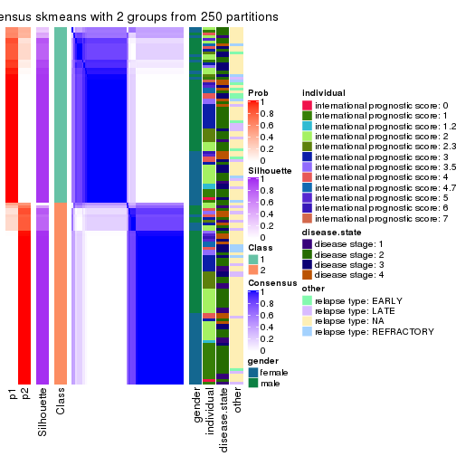</p>

</div>
<div id='tab-CV-skmeans-consensus-heatmap-2'>
<pre><code class="r">consensus_heatmap(res, k = 3)
</code></pre>

<p>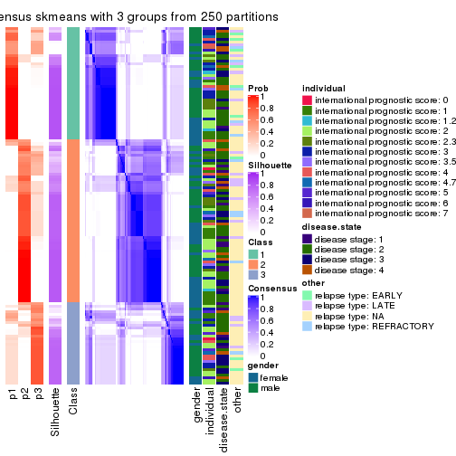</p>

</div>
<div id='tab-CV-skmeans-consensus-heatmap-3'>
<pre><code class="r">consensus_heatmap(res, k = 4)
</code></pre>

<p>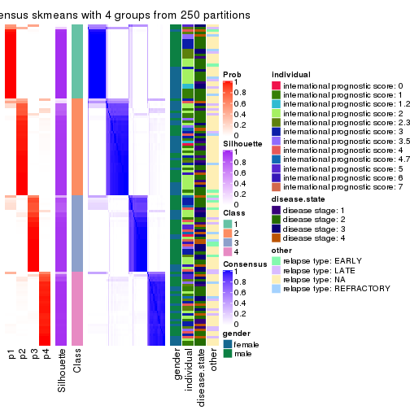</p>

</div>
<div id='tab-CV-skmeans-consensus-heatmap-4'>
<pre><code class="r">consensus_heatmap(res, k = 5)
</code></pre>

<p>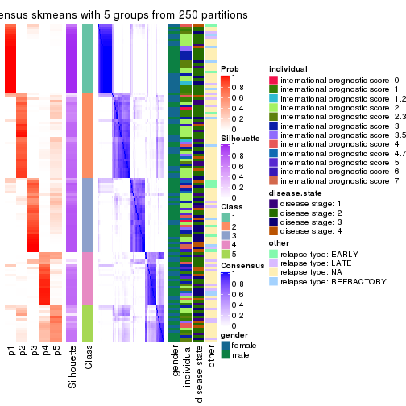</p>

</div>
<div id='tab-CV-skmeans-consensus-heatmap-5'>
<pre><code class="r">consensus_heatmap(res, k = 6)
</code></pre>

<p>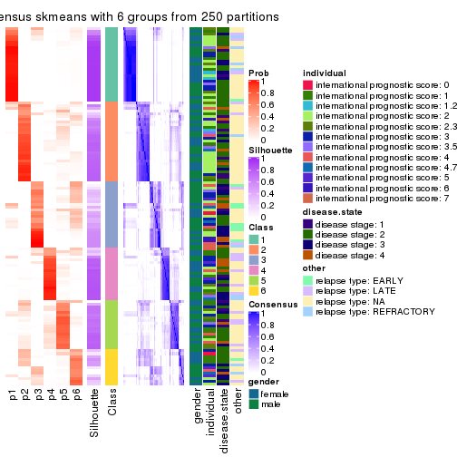</p>

</div>
</div>

Heatmaps for the membership of samples in all partitions to see how consistent they are:


<script>
$( function() {
	$( '#tabs-CV-skmeans-membership-heatmap' ).tabs();
} );
</script>
<div id='tabs-CV-skmeans-membership-heatmap'>
<ul>
<li><a href='#tab-CV-skmeans-membership-heatmap-1'>k = 2</a></li>
<li><a href='#tab-CV-skmeans-membership-heatmap-2'>k = 3</a></li>
<li><a href='#tab-CV-skmeans-membership-heatmap-3'>k = 4</a></li>
<li><a href='#tab-CV-skmeans-membership-heatmap-4'>k = 5</a></li>
<li><a href='#tab-CV-skmeans-membership-heatmap-5'>k = 6</a></li>
</ul>
<div id='tab-CV-skmeans-membership-heatmap-1'>
<pre><code class="r">membership_heatmap(res, k = 2)
</code></pre>

<p>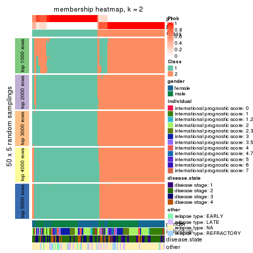</p>

</div>
<div id='tab-CV-skmeans-membership-heatmap-2'>
<pre><code class="r">membership_heatmap(res, k = 3)
</code></pre>

<p>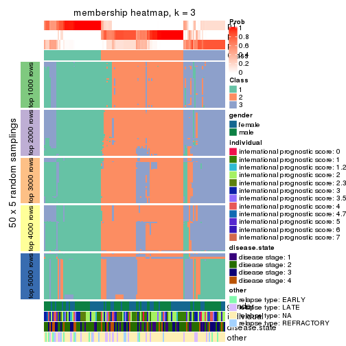</p>

</div>
<div id='tab-CV-skmeans-membership-heatmap-3'>
<pre><code class="r">membership_heatmap(res, k = 4)
</code></pre>

<p>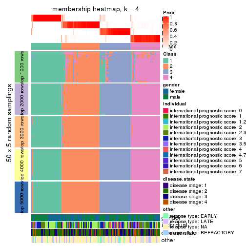</p>

</div>
<div id='tab-CV-skmeans-membership-heatmap-4'>
<pre><code class="r">membership_heatmap(res, k = 5)
</code></pre>

<p>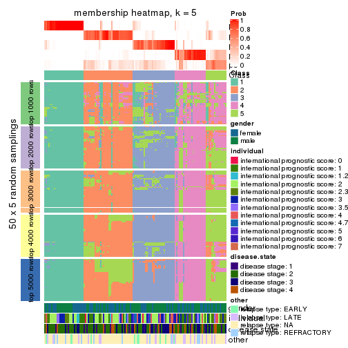</p>

</div>
<div id='tab-CV-skmeans-membership-heatmap-5'>
<pre><code class="r">membership_heatmap(res, k = 6)
</code></pre>

<p>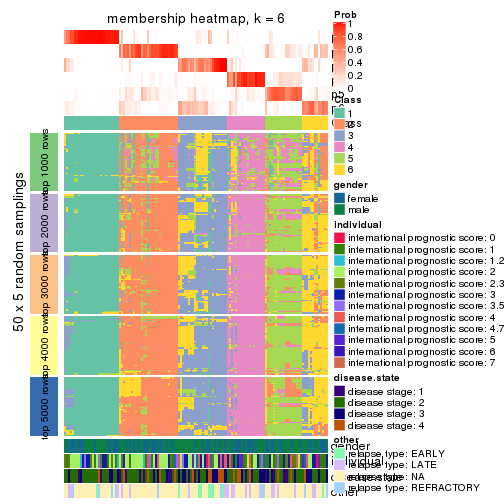</p>

</div>
</div>

As soon as we have had the classes for columns, we can look for signatures
which are significantly different between classes which can be candidate marks
for certain classes. Following are the heatmaps for signatures.


Signature heatmaps where rows are scaled:


<script>
$( function() {
	$( '#tabs-CV-skmeans-get-signatures' ).tabs();
} );
</script>
<div id='tabs-CV-skmeans-get-signatures'>
<ul>
<li><a href='#tab-CV-skmeans-get-signatures-1'>k = 2</a></li>
<li><a href='#tab-CV-skmeans-get-signatures-2'>k = 3</a></li>
<li><a href='#tab-CV-skmeans-get-signatures-3'>k = 4</a></li>
<li><a href='#tab-CV-skmeans-get-signatures-4'>k = 5</a></li>
<li><a href='#tab-CV-skmeans-get-signatures-5'>k = 6</a></li>
</ul>
<div id='tab-CV-skmeans-get-signatures-1'>
<pre><code class="r">get_signatures(res, k = 2)
</code></pre>

<p>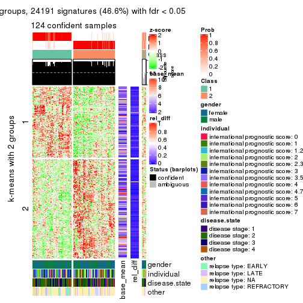</p>

</div>
<div id='tab-CV-skmeans-get-signatures-2'>
<pre><code class="r">get_signatures(res, k = 3)
</code></pre>

<p>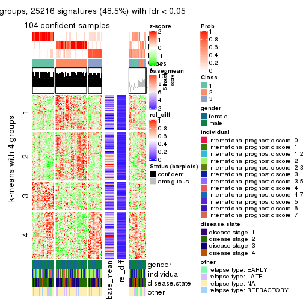</p>

</div>
<div id='tab-CV-skmeans-get-signatures-3'>
<pre><code class="r">get_signatures(res, k = 4)
</code></pre>

<p>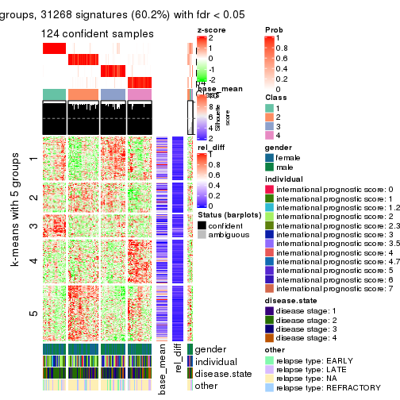</p>

</div>
<div id='tab-CV-skmeans-get-signatures-4'>
<pre><code class="r">get_signatures(res, k = 5)
</code></pre>

<pre><code>#&gt; Error: The width or height of the raster image is zero, maybe you forget to turn off the
#&gt; previous graphic device or it was corrupted. Run `dev.off()` to close it.
</code></pre>

<p></p>

</div>
<div id='tab-CV-skmeans-get-signatures-5'>
<pre><code class="r">get_signatures(res, k = 6)
</code></pre>

<pre><code>#&gt; Error: The width or height of the raster image is zero, maybe you forget to turn off the
#&gt; previous graphic device or it was corrupted. Run `dev.off()` to close it.
</code></pre>

<p></p>

</div>
</div>


Signature heatmaps where rows are not scaled:


<script>
$( function() {
	$( '#tabs-CV-skmeans-get-signatures-no-scale' ).tabs();
} );
</script>
<div id='tabs-CV-skmeans-get-signatures-no-scale'>
<ul>
<li><a href='#tab-CV-skmeans-get-signatures-no-scale-1'>k = 2</a></li>
<li><a href='#tab-CV-skmeans-get-signatures-no-scale-2'>k = 3</a></li>
<li><a href='#tab-CV-skmeans-get-signatures-no-scale-3'>k = 4</a></li>
<li><a href='#tab-CV-skmeans-get-signatures-no-scale-4'>k = 5</a></li>
<li><a href='#tab-CV-skmeans-get-signatures-no-scale-5'>k = 6</a></li>
</ul>
<div id='tab-CV-skmeans-get-signatures-no-scale-1'>
<pre><code class="r">get_signatures(res, k = 2, scale_rows = FALSE)
</code></pre>

<p>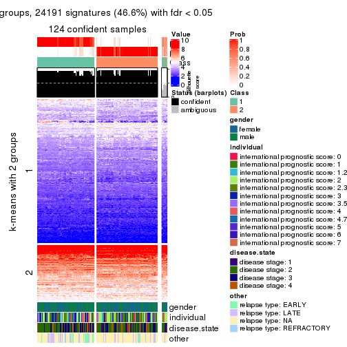</p>

</div>
<div id='tab-CV-skmeans-get-signatures-no-scale-2'>
<pre><code class="r">get_signatures(res, k = 3, scale_rows = FALSE)
</code></pre>

<p>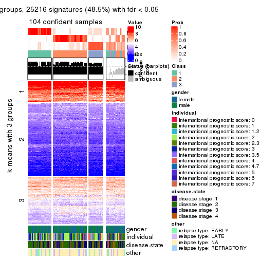</p>

</div>
<div id='tab-CV-skmeans-get-signatures-no-scale-3'>
<pre><code class="r">get_signatures(res, k = 4, scale_rows = FALSE)
</code></pre>

<p>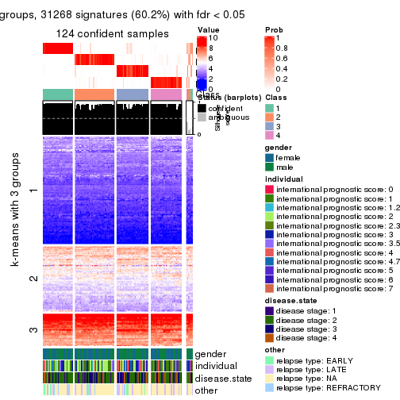</p>

</div>
<div id='tab-CV-skmeans-get-signatures-no-scale-4'>
<pre><code class="r">get_signatures(res, k = 5, scale_rows = FALSE)
</code></pre>

<p>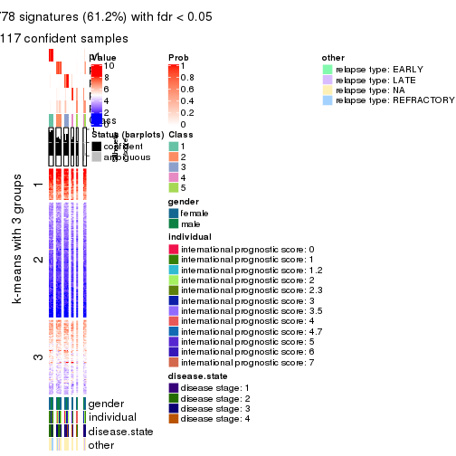</p>

</div>
<div id='tab-CV-skmeans-get-signatures-no-scale-5'>
<pre><code class="r">get_signatures(res, k = 6, scale_rows = FALSE)
</code></pre>

<p>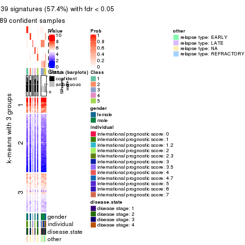</p>

</div>
</div>


Compare the overlap of signatures from different k:

```r
compare_signatures(res)
```

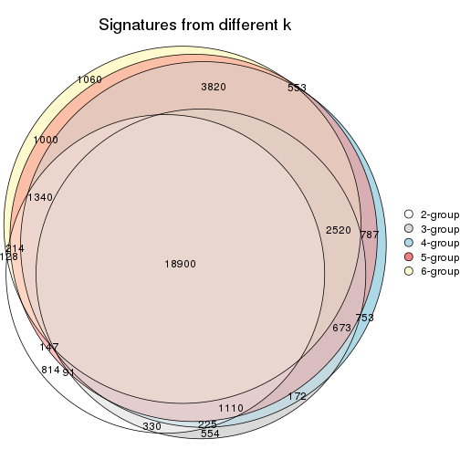

`get_signature()` returns a data frame invisibly. TO get the list of signatures, the function
call should be assigned to a variable explicitly. In following code, if `plot` argument is set
to `FALSE`, no heatmap is plotted while only the differential analysis is performed.

```r
# code only for demonstration
tb = get_signature(res, k = ..., plot = FALSE)
```

An example of the output of `tb` is:

```
#>   which_row         fdr    mean_1    mean_2 scaled_mean_1 scaled_mean_2 km
#> 1        38 0.042760348  8.373488  9.131774    -0.5533452     0.5164555  1
#> 2        40 0.018707592  7.106213  8.469186    -0.6173731     0.5762149  1
#> 3        55 0.019134737 10.221463 11.207825    -0.6159697     0.5749050  1
#> 4        59 0.006059896  5.921854  7.869574    -0.6899429     0.6439467  1
#> 5        60 0.018055526  8.928898 10.211722    -0.6204761     0.5791110  1
#> 6        98 0.009384629 15.714769 14.887706     0.6635654    -0.6193277  2
...
```

The columns in `tb` are:

1. `which_row`: row indices corresponding to the input matrix.
2. `fdr`: FDR for the differential test. 
3. `mean_x`: The mean value in group x.
4. `scaled_mean_x`: The mean value in group x after rows are scaled.
5. `km`: Row groups if k-means clustering is applied to rows.


UMAP plot which shows how samples are separated.


<script>
$( function() {
	$( '#tabs-CV-skmeans-dimension-reduction' ).tabs();
} );
</script>
<div id='tabs-CV-skmeans-dimension-reduction'>
<ul>
<li><a href='#tab-CV-skmeans-dimension-reduction-1'>k = 2</a></li>
<li><a href='#tab-CV-skmeans-dimension-reduction-2'>k = 3</a></li>
<li><a href='#tab-CV-skmeans-dimension-reduction-3'>k = 4</a></li>
<li><a href='#tab-CV-skmeans-dimension-reduction-4'>k = 5</a></li>
<li><a href='#tab-CV-skmeans-dimension-reduction-5'>k = 6</a></li>
</ul>
<div id='tab-CV-skmeans-dimension-reduction-1'>
<pre><code class="r">dimension_reduction(res, k = 2, method = &quot;UMAP&quot;)
</code></pre>

<p>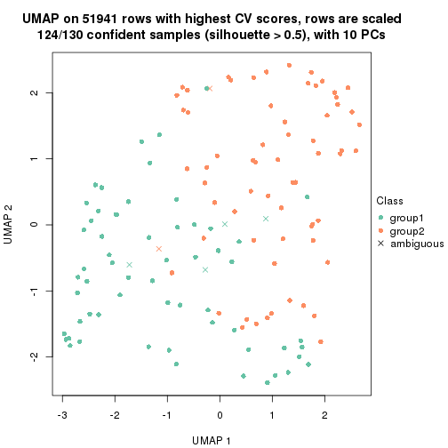</p>

</div>
<div id='tab-CV-skmeans-dimension-reduction-2'>
<pre><code class="r">dimension_reduction(res, k = 3, method = &quot;UMAP&quot;)
</code></pre>

<p>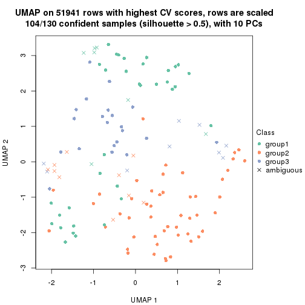</p>

</div>
<div id='tab-CV-skmeans-dimension-reduction-3'>
<pre><code class="r">dimension_reduction(res, k = 4, method = &quot;UMAP&quot;)
</code></pre>

<p>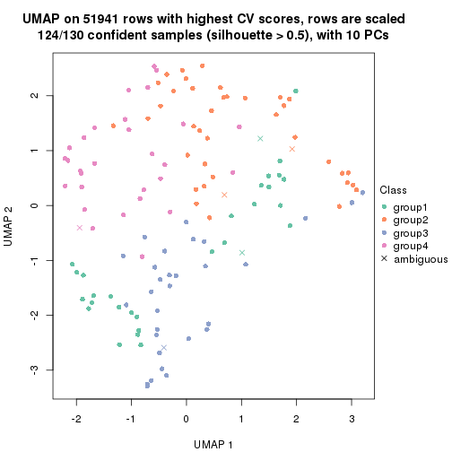</p>

</div>
<div id='tab-CV-skmeans-dimension-reduction-4'>
<pre><code class="r">dimension_reduction(res, k = 5, method = &quot;UMAP&quot;)
</code></pre>

<p>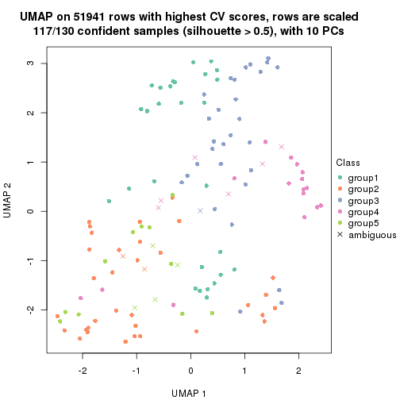</p>

</div>
<div id='tab-CV-skmeans-dimension-reduction-5'>
<pre><code class="r">dimension_reduction(res, k = 6, method = &quot;UMAP&quot;)
</code></pre>

<p>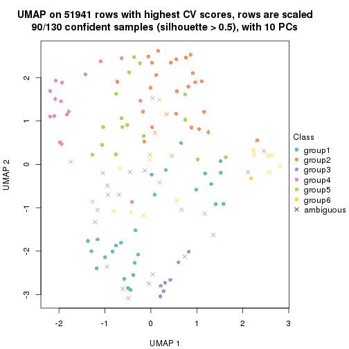</p>

</div>
</div>


Following heatmap shows how subgroups are split when increasing `k`:

```r
collect_classes(res)
```

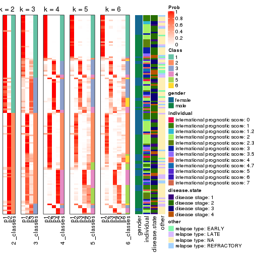


Test correlation between subgroups and known annotations. If the known
annotation is numeric, one-way ANOVA test is applied, and if the known
annotation is discrete, chi-squared contingency table test is applied.

```r
test_to_known_factors(res)
```

```
#>              n gender(p) individual(p) disease.state(p) other(p) k
#> CV:skmeans 124     0.436        0.8742           0.0331 5.34e-02 2
#> CV:skmeans 104     0.440        0.3754           0.1437 1.03e-01 3
#> CV:skmeans 124     0.156        0.1162           0.0891 2.37e-01 4
#> CV:skmeans 117     0.161        0.2190           0.0652 1.39e-01 5
#> CV:skmeans  90     0.849        0.0649           0.0820 2.37e-05 6
```


If matrix rows can be associated to genes, consider to use `GO_Enrichment(res,
...)` to perform function enrichment for the signature genes.


 

---------------------------------------------------


### CV:pam


The object with results only for a single top-value method and a single partition method 
can be extracted as:

```r
res = res_list["CV", "pam"]
# you can also extract it by
# res = res_list["CV:pam"]
```

A summary of `res` and all the functions that can be applied to it:

```r
res
```

```
#> A 'ConsensusPartition' object with k = 2, 3, 4, 5, 6.
#>   On a matrix with 51941 rows and 130 columns.
#>   Top rows (1000, 2000, 3000, 4000, 5000) are extracted by 'CV' method.
#>   Subgroups are detected by 'pam' method.
#>   Performed in total 1250 partitions by row resampling.
#>   Best k for subgroups seems to be 2.
#> 
#> Following methods can be applied to this 'ConsensusPartition' object:
#>  [1] "cola_report"             "collect_classes"         "collect_plots"          
#>  [4] "collect_stats"           "colnames"                "compare_signatures"     
#>  [7] "consensus_heatmap"       "dimension_reduction"     "functional_enrichment"  
#> [10] "get_anno_col"            "get_anno"                "get_classes"            
#> [13] "get_consensus"           "get_matrix"              "get_membership"         
#> [16] "get_param"               "get_signatures"          "get_stats"              
#> [19] "is_best_k"               "is_stable_k"             "membership_heatmap"     
#> [22] "ncol"                    "nrow"                    "plot_ecdf"              
#> [25] "rownames"                "select_partition_number" "show"                   
#> [28] "suggest_best_k"          "test_to_known_factors"
```

`collect_plots()` function collects all the plots made from `res` for all `k` (number of partitions)
into one single page to provide an easy and fast comparison between different `k`.

```r
collect_plots(res)
```

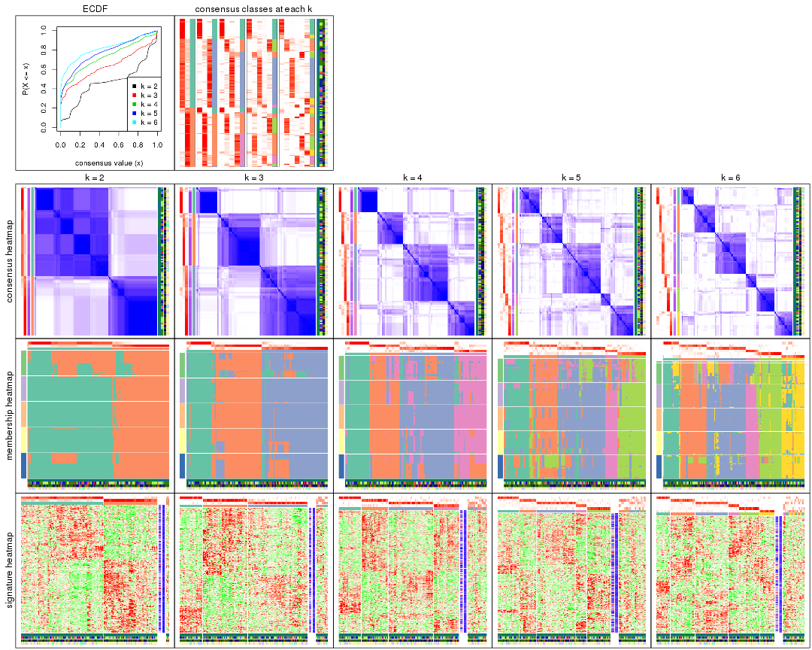

The plots are:

- The first row: a plot of the ECDF (Empirical cumulative distribution
  function) curves of the consensus matrix for each `k` and the heatmap of
  predicted classes for each `k`.
- The second row: heatmaps of the consensus matrix for each `k`.
- The third row: heatmaps of the membership matrix for each `k`.
- The fouth row: heatmaps of the signatures for each `k`.

All the plots in panels can be made by individual functions and they are
plotted later in this section.

`select_partition_number()` produces several plots showing different
statistics for choosing "optimized" `k`. There are following statistics:

- ECDF curves of the consensus matrix for each `k`;
- 1-PAC. [The PAC
  score](https://en.wikipedia.org/wiki/Consensus_clustering#Over-interpretation_potential_of_consensus_clustering)
  measures the proportion of the ambiguous subgrouping.
- Mean silhouette score.
- Concordance. The mean probability of fiting the consensus class ids in all
  partitions.
- Area increased. Denote $A_k$ as the area under the ECDF curve for current
  `k`, the area increased is defined as $A_k - A_{k-1}$.
- Rand index. The percent of pairs of samples that are both in a same cluster
  or both are not in a same cluster in the partition of k and k-1.
- Jaccard index. The ratio of pairs of samples are both in a same cluster in
  the partition of k and k-1 and the pairs of samples are both in a same
  cluster in the partition k or k-1.

The detailed explanations of these statistics can be found in [the cola
vignette](http://bioconductor.org/packages/devel/bioc/vignettes/cola/inst/doc/cola.html#toc_13).

Generally speaking, lower PAC score, higher mean silhouette score or higher
concordance corresponds to better partition. Rand index and Jaccard index
measure how similar the current partition is compared to partition with `k-1`.
If they are too similar, we won't accept `k` is better than `k-1`.

```r
select_partition_number(res)
```

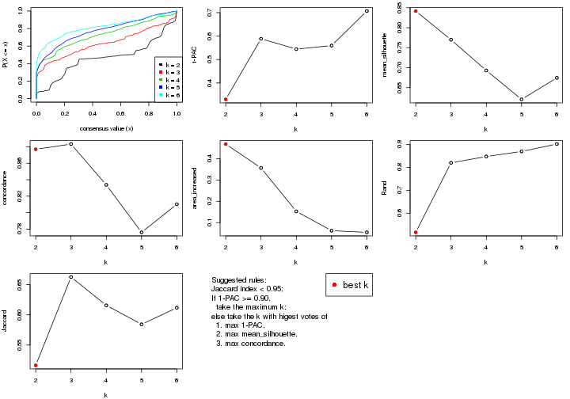

The numeric values for all these statistics can be obtained by `get_stats()`.

```r
get_stats(res)
```

```
#>   k 1-PAC mean_silhouette concordance area_increased  Rand Jaccard
#> 2 2 0.330           0.842       0.877         0.4682 0.516   0.516
#> 3 3 0.589           0.770       0.883         0.3562 0.820   0.663
#> 4 4 0.544           0.693       0.834         0.1531 0.847   0.616
#> 5 5 0.560           0.621       0.776         0.0627 0.869   0.584
#> 6 6 0.707           0.675       0.810         0.0547 0.902   0.612
```

`suggest_best_k()` suggests the best $k$ based on these statistics. The rules are as follows:

- All $k$ with Jaccard index larger than 0.95 are removed because the increase of
  the partition number does not provides enough extra information. If all $k$ are removed,
  the best $k$ is assigned by `NA`.
- For $k$ with 1-PAC larger than 0.9, the maximal $k$ is taken as the "best k". Other $k$ is called "optional k".
- If it does not fit the second rule. The $k$ with the highest vote of highest
  1-PAC, mean silhouette and concordance is taken as the "best k".

```r
suggest_best_k(res)
```

```
#> [1] 2
```


Following shows the table of the partitions (You need to click the **show/hide
code output** link to see it). The membership matrix (columns with name `p*`)
is inferred by
[`clue::cl_consensus()`](https://www.rdocumentation.org/link/cl_consensus?package=clue)
function with the `SE` method. Basically the value in the membership matrix
represents the probability to belong to a certain group. The finall class
label for an item is determined with the group with highest probability it
belongs to.

In `get_classes()` function, the entropy is calculated from the membership
matrix and the silhouette score is calculated from the consensus matrix.


<script>
$( function() {
	$( '#tabs-CV-pam-get-classes' ).tabs();
} );
</script>
<div id='tabs-CV-pam-get-classes'>
<ul>
<li><a href='#tab-CV-pam-get-classes-1'>k = 2</a></li>
<li><a href='#tab-CV-pam-get-classes-2'>k = 3</a></li>
<li><a href='#tab-CV-pam-get-classes-3'>k = 4</a></li>
<li><a href='#tab-CV-pam-get-classes-4'>k = 5</a></li>
<li><a href='#tab-CV-pam-get-classes-5'>k = 6</a></li>
</ul>

<div id='tab-CV-pam-get-classes-1'>
<p><a id='tab-CV-pam-get-classes-1-a' style='color:#0366d6' href='#'>show/hide code output</a></p>
<pre><code class="r">cbind(get_classes(res, k = 2), get_membership(res, k = 2))
</code></pre>

<pre><code>#&gt;           class entropy silhouette    p1    p2
#&gt; GSM447671     1  0.8763      0.816 0.704 0.296
#&gt; GSM447694     1  0.7056      0.869 0.808 0.192
#&gt; GSM447618     1  0.8763      0.816 0.704 0.296
#&gt; GSM447691     1  0.8763      0.816 0.704 0.296
#&gt; GSM447733     1  0.8713      0.818 0.708 0.292
#&gt; GSM447620     1  0.8763      0.816 0.704 0.296
#&gt; GSM447627     1  0.7299      0.865 0.796 0.204
#&gt; GSM447630     2  0.0000      0.916 0.000 1.000
#&gt; GSM447642     1  0.0000      0.824 1.000 0.000
#&gt; GSM447649     2  0.3114      0.889 0.056 0.944
#&gt; GSM447654     2  0.0000      0.916 0.000 1.000
#&gt; GSM447655     2  0.0000      0.916 0.000 1.000
#&gt; GSM447669     1  0.8763      0.816 0.704 0.296
#&gt; GSM447676     1  0.0000      0.824 1.000 0.000
#&gt; GSM447678     1  0.8763      0.816 0.704 0.296
#&gt; GSM447681     2  0.0000      0.916 0.000 1.000
#&gt; GSM447698     1  0.8813      0.812 0.700 0.300
#&gt; GSM447713     1  0.0000      0.824 1.000 0.000
#&gt; GSM447722     1  0.8763      0.816 0.704 0.296
#&gt; GSM447726     1  0.6973      0.846 0.812 0.188
#&gt; GSM447735     1  0.7299      0.865 0.796 0.204
#&gt; GSM447737     1  0.4690      0.870 0.900 0.100
#&gt; GSM447657     2  0.0000      0.916 0.000 1.000
#&gt; GSM447674     2  0.0000      0.916 0.000 1.000
#&gt; GSM447636     2  0.7376      0.779 0.208 0.792
#&gt; GSM447723     1  0.3114      0.853 0.944 0.056
#&gt; GSM447699     1  0.7376      0.863 0.792 0.208
#&gt; GSM447708     1  0.8763      0.816 0.704 0.296
#&gt; GSM447721     1  0.0000      0.824 1.000 0.000
#&gt; GSM447623     1  0.0000      0.824 1.000 0.000
#&gt; GSM447621     1  0.0000      0.824 1.000 0.000
#&gt; GSM447650     2  0.0000      0.916 0.000 1.000
#&gt; GSM447651     2  0.1843      0.904 0.028 0.972
#&gt; GSM447653     1  0.6801      0.871 0.820 0.180
#&gt; GSM447658     2  0.8267      0.750 0.260 0.740
#&gt; GSM447675     2  0.8443      0.451 0.272 0.728
#&gt; GSM447680     2  0.4939      0.855 0.108 0.892
#&gt; GSM447686     2  0.7376      0.779 0.208 0.792
#&gt; GSM447736     1  0.6973      0.870 0.812 0.188
#&gt; GSM447629     1  0.6973      0.846 0.812 0.188
#&gt; GSM447648     1  0.4690      0.870 0.900 0.100
#&gt; GSM447660     1  0.0000      0.824 1.000 0.000
#&gt; GSM447661     2  0.0000      0.916 0.000 1.000
#&gt; GSM447663     1  0.7376      0.863 0.792 0.208
#&gt; GSM447704     2  0.0000      0.916 0.000 1.000
#&gt; GSM447720     1  0.7528      0.846 0.784 0.216
#&gt; GSM447652     2  0.0000      0.916 0.000 1.000
#&gt; GSM447679     2  0.0376      0.914 0.004 0.996
#&gt; GSM447712     2  0.8955      0.683 0.312 0.688
#&gt; GSM447664     2  0.4815      0.858 0.104 0.896
#&gt; GSM447637     1  0.4690      0.870 0.900 0.100
#&gt; GSM447639     2  0.8144      0.522 0.252 0.748
#&gt; GSM447615     1  0.4690      0.870 0.900 0.100
#&gt; GSM447656     1  0.9988      0.201 0.520 0.480
#&gt; GSM447673     2  0.0000      0.916 0.000 1.000
#&gt; GSM447719     1  0.4690      0.870 0.900 0.100
#&gt; GSM447706     1  0.4690      0.870 0.900 0.100
#&gt; GSM447612     1  0.7528      0.861 0.784 0.216
#&gt; GSM447665     2  0.8861      0.358 0.304 0.696
#&gt; GSM447677     2  0.0000      0.916 0.000 1.000
#&gt; GSM447613     1  0.0000      0.824 1.000 0.000
#&gt; GSM447659     1  0.7376      0.863 0.792 0.208
#&gt; GSM447662     1  0.7299      0.865 0.796 0.204
#&gt; GSM447666     1  0.7528      0.845 0.784 0.216
#&gt; GSM447668     2  0.0000      0.916 0.000 1.000
#&gt; GSM447682     2  0.1414      0.908 0.020 0.980
#&gt; GSM447683     2  0.0000      0.916 0.000 1.000
#&gt; GSM447688     2  0.0000      0.916 0.000 1.000
#&gt; GSM447702     2  0.0000      0.916 0.000 1.000
#&gt; GSM447709     1  0.8763      0.816 0.704 0.296
#&gt; GSM447711     2  0.9850      0.517 0.428 0.572
#&gt; GSM447715     2  0.6148      0.827 0.152 0.848
#&gt; GSM447693     1  0.5408      0.873 0.876 0.124
#&gt; GSM447611     2  0.4939      0.855 0.108 0.892
#&gt; GSM447672     2  0.0000      0.916 0.000 1.000
#&gt; GSM447703     2  0.0000      0.916 0.000 1.000
#&gt; GSM447727     1  0.5408      0.854 0.876 0.124
#&gt; GSM447638     1  0.6623      0.834 0.828 0.172
#&gt; GSM447670     1  0.0000      0.824 1.000 0.000
#&gt; GSM447700     1  0.8763      0.816 0.704 0.296
#&gt; GSM447738     2  0.0000      0.916 0.000 1.000
#&gt; GSM447739     1  0.0000      0.824 1.000 0.000
#&gt; GSM447617     1  0.0000      0.824 1.000 0.000
#&gt; GSM447628     2  0.0000      0.916 0.000 1.000
#&gt; GSM447632     2  0.0000      0.916 0.000 1.000
#&gt; GSM447619     1  0.7299      0.865 0.796 0.204
#&gt; GSM447643     2  0.7602      0.775 0.220 0.780
#&gt; GSM447724     1  0.8763      0.816 0.704 0.296
#&gt; GSM447728     2  0.0000      0.916 0.000 1.000
#&gt; GSM447610     1  0.0376      0.826 0.996 0.004
#&gt; GSM447633     1  0.8763      0.816 0.704 0.296
#&gt; GSM447634     1  0.7299      0.865 0.796 0.204
#&gt; GSM447622     1  0.4690      0.870 0.900 0.100
#&gt; GSM447667     1  0.6973      0.846 0.812 0.188
#&gt; GSM447687     2  0.0000      0.916 0.000 1.000
#&gt; GSM447695     1  0.6801      0.871 0.820 0.180
#&gt; GSM447696     1  0.0000      0.824 1.000 0.000
#&gt; GSM447697     1  0.0000      0.824 1.000 0.000
#&gt; GSM447714     1  0.7376      0.865 0.792 0.208
#&gt; GSM447717     2  0.8763      0.696 0.296 0.704
#&gt; GSM447725     1  0.0000      0.824 1.000 0.000
#&gt; GSM447729     2  0.4690      0.861 0.100 0.900
#&gt; GSM447644     1  0.8763      0.816 0.704 0.296
#&gt; GSM447710     1  0.6531      0.874 0.832 0.168
#&gt; GSM447614     1  0.7219      0.867 0.800 0.200
#&gt; GSM447685     2  0.4939      0.855 0.108 0.892
#&gt; GSM447690     1  0.0000      0.824 1.000 0.000
#&gt; GSM447730     2  0.0000      0.916 0.000 1.000
#&gt; GSM447646     2  0.0000      0.916 0.000 1.000
#&gt; GSM447689     1  0.8081      0.838 0.752 0.248
#&gt; GSM447635     1  0.8763      0.816 0.704 0.296
#&gt; GSM447641     1  0.0000      0.824 1.000 0.000
#&gt; GSM447716     2  0.1414      0.908 0.020 0.980
#&gt; GSM447718     2  0.4815      0.858 0.104 0.896
#&gt; GSM447616     1  0.4690      0.870 0.900 0.100
#&gt; GSM447626     1  0.4690      0.870 0.900 0.100
#&gt; GSM447640     2  0.0000      0.916 0.000 1.000
#&gt; GSM447734     1  0.7376      0.863 0.792 0.208
#&gt; GSM447692     1  0.4690      0.870 0.900 0.100
#&gt; GSM447647     2  0.0000      0.916 0.000 1.000
#&gt; GSM447624     1  0.0000      0.824 1.000 0.000
#&gt; GSM447625     1  0.7376      0.863 0.792 0.208
#&gt; GSM447707     2  0.0000      0.916 0.000 1.000
#&gt; GSM447732     1  0.6623      0.873 0.828 0.172
#&gt; GSM447684     1  0.4939      0.870 0.892 0.108
#&gt; GSM447731     2  0.0938      0.907 0.012 0.988
#&gt; GSM447705     1  0.8763      0.816 0.704 0.296
#&gt; GSM447631     1  0.4690      0.870 0.900 0.100
#&gt; GSM447701     2  0.0000      0.916 0.000 1.000
#&gt; GSM447645     1  0.4690      0.870 0.900 0.100
</code></pre>

<script>
$('#tab-CV-pam-get-classes-1-a').parent().next().next().hide();
$('#tab-CV-pam-get-classes-1-a').click(function(){
  $('#tab-CV-pam-get-classes-1-a').parent().next().next().toggle();
  return(false);
});
</script>
</div>

<div id='tab-CV-pam-get-classes-2'>
<p><a id='tab-CV-pam-get-classes-2-a' style='color:#0366d6' href='#'>show/hide code output</a></p>
<pre><code class="r">cbind(get_classes(res, k = 3), get_membership(res, k = 3))
</code></pre>

<pre><code>#&gt;           class entropy silhouette    p1    p2    p3
#&gt; GSM447671     3  0.4399     0.7701 0.000 0.188 0.812
#&gt; GSM447694     3  0.1860     0.8366 0.052 0.000 0.948
#&gt; GSM447618     3  0.5968     0.5872 0.000 0.364 0.636
#&gt; GSM447691     3  0.5016     0.7430 0.000 0.240 0.760
#&gt; GSM447733     3  0.0747     0.8449 0.000 0.016 0.984
#&gt; GSM447620     3  0.4121     0.7745 0.000 0.168 0.832
#&gt; GSM447627     3  0.1753     0.8381 0.048 0.000 0.952
#&gt; GSM447630     2  0.0892     0.8646 0.000 0.980 0.020
#&gt; GSM447642     1  0.0000     0.9254 1.000 0.000 0.000
#&gt; GSM447649     2  0.2356     0.8432 0.000 0.928 0.072
#&gt; GSM447654     2  0.4750     0.6951 0.000 0.784 0.216
#&gt; GSM447655     2  0.0237     0.8693 0.000 0.996 0.004
#&gt; GSM447669     3  0.5926     0.6041 0.000 0.356 0.644
#&gt; GSM447676     3  0.5016     0.6707 0.240 0.000 0.760
#&gt; GSM447678     3  0.4291     0.7619 0.000 0.180 0.820
#&gt; GSM447681     2  0.0000     0.8694 0.000 1.000 0.000
#&gt; GSM447698     3  0.6168     0.5000 0.000 0.412 0.588
#&gt; GSM447713     1  0.0000     0.9254 1.000 0.000 0.000
#&gt; GSM447722     3  0.3116     0.8129 0.000 0.108 0.892
#&gt; GSM447726     3  0.7147     0.7052 0.076 0.228 0.696
#&gt; GSM447735     3  0.1860     0.8382 0.000 0.052 0.948
#&gt; GSM447737     1  0.5291     0.5572 0.732 0.000 0.268
#&gt; GSM447657     2  0.0000     0.8694 0.000 1.000 0.000
#&gt; GSM447674     2  0.0000     0.8694 0.000 1.000 0.000
#&gt; GSM447636     1  0.6168     0.1731 0.588 0.412 0.000
#&gt; GSM447723     3  0.5988     0.4358 0.368 0.000 0.632
#&gt; GSM447699     3  0.3846     0.8110 0.016 0.108 0.876
#&gt; GSM447708     3  0.5621     0.6580 0.000 0.308 0.692
#&gt; GSM447721     1  0.0000     0.9254 1.000 0.000 0.000
#&gt; GSM447623     1  0.0000     0.9254 1.000 0.000 0.000
#&gt; GSM447621     1  0.0000     0.9254 1.000 0.000 0.000
#&gt; GSM447650     2  0.0000     0.8694 0.000 1.000 0.000
#&gt; GSM447651     2  0.3116     0.8199 0.000 0.892 0.108
#&gt; GSM447653     3  0.2173     0.8380 0.048 0.008 0.944
#&gt; GSM447658     1  0.0237     0.9220 0.996 0.004 0.000
#&gt; GSM447675     2  0.6045     0.4262 0.000 0.620 0.380
#&gt; GSM447680     2  0.4097     0.8060 0.060 0.880 0.060
#&gt; GSM447686     2  0.6252     0.2590 0.444 0.556 0.000
#&gt; GSM447736     3  0.1529     0.8405 0.040 0.000 0.960
#&gt; GSM447629     3  0.6001     0.7711 0.052 0.176 0.772
#&gt; GSM447648     3  0.1163     0.8429 0.028 0.000 0.972
#&gt; GSM447660     1  0.5254     0.6125 0.736 0.000 0.264
#&gt; GSM447661     2  0.0000     0.8694 0.000 1.000 0.000
#&gt; GSM447663     3  0.0237     0.8442 0.000 0.004 0.996
#&gt; GSM447704     2  0.0592     0.8680 0.000 0.988 0.012
#&gt; GSM447720     3  0.2096     0.8362 0.052 0.004 0.944
#&gt; GSM447652     2  0.0000     0.8694 0.000 1.000 0.000
#&gt; GSM447679     2  0.0000     0.8694 0.000 1.000 0.000
#&gt; GSM447712     1  0.0000     0.9254 1.000 0.000 0.000
#&gt; GSM447664     2  0.7564     0.5668 0.068 0.636 0.296
#&gt; GSM447637     3  0.4750     0.7141 0.216 0.000 0.784
#&gt; GSM447639     3  0.6470     0.3878 0.012 0.356 0.632
#&gt; GSM447615     3  0.1964     0.8349 0.056 0.000 0.944
#&gt; GSM447656     3  0.8117     0.4568 0.076 0.372 0.552
#&gt; GSM447673     2  0.0000     0.8694 0.000 1.000 0.000
#&gt; GSM447719     3  0.1964     0.8349 0.056 0.000 0.944
#&gt; GSM447706     3  0.0424     0.8446 0.008 0.000 0.992
#&gt; GSM447612     3  0.0000     0.8444 0.000 0.000 1.000
#&gt; GSM447665     2  0.6309    -0.0987 0.000 0.504 0.496
#&gt; GSM447677     2  0.3192     0.8193 0.000 0.888 0.112
#&gt; GSM447613     1  0.0000     0.9254 1.000 0.000 0.000
#&gt; GSM447659     3  0.0000     0.8444 0.000 0.000 1.000
#&gt; GSM447662     3  0.0000     0.8444 0.000 0.000 1.000
#&gt; GSM447666     3  0.4351     0.7753 0.004 0.168 0.828
#&gt; GSM447668     2  0.0000     0.8694 0.000 1.000 0.000
#&gt; GSM447682     2  0.0592     0.8651 0.012 0.988 0.000
#&gt; GSM447683     2  0.0237     0.8693 0.000 0.996 0.004
#&gt; GSM447688     2  0.0237     0.8693 0.000 0.996 0.004
#&gt; GSM447702     2  0.0000     0.8694 0.000 1.000 0.000
#&gt; GSM447709     3  0.5178     0.6867 0.000 0.256 0.744
#&gt; GSM447711     1  0.0000     0.9254 1.000 0.000 0.000
#&gt; GSM447715     2  0.6772     0.5407 0.304 0.664 0.032
#&gt; GSM447693     3  0.0237     0.8444 0.004 0.000 0.996
#&gt; GSM447611     2  0.7327     0.5558 0.052 0.636 0.312
#&gt; GSM447672     2  0.0237     0.8693 0.000 0.996 0.004
#&gt; GSM447703     2  0.0237     0.8693 0.000 0.996 0.004
#&gt; GSM447727     3  0.6222     0.7785 0.132 0.092 0.776
#&gt; GSM447638     3  0.8212     0.4959 0.084 0.360 0.556
#&gt; GSM447670     1  0.0000     0.9254 1.000 0.000 0.000
#&gt; GSM447700     3  0.4702     0.7691 0.000 0.212 0.788
#&gt; GSM447738     2  0.0237     0.8693 0.000 0.996 0.004
#&gt; GSM447739     1  0.0000     0.9254 1.000 0.000 0.000
#&gt; GSM447617     1  0.0000     0.9254 1.000 0.000 0.000
#&gt; GSM447628     2  0.0000     0.8694 0.000 1.000 0.000
#&gt; GSM447632     2  0.0237     0.8693 0.000 0.996 0.004
#&gt; GSM447619     3  0.0000     0.8444 0.000 0.000 1.000
#&gt; GSM447643     2  0.6252     0.2590 0.444 0.556 0.000
#&gt; GSM447724     3  0.0000     0.8444 0.000 0.000 1.000
#&gt; GSM447728     2  0.0237     0.8693 0.000 0.996 0.004
#&gt; GSM447610     3  0.4555     0.7227 0.200 0.000 0.800
#&gt; GSM447633     3  0.5178     0.6867 0.000 0.256 0.744
#&gt; GSM447634     3  0.2173     0.8380 0.048 0.008 0.944
#&gt; GSM447622     1  0.6204     0.1521 0.576 0.000 0.424
#&gt; GSM447667     3  0.5947     0.7731 0.052 0.172 0.776
#&gt; GSM447687     2  0.0237     0.8693 0.000 0.996 0.004
#&gt; GSM447695     3  0.1860     0.8366 0.052 0.000 0.948
#&gt; GSM447696     1  0.0000     0.9254 1.000 0.000 0.000
#&gt; GSM447697     1  0.0000     0.9254 1.000 0.000 0.000
#&gt; GSM447714     3  0.0000     0.8444 0.000 0.000 1.000
#&gt; GSM447717     1  0.0000     0.9254 1.000 0.000 0.000
#&gt; GSM447725     1  0.0000     0.9254 1.000 0.000 0.000
#&gt; GSM447729     2  0.5058     0.6615 0.000 0.756 0.244
#&gt; GSM447644     3  0.5216     0.6860 0.000 0.260 0.740
#&gt; GSM447710     3  0.0237     0.8444 0.004 0.000 0.996
#&gt; GSM447614     3  0.1860     0.8366 0.052 0.000 0.948
#&gt; GSM447685     2  0.2200     0.8376 0.056 0.940 0.004
#&gt; GSM447690     1  0.0000     0.9254 1.000 0.000 0.000
#&gt; GSM447730     2  0.1860     0.8526 0.000 0.948 0.052
#&gt; GSM447646     2  0.0237     0.8693 0.000 0.996 0.004
#&gt; GSM447689     3  0.0237     0.8444 0.004 0.000 0.996
#&gt; GSM447635     3  0.1964     0.8381 0.000 0.056 0.944
#&gt; GSM447641     1  0.0000     0.9254 1.000 0.000 0.000
#&gt; GSM447716     2  0.2165     0.8344 0.064 0.936 0.000
#&gt; GSM447718     2  0.6566     0.5663 0.016 0.636 0.348
#&gt; GSM447616     3  0.5591     0.6094 0.304 0.000 0.696
#&gt; GSM447626     3  0.1163     0.8426 0.028 0.000 0.972
#&gt; GSM447640     2  0.0000     0.8694 0.000 1.000 0.000
#&gt; GSM447734     3  0.0000     0.8444 0.000 0.000 1.000
#&gt; GSM447692     3  0.6126     0.4248 0.400 0.000 0.600
#&gt; GSM447647     2  0.5988     0.5517 0.000 0.632 0.368
#&gt; GSM447624     1  0.0892     0.9087 0.980 0.000 0.020
#&gt; GSM447625     3  0.0000     0.8444 0.000 0.000 1.000
#&gt; GSM447707     2  0.1753     0.8546 0.000 0.952 0.048
#&gt; GSM447732     3  0.0237     0.8442 0.000 0.004 0.996
#&gt; GSM447684     3  0.6435     0.7650 0.076 0.168 0.756
#&gt; GSM447731     2  0.5968     0.5531 0.000 0.636 0.364
#&gt; GSM447705     3  0.0000     0.8444 0.000 0.000 1.000
#&gt; GSM447631     3  0.0592     0.8447 0.012 0.000 0.988
#&gt; GSM447701     2  0.2959     0.8257 0.000 0.900 0.100
#&gt; GSM447645     3  0.0592     0.8447 0.012 0.000 0.988
</code></pre>

<script>
$('#tab-CV-pam-get-classes-2-a').parent().next().next().hide();
$('#tab-CV-pam-get-classes-2-a').click(function(){
  $('#tab-CV-pam-get-classes-2-a').parent().next().next().toggle();
  return(false);
});
</script>
</div>

<div id='tab-CV-pam-get-classes-3'>
<p><a id='tab-CV-pam-get-classes-3-a' style='color:#0366d6' href='#'>show/hide code output</a></p>
<pre><code class="r">cbind(get_classes(res, k = 4), get_membership(res, k = 4))
</code></pre>

<pre><code>#&gt;           class entropy silhouette    p1    p2    p3    p4
#&gt; GSM447671     2  0.4426      0.677 0.000 0.772 0.204 0.024
#&gt; GSM447694     3  0.0000      0.799 0.000 0.000 1.000 0.000
#&gt; GSM447618     3  0.7119      0.215 0.000 0.132 0.480 0.388
#&gt; GSM447691     3  0.5382      0.664 0.000 0.132 0.744 0.124
#&gt; GSM447733     3  0.0188      0.799 0.000 0.004 0.996 0.000
#&gt; GSM447620     2  0.0000      0.783 0.000 1.000 0.000 0.000
#&gt; GSM447627     3  0.0188      0.799 0.004 0.000 0.996 0.000
#&gt; GSM447630     4  0.6557      0.534 0.004 0.292 0.096 0.608
#&gt; GSM447642     1  0.0000      0.936 1.000 0.000 0.000 0.000
#&gt; GSM447649     2  0.1389      0.785 0.000 0.952 0.000 0.048
#&gt; GSM447654     4  0.0469      0.722 0.000 0.000 0.012 0.988
#&gt; GSM447655     2  0.3266      0.734 0.000 0.832 0.000 0.168
#&gt; GSM447669     3  0.6711      0.356 0.000 0.308 0.576 0.116
#&gt; GSM447676     3  0.3942      0.671 0.236 0.000 0.764 0.000
#&gt; GSM447678     3  0.4941      0.374 0.000 0.000 0.564 0.436
#&gt; GSM447681     2  0.4605      0.523 0.000 0.664 0.000 0.336
#&gt; GSM447698     3  0.7154      0.102 0.000 0.132 0.440 0.428
#&gt; GSM447713     1  0.0000      0.936 1.000 0.000 0.000 0.000
#&gt; GSM447722     3  0.4817      0.469 0.000 0.000 0.612 0.388
#&gt; GSM447726     2  0.5587      0.418 0.028 0.600 0.372 0.000
#&gt; GSM447735     3  0.1022      0.797 0.000 0.000 0.968 0.032
#&gt; GSM447737     1  0.4277      0.569 0.720 0.000 0.280 0.000
#&gt; GSM447657     4  0.3707      0.744 0.000 0.132 0.028 0.840
#&gt; GSM447674     4  0.2814      0.745 0.000 0.132 0.000 0.868
#&gt; GSM447636     4  0.4877      0.228 0.408 0.000 0.000 0.592
#&gt; GSM447723     3  0.4406      0.560 0.300 0.000 0.700 0.000
#&gt; GSM447699     3  0.3157      0.750 0.004 0.000 0.852 0.144
#&gt; GSM447708     2  0.5659      0.433 0.000 0.600 0.368 0.032
#&gt; GSM447721     1  0.0000      0.936 1.000 0.000 0.000 0.000
#&gt; GSM447623     1  0.0000      0.936 1.000 0.000 0.000 0.000
#&gt; GSM447621     1  0.0000      0.936 1.000 0.000 0.000 0.000
#&gt; GSM447650     4  0.5573      0.439 0.000 0.368 0.028 0.604
#&gt; GSM447651     2  0.0000      0.783 0.000 1.000 0.000 0.000
#&gt; GSM447653     3  0.2999      0.752 0.004 0.000 0.864 0.132
#&gt; GSM447658     1  0.0336      0.929 0.992 0.000 0.000 0.008
#&gt; GSM447675     4  0.2408      0.661 0.000 0.000 0.104 0.896
#&gt; GSM447680     4  0.7941      0.340 0.040 0.372 0.116 0.472
#&gt; GSM447686     4  0.7273      0.408 0.380 0.132 0.004 0.484
#&gt; GSM447736     3  0.0000      0.799 0.000 0.000 1.000 0.000
#&gt; GSM447629     3  0.6342      0.596 0.024 0.132 0.704 0.140
#&gt; GSM447648     3  0.1406      0.799 0.016 0.024 0.960 0.000
#&gt; GSM447660     1  0.5533      0.646 0.732 0.000 0.136 0.132
#&gt; GSM447661     2  0.3768      0.722 0.000 0.808 0.008 0.184
#&gt; GSM447663     3  0.2831      0.776 0.000 0.120 0.876 0.004
#&gt; GSM447704     2  0.3764      0.693 0.000 0.784 0.000 0.216
#&gt; GSM447720     3  0.0000      0.799 0.000 0.000 1.000 0.000
#&gt; GSM447652     4  0.4164      0.608 0.000 0.264 0.000 0.736
#&gt; GSM447679     4  0.2814      0.745 0.000 0.132 0.000 0.868
#&gt; GSM447712     1  0.0000      0.936 1.000 0.000 0.000 0.000
#&gt; GSM447664     4  0.4353      0.581 0.012 0.000 0.232 0.756
#&gt; GSM447637     3  0.4574      0.672 0.220 0.024 0.756 0.000
#&gt; GSM447639     3  0.4522      0.475 0.000 0.000 0.680 0.320
#&gt; GSM447615     3  0.0592      0.798 0.016 0.000 0.984 0.000
#&gt; GSM447656     3  0.7678      0.371 0.040 0.132 0.572 0.256
#&gt; GSM447673     4  0.0000      0.722 0.000 0.000 0.000 1.000
#&gt; GSM447719     3  0.2814      0.752 0.000 0.000 0.868 0.132
#&gt; GSM447706     3  0.1211      0.797 0.000 0.040 0.960 0.000
#&gt; GSM447612     3  0.4643      0.563 0.000 0.344 0.656 0.000
#&gt; GSM447665     2  0.0000      0.783 0.000 1.000 0.000 0.000
#&gt; GSM447677     2  0.0592      0.784 0.000 0.984 0.000 0.016
#&gt; GSM447613     1  0.0000      0.936 1.000 0.000 0.000 0.000
#&gt; GSM447659     3  0.0921      0.798 0.000 0.028 0.972 0.000
#&gt; GSM447662     2  0.4008      0.523 0.000 0.756 0.244 0.000
#&gt; GSM447666     2  0.0000      0.783 0.000 1.000 0.000 0.000
#&gt; GSM447668     2  0.4149      0.725 0.000 0.804 0.028 0.168
#&gt; GSM447682     4  0.3501      0.745 0.000 0.132 0.020 0.848
#&gt; GSM447683     4  0.4343      0.608 0.004 0.264 0.000 0.732
#&gt; GSM447688     2  0.4933      0.292 0.000 0.568 0.000 0.432
#&gt; GSM447702     2  0.3444      0.723 0.000 0.816 0.000 0.184
#&gt; GSM447709     2  0.0000      0.783 0.000 1.000 0.000 0.000
#&gt; GSM447711     1  0.0000      0.936 1.000 0.000 0.000 0.000
#&gt; GSM447715     4  0.8201      0.568 0.244 0.132 0.076 0.548
#&gt; GSM447693     3  0.3444      0.746 0.000 0.184 0.816 0.000
#&gt; GSM447611     4  0.4453      0.568 0.012 0.000 0.244 0.744
#&gt; GSM447672     2  0.3486      0.720 0.000 0.812 0.000 0.188
#&gt; GSM447703     4  0.2921      0.743 0.000 0.140 0.000 0.860
#&gt; GSM447727     3  0.4188      0.760 0.112 0.064 0.824 0.000
#&gt; GSM447638     2  0.4196      0.756 0.048 0.852 0.048 0.052
#&gt; GSM447670     1  0.0000      0.936 1.000 0.000 0.000 0.000
#&gt; GSM447700     3  0.6567      0.536 0.000 0.128 0.616 0.256
#&gt; GSM447738     4  0.2814      0.745 0.000 0.132 0.000 0.868
#&gt; GSM447739     1  0.0000      0.936 1.000 0.000 0.000 0.000
#&gt; GSM447617     1  0.0000      0.936 1.000 0.000 0.000 0.000
#&gt; GSM447628     4  0.0000      0.722 0.000 0.000 0.000 1.000
#&gt; GSM447632     4  0.2814      0.745 0.000 0.132 0.000 0.868
#&gt; GSM447619     3  0.3444      0.746 0.000 0.184 0.816 0.000
#&gt; GSM447643     4  0.7688      0.421 0.368 0.132 0.020 0.480
#&gt; GSM447724     3  0.3444      0.746 0.000 0.184 0.816 0.000
#&gt; GSM447728     2  0.4477      0.562 0.000 0.688 0.000 0.312
#&gt; GSM447610     3  0.7117      0.505 0.180 0.000 0.556 0.264
#&gt; GSM447633     2  0.0000      0.783 0.000 1.000 0.000 0.000
#&gt; GSM447634     3  0.0000      0.799 0.000 0.000 1.000 0.000
#&gt; GSM447622     1  0.4866      0.297 0.596 0.000 0.404 0.000
#&gt; GSM447667     3  0.5926      0.609 0.012 0.132 0.724 0.132
#&gt; GSM447687     4  0.2814      0.745 0.000 0.132 0.000 0.868
#&gt; GSM447695     3  0.0188      0.799 0.004 0.000 0.996 0.000
#&gt; GSM447696     1  0.0000      0.936 1.000 0.000 0.000 0.000
#&gt; GSM447697     1  0.0000      0.936 1.000 0.000 0.000 0.000
#&gt; GSM447714     3  0.3444      0.746 0.000 0.184 0.816 0.000
#&gt; GSM447717     1  0.0000      0.936 1.000 0.000 0.000 0.000
#&gt; GSM447725     1  0.2814      0.783 0.868 0.000 0.000 0.132
#&gt; GSM447729     4  0.0469      0.720 0.000 0.000 0.012 0.988
#&gt; GSM447644     2  0.3725      0.704 0.000 0.812 0.180 0.008
#&gt; GSM447710     3  0.3444      0.746 0.000 0.184 0.816 0.000
#&gt; GSM447614     3  0.0000      0.799 0.000 0.000 1.000 0.000
#&gt; GSM447685     4  0.4437      0.740 0.040 0.132 0.012 0.816
#&gt; GSM447690     1  0.0000      0.936 1.000 0.000 0.000 0.000
#&gt; GSM447730     2  0.0188      0.784 0.000 0.996 0.000 0.004
#&gt; GSM447646     4  0.1211      0.717 0.000 0.040 0.000 0.960
#&gt; GSM447689     3  0.4250      0.661 0.000 0.276 0.724 0.000
#&gt; GSM447635     3  0.0188      0.799 0.000 0.000 0.996 0.004
#&gt; GSM447641     1  0.0000      0.936 1.000 0.000 0.000 0.000
#&gt; GSM447716     4  0.3845      0.748 0.012 0.132 0.016 0.840
#&gt; GSM447718     4  0.7343      0.164 0.008 0.124 0.392 0.476
#&gt; GSM447616     3  0.4356      0.567 0.292 0.000 0.708 0.000
#&gt; GSM447626     3  0.0707      0.798 0.020 0.000 0.980 0.000
#&gt; GSM447640     4  0.2814      0.745 0.000 0.132 0.000 0.868
#&gt; GSM447734     3  0.2973      0.766 0.000 0.144 0.856 0.000
#&gt; GSM447692     3  0.4843      0.328 0.396 0.000 0.604 0.000
#&gt; GSM447647     4  0.3895      0.637 0.000 0.132 0.036 0.832
#&gt; GSM447624     1  0.0188      0.933 0.996 0.000 0.004 0.000
#&gt; GSM447625     3  0.2704      0.777 0.000 0.124 0.876 0.000
#&gt; GSM447707     2  0.1716      0.780 0.000 0.936 0.000 0.064
#&gt; GSM447732     3  0.0469      0.799 0.000 0.012 0.988 0.000
#&gt; GSM447684     3  0.3958      0.709 0.032 0.144 0.824 0.000
#&gt; GSM447731     2  0.5308      0.546 0.000 0.684 0.036 0.280
#&gt; GSM447705     2  0.3569      0.600 0.000 0.804 0.196 0.000
#&gt; GSM447631     3  0.3143      0.784 0.024 0.100 0.876 0.000
#&gt; GSM447701     2  0.2214      0.780 0.000 0.928 0.028 0.044
#&gt; GSM447645     3  0.1629      0.798 0.024 0.024 0.952 0.000
</code></pre>

<script>
$('#tab-CV-pam-get-classes-3-a').parent().next().next().hide();
$('#tab-CV-pam-get-classes-3-a').click(function(){
  $('#tab-CV-pam-get-classes-3-a').parent().next().next().toggle();
  return(false);
});
</script>
</div>

<div id='tab-CV-pam-get-classes-4'>
<p><a id='tab-CV-pam-get-classes-4-a' style='color:#0366d6' href='#'>show/hide code output</a></p>
<pre><code class="r">cbind(get_classes(res, k = 5), get_membership(res, k = 5))
</code></pre>

<pre><code>#&gt;           class entropy silhouette    p1    p2    p3    p4    p5
#&gt; GSM447671     5  0.4096     0.6809 0.000 0.040 0.200 0.000 0.760
#&gt; GSM447694     3  0.1043     0.7469 0.000 0.000 0.960 0.040 0.000
#&gt; GSM447618     2  0.5585     0.5413 0.000 0.652 0.208 0.004 0.136
#&gt; GSM447691     3  0.5284     0.5201 0.000 0.216 0.668 0.000 0.116
#&gt; GSM447733     3  0.2420     0.7384 0.000 0.008 0.896 0.088 0.008
#&gt; GSM447620     5  0.0794     0.7759 0.000 0.000 0.028 0.000 0.972
#&gt; GSM447627     3  0.2304     0.7483 0.044 0.000 0.908 0.048 0.000
#&gt; GSM447630     2  0.8504    -0.0289 0.040 0.392 0.148 0.096 0.324
#&gt; GSM447642     1  0.1836     0.8042 0.932 0.000 0.032 0.036 0.000
#&gt; GSM447649     5  0.1808     0.7883 0.000 0.044 0.008 0.012 0.936
#&gt; GSM447654     4  0.3452     0.7026 0.000 0.244 0.000 0.756 0.000
#&gt; GSM447655     5  0.3196     0.6939 0.000 0.192 0.000 0.004 0.804
#&gt; GSM447669     3  0.6976     0.2873 0.000 0.092 0.512 0.076 0.320
#&gt; GSM447676     3  0.3988     0.6614 0.196 0.000 0.768 0.036 0.000
#&gt; GSM447678     2  0.4127     0.4267 0.000 0.680 0.312 0.008 0.000
#&gt; GSM447681     2  0.4249     0.2784 0.000 0.568 0.000 0.000 0.432
#&gt; GSM447698     2  0.5159     0.5542 0.000 0.688 0.188 0.000 0.124
#&gt; GSM447713     1  0.0000     0.8101 1.000 0.000 0.000 0.000 0.000
#&gt; GSM447722     2  0.3966     0.4048 0.000 0.664 0.336 0.000 0.000
#&gt; GSM447726     5  0.6591     0.4753 0.012 0.020 0.268 0.124 0.576
#&gt; GSM447735     3  0.1661     0.7485 0.000 0.024 0.940 0.036 0.000
#&gt; GSM447737     1  0.4925     0.4617 0.632 0.000 0.324 0.044 0.000
#&gt; GSM447657     2  0.3491     0.6638 0.000 0.836 0.012 0.028 0.124
#&gt; GSM447674     2  0.2777     0.6652 0.000 0.864 0.000 0.016 0.120
#&gt; GSM447636     1  0.6593     0.3607 0.464 0.284 0.000 0.252 0.000
#&gt; GSM447723     3  0.7575     0.0364 0.340 0.112 0.436 0.112 0.000
#&gt; GSM447699     3  0.4756     0.6317 0.044 0.288 0.668 0.000 0.000
#&gt; GSM447708     5  0.5274     0.4587 0.000 0.064 0.336 0.000 0.600
#&gt; GSM447721     1  0.4070     0.7772 0.804 0.112 0.008 0.076 0.000
#&gt; GSM447623     1  0.1197     0.7942 0.952 0.000 0.048 0.000 0.000
#&gt; GSM447621     1  0.1197     0.7942 0.952 0.000 0.048 0.000 0.000
#&gt; GSM447650     5  0.5917     0.4277 0.000 0.304 0.012 0.096 0.588
#&gt; GSM447651     5  0.0566     0.7833 0.000 0.012 0.004 0.000 0.984
#&gt; GSM447653     4  0.3210     0.7232 0.000 0.000 0.212 0.788 0.000
#&gt; GSM447658     1  0.5095     0.7604 0.744 0.120 0.032 0.104 0.000
#&gt; GSM447675     4  0.3707     0.6607 0.000 0.284 0.000 0.716 0.000
#&gt; GSM447680     5  0.8257     0.2816 0.056 0.196 0.096 0.144 0.508
#&gt; GSM447686     1  0.6403     0.3078 0.452 0.432 0.000 0.092 0.024
#&gt; GSM447736     3  0.1043     0.7469 0.000 0.000 0.960 0.040 0.000
#&gt; GSM447629     3  0.7179     0.3015 0.004 0.248 0.548 0.084 0.116
#&gt; GSM447648     3  0.0671     0.7537 0.000 0.000 0.980 0.004 0.016
#&gt; GSM447660     1  0.6564     0.6153 0.592 0.216 0.152 0.040 0.000
#&gt; GSM447661     5  0.3916     0.7385 0.000 0.104 0.000 0.092 0.804
#&gt; GSM447663     3  0.4699     0.7375 0.000 0.060 0.784 0.068 0.088
#&gt; GSM447704     5  0.3675     0.6966 0.000 0.188 0.000 0.024 0.788
#&gt; GSM447720     3  0.2598     0.7498 0.044 0.004 0.904 0.040 0.008
#&gt; GSM447652     2  0.5013     0.5398 0.000 0.680 0.000 0.080 0.240
#&gt; GSM447679     2  0.2753     0.6651 0.000 0.856 0.000 0.008 0.136
#&gt; GSM447712     1  0.3791     0.7736 0.812 0.112 0.000 0.076 0.000
#&gt; GSM447664     4  0.2928     0.7626 0.004 0.032 0.092 0.872 0.000
#&gt; GSM447637     3  0.4377     0.6426 0.192 0.000 0.756 0.044 0.008
#&gt; GSM447639     3  0.5002     0.5284 0.044 0.344 0.612 0.000 0.000
#&gt; GSM447615     3  0.0404     0.7513 0.000 0.000 0.988 0.012 0.000
#&gt; GSM447656     3  0.8504     0.2211 0.056 0.248 0.460 0.120 0.116
#&gt; GSM447673     2  0.2230     0.5497 0.000 0.884 0.000 0.116 0.000
#&gt; GSM447719     4  0.3461     0.7191 0.000 0.000 0.224 0.772 0.004
#&gt; GSM447706     3  0.3466     0.7432 0.000 0.100 0.844 0.008 0.048
#&gt; GSM447612     3  0.4138     0.5076 0.000 0.000 0.616 0.000 0.384
#&gt; GSM447665     5  0.1544     0.7825 0.000 0.000 0.000 0.068 0.932
#&gt; GSM447677     5  0.0451     0.7862 0.000 0.000 0.004 0.008 0.988
#&gt; GSM447613     1  0.1668     0.8065 0.940 0.000 0.032 0.028 0.000
#&gt; GSM447659     3  0.2540     0.7399 0.000 0.000 0.888 0.088 0.024
#&gt; GSM447662     5  0.3586     0.5056 0.000 0.000 0.264 0.000 0.736
#&gt; GSM447666     5  0.0794     0.7759 0.000 0.000 0.028 0.000 0.972
#&gt; GSM447668     5  0.3975     0.7428 0.000 0.076 0.012 0.096 0.816
#&gt; GSM447682     2  0.2549     0.5458 0.044 0.904 0.004 0.044 0.004
#&gt; GSM447683     2  0.4276     0.5736 0.000 0.716 0.000 0.028 0.256
#&gt; GSM447688     2  0.4127     0.4943 0.000 0.680 0.000 0.008 0.312
#&gt; GSM447702     5  0.3650     0.6955 0.000 0.176 0.000 0.028 0.796
#&gt; GSM447709     5  0.0162     0.7846 0.000 0.000 0.004 0.000 0.996
#&gt; GSM447711     1  0.3543     0.7804 0.828 0.112 0.000 0.060 0.000
#&gt; GSM447715     2  0.8147    -0.2533 0.332 0.416 0.092 0.136 0.024
#&gt; GSM447693     3  0.3246     0.7174 0.000 0.000 0.808 0.008 0.184
#&gt; GSM447611     4  0.3304     0.7657 0.004 0.028 0.128 0.840 0.000
#&gt; GSM447672     5  0.3231     0.6823 0.000 0.196 0.000 0.004 0.800
#&gt; GSM447703     2  0.2951     0.6636 0.000 0.860 0.000 0.028 0.112
#&gt; GSM447727     3  0.6728     0.5937 0.112 0.112 0.648 0.112 0.016
#&gt; GSM447638     5  0.3887     0.7436 0.012 0.004 0.048 0.112 0.824
#&gt; GSM447670     1  0.2793     0.7821 0.876 0.000 0.088 0.036 0.000
#&gt; GSM447700     2  0.5636     0.2914 0.000 0.544 0.372 0.000 0.084
#&gt; GSM447738     2  0.2612     0.6631 0.000 0.868 0.000 0.008 0.124
#&gt; GSM447739     1  0.0000     0.8101 1.000 0.000 0.000 0.000 0.000
#&gt; GSM447617     1  0.2769     0.7812 0.876 0.000 0.092 0.032 0.000
#&gt; GSM447628     2  0.4138     0.1001 0.000 0.616 0.000 0.384 0.000
#&gt; GSM447632     2  0.2864     0.6639 0.000 0.864 0.000 0.024 0.112
#&gt; GSM447619     3  0.2966     0.7196 0.000 0.000 0.816 0.000 0.184
#&gt; GSM447643     2  0.7582    -0.3547 0.400 0.412 0.052 0.112 0.024
#&gt; GSM447724     3  0.4101     0.7108 0.000 0.048 0.768 0.000 0.184
#&gt; GSM447728     2  0.4273     0.2473 0.000 0.552 0.000 0.000 0.448
#&gt; GSM447610     4  0.2850     0.6998 0.092 0.000 0.036 0.872 0.000
#&gt; GSM447633     5  0.0162     0.7846 0.000 0.000 0.004 0.000 0.996
#&gt; GSM447634     3  0.2411     0.7478 0.000 0.000 0.884 0.108 0.008
#&gt; GSM447622     3  0.4971     0.0734 0.460 0.000 0.512 0.028 0.000
#&gt; GSM447667     3  0.6376     0.5349 0.004 0.168 0.648 0.060 0.120
#&gt; GSM447687     2  0.2951     0.6636 0.000 0.860 0.000 0.028 0.112
#&gt; GSM447695     3  0.1197     0.7473 0.000 0.000 0.952 0.048 0.000
#&gt; GSM447696     1  0.1121     0.7950 0.956 0.000 0.044 0.000 0.000
#&gt; GSM447697     1  0.0000     0.8101 1.000 0.000 0.000 0.000 0.000
#&gt; GSM447714     3  0.2966     0.7196 0.000 0.000 0.816 0.000 0.184
#&gt; GSM447717     1  0.3339     0.7849 0.840 0.112 0.000 0.048 0.000
#&gt; GSM447725     1  0.4793     0.6857 0.700 0.232 0.000 0.068 0.000
#&gt; GSM447729     4  0.3039     0.7297 0.000 0.192 0.000 0.808 0.000
#&gt; GSM447644     5  0.3520     0.7552 0.000 0.004 0.080 0.076 0.840
#&gt; GSM447710     3  0.2966     0.7196 0.000 0.000 0.816 0.000 0.184
#&gt; GSM447614     3  0.1851     0.7371 0.000 0.000 0.912 0.088 0.000
#&gt; GSM447685     2  0.6868     0.5525 0.056 0.640 0.036 0.132 0.136
#&gt; GSM447690     1  0.0000     0.8101 1.000 0.000 0.000 0.000 0.000
#&gt; GSM447730     5  0.1059     0.7851 0.000 0.020 0.004 0.008 0.968
#&gt; GSM447646     4  0.4235     0.4034 0.000 0.424 0.000 0.576 0.000
#&gt; GSM447689     3  0.3876     0.6175 0.000 0.000 0.684 0.000 0.316
#&gt; GSM447635     3  0.2450     0.7415 0.000 0.052 0.900 0.048 0.000
#&gt; GSM447641     1  0.2179     0.7955 0.888 0.112 0.000 0.000 0.000
#&gt; GSM447716     2  0.4581     0.6197 0.004 0.768 0.004 0.112 0.112
#&gt; GSM447718     3  0.8464     0.3664 0.052 0.312 0.408 0.072 0.156
#&gt; GSM447616     3  0.4503     0.5577 0.268 0.000 0.696 0.036 0.000
#&gt; GSM447626     3  0.4848     0.7032 0.032 0.112 0.776 0.072 0.008
#&gt; GSM447640     2  0.3366     0.6608 0.000 0.828 0.000 0.032 0.140
#&gt; GSM447734     3  0.3098     0.7352 0.000 0.000 0.836 0.016 0.148
#&gt; GSM447692     3  0.5950     0.4054 0.316 0.044 0.592 0.048 0.000
#&gt; GSM447647     4  0.4442     0.7438 0.000 0.084 0.016 0.784 0.116
#&gt; GSM447624     1  0.3764     0.7207 0.800 0.000 0.156 0.044 0.000
#&gt; GSM447625     3  0.2488     0.7455 0.000 0.000 0.872 0.004 0.124
#&gt; GSM447707     5  0.2142     0.7824 0.000 0.048 0.004 0.028 0.920
#&gt; GSM447732     3  0.5211     0.7314 0.044 0.064 0.776 0.068 0.048
#&gt; GSM447684     3  0.6927     0.6130 0.048 0.112 0.632 0.164 0.044
#&gt; GSM447731     4  0.3318     0.7083 0.000 0.008 0.000 0.800 0.192
#&gt; GSM447705     5  0.3177     0.5892 0.000 0.000 0.208 0.000 0.792
#&gt; GSM447631     3  0.2632     0.7500 0.000 0.000 0.888 0.040 0.072
#&gt; GSM447701     5  0.2859     0.7731 0.000 0.016 0.012 0.096 0.876
#&gt; GSM447645     3  0.1626     0.7520 0.000 0.000 0.940 0.044 0.016
</code></pre>

<script>
$('#tab-CV-pam-get-classes-4-a').parent().next().next().hide();
$('#tab-CV-pam-get-classes-4-a').click(function(){
  $('#tab-CV-pam-get-classes-4-a').parent().next().next().toggle();
  return(false);
});
</script>
</div>

<div id='tab-CV-pam-get-classes-5'>
<p><a id='tab-CV-pam-get-classes-5-a' style='color:#0366d6' href='#'>show/hide code output</a></p>
<pre><code class="r">cbind(get_classes(res, k = 6), get_membership(res, k = 6))
</code></pre>

<pre><code>#&gt;           class entropy silhouette    p1    p2    p3    p4    p5    p6
#&gt; GSM447671     2  0.4672     0.7291 0.000 0.684 0.188 0.000 0.128 0.000
#&gt; GSM447694     3  0.2398     0.7812 0.020 0.000 0.876 0.104 0.000 0.000
#&gt; GSM447618     5  0.0146     0.8564 0.000 0.000 0.004 0.000 0.996 0.000
#&gt; GSM447691     3  0.3765     0.4424 0.000 0.000 0.596 0.000 0.404 0.000
#&gt; GSM447733     3  0.2260     0.7734 0.000 0.000 0.860 0.140 0.000 0.000
#&gt; GSM447620     2  0.4669     0.7902 0.000 0.748 0.104 0.084 0.064 0.000
#&gt; GSM447627     3  0.2734     0.7826 0.000 0.000 0.864 0.104 0.008 0.024
#&gt; GSM447630     2  0.6753    -0.1218 0.000 0.436 0.148 0.004 0.064 0.348
#&gt; GSM447642     1  0.2762     0.7661 0.804 0.000 0.000 0.000 0.000 0.196
#&gt; GSM447649     2  0.3787     0.7863 0.000 0.804 0.104 0.072 0.020 0.000
#&gt; GSM447654     4  0.2664     0.7363 0.000 0.000 0.000 0.816 0.184 0.000
#&gt; GSM447655     2  0.2762     0.7060 0.000 0.804 0.000 0.000 0.196 0.000
#&gt; GSM447669     3  0.5376     0.4266 0.000 0.372 0.528 0.000 0.092 0.008
#&gt; GSM447676     3  0.5254     0.5337 0.196 0.000 0.608 0.000 0.000 0.196
#&gt; GSM447678     5  0.1327     0.8197 0.000 0.000 0.064 0.000 0.936 0.000
#&gt; GSM447681     5  0.0000     0.8572 0.000 0.000 0.000 0.000 1.000 0.000
#&gt; GSM447698     5  0.0000     0.8572 0.000 0.000 0.000 0.000 1.000 0.000
#&gt; GSM447713     1  0.0632     0.8044 0.976 0.000 0.000 0.000 0.000 0.024
#&gt; GSM447722     5  0.1387     0.8175 0.000 0.000 0.068 0.000 0.932 0.000
#&gt; GSM447726     6  0.5131     0.2242 0.000 0.308 0.020 0.000 0.064 0.608
#&gt; GSM447735     3  0.2766     0.7832 0.028 0.000 0.868 0.092 0.012 0.000
#&gt; GSM447737     1  0.3669     0.7200 0.760 0.000 0.028 0.004 0.000 0.208
#&gt; GSM447657     5  0.0405     0.8567 0.000 0.000 0.000 0.004 0.988 0.008
#&gt; GSM447674     5  0.0717     0.8574 0.000 0.016 0.000 0.000 0.976 0.008
#&gt; GSM447636     6  0.2969     0.6483 0.224 0.000 0.000 0.000 0.000 0.776
#&gt; GSM447723     6  0.0837     0.7035 0.020 0.000 0.004 0.004 0.000 0.972
#&gt; GSM447699     3  0.5640     0.4059 0.000 0.000 0.532 0.000 0.200 0.268
#&gt; GSM447708     2  0.5600     0.4832 0.000 0.528 0.296 0.000 0.176 0.000
#&gt; GSM447721     6  0.3592     0.5267 0.344 0.000 0.000 0.000 0.000 0.656
#&gt; GSM447623     1  0.0363     0.8048 0.988 0.000 0.012 0.000 0.000 0.000
#&gt; GSM447621     1  0.0363     0.8048 0.988 0.000 0.012 0.000 0.000 0.000
#&gt; GSM447650     2  0.1148     0.7454 0.000 0.960 0.000 0.004 0.020 0.016
#&gt; GSM447651     2  0.3419     0.7792 0.000 0.812 0.104 0.084 0.000 0.000
#&gt; GSM447653     4  0.1765     0.7731 0.000 0.000 0.096 0.904 0.000 0.000
#&gt; GSM447658     6  0.1765     0.6861 0.096 0.000 0.000 0.000 0.000 0.904
#&gt; GSM447675     4  0.2941     0.7018 0.000 0.000 0.000 0.780 0.220 0.000
#&gt; GSM447680     6  0.1728     0.6770 0.000 0.008 0.004 0.000 0.064 0.924
#&gt; GSM447686     6  0.2300     0.6797 0.144 0.000 0.000 0.000 0.000 0.856
#&gt; GSM447736     3  0.2652     0.7815 0.020 0.000 0.868 0.104 0.008 0.000
#&gt; GSM447629     5  0.5848     0.1478 0.000 0.000 0.172 0.004 0.468 0.356
#&gt; GSM447648     3  0.2586     0.7740 0.032 0.000 0.868 0.000 0.000 0.100
#&gt; GSM447660     6  0.4463     0.1526 0.376 0.000 0.036 0.000 0.000 0.588
#&gt; GSM447661     2  0.0260     0.7548 0.000 0.992 0.000 0.000 0.008 0.000
#&gt; GSM447663     3  0.4480     0.7074 0.000 0.192 0.716 0.000 0.008 0.084
#&gt; GSM447704     2  0.3552     0.7336 0.000 0.800 0.012 0.024 0.160 0.004
#&gt; GSM447720     3  0.2873     0.7892 0.000 0.048 0.876 0.056 0.012 0.008
#&gt; GSM447652     5  0.3608     0.6590 0.000 0.248 0.004 0.000 0.736 0.012
#&gt; GSM447679     5  0.0260     0.8571 0.000 0.000 0.000 0.000 0.992 0.008
#&gt; GSM447712     6  0.2912     0.6529 0.216 0.000 0.000 0.000 0.000 0.784
#&gt; GSM447664     4  0.2069     0.7888 0.000 0.000 0.020 0.908 0.004 0.068
#&gt; GSM447637     3  0.4957     0.6073 0.184 0.000 0.664 0.004 0.000 0.148
#&gt; GSM447639     3  0.5089     0.4383 0.000 0.000 0.592 0.000 0.108 0.300
#&gt; GSM447615     3  0.2573     0.7718 0.024 0.000 0.864 0.000 0.000 0.112
#&gt; GSM447656     6  0.2009     0.6777 0.000 0.000 0.024 0.000 0.068 0.908
#&gt; GSM447673     5  0.1584     0.8347 0.000 0.064 0.000 0.000 0.928 0.008
#&gt; GSM447719     4  0.1908     0.7739 0.000 0.000 0.096 0.900 0.000 0.004
#&gt; GSM447706     3  0.3129     0.7077 0.024 0.000 0.820 0.004 0.000 0.152
#&gt; GSM447612     3  0.4191     0.5915 0.000 0.156 0.752 0.084 0.008 0.000
#&gt; GSM447665     2  0.1584     0.7630 0.000 0.928 0.000 0.000 0.064 0.008
#&gt; GSM447677     2  0.4669     0.7902 0.000 0.748 0.104 0.084 0.064 0.000
#&gt; GSM447613     1  0.2664     0.7735 0.816 0.000 0.000 0.000 0.000 0.184
#&gt; GSM447659     3  0.2431     0.7756 0.000 0.000 0.860 0.132 0.008 0.000
#&gt; GSM447662     2  0.5057     0.5499 0.000 0.560 0.352 0.088 0.000 0.000
#&gt; GSM447666     2  0.4803     0.7879 0.000 0.736 0.112 0.088 0.064 0.000
#&gt; GSM447668     2  0.1787     0.7616 0.000 0.920 0.000 0.004 0.068 0.008
#&gt; GSM447682     6  0.5149     0.2379 0.000 0.064 0.000 0.016 0.336 0.584
#&gt; GSM447683     5  0.4119     0.4657 0.000 0.016 0.000 0.004 0.644 0.336
#&gt; GSM447688     5  0.0508     0.8586 0.000 0.012 0.000 0.004 0.984 0.000
#&gt; GSM447702     2  0.2697     0.7134 0.000 0.812 0.000 0.000 0.188 0.000
#&gt; GSM447709     2  0.4669     0.7902 0.000 0.748 0.104 0.084 0.064 0.000
#&gt; GSM447711     6  0.3737     0.4842 0.392 0.000 0.000 0.000 0.000 0.608
#&gt; GSM447715     6  0.0458     0.7026 0.016 0.000 0.000 0.000 0.000 0.984
#&gt; GSM447693     3  0.2174     0.7586 0.008 0.008 0.896 0.088 0.000 0.000
#&gt; GSM447611     4  0.2030     0.7889 0.000 0.000 0.028 0.908 0.000 0.064
#&gt; GSM447672     2  0.3175     0.6976 0.000 0.744 0.000 0.000 0.256 0.000
#&gt; GSM447703     5  0.1841     0.8341 0.000 0.064 0.000 0.008 0.920 0.008
#&gt; GSM447727     6  0.0806     0.6993 0.008 0.000 0.020 0.000 0.000 0.972
#&gt; GSM447638     2  0.4253     0.6534 0.000 0.704 0.000 0.000 0.064 0.232
#&gt; GSM447670     1  0.2882     0.7658 0.812 0.000 0.008 0.000 0.000 0.180
#&gt; GSM447700     5  0.0858     0.8486 0.000 0.004 0.028 0.000 0.968 0.000
#&gt; GSM447738     5  0.0291     0.8575 0.000 0.000 0.000 0.004 0.992 0.004
#&gt; GSM447739     1  0.0632     0.8044 0.976 0.000 0.000 0.000 0.000 0.024
#&gt; GSM447617     1  0.2768     0.7763 0.832 0.000 0.012 0.000 0.000 0.156
#&gt; GSM447628     4  0.4098     0.1467 0.000 0.000 0.000 0.496 0.496 0.008
#&gt; GSM447632     5  0.1923     0.8331 0.000 0.064 0.000 0.004 0.916 0.016
#&gt; GSM447619     3  0.2174     0.7586 0.008 0.008 0.896 0.088 0.000 0.000
#&gt; GSM447643     6  0.0632     0.7023 0.024 0.000 0.000 0.000 0.000 0.976
#&gt; GSM447724     3  0.2781     0.7583 0.000 0.008 0.868 0.084 0.040 0.000
#&gt; GSM447728     5  0.0146     0.8570 0.000 0.004 0.000 0.000 0.996 0.000
#&gt; GSM447610     4  0.1765     0.7755 0.000 0.000 0.000 0.904 0.000 0.096
#&gt; GSM447633     2  0.4669     0.7902 0.000 0.748 0.104 0.084 0.064 0.000
#&gt; GSM447634     3  0.3574     0.7481 0.016 0.188 0.780 0.000 0.000 0.016
#&gt; GSM447622     1  0.5439     0.3487 0.588 0.000 0.308 0.072 0.000 0.032
#&gt; GSM447667     3  0.4213     0.7491 0.000 0.000 0.772 0.104 0.100 0.024
#&gt; GSM447687     5  0.1841     0.8341 0.000 0.064 0.000 0.008 0.920 0.008
#&gt; GSM447695     3  0.2652     0.7815 0.020 0.000 0.868 0.104 0.000 0.008
#&gt; GSM447696     1  0.0260     0.8049 0.992 0.000 0.000 0.000 0.000 0.008
#&gt; GSM447697     1  0.0632     0.8044 0.976 0.000 0.000 0.000 0.000 0.024
#&gt; GSM447714     3  0.2122     0.7585 0.000 0.008 0.900 0.084 0.008 0.000
#&gt; GSM447717     6  0.3428     0.5937 0.304 0.000 0.000 0.000 0.000 0.696
#&gt; GSM447725     6  0.3828     0.3897 0.440 0.000 0.000 0.000 0.000 0.560
#&gt; GSM447729     4  0.1866     0.7985 0.000 0.000 0.000 0.908 0.084 0.008
#&gt; GSM447644     2  0.2036     0.7588 0.000 0.912 0.016 0.000 0.064 0.008
#&gt; GSM447710     3  0.2062     0.7578 0.004 0.008 0.900 0.088 0.000 0.000
#&gt; GSM447614     3  0.2300     0.7722 0.000 0.000 0.856 0.144 0.000 0.000
#&gt; GSM447685     6  0.1700     0.6769 0.000 0.000 0.000 0.004 0.080 0.916
#&gt; GSM447690     1  0.0632     0.8044 0.976 0.000 0.000 0.000 0.000 0.024
#&gt; GSM447730     2  0.3563     0.7811 0.000 0.808 0.100 0.088 0.004 0.000
#&gt; GSM447646     4  0.3797     0.3872 0.000 0.000 0.000 0.580 0.420 0.000
#&gt; GSM447689     3  0.3960     0.6783 0.000 0.088 0.796 0.088 0.000 0.028
#&gt; GSM447635     3  0.2706     0.7784 0.000 0.000 0.860 0.104 0.036 0.000
#&gt; GSM447641     1  0.3647     0.1237 0.640 0.000 0.000 0.000 0.000 0.360
#&gt; GSM447716     5  0.4532     0.5504 0.000 0.000 0.000 0.108 0.696 0.196
#&gt; GSM447718     6  0.5310     0.0731 0.000 0.004 0.428 0.088 0.000 0.480
#&gt; GSM447616     3  0.5307     0.5536 0.272 0.000 0.624 0.068 0.000 0.036
#&gt; GSM447626     6  0.5657    -0.0529 0.000 0.152 0.412 0.000 0.000 0.436
#&gt; GSM447640     5  0.3744     0.6271 0.000 0.256 0.000 0.004 0.724 0.016
#&gt; GSM447734     3  0.2451     0.7753 0.000 0.056 0.884 0.060 0.000 0.000
#&gt; GSM447692     3  0.7194     0.0892 0.204 0.000 0.388 0.104 0.000 0.304
#&gt; GSM447647     4  0.2448     0.7357 0.000 0.064 0.052 0.884 0.000 0.000
#&gt; GSM447624     1  0.2814     0.7674 0.820 0.000 0.008 0.000 0.000 0.172
#&gt; GSM447625     3  0.1333     0.7787 0.000 0.008 0.944 0.048 0.000 0.000
#&gt; GSM447707     2  0.3831     0.7848 0.000 0.804 0.092 0.080 0.024 0.000
#&gt; GSM447732     3  0.4205     0.7088 0.000 0.188 0.728 0.000 0.000 0.084
#&gt; GSM447684     6  0.1779     0.6884 0.000 0.064 0.016 0.000 0.000 0.920
#&gt; GSM447731     4  0.0291     0.7754 0.000 0.004 0.004 0.992 0.000 0.000
#&gt; GSM447705     2  0.4775     0.6595 0.000 0.632 0.284 0.084 0.000 0.000
#&gt; GSM447631     3  0.3079     0.7662 0.008 0.000 0.836 0.028 0.000 0.128
#&gt; GSM447701     2  0.1787     0.7616 0.000 0.920 0.000 0.004 0.068 0.008
#&gt; GSM447645     3  0.2884     0.7451 0.008 0.000 0.824 0.004 0.000 0.164
</code></pre>

<script>
$('#tab-CV-pam-get-classes-5-a').parent().next().next().hide();
$('#tab-CV-pam-get-classes-5-a').click(function(){
  $('#tab-CV-pam-get-classes-5-a').parent().next().next().toggle();
  return(false);
});
</script>
</div>
</div>

Heatmaps for the consensus matrix. It visualizes the probability of two
samples to be in a same group.


<script>
$( function() {
	$( '#tabs-CV-pam-consensus-heatmap' ).tabs();
} );
</script>
<div id='tabs-CV-pam-consensus-heatmap'>
<ul>
<li><a href='#tab-CV-pam-consensus-heatmap-1'>k = 2</a></li>
<li><a href='#tab-CV-pam-consensus-heatmap-2'>k = 3</a></li>
<li><a href='#tab-CV-pam-consensus-heatmap-3'>k = 4</a></li>
<li><a href='#tab-CV-pam-consensus-heatmap-4'>k = 5</a></li>
<li><a href='#tab-CV-pam-consensus-heatmap-5'>k = 6</a></li>
</ul>
<div id='tab-CV-pam-consensus-heatmap-1'>
<pre><code class="r">consensus_heatmap(res, k = 2)
</code></pre>

<p>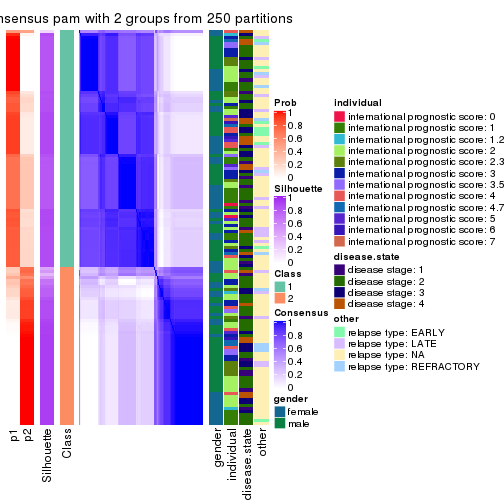</p>

</div>
<div id='tab-CV-pam-consensus-heatmap-2'>
<pre><code class="r">consensus_heatmap(res, k = 3)
</code></pre>

<p>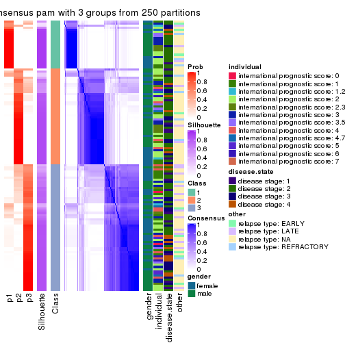</p>

</div>
<div id='tab-CV-pam-consensus-heatmap-3'>
<pre><code class="r">consensus_heatmap(res, k = 4)
</code></pre>

<p>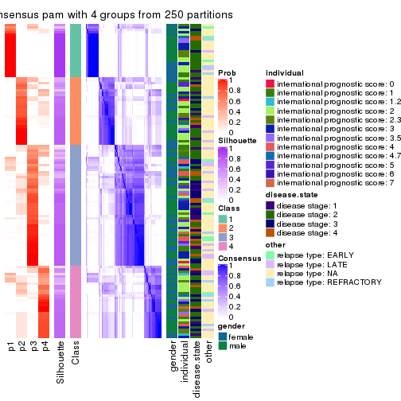</p>

</div>
<div id='tab-CV-pam-consensus-heatmap-4'>
<pre><code class="r">consensus_heatmap(res, k = 5)
</code></pre>

<p>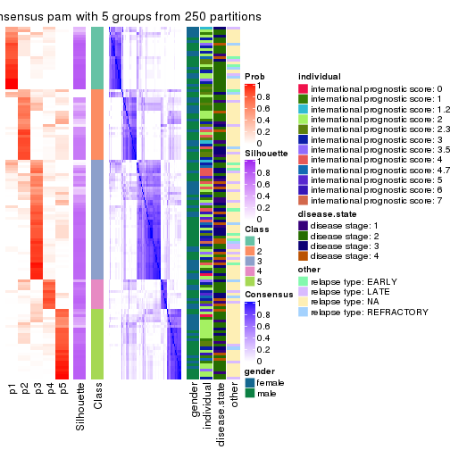</p>

</div>
<div id='tab-CV-pam-consensus-heatmap-5'>
<pre><code class="r">consensus_heatmap(res, k = 6)
</code></pre>

<p>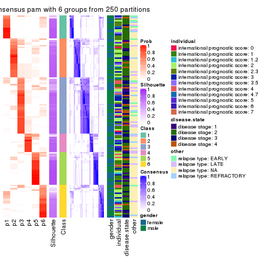</p>

</div>
</div>

Heatmaps for the membership of samples in all partitions to see how consistent they are:


<script>
$( function() {
	$( '#tabs-CV-pam-membership-heatmap' ).tabs();
} );
</script>
<div id='tabs-CV-pam-membership-heatmap'>
<ul>
<li><a href='#tab-CV-pam-membership-heatmap-1'>k = 2</a></li>
<li><a href='#tab-CV-pam-membership-heatmap-2'>k = 3</a></li>
<li><a href='#tab-CV-pam-membership-heatmap-3'>k = 4</a></li>
<li><a href='#tab-CV-pam-membership-heatmap-4'>k = 5</a></li>
<li><a href='#tab-CV-pam-membership-heatmap-5'>k = 6</a></li>
</ul>
<div id='tab-CV-pam-membership-heatmap-1'>
<pre><code class="r">membership_heatmap(res, k = 2)
</code></pre>

<p>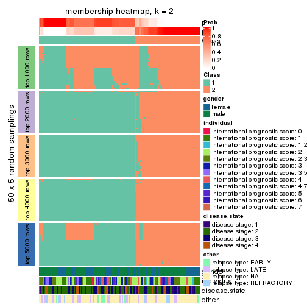</p>

</div>
<div id='tab-CV-pam-membership-heatmap-2'>
<pre><code class="r">membership_heatmap(res, k = 3)
</code></pre>

<p>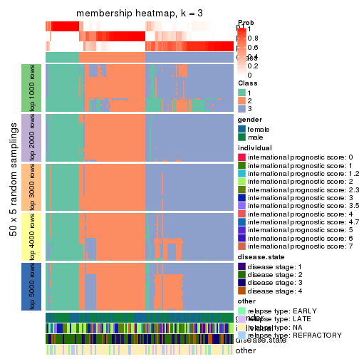</p>

</div>
<div id='tab-CV-pam-membership-heatmap-3'>
<pre><code class="r">membership_heatmap(res, k = 4)
</code></pre>

<p>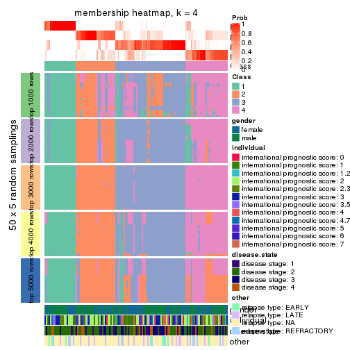</p>

</div>
<div id='tab-CV-pam-membership-heatmap-4'>
<pre><code class="r">membership_heatmap(res, k = 5)
</code></pre>

<p>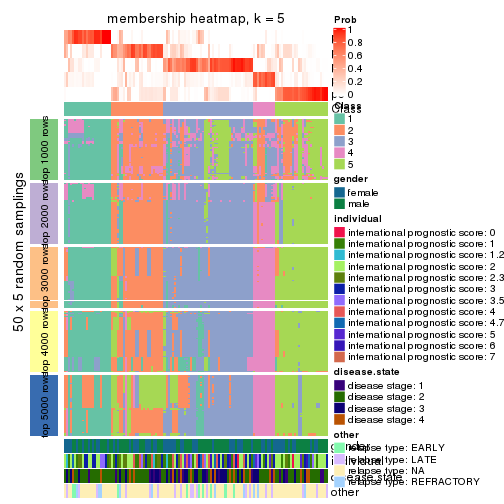</p>

</div>
<div id='tab-CV-pam-membership-heatmap-5'>
<pre><code class="r">membership_heatmap(res, k = 6)
</code></pre>

<p>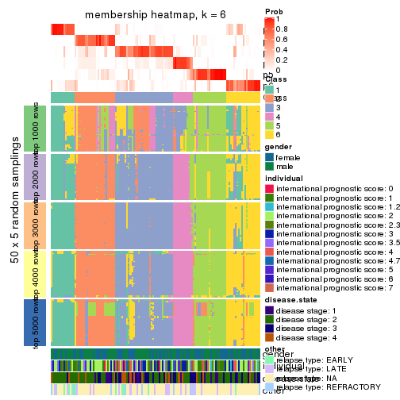</p>

</div>
</div>

As soon as we have had the classes for columns, we can look for signatures
which are significantly different between classes which can be candidate marks
for certain classes. Following are the heatmaps for signatures.


Signature heatmaps where rows are scaled:


<script>
$( function() {
	$( '#tabs-CV-pam-get-signatures' ).tabs();
} );
</script>
<div id='tabs-CV-pam-get-signatures'>
<ul>
<li><a href='#tab-CV-pam-get-signatures-1'>k = 2</a></li>
<li><a href='#tab-CV-pam-get-signatures-2'>k = 3</a></li>
<li><a href='#tab-CV-pam-get-signatures-3'>k = 4</a></li>
<li><a href='#tab-CV-pam-get-signatures-4'>k = 5</a></li>
<li><a href='#tab-CV-pam-get-signatures-5'>k = 6</a></li>
</ul>
<div id='tab-CV-pam-get-signatures-1'>
<pre><code class="r">get_signatures(res, k = 2)
</code></pre>

<p>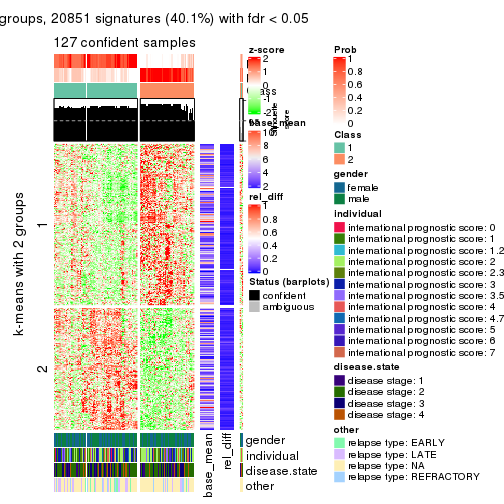</p>

</div>
<div id='tab-CV-pam-get-signatures-2'>
<pre><code class="r">get_signatures(res, k = 3)
</code></pre>

<p>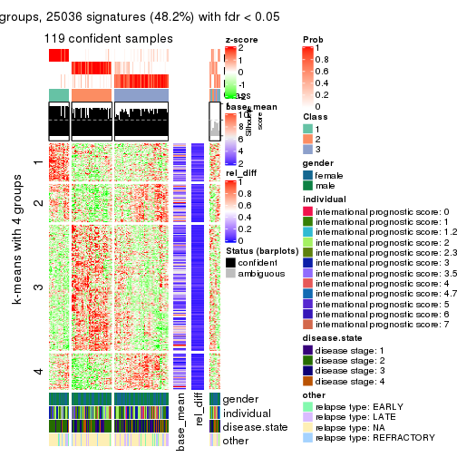</p>

</div>
<div id='tab-CV-pam-get-signatures-3'>
<pre><code class="r">get_signatures(res, k = 4)
</code></pre>

<p>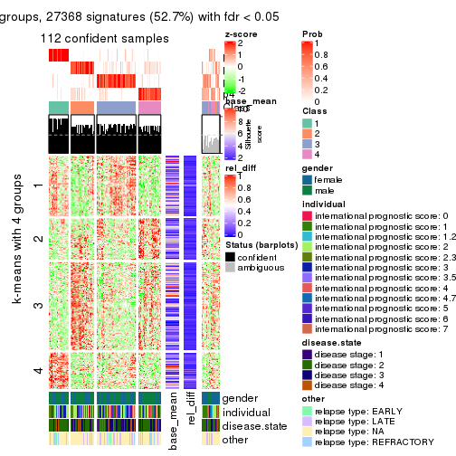</p>

</div>
<div id='tab-CV-pam-get-signatures-4'>
<pre><code class="r">get_signatures(res, k = 5)
</code></pre>

<pre><code>#&gt; Error: The width or height of the raster image is zero, maybe you forget to turn off the
#&gt; previous graphic device or it was corrupted. Run `dev.off()` to close it.
</code></pre>

<p></p>

</div>
<div id='tab-CV-pam-get-signatures-5'>
<pre><code class="r">get_signatures(res, k = 6)
</code></pre>

<pre><code>#&gt; Error: The width or height of the raster image is zero, maybe you forget to turn off the
#&gt; previous graphic device or it was corrupted. Run `dev.off()` to close it.
</code></pre>

<p></p>

</div>
</div>


Signature heatmaps where rows are not scaled:


<script>
$( function() {
	$( '#tabs-CV-pam-get-signatures-no-scale' ).tabs();
} );
</script>
<div id='tabs-CV-pam-get-signatures-no-scale'>
<ul>
<li><a href='#tab-CV-pam-get-signatures-no-scale-1'>k = 2</a></li>
<li><a href='#tab-CV-pam-get-signatures-no-scale-2'>k = 3</a></li>
<li><a href='#tab-CV-pam-get-signatures-no-scale-3'>k = 4</a></li>
<li><a href='#tab-CV-pam-get-signatures-no-scale-4'>k = 5</a></li>
<li><a href='#tab-CV-pam-get-signatures-no-scale-5'>k = 6</a></li>
</ul>
<div id='tab-CV-pam-get-signatures-no-scale-1'>
<pre><code class="r">get_signatures(res, k = 2, scale_rows = FALSE)
</code></pre>

<p>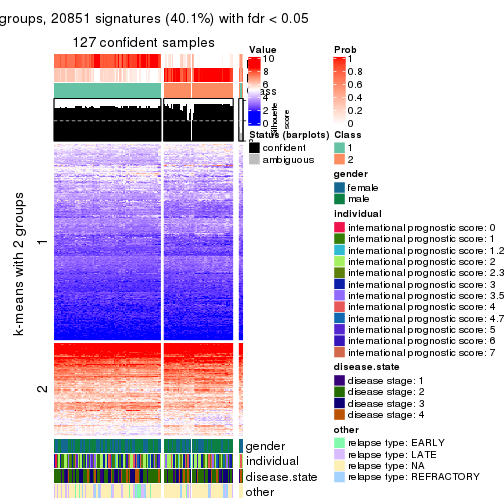</p>

</div>
<div id='tab-CV-pam-get-signatures-no-scale-2'>
<pre><code class="r">get_signatures(res, k = 3, scale_rows = FALSE)
</code></pre>

<p>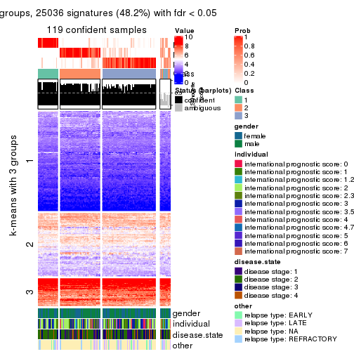</p>

</div>
<div id='tab-CV-pam-get-signatures-no-scale-3'>
<pre><code class="r">get_signatures(res, k = 4, scale_rows = FALSE)
</code></pre>

<p>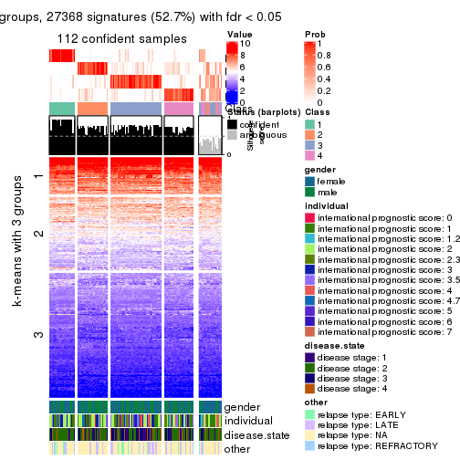</p>

</div>
<div id='tab-CV-pam-get-signatures-no-scale-4'>
<pre><code class="r">get_signatures(res, k = 5, scale_rows = FALSE)
</code></pre>

<p>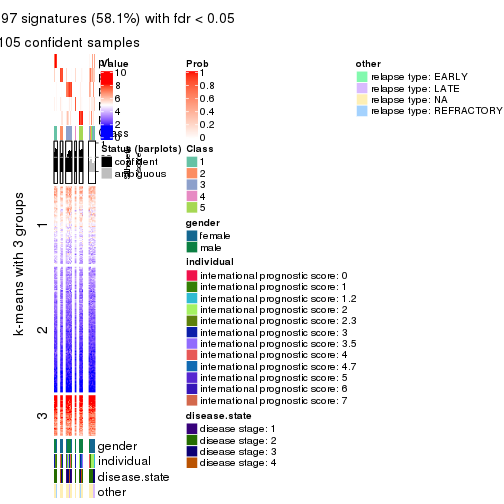</p>

</div>
<div id='tab-CV-pam-get-signatures-no-scale-5'>
<pre><code class="r">get_signatures(res, k = 6, scale_rows = FALSE)
</code></pre>

<p>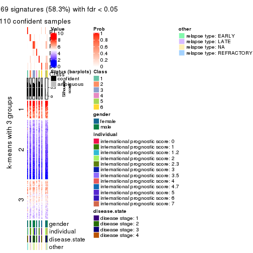</p>

</div>
</div>


Compare the overlap of signatures from different k:

```r
compare_signatures(res)
```

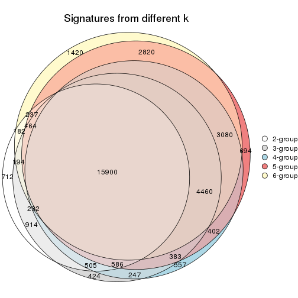

`get_signature()` returns a data frame invisibly. TO get the list of signatures, the function
call should be assigned to a variable explicitly. In following code, if `plot` argument is set
to `FALSE`, no heatmap is plotted while only the differential analysis is performed.

```r
# code only for demonstration
tb = get_signature(res, k = ..., plot = FALSE)
```

An example of the output of `tb` is:

```
#>   which_row         fdr    mean_1    mean_2 scaled_mean_1 scaled_mean_2 km
#> 1        38 0.042760348  8.373488  9.131774    -0.5533452     0.5164555  1
#> 2        40 0.018707592  7.106213  8.469186    -0.6173731     0.5762149  1
#> 3        55 0.019134737 10.221463 11.207825    -0.6159697     0.5749050  1
#> 4        59 0.006059896  5.921854  7.869574    -0.6899429     0.6439467  1
#> 5        60 0.018055526  8.928898 10.211722    -0.6204761     0.5791110  1
#> 6        98 0.009384629 15.714769 14.887706     0.6635654    -0.6193277  2
...
```

The columns in `tb` are:

1. `which_row`: row indices corresponding to the input matrix.
2. `fdr`: FDR for the differential test. 
3. `mean_x`: The mean value in group x.
4. `scaled_mean_x`: The mean value in group x after rows are scaled.
5. `km`: Row groups if k-means clustering is applied to rows.


UMAP plot which shows how samples are separated.


<script>
$( function() {
	$( '#tabs-CV-pam-dimension-reduction' ).tabs();
} );
</script>
<div id='tabs-CV-pam-dimension-reduction'>
<ul>
<li><a href='#tab-CV-pam-dimension-reduction-1'>k = 2</a></li>
<li><a href='#tab-CV-pam-dimension-reduction-2'>k = 3</a></li>
<li><a href='#tab-CV-pam-dimension-reduction-3'>k = 4</a></li>
<li><a href='#tab-CV-pam-dimension-reduction-4'>k = 5</a></li>
<li><a href='#tab-CV-pam-dimension-reduction-5'>k = 6</a></li>
</ul>
<div id='tab-CV-pam-dimension-reduction-1'>
<pre><code class="r">dimension_reduction(res, k = 2, method = &quot;UMAP&quot;)
</code></pre>

<p>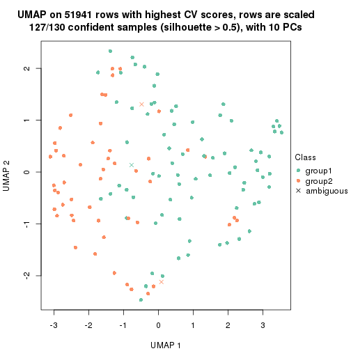</p>

</div>
<div id='tab-CV-pam-dimension-reduction-2'>
<pre><code class="r">dimension_reduction(res, k = 3, method = &quot;UMAP&quot;)
</code></pre>

<p>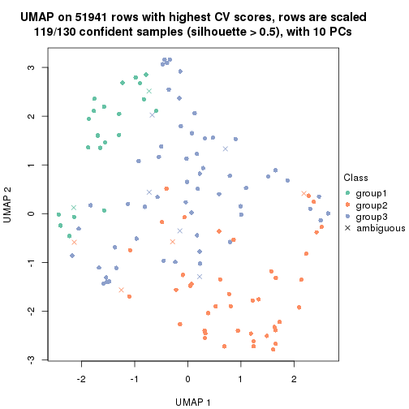</p>

</div>
<div id='tab-CV-pam-dimension-reduction-3'>
<pre><code class="r">dimension_reduction(res, k = 4, method = &quot;UMAP&quot;)
</code></pre>

<p>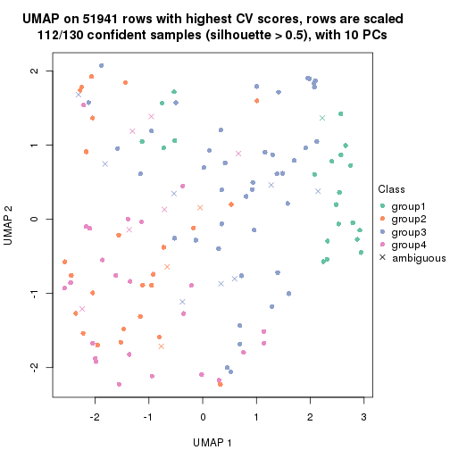</p>

</div>
<div id='tab-CV-pam-dimension-reduction-4'>
<pre><code class="r">dimension_reduction(res, k = 5, method = &quot;UMAP&quot;)
</code></pre>

<p>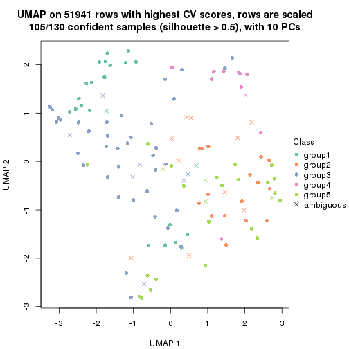</p>

</div>
<div id='tab-CV-pam-dimension-reduction-5'>
<pre><code class="r">dimension_reduction(res, k = 6, method = &quot;UMAP&quot;)
</code></pre>

<p>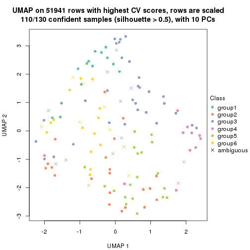</p>

</div>
</div>


Following heatmap shows how subgroups are split when increasing `k`:

```r
collect_classes(res)
```

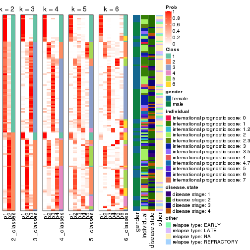


Test correlation between subgroups and known annotations. If the known
annotation is numeric, one-way ANOVA test is applied, and if the known
annotation is discrete, chi-squared contingency table test is applied.

```r
test_to_known_factors(res)
```

```
#>          n gender(p) individual(p) disease.state(p) other(p) k
#> CV:pam 127     0.955         0.813            0.976    0.137 2
#> CV:pam 119     0.712         0.757            0.303    0.266 3
#> CV:pam 112     0.819         0.895            0.138    0.501 4
#> CV:pam 105     0.890         0.655            0.235    0.593 5
#> CV:pam 110     0.699         0.426            0.345    0.492 6
```


If matrix rows can be associated to genes, consider to use `GO_Enrichment(res,
...)` to perform function enrichment for the signature genes.


 

---------------------------------------------------


### CV:mclust


The object with results only for a single top-value method and a single partition method 
can be extracted as:

```r
res = res_list["CV", "mclust"]
# you can also extract it by
# res = res_list["CV:mclust"]
```

A summary of `res` and all the functions that can be applied to it:

```r
res
```

```
#> A 'ConsensusPartition' object with k = 2, 3, 4, 5, 6.
#>   On a matrix with 51941 rows and 130 columns.
#>   Top rows (1000, 2000, 3000, 4000, 5000) are extracted by 'CV' method.
#>   Subgroups are detected by 'mclust' method.
#>   Performed in total 1250 partitions by row resampling.
#>   Best k for subgroups seems to be 4.
#> 
#> Following methods can be applied to this 'ConsensusPartition' object:
#>  [1] "cola_report"             "collect_classes"         "collect_plots"          
#>  [4] "collect_stats"           "colnames"                "compare_signatures"     
#>  [7] "consensus_heatmap"       "dimension_reduction"     "functional_enrichment"  
#> [10] "get_anno_col"            "get_anno"                "get_classes"            
#> [13] "get_consensus"           "get_matrix"              "get_membership"         
#> [16] "get_param"               "get_signatures"          "get_stats"              
#> [19] "is_best_k"               "is_stable_k"             "membership_heatmap"     
#> [22] "ncol"                    "nrow"                    "plot_ecdf"              
#> [25] "rownames"                "select_partition_number" "show"                   
#> [28] "suggest_best_k"          "test_to_known_factors"
```

`collect_plots()` function collects all the plots made from `res` for all `k` (number of partitions)
into one single page to provide an easy and fast comparison between different `k`.

```r
collect_plots(res)
```

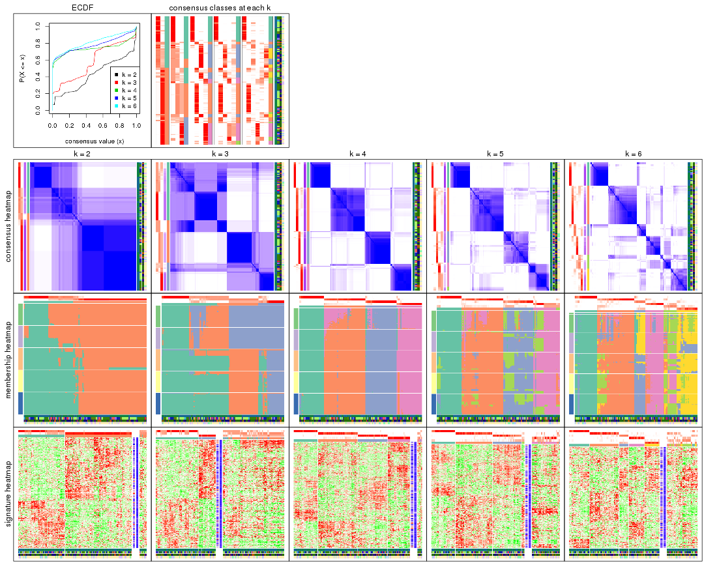

The plots are:

- The first row: a plot of the ECDF (Empirical cumulative distribution
  function) curves of the consensus matrix for each `k` and the heatmap of
  predicted classes for each `k`.
- The second row: heatmaps of the consensus matrix for each `k`.
- The third row: heatmaps of the membership matrix for each `k`.
- The fouth row: heatmaps of the signatures for each `k`.

All the plots in panels can be made by individual functions and they are
plotted later in this section.

`select_partition_number()` produces several plots showing different
statistics for choosing "optimized" `k`. There are following statistics:

- ECDF curves of the consensus matrix for each `k`;
- 1-PAC. [The PAC
  score](https://en.wikipedia.org/wiki/Consensus_clustering#Over-interpretation_potential_of_consensus_clustering)
  measures the proportion of the ambiguous subgrouping.
- Mean silhouette score.
- Concordance. The mean probability of fiting the consensus class ids in all
  partitions.
- Area increased. Denote $A_k$ as the area under the ECDF curve for current
  `k`, the area increased is defined as $A_k - A_{k-1}$.
- Rand index. The percent of pairs of samples that are both in a same cluster
  or both are not in a same cluster in the partition of k and k-1.
- Jaccard index. The ratio of pairs of samples are both in a same cluster in
  the partition of k and k-1 and the pairs of samples are both in a same
  cluster in the partition k or k-1.

The detailed explanations of these statistics can be found in [the cola
vignette](http://bioconductor.org/packages/devel/bioc/vignettes/cola/inst/doc/cola.html#toc_13).

Generally speaking, lower PAC score, higher mean silhouette score or higher
concordance corresponds to better partition. Rand index and Jaccard index
measure how similar the current partition is compared to partition with `k-1`.
If they are too similar, we won't accept `k` is better than `k-1`.

```r
select_partition_number(res)
```

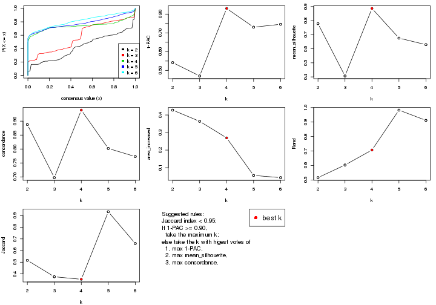

The numeric values for all these statistics can be obtained by `get_stats()`.

```r
get_stats(res)
```

```
#>   k 1-PAC mean_silhouette concordance area_increased  Rand Jaccard
#> 2 2 0.542           0.778       0.888         0.4278 0.516   0.516
#> 3 3 0.470           0.407       0.697         0.3640 0.603   0.375
#> 4 4 0.830           0.886       0.940         0.2696 0.707   0.354
#> 5 5 0.730           0.676       0.802         0.0555 0.982   0.932
#> 6 6 0.746           0.629       0.773         0.0431 0.912   0.661
```

`suggest_best_k()` suggests the best $k$ based on these statistics. The rules are as follows:

- All $k$ with Jaccard index larger than 0.95 are removed because the increase of
  the partition number does not provides enough extra information. If all $k$ are removed,
  the best $k$ is assigned by `NA`.
- For $k$ with 1-PAC larger than 0.9, the maximal $k$ is taken as the "best k". Other $k$ is called "optional k".
- If it does not fit the second rule. The $k$ with the highest vote of highest
  1-PAC, mean silhouette and concordance is taken as the "best k".

```r
suggest_best_k(res)
```

```
#> [1] 4
```


Following shows the table of the partitions (You need to click the **show/hide
code output** link to see it). The membership matrix (columns with name `p*`)
is inferred by
[`clue::cl_consensus()`](https://www.rdocumentation.org/link/cl_consensus?package=clue)
function with the `SE` method. Basically the value in the membership matrix
represents the probability to belong to a certain group. The finall class
label for an item is determined with the group with highest probability it
belongs to.

In `get_classes()` function, the entropy is calculated from the membership
matrix and the silhouette score is calculated from the consensus matrix.


<script>
$( function() {
	$( '#tabs-CV-mclust-get-classes' ).tabs();
} );
</script>
<div id='tabs-CV-mclust-get-classes'>
<ul>
<li><a href='#tab-CV-mclust-get-classes-1'>k = 2</a></li>
<li><a href='#tab-CV-mclust-get-classes-2'>k = 3</a></li>
<li><a href='#tab-CV-mclust-get-classes-3'>k = 4</a></li>
<li><a href='#tab-CV-mclust-get-classes-4'>k = 5</a></li>
<li><a href='#tab-CV-mclust-get-classes-5'>k = 6</a></li>
</ul>

<div id='tab-CV-mclust-get-classes-1'>
<p><a id='tab-CV-mclust-get-classes-1-a' style='color:#0366d6' href='#'>show/hide code output</a></p>
<pre><code class="r">cbind(get_classes(res, k = 2), get_membership(res, k = 2))
</code></pre>

<pre><code>#&gt;           class entropy silhouette    p1    p2
#&gt; GSM447671     2   0.163     0.9302 0.024 0.976
#&gt; GSM447694     1   0.969     0.6076 0.604 0.396
#&gt; GSM447618     2   0.163     0.9302 0.024 0.976
#&gt; GSM447691     2   0.163     0.9302 0.024 0.976
#&gt; GSM447733     2   0.000     0.9231 0.000 1.000
#&gt; GSM447620     2   0.163     0.9302 0.024 0.976
#&gt; GSM447627     2   0.141     0.9292 0.020 0.980
#&gt; GSM447630     2   0.163     0.9302 0.024 0.976
#&gt; GSM447642     1   0.000     0.7653 1.000 0.000
#&gt; GSM447649     2   0.163     0.9302 0.024 0.976
#&gt; GSM447654     2   0.000     0.9231 0.000 1.000
#&gt; GSM447655     2   0.163     0.9302 0.024 0.976
#&gt; GSM447669     2   0.163     0.9302 0.024 0.976
#&gt; GSM447676     1   0.000     0.7653 1.000 0.000
#&gt; GSM447678     2   0.000     0.9231 0.000 1.000
#&gt; GSM447681     2   0.163     0.9302 0.024 0.976
#&gt; GSM447698     2   0.000     0.9231 0.000 1.000
#&gt; GSM447713     1   0.000     0.7653 1.000 0.000
#&gt; GSM447722     2   0.000     0.9231 0.000 1.000
#&gt; GSM447726     2   0.706     0.6925 0.192 0.808
#&gt; GSM447735     2   0.000     0.9231 0.000 1.000
#&gt; GSM447737     1   0.000     0.7653 1.000 0.000
#&gt; GSM447657     2   0.163     0.9302 0.024 0.976
#&gt; GSM447674     2   0.163     0.9302 0.024 0.976
#&gt; GSM447636     1   0.000     0.7653 1.000 0.000
#&gt; GSM447723     1   0.634     0.7539 0.840 0.160
#&gt; GSM447699     2   0.946     0.2048 0.364 0.636
#&gt; GSM447708     2   0.163     0.9302 0.024 0.976
#&gt; GSM447721     1   0.000     0.7653 1.000 0.000
#&gt; GSM447623     1   0.000     0.7653 1.000 0.000
#&gt; GSM447621     1   0.000     0.7653 1.000 0.000
#&gt; GSM447650     2   0.163     0.9302 0.024 0.976
#&gt; GSM447651     2   0.163     0.9302 0.024 0.976
#&gt; GSM447653     2   0.000     0.9231 0.000 1.000
#&gt; GSM447658     1   0.000     0.7653 1.000 0.000
#&gt; GSM447675     2   0.000     0.9231 0.000 1.000
#&gt; GSM447680     2   0.991    -0.1578 0.444 0.556
#&gt; GSM447686     1   0.802     0.7301 0.756 0.244
#&gt; GSM447736     2   0.506     0.8277 0.112 0.888
#&gt; GSM447629     2   0.163     0.9302 0.024 0.976
#&gt; GSM447648     1   0.895     0.6988 0.688 0.312
#&gt; GSM447660     1   0.000     0.7653 1.000 0.000
#&gt; GSM447661     2   0.163     0.9302 0.024 0.976
#&gt; GSM447663     1   0.990     0.5150 0.560 0.440
#&gt; GSM447704     2   0.163     0.9302 0.024 0.976
#&gt; GSM447720     2   0.518     0.8215 0.116 0.884
#&gt; GSM447652     2   0.163     0.9302 0.024 0.976
#&gt; GSM447679     2   0.163     0.9302 0.024 0.976
#&gt; GSM447712     1   0.000     0.7653 1.000 0.000
#&gt; GSM447664     2   0.000     0.9231 0.000 1.000
#&gt; GSM447637     1   0.881     0.7067 0.700 0.300
#&gt; GSM447639     2   0.000     0.9231 0.000 1.000
#&gt; GSM447615     1   0.871     0.7111 0.708 0.292
#&gt; GSM447656     1   1.000     0.3845 0.512 0.488
#&gt; GSM447673     2   0.000     0.9231 0.000 1.000
#&gt; GSM447719     2   0.000     0.9231 0.000 1.000
#&gt; GSM447706     1   0.909     0.6888 0.676 0.324
#&gt; GSM447612     2   0.985    -0.0828 0.428 0.572
#&gt; GSM447665     2   0.163     0.9302 0.024 0.976
#&gt; GSM447677     2   0.163     0.9302 0.024 0.976
#&gt; GSM447613     1   0.000     0.7653 1.000 0.000
#&gt; GSM447659     2   0.000     0.9231 0.000 1.000
#&gt; GSM447662     1   0.971     0.6009 0.600 0.400
#&gt; GSM447666     2   0.991    -0.1546 0.444 0.556
#&gt; GSM447668     2   0.163     0.9302 0.024 0.976
#&gt; GSM447682     2   0.163     0.9302 0.024 0.976
#&gt; GSM447683     2   0.163     0.9302 0.024 0.976
#&gt; GSM447688     2   0.000     0.9231 0.000 1.000
#&gt; GSM447702     2   0.163     0.9302 0.024 0.976
#&gt; GSM447709     2   0.163     0.9302 0.024 0.976
#&gt; GSM447711     1   0.000     0.7653 1.000 0.000
#&gt; GSM447715     1   0.943     0.6528 0.640 0.360
#&gt; GSM447693     1   0.969     0.6076 0.604 0.396
#&gt; GSM447611     2   0.000     0.9231 0.000 1.000
#&gt; GSM447672     2   0.163     0.9302 0.024 0.976
#&gt; GSM447703     2   0.000     0.9231 0.000 1.000
#&gt; GSM447727     1   0.506     0.7633 0.888 0.112
#&gt; GSM447638     1   1.000     0.3845 0.512 0.488
#&gt; GSM447670     1   0.506     0.7633 0.888 0.112
#&gt; GSM447700     2   0.163     0.9302 0.024 0.976
#&gt; GSM447738     2   0.000     0.9231 0.000 1.000
#&gt; GSM447739     1   0.000     0.7653 1.000 0.000
#&gt; GSM447617     1   0.000     0.7653 1.000 0.000
#&gt; GSM447628     2   0.000     0.9231 0.000 1.000
#&gt; GSM447632     2   0.000     0.9231 0.000 1.000
#&gt; GSM447619     1   0.971     0.6009 0.600 0.400
#&gt; GSM447643     1   0.494     0.7638 0.892 0.108
#&gt; GSM447724     2   0.000     0.9231 0.000 1.000
#&gt; GSM447728     2   0.163     0.9302 0.024 0.976
#&gt; GSM447610     2   0.595     0.7428 0.144 0.856
#&gt; GSM447633     2   0.163     0.9302 0.024 0.976
#&gt; GSM447634     1   0.975     0.5821 0.592 0.408
#&gt; GSM447622     1   0.876     0.7090 0.704 0.296
#&gt; GSM447667     2   0.163     0.9302 0.024 0.976
#&gt; GSM447687     2   0.000     0.9231 0.000 1.000
#&gt; GSM447695     1   0.969     0.6076 0.604 0.396
#&gt; GSM447696     1   0.000     0.7653 1.000 0.000
#&gt; GSM447697     1   0.000     0.7653 1.000 0.000
#&gt; GSM447714     2   0.584     0.7871 0.140 0.860
#&gt; GSM447717     1   0.000     0.7653 1.000 0.000
#&gt; GSM447725     1   0.000     0.7653 1.000 0.000
#&gt; GSM447729     2   0.000     0.9231 0.000 1.000
#&gt; GSM447644     2   0.163     0.9302 0.024 0.976
#&gt; GSM447710     1   0.971     0.6009 0.600 0.400
#&gt; GSM447614     2   0.000     0.9231 0.000 1.000
#&gt; GSM447685     2   1.000    -0.3536 0.496 0.504
#&gt; GSM447690     1   0.000     0.7653 1.000 0.000
#&gt; GSM447730     2   0.163     0.9302 0.024 0.976
#&gt; GSM447646     2   0.000     0.9231 0.000 1.000
#&gt; GSM447689     1   0.971     0.6009 0.600 0.400
#&gt; GSM447635     2   0.163     0.9302 0.024 0.976
#&gt; GSM447641     1   0.000     0.7653 1.000 0.000
#&gt; GSM447716     2   0.163     0.9302 0.024 0.976
#&gt; GSM447718     2   0.163     0.9302 0.024 0.976
#&gt; GSM447616     1   0.871     0.7111 0.708 0.292
#&gt; GSM447626     1   0.952     0.6385 0.628 0.372
#&gt; GSM447640     2   0.163     0.9302 0.024 0.976
#&gt; GSM447734     1   0.973     0.5933 0.596 0.404
#&gt; GSM447692     1   0.895     0.6988 0.688 0.312
#&gt; GSM447647     2   0.000     0.9231 0.000 1.000
#&gt; GSM447624     1   0.443     0.7647 0.908 0.092
#&gt; GSM447625     2   0.999    -0.2933 0.480 0.520
#&gt; GSM447707     2   0.163     0.9302 0.024 0.976
#&gt; GSM447732     1   0.963     0.6186 0.612 0.388
#&gt; GSM447684     1   0.969     0.6035 0.604 0.396
#&gt; GSM447731     2   0.000     0.9231 0.000 1.000
#&gt; GSM447705     2   0.529     0.8167 0.120 0.880
#&gt; GSM447631     1   0.939     0.6576 0.644 0.356
#&gt; GSM447701     2   0.163     0.9302 0.024 0.976
#&gt; GSM447645     1   0.895     0.6988 0.688 0.312
</code></pre>

<script>
$('#tab-CV-mclust-get-classes-1-a').parent().next().next().hide();
$('#tab-CV-mclust-get-classes-1-a').click(function(){
  $('#tab-CV-mclust-get-classes-1-a').parent().next().next().toggle();
  return(false);
});
</script>
</div>

<div id='tab-CV-mclust-get-classes-2'>
<p><a id='tab-CV-mclust-get-classes-2-a' style='color:#0366d6' href='#'>show/hide code output</a></p>
<pre><code class="r">cbind(get_classes(res, k = 3), get_membership(res, k = 3))
</code></pre>

<pre><code>#&gt;           class entropy silhouette    p1    p2    p3
#&gt; GSM447671     2  0.6168     0.4352 0.000 0.588 0.412
#&gt; GSM447694     1  0.6309     0.5248 0.500 0.500 0.000
#&gt; GSM447618     2  0.6168     0.4352 0.000 0.588 0.412
#&gt; GSM447691     2  0.6168     0.4352 0.000 0.588 0.412
#&gt; GSM447733     3  0.0592     0.6895 0.012 0.000 0.988
#&gt; GSM447620     2  0.6168     0.4352 0.000 0.588 0.412
#&gt; GSM447627     1  0.9105     0.5507 0.500 0.348 0.152
#&gt; GSM447630     3  0.9871     0.0745 0.280 0.308 0.412
#&gt; GSM447642     1  0.0000     0.7055 1.000 0.000 0.000
#&gt; GSM447649     2  0.6168     0.4352 0.000 0.588 0.412
#&gt; GSM447654     3  0.0000     0.6966 0.000 0.000 1.000
#&gt; GSM447655     2  0.6168     0.4352 0.000 0.588 0.412
#&gt; GSM447669     2  0.6168     0.4352 0.000 0.588 0.412
#&gt; GSM447676     1  0.0000     0.7055 1.000 0.000 0.000
#&gt; GSM447678     3  0.0000     0.6966 0.000 0.000 1.000
#&gt; GSM447681     2  0.6168     0.4352 0.000 0.588 0.412
#&gt; GSM447698     3  0.5465     0.3015 0.000 0.288 0.712
#&gt; GSM447713     1  0.0000     0.7055 1.000 0.000 0.000
#&gt; GSM447722     3  0.2959     0.6141 0.100 0.000 0.900
#&gt; GSM447726     1  0.8747     0.1233 0.492 0.112 0.396
#&gt; GSM447735     1  0.9042     0.3703 0.500 0.144 0.356
#&gt; GSM447737     1  0.0237     0.7054 0.996 0.004 0.000
#&gt; GSM447657     2  0.6168     0.4352 0.000 0.588 0.412
#&gt; GSM447674     2  0.6168     0.4352 0.000 0.588 0.412
#&gt; GSM447636     1  0.0000     0.7055 1.000 0.000 0.000
#&gt; GSM447723     1  0.0000     0.7055 1.000 0.000 0.000
#&gt; GSM447699     1  0.9464     0.4259 0.500 0.252 0.248
#&gt; GSM447708     2  0.6168     0.4352 0.000 0.588 0.412
#&gt; GSM447721     1  0.0000     0.7055 1.000 0.000 0.000
#&gt; GSM447623     1  0.0000     0.7055 1.000 0.000 0.000
#&gt; GSM447621     1  0.0000     0.7055 1.000 0.000 0.000
#&gt; GSM447650     2  0.6168     0.4352 0.000 0.588 0.412
#&gt; GSM447651     2  0.6168     0.4352 0.000 0.588 0.412
#&gt; GSM447653     3  0.6521    -0.0534 0.492 0.004 0.504
#&gt; GSM447658     1  0.0000     0.7055 1.000 0.000 0.000
#&gt; GSM447675     3  0.0000     0.6966 0.000 0.000 1.000
#&gt; GSM447680     1  0.7851     0.0255 0.532 0.056 0.412
#&gt; GSM447686     1  0.0475     0.7018 0.992 0.004 0.004
#&gt; GSM447736     1  0.6825     0.5263 0.500 0.488 0.012
#&gt; GSM447629     2  0.8427     0.2521 0.088 0.500 0.412
#&gt; GSM447648     2  0.6309    -0.5437 0.500 0.500 0.000
#&gt; GSM447660     1  0.0000     0.7055 1.000 0.000 0.000
#&gt; GSM447661     2  0.6168     0.4352 0.000 0.588 0.412
#&gt; GSM447663     1  0.8124     0.5237 0.496 0.436 0.068
#&gt; GSM447704     2  0.6168     0.4352 0.000 0.588 0.412
#&gt; GSM447720     1  0.9460     0.4375 0.500 0.260 0.240
#&gt; GSM447652     2  0.6168     0.4352 0.000 0.588 0.412
#&gt; GSM447679     2  0.6168     0.4352 0.000 0.588 0.412
#&gt; GSM447712     1  0.0000     0.7055 1.000 0.000 0.000
#&gt; GSM447664     3  0.0000     0.6966 0.000 0.000 1.000
#&gt; GSM447637     2  0.6309    -0.5437 0.500 0.500 0.000
#&gt; GSM447639     3  0.6825    -0.0610 0.492 0.012 0.496
#&gt; GSM447615     1  0.6286     0.5526 0.536 0.464 0.000
#&gt; GSM447656     1  0.8228     0.1032 0.512 0.076 0.412
#&gt; GSM447673     3  0.0000     0.6966 0.000 0.000 1.000
#&gt; GSM447719     1  0.8652     0.5467 0.492 0.404 0.104
#&gt; GSM447706     1  0.6309     0.5248 0.500 0.500 0.000
#&gt; GSM447612     1  0.9217     0.4865 0.492 0.344 0.164
#&gt; GSM447665     2  0.6168     0.4352 0.000 0.588 0.412
#&gt; GSM447677     2  0.6168     0.4352 0.000 0.588 0.412
#&gt; GSM447613     1  0.0000     0.7055 1.000 0.000 0.000
#&gt; GSM447659     1  0.8440     0.2393 0.492 0.088 0.420
#&gt; GSM447662     1  0.6309     0.5248 0.500 0.500 0.000
#&gt; GSM447666     2  0.6308    -0.5402 0.492 0.508 0.000
#&gt; GSM447668     2  0.6168     0.4352 0.000 0.588 0.412
#&gt; GSM447682     2  0.6168     0.4352 0.000 0.588 0.412
#&gt; GSM447683     2  0.6168     0.4352 0.000 0.588 0.412
#&gt; GSM447688     3  0.0237     0.6942 0.000 0.004 0.996
#&gt; GSM447702     2  0.6168     0.4352 0.000 0.588 0.412
#&gt; GSM447709     2  0.6168     0.4352 0.000 0.588 0.412
#&gt; GSM447711     1  0.0000     0.7055 1.000 0.000 0.000
#&gt; GSM447715     1  0.0237     0.7041 0.996 0.000 0.004
#&gt; GSM447693     2  0.6309    -0.5437 0.500 0.500 0.000
#&gt; GSM447611     3  0.0000     0.6966 0.000 0.000 1.000
#&gt; GSM447672     2  0.6168     0.4352 0.000 0.588 0.412
#&gt; GSM447703     3  0.0424     0.6912 0.000 0.008 0.992
#&gt; GSM447727     1  0.0237     0.7055 0.996 0.004 0.000
#&gt; GSM447638     1  0.7438     0.5609 0.536 0.428 0.036
#&gt; GSM447670     1  0.0592     0.7050 0.988 0.012 0.000
#&gt; GSM447700     1  0.8602     0.0942 0.492 0.100 0.408
#&gt; GSM447738     3  0.0000     0.6966 0.000 0.000 1.000
#&gt; GSM447739     1  0.0000     0.7055 1.000 0.000 0.000
#&gt; GSM447617     1  0.0000     0.7055 1.000 0.000 0.000
#&gt; GSM447628     3  0.0000     0.6966 0.000 0.000 1.000
#&gt; GSM447632     3  0.0424     0.6912 0.000 0.008 0.992
#&gt; GSM447619     2  0.6309    -0.5437 0.500 0.500 0.000
#&gt; GSM447643     1  0.0000     0.7055 1.000 0.000 0.000
#&gt; GSM447724     3  0.6521    -0.0534 0.492 0.004 0.504
#&gt; GSM447728     2  0.6168     0.4352 0.000 0.588 0.412
#&gt; GSM447610     1  0.2711     0.6659 0.912 0.000 0.088
#&gt; GSM447633     3  0.9889     0.0902 0.300 0.292 0.408
#&gt; GSM447634     1  0.9340     0.4771 0.500 0.308 0.192
#&gt; GSM447622     1  0.6299     0.5447 0.524 0.476 0.000
#&gt; GSM447667     3  0.9862     0.0603 0.272 0.316 0.412
#&gt; GSM447687     3  0.0000     0.6966 0.000 0.000 1.000
#&gt; GSM447695     1  0.8370     0.5235 0.500 0.416 0.084
#&gt; GSM447696     1  0.0000     0.7055 1.000 0.000 0.000
#&gt; GSM447697     1  0.0000     0.7055 1.000 0.000 0.000
#&gt; GSM447714     2  0.6309    -0.5437 0.500 0.500 0.000
#&gt; GSM447717     1  0.0000     0.7055 1.000 0.000 0.000
#&gt; GSM447725     1  0.0000     0.7055 1.000 0.000 0.000
#&gt; GSM447729     3  0.0000     0.6966 0.000 0.000 1.000
#&gt; GSM447644     3  0.9601     0.1253 0.392 0.200 0.408
#&gt; GSM447710     1  0.6309     0.5248 0.500 0.500 0.000
#&gt; GSM447614     1  0.9262     0.4226 0.500 0.176 0.324
#&gt; GSM447685     3  0.9758    -0.0224 0.232 0.356 0.412
#&gt; GSM447690     1  0.0000     0.7055 1.000 0.000 0.000
#&gt; GSM447730     2  0.6168     0.4352 0.000 0.588 0.412
#&gt; GSM447646     3  0.0000     0.6966 0.000 0.000 1.000
#&gt; GSM447689     2  0.6309    -0.5437 0.500 0.500 0.000
#&gt; GSM447635     1  0.8550     0.0846 0.492 0.096 0.412
#&gt; GSM447641     1  0.0000     0.7055 1.000 0.000 0.000
#&gt; GSM447716     3  0.7670     0.3283 0.312 0.068 0.620
#&gt; GSM447718     1  0.8550     0.0846 0.492 0.096 0.412
#&gt; GSM447616     2  0.6309    -0.5437 0.500 0.500 0.000
#&gt; GSM447626     1  0.6309     0.5285 0.504 0.496 0.000
#&gt; GSM447640     2  0.6168     0.4352 0.000 0.588 0.412
#&gt; GSM447734     1  0.6309     0.5248 0.500 0.500 0.000
#&gt; GSM447692     2  0.6309    -0.5437 0.500 0.500 0.000
#&gt; GSM447647     3  0.0000     0.6966 0.000 0.000 1.000
#&gt; GSM447624     1  0.3412     0.6849 0.876 0.124 0.000
#&gt; GSM447625     1  0.9042     0.5038 0.500 0.356 0.144
#&gt; GSM447707     2  0.6168     0.4352 0.000 0.588 0.412
#&gt; GSM447732     1  0.6309     0.5248 0.500 0.500 0.000
#&gt; GSM447684     1  0.6154     0.5829 0.592 0.408 0.000
#&gt; GSM447731     3  0.0000     0.6966 0.000 0.000 1.000
#&gt; GSM447705     2  0.6825    -0.5412 0.492 0.496 0.012
#&gt; GSM447631     2  0.6309    -0.5437 0.500 0.500 0.000
#&gt; GSM447701     2  0.6168     0.4352 0.000 0.588 0.412
#&gt; GSM447645     2  0.6309    -0.5437 0.500 0.500 0.000
</code></pre>

<script>
$('#tab-CV-mclust-get-classes-2-a').parent().next().next().hide();
$('#tab-CV-mclust-get-classes-2-a').click(function(){
  $('#tab-CV-mclust-get-classes-2-a').parent().next().next().toggle();
  return(false);
});
</script>
</div>

<div id='tab-CV-mclust-get-classes-3'>
<p><a id='tab-CV-mclust-get-classes-3-a' style='color:#0366d6' href='#'>show/hide code output</a></p>
<pre><code class="r">cbind(get_classes(res, k = 4), get_membership(res, k = 4))
</code></pre>

<pre><code>#&gt;           class entropy silhouette    p1    p2    p3    p4
#&gt; GSM447671     2  0.3208      0.878 0.000 0.848 0.004 0.148
#&gt; GSM447694     3  0.0000      0.951 0.000 0.000 1.000 0.000
#&gt; GSM447618     2  0.3569      0.837 0.000 0.804 0.000 0.196
#&gt; GSM447691     2  0.2973      0.881 0.000 0.856 0.000 0.144
#&gt; GSM447733     4  0.0000      0.922 0.000 0.000 0.000 1.000
#&gt; GSM447620     2  0.3370      0.893 0.000 0.872 0.048 0.080
#&gt; GSM447627     3  0.2408      0.869 0.000 0.000 0.896 0.104
#&gt; GSM447630     2  0.1302      0.907 0.000 0.956 0.000 0.044
#&gt; GSM447642     1  0.0000      0.983 1.000 0.000 0.000 0.000
#&gt; GSM447649     2  0.1557      0.907 0.000 0.944 0.000 0.056
#&gt; GSM447654     4  0.0336      0.922 0.000 0.008 0.000 0.992
#&gt; GSM447655     2  0.0000      0.901 0.000 1.000 0.000 0.000
#&gt; GSM447669     2  0.1557      0.907 0.000 0.944 0.000 0.056
#&gt; GSM447676     1  0.0000      0.983 1.000 0.000 0.000 0.000
#&gt; GSM447678     4  0.0188      0.923 0.000 0.004 0.000 0.996
#&gt; GSM447681     2  0.1637      0.907 0.000 0.940 0.000 0.060
#&gt; GSM447698     2  0.4961      0.349 0.000 0.552 0.000 0.448
#&gt; GSM447713     1  0.0000      0.983 1.000 0.000 0.000 0.000
#&gt; GSM447722     4  0.0188      0.923 0.000 0.004 0.000 0.996
#&gt; GSM447726     2  0.1867      0.881 0.000 0.928 0.072 0.000
#&gt; GSM447735     4  0.0000      0.922 0.000 0.000 0.000 1.000
#&gt; GSM447737     1  0.3074      0.818 0.848 0.000 0.152 0.000
#&gt; GSM447657     2  0.2647      0.893 0.000 0.880 0.000 0.120
#&gt; GSM447674     2  0.2345      0.901 0.000 0.900 0.000 0.100
#&gt; GSM447636     1  0.0000      0.983 1.000 0.000 0.000 0.000
#&gt; GSM447723     1  0.0000      0.983 1.000 0.000 0.000 0.000
#&gt; GSM447699     3  0.3610      0.750 0.000 0.000 0.800 0.200
#&gt; GSM447708     2  0.2973      0.881 0.000 0.856 0.000 0.144
#&gt; GSM447721     1  0.0000      0.983 1.000 0.000 0.000 0.000
#&gt; GSM447623     1  0.0000      0.983 1.000 0.000 0.000 0.000
#&gt; GSM447621     1  0.0592      0.970 0.984 0.000 0.016 0.000
#&gt; GSM447650     2  0.0000      0.901 0.000 1.000 0.000 0.000
#&gt; GSM447651     2  0.0000      0.901 0.000 1.000 0.000 0.000
#&gt; GSM447653     4  0.0000      0.922 0.000 0.000 0.000 1.000
#&gt; GSM447658     1  0.0000      0.983 1.000 0.000 0.000 0.000
#&gt; GSM447675     4  0.0188      0.923 0.000 0.004 0.000 0.996
#&gt; GSM447680     2  0.1624      0.904 0.020 0.952 0.000 0.028
#&gt; GSM447686     1  0.0000      0.983 1.000 0.000 0.000 0.000
#&gt; GSM447736     3  0.0188      0.949 0.000 0.000 0.996 0.004
#&gt; GSM447629     2  0.3444      0.849 0.000 0.816 0.000 0.184
#&gt; GSM447648     3  0.0000      0.951 0.000 0.000 1.000 0.000
#&gt; GSM447660     1  0.0000      0.983 1.000 0.000 0.000 0.000
#&gt; GSM447661     2  0.0000      0.901 0.000 1.000 0.000 0.000
#&gt; GSM447663     3  0.1302      0.921 0.000 0.044 0.956 0.000
#&gt; GSM447704     2  0.2281      0.902 0.000 0.904 0.000 0.096
#&gt; GSM447720     3  0.3734      0.826 0.000 0.044 0.848 0.108
#&gt; GSM447652     2  0.0000      0.901 0.000 1.000 0.000 0.000
#&gt; GSM447679     2  0.2149      0.903 0.000 0.912 0.000 0.088
#&gt; GSM447712     1  0.0000      0.983 1.000 0.000 0.000 0.000
#&gt; GSM447664     4  0.0188      0.923 0.000 0.004 0.000 0.996
#&gt; GSM447637     3  0.0000      0.951 0.000 0.000 1.000 0.000
#&gt; GSM447639     4  0.0188      0.923 0.000 0.004 0.000 0.996
#&gt; GSM447615     3  0.0707      0.938 0.020 0.000 0.980 0.000
#&gt; GSM447656     2  0.2868      0.886 0.000 0.864 0.000 0.136
#&gt; GSM447673     4  0.0188      0.923 0.000 0.004 0.000 0.996
#&gt; GSM447719     4  0.3610      0.700 0.000 0.000 0.200 0.800
#&gt; GSM447706     3  0.0000      0.951 0.000 0.000 1.000 0.000
#&gt; GSM447612     3  0.0524      0.945 0.000 0.008 0.988 0.004
#&gt; GSM447665     2  0.0000      0.901 0.000 1.000 0.000 0.000
#&gt; GSM447677     2  0.0000      0.901 0.000 1.000 0.000 0.000
#&gt; GSM447613     1  0.0000      0.983 1.000 0.000 0.000 0.000
#&gt; GSM447659     4  0.0000      0.922 0.000 0.000 0.000 1.000
#&gt; GSM447662     3  0.0000      0.951 0.000 0.000 1.000 0.000
#&gt; GSM447666     3  0.0000      0.951 0.000 0.000 1.000 0.000
#&gt; GSM447668     2  0.0000      0.901 0.000 1.000 0.000 0.000
#&gt; GSM447682     2  0.3024      0.879 0.000 0.852 0.000 0.148
#&gt; GSM447683     2  0.2408      0.899 0.000 0.896 0.000 0.104
#&gt; GSM447688     4  0.0336      0.922 0.000 0.008 0.000 0.992
#&gt; GSM447702     2  0.0000      0.901 0.000 1.000 0.000 0.000
#&gt; GSM447709     2  0.0000      0.901 0.000 1.000 0.000 0.000
#&gt; GSM447711     1  0.0000      0.983 1.000 0.000 0.000 0.000
#&gt; GSM447715     1  0.0921      0.955 0.972 0.028 0.000 0.000
#&gt; GSM447693     3  0.0000      0.951 0.000 0.000 1.000 0.000
#&gt; GSM447611     4  0.0000      0.922 0.000 0.000 0.000 1.000
#&gt; GSM447672     2  0.0000      0.901 0.000 1.000 0.000 0.000
#&gt; GSM447703     4  0.4898      0.146 0.000 0.416 0.000 0.584
#&gt; GSM447727     1  0.3356      0.783 0.824 0.000 0.176 0.000
#&gt; GSM447638     2  0.3157      0.830 0.004 0.852 0.144 0.000
#&gt; GSM447670     3  0.4967      0.188 0.452 0.000 0.548 0.000
#&gt; GSM447700     2  0.4134      0.759 0.000 0.740 0.000 0.260
#&gt; GSM447738     4  0.0921      0.906 0.000 0.028 0.000 0.972
#&gt; GSM447739     1  0.0000      0.983 1.000 0.000 0.000 0.000
#&gt; GSM447617     1  0.0000      0.983 1.000 0.000 0.000 0.000
#&gt; GSM447628     4  0.0469      0.919 0.000 0.012 0.000 0.988
#&gt; GSM447632     4  0.4866      0.169 0.000 0.404 0.000 0.596
#&gt; GSM447619     3  0.0000      0.951 0.000 0.000 1.000 0.000
#&gt; GSM447643     1  0.0469      0.972 0.988 0.012 0.000 0.000
#&gt; GSM447724     4  0.0000      0.922 0.000 0.000 0.000 1.000
#&gt; GSM447728     2  0.2408      0.899 0.000 0.896 0.000 0.104
#&gt; GSM447610     4  0.4843      0.284 0.396 0.000 0.000 0.604
#&gt; GSM447633     2  0.2060      0.894 0.000 0.932 0.052 0.016
#&gt; GSM447634     3  0.2676      0.871 0.000 0.012 0.896 0.092
#&gt; GSM447622     3  0.0000      0.951 0.000 0.000 1.000 0.000
#&gt; GSM447667     2  0.3528      0.844 0.000 0.808 0.000 0.192
#&gt; GSM447687     4  0.2011      0.857 0.000 0.080 0.000 0.920
#&gt; GSM447695     3  0.3219      0.798 0.000 0.000 0.836 0.164
#&gt; GSM447696     1  0.0000      0.983 1.000 0.000 0.000 0.000
#&gt; GSM447697     1  0.0000      0.983 1.000 0.000 0.000 0.000
#&gt; GSM447714     3  0.0000      0.951 0.000 0.000 1.000 0.000
#&gt; GSM447717     1  0.0000      0.983 1.000 0.000 0.000 0.000
#&gt; GSM447725     1  0.0000      0.983 1.000 0.000 0.000 0.000
#&gt; GSM447729     4  0.0188      0.923 0.000 0.004 0.000 0.996
#&gt; GSM447644     2  0.0000      0.901 0.000 1.000 0.000 0.000
#&gt; GSM447710     3  0.0000      0.951 0.000 0.000 1.000 0.000
#&gt; GSM447614     4  0.0000      0.922 0.000 0.000 0.000 1.000
#&gt; GSM447685     2  0.3024      0.879 0.000 0.852 0.000 0.148
#&gt; GSM447690     1  0.0000      0.983 1.000 0.000 0.000 0.000
#&gt; GSM447730     2  0.0000      0.901 0.000 1.000 0.000 0.000
#&gt; GSM447646     4  0.0707      0.916 0.000 0.020 0.000 0.980
#&gt; GSM447689     3  0.0000      0.951 0.000 0.000 1.000 0.000
#&gt; GSM447635     2  0.4134      0.763 0.000 0.740 0.000 0.260
#&gt; GSM447641     1  0.0000      0.983 1.000 0.000 0.000 0.000
#&gt; GSM447716     4  0.0188      0.922 0.000 0.004 0.000 0.996
#&gt; GSM447718     2  0.6221      0.609 0.000 0.644 0.256 0.100
#&gt; GSM447616     3  0.0000      0.951 0.000 0.000 1.000 0.000
#&gt; GSM447626     3  0.0000      0.951 0.000 0.000 1.000 0.000
#&gt; GSM447640     2  0.2647      0.893 0.000 0.880 0.000 0.120
#&gt; GSM447734     3  0.0000      0.951 0.000 0.000 1.000 0.000
#&gt; GSM447692     3  0.0336      0.947 0.000 0.000 0.992 0.008
#&gt; GSM447647     4  0.0336      0.922 0.000 0.008 0.000 0.992
#&gt; GSM447624     3  0.3610      0.747 0.200 0.000 0.800 0.000
#&gt; GSM447625     3  0.0657      0.942 0.000 0.004 0.984 0.012
#&gt; GSM447707     2  0.0000      0.901 0.000 1.000 0.000 0.000
#&gt; GSM447732     3  0.0000      0.951 0.000 0.000 1.000 0.000
#&gt; GSM447684     3  0.0188      0.949 0.000 0.004 0.996 0.000
#&gt; GSM447731     4  0.3569      0.758 0.000 0.196 0.000 0.804
#&gt; GSM447705     3  0.0000      0.951 0.000 0.000 1.000 0.000
#&gt; GSM447631     3  0.0000      0.951 0.000 0.000 1.000 0.000
#&gt; GSM447701     2  0.0000      0.901 0.000 1.000 0.000 0.000
#&gt; GSM447645     3  0.0000      0.951 0.000 0.000 1.000 0.000
</code></pre>

<script>
$('#tab-CV-mclust-get-classes-3-a').parent().next().next().hide();
$('#tab-CV-mclust-get-classes-3-a').click(function(){
  $('#tab-CV-mclust-get-classes-3-a').parent().next().next().toggle();
  return(false);
});
</script>
</div>

<div id='tab-CV-mclust-get-classes-4'>
<p><a id='tab-CV-mclust-get-classes-4-a' style='color:#0366d6' href='#'>show/hide code output</a></p>
<pre><code class="r">cbind(get_classes(res, k = 5), get_membership(res, k = 5))
</code></pre>

<pre><code>#&gt;           class entropy silhouette    p1    p2    p3    p4    p5
#&gt; GSM447671     2  0.6140      0.610 0.000 0.656 0.072 0.188 0.084
#&gt; GSM447694     3  0.5774      0.713 0.000 0.000 0.612 0.156 0.232
#&gt; GSM447618     2  0.3628      0.718 0.000 0.772 0.000 0.012 0.216
#&gt; GSM447691     2  0.3531      0.792 0.000 0.820 0.016 0.012 0.152
#&gt; GSM447733     4  0.0000      0.456 0.000 0.000 0.000 1.000 0.000
#&gt; GSM447620     2  0.5795      0.645 0.000 0.696 0.108 0.136 0.060
#&gt; GSM447627     4  0.6581     -0.432 0.000 0.000 0.356 0.432 0.212
#&gt; GSM447630     2  0.3702      0.721 0.000 0.820 0.096 0.000 0.084
#&gt; GSM447642     1  0.0000      0.946 1.000 0.000 0.000 0.000 0.000
#&gt; GSM447649     2  0.0404      0.829 0.000 0.988 0.000 0.000 0.012
#&gt; GSM447654     4  0.4268      0.284 0.000 0.000 0.000 0.556 0.444
#&gt; GSM447655     2  0.0290      0.829 0.000 0.992 0.000 0.000 0.008
#&gt; GSM447669     2  0.3033      0.761 0.000 0.864 0.052 0.000 0.084
#&gt; GSM447676     1  0.0000      0.946 1.000 0.000 0.000 0.000 0.000
#&gt; GSM447678     4  0.4268      0.284 0.000 0.000 0.000 0.556 0.444
#&gt; GSM447681     2  0.1608      0.821 0.000 0.928 0.000 0.000 0.072
#&gt; GSM447698     2  0.6122     -0.185 0.000 0.512 0.000 0.140 0.348
#&gt; GSM447713     1  0.0000      0.946 1.000 0.000 0.000 0.000 0.000
#&gt; GSM447722     4  0.4060      0.310 0.000 0.000 0.000 0.640 0.360
#&gt; GSM447726     2  0.3307      0.754 0.000 0.844 0.052 0.000 0.104
#&gt; GSM447735     4  0.0000      0.456 0.000 0.000 0.000 1.000 0.000
#&gt; GSM447737     1  0.5448      0.512 0.584 0.000 0.076 0.000 0.340
#&gt; GSM447657     2  0.2629      0.783 0.000 0.860 0.000 0.004 0.136
#&gt; GSM447674     2  0.2471      0.785 0.000 0.864 0.000 0.000 0.136
#&gt; GSM447636     1  0.0000      0.946 1.000 0.000 0.000 0.000 0.000
#&gt; GSM447723     1  0.0000      0.946 1.000 0.000 0.000 0.000 0.000
#&gt; GSM447699     3  0.3551      0.693 0.000 0.000 0.772 0.220 0.008
#&gt; GSM447708     2  0.2124      0.807 0.000 0.900 0.000 0.004 0.096
#&gt; GSM447721     1  0.0000      0.946 1.000 0.000 0.000 0.000 0.000
#&gt; GSM447623     1  0.3561      0.731 0.740 0.000 0.000 0.000 0.260
#&gt; GSM447621     1  0.4114      0.699 0.712 0.000 0.016 0.000 0.272
#&gt; GSM447650     2  0.0290      0.829 0.000 0.992 0.000 0.000 0.008
#&gt; GSM447651     2  0.0290      0.829 0.000 0.992 0.000 0.000 0.008
#&gt; GSM447653     4  0.0000      0.456 0.000 0.000 0.000 1.000 0.000
#&gt; GSM447658     1  0.0000      0.946 1.000 0.000 0.000 0.000 0.000
#&gt; GSM447675     4  0.4268      0.284 0.000 0.000 0.000 0.556 0.444
#&gt; GSM447680     2  0.0898      0.828 0.008 0.972 0.000 0.000 0.020
#&gt; GSM447686     1  0.0510      0.938 0.984 0.000 0.000 0.000 0.016
#&gt; GSM447736     3  0.4168      0.726 0.000 0.000 0.764 0.184 0.052
#&gt; GSM447629     2  0.2929      0.751 0.000 0.820 0.000 0.000 0.180
#&gt; GSM447648     3  0.4288      0.704 0.000 0.000 0.612 0.004 0.384
#&gt; GSM447660     1  0.0000      0.946 1.000 0.000 0.000 0.000 0.000
#&gt; GSM447661     2  0.0290      0.829 0.000 0.992 0.000 0.000 0.008
#&gt; GSM447663     3  0.2962      0.743 0.000 0.048 0.868 0.000 0.084
#&gt; GSM447704     2  0.2707      0.797 0.000 0.860 0.000 0.008 0.132
#&gt; GSM447720     3  0.5777      0.632 0.000 0.164 0.688 0.048 0.100
#&gt; GSM447652     2  0.0290      0.829 0.000 0.992 0.000 0.000 0.008
#&gt; GSM447679     2  0.2329      0.794 0.000 0.876 0.000 0.000 0.124
#&gt; GSM447712     1  0.0000      0.946 1.000 0.000 0.000 0.000 0.000
#&gt; GSM447664     4  0.4283      0.269 0.000 0.000 0.000 0.544 0.456
#&gt; GSM447637     3  0.4126      0.706 0.000 0.000 0.620 0.000 0.380
#&gt; GSM447639     4  0.0404      0.452 0.000 0.000 0.000 0.988 0.012
#&gt; GSM447615     3  0.4966      0.676 0.032 0.000 0.564 0.000 0.404
#&gt; GSM447656     2  0.1732      0.821 0.000 0.920 0.000 0.000 0.080
#&gt; GSM447673     4  0.4287      0.244 0.000 0.000 0.000 0.540 0.460
#&gt; GSM447719     4  0.2690      0.375 0.000 0.000 0.156 0.844 0.000
#&gt; GSM447706     3  0.2966      0.767 0.000 0.000 0.816 0.000 0.184
#&gt; GSM447612     3  0.2676      0.759 0.000 0.000 0.884 0.036 0.080
#&gt; GSM447665     2  0.0404      0.829 0.000 0.988 0.000 0.000 0.012
#&gt; GSM447677     2  0.0290      0.829 0.000 0.992 0.000 0.000 0.008
#&gt; GSM447613     1  0.0000      0.946 1.000 0.000 0.000 0.000 0.000
#&gt; GSM447659     4  0.0000      0.456 0.000 0.000 0.000 1.000 0.000
#&gt; GSM447662     3  0.0880      0.778 0.000 0.000 0.968 0.000 0.032
#&gt; GSM447666     3  0.1792      0.760 0.000 0.000 0.916 0.000 0.084
#&gt; GSM447668     2  0.0290      0.829 0.000 0.992 0.000 0.000 0.008
#&gt; GSM447682     2  0.3391      0.727 0.000 0.800 0.000 0.012 0.188
#&gt; GSM447683     2  0.2471      0.785 0.000 0.864 0.000 0.000 0.136
#&gt; GSM447688     4  0.4287      0.244 0.000 0.000 0.000 0.540 0.460
#&gt; GSM447702     2  0.0290      0.829 0.000 0.992 0.000 0.000 0.008
#&gt; GSM447709     2  0.0404      0.829 0.000 0.988 0.000 0.000 0.012
#&gt; GSM447711     1  0.0000      0.946 1.000 0.000 0.000 0.000 0.000
#&gt; GSM447715     1  0.0703      0.933 0.976 0.000 0.000 0.000 0.024
#&gt; GSM447693     3  0.2605      0.774 0.000 0.000 0.852 0.000 0.148
#&gt; GSM447611     4  0.4273      0.280 0.000 0.000 0.000 0.552 0.448
#&gt; GSM447672     2  0.0703      0.826 0.000 0.976 0.000 0.000 0.024
#&gt; GSM447703     5  0.6579      0.667 0.000 0.308 0.000 0.232 0.460
#&gt; GSM447727     1  0.0671      0.937 0.980 0.000 0.004 0.000 0.016
#&gt; GSM447638     2  0.2722      0.789 0.000 0.872 0.020 0.000 0.108
#&gt; GSM447670     3  0.6439      0.497 0.176 0.000 0.416 0.000 0.408
#&gt; GSM447700     2  0.7733      0.280 0.000 0.448 0.208 0.260 0.084
#&gt; GSM447738     5  0.5818      0.185 0.000 0.092 0.000 0.448 0.460
#&gt; GSM447739     1  0.0000      0.946 1.000 0.000 0.000 0.000 0.000
#&gt; GSM447617     1  0.4570      0.599 0.632 0.000 0.020 0.000 0.348
#&gt; GSM447628     4  0.4268      0.284 0.000 0.000 0.000 0.556 0.444
#&gt; GSM447632     5  0.6605      0.687 0.000 0.288 0.000 0.252 0.460
#&gt; GSM447619     3  0.0609      0.785 0.000 0.000 0.980 0.000 0.020
#&gt; GSM447643     1  0.0404      0.941 0.988 0.000 0.000 0.000 0.012
#&gt; GSM447724     4  0.0000      0.456 0.000 0.000 0.000 1.000 0.000
#&gt; GSM447728     2  0.2127      0.802 0.000 0.892 0.000 0.000 0.108
#&gt; GSM447610     4  0.3684      0.257 0.280 0.000 0.000 0.720 0.000
#&gt; GSM447633     2  0.6425      0.464 0.000 0.548 0.316 0.028 0.108
#&gt; GSM447634     3  0.4999      0.702 0.000 0.040 0.748 0.148 0.064
#&gt; GSM447622     3  0.4182      0.695 0.000 0.000 0.600 0.000 0.400
#&gt; GSM447667     2  0.3196      0.737 0.004 0.804 0.000 0.000 0.192
#&gt; GSM447687     5  0.6422      0.587 0.000 0.180 0.000 0.360 0.460
#&gt; GSM447695     3  0.5733      0.707 0.000 0.000 0.624 0.188 0.188
#&gt; GSM447696     1  0.0000      0.946 1.000 0.000 0.000 0.000 0.000
#&gt; GSM447697     1  0.0510      0.939 0.984 0.000 0.000 0.000 0.016
#&gt; GSM447714     3  0.0693      0.785 0.000 0.000 0.980 0.012 0.008
#&gt; GSM447717     1  0.0000      0.946 1.000 0.000 0.000 0.000 0.000
#&gt; GSM447725     1  0.0000      0.946 1.000 0.000 0.000 0.000 0.000
#&gt; GSM447729     4  0.4268      0.284 0.000 0.000 0.000 0.556 0.444
#&gt; GSM447644     2  0.4406      0.673 0.000 0.764 0.128 0.000 0.108
#&gt; GSM447710     3  0.0794      0.786 0.000 0.000 0.972 0.000 0.028
#&gt; GSM447614     4  0.0000      0.456 0.000 0.000 0.000 1.000 0.000
#&gt; GSM447685     2  0.2813      0.763 0.000 0.832 0.000 0.000 0.168
#&gt; GSM447690     1  0.0000      0.946 1.000 0.000 0.000 0.000 0.000
#&gt; GSM447730     2  0.0703      0.826 0.000 0.976 0.000 0.000 0.024
#&gt; GSM447646     4  0.4268      0.284 0.000 0.000 0.000 0.556 0.444
#&gt; GSM447689     3  0.1671      0.764 0.000 0.000 0.924 0.000 0.076
#&gt; GSM447635     2  0.5576      0.650 0.000 0.688 0.020 0.144 0.148
#&gt; GSM447641     1  0.0000      0.946 1.000 0.000 0.000 0.000 0.000
#&gt; GSM447716     4  0.4294      0.235 0.000 0.000 0.000 0.532 0.468
#&gt; GSM447718     2  0.5782      0.385 0.000 0.576 0.332 0.008 0.084
#&gt; GSM447616     3  0.6110      0.648 0.000 0.000 0.476 0.128 0.396
#&gt; GSM447626     3  0.0404      0.783 0.000 0.000 0.988 0.000 0.012
#&gt; GSM447640     2  0.2561      0.779 0.000 0.856 0.000 0.000 0.144
#&gt; GSM447734     3  0.1117      0.786 0.000 0.000 0.964 0.016 0.020
#&gt; GSM447692     3  0.6500      0.607 0.000 0.000 0.412 0.188 0.400
#&gt; GSM447647     4  0.4268      0.284 0.000 0.000 0.000 0.556 0.444
#&gt; GSM447624     3  0.5044      0.675 0.036 0.000 0.556 0.000 0.408
#&gt; GSM447625     3  0.2824      0.754 0.000 0.000 0.864 0.116 0.020
#&gt; GSM447707     2  0.0290      0.829 0.000 0.992 0.000 0.000 0.008
#&gt; GSM447732     3  0.0290      0.784 0.000 0.000 0.992 0.000 0.008
#&gt; GSM447684     3  0.4266      0.692 0.000 0.120 0.776 0.000 0.104
#&gt; GSM447731     4  0.5904      0.109 0.000 0.196 0.000 0.600 0.204
#&gt; GSM447705     3  0.2189      0.760 0.000 0.000 0.904 0.012 0.084
#&gt; GSM447631     3  0.4114      0.708 0.000 0.000 0.624 0.000 0.376
#&gt; GSM447701     2  0.0290      0.829 0.000 0.992 0.000 0.000 0.008
#&gt; GSM447645     3  0.4114      0.708 0.000 0.000 0.624 0.000 0.376
</code></pre>

<script>
$('#tab-CV-mclust-get-classes-4-a').parent().next().next().hide();
$('#tab-CV-mclust-get-classes-4-a').click(function(){
  $('#tab-CV-mclust-get-classes-4-a').parent().next().next().toggle();
  return(false);
});
</script>
</div>

<div id='tab-CV-mclust-get-classes-5'>
<p><a id='tab-CV-mclust-get-classes-5-a' style='color:#0366d6' href='#'>show/hide code output</a></p>
<pre><code class="r">cbind(get_classes(res, k = 6), get_membership(res, k = 6))
</code></pre>

<pre><code>#&gt;           class entropy silhouette    p1    p2    p3    p4    p5    p6
#&gt; GSM447671     5  0.6317  -0.175729 0.000 0.372 0.032 0.008 0.464 0.124
#&gt; GSM447694     6  0.4975   0.284036 0.000 0.000 0.312 0.000 0.092 0.596
#&gt; GSM447618     2  0.6146   0.541779 0.000 0.556 0.040 0.200 0.204 0.000
#&gt; GSM447691     2  0.5418   0.514347 0.000 0.584 0.044 0.028 0.332 0.012
#&gt; GSM447733     5  0.4292   0.467989 0.000 0.000 0.000 0.388 0.588 0.024
#&gt; GSM447620     5  0.6294  -0.151789 0.000 0.364 0.032 0.004 0.464 0.136
#&gt; GSM447627     5  0.4726  -0.022008 0.000 0.000 0.036 0.012 0.600 0.352
#&gt; GSM447630     2  0.6219   0.354192 0.000 0.512 0.044 0.000 0.308 0.136
#&gt; GSM447642     1  0.0146   0.914218 0.996 0.000 0.004 0.000 0.000 0.000
#&gt; GSM447649     2  0.0260   0.802194 0.000 0.992 0.008 0.000 0.000 0.000
#&gt; GSM447654     4  0.0146   0.752735 0.000 0.004 0.000 0.996 0.000 0.000
#&gt; GSM447655     2  0.0260   0.801612 0.000 0.992 0.008 0.000 0.000 0.000
#&gt; GSM447669     2  0.5186   0.490407 0.000 0.608 0.032 0.000 0.308 0.052
#&gt; GSM447676     1  0.0000   0.915719 1.000 0.000 0.000 0.000 0.000 0.000
#&gt; GSM447678     4  0.0000   0.753555 0.000 0.000 0.000 1.000 0.000 0.000
#&gt; GSM447681     2  0.0777   0.800091 0.000 0.972 0.004 0.024 0.000 0.000
#&gt; GSM447698     4  0.3864   0.078473 0.000 0.480 0.000 0.520 0.000 0.000
#&gt; GSM447713     1  0.0000   0.915719 1.000 0.000 0.000 0.000 0.000 0.000
#&gt; GSM447722     4  0.1204   0.710528 0.000 0.000 0.000 0.944 0.056 0.000
#&gt; GSM447726     2  0.5931   0.450112 0.000 0.540 0.092 0.000 0.320 0.048
#&gt; GSM447735     5  0.3717   0.465068 0.000 0.000 0.000 0.384 0.616 0.000
#&gt; GSM447737     3  0.3995   0.064403 0.480 0.000 0.516 0.000 0.004 0.000
#&gt; GSM447657     2  0.2776   0.769832 0.000 0.860 0.088 0.052 0.000 0.000
#&gt; GSM447674     2  0.1471   0.787403 0.000 0.932 0.004 0.064 0.000 0.000
#&gt; GSM447636     1  0.0146   0.914218 0.996 0.000 0.004 0.000 0.000 0.000
#&gt; GSM447723     1  0.1088   0.888503 0.960 0.000 0.024 0.000 0.016 0.000
#&gt; GSM447699     6  0.3230   0.678728 0.000 0.000 0.000 0.012 0.212 0.776
#&gt; GSM447708     2  0.3443   0.754149 0.000 0.832 0.040 0.032 0.096 0.000
#&gt; GSM447721     1  0.0000   0.915719 1.000 0.000 0.000 0.000 0.000 0.000
#&gt; GSM447623     1  0.3782   0.206187 0.588 0.000 0.412 0.000 0.000 0.000
#&gt; GSM447621     1  0.3833   0.099348 0.556 0.000 0.444 0.000 0.000 0.000
#&gt; GSM447650     2  0.0000   0.801822 0.000 1.000 0.000 0.000 0.000 0.000
#&gt; GSM447651     2  0.0363   0.802471 0.000 0.988 0.012 0.000 0.000 0.000
#&gt; GSM447653     5  0.3717   0.465068 0.000 0.000 0.000 0.384 0.616 0.000
#&gt; GSM447658     1  0.0000   0.915719 1.000 0.000 0.000 0.000 0.000 0.000
#&gt; GSM447675     4  0.0000   0.753555 0.000 0.000 0.000 1.000 0.000 0.000
#&gt; GSM447680     2  0.4733   0.605492 0.000 0.648 0.276 0.004 0.072 0.000
#&gt; GSM447686     1  0.4172   0.659736 0.724 0.000 0.204 0.000 0.072 0.000
#&gt; GSM447736     6  0.2932   0.709097 0.000 0.000 0.016 0.000 0.164 0.820
#&gt; GSM447629     2  0.4098   0.681380 0.000 0.732 0.220 0.012 0.036 0.000
#&gt; GSM447648     3  0.3592   0.702076 0.000 0.000 0.656 0.000 0.000 0.344
#&gt; GSM447660     1  0.0000   0.915719 1.000 0.000 0.000 0.000 0.000 0.000
#&gt; GSM447661     2  0.0260   0.801612 0.000 0.992 0.008 0.000 0.000 0.000
#&gt; GSM447663     6  0.4624   0.623284 0.000 0.140 0.024 0.000 0.104 0.732
#&gt; GSM447704     2  0.1196   0.795954 0.000 0.952 0.008 0.040 0.000 0.000
#&gt; GSM447720     6  0.5993   0.460459 0.000 0.032 0.120 0.000 0.336 0.512
#&gt; GSM447652     2  0.0000   0.801822 0.000 1.000 0.000 0.000 0.000 0.000
#&gt; GSM447679     2  0.0858   0.799788 0.000 0.968 0.004 0.028 0.000 0.000
#&gt; GSM447712     1  0.0000   0.915719 1.000 0.000 0.000 0.000 0.000 0.000
#&gt; GSM447664     4  0.2988   0.650141 0.000 0.000 0.152 0.824 0.024 0.000
#&gt; GSM447637     3  0.3592   0.702076 0.000 0.000 0.656 0.000 0.000 0.344
#&gt; GSM447639     5  0.3944   0.417637 0.000 0.000 0.000 0.428 0.568 0.004
#&gt; GSM447615     3  0.3499   0.709616 0.000 0.000 0.680 0.000 0.000 0.320
#&gt; GSM447656     2  0.5231   0.586248 0.000 0.616 0.260 0.008 0.116 0.000
#&gt; GSM447673     4  0.0000   0.753555 0.000 0.000 0.000 1.000 0.000 0.000
#&gt; GSM447719     5  0.6172   0.322982 0.000 0.000 0.028 0.376 0.452 0.144
#&gt; GSM447706     6  0.3409   0.263281 0.000 0.000 0.300 0.000 0.000 0.700
#&gt; GSM447612     6  0.2597   0.714540 0.000 0.000 0.000 0.000 0.176 0.824
#&gt; GSM447665     2  0.2772   0.694360 0.000 0.816 0.004 0.000 0.180 0.000
#&gt; GSM447677     2  0.0000   0.801822 0.000 1.000 0.000 0.000 0.000 0.000
#&gt; GSM447613     1  0.0146   0.914218 0.996 0.000 0.004 0.000 0.000 0.000
#&gt; GSM447659     5  0.4292   0.467989 0.000 0.000 0.000 0.388 0.588 0.024
#&gt; GSM447662     6  0.0632   0.722890 0.000 0.000 0.000 0.000 0.024 0.976
#&gt; GSM447666     6  0.4190   0.562824 0.000 0.000 0.048 0.000 0.260 0.692
#&gt; GSM447668     2  0.0146   0.802276 0.000 0.996 0.004 0.000 0.000 0.000
#&gt; GSM447682     2  0.3027   0.729899 0.000 0.824 0.028 0.148 0.000 0.000
#&gt; GSM447683     2  0.1501   0.782726 0.000 0.924 0.000 0.076 0.000 0.000
#&gt; GSM447688     4  0.1075   0.740933 0.000 0.048 0.000 0.952 0.000 0.000
#&gt; GSM447702     2  0.0260   0.801612 0.000 0.992 0.008 0.000 0.000 0.000
#&gt; GSM447709     2  0.0935   0.793627 0.000 0.964 0.004 0.000 0.032 0.000
#&gt; GSM447711     1  0.0000   0.915719 1.000 0.000 0.000 0.000 0.000 0.000
#&gt; GSM447715     1  0.4565   0.614071 0.684 0.000 0.220 0.000 0.096 0.000
#&gt; GSM447693     6  0.3151   0.377193 0.000 0.000 0.252 0.000 0.000 0.748
#&gt; GSM447611     4  0.2988   0.654211 0.000 0.000 0.144 0.828 0.028 0.000
#&gt; GSM447672     2  0.0260   0.801612 0.000 0.992 0.008 0.000 0.000 0.000
#&gt; GSM447703     4  0.3563   0.483915 0.000 0.336 0.000 0.664 0.000 0.000
#&gt; GSM447727     1  0.1391   0.884584 0.944 0.000 0.040 0.000 0.016 0.000
#&gt; GSM447638     2  0.6917   0.261075 0.000 0.360 0.224 0.000 0.356 0.060
#&gt; GSM447670     3  0.4503   0.601471 0.240 0.000 0.680 0.000 0.000 0.080
#&gt; GSM447700     5  0.7143   0.000177 0.000 0.228 0.032 0.044 0.464 0.232
#&gt; GSM447738     4  0.2969   0.613288 0.000 0.224 0.000 0.776 0.000 0.000
#&gt; GSM447739     1  0.0000   0.915719 1.000 0.000 0.000 0.000 0.000 0.000
#&gt; GSM447617     3  0.3860   0.097855 0.472 0.000 0.528 0.000 0.000 0.000
#&gt; GSM447628     4  0.0000   0.753555 0.000 0.000 0.000 1.000 0.000 0.000
#&gt; GSM447632     4  0.3198   0.579073 0.000 0.260 0.000 0.740 0.000 0.000
#&gt; GSM447619     6  0.0632   0.703620 0.000 0.000 0.024 0.000 0.000 0.976
#&gt; GSM447643     1  0.2745   0.816849 0.864 0.000 0.068 0.000 0.068 0.000
#&gt; GSM447724     5  0.4292   0.467989 0.000 0.000 0.000 0.388 0.588 0.024
#&gt; GSM447728     2  0.1075   0.793892 0.000 0.952 0.000 0.048 0.000 0.000
#&gt; GSM447610     5  0.5907   0.266361 0.180 0.000 0.004 0.368 0.448 0.000
#&gt; GSM447633     5  0.6586  -0.144043 0.000 0.360 0.028 0.000 0.368 0.244
#&gt; GSM447634     6  0.4290   0.661924 0.000 0.008 0.028 0.000 0.296 0.668
#&gt; GSM447622     3  0.3515   0.709829 0.000 0.000 0.676 0.000 0.000 0.324
#&gt; GSM447667     2  0.4213   0.676933 0.000 0.724 0.224 0.016 0.036 0.000
#&gt; GSM447687     4  0.3151   0.587886 0.000 0.252 0.000 0.748 0.000 0.000
#&gt; GSM447695     6  0.5437   0.477698 0.000 0.000 0.228 0.000 0.196 0.576
#&gt; GSM447696     1  0.0000   0.915719 1.000 0.000 0.000 0.000 0.000 0.000
#&gt; GSM447697     1  0.0713   0.900641 0.972 0.000 0.028 0.000 0.000 0.000
#&gt; GSM447714     6  0.1858   0.730938 0.000 0.000 0.004 0.000 0.092 0.904
#&gt; GSM447717     1  0.0000   0.915719 1.000 0.000 0.000 0.000 0.000 0.000
#&gt; GSM447725     1  0.0000   0.915719 1.000 0.000 0.000 0.000 0.000 0.000
#&gt; GSM447729     4  0.2100   0.699354 0.000 0.000 0.112 0.884 0.004 0.000
#&gt; GSM447644     2  0.5968   0.397362 0.000 0.540 0.040 0.000 0.308 0.112
#&gt; GSM447710     6  0.1007   0.691470 0.000 0.000 0.044 0.000 0.000 0.956
#&gt; GSM447614     5  0.3717   0.465068 0.000 0.000 0.000 0.384 0.616 0.000
#&gt; GSM447685     2  0.4102   0.681258 0.000 0.736 0.216 0.020 0.028 0.000
#&gt; GSM447690     1  0.0000   0.915719 1.000 0.000 0.000 0.000 0.000 0.000
#&gt; GSM447730     2  0.0260   0.801612 0.000 0.992 0.008 0.000 0.000 0.000
#&gt; GSM447646     4  0.0000   0.753555 0.000 0.000 0.000 1.000 0.000 0.000
#&gt; GSM447689     6  0.2432   0.691885 0.000 0.000 0.024 0.000 0.100 0.876
#&gt; GSM447635     2  0.6966   0.349312 0.000 0.428 0.180 0.032 0.332 0.028
#&gt; GSM447641     1  0.0000   0.915719 1.000 0.000 0.000 0.000 0.000 0.000
#&gt; GSM447716     4  0.3013   0.663798 0.000 0.004 0.140 0.832 0.024 0.000
#&gt; GSM447718     2  0.6972   0.022249 0.000 0.352 0.044 0.004 0.308 0.292
#&gt; GSM447616     3  0.3883   0.706434 0.000 0.000 0.656 0.000 0.012 0.332
#&gt; GSM447626     6  0.1500   0.703053 0.000 0.000 0.052 0.000 0.012 0.936
#&gt; GSM447640     2  0.2311   0.763529 0.000 0.880 0.016 0.104 0.000 0.000
#&gt; GSM447734     6  0.2121   0.728670 0.000 0.000 0.012 0.000 0.096 0.892
#&gt; GSM447692     3  0.4982   0.550420 0.000 0.000 0.648 0.000 0.176 0.176
#&gt; GSM447647     4  0.0000   0.753555 0.000 0.000 0.000 1.000 0.000 0.000
#&gt; GSM447624     3  0.4723   0.660445 0.140 0.000 0.680 0.000 0.000 0.180
#&gt; GSM447625     6  0.2416   0.715323 0.000 0.000 0.000 0.000 0.156 0.844
#&gt; GSM447707     2  0.0260   0.801612 0.000 0.992 0.008 0.000 0.000 0.000
#&gt; GSM447732     6  0.0790   0.699160 0.000 0.000 0.032 0.000 0.000 0.968
#&gt; GSM447684     6  0.5400   0.427469 0.000 0.000 0.132 0.000 0.332 0.536
#&gt; GSM447731     4  0.3512   0.533631 0.000 0.196 0.000 0.772 0.032 0.000
#&gt; GSM447705     6  0.3023   0.701593 0.000 0.000 0.000 0.000 0.232 0.768
#&gt; GSM447631     3  0.3737   0.637313 0.000 0.000 0.608 0.000 0.000 0.392
#&gt; GSM447701     2  0.0146   0.801941 0.000 0.996 0.004 0.000 0.000 0.000
#&gt; GSM447645     3  0.3634   0.689666 0.000 0.000 0.644 0.000 0.000 0.356
</code></pre>

<script>
$('#tab-CV-mclust-get-classes-5-a').parent().next().next().hide();
$('#tab-CV-mclust-get-classes-5-a').click(function(){
  $('#tab-CV-mclust-get-classes-5-a').parent().next().next().toggle();
  return(false);
});
</script>
</div>
</div>

Heatmaps for the consensus matrix. It visualizes the probability of two
samples to be in a same group.


<script>
$( function() {
	$( '#tabs-CV-mclust-consensus-heatmap' ).tabs();
} );
</script>
<div id='tabs-CV-mclust-consensus-heatmap'>
<ul>
<li><a href='#tab-CV-mclust-consensus-heatmap-1'>k = 2</a></li>
<li><a href='#tab-CV-mclust-consensus-heatmap-2'>k = 3</a></li>
<li><a href='#tab-CV-mclust-consensus-heatmap-3'>k = 4</a></li>
<li><a href='#tab-CV-mclust-consensus-heatmap-4'>k = 5</a></li>
<li><a href='#tab-CV-mclust-consensus-heatmap-5'>k = 6</a></li>
</ul>
<div id='tab-CV-mclust-consensus-heatmap-1'>
<pre><code class="r">consensus_heatmap(res, k = 2)
</code></pre>

<p>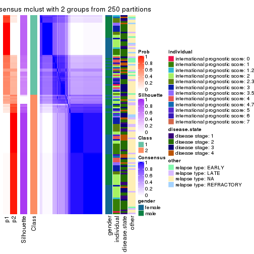</p>

</div>
<div id='tab-CV-mclust-consensus-heatmap-2'>
<pre><code class="r">consensus_heatmap(res, k = 3)
</code></pre>

<p>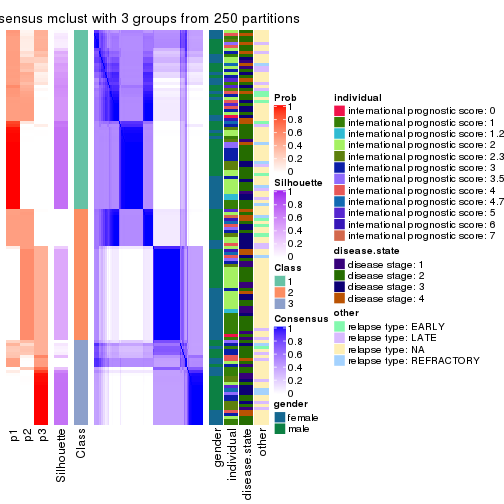</p>

</div>
<div id='tab-CV-mclust-consensus-heatmap-3'>
<pre><code class="r">consensus_heatmap(res, k = 4)
</code></pre>

<p>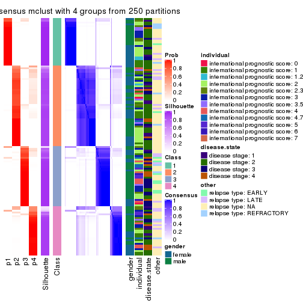</p>

</div>
<div id='tab-CV-mclust-consensus-heatmap-4'>
<pre><code class="r">consensus_heatmap(res, k = 5)
</code></pre>

<p>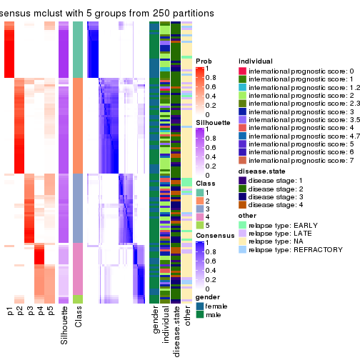</p>

</div>
<div id='tab-CV-mclust-consensus-heatmap-5'>
<pre><code class="r">consensus_heatmap(res, k = 6)
</code></pre>

<p>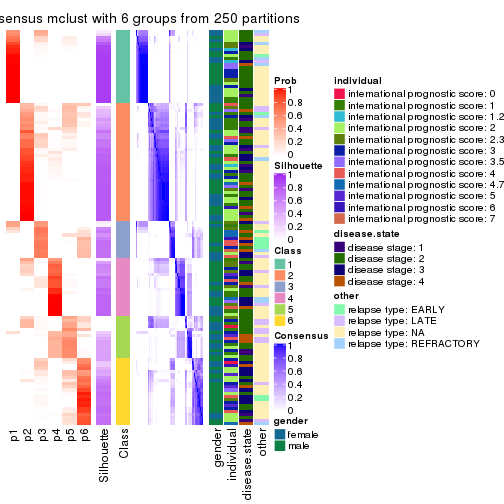</p>

</div>
</div>

Heatmaps for the membership of samples in all partitions to see how consistent they are:


<script>
$( function() {
	$( '#tabs-CV-mclust-membership-heatmap' ).tabs();
} );
</script>
<div id='tabs-CV-mclust-membership-heatmap'>
<ul>
<li><a href='#tab-CV-mclust-membership-heatmap-1'>k = 2</a></li>
<li><a href='#tab-CV-mclust-membership-heatmap-2'>k = 3</a></li>
<li><a href='#tab-CV-mclust-membership-heatmap-3'>k = 4</a></li>
<li><a href='#tab-CV-mclust-membership-heatmap-4'>k = 5</a></li>
<li><a href='#tab-CV-mclust-membership-heatmap-5'>k = 6</a></li>
</ul>
<div id='tab-CV-mclust-membership-heatmap-1'>
<pre><code class="r">membership_heatmap(res, k = 2)
</code></pre>

<p>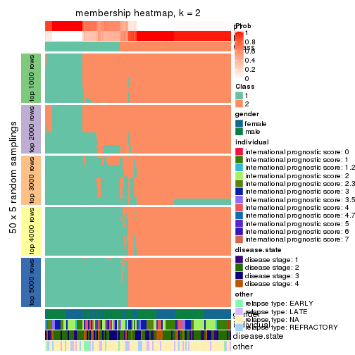</p>

</div>
<div id='tab-CV-mclust-membership-heatmap-2'>
<pre><code class="r">membership_heatmap(res, k = 3)
</code></pre>

<p>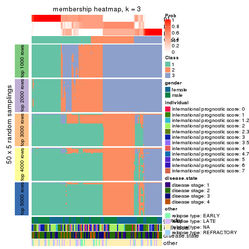</p>

</div>
<div id='tab-CV-mclust-membership-heatmap-3'>
<pre><code class="r">membership_heatmap(res, k = 4)
</code></pre>

<p>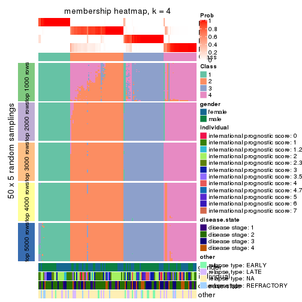</p>

</div>
<div id='tab-CV-mclust-membership-heatmap-4'>
<pre><code class="r">membership_heatmap(res, k = 5)
</code></pre>

<p>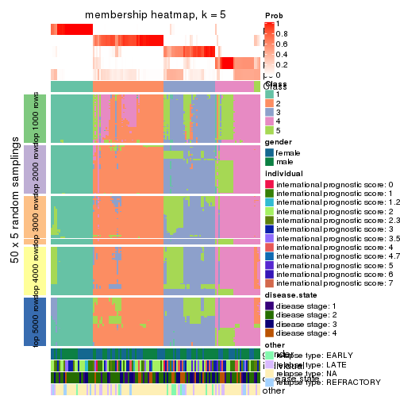</p>

</div>
<div id='tab-CV-mclust-membership-heatmap-5'>
<pre><code class="r">membership_heatmap(res, k = 6)
</code></pre>

<p>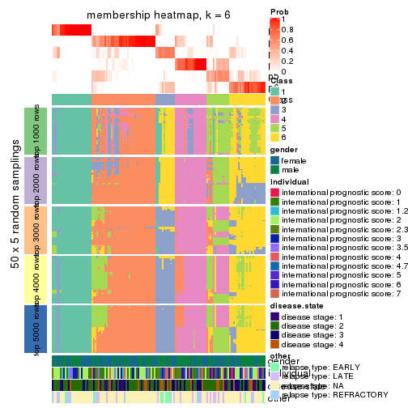</p>

</div>
</div>

As soon as we have had the classes for columns, we can look for signatures
which are significantly different between classes which can be candidate marks
for certain classes. Following are the heatmaps for signatures.


Signature heatmaps where rows are scaled:


<script>
$( function() {
	$( '#tabs-CV-mclust-get-signatures' ).tabs();
} );
</script>
<div id='tabs-CV-mclust-get-signatures'>
<ul>
<li><a href='#tab-CV-mclust-get-signatures-1'>k = 2</a></li>
<li><a href='#tab-CV-mclust-get-signatures-2'>k = 3</a></li>
<li><a href='#tab-CV-mclust-get-signatures-3'>k = 4</a></li>
<li><a href='#tab-CV-mclust-get-signatures-4'>k = 5</a></li>
<li><a href='#tab-CV-mclust-get-signatures-5'>k = 6</a></li>
</ul>
<div id='tab-CV-mclust-get-signatures-1'>
<pre><code class="r">get_signatures(res, k = 2)
</code></pre>

<p>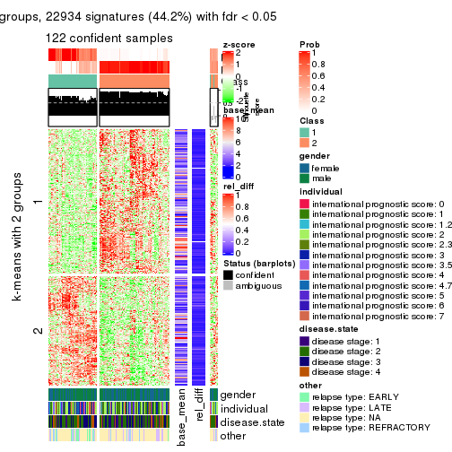</p>

</div>
<div id='tab-CV-mclust-get-signatures-2'>
<pre><code class="r">get_signatures(res, k = 3)
</code></pre>

<p>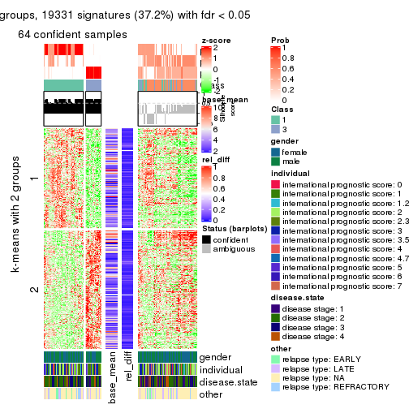</p>

</div>
<div id='tab-CV-mclust-get-signatures-3'>
<pre><code class="r">get_signatures(res, k = 4)
</code></pre>

<p>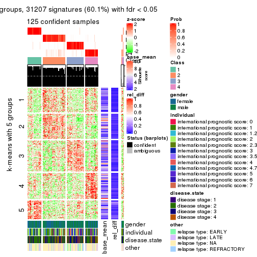</p>

</div>
<div id='tab-CV-mclust-get-signatures-4'>
<pre><code class="r">get_signatures(res, k = 5)
</code></pre>

<p>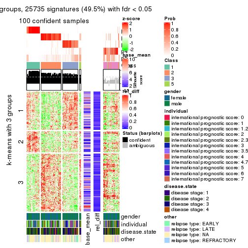</p>

</div>
<div id='tab-CV-mclust-get-signatures-5'>
<pre><code class="r">get_signatures(res, k = 6)
</code></pre>

<pre><code>#&gt; Error: The width or height of the raster image is zero, maybe you forget to turn off the
#&gt; previous graphic device or it was corrupted. Run `dev.off()` to close it.
</code></pre>

<p></p>

</div>
</div>


Signature heatmaps where rows are not scaled:


<script>
$( function() {
	$( '#tabs-CV-mclust-get-signatures-no-scale' ).tabs();
} );
</script>
<div id='tabs-CV-mclust-get-signatures-no-scale'>
<ul>
<li><a href='#tab-CV-mclust-get-signatures-no-scale-1'>k = 2</a></li>
<li><a href='#tab-CV-mclust-get-signatures-no-scale-2'>k = 3</a></li>
<li><a href='#tab-CV-mclust-get-signatures-no-scale-3'>k = 4</a></li>
<li><a href='#tab-CV-mclust-get-signatures-no-scale-4'>k = 5</a></li>
<li><a href='#tab-CV-mclust-get-signatures-no-scale-5'>k = 6</a></li>
</ul>
<div id='tab-CV-mclust-get-signatures-no-scale-1'>
<pre><code class="r">get_signatures(res, k = 2, scale_rows = FALSE)
</code></pre>

<p>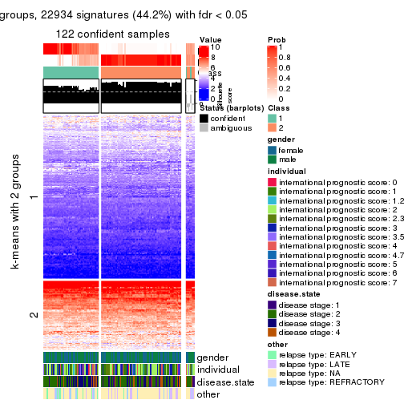</p>

</div>
<div id='tab-CV-mclust-get-signatures-no-scale-2'>
<pre><code class="r">get_signatures(res, k = 3, scale_rows = FALSE)
</code></pre>

<p>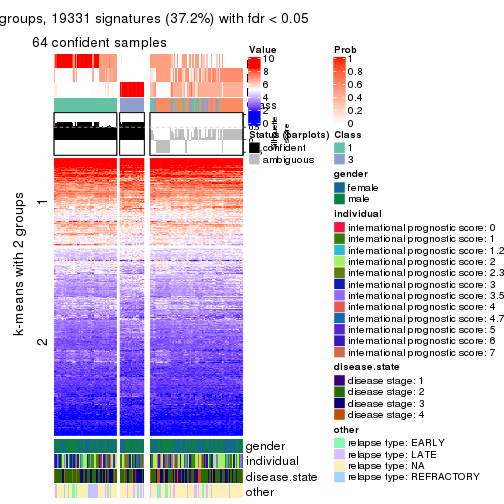</p>

</div>
<div id='tab-CV-mclust-get-signatures-no-scale-3'>
<pre><code class="r">get_signatures(res, k = 4, scale_rows = FALSE)
</code></pre>

<p>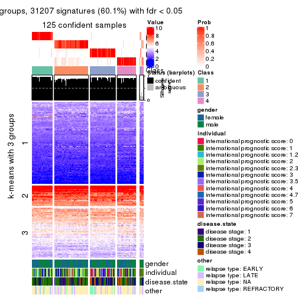</p>

</div>
<div id='tab-CV-mclust-get-signatures-no-scale-4'>
<pre><code class="r">get_signatures(res, k = 5, scale_rows = FALSE)
</code></pre>

<p>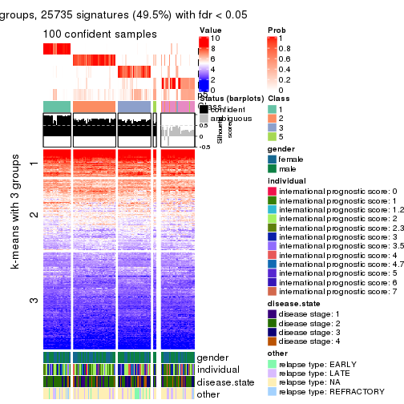</p>

</div>
<div id='tab-CV-mclust-get-signatures-no-scale-5'>
<pre><code class="r">get_signatures(res, k = 6, scale_rows = FALSE)
</code></pre>

<p>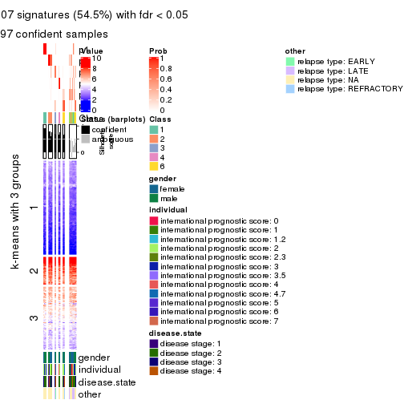</p>

</div>
</div>


Compare the overlap of signatures from different k:

```r
compare_signatures(res)
```

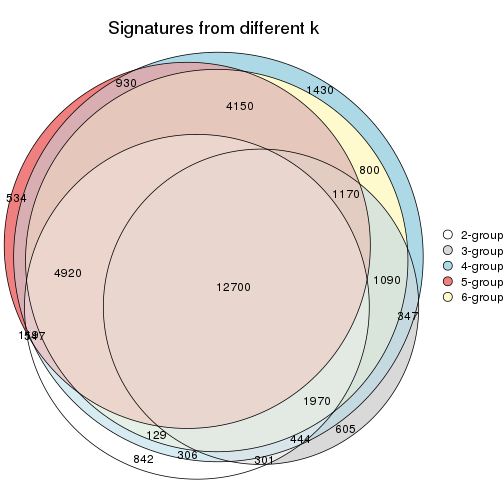

`get_signature()` returns a data frame invisibly. TO get the list of signatures, the function
call should be assigned to a variable explicitly. In following code, if `plot` argument is set
to `FALSE`, no heatmap is plotted while only the differential analysis is performed.

```r
# code only for demonstration
tb = get_signature(res, k = ..., plot = FALSE)
```

An example of the output of `tb` is:

```
#>   which_row         fdr    mean_1    mean_2 scaled_mean_1 scaled_mean_2 km
#> 1        38 0.042760348  8.373488  9.131774    -0.5533452     0.5164555  1
#> 2        40 0.018707592  7.106213  8.469186    -0.6173731     0.5762149  1
#> 3        55 0.019134737 10.221463 11.207825    -0.6159697     0.5749050  1
#> 4        59 0.006059896  5.921854  7.869574    -0.6899429     0.6439467  1
#> 5        60 0.018055526  8.928898 10.211722    -0.6204761     0.5791110  1
#> 6        98 0.009384629 15.714769 14.887706     0.6635654    -0.6193277  2
...
```

The columns in `tb` are:

1. `which_row`: row indices corresponding to the input matrix.
2. `fdr`: FDR for the differential test. 
3. `mean_x`: The mean value in group x.
4. `scaled_mean_x`: The mean value in group x after rows are scaled.
5. `km`: Row groups if k-means clustering is applied to rows.


UMAP plot which shows how samples are separated.


<script>
$( function() {
	$( '#tabs-CV-mclust-dimension-reduction' ).tabs();
} );
</script>
<div id='tabs-CV-mclust-dimension-reduction'>
<ul>
<li><a href='#tab-CV-mclust-dimension-reduction-1'>k = 2</a></li>
<li><a href='#tab-CV-mclust-dimension-reduction-2'>k = 3</a></li>
<li><a href='#tab-CV-mclust-dimension-reduction-3'>k = 4</a></li>
<li><a href='#tab-CV-mclust-dimension-reduction-4'>k = 5</a></li>
<li><a href='#tab-CV-mclust-dimension-reduction-5'>k = 6</a></li>
</ul>
<div id='tab-CV-mclust-dimension-reduction-1'>
<pre><code class="r">dimension_reduction(res, k = 2, method = &quot;UMAP&quot;)
</code></pre>

<p>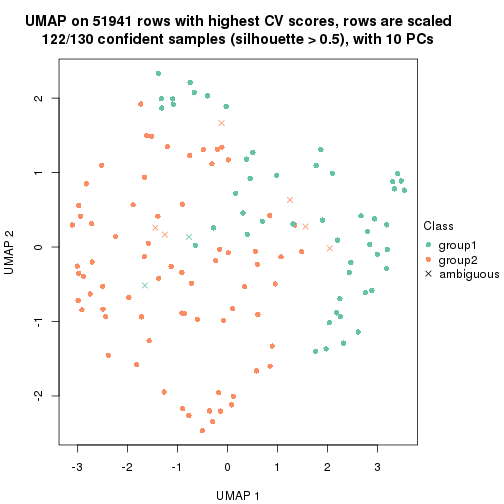</p>

</div>
<div id='tab-CV-mclust-dimension-reduction-2'>
<pre><code class="r">dimension_reduction(res, k = 3, method = &quot;UMAP&quot;)
</code></pre>

<p>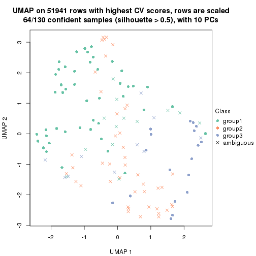</p>

</div>
<div id='tab-CV-mclust-dimension-reduction-3'>
<pre><code class="r">dimension_reduction(res, k = 4, method = &quot;UMAP&quot;)
</code></pre>

<p>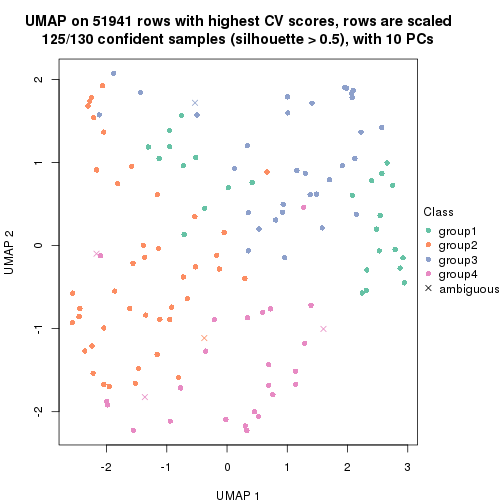</p>

</div>
<div id='tab-CV-mclust-dimension-reduction-4'>
<pre><code class="r">dimension_reduction(res, k = 5, method = &quot;UMAP&quot;)
</code></pre>

<p>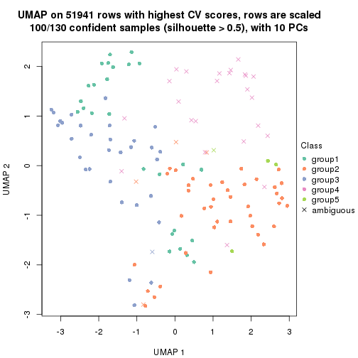</p>

</div>
<div id='tab-CV-mclust-dimension-reduction-5'>
<pre><code class="r">dimension_reduction(res, k = 6, method = &quot;UMAP&quot;)
</code></pre>

<p>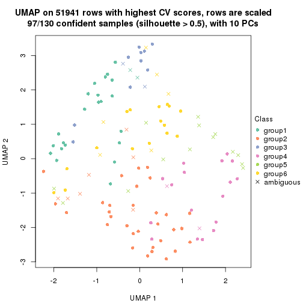</p>

</div>
</div>


Following heatmap shows how subgroups are split when increasing `k`:

```r
collect_classes(res)
```

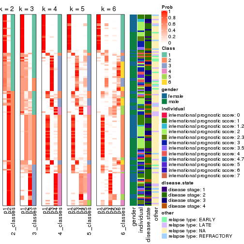


Test correlation between subgroups and known annotations. If the known
annotation is numeric, one-way ANOVA test is applied, and if the known
annotation is discrete, chi-squared contingency table test is applied.

```r
test_to_known_factors(res)
```

```
#>             n gender(p) individual(p) disease.state(p) other(p) k
#> CV:mclust 122     0.329        0.6949           0.0464 0.012246 2
#> CV:mclust  64     0.958        0.8245           0.3751 0.537392 3
#> CV:mclust 125     0.337        0.2470           0.0360 0.049181 4
#> CV:mclust 100     0.057        0.0235           0.0266 0.122307 5
#> CV:mclust  97     0.189        0.0529           0.1177 0.000607 6
```


If matrix rows can be associated to genes, consider to use `GO_Enrichment(res,
...)` to perform function enrichment for the signature genes.


 

---------------------------------------------------


### CV:NMF


The object with results only for a single top-value method and a single partition method 
can be extracted as:

```r
res = res_list["CV", "NMF"]
# you can also extract it by
# res = res_list["CV:NMF"]
```

A summary of `res` and all the functions that can be applied to it:

```r
res
```

```
#> A 'ConsensusPartition' object with k = 2, 3, 4, 5, 6.
#>   On a matrix with 51941 rows and 130 columns.
#>   Top rows (1000, 2000, 3000, 4000, 5000) are extracted by 'CV' method.
#>   Subgroups are detected by 'NMF' method.
#>   Performed in total 1250 partitions by row resampling.
#>   Best k for subgroups seems to be 2.
#> 
#> Following methods can be applied to this 'ConsensusPartition' object:
#>  [1] "cola_report"             "collect_classes"         "collect_plots"          
#>  [4] "collect_stats"           "colnames"                "compare_signatures"     
#>  [7] "consensus_heatmap"       "dimension_reduction"     "functional_enrichment"  
#> [10] "get_anno_col"            "get_anno"                "get_classes"            
#> [13] "get_consensus"           "get_matrix"              "get_membership"         
#> [16] "get_param"               "get_signatures"          "get_stats"              
#> [19] "is_best_k"               "is_stable_k"             "membership_heatmap"     
#> [22] "ncol"                    "nrow"                    "plot_ecdf"              
#> [25] "rownames"                "select_partition_number" "show"                   
#> [28] "suggest_best_k"          "test_to_known_factors"
```

`collect_plots()` function collects all the plots made from `res` for all `k` (number of partitions)
into one single page to provide an easy and fast comparison between different `k`.

```r
collect_plots(res)
```

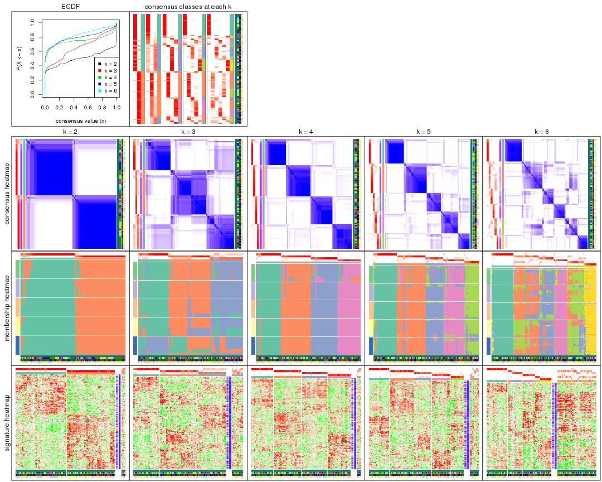

The plots are:

- The first row: a plot of the ECDF (Empirical cumulative distribution
  function) curves of the consensus matrix for each `k` and the heatmap of
  predicted classes for each `k`.
- The second row: heatmaps of the consensus matrix for each `k`.
- The third row: heatmaps of the membership matrix for each `k`.
- The fouth row: heatmaps of the signatures for each `k`.

All the plots in panels can be made by individual functions and they are
plotted later in this section.

`select_partition_number()` produces several plots showing different
statistics for choosing "optimized" `k`. There are following statistics:

- ECDF curves of the consensus matrix for each `k`;
- 1-PAC. [The PAC
  score](https://en.wikipedia.org/wiki/Consensus_clustering#Over-interpretation_potential_of_consensus_clustering)
  measures the proportion of the ambiguous subgrouping.
- Mean silhouette score.
- Concordance. The mean probability of fiting the consensus class ids in all
  partitions.
- Area increased. Denote $A_k$ as the area under the ECDF curve for current
  `k`, the area increased is defined as $A_k - A_{k-1}$.
- Rand index. The percent of pairs of samples that are both in a same cluster
  or both are not in a same cluster in the partition of k and k-1.
- Jaccard index. The ratio of pairs of samples are both in a same cluster in
  the partition of k and k-1 and the pairs of samples are both in a same
  cluster in the partition k or k-1.

The detailed explanations of these statistics can be found in [the cola
vignette](http://bioconductor.org/packages/devel/bioc/vignettes/cola/inst/doc/cola.html#toc_13).

Generally speaking, lower PAC score, higher mean silhouette score or higher
concordance corresponds to better partition. Rand index and Jaccard index
measure how similar the current partition is compared to partition with `k-1`.
If they are too similar, we won't accept `k` is better than `k-1`.

```r
select_partition_number(res)
```

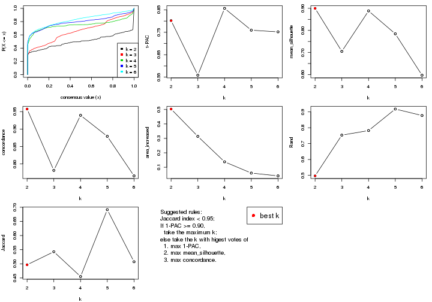

The numeric values for all these statistics can be obtained by `get_stats()`.

```r
get_stats(res)
```

```
#>   k 1-PAC mean_silhouette concordance area_increased  Rand Jaccard
#> 2 2 0.802           0.900       0.957         0.5033 0.497   0.497
#> 3 3 0.559           0.705       0.782         0.3138 0.753   0.543
#> 4 4 0.857           0.888       0.939         0.1375 0.782   0.455
#> 5 5 0.759           0.785       0.879         0.0596 0.918   0.691
#> 6 6 0.752           0.597       0.766         0.0402 0.877   0.507
```

`suggest_best_k()` suggests the best $k$ based on these statistics. The rules are as follows:

- All $k$ with Jaccard index larger than 0.95 are removed because the increase of
  the partition number does not provides enough extra information. If all $k$ are removed,
  the best $k$ is assigned by `NA`.
- For $k$ with 1-PAC larger than 0.9, the maximal $k$ is taken as the "best k". Other $k$ is called "optional k".
- If it does not fit the second rule. The $k$ with the highest vote of highest
  1-PAC, mean silhouette and concordance is taken as the "best k".

```r
suggest_best_k(res)
```

```
#> [1] 2
```


Following shows the table of the partitions (You need to click the **show/hide
code output** link to see it). The membership matrix (columns with name `p*`)
is inferred by
[`clue::cl_consensus()`](https://www.rdocumentation.org/link/cl_consensus?package=clue)
function with the `SE` method. Basically the value in the membership matrix
represents the probability to belong to a certain group. The finall class
label for an item is determined with the group with highest probability it
belongs to.

In `get_classes()` function, the entropy is calculated from the membership
matrix and the silhouette score is calculated from the consensus matrix.


<script>
$( function() {
	$( '#tabs-CV-NMF-get-classes' ).tabs();
} );
</script>
<div id='tabs-CV-NMF-get-classes'>
<ul>
<li><a href='#tab-CV-NMF-get-classes-1'>k = 2</a></li>
<li><a href='#tab-CV-NMF-get-classes-2'>k = 3</a></li>
<li><a href='#tab-CV-NMF-get-classes-3'>k = 4</a></li>
<li><a href='#tab-CV-NMF-get-classes-4'>k = 5</a></li>
<li><a href='#tab-CV-NMF-get-classes-5'>k = 6</a></li>
</ul>

<div id='tab-CV-NMF-get-classes-1'>
<p><a id='tab-CV-NMF-get-classes-1-a' style='color:#0366d6' href='#'>show/hide code output</a></p>
<pre><code class="r">cbind(get_classes(res, k = 2), get_membership(res, k = 2))
</code></pre>

<pre><code>#&gt;           class entropy silhouette    p1    p2
#&gt; GSM447671     2  0.0000     0.9649 0.000 1.000
#&gt; GSM447694     1  0.0000     0.9433 1.000 0.000
#&gt; GSM447618     2  0.0000     0.9649 0.000 1.000
#&gt; GSM447691     2  0.0000     0.9649 0.000 1.000
#&gt; GSM447733     2  0.0000     0.9649 0.000 1.000
#&gt; GSM447620     2  0.0000     0.9649 0.000 1.000
#&gt; GSM447627     1  0.0000     0.9433 1.000 0.000
#&gt; GSM447630     1  1.0000     0.0846 0.504 0.496
#&gt; GSM447642     1  0.0000     0.9433 1.000 0.000
#&gt; GSM447649     2  0.0000     0.9649 0.000 1.000
#&gt; GSM447654     2  0.0000     0.9649 0.000 1.000
#&gt; GSM447655     2  0.0000     0.9649 0.000 1.000
#&gt; GSM447669     2  0.0000     0.9649 0.000 1.000
#&gt; GSM447676     1  0.0000     0.9433 1.000 0.000
#&gt; GSM447678     2  0.0000     0.9649 0.000 1.000
#&gt; GSM447681     2  0.0000     0.9649 0.000 1.000
#&gt; GSM447698     2  0.0000     0.9649 0.000 1.000
#&gt; GSM447713     1  0.0000     0.9433 1.000 0.000
#&gt; GSM447722     2  0.0000     0.9649 0.000 1.000
#&gt; GSM447726     1  0.6623     0.7766 0.828 0.172
#&gt; GSM447735     1  0.6973     0.7722 0.812 0.188
#&gt; GSM447737     1  0.0000     0.9433 1.000 0.000
#&gt; GSM447657     2  0.0000     0.9649 0.000 1.000
#&gt; GSM447674     2  0.0000     0.9649 0.000 1.000
#&gt; GSM447636     1  0.0000     0.9433 1.000 0.000
#&gt; GSM447723     1  0.0000     0.9433 1.000 0.000
#&gt; GSM447699     1  0.9248     0.5247 0.660 0.340
#&gt; GSM447708     2  0.0000     0.9649 0.000 1.000
#&gt; GSM447721     1  0.0000     0.9433 1.000 0.000
#&gt; GSM447623     1  0.0000     0.9433 1.000 0.000
#&gt; GSM447621     1  0.0000     0.9433 1.000 0.000
#&gt; GSM447650     2  0.0000     0.9649 0.000 1.000
#&gt; GSM447651     2  0.0000     0.9649 0.000 1.000
#&gt; GSM447653     1  0.9044     0.5259 0.680 0.320
#&gt; GSM447658     1  0.0000     0.9433 1.000 0.000
#&gt; GSM447675     2  0.0000     0.9649 0.000 1.000
#&gt; GSM447680     2  0.7602     0.7131 0.220 0.780
#&gt; GSM447686     1  0.8327     0.6345 0.736 0.264
#&gt; GSM447736     1  0.2043     0.9214 0.968 0.032
#&gt; GSM447629     2  0.2236     0.9343 0.036 0.964
#&gt; GSM447648     1  0.0000     0.9433 1.000 0.000
#&gt; GSM447660     1  0.0000     0.9433 1.000 0.000
#&gt; GSM447661     2  0.0000     0.9649 0.000 1.000
#&gt; GSM447663     1  0.4161     0.8792 0.916 0.084
#&gt; GSM447704     2  0.0000     0.9649 0.000 1.000
#&gt; GSM447720     1  0.1414     0.9303 0.980 0.020
#&gt; GSM447652     2  0.0000     0.9649 0.000 1.000
#&gt; GSM447679     2  0.0000     0.9649 0.000 1.000
#&gt; GSM447712     1  0.0000     0.9433 1.000 0.000
#&gt; GSM447664     2  0.4690     0.8704 0.100 0.900
#&gt; GSM447637     1  0.0000     0.9433 1.000 0.000
#&gt; GSM447639     2  0.1414     0.9481 0.020 0.980
#&gt; GSM447615     1  0.0000     0.9433 1.000 0.000
#&gt; GSM447656     2  0.9358     0.4666 0.352 0.648
#&gt; GSM447673     2  0.0000     0.9649 0.000 1.000
#&gt; GSM447719     1  0.0000     0.9433 1.000 0.000
#&gt; GSM447706     1  0.0000     0.9433 1.000 0.000
#&gt; GSM447612     1  0.9732     0.3757 0.596 0.404
#&gt; GSM447665     2  0.0000     0.9649 0.000 1.000
#&gt; GSM447677     2  0.0000     0.9649 0.000 1.000
#&gt; GSM447613     1  0.0000     0.9433 1.000 0.000
#&gt; GSM447659     2  0.0672     0.9585 0.008 0.992
#&gt; GSM447662     1  0.6973     0.7723 0.812 0.188
#&gt; GSM447666     1  0.0000     0.9433 1.000 0.000
#&gt; GSM447668     2  0.0000     0.9649 0.000 1.000
#&gt; GSM447682     2  0.0000     0.9649 0.000 1.000
#&gt; GSM447683     2  0.0000     0.9649 0.000 1.000
#&gt; GSM447688     2  0.0000     0.9649 0.000 1.000
#&gt; GSM447702     2  0.0000     0.9649 0.000 1.000
#&gt; GSM447709     2  0.0000     0.9649 0.000 1.000
#&gt; GSM447711     1  0.0000     0.9433 1.000 0.000
#&gt; GSM447715     1  0.0000     0.9433 1.000 0.000
#&gt; GSM447693     1  0.0000     0.9433 1.000 0.000
#&gt; GSM447611     2  0.5294     0.8474 0.120 0.880
#&gt; GSM447672     2  0.0000     0.9649 0.000 1.000
#&gt; GSM447703     2  0.0000     0.9649 0.000 1.000
#&gt; GSM447727     1  0.0000     0.9433 1.000 0.000
#&gt; GSM447638     1  0.0000     0.9433 1.000 0.000
#&gt; GSM447670     1  0.0000     0.9433 1.000 0.000
#&gt; GSM447700     2  0.0000     0.9649 0.000 1.000
#&gt; GSM447738     2  0.0000     0.9649 0.000 1.000
#&gt; GSM447739     1  0.0000     0.9433 1.000 0.000
#&gt; GSM447617     1  0.0000     0.9433 1.000 0.000
#&gt; GSM447628     2  0.0000     0.9649 0.000 1.000
#&gt; GSM447632     2  0.0000     0.9649 0.000 1.000
#&gt; GSM447619     1  0.2948     0.9063 0.948 0.052
#&gt; GSM447643     1  0.0000     0.9433 1.000 0.000
#&gt; GSM447724     2  0.0000     0.9649 0.000 1.000
#&gt; GSM447728     2  0.0000     0.9649 0.000 1.000
#&gt; GSM447610     1  0.0000     0.9433 1.000 0.000
#&gt; GSM447633     2  0.0376     0.9618 0.004 0.996
#&gt; GSM447634     1  0.0000     0.9433 1.000 0.000
#&gt; GSM447622     1  0.0000     0.9433 1.000 0.000
#&gt; GSM447667     2  0.9000     0.5433 0.316 0.684
#&gt; GSM447687     2  0.0000     0.9649 0.000 1.000
#&gt; GSM447695     1  0.0000     0.9433 1.000 0.000
#&gt; GSM447696     1  0.0000     0.9433 1.000 0.000
#&gt; GSM447697     1  0.0000     0.9433 1.000 0.000
#&gt; GSM447714     1  0.7139     0.7626 0.804 0.196
#&gt; GSM447717     1  0.0000     0.9433 1.000 0.000
#&gt; GSM447725     1  0.0000     0.9433 1.000 0.000
#&gt; GSM447729     2  0.0000     0.9649 0.000 1.000
#&gt; GSM447644     2  0.9580     0.3376 0.380 0.620
#&gt; GSM447710     1  0.0000     0.9433 1.000 0.000
#&gt; GSM447614     1  0.0000     0.9433 1.000 0.000
#&gt; GSM447685     2  0.0000     0.9649 0.000 1.000
#&gt; GSM447690     1  0.0000     0.9433 1.000 0.000
#&gt; GSM447730     2  0.0000     0.9649 0.000 1.000
#&gt; GSM447646     2  0.0000     0.9649 0.000 1.000
#&gt; GSM447689     1  0.0000     0.9433 1.000 0.000
#&gt; GSM447635     2  0.5842     0.8228 0.140 0.860
#&gt; GSM447641     1  0.0000     0.9433 1.000 0.000
#&gt; GSM447716     2  0.0000     0.9649 0.000 1.000
#&gt; GSM447718     1  0.9833     0.3165 0.576 0.424
#&gt; GSM447616     1  0.0000     0.9433 1.000 0.000
#&gt; GSM447626     1  0.0000     0.9433 1.000 0.000
#&gt; GSM447640     2  0.0000     0.9649 0.000 1.000
#&gt; GSM447734     1  0.7139     0.7623 0.804 0.196
#&gt; GSM447692     1  0.0000     0.9433 1.000 0.000
#&gt; GSM447647     2  0.0000     0.9649 0.000 1.000
#&gt; GSM447624     1  0.0000     0.9433 1.000 0.000
#&gt; GSM447625     1  0.6343     0.8041 0.840 0.160
#&gt; GSM447707     2  0.0000     0.9649 0.000 1.000
#&gt; GSM447732     1  0.0000     0.9433 1.000 0.000
#&gt; GSM447684     1  0.0000     0.9433 1.000 0.000
#&gt; GSM447731     2  0.0000     0.9649 0.000 1.000
#&gt; GSM447705     2  0.9000     0.5040 0.316 0.684
#&gt; GSM447631     1  0.0000     0.9433 1.000 0.000
#&gt; GSM447701     2  0.0000     0.9649 0.000 1.000
#&gt; GSM447645     1  0.0000     0.9433 1.000 0.000
</code></pre>

<script>
$('#tab-CV-NMF-get-classes-1-a').parent().next().next().hide();
$('#tab-CV-NMF-get-classes-1-a').click(function(){
  $('#tab-CV-NMF-get-classes-1-a').parent().next().next().toggle();
  return(false);
});
</script>
</div>

<div id='tab-CV-NMF-get-classes-2'>
<p><a id='tab-CV-NMF-get-classes-2-a' style='color:#0366d6' href='#'>show/hide code output</a></p>
<pre><code class="r">cbind(get_classes(res, k = 3), get_membership(res, k = 3))
</code></pre>

<pre><code>#&gt;           class entropy silhouette    p1    p2    p3
#&gt; GSM447671     3  0.5591     0.6016 0.000 0.304 0.696
#&gt; GSM447694     3  0.5254     0.7743 0.264 0.000 0.736
#&gt; GSM447618     2  0.4002     0.6672 0.000 0.840 0.160
#&gt; GSM447691     2  0.6095     0.1475 0.000 0.608 0.392
#&gt; GSM447733     2  0.5650     0.7537 0.000 0.688 0.312
#&gt; GSM447620     3  0.5216     0.6483 0.000 0.260 0.740
#&gt; GSM447627     3  0.6302     0.4503 0.480 0.000 0.520
#&gt; GSM447630     3  0.6274     0.3290 0.000 0.456 0.544
#&gt; GSM447642     1  0.0000     0.8519 1.000 0.000 0.000
#&gt; GSM447649     2  0.1529     0.8177 0.000 0.960 0.040
#&gt; GSM447654     2  0.5541     0.7868 0.008 0.740 0.252
#&gt; GSM447655     2  0.0592     0.8102 0.000 0.988 0.012
#&gt; GSM447669     3  0.6225     0.3846 0.000 0.432 0.568
#&gt; GSM447676     1  0.0000     0.8519 1.000 0.000 0.000
#&gt; GSM447678     2  0.5138     0.7902 0.000 0.748 0.252
#&gt; GSM447681     2  0.0592     0.8102 0.000 0.988 0.012
#&gt; GSM447698     2  0.4178     0.8065 0.000 0.828 0.172
#&gt; GSM447713     1  0.0000     0.8519 1.000 0.000 0.000
#&gt; GSM447722     2  0.5138     0.7902 0.000 0.748 0.252
#&gt; GSM447726     3  0.8937     0.5498 0.184 0.252 0.564
#&gt; GSM447735     1  0.9412     0.2683 0.508 0.244 0.248
#&gt; GSM447737     1  0.0000     0.8519 1.000 0.000 0.000
#&gt; GSM447657     2  0.2066     0.8176 0.000 0.940 0.060
#&gt; GSM447674     2  0.0000     0.8133 0.000 1.000 0.000
#&gt; GSM447636     1  0.2537     0.8059 0.920 0.000 0.080
#&gt; GSM447723     1  0.0237     0.8492 0.996 0.000 0.004
#&gt; GSM447699     3  0.7565     0.7447 0.256 0.084 0.660
#&gt; GSM447708     2  0.1031     0.8041 0.000 0.976 0.024
#&gt; GSM447721     1  0.0000     0.8519 1.000 0.000 0.000
#&gt; GSM447623     1  0.0000     0.8519 1.000 0.000 0.000
#&gt; GSM447621     1  0.0747     0.8400 0.984 0.000 0.016
#&gt; GSM447650     2  0.0592     0.8102 0.000 0.988 0.012
#&gt; GSM447651     2  0.3752     0.7072 0.000 0.856 0.144
#&gt; GSM447653     1  0.5843     0.6480 0.732 0.016 0.252
#&gt; GSM447658     1  0.0000     0.8519 1.000 0.000 0.000
#&gt; GSM447675     2  0.5698     0.7847 0.012 0.736 0.252
#&gt; GSM447680     2  0.5919     0.5196 0.276 0.712 0.012
#&gt; GSM447686     1  0.2031     0.8289 0.952 0.016 0.032
#&gt; GSM447736     3  0.5254     0.7743 0.264 0.000 0.736
#&gt; GSM447629     2  0.1964     0.7909 0.056 0.944 0.000
#&gt; GSM447648     3  0.6192     0.5950 0.420 0.000 0.580
#&gt; GSM447660     1  0.0000     0.8519 1.000 0.000 0.000
#&gt; GSM447661     2  0.0592     0.8102 0.000 0.988 0.012
#&gt; GSM447663     3  0.6438     0.7647 0.188 0.064 0.748
#&gt; GSM447704     2  0.0892     0.8164 0.000 0.980 0.020
#&gt; GSM447720     3  0.6541     0.7448 0.304 0.024 0.672
#&gt; GSM447652     2  0.1289     0.8175 0.000 0.968 0.032
#&gt; GSM447679     2  0.0592     0.8102 0.000 0.988 0.012
#&gt; GSM447712     1  0.0000     0.8519 1.000 0.000 0.000
#&gt; GSM447664     2  0.8977     0.5784 0.188 0.560 0.252
#&gt; GSM447637     3  0.5363     0.7676 0.276 0.000 0.724
#&gt; GSM447639     2  0.5843     0.7829 0.016 0.732 0.252
#&gt; GSM447615     1  0.4121     0.6235 0.832 0.000 0.168
#&gt; GSM447656     2  0.6180     0.4050 0.332 0.660 0.008
#&gt; GSM447673     2  0.5138     0.7902 0.000 0.748 0.252
#&gt; GSM447719     1  0.5692     0.6500 0.724 0.008 0.268
#&gt; GSM447706     3  0.5254     0.7743 0.264 0.000 0.736
#&gt; GSM447612     3  0.6721     0.7435 0.136 0.116 0.748
#&gt; GSM447665     2  0.6260    -0.0594 0.000 0.552 0.448
#&gt; GSM447677     2  0.1643     0.7910 0.000 0.956 0.044
#&gt; GSM447613     1  0.0000     0.8519 1.000 0.000 0.000
#&gt; GSM447659     3  0.3845     0.4637 0.012 0.116 0.872
#&gt; GSM447662     3  0.5939     0.7745 0.224 0.028 0.748
#&gt; GSM447666     3  0.5860     0.6807 0.024 0.228 0.748
#&gt; GSM447668     2  0.1031     0.8041 0.000 0.976 0.024
#&gt; GSM447682     2  0.3192     0.8141 0.000 0.888 0.112
#&gt; GSM447683     2  0.0592     0.8102 0.000 0.988 0.012
#&gt; GSM447688     2  0.5098     0.7918 0.000 0.752 0.248
#&gt; GSM447702     2  0.0592     0.8102 0.000 0.988 0.012
#&gt; GSM447709     3  0.5291     0.6408 0.000 0.268 0.732
#&gt; GSM447711     1  0.0000     0.8519 1.000 0.000 0.000
#&gt; GSM447715     1  0.0892     0.8366 0.980 0.000 0.020
#&gt; GSM447693     3  0.5254     0.7743 0.264 0.000 0.736
#&gt; GSM447611     1  0.9513     0.2218 0.492 0.256 0.252
#&gt; GSM447672     2  0.0592     0.8102 0.000 0.988 0.012
#&gt; GSM447703     2  0.5098     0.7918 0.000 0.752 0.248
#&gt; GSM447727     1  0.1289     0.8245 0.968 0.000 0.032
#&gt; GSM447638     1  0.3530     0.7718 0.900 0.032 0.068
#&gt; GSM447670     3  0.6274     0.5442 0.456 0.000 0.544
#&gt; GSM447700     2  0.6062     0.1709 0.000 0.616 0.384
#&gt; GSM447738     2  0.5098     0.7918 0.000 0.752 0.248
#&gt; GSM447739     1  0.0000     0.8519 1.000 0.000 0.000
#&gt; GSM447617     1  0.0237     0.8492 0.996 0.000 0.004
#&gt; GSM447628     2  0.5138     0.7902 0.000 0.748 0.252
#&gt; GSM447632     2  0.5098     0.7918 0.000 0.752 0.248
#&gt; GSM447619     3  0.5178     0.7763 0.256 0.000 0.744
#&gt; GSM447643     1  0.0000     0.8519 1.000 0.000 0.000
#&gt; GSM447724     3  0.6244    -0.4052 0.000 0.440 0.560
#&gt; GSM447728     2  0.0592     0.8102 0.000 0.988 0.012
#&gt; GSM447610     1  0.5541     0.6546 0.740 0.008 0.252
#&gt; GSM447633     3  0.5138     0.6554 0.000 0.252 0.748
#&gt; GSM447634     3  0.6286     0.5314 0.464 0.000 0.536
#&gt; GSM447622     3  0.5327     0.7700 0.272 0.000 0.728
#&gt; GSM447667     1  0.9638    -0.0559 0.420 0.372 0.208
#&gt; GSM447687     2  0.5098     0.7918 0.000 0.752 0.248
#&gt; GSM447695     3  0.6225     0.5946 0.432 0.000 0.568
#&gt; GSM447696     1  0.0000     0.8519 1.000 0.000 0.000
#&gt; GSM447697     1  0.0000     0.8519 1.000 0.000 0.000
#&gt; GSM447714     3  0.5178     0.7763 0.256 0.000 0.744
#&gt; GSM447717     1  0.0000     0.8519 1.000 0.000 0.000
#&gt; GSM447725     1  0.3686     0.7574 0.860 0.000 0.140
#&gt; GSM447729     2  0.5541     0.7868 0.008 0.740 0.252
#&gt; GSM447644     3  0.5138     0.6554 0.000 0.252 0.748
#&gt; GSM447710     3  0.5254     0.7743 0.264 0.000 0.736
#&gt; GSM447614     1  0.5541     0.6583 0.740 0.008 0.252
#&gt; GSM447685     2  0.0237     0.8143 0.000 0.996 0.004
#&gt; GSM447690     1  0.2356     0.8115 0.928 0.000 0.072
#&gt; GSM447730     2  0.0237     0.8143 0.000 0.996 0.004
#&gt; GSM447646     2  0.5138     0.7902 0.000 0.748 0.252
#&gt; GSM447689     3  0.5774     0.7757 0.232 0.020 0.748
#&gt; GSM447635     2  0.6572     0.6948 0.172 0.748 0.080
#&gt; GSM447641     1  0.0000     0.8519 1.000 0.000 0.000
#&gt; GSM447716     2  0.5138     0.7902 0.000 0.748 0.252
#&gt; GSM447718     3  0.8779     0.6750 0.260 0.164 0.576
#&gt; GSM447616     3  0.5591     0.7477 0.304 0.000 0.696
#&gt; GSM447626     3  0.5216     0.7755 0.260 0.000 0.740
#&gt; GSM447640     2  0.0000     0.8133 0.000 1.000 0.000
#&gt; GSM447734     3  0.5178     0.7763 0.256 0.000 0.744
#&gt; GSM447692     1  0.2878     0.7459 0.904 0.000 0.096
#&gt; GSM447647     2  0.5138     0.7902 0.000 0.748 0.252
#&gt; GSM447624     1  0.5968     0.0061 0.636 0.000 0.364
#&gt; GSM447625     3  0.5178     0.7763 0.256 0.000 0.744
#&gt; GSM447707     2  0.0237     0.8123 0.000 0.996 0.004
#&gt; GSM447732     3  0.5254     0.7743 0.264 0.000 0.736
#&gt; GSM447684     3  0.5529     0.7578 0.296 0.000 0.704
#&gt; GSM447731     2  0.5178     0.7889 0.000 0.744 0.256
#&gt; GSM447705     3  0.5138     0.6554 0.000 0.252 0.748
#&gt; GSM447631     3  0.6299     0.4805 0.476 0.000 0.524
#&gt; GSM447701     2  0.5016     0.5398 0.000 0.760 0.240
#&gt; GSM447645     3  0.5678     0.7358 0.316 0.000 0.684
</code></pre>

<script>
$('#tab-CV-NMF-get-classes-2-a').parent().next().next().hide();
$('#tab-CV-NMF-get-classes-2-a').click(function(){
  $('#tab-CV-NMF-get-classes-2-a').parent().next().next().toggle();
  return(false);
});
</script>
</div>

<div id='tab-CV-NMF-get-classes-3'>
<p><a id='tab-CV-NMF-get-classes-3-a' style='color:#0366d6' href='#'>show/hide code output</a></p>
<pre><code class="r">cbind(get_classes(res, k = 4), get_membership(res, k = 4))
</code></pre>

<pre><code>#&gt;           class entropy silhouette    p1    p2    p3    p4
#&gt; GSM447671     3  0.5499      0.678 0.000 0.216 0.712 0.072
#&gt; GSM447694     3  0.1474      0.923 0.000 0.000 0.948 0.052
#&gt; GSM447618     2  0.4730      0.481 0.000 0.636 0.000 0.364
#&gt; GSM447691     2  0.0469      0.938 0.000 0.988 0.000 0.012
#&gt; GSM447733     4  0.0188      0.934 0.000 0.004 0.000 0.996
#&gt; GSM447620     2  0.4925      0.339 0.000 0.572 0.428 0.000
#&gt; GSM447627     3  0.1792      0.916 0.000 0.000 0.932 0.068
#&gt; GSM447630     2  0.0592      0.937 0.000 0.984 0.016 0.000
#&gt; GSM447642     1  0.0000      0.938 1.000 0.000 0.000 0.000
#&gt; GSM447649     2  0.0000      0.941 0.000 1.000 0.000 0.000
#&gt; GSM447654     4  0.2101      0.936 0.012 0.060 0.000 0.928
#&gt; GSM447655     2  0.0000      0.941 0.000 1.000 0.000 0.000
#&gt; GSM447669     2  0.0376      0.940 0.000 0.992 0.004 0.004
#&gt; GSM447676     1  0.0000      0.938 1.000 0.000 0.000 0.000
#&gt; GSM447678     4  0.0592      0.938 0.000 0.016 0.000 0.984
#&gt; GSM447681     2  0.0000      0.941 0.000 1.000 0.000 0.000
#&gt; GSM447698     4  0.1022      0.941 0.000 0.032 0.000 0.968
#&gt; GSM447713     1  0.0000      0.938 1.000 0.000 0.000 0.000
#&gt; GSM447722     4  0.0469      0.937 0.000 0.012 0.000 0.988
#&gt; GSM447726     2  0.1489      0.919 0.004 0.952 0.044 0.000
#&gt; GSM447735     4  0.0000      0.932 0.000 0.000 0.000 1.000
#&gt; GSM447737     1  0.3143      0.834 0.876 0.000 0.100 0.024
#&gt; GSM447657     2  0.0336      0.939 0.000 0.992 0.000 0.008
#&gt; GSM447674     2  0.0000      0.941 0.000 1.000 0.000 0.000
#&gt; GSM447636     1  0.0000      0.938 1.000 0.000 0.000 0.000
#&gt; GSM447723     1  0.0000      0.938 1.000 0.000 0.000 0.000
#&gt; GSM447699     3  0.3610      0.801 0.000 0.000 0.800 0.200
#&gt; GSM447708     2  0.1389      0.916 0.000 0.952 0.000 0.048
#&gt; GSM447721     1  0.0000      0.938 1.000 0.000 0.000 0.000
#&gt; GSM447623     1  0.0000      0.938 1.000 0.000 0.000 0.000
#&gt; GSM447621     1  0.0188      0.935 0.996 0.000 0.004 0.000
#&gt; GSM447650     2  0.0000      0.941 0.000 1.000 0.000 0.000
#&gt; GSM447651     2  0.1022      0.927 0.000 0.968 0.032 0.000
#&gt; GSM447653     4  0.2530      0.866 0.112 0.000 0.000 0.888
#&gt; GSM447658     1  0.0000      0.938 1.000 0.000 0.000 0.000
#&gt; GSM447675     4  0.0817      0.940 0.000 0.024 0.000 0.976
#&gt; GSM447680     2  0.1389      0.911 0.048 0.952 0.000 0.000
#&gt; GSM447686     1  0.0000      0.938 1.000 0.000 0.000 0.000
#&gt; GSM447736     3  0.1557      0.921 0.000 0.000 0.944 0.056
#&gt; GSM447629     2  0.3123      0.798 0.156 0.844 0.000 0.000
#&gt; GSM447648     3  0.1022      0.930 0.000 0.000 0.968 0.032
#&gt; GSM447660     1  0.0000      0.938 1.000 0.000 0.000 0.000
#&gt; GSM447661     2  0.0000      0.941 0.000 1.000 0.000 0.000
#&gt; GSM447663     3  0.2868      0.839 0.000 0.136 0.864 0.000
#&gt; GSM447704     2  0.2530      0.855 0.000 0.888 0.000 0.112
#&gt; GSM447720     3  0.4545      0.829 0.028 0.136 0.812 0.024
#&gt; GSM447652     2  0.0188      0.940 0.000 0.996 0.000 0.004
#&gt; GSM447679     2  0.0000      0.941 0.000 1.000 0.000 0.000
#&gt; GSM447712     1  0.0000      0.938 1.000 0.000 0.000 0.000
#&gt; GSM447664     4  0.4079      0.797 0.180 0.020 0.000 0.800
#&gt; GSM447637     3  0.0000      0.938 0.000 0.000 1.000 0.000
#&gt; GSM447639     4  0.0188      0.934 0.000 0.004 0.000 0.996
#&gt; GSM447615     1  0.4222      0.622 0.728 0.000 0.272 0.000
#&gt; GSM447656     2  0.3907      0.695 0.232 0.768 0.000 0.000
#&gt; GSM447673     4  0.1637      0.938 0.000 0.060 0.000 0.940
#&gt; GSM447719     4  0.4590      0.806 0.060 0.000 0.148 0.792
#&gt; GSM447706     3  0.0000      0.938 0.000 0.000 1.000 0.000
#&gt; GSM447612     3  0.0000      0.938 0.000 0.000 1.000 0.000
#&gt; GSM447665     2  0.0188      0.940 0.000 0.996 0.004 0.000
#&gt; GSM447677     2  0.0188      0.940 0.000 0.996 0.004 0.000
#&gt; GSM447613     1  0.0000      0.938 1.000 0.000 0.000 0.000
#&gt; GSM447659     4  0.2921      0.817 0.000 0.000 0.140 0.860
#&gt; GSM447662     3  0.0000      0.938 0.000 0.000 1.000 0.000
#&gt; GSM447666     3  0.0000      0.938 0.000 0.000 1.000 0.000
#&gt; GSM447668     2  0.0000      0.941 0.000 1.000 0.000 0.000
#&gt; GSM447682     2  0.0707      0.933 0.000 0.980 0.000 0.020
#&gt; GSM447683     2  0.0000      0.941 0.000 1.000 0.000 0.000
#&gt; GSM447688     4  0.1118      0.941 0.000 0.036 0.000 0.964
#&gt; GSM447702     2  0.0000      0.941 0.000 1.000 0.000 0.000
#&gt; GSM447709     2  0.1716      0.909 0.000 0.936 0.064 0.000
#&gt; GSM447711     1  0.0000      0.938 1.000 0.000 0.000 0.000
#&gt; GSM447715     1  0.0188      0.935 0.996 0.004 0.000 0.000
#&gt; GSM447693     3  0.0000      0.938 0.000 0.000 1.000 0.000
#&gt; GSM447611     4  0.2142      0.920 0.056 0.016 0.000 0.928
#&gt; GSM447672     2  0.0000      0.941 0.000 1.000 0.000 0.000
#&gt; GSM447703     4  0.1716      0.936 0.000 0.064 0.000 0.936
#&gt; GSM447727     1  0.0000      0.938 1.000 0.000 0.000 0.000
#&gt; GSM447638     1  0.5231      0.379 0.604 0.384 0.012 0.000
#&gt; GSM447670     1  0.2345      0.853 0.900 0.000 0.100 0.000
#&gt; GSM447700     3  0.4746      0.520 0.000 0.000 0.632 0.368
#&gt; GSM447738     4  0.1474      0.940 0.000 0.052 0.000 0.948
#&gt; GSM447739     1  0.0000      0.938 1.000 0.000 0.000 0.000
#&gt; GSM447617     1  0.1389      0.902 0.952 0.000 0.048 0.000
#&gt; GSM447628     4  0.1637      0.938 0.000 0.060 0.000 0.940
#&gt; GSM447632     4  0.1557      0.940 0.000 0.056 0.000 0.944
#&gt; GSM447619     3  0.0000      0.938 0.000 0.000 1.000 0.000
#&gt; GSM447643     1  0.0000      0.938 1.000 0.000 0.000 0.000
#&gt; GSM447724     4  0.0000      0.932 0.000 0.000 0.000 1.000
#&gt; GSM447728     2  0.0336      0.939 0.000 0.992 0.000 0.008
#&gt; GSM447610     4  0.3907      0.727 0.232 0.000 0.000 0.768
#&gt; GSM447633     2  0.4193      0.678 0.000 0.732 0.268 0.000
#&gt; GSM447634     3  0.4281      0.773 0.180 0.000 0.792 0.028
#&gt; GSM447622     3  0.1022      0.930 0.000 0.000 0.968 0.032
#&gt; GSM447667     1  0.4730      0.416 0.636 0.364 0.000 0.000
#&gt; GSM447687     4  0.1716      0.936 0.000 0.064 0.000 0.936
#&gt; GSM447695     3  0.2871      0.902 0.032 0.000 0.896 0.072
#&gt; GSM447696     1  0.0000      0.938 1.000 0.000 0.000 0.000
#&gt; GSM447697     1  0.0000      0.938 1.000 0.000 0.000 0.000
#&gt; GSM447714     3  0.0000      0.938 0.000 0.000 1.000 0.000
#&gt; GSM447717     1  0.0000      0.938 1.000 0.000 0.000 0.000
#&gt; GSM447725     1  0.0000      0.938 1.000 0.000 0.000 0.000
#&gt; GSM447729     4  0.1637      0.938 0.000 0.060 0.000 0.940
#&gt; GSM447644     2  0.1637      0.910 0.000 0.940 0.060 0.000
#&gt; GSM447710     3  0.0000      0.938 0.000 0.000 1.000 0.000
#&gt; GSM447614     4  0.0000      0.932 0.000 0.000 0.000 1.000
#&gt; GSM447685     2  0.0657      0.937 0.012 0.984 0.000 0.004
#&gt; GSM447690     1  0.0000      0.938 1.000 0.000 0.000 0.000
#&gt; GSM447730     2  0.1716      0.902 0.000 0.936 0.000 0.064
#&gt; GSM447646     4  0.1557      0.940 0.000 0.056 0.000 0.944
#&gt; GSM447689     3  0.0000      0.938 0.000 0.000 1.000 0.000
#&gt; GSM447635     4  0.1796      0.920 0.016 0.032 0.004 0.948
#&gt; GSM447641     1  0.0000      0.938 1.000 0.000 0.000 0.000
#&gt; GSM447716     4  0.1209      0.941 0.004 0.032 0.000 0.964
#&gt; GSM447718     3  0.3113      0.864 0.004 0.108 0.876 0.012
#&gt; GSM447616     3  0.1677      0.925 0.012 0.000 0.948 0.040
#&gt; GSM447626     3  0.0000      0.938 0.000 0.000 1.000 0.000
#&gt; GSM447640     2  0.0188      0.940 0.000 0.996 0.000 0.004
#&gt; GSM447734     3  0.0336      0.937 0.000 0.000 0.992 0.008
#&gt; GSM447692     3  0.3323      0.887 0.064 0.000 0.876 0.060
#&gt; GSM447647     4  0.1557      0.940 0.000 0.056 0.000 0.944
#&gt; GSM447624     3  0.2149      0.887 0.088 0.000 0.912 0.000
#&gt; GSM447625     3  0.0188      0.937 0.000 0.000 0.996 0.004
#&gt; GSM447707     2  0.0469      0.938 0.000 0.988 0.000 0.012
#&gt; GSM447732     3  0.0000      0.938 0.000 0.000 1.000 0.000
#&gt; GSM447684     1  0.6097      0.354 0.580 0.364 0.056 0.000
#&gt; GSM447731     4  0.3910      0.831 0.000 0.156 0.024 0.820
#&gt; GSM447705     3  0.0000      0.938 0.000 0.000 1.000 0.000
#&gt; GSM447631     3  0.0000      0.938 0.000 0.000 1.000 0.000
#&gt; GSM447701     2  0.0921      0.930 0.000 0.972 0.028 0.000
#&gt; GSM447645     3  0.0000      0.938 0.000 0.000 1.000 0.000
</code></pre>

<script>
$('#tab-CV-NMF-get-classes-3-a').parent().next().next().hide();
$('#tab-CV-NMF-get-classes-3-a').click(function(){
  $('#tab-CV-NMF-get-classes-3-a').parent().next().next().toggle();
  return(false);
});
</script>
</div>

<div id='tab-CV-NMF-get-classes-4'>
<p><a id='tab-CV-NMF-get-classes-4-a' style='color:#0366d6' href='#'>show/hide code output</a></p>
<pre><code class="r">cbind(get_classes(res, k = 5), get_membership(res, k = 5))
</code></pre>

<pre><code>#&gt;           class entropy silhouette    p1    p2    p3    p4    p5
#&gt; GSM447671     3  0.2362     0.8292 0.000 0.024 0.900 0.000 0.076
#&gt; GSM447694     3  0.2561     0.8412 0.000 0.000 0.856 0.000 0.144
#&gt; GSM447618     3  0.2915     0.6928 0.000 0.024 0.860 0.116 0.000
#&gt; GSM447691     2  0.4278     0.2964 0.000 0.548 0.452 0.000 0.000
#&gt; GSM447733     4  0.0955     0.8374 0.000 0.000 0.028 0.968 0.004
#&gt; GSM447620     5  0.2074     0.7684 0.000 0.104 0.000 0.000 0.896
#&gt; GSM447627     3  0.3236     0.8375 0.000 0.000 0.828 0.020 0.152
#&gt; GSM447630     2  0.4798     0.0531 0.000 0.540 0.440 0.000 0.020
#&gt; GSM447642     1  0.0000     0.9325 1.000 0.000 0.000 0.000 0.000
#&gt; GSM447649     2  0.3402     0.7755 0.000 0.804 0.004 0.184 0.008
#&gt; GSM447654     4  0.0290     0.8296 0.000 0.000 0.000 0.992 0.008
#&gt; GSM447655     2  0.0162     0.8780 0.000 0.996 0.004 0.000 0.000
#&gt; GSM447669     2  0.4632     0.0519 0.000 0.540 0.448 0.000 0.012
#&gt; GSM447676     1  0.0963     0.9049 0.964 0.000 0.000 0.000 0.036
#&gt; GSM447678     4  0.3395     0.8024 0.000 0.000 0.236 0.764 0.000
#&gt; GSM447681     2  0.2377     0.8244 0.000 0.872 0.128 0.000 0.000
#&gt; GSM447698     4  0.5086     0.5410 0.000 0.040 0.396 0.564 0.000
#&gt; GSM447713     1  0.0000     0.9325 1.000 0.000 0.000 0.000 0.000
#&gt; GSM447722     3  0.2280     0.6858 0.000 0.000 0.880 0.120 0.000
#&gt; GSM447726     2  0.0000     0.8783 0.000 1.000 0.000 0.000 0.000
#&gt; GSM447735     3  0.0609     0.7821 0.000 0.000 0.980 0.020 0.000
#&gt; GSM447737     3  0.3003     0.7005 0.188 0.000 0.812 0.000 0.000
#&gt; GSM447657     2  0.2707     0.8150 0.000 0.860 0.132 0.008 0.000
#&gt; GSM447674     2  0.1478     0.8609 0.000 0.936 0.064 0.000 0.000
#&gt; GSM447636     1  0.0162     0.9299 0.996 0.000 0.000 0.000 0.004
#&gt; GSM447723     1  0.0000     0.9325 1.000 0.000 0.000 0.000 0.000
#&gt; GSM447699     3  0.2179     0.8409 0.000 0.000 0.896 0.004 0.100
#&gt; GSM447708     2  0.1671     0.8600 0.000 0.924 0.076 0.000 0.000
#&gt; GSM447721     1  0.0000     0.9325 1.000 0.000 0.000 0.000 0.000
#&gt; GSM447623     1  0.0000     0.9325 1.000 0.000 0.000 0.000 0.000
#&gt; GSM447621     1  0.3003     0.7286 0.812 0.000 0.188 0.000 0.000
#&gt; GSM447650     2  0.0000     0.8783 0.000 1.000 0.000 0.000 0.000
#&gt; GSM447651     2  0.0865     0.8720 0.000 0.972 0.004 0.000 0.024
#&gt; GSM447653     4  0.2462     0.7736 0.112 0.000 0.000 0.880 0.008
#&gt; GSM447658     1  0.0000     0.9325 1.000 0.000 0.000 0.000 0.000
#&gt; GSM447675     4  0.2605     0.8426 0.000 0.000 0.148 0.852 0.000
#&gt; GSM447680     2  0.0000     0.8783 0.000 1.000 0.000 0.000 0.000
#&gt; GSM447686     1  0.0000     0.9325 1.000 0.000 0.000 0.000 0.000
#&gt; GSM447736     3  0.2516     0.8422 0.000 0.000 0.860 0.000 0.140
#&gt; GSM447629     2  0.3340     0.7976 0.016 0.824 0.156 0.004 0.000
#&gt; GSM447648     5  0.0703     0.8552 0.000 0.000 0.024 0.000 0.976
#&gt; GSM447660     1  0.0000     0.9325 1.000 0.000 0.000 0.000 0.000
#&gt; GSM447661     2  0.0000     0.8783 0.000 1.000 0.000 0.000 0.000
#&gt; GSM447663     3  0.5490     0.6831 0.000 0.200 0.652 0.000 0.148
#&gt; GSM447704     2  0.3476     0.7628 0.000 0.804 0.020 0.176 0.000
#&gt; GSM447720     3  0.4840     0.7544 0.000 0.152 0.724 0.000 0.124
#&gt; GSM447652     2  0.1270     0.8645 0.000 0.948 0.000 0.052 0.000
#&gt; GSM447679     2  0.0000     0.8783 0.000 1.000 0.000 0.000 0.000
#&gt; GSM447712     1  0.0000     0.9325 1.000 0.000 0.000 0.000 0.000
#&gt; GSM447664     4  0.3039     0.7043 0.192 0.000 0.000 0.808 0.000
#&gt; GSM447637     5  0.0703     0.8551 0.000 0.000 0.024 0.000 0.976
#&gt; GSM447639     4  0.3534     0.7430 0.000 0.000 0.256 0.744 0.000
#&gt; GSM447615     5  0.3723     0.7017 0.152 0.000 0.000 0.044 0.804
#&gt; GSM447656     2  0.3398     0.6975 0.216 0.780 0.004 0.000 0.000
#&gt; GSM447673     4  0.2763     0.8413 0.000 0.004 0.148 0.848 0.000
#&gt; GSM447719     4  0.4430     0.1071 0.004 0.000 0.000 0.540 0.456
#&gt; GSM447706     5  0.0609     0.8561 0.000 0.000 0.020 0.000 0.980
#&gt; GSM447612     3  0.3983     0.6446 0.000 0.000 0.660 0.000 0.340
#&gt; GSM447665     2  0.0000     0.8783 0.000 1.000 0.000 0.000 0.000
#&gt; GSM447677     2  0.0000     0.8783 0.000 1.000 0.000 0.000 0.000
#&gt; GSM447613     1  0.0000     0.9325 1.000 0.000 0.000 0.000 0.000
#&gt; GSM447659     4  0.2248     0.7884 0.000 0.000 0.012 0.900 0.088
#&gt; GSM447662     5  0.3210     0.6597 0.000 0.000 0.212 0.000 0.788
#&gt; GSM447666     5  0.0693     0.8496 0.000 0.012 0.008 0.000 0.980
#&gt; GSM447668     2  0.0000     0.8783 0.000 1.000 0.000 0.000 0.000
#&gt; GSM447682     2  0.3236     0.7946 0.000 0.828 0.020 0.152 0.000
#&gt; GSM447683     2  0.0000     0.8783 0.000 1.000 0.000 0.000 0.000
#&gt; GSM447688     4  0.2516     0.8438 0.000 0.000 0.140 0.860 0.000
#&gt; GSM447702     2  0.0162     0.8780 0.000 0.996 0.004 0.000 0.000
#&gt; GSM447709     2  0.3160     0.7331 0.000 0.808 0.004 0.000 0.188
#&gt; GSM447711     1  0.0000     0.9325 1.000 0.000 0.000 0.000 0.000
#&gt; GSM447715     1  0.0000     0.9325 1.000 0.000 0.000 0.000 0.000
#&gt; GSM447693     5  0.0609     0.8560 0.000 0.000 0.020 0.000 0.980
#&gt; GSM447611     4  0.0613     0.8281 0.004 0.000 0.004 0.984 0.008
#&gt; GSM447672     2  0.1211     0.8750 0.000 0.960 0.024 0.016 0.000
#&gt; GSM447703     4  0.2471     0.8446 0.000 0.000 0.136 0.864 0.000
#&gt; GSM447727     1  0.0000     0.9325 1.000 0.000 0.000 0.000 0.000
#&gt; GSM447638     5  0.6153     0.4530 0.240 0.160 0.004 0.004 0.592
#&gt; GSM447670     1  0.3534     0.6458 0.744 0.000 0.000 0.000 0.256
#&gt; GSM447700     3  0.0404     0.7868 0.000 0.000 0.988 0.012 0.000
#&gt; GSM447738     4  0.2719     0.8424 0.000 0.004 0.144 0.852 0.000
#&gt; GSM447739     1  0.0000     0.9325 1.000 0.000 0.000 0.000 0.000
#&gt; GSM447617     1  0.0162     0.9296 0.996 0.000 0.004 0.000 0.000
#&gt; GSM447628     4  0.0162     0.8333 0.000 0.000 0.004 0.996 0.000
#&gt; GSM447632     4  0.3723     0.8221 0.000 0.044 0.152 0.804 0.000
#&gt; GSM447619     5  0.3636     0.5458 0.000 0.000 0.272 0.000 0.728
#&gt; GSM447643     1  0.0000     0.9325 1.000 0.000 0.000 0.000 0.000
#&gt; GSM447724     4  0.3508     0.7788 0.000 0.000 0.252 0.748 0.000
#&gt; GSM447728     2  0.0865     0.8753 0.000 0.972 0.024 0.004 0.000
#&gt; GSM447610     4  0.4506     0.5738 0.296 0.000 0.028 0.676 0.000
#&gt; GSM447633     2  0.2909     0.7824 0.000 0.848 0.012 0.000 0.140
#&gt; GSM447634     3  0.3350     0.8334 0.040 0.004 0.844 0.000 0.112
#&gt; GSM447622     3  0.2966     0.8221 0.000 0.000 0.816 0.000 0.184
#&gt; GSM447667     1  0.5687     0.3965 0.592 0.312 0.092 0.004 0.000
#&gt; GSM447687     4  0.2424     0.8443 0.000 0.000 0.132 0.868 0.000
#&gt; GSM447695     3  0.2230     0.8436 0.000 0.000 0.884 0.000 0.116
#&gt; GSM447696     1  0.0000     0.9325 1.000 0.000 0.000 0.000 0.000
#&gt; GSM447697     1  0.0000     0.9325 1.000 0.000 0.000 0.000 0.000
#&gt; GSM447714     5  0.3876     0.4225 0.000 0.000 0.316 0.000 0.684
#&gt; GSM447717     1  0.0000     0.9325 1.000 0.000 0.000 0.000 0.000
#&gt; GSM447725     1  0.0000     0.9325 1.000 0.000 0.000 0.000 0.000
#&gt; GSM447729     4  0.1341     0.8432 0.000 0.000 0.056 0.944 0.000
#&gt; GSM447644     2  0.0162     0.8778 0.000 0.996 0.004 0.000 0.000
#&gt; GSM447710     5  0.1544     0.8307 0.000 0.000 0.068 0.000 0.932
#&gt; GSM447614     4  0.3391     0.8061 0.012 0.000 0.188 0.800 0.000
#&gt; GSM447685     2  0.1278     0.8712 0.020 0.960 0.004 0.016 0.000
#&gt; GSM447690     1  0.0000     0.9325 1.000 0.000 0.000 0.000 0.000
#&gt; GSM447730     2  0.5479     0.4579 0.000 0.564 0.004 0.372 0.060
#&gt; GSM447646     4  0.0162     0.8311 0.000 0.000 0.004 0.996 0.000
#&gt; GSM447689     5  0.0290     0.8545 0.000 0.000 0.008 0.000 0.992
#&gt; GSM447635     3  0.0807     0.7807 0.000 0.012 0.976 0.012 0.000
#&gt; GSM447641     1  0.0000     0.9325 1.000 0.000 0.000 0.000 0.000
#&gt; GSM447716     4  0.3010     0.8335 0.004 0.000 0.172 0.824 0.000
#&gt; GSM447718     5  0.3863     0.6275 0.000 0.000 0.012 0.248 0.740
#&gt; GSM447616     3  0.2890     0.8345 0.004 0.000 0.836 0.000 0.160
#&gt; GSM447626     5  0.0510     0.8560 0.000 0.000 0.016 0.000 0.984
#&gt; GSM447640     2  0.0404     0.8774 0.000 0.988 0.000 0.012 0.000
#&gt; GSM447734     3  0.3210     0.8021 0.000 0.000 0.788 0.000 0.212
#&gt; GSM447692     3  0.2629     0.8430 0.004 0.000 0.860 0.000 0.136
#&gt; GSM447647     4  0.0451     0.8283 0.000 0.000 0.004 0.988 0.008
#&gt; GSM447624     1  0.5808     0.1208 0.512 0.000 0.096 0.000 0.392
#&gt; GSM447625     3  0.3730     0.7220 0.000 0.000 0.712 0.000 0.288
#&gt; GSM447707     2  0.3231     0.7583 0.000 0.800 0.004 0.196 0.000
#&gt; GSM447732     3  0.4445     0.6954 0.000 0.024 0.676 0.000 0.300
#&gt; GSM447684     1  0.5063     0.4926 0.632 0.312 0.000 0.000 0.056
#&gt; GSM447731     4  0.3990     0.4975 0.000 0.000 0.004 0.688 0.308
#&gt; GSM447705     5  0.1608     0.8274 0.000 0.000 0.072 0.000 0.928
#&gt; GSM447631     5  0.0671     0.8548 0.000 0.000 0.016 0.004 0.980
#&gt; GSM447701     2  0.0000     0.8783 0.000 1.000 0.000 0.000 0.000
#&gt; GSM447645     5  0.0162     0.8535 0.000 0.000 0.004 0.000 0.996
</code></pre>

<script>
$('#tab-CV-NMF-get-classes-4-a').parent().next().next().hide();
$('#tab-CV-NMF-get-classes-4-a').click(function(){
  $('#tab-CV-NMF-get-classes-4-a').parent().next().next().toggle();
  return(false);
});
</script>
</div>

<div id='tab-CV-NMF-get-classes-5'>
<p><a id='tab-CV-NMF-get-classes-5-a' style='color:#0366d6' href='#'>show/hide code output</a></p>
<pre><code class="r">cbind(get_classes(res, k = 6), get_membership(res, k = 6))
</code></pre>

<pre><code>#&gt;           class entropy silhouette    p1    p2    p3    p4    p5    p6
#&gt; GSM447671     2  0.4516   -0.06426 0.000 0.552 0.420 0.000 0.020 0.008
#&gt; GSM447694     3  0.1245    0.72962 0.000 0.000 0.952 0.000 0.032 0.016
#&gt; GSM447618     2  0.3847    0.13741 0.000 0.644 0.348 0.008 0.000 0.000
#&gt; GSM447691     2  0.5556    0.27141 0.000 0.504 0.348 0.000 0.148 0.000
#&gt; GSM447733     4  0.2003    0.82073 0.000 0.116 0.000 0.884 0.000 0.000
#&gt; GSM447620     6  0.2006    0.79324 0.000 0.104 0.000 0.000 0.004 0.892
#&gt; GSM447627     3  0.3702    0.61501 0.000 0.008 0.760 0.208 0.000 0.024
#&gt; GSM447630     5  0.3748    0.35471 0.000 0.000 0.300 0.012 0.688 0.000
#&gt; GSM447642     1  0.0000    0.95949 1.000 0.000 0.000 0.000 0.000 0.000
#&gt; GSM447649     2  0.4250    0.47444 0.004 0.620 0.000 0.004 0.360 0.012
#&gt; GSM447654     4  0.0363    0.85840 0.000 0.000 0.000 0.988 0.012 0.000
#&gt; GSM447655     2  0.3789    0.43385 0.000 0.584 0.000 0.000 0.416 0.000
#&gt; GSM447669     5  0.3665    0.36718 0.000 0.004 0.296 0.004 0.696 0.000
#&gt; GSM447676     1  0.2100    0.86347 0.884 0.004 0.000 0.000 0.000 0.112
#&gt; GSM447678     2  0.5572   -0.22833 0.000 0.464 0.140 0.396 0.000 0.000
#&gt; GSM447681     2  0.4246    0.39769 0.000 0.580 0.020 0.000 0.400 0.000
#&gt; GSM447698     2  0.2950    0.44255 0.000 0.828 0.148 0.024 0.000 0.000
#&gt; GSM447713     1  0.0000    0.95949 1.000 0.000 0.000 0.000 0.000 0.000
#&gt; GSM447722     3  0.4150    0.47806 0.000 0.392 0.592 0.016 0.000 0.000
#&gt; GSM447726     5  0.1444    0.52228 0.000 0.072 0.000 0.000 0.928 0.000
#&gt; GSM447735     3  0.1918    0.73392 0.000 0.088 0.904 0.008 0.000 0.000
#&gt; GSM447737     3  0.3163    0.60892 0.212 0.004 0.780 0.000 0.000 0.004
#&gt; GSM447657     5  0.3619    0.44545 0.000 0.232 0.024 0.000 0.744 0.000
#&gt; GSM447674     2  0.3797    0.41660 0.000 0.580 0.000 0.000 0.420 0.000
#&gt; GSM447636     1  0.0291    0.95777 0.992 0.000 0.000 0.004 0.004 0.000
#&gt; GSM447723     1  0.0291    0.95786 0.992 0.004 0.004 0.000 0.000 0.000
#&gt; GSM447699     3  0.1124    0.74367 0.000 0.036 0.956 0.000 0.000 0.008
#&gt; GSM447708     2  0.2762    0.53383 0.000 0.804 0.000 0.000 0.196 0.000
#&gt; GSM447721     1  0.0291    0.95808 0.992 0.000 0.004 0.004 0.000 0.000
#&gt; GSM447623     1  0.0146    0.95951 0.996 0.000 0.004 0.000 0.000 0.000
#&gt; GSM447621     1  0.2994    0.73138 0.788 0.000 0.208 0.004 0.000 0.000
#&gt; GSM447650     5  0.1501    0.51843 0.000 0.076 0.000 0.000 0.924 0.000
#&gt; GSM447651     5  0.5174   -0.11700 0.000 0.368 0.000 0.000 0.536 0.096
#&gt; GSM447653     4  0.0767    0.85843 0.012 0.000 0.004 0.976 0.008 0.000
#&gt; GSM447658     1  0.0000    0.95949 1.000 0.000 0.000 0.000 0.000 0.000
#&gt; GSM447675     4  0.3349    0.68481 0.000 0.244 0.008 0.748 0.000 0.000
#&gt; GSM447680     5  0.4072   -0.23503 0.008 0.448 0.000 0.000 0.544 0.000
#&gt; GSM447686     1  0.0363    0.95444 0.988 0.012 0.000 0.000 0.000 0.000
#&gt; GSM447736     3  0.1575    0.74498 0.000 0.032 0.936 0.000 0.000 0.032
#&gt; GSM447629     2  0.1622    0.52110 0.016 0.940 0.016 0.000 0.028 0.000
#&gt; GSM447648     6  0.0458    0.87787 0.000 0.000 0.016 0.000 0.000 0.984
#&gt; GSM447660     1  0.0146    0.95886 0.996 0.004 0.000 0.000 0.000 0.000
#&gt; GSM447661     5  0.2912    0.35622 0.000 0.216 0.000 0.000 0.784 0.000
#&gt; GSM447663     5  0.4033    0.16961 0.000 0.004 0.404 0.000 0.588 0.004
#&gt; GSM447704     2  0.3368    0.53154 0.000 0.756 0.000 0.012 0.232 0.000
#&gt; GSM447720     5  0.4141    0.10251 0.000 0.000 0.432 0.012 0.556 0.000
#&gt; GSM447652     5  0.3508    0.33017 0.000 0.000 0.004 0.292 0.704 0.000
#&gt; GSM447679     2  0.3828    0.40543 0.000 0.560 0.000 0.000 0.440 0.000
#&gt; GSM447712     1  0.0000    0.95949 1.000 0.000 0.000 0.000 0.000 0.000
#&gt; GSM447664     4  0.2838    0.71976 0.188 0.000 0.004 0.808 0.000 0.000
#&gt; GSM447637     6  0.0260    0.87853 0.000 0.000 0.008 0.000 0.000 0.992
#&gt; GSM447639     4  0.3663    0.75536 0.000 0.072 0.128 0.796 0.004 0.000
#&gt; GSM447615     6  0.1429    0.83763 0.052 0.004 0.000 0.004 0.000 0.940
#&gt; GSM447656     2  0.4556    0.46163 0.188 0.696 0.000 0.000 0.116 0.000
#&gt; GSM447673     2  0.3986   -0.21196 0.000 0.532 0.004 0.464 0.000 0.000
#&gt; GSM447719     4  0.2692    0.75473 0.000 0.000 0.000 0.840 0.012 0.148
#&gt; GSM447706     6  0.0363    0.87818 0.000 0.000 0.012 0.000 0.000 0.988
#&gt; GSM447612     3  0.3309    0.49730 0.000 0.000 0.720 0.000 0.000 0.280
#&gt; GSM447665     2  0.3996    0.31020 0.000 0.512 0.004 0.000 0.484 0.000
#&gt; GSM447677     2  0.4152    0.38577 0.000 0.548 0.000 0.000 0.440 0.012
#&gt; GSM447613     1  0.0291    0.95808 0.992 0.000 0.004 0.004 0.000 0.000
#&gt; GSM447659     4  0.1767    0.85375 0.000 0.020 0.012 0.932 0.000 0.036
#&gt; GSM447662     6  0.1556    0.84068 0.000 0.000 0.080 0.000 0.000 0.920
#&gt; GSM447666     6  0.0146    0.87531 0.000 0.000 0.000 0.000 0.004 0.996
#&gt; GSM447668     5  0.1714    0.51050 0.000 0.092 0.000 0.000 0.908 0.000
#&gt; GSM447682     5  0.5583   -0.20593 0.000 0.336 0.000 0.156 0.508 0.000
#&gt; GSM447683     2  0.3833    0.38703 0.000 0.556 0.000 0.000 0.444 0.000
#&gt; GSM447688     2  0.3512    0.45799 0.000 0.772 0.032 0.196 0.000 0.000
#&gt; GSM447702     5  0.2854    0.36152 0.000 0.208 0.000 0.000 0.792 0.000
#&gt; GSM447709     2  0.5957    0.23227 0.000 0.400 0.000 0.000 0.220 0.380
#&gt; GSM447711     1  0.0146    0.95951 0.996 0.000 0.004 0.000 0.000 0.000
#&gt; GSM447715     1  0.1327    0.90936 0.936 0.064 0.000 0.000 0.000 0.000
#&gt; GSM447693     6  0.0146    0.87827 0.000 0.000 0.004 0.000 0.000 0.996
#&gt; GSM447611     4  0.0146    0.86107 0.000 0.004 0.000 0.996 0.000 0.000
#&gt; GSM447672     2  0.3634    0.48342 0.000 0.644 0.000 0.000 0.356 0.000
#&gt; GSM447703     2  0.3376    0.47742 0.000 0.764 0.000 0.220 0.016 0.000
#&gt; GSM447727     1  0.0000    0.95949 1.000 0.000 0.000 0.000 0.000 0.000
#&gt; GSM447638     6  0.6473    0.28130 0.292 0.016 0.000 0.016 0.192 0.484
#&gt; GSM447670     1  0.3281    0.74735 0.784 0.000 0.012 0.004 0.000 0.200
#&gt; GSM447700     3  0.3508    0.60752 0.000 0.292 0.704 0.000 0.000 0.004
#&gt; GSM447738     2  0.2266    0.50551 0.000 0.880 0.012 0.108 0.000 0.000
#&gt; GSM447739     1  0.0146    0.95951 0.996 0.000 0.004 0.000 0.000 0.000
#&gt; GSM447617     1  0.0508    0.95392 0.984 0.000 0.012 0.000 0.000 0.004
#&gt; GSM447628     4  0.0547    0.86079 0.000 0.020 0.000 0.980 0.000 0.000
#&gt; GSM447632     2  0.0993    0.52167 0.000 0.964 0.012 0.024 0.000 0.000
#&gt; GSM447619     6  0.1327    0.85379 0.000 0.000 0.064 0.000 0.000 0.936
#&gt; GSM447643     1  0.0146    0.95886 0.996 0.004 0.000 0.000 0.000 0.000
#&gt; GSM447724     3  0.5353    0.32836 0.000 0.440 0.464 0.092 0.000 0.004
#&gt; GSM447728     2  0.3782    0.44346 0.000 0.588 0.000 0.000 0.412 0.000
#&gt; GSM447610     4  0.4130    0.62469 0.264 0.028 0.008 0.700 0.000 0.000
#&gt; GSM447633     5  0.6153   -0.09621 0.000 0.304 0.004 0.000 0.420 0.272
#&gt; GSM447634     3  0.3996    0.00732 0.000 0.000 0.512 0.004 0.484 0.000
#&gt; GSM447622     3  0.1327    0.73475 0.000 0.000 0.936 0.000 0.000 0.064
#&gt; GSM447667     2  0.4432    0.04530 0.432 0.544 0.004 0.000 0.020 0.000
#&gt; GSM447687     2  0.3081    0.47988 0.000 0.776 0.000 0.220 0.004 0.000
#&gt; GSM447695     3  0.0806    0.74341 0.000 0.020 0.972 0.000 0.000 0.008
#&gt; GSM447696     1  0.0146    0.95951 0.996 0.000 0.004 0.000 0.000 0.000
#&gt; GSM447697     1  0.0870    0.94655 0.972 0.000 0.004 0.012 0.012 0.000
#&gt; GSM447714     6  0.3782    0.28026 0.000 0.000 0.412 0.000 0.000 0.588
#&gt; GSM447717     1  0.0000    0.95949 1.000 0.000 0.000 0.000 0.000 0.000
#&gt; GSM447725     1  0.0146    0.95951 0.996 0.000 0.004 0.000 0.000 0.000
#&gt; GSM447729     4  0.1152    0.85614 0.000 0.044 0.004 0.952 0.000 0.000
#&gt; GSM447644     5  0.1700    0.55882 0.000 0.004 0.080 0.000 0.916 0.000
#&gt; GSM447710     6  0.4364    0.54699 0.000 0.000 0.256 0.004 0.052 0.688
#&gt; GSM447614     4  0.2272    0.83885 0.000 0.040 0.056 0.900 0.004 0.000
#&gt; GSM447685     2  0.3883    0.49337 0.012 0.656 0.000 0.000 0.332 0.000
#&gt; GSM447690     1  0.0146    0.95951 0.996 0.000 0.004 0.000 0.000 0.000
#&gt; GSM447730     2  0.6627    0.43322 0.000 0.508 0.000 0.228 0.192 0.072
#&gt; GSM447646     4  0.0547    0.86083 0.000 0.020 0.000 0.980 0.000 0.000
#&gt; GSM447689     6  0.0000    0.87715 0.000 0.000 0.000 0.000 0.000 1.000
#&gt; GSM447635     3  0.3728    0.54820 0.000 0.344 0.652 0.000 0.004 0.000
#&gt; GSM447641     1  0.0146    0.95886 0.996 0.004 0.000 0.000 0.000 0.000
#&gt; GSM447716     2  0.3667    0.47190 0.092 0.820 0.044 0.044 0.000 0.000
#&gt; GSM447718     4  0.4536    0.13807 0.000 0.004 0.008 0.512 0.464 0.012
#&gt; GSM447616     3  0.1572    0.73855 0.028 0.000 0.936 0.000 0.000 0.036
#&gt; GSM447626     5  0.5315    0.09414 0.000 0.000 0.076 0.012 0.532 0.380
#&gt; GSM447640     2  0.3531    0.49867 0.000 0.672 0.000 0.000 0.328 0.000
#&gt; GSM447734     3  0.3373    0.52817 0.000 0.000 0.744 0.000 0.248 0.008
#&gt; GSM447692     3  0.1268    0.72642 0.008 0.000 0.952 0.000 0.036 0.004
#&gt; GSM447647     4  0.0858    0.86070 0.000 0.028 0.000 0.968 0.000 0.004
#&gt; GSM447624     1  0.4820    0.62778 0.692 0.000 0.176 0.004 0.004 0.124
#&gt; GSM447625     3  0.3970    0.49417 0.000 0.000 0.712 0.016 0.260 0.012
#&gt; GSM447707     2  0.5715    0.41293 0.000 0.484 0.000 0.148 0.364 0.004
#&gt; GSM447732     5  0.4390   -0.02748 0.000 0.000 0.472 0.016 0.508 0.004
#&gt; GSM447684     5  0.2605    0.54301 0.064 0.000 0.032 0.012 0.888 0.004
#&gt; GSM447731     4  0.1196    0.84716 0.000 0.000 0.000 0.952 0.040 0.008
#&gt; GSM447705     6  0.0632    0.87515 0.000 0.000 0.024 0.000 0.000 0.976
#&gt; GSM447631     6  0.0603    0.87421 0.000 0.000 0.004 0.016 0.000 0.980
#&gt; GSM447701     5  0.0748    0.55126 0.000 0.004 0.016 0.004 0.976 0.000
#&gt; GSM447645     6  0.0146    0.87827 0.000 0.000 0.004 0.000 0.000 0.996
</code></pre>

<script>
$('#tab-CV-NMF-get-classes-5-a').parent().next().next().hide();
$('#tab-CV-NMF-get-classes-5-a').click(function(){
  $('#tab-CV-NMF-get-classes-5-a').parent().next().next().toggle();
  return(false);
});
</script>
</div>
</div>

Heatmaps for the consensus matrix. It visualizes the probability of two
samples to be in a same group.


<script>
$( function() {
	$( '#tabs-CV-NMF-consensus-heatmap' ).tabs();
} );
</script>
<div id='tabs-CV-NMF-consensus-heatmap'>
<ul>
<li><a href='#tab-CV-NMF-consensus-heatmap-1'>k = 2</a></li>
<li><a href='#tab-CV-NMF-consensus-heatmap-2'>k = 3</a></li>
<li><a href='#tab-CV-NMF-consensus-heatmap-3'>k = 4</a></li>
<li><a href='#tab-CV-NMF-consensus-heatmap-4'>k = 5</a></li>
<li><a href='#tab-CV-NMF-consensus-heatmap-5'>k = 6</a></li>
</ul>
<div id='tab-CV-NMF-consensus-heatmap-1'>
<pre><code class="r">consensus_heatmap(res, k = 2)
</code></pre>

<p>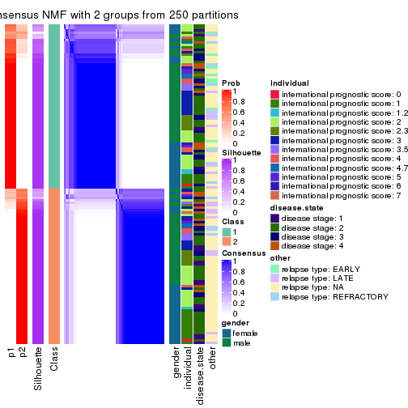</p>

</div>
<div id='tab-CV-NMF-consensus-heatmap-2'>
<pre><code class="r">consensus_heatmap(res, k = 3)
</code></pre>

<p>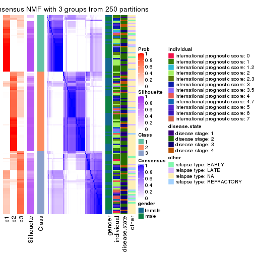</p>

</div>
<div id='tab-CV-NMF-consensus-heatmap-3'>
<pre><code class="r">consensus_heatmap(res, k = 4)
</code></pre>

<p>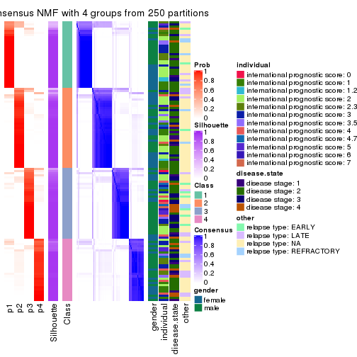</p>

</div>
<div id='tab-CV-NMF-consensus-heatmap-4'>
<pre><code class="r">consensus_heatmap(res, k = 5)
</code></pre>

<p>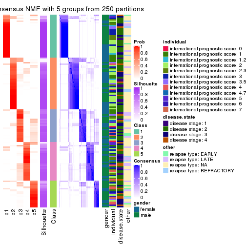</p>

</div>
<div id='tab-CV-NMF-consensus-heatmap-5'>
<pre><code class="r">consensus_heatmap(res, k = 6)
</code></pre>

<p>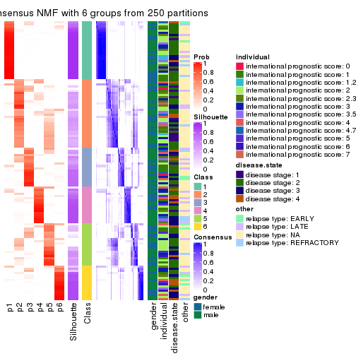</p>

</div>
</div>

Heatmaps for the membership of samples in all partitions to see how consistent they are:


<script>
$( function() {
	$( '#tabs-CV-NMF-membership-heatmap' ).tabs();
} );
</script>
<div id='tabs-CV-NMF-membership-heatmap'>
<ul>
<li><a href='#tab-CV-NMF-membership-heatmap-1'>k = 2</a></li>
<li><a href='#tab-CV-NMF-membership-heatmap-2'>k = 3</a></li>
<li><a href='#tab-CV-NMF-membership-heatmap-3'>k = 4</a></li>
<li><a href='#tab-CV-NMF-membership-heatmap-4'>k = 5</a></li>
<li><a href='#tab-CV-NMF-membership-heatmap-5'>k = 6</a></li>
</ul>
<div id='tab-CV-NMF-membership-heatmap-1'>
<pre><code class="r">membership_heatmap(res, k = 2)
</code></pre>

<p>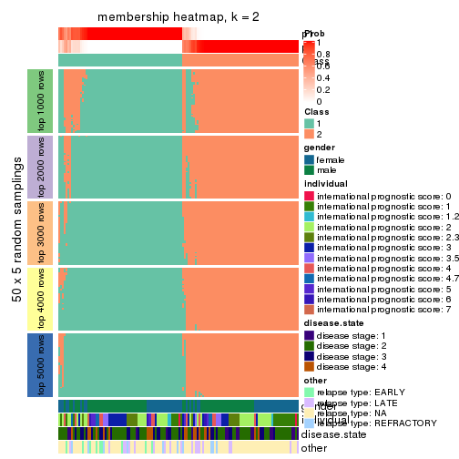</p>

</div>
<div id='tab-CV-NMF-membership-heatmap-2'>
<pre><code class="r">membership_heatmap(res, k = 3)
</code></pre>

<p>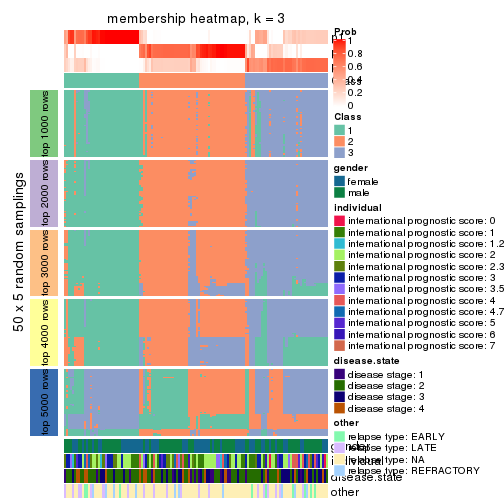</p>

</div>
<div id='tab-CV-NMF-membership-heatmap-3'>
<pre><code class="r">membership_heatmap(res, k = 4)
</code></pre>

<p>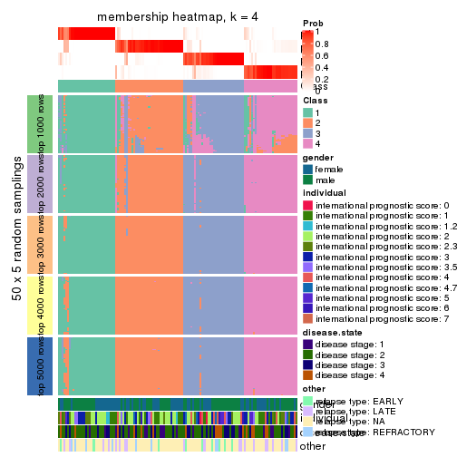</p>

</div>
<div id='tab-CV-NMF-membership-heatmap-4'>
<pre><code class="r">membership_heatmap(res, k = 5)
</code></pre>

<p>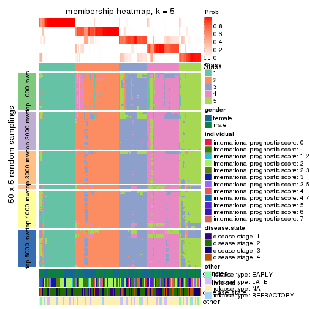</p>

</div>
<div id='tab-CV-NMF-membership-heatmap-5'>
<pre><code class="r">membership_heatmap(res, k = 6)
</code></pre>

<p>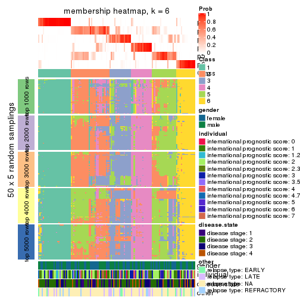</p>

</div>
</div>

As soon as we have had the classes for columns, we can look for signatures
which are significantly different between classes which can be candidate marks
for certain classes. Following are the heatmaps for signatures.


Signature heatmaps where rows are scaled:


<script>
$( function() {
	$( '#tabs-CV-NMF-get-signatures' ).tabs();
} );
</script>
<div id='tabs-CV-NMF-get-signatures'>
<ul>
<li><a href='#tab-CV-NMF-get-signatures-1'>k = 2</a></li>
<li><a href='#tab-CV-NMF-get-signatures-2'>k = 3</a></li>
<li><a href='#tab-CV-NMF-get-signatures-3'>k = 4</a></li>
<li><a href='#tab-CV-NMF-get-signatures-4'>k = 5</a></li>
<li><a href='#tab-CV-NMF-get-signatures-5'>k = 6</a></li>
</ul>
<div id='tab-CV-NMF-get-signatures-1'>
<pre><code class="r">get_signatures(res, k = 2)
</code></pre>

<p>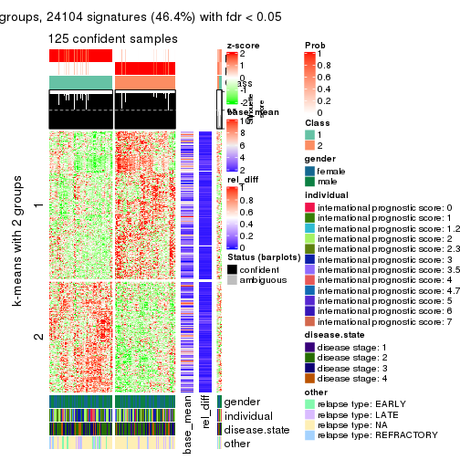</p>

</div>
<div id='tab-CV-NMF-get-signatures-2'>
<pre><code class="r">get_signatures(res, k = 3)
</code></pre>

<p>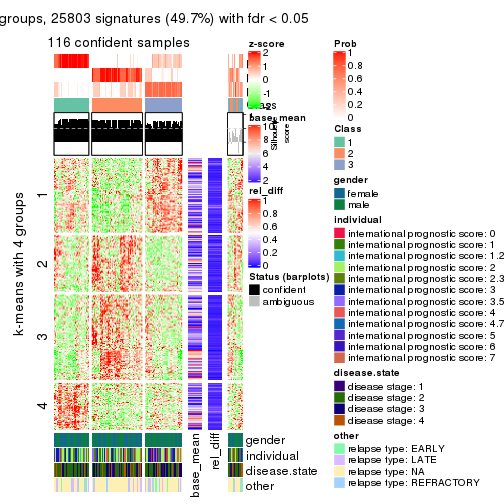</p>

</div>
<div id='tab-CV-NMF-get-signatures-3'>
<pre><code class="r">get_signatures(res, k = 4)
</code></pre>

<p>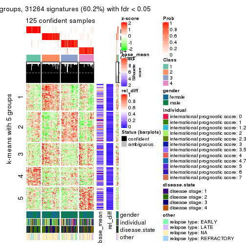</p>

</div>
<div id='tab-CV-NMF-get-signatures-4'>
<pre><code class="r">get_signatures(res, k = 5)
</code></pre>

<pre><code>#&gt; Error: The width or height of the raster image is zero, maybe you forget to turn off the
#&gt; previous graphic device or it was corrupted. Run `dev.off()` to close it.
</code></pre>

<p></p>

</div>
<div id='tab-CV-NMF-get-signatures-5'>
<pre><code class="r">get_signatures(res, k = 6)
</code></pre>

<pre><code>#&gt; Error: The width or height of the raster image is zero, maybe you forget to turn off the
#&gt; previous graphic device or it was corrupted. Run `dev.off()` to close it.
</code></pre>

<p></p>

</div>
</div>


Signature heatmaps where rows are not scaled:


<script>
$( function() {
	$( '#tabs-CV-NMF-get-signatures-no-scale' ).tabs();
} );
</script>
<div id='tabs-CV-NMF-get-signatures-no-scale'>
<ul>
<li><a href='#tab-CV-NMF-get-signatures-no-scale-1'>k = 2</a></li>
<li><a href='#tab-CV-NMF-get-signatures-no-scale-2'>k = 3</a></li>
<li><a href='#tab-CV-NMF-get-signatures-no-scale-3'>k = 4</a></li>
<li><a href='#tab-CV-NMF-get-signatures-no-scale-4'>k = 5</a></li>
<li><a href='#tab-CV-NMF-get-signatures-no-scale-5'>k = 6</a></li>
</ul>
<div id='tab-CV-NMF-get-signatures-no-scale-1'>
<pre><code class="r">get_signatures(res, k = 2, scale_rows = FALSE)
</code></pre>

<p>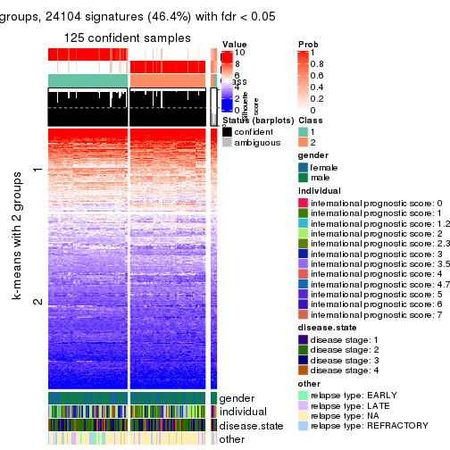</p>

</div>
<div id='tab-CV-NMF-get-signatures-no-scale-2'>
<pre><code class="r">get_signatures(res, k = 3, scale_rows = FALSE)
</code></pre>

<p>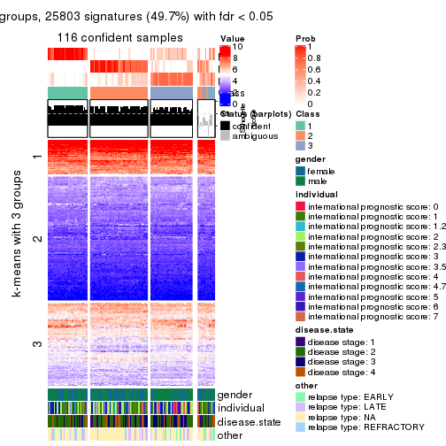</p>

</div>
<div id='tab-CV-NMF-get-signatures-no-scale-3'>
<pre><code class="r">get_signatures(res, k = 4, scale_rows = FALSE)
</code></pre>

<p>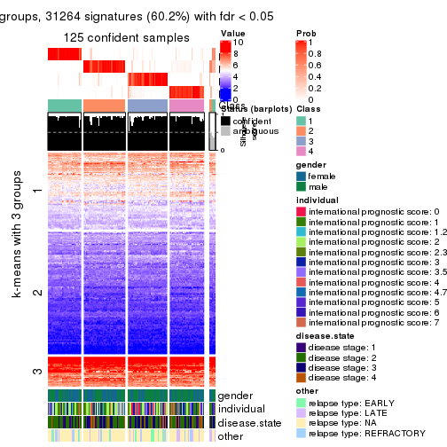</p>

</div>
<div id='tab-CV-NMF-get-signatures-no-scale-4'>
<pre><code class="r">get_signatures(res, k = 5, scale_rows = FALSE)
</code></pre>

<p>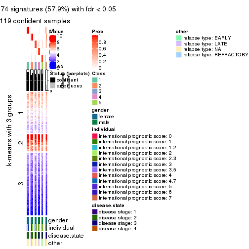</p>

</div>
<div id='tab-CV-NMF-get-signatures-no-scale-5'>
<pre><code class="r">get_signatures(res, k = 6, scale_rows = FALSE)
</code></pre>

<pre><code>#&gt; Error in mat[ceiling(1:nr/h_ratio), ceiling(1:nc/w_ratio), drop = FALSE]: subscript out of bounds
</code></pre>

<p></p>

</div>
</div>


Compare the overlap of signatures from different k:

```r
compare_signatures(res)
```

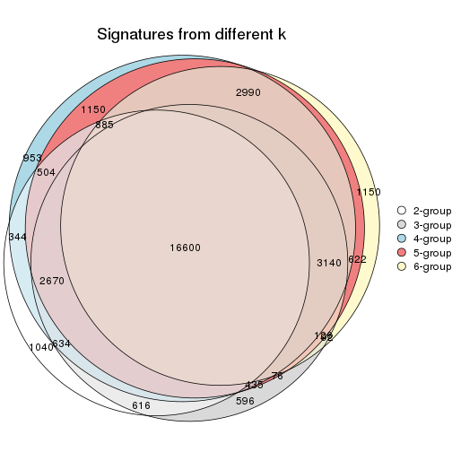

`get_signature()` returns a data frame invisibly. TO get the list of signatures, the function
call should be assigned to a variable explicitly. In following code, if `plot` argument is set
to `FALSE`, no heatmap is plotted while only the differential analysis is performed.

```r
# code only for demonstration
tb = get_signature(res, k = ..., plot = FALSE)
```

An example of the output of `tb` is:

```
#>   which_row         fdr    mean_1    mean_2 scaled_mean_1 scaled_mean_2 km
#> 1        38 0.042760348  8.373488  9.131774    -0.5533452     0.5164555  1
#> 2        40 0.018707592  7.106213  8.469186    -0.6173731     0.5762149  1
#> 3        55 0.019134737 10.221463 11.207825    -0.6159697     0.5749050  1
#> 4        59 0.006059896  5.921854  7.869574    -0.6899429     0.6439467  1
#> 5        60 0.018055526  8.928898 10.211722    -0.6204761     0.5791110  1
#> 6        98 0.009384629 15.714769 14.887706     0.6635654    -0.6193277  2
...
```

The columns in `tb` are:

1. `which_row`: row indices corresponding to the input matrix.
2. `fdr`: FDR for the differential test. 
3. `mean_x`: The mean value in group x.
4. `scaled_mean_x`: The mean value in group x after rows are scaled.
5. `km`: Row groups if k-means clustering is applied to rows.


UMAP plot which shows how samples are separated.


<script>
$( function() {
	$( '#tabs-CV-NMF-dimension-reduction' ).tabs();
} );
</script>
<div id='tabs-CV-NMF-dimension-reduction'>
<ul>
<li><a href='#tab-CV-NMF-dimension-reduction-1'>k = 2</a></li>
<li><a href='#tab-CV-NMF-dimension-reduction-2'>k = 3</a></li>
<li><a href='#tab-CV-NMF-dimension-reduction-3'>k = 4</a></li>
<li><a href='#tab-CV-NMF-dimension-reduction-4'>k = 5</a></li>
<li><a href='#tab-CV-NMF-dimension-reduction-5'>k = 6</a></li>
</ul>
<div id='tab-CV-NMF-dimension-reduction-1'>
<pre><code class="r">dimension_reduction(res, k = 2, method = &quot;UMAP&quot;)
</code></pre>

<p>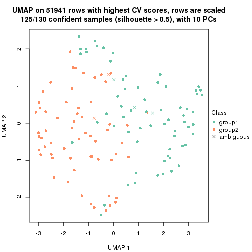</p>

</div>
<div id='tab-CV-NMF-dimension-reduction-2'>
<pre><code class="r">dimension_reduction(res, k = 3, method = &quot;UMAP&quot;)
</code></pre>

<p>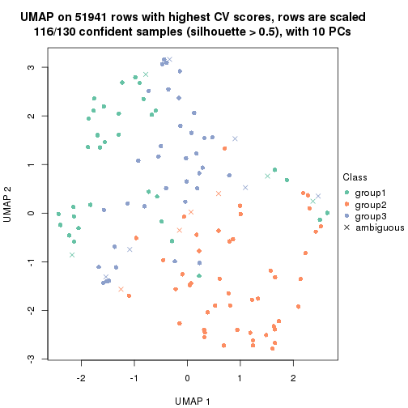</p>

</div>
<div id='tab-CV-NMF-dimension-reduction-3'>
<pre><code class="r">dimension_reduction(res, k = 4, method = &quot;UMAP&quot;)
</code></pre>

<p>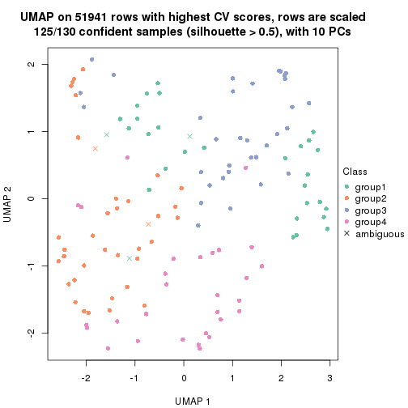</p>

</div>
<div id='tab-CV-NMF-dimension-reduction-4'>
<pre><code class="r">dimension_reduction(res, k = 5, method = &quot;UMAP&quot;)
</code></pre>

<p>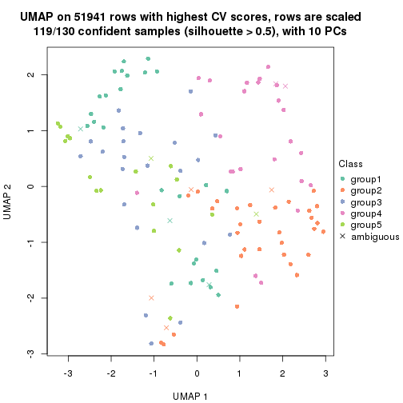</p>

</div>
<div id='tab-CV-NMF-dimension-reduction-5'>
<pre><code class="r">dimension_reduction(res, k = 6, method = &quot;UMAP&quot;)
</code></pre>

<p>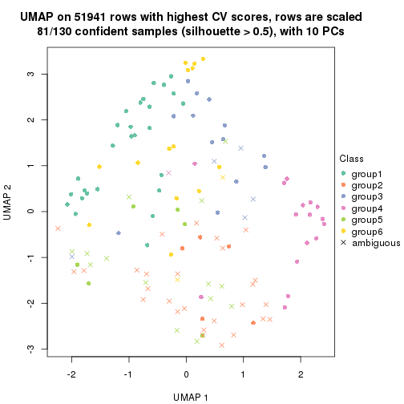</p>

</div>
</div>


Following heatmap shows how subgroups are split when increasing `k`:

```r
collect_classes(res)
```

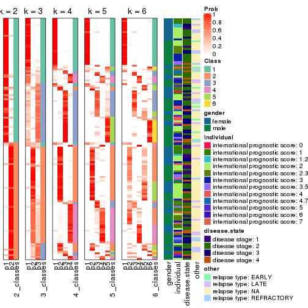


Test correlation between subgroups and known annotations. If the known
annotation is numeric, one-way ANOVA test is applied, and if the known
annotation is discrete, chi-squared contingency table test is applied.

```r
test_to_known_factors(res)
```

```
#>          n gender(p) individual(p) disease.state(p) other(p) k
#> CV:NMF 125     0.812        0.9381            0.050   0.0218 2
#> CV:NMF 116     0.200        0.4109            0.117   0.2783 3
#> CV:NMF 125     0.212        0.1197            0.202   0.0653 4
#> CV:NMF 119     0.636        0.0515            0.124   0.0379 5
#> CV:NMF  81     0.945        0.6669            0.189   0.4966 6
```


If matrix rows can be associated to genes, consider to use `GO_Enrichment(res,
...)` to perform function enrichment for the signature genes.


 

---------------------------------------------------


### MAD:hclust


The object with results only for a single top-value method and a single partition method 
can be extracted as:

```r
res = res_list["MAD", "hclust"]
# you can also extract it by
# res = res_list["MAD:hclust"]
```

A summary of `res` and all the functions that can be applied to it:

```r
res
```

```
#> A 'ConsensusPartition' object with k = 2, 3, 4, 5, 6.
#>   On a matrix with 51941 rows and 130 columns.
#>   Top rows (1000, 2000, 3000, 4000, 5000) are extracted by 'MAD' method.
#>   Subgroups are detected by 'hclust' method.
#>   Performed in total 1250 partitions by row resampling.
#>   Best k for subgroups seems to be 2.
#> 
#> Following methods can be applied to this 'ConsensusPartition' object:
#>  [1] "cola_report"             "collect_classes"         "collect_plots"          
#>  [4] "collect_stats"           "colnames"                "compare_signatures"     
#>  [7] "consensus_heatmap"       "dimension_reduction"     "functional_enrichment"  
#> [10] "get_anno_col"            "get_anno"                "get_classes"            
#> [13] "get_consensus"           "get_matrix"              "get_membership"         
#> [16] "get_param"               "get_signatures"          "get_stats"              
#> [19] "is_best_k"               "is_stable_k"             "membership_heatmap"     
#> [22] "ncol"                    "nrow"                    "plot_ecdf"              
#> [25] "rownames"                "select_partition_number" "show"                   
#> [28] "suggest_best_k"          "test_to_known_factors"
```

`collect_plots()` function collects all the plots made from `res` for all `k` (number of partitions)
into one single page to provide an easy and fast comparison between different `k`.

```r
collect_plots(res)
```

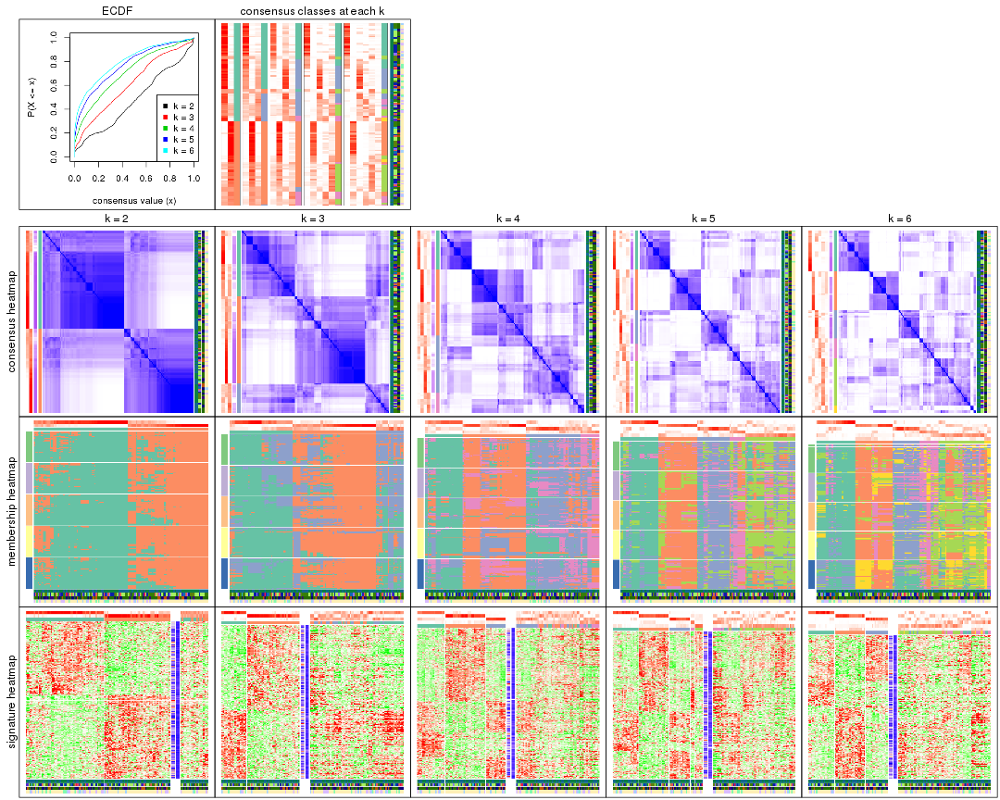

The plots are:

- The first row: a plot of the ECDF (Empirical cumulative distribution
  function) curves of the consensus matrix for each `k` and the heatmap of
  predicted classes for each `k`.
- The second row: heatmaps of the consensus matrix for each `k`.
- The third row: heatmaps of the membership matrix for each `k`.
- The fouth row: heatmaps of the signatures for each `k`.

All the plots in panels can be made by individual functions and they are
plotted later in this section.

`select_partition_number()` produces several plots showing different
statistics for choosing "optimized" `k`. There are following statistics:

- ECDF curves of the consensus matrix for each `k`;
- 1-PAC. [The PAC
  score](https://en.wikipedia.org/wiki/Consensus_clustering#Over-interpretation_potential_of_consensus_clustering)
  measures the proportion of the ambiguous subgrouping.
- Mean silhouette score.
- Concordance. The mean probability of fiting the consensus class ids in all
  partitions.
- Area increased. Denote $A_k$ as the area under the ECDF curve for current
  `k`, the area increased is defined as $A_k - A_{k-1}$.
- Rand index. The percent of pairs of samples that are both in a same cluster
  or both are not in a same cluster in the partition of k and k-1.
- Jaccard index. The ratio of pairs of samples are both in a same cluster in
  the partition of k and k-1 and the pairs of samples are both in a same
  cluster in the partition k or k-1.

The detailed explanations of these statistics can be found in [the cola
vignette](http://bioconductor.org/packages/devel/bioc/vignettes/cola/inst/doc/cola.html#toc_13).

Generally speaking, lower PAC score, higher mean silhouette score or higher
concordance corresponds to better partition. Rand index and Jaccard index
measure how similar the current partition is compared to partition with `k-1`.
If they are too similar, we won't accept `k` is better than `k-1`.

```r
select_partition_number(res)
```

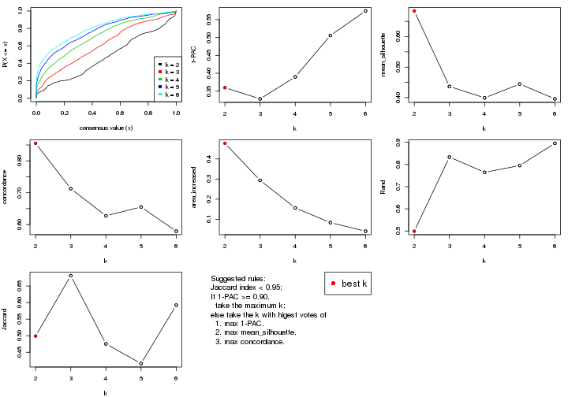

The numeric values for all these statistics can be obtained by `get_stats()`.

```r
get_stats(res)
```

```
#>   k 1-PAC mean_silhouette concordance area_increased  Rand Jaccard
#> 2 2 0.360           0.684       0.855         0.4776 0.499   0.499
#> 3 3 0.329           0.437       0.713         0.2934 0.833   0.681
#> 4 4 0.390           0.399       0.628         0.1563 0.765   0.475
#> 5 5 0.506           0.444       0.655         0.0832 0.795   0.416
#> 6 6 0.574           0.396       0.579         0.0405 0.895   0.592
```

`suggest_best_k()` suggests the best $k$ based on these statistics. The rules are as follows:

- All $k$ with Jaccard index larger than 0.95 are removed because the increase of
  the partition number does not provides enough extra information. If all $k$ are removed,
  the best $k$ is assigned by `NA`.
- For $k$ with 1-PAC larger than 0.9, the maximal $k$ is taken as the "best k". Other $k$ is called "optional k".
- If it does not fit the second rule. The $k$ with the highest vote of highest
  1-PAC, mean silhouette and concordance is taken as the "best k".

```r
suggest_best_k(res)
```

```
#> [1] 2
```


Following shows the table of the partitions (You need to click the **show/hide
code output** link to see it). The membership matrix (columns with name `p*`)
is inferred by
[`clue::cl_consensus()`](https://www.rdocumentation.org/link/cl_consensus?package=clue)
function with the `SE` method. Basically the value in the membership matrix
represents the probability to belong to a certain group. The finall class
label for an item is determined with the group with highest probability it
belongs to.

In `get_classes()` function, the entropy is calculated from the membership
matrix and the silhouette score is calculated from the consensus matrix.


<script>
$( function() {
	$( '#tabs-MAD-hclust-get-classes' ).tabs();
} );
</script>
<div id='tabs-MAD-hclust-get-classes'>
<ul>
<li><a href='#tab-MAD-hclust-get-classes-1'>k = 2</a></li>
<li><a href='#tab-MAD-hclust-get-classes-2'>k = 3</a></li>
<li><a href='#tab-MAD-hclust-get-classes-3'>k = 4</a></li>
<li><a href='#tab-MAD-hclust-get-classes-4'>k = 5</a></li>
<li><a href='#tab-MAD-hclust-get-classes-5'>k = 6</a></li>
</ul>

<div id='tab-MAD-hclust-get-classes-1'>
<p><a id='tab-MAD-hclust-get-classes-1-a' style='color:#0366d6' href='#'>show/hide code output</a></p>
<pre><code class="r">cbind(get_classes(res, k = 2), get_membership(res, k = 2))
</code></pre>

<pre><code>#&gt;           class entropy silhouette    p1    p2
#&gt; GSM447671     2  0.9427     0.5157 0.360 0.640
#&gt; GSM447694     1  0.4022     0.8273 0.920 0.080
#&gt; GSM447618     2  0.9881     0.3283 0.436 0.564
#&gt; GSM447691     2  0.7950     0.6839 0.240 0.760
#&gt; GSM447733     1  0.5294     0.8061 0.880 0.120
#&gt; GSM447620     2  0.9358     0.5158 0.352 0.648
#&gt; GSM447627     1  0.4939     0.8087 0.892 0.108
#&gt; GSM447630     1  0.9833     0.2014 0.576 0.424
#&gt; GSM447642     1  0.3431     0.8326 0.936 0.064
#&gt; GSM447649     2  0.0000     0.7851 0.000 1.000
#&gt; GSM447654     2  0.9248     0.4946 0.340 0.660
#&gt; GSM447655     2  0.0000     0.7851 0.000 1.000
#&gt; GSM447669     2  0.9993     0.1682 0.484 0.516
#&gt; GSM447676     1  0.3584     0.8320 0.932 0.068
#&gt; GSM447678     2  0.9358     0.5305 0.352 0.648
#&gt; GSM447681     2  0.0000     0.7851 0.000 1.000
#&gt; GSM447698     2  0.9358     0.5290 0.352 0.648
#&gt; GSM447713     1  0.0000     0.8472 1.000 0.000
#&gt; GSM447722     2  0.9661     0.4483 0.392 0.608
#&gt; GSM447726     1  0.9988    -0.0631 0.520 0.480
#&gt; GSM447735     1  0.6531     0.7466 0.832 0.168
#&gt; GSM447737     1  0.0000     0.8472 1.000 0.000
#&gt; GSM447657     2  0.1184     0.7854 0.016 0.984
#&gt; GSM447674     2  0.1184     0.7854 0.016 0.984
#&gt; GSM447636     1  0.3431     0.8326 0.936 0.064
#&gt; GSM447723     1  0.9970    -0.0331 0.532 0.468
#&gt; GSM447699     1  0.9460     0.3985 0.636 0.364
#&gt; GSM447708     2  0.4815     0.7637 0.104 0.896
#&gt; GSM447721     1  0.0376     0.8478 0.996 0.004
#&gt; GSM447623     1  0.0000     0.8472 1.000 0.000
#&gt; GSM447621     1  0.0000     0.8472 1.000 0.000
#&gt; GSM447650     2  0.0000     0.7851 0.000 1.000
#&gt; GSM447651     2  0.0938     0.7841 0.012 0.988
#&gt; GSM447653     1  0.2043     0.8469 0.968 0.032
#&gt; GSM447658     1  0.3431     0.8326 0.936 0.064
#&gt; GSM447675     2  0.9866     0.3076 0.432 0.568
#&gt; GSM447680     2  0.3733     0.7754 0.072 0.928
#&gt; GSM447686     2  0.8661     0.6366 0.288 0.712
#&gt; GSM447736     1  0.3733     0.8373 0.928 0.072
#&gt; GSM447629     2  0.8016     0.6811 0.244 0.756
#&gt; GSM447648     1  0.0000     0.8472 1.000 0.000
#&gt; GSM447660     1  0.7745     0.6628 0.772 0.228
#&gt; GSM447661     2  0.0000     0.7851 0.000 1.000
#&gt; GSM447663     1  0.4690     0.8223 0.900 0.100
#&gt; GSM447704     2  0.0000     0.7851 0.000 1.000
#&gt; GSM447720     1  0.3431     0.8410 0.936 0.064
#&gt; GSM447652     2  0.6148     0.7445 0.152 0.848
#&gt; GSM447679     2  0.0000     0.7851 0.000 1.000
#&gt; GSM447712     1  0.0376     0.8478 0.996 0.004
#&gt; GSM447664     2  0.8016     0.6728 0.244 0.756
#&gt; GSM447637     1  0.0000     0.8472 1.000 0.000
#&gt; GSM447639     1  0.8016     0.6451 0.756 0.244
#&gt; GSM447615     1  0.1633     0.8462 0.976 0.024
#&gt; GSM447656     2  0.7376     0.7101 0.208 0.792
#&gt; GSM447673     2  0.0938     0.7846 0.012 0.988
#&gt; GSM447719     1  0.2043     0.8469 0.968 0.032
#&gt; GSM447706     1  0.0000     0.8472 1.000 0.000
#&gt; GSM447612     1  0.9000     0.5124 0.684 0.316
#&gt; GSM447665     2  0.9248     0.5464 0.340 0.660
#&gt; GSM447677     2  0.1633     0.7843 0.024 0.976
#&gt; GSM447613     1  0.0376     0.8478 0.996 0.004
#&gt; GSM447659     1  0.3733     0.8333 0.928 0.072
#&gt; GSM447662     1  0.2948     0.8438 0.948 0.052
#&gt; GSM447666     2  1.0000     0.1244 0.500 0.500
#&gt; GSM447668     2  0.0000     0.7851 0.000 1.000
#&gt; GSM447682     2  0.3274     0.7789 0.060 0.940
#&gt; GSM447683     2  0.2423     0.7820 0.040 0.960
#&gt; GSM447688     2  0.0000     0.7851 0.000 1.000
#&gt; GSM447702     2  0.0000     0.7851 0.000 1.000
#&gt; GSM447709     2  0.9248     0.5376 0.340 0.660
#&gt; GSM447711     1  0.0376     0.8478 0.996 0.004
#&gt; GSM447715     1  0.9970    -0.0331 0.532 0.468
#&gt; GSM447693     1  0.0000     0.8472 1.000 0.000
#&gt; GSM447611     2  0.9881     0.3020 0.436 0.564
#&gt; GSM447672     2  0.0000     0.7851 0.000 1.000
#&gt; GSM447703     2  0.0000     0.7851 0.000 1.000
#&gt; GSM447727     1  0.9795     0.1868 0.584 0.416
#&gt; GSM447638     1  0.9248     0.4240 0.660 0.340
#&gt; GSM447670     1  0.0672     0.8480 0.992 0.008
#&gt; GSM447700     2  0.9933     0.2815 0.452 0.548
#&gt; GSM447738     2  0.0000     0.7851 0.000 1.000
#&gt; GSM447739     1  0.0000     0.8472 1.000 0.000
#&gt; GSM447617     1  0.0000     0.8472 1.000 0.000
#&gt; GSM447628     2  0.9087     0.5151 0.324 0.676
#&gt; GSM447632     2  0.0000     0.7851 0.000 1.000
#&gt; GSM447619     1  0.2948     0.8438 0.948 0.052
#&gt; GSM447643     1  0.8555     0.5717 0.720 0.280
#&gt; GSM447724     1  0.9580     0.3451 0.620 0.380
#&gt; GSM447728     2  0.4161     0.7710 0.084 0.916
#&gt; GSM447610     1  0.5178     0.8014 0.884 0.116
#&gt; GSM447633     2  0.9248     0.5464 0.340 0.660
#&gt; GSM447634     1  0.9000     0.5127 0.684 0.316
#&gt; GSM447622     1  0.0000     0.8472 1.000 0.000
#&gt; GSM447667     2  0.8327     0.6617 0.264 0.736
#&gt; GSM447687     2  0.0000     0.7851 0.000 1.000
#&gt; GSM447695     1  0.4022     0.8273 0.920 0.080
#&gt; GSM447696     1  0.0000     0.8472 1.000 0.000
#&gt; GSM447697     1  0.0000     0.8472 1.000 0.000
#&gt; GSM447714     1  0.2778     0.8456 0.952 0.048
#&gt; GSM447717     1  0.3431     0.8326 0.936 0.064
#&gt; GSM447725     1  0.1414     0.8490 0.980 0.020
#&gt; GSM447729     2  0.9833     0.3298 0.424 0.576
#&gt; GSM447644     2  0.9993     0.1682 0.484 0.516
#&gt; GSM447710     1  0.2778     0.8456 0.952 0.048
#&gt; GSM447614     1  0.5178     0.8014 0.884 0.116
#&gt; GSM447685     2  0.3584     0.7770 0.068 0.932
#&gt; GSM447690     1  0.0000     0.8472 1.000 0.000
#&gt; GSM447730     2  0.0000     0.7851 0.000 1.000
#&gt; GSM447646     2  0.9087     0.5151 0.324 0.676
#&gt; GSM447689     1  0.9358     0.4121 0.648 0.352
#&gt; GSM447635     2  0.8555     0.6456 0.280 0.720
#&gt; GSM447641     1  0.3431     0.8326 0.936 0.064
#&gt; GSM447716     2  0.9170     0.5807 0.332 0.668
#&gt; GSM447718     1  0.9754     0.2400 0.592 0.408
#&gt; GSM447616     1  0.0000     0.8472 1.000 0.000
#&gt; GSM447626     1  0.5946     0.7795 0.856 0.144
#&gt; GSM447640     2  0.0000     0.7851 0.000 1.000
#&gt; GSM447734     1  0.2948     0.8432 0.948 0.052
#&gt; GSM447692     1  0.4022     0.8273 0.920 0.080
#&gt; GSM447647     2  0.0000     0.7851 0.000 1.000
#&gt; GSM447624     1  0.0000     0.8472 1.000 0.000
#&gt; GSM447625     1  0.4298     0.8303 0.912 0.088
#&gt; GSM447707     2  0.0000     0.7851 0.000 1.000
#&gt; GSM447732     1  0.4562     0.8246 0.904 0.096
#&gt; GSM447684     1  0.9635     0.2970 0.612 0.388
#&gt; GSM447731     1  0.5178     0.8057 0.884 0.116
#&gt; GSM447705     2  0.9286     0.5305 0.344 0.656
#&gt; GSM447631     1  0.0000     0.8472 1.000 0.000
#&gt; GSM447701     2  0.0000     0.7851 0.000 1.000
#&gt; GSM447645     1  0.0000     0.8472 1.000 0.000
</code></pre>

<script>
$('#tab-MAD-hclust-get-classes-1-a').parent().next().next().hide();
$('#tab-MAD-hclust-get-classes-1-a').click(function(){
  $('#tab-MAD-hclust-get-classes-1-a').parent().next().next().toggle();
  return(false);
});
</script>
</div>

<div id='tab-MAD-hclust-get-classes-2'>
<p><a id='tab-MAD-hclust-get-classes-2-a' style='color:#0366d6' href='#'>show/hide code output</a></p>
<pre><code class="r">cbind(get_classes(res, k = 3), get_membership(res, k = 3))
</code></pre>

<pre><code>#&gt;           class entropy silhouette    p1    p2    p3
#&gt; GSM447671     2  0.8113     0.3916 0.088 0.588 0.324
#&gt; GSM447694     1  0.7589     0.2416 0.588 0.052 0.360
#&gt; GSM447618     2  0.9120     0.1285 0.156 0.504 0.340
#&gt; GSM447691     2  0.6981     0.6243 0.136 0.732 0.132
#&gt; GSM447733     3  0.7199     0.3963 0.260 0.064 0.676
#&gt; GSM447620     2  0.7705     0.3933 0.060 0.592 0.348
#&gt; GSM447627     3  0.7533     0.2909 0.348 0.052 0.600
#&gt; GSM447630     3  0.9392     0.2911 0.172 0.392 0.436
#&gt; GSM447642     1  0.4399     0.4991 0.864 0.044 0.092
#&gt; GSM447649     2  0.0592     0.7340 0.000 0.988 0.012
#&gt; GSM447654     2  0.6527     0.3874 0.008 0.588 0.404
#&gt; GSM447655     2  0.0000     0.7351 0.000 1.000 0.000
#&gt; GSM447669     2  0.8720     0.0350 0.108 0.480 0.412
#&gt; GSM447676     1  0.4505     0.5071 0.860 0.048 0.092
#&gt; GSM447678     2  0.8573     0.3548 0.136 0.584 0.280
#&gt; GSM447681     2  0.0000     0.7351 0.000 1.000 0.000
#&gt; GSM447698     2  0.8571     0.3489 0.140 0.588 0.272
#&gt; GSM447713     1  0.0000     0.5768 1.000 0.000 0.000
#&gt; GSM447722     2  0.8894     0.2591 0.152 0.548 0.300
#&gt; GSM447726     2  0.9326    -0.0411 0.164 0.440 0.396
#&gt; GSM447735     3  0.8186     0.3805 0.292 0.104 0.604
#&gt; GSM447737     1  0.2796     0.5715 0.908 0.000 0.092
#&gt; GSM447657     2  0.0747     0.7352 0.000 0.984 0.016
#&gt; GSM447674     2  0.0747     0.7352 0.000 0.984 0.016
#&gt; GSM447636     1  0.4399     0.4991 0.864 0.044 0.092
#&gt; GSM447723     2  0.9369     0.1233 0.408 0.424 0.168
#&gt; GSM447699     3  0.9796     0.4410 0.264 0.304 0.432
#&gt; GSM447708     2  0.3987     0.7088 0.020 0.872 0.108
#&gt; GSM447721     1  0.0475     0.5751 0.992 0.004 0.004
#&gt; GSM447623     1  0.2625     0.5734 0.916 0.000 0.084
#&gt; GSM447621     1  0.2625     0.5734 0.916 0.000 0.084
#&gt; GSM447650     2  0.0000     0.7351 0.000 1.000 0.000
#&gt; GSM447651     2  0.1529     0.7301 0.000 0.960 0.040
#&gt; GSM447653     3  0.4654     0.3288 0.208 0.000 0.792
#&gt; GSM447658     1  0.4316     0.5023 0.868 0.044 0.088
#&gt; GSM447675     3  0.7188    -0.2881 0.024 0.488 0.488
#&gt; GSM447680     2  0.3669     0.7134 0.064 0.896 0.040
#&gt; GSM447686     2  0.7620     0.5788 0.188 0.684 0.128
#&gt; GSM447736     1  0.7824     0.0889 0.504 0.052 0.444
#&gt; GSM447629     2  0.7042     0.6213 0.140 0.728 0.132
#&gt; GSM447648     1  0.5926     0.3688 0.644 0.000 0.356
#&gt; GSM447660     1  0.8042     0.2086 0.652 0.200 0.148
#&gt; GSM447661     2  0.0000     0.7351 0.000 1.000 0.000
#&gt; GSM447663     3  0.8141    -0.0305 0.460 0.068 0.472
#&gt; GSM447704     2  0.0592     0.7340 0.000 0.988 0.012
#&gt; GSM447720     1  0.7665     0.0872 0.500 0.044 0.456
#&gt; GSM447652     2  0.5173     0.6745 0.036 0.816 0.148
#&gt; GSM447679     2  0.0000     0.7351 0.000 1.000 0.000
#&gt; GSM447712     1  0.0475     0.5751 0.992 0.004 0.004
#&gt; GSM447664     2  0.7303     0.5593 0.076 0.680 0.244
#&gt; GSM447637     1  0.6267     0.2319 0.548 0.000 0.452
#&gt; GSM447639     3  0.9192     0.4168 0.308 0.176 0.516
#&gt; GSM447615     1  0.6333     0.4119 0.656 0.012 0.332
#&gt; GSM447656     2  0.6389     0.6514 0.124 0.768 0.108
#&gt; GSM447673     2  0.1163     0.7302 0.000 0.972 0.028
#&gt; GSM447719     3  0.4654     0.3288 0.208 0.000 0.792
#&gt; GSM447706     1  0.6286     0.2242 0.536 0.000 0.464
#&gt; GSM447612     3  0.9667     0.4543 0.264 0.272 0.464
#&gt; GSM447665     2  0.7807     0.4182 0.068 0.596 0.336
#&gt; GSM447677     2  0.2173     0.7281 0.008 0.944 0.048
#&gt; GSM447613     1  0.0661     0.5765 0.988 0.004 0.008
#&gt; GSM447659     3  0.5956     0.3440 0.264 0.016 0.720
#&gt; GSM447662     1  0.7668     0.1116 0.496 0.044 0.460
#&gt; GSM447666     2  0.9004     0.0272 0.132 0.468 0.400
#&gt; GSM447668     2  0.0000     0.7351 0.000 1.000 0.000
#&gt; GSM447682     2  0.2845     0.7244 0.012 0.920 0.068
#&gt; GSM447683     2  0.2280     0.7265 0.008 0.940 0.052
#&gt; GSM447688     2  0.0892     0.7324 0.000 0.980 0.020
#&gt; GSM447702     2  0.0000     0.7351 0.000 1.000 0.000
#&gt; GSM447709     2  0.7644     0.4158 0.060 0.604 0.336
#&gt; GSM447711     1  0.0475     0.5751 0.992 0.004 0.004
#&gt; GSM447715     2  0.9369     0.1233 0.408 0.424 0.168
#&gt; GSM447693     1  0.6267     0.2319 0.548 0.000 0.452
#&gt; GSM447611     2  0.8065     0.2583 0.064 0.484 0.452
#&gt; GSM447672     2  0.0000     0.7351 0.000 1.000 0.000
#&gt; GSM447703     2  0.0892     0.7324 0.000 0.980 0.020
#&gt; GSM447727     1  0.9328    -0.1118 0.460 0.372 0.168
#&gt; GSM447638     1  0.9286    -0.0359 0.504 0.312 0.184
#&gt; GSM447670     1  0.4931     0.5230 0.768 0.000 0.232
#&gt; GSM447700     2  0.9281     0.0645 0.172 0.488 0.340
#&gt; GSM447738     2  0.0592     0.7340 0.000 0.988 0.012
#&gt; GSM447739     1  0.0000     0.5768 1.000 0.000 0.000
#&gt; GSM447617     1  0.2711     0.5728 0.912 0.000 0.088
#&gt; GSM447628     2  0.6111     0.4006 0.000 0.604 0.396
#&gt; GSM447632     2  0.0592     0.7340 0.000 0.988 0.012
#&gt; GSM447619     1  0.7668     0.1116 0.496 0.044 0.460
#&gt; GSM447643     1  0.8367     0.1356 0.612 0.252 0.136
#&gt; GSM447724     3  0.9724     0.4378 0.236 0.328 0.436
#&gt; GSM447728     2  0.3528     0.7150 0.016 0.892 0.092
#&gt; GSM447610     1  0.7418     0.3342 0.672 0.080 0.248
#&gt; GSM447633     2  0.7807     0.4182 0.068 0.596 0.336
#&gt; GSM447634     3  0.9849     0.4058 0.300 0.280 0.420
#&gt; GSM447622     1  0.5254     0.4730 0.736 0.000 0.264
#&gt; GSM447667     2  0.7333     0.5988 0.156 0.708 0.136
#&gt; GSM447687     2  0.0892     0.7324 0.000 0.980 0.020
#&gt; GSM447695     1  0.7274     0.3395 0.644 0.052 0.304
#&gt; GSM447696     1  0.0000     0.5768 1.000 0.000 0.000
#&gt; GSM447697     1  0.0237     0.5772 0.996 0.000 0.004
#&gt; GSM447714     1  0.7293     0.1091 0.496 0.028 0.476
#&gt; GSM447717     1  0.4399     0.4991 0.864 0.044 0.092
#&gt; GSM447725     1  0.1636     0.5669 0.964 0.016 0.020
#&gt; GSM447729     2  0.7984     0.2736 0.060 0.496 0.444
#&gt; GSM447644     2  0.8720     0.0350 0.108 0.480 0.412
#&gt; GSM447710     1  0.7293     0.1091 0.496 0.028 0.476
#&gt; GSM447614     1  0.7418     0.3342 0.672 0.080 0.248
#&gt; GSM447685     2  0.3253     0.7211 0.036 0.912 0.052
#&gt; GSM447690     1  0.0000     0.5768 1.000 0.000 0.000
#&gt; GSM447730     2  0.0592     0.7340 0.000 0.988 0.012
#&gt; GSM447646     2  0.6111     0.4006 0.000 0.604 0.396
#&gt; GSM447689     3  0.9471     0.3992 0.208 0.308 0.484
#&gt; GSM447635     2  0.7495     0.5916 0.120 0.692 0.188
#&gt; GSM447641     1  0.4316     0.5023 0.868 0.044 0.088
#&gt; GSM447716     2  0.8098     0.5291 0.216 0.644 0.140
#&gt; GSM447718     3  0.9621     0.3417 0.208 0.360 0.432
#&gt; GSM447616     1  0.5254     0.4730 0.736 0.000 0.264
#&gt; GSM447626     3  0.8938     0.0609 0.432 0.124 0.444
#&gt; GSM447640     2  0.0000     0.7351 0.000 1.000 0.000
#&gt; GSM447734     1  0.7487     0.0933 0.500 0.036 0.464
#&gt; GSM447692     1  0.7274     0.3395 0.644 0.052 0.304
#&gt; GSM447647     2  0.0592     0.7340 0.000 0.988 0.012
#&gt; GSM447624     1  0.4121     0.5402 0.832 0.000 0.168
#&gt; GSM447625     3  0.8069    -0.0267 0.460 0.064 0.476
#&gt; GSM447707     2  0.0592     0.7340 0.000 0.988 0.012
#&gt; GSM447732     3  0.8069    -0.0393 0.460 0.064 0.476
#&gt; GSM447684     3  0.9850     0.2660 0.252 0.356 0.392
#&gt; GSM447731     3  0.6906     0.3623 0.192 0.084 0.724
#&gt; GSM447705     2  0.7665     0.4087 0.060 0.600 0.340
#&gt; GSM447631     1  0.6267     0.2319 0.548 0.000 0.452
#&gt; GSM447701     2  0.0000     0.7351 0.000 1.000 0.000
#&gt; GSM447645     1  0.6267     0.2319 0.548 0.000 0.452
</code></pre>

<script>
$('#tab-MAD-hclust-get-classes-2-a').parent().next().next().hide();
$('#tab-MAD-hclust-get-classes-2-a').click(function(){
  $('#tab-MAD-hclust-get-classes-2-a').parent().next().next().toggle();
  return(false);
});
</script>
</div>

<div id='tab-MAD-hclust-get-classes-3'>
<p><a id='tab-MAD-hclust-get-classes-3-a' style='color:#0366d6' href='#'>show/hide code output</a></p>
<pre><code class="r">cbind(get_classes(res, k = 4), get_membership(res, k = 4))
</code></pre>

<pre><code>#&gt;           class entropy silhouette    p1    p2    p3    p4
#&gt; GSM447671     2  0.9585    0.09975 0.160 0.392 0.204 0.244
#&gt; GSM447694     3  0.6542    0.38730 0.168 0.000 0.636 0.196
#&gt; GSM447618     4  0.9647    0.22563 0.140 0.260 0.244 0.356
#&gt; GSM447691     2  0.7640    0.41858 0.236 0.536 0.012 0.216
#&gt; GSM447733     3  0.6398    0.15541 0.032 0.020 0.540 0.408
#&gt; GSM447620     2  0.9698    0.17308 0.196 0.380 0.220 0.204
#&gt; GSM447627     3  0.6491    0.18963 0.072 0.000 0.496 0.432
#&gt; GSM447630     3  0.8940    0.15551 0.120 0.256 0.476 0.148
#&gt; GSM447642     1  0.4153    0.69192 0.820 0.000 0.132 0.048
#&gt; GSM447649     2  0.2530    0.58992 0.000 0.888 0.000 0.112
#&gt; GSM447654     4  0.5260    0.26334 0.004 0.424 0.004 0.568
#&gt; GSM447655     2  0.0592    0.63509 0.000 0.984 0.000 0.016
#&gt; GSM447669     3  0.9533   -0.00587 0.148 0.328 0.348 0.176
#&gt; GSM447676     1  0.4739    0.68808 0.788 0.008 0.160 0.044
#&gt; GSM447678     4  0.9420    0.21328 0.128 0.336 0.180 0.356
#&gt; GSM447681     2  0.0336    0.63802 0.000 0.992 0.000 0.008
#&gt; GSM447698     2  0.9513   -0.24174 0.136 0.340 0.188 0.336
#&gt; GSM447713     1  0.3726    0.71167 0.788 0.000 0.212 0.000
#&gt; GSM447722     4  0.9607    0.22508 0.136 0.308 0.216 0.340
#&gt; GSM447726     3  0.9804    0.07120 0.248 0.236 0.340 0.176
#&gt; GSM447735     4  0.6055   -0.12812 0.044 0.000 0.436 0.520
#&gt; GSM447737     1  0.5110    0.57602 0.636 0.000 0.352 0.012
#&gt; GSM447657     2  0.0707    0.63965 0.000 0.980 0.000 0.020
#&gt; GSM447674     2  0.0707    0.63965 0.000 0.980 0.000 0.020
#&gt; GSM447636     1  0.4153    0.69192 0.820 0.000 0.132 0.048
#&gt; GSM447723     1  0.8216    0.07870 0.532 0.236 0.052 0.180
#&gt; GSM447699     3  0.8696    0.08825 0.112 0.104 0.452 0.332
#&gt; GSM447708     2  0.6511    0.54817 0.128 0.676 0.016 0.180
#&gt; GSM447721     1  0.3831    0.71532 0.792 0.000 0.204 0.004
#&gt; GSM447623     1  0.5018    0.60186 0.656 0.000 0.332 0.012
#&gt; GSM447621     1  0.5018    0.60186 0.656 0.000 0.332 0.012
#&gt; GSM447650     2  0.0376    0.63826 0.000 0.992 0.004 0.004
#&gt; GSM447651     2  0.5274    0.58401 0.152 0.768 0.016 0.064
#&gt; GSM447653     4  0.5771   -0.06252 0.028 0.000 0.460 0.512
#&gt; GSM447658     1  0.4206    0.69350 0.816 0.000 0.136 0.048
#&gt; GSM447675     4  0.5474    0.42088 0.004 0.292 0.032 0.672
#&gt; GSM447680     2  0.5914    0.54737 0.228 0.692 0.008 0.072
#&gt; GSM447686     2  0.8078    0.34823 0.292 0.476 0.020 0.212
#&gt; GSM447736     3  0.3561    0.52192 0.012 0.012 0.856 0.120
#&gt; GSM447629     2  0.7663    0.41428 0.240 0.532 0.012 0.216
#&gt; GSM447648     3  0.4418    0.40518 0.184 0.000 0.784 0.032
#&gt; GSM447660     1  0.7146    0.50171 0.672 0.092 0.112 0.124
#&gt; GSM447661     2  0.0376    0.63826 0.000 0.992 0.004 0.004
#&gt; GSM447663     3  0.3769    0.53616 0.012 0.052 0.864 0.072
#&gt; GSM447704     2  0.2530    0.58992 0.000 0.888 0.000 0.112
#&gt; GSM447720     3  0.3474    0.53518 0.012 0.024 0.872 0.092
#&gt; GSM447652     2  0.6452    0.48803 0.044 0.692 0.068 0.196
#&gt; GSM447679     2  0.1118    0.63860 0.000 0.964 0.000 0.036
#&gt; GSM447712     1  0.3831    0.71532 0.792 0.000 0.204 0.004
#&gt; GSM447664     2  0.6766   -0.03206 0.056 0.496 0.016 0.432
#&gt; GSM447637     3  0.2335    0.52880 0.020 0.000 0.920 0.060
#&gt; GSM447639     3  0.6837    0.06948 0.024 0.048 0.464 0.464
#&gt; GSM447615     3  0.5587    0.11290 0.372 0.000 0.600 0.028
#&gt; GSM447656     2  0.6865    0.49180 0.236 0.608 0.004 0.152
#&gt; GSM447673     2  0.2647    0.59333 0.000 0.880 0.000 0.120
#&gt; GSM447719     4  0.5771   -0.06252 0.028 0.000 0.460 0.512
#&gt; GSM447706     3  0.2300    0.53304 0.028 0.000 0.924 0.048
#&gt; GSM447612     3  0.8631    0.20906 0.112 0.156 0.528 0.204
#&gt; GSM447665     2  0.9477    0.17610 0.164 0.420 0.200 0.216
#&gt; GSM447677     2  0.5604    0.57473 0.172 0.744 0.020 0.064
#&gt; GSM447613     1  0.3688    0.71383 0.792 0.000 0.208 0.000
#&gt; GSM447659     3  0.5244    0.16838 0.008 0.000 0.556 0.436
#&gt; GSM447662     3  0.3319    0.53836 0.016 0.036 0.888 0.060
#&gt; GSM447666     3  0.9679    0.06045 0.196 0.256 0.372 0.176
#&gt; GSM447668     2  0.0376    0.63826 0.000 0.992 0.004 0.004
#&gt; GSM447682     2  0.5331    0.59422 0.120 0.764 0.008 0.108
#&gt; GSM447683     2  0.5041    0.60053 0.116 0.784 0.008 0.092
#&gt; GSM447688     2  0.3074    0.55847 0.000 0.848 0.000 0.152
#&gt; GSM447702     2  0.0336    0.63632 0.000 0.992 0.000 0.008
#&gt; GSM447709     2  0.9647    0.19109 0.196 0.392 0.208 0.204
#&gt; GSM447711     1  0.3831    0.71532 0.792 0.000 0.204 0.004
#&gt; GSM447715     1  0.8216    0.07870 0.532 0.236 0.052 0.180
#&gt; GSM447693     3  0.2335    0.52880 0.020 0.000 0.920 0.060
#&gt; GSM447611     4  0.5769    0.41085 0.036 0.284 0.012 0.668
#&gt; GSM447672     2  0.0707    0.63431 0.000 0.980 0.000 0.020
#&gt; GSM447703     2  0.3074    0.55847 0.000 0.848 0.000 0.152
#&gt; GSM447727     1  0.7809    0.22056 0.588 0.192 0.052 0.168
#&gt; GSM447638     1  0.8371    0.23355 0.564 0.156 0.160 0.120
#&gt; GSM447670     3  0.5738   -0.16005 0.432 0.000 0.540 0.028
#&gt; GSM447700     4  0.9636    0.21092 0.140 0.240 0.260 0.360
#&gt; GSM447738     2  0.2647    0.58993 0.000 0.880 0.000 0.120
#&gt; GSM447739     1  0.3688    0.71277 0.792 0.000 0.208 0.000
#&gt; GSM447617     1  0.5038    0.59645 0.652 0.000 0.336 0.012
#&gt; GSM447628     4  0.4948    0.23834 0.000 0.440 0.000 0.560
#&gt; GSM447632     2  0.2530    0.59708 0.000 0.888 0.000 0.112
#&gt; GSM447619     3  0.3319    0.53836 0.016 0.036 0.888 0.060
#&gt; GSM447643     1  0.7452    0.45305 0.644 0.124 0.084 0.148
#&gt; GSM447724     3  0.8970   -0.08171 0.112 0.128 0.388 0.372
#&gt; GSM447728     2  0.5990    0.57787 0.128 0.724 0.016 0.132
#&gt; GSM447610     1  0.7745    0.22134 0.420 0.000 0.340 0.240
#&gt; GSM447633     2  0.9477    0.17610 0.164 0.420 0.200 0.216
#&gt; GSM447634     3  0.8571    0.26052 0.120 0.140 0.536 0.204
#&gt; GSM447622     3  0.5428   -0.00685 0.380 0.000 0.600 0.020
#&gt; GSM447667     2  0.8033    0.37356 0.280 0.488 0.020 0.212
#&gt; GSM447687     2  0.3074    0.55847 0.000 0.848 0.000 0.152
#&gt; GSM447695     3  0.7313    0.08269 0.316 0.000 0.508 0.176
#&gt; GSM447696     1  0.3688    0.71277 0.792 0.000 0.208 0.000
#&gt; GSM447697     1  0.3764    0.70901 0.784 0.000 0.216 0.000
#&gt; GSM447714     3  0.2353    0.54461 0.008 0.024 0.928 0.040
#&gt; GSM447717     1  0.4153    0.69192 0.820 0.000 0.132 0.048
#&gt; GSM447725     1  0.4809    0.70770 0.752 0.012 0.220 0.016
#&gt; GSM447729     4  0.5755    0.40393 0.032 0.296 0.012 0.660
#&gt; GSM447644     3  0.9533   -0.00587 0.148 0.328 0.348 0.176
#&gt; GSM447710     3  0.2353    0.54461 0.008 0.024 0.928 0.040
#&gt; GSM447614     1  0.7745    0.22134 0.420 0.000 0.340 0.240
#&gt; GSM447685     2  0.5433    0.59070 0.152 0.752 0.008 0.088
#&gt; GSM447690     1  0.3726    0.71167 0.788 0.000 0.212 0.000
#&gt; GSM447730     2  0.2530    0.58992 0.000 0.888 0.000 0.112
#&gt; GSM447646     4  0.4948    0.23834 0.000 0.440 0.000 0.560
#&gt; GSM447689     3  0.8500    0.26260 0.184 0.148 0.548 0.120
#&gt; GSM447635     2  0.8551    0.35687 0.220 0.488 0.056 0.236
#&gt; GSM447641     1  0.4206    0.69350 0.816 0.000 0.136 0.048
#&gt; GSM447716     2  0.8802    0.26981 0.288 0.436 0.060 0.216
#&gt; GSM447718     3  0.9092    0.15872 0.136 0.204 0.476 0.184
#&gt; GSM447616     3  0.5428   -0.00685 0.380 0.000 0.600 0.020
#&gt; GSM447626     3  0.5713    0.48578 0.044 0.068 0.760 0.128
#&gt; GSM447640     2  0.1398    0.63776 0.000 0.956 0.004 0.040
#&gt; GSM447734     3  0.3134    0.53806 0.004 0.024 0.884 0.088
#&gt; GSM447692     3  0.7327    0.07209 0.320 0.000 0.504 0.176
#&gt; GSM447647     2  0.2530    0.58992 0.000 0.888 0.000 0.112
#&gt; GSM447624     3  0.5406   -0.28721 0.480 0.000 0.508 0.012
#&gt; GSM447625     3  0.3902    0.53388 0.024 0.036 0.860 0.080
#&gt; GSM447707     2  0.2530    0.58992 0.000 0.888 0.000 0.112
#&gt; GSM447732     3  0.3687    0.53713 0.012 0.048 0.868 0.072
#&gt; GSM447684     3  0.9512    0.15984 0.260 0.180 0.400 0.160
#&gt; GSM447731     4  0.6789    0.05409 0.016 0.060 0.404 0.520
#&gt; GSM447705     2  0.9665    0.18542 0.196 0.388 0.212 0.204
#&gt; GSM447631     3  0.2335    0.52880 0.020 0.000 0.920 0.060
#&gt; GSM447701     2  0.0376    0.63826 0.000 0.992 0.004 0.004
#&gt; GSM447645     3  0.2335    0.52880 0.020 0.000 0.920 0.060
</code></pre>

<script>
$('#tab-MAD-hclust-get-classes-3-a').parent().next().next().hide();
$('#tab-MAD-hclust-get-classes-3-a').click(function(){
  $('#tab-MAD-hclust-get-classes-3-a').parent().next().next().toggle();
  return(false);
});
</script>
</div>

<div id='tab-MAD-hclust-get-classes-4'>
<p><a id='tab-MAD-hclust-get-classes-4-a' style='color:#0366d6' href='#'>show/hide code output</a></p>
<pre><code class="r">cbind(get_classes(res, k = 5), get_membership(res, k = 5))
</code></pre>

<pre><code>#&gt;           class entropy silhouette    p1    p2    p3    p4    p5
#&gt; GSM447671     5  0.5831    0.51148 0.000 0.108 0.108 0.084 0.700
#&gt; GSM447694     3  0.7240    0.44294 0.204 0.000 0.548 0.152 0.096
#&gt; GSM447618     5  0.7027    0.34779 0.000 0.076 0.140 0.224 0.560
#&gt; GSM447691     5  0.6501    0.27908 0.080 0.272 0.000 0.064 0.584
#&gt; GSM447733     3  0.6650    0.11262 0.008 0.004 0.448 0.392 0.148
#&gt; GSM447620     5  0.4809    0.51608 0.004 0.080 0.116 0.028 0.772
#&gt; GSM447627     3  0.7492    0.13606 0.088 0.000 0.412 0.376 0.124
#&gt; GSM447630     5  0.6654    0.26378 0.008 0.076 0.356 0.040 0.520
#&gt; GSM447642     1  0.3088    0.70384 0.828 0.000 0.004 0.004 0.164
#&gt; GSM447649     2  0.4078    0.62568 0.000 0.784 0.000 0.148 0.068
#&gt; GSM447654     4  0.5575    0.46968 0.000 0.280 0.000 0.612 0.108
#&gt; GSM447655     2  0.2189    0.70580 0.000 0.904 0.000 0.012 0.084
#&gt; GSM447669     5  0.6353    0.46225 0.000 0.104 0.236 0.048 0.612
#&gt; GSM447676     1  0.3927    0.69793 0.792 0.000 0.040 0.004 0.164
#&gt; GSM447678     5  0.7566    0.16907 0.000 0.124 0.104 0.320 0.452
#&gt; GSM447681     2  0.2233    0.70685 0.000 0.892 0.000 0.004 0.104
#&gt; GSM447698     5  0.7492    0.26677 0.000 0.124 0.108 0.280 0.488
#&gt; GSM447713     1  0.0510    0.75421 0.984 0.000 0.016 0.000 0.000
#&gt; GSM447722     5  0.7347    0.26818 0.000 0.092 0.124 0.284 0.500
#&gt; GSM447726     5  0.5831    0.41867 0.052 0.028 0.244 0.016 0.660
#&gt; GSM447735     4  0.7224   -0.07331 0.060 0.000 0.356 0.452 0.132
#&gt; GSM447737     1  0.3750    0.61072 0.756 0.000 0.232 0.012 0.000
#&gt; GSM447657     2  0.2753    0.69955 0.000 0.856 0.000 0.008 0.136
#&gt; GSM447674     2  0.2753    0.69955 0.000 0.856 0.000 0.008 0.136
#&gt; GSM447636     1  0.3088    0.70384 0.828 0.000 0.004 0.004 0.164
#&gt; GSM447723     5  0.6117    0.27020 0.340 0.052 0.016 0.020 0.572
#&gt; GSM447699     5  0.7057    0.05367 0.004 0.012 0.328 0.220 0.436
#&gt; GSM447708     5  0.5730   -0.02388 0.008 0.416 0.000 0.064 0.512
#&gt; GSM447721     1  0.0912    0.75613 0.972 0.000 0.012 0.000 0.016
#&gt; GSM447623     1  0.3398    0.63413 0.780 0.000 0.216 0.004 0.000
#&gt; GSM447621     1  0.3398    0.63413 0.780 0.000 0.216 0.004 0.000
#&gt; GSM447650     2  0.2753    0.69324 0.000 0.856 0.000 0.008 0.136
#&gt; GSM447651     2  0.4930    0.22090 0.004 0.528 0.004 0.012 0.452
#&gt; GSM447653     4  0.4951    0.14925 0.012 0.000 0.420 0.556 0.012
#&gt; GSM447658     1  0.3047    0.70646 0.832 0.000 0.004 0.004 0.160
#&gt; GSM447675     4  0.5237    0.54277 0.000 0.160 0.000 0.684 0.156
#&gt; GSM447680     5  0.5317   -0.08159 0.028 0.448 0.000 0.012 0.512
#&gt; GSM447686     5  0.7127    0.30987 0.124 0.252 0.000 0.084 0.540
#&gt; GSM447736     3  0.4889    0.64857 0.016 0.000 0.748 0.108 0.128
#&gt; GSM447629     5  0.6549    0.27975 0.084 0.272 0.000 0.064 0.580
#&gt; GSM447648     3  0.3875    0.54706 0.228 0.000 0.756 0.004 0.012
#&gt; GSM447660     1  0.5041    0.40224 0.604 0.004 0.008 0.020 0.364
#&gt; GSM447661     2  0.2753    0.69324 0.000 0.856 0.000 0.008 0.136
#&gt; GSM447663     3  0.4721    0.64385 0.012 0.008 0.744 0.040 0.196
#&gt; GSM447704     2  0.4078    0.62568 0.000 0.784 0.000 0.148 0.068
#&gt; GSM447720     3  0.4876    0.66587 0.016 0.004 0.752 0.076 0.152
#&gt; GSM447652     2  0.6879    0.30290 0.000 0.480 0.024 0.168 0.328
#&gt; GSM447679     2  0.2605    0.68673 0.000 0.852 0.000 0.000 0.148
#&gt; GSM447712     1  0.1444    0.75525 0.948 0.000 0.012 0.000 0.040
#&gt; GSM447664     4  0.7274    0.16689 0.024 0.336 0.004 0.424 0.212
#&gt; GSM447637     3  0.1300    0.66468 0.028 0.000 0.956 0.016 0.000
#&gt; GSM447639     4  0.7309   -0.11287 0.012 0.008 0.340 0.380 0.260
#&gt; GSM447615     3  0.5773   -0.02325 0.436 0.000 0.476 0.000 0.088
#&gt; GSM447656     5  0.6490    0.12998 0.084 0.356 0.000 0.040 0.520
#&gt; GSM447673     2  0.4390    0.62413 0.000 0.760 0.000 0.156 0.084
#&gt; GSM447719     4  0.4951    0.14925 0.012 0.000 0.420 0.556 0.012
#&gt; GSM447706     3  0.1806    0.66691 0.016 0.000 0.940 0.016 0.028
#&gt; GSM447612     5  0.7233    0.02039 0.004 0.052 0.384 0.124 0.436
#&gt; GSM447665     5  0.5204    0.51879 0.000 0.132 0.096 0.036 0.736
#&gt; GSM447677     2  0.4706    0.14452 0.004 0.500 0.000 0.008 0.488
#&gt; GSM447613     1  0.0898    0.75558 0.972 0.000 0.020 0.000 0.008
#&gt; GSM447659     3  0.6208    0.12471 0.008 0.000 0.468 0.416 0.108
#&gt; GSM447662     3  0.3264    0.67094 0.008 0.004 0.852 0.020 0.116
#&gt; GSM447666     5  0.4887    0.38360 0.004 0.012 0.300 0.020 0.664
#&gt; GSM447668     2  0.2753    0.69324 0.000 0.856 0.000 0.008 0.136
#&gt; GSM447682     2  0.4922    0.26284 0.004 0.552 0.000 0.020 0.424
#&gt; GSM447683     2  0.4645    0.28550 0.004 0.564 0.000 0.008 0.424
#&gt; GSM447688     2  0.4581    0.56357 0.000 0.732 0.000 0.196 0.072
#&gt; GSM447702     2  0.2389    0.70351 0.000 0.880 0.000 0.004 0.116
#&gt; GSM447709     5  0.4827    0.51563 0.004 0.092 0.104 0.028 0.772
#&gt; GSM447711     1  0.1106    0.75634 0.964 0.000 0.012 0.000 0.024
#&gt; GSM447715     5  0.6117    0.27020 0.340 0.052 0.016 0.020 0.572
#&gt; GSM447693     3  0.1300    0.66468 0.028 0.000 0.956 0.016 0.000
#&gt; GSM447611     4  0.5697    0.54623 0.024 0.156 0.000 0.680 0.140
#&gt; GSM447672     2  0.2069    0.70411 0.000 0.912 0.000 0.012 0.076
#&gt; GSM447703     2  0.4581    0.56357 0.000 0.732 0.000 0.196 0.072
#&gt; GSM447727     5  0.5808    0.14913 0.392 0.036 0.020 0.008 0.544
#&gt; GSM447638     5  0.6467    0.01479 0.400 0.008 0.100 0.012 0.480
#&gt; GSM447670     1  0.5504    0.11055 0.488 0.000 0.448 0.000 0.064
#&gt; GSM447700     5  0.6955    0.32784 0.000 0.056 0.164 0.224 0.556
#&gt; GSM447738     2  0.4138    0.62652 0.000 0.780 0.000 0.148 0.072
#&gt; GSM447739     1  0.0404    0.75425 0.988 0.000 0.012 0.000 0.000
#&gt; GSM447617     1  0.3300    0.64388 0.792 0.000 0.204 0.004 0.000
#&gt; GSM447628     4  0.5433    0.45312 0.000 0.288 0.000 0.620 0.092
#&gt; GSM447632     2  0.4127    0.63773 0.000 0.784 0.000 0.136 0.080
#&gt; GSM447619     3  0.3264    0.67094 0.008 0.004 0.852 0.020 0.116
#&gt; GSM447643     1  0.5092    0.29790 0.556 0.012 0.004 0.012 0.416
#&gt; GSM447724     5  0.7463   -0.01014 0.000 0.032 0.300 0.304 0.364
#&gt; GSM447728     5  0.5299   -0.14088 0.008 0.464 0.000 0.032 0.496
#&gt; GSM447610     1  0.7104    0.41868 0.568 0.000 0.132 0.196 0.104
#&gt; GSM447633     5  0.5204    0.51879 0.000 0.132 0.096 0.036 0.736
#&gt; GSM447634     5  0.6547   -0.00592 0.016 0.012 0.420 0.088 0.464
#&gt; GSM447622     3  0.4971   -0.02927 0.472 0.000 0.504 0.004 0.020
#&gt; GSM447667     5  0.6452    0.32716 0.092 0.240 0.004 0.052 0.612
#&gt; GSM447687     2  0.4581    0.56357 0.000 0.732 0.000 0.196 0.072
#&gt; GSM447695     1  0.7593    0.03716 0.432 0.000 0.336 0.144 0.088
#&gt; GSM447696     1  0.0404    0.75425 0.988 0.000 0.012 0.000 0.000
#&gt; GSM447697     1  0.0609    0.75281 0.980 0.000 0.020 0.000 0.000
#&gt; GSM447714     3  0.3951    0.68177 0.016 0.000 0.812 0.044 0.128
#&gt; GSM447717     1  0.2970    0.70480 0.828 0.000 0.004 0.000 0.168
#&gt; GSM447725     1  0.2100    0.75287 0.924 0.000 0.016 0.012 0.048
#&gt; GSM447729     4  0.5679    0.54961 0.020 0.168 0.000 0.676 0.136
#&gt; GSM447644     5  0.6353    0.46225 0.000 0.104 0.236 0.048 0.612
#&gt; GSM447710     3  0.3951    0.68177 0.016 0.000 0.812 0.044 0.128
#&gt; GSM447614     1  0.7104    0.41868 0.568 0.000 0.132 0.196 0.104
#&gt; GSM447685     2  0.5156    0.21921 0.020 0.528 0.000 0.012 0.440
#&gt; GSM447690     1  0.0510    0.75421 0.984 0.000 0.016 0.000 0.000
#&gt; GSM447730     2  0.3950    0.63352 0.000 0.796 0.000 0.136 0.068
#&gt; GSM447646     4  0.5433    0.45312 0.000 0.288 0.000 0.620 0.092
#&gt; GSM447689     5  0.5545    0.02332 0.008 0.008 0.448 0.032 0.504
#&gt; GSM447635     5  0.7225    0.35399 0.080 0.236 0.028 0.080 0.576
#&gt; GSM447641     1  0.3047    0.70646 0.832 0.000 0.004 0.004 0.160
#&gt; GSM447716     5  0.7736    0.38634 0.112 0.200 0.036 0.100 0.552
#&gt; GSM447718     5  0.6053    0.27006 0.008 0.024 0.356 0.052 0.560
#&gt; GSM447616     3  0.4971   -0.02927 0.472 0.000 0.504 0.004 0.020
#&gt; GSM447626     3  0.4777    0.48931 0.012 0.004 0.672 0.016 0.296
#&gt; GSM447640     2  0.2773    0.67588 0.000 0.836 0.000 0.000 0.164
#&gt; GSM447734     3  0.4711    0.67198 0.016 0.004 0.768 0.076 0.136
#&gt; GSM447692     1  0.7586    0.05044 0.436 0.000 0.332 0.144 0.088
#&gt; GSM447647     2  0.4078    0.62568 0.000 0.784 0.000 0.148 0.068
#&gt; GSM447624     1  0.4210    0.29197 0.588 0.000 0.412 0.000 0.000
#&gt; GSM447625     3  0.4972    0.64662 0.016 0.004 0.728 0.056 0.196
#&gt; GSM447707     2  0.3950    0.63352 0.000 0.796 0.000 0.136 0.068
#&gt; GSM447732     3  0.4634    0.64602 0.012 0.004 0.744 0.040 0.200
#&gt; GSM447684     5  0.6384    0.32995 0.088 0.020 0.308 0.012 0.572
#&gt; GSM447731     4  0.5829    0.25336 0.004 0.044 0.360 0.568 0.024
#&gt; GSM447705     5  0.4823    0.51600 0.004 0.088 0.108 0.028 0.772
#&gt; GSM447631     3  0.1300    0.66468 0.028 0.000 0.956 0.016 0.000
#&gt; GSM447701     2  0.2753    0.69324 0.000 0.856 0.000 0.008 0.136
#&gt; GSM447645     3  0.1300    0.66468 0.028 0.000 0.956 0.016 0.000
</code></pre>

<script>
$('#tab-MAD-hclust-get-classes-4-a').parent().next().next().hide();
$('#tab-MAD-hclust-get-classes-4-a').click(function(){
  $('#tab-MAD-hclust-get-classes-4-a').parent().next().next().toggle();
  return(false);
});
</script>
</div>

<div id='tab-MAD-hclust-get-classes-5'>
<p><a id='tab-MAD-hclust-get-classes-5-a' style='color:#0366d6' href='#'>show/hide code output</a></p>
<pre><code class="r">cbind(get_classes(res, k = 6), get_membership(res, k = 6))
</code></pre>

<pre><code>#&gt;           class entropy silhouette    p1    p2    p3    p4    p5    p6
#&gt; GSM447671     5  0.5745    0.25847 0.000 0.060 0.040 0.188 0.664 0.048
#&gt; GSM447694     3  0.6336    0.31159 0.200 0.000 0.488 0.288 0.016 0.008
#&gt; GSM447618     5  0.6227   -0.23092 0.000 0.068 0.036 0.432 0.440 0.024
#&gt; GSM447691     5  0.5195    0.38531 0.004 0.252 0.000 0.052 0.652 0.040
#&gt; GSM447733     4  0.6299    0.31298 0.004 0.012 0.232 0.592 0.080 0.080
#&gt; GSM447620     5  0.6664    0.33697 0.000 0.060 0.124 0.056 0.596 0.164
#&gt; GSM447627     4  0.5906    0.23425 0.084 0.000 0.252 0.608 0.028 0.028
#&gt; GSM447630     5  0.6946    0.11086 0.008 0.052 0.324 0.112 0.480 0.024
#&gt; GSM447642     1  0.4171    0.62821 0.732 0.000 0.000 0.008 0.208 0.052
#&gt; GSM447649     2  0.1442    0.61939 0.000 0.944 0.000 0.004 0.040 0.012
#&gt; GSM447654     2  0.6795   -0.08222 0.000 0.424 0.000 0.284 0.052 0.240
#&gt; GSM447655     2  0.4215    0.57055 0.000 0.700 0.000 0.000 0.056 0.244
#&gt; GSM447669     5  0.6793    0.25847 0.000 0.072 0.184 0.140 0.568 0.036
#&gt; GSM447676     1  0.4899    0.62057 0.696 0.000 0.032 0.008 0.216 0.048
#&gt; GSM447678     4  0.6545    0.27542 0.000 0.136 0.004 0.456 0.352 0.052
#&gt; GSM447681     2  0.4495    0.56542 0.000 0.672 0.000 0.000 0.072 0.256
#&gt; GSM447698     4  0.6420    0.22686 0.000 0.120 0.004 0.444 0.384 0.048
#&gt; GSM447713     1  0.0146    0.72616 0.996 0.000 0.000 0.000 0.000 0.004
#&gt; GSM447722     4  0.6424    0.25236 0.000 0.092 0.020 0.460 0.388 0.040
#&gt; GSM447726     5  0.6586    0.25665 0.024 0.008 0.268 0.024 0.536 0.140
#&gt; GSM447735     4  0.4948    0.36691 0.060 0.000 0.192 0.708 0.020 0.020
#&gt; GSM447737     1  0.3610    0.62079 0.768 0.000 0.200 0.028 0.000 0.004
#&gt; GSM447657     2  0.4989    0.55500 0.000 0.640 0.000 0.004 0.108 0.248
#&gt; GSM447674     2  0.4989    0.55500 0.000 0.640 0.000 0.004 0.108 0.248
#&gt; GSM447636     1  0.4171    0.62821 0.732 0.000 0.000 0.008 0.208 0.052
#&gt; GSM447723     5  0.5427    0.29465 0.252 0.044 0.012 0.024 0.652 0.016
#&gt; GSM447699     4  0.6434    0.31813 0.000 0.016 0.212 0.460 0.304 0.008
#&gt; GSM447708     5  0.6249    0.23892 0.000 0.344 0.004 0.052 0.500 0.100
#&gt; GSM447721     1  0.0622    0.72650 0.980 0.000 0.000 0.000 0.008 0.012
#&gt; GSM447623     1  0.3219    0.63640 0.792 0.000 0.192 0.012 0.000 0.004
#&gt; GSM447621     1  0.3219    0.63640 0.792 0.000 0.192 0.012 0.000 0.004
#&gt; GSM447650     2  0.4887    0.53752 0.000 0.624 0.000 0.000 0.096 0.280
#&gt; GSM447651     6  0.6232   -0.13166 0.000 0.316 0.004 0.000 0.308 0.372
#&gt; GSM447653     6  0.6146    0.27902 0.004 0.000 0.204 0.372 0.004 0.416
#&gt; GSM447658     1  0.4143    0.63144 0.736 0.000 0.000 0.008 0.204 0.052
#&gt; GSM447675     4  0.6871    0.18729 0.000 0.296 0.000 0.424 0.064 0.216
#&gt; GSM447680     5  0.6043   -0.10215 0.000 0.252 0.000 0.000 0.384 0.364
#&gt; GSM447686     5  0.5991    0.35136 0.024 0.236 0.000 0.064 0.616 0.060
#&gt; GSM447736     3  0.4959    0.64612 0.012 0.000 0.684 0.220 0.072 0.012
#&gt; GSM447629     5  0.5256    0.38323 0.004 0.252 0.000 0.052 0.648 0.044
#&gt; GSM447648     3  0.4180    0.52187 0.224 0.000 0.732 0.016 0.012 0.016
#&gt; GSM447660     1  0.5338    0.27811 0.508 0.000 0.000 0.020 0.412 0.060
#&gt; GSM447661     2  0.4887    0.53752 0.000 0.624 0.000 0.000 0.096 0.280
#&gt; GSM447663     3  0.4779    0.68590 0.008 0.004 0.724 0.108 0.148 0.008
#&gt; GSM447704     2  0.1442    0.61939 0.000 0.944 0.000 0.004 0.040 0.012
#&gt; GSM447720     3  0.4731    0.67820 0.012 0.000 0.708 0.188 0.088 0.004
#&gt; GSM447652     2  0.6896    0.16995 0.000 0.496 0.012 0.096 0.276 0.120
#&gt; GSM447679     2  0.4989    0.53348 0.000 0.628 0.000 0.000 0.120 0.252
#&gt; GSM447712     1  0.1528    0.72252 0.936 0.000 0.000 0.000 0.048 0.016
#&gt; GSM447664     2  0.7299   -0.04156 0.000 0.416 0.000 0.252 0.156 0.176
#&gt; GSM447637     3  0.1542    0.69901 0.024 0.000 0.944 0.016 0.000 0.016
#&gt; GSM447639     4  0.5736    0.34050 0.008 0.012 0.240 0.612 0.120 0.008
#&gt; GSM447615     3  0.5619   -0.11404 0.424 0.000 0.476 0.000 0.072 0.028
#&gt; GSM447656     5  0.5480    0.31898 0.012 0.296 0.000 0.016 0.600 0.076
#&gt; GSM447673     2  0.2340    0.61018 0.000 0.900 0.000 0.024 0.060 0.016
#&gt; GSM447719     6  0.6143    0.28222 0.004 0.000 0.204 0.368 0.004 0.420
#&gt; GSM447706     3  0.1533    0.70097 0.016 0.000 0.948 0.008 0.012 0.016
#&gt; GSM447612     5  0.7143   -0.22996 0.000 0.048 0.252 0.332 0.356 0.012
#&gt; GSM447665     5  0.5656    0.33020 0.000 0.096 0.044 0.124 0.692 0.044
#&gt; GSM447677     6  0.6329   -0.11309 0.000 0.304 0.008 0.000 0.328 0.360
#&gt; GSM447613     1  0.0665    0.72830 0.980 0.000 0.008 0.000 0.008 0.004
#&gt; GSM447659     4  0.5466    0.28179 0.004 0.000 0.236 0.640 0.040 0.080
#&gt; GSM447662     3  0.2958    0.70939 0.004 0.000 0.860 0.028 0.096 0.012
#&gt; GSM447666     5  0.5879    0.19825 0.000 0.000 0.332 0.008 0.492 0.168
#&gt; GSM447668     2  0.4887    0.53752 0.000 0.624 0.000 0.000 0.096 0.280
#&gt; GSM447682     5  0.6048   -0.00885 0.000 0.400 0.000 0.012 0.420 0.168
#&gt; GSM447683     5  0.5927   -0.03974 0.000 0.396 0.000 0.004 0.420 0.180
#&gt; GSM447688     2  0.2453    0.58629 0.000 0.896 0.000 0.016 0.044 0.044
#&gt; GSM447702     2  0.4606    0.55800 0.000 0.656 0.000 0.000 0.076 0.268
#&gt; GSM447709     5  0.6684    0.34017 0.000 0.068 0.112 0.056 0.596 0.168
#&gt; GSM447711     1  0.1074    0.72554 0.960 0.000 0.000 0.000 0.028 0.012
#&gt; GSM447715     5  0.5427    0.29465 0.252 0.044 0.012 0.024 0.652 0.016
#&gt; GSM447693     3  0.1542    0.69901 0.024 0.000 0.944 0.016 0.000 0.016
#&gt; GSM447611     4  0.7198    0.15117 0.004 0.288 0.000 0.384 0.076 0.248
#&gt; GSM447672     2  0.4099    0.57177 0.000 0.708 0.000 0.000 0.048 0.244
#&gt; GSM447703     2  0.2453    0.58629 0.000 0.896 0.000 0.016 0.044 0.044
#&gt; GSM447727     5  0.5459    0.21659 0.312 0.024 0.016 0.020 0.608 0.020
#&gt; GSM447638     5  0.7087    0.01598 0.340 0.004 0.112 0.004 0.424 0.116
#&gt; GSM447670     1  0.4927    0.19842 0.496 0.000 0.452 0.000 0.044 0.008
#&gt; GSM447700     4  0.6090    0.19320 0.000 0.048 0.048 0.452 0.432 0.020
#&gt; GSM447738     2  0.2036    0.61933 0.000 0.916 0.000 0.008 0.048 0.028
#&gt; GSM447739     1  0.0000    0.72613 1.000 0.000 0.000 0.000 0.000 0.000
#&gt; GSM447617     1  0.3121    0.64504 0.804 0.000 0.180 0.012 0.000 0.004
#&gt; GSM447628     2  0.6759   -0.05258 0.000 0.436 0.000 0.280 0.052 0.232
#&gt; GSM447632     2  0.1889    0.61901 0.000 0.920 0.000 0.004 0.056 0.020
#&gt; GSM447619     3  0.2958    0.70939 0.004 0.000 0.860 0.028 0.096 0.012
#&gt; GSM447643     5  0.5561   -0.19325 0.456 0.012 0.000 0.028 0.464 0.040
#&gt; GSM447724     4  0.6260    0.43369 0.000 0.056 0.160 0.552 0.232 0.000
#&gt; GSM447728     5  0.5731    0.16748 0.000 0.388 0.004 0.012 0.492 0.104
#&gt; GSM447610     1  0.6621    0.40683 0.556 0.000 0.072 0.260 0.044 0.068
#&gt; GSM447633     5  0.5656    0.33020 0.000 0.096 0.044 0.124 0.692 0.044
#&gt; GSM447634     5  0.6596   -0.15075 0.012 0.004 0.364 0.220 0.392 0.008
#&gt; GSM447622     1  0.4949    0.14881 0.484 0.000 0.472 0.024 0.008 0.012
#&gt; GSM447667     5  0.5119    0.39528 0.008 0.220 0.000 0.048 0.680 0.044
#&gt; GSM447687     2  0.2453    0.58629 0.000 0.896 0.000 0.016 0.044 0.044
#&gt; GSM447695     1  0.6458    0.19044 0.444 0.000 0.284 0.252 0.012 0.008
#&gt; GSM447696     1  0.0000    0.72613 1.000 0.000 0.000 0.000 0.000 0.000
#&gt; GSM447697     1  0.0260    0.72718 0.992 0.000 0.008 0.000 0.000 0.000
#&gt; GSM447714     3  0.4172    0.71118 0.012 0.000 0.776 0.128 0.076 0.008
#&gt; GSM447717     1  0.4171    0.62940 0.732 0.000 0.000 0.008 0.208 0.052
#&gt; GSM447725     1  0.2201    0.71592 0.896 0.000 0.000 0.000 0.076 0.028
#&gt; GSM447729     4  0.7092    0.14138 0.000 0.300 0.000 0.376 0.076 0.248
#&gt; GSM447644     5  0.6793    0.25847 0.000 0.072 0.184 0.140 0.568 0.036
#&gt; GSM447710     3  0.4172    0.71118 0.012 0.000 0.776 0.128 0.076 0.008
#&gt; GSM447614     1  0.6621    0.40683 0.556 0.000 0.072 0.260 0.044 0.068
#&gt; GSM447685     5  0.5956    0.02081 0.000 0.360 0.000 0.004 0.444 0.192
#&gt; GSM447690     1  0.0146    0.72616 0.996 0.000 0.000 0.000 0.000 0.004
#&gt; GSM447730     2  0.1633    0.62302 0.000 0.932 0.000 0.000 0.044 0.024
#&gt; GSM447646     2  0.6759   -0.05258 0.000 0.436 0.000 0.280 0.052 0.232
#&gt; GSM447689     3  0.6735    0.21609 0.004 0.000 0.452 0.076 0.340 0.128
#&gt; GSM447635     5  0.6307    0.36601 0.012 0.224 0.028 0.092 0.608 0.036
#&gt; GSM447641     1  0.4143    0.63144 0.736 0.000 0.000 0.008 0.204 0.052
#&gt; GSM447716     5  0.6441    0.30403 0.020 0.192 0.004 0.120 0.600 0.064
#&gt; GSM447718     5  0.6347    0.09682 0.008 0.012 0.328 0.144 0.496 0.012
#&gt; GSM447616     1  0.4949    0.14881 0.484 0.000 0.472 0.024 0.008 0.012
#&gt; GSM447626     3  0.4190    0.59237 0.004 0.000 0.704 0.020 0.260 0.012
#&gt; GSM447640     2  0.5116    0.51731 0.000 0.612 0.000 0.000 0.132 0.256
#&gt; GSM447734     3  0.4822    0.67715 0.012 0.000 0.700 0.188 0.096 0.004
#&gt; GSM447692     1  0.6445    0.19687 0.448 0.000 0.284 0.248 0.012 0.008
#&gt; GSM447647     2  0.1442    0.61939 0.000 0.944 0.000 0.004 0.040 0.012
#&gt; GSM447624     1  0.3881    0.37987 0.600 0.000 0.396 0.004 0.000 0.000
#&gt; GSM447625     3  0.5151    0.66288 0.012 0.000 0.680 0.156 0.144 0.008
#&gt; GSM447707     2  0.1633    0.62302 0.000 0.932 0.000 0.000 0.044 0.024
#&gt; GSM447732     3  0.4676    0.68710 0.008 0.000 0.724 0.108 0.152 0.008
#&gt; GSM447684     5  0.5701    0.20949 0.064 0.000 0.332 0.020 0.564 0.020
#&gt; GSM447731     6  0.6596    0.26507 0.000 0.040 0.152 0.356 0.008 0.444
#&gt; GSM447705     5  0.6692    0.33987 0.000 0.068 0.116 0.056 0.596 0.164
#&gt; GSM447631     3  0.1542    0.69901 0.024 0.000 0.944 0.016 0.000 0.016
#&gt; GSM447701     2  0.4887    0.53752 0.000 0.624 0.000 0.000 0.096 0.280
#&gt; GSM447645     3  0.1542    0.69901 0.024 0.000 0.944 0.016 0.000 0.016
</code></pre>

<script>
$('#tab-MAD-hclust-get-classes-5-a').parent().next().next().hide();
$('#tab-MAD-hclust-get-classes-5-a').click(function(){
  $('#tab-MAD-hclust-get-classes-5-a').parent().next().next().toggle();
  return(false);
});
</script>
</div>
</div>

Heatmaps for the consensus matrix. It visualizes the probability of two
samples to be in a same group.


<script>
$( function() {
	$( '#tabs-MAD-hclust-consensus-heatmap' ).tabs();
} );
</script>
<div id='tabs-MAD-hclust-consensus-heatmap'>
<ul>
<li><a href='#tab-MAD-hclust-consensus-heatmap-1'>k = 2</a></li>
<li><a href='#tab-MAD-hclust-consensus-heatmap-2'>k = 3</a></li>
<li><a href='#tab-MAD-hclust-consensus-heatmap-3'>k = 4</a></li>
<li><a href='#tab-MAD-hclust-consensus-heatmap-4'>k = 5</a></li>
<li><a href='#tab-MAD-hclust-consensus-heatmap-5'>k = 6</a></li>
</ul>
<div id='tab-MAD-hclust-consensus-heatmap-1'>
<pre><code class="r">consensus_heatmap(res, k = 2)
</code></pre>

<p>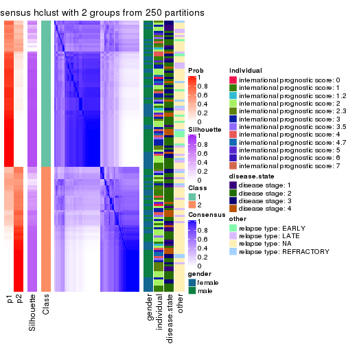</p>

</div>
<div id='tab-MAD-hclust-consensus-heatmap-2'>
<pre><code class="r">consensus_heatmap(res, k = 3)
</code></pre>

<p>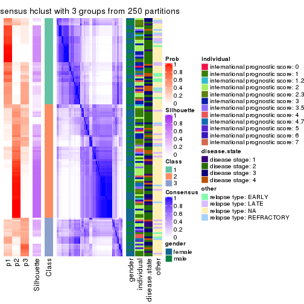</p>

</div>
<div id='tab-MAD-hclust-consensus-heatmap-3'>
<pre><code class="r">consensus_heatmap(res, k = 4)
</code></pre>

<p>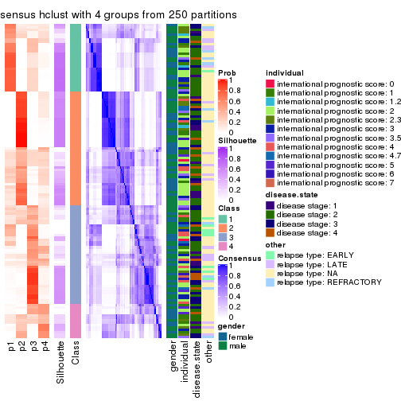</p>

</div>
<div id='tab-MAD-hclust-consensus-heatmap-4'>
<pre><code class="r">consensus_heatmap(res, k = 5)
</code></pre>

<p>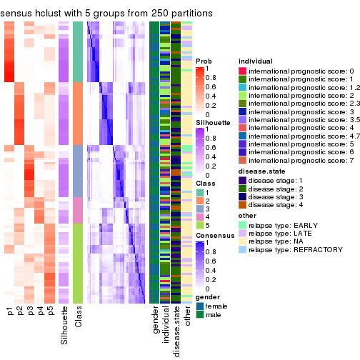</p>

</div>
<div id='tab-MAD-hclust-consensus-heatmap-5'>
<pre><code class="r">consensus_heatmap(res, k = 6)
</code></pre>

<p>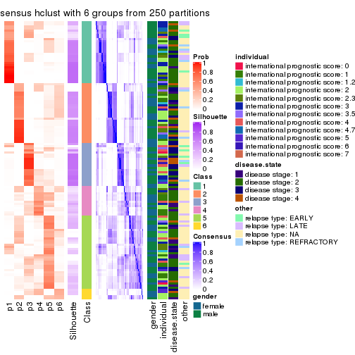</p>

</div>
</div>

Heatmaps for the membership of samples in all partitions to see how consistent they are:


<script>
$( function() {
	$( '#tabs-MAD-hclust-membership-heatmap' ).tabs();
} );
</script>
<div id='tabs-MAD-hclust-membership-heatmap'>
<ul>
<li><a href='#tab-MAD-hclust-membership-heatmap-1'>k = 2</a></li>
<li><a href='#tab-MAD-hclust-membership-heatmap-2'>k = 3</a></li>
<li><a href='#tab-MAD-hclust-membership-heatmap-3'>k = 4</a></li>
<li><a href='#tab-MAD-hclust-membership-heatmap-4'>k = 5</a></li>
<li><a href='#tab-MAD-hclust-membership-heatmap-5'>k = 6</a></li>
</ul>
<div id='tab-MAD-hclust-membership-heatmap-1'>
<pre><code class="r">membership_heatmap(res, k = 2)
</code></pre>

<p>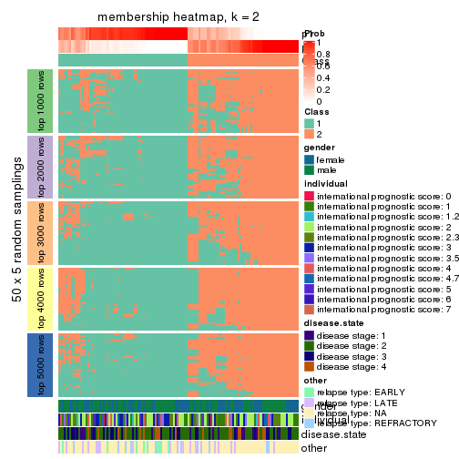</p>

</div>
<div id='tab-MAD-hclust-membership-heatmap-2'>
<pre><code class="r">membership_heatmap(res, k = 3)
</code></pre>

<p>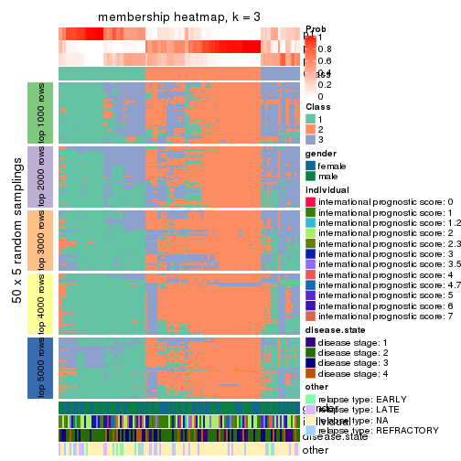</p>

</div>
<div id='tab-MAD-hclust-membership-heatmap-3'>
<pre><code class="r">membership_heatmap(res, k = 4)
</code></pre>

<p>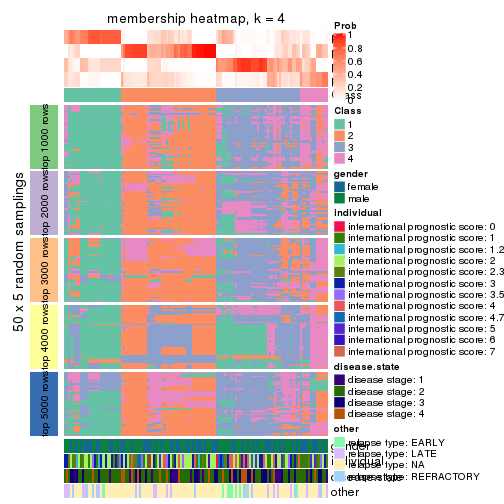</p>

</div>
<div id='tab-MAD-hclust-membership-heatmap-4'>
<pre><code class="r">membership_heatmap(res, k = 5)
</code></pre>

<p>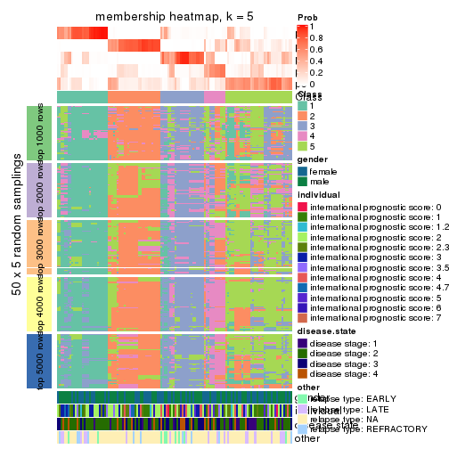</p>

</div>
<div id='tab-MAD-hclust-membership-heatmap-5'>
<pre><code class="r">membership_heatmap(res, k = 6)
</code></pre>

<p>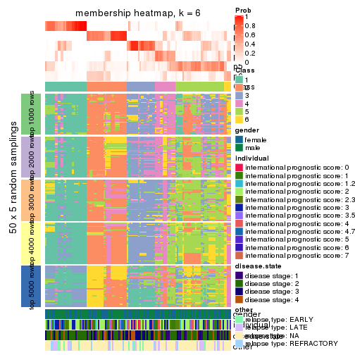</p>

</div>
</div>

As soon as we have had the classes for columns, we can look for signatures
which are significantly different between classes which can be candidate marks
for certain classes. Following are the heatmaps for signatures.


Signature heatmaps where rows are scaled:


<script>
$( function() {
	$( '#tabs-MAD-hclust-get-signatures' ).tabs();
} );
</script>
<div id='tabs-MAD-hclust-get-signatures'>
<ul>
<li><a href='#tab-MAD-hclust-get-signatures-1'>k = 2</a></li>
<li><a href='#tab-MAD-hclust-get-signatures-2'>k = 3</a></li>
<li><a href='#tab-MAD-hclust-get-signatures-3'>k = 4</a></li>
<li><a href='#tab-MAD-hclust-get-signatures-4'>k = 5</a></li>
<li><a href='#tab-MAD-hclust-get-signatures-5'>k = 6</a></li>
</ul>
<div id='tab-MAD-hclust-get-signatures-1'>
<pre><code class="r">get_signatures(res, k = 2)
</code></pre>

<p>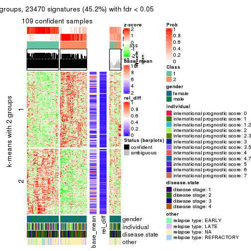</p>

</div>
<div id='tab-MAD-hclust-get-signatures-2'>
<pre><code class="r">get_signatures(res, k = 3)
</code></pre>

<p>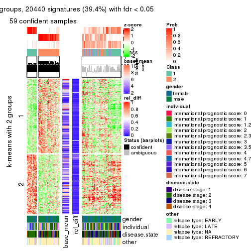</p>

</div>
<div id='tab-MAD-hclust-get-signatures-3'>
<pre><code class="r">get_signatures(res, k = 4)
</code></pre>

<p>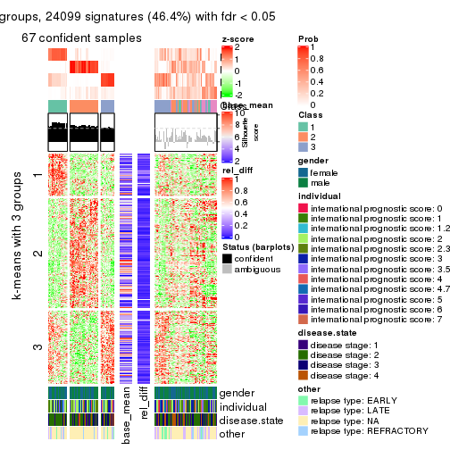</p>

</div>
<div id='tab-MAD-hclust-get-signatures-4'>
<pre><code class="r">get_signatures(res, k = 5)
</code></pre>

<pre><code>#&gt; Error: The width or height of the raster image is zero, maybe you forget to turn off the
#&gt; previous graphic device or it was corrupted. Run `dev.off()` to close it.
</code></pre>

<p></p>

</div>
<div id='tab-MAD-hclust-get-signatures-5'>
<pre><code class="r">get_signatures(res, k = 6)
</code></pre>

<p>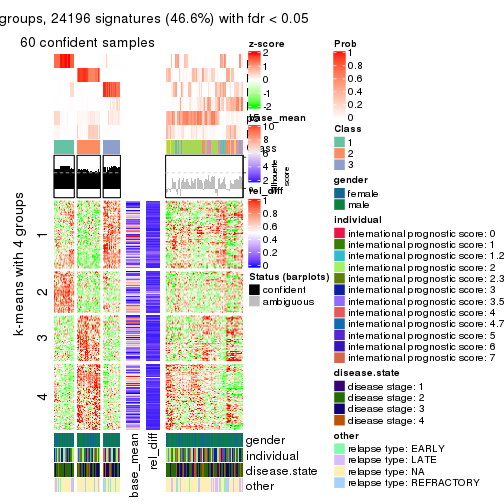</p>

</div>
</div>


Signature heatmaps where rows are not scaled:


<script>
$( function() {
	$( '#tabs-MAD-hclust-get-signatures-no-scale' ).tabs();
} );
</script>
<div id='tabs-MAD-hclust-get-signatures-no-scale'>
<ul>
<li><a href='#tab-MAD-hclust-get-signatures-no-scale-1'>k = 2</a></li>
<li><a href='#tab-MAD-hclust-get-signatures-no-scale-2'>k = 3</a></li>
<li><a href='#tab-MAD-hclust-get-signatures-no-scale-3'>k = 4</a></li>
<li><a href='#tab-MAD-hclust-get-signatures-no-scale-4'>k = 5</a></li>
<li><a href='#tab-MAD-hclust-get-signatures-no-scale-5'>k = 6</a></li>
</ul>
<div id='tab-MAD-hclust-get-signatures-no-scale-1'>
<pre><code class="r">get_signatures(res, k = 2, scale_rows = FALSE)
</code></pre>

<p>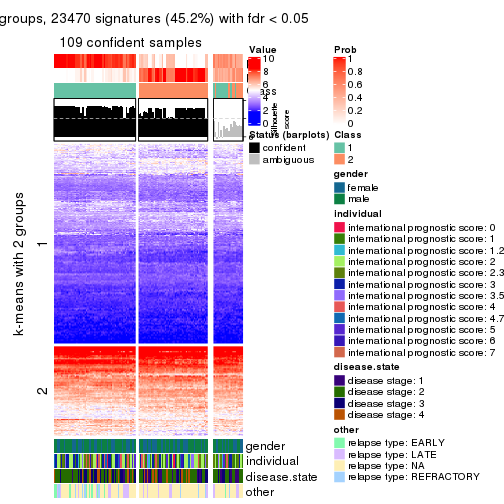</p>

</div>
<div id='tab-MAD-hclust-get-signatures-no-scale-2'>
<pre><code class="r">get_signatures(res, k = 3, scale_rows = FALSE)
</code></pre>

<p>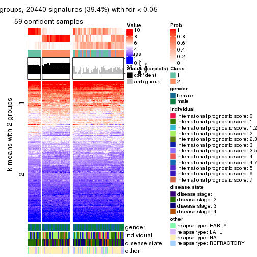</p>

</div>
<div id='tab-MAD-hclust-get-signatures-no-scale-3'>
<pre><code class="r">get_signatures(res, k = 4, scale_rows = FALSE)
</code></pre>

<p>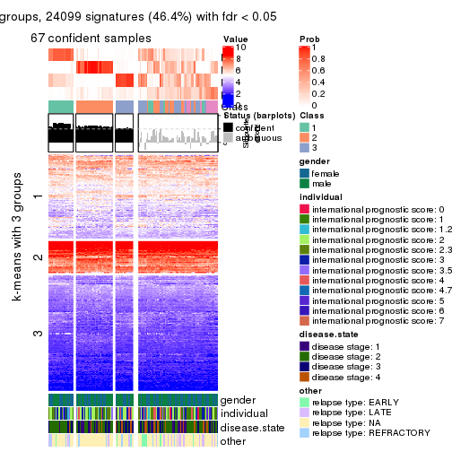</p>

</div>
<div id='tab-MAD-hclust-get-signatures-no-scale-4'>
<pre><code class="r">get_signatures(res, k = 5, scale_rows = FALSE)
</code></pre>

<pre><code>#&gt; Error in mat[ceiling(1:nr/h_ratio), ceiling(1:nc/w_ratio), drop = FALSE]: subscript out of bounds
</code></pre>

<p>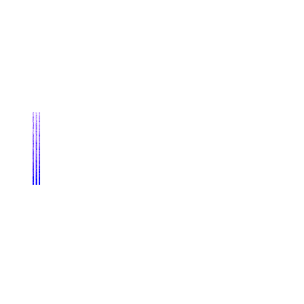</p>

</div>
<div id='tab-MAD-hclust-get-signatures-no-scale-5'>
<pre><code class="r">get_signatures(res, k = 6, scale_rows = FALSE)
</code></pre>

<p>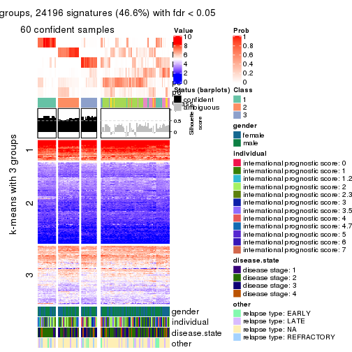</p>

</div>
</div>


Compare the overlap of signatures from different k:

```r
compare_signatures(res)
```

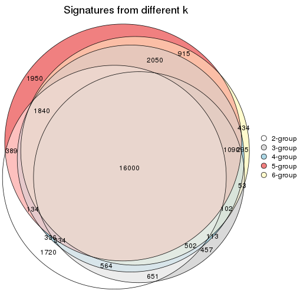

`get_signature()` returns a data frame invisibly. TO get the list of signatures, the function
call should be assigned to a variable explicitly. In following code, if `plot` argument is set
to `FALSE`, no heatmap is plotted while only the differential analysis is performed.

```r
# code only for demonstration
tb = get_signature(res, k = ..., plot = FALSE)
```

An example of the output of `tb` is:

```
#>   which_row         fdr    mean_1    mean_2 scaled_mean_1 scaled_mean_2 km
#> 1        38 0.042760348  8.373488  9.131774    -0.5533452     0.5164555  1
#> 2        40 0.018707592  7.106213  8.469186    -0.6173731     0.5762149  1
#> 3        55 0.019134737 10.221463 11.207825    -0.6159697     0.5749050  1
#> 4        59 0.006059896  5.921854  7.869574    -0.6899429     0.6439467  1
#> 5        60 0.018055526  8.928898 10.211722    -0.6204761     0.5791110  1
#> 6        98 0.009384629 15.714769 14.887706     0.6635654    -0.6193277  2
...
```

The columns in `tb` are:

1. `which_row`: row indices corresponding to the input matrix.
2. `fdr`: FDR for the differential test. 
3. `mean_x`: The mean value in group x.
4. `scaled_mean_x`: The mean value in group x after rows are scaled.
5. `km`: Row groups if k-means clustering is applied to rows.


UMAP plot which shows how samples are separated.


<script>
$( function() {
	$( '#tabs-MAD-hclust-dimension-reduction' ).tabs();
} );
</script>
<div id='tabs-MAD-hclust-dimension-reduction'>
<ul>
<li><a href='#tab-MAD-hclust-dimension-reduction-1'>k = 2</a></li>
<li><a href='#tab-MAD-hclust-dimension-reduction-2'>k = 3</a></li>
<li><a href='#tab-MAD-hclust-dimension-reduction-3'>k = 4</a></li>
<li><a href='#tab-MAD-hclust-dimension-reduction-4'>k = 5</a></li>
<li><a href='#tab-MAD-hclust-dimension-reduction-5'>k = 6</a></li>
</ul>
<div id='tab-MAD-hclust-dimension-reduction-1'>
<pre><code class="r">dimension_reduction(res, k = 2, method = &quot;UMAP&quot;)
</code></pre>

<p>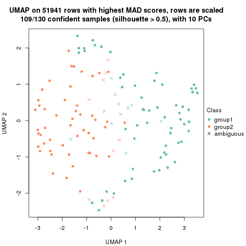</p>

</div>
<div id='tab-MAD-hclust-dimension-reduction-2'>
<pre><code class="r">dimension_reduction(res, k = 3, method = &quot;UMAP&quot;)
</code></pre>

<p>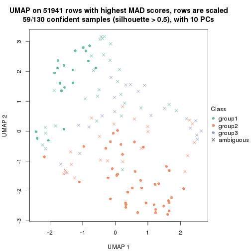</p>

</div>
<div id='tab-MAD-hclust-dimension-reduction-3'>
<pre><code class="r">dimension_reduction(res, k = 4, method = &quot;UMAP&quot;)
</code></pre>

<p>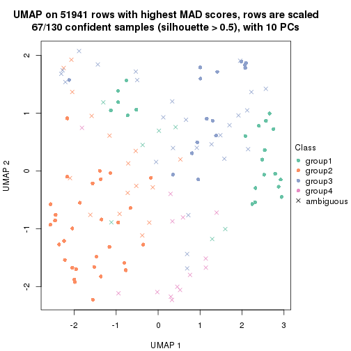</p>

</div>
<div id='tab-MAD-hclust-dimension-reduction-4'>
<pre><code class="r">dimension_reduction(res, k = 5, method = &quot;UMAP&quot;)
</code></pre>

<p>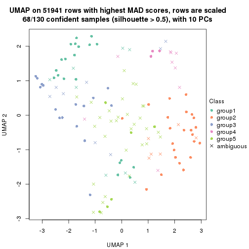</p>

</div>
<div id='tab-MAD-hclust-dimension-reduction-5'>
<pre><code class="r">dimension_reduction(res, k = 6, method = &quot;UMAP&quot;)
</code></pre>

<p>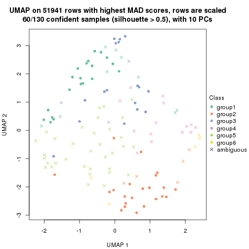</p>

</div>
</div>


Following heatmap shows how subgroups are split when increasing `k`:

```r
collect_classes(res)
```

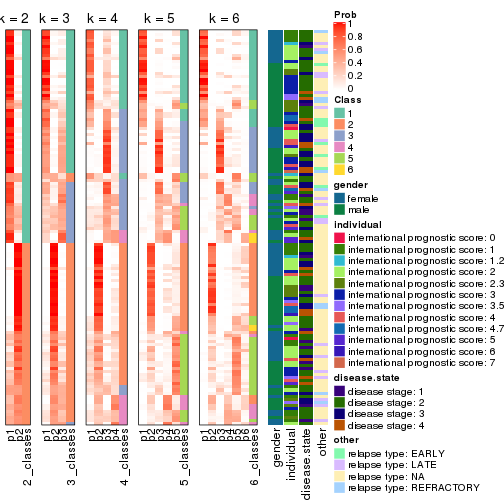


Test correlation between subgroups and known annotations. If the known
annotation is numeric, one-way ANOVA test is applied, and if the known
annotation is discrete, chi-squared contingency table test is applied.

```r
test_to_known_factors(res)
```

```
#>              n gender(p) individual(p) disease.state(p) other(p) k
#> MAD:hclust 109     0.852         0.932           0.2412   0.0204 2
#> MAD:hclust  59     0.913         0.838           0.1407   0.1383 3
#> MAD:hclust  67     0.513         0.364           0.0104   0.2254 4
#> MAD:hclust  68     0.919         0.571           0.0410   0.4963 5
#> MAD:hclust  60     0.667         0.333           0.0100   0.2667 6
```


If matrix rows can be associated to genes, consider to use `GO_Enrichment(res,
...)` to perform function enrichment for the signature genes.


 

---------------------------------------------------


### MAD:kmeans


The object with results only for a single top-value method and a single partition method 
can be extracted as:

```r
res = res_list["MAD", "kmeans"]
# you can also extract it by
# res = res_list["MAD:kmeans"]
```

A summary of `res` and all the functions that can be applied to it:

```r
res
```

```
#> A 'ConsensusPartition' object with k = 2, 3, 4, 5, 6.
#>   On a matrix with 51941 rows and 130 columns.
#>   Top rows (1000, 2000, 3000, 4000, 5000) are extracted by 'MAD' method.
#>   Subgroups are detected by 'kmeans' method.
#>   Performed in total 1250 partitions by row resampling.
#>   Best k for subgroups seems to be 2.
#> 
#> Following methods can be applied to this 'ConsensusPartition' object:
#>  [1] "cola_report"             "collect_classes"         "collect_plots"          
#>  [4] "collect_stats"           "colnames"                "compare_signatures"     
#>  [7] "consensus_heatmap"       "dimension_reduction"     "functional_enrichment"  
#> [10] "get_anno_col"            "get_anno"                "get_classes"            
#> [13] "get_consensus"           "get_matrix"              "get_membership"         
#> [16] "get_param"               "get_signatures"          "get_stats"              
#> [19] "is_best_k"               "is_stable_k"             "membership_heatmap"     
#> [22] "ncol"                    "nrow"                    "plot_ecdf"              
#> [25] "rownames"                "select_partition_number" "show"                   
#> [28] "suggest_best_k"          "test_to_known_factors"
```

`collect_plots()` function collects all the plots made from `res` for all `k` (number of partitions)
into one single page to provide an easy and fast comparison between different `k`.

```r
collect_plots(res)
```

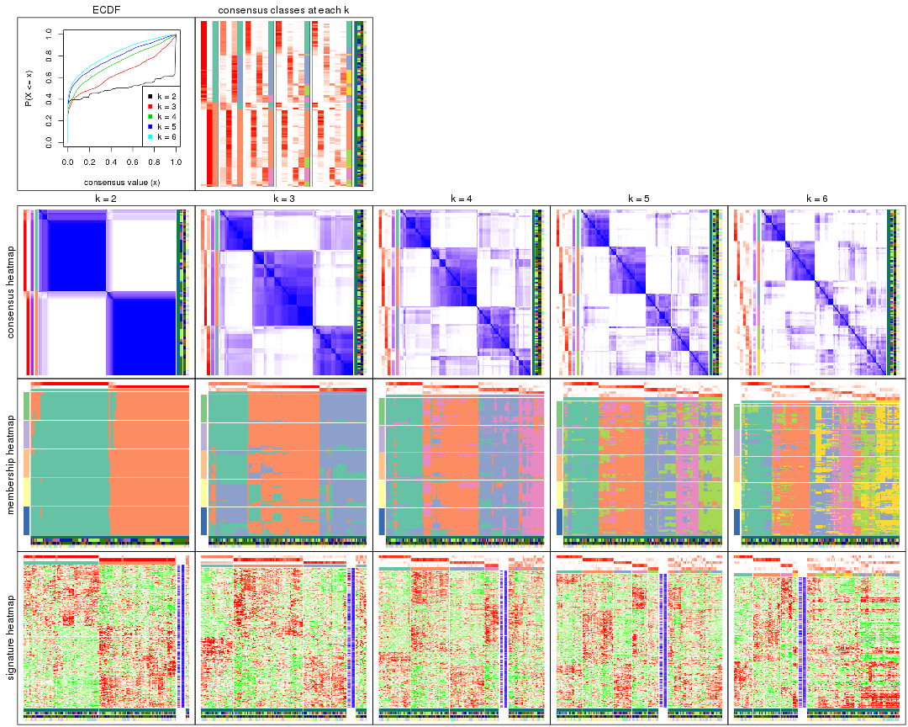

The plots are:

- The first row: a plot of the ECDF (Empirical cumulative distribution
  function) curves of the consensus matrix for each `k` and the heatmap of
  predicted classes for each `k`.
- The second row: heatmaps of the consensus matrix for each `k`.
- The third row: heatmaps of the membership matrix for each `k`.
- The fouth row: heatmaps of the signatures for each `k`.

All the plots in panels can be made by individual functions and they are
plotted later in this section.

`select_partition_number()` produces several plots showing different
statistics for choosing "optimized" `k`. There are following statistics:

- ECDF curves of the consensus matrix for each `k`;
- 1-PAC. [The PAC
  score](https://en.wikipedia.org/wiki/Consensus_clustering#Over-interpretation_potential_of_consensus_clustering)
  measures the proportion of the ambiguous subgrouping.
- Mean silhouette score.
- Concordance. The mean probability of fiting the consensus class ids in all
  partitions.
- Area increased. Denote $A_k$ as the area under the ECDF curve for current
  `k`, the area increased is defined as $A_k - A_{k-1}$.
- Rand index. The percent of pairs of samples that are both in a same cluster
  or both are not in a same cluster in the partition of k and k-1.
- Jaccard index. The ratio of pairs of samples are both in a same cluster in
  the partition of k and k-1 and the pairs of samples are both in a same
  cluster in the partition k or k-1.

The detailed explanations of these statistics can be found in [the cola
vignette](http://bioconductor.org/packages/devel/bioc/vignettes/cola/inst/doc/cola.html#toc_13).

Generally speaking, lower PAC score, higher mean silhouette score or higher
concordance corresponds to better partition. Rand index and Jaccard index
measure how similar the current partition is compared to partition with `k-1`.
If they are too similar, we won't accept `k` is better than `k-1`.

```r
select_partition_number(res)
```

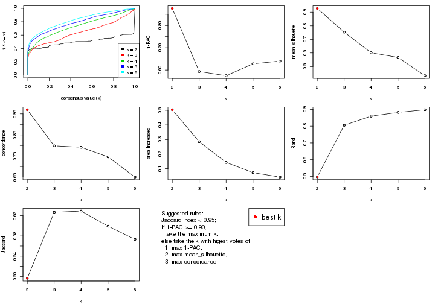

The numeric values for all these statistics can be obtained by `get_stats()`.

```r
get_stats(res)
```

```
#>   k 1-PAC mean_silhouette concordance area_increased  Rand Jaccard
#> 2 2 0.876           0.928       0.969         0.5038 0.496   0.496
#> 3 3 0.593           0.753       0.798         0.2849 0.805   0.627
#> 4 4 0.575           0.601       0.792         0.1430 0.860   0.629
#> 5 5 0.628           0.567       0.746         0.0730 0.882   0.599
#> 6 6 0.640           0.432       0.650         0.0427 0.898   0.573
```

`suggest_best_k()` suggests the best $k$ based on these statistics. The rules are as follows:

- All $k$ with Jaccard index larger than 0.95 are removed because the increase of
  the partition number does not provides enough extra information. If all $k$ are removed,
  the best $k$ is assigned by `NA`.
- For $k$ with 1-PAC larger than 0.9, the maximal $k$ is taken as the "best k". Other $k$ is called "optional k".
- If it does not fit the second rule. The $k$ with the highest vote of highest
  1-PAC, mean silhouette and concordance is taken as the "best k".

```r
suggest_best_k(res)
```

```
#> [1] 2
```


Following shows the table of the partitions (You need to click the **show/hide
code output** link to see it). The membership matrix (columns with name `p*`)
is inferred by
[`clue::cl_consensus()`](https://www.rdocumentation.org/link/cl_consensus?package=clue)
function with the `SE` method. Basically the value in the membership matrix
represents the probability to belong to a certain group. The finall class
label for an item is determined with the group with highest probability it
belongs to.

In `get_classes()` function, the entropy is calculated from the membership
matrix and the silhouette score is calculated from the consensus matrix.


<script>
$( function() {
	$( '#tabs-MAD-kmeans-get-classes' ).tabs();
} );
</script>
<div id='tabs-MAD-kmeans-get-classes'>
<ul>
<li><a href='#tab-MAD-kmeans-get-classes-1'>k = 2</a></li>
<li><a href='#tab-MAD-kmeans-get-classes-2'>k = 3</a></li>
<li><a href='#tab-MAD-kmeans-get-classes-3'>k = 4</a></li>
<li><a href='#tab-MAD-kmeans-get-classes-4'>k = 5</a></li>
<li><a href='#tab-MAD-kmeans-get-classes-5'>k = 6</a></li>
</ul>

<div id='tab-MAD-kmeans-get-classes-1'>
<p><a id='tab-MAD-kmeans-get-classes-1-a' style='color:#0366d6' href='#'>show/hide code output</a></p>
<pre><code class="r">cbind(get_classes(res, k = 2), get_membership(res, k = 2))
</code></pre>

<pre><code>#&gt;           class entropy silhouette    p1    p2
#&gt; GSM447671     2  0.0000      0.971 0.000 1.000
#&gt; GSM447694     1  0.0000      0.964 1.000 0.000
#&gt; GSM447618     2  0.0000      0.971 0.000 1.000
#&gt; GSM447691     2  0.0000      0.971 0.000 1.000
#&gt; GSM447733     1  0.9248      0.518 0.660 0.340
#&gt; GSM447620     2  0.0000      0.971 0.000 1.000
#&gt; GSM447627     1  0.0000      0.964 1.000 0.000
#&gt; GSM447630     2  0.0672      0.964 0.008 0.992
#&gt; GSM447642     1  0.0000      0.964 1.000 0.000
#&gt; GSM447649     2  0.0000      0.971 0.000 1.000
#&gt; GSM447654     2  0.0000      0.971 0.000 1.000
#&gt; GSM447655     2  0.0000      0.971 0.000 1.000
#&gt; GSM447669     2  0.0000      0.971 0.000 1.000
#&gt; GSM447676     1  0.0000      0.964 1.000 0.000
#&gt; GSM447678     2  0.0000      0.971 0.000 1.000
#&gt; GSM447681     2  0.0000      0.971 0.000 1.000
#&gt; GSM447698     2  0.0000      0.971 0.000 1.000
#&gt; GSM447713     1  0.0000      0.964 1.000 0.000
#&gt; GSM447722     2  0.0000      0.971 0.000 1.000
#&gt; GSM447726     2  0.0000      0.971 0.000 1.000
#&gt; GSM447735     1  0.0000      0.964 1.000 0.000
#&gt; GSM447737     1  0.0000      0.964 1.000 0.000
#&gt; GSM447657     2  0.0000      0.971 0.000 1.000
#&gt; GSM447674     2  0.0000      0.971 0.000 1.000
#&gt; GSM447636     2  0.9710      0.357 0.400 0.600
#&gt; GSM447723     1  0.0000      0.964 1.000 0.000
#&gt; GSM447699     1  0.7219      0.760 0.800 0.200
#&gt; GSM447708     2  0.0000      0.971 0.000 1.000
#&gt; GSM447721     1  0.0000      0.964 1.000 0.000
#&gt; GSM447623     1  0.0000      0.964 1.000 0.000
#&gt; GSM447621     1  0.0000      0.964 1.000 0.000
#&gt; GSM447650     2  0.0000      0.971 0.000 1.000
#&gt; GSM447651     2  0.0000      0.971 0.000 1.000
#&gt; GSM447653     1  0.0000      0.964 1.000 0.000
#&gt; GSM447658     1  0.0000      0.964 1.000 0.000
#&gt; GSM447675     2  0.0000      0.971 0.000 1.000
#&gt; GSM447680     2  0.0000      0.971 0.000 1.000
#&gt; GSM447686     2  0.1633      0.949 0.024 0.976
#&gt; GSM447736     1  0.0000      0.964 1.000 0.000
#&gt; GSM447629     2  0.0000      0.971 0.000 1.000
#&gt; GSM447648     1  0.0000      0.964 1.000 0.000
#&gt; GSM447660     1  0.0000      0.964 1.000 0.000
#&gt; GSM447661     2  0.0000      0.971 0.000 1.000
#&gt; GSM447663     1  0.7219      0.760 0.800 0.200
#&gt; GSM447704     2  0.0000      0.971 0.000 1.000
#&gt; GSM447720     1  0.0000      0.964 1.000 0.000
#&gt; GSM447652     2  0.0000      0.971 0.000 1.000
#&gt; GSM447679     2  0.0000      0.971 0.000 1.000
#&gt; GSM447712     1  0.0000      0.964 1.000 0.000
#&gt; GSM447664     2  0.0000      0.971 0.000 1.000
#&gt; GSM447637     1  0.0000      0.964 1.000 0.000
#&gt; GSM447639     1  0.8813      0.599 0.700 0.300
#&gt; GSM447615     1  0.0000      0.964 1.000 0.000
#&gt; GSM447656     2  0.0000      0.971 0.000 1.000
#&gt; GSM447673     2  0.0000      0.971 0.000 1.000
#&gt; GSM447719     1  0.0000      0.964 1.000 0.000
#&gt; GSM447706     1  0.0000      0.964 1.000 0.000
#&gt; GSM447612     1  0.7219      0.760 0.800 0.200
#&gt; GSM447665     2  0.0000      0.971 0.000 1.000
#&gt; GSM447677     2  0.0000      0.971 0.000 1.000
#&gt; GSM447613     1  0.0000      0.964 1.000 0.000
#&gt; GSM447659     1  0.5629      0.842 0.868 0.132
#&gt; GSM447662     1  0.1184      0.952 0.984 0.016
#&gt; GSM447666     1  0.5294      0.850 0.880 0.120
#&gt; GSM447668     2  0.0000      0.971 0.000 1.000
#&gt; GSM447682     2  0.0000      0.971 0.000 1.000
#&gt; GSM447683     2  0.0000      0.971 0.000 1.000
#&gt; GSM447688     2  0.0000      0.971 0.000 1.000
#&gt; GSM447702     2  0.0000      0.971 0.000 1.000
#&gt; GSM447709     2  0.0000      0.971 0.000 1.000
#&gt; GSM447711     1  0.0000      0.964 1.000 0.000
#&gt; GSM447715     2  0.5842      0.824 0.140 0.860
#&gt; GSM447693     1  0.0000      0.964 1.000 0.000
#&gt; GSM447611     2  0.8661      0.606 0.288 0.712
#&gt; GSM447672     2  0.0000      0.971 0.000 1.000
#&gt; GSM447703     2  0.0000      0.971 0.000 1.000
#&gt; GSM447727     1  0.0000      0.964 1.000 0.000
#&gt; GSM447638     2  0.9129      0.528 0.328 0.672
#&gt; GSM447670     1  0.0000      0.964 1.000 0.000
#&gt; GSM447700     2  0.0000      0.971 0.000 1.000
#&gt; GSM447738     2  0.0000      0.971 0.000 1.000
#&gt; GSM447739     1  0.0000      0.964 1.000 0.000
#&gt; GSM447617     1  0.0000      0.964 1.000 0.000
#&gt; GSM447628     2  0.0000      0.971 0.000 1.000
#&gt; GSM447632     2  0.0000      0.971 0.000 1.000
#&gt; GSM447619     1  0.0000      0.964 1.000 0.000
#&gt; GSM447643     2  0.7528      0.722 0.216 0.784
#&gt; GSM447724     1  0.9896      0.260 0.560 0.440
#&gt; GSM447728     2  0.0000      0.971 0.000 1.000
#&gt; GSM447610     1  0.0000      0.964 1.000 0.000
#&gt; GSM447633     2  0.0000      0.971 0.000 1.000
#&gt; GSM447634     1  0.0000      0.964 1.000 0.000
#&gt; GSM447622     1  0.0000      0.964 1.000 0.000
#&gt; GSM447667     2  0.0000      0.971 0.000 1.000
#&gt; GSM447687     2  0.0000      0.971 0.000 1.000
#&gt; GSM447695     1  0.0000      0.964 1.000 0.000
#&gt; GSM447696     1  0.0000      0.964 1.000 0.000
#&gt; GSM447697     1  0.0000      0.964 1.000 0.000
#&gt; GSM447714     1  0.1184      0.952 0.984 0.016
#&gt; GSM447717     1  0.0000      0.964 1.000 0.000
#&gt; GSM447725     1  0.0000      0.964 1.000 0.000
#&gt; GSM447729     2  0.0000      0.971 0.000 1.000
#&gt; GSM447644     2  0.0000      0.971 0.000 1.000
#&gt; GSM447710     1  0.0000      0.964 1.000 0.000
#&gt; GSM447614     1  0.0000      0.964 1.000 0.000
#&gt; GSM447685     2  0.0000      0.971 0.000 1.000
#&gt; GSM447690     1  0.0000      0.964 1.000 0.000
#&gt; GSM447730     2  0.0000      0.971 0.000 1.000
#&gt; GSM447646     2  0.0000      0.971 0.000 1.000
#&gt; GSM447689     1  0.0000      0.964 1.000 0.000
#&gt; GSM447635     2  0.0000      0.971 0.000 1.000
#&gt; GSM447641     1  0.0000      0.964 1.000 0.000
#&gt; GSM447716     2  0.0000      0.971 0.000 1.000
#&gt; GSM447718     1  0.7056      0.771 0.808 0.192
#&gt; GSM447616     1  0.0000      0.964 1.000 0.000
#&gt; GSM447626     1  0.0000      0.964 1.000 0.000
#&gt; GSM447640     2  0.0000      0.971 0.000 1.000
#&gt; GSM447734     1  0.0000      0.964 1.000 0.000
#&gt; GSM447692     1  0.0000      0.964 1.000 0.000
#&gt; GSM447647     2  0.0000      0.971 0.000 1.000
#&gt; GSM447624     1  0.0000      0.964 1.000 0.000
#&gt; GSM447625     1  0.0000      0.964 1.000 0.000
#&gt; GSM447707     2  0.0000      0.971 0.000 1.000
#&gt; GSM447732     1  0.0000      0.964 1.000 0.000
#&gt; GSM447684     1  0.0000      0.964 1.000 0.000
#&gt; GSM447731     2  0.0000      0.971 0.000 1.000
#&gt; GSM447705     2  0.9754      0.259 0.408 0.592
#&gt; GSM447631     1  0.0000      0.964 1.000 0.000
#&gt; GSM447701     2  0.0000      0.971 0.000 1.000
#&gt; GSM447645     1  0.0000      0.964 1.000 0.000
</code></pre>

<script>
$('#tab-MAD-kmeans-get-classes-1-a').parent().next().next().hide();
$('#tab-MAD-kmeans-get-classes-1-a').click(function(){
  $('#tab-MAD-kmeans-get-classes-1-a').parent().next().next().toggle();
  return(false);
});
</script>
</div>

<div id='tab-MAD-kmeans-get-classes-2'>
<p><a id='tab-MAD-kmeans-get-classes-2-a' style='color:#0366d6' href='#'>show/hide code output</a></p>
<pre><code class="r">cbind(get_classes(res, k = 3), get_membership(res, k = 3))
</code></pre>

<pre><code>#&gt;           class entropy silhouette    p1    p2    p3
#&gt; GSM447671     2  0.5004     0.8311 0.072 0.840 0.088
#&gt; GSM447694     3  0.2165     0.7591 0.064 0.000 0.936
#&gt; GSM447618     2  0.5722     0.8409 0.132 0.800 0.068
#&gt; GSM447691     2  0.5012     0.8313 0.080 0.840 0.080
#&gt; GSM447733     3  0.6880     0.5499 0.304 0.036 0.660
#&gt; GSM447620     2  0.3669     0.8599 0.064 0.896 0.040
#&gt; GSM447627     3  0.2261     0.7649 0.068 0.000 0.932
#&gt; GSM447630     2  0.7413     0.6857 0.104 0.692 0.204
#&gt; GSM447642     1  0.5859     0.8004 0.656 0.000 0.344
#&gt; GSM447649     2  0.0237     0.8789 0.004 0.996 0.000
#&gt; GSM447654     2  0.7364     0.6977 0.304 0.640 0.056
#&gt; GSM447655     2  0.0000     0.8790 0.000 1.000 0.000
#&gt; GSM447669     2  0.5174     0.8265 0.076 0.832 0.092
#&gt; GSM447676     1  0.5678     0.7958 0.684 0.000 0.316
#&gt; GSM447678     2  0.6143     0.7414 0.304 0.684 0.012
#&gt; GSM447681     2  0.0237     0.8789 0.004 0.996 0.000
#&gt; GSM447698     2  0.4121     0.8391 0.168 0.832 0.000
#&gt; GSM447713     1  0.6026     0.7877 0.624 0.000 0.376
#&gt; GSM447722     2  0.8821     0.6157 0.304 0.552 0.144
#&gt; GSM447726     2  0.5319     0.8192 0.104 0.824 0.072
#&gt; GSM447735     3  0.4504     0.7280 0.196 0.000 0.804
#&gt; GSM447737     1  0.6252     0.6926 0.556 0.000 0.444
#&gt; GSM447657     2  0.1753     0.8779 0.048 0.952 0.000
#&gt; GSM447674     2  0.0237     0.8789 0.004 0.996 0.000
#&gt; GSM447636     1  0.6894     0.4959 0.692 0.256 0.052
#&gt; GSM447723     1  0.5760     0.7893 0.672 0.000 0.328
#&gt; GSM447699     3  0.1289     0.7885 0.032 0.000 0.968
#&gt; GSM447708     2  0.2261     0.8703 0.068 0.932 0.000
#&gt; GSM447721     1  0.6008     0.7902 0.628 0.000 0.372
#&gt; GSM447623     1  0.6045     0.7851 0.620 0.000 0.380
#&gt; GSM447621     1  0.6045     0.7851 0.620 0.000 0.380
#&gt; GSM447650     2  0.0000     0.8790 0.000 1.000 0.000
#&gt; GSM447651     2  0.1529     0.8744 0.040 0.960 0.000
#&gt; GSM447653     3  0.5138     0.6846 0.252 0.000 0.748
#&gt; GSM447658     1  0.5465     0.7798 0.712 0.000 0.288
#&gt; GSM447675     2  0.7536     0.6883 0.304 0.632 0.064
#&gt; GSM447680     2  0.2356     0.8643 0.072 0.928 0.000
#&gt; GSM447686     2  0.6451     0.3116 0.436 0.560 0.004
#&gt; GSM447736     3  0.0000     0.7925 0.000 0.000 1.000
#&gt; GSM447629     2  0.2537     0.8710 0.080 0.920 0.000
#&gt; GSM447648     3  0.3619     0.6829 0.136 0.000 0.864
#&gt; GSM447660     1  0.5465     0.7798 0.712 0.000 0.288
#&gt; GSM447661     2  0.0000     0.8790 0.000 1.000 0.000
#&gt; GSM447663     3  0.3528     0.7447 0.092 0.016 0.892
#&gt; GSM447704     2  0.0237     0.8789 0.004 0.996 0.000
#&gt; GSM447720     3  0.3272     0.7380 0.104 0.004 0.892
#&gt; GSM447652     2  0.0592     0.8791 0.012 0.988 0.000
#&gt; GSM447679     2  0.0000     0.8790 0.000 1.000 0.000
#&gt; GSM447712     1  0.5859     0.8004 0.656 0.000 0.344
#&gt; GSM447664     2  0.5785     0.7446 0.300 0.696 0.004
#&gt; GSM447637     3  0.3619     0.6829 0.136 0.000 0.864
#&gt; GSM447639     3  0.5285     0.6400 0.244 0.004 0.752
#&gt; GSM447615     1  0.5859     0.8004 0.656 0.000 0.344
#&gt; GSM447656     2  0.2959     0.8581 0.100 0.900 0.000
#&gt; GSM447673     2  0.3619     0.8402 0.136 0.864 0.000
#&gt; GSM447719     3  0.4796     0.7118 0.220 0.000 0.780
#&gt; GSM447706     3  0.3412     0.7038 0.124 0.000 0.876
#&gt; GSM447612     3  0.2492     0.7781 0.048 0.016 0.936
#&gt; GSM447665     2  0.2663     0.8693 0.044 0.932 0.024
#&gt; GSM447677     2  0.1643     0.8738 0.044 0.956 0.000
#&gt; GSM447613     1  0.5859     0.8004 0.656 0.000 0.344
#&gt; GSM447659     3  0.4504     0.6793 0.196 0.000 0.804
#&gt; GSM447662     3  0.0661     0.7925 0.008 0.004 0.988
#&gt; GSM447666     3  0.7884     0.4436 0.100 0.260 0.640
#&gt; GSM447668     2  0.1643     0.8738 0.044 0.956 0.000
#&gt; GSM447682     2  0.0000     0.8790 0.000 1.000 0.000
#&gt; GSM447683     2  0.1643     0.8738 0.044 0.956 0.000
#&gt; GSM447688     2  0.5327     0.7548 0.272 0.728 0.000
#&gt; GSM447702     2  0.0000     0.8790 0.000 1.000 0.000
#&gt; GSM447709     2  0.1643     0.8738 0.044 0.956 0.000
#&gt; GSM447711     1  0.5859     0.8004 0.656 0.000 0.344
#&gt; GSM447715     1  0.7992     0.3153 0.592 0.328 0.080
#&gt; GSM447693     3  0.2356     0.7527 0.072 0.000 0.928
#&gt; GSM447611     1  0.7481     0.0137 0.640 0.296 0.064
#&gt; GSM447672     2  0.0237     0.8789 0.004 0.996 0.000
#&gt; GSM447703     2  0.3619     0.8402 0.136 0.864 0.000
#&gt; GSM447727     1  0.5621     0.7756 0.692 0.000 0.308
#&gt; GSM447638     1  0.7232     0.1161 0.544 0.428 0.028
#&gt; GSM447670     1  0.5882     0.7991 0.652 0.000 0.348
#&gt; GSM447700     2  0.7710     0.7633 0.176 0.680 0.144
#&gt; GSM447738     2  0.3619     0.8402 0.136 0.864 0.000
#&gt; GSM447739     1  0.6008     0.7902 0.628 0.000 0.372
#&gt; GSM447617     1  0.6045     0.7851 0.620 0.000 0.380
#&gt; GSM447628     2  0.5588     0.7488 0.276 0.720 0.004
#&gt; GSM447632     2  0.3551     0.8420 0.132 0.868 0.000
#&gt; GSM447619     3  0.0475     0.7925 0.004 0.004 0.992
#&gt; GSM447643     1  0.6952     0.2703 0.600 0.376 0.024
#&gt; GSM447724     3  0.5988     0.5770 0.304 0.008 0.688
#&gt; GSM447728     2  0.1529     0.8747 0.040 0.960 0.000
#&gt; GSM447610     1  0.5529     0.6585 0.704 0.000 0.296
#&gt; GSM447633     2  0.5506     0.8119 0.092 0.816 0.092
#&gt; GSM447634     3  0.1129     0.7885 0.020 0.004 0.976
#&gt; GSM447622     3  0.4002     0.6438 0.160 0.000 0.840
#&gt; GSM447667     2  0.2537     0.8726 0.080 0.920 0.000
#&gt; GSM447687     2  0.3619     0.8402 0.136 0.864 0.000
#&gt; GSM447695     3  0.0000     0.7925 0.000 0.000 1.000
#&gt; GSM447696     1  0.6026     0.7877 0.624 0.000 0.376
#&gt; GSM447697     1  0.6026     0.7877 0.624 0.000 0.376
#&gt; GSM447714     3  0.0237     0.7932 0.000 0.004 0.996
#&gt; GSM447717     1  0.5497     0.7806 0.708 0.000 0.292
#&gt; GSM447725     1  0.5650     0.7941 0.688 0.000 0.312
#&gt; GSM447729     2  0.5815     0.7417 0.304 0.692 0.004
#&gt; GSM447644     2  0.5582     0.8116 0.100 0.812 0.088
#&gt; GSM447710     3  0.0237     0.7911 0.004 0.000 0.996
#&gt; GSM447614     3  0.4235     0.7367 0.176 0.000 0.824
#&gt; GSM447685     2  0.1529     0.8747 0.040 0.960 0.000
#&gt; GSM447690     1  0.6008     0.7879 0.628 0.000 0.372
#&gt; GSM447730     2  0.0237     0.8789 0.004 0.996 0.000
#&gt; GSM447646     2  0.5588     0.7488 0.276 0.720 0.004
#&gt; GSM447689     3  0.3272     0.7406 0.104 0.004 0.892
#&gt; GSM447635     2  0.7091     0.7807 0.152 0.724 0.124
#&gt; GSM447641     1  0.5706     0.7961 0.680 0.000 0.320
#&gt; GSM447716     2  0.4178     0.8374 0.172 0.828 0.000
#&gt; GSM447718     3  0.3769     0.7314 0.104 0.016 0.880
#&gt; GSM447616     3  0.3879     0.6580 0.152 0.000 0.848
#&gt; GSM447626     3  0.2959     0.7489 0.100 0.000 0.900
#&gt; GSM447640     2  0.0000     0.8790 0.000 1.000 0.000
#&gt; GSM447734     3  0.0237     0.7932 0.000 0.004 0.996
#&gt; GSM447692     3  0.3879     0.6580 0.152 0.000 0.848
#&gt; GSM447647     2  0.5363     0.7516 0.276 0.724 0.000
#&gt; GSM447624     1  0.6252     0.6915 0.556 0.000 0.444
#&gt; GSM447625     3  0.0237     0.7932 0.000 0.004 0.996
#&gt; GSM447707     2  0.0237     0.8789 0.004 0.996 0.000
#&gt; GSM447732     3  0.0475     0.7925 0.004 0.004 0.992
#&gt; GSM447684     1  0.7853     0.5064 0.556 0.060 0.384
#&gt; GSM447731     3  0.9528     0.3631 0.288 0.228 0.484
#&gt; GSM447705     3  0.8014     0.4321 0.104 0.268 0.628
#&gt; GSM447631     3  0.2711     0.7379 0.088 0.000 0.912
#&gt; GSM447701     2  0.1643     0.8738 0.044 0.956 0.000
#&gt; GSM447645     3  0.3619     0.6829 0.136 0.000 0.864
</code></pre>

<script>
$('#tab-MAD-kmeans-get-classes-2-a').parent().next().next().hide();
$('#tab-MAD-kmeans-get-classes-2-a').click(function(){
  $('#tab-MAD-kmeans-get-classes-2-a').parent().next().next().toggle();
  return(false);
});
</script>
</div>

<div id='tab-MAD-kmeans-get-classes-3'>
<p><a id='tab-MAD-kmeans-get-classes-3-a' style='color:#0366d6' href='#'>show/hide code output</a></p>
<pre><code class="r">cbind(get_classes(res, k = 4), get_membership(res, k = 4))
</code></pre>

<pre><code>#&gt;           class entropy silhouette    p1    p2    p3    p4
#&gt; GSM447671     2  0.8079     0.3678 0.056 0.552 0.236 0.156
#&gt; GSM447694     3  0.5121     0.7060 0.120 0.000 0.764 0.116
#&gt; GSM447618     2  0.8501     0.1413 0.052 0.440 0.164 0.344
#&gt; GSM447691     2  0.7900     0.4135 0.056 0.572 0.232 0.140
#&gt; GSM447733     4  0.4304     0.4334 0.000 0.000 0.284 0.716
#&gt; GSM447620     2  0.4430     0.6717 0.056 0.840 0.060 0.044
#&gt; GSM447627     3  0.5781     0.6022 0.072 0.000 0.676 0.252
#&gt; GSM447630     2  0.8230     0.1908 0.056 0.460 0.364 0.120
#&gt; GSM447642     1  0.1833     0.8348 0.944 0.000 0.024 0.032
#&gt; GSM447649     2  0.2081     0.7485 0.000 0.916 0.000 0.084
#&gt; GSM447654     4  0.2593     0.6471 0.000 0.104 0.004 0.892
#&gt; GSM447655     2  0.2081     0.7488 0.000 0.916 0.000 0.084
#&gt; GSM447669     2  0.7900     0.3987 0.056 0.572 0.232 0.140
#&gt; GSM447676     1  0.1209     0.8276 0.964 0.000 0.004 0.032
#&gt; GSM447678     4  0.3390     0.6290 0.000 0.132 0.016 0.852
#&gt; GSM447681     2  0.2861     0.7474 0.000 0.888 0.016 0.096
#&gt; GSM447698     2  0.5478     0.3093 0.000 0.540 0.016 0.444
#&gt; GSM447713     1  0.2256     0.8378 0.924 0.000 0.056 0.020
#&gt; GSM447722     4  0.3611     0.6335 0.000 0.060 0.080 0.860
#&gt; GSM447726     2  0.6931     0.5093 0.056 0.664 0.196 0.084
#&gt; GSM447735     4  0.6538    -0.0802 0.080 0.000 0.392 0.528
#&gt; GSM447737     1  0.5247     0.5246 0.684 0.000 0.284 0.032
#&gt; GSM447657     2  0.4290     0.6805 0.000 0.772 0.016 0.212
#&gt; GSM447674     2  0.2987     0.7458 0.000 0.880 0.016 0.104
#&gt; GSM447636     1  0.2764     0.7923 0.908 0.052 0.004 0.036
#&gt; GSM447723     1  0.2224     0.8057 0.928 0.000 0.040 0.032
#&gt; GSM447699     3  0.4163     0.6536 0.020 0.000 0.792 0.188
#&gt; GSM447708     2  0.3699     0.7097 0.056 0.872 0.020 0.052
#&gt; GSM447721     1  0.2142     0.8387 0.928 0.000 0.056 0.016
#&gt; GSM447623     1  0.3205     0.8045 0.872 0.000 0.104 0.024
#&gt; GSM447621     1  0.3497     0.7863 0.852 0.000 0.124 0.024
#&gt; GSM447650     2  0.2011     0.7496 0.000 0.920 0.000 0.080
#&gt; GSM447651     2  0.0469     0.7520 0.000 0.988 0.000 0.012
#&gt; GSM447653     4  0.5964    -0.0488 0.040 0.000 0.424 0.536
#&gt; GSM447658     1  0.1209     0.8276 0.964 0.000 0.004 0.032
#&gt; GSM447675     4  0.2466     0.6484 0.000 0.096 0.004 0.900
#&gt; GSM447680     2  0.1452     0.7441 0.008 0.956 0.000 0.036
#&gt; GSM447686     1  0.7347     0.1482 0.508 0.368 0.016 0.108
#&gt; GSM447736     3  0.2775     0.7260 0.020 0.000 0.896 0.084
#&gt; GSM447629     2  0.4827     0.6753 0.056 0.800 0.016 0.128
#&gt; GSM447648     3  0.4881     0.6653 0.196 0.000 0.756 0.048
#&gt; GSM447660     1  0.1209     0.8276 0.964 0.000 0.004 0.032
#&gt; GSM447661     2  0.2011     0.7496 0.000 0.920 0.000 0.080
#&gt; GSM447663     3  0.4959     0.6777 0.076 0.060 0.812 0.052
#&gt; GSM447704     2  0.2149     0.7473 0.000 0.912 0.000 0.088
#&gt; GSM447720     3  0.7104     0.5497 0.080 0.084 0.664 0.172
#&gt; GSM447652     2  0.2704     0.7329 0.000 0.876 0.000 0.124
#&gt; GSM447679     2  0.2345     0.7497 0.000 0.900 0.000 0.100
#&gt; GSM447712     1  0.1890     0.8411 0.936 0.000 0.056 0.008
#&gt; GSM447664     4  0.2958     0.6335 0.004 0.116 0.004 0.876
#&gt; GSM447637     3  0.4800     0.6649 0.196 0.000 0.760 0.044
#&gt; GSM447639     4  0.4877     0.1814 0.000 0.000 0.408 0.592
#&gt; GSM447615     1  0.3342     0.8209 0.868 0.000 0.100 0.032
#&gt; GSM447656     2  0.3323     0.7073 0.064 0.876 0.000 0.060
#&gt; GSM447673     2  0.5408     0.3728 0.000 0.576 0.016 0.408
#&gt; GSM447719     3  0.6007     0.2118 0.044 0.000 0.548 0.408
#&gt; GSM447706     3  0.3907     0.7018 0.140 0.000 0.828 0.032
#&gt; GSM447612     3  0.3392     0.7070 0.072 0.000 0.872 0.056
#&gt; GSM447665     2  0.1975     0.7345 0.012 0.944 0.028 0.016
#&gt; GSM447677     2  0.0000     0.7512 0.000 1.000 0.000 0.000
#&gt; GSM447613     1  0.1637     0.8408 0.940 0.000 0.060 0.000
#&gt; GSM447659     3  0.5290     0.1157 0.008 0.000 0.516 0.476
#&gt; GSM447662     3  0.1042     0.7374 0.020 0.000 0.972 0.008
#&gt; GSM447666     3  0.5938     0.4563 0.056 0.236 0.692 0.016
#&gt; GSM447668     2  0.0000     0.7512 0.000 1.000 0.000 0.000
#&gt; GSM447682     2  0.3048     0.7443 0.000 0.876 0.016 0.108
#&gt; GSM447683     2  0.1209     0.7538 0.000 0.964 0.004 0.032
#&gt; GSM447688     4  0.4327     0.5621 0.000 0.216 0.016 0.768
#&gt; GSM447702     2  0.2081     0.7488 0.000 0.916 0.000 0.084
#&gt; GSM447709     2  0.1042     0.7438 0.000 0.972 0.020 0.008
#&gt; GSM447711     1  0.1557     0.8404 0.944 0.000 0.056 0.000
#&gt; GSM447715     1  0.7924     0.4165 0.588 0.216 0.100 0.096
#&gt; GSM447693     3  0.4257     0.6959 0.140 0.000 0.812 0.048
#&gt; GSM447611     4  0.3030     0.6341 0.076 0.028 0.004 0.892
#&gt; GSM447672     2  0.2081     0.7488 0.000 0.916 0.000 0.084
#&gt; GSM447703     2  0.5284     0.4241 0.000 0.616 0.016 0.368
#&gt; GSM447727     1  0.2224     0.8057 0.928 0.000 0.040 0.032
#&gt; GSM447638     2  0.6969     0.1204 0.416 0.504 0.032 0.048
#&gt; GSM447670     1  0.3080     0.8232 0.880 0.000 0.096 0.024
#&gt; GSM447700     4  0.8909     0.0101 0.052 0.332 0.252 0.364
#&gt; GSM447738     2  0.5376     0.3989 0.000 0.588 0.016 0.396
#&gt; GSM447739     1  0.2142     0.8387 0.928 0.000 0.056 0.016
#&gt; GSM447617     1  0.3895     0.7679 0.832 0.000 0.132 0.036
#&gt; GSM447628     4  0.3831     0.5854 0.000 0.204 0.004 0.792
#&gt; GSM447632     2  0.5376     0.3989 0.000 0.588 0.016 0.396
#&gt; GSM447619     3  0.1042     0.7374 0.020 0.000 0.972 0.008
#&gt; GSM447643     1  0.5462     0.5462 0.692 0.264 0.004 0.040
#&gt; GSM447724     4  0.4605     0.3729 0.000 0.000 0.336 0.664
#&gt; GSM447728     2  0.1488     0.7532 0.000 0.956 0.012 0.032
#&gt; GSM447610     1  0.5836     0.5210 0.640 0.000 0.056 0.304
#&gt; GSM447633     2  0.6815     0.4756 0.056 0.660 0.220 0.064
#&gt; GSM447634     3  0.5485     0.6346 0.080 0.008 0.744 0.168
#&gt; GSM447622     3  0.5578     0.5171 0.312 0.000 0.648 0.040
#&gt; GSM447667     2  0.5896     0.6208 0.100 0.728 0.016 0.156
#&gt; GSM447687     2  0.5269     0.4298 0.000 0.620 0.016 0.364
#&gt; GSM447695     3  0.4761     0.6876 0.048 0.000 0.768 0.184
#&gt; GSM447696     1  0.2256     0.8378 0.924 0.000 0.056 0.020
#&gt; GSM447697     1  0.2256     0.8378 0.924 0.000 0.056 0.020
#&gt; GSM447714     3  0.2089     0.7357 0.020 0.000 0.932 0.048
#&gt; GSM447717     1  0.1209     0.8276 0.964 0.000 0.004 0.032
#&gt; GSM447725     1  0.1488     0.8407 0.956 0.000 0.032 0.012
#&gt; GSM447729     4  0.2831     0.6337 0.000 0.120 0.004 0.876
#&gt; GSM447644     2  0.6914     0.4834 0.056 0.656 0.216 0.072
#&gt; GSM447710     3  0.0895     0.7361 0.020 0.000 0.976 0.004
#&gt; GSM447614     4  0.6586    -0.1538 0.080 0.000 0.420 0.500
#&gt; GSM447685     2  0.1576     0.7517 0.000 0.948 0.004 0.048
#&gt; GSM447690     1  0.2256     0.8378 0.924 0.000 0.056 0.020
#&gt; GSM447730     2  0.2149     0.7473 0.000 0.912 0.000 0.088
#&gt; GSM447646     4  0.3751     0.5934 0.000 0.196 0.004 0.800
#&gt; GSM447689     3  0.4209     0.6801 0.084 0.064 0.840 0.012
#&gt; GSM447635     4  0.8922    -0.0230 0.056 0.340 0.236 0.368
#&gt; GSM447641     1  0.0895     0.8305 0.976 0.000 0.004 0.020
#&gt; GSM447716     4  0.6625    -0.1599 0.048 0.424 0.016 0.512
#&gt; GSM447718     3  0.5316     0.6668 0.084 0.068 0.792 0.056
#&gt; GSM447616     3  0.5619     0.5026 0.320 0.000 0.640 0.040
#&gt; GSM447626     3  0.4057     0.6869 0.084 0.056 0.848 0.012
#&gt; GSM447640     2  0.2408     0.7476 0.000 0.896 0.000 0.104
#&gt; GSM447734     3  0.2363     0.7348 0.024 0.000 0.920 0.056
#&gt; GSM447692     3  0.6356     0.5397 0.308 0.000 0.604 0.088
#&gt; GSM447647     4  0.4372     0.5095 0.000 0.268 0.004 0.728
#&gt; GSM447624     1  0.6010    -0.0473 0.488 0.000 0.472 0.040
#&gt; GSM447625     3  0.2174     0.7344 0.020 0.000 0.928 0.052
#&gt; GSM447707     2  0.2216     0.7461 0.000 0.908 0.000 0.092
#&gt; GSM447732     3  0.2099     0.7355 0.020 0.004 0.936 0.040
#&gt; GSM447684     3  0.8166     0.1420 0.380 0.124 0.448 0.048
#&gt; GSM447731     4  0.4801     0.5530 0.000 0.048 0.188 0.764
#&gt; GSM447705     3  0.5206     0.6429 0.056 0.096 0.796 0.052
#&gt; GSM447631     3  0.4842     0.6660 0.192 0.000 0.760 0.048
#&gt; GSM447701     2  0.0336     0.7499 0.000 0.992 0.000 0.008
#&gt; GSM447645     3  0.4800     0.6649 0.196 0.000 0.760 0.044
</code></pre>

<script>
$('#tab-MAD-kmeans-get-classes-3-a').parent().next().next().hide();
$('#tab-MAD-kmeans-get-classes-3-a').click(function(){
  $('#tab-MAD-kmeans-get-classes-3-a').parent().next().next().toggle();
  return(false);
});
</script>
</div>

<div id='tab-MAD-kmeans-get-classes-4'>
<p><a id='tab-MAD-kmeans-get-classes-4-a' style='color:#0366d6' href='#'>show/hide code output</a></p>
<pre><code class="r">cbind(get_classes(res, k = 5), get_membership(res, k = 5))
</code></pre>

<pre><code>#&gt;           class entropy silhouette    p1    p2    p3    p4    p5
#&gt; GSM447671     5  0.4037     0.6229 0.000 0.176 0.012 0.028 0.784
#&gt; GSM447694     3  0.4049     0.6362 0.008 0.000 0.788 0.040 0.164
#&gt; GSM447618     5  0.5475     0.4859 0.004 0.120 0.008 0.180 0.688
#&gt; GSM447691     5  0.4549     0.5358 0.000 0.220 0.004 0.048 0.728
#&gt; GSM447733     4  0.4559     0.6284 0.000 0.000 0.100 0.748 0.152
#&gt; GSM447620     2  0.5525     0.2805 0.000 0.544 0.060 0.004 0.392
#&gt; GSM447627     3  0.4662     0.6116 0.000 0.000 0.736 0.096 0.168
#&gt; GSM447630     5  0.4007     0.6485 0.004 0.128 0.044 0.012 0.812
#&gt; GSM447642     1  0.1365     0.8075 0.952 0.000 0.004 0.004 0.040
#&gt; GSM447649     2  0.1012     0.7670 0.000 0.968 0.000 0.012 0.020
#&gt; GSM447654     4  0.1992     0.7108 0.000 0.044 0.000 0.924 0.032
#&gt; GSM447655     2  0.0671     0.7674 0.000 0.980 0.000 0.016 0.004
#&gt; GSM447669     5  0.3770     0.6282 0.000 0.188 0.008 0.016 0.788
#&gt; GSM447676     1  0.1808     0.8058 0.936 0.000 0.004 0.020 0.040
#&gt; GSM447678     4  0.4517     0.6011 0.004 0.036 0.008 0.744 0.208
#&gt; GSM447681     2  0.2894     0.7613 0.000 0.876 0.004 0.036 0.084
#&gt; GSM447698     2  0.7002     0.2144 0.004 0.380 0.004 0.360 0.252
#&gt; GSM447713     1  0.2416     0.7731 0.888 0.000 0.100 0.000 0.012
#&gt; GSM447722     4  0.5313     0.5191 0.004 0.032 0.020 0.644 0.300
#&gt; GSM447726     5  0.5005     0.4733 0.000 0.300 0.020 0.024 0.656
#&gt; GSM447735     3  0.5928     0.4554 0.000 0.000 0.596 0.212 0.192
#&gt; GSM447737     3  0.5759    -0.0546 0.452 0.000 0.476 0.008 0.064
#&gt; GSM447657     2  0.6096     0.5909 0.004 0.596 0.004 0.148 0.248
#&gt; GSM447674     2  0.2673     0.7651 0.000 0.892 0.004 0.044 0.060
#&gt; GSM447636     1  0.2267     0.7960 0.916 0.008 0.000 0.028 0.048
#&gt; GSM447723     1  0.2110     0.7980 0.912 0.000 0.000 0.016 0.072
#&gt; GSM447699     3  0.5897     0.3501 0.000 0.004 0.496 0.088 0.412
#&gt; GSM447708     2  0.5390     0.3771 0.004 0.536 0.000 0.048 0.412
#&gt; GSM447721     1  0.1943     0.7907 0.924 0.000 0.056 0.000 0.020
#&gt; GSM447623     1  0.4819     0.4468 0.620 0.000 0.352 0.004 0.024
#&gt; GSM447621     1  0.4937     0.4131 0.604 0.000 0.364 0.004 0.028
#&gt; GSM447650     2  0.0807     0.7676 0.000 0.976 0.000 0.012 0.012
#&gt; GSM447651     2  0.1043     0.7628 0.000 0.960 0.000 0.000 0.040
#&gt; GSM447653     4  0.5606     0.3711 0.000 0.000 0.296 0.600 0.104
#&gt; GSM447658     1  0.1818     0.8020 0.932 0.000 0.000 0.024 0.044
#&gt; GSM447675     4  0.1682     0.7083 0.000 0.012 0.004 0.940 0.044
#&gt; GSM447680     2  0.3695     0.7162 0.000 0.800 0.000 0.036 0.164
#&gt; GSM447686     1  0.6702     0.3242 0.524 0.056 0.004 0.072 0.344
#&gt; GSM447736     3  0.5024     0.4790 0.004 0.000 0.596 0.032 0.368
#&gt; GSM447629     2  0.5815     0.4824 0.004 0.552 0.004 0.076 0.364
#&gt; GSM447648     3  0.1243     0.6531 0.028 0.000 0.960 0.004 0.008
#&gt; GSM447660     1  0.1818     0.8020 0.932 0.000 0.000 0.024 0.044
#&gt; GSM447661     2  0.0807     0.7676 0.000 0.976 0.000 0.012 0.012
#&gt; GSM447663     5  0.4341     0.2005 0.004 0.000 0.404 0.000 0.592
#&gt; GSM447704     2  0.0912     0.7669 0.000 0.972 0.000 0.016 0.012
#&gt; GSM447720     5  0.3415     0.5760 0.004 0.004 0.124 0.028 0.840
#&gt; GSM447652     2  0.2408     0.7404 0.000 0.892 0.000 0.092 0.016
#&gt; GSM447679     2  0.1992     0.7687 0.000 0.924 0.000 0.032 0.044
#&gt; GSM447712     1  0.0324     0.8077 0.992 0.000 0.004 0.000 0.004
#&gt; GSM447664     4  0.2569     0.6952 0.012 0.020 0.004 0.904 0.060
#&gt; GSM447637     3  0.1356     0.6507 0.028 0.000 0.956 0.004 0.012
#&gt; GSM447639     4  0.6246     0.3121 0.000 0.000 0.180 0.528 0.292
#&gt; GSM447615     1  0.4054     0.6970 0.760 0.000 0.204 0.000 0.036
#&gt; GSM447656     2  0.5172     0.5426 0.004 0.616 0.000 0.048 0.332
#&gt; GSM447673     2  0.5966     0.3784 0.004 0.536 0.004 0.368 0.088
#&gt; GSM447719     4  0.5352     0.2730 0.000 0.000 0.408 0.536 0.056
#&gt; GSM447706     3  0.2270     0.6359 0.020 0.000 0.904 0.000 0.076
#&gt; GSM447612     5  0.4593    -0.0650 0.004 0.000 0.480 0.004 0.512
#&gt; GSM447665     2  0.4341     0.3486 0.000 0.592 0.000 0.004 0.404
#&gt; GSM447677     2  0.1908     0.7488 0.000 0.908 0.000 0.000 0.092
#&gt; GSM447613     1  0.0162     0.8071 0.996 0.000 0.004 0.000 0.000
#&gt; GSM447659     4  0.6252     0.2401 0.000 0.000 0.328 0.508 0.164
#&gt; GSM447662     3  0.3968     0.4748 0.004 0.000 0.716 0.004 0.276
#&gt; GSM447666     5  0.5196     0.4183 0.004 0.040 0.380 0.000 0.576
#&gt; GSM447668     2  0.1544     0.7597 0.000 0.932 0.000 0.000 0.068
#&gt; GSM447682     2  0.3062     0.7629 0.004 0.868 0.000 0.048 0.080
#&gt; GSM447683     2  0.3321     0.7401 0.000 0.832 0.000 0.032 0.136
#&gt; GSM447688     4  0.5554     0.5140 0.004 0.224 0.004 0.660 0.108
#&gt; GSM447702     2  0.0671     0.7674 0.000 0.980 0.000 0.016 0.004
#&gt; GSM447709     2  0.3333     0.6441 0.000 0.788 0.000 0.004 0.208
#&gt; GSM447711     1  0.0162     0.8071 0.996 0.000 0.004 0.000 0.000
#&gt; GSM447715     1  0.6179     0.1906 0.480 0.032 0.000 0.060 0.428
#&gt; GSM447693     3  0.1059     0.6509 0.008 0.000 0.968 0.004 0.020
#&gt; GSM447611     4  0.1399     0.7038 0.028 0.000 0.000 0.952 0.020
#&gt; GSM447672     2  0.0798     0.7678 0.000 0.976 0.000 0.016 0.008
#&gt; GSM447703     2  0.4972     0.4055 0.000 0.612 0.004 0.352 0.032
#&gt; GSM447727     1  0.2172     0.7966 0.908 0.000 0.000 0.016 0.076
#&gt; GSM447638     1  0.7692     0.0487 0.404 0.208 0.028 0.020 0.340
#&gt; GSM447670     1  0.3241     0.7495 0.832 0.000 0.144 0.000 0.024
#&gt; GSM447700     5  0.4038     0.5727 0.000 0.032 0.028 0.132 0.808
#&gt; GSM447738     2  0.6010     0.3756 0.004 0.532 0.004 0.368 0.092
#&gt; GSM447739     1  0.1670     0.7937 0.936 0.000 0.052 0.000 0.012
#&gt; GSM447617     1  0.5036     0.2166 0.520 0.000 0.452 0.004 0.024
#&gt; GSM447628     4  0.2179     0.6981 0.000 0.112 0.000 0.888 0.000
#&gt; GSM447632     2  0.6053     0.3689 0.004 0.528 0.004 0.368 0.096
#&gt; GSM447619     3  0.3734     0.5172 0.004 0.000 0.752 0.004 0.240
#&gt; GSM447643     1  0.3871     0.7351 0.824 0.040 0.000 0.024 0.112
#&gt; GSM447724     4  0.6234     0.3785 0.000 0.000 0.160 0.508 0.332
#&gt; GSM447728     2  0.3276     0.7425 0.000 0.836 0.000 0.032 0.132
#&gt; GSM447610     1  0.7533     0.1912 0.428 0.000 0.204 0.312 0.056
#&gt; GSM447633     5  0.4672     0.5428 0.000 0.284 0.032 0.004 0.680
#&gt; GSM447634     5  0.4977     0.3435 0.008 0.000 0.256 0.052 0.684
#&gt; GSM447622     3  0.3597     0.6157 0.116 0.000 0.832 0.008 0.044
#&gt; GSM447667     2  0.6742     0.4420 0.036 0.504 0.004 0.100 0.356
#&gt; GSM447687     2  0.4986     0.4298 0.000 0.624 0.004 0.336 0.036
#&gt; GSM447695     3  0.4908     0.6064 0.012 0.000 0.716 0.060 0.212
#&gt; GSM447696     1  0.2624     0.7635 0.872 0.000 0.116 0.000 0.012
#&gt; GSM447697     1  0.3039     0.7350 0.836 0.000 0.152 0.000 0.012
#&gt; GSM447714     3  0.4347     0.4574 0.004 0.000 0.636 0.004 0.356
#&gt; GSM447717     1  0.1408     0.8062 0.948 0.000 0.000 0.008 0.044
#&gt; GSM447725     1  0.0727     0.8085 0.980 0.000 0.004 0.004 0.012
#&gt; GSM447729     4  0.1493     0.7046 0.000 0.024 0.000 0.948 0.028
#&gt; GSM447644     5  0.4401     0.5261 0.000 0.296 0.016 0.004 0.684
#&gt; GSM447710     3  0.3844     0.5012 0.004 0.000 0.736 0.004 0.256
#&gt; GSM447614     3  0.6529     0.1248 0.004 0.000 0.468 0.352 0.176
#&gt; GSM447685     2  0.3950     0.7284 0.004 0.796 0.000 0.048 0.152
#&gt; GSM447690     1  0.2416     0.7731 0.888 0.000 0.100 0.000 0.012
#&gt; GSM447730     2  0.1195     0.7638 0.000 0.960 0.000 0.028 0.012
#&gt; GSM447646     4  0.2179     0.6981 0.000 0.112 0.000 0.888 0.000
#&gt; GSM447689     5  0.4415     0.3183 0.004 0.000 0.444 0.000 0.552
#&gt; GSM447635     5  0.3946     0.5722 0.008 0.032 0.012 0.132 0.816
#&gt; GSM447641     1  0.1202     0.8080 0.960 0.000 0.004 0.004 0.032
#&gt; GSM447716     4  0.7212    -0.1694 0.012 0.312 0.004 0.396 0.276
#&gt; GSM447718     5  0.4287     0.4687 0.004 0.008 0.284 0.004 0.700
#&gt; GSM447616     3  0.3967     0.6130 0.124 0.000 0.808 0.008 0.060
#&gt; GSM447626     3  0.4420    -0.0575 0.004 0.000 0.548 0.000 0.448
#&gt; GSM447640     2  0.2074     0.7689 0.000 0.920 0.000 0.044 0.036
#&gt; GSM447734     3  0.4166     0.5114 0.000 0.000 0.648 0.004 0.348
#&gt; GSM447692     3  0.5656     0.6046 0.128 0.000 0.696 0.036 0.140
#&gt; GSM447647     4  0.3171     0.6551 0.000 0.176 0.000 0.816 0.008
#&gt; GSM447624     3  0.4535     0.3718 0.288 0.000 0.684 0.004 0.024
#&gt; GSM447625     3  0.4389     0.4788 0.004 0.000 0.624 0.004 0.368
#&gt; GSM447707     2  0.1195     0.7638 0.000 0.960 0.000 0.028 0.012
#&gt; GSM447732     3  0.4288     0.4407 0.004 0.000 0.612 0.000 0.384
#&gt; GSM447684     5  0.6194     0.4694 0.140 0.016 0.192 0.012 0.640
#&gt; GSM447731     4  0.4389     0.6696 0.000 0.048 0.076 0.804 0.072
#&gt; GSM447705     5  0.4405     0.4342 0.004 0.004 0.332 0.004 0.656
#&gt; GSM447631     3  0.1173     0.6521 0.020 0.000 0.964 0.004 0.012
#&gt; GSM447701     2  0.2074     0.7408 0.000 0.896 0.000 0.000 0.104
#&gt; GSM447645     3  0.1356     0.6507 0.028 0.000 0.956 0.004 0.012
</code></pre>

<script>
$('#tab-MAD-kmeans-get-classes-4-a').parent().next().next().hide();
$('#tab-MAD-kmeans-get-classes-4-a').click(function(){
  $('#tab-MAD-kmeans-get-classes-4-a').parent().next().next().toggle();
  return(false);
});
</script>
</div>

<div id='tab-MAD-kmeans-get-classes-5'>
<p><a id='tab-MAD-kmeans-get-classes-5-a' style='color:#0366d6' href='#'>show/hide code output</a></p>
<pre><code class="r">cbind(get_classes(res, k = 6), get_membership(res, k = 6))
</code></pre>

<pre><code>#&gt;           class entropy silhouette    p1    p2    p3    p4    p5    p6
#&gt; GSM447671     5  0.5223    0.34626 0.000 0.048 0.012 0.024 0.632 0.284
#&gt; GSM447694     3  0.5783    0.32258 0.000 0.000 0.604 0.048 0.112 0.236
#&gt; GSM447618     5  0.4260    0.44381 0.000 0.024 0.004 0.104 0.776 0.092
#&gt; GSM447691     5  0.4592    0.42387 0.000 0.076 0.000 0.004 0.680 0.240
#&gt; GSM447733     4  0.5685    0.55131 0.000 0.000 0.112 0.648 0.164 0.076
#&gt; GSM447620     5  0.6304    0.15078 0.000 0.388 0.016 0.004 0.412 0.180
#&gt; GSM447627     3  0.6395    0.30144 0.000 0.000 0.572 0.120 0.128 0.180
#&gt; GSM447630     6  0.5773   -0.16201 0.000 0.116 0.008 0.004 0.432 0.440
#&gt; GSM447642     1  0.0436    0.72261 0.988 0.000 0.004 0.004 0.004 0.000
#&gt; GSM447649     2  0.2113    0.72616 0.000 0.920 0.012 0.032 0.028 0.008
#&gt; GSM447654     4  0.1967    0.68742 0.004 0.016 0.036 0.928 0.012 0.004
#&gt; GSM447655     2  0.0260    0.73124 0.000 0.992 0.000 0.008 0.000 0.000
#&gt; GSM447669     5  0.5524    0.23839 0.000 0.120 0.000 0.004 0.504 0.372
#&gt; GSM447676     1  0.0653    0.72142 0.980 0.000 0.004 0.004 0.012 0.000
#&gt; GSM447678     4  0.4944    0.19301 0.004 0.012 0.012 0.484 0.476 0.012
#&gt; GSM447681     2  0.2907    0.68694 0.000 0.828 0.000 0.020 0.152 0.000
#&gt; GSM447698     5  0.5948    0.17647 0.000 0.236 0.004 0.236 0.520 0.004
#&gt; GSM447713     1  0.4010    0.46808 0.584 0.000 0.408 0.000 0.008 0.000
#&gt; GSM447722     5  0.5503   -0.03464 0.000 0.008 0.016 0.344 0.560 0.072
#&gt; GSM447726     5  0.7232    0.28694 0.072 0.164 0.012 0.004 0.392 0.356
#&gt; GSM447735     3  0.6706    0.26504 0.000 0.000 0.524 0.176 0.192 0.108
#&gt; GSM447737     3  0.4563    0.32040 0.232 0.000 0.700 0.000 0.028 0.040
#&gt; GSM447657     2  0.5159    0.18085 0.000 0.480 0.000 0.072 0.444 0.004
#&gt; GSM447674     2  0.2445    0.71420 0.000 0.872 0.000 0.020 0.108 0.000
#&gt; GSM447636     1  0.0603    0.71939 0.980 0.000 0.000 0.004 0.016 0.000
#&gt; GSM447723     1  0.1722    0.71086 0.936 0.000 0.016 0.008 0.036 0.004
#&gt; GSM447699     6  0.6868    0.32450 0.000 0.000 0.224 0.056 0.336 0.384
#&gt; GSM447708     5  0.4931    0.20569 0.004 0.336 0.012 0.000 0.604 0.044
#&gt; GSM447721     1  0.3887    0.53554 0.632 0.000 0.360 0.000 0.008 0.000
#&gt; GSM447623     3  0.3965   -0.00585 0.376 0.000 0.616 0.000 0.004 0.004
#&gt; GSM447621     3  0.4058    0.00695 0.372 0.000 0.616 0.000 0.004 0.008
#&gt; GSM447650     2  0.0000    0.73059 0.000 1.000 0.000 0.000 0.000 0.000
#&gt; GSM447651     2  0.2136    0.71021 0.000 0.908 0.012 0.000 0.064 0.016
#&gt; GSM447653     4  0.5722    0.49414 0.004 0.000 0.176 0.648 0.108 0.064
#&gt; GSM447658     1  0.0508    0.72010 0.984 0.000 0.000 0.004 0.012 0.000
#&gt; GSM447675     4  0.2452    0.67688 0.004 0.000 0.028 0.884 0.084 0.000
#&gt; GSM447680     2  0.5675    0.47746 0.080 0.616 0.012 0.004 0.264 0.024
#&gt; GSM447686     1  0.4502    0.13690 0.532 0.000 0.004 0.016 0.444 0.004
#&gt; GSM447736     6  0.6711    0.33309 0.000 0.000 0.280 0.048 0.232 0.440
#&gt; GSM447629     5  0.5656    0.21228 0.068 0.292 0.004 0.024 0.600 0.012
#&gt; GSM447648     3  0.4460    0.24127 0.000 0.000 0.520 0.000 0.028 0.452
#&gt; GSM447660     1  0.0653    0.72112 0.980 0.000 0.004 0.004 0.012 0.000
#&gt; GSM447661     2  0.0000    0.73059 0.000 1.000 0.000 0.000 0.000 0.000
#&gt; GSM447663     6  0.4705    0.49244 0.000 0.012 0.064 0.004 0.228 0.692
#&gt; GSM447704     2  0.2113    0.72616 0.000 0.920 0.012 0.032 0.028 0.008
#&gt; GSM447720     5  0.5698   -0.09328 0.012 0.000 0.056 0.024 0.456 0.452
#&gt; GSM447652     2  0.1867    0.71690 0.000 0.916 0.000 0.064 0.020 0.000
#&gt; GSM447679     2  0.2094    0.72243 0.000 0.900 0.000 0.020 0.080 0.000
#&gt; GSM447712     1  0.2513    0.70186 0.852 0.000 0.140 0.000 0.008 0.000
#&gt; GSM447664     4  0.4115    0.58822 0.052 0.004 0.004 0.744 0.196 0.000
#&gt; GSM447637     3  0.4724    0.23736 0.004 0.000 0.508 0.004 0.028 0.456
#&gt; GSM447639     4  0.7284    0.19645 0.000 0.000 0.132 0.408 0.260 0.200
#&gt; GSM447615     1  0.5775    0.35872 0.572 0.000 0.288 0.004 0.024 0.112
#&gt; GSM447656     5  0.6770   -0.00435 0.136 0.376 0.012 0.008 0.432 0.036
#&gt; GSM447673     2  0.6046    0.29029 0.000 0.452 0.000 0.312 0.232 0.004
#&gt; GSM447719     4  0.6175    0.41289 0.004 0.000 0.192 0.580 0.048 0.176
#&gt; GSM447706     6  0.4508   -0.09442 0.000 0.000 0.436 0.004 0.024 0.536
#&gt; GSM447612     6  0.4696    0.51779 0.000 0.000 0.076 0.012 0.224 0.688
#&gt; GSM447665     2  0.5661   -0.13270 0.000 0.476 0.004 0.000 0.384 0.136
#&gt; GSM447677     2  0.3375    0.65032 0.000 0.808 0.012 0.000 0.156 0.024
#&gt; GSM447613     1  0.2631    0.69541 0.840 0.000 0.152 0.000 0.008 0.000
#&gt; GSM447659     4  0.7048    0.33112 0.000 0.000 0.176 0.480 0.160 0.184
#&gt; GSM447662     6  0.3104    0.42038 0.000 0.000 0.204 0.004 0.004 0.788
#&gt; GSM447666     6  0.4210    0.42969 0.020 0.004 0.048 0.004 0.152 0.772
#&gt; GSM447668     2  0.1956    0.70722 0.000 0.908 0.004 0.000 0.080 0.008
#&gt; GSM447682     2  0.3168    0.68690 0.000 0.804 0.000 0.024 0.172 0.000
#&gt; GSM447683     2  0.4073    0.61814 0.000 0.724 0.004 0.020 0.240 0.012
#&gt; GSM447688     4  0.6066    0.21186 0.000 0.204 0.004 0.472 0.316 0.004
#&gt; GSM447702     2  0.0146    0.73086 0.000 0.996 0.000 0.004 0.000 0.000
#&gt; GSM447709     2  0.4653    0.52080 0.000 0.716 0.016 0.004 0.192 0.072
#&gt; GSM447711     1  0.2743    0.69048 0.828 0.000 0.164 0.000 0.008 0.000
#&gt; GSM447715     1  0.4962    0.13465 0.536 0.000 0.004 0.008 0.412 0.040
#&gt; GSM447693     3  0.4601    0.21797 0.000 0.000 0.496 0.004 0.028 0.472
#&gt; GSM447611     4  0.2620    0.67900 0.028 0.000 0.052 0.888 0.032 0.000
#&gt; GSM447672     2  0.0717    0.73260 0.000 0.976 0.000 0.016 0.008 0.000
#&gt; GSM447703     2  0.5082    0.42846 0.000 0.600 0.004 0.316 0.076 0.004
#&gt; GSM447727     1  0.1194    0.71350 0.956 0.000 0.004 0.008 0.032 0.000
#&gt; GSM447638     1  0.7082    0.19567 0.544 0.100 0.020 0.008 0.184 0.144
#&gt; GSM447670     1  0.5298    0.47990 0.624 0.000 0.268 0.004 0.016 0.088
#&gt; GSM447700     5  0.4798    0.26695 0.000 0.004 0.024 0.048 0.684 0.240
#&gt; GSM447738     2  0.6205    0.20073 0.000 0.392 0.000 0.288 0.316 0.004
#&gt; GSM447739     1  0.3847    0.54695 0.644 0.000 0.348 0.000 0.008 0.000
#&gt; GSM447617     3  0.3809    0.17421 0.304 0.000 0.684 0.000 0.004 0.008
#&gt; GSM447628     4  0.2706    0.66318 0.000 0.068 0.004 0.880 0.040 0.008
#&gt; GSM447632     2  0.6202    0.20227 0.000 0.392 0.000 0.284 0.320 0.004
#&gt; GSM447619     6  0.4034    0.27409 0.000 0.000 0.280 0.004 0.024 0.692
#&gt; GSM447643     1  0.2757    0.63730 0.848 0.000 0.004 0.004 0.136 0.008
#&gt; GSM447724     5  0.6956   -0.07414 0.000 0.000 0.104 0.244 0.468 0.184
#&gt; GSM447728     2  0.3514    0.65885 0.000 0.768 0.000 0.020 0.208 0.004
#&gt; GSM447610     3  0.7149    0.19821 0.212 0.000 0.448 0.260 0.064 0.016
#&gt; GSM447633     5  0.6269    0.24534 0.000 0.172 0.016 0.004 0.412 0.396
#&gt; GSM447634     6  0.6451    0.30342 0.004 0.000 0.156 0.040 0.316 0.484
#&gt; GSM447622     3  0.4041    0.46738 0.040 0.000 0.760 0.004 0.012 0.184
#&gt; GSM447667     5  0.6017    0.26267 0.124 0.244 0.004 0.024 0.592 0.012
#&gt; GSM447687     2  0.5157    0.43713 0.000 0.596 0.004 0.312 0.084 0.004
#&gt; GSM447695     3  0.6259    0.21947 0.000 0.000 0.548 0.048 0.196 0.208
#&gt; GSM447696     1  0.4062    0.41809 0.552 0.000 0.440 0.000 0.008 0.000
#&gt; GSM447697     1  0.4067    0.40950 0.548 0.000 0.444 0.000 0.008 0.000
#&gt; GSM447714     6  0.4467    0.47782 0.000 0.000 0.192 0.004 0.092 0.712
#&gt; GSM447717     1  0.0508    0.72340 0.984 0.000 0.012 0.000 0.004 0.000
#&gt; GSM447725     1  0.2191    0.70727 0.876 0.000 0.120 0.000 0.004 0.000
#&gt; GSM447729     4  0.2312    0.66245 0.008 0.012 0.004 0.896 0.080 0.000
#&gt; GSM447644     5  0.5974    0.26815 0.000 0.192 0.004 0.000 0.424 0.380
#&gt; GSM447710     6  0.3298    0.40016 0.000 0.000 0.236 0.000 0.008 0.756
#&gt; GSM447614     3  0.6774    0.17228 0.000 0.000 0.492 0.260 0.144 0.104
#&gt; GSM447685     2  0.4899    0.56227 0.020 0.664 0.012 0.016 0.276 0.012
#&gt; GSM447690     1  0.4010    0.46808 0.584 0.000 0.408 0.000 0.008 0.000
#&gt; GSM447730     2  0.2596    0.71617 0.000 0.892 0.012 0.056 0.032 0.008
#&gt; GSM447646     4  0.2716    0.66445 0.000 0.064 0.004 0.880 0.044 0.008
#&gt; GSM447689     6  0.3570    0.50768 0.012 0.000 0.056 0.004 0.108 0.820
#&gt; GSM447635     5  0.3894    0.40526 0.004 0.004 0.016 0.028 0.784 0.164
#&gt; GSM447641     1  0.1204    0.71907 0.944 0.000 0.056 0.000 0.000 0.000
#&gt; GSM447716     5  0.6628    0.18968 0.056 0.176 0.004 0.232 0.528 0.004
#&gt; GSM447718     6  0.5353    0.37759 0.016 0.016 0.028 0.020 0.288 0.632
#&gt; GSM447616     3  0.3183    0.48593 0.040 0.000 0.828 0.004 0.000 0.128
#&gt; GSM447626     6  0.3907    0.51331 0.020 0.000 0.112 0.004 0.064 0.800
#&gt; GSM447640     2  0.2094    0.72442 0.000 0.900 0.000 0.020 0.080 0.000
#&gt; GSM447734     6  0.5485    0.44045 0.000 0.000 0.268 0.020 0.112 0.600
#&gt; GSM447692     3  0.4437    0.46379 0.032 0.000 0.784 0.032 0.052 0.100
#&gt; GSM447647     4  0.3794    0.61140 0.000 0.144 0.004 0.788 0.060 0.004
#&gt; GSM447624     3  0.4656    0.47306 0.112 0.000 0.720 0.000 0.016 0.152
#&gt; GSM447625     6  0.5486    0.45641 0.000 0.000 0.260 0.020 0.116 0.604
#&gt; GSM447707     2  0.2290    0.71610 0.000 0.904 0.008 0.060 0.024 0.004
#&gt; GSM447732     6  0.5088    0.52417 0.000 0.004 0.208 0.012 0.108 0.668
#&gt; GSM447684     6  0.6903    0.00573 0.248 0.004 0.036 0.008 0.260 0.444
#&gt; GSM447731     4  0.3838    0.66257 0.004 0.056 0.032 0.824 0.008 0.076
#&gt; GSM447705     6  0.3665    0.37859 0.000 0.000 0.004 0.004 0.296 0.696
#&gt; GSM447631     3  0.4726    0.23365 0.004 0.000 0.504 0.004 0.028 0.460
#&gt; GSM447701     2  0.2821    0.67019 0.000 0.860 0.004 0.000 0.096 0.040
#&gt; GSM447645     3  0.4724    0.23736 0.004 0.000 0.508 0.004 0.028 0.456
</code></pre>

<script>
$('#tab-MAD-kmeans-get-classes-5-a').parent().next().next().hide();
$('#tab-MAD-kmeans-get-classes-5-a').click(function(){
  $('#tab-MAD-kmeans-get-classes-5-a').parent().next().next().toggle();
  return(false);
});
</script>
</div>
</div>

Heatmaps for the consensus matrix. It visualizes the probability of two
samples to be in a same group.


<script>
$( function() {
	$( '#tabs-MAD-kmeans-consensus-heatmap' ).tabs();
} );
</script>
<div id='tabs-MAD-kmeans-consensus-heatmap'>
<ul>
<li><a href='#tab-MAD-kmeans-consensus-heatmap-1'>k = 2</a></li>
<li><a href='#tab-MAD-kmeans-consensus-heatmap-2'>k = 3</a></li>
<li><a href='#tab-MAD-kmeans-consensus-heatmap-3'>k = 4</a></li>
<li><a href='#tab-MAD-kmeans-consensus-heatmap-4'>k = 5</a></li>
<li><a href='#tab-MAD-kmeans-consensus-heatmap-5'>k = 6</a></li>
</ul>
<div id='tab-MAD-kmeans-consensus-heatmap-1'>
<pre><code class="r">consensus_heatmap(res, k = 2)
</code></pre>

<p>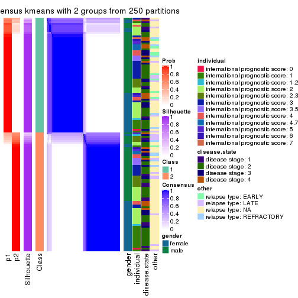</p>

</div>
<div id='tab-MAD-kmeans-consensus-heatmap-2'>
<pre><code class="r">consensus_heatmap(res, k = 3)
</code></pre>

<p>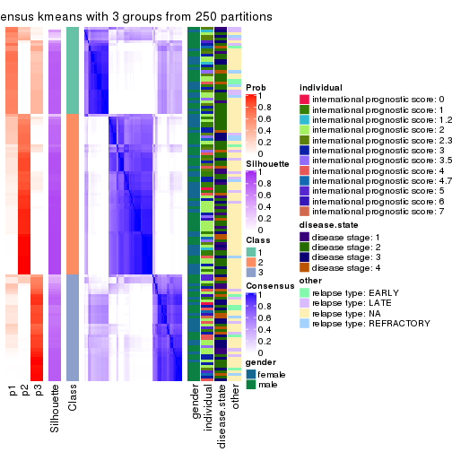</p>

</div>
<div id='tab-MAD-kmeans-consensus-heatmap-3'>
<pre><code class="r">consensus_heatmap(res, k = 4)
</code></pre>

<p>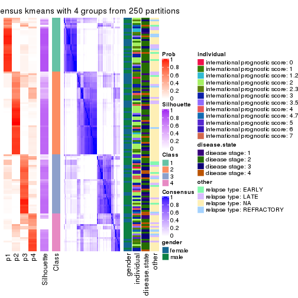</p>

</div>
<div id='tab-MAD-kmeans-consensus-heatmap-4'>
<pre><code class="r">consensus_heatmap(res, k = 5)
</code></pre>

<p>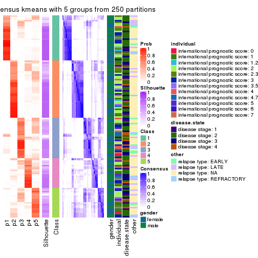</p>

</div>
<div id='tab-MAD-kmeans-consensus-heatmap-5'>
<pre><code class="r">consensus_heatmap(res, k = 6)
</code></pre>

<p>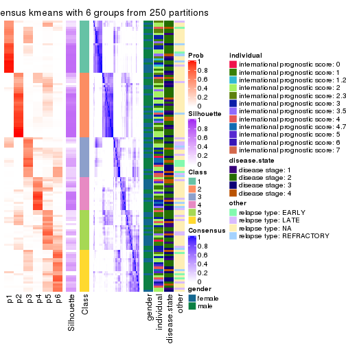</p>

</div>
</div>

Heatmaps for the membership of samples in all partitions to see how consistent they are:


<script>
$( function() {
	$( '#tabs-MAD-kmeans-membership-heatmap' ).tabs();
} );
</script>
<div id='tabs-MAD-kmeans-membership-heatmap'>
<ul>
<li><a href='#tab-MAD-kmeans-membership-heatmap-1'>k = 2</a></li>
<li><a href='#tab-MAD-kmeans-membership-heatmap-2'>k = 3</a></li>
<li><a href='#tab-MAD-kmeans-membership-heatmap-3'>k = 4</a></li>
<li><a href='#tab-MAD-kmeans-membership-heatmap-4'>k = 5</a></li>
<li><a href='#tab-MAD-kmeans-membership-heatmap-5'>k = 6</a></li>
</ul>
<div id='tab-MAD-kmeans-membership-heatmap-1'>
<pre><code class="r">membership_heatmap(res, k = 2)
</code></pre>

<p>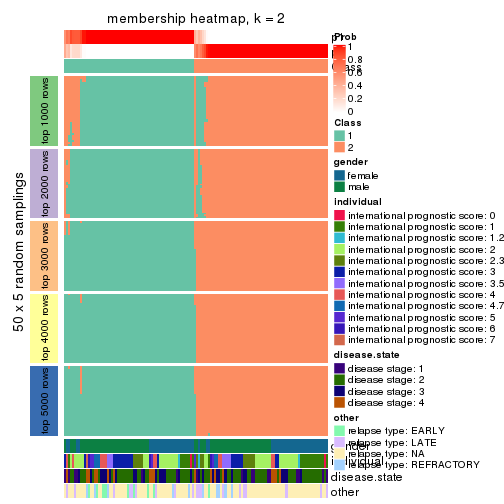</p>

</div>
<div id='tab-MAD-kmeans-membership-heatmap-2'>
<pre><code class="r">membership_heatmap(res, k = 3)
</code></pre>

<p>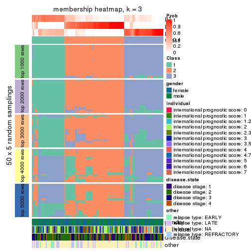</p>

</div>
<div id='tab-MAD-kmeans-membership-heatmap-3'>
<pre><code class="r">membership_heatmap(res, k = 4)
</code></pre>

<p>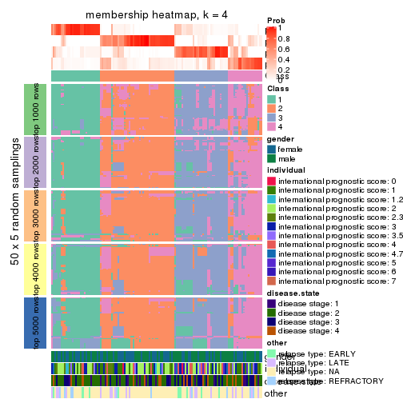</p>

</div>
<div id='tab-MAD-kmeans-membership-heatmap-4'>
<pre><code class="r">membership_heatmap(res, k = 5)
</code></pre>

<p>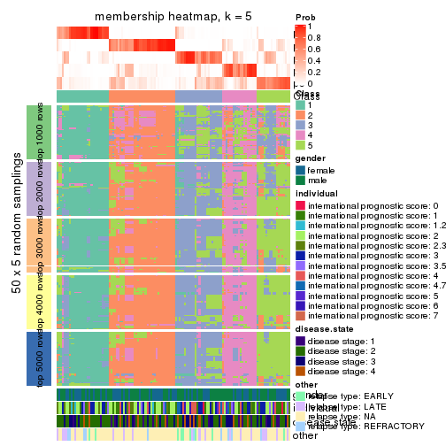</p>

</div>
<div id='tab-MAD-kmeans-membership-heatmap-5'>
<pre><code class="r">membership_heatmap(res, k = 6)
</code></pre>

<p>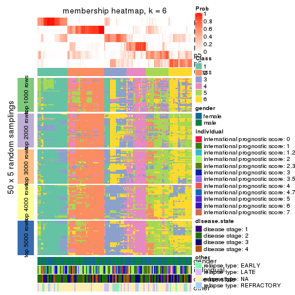</p>

</div>
</div>

As soon as we have had the classes for columns, we can look for signatures
which are significantly different between classes which can be candidate marks
for certain classes. Following are the heatmaps for signatures.


Signature heatmaps where rows are scaled:


<script>
$( function() {
	$( '#tabs-MAD-kmeans-get-signatures' ).tabs();
} );
</script>
<div id='tabs-MAD-kmeans-get-signatures'>
<ul>
<li><a href='#tab-MAD-kmeans-get-signatures-1'>k = 2</a></li>
<li><a href='#tab-MAD-kmeans-get-signatures-2'>k = 3</a></li>
<li><a href='#tab-MAD-kmeans-get-signatures-3'>k = 4</a></li>
<li><a href='#tab-MAD-kmeans-get-signatures-4'>k = 5</a></li>
<li><a href='#tab-MAD-kmeans-get-signatures-5'>k = 6</a></li>
</ul>
<div id='tab-MAD-kmeans-get-signatures-1'>
<pre><code class="r">get_signatures(res, k = 2)
</code></pre>

<p>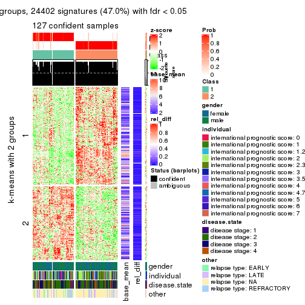</p>

</div>
<div id='tab-MAD-kmeans-get-signatures-2'>
<pre><code class="r">get_signatures(res, k = 3)
</code></pre>

<p>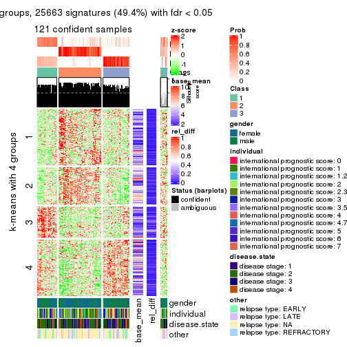</p>

</div>
<div id='tab-MAD-kmeans-get-signatures-3'>
<pre><code class="r">get_signatures(res, k = 4)
</code></pre>

<p>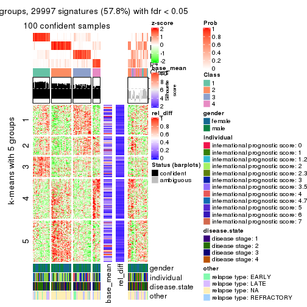</p>

</div>
<div id='tab-MAD-kmeans-get-signatures-4'>
<pre><code class="r">get_signatures(res, k = 5)
</code></pre>

<pre><code>#&gt; Error: The width or height of the raster image is zero, maybe you forget to turn off the
#&gt; previous graphic device or it was corrupted. Run `dev.off()` to close it.
</code></pre>

<p></p>

</div>
<div id='tab-MAD-kmeans-get-signatures-5'>
<pre><code class="r">get_signatures(res, k = 6)
</code></pre>

<p>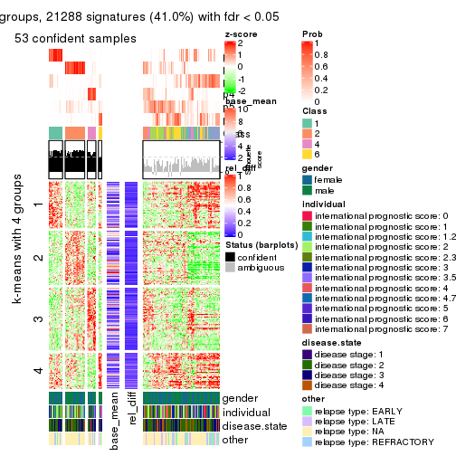</p>

</div>
</div>


Signature heatmaps where rows are not scaled:


<script>
$( function() {
	$( '#tabs-MAD-kmeans-get-signatures-no-scale' ).tabs();
} );
</script>
<div id='tabs-MAD-kmeans-get-signatures-no-scale'>
<ul>
<li><a href='#tab-MAD-kmeans-get-signatures-no-scale-1'>k = 2</a></li>
<li><a href='#tab-MAD-kmeans-get-signatures-no-scale-2'>k = 3</a></li>
<li><a href='#tab-MAD-kmeans-get-signatures-no-scale-3'>k = 4</a></li>
<li><a href='#tab-MAD-kmeans-get-signatures-no-scale-4'>k = 5</a></li>
<li><a href='#tab-MAD-kmeans-get-signatures-no-scale-5'>k = 6</a></li>
</ul>
<div id='tab-MAD-kmeans-get-signatures-no-scale-1'>
<pre><code class="r">get_signatures(res, k = 2, scale_rows = FALSE)
</code></pre>

<p>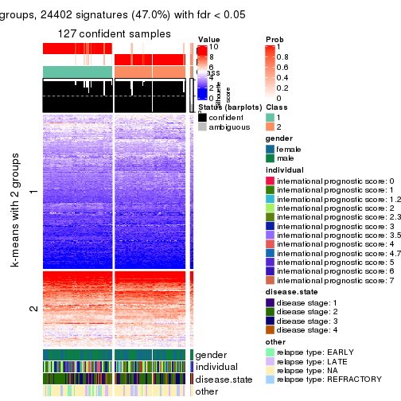</p>

</div>
<div id='tab-MAD-kmeans-get-signatures-no-scale-2'>
<pre><code class="r">get_signatures(res, k = 3, scale_rows = FALSE)
</code></pre>

<p>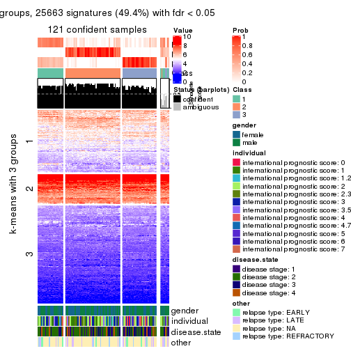</p>

</div>
<div id='tab-MAD-kmeans-get-signatures-no-scale-3'>
<pre><code class="r">get_signatures(res, k = 4, scale_rows = FALSE)
</code></pre>

<p>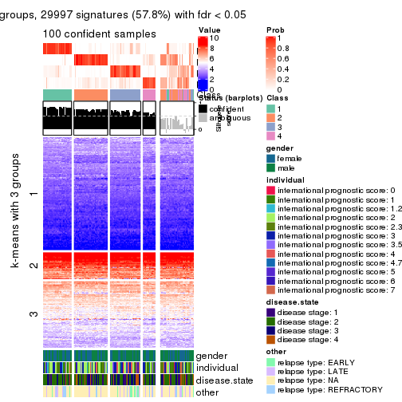</p>

</div>
<div id='tab-MAD-kmeans-get-signatures-no-scale-4'>
<pre><code class="r">get_signatures(res, k = 5, scale_rows = FALSE)
</code></pre>

<p>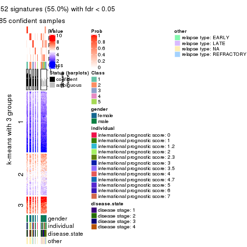</p>

</div>
<div id='tab-MAD-kmeans-get-signatures-no-scale-5'>
<pre><code class="r">get_signatures(res, k = 6, scale_rows = FALSE)
</code></pre>

<p>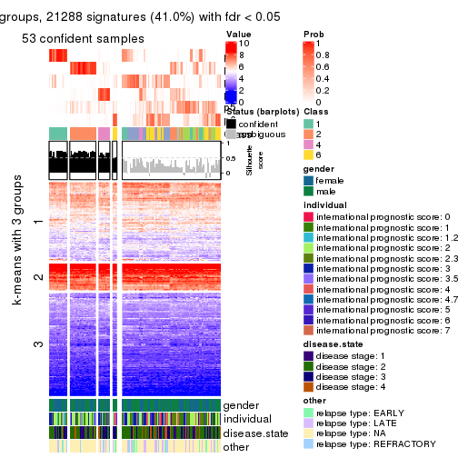</p>

</div>
</div>


Compare the overlap of signatures from different k:

```r
compare_signatures(res)
```

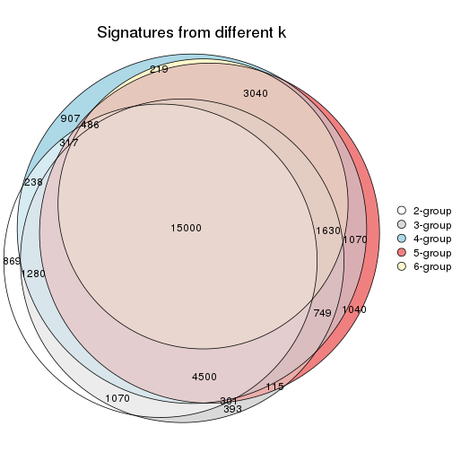

`get_signature()` returns a data frame invisibly. TO get the list of signatures, the function
call should be assigned to a variable explicitly. In following code, if `plot` argument is set
to `FALSE`, no heatmap is plotted while only the differential analysis is performed.

```r
# code only for demonstration
tb = get_signature(res, k = ..., plot = FALSE)
```

An example of the output of `tb` is:

```
#>   which_row         fdr    mean_1    mean_2 scaled_mean_1 scaled_mean_2 km
#> 1        38 0.042760348  8.373488  9.131774    -0.5533452     0.5164555  1
#> 2        40 0.018707592  7.106213  8.469186    -0.6173731     0.5762149  1
#> 3        55 0.019134737 10.221463 11.207825    -0.6159697     0.5749050  1
#> 4        59 0.006059896  5.921854  7.869574    -0.6899429     0.6439467  1
#> 5        60 0.018055526  8.928898 10.211722    -0.6204761     0.5791110  1
#> 6        98 0.009384629 15.714769 14.887706     0.6635654    -0.6193277  2
...
```

The columns in `tb` are:

1. `which_row`: row indices corresponding to the input matrix.
2. `fdr`: FDR for the differential test. 
3. `mean_x`: The mean value in group x.
4. `scaled_mean_x`: The mean value in group x after rows are scaled.
5. `km`: Row groups if k-means clustering is applied to rows.


UMAP plot which shows how samples are separated.


<script>
$( function() {
	$( '#tabs-MAD-kmeans-dimension-reduction' ).tabs();
} );
</script>
<div id='tabs-MAD-kmeans-dimension-reduction'>
<ul>
<li><a href='#tab-MAD-kmeans-dimension-reduction-1'>k = 2</a></li>
<li><a href='#tab-MAD-kmeans-dimension-reduction-2'>k = 3</a></li>
<li><a href='#tab-MAD-kmeans-dimension-reduction-3'>k = 4</a></li>
<li><a href='#tab-MAD-kmeans-dimension-reduction-4'>k = 5</a></li>
<li><a href='#tab-MAD-kmeans-dimension-reduction-5'>k = 6</a></li>
</ul>
<div id='tab-MAD-kmeans-dimension-reduction-1'>
<pre><code class="r">dimension_reduction(res, k = 2, method = &quot;UMAP&quot;)
</code></pre>

<p>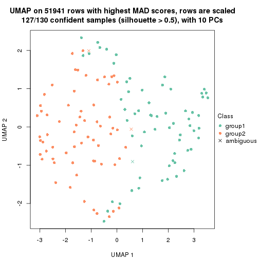</p>

</div>
<div id='tab-MAD-kmeans-dimension-reduction-2'>
<pre><code class="r">dimension_reduction(res, k = 3, method = &quot;UMAP&quot;)
</code></pre>

<p>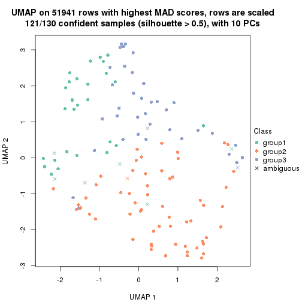</p>

</div>
<div id='tab-MAD-kmeans-dimension-reduction-3'>
<pre><code class="r">dimension_reduction(res, k = 4, method = &quot;UMAP&quot;)
</code></pre>

<p>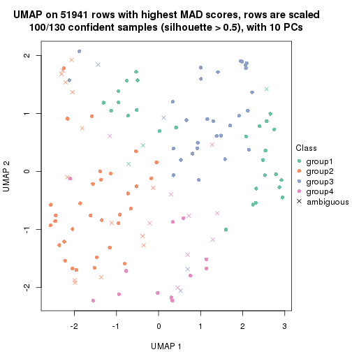</p>

</div>
<div id='tab-MAD-kmeans-dimension-reduction-4'>
<pre><code class="r">dimension_reduction(res, k = 5, method = &quot;UMAP&quot;)
</code></pre>

<p>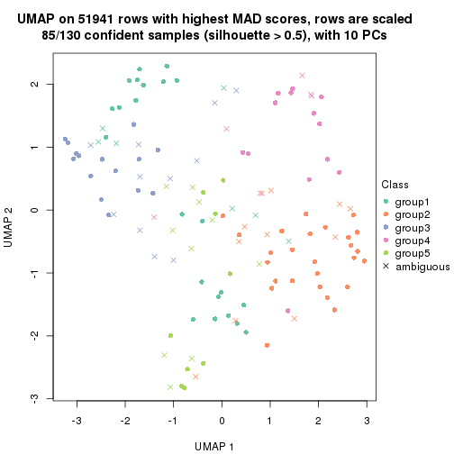</p>

</div>
<div id='tab-MAD-kmeans-dimension-reduction-5'>
<pre><code class="r">dimension_reduction(res, k = 6, method = &quot;UMAP&quot;)
</code></pre>

<p>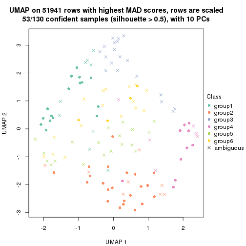</p>

</div>
</div>


Following heatmap shows how subgroups are split when increasing `k`:

```r
collect_classes(res)
```

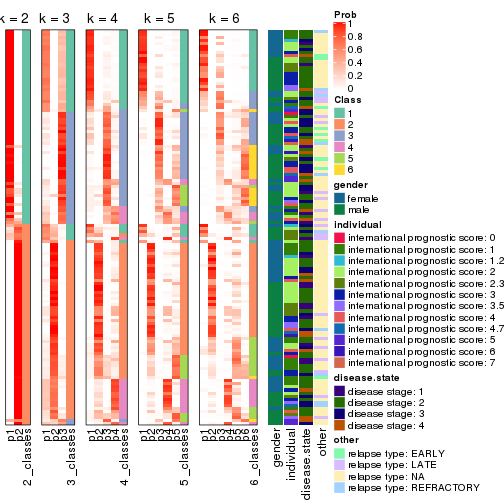


Test correlation between subgroups and known annotations. If the known
annotation is numeric, one-way ANOVA test is applied, and if the known
annotation is discrete, chi-squared contingency table test is applied.

```r
test_to_known_factors(res)
```

```
#>              n gender(p) individual(p) disease.state(p) other(p) k
#> MAD:kmeans 127     0.647         0.732            0.408   0.1046 2
#> MAD:kmeans 121     0.571         0.523            0.204   0.3141 3
#> MAD:kmeans 100     0.351         0.279            0.241   0.1138 4
#> MAD:kmeans  85     0.832         0.291            0.409   0.0601 5
#> MAD:kmeans  53     0.339         0.408            0.722   0.0566 6
```


If matrix rows can be associated to genes, consider to use `GO_Enrichment(res,
...)` to perform function enrichment for the signature genes.


 

---------------------------------------------------


### MAD:skmeans*


The object with results only for a single top-value method and a single partition method 
can be extracted as:

```r
res = res_list["MAD", "skmeans"]
# you can also extract it by
# res = res_list["MAD:skmeans"]
```

A summary of `res` and all the functions that can be applied to it:

```r
res
```

```
#> A 'ConsensusPartition' object with k = 2, 3, 4, 5, 6.
#>   On a matrix with 51941 rows and 130 columns.
#>   Top rows (1000, 2000, 3000, 4000, 5000) are extracted by 'MAD' method.
#>   Subgroups are detected by 'skmeans' method.
#>   Performed in total 1250 partitions by row resampling.
#>   Best k for subgroups seems to be 3.
#> 
#> Following methods can be applied to this 'ConsensusPartition' object:
#>  [1] "cola_report"             "collect_classes"         "collect_plots"          
#>  [4] "collect_stats"           "colnames"                "compare_signatures"     
#>  [7] "consensus_heatmap"       "dimension_reduction"     "functional_enrichment"  
#> [10] "get_anno_col"            "get_anno"                "get_classes"            
#> [13] "get_consensus"           "get_matrix"              "get_membership"         
#> [16] "get_param"               "get_signatures"          "get_stats"              
#> [19] "is_best_k"               "is_stable_k"             "membership_heatmap"     
#> [22] "ncol"                    "nrow"                    "plot_ecdf"              
#> [25] "rownames"                "select_partition_number" "show"                   
#> [28] "suggest_best_k"          "test_to_known_factors"
```

`collect_plots()` function collects all the plots made from `res` for all `k` (number of partitions)
into one single page to provide an easy and fast comparison between different `k`.

```r
collect_plots(res)
```

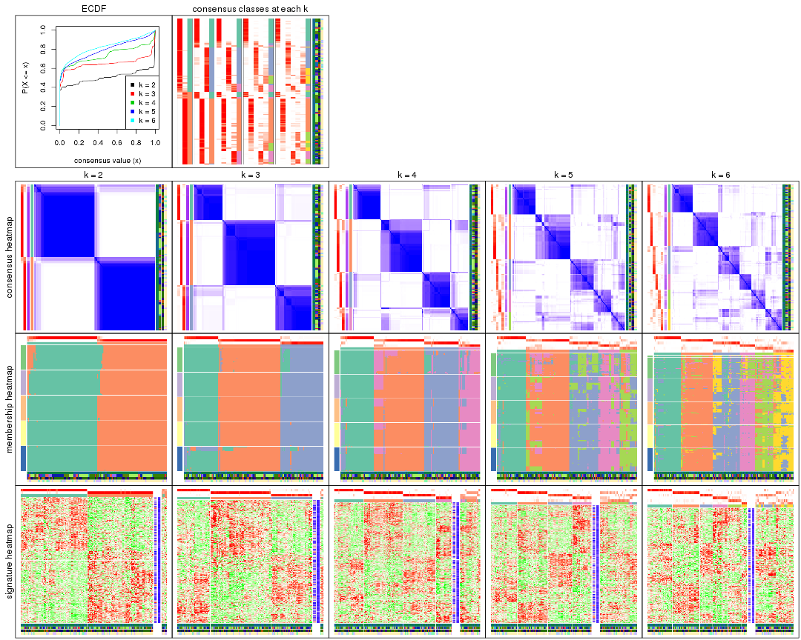

The plots are:

- The first row: a plot of the ECDF (Empirical cumulative distribution
  function) curves of the consensus matrix for each `k` and the heatmap of
  predicted classes for each `k`.
- The second row: heatmaps of the consensus matrix for each `k`.
- The third row: heatmaps of the membership matrix for each `k`.
- The fouth row: heatmaps of the signatures for each `k`.

All the plots in panels can be made by individual functions and they are
plotted later in this section.

`select_partition_number()` produces several plots showing different
statistics for choosing "optimized" `k`. There are following statistics:

- ECDF curves of the consensus matrix for each `k`;
- 1-PAC. [The PAC
  score](https://en.wikipedia.org/wiki/Consensus_clustering#Over-interpretation_potential_of_consensus_clustering)
  measures the proportion of the ambiguous subgrouping.
- Mean silhouette score.
- Concordance. The mean probability of fiting the consensus class ids in all
  partitions.
- Area increased. Denote $A_k$ as the area under the ECDF curve for current
  `k`, the area increased is defined as $A_k - A_{k-1}$.
- Rand index. The percent of pairs of samples that are both in a same cluster
  or both are not in a same cluster in the partition of k and k-1.
- Jaccard index. The ratio of pairs of samples are both in a same cluster in
  the partition of k and k-1 and the pairs of samples are both in a same
  cluster in the partition k or k-1.

The detailed explanations of these statistics can be found in [the cola
vignette](http://bioconductor.org/packages/devel/bioc/vignettes/cola/inst/doc/cola.html#toc_13).

Generally speaking, lower PAC score, higher mean silhouette score or higher
concordance corresponds to better partition. Rand index and Jaccard index
measure how similar the current partition is compared to partition with `k-1`.
If they are too similar, we won't accept `k` is better than `k-1`.

```r
select_partition_number(res)
```

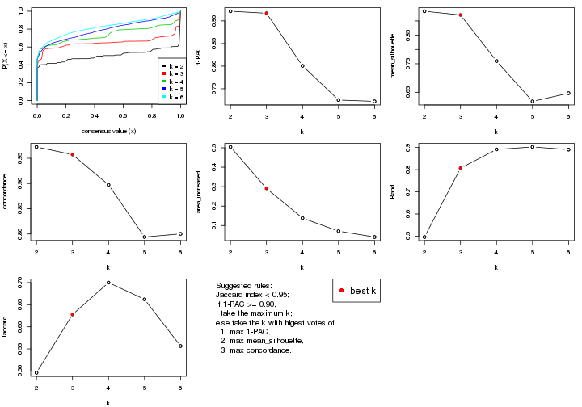

The numeric values for all these statistics can be obtained by `get_stats()`.

```r
get_stats(res)
```

```
#>   k 1-PAC mean_silhouette concordance area_increased  Rand Jaccard
#> 2 2 0.921           0.934       0.972         0.5043 0.496   0.496
#> 3 3 0.917           0.921       0.957         0.2908 0.807   0.628
#> 4 4 0.801           0.760       0.897         0.1381 0.891   0.700
#> 5 5 0.725           0.618       0.794         0.0710 0.902   0.662
#> 6 6 0.722           0.647       0.800         0.0408 0.890   0.556
```

`suggest_best_k()` suggests the best $k$ based on these statistics. The rules are as follows:

- All $k$ with Jaccard index larger than 0.95 are removed because the increase of
  the partition number does not provides enough extra information. If all $k$ are removed,
  the best $k$ is assigned by `NA`.
- For $k$ with 1-PAC larger than 0.9, the maximal $k$ is taken as the "best k". Other $k$ is called "optional k".
- If it does not fit the second rule. The $k$ with the highest vote of highest
  1-PAC, mean silhouette and concordance is taken as the "best k".

```r
suggest_best_k(res)
```

```
#> [1] 3
#> attr(,"optional")
#> [1] 2
```

There is also optional best $k$ = 2 that is worth to check.

Following shows the table of the partitions (You need to click the **show/hide
code output** link to see it). The membership matrix (columns with name `p*`)
is inferred by
[`clue::cl_consensus()`](https://www.rdocumentation.org/link/cl_consensus?package=clue)
function with the `SE` method. Basically the value in the membership matrix
represents the probability to belong to a certain group. The finall class
label for an item is determined with the group with highest probability it
belongs to.

In `get_classes()` function, the entropy is calculated from the membership
matrix and the silhouette score is calculated from the consensus matrix.


<script>
$( function() {
	$( '#tabs-MAD-skmeans-get-classes' ).tabs();
} );
</script>
<div id='tabs-MAD-skmeans-get-classes'>
<ul>
<li><a href='#tab-MAD-skmeans-get-classes-1'>k = 2</a></li>
<li><a href='#tab-MAD-skmeans-get-classes-2'>k = 3</a></li>
<li><a href='#tab-MAD-skmeans-get-classes-3'>k = 4</a></li>
<li><a href='#tab-MAD-skmeans-get-classes-4'>k = 5</a></li>
<li><a href='#tab-MAD-skmeans-get-classes-5'>k = 6</a></li>
</ul>

<div id='tab-MAD-skmeans-get-classes-1'>
<p><a id='tab-MAD-skmeans-get-classes-1-a' style='color:#0366d6' href='#'>show/hide code output</a></p>
<pre><code class="r">cbind(get_classes(res, k = 2), get_membership(res, k = 2))
</code></pre>

<pre><code>#&gt;           class entropy silhouette    p1    p2
#&gt; GSM447671     2  0.0000      0.973 0.000 1.000
#&gt; GSM447694     1  0.0000      0.969 1.000 0.000
#&gt; GSM447618     2  0.0000      0.973 0.000 1.000
#&gt; GSM447691     2  0.0000      0.973 0.000 1.000
#&gt; GSM447733     1  0.5629      0.842 0.868 0.132
#&gt; GSM447620     2  0.0000      0.973 0.000 1.000
#&gt; GSM447627     1  0.0000      0.969 1.000 0.000
#&gt; GSM447630     2  0.0938      0.963 0.012 0.988
#&gt; GSM447642     1  0.0000      0.969 1.000 0.000
#&gt; GSM447649     2  0.0000      0.973 0.000 1.000
#&gt; GSM447654     2  0.0000      0.973 0.000 1.000
#&gt; GSM447655     2  0.0000      0.973 0.000 1.000
#&gt; GSM447669     2  0.0000      0.973 0.000 1.000
#&gt; GSM447676     1  0.0000      0.969 1.000 0.000
#&gt; GSM447678     2  0.0000      0.973 0.000 1.000
#&gt; GSM447681     2  0.0000      0.973 0.000 1.000
#&gt; GSM447698     2  0.0000      0.973 0.000 1.000
#&gt; GSM447713     1  0.0000      0.969 1.000 0.000
#&gt; GSM447722     2  0.0000      0.973 0.000 1.000
#&gt; GSM447726     2  0.0376      0.970 0.004 0.996
#&gt; GSM447735     1  0.0000      0.969 1.000 0.000
#&gt; GSM447737     1  0.0000      0.969 1.000 0.000
#&gt; GSM447657     2  0.0000      0.973 0.000 1.000
#&gt; GSM447674     2  0.0000      0.973 0.000 1.000
#&gt; GSM447636     2  0.9754      0.339 0.408 0.592
#&gt; GSM447723     1  0.0000      0.969 1.000 0.000
#&gt; GSM447699     1  0.7219      0.757 0.800 0.200
#&gt; GSM447708     2  0.0000      0.973 0.000 1.000
#&gt; GSM447721     1  0.0000      0.969 1.000 0.000
#&gt; GSM447623     1  0.0000      0.969 1.000 0.000
#&gt; GSM447621     1  0.0000      0.969 1.000 0.000
#&gt; GSM447650     2  0.0000      0.973 0.000 1.000
#&gt; GSM447651     2  0.0000      0.973 0.000 1.000
#&gt; GSM447653     1  0.0000      0.969 1.000 0.000
#&gt; GSM447658     1  0.0000      0.969 1.000 0.000
#&gt; GSM447675     2  0.0000      0.973 0.000 1.000
#&gt; GSM447680     2  0.0000      0.973 0.000 1.000
#&gt; GSM447686     2  0.3431      0.912 0.064 0.936
#&gt; GSM447736     1  0.0000      0.969 1.000 0.000
#&gt; GSM447629     2  0.0000      0.973 0.000 1.000
#&gt; GSM447648     1  0.0000      0.969 1.000 0.000
#&gt; GSM447660     1  0.0000      0.969 1.000 0.000
#&gt; GSM447661     2  0.0000      0.973 0.000 1.000
#&gt; GSM447663     1  0.7056      0.768 0.808 0.192
#&gt; GSM447704     2  0.0000      0.973 0.000 1.000
#&gt; GSM447720     1  0.0000      0.969 1.000 0.000
#&gt; GSM447652     2  0.0000      0.973 0.000 1.000
#&gt; GSM447679     2  0.0000      0.973 0.000 1.000
#&gt; GSM447712     1  0.0000      0.969 1.000 0.000
#&gt; GSM447664     2  0.0000      0.973 0.000 1.000
#&gt; GSM447637     1  0.0000      0.969 1.000 0.000
#&gt; GSM447639     1  0.7950      0.698 0.760 0.240
#&gt; GSM447615     1  0.0000      0.969 1.000 0.000
#&gt; GSM447656     2  0.0000      0.973 0.000 1.000
#&gt; GSM447673     2  0.0000      0.973 0.000 1.000
#&gt; GSM447719     1  0.0000      0.969 1.000 0.000
#&gt; GSM447706     1  0.0000      0.969 1.000 0.000
#&gt; GSM447612     1  0.7376      0.746 0.792 0.208
#&gt; GSM447665     2  0.0000      0.973 0.000 1.000
#&gt; GSM447677     2  0.0000      0.973 0.000 1.000
#&gt; GSM447613     1  0.0000      0.969 1.000 0.000
#&gt; GSM447659     1  0.3431      0.912 0.936 0.064
#&gt; GSM447662     1  0.0000      0.969 1.000 0.000
#&gt; GSM447666     1  0.1414      0.952 0.980 0.020
#&gt; GSM447668     2  0.0000      0.973 0.000 1.000
#&gt; GSM447682     2  0.0000      0.973 0.000 1.000
#&gt; GSM447683     2  0.0000      0.973 0.000 1.000
#&gt; GSM447688     2  0.0000      0.973 0.000 1.000
#&gt; GSM447702     2  0.0000      0.973 0.000 1.000
#&gt; GSM447709     2  0.0000      0.973 0.000 1.000
#&gt; GSM447711     1  0.0000      0.969 1.000 0.000
#&gt; GSM447715     2  0.6531      0.791 0.168 0.832
#&gt; GSM447693     1  0.0000      0.969 1.000 0.000
#&gt; GSM447611     2  0.9775      0.328 0.412 0.588
#&gt; GSM447672     2  0.0000      0.973 0.000 1.000
#&gt; GSM447703     2  0.0000      0.973 0.000 1.000
#&gt; GSM447727     1  0.0000      0.969 1.000 0.000
#&gt; GSM447638     2  0.9460      0.449 0.364 0.636
#&gt; GSM447670     1  0.0000      0.969 1.000 0.000
#&gt; GSM447700     2  0.0000      0.973 0.000 1.000
#&gt; GSM447738     2  0.0000      0.973 0.000 1.000
#&gt; GSM447739     1  0.0000      0.969 1.000 0.000
#&gt; GSM447617     1  0.0000      0.969 1.000 0.000
#&gt; GSM447628     2  0.0000      0.973 0.000 1.000
#&gt; GSM447632     2  0.0000      0.973 0.000 1.000
#&gt; GSM447619     1  0.0000      0.969 1.000 0.000
#&gt; GSM447643     2  0.7453      0.730 0.212 0.788
#&gt; GSM447724     1  0.9732      0.358 0.596 0.404
#&gt; GSM447728     2  0.0000      0.973 0.000 1.000
#&gt; GSM447610     1  0.0000      0.969 1.000 0.000
#&gt; GSM447633     2  0.0000      0.973 0.000 1.000
#&gt; GSM447634     1  0.0000      0.969 1.000 0.000
#&gt; GSM447622     1  0.0000      0.969 1.000 0.000
#&gt; GSM447667     2  0.0000      0.973 0.000 1.000
#&gt; GSM447687     2  0.0000      0.973 0.000 1.000
#&gt; GSM447695     1  0.0000      0.969 1.000 0.000
#&gt; GSM447696     1  0.0000      0.969 1.000 0.000
#&gt; GSM447697     1  0.0000      0.969 1.000 0.000
#&gt; GSM447714     1  0.0000      0.969 1.000 0.000
#&gt; GSM447717     1  0.0000      0.969 1.000 0.000
#&gt; GSM447725     1  0.0000      0.969 1.000 0.000
#&gt; GSM447729     2  0.0000      0.973 0.000 1.000
#&gt; GSM447644     2  0.0000      0.973 0.000 1.000
#&gt; GSM447710     1  0.0000      0.969 1.000 0.000
#&gt; GSM447614     1  0.0000      0.969 1.000 0.000
#&gt; GSM447685     2  0.0000      0.973 0.000 1.000
#&gt; GSM447690     1  0.0000      0.969 1.000 0.000
#&gt; GSM447730     2  0.0000      0.973 0.000 1.000
#&gt; GSM447646     2  0.0000      0.973 0.000 1.000
#&gt; GSM447689     1  0.0000      0.969 1.000 0.000
#&gt; GSM447635     2  0.0000      0.973 0.000 1.000
#&gt; GSM447641     1  0.0000      0.969 1.000 0.000
#&gt; GSM447716     2  0.0000      0.973 0.000 1.000
#&gt; GSM447718     1  0.1414      0.952 0.980 0.020
#&gt; GSM447616     1  0.0000      0.969 1.000 0.000
#&gt; GSM447626     1  0.0000      0.969 1.000 0.000
#&gt; GSM447640     2  0.0000      0.973 0.000 1.000
#&gt; GSM447734     1  0.0000      0.969 1.000 0.000
#&gt; GSM447692     1  0.0000      0.969 1.000 0.000
#&gt; GSM447647     2  0.0000      0.973 0.000 1.000
#&gt; GSM447624     1  0.0000      0.969 1.000 0.000
#&gt; GSM447625     1  0.0000      0.969 1.000 0.000
#&gt; GSM447707     2  0.0000      0.973 0.000 1.000
#&gt; GSM447732     1  0.0000      0.969 1.000 0.000
#&gt; GSM447684     1  0.0000      0.969 1.000 0.000
#&gt; GSM447731     2  0.0938      0.963 0.012 0.988
#&gt; GSM447705     1  0.9944      0.207 0.544 0.456
#&gt; GSM447631     1  0.0000      0.969 1.000 0.000
#&gt; GSM447701     2  0.0000      0.973 0.000 1.000
#&gt; GSM447645     1  0.0000      0.969 1.000 0.000
</code></pre>

<script>
$('#tab-MAD-skmeans-get-classes-1-a').parent().next().next().hide();
$('#tab-MAD-skmeans-get-classes-1-a').click(function(){
  $('#tab-MAD-skmeans-get-classes-1-a').parent().next().next().toggle();
  return(false);
});
</script>
</div>

<div id='tab-MAD-skmeans-get-classes-2'>
<p><a id='tab-MAD-skmeans-get-classes-2-a' style='color:#0366d6' href='#'>show/hide code output</a></p>
<pre><code class="r">cbind(get_classes(res, k = 3), get_membership(res, k = 3))
</code></pre>

<pre><code>#&gt;           class entropy silhouette    p1    p2    p3
#&gt; GSM447671     2  0.0000      0.977 0.000 1.000 0.000
#&gt; GSM447694     3  0.1163      0.935 0.028 0.000 0.972
#&gt; GSM447618     2  0.0237      0.977 0.004 0.996 0.000
#&gt; GSM447691     2  0.0000      0.977 0.000 1.000 0.000
#&gt; GSM447733     3  0.0424      0.917 0.008 0.000 0.992
#&gt; GSM447620     2  0.4235      0.794 0.000 0.824 0.176
#&gt; GSM447627     3  0.1031      0.933 0.024 0.000 0.976
#&gt; GSM447630     2  0.6111      0.312 0.000 0.604 0.396
#&gt; GSM447642     1  0.0424      0.957 0.992 0.000 0.008
#&gt; GSM447649     2  0.0000      0.977 0.000 1.000 0.000
#&gt; GSM447654     2  0.1585      0.960 0.008 0.964 0.028
#&gt; GSM447655     2  0.0000      0.977 0.000 1.000 0.000
#&gt; GSM447669     2  0.0000      0.977 0.000 1.000 0.000
#&gt; GSM447676     1  0.0237      0.956 0.996 0.000 0.004
#&gt; GSM447678     2  0.1585      0.960 0.008 0.964 0.028
#&gt; GSM447681     2  0.0000      0.977 0.000 1.000 0.000
#&gt; GSM447698     2  0.0237      0.977 0.004 0.996 0.000
#&gt; GSM447713     1  0.0424      0.957 0.992 0.000 0.008
#&gt; GSM447722     2  0.1711      0.958 0.008 0.960 0.032
#&gt; GSM447726     2  0.0237      0.976 0.000 0.996 0.004
#&gt; GSM447735     3  0.3340      0.855 0.120 0.000 0.880
#&gt; GSM447737     1  0.6308     -0.106 0.508 0.000 0.492
#&gt; GSM447657     2  0.0237      0.977 0.004 0.996 0.000
#&gt; GSM447674     2  0.0000      0.977 0.000 1.000 0.000
#&gt; GSM447636     1  0.1289      0.933 0.968 0.032 0.000
#&gt; GSM447723     1  0.0424      0.957 0.992 0.000 0.008
#&gt; GSM447699     3  0.1163      0.935 0.028 0.000 0.972
#&gt; GSM447708     2  0.0000      0.977 0.000 1.000 0.000
#&gt; GSM447721     1  0.0424      0.957 0.992 0.000 0.008
#&gt; GSM447623     1  0.1643      0.930 0.956 0.000 0.044
#&gt; GSM447621     1  0.3412      0.842 0.876 0.000 0.124
#&gt; GSM447650     2  0.0000      0.977 0.000 1.000 0.000
#&gt; GSM447651     2  0.0000      0.977 0.000 1.000 0.000
#&gt; GSM447653     3  0.0237      0.920 0.004 0.000 0.996
#&gt; GSM447658     1  0.0237      0.956 0.996 0.000 0.004
#&gt; GSM447675     2  0.1711      0.958 0.008 0.960 0.032
#&gt; GSM447680     2  0.0000      0.977 0.000 1.000 0.000
#&gt; GSM447686     1  0.2066      0.910 0.940 0.060 0.000
#&gt; GSM447736     3  0.1163      0.935 0.028 0.000 0.972
#&gt; GSM447629     2  0.0000      0.977 0.000 1.000 0.000
#&gt; GSM447648     3  0.1163      0.935 0.028 0.000 0.972
#&gt; GSM447660     1  0.0237      0.956 0.996 0.000 0.004
#&gt; GSM447661     2  0.0000      0.977 0.000 1.000 0.000
#&gt; GSM447663     3  0.1163      0.935 0.028 0.000 0.972
#&gt; GSM447704     2  0.0000      0.977 0.000 1.000 0.000
#&gt; GSM447720     3  0.3752      0.853 0.144 0.000 0.856
#&gt; GSM447652     2  0.0237      0.977 0.004 0.996 0.000
#&gt; GSM447679     2  0.0000      0.977 0.000 1.000 0.000
#&gt; GSM447712     1  0.0424      0.957 0.992 0.000 0.008
#&gt; GSM447664     2  0.2187      0.950 0.024 0.948 0.028
#&gt; GSM447637     3  0.1163      0.935 0.028 0.000 0.972
#&gt; GSM447639     3  0.0661      0.916 0.008 0.004 0.988
#&gt; GSM447615     1  0.0424      0.957 0.992 0.000 0.008
#&gt; GSM447656     2  0.0000      0.977 0.000 1.000 0.000
#&gt; GSM447673     2  0.0237      0.977 0.004 0.996 0.000
#&gt; GSM447719     3  0.0237      0.920 0.004 0.000 0.996
#&gt; GSM447706     3  0.1411      0.932 0.036 0.000 0.964
#&gt; GSM447612     3  0.1163      0.935 0.028 0.000 0.972
#&gt; GSM447665     2  0.0000      0.977 0.000 1.000 0.000
#&gt; GSM447677     2  0.0000      0.977 0.000 1.000 0.000
#&gt; GSM447613     1  0.0424      0.957 0.992 0.000 0.008
#&gt; GSM447659     3  0.0237      0.920 0.004 0.000 0.996
#&gt; GSM447662     3  0.1163      0.935 0.028 0.000 0.972
#&gt; GSM447666     3  0.1832      0.909 0.008 0.036 0.956
#&gt; GSM447668     2  0.0000      0.977 0.000 1.000 0.000
#&gt; GSM447682     2  0.0000      0.977 0.000 1.000 0.000
#&gt; GSM447683     2  0.0000      0.977 0.000 1.000 0.000
#&gt; GSM447688     2  0.1399      0.962 0.004 0.968 0.028
#&gt; GSM447702     2  0.0000      0.977 0.000 1.000 0.000
#&gt; GSM447709     2  0.0000      0.977 0.000 1.000 0.000
#&gt; GSM447711     1  0.0424      0.957 0.992 0.000 0.008
#&gt; GSM447715     1  0.1411      0.931 0.964 0.036 0.000
#&gt; GSM447693     3  0.1163      0.935 0.028 0.000 0.972
#&gt; GSM447611     1  0.2313      0.919 0.944 0.024 0.032
#&gt; GSM447672     2  0.0000      0.977 0.000 1.000 0.000
#&gt; GSM447703     2  0.0237      0.977 0.004 0.996 0.000
#&gt; GSM447727     1  0.0424      0.957 0.992 0.000 0.008
#&gt; GSM447638     1  0.1411      0.931 0.964 0.036 0.000
#&gt; GSM447670     1  0.0424      0.957 0.992 0.000 0.008
#&gt; GSM447700     2  0.0661      0.973 0.004 0.988 0.008
#&gt; GSM447738     2  0.0237      0.977 0.004 0.996 0.000
#&gt; GSM447739     1  0.0424      0.957 0.992 0.000 0.008
#&gt; GSM447617     1  0.4062      0.786 0.836 0.000 0.164
#&gt; GSM447628     2  0.1585      0.960 0.008 0.964 0.028
#&gt; GSM447632     2  0.0237      0.977 0.004 0.996 0.000
#&gt; GSM447619     3  0.1163      0.935 0.028 0.000 0.972
#&gt; GSM447643     1  0.1411      0.931 0.964 0.036 0.000
#&gt; GSM447724     3  0.0424      0.917 0.008 0.000 0.992
#&gt; GSM447728     2  0.0000      0.977 0.000 1.000 0.000
#&gt; GSM447610     1  0.2537      0.915 0.920 0.000 0.080
#&gt; GSM447633     2  0.1643      0.945 0.000 0.956 0.044
#&gt; GSM447634     3  0.4750      0.778 0.216 0.000 0.784
#&gt; GSM447622     3  0.4796      0.774 0.220 0.000 0.780
#&gt; GSM447667     2  0.4504      0.742 0.196 0.804 0.000
#&gt; GSM447687     2  0.0237      0.977 0.004 0.996 0.000
#&gt; GSM447695     3  0.4750      0.778 0.216 0.000 0.784
#&gt; GSM447696     1  0.0424      0.957 0.992 0.000 0.008
#&gt; GSM447697     1  0.0424      0.957 0.992 0.000 0.008
#&gt; GSM447714     3  0.1163      0.935 0.028 0.000 0.972
#&gt; GSM447717     1  0.0424      0.957 0.992 0.000 0.008
#&gt; GSM447725     1  0.0237      0.956 0.996 0.000 0.004
#&gt; GSM447729     2  0.1585      0.960 0.008 0.964 0.028
#&gt; GSM447644     2  0.0000      0.977 0.000 1.000 0.000
#&gt; GSM447710     3  0.1163      0.935 0.028 0.000 0.972
#&gt; GSM447614     3  0.4235      0.798 0.176 0.000 0.824
#&gt; GSM447685     2  0.0000      0.977 0.000 1.000 0.000
#&gt; GSM447690     1  0.0237      0.956 0.996 0.000 0.004
#&gt; GSM447730     2  0.0000      0.977 0.000 1.000 0.000
#&gt; GSM447646     2  0.1585      0.960 0.008 0.964 0.028
#&gt; GSM447689     3  0.1289      0.933 0.032 0.000 0.968
#&gt; GSM447635     2  0.1289      0.956 0.032 0.968 0.000
#&gt; GSM447641     1  0.0424      0.957 0.992 0.000 0.008
#&gt; GSM447716     2  0.0424      0.975 0.008 0.992 0.000
#&gt; GSM447718     3  0.1163      0.935 0.028 0.000 0.972
#&gt; GSM447616     3  0.4750      0.778 0.216 0.000 0.784
#&gt; GSM447626     3  0.1529      0.930 0.040 0.000 0.960
#&gt; GSM447640     2  0.0000      0.977 0.000 1.000 0.000
#&gt; GSM447734     3  0.1163      0.935 0.028 0.000 0.972
#&gt; GSM447692     3  0.4750      0.778 0.216 0.000 0.784
#&gt; GSM447647     2  0.1585      0.960 0.008 0.964 0.028
#&gt; GSM447624     3  0.6225      0.332 0.432 0.000 0.568
#&gt; GSM447625     3  0.1163      0.935 0.028 0.000 0.972
#&gt; GSM447707     2  0.0000      0.977 0.000 1.000 0.000
#&gt; GSM447732     3  0.1163      0.935 0.028 0.000 0.972
#&gt; GSM447684     1  0.0475      0.956 0.992 0.004 0.004
#&gt; GSM447731     3  0.4413      0.742 0.008 0.160 0.832
#&gt; GSM447705     3  0.1289      0.912 0.000 0.032 0.968
#&gt; GSM447631     3  0.1163      0.935 0.028 0.000 0.972
#&gt; GSM447701     2  0.0000      0.977 0.000 1.000 0.000
#&gt; GSM447645     3  0.1289      0.933 0.032 0.000 0.968
</code></pre>

<script>
$('#tab-MAD-skmeans-get-classes-2-a').parent().next().next().hide();
$('#tab-MAD-skmeans-get-classes-2-a').click(function(){
  $('#tab-MAD-skmeans-get-classes-2-a').parent().next().next().toggle();
  return(false);
});
</script>
</div>

<div id='tab-MAD-skmeans-get-classes-3'>
<p><a id='tab-MAD-skmeans-get-classes-3-a' style='color:#0366d6' href='#'>show/hide code output</a></p>
<pre><code class="r">cbind(get_classes(res, k = 4), get_membership(res, k = 4))
</code></pre>

<pre><code>#&gt;           class entropy silhouette    p1    p2    p3    p4
#&gt; GSM447671     2  0.0707     0.8570 0.000 0.980 0.000 0.020
#&gt; GSM447694     3  0.0469     0.9078 0.000 0.000 0.988 0.012
#&gt; GSM447618     2  0.4999     0.3156 0.000 0.508 0.000 0.492
#&gt; GSM447691     2  0.1474     0.8496 0.000 0.948 0.000 0.052
#&gt; GSM447733     4  0.3356     0.7182 0.000 0.000 0.176 0.824
#&gt; GSM447620     2  0.0779     0.8533 0.000 0.980 0.016 0.004
#&gt; GSM447627     3  0.1022     0.8977 0.000 0.000 0.968 0.032
#&gt; GSM447630     2  0.4977     0.0349 0.000 0.540 0.460 0.000
#&gt; GSM447642     1  0.0000     0.9180 1.000 0.000 0.000 0.000
#&gt; GSM447649     2  0.0000     0.8613 0.000 1.000 0.000 0.000
#&gt; GSM447654     4  0.0592     0.8052 0.000 0.016 0.000 0.984
#&gt; GSM447655     2  0.0000     0.8613 0.000 1.000 0.000 0.000
#&gt; GSM447669     2  0.0336     0.8579 0.000 0.992 0.008 0.000
#&gt; GSM447676     1  0.0000     0.9180 1.000 0.000 0.000 0.000
#&gt; GSM447678     4  0.0000     0.8060 0.000 0.000 0.000 1.000
#&gt; GSM447681     2  0.1389     0.8501 0.000 0.952 0.000 0.048
#&gt; GSM447698     2  0.4999     0.3122 0.000 0.508 0.000 0.492
#&gt; GSM447713     1  0.0000     0.9180 1.000 0.000 0.000 0.000
#&gt; GSM447722     4  0.0000     0.8060 0.000 0.000 0.000 1.000
#&gt; GSM447726     2  0.0336     0.8579 0.000 0.992 0.008 0.000
#&gt; GSM447735     4  0.4661     0.4445 0.000 0.000 0.348 0.652
#&gt; GSM447737     1  0.5000    -0.0296 0.500 0.000 0.500 0.000
#&gt; GSM447657     2  0.3356     0.7528 0.000 0.824 0.000 0.176
#&gt; GSM447674     2  0.1389     0.8501 0.000 0.952 0.000 0.048
#&gt; GSM447636     1  0.0000     0.9180 1.000 0.000 0.000 0.000
#&gt; GSM447723     1  0.0000     0.9180 1.000 0.000 0.000 0.000
#&gt; GSM447699     3  0.3172     0.7658 0.000 0.000 0.840 0.160
#&gt; GSM447708     2  0.0188     0.8610 0.000 0.996 0.000 0.004
#&gt; GSM447721     1  0.0000     0.9180 1.000 0.000 0.000 0.000
#&gt; GSM447623     1  0.3219     0.7638 0.836 0.000 0.164 0.000
#&gt; GSM447621     1  0.4356     0.5659 0.708 0.000 0.292 0.000
#&gt; GSM447650     2  0.0000     0.8613 0.000 1.000 0.000 0.000
#&gt; GSM447651     2  0.0000     0.8613 0.000 1.000 0.000 0.000
#&gt; GSM447653     4  0.4998     0.1643 0.000 0.000 0.488 0.512
#&gt; GSM447658     1  0.0000     0.9180 1.000 0.000 0.000 0.000
#&gt; GSM447675     4  0.0000     0.8060 0.000 0.000 0.000 1.000
#&gt; GSM447680     2  0.0188     0.8610 0.000 0.996 0.000 0.004
#&gt; GSM447686     1  0.0707     0.9009 0.980 0.020 0.000 0.000
#&gt; GSM447736     3  0.0469     0.9078 0.000 0.000 0.988 0.012
#&gt; GSM447629     2  0.1716     0.8422 0.000 0.936 0.000 0.064
#&gt; GSM447648     3  0.0469     0.9090 0.012 0.000 0.988 0.000
#&gt; GSM447660     1  0.0000     0.9180 1.000 0.000 0.000 0.000
#&gt; GSM447661     2  0.0000     0.8613 0.000 1.000 0.000 0.000
#&gt; GSM447663     3  0.0469     0.9059 0.000 0.012 0.988 0.000
#&gt; GSM447704     2  0.0000     0.8613 0.000 1.000 0.000 0.000
#&gt; GSM447720     3  0.1042     0.9023 0.020 0.000 0.972 0.008
#&gt; GSM447652     2  0.0188     0.8608 0.000 0.996 0.000 0.004
#&gt; GSM447679     2  0.1389     0.8501 0.000 0.952 0.000 0.048
#&gt; GSM447712     1  0.0000     0.9180 1.000 0.000 0.000 0.000
#&gt; GSM447664     4  0.0657     0.8045 0.004 0.012 0.000 0.984
#&gt; GSM447637     3  0.0336     0.9103 0.008 0.000 0.992 0.000
#&gt; GSM447639     4  0.3726     0.6570 0.000 0.000 0.212 0.788
#&gt; GSM447615     1  0.0000     0.9180 1.000 0.000 0.000 0.000
#&gt; GSM447656     2  0.0188     0.8610 0.000 0.996 0.000 0.004
#&gt; GSM447673     2  0.4996     0.3267 0.000 0.516 0.000 0.484
#&gt; GSM447719     3  0.4999    -0.1941 0.000 0.000 0.508 0.492
#&gt; GSM447706     3  0.0188     0.9111 0.004 0.000 0.996 0.000
#&gt; GSM447612     3  0.0188     0.9107 0.000 0.000 0.996 0.004
#&gt; GSM447665     2  0.0000     0.8613 0.000 1.000 0.000 0.000
#&gt; GSM447677     2  0.0000     0.8613 0.000 1.000 0.000 0.000
#&gt; GSM447613     1  0.0000     0.9180 1.000 0.000 0.000 0.000
#&gt; GSM447659     4  0.4998     0.1625 0.000 0.000 0.488 0.512
#&gt; GSM447662     3  0.0000     0.9114 0.000 0.000 1.000 0.000
#&gt; GSM447666     3  0.3764     0.6475 0.000 0.216 0.784 0.000
#&gt; GSM447668     2  0.0000     0.8613 0.000 1.000 0.000 0.000
#&gt; GSM447682     2  0.1474     0.8483 0.000 0.948 0.000 0.052
#&gt; GSM447683     2  0.1389     0.8501 0.000 0.952 0.000 0.048
#&gt; GSM447688     4  0.0469     0.8042 0.000 0.012 0.000 0.988
#&gt; GSM447702     2  0.0000     0.8613 0.000 1.000 0.000 0.000
#&gt; GSM447709     2  0.0000     0.8613 0.000 1.000 0.000 0.000
#&gt; GSM447711     1  0.0000     0.9180 1.000 0.000 0.000 0.000
#&gt; GSM447715     1  0.0336     0.9116 0.992 0.008 0.000 0.000
#&gt; GSM447693     3  0.0000     0.9114 0.000 0.000 1.000 0.000
#&gt; GSM447611     4  0.2469     0.7381 0.108 0.000 0.000 0.892
#&gt; GSM447672     2  0.0000     0.8613 0.000 1.000 0.000 0.000
#&gt; GSM447703     2  0.4994     0.3276 0.000 0.520 0.000 0.480
#&gt; GSM447727     1  0.0000     0.9180 1.000 0.000 0.000 0.000
#&gt; GSM447638     1  0.3528     0.7088 0.808 0.192 0.000 0.000
#&gt; GSM447670     1  0.0000     0.9180 1.000 0.000 0.000 0.000
#&gt; GSM447700     4  0.5508    -0.3020 0.000 0.476 0.016 0.508
#&gt; GSM447738     2  0.4996     0.3267 0.000 0.516 0.000 0.484
#&gt; GSM447739     1  0.0000     0.9180 1.000 0.000 0.000 0.000
#&gt; GSM447617     1  0.4790     0.3713 0.620 0.000 0.380 0.000
#&gt; GSM447628     4  0.0707     0.8032 0.000 0.020 0.000 0.980
#&gt; GSM447632     2  0.4996     0.3267 0.000 0.516 0.000 0.484
#&gt; GSM447619     3  0.0000     0.9114 0.000 0.000 1.000 0.000
#&gt; GSM447643     1  0.0469     0.9082 0.988 0.012 0.000 0.000
#&gt; GSM447724     4  0.1302     0.7942 0.000 0.000 0.044 0.956
#&gt; GSM447728     2  0.1302     0.8514 0.000 0.956 0.000 0.044
#&gt; GSM447610     1  0.6011     0.0235 0.480 0.000 0.040 0.480
#&gt; GSM447633     2  0.0524     0.8569 0.000 0.988 0.008 0.004
#&gt; GSM447634     3  0.3547     0.7992 0.144 0.000 0.840 0.016
#&gt; GSM447622     3  0.3219     0.7893 0.164 0.000 0.836 0.000
#&gt; GSM447667     2  0.4804     0.6912 0.160 0.776 0.000 0.064
#&gt; GSM447687     2  0.4996     0.3267 0.000 0.516 0.000 0.484
#&gt; GSM447695     3  0.3547     0.7992 0.144 0.000 0.840 0.016
#&gt; GSM447696     1  0.0000     0.9180 1.000 0.000 0.000 0.000
#&gt; GSM447697     1  0.0188     0.9154 0.996 0.000 0.004 0.000
#&gt; GSM447714     3  0.0000     0.9114 0.000 0.000 1.000 0.000
#&gt; GSM447717     1  0.0000     0.9180 1.000 0.000 0.000 0.000
#&gt; GSM447725     1  0.0000     0.9180 1.000 0.000 0.000 0.000
#&gt; GSM447729     4  0.0657     0.8045 0.004 0.012 0.000 0.984
#&gt; GSM447644     2  0.0469     0.8562 0.000 0.988 0.012 0.000
#&gt; GSM447710     3  0.0000     0.9114 0.000 0.000 1.000 0.000
#&gt; GSM447614     4  0.6743     0.2419 0.096 0.000 0.392 0.512
#&gt; GSM447685     2  0.1389     0.8501 0.000 0.952 0.000 0.048
#&gt; GSM447690     1  0.0000     0.9180 1.000 0.000 0.000 0.000
#&gt; GSM447730     2  0.0000     0.8613 0.000 1.000 0.000 0.000
#&gt; GSM447646     4  0.0592     0.8047 0.000 0.016 0.000 0.984
#&gt; GSM447689     3  0.0000     0.9114 0.000 0.000 1.000 0.000
#&gt; GSM447635     2  0.5000     0.2995 0.000 0.500 0.000 0.500
#&gt; GSM447641     1  0.0000     0.9180 1.000 0.000 0.000 0.000
#&gt; GSM447716     2  0.5296     0.2967 0.008 0.500 0.000 0.492
#&gt; GSM447718     3  0.1302     0.8818 0.000 0.044 0.956 0.000
#&gt; GSM447616     3  0.3311     0.7809 0.172 0.000 0.828 0.000
#&gt; GSM447626     3  0.0000     0.9114 0.000 0.000 1.000 0.000
#&gt; GSM447640     2  0.1302     0.8514 0.000 0.956 0.000 0.044
#&gt; GSM447734     3  0.0000     0.9114 0.000 0.000 1.000 0.000
#&gt; GSM447692     3  0.3625     0.7887 0.160 0.000 0.828 0.012
#&gt; GSM447647     4  0.2011     0.7760 0.000 0.080 0.000 0.920
#&gt; GSM447624     3  0.3801     0.7235 0.220 0.000 0.780 0.000
#&gt; GSM447625     3  0.0000     0.9114 0.000 0.000 1.000 0.000
#&gt; GSM447707     2  0.0000     0.8613 0.000 1.000 0.000 0.000
#&gt; GSM447732     3  0.0000     0.9114 0.000 0.000 1.000 0.000
#&gt; GSM447684     1  0.1211     0.8897 0.960 0.000 0.040 0.000
#&gt; GSM447731     4  0.4462     0.7107 0.000 0.044 0.164 0.792
#&gt; GSM447705     3  0.1118     0.8878 0.000 0.036 0.964 0.000
#&gt; GSM447631     3  0.0336     0.9103 0.008 0.000 0.992 0.000
#&gt; GSM447701     2  0.0000     0.8613 0.000 1.000 0.000 0.000
#&gt; GSM447645     3  0.0469     0.9090 0.012 0.000 0.988 0.000
</code></pre>

<script>
$('#tab-MAD-skmeans-get-classes-3-a').parent().next().next().hide();
$('#tab-MAD-skmeans-get-classes-3-a').click(function(){
  $('#tab-MAD-skmeans-get-classes-3-a').parent().next().next().toggle();
  return(false);
});
</script>
</div>

<div id='tab-MAD-skmeans-get-classes-4'>
<p><a id='tab-MAD-skmeans-get-classes-4-a' style='color:#0366d6' href='#'>show/hide code output</a></p>
<pre><code class="r">cbind(get_classes(res, k = 5), get_membership(res, k = 5))
</code></pre>

<pre><code>#&gt;           class entropy silhouette    p1    p2    p3    p4    p5
#&gt; GSM447671     5  0.4584     0.3125 0.000 0.312 0.000 0.028 0.660
#&gt; GSM447694     3  0.0609     0.7346 0.020 0.000 0.980 0.000 0.000
#&gt; GSM447618     5  0.6221     0.0835 0.000 0.172 0.000 0.300 0.528
#&gt; GSM447691     5  0.4668     0.2984 0.000 0.272 0.000 0.044 0.684
#&gt; GSM447733     4  0.3146     0.7297 0.000 0.000 0.128 0.844 0.028
#&gt; GSM447620     2  0.2026     0.7357 0.000 0.924 0.012 0.008 0.056
#&gt; GSM447627     3  0.1809     0.7106 0.012 0.000 0.928 0.060 0.000
#&gt; GSM447630     5  0.5963     0.4764 0.000 0.288 0.128 0.004 0.580
#&gt; GSM447642     1  0.0609     0.9083 0.980 0.000 0.000 0.000 0.020
#&gt; GSM447649     2  0.0000     0.7674 0.000 1.000 0.000 0.000 0.000
#&gt; GSM447654     4  0.0703     0.7547 0.000 0.024 0.000 0.976 0.000
#&gt; GSM447655     2  0.0000     0.7674 0.000 1.000 0.000 0.000 0.000
#&gt; GSM447669     5  0.3957     0.3965 0.000 0.280 0.000 0.008 0.712
#&gt; GSM447676     1  0.0609     0.9083 0.980 0.000 0.000 0.000 0.020
#&gt; GSM447678     4  0.3838     0.5504 0.000 0.004 0.000 0.716 0.280
#&gt; GSM447681     2  0.4083     0.6422 0.000 0.744 0.000 0.028 0.228
#&gt; GSM447698     2  0.6795     0.2051 0.000 0.364 0.000 0.348 0.288
#&gt; GSM447713     1  0.0794     0.9032 0.972 0.000 0.028 0.000 0.000
#&gt; GSM447722     4  0.3774     0.5363 0.000 0.000 0.000 0.704 0.296
#&gt; GSM447726     2  0.4437    -0.0791 0.004 0.532 0.000 0.000 0.464
#&gt; GSM447735     3  0.5057     0.1439 0.004 0.000 0.604 0.356 0.036
#&gt; GSM447737     3  0.3857     0.4659 0.312 0.000 0.688 0.000 0.000
#&gt; GSM447657     2  0.5288     0.5819 0.000 0.656 0.000 0.100 0.244
#&gt; GSM447674     2  0.3327     0.7097 0.000 0.828 0.000 0.028 0.144
#&gt; GSM447636     1  0.0609     0.9083 0.980 0.000 0.000 0.000 0.020
#&gt; GSM447723     1  0.0000     0.9108 1.000 0.000 0.000 0.000 0.000
#&gt; GSM447699     3  0.3918     0.6177 0.000 0.000 0.804 0.100 0.096
#&gt; GSM447708     2  0.1648     0.7636 0.000 0.940 0.000 0.020 0.040
#&gt; GSM447721     1  0.0703     0.9047 0.976 0.000 0.024 0.000 0.000
#&gt; GSM447623     1  0.4242     0.2309 0.572 0.000 0.428 0.000 0.000
#&gt; GSM447621     1  0.4304     0.0350 0.516 0.000 0.484 0.000 0.000
#&gt; GSM447650     2  0.0000     0.7674 0.000 1.000 0.000 0.000 0.000
#&gt; GSM447651     2  0.0000     0.7674 0.000 1.000 0.000 0.000 0.000
#&gt; GSM447653     4  0.4625     0.5839 0.004 0.000 0.324 0.652 0.020
#&gt; GSM447658     1  0.0609     0.9083 0.980 0.000 0.000 0.000 0.020
#&gt; GSM447675     4  0.0324     0.7530 0.000 0.004 0.000 0.992 0.004
#&gt; GSM447680     2  0.1956     0.7580 0.012 0.928 0.000 0.008 0.052
#&gt; GSM447686     1  0.3362     0.7598 0.824 0.012 0.000 0.008 0.156
#&gt; GSM447736     3  0.0703     0.7415 0.000 0.000 0.976 0.000 0.024
#&gt; GSM447629     2  0.5154     0.5909 0.012 0.660 0.000 0.048 0.280
#&gt; GSM447648     3  0.2074     0.7520 0.000 0.000 0.896 0.000 0.104
#&gt; GSM447660     1  0.0609     0.9083 0.980 0.000 0.000 0.000 0.020
#&gt; GSM447661     2  0.0000     0.7674 0.000 1.000 0.000 0.000 0.000
#&gt; GSM447663     5  0.3949     0.2790 0.000 0.000 0.332 0.000 0.668
#&gt; GSM447704     2  0.0000     0.7674 0.000 1.000 0.000 0.000 0.000
#&gt; GSM447720     5  0.4760     0.2687 0.020 0.000 0.416 0.000 0.564
#&gt; GSM447652     2  0.0510     0.7674 0.000 0.984 0.000 0.016 0.000
#&gt; GSM447679     2  0.1830     0.7621 0.000 0.932 0.000 0.028 0.040
#&gt; GSM447712     1  0.0000     0.9108 1.000 0.000 0.000 0.000 0.000
#&gt; GSM447664     4  0.2478     0.7395 0.028 0.008 0.000 0.904 0.060
#&gt; GSM447637     3  0.2424     0.7500 0.000 0.000 0.868 0.000 0.132
#&gt; GSM447639     4  0.3171     0.7076 0.000 0.000 0.176 0.816 0.008
#&gt; GSM447615     1  0.1430     0.8857 0.944 0.000 0.052 0.000 0.004
#&gt; GSM447656     2  0.1956     0.7582 0.012 0.928 0.000 0.008 0.052
#&gt; GSM447673     2  0.6631     0.3343 0.000 0.440 0.000 0.324 0.236
#&gt; GSM447719     4  0.5531     0.5256 0.000 0.000 0.248 0.632 0.120
#&gt; GSM447706     3  0.2813     0.7388 0.000 0.000 0.832 0.000 0.168
#&gt; GSM447612     5  0.4434    -0.0203 0.000 0.000 0.460 0.004 0.536
#&gt; GSM447665     2  0.4455     0.0760 0.000 0.588 0.000 0.008 0.404
#&gt; GSM447677     2  0.0162     0.7658 0.000 0.996 0.000 0.000 0.004
#&gt; GSM447613     1  0.0162     0.9102 0.996 0.000 0.004 0.000 0.000
#&gt; GSM447659     4  0.4969     0.5818 0.000 0.000 0.292 0.652 0.056
#&gt; GSM447662     3  0.4375     0.3166 0.000 0.000 0.576 0.004 0.420
#&gt; GSM447666     5  0.5493     0.3619 0.000 0.108 0.264 0.000 0.628
#&gt; GSM447668     2  0.0162     0.7658 0.000 0.996 0.000 0.000 0.004
#&gt; GSM447682     2  0.2520     0.7507 0.000 0.896 0.000 0.048 0.056
#&gt; GSM447683     2  0.1830     0.7621 0.000 0.932 0.000 0.028 0.040
#&gt; GSM447688     4  0.4229     0.5426 0.000 0.020 0.000 0.704 0.276
#&gt; GSM447702     2  0.0000     0.7674 0.000 1.000 0.000 0.000 0.000
#&gt; GSM447709     2  0.0865     0.7561 0.000 0.972 0.000 0.004 0.024
#&gt; GSM447711     1  0.0162     0.9102 0.996 0.000 0.004 0.000 0.000
#&gt; GSM447715     1  0.1484     0.8808 0.944 0.000 0.000 0.008 0.048
#&gt; GSM447693     3  0.2471     0.7491 0.000 0.000 0.864 0.000 0.136
#&gt; GSM447611     4  0.2773     0.7169 0.112 0.000 0.020 0.868 0.000
#&gt; GSM447672     2  0.0000     0.7674 0.000 1.000 0.000 0.000 0.000
#&gt; GSM447703     2  0.6182     0.4058 0.000 0.520 0.000 0.324 0.156
#&gt; GSM447727     1  0.0609     0.9083 0.980 0.000 0.000 0.000 0.020
#&gt; GSM447638     1  0.4506     0.5136 0.676 0.296 0.000 0.000 0.028
#&gt; GSM447670     1  0.1041     0.8992 0.964 0.000 0.032 0.000 0.004
#&gt; GSM447700     5  0.4597     0.2342 0.000 0.012 0.024 0.260 0.704
#&gt; GSM447738     2  0.6700     0.3102 0.000 0.420 0.000 0.324 0.256
#&gt; GSM447739     1  0.0404     0.9080 0.988 0.000 0.012 0.000 0.000
#&gt; GSM447617     3  0.4359     0.2513 0.412 0.000 0.584 0.000 0.004
#&gt; GSM447628     4  0.1082     0.7532 0.000 0.028 0.000 0.964 0.008
#&gt; GSM447632     2  0.6691     0.3269 0.000 0.428 0.000 0.312 0.260
#&gt; GSM447619     3  0.3398     0.7112 0.000 0.000 0.780 0.004 0.216
#&gt; GSM447643     1  0.0609     0.9083 0.980 0.000 0.000 0.000 0.020
#&gt; GSM447724     4  0.3734     0.7131 0.000 0.000 0.060 0.812 0.128
#&gt; GSM447728     2  0.1668     0.7637 0.000 0.940 0.000 0.028 0.032
#&gt; GSM447610     4  0.6247     0.4599 0.228 0.000 0.228 0.544 0.000
#&gt; GSM447633     2  0.4562    -0.1654 0.000 0.496 0.000 0.008 0.496
#&gt; GSM447634     3  0.4049     0.6068 0.056 0.000 0.780 0.000 0.164
#&gt; GSM447622     3  0.1638     0.7241 0.064 0.000 0.932 0.000 0.004
#&gt; GSM447667     2  0.6599     0.4908 0.112 0.564 0.000 0.044 0.280
#&gt; GSM447687     2  0.6252     0.4061 0.000 0.508 0.000 0.328 0.164
#&gt; GSM447695     3  0.2243     0.7126 0.056 0.000 0.916 0.012 0.016
#&gt; GSM447696     1  0.0703     0.9047 0.976 0.000 0.024 0.000 0.000
#&gt; GSM447697     1  0.2773     0.7664 0.836 0.000 0.164 0.000 0.000
#&gt; GSM447714     3  0.3452     0.6886 0.000 0.000 0.756 0.000 0.244
#&gt; GSM447717     1  0.0609     0.9083 0.980 0.000 0.000 0.000 0.020
#&gt; GSM447725     1  0.0000     0.9108 1.000 0.000 0.000 0.000 0.000
#&gt; GSM447729     4  0.1413     0.7505 0.012 0.012 0.000 0.956 0.020
#&gt; GSM447644     5  0.4304     0.1326 0.000 0.484 0.000 0.000 0.516
#&gt; GSM447710     3  0.3586     0.6726 0.000 0.000 0.736 0.000 0.264
#&gt; GSM447614     4  0.5086     0.4524 0.040 0.000 0.396 0.564 0.000
#&gt; GSM447685     2  0.2278     0.7559 0.000 0.908 0.000 0.032 0.060
#&gt; GSM447690     1  0.0794     0.9032 0.972 0.000 0.028 0.000 0.000
#&gt; GSM447730     2  0.0000     0.7674 0.000 1.000 0.000 0.000 0.000
#&gt; GSM447646     4  0.0865     0.7543 0.000 0.024 0.000 0.972 0.004
#&gt; GSM447689     5  0.4201     0.1464 0.000 0.000 0.408 0.000 0.592
#&gt; GSM447635     5  0.6047     0.2547 0.004 0.044 0.096 0.192 0.664
#&gt; GSM447641     1  0.0162     0.9106 0.996 0.000 0.000 0.000 0.004
#&gt; GSM447716     2  0.7175     0.2731 0.016 0.388 0.000 0.308 0.288
#&gt; GSM447718     3  0.4288     0.5799 0.000 0.012 0.664 0.000 0.324
#&gt; GSM447616     3  0.1608     0.7188 0.072 0.000 0.928 0.000 0.000
#&gt; GSM447626     5  0.4256     0.0597 0.000 0.000 0.436 0.000 0.564
#&gt; GSM447640     2  0.1741     0.7629 0.000 0.936 0.000 0.024 0.040
#&gt; GSM447734     3  0.3177     0.7093 0.000 0.000 0.792 0.000 0.208
#&gt; GSM447692     3  0.1544     0.7196 0.068 0.000 0.932 0.000 0.000
#&gt; GSM447647     4  0.2068     0.7308 0.000 0.092 0.000 0.904 0.004
#&gt; GSM447624     3  0.3123     0.6481 0.184 0.000 0.812 0.000 0.004
#&gt; GSM447625     3  0.3210     0.7143 0.000 0.000 0.788 0.000 0.212
#&gt; GSM447707     2  0.0000     0.7674 0.000 1.000 0.000 0.000 0.000
#&gt; GSM447732     3  0.3636     0.6634 0.000 0.000 0.728 0.000 0.272
#&gt; GSM447684     5  0.5715     0.1304 0.412 0.012 0.056 0.000 0.520
#&gt; GSM447731     4  0.4272     0.6601 0.000 0.020 0.040 0.784 0.156
#&gt; GSM447705     5  0.4362     0.2432 0.000 0.004 0.360 0.004 0.632
#&gt; GSM447631     3  0.2424     0.7500 0.000 0.000 0.868 0.000 0.132
#&gt; GSM447701     2  0.0794     0.7554 0.000 0.972 0.000 0.000 0.028
#&gt; GSM447645     3  0.2424     0.7500 0.000 0.000 0.868 0.000 0.132
</code></pre>

<script>
$('#tab-MAD-skmeans-get-classes-4-a').parent().next().next().hide();
$('#tab-MAD-skmeans-get-classes-4-a').click(function(){
  $('#tab-MAD-skmeans-get-classes-4-a').parent().next().next().toggle();
  return(false);
});
</script>
</div>

<div id='tab-MAD-skmeans-get-classes-5'>
<p><a id='tab-MAD-skmeans-get-classes-5-a' style='color:#0366d6' href='#'>show/hide code output</a></p>
<pre><code class="r">cbind(get_classes(res, k = 6), get_membership(res, k = 6))
</code></pre>

<pre><code>#&gt;           class entropy silhouette    p1    p2    p3    p4    p5    p6
#&gt; GSM447671     5  0.5045     0.4166 0.000 0.096 0.000 0.032 0.688 0.184
#&gt; GSM447694     3  0.0291     0.6493 0.000 0.000 0.992 0.004 0.000 0.004
#&gt; GSM447618     5  0.2666     0.6777 0.000 0.012 0.000 0.112 0.864 0.012
#&gt; GSM447691     5  0.4700     0.4717 0.000 0.112 0.000 0.008 0.700 0.180
#&gt; GSM447733     4  0.2724     0.8118 0.000 0.000 0.032 0.876 0.076 0.016
#&gt; GSM447620     2  0.4485     0.7191 0.000 0.760 0.008 0.024 0.124 0.084
#&gt; GSM447627     3  0.0692     0.6497 0.000 0.000 0.976 0.020 0.000 0.004
#&gt; GSM447630     6  0.5500     0.4407 0.000 0.184 0.024 0.004 0.144 0.644
#&gt; GSM447642     1  0.0363     0.9049 0.988 0.000 0.000 0.000 0.012 0.000
#&gt; GSM447649     2  0.0881     0.8796 0.000 0.972 0.000 0.008 0.012 0.008
#&gt; GSM447654     4  0.1196     0.8464 0.000 0.008 0.000 0.952 0.040 0.000
#&gt; GSM447655     2  0.0146     0.8792 0.000 0.996 0.000 0.000 0.004 0.000
#&gt; GSM447669     6  0.5724     0.1984 0.000 0.184 0.000 0.000 0.324 0.492
#&gt; GSM447676     1  0.0260     0.9054 0.992 0.000 0.000 0.000 0.008 0.000
#&gt; GSM447678     5  0.3390     0.5997 0.000 0.000 0.000 0.296 0.704 0.000
#&gt; GSM447681     2  0.4144     0.0992 0.000 0.580 0.000 0.008 0.408 0.004
#&gt; GSM447698     5  0.4234     0.7048 0.000 0.100 0.000 0.152 0.744 0.004
#&gt; GSM447713     1  0.2378     0.8132 0.848 0.000 0.152 0.000 0.000 0.000
#&gt; GSM447722     5  0.3384     0.6311 0.000 0.000 0.008 0.228 0.760 0.004
#&gt; GSM447726     6  0.4819     0.1253 0.000 0.416 0.000 0.000 0.056 0.528
#&gt; GSM447735     3  0.2164     0.6236 0.000 0.000 0.900 0.068 0.032 0.000
#&gt; GSM447737     3  0.1556     0.6359 0.080 0.000 0.920 0.000 0.000 0.000
#&gt; GSM447657     5  0.4508     0.3093 0.000 0.436 0.000 0.024 0.536 0.004
#&gt; GSM447674     2  0.2070     0.8392 0.000 0.892 0.000 0.008 0.100 0.000
#&gt; GSM447636     1  0.0363     0.9049 0.988 0.000 0.000 0.000 0.012 0.000
#&gt; GSM447723     1  0.0363     0.9040 0.988 0.000 0.012 0.000 0.000 0.000
#&gt; GSM447699     3  0.4710     0.4908 0.000 0.000 0.700 0.064 0.212 0.024
#&gt; GSM447708     2  0.2653     0.8511 0.000 0.868 0.000 0.004 0.100 0.028
#&gt; GSM447721     1  0.2300     0.8203 0.856 0.000 0.144 0.000 0.000 0.000
#&gt; GSM447623     3  0.3782     0.2613 0.412 0.000 0.588 0.000 0.000 0.000
#&gt; GSM447621     3  0.3727     0.3213 0.388 0.000 0.612 0.000 0.000 0.000
#&gt; GSM447650     2  0.0405     0.8788 0.000 0.988 0.000 0.000 0.008 0.004
#&gt; GSM447651     2  0.1088     0.8754 0.000 0.960 0.000 0.000 0.016 0.024
#&gt; GSM447653     4  0.3388     0.7754 0.000 0.000 0.156 0.804 0.004 0.036
#&gt; GSM447658     1  0.0363     0.9049 0.988 0.000 0.000 0.000 0.012 0.000
#&gt; GSM447675     4  0.1387     0.8372 0.000 0.000 0.000 0.932 0.068 0.000
#&gt; GSM447680     2  0.2353     0.8649 0.004 0.896 0.000 0.004 0.072 0.024
#&gt; GSM447686     1  0.3728     0.6604 0.748 0.012 0.000 0.004 0.228 0.008
#&gt; GSM447736     3  0.2834     0.6100 0.000 0.000 0.864 0.020 0.020 0.096
#&gt; GSM447629     5  0.3840     0.6015 0.008 0.288 0.000 0.008 0.696 0.000
#&gt; GSM447648     3  0.3817     0.5356 0.000 0.000 0.720 0.028 0.000 0.252
#&gt; GSM447660     1  0.0363     0.9049 0.988 0.000 0.000 0.000 0.012 0.000
#&gt; GSM447661     2  0.0260     0.8792 0.000 0.992 0.000 0.000 0.008 0.000
#&gt; GSM447663     6  0.3159     0.5541 0.000 0.004 0.052 0.000 0.108 0.836
#&gt; GSM447704     2  0.0881     0.8796 0.000 0.972 0.000 0.008 0.012 0.008
#&gt; GSM447720     6  0.4908     0.4486 0.000 0.000 0.224 0.000 0.128 0.648
#&gt; GSM447652     2  0.1585     0.8672 0.000 0.940 0.000 0.036 0.012 0.012
#&gt; GSM447679     2  0.1584     0.8634 0.000 0.928 0.000 0.008 0.064 0.000
#&gt; GSM447712     1  0.0260     0.9046 0.992 0.000 0.008 0.000 0.000 0.000
#&gt; GSM447664     4  0.2313     0.8147 0.012 0.004 0.000 0.884 0.100 0.000
#&gt; GSM447637     3  0.4139     0.4560 0.000 0.000 0.640 0.024 0.000 0.336
#&gt; GSM447639     4  0.3062     0.8058 0.000 0.000 0.112 0.836 0.052 0.000
#&gt; GSM447615     1  0.3112     0.8027 0.840 0.000 0.104 0.004 0.000 0.052
#&gt; GSM447656     2  0.2089     0.8669 0.004 0.908 0.000 0.004 0.072 0.012
#&gt; GSM447673     5  0.5648     0.5515 0.000 0.304 0.000 0.180 0.516 0.000
#&gt; GSM447719     4  0.4008     0.7331 0.000 0.000 0.100 0.768 0.004 0.128
#&gt; GSM447706     3  0.4627     0.2072 0.008 0.000 0.512 0.024 0.000 0.456
#&gt; GSM447612     6  0.6039     0.3193 0.000 0.000 0.288 0.032 0.144 0.536
#&gt; GSM447665     2  0.5175     0.4616 0.000 0.636 0.000 0.004 0.176 0.184
#&gt; GSM447677     2  0.1341     0.8705 0.000 0.948 0.000 0.000 0.028 0.024
#&gt; GSM447613     1  0.0260     0.9046 0.992 0.000 0.008 0.000 0.000 0.000
#&gt; GSM447659     4  0.4987     0.6656 0.000 0.000 0.180 0.700 0.072 0.048
#&gt; GSM447662     6  0.5130     0.2354 0.000 0.000 0.324 0.032 0.044 0.600
#&gt; GSM447666     6  0.1693     0.5585 0.000 0.000 0.032 0.020 0.012 0.936
#&gt; GSM447668     2  0.1088     0.8739 0.000 0.960 0.000 0.000 0.016 0.024
#&gt; GSM447682     2  0.2060     0.8489 0.000 0.900 0.000 0.016 0.084 0.000
#&gt; GSM447683     2  0.2122     0.8616 0.000 0.900 0.000 0.008 0.084 0.008
#&gt; GSM447688     5  0.3915     0.6153 0.000 0.016 0.000 0.288 0.692 0.004
#&gt; GSM447702     2  0.0260     0.8792 0.000 0.992 0.000 0.000 0.008 0.000
#&gt; GSM447709     2  0.2849     0.8171 0.000 0.864 0.000 0.008 0.084 0.044
#&gt; GSM447711     1  0.0260     0.9046 0.992 0.000 0.008 0.000 0.000 0.000
#&gt; GSM447715     1  0.1956     0.8558 0.908 0.000 0.000 0.004 0.080 0.008
#&gt; GSM447693     3  0.4180     0.4377 0.000 0.000 0.628 0.024 0.000 0.348
#&gt; GSM447611     4  0.2366     0.8246 0.056 0.000 0.024 0.900 0.020 0.000
#&gt; GSM447672     2  0.0146     0.8796 0.000 0.996 0.000 0.000 0.004 0.000
#&gt; GSM447703     2  0.5116     0.4348 0.000 0.644 0.000 0.184 0.168 0.004
#&gt; GSM447727     1  0.0260     0.9054 0.992 0.000 0.000 0.000 0.008 0.000
#&gt; GSM447638     1  0.5784     0.2588 0.524 0.348 0.000 0.000 0.028 0.100
#&gt; GSM447670     1  0.1865     0.8736 0.920 0.000 0.040 0.000 0.000 0.040
#&gt; GSM447700     5  0.2916     0.6378 0.000 0.000 0.012 0.072 0.864 0.052
#&gt; GSM447738     5  0.4921     0.6826 0.000 0.180 0.000 0.164 0.656 0.000
#&gt; GSM447739     1  0.0713     0.8981 0.972 0.000 0.028 0.000 0.000 0.000
#&gt; GSM447617     3  0.3151     0.5382 0.252 0.000 0.748 0.000 0.000 0.000
#&gt; GSM447628     4  0.1333     0.8436 0.000 0.008 0.000 0.944 0.048 0.000
#&gt; GSM447632     5  0.5032     0.6663 0.000 0.216 0.000 0.148 0.636 0.000
#&gt; GSM447619     6  0.5309    -0.1204 0.000 0.000 0.452 0.032 0.040 0.476
#&gt; GSM447643     1  0.0891     0.8973 0.968 0.000 0.000 0.000 0.024 0.008
#&gt; GSM447724     5  0.5424     0.4349 0.000 0.000 0.100 0.264 0.612 0.024
#&gt; GSM447728     2  0.1196     0.8726 0.000 0.952 0.000 0.008 0.040 0.000
#&gt; GSM447610     3  0.5951     0.0732 0.200 0.000 0.464 0.332 0.004 0.000
#&gt; GSM447633     6  0.6477     0.2478 0.000 0.308 0.004 0.016 0.248 0.424
#&gt; GSM447634     3  0.4110     0.4597 0.000 0.000 0.744 0.004 0.068 0.184
#&gt; GSM447622     3  0.1801     0.6472 0.016 0.000 0.924 0.004 0.000 0.056
#&gt; GSM447667     5  0.5337     0.6317 0.120 0.212 0.000 0.024 0.644 0.000
#&gt; GSM447687     2  0.4990     0.4708 0.000 0.660 0.000 0.184 0.152 0.004
#&gt; GSM447695     3  0.0862     0.6481 0.004 0.000 0.972 0.008 0.016 0.000
#&gt; GSM447696     1  0.2300     0.8203 0.856 0.000 0.144 0.000 0.000 0.000
#&gt; GSM447697     1  0.3198     0.6560 0.740 0.000 0.260 0.000 0.000 0.000
#&gt; GSM447714     6  0.4612     0.0120 0.000 0.000 0.424 0.020 0.012 0.544
#&gt; GSM447717     1  0.0363     0.9049 0.988 0.000 0.000 0.000 0.012 0.000
#&gt; GSM447725     1  0.0405     0.9056 0.988 0.000 0.004 0.000 0.008 0.000
#&gt; GSM447729     4  0.1700     0.8312 0.000 0.004 0.000 0.916 0.080 0.000
#&gt; GSM447644     6  0.5468     0.3447 0.000 0.288 0.000 0.000 0.160 0.552
#&gt; GSM447710     6  0.4199     0.1148 0.000 0.000 0.380 0.020 0.000 0.600
#&gt; GSM447614     3  0.3163     0.4700 0.000 0.000 0.764 0.232 0.004 0.000
#&gt; GSM447685     2  0.2122     0.8596 0.000 0.900 0.000 0.008 0.084 0.008
#&gt; GSM447690     1  0.2378     0.8132 0.848 0.000 0.152 0.000 0.000 0.000
#&gt; GSM447730     2  0.0881     0.8796 0.000 0.972 0.000 0.008 0.012 0.008
#&gt; GSM447646     4  0.1196     0.8457 0.000 0.008 0.000 0.952 0.040 0.000
#&gt; GSM447689     6  0.1745     0.5513 0.000 0.000 0.056 0.020 0.000 0.924
#&gt; GSM447635     5  0.3217     0.6503 0.000 0.008 0.100 0.024 0.848 0.020
#&gt; GSM447641     1  0.0405     0.9056 0.988 0.000 0.004 0.000 0.008 0.000
#&gt; GSM447716     5  0.4597     0.6933 0.008 0.128 0.000 0.148 0.716 0.000
#&gt; GSM447718     6  0.3339     0.4768 0.000 0.004 0.188 0.008 0.008 0.792
#&gt; GSM447616     3  0.1176     0.6529 0.024 0.000 0.956 0.000 0.000 0.020
#&gt; GSM447626     6  0.1411     0.5532 0.000 0.000 0.060 0.000 0.004 0.936
#&gt; GSM447640     2  0.1728     0.8636 0.000 0.924 0.000 0.008 0.064 0.004
#&gt; GSM447734     3  0.3982     0.1112 0.000 0.000 0.536 0.000 0.004 0.460
#&gt; GSM447692     3  0.0692     0.6509 0.020 0.000 0.976 0.004 0.000 0.000
#&gt; GSM447647     4  0.2474     0.8119 0.000 0.080 0.000 0.884 0.032 0.004
#&gt; GSM447624     3  0.3819     0.5855 0.176 0.000 0.768 0.004 0.000 0.052
#&gt; GSM447625     3  0.4086     0.1130 0.000 0.000 0.528 0.008 0.000 0.464
#&gt; GSM447707     2  0.0779     0.8791 0.000 0.976 0.000 0.008 0.008 0.008
#&gt; GSM447732     6  0.3774     0.2922 0.000 0.000 0.328 0.000 0.008 0.664
#&gt; GSM447684     6  0.4478     0.4251 0.236 0.000 0.016 0.000 0.048 0.700
#&gt; GSM447731     4  0.2765     0.7946 0.000 0.016 0.004 0.848 0.000 0.132
#&gt; GSM447705     6  0.3275     0.5509 0.000 0.004 0.040 0.032 0.072 0.852
#&gt; GSM447631     3  0.4124     0.4597 0.000 0.000 0.644 0.024 0.000 0.332
#&gt; GSM447701     2  0.1719     0.8568 0.000 0.924 0.000 0.000 0.016 0.060
#&gt; GSM447645     3  0.4139     0.4560 0.000 0.000 0.640 0.024 0.000 0.336
</code></pre>

<script>
$('#tab-MAD-skmeans-get-classes-5-a').parent().next().next().hide();
$('#tab-MAD-skmeans-get-classes-5-a').click(function(){
  $('#tab-MAD-skmeans-get-classes-5-a').parent().next().next().toggle();
  return(false);
});
</script>
</div>
</div>

Heatmaps for the consensus matrix. It visualizes the probability of two
samples to be in a same group.


<script>
$( function() {
	$( '#tabs-MAD-skmeans-consensus-heatmap' ).tabs();
} );
</script>
<div id='tabs-MAD-skmeans-consensus-heatmap'>
<ul>
<li><a href='#tab-MAD-skmeans-consensus-heatmap-1'>k = 2</a></li>
<li><a href='#tab-MAD-skmeans-consensus-heatmap-2'>k = 3</a></li>
<li><a href='#tab-MAD-skmeans-consensus-heatmap-3'>k = 4</a></li>
<li><a href='#tab-MAD-skmeans-consensus-heatmap-4'>k = 5</a></li>
<li><a href='#tab-MAD-skmeans-consensus-heatmap-5'>k = 6</a></li>
</ul>
<div id='tab-MAD-skmeans-consensus-heatmap-1'>
<pre><code class="r">consensus_heatmap(res, k = 2)
</code></pre>

<p>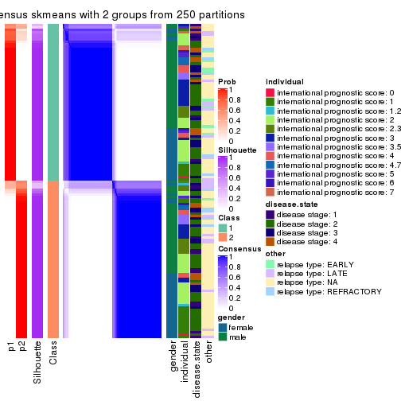</p>

</div>
<div id='tab-MAD-skmeans-consensus-heatmap-2'>
<pre><code class="r">consensus_heatmap(res, k = 3)
</code></pre>

<p>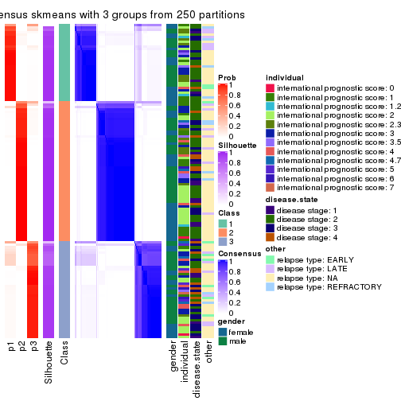</p>

</div>
<div id='tab-MAD-skmeans-consensus-heatmap-3'>
<pre><code class="r">consensus_heatmap(res, k = 4)
</code></pre>

<p>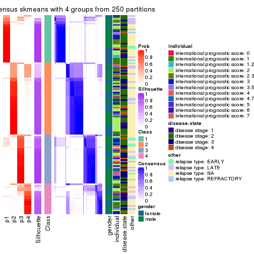</p>

</div>
<div id='tab-MAD-skmeans-consensus-heatmap-4'>
<pre><code class="r">consensus_heatmap(res, k = 5)
</code></pre>

<p>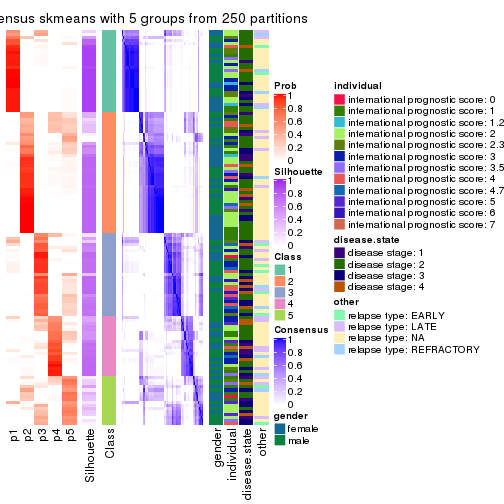</p>

</div>
<div id='tab-MAD-skmeans-consensus-heatmap-5'>
<pre><code class="r">consensus_heatmap(res, k = 6)
</code></pre>

<p>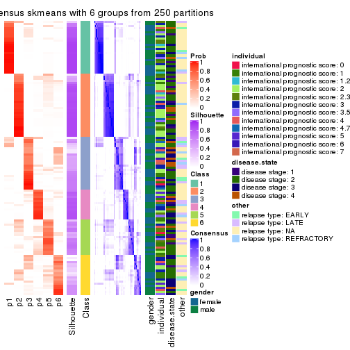</p>

</div>
</div>

Heatmaps for the membership of samples in all partitions to see how consistent they are:


<script>
$( function() {
	$( '#tabs-MAD-skmeans-membership-heatmap' ).tabs();
} );
</script>
<div id='tabs-MAD-skmeans-membership-heatmap'>
<ul>
<li><a href='#tab-MAD-skmeans-membership-heatmap-1'>k = 2</a></li>
<li><a href='#tab-MAD-skmeans-membership-heatmap-2'>k = 3</a></li>
<li><a href='#tab-MAD-skmeans-membership-heatmap-3'>k = 4</a></li>
<li><a href='#tab-MAD-skmeans-membership-heatmap-4'>k = 5</a></li>
<li><a href='#tab-MAD-skmeans-membership-heatmap-5'>k = 6</a></li>
</ul>
<div id='tab-MAD-skmeans-membership-heatmap-1'>
<pre><code class="r">membership_heatmap(res, k = 2)
</code></pre>

<p>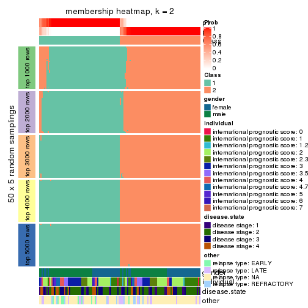</p>

</div>
<div id='tab-MAD-skmeans-membership-heatmap-2'>
<pre><code class="r">membership_heatmap(res, k = 3)
</code></pre>

<p>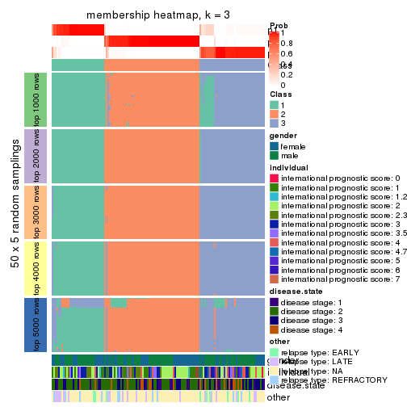</p>

</div>
<div id='tab-MAD-skmeans-membership-heatmap-3'>
<pre><code class="r">membership_heatmap(res, k = 4)
</code></pre>

<p>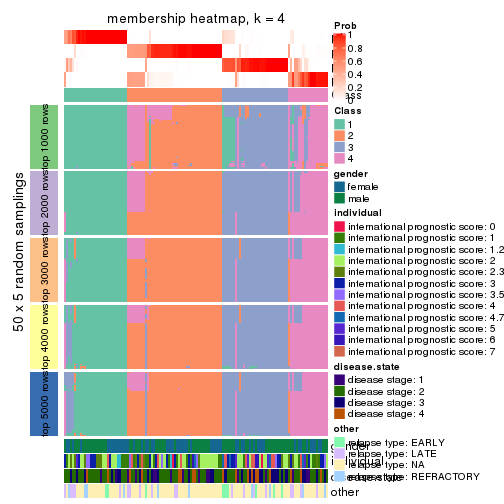</p>

</div>
<div id='tab-MAD-skmeans-membership-heatmap-4'>
<pre><code class="r">membership_heatmap(res, k = 5)
</code></pre>

<p>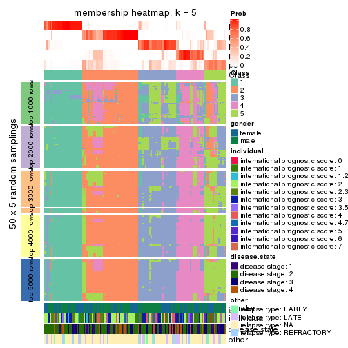</p>

</div>
<div id='tab-MAD-skmeans-membership-heatmap-5'>
<pre><code class="r">membership_heatmap(res, k = 6)
</code></pre>

<p>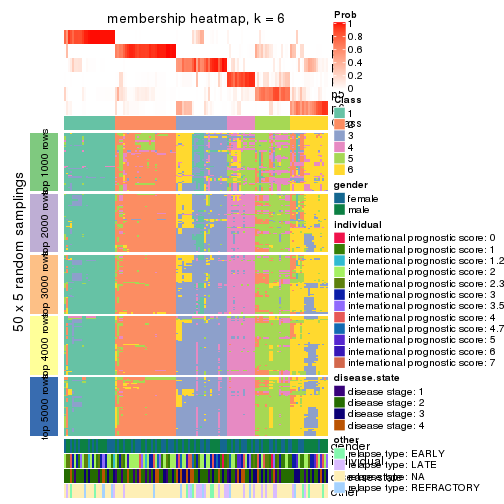</p>

</div>
</div>

As soon as we have had the classes for columns, we can look for signatures
which are significantly different between classes which can be candidate marks
for certain classes. Following are the heatmaps for signatures.


Signature heatmaps where rows are scaled:


<script>
$( function() {
	$( '#tabs-MAD-skmeans-get-signatures' ).tabs();
} );
</script>
<div id='tabs-MAD-skmeans-get-signatures'>
<ul>
<li><a href='#tab-MAD-skmeans-get-signatures-1'>k = 2</a></li>
<li><a href='#tab-MAD-skmeans-get-signatures-2'>k = 3</a></li>
<li><a href='#tab-MAD-skmeans-get-signatures-3'>k = 4</a></li>
<li><a href='#tab-MAD-skmeans-get-signatures-4'>k = 5</a></li>
<li><a href='#tab-MAD-skmeans-get-signatures-5'>k = 6</a></li>
</ul>
<div id='tab-MAD-skmeans-get-signatures-1'>
<pre><code class="r">get_signatures(res, k = 2)
</code></pre>

<p>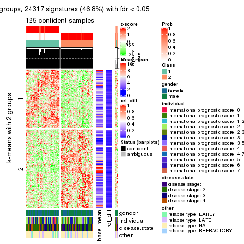</p>

</div>
<div id='tab-MAD-skmeans-get-signatures-2'>
<pre><code class="r">get_signatures(res, k = 3)
</code></pre>

<p>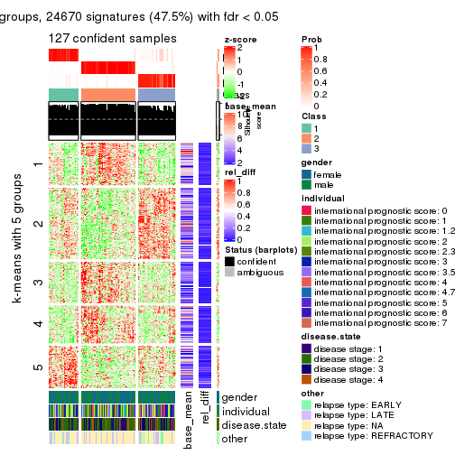</p>

</div>
<div id='tab-MAD-skmeans-get-signatures-3'>
<pre><code class="r">get_signatures(res, k = 4)
</code></pre>

<p>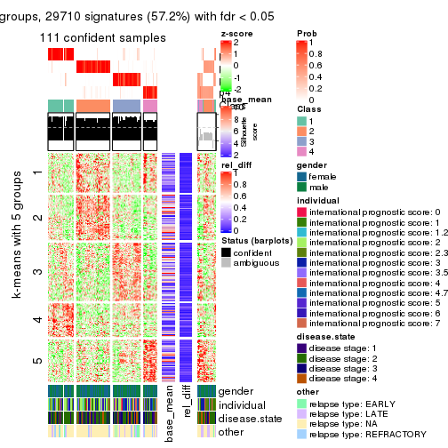</p>

</div>
<div id='tab-MAD-skmeans-get-signatures-4'>
<pre><code class="r">get_signatures(res, k = 5)
</code></pre>

<p>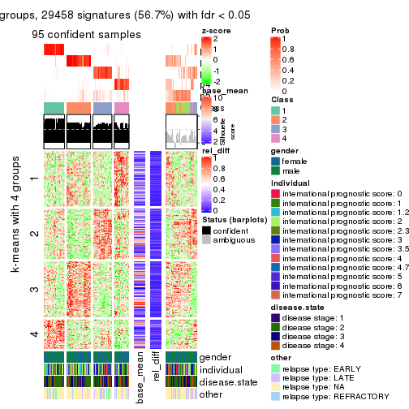</p>

</div>
<div id='tab-MAD-skmeans-get-signatures-5'>
<pre><code class="r">get_signatures(res, k = 6)
</code></pre>

<pre><code>#&gt; Error: The width or height of the raster image is zero, maybe you forget to turn off the
#&gt; previous graphic device or it was corrupted. Run `dev.off()` to close it.
</code></pre>

<p></p>

</div>
</div>


Signature heatmaps where rows are not scaled:


<script>
$( function() {
	$( '#tabs-MAD-skmeans-get-signatures-no-scale' ).tabs();
} );
</script>
<div id='tabs-MAD-skmeans-get-signatures-no-scale'>
<ul>
<li><a href='#tab-MAD-skmeans-get-signatures-no-scale-1'>k = 2</a></li>
<li><a href='#tab-MAD-skmeans-get-signatures-no-scale-2'>k = 3</a></li>
<li><a href='#tab-MAD-skmeans-get-signatures-no-scale-3'>k = 4</a></li>
<li><a href='#tab-MAD-skmeans-get-signatures-no-scale-4'>k = 5</a></li>
<li><a href='#tab-MAD-skmeans-get-signatures-no-scale-5'>k = 6</a></li>
</ul>
<div id='tab-MAD-skmeans-get-signatures-no-scale-1'>
<pre><code class="r">get_signatures(res, k = 2, scale_rows = FALSE)
</code></pre>

<p>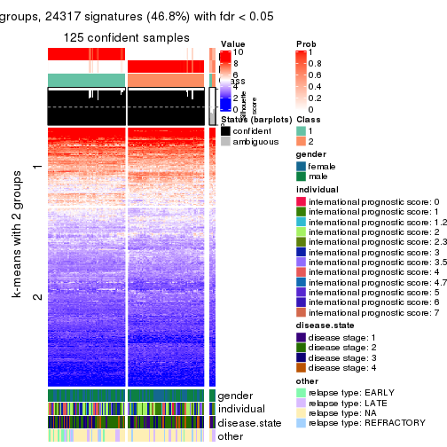</p>

</div>
<div id='tab-MAD-skmeans-get-signatures-no-scale-2'>
<pre><code class="r">get_signatures(res, k = 3, scale_rows = FALSE)
</code></pre>

<p>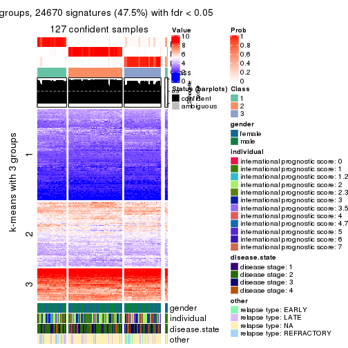</p>

</div>
<div id='tab-MAD-skmeans-get-signatures-no-scale-3'>
<pre><code class="r">get_signatures(res, k = 4, scale_rows = FALSE)
</code></pre>

<p>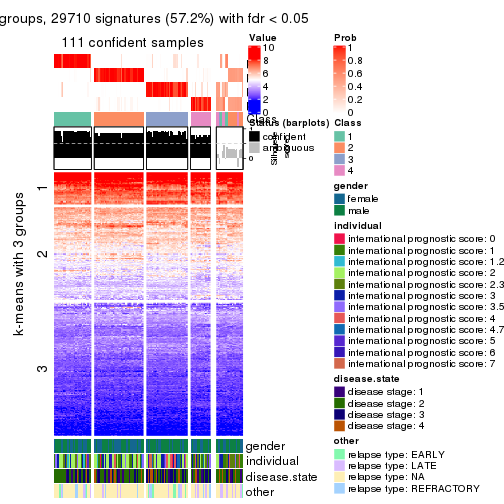</p>

</div>
<div id='tab-MAD-skmeans-get-signatures-no-scale-4'>
<pre><code class="r">get_signatures(res, k = 5, scale_rows = FALSE)
</code></pre>

<p>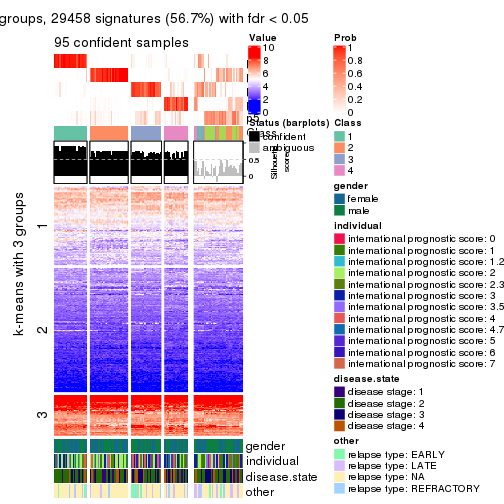</p>

</div>
<div id='tab-MAD-skmeans-get-signatures-no-scale-5'>
<pre><code class="r">get_signatures(res, k = 6, scale_rows = FALSE)
</code></pre>

<pre><code>#&gt; Error in mat[ceiling(1:nr/h_ratio), ceiling(1:nc/w_ratio), drop = FALSE]: subscript out of bounds
</code></pre>

<p>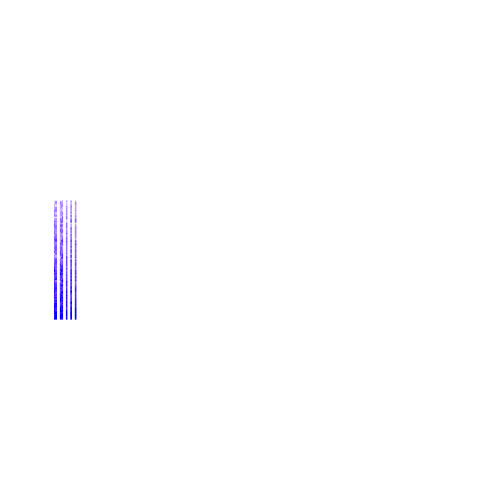</p>

</div>
</div>


Compare the overlap of signatures from different k:

```r
compare_signatures(res)
```

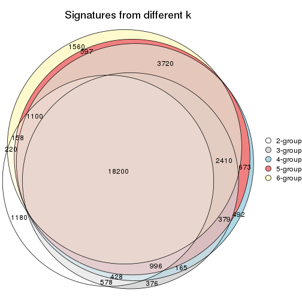

`get_signature()` returns a data frame invisibly. TO get the list of signatures, the function
call should be assigned to a variable explicitly. In following code, if `plot` argument is set
to `FALSE`, no heatmap is plotted while only the differential analysis is performed.

```r
# code only for demonstration
tb = get_signature(res, k = ..., plot = FALSE)
```

An example of the output of `tb` is:

```
#>   which_row         fdr    mean_1    mean_2 scaled_mean_1 scaled_mean_2 km
#> 1        38 0.042760348  8.373488  9.131774    -0.5533452     0.5164555  1
#> 2        40 0.018707592  7.106213  8.469186    -0.6173731     0.5762149  1
#> 3        55 0.019134737 10.221463 11.207825    -0.6159697     0.5749050  1
#> 4        59 0.006059896  5.921854  7.869574    -0.6899429     0.6439467  1
#> 5        60 0.018055526  8.928898 10.211722    -0.6204761     0.5791110  1
#> 6        98 0.009384629 15.714769 14.887706     0.6635654    -0.6193277  2
...
```

The columns in `tb` are:

1. `which_row`: row indices corresponding to the input matrix.
2. `fdr`: FDR for the differential test. 
3. `mean_x`: The mean value in group x.
4. `scaled_mean_x`: The mean value in group x after rows are scaled.
5. `km`: Row groups if k-means clustering is applied to rows.


UMAP plot which shows how samples are separated.


<script>
$( function() {
	$( '#tabs-MAD-skmeans-dimension-reduction' ).tabs();
} );
</script>
<div id='tabs-MAD-skmeans-dimension-reduction'>
<ul>
<li><a href='#tab-MAD-skmeans-dimension-reduction-1'>k = 2</a></li>
<li><a href='#tab-MAD-skmeans-dimension-reduction-2'>k = 3</a></li>
<li><a href='#tab-MAD-skmeans-dimension-reduction-3'>k = 4</a></li>
<li><a href='#tab-MAD-skmeans-dimension-reduction-4'>k = 5</a></li>
<li><a href='#tab-MAD-skmeans-dimension-reduction-5'>k = 6</a></li>
</ul>
<div id='tab-MAD-skmeans-dimension-reduction-1'>
<pre><code class="r">dimension_reduction(res, k = 2, method = &quot;UMAP&quot;)
</code></pre>

<p>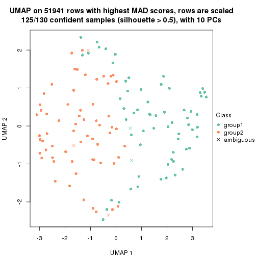</p>

</div>
<div id='tab-MAD-skmeans-dimension-reduction-2'>
<pre><code class="r">dimension_reduction(res, k = 3, method = &quot;UMAP&quot;)
</code></pre>

<p>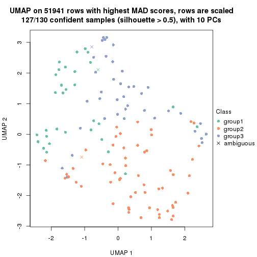</p>

</div>
<div id='tab-MAD-skmeans-dimension-reduction-3'>
<pre><code class="r">dimension_reduction(res, k = 4, method = &quot;UMAP&quot;)
</code></pre>

<p>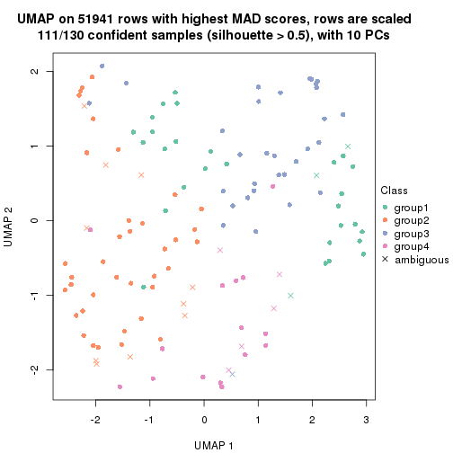</p>

</div>
<div id='tab-MAD-skmeans-dimension-reduction-4'>
<pre><code class="r">dimension_reduction(res, k = 5, method = &quot;UMAP&quot;)
</code></pre>

<p>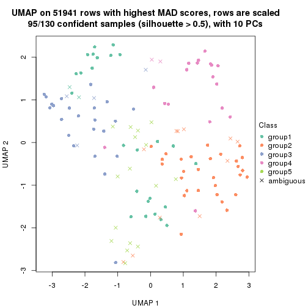</p>

</div>
<div id='tab-MAD-skmeans-dimension-reduction-5'>
<pre><code class="r">dimension_reduction(res, k = 6, method = &quot;UMAP&quot;)
</code></pre>

<p>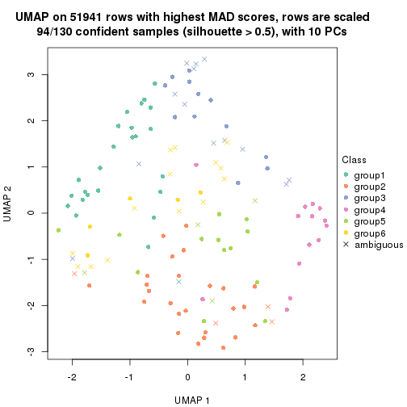</p>

</div>
</div>


Following heatmap shows how subgroups are split when increasing `k`:

```r
collect_classes(res)
```

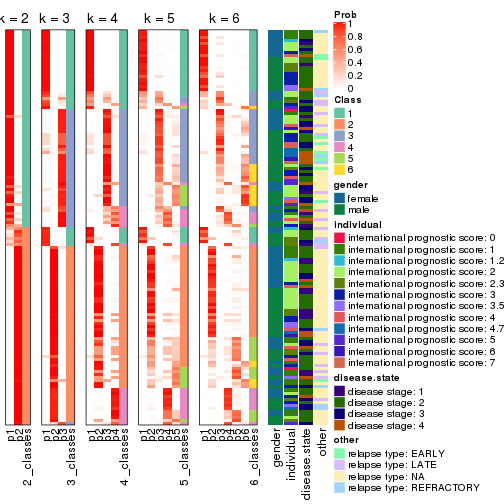


Test correlation between subgroups and known annotations. If the known
annotation is numeric, one-way ANOVA test is applied, and if the known
annotation is discrete, chi-squared contingency table test is applied.

```r
test_to_known_factors(res)
```

```
#>               n gender(p) individual(p) disease.state(p) other(p) k
#> MAD:skmeans 125     0.535        0.8007            0.513   0.0938 2
#> MAD:skmeans 127     0.431        0.0918            0.162   0.1117 3
#> MAD:skmeans 111     0.217        0.3861            0.166   0.0888 4
#> MAD:skmeans  95     0.338        0.1399            0.466   0.1041 5
#> MAD:skmeans  94     0.893        0.4091            0.473   0.0309 6
```


If matrix rows can be associated to genes, consider to use `GO_Enrichment(res,
...)` to perform function enrichment for the signature genes.


 

---------------------------------------------------


### MAD:pam


The object with results only for a single top-value method and a single partition method 
can be extracted as:

```r
res = res_list["MAD", "pam"]
# you can also extract it by
# res = res_list["MAD:pam"]
```

A summary of `res` and all the functions that can be applied to it:

```r
res
```

```
#> A 'ConsensusPartition' object with k = 2, 3, 4, 5, 6.
#>   On a matrix with 51941 rows and 130 columns.
#>   Top rows (1000, 2000, 3000, 4000, 5000) are extracted by 'MAD' method.
#>   Subgroups are detected by 'pam' method.
#>   Performed in total 1250 partitions by row resampling.
#>   Best k for subgroups seems to be 2.
#> 
#> Following methods can be applied to this 'ConsensusPartition' object:
#>  [1] "cola_report"             "collect_classes"         "collect_plots"          
#>  [4] "collect_stats"           "colnames"                "compare_signatures"     
#>  [7] "consensus_heatmap"       "dimension_reduction"     "functional_enrichment"  
#> [10] "get_anno_col"            "get_anno"                "get_classes"            
#> [13] "get_consensus"           "get_matrix"              "get_membership"         
#> [16] "get_param"               "get_signatures"          "get_stats"              
#> [19] "is_best_k"               "is_stable_k"             "membership_heatmap"     
#> [22] "ncol"                    "nrow"                    "plot_ecdf"              
#> [25] "rownames"                "select_partition_number" "show"                   
#> [28] "suggest_best_k"          "test_to_known_factors"
```

`collect_plots()` function collects all the plots made from `res` for all `k` (number of partitions)
into one single page to provide an easy and fast comparison between different `k`.

```r
collect_plots(res)
```

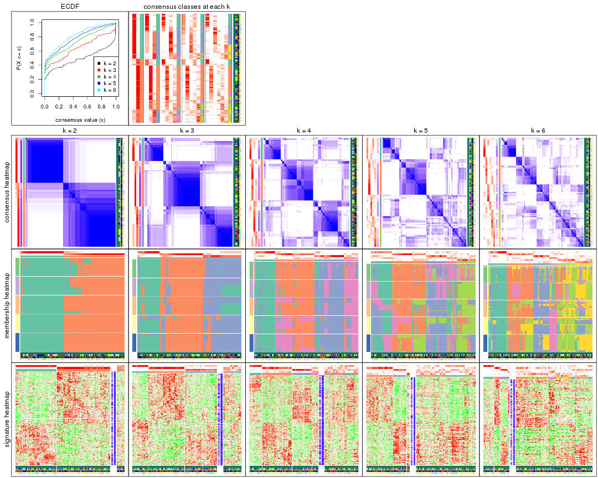

The plots are:

- The first row: a plot of the ECDF (Empirical cumulative distribution
  function) curves of the consensus matrix for each `k` and the heatmap of
  predicted classes for each `k`.
- The second row: heatmaps of the consensus matrix for each `k`.
- The third row: heatmaps of the membership matrix for each `k`.
- The fouth row: heatmaps of the signatures for each `k`.

All the plots in panels can be made by individual functions and they are
plotted later in this section.

`select_partition_number()` produces several plots showing different
statistics for choosing "optimized" `k`. There are following statistics:

- ECDF curves of the consensus matrix for each `k`;
- 1-PAC. [The PAC
  score](https://en.wikipedia.org/wiki/Consensus_clustering#Over-interpretation_potential_of_consensus_clustering)
  measures the proportion of the ambiguous subgrouping.
- Mean silhouette score.
- Concordance. The mean probability of fiting the consensus class ids in all
  partitions.
- Area increased. Denote $A_k$ as the area under the ECDF curve for current
  `k`, the area increased is defined as $A_k - A_{k-1}$.
- Rand index. The percent of pairs of samples that are both in a same cluster
  or both are not in a same cluster in the partition of k and k-1.
- Jaccard index. The ratio of pairs of samples are both in a same cluster in
  the partition of k and k-1 and the pairs of samples are both in a same
  cluster in the partition k or k-1.

The detailed explanations of these statistics can be found in [the cola
vignette](http://bioconductor.org/packages/devel/bioc/vignettes/cola/inst/doc/cola.html#toc_13).

Generally speaking, lower PAC score, higher mean silhouette score or higher
concordance corresponds to better partition. Rand index and Jaccard index
measure how similar the current partition is compared to partition with `k-1`.
If they are too similar, we won't accept `k` is better than `k-1`.

```r
select_partition_number(res)
```

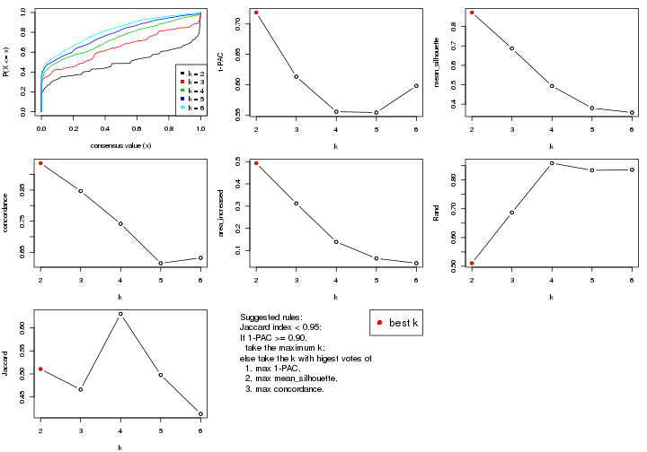

The numeric values for all these statistics can be obtained by `get_stats()`.

```r
get_stats(res)
```

```
#>   k 1-PAC mean_silhouette concordance area_increased  Rand Jaccard
#> 2 2 0.719           0.872       0.936         0.4928 0.511   0.511
#> 3 3 0.613           0.687       0.847         0.3120 0.687   0.466
#> 4 4 0.556           0.494       0.742         0.1393 0.858   0.631
#> 5 5 0.554           0.380       0.615         0.0651 0.833   0.498
#> 6 6 0.598           0.357       0.632         0.0435 0.835   0.413
```

`suggest_best_k()` suggests the best $k$ based on these statistics. The rules are as follows:

- All $k$ with Jaccard index larger than 0.95 are removed because the increase of
  the partition number does not provides enough extra information. If all $k$ are removed,
  the best $k$ is assigned by `NA`.
- For $k$ with 1-PAC larger than 0.9, the maximal $k$ is taken as the "best k". Other $k$ is called "optional k".
- If it does not fit the second rule. The $k$ with the highest vote of highest
  1-PAC, mean silhouette and concordance is taken as the "best k".

```r
suggest_best_k(res)
```

```
#> [1] 2
```


Following shows the table of the partitions (You need to click the **show/hide
code output** link to see it). The membership matrix (columns with name `p*`)
is inferred by
[`clue::cl_consensus()`](https://www.rdocumentation.org/link/cl_consensus?package=clue)
function with the `SE` method. Basically the value in the membership matrix
represents the probability to belong to a certain group. The finall class
label for an item is determined with the group with highest probability it
belongs to.

In `get_classes()` function, the entropy is calculated from the membership
matrix and the silhouette score is calculated from the consensus matrix.


<script>
$( function() {
	$( '#tabs-MAD-pam-get-classes' ).tabs();
} );
</script>
<div id='tabs-MAD-pam-get-classes'>
<ul>
<li><a href='#tab-MAD-pam-get-classes-1'>k = 2</a></li>
<li><a href='#tab-MAD-pam-get-classes-2'>k = 3</a></li>
<li><a href='#tab-MAD-pam-get-classes-3'>k = 4</a></li>
<li><a href='#tab-MAD-pam-get-classes-4'>k = 5</a></li>
<li><a href='#tab-MAD-pam-get-classes-5'>k = 6</a></li>
</ul>

<div id='tab-MAD-pam-get-classes-1'>
<p><a id='tab-MAD-pam-get-classes-1-a' style='color:#0366d6' href='#'>show/hide code output</a></p>
<pre><code class="r">cbind(get_classes(res, k = 2), get_membership(res, k = 2))
</code></pre>

<pre><code>#&gt;           class entropy silhouette    p1    p2
#&gt; GSM447671     2  0.8207      0.711 0.256 0.744
#&gt; GSM447694     1  0.0000      0.976 1.000 0.000
#&gt; GSM447618     2  0.0938      0.898 0.012 0.988
#&gt; GSM447691     2  0.8267      0.708 0.260 0.740
#&gt; GSM447733     2  0.9833      0.440 0.424 0.576
#&gt; GSM447620     2  0.8861      0.662 0.304 0.696
#&gt; GSM447627     1  0.0000      0.976 1.000 0.000
#&gt; GSM447630     2  0.0000      0.900 0.000 1.000
#&gt; GSM447642     1  0.0000      0.976 1.000 0.000
#&gt; GSM447649     2  0.0000      0.900 0.000 1.000
#&gt; GSM447654     2  0.0672      0.899 0.008 0.992
#&gt; GSM447655     2  0.0000      0.900 0.000 1.000
#&gt; GSM447669     2  0.5294      0.840 0.120 0.880
#&gt; GSM447676     1  0.0000      0.976 1.000 0.000
#&gt; GSM447678     2  0.5178      0.842 0.116 0.884
#&gt; GSM447681     2  0.0000      0.900 0.000 1.000
#&gt; GSM447698     2  0.0000      0.900 0.000 1.000
#&gt; GSM447713     1  0.0000      0.976 1.000 0.000
#&gt; GSM447722     2  0.8207      0.711 0.256 0.744
#&gt; GSM447726     2  0.6343      0.814 0.160 0.840
#&gt; GSM447735     1  0.0000      0.976 1.000 0.000
#&gt; GSM447737     1  0.0000      0.976 1.000 0.000
#&gt; GSM447657     2  0.0000      0.900 0.000 1.000
#&gt; GSM447674     2  0.0000      0.900 0.000 1.000
#&gt; GSM447636     2  0.3114      0.881 0.056 0.944
#&gt; GSM447723     1  0.0000      0.976 1.000 0.000
#&gt; GSM447699     1  0.2423      0.937 0.960 0.040
#&gt; GSM447708     2  0.8861      0.662 0.304 0.696
#&gt; GSM447721     1  0.0000      0.976 1.000 0.000
#&gt; GSM447623     1  0.0000      0.976 1.000 0.000
#&gt; GSM447621     1  0.0000      0.976 1.000 0.000
#&gt; GSM447650     2  0.0000      0.900 0.000 1.000
#&gt; GSM447651     2  0.0000      0.900 0.000 1.000
#&gt; GSM447653     1  0.0376      0.973 0.996 0.004
#&gt; GSM447658     2  0.3584      0.877 0.068 0.932
#&gt; GSM447675     2  0.4815      0.852 0.104 0.896
#&gt; GSM447680     2  0.2236      0.889 0.036 0.964
#&gt; GSM447686     2  0.1414      0.895 0.020 0.980
#&gt; GSM447736     1  0.0000      0.976 1.000 0.000
#&gt; GSM447629     2  0.1184      0.896 0.016 0.984
#&gt; GSM447648     1  0.0000      0.976 1.000 0.000
#&gt; GSM447660     2  0.9896      0.408 0.440 0.560
#&gt; GSM447661     2  0.0000      0.900 0.000 1.000
#&gt; GSM447663     1  0.1414      0.959 0.980 0.020
#&gt; GSM447704     2  0.0000      0.900 0.000 1.000
#&gt; GSM447720     2  0.9881      0.418 0.436 0.564
#&gt; GSM447652     2  0.0000      0.900 0.000 1.000
#&gt; GSM447679     2  0.0000      0.900 0.000 1.000
#&gt; GSM447712     1  0.4690      0.864 0.900 0.100
#&gt; GSM447664     2  0.1633      0.894 0.024 0.976
#&gt; GSM447637     1  0.0000      0.976 1.000 0.000
#&gt; GSM447639     1  0.9044      0.471 0.680 0.320
#&gt; GSM447615     1  0.0000      0.976 1.000 0.000
#&gt; GSM447656     2  0.2236      0.889 0.036 0.964
#&gt; GSM447673     2  0.0000      0.900 0.000 1.000
#&gt; GSM447719     1  0.0000      0.976 1.000 0.000
#&gt; GSM447706     1  0.0000      0.976 1.000 0.000
#&gt; GSM447612     1  0.1184      0.962 0.984 0.016
#&gt; GSM447665     2  0.0000      0.900 0.000 1.000
#&gt; GSM447677     2  0.0000      0.900 0.000 1.000
#&gt; GSM447613     1  0.0000      0.976 1.000 0.000
#&gt; GSM447659     1  0.1633      0.954 0.976 0.024
#&gt; GSM447662     1  0.0000      0.976 1.000 0.000
#&gt; GSM447666     2  0.9881      0.418 0.436 0.564
#&gt; GSM447668     2  0.0000      0.900 0.000 1.000
#&gt; GSM447682     2  0.0000      0.900 0.000 1.000
#&gt; GSM447683     2  0.0000      0.900 0.000 1.000
#&gt; GSM447688     2  0.0000      0.900 0.000 1.000
#&gt; GSM447702     2  0.0000      0.900 0.000 1.000
#&gt; GSM447709     2  0.5059      0.844 0.112 0.888
#&gt; GSM447711     1  0.7376      0.709 0.792 0.208
#&gt; GSM447715     2  0.3114      0.881 0.056 0.944
#&gt; GSM447693     1  0.0000      0.976 1.000 0.000
#&gt; GSM447611     2  0.4161      0.869 0.084 0.916
#&gt; GSM447672     2  0.0000      0.900 0.000 1.000
#&gt; GSM447703     2  0.0000      0.900 0.000 1.000
#&gt; GSM447727     2  0.9881      0.418 0.436 0.564
#&gt; GSM447638     2  0.3114      0.881 0.056 0.944
#&gt; GSM447670     1  0.0000      0.976 1.000 0.000
#&gt; GSM447700     2  0.8207      0.711 0.256 0.744
#&gt; GSM447738     2  0.0000      0.900 0.000 1.000
#&gt; GSM447739     1  0.0000      0.976 1.000 0.000
#&gt; GSM447617     1  0.0000      0.976 1.000 0.000
#&gt; GSM447628     2  0.0000      0.900 0.000 1.000
#&gt; GSM447632     2  0.0000      0.900 0.000 1.000
#&gt; GSM447619     1  0.0000      0.976 1.000 0.000
#&gt; GSM447643     2  0.3114      0.881 0.056 0.944
#&gt; GSM447724     1  0.9393      0.355 0.644 0.356
#&gt; GSM447728     2  0.0000      0.900 0.000 1.000
#&gt; GSM447610     1  0.0000      0.976 1.000 0.000
#&gt; GSM447633     2  0.8144      0.715 0.252 0.748
#&gt; GSM447634     1  0.0000      0.976 1.000 0.000
#&gt; GSM447622     1  0.0000      0.976 1.000 0.000
#&gt; GSM447667     2  0.3114      0.881 0.056 0.944
#&gt; GSM447687     2  0.0000      0.900 0.000 1.000
#&gt; GSM447695     1  0.0000      0.976 1.000 0.000
#&gt; GSM447696     1  0.0000      0.976 1.000 0.000
#&gt; GSM447697     1  0.0000      0.976 1.000 0.000
#&gt; GSM447714     1  0.0000      0.976 1.000 0.000
#&gt; GSM447717     2  0.3733      0.873 0.072 0.928
#&gt; GSM447725     1  0.1843      0.949 0.972 0.028
#&gt; GSM447729     2  0.0000      0.900 0.000 1.000
#&gt; GSM447644     2  0.7219      0.771 0.200 0.800
#&gt; GSM447710     1  0.0000      0.976 1.000 0.000
#&gt; GSM447614     1  0.0000      0.976 1.000 0.000
#&gt; GSM447685     2  0.0000      0.900 0.000 1.000
#&gt; GSM447690     1  0.0000      0.976 1.000 0.000
#&gt; GSM447730     2  0.0000      0.900 0.000 1.000
#&gt; GSM447646     2  0.0000      0.900 0.000 1.000
#&gt; GSM447689     2  0.9881      0.418 0.436 0.564
#&gt; GSM447635     2  0.8861      0.655 0.304 0.696
#&gt; GSM447641     1  0.0000      0.976 1.000 0.000
#&gt; GSM447716     2  0.0000      0.900 0.000 1.000
#&gt; GSM447718     2  0.0672      0.899 0.008 0.992
#&gt; GSM447616     1  0.0000      0.976 1.000 0.000
#&gt; GSM447626     1  0.0000      0.976 1.000 0.000
#&gt; GSM447640     2  0.0000      0.900 0.000 1.000
#&gt; GSM447734     1  0.0000      0.976 1.000 0.000
#&gt; GSM447692     1  0.0000      0.976 1.000 0.000
#&gt; GSM447647     2  0.0000      0.900 0.000 1.000
#&gt; GSM447624     1  0.0000      0.976 1.000 0.000
#&gt; GSM447625     1  0.0000      0.976 1.000 0.000
#&gt; GSM447707     2  0.0000      0.900 0.000 1.000
#&gt; GSM447732     1  0.0000      0.976 1.000 0.000
#&gt; GSM447684     2  0.9881      0.418 0.436 0.564
#&gt; GSM447731     2  0.3733      0.872 0.072 0.928
#&gt; GSM447705     2  0.9686      0.498 0.396 0.604
#&gt; GSM447631     1  0.0000      0.976 1.000 0.000
#&gt; GSM447701     2  0.0000      0.900 0.000 1.000
#&gt; GSM447645     1  0.0000      0.976 1.000 0.000
</code></pre>

<script>
$('#tab-MAD-pam-get-classes-1-a').parent().next().next().hide();
$('#tab-MAD-pam-get-classes-1-a').click(function(){
  $('#tab-MAD-pam-get-classes-1-a').parent().next().next().toggle();
  return(false);
});
</script>
</div>

<div id='tab-MAD-pam-get-classes-2'>
<p><a id='tab-MAD-pam-get-classes-2-a' style='color:#0366d6' href='#'>show/hide code output</a></p>
<pre><code class="r">cbind(get_classes(res, k = 3), get_membership(res, k = 3))
</code></pre>

<pre><code>#&gt;           class entropy silhouette    p1    p2    p3
#&gt; GSM447671     3  0.4842     0.5301 0.000 0.224 0.776
#&gt; GSM447694     3  0.5785     0.6839 0.332 0.000 0.668
#&gt; GSM447618     2  0.5397     0.6350 0.000 0.720 0.280
#&gt; GSM447691     3  0.5988     0.2207 0.000 0.368 0.632
#&gt; GSM447733     3  0.0237     0.6577 0.000 0.004 0.996
#&gt; GSM447620     3  0.6140     0.1165 0.000 0.404 0.596
#&gt; GSM447627     3  0.5733     0.6895 0.324 0.000 0.676
#&gt; GSM447630     2  0.2448     0.8316 0.000 0.924 0.076
#&gt; GSM447642     1  0.0000     0.8267 1.000 0.000 0.000
#&gt; GSM447649     2  0.0000     0.8832 0.000 1.000 0.000
#&gt; GSM447654     2  0.6675     0.3394 0.012 0.584 0.404
#&gt; GSM447655     2  0.0000     0.8832 0.000 1.000 0.000
#&gt; GSM447669     2  0.6126     0.4288 0.000 0.600 0.400
#&gt; GSM447676     1  0.6252    -0.0490 0.556 0.000 0.444
#&gt; GSM447678     3  0.4974     0.4734 0.000 0.236 0.764
#&gt; GSM447681     2  0.0000     0.8832 0.000 1.000 0.000
#&gt; GSM447698     2  0.5254     0.6541 0.000 0.736 0.264
#&gt; GSM447713     1  0.0237     0.8261 0.996 0.000 0.004
#&gt; GSM447722     3  0.2165     0.6601 0.000 0.064 0.936
#&gt; GSM447726     2  0.3918     0.7572 0.004 0.856 0.140
#&gt; GSM447735     3  0.5733     0.6895 0.324 0.000 0.676
#&gt; GSM447737     3  0.6308     0.3739 0.492 0.000 0.508
#&gt; GSM447657     2  0.0000     0.8832 0.000 1.000 0.000
#&gt; GSM447674     2  0.0237     0.8820 0.000 0.996 0.004
#&gt; GSM447636     1  0.7213     0.4975 0.668 0.272 0.060
#&gt; GSM447723     1  0.4346     0.5854 0.816 0.000 0.184
#&gt; GSM447699     3  0.2066     0.6798 0.060 0.000 0.940
#&gt; GSM447708     3  0.6225     0.0231 0.000 0.432 0.568
#&gt; GSM447721     1  0.0237     0.8258 0.996 0.000 0.004
#&gt; GSM447623     1  0.0424     0.8248 0.992 0.000 0.008
#&gt; GSM447621     1  0.0424     0.8248 0.992 0.000 0.008
#&gt; GSM447650     2  0.0000     0.8832 0.000 1.000 0.000
#&gt; GSM447651     2  0.0000     0.8832 0.000 1.000 0.000
#&gt; GSM447653     3  0.5291     0.6663 0.268 0.000 0.732
#&gt; GSM447658     1  0.7213     0.4975 0.668 0.272 0.060
#&gt; GSM447675     3  0.5024     0.4580 0.004 0.220 0.776
#&gt; GSM447680     2  0.0000     0.8832 0.000 1.000 0.000
#&gt; GSM447686     2  0.0747     0.8759 0.016 0.984 0.000
#&gt; GSM447736     3  0.5733     0.6895 0.324 0.000 0.676
#&gt; GSM447629     2  0.0237     0.8818 0.000 0.996 0.004
#&gt; GSM447648     3  0.5733     0.6895 0.324 0.000 0.676
#&gt; GSM447660     1  0.2636     0.7859 0.932 0.048 0.020
#&gt; GSM447661     2  0.0000     0.8832 0.000 1.000 0.000
#&gt; GSM447663     3  0.2066     0.6798 0.060 0.000 0.940
#&gt; GSM447704     2  0.0000     0.8832 0.000 1.000 0.000
#&gt; GSM447720     3  0.2400     0.6593 0.004 0.064 0.932
#&gt; GSM447652     2  0.0592     0.8784 0.000 0.988 0.012
#&gt; GSM447679     2  0.0000     0.8832 0.000 1.000 0.000
#&gt; GSM447712     1  0.0000     0.8267 1.000 0.000 0.000
#&gt; GSM447664     2  0.5843     0.6315 0.016 0.732 0.252
#&gt; GSM447637     3  0.5785     0.6839 0.332 0.000 0.668
#&gt; GSM447639     3  0.2200     0.6789 0.056 0.004 0.940
#&gt; GSM447615     3  0.5760     0.6875 0.328 0.000 0.672
#&gt; GSM447656     2  0.0237     0.8817 0.004 0.996 0.000
#&gt; GSM447673     2  0.0592     0.8784 0.000 0.988 0.012
#&gt; GSM447719     3  0.5363     0.6698 0.276 0.000 0.724
#&gt; GSM447706     3  0.5760     0.6875 0.328 0.000 0.672
#&gt; GSM447612     3  0.2066     0.6798 0.060 0.000 0.940
#&gt; GSM447665     2  0.5254     0.6541 0.000 0.736 0.264
#&gt; GSM447677     2  0.0000     0.8832 0.000 1.000 0.000
#&gt; GSM447613     1  0.0000     0.8267 1.000 0.000 0.000
#&gt; GSM447659     3  0.1411     0.6739 0.036 0.000 0.964
#&gt; GSM447662     3  0.4235     0.6912 0.176 0.000 0.824
#&gt; GSM447666     3  0.5643     0.5381 0.020 0.220 0.760
#&gt; GSM447668     2  0.0000     0.8832 0.000 1.000 0.000
#&gt; GSM447682     2  0.0237     0.8820 0.000 0.996 0.004
#&gt; GSM447683     2  0.0000     0.8832 0.000 1.000 0.000
#&gt; GSM447688     2  0.5254     0.6541 0.000 0.736 0.264
#&gt; GSM447702     2  0.0000     0.8832 0.000 1.000 0.000
#&gt; GSM447709     2  0.6215     0.3712 0.000 0.572 0.428
#&gt; GSM447711     1  0.0000     0.8267 1.000 0.000 0.000
#&gt; GSM447715     2  0.0237     0.8817 0.004 0.996 0.000
#&gt; GSM447693     3  0.5733     0.6895 0.324 0.000 0.676
#&gt; GSM447611     2  0.6941     0.1720 0.016 0.520 0.464
#&gt; GSM447672     2  0.0000     0.8832 0.000 1.000 0.000
#&gt; GSM447703     2  0.0000     0.8832 0.000 1.000 0.000
#&gt; GSM447727     1  0.3550     0.7593 0.896 0.080 0.024
#&gt; GSM447638     2  0.5706     0.4783 0.320 0.680 0.000
#&gt; GSM447670     1  0.0592     0.8219 0.988 0.000 0.012
#&gt; GSM447700     3  0.4796     0.5353 0.000 0.220 0.780
#&gt; GSM447738     2  0.0000     0.8832 0.000 1.000 0.000
#&gt; GSM447739     1  0.0000     0.8267 1.000 0.000 0.000
#&gt; GSM447617     1  0.0747     0.8202 0.984 0.000 0.016
#&gt; GSM447628     2  0.2066     0.8478 0.000 0.940 0.060
#&gt; GSM447632     2  0.0592     0.8784 0.000 0.988 0.012
#&gt; GSM447619     3  0.5760     0.6875 0.328 0.000 0.672
#&gt; GSM447643     1  0.6255     0.4535 0.668 0.320 0.012
#&gt; GSM447724     3  0.2443     0.6729 0.028 0.032 0.940
#&gt; GSM447728     2  0.0000     0.8832 0.000 1.000 0.000
#&gt; GSM447610     1  0.6309    -0.2211 0.504 0.000 0.496
#&gt; GSM447633     3  0.6180     0.0783 0.000 0.416 0.584
#&gt; GSM447634     3  0.5733     0.6895 0.324 0.000 0.676
#&gt; GSM447622     3  0.5785     0.6839 0.332 0.000 0.668
#&gt; GSM447667     2  0.1765     0.8563 0.040 0.956 0.004
#&gt; GSM447687     2  0.0237     0.8820 0.000 0.996 0.004
#&gt; GSM447695     3  0.5733     0.6895 0.324 0.000 0.676
#&gt; GSM447696     1  0.0000     0.8267 1.000 0.000 0.000
#&gt; GSM447697     1  0.0237     0.8261 0.996 0.000 0.004
#&gt; GSM447714     3  0.2066     0.6798 0.060 0.000 0.940
#&gt; GSM447717     1  0.6200     0.4673 0.676 0.312 0.012
#&gt; GSM447725     1  0.2066     0.7910 0.940 0.000 0.060
#&gt; GSM447729     2  0.5171     0.7045 0.012 0.784 0.204
#&gt; GSM447644     2  0.6309     0.1841 0.000 0.504 0.496
#&gt; GSM447710     3  0.5733     0.6895 0.324 0.000 0.676
#&gt; GSM447614     3  0.5733     0.6895 0.324 0.000 0.676
#&gt; GSM447685     2  0.0000     0.8832 0.000 1.000 0.000
#&gt; GSM447690     1  0.0237     0.8261 0.996 0.000 0.004
#&gt; GSM447730     2  0.0000     0.8832 0.000 1.000 0.000
#&gt; GSM447646     2  0.2066     0.8478 0.000 0.940 0.060
#&gt; GSM447689     3  0.2400     0.6593 0.004 0.064 0.932
#&gt; GSM447635     3  0.2165     0.6601 0.000 0.064 0.936
#&gt; GSM447641     1  0.0000     0.8267 1.000 0.000 0.000
#&gt; GSM447716     2  0.0000     0.8832 0.000 1.000 0.000
#&gt; GSM447718     2  0.6104     0.4034 0.004 0.648 0.348
#&gt; GSM447616     3  0.5785     0.6839 0.332 0.000 0.668
#&gt; GSM447626     1  0.4974     0.4842 0.764 0.000 0.236
#&gt; GSM447640     2  0.0000     0.8832 0.000 1.000 0.000
#&gt; GSM447734     3  0.5733     0.6895 0.324 0.000 0.676
#&gt; GSM447692     3  0.5785     0.6839 0.332 0.000 0.668
#&gt; GSM447647     2  0.2066     0.8478 0.000 0.940 0.060
#&gt; GSM447624     1  0.0747     0.8202 0.984 0.000 0.016
#&gt; GSM447625     3  0.5733     0.6895 0.324 0.000 0.676
#&gt; GSM447707     2  0.0000     0.8832 0.000 1.000 0.000
#&gt; GSM447732     3  0.5733     0.6895 0.324 0.000 0.676
#&gt; GSM447684     1  0.7101     0.4864 0.704 0.080 0.216
#&gt; GSM447731     2  0.6682     0.1103 0.008 0.504 0.488
#&gt; GSM447705     3  0.2400     0.6593 0.004 0.064 0.932
#&gt; GSM447631     3  0.5733     0.6895 0.324 0.000 0.676
#&gt; GSM447701     2  0.0000     0.8832 0.000 1.000 0.000
#&gt; GSM447645     3  0.5835     0.6741 0.340 0.000 0.660
</code></pre>

<script>
$('#tab-MAD-pam-get-classes-2-a').parent().next().next().hide();
$('#tab-MAD-pam-get-classes-2-a').click(function(){
  $('#tab-MAD-pam-get-classes-2-a').parent().next().next().toggle();
  return(false);
});
</script>
</div>

<div id='tab-MAD-pam-get-classes-3'>
<p><a id='tab-MAD-pam-get-classes-3-a' style='color:#0366d6' href='#'>show/hide code output</a></p>
<pre><code class="r">cbind(get_classes(res, k = 4), get_membership(res, k = 4))
</code></pre>

<pre><code>#&gt;           class entropy silhouette    p1    p2    p3    p4
#&gt; GSM447671     4  0.7647     0.5798 0.000 0.388 0.208 0.404
#&gt; GSM447694     3  0.0469     0.7224 0.012 0.000 0.988 0.000
#&gt; GSM447618     2  0.5387    -0.3272 0.000 0.584 0.016 0.400
#&gt; GSM447691     4  0.7648     0.5762 0.000 0.392 0.208 0.400
#&gt; GSM447733     4  0.5334     0.0907 0.004 0.004 0.484 0.508
#&gt; GSM447620     4  0.5646     0.5644 0.008 0.384 0.016 0.592
#&gt; GSM447627     3  0.0000     0.7228 0.000 0.000 1.000 0.000
#&gt; GSM447630     2  0.5420     0.4905 0.032 0.764 0.156 0.048
#&gt; GSM447642     1  0.0000     0.7504 1.000 0.000 0.000 0.000
#&gt; GSM447649     2  0.3074     0.6870 0.000 0.848 0.000 0.152
#&gt; GSM447654     2  0.5837     0.5968 0.000 0.564 0.036 0.400
#&gt; GSM447655     2  0.3266     0.6904 0.000 0.832 0.000 0.168
#&gt; GSM447669     2  0.6262    -0.4109 0.000 0.540 0.060 0.400
#&gt; GSM447676     1  0.4331     0.4155 0.712 0.000 0.288 0.000
#&gt; GSM447678     4  0.5395     0.2631 0.000 0.184 0.084 0.732
#&gt; GSM447681     2  0.3266     0.6946 0.000 0.832 0.000 0.168
#&gt; GSM447698     2  0.5028    -0.2976 0.000 0.596 0.004 0.400
#&gt; GSM447713     1  0.4661     0.4152 0.652 0.000 0.348 0.000
#&gt; GSM447722     3  0.6607    -0.2150 0.000 0.084 0.516 0.400
#&gt; GSM447726     2  0.8168    -0.0814 0.344 0.484 0.112 0.060
#&gt; GSM447735     3  0.0000     0.7228 0.000 0.000 1.000 0.000
#&gt; GSM447737     3  0.3400     0.5927 0.180 0.000 0.820 0.000
#&gt; GSM447657     2  0.4193     0.6958 0.000 0.732 0.000 0.268
#&gt; GSM447674     2  0.4222     0.6944 0.000 0.728 0.000 0.272
#&gt; GSM447636     1  0.0657     0.7478 0.984 0.004 0.000 0.012
#&gt; GSM447723     1  0.2760     0.6721 0.872 0.000 0.128 0.000
#&gt; GSM447699     3  0.5050     0.0230 0.004 0.000 0.588 0.408
#&gt; GSM447708     4  0.7610     0.5697 0.000 0.400 0.200 0.400
#&gt; GSM447721     1  0.3942     0.6092 0.764 0.000 0.236 0.000
#&gt; GSM447623     3  0.4996    -0.1125 0.484 0.000 0.516 0.000
#&gt; GSM447621     3  0.4996    -0.1125 0.484 0.000 0.516 0.000
#&gt; GSM447650     2  0.4193     0.6958 0.000 0.732 0.000 0.268
#&gt; GSM447651     2  0.0817     0.6371 0.000 0.976 0.000 0.024
#&gt; GSM447653     3  0.5533     0.5568 0.136 0.000 0.732 0.132
#&gt; GSM447658     1  0.0657     0.7478 0.984 0.004 0.000 0.012
#&gt; GSM447675     4  0.3610     0.1506 0.000 0.200 0.000 0.800
#&gt; GSM447680     2  0.0000     0.6461 0.000 1.000 0.000 0.000
#&gt; GSM447686     2  0.2704     0.5894 0.124 0.876 0.000 0.000
#&gt; GSM447736     3  0.0000     0.7228 0.000 0.000 1.000 0.000
#&gt; GSM447629     2  0.1474     0.6032 0.000 0.948 0.000 0.052
#&gt; GSM447648     3  0.1302     0.7129 0.000 0.000 0.956 0.044
#&gt; GSM447660     1  0.0657     0.7473 0.984 0.000 0.012 0.004
#&gt; GSM447661     2  0.0921     0.6400 0.000 0.972 0.000 0.028
#&gt; GSM447663     4  0.6990     0.1605 0.116 0.000 0.408 0.476
#&gt; GSM447704     2  0.3486     0.6930 0.000 0.812 0.000 0.188
#&gt; GSM447720     3  0.7835     0.0995 0.340 0.020 0.484 0.156
#&gt; GSM447652     2  0.4222     0.6944 0.000 0.728 0.000 0.272
#&gt; GSM447679     2  0.4193     0.6958 0.000 0.732 0.000 0.268
#&gt; GSM447712     1  0.0000     0.7504 1.000 0.000 0.000 0.000
#&gt; GSM447664     2  0.4855     0.6199 0.000 0.600 0.000 0.400
#&gt; GSM447637     3  0.2060     0.7126 0.016 0.000 0.932 0.052
#&gt; GSM447639     3  0.6506    -0.0883 0.056 0.008 0.532 0.404
#&gt; GSM447615     3  0.2216     0.6857 0.092 0.000 0.908 0.000
#&gt; GSM447656     2  0.4643     0.2514 0.344 0.656 0.000 0.000
#&gt; GSM447673     2  0.4222     0.6944 0.000 0.728 0.000 0.272
#&gt; GSM447719     3  0.4791     0.6049 0.080 0.000 0.784 0.136
#&gt; GSM447706     3  0.2759     0.7043 0.052 0.000 0.904 0.044
#&gt; GSM447612     4  0.4877     0.1846 0.000 0.000 0.408 0.592
#&gt; GSM447665     4  0.4972     0.4977 0.000 0.456 0.000 0.544
#&gt; GSM447677     2  0.0817     0.6371 0.000 0.976 0.000 0.024
#&gt; GSM447613     1  0.0000     0.7504 1.000 0.000 0.000 0.000
#&gt; GSM447659     3  0.4941     0.0410 0.000 0.000 0.564 0.436
#&gt; GSM447662     3  0.4877     0.3051 0.000 0.000 0.592 0.408
#&gt; GSM447666     1  0.8530    -0.1667 0.360 0.300 0.024 0.316
#&gt; GSM447668     2  0.0000     0.6461 0.000 1.000 0.000 0.000
#&gt; GSM447682     2  0.4164     0.6964 0.000 0.736 0.000 0.264
#&gt; GSM447683     2  0.0000     0.6461 0.000 1.000 0.000 0.000
#&gt; GSM447688     4  0.4585     0.0514 0.000 0.332 0.000 0.668
#&gt; GSM447702     2  0.0000     0.6461 0.000 1.000 0.000 0.000
#&gt; GSM447709     4  0.5126     0.5132 0.000 0.444 0.004 0.552
#&gt; GSM447711     1  0.0000     0.7504 1.000 0.000 0.000 0.000
#&gt; GSM447715     2  0.4920     0.2238 0.368 0.628 0.004 0.000
#&gt; GSM447693     3  0.3356     0.6367 0.000 0.000 0.824 0.176
#&gt; GSM447611     2  0.8364     0.4479 0.132 0.428 0.056 0.384
#&gt; GSM447672     2  0.4193     0.6958 0.000 0.732 0.000 0.268
#&gt; GSM447703     2  0.4193     0.6958 0.000 0.732 0.000 0.268
#&gt; GSM447727     1  0.2706     0.7210 0.900 0.020 0.080 0.000
#&gt; GSM447638     1  0.5980     0.2394 0.560 0.396 0.044 0.000
#&gt; GSM447670     1  0.3486     0.6542 0.812 0.000 0.188 0.000
#&gt; GSM447700     4  0.6887     0.6000 0.000 0.356 0.116 0.528
#&gt; GSM447738     2  0.4193     0.6958 0.000 0.732 0.000 0.268
#&gt; GSM447739     1  0.4522     0.4600 0.680 0.000 0.320 0.000
#&gt; GSM447617     3  0.4996    -0.1125 0.484 0.000 0.516 0.000
#&gt; GSM447628     2  0.4855     0.6199 0.000 0.600 0.000 0.400
#&gt; GSM447632     2  0.4222     0.6944 0.000 0.728 0.000 0.272
#&gt; GSM447619     3  0.4365     0.6230 0.028 0.000 0.784 0.188
#&gt; GSM447643     1  0.0592     0.7453 0.984 0.016 0.000 0.000
#&gt; GSM447724     4  0.5427     0.1919 0.000 0.016 0.416 0.568
#&gt; GSM447728     2  0.0000     0.6461 0.000 1.000 0.000 0.000
#&gt; GSM447610     3  0.6939     0.2565 0.332 0.000 0.540 0.128
#&gt; GSM447633     4  0.5279     0.5546 0.000 0.400 0.012 0.588
#&gt; GSM447634     3  0.0000     0.7228 0.000 0.000 1.000 0.000
#&gt; GSM447622     3  0.0927     0.7224 0.016 0.000 0.976 0.008
#&gt; GSM447667     2  0.3831     0.4372 0.204 0.792 0.004 0.000
#&gt; GSM447687     2  0.4193     0.6958 0.000 0.732 0.000 0.268
#&gt; GSM447695     3  0.0000     0.7228 0.000 0.000 1.000 0.000
#&gt; GSM447696     1  0.4605     0.4361 0.664 0.000 0.336 0.000
#&gt; GSM447697     1  0.4164     0.5448 0.736 0.000 0.264 0.000
#&gt; GSM447714     4  0.6355     0.2473 0.076 0.000 0.348 0.576
#&gt; GSM447717     1  0.0000     0.7504 1.000 0.000 0.000 0.000
#&gt; GSM447725     1  0.0000     0.7504 1.000 0.000 0.000 0.000
#&gt; GSM447729     2  0.6262     0.5751 0.060 0.540 0.000 0.400
#&gt; GSM447644     4  0.6788     0.5512 0.000 0.424 0.096 0.480
#&gt; GSM447710     3  0.4820     0.6156 0.060 0.000 0.772 0.168
#&gt; GSM447614     3  0.0000     0.7228 0.000 0.000 1.000 0.000
#&gt; GSM447685     2  0.0000     0.6461 0.000 1.000 0.000 0.000
#&gt; GSM447690     1  0.4661     0.4152 0.652 0.000 0.348 0.000
#&gt; GSM447730     2  0.2469     0.5595 0.000 0.892 0.000 0.108
#&gt; GSM447646     2  0.4855     0.6199 0.000 0.600 0.000 0.400
#&gt; GSM447689     1  0.8154    -0.0518 0.380 0.008 0.292 0.320
#&gt; GSM447635     3  0.7099    -0.1741 0.044 0.044 0.512 0.400
#&gt; GSM447641     1  0.0000     0.7504 1.000 0.000 0.000 0.000
#&gt; GSM447716     2  0.1389     0.6073 0.000 0.952 0.000 0.048
#&gt; GSM447718     2  0.6552     0.2655 0.096 0.576 0.328 0.000
#&gt; GSM447616     3  0.0592     0.7217 0.016 0.000 0.984 0.000
#&gt; GSM447626     1  0.5038     0.4549 0.652 0.000 0.336 0.012
#&gt; GSM447640     2  0.4193     0.6958 0.000 0.732 0.000 0.268
#&gt; GSM447734     3  0.0000     0.7228 0.000 0.000 1.000 0.000
#&gt; GSM447692     3  0.0592     0.7217 0.016 0.000 0.984 0.000
#&gt; GSM447647     2  0.4916     0.6150 0.000 0.576 0.000 0.424
#&gt; GSM447624     3  0.4998    -0.1225 0.488 0.000 0.512 0.000
#&gt; GSM447625     3  0.0000     0.7228 0.000 0.000 1.000 0.000
#&gt; GSM447707     2  0.4040     0.6960 0.000 0.752 0.000 0.248
#&gt; GSM447732     3  0.1042     0.7194 0.020 0.000 0.972 0.008
#&gt; GSM447684     1  0.5492     0.4523 0.640 0.032 0.328 0.000
#&gt; GSM447731     2  0.7854     0.0368 0.000 0.400 0.304 0.296
#&gt; GSM447705     4  0.7190     0.3540 0.072 0.044 0.292 0.592
#&gt; GSM447631     3  0.1474     0.7124 0.000 0.000 0.948 0.052
#&gt; GSM447701     2  0.1629     0.6244 0.000 0.952 0.024 0.024
#&gt; GSM447645     3  0.3758     0.6750 0.104 0.000 0.848 0.048
</code></pre>

<script>
$('#tab-MAD-pam-get-classes-3-a').parent().next().next().hide();
$('#tab-MAD-pam-get-classes-3-a').click(function(){
  $('#tab-MAD-pam-get-classes-3-a').parent().next().next().toggle();
  return(false);
});
</script>
</div>

<div id='tab-MAD-pam-get-classes-4'>
<p><a id='tab-MAD-pam-get-classes-4-a' style='color:#0366d6' href='#'>show/hide code output</a></p>
<pre><code class="r">cbind(get_classes(res, k = 5), get_membership(res, k = 5))
</code></pre>

<pre><code>#&gt;           class entropy silhouette    p1    p2    p3    p4    p5
#&gt; GSM447671     5  0.2275    0.52664 0.000 0.012 0.064 0.012 0.912
#&gt; GSM447694     3  0.6024    0.52614 0.288 0.000 0.560 0.152 0.000
#&gt; GSM447618     5  0.3318    0.44945 0.000 0.192 0.000 0.008 0.800
#&gt; GSM447691     5  0.4679    0.48221 0.000 0.032 0.040 0.172 0.756
#&gt; GSM447733     4  0.6823   -0.22168 0.000 0.000 0.336 0.344 0.320
#&gt; GSM447620     5  0.4676    0.46878 0.008 0.076 0.028 0.100 0.788
#&gt; GSM447627     3  0.5115    0.60772 0.168 0.000 0.696 0.136 0.000
#&gt; GSM447630     4  0.7190    0.01031 0.008 0.348 0.016 0.428 0.200
#&gt; GSM447642     1  0.4291    0.32022 0.536 0.000 0.000 0.464 0.000
#&gt; GSM447649     2  0.3209    0.68294 0.000 0.812 0.000 0.008 0.180
#&gt; GSM447654     2  0.4836    0.35252 0.000 0.628 0.000 0.336 0.036
#&gt; GSM447655     2  0.2806    0.69304 0.000 0.844 0.000 0.004 0.152
#&gt; GSM447669     5  0.4983    0.43524 0.000 0.064 0.000 0.272 0.664
#&gt; GSM447676     1  0.6011    0.21896 0.528 0.000 0.128 0.344 0.000
#&gt; GSM447678     5  0.7137    0.27157 0.000 0.320 0.044 0.160 0.476
#&gt; GSM447681     2  0.2953    0.69402 0.000 0.844 0.000 0.012 0.144
#&gt; GSM447698     5  0.3462    0.44582 0.000 0.196 0.000 0.012 0.792
#&gt; GSM447713     1  0.5605    0.38407 0.640 0.000 0.192 0.168 0.000
#&gt; GSM447722     5  0.6012    0.29367 0.000 0.000 0.332 0.132 0.536
#&gt; GSM447726     5  0.8747   -0.05557 0.184 0.196 0.012 0.296 0.312
#&gt; GSM447735     3  0.4473    0.60562 0.168 0.000 0.764 0.056 0.012
#&gt; GSM447737     1  0.4528   -0.07505 0.548 0.000 0.444 0.008 0.000
#&gt; GSM447657     2  0.0609    0.70671 0.000 0.980 0.000 0.000 0.020
#&gt; GSM447674     2  0.0162    0.70567 0.000 0.996 0.000 0.000 0.004
#&gt; GSM447636     1  0.4437    0.31474 0.532 0.004 0.000 0.464 0.000
#&gt; GSM447723     4  0.4744   -0.32757 0.476 0.000 0.016 0.508 0.000
#&gt; GSM447699     5  0.6350    0.29276 0.000 0.000 0.240 0.236 0.524
#&gt; GSM447708     5  0.7041    0.34767 0.000 0.208 0.036 0.244 0.512
#&gt; GSM447721     1  0.6244    0.22298 0.540 0.000 0.200 0.260 0.000
#&gt; GSM447623     1  0.4030    0.06976 0.648 0.000 0.352 0.000 0.000
#&gt; GSM447621     1  0.3949    0.09303 0.668 0.000 0.332 0.000 0.000
#&gt; GSM447650     2  0.0671    0.70568 0.000 0.980 0.000 0.016 0.004
#&gt; GSM447651     2  0.5568    0.54498 0.000 0.596 0.000 0.096 0.308
#&gt; GSM447653     4  0.6397    0.01541 0.096 0.000 0.304 0.564 0.036
#&gt; GSM447658     1  0.4297    0.31313 0.528 0.000 0.000 0.472 0.000
#&gt; GSM447675     2  0.6561   -0.00773 0.000 0.452 0.000 0.216 0.332
#&gt; GSM447680     2  0.5640    0.53811 0.000 0.592 0.000 0.104 0.304
#&gt; GSM447686     2  0.8235    0.13763 0.208 0.408 0.000 0.204 0.180
#&gt; GSM447736     3  0.5379    0.59235 0.168 0.000 0.668 0.164 0.000
#&gt; GSM447629     2  0.5559    0.48401 0.000 0.544 0.000 0.076 0.380
#&gt; GSM447648     3  0.3304    0.60009 0.168 0.000 0.816 0.000 0.016
#&gt; GSM447660     1  0.4546    0.31244 0.532 0.000 0.008 0.460 0.000
#&gt; GSM447661     2  0.5359    0.56572 0.000 0.616 0.000 0.080 0.304
#&gt; GSM447663     4  0.7452    0.00178 0.072 0.000 0.356 0.428 0.144
#&gt; GSM447704     2  0.2674    0.69525 0.000 0.856 0.000 0.004 0.140
#&gt; GSM447720     3  0.8519   -0.07414 0.152 0.004 0.332 0.272 0.240
#&gt; GSM447652     2  0.0451    0.70575 0.000 0.988 0.000 0.004 0.008
#&gt; GSM447679     2  0.0609    0.70671 0.000 0.980 0.000 0.000 0.020
#&gt; GSM447712     1  0.4287    0.32183 0.540 0.000 0.000 0.460 0.000
#&gt; GSM447664     2  0.4087    0.53271 0.000 0.756 0.000 0.208 0.036
#&gt; GSM447637     3  0.4920    0.25336 0.300 0.000 0.660 0.020 0.020
#&gt; GSM447639     5  0.7237    0.27615 0.008 0.024 0.224 0.260 0.484
#&gt; GSM447615     3  0.5312    0.56055 0.208 0.000 0.668 0.124 0.000
#&gt; GSM447656     2  0.8130    0.28136 0.184 0.380 0.000 0.132 0.304
#&gt; GSM447673     2  0.0000    0.70492 0.000 1.000 0.000 0.000 0.000
#&gt; GSM447719     3  0.6221    0.19082 0.060 0.000 0.532 0.368 0.040
#&gt; GSM447706     3  0.6182    0.35869 0.168 0.000 0.608 0.208 0.016
#&gt; GSM447612     5  0.4687    0.27402 0.000 0.000 0.336 0.028 0.636
#&gt; GSM447665     5  0.1671    0.51930 0.000 0.076 0.000 0.000 0.924
#&gt; GSM447677     2  0.4066    0.61153 0.000 0.672 0.000 0.004 0.324
#&gt; GSM447613     1  0.3999    0.32384 0.656 0.000 0.000 0.344 0.000
#&gt; GSM447659     5  0.5080    0.24388 0.000 0.000 0.368 0.044 0.588
#&gt; GSM447662     3  0.3958    0.52805 0.000 0.000 0.776 0.040 0.184
#&gt; GSM447666     5  0.8632   -0.17433 0.192 0.008 0.212 0.228 0.360
#&gt; GSM447668     2  0.5613    0.54230 0.000 0.592 0.000 0.100 0.308
#&gt; GSM447682     2  0.0404    0.70826 0.000 0.988 0.000 0.000 0.012
#&gt; GSM447683     2  0.3969    0.61946 0.000 0.692 0.000 0.004 0.304
#&gt; GSM447688     5  0.4555    0.18590 0.000 0.472 0.000 0.008 0.520
#&gt; GSM447702     2  0.4003    0.62495 0.000 0.704 0.000 0.008 0.288
#&gt; GSM447709     5  0.5211    0.29397 0.000 0.232 0.000 0.100 0.668
#&gt; GSM447711     1  0.4287    0.32183 0.540 0.000 0.000 0.460 0.000
#&gt; GSM447715     2  0.7918   -0.01594 0.192 0.388 0.000 0.324 0.096
#&gt; GSM447693     3  0.2727    0.57807 0.000 0.000 0.868 0.016 0.116
#&gt; GSM447611     4  0.7070    0.18958 0.128 0.304 0.012 0.520 0.036
#&gt; GSM447672     2  0.0324    0.70411 0.000 0.992 0.000 0.004 0.004
#&gt; GSM447703     2  0.0000    0.70492 0.000 1.000 0.000 0.000 0.000
#&gt; GSM447727     4  0.5567   -0.02721 0.380 0.000 0.044 0.560 0.016
#&gt; GSM447638     4  0.7892    0.22186 0.228 0.116 0.000 0.452 0.204
#&gt; GSM447670     1  0.5836    0.20846 0.608 0.000 0.216 0.176 0.000
#&gt; GSM447700     5  0.2228    0.52364 0.000 0.008 0.056 0.020 0.916
#&gt; GSM447738     2  0.0771    0.70610 0.000 0.976 0.000 0.004 0.020
#&gt; GSM447739     1  0.5605    0.38407 0.640 0.000 0.192 0.168 0.000
#&gt; GSM447617     1  0.4390   -0.03014 0.568 0.000 0.428 0.004 0.000
#&gt; GSM447628     2  0.3954    0.54834 0.000 0.772 0.000 0.192 0.036
#&gt; GSM447632     2  0.0609    0.70671 0.000 0.980 0.000 0.000 0.020
#&gt; GSM447619     3  0.2471    0.57732 0.000 0.000 0.864 0.000 0.136
#&gt; GSM447643     1  0.4549    0.30894 0.528 0.000 0.000 0.464 0.008
#&gt; GSM447724     5  0.4491    0.29616 0.000 0.000 0.328 0.020 0.652
#&gt; GSM447728     2  0.3969    0.61946 0.000 0.692 0.000 0.004 0.304
#&gt; GSM447610     4  0.7471    0.02223 0.256 0.000 0.332 0.376 0.036
#&gt; GSM447633     5  0.1648    0.52106 0.000 0.040 0.020 0.000 0.940
#&gt; GSM447634     3  0.5664    0.58438 0.168 0.000 0.632 0.200 0.000
#&gt; GSM447622     1  0.5557   -0.22909 0.468 0.000 0.464 0.068 0.000
#&gt; GSM447667     2  0.4991    0.60541 0.024 0.656 0.004 0.012 0.304
#&gt; GSM447687     2  0.0000    0.70492 0.000 1.000 0.000 0.000 0.000
#&gt; GSM447695     3  0.4473    0.60603 0.168 0.000 0.764 0.056 0.012
#&gt; GSM447696     1  0.5773    0.37760 0.616 0.000 0.216 0.168 0.000
#&gt; GSM447697     1  0.5605    0.38407 0.640 0.000 0.192 0.168 0.000
#&gt; GSM447714     3  0.5384    0.06402 0.008 0.000 0.536 0.040 0.416
#&gt; GSM447717     1  0.4287    0.32183 0.540 0.000 0.000 0.460 0.000
#&gt; GSM447725     1  0.4287    0.32183 0.540 0.000 0.000 0.460 0.000
#&gt; GSM447729     2  0.5617    0.43020 0.064 0.668 0.000 0.232 0.036
#&gt; GSM447644     5  0.6526    0.31312 0.000 0.212 0.004 0.276 0.508
#&gt; GSM447710     3  0.3934    0.55060 0.000 0.000 0.800 0.076 0.124
#&gt; GSM447614     3  0.4335    0.60576 0.168 0.000 0.760 0.072 0.000
#&gt; GSM447685     2  0.3969    0.61946 0.000 0.692 0.000 0.004 0.304
#&gt; GSM447690     1  0.5605    0.38407 0.640 0.000 0.192 0.168 0.000
#&gt; GSM447730     2  0.4276    0.55263 0.000 0.616 0.000 0.004 0.380
#&gt; GSM447646     2  0.4558    0.50741 0.000 0.724 0.000 0.216 0.060
#&gt; GSM447689     3  0.8217   -0.17233 0.212 0.000 0.368 0.288 0.132
#&gt; GSM447635     5  0.6360    0.24503 0.000 0.004 0.348 0.152 0.496
#&gt; GSM447641     1  0.4291    0.32022 0.536 0.000 0.000 0.464 0.000
#&gt; GSM447716     2  0.3966    0.60336 0.000 0.664 0.000 0.000 0.336
#&gt; GSM447718     4  0.7589    0.32264 0.176 0.280 0.068 0.472 0.004
#&gt; GSM447616     3  0.5529    0.26890 0.420 0.000 0.512 0.068 0.000
#&gt; GSM447626     4  0.6080    0.29311 0.200 0.000 0.228 0.572 0.000
#&gt; GSM447640     2  0.0000    0.70492 0.000 1.000 0.000 0.000 0.000
#&gt; GSM447734     3  0.3109    0.56618 0.000 0.000 0.800 0.200 0.000
#&gt; GSM447692     1  0.5557   -0.22909 0.468 0.000 0.464 0.068 0.000
#&gt; GSM447647     2  0.4203    0.54045 0.000 0.760 0.000 0.188 0.052
#&gt; GSM447624     1  0.4752   -0.04727 0.556 0.000 0.428 0.012 0.004
#&gt; GSM447625     3  0.3109    0.56618 0.000 0.000 0.800 0.200 0.000
#&gt; GSM447707     2  0.1768    0.70510 0.000 0.924 0.000 0.004 0.072
#&gt; GSM447732     3  0.4015    0.43897 0.000 0.000 0.652 0.348 0.000
#&gt; GSM447684     4  0.6435    0.26049 0.364 0.000 0.028 0.512 0.096
#&gt; GSM447731     3  0.7456    0.11011 0.000 0.088 0.424 0.368 0.120
#&gt; GSM447705     5  0.3895    0.33066 0.000 0.000 0.320 0.000 0.680
#&gt; GSM447631     3  0.1216    0.60101 0.000 0.000 0.960 0.020 0.020
#&gt; GSM447701     2  0.6383    0.40684 0.000 0.488 0.000 0.184 0.328
#&gt; GSM447645     3  0.1216    0.60101 0.000 0.000 0.960 0.020 0.020
</code></pre>

<script>
$('#tab-MAD-pam-get-classes-4-a').parent().next().next().hide();
$('#tab-MAD-pam-get-classes-4-a').click(function(){
  $('#tab-MAD-pam-get-classes-4-a').parent().next().next().toggle();
  return(false);
});
</script>
</div>

<div id='tab-MAD-pam-get-classes-5'>
<p><a id='tab-MAD-pam-get-classes-5-a' style='color:#0366d6' href='#'>show/hide code output</a></p>
<pre><code class="r">cbind(get_classes(res, k = 6), get_membership(res, k = 6))
</code></pre>

<pre><code>#&gt;           class entropy silhouette    p1    p2    p3    p4    p5    p6
#&gt; GSM447671     5  0.4671     0.3856 0.000 0.000 0.008 0.040 0.608 0.344
#&gt; GSM447694     3  0.4415     0.5333 0.000 0.000 0.740 0.064 0.024 0.172
#&gt; GSM447618     5  0.4461     0.4618 0.000 0.068 0.012 0.000 0.716 0.204
#&gt; GSM447691     5  0.5113     0.3892 0.000 0.000 0.052 0.060 0.676 0.212
#&gt; GSM447733     6  0.6951     0.2877 0.000 0.000 0.056 0.272 0.304 0.368
#&gt; GSM447620     5  0.6638     0.2942 0.000 0.108 0.000 0.232 0.524 0.136
#&gt; GSM447627     3  0.4459     0.4325 0.000 0.000 0.640 0.032 0.008 0.320
#&gt; GSM447630     2  0.8931    -0.1297 0.180 0.312 0.040 0.060 0.264 0.144
#&gt; GSM447642     1  0.0291     0.7099 0.992 0.000 0.004 0.000 0.004 0.000
#&gt; GSM447649     2  0.5288     0.4210 0.000 0.640 0.000 0.252 0.060 0.048
#&gt; GSM447654     4  0.5864     0.5257 0.012 0.304 0.040 0.580 0.060 0.004
#&gt; GSM447655     2  0.4803     0.4294 0.000 0.680 0.000 0.240 0.032 0.048
#&gt; GSM447669     5  0.4360     0.4391 0.000 0.008 0.044 0.064 0.780 0.104
#&gt; GSM447676     1  0.2531     0.6194 0.860 0.000 0.008 0.000 0.004 0.128
#&gt; GSM447678     6  0.5423     0.2380 0.000 0.072 0.000 0.016 0.452 0.460
#&gt; GSM447681     2  0.5070     0.3026 0.000 0.480 0.000 0.012 0.460 0.048
#&gt; GSM447698     5  0.4293     0.4686 0.000 0.084 0.000 0.000 0.716 0.200
#&gt; GSM447713     1  0.3810     0.3242 0.572 0.000 0.428 0.000 0.000 0.000
#&gt; GSM447722     6  0.4721     0.2928 0.000 0.000 0.024 0.012 0.472 0.492
#&gt; GSM447726     5  0.7422     0.2176 0.156 0.212 0.048 0.068 0.508 0.008
#&gt; GSM447735     3  0.5096     0.4411 0.000 0.000 0.616 0.012 0.080 0.292
#&gt; GSM447737     3  0.1152     0.6166 0.044 0.000 0.952 0.000 0.000 0.004
#&gt; GSM447657     2  0.3899     0.3888 0.000 0.628 0.000 0.000 0.364 0.008
#&gt; GSM447674     2  0.2003     0.5268 0.000 0.884 0.000 0.000 0.116 0.000
#&gt; GSM447636     1  0.0000     0.7110 1.000 0.000 0.000 0.000 0.000 0.000
#&gt; GSM447723     1  0.1988     0.6788 0.920 0.000 0.048 0.004 0.024 0.004
#&gt; GSM447699     5  0.6836    -0.2558 0.128 0.000 0.072 0.008 0.400 0.392
#&gt; GSM447708     5  0.3151     0.4812 0.000 0.028 0.052 0.048 0.864 0.008
#&gt; GSM447721     1  0.3810     0.1732 0.572 0.000 0.428 0.000 0.000 0.000
#&gt; GSM447623     3  0.2597     0.5338 0.176 0.000 0.824 0.000 0.000 0.000
#&gt; GSM447621     3  0.2793     0.5053 0.200 0.000 0.800 0.000 0.000 0.000
#&gt; GSM447650     2  0.4292     0.4318 0.000 0.736 0.000 0.196 0.020 0.048
#&gt; GSM447651     2  0.6246     0.3528 0.000 0.540 0.000 0.252 0.160 0.048
#&gt; GSM447653     4  0.6387     0.4975 0.196 0.000 0.136 0.592 0.024 0.052
#&gt; GSM447658     1  0.0291     0.7099 0.992 0.000 0.004 0.000 0.004 0.000
#&gt; GSM447675     4  0.6081     0.4458 0.000 0.148 0.004 0.532 0.292 0.024
#&gt; GSM447680     5  0.4103    -0.2031 0.000 0.448 0.004 0.004 0.544 0.000
#&gt; GSM447686     2  0.5825     0.2134 0.344 0.460 0.000 0.000 0.196 0.000
#&gt; GSM447736     3  0.5891     0.3563 0.000 0.000 0.564 0.068 0.072 0.296
#&gt; GSM447629     5  0.4739    -0.1259 0.000 0.436 0.000 0.000 0.516 0.048
#&gt; GSM447648     3  0.5156     0.4383 0.000 0.000 0.580 0.112 0.000 0.308
#&gt; GSM447660     1  0.0000     0.7110 1.000 0.000 0.000 0.000 0.000 0.000
#&gt; GSM447661     2  0.6051     0.3769 0.000 0.568 0.000 0.248 0.136 0.048
#&gt; GSM447663     6  0.7207     0.3158 0.184 0.000 0.044 0.068 0.192 0.512
#&gt; GSM447704     2  0.4158     0.4388 0.000 0.704 0.000 0.244 0.052 0.000
#&gt; GSM447720     5  0.7295    -0.2872 0.108 0.000 0.056 0.064 0.432 0.340
#&gt; GSM447652     2  0.3209     0.5347 0.000 0.816 0.000 0.016 0.156 0.012
#&gt; GSM447679     2  0.3684     0.3886 0.000 0.628 0.000 0.000 0.372 0.000
#&gt; GSM447712     1  0.0000     0.7110 1.000 0.000 0.000 0.000 0.000 0.000
#&gt; GSM447664     4  0.4175     0.3342 0.012 0.464 0.000 0.524 0.000 0.000
#&gt; GSM447637     3  0.5318     0.3153 0.000 0.000 0.580 0.148 0.000 0.272
#&gt; GSM447639     6  0.7722     0.1996 0.128 0.028 0.064 0.032 0.352 0.396
#&gt; GSM447615     3  0.5997     0.4356 0.112 0.000 0.584 0.004 0.048 0.252
#&gt; GSM447656     5  0.7362     0.0410 0.156 0.216 0.004 0.188 0.436 0.000
#&gt; GSM447673     2  0.0508     0.5035 0.000 0.984 0.000 0.012 0.004 0.000
#&gt; GSM447719     4  0.3575     0.3723 0.000 0.000 0.000 0.708 0.008 0.284
#&gt; GSM447706     3  0.6354     0.4411 0.196 0.000 0.572 0.112 0.000 0.120
#&gt; GSM447612     6  0.4291     0.3256 0.000 0.000 0.000 0.044 0.292 0.664
#&gt; GSM447665     5  0.4666     0.4433 0.000 0.008 0.000 0.052 0.644 0.296
#&gt; GSM447677     2  0.4689     0.3041 0.000 0.516 0.000 0.044 0.440 0.000
#&gt; GSM447613     1  0.2320     0.6486 0.864 0.000 0.132 0.000 0.004 0.000
#&gt; GSM447659     6  0.4639     0.3612 0.000 0.000 0.036 0.016 0.304 0.644
#&gt; GSM447662     6  0.3514     0.2646 0.000 0.000 0.208 0.020 0.004 0.768
#&gt; GSM447666     6  0.6701    -0.1331 0.232 0.000 0.000 0.040 0.332 0.396
#&gt; GSM447668     5  0.5106    -0.2215 0.000 0.408 0.000 0.016 0.528 0.048
#&gt; GSM447682     2  0.2003     0.5268 0.000 0.884 0.000 0.000 0.116 0.000
#&gt; GSM447683     2  0.3823     0.3359 0.000 0.564 0.000 0.000 0.436 0.000
#&gt; GSM447688     5  0.4924     0.4271 0.000 0.144 0.000 0.000 0.652 0.204
#&gt; GSM447702     2  0.4020     0.5332 0.000 0.764 0.000 0.016 0.172 0.048
#&gt; GSM447709     5  0.5942     0.2661 0.000 0.024 0.000 0.232 0.560 0.184
#&gt; GSM447711     1  0.0000     0.7110 1.000 0.000 0.000 0.000 0.000 0.000
#&gt; GSM447715     2  0.6254     0.1063 0.368 0.412 0.008 0.004 0.208 0.000
#&gt; GSM447693     6  0.5283     0.0982 0.000 0.000 0.264 0.148 0.000 0.588
#&gt; GSM447611     4  0.6605     0.5248 0.236 0.068 0.048 0.584 0.056 0.008
#&gt; GSM447672     2  0.3486     0.5233 0.000 0.820 0.000 0.016 0.116 0.048
#&gt; GSM447703     2  0.0363     0.5045 0.000 0.988 0.000 0.012 0.000 0.000
#&gt; GSM447727     1  0.4305     0.5683 0.752 0.000 0.148 0.016 0.084 0.000
#&gt; GSM447638     5  0.7222     0.1990 0.256 0.016 0.048 0.252 0.424 0.004
#&gt; GSM447670     1  0.3971     0.2800 0.548 0.000 0.448 0.000 0.004 0.000
#&gt; GSM447700     5  0.4029     0.3743 0.000 0.000 0.028 0.000 0.680 0.292
#&gt; GSM447738     2  0.3695     0.3865 0.000 0.624 0.000 0.000 0.376 0.000
#&gt; GSM447739     1  0.3810     0.3242 0.572 0.000 0.428 0.000 0.000 0.000
#&gt; GSM447617     3  0.1349     0.6107 0.056 0.000 0.940 0.000 0.004 0.000
#&gt; GSM447628     2  0.3756    -0.0607 0.000 0.600 0.000 0.400 0.000 0.000
#&gt; GSM447632     2  0.3298     0.4524 0.000 0.756 0.000 0.008 0.236 0.000
#&gt; GSM447619     6  0.3734     0.1799 0.000 0.000 0.264 0.020 0.000 0.716
#&gt; GSM447643     1  0.0291     0.7099 0.992 0.000 0.004 0.000 0.004 0.000
#&gt; GSM447724     6  0.3992     0.3226 0.000 0.000 0.000 0.012 0.364 0.624
#&gt; GSM447728     2  0.3823     0.3359 0.000 0.564 0.000 0.000 0.436 0.000
#&gt; GSM447610     4  0.5992     0.3920 0.288 0.000 0.156 0.532 0.000 0.024
#&gt; GSM447633     5  0.4377     0.4313 0.000 0.000 0.000 0.044 0.644 0.312
#&gt; GSM447634     3  0.6026     0.3063 0.000 0.000 0.532 0.072 0.072 0.324
#&gt; GSM447622     3  0.0146     0.6204 0.000 0.000 0.996 0.000 0.000 0.004
#&gt; GSM447667     2  0.5419     0.2706 0.060 0.476 0.004 0.000 0.444 0.016
#&gt; GSM447687     2  0.0363     0.5045 0.000 0.988 0.000 0.012 0.000 0.000
#&gt; GSM447695     3  0.3615     0.4834 0.000 0.000 0.700 0.008 0.000 0.292
#&gt; GSM447696     3  0.3847    -0.0842 0.456 0.000 0.544 0.000 0.000 0.000
#&gt; GSM447697     1  0.3810     0.3242 0.572 0.000 0.428 0.000 0.000 0.000
#&gt; GSM447714     6  0.1477     0.4463 0.000 0.000 0.004 0.008 0.048 0.940
#&gt; GSM447717     1  0.0000     0.7110 1.000 0.000 0.000 0.000 0.000 0.000
#&gt; GSM447725     1  0.0000     0.7110 1.000 0.000 0.000 0.000 0.000 0.000
#&gt; GSM447729     4  0.4731     0.3953 0.048 0.428 0.000 0.524 0.000 0.000
#&gt; GSM447644     5  0.3301     0.4753 0.000 0.024 0.044 0.072 0.852 0.008
#&gt; GSM447710     6  0.3732     0.2319 0.000 0.000 0.228 0.024 0.004 0.744
#&gt; GSM447614     3  0.3956     0.4778 0.000 0.000 0.684 0.024 0.000 0.292
#&gt; GSM447685     2  0.3823     0.3359 0.000 0.564 0.000 0.000 0.436 0.000
#&gt; GSM447690     1  0.3944     0.3199 0.568 0.000 0.428 0.004 0.000 0.000
#&gt; GSM447730     2  0.6222     0.3446 0.000 0.560 0.000 0.244 0.068 0.128
#&gt; GSM447646     4  0.5345     0.4573 0.000 0.364 0.000 0.520 0.116 0.000
#&gt; GSM447689     6  0.6356     0.2355 0.264 0.000 0.040 0.028 0.104 0.564
#&gt; GSM447635     6  0.6261     0.3002 0.000 0.000 0.108 0.060 0.332 0.500
#&gt; GSM447641     1  0.0146     0.7106 0.996 0.000 0.000 0.000 0.004 0.000
#&gt; GSM447716     2  0.4456     0.2623 0.000 0.524 0.000 0.000 0.448 0.028
#&gt; GSM447718     1  0.8810    -0.0967 0.312 0.312 0.044 0.068 0.112 0.152
#&gt; GSM447616     3  0.1007     0.6200 0.000 0.000 0.956 0.000 0.000 0.044
#&gt; GSM447626     1  0.7591     0.0683 0.420 0.000 0.052 0.064 0.180 0.284
#&gt; GSM447640     2  0.3715     0.4339 0.000 0.764 0.000 0.188 0.000 0.048
#&gt; GSM447734     6  0.5923     0.1141 0.000 0.000 0.320 0.064 0.072 0.544
#&gt; GSM447692     3  0.0146     0.6204 0.000 0.000 0.996 0.000 0.000 0.004
#&gt; GSM447647     2  0.3706     0.2260 0.000 0.620 0.000 0.380 0.000 0.000
#&gt; GSM447624     3  0.2893     0.5925 0.048 0.000 0.864 0.080 0.004 0.004
#&gt; GSM447625     6  0.5923     0.1141 0.000 0.000 0.320 0.064 0.072 0.544
#&gt; GSM447707     2  0.4779     0.4186 0.000 0.676 0.000 0.248 0.028 0.048
#&gt; GSM447732     6  0.7708     0.0864 0.124 0.000 0.300 0.068 0.088 0.420
#&gt; GSM447684     1  0.7209     0.1197 0.372 0.000 0.252 0.064 0.304 0.008
#&gt; GSM447731     4  0.3669     0.4838 0.000 0.020 0.008 0.820 0.044 0.108
#&gt; GSM447705     6  0.4393     0.2944 0.000 0.000 0.000 0.044 0.316 0.640
#&gt; GSM447631     6  0.5509    -0.0239 0.000 0.000 0.328 0.148 0.000 0.524
#&gt; GSM447701     5  0.6083    -0.0100 0.000 0.284 0.008 0.096 0.564 0.048
#&gt; GSM447645     6  0.5451     0.0302 0.000 0.000 0.308 0.148 0.000 0.544
</code></pre>

<script>
$('#tab-MAD-pam-get-classes-5-a').parent().next().next().hide();
$('#tab-MAD-pam-get-classes-5-a').click(function(){
  $('#tab-MAD-pam-get-classes-5-a').parent().next().next().toggle();
  return(false);
});
</script>
</div>
</div>

Heatmaps for the consensus matrix. It visualizes the probability of two
samples to be in a same group.


<script>
$( function() {
	$( '#tabs-MAD-pam-consensus-heatmap' ).tabs();
} );
</script>
<div id='tabs-MAD-pam-consensus-heatmap'>
<ul>
<li><a href='#tab-MAD-pam-consensus-heatmap-1'>k = 2</a></li>
<li><a href='#tab-MAD-pam-consensus-heatmap-2'>k = 3</a></li>
<li><a href='#tab-MAD-pam-consensus-heatmap-3'>k = 4</a></li>
<li><a href='#tab-MAD-pam-consensus-heatmap-4'>k = 5</a></li>
<li><a href='#tab-MAD-pam-consensus-heatmap-5'>k = 6</a></li>
</ul>
<div id='tab-MAD-pam-consensus-heatmap-1'>
<pre><code class="r">consensus_heatmap(res, k = 2)
</code></pre>

<p>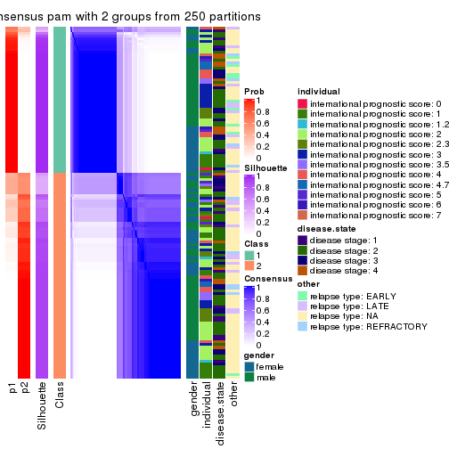</p>

</div>
<div id='tab-MAD-pam-consensus-heatmap-2'>
<pre><code class="r">consensus_heatmap(res, k = 3)
</code></pre>

<p>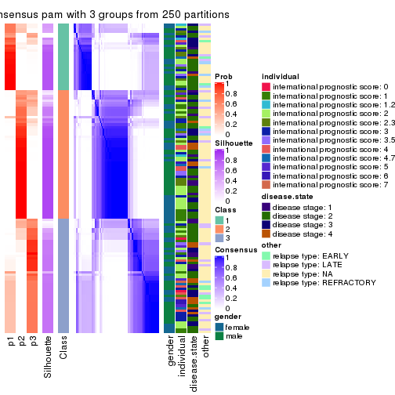</p>

</div>
<div id='tab-MAD-pam-consensus-heatmap-3'>
<pre><code class="r">consensus_heatmap(res, k = 4)
</code></pre>

<p>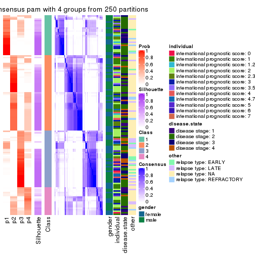</p>

</div>
<div id='tab-MAD-pam-consensus-heatmap-4'>
<pre><code class="r">consensus_heatmap(res, k = 5)
</code></pre>

<p>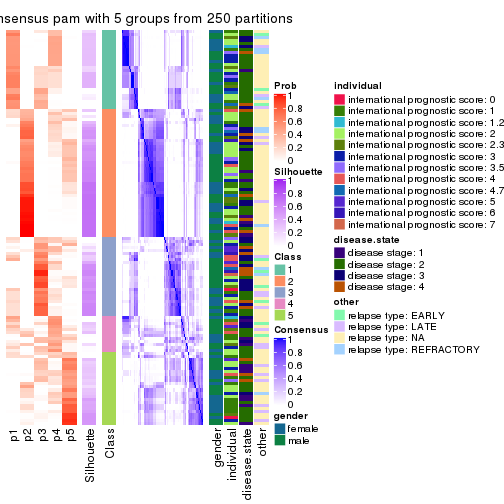</p>

</div>
<div id='tab-MAD-pam-consensus-heatmap-5'>
<pre><code class="r">consensus_heatmap(res, k = 6)
</code></pre>

<p>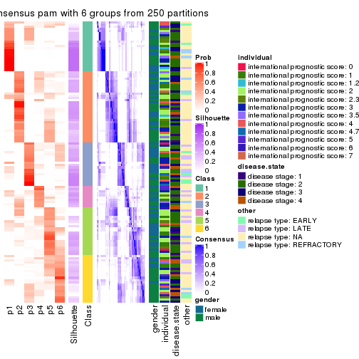</p>

</div>
</div>

Heatmaps for the membership of samples in all partitions to see how consistent they are:


<script>
$( function() {
	$( '#tabs-MAD-pam-membership-heatmap' ).tabs();
} );
</script>
<div id='tabs-MAD-pam-membership-heatmap'>
<ul>
<li><a href='#tab-MAD-pam-membership-heatmap-1'>k = 2</a></li>
<li><a href='#tab-MAD-pam-membership-heatmap-2'>k = 3</a></li>
<li><a href='#tab-MAD-pam-membership-heatmap-3'>k = 4</a></li>
<li><a href='#tab-MAD-pam-membership-heatmap-4'>k = 5</a></li>
<li><a href='#tab-MAD-pam-membership-heatmap-5'>k = 6</a></li>
</ul>
<div id='tab-MAD-pam-membership-heatmap-1'>
<pre><code class="r">membership_heatmap(res, k = 2)
</code></pre>

<p>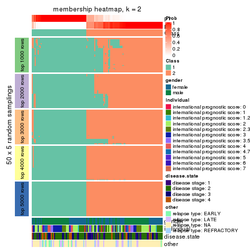</p>

</div>
<div id='tab-MAD-pam-membership-heatmap-2'>
<pre><code class="r">membership_heatmap(res, k = 3)
</code></pre>

<p>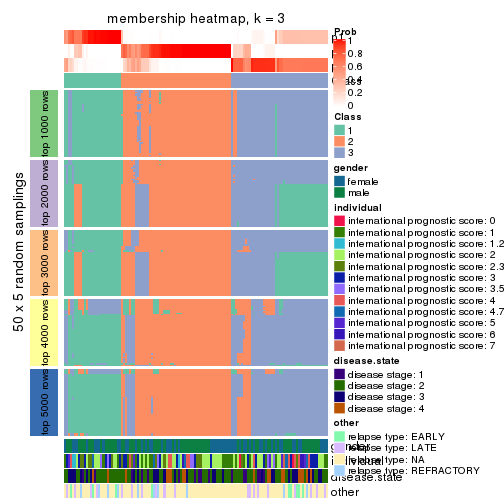</p>

</div>
<div id='tab-MAD-pam-membership-heatmap-3'>
<pre><code class="r">membership_heatmap(res, k = 4)
</code></pre>

<p>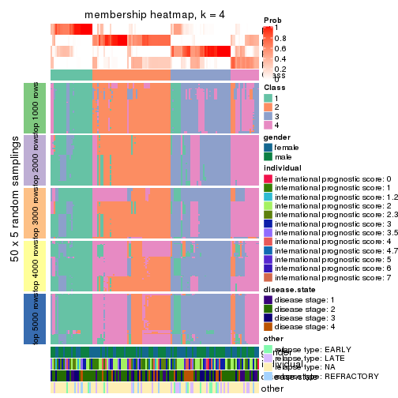</p>

</div>
<div id='tab-MAD-pam-membership-heatmap-4'>
<pre><code class="r">membership_heatmap(res, k = 5)
</code></pre>

<p>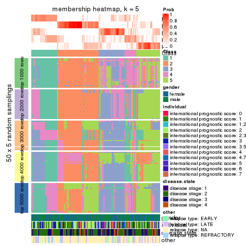</p>

</div>
<div id='tab-MAD-pam-membership-heatmap-5'>
<pre><code class="r">membership_heatmap(res, k = 6)
</code></pre>

<p>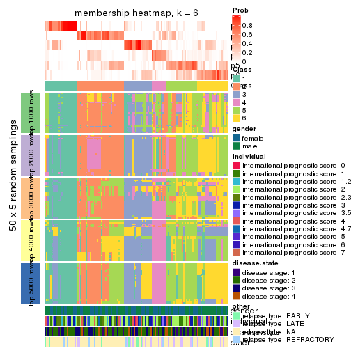</p>

</div>
</div>

As soon as we have had the classes for columns, we can look for signatures
which are significantly different between classes which can be candidate marks
for certain classes. Following are the heatmaps for signatures.


Signature heatmaps where rows are scaled:


<script>
$( function() {
	$( '#tabs-MAD-pam-get-signatures' ).tabs();
} );
</script>
<div id='tabs-MAD-pam-get-signatures'>
<ul>
<li><a href='#tab-MAD-pam-get-signatures-1'>k = 2</a></li>
<li><a href='#tab-MAD-pam-get-signatures-2'>k = 3</a></li>
<li><a href='#tab-MAD-pam-get-signatures-3'>k = 4</a></li>
<li><a href='#tab-MAD-pam-get-signatures-4'>k = 5</a></li>
<li><a href='#tab-MAD-pam-get-signatures-5'>k = 6</a></li>
</ul>
<div id='tab-MAD-pam-get-signatures-1'>
<pre><code class="r">get_signatures(res, k = 2)
</code></pre>

<p>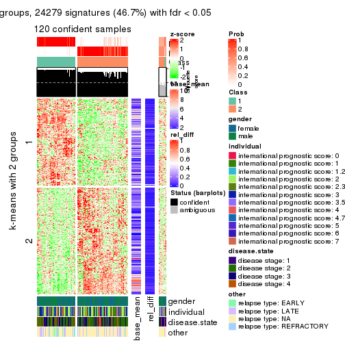</p>

</div>
<div id='tab-MAD-pam-get-signatures-2'>
<pre><code class="r">get_signatures(res, k = 3)
</code></pre>

<p>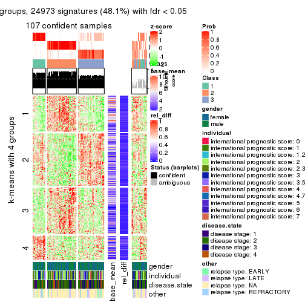</p>

</div>
<div id='tab-MAD-pam-get-signatures-3'>
<pre><code class="r">get_signatures(res, k = 4)
</code></pre>

<p>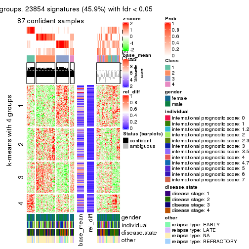</p>

</div>
<div id='tab-MAD-pam-get-signatures-4'>
<pre><code class="r">get_signatures(res, k = 5)
</code></pre>

<p>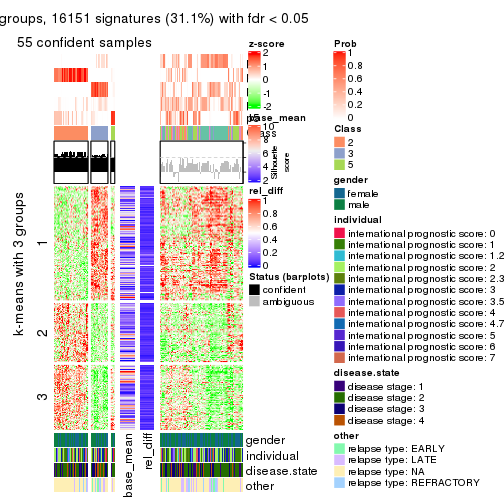</p>

</div>
<div id='tab-MAD-pam-get-signatures-5'>
<pre><code class="r">get_signatures(res, k = 6)
</code></pre>

<p>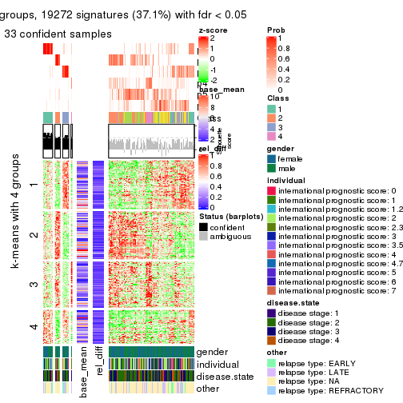</p>

</div>
</div>


Signature heatmaps where rows are not scaled:


<script>
$( function() {
	$( '#tabs-MAD-pam-get-signatures-no-scale' ).tabs();
} );
</script>
<div id='tabs-MAD-pam-get-signatures-no-scale'>
<ul>
<li><a href='#tab-MAD-pam-get-signatures-no-scale-1'>k = 2</a></li>
<li><a href='#tab-MAD-pam-get-signatures-no-scale-2'>k = 3</a></li>
<li><a href='#tab-MAD-pam-get-signatures-no-scale-3'>k = 4</a></li>
<li><a href='#tab-MAD-pam-get-signatures-no-scale-4'>k = 5</a></li>
<li><a href='#tab-MAD-pam-get-signatures-no-scale-5'>k = 6</a></li>
</ul>
<div id='tab-MAD-pam-get-signatures-no-scale-1'>
<pre><code class="r">get_signatures(res, k = 2, scale_rows = FALSE)
</code></pre>

<p>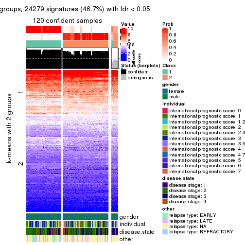</p>

</div>
<div id='tab-MAD-pam-get-signatures-no-scale-2'>
<pre><code class="r">get_signatures(res, k = 3, scale_rows = FALSE)
</code></pre>

<p>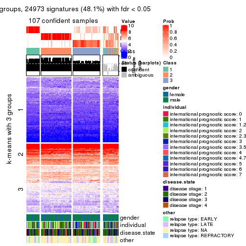</p>

</div>
<div id='tab-MAD-pam-get-signatures-no-scale-3'>
<pre><code class="r">get_signatures(res, k = 4, scale_rows = FALSE)
</code></pre>

<p>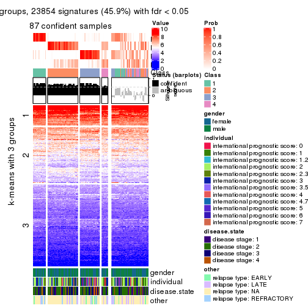</p>

</div>
<div id='tab-MAD-pam-get-signatures-no-scale-4'>
<pre><code class="r">get_signatures(res, k = 5, scale_rows = FALSE)
</code></pre>

<p>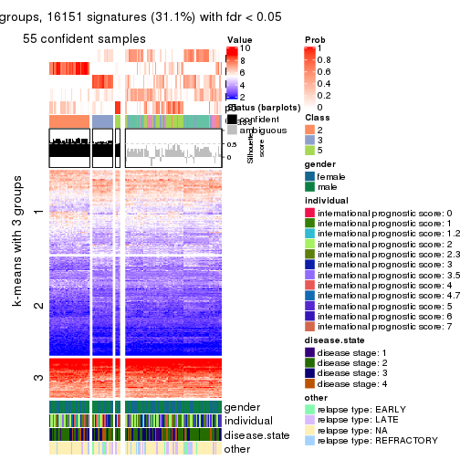</p>

</div>
<div id='tab-MAD-pam-get-signatures-no-scale-5'>
<pre><code class="r">get_signatures(res, k = 6, scale_rows = FALSE)
</code></pre>

<p>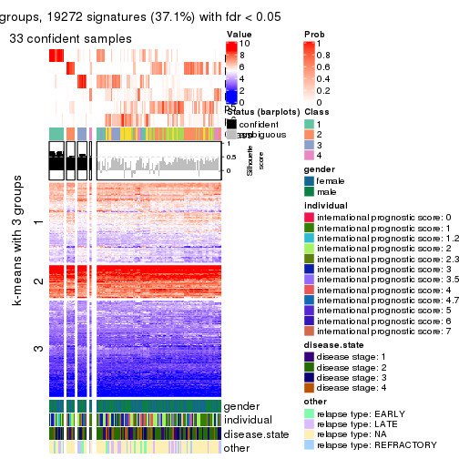</p>

</div>
</div>


Compare the overlap of signatures from different k:

```r
compare_signatures(res)
```

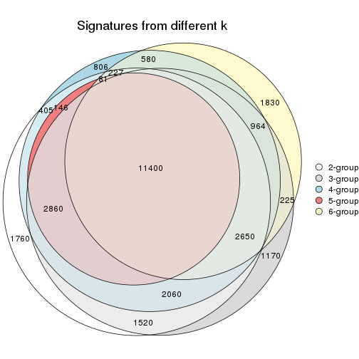

`get_signature()` returns a data frame invisibly. TO get the list of signatures, the function
call should be assigned to a variable explicitly. In following code, if `plot` argument is set
to `FALSE`, no heatmap is plotted while only the differential analysis is performed.

```r
# code only for demonstration
tb = get_signature(res, k = ..., plot = FALSE)
```

An example of the output of `tb` is:

```
#>   which_row         fdr    mean_1    mean_2 scaled_mean_1 scaled_mean_2 km
#> 1        38 0.042760348  8.373488  9.131774    -0.5533452     0.5164555  1
#> 2        40 0.018707592  7.106213  8.469186    -0.6173731     0.5762149  1
#> 3        55 0.019134737 10.221463 11.207825    -0.6159697     0.5749050  1
#> 4        59 0.006059896  5.921854  7.869574    -0.6899429     0.6439467  1
#> 5        60 0.018055526  8.928898 10.211722    -0.6204761     0.5791110  1
#> 6        98 0.009384629 15.714769 14.887706     0.6635654    -0.6193277  2
...
```

The columns in `tb` are:

1. `which_row`: row indices corresponding to the input matrix.
2. `fdr`: FDR for the differential test. 
3. `mean_x`: The mean value in group x.
4. `scaled_mean_x`: The mean value in group x after rows are scaled.
5. `km`: Row groups if k-means clustering is applied to rows.


UMAP plot which shows how samples are separated.


<script>
$( function() {
	$( '#tabs-MAD-pam-dimension-reduction' ).tabs();
} );
</script>
<div id='tabs-MAD-pam-dimension-reduction'>
<ul>
<li><a href='#tab-MAD-pam-dimension-reduction-1'>k = 2</a></li>
<li><a href='#tab-MAD-pam-dimension-reduction-2'>k = 3</a></li>
<li><a href='#tab-MAD-pam-dimension-reduction-3'>k = 4</a></li>
<li><a href='#tab-MAD-pam-dimension-reduction-4'>k = 5</a></li>
<li><a href='#tab-MAD-pam-dimension-reduction-5'>k = 6</a></li>
</ul>
<div id='tab-MAD-pam-dimension-reduction-1'>
<pre><code class="r">dimension_reduction(res, k = 2, method = &quot;UMAP&quot;)
</code></pre>

<p>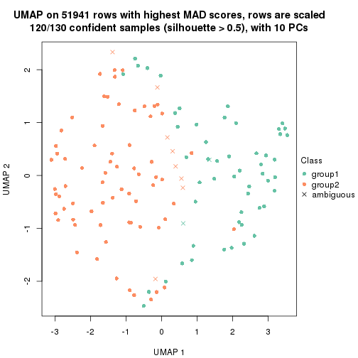</p>

</div>
<div id='tab-MAD-pam-dimension-reduction-2'>
<pre><code class="r">dimension_reduction(res, k = 3, method = &quot;UMAP&quot;)
</code></pre>

<p>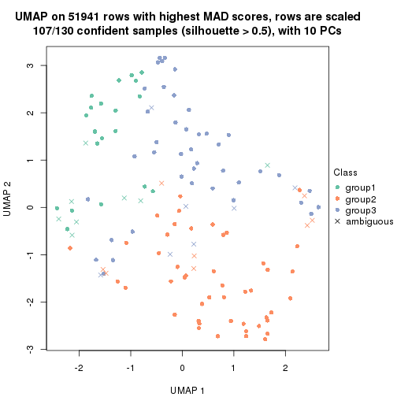</p>

</div>
<div id='tab-MAD-pam-dimension-reduction-3'>
<pre><code class="r">dimension_reduction(res, k = 4, method = &quot;UMAP&quot;)
</code></pre>

<p>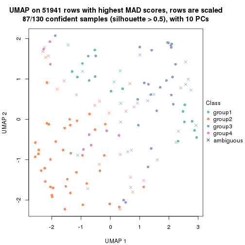</p>

</div>
<div id='tab-MAD-pam-dimension-reduction-4'>
<pre><code class="r">dimension_reduction(res, k = 5, method = &quot;UMAP&quot;)
</code></pre>

<p>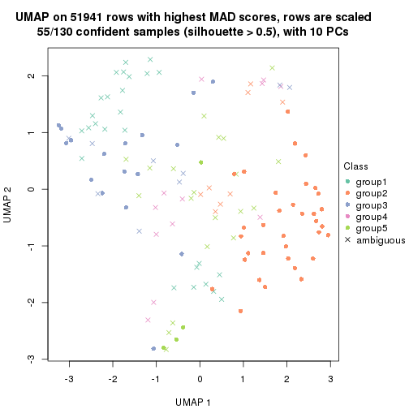</p>

</div>
<div id='tab-MAD-pam-dimension-reduction-5'>
<pre><code class="r">dimension_reduction(res, k = 6, method = &quot;UMAP&quot;)
</code></pre>

<p>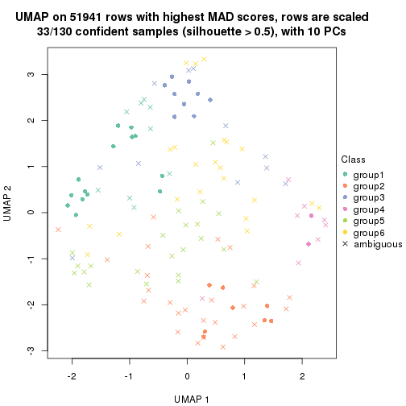</p>

</div>
</div>


Following heatmap shows how subgroups are split when increasing `k`:

```r
collect_classes(res)
```

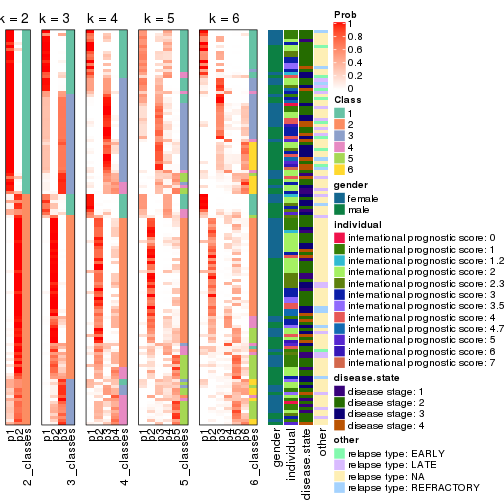


Test correlation between subgroups and known annotations. If the known
annotation is numeric, one-way ANOVA test is applied, and if the known
annotation is discrete, chi-squared contingency table test is applied.

```r
test_to_known_factors(res)
```

```
#>           n gender(p) individual(p) disease.state(p) other(p) k
#> MAD:pam 120     0.586         0.779            0.320   0.0292 2
#> MAD:pam 107     0.885         0.534            0.432   0.2810 3
#> MAD:pam  87     0.992         0.380            0.247   0.0850 4
#> MAD:pam  55     0.785         0.668            0.183   0.0877 5
#> MAD:pam  33     0.952         0.719            0.252   0.1068 6
```


If matrix rows can be associated to genes, consider to use `GO_Enrichment(res,
...)` to perform function enrichment for the signature genes.


 

---------------------------------------------------


### MAD:mclust


The object with results only for a single top-value method and a single partition method 
can be extracted as:

```r
res = res_list["MAD", "mclust"]
# you can also extract it by
# res = res_list["MAD:mclust"]
```

A summary of `res` and all the functions that can be applied to it:

```r
res
```

```
#> A 'ConsensusPartition' object with k = 2, 3, 4, 5, 6.
#>   On a matrix with 51941 rows and 130 columns.
#>   Top rows (1000, 2000, 3000, 4000, 5000) are extracted by 'MAD' method.
#>   Subgroups are detected by 'mclust' method.
#>   Performed in total 1250 partitions by row resampling.
#>   Best k for subgroups seems to be 2.
#> 
#> Following methods can be applied to this 'ConsensusPartition' object:
#>  [1] "cola_report"             "collect_classes"         "collect_plots"          
#>  [4] "collect_stats"           "colnames"                "compare_signatures"     
#>  [7] "consensus_heatmap"       "dimension_reduction"     "functional_enrichment"  
#> [10] "get_anno_col"            "get_anno"                "get_classes"            
#> [13] "get_consensus"           "get_matrix"              "get_membership"         
#> [16] "get_param"               "get_signatures"          "get_stats"              
#> [19] "is_best_k"               "is_stable_k"             "membership_heatmap"     
#> [22] "ncol"                    "nrow"                    "plot_ecdf"              
#> [25] "rownames"                "select_partition_number" "show"                   
#> [28] "suggest_best_k"          "test_to_known_factors"
```

`collect_plots()` function collects all the plots made from `res` for all `k` (number of partitions)
into one single page to provide an easy and fast comparison between different `k`.

```r
collect_plots(res)
```

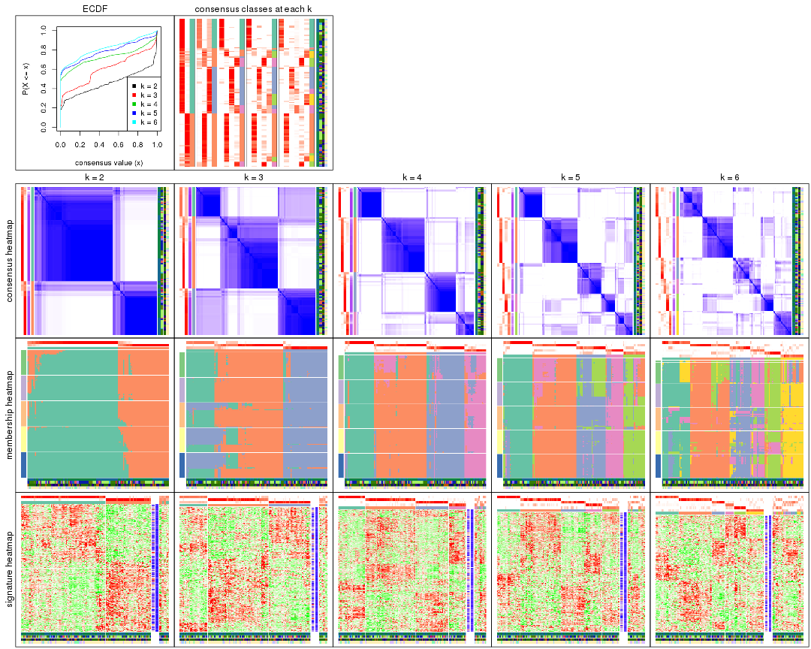

The plots are:

- The first row: a plot of the ECDF (Empirical cumulative distribution
  function) curves of the consensus matrix for each `k` and the heatmap of
  predicted classes for each `k`.
- The second row: heatmaps of the consensus matrix for each `k`.
- The third row: heatmaps of the membership matrix for each `k`.
- The fouth row: heatmaps of the signatures for each `k`.

All the plots in panels can be made by individual functions and they are
plotted later in this section.

`select_partition_number()` produces several plots showing different
statistics for choosing "optimized" `k`. There are following statistics:

- ECDF curves of the consensus matrix for each `k`;
- 1-PAC. [The PAC
  score](https://en.wikipedia.org/wiki/Consensus_clustering#Over-interpretation_potential_of_consensus_clustering)
  measures the proportion of the ambiguous subgrouping.
- Mean silhouette score.
- Concordance. The mean probability of fiting the consensus class ids in all
  partitions.
- Area increased. Denote $A_k$ as the area under the ECDF curve for current
  `k`, the area increased is defined as $A_k - A_{k-1}$.
- Rand index. The percent of pairs of samples that are both in a same cluster
  or both are not in a same cluster in the partition of k and k-1.
- Jaccard index. The ratio of pairs of samples are both in a same cluster in
  the partition of k and k-1 and the pairs of samples are both in a same
  cluster in the partition k or k-1.

The detailed explanations of these statistics can be found in [the cola
vignette](http://bioconductor.org/packages/devel/bioc/vignettes/cola/inst/doc/cola.html#toc_13).

Generally speaking, lower PAC score, higher mean silhouette score or higher
concordance corresponds to better partition. Rand index and Jaccard index
measure how similar the current partition is compared to partition with `k-1`.
If they are too similar, we won't accept `k` is better than `k-1`.

```r
select_partition_number(res)
```

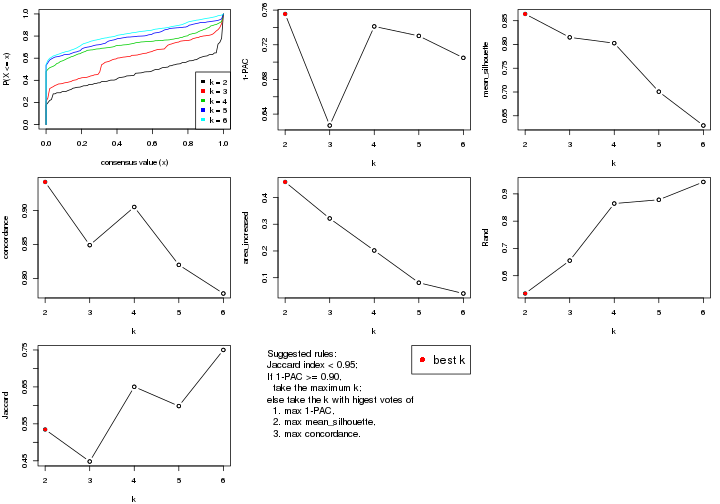

The numeric values for all these statistics can be obtained by `get_stats()`.

```r
get_stats(res)
```

```
#>   k 1-PAC mean_silhouette concordance area_increased  Rand Jaccard
#> 2 2 0.756           0.864       0.942         0.4582 0.535   0.535
#> 3 3 0.627           0.815       0.849         0.3216 0.655   0.448
#> 4 4 0.741           0.803       0.905         0.2018 0.865   0.650
#> 5 5 0.730           0.701       0.820         0.0812 0.878   0.598
#> 6 6 0.705           0.630       0.778         0.0408 0.944   0.750
```

`suggest_best_k()` suggests the best $k$ based on these statistics. The rules are as follows:

- All $k$ with Jaccard index larger than 0.95 are removed because the increase of
  the partition number does not provides enough extra information. If all $k$ are removed,
  the best $k$ is assigned by `NA`.
- For $k$ with 1-PAC larger than 0.9, the maximal $k$ is taken as the "best k". Other $k$ is called "optional k".
- If it does not fit the second rule. The $k$ with the highest vote of highest
  1-PAC, mean silhouette and concordance is taken as the "best k".

```r
suggest_best_k(res)
```

```
#> [1] 2
```


Following shows the table of the partitions (You need to click the **show/hide
code output** link to see it). The membership matrix (columns with name `p*`)
is inferred by
[`clue::cl_consensus()`](https://www.rdocumentation.org/link/cl_consensus?package=clue)
function with the `SE` method. Basically the value in the membership matrix
represents the probability to belong to a certain group. The finall class
label for an item is determined with the group with highest probability it
belongs to.

In `get_classes()` function, the entropy is calculated from the membership
matrix and the silhouette score is calculated from the consensus matrix.


<script>
$( function() {
	$( '#tabs-MAD-mclust-get-classes' ).tabs();
} );
</script>
<div id='tabs-MAD-mclust-get-classes'>
<ul>
<li><a href='#tab-MAD-mclust-get-classes-1'>k = 2</a></li>
<li><a href='#tab-MAD-mclust-get-classes-2'>k = 3</a></li>
<li><a href='#tab-MAD-mclust-get-classes-3'>k = 4</a></li>
<li><a href='#tab-MAD-mclust-get-classes-4'>k = 5</a></li>
<li><a href='#tab-MAD-mclust-get-classes-5'>k = 6</a></li>
</ul>

<div id='tab-MAD-mclust-get-classes-1'>
<p><a id='tab-MAD-mclust-get-classes-1-a' style='color:#0366d6' href='#'>show/hide code output</a></p>
<pre><code class="r">cbind(get_classes(res, k = 2), get_membership(res, k = 2))
</code></pre>

<pre><code>#&gt;           class entropy silhouette    p1    p2
#&gt; GSM447671     2  0.9775     0.3239 0.412 0.588
#&gt; GSM447694     1  0.0000     0.9479 1.000 0.000
#&gt; GSM447618     2  0.7883     0.6839 0.236 0.764
#&gt; GSM447691     2  0.8443     0.6276 0.272 0.728
#&gt; GSM447733     1  0.2236     0.9331 0.964 0.036
#&gt; GSM447620     2  0.1414     0.9005 0.020 0.980
#&gt; GSM447627     1  0.0000     0.9479 1.000 0.000
#&gt; GSM447630     1  0.9323     0.4695 0.652 0.348
#&gt; GSM447642     1  0.0000     0.9479 1.000 0.000
#&gt; GSM447649     2  0.0000     0.9121 0.000 1.000
#&gt; GSM447654     1  0.7883     0.6960 0.764 0.236
#&gt; GSM447655     2  0.0000     0.9121 0.000 1.000
#&gt; GSM447669     2  0.9732     0.3451 0.404 0.596
#&gt; GSM447676     1  0.0000     0.9479 1.000 0.000
#&gt; GSM447678     1  0.9661     0.3521 0.608 0.392
#&gt; GSM447681     2  0.0000     0.9121 0.000 1.000
#&gt; GSM447698     2  0.0000     0.9121 0.000 1.000
#&gt; GSM447713     1  0.0000     0.9479 1.000 0.000
#&gt; GSM447722     1  0.8608     0.6101 0.716 0.284
#&gt; GSM447726     1  0.7376     0.7326 0.792 0.208
#&gt; GSM447735     1  0.0000     0.9479 1.000 0.000
#&gt; GSM447737     1  0.0000     0.9479 1.000 0.000
#&gt; GSM447657     2  0.0000     0.9121 0.000 1.000
#&gt; GSM447674     2  0.0000     0.9121 0.000 1.000
#&gt; GSM447636     1  0.0376     0.9467 0.996 0.004
#&gt; GSM447723     1  0.0000     0.9479 1.000 0.000
#&gt; GSM447699     1  0.2236     0.9331 0.964 0.036
#&gt; GSM447708     2  0.0000     0.9121 0.000 1.000
#&gt; GSM447721     1  0.0000     0.9479 1.000 0.000
#&gt; GSM447623     1  0.0000     0.9479 1.000 0.000
#&gt; GSM447621     1  0.0000     0.9479 1.000 0.000
#&gt; GSM447650     2  0.0000     0.9121 0.000 1.000
#&gt; GSM447651     2  0.0000     0.9121 0.000 1.000
#&gt; GSM447653     1  0.0000     0.9479 1.000 0.000
#&gt; GSM447658     1  0.0000     0.9479 1.000 0.000
#&gt; GSM447675     1  0.6531     0.7965 0.832 0.168
#&gt; GSM447680     2  0.5059     0.8285 0.112 0.888
#&gt; GSM447686     1  0.3114     0.9187 0.944 0.056
#&gt; GSM447736     1  0.0376     0.9469 0.996 0.004
#&gt; GSM447629     2  0.0000     0.9121 0.000 1.000
#&gt; GSM447648     1  0.0000     0.9479 1.000 0.000
#&gt; GSM447660     1  0.0000     0.9479 1.000 0.000
#&gt; GSM447661     2  0.0000     0.9121 0.000 1.000
#&gt; GSM447663     1  0.2236     0.9331 0.964 0.036
#&gt; GSM447704     2  0.0000     0.9121 0.000 1.000
#&gt; GSM447720     1  0.2236     0.9331 0.964 0.036
#&gt; GSM447652     2  0.0000     0.9121 0.000 1.000
#&gt; GSM447679     2  0.0000     0.9121 0.000 1.000
#&gt; GSM447712     1  0.0000     0.9479 1.000 0.000
#&gt; GSM447664     1  0.9427     0.4202 0.640 0.360
#&gt; GSM447637     1  0.0000     0.9479 1.000 0.000
#&gt; GSM447639     1  0.3114     0.9182 0.944 0.056
#&gt; GSM447615     1  0.0000     0.9479 1.000 0.000
#&gt; GSM447656     2  0.4161     0.8566 0.084 0.916
#&gt; GSM447673     2  0.0000     0.9121 0.000 1.000
#&gt; GSM447719     1  0.0000     0.9479 1.000 0.000
#&gt; GSM447706     1  0.0000     0.9479 1.000 0.000
#&gt; GSM447612     1  0.2236     0.9331 0.964 0.036
#&gt; GSM447665     2  0.0000     0.9121 0.000 1.000
#&gt; GSM447677     2  0.0000     0.9121 0.000 1.000
#&gt; GSM447613     1  0.0000     0.9479 1.000 0.000
#&gt; GSM447659     1  0.2236     0.9331 0.964 0.036
#&gt; GSM447662     1  0.2043     0.9353 0.968 0.032
#&gt; GSM447666     1  0.2236     0.9334 0.964 0.036
#&gt; GSM447668     2  0.0000     0.9121 0.000 1.000
#&gt; GSM447682     2  0.0000     0.9121 0.000 1.000
#&gt; GSM447683     2  0.0000     0.9121 0.000 1.000
#&gt; GSM447688     2  0.6048     0.7938 0.148 0.852
#&gt; GSM447702     2  0.0000     0.9121 0.000 1.000
#&gt; GSM447709     2  0.0000     0.9121 0.000 1.000
#&gt; GSM447711     1  0.0000     0.9479 1.000 0.000
#&gt; GSM447715     1  0.2043     0.9358 0.968 0.032
#&gt; GSM447693     1  0.0000     0.9479 1.000 0.000
#&gt; GSM447611     1  0.0938     0.9446 0.988 0.012
#&gt; GSM447672     2  0.0000     0.9121 0.000 1.000
#&gt; GSM447703     2  0.0000     0.9121 0.000 1.000
#&gt; GSM447727     1  0.0000     0.9479 1.000 0.000
#&gt; GSM447638     1  0.0376     0.9467 0.996 0.004
#&gt; GSM447670     1  0.0000     0.9479 1.000 0.000
#&gt; GSM447700     1  0.8955     0.5529 0.688 0.312
#&gt; GSM447738     2  0.0000     0.9121 0.000 1.000
#&gt; GSM447739     1  0.0000     0.9479 1.000 0.000
#&gt; GSM447617     1  0.0000     0.9479 1.000 0.000
#&gt; GSM447628     2  0.9686     0.3649 0.396 0.604
#&gt; GSM447632     2  0.0000     0.9121 0.000 1.000
#&gt; GSM447619     1  0.1184     0.9428 0.984 0.016
#&gt; GSM447643     1  0.0376     0.9467 0.996 0.004
#&gt; GSM447724     1  0.4298     0.8886 0.912 0.088
#&gt; GSM447728     2  0.0000     0.9121 0.000 1.000
#&gt; GSM447610     1  0.0000     0.9479 1.000 0.000
#&gt; GSM447633     1  1.0000    -0.0267 0.504 0.496
#&gt; GSM447634     1  0.1184     0.9428 0.984 0.016
#&gt; GSM447622     1  0.0000     0.9479 1.000 0.000
#&gt; GSM447667     2  0.7056     0.7399 0.192 0.808
#&gt; GSM447687     2  0.0000     0.9121 0.000 1.000
#&gt; GSM447695     1  0.0000     0.9479 1.000 0.000
#&gt; GSM447696     1  0.0000     0.9479 1.000 0.000
#&gt; GSM447697     1  0.0000     0.9479 1.000 0.000
#&gt; GSM447714     1  0.2043     0.9353 0.968 0.032
#&gt; GSM447717     1  0.0000     0.9479 1.000 0.000
#&gt; GSM447725     1  0.0000     0.9479 1.000 0.000
#&gt; GSM447729     1  0.5737     0.8367 0.864 0.136
#&gt; GSM447644     2  1.0000     0.0103 0.500 0.500
#&gt; GSM447710     1  0.0000     0.9479 1.000 0.000
#&gt; GSM447614     1  0.0000     0.9479 1.000 0.000
#&gt; GSM447685     2  0.0000     0.9121 0.000 1.000
#&gt; GSM447690     1  0.0000     0.9479 1.000 0.000
#&gt; GSM447730     2  0.0000     0.9121 0.000 1.000
#&gt; GSM447646     2  0.9922     0.2090 0.448 0.552
#&gt; GSM447689     1  0.1184     0.9428 0.984 0.016
#&gt; GSM447635     1  0.2423     0.9305 0.960 0.040
#&gt; GSM447641     1  0.0000     0.9479 1.000 0.000
#&gt; GSM447716     2  0.8955     0.5765 0.312 0.688
#&gt; GSM447718     1  0.2236     0.9331 0.964 0.036
#&gt; GSM447616     1  0.0000     0.9479 1.000 0.000
#&gt; GSM447626     1  0.0000     0.9479 1.000 0.000
#&gt; GSM447640     2  0.0000     0.9121 0.000 1.000
#&gt; GSM447734     1  0.1633     0.9393 0.976 0.024
#&gt; GSM447692     1  0.0000     0.9479 1.000 0.000
#&gt; GSM447647     2  0.5408     0.8179 0.124 0.876
#&gt; GSM447624     1  0.0000     0.9479 1.000 0.000
#&gt; GSM447625     1  0.1843     0.9374 0.972 0.028
#&gt; GSM447707     2  0.0000     0.9121 0.000 1.000
#&gt; GSM447732     1  0.0376     0.9469 0.996 0.004
#&gt; GSM447684     1  0.0000     0.9479 1.000 0.000
#&gt; GSM447731     1  0.5946     0.8276 0.856 0.144
#&gt; GSM447705     1  0.2423     0.9305 0.960 0.040
#&gt; GSM447631     1  0.0000     0.9479 1.000 0.000
#&gt; GSM447701     2  0.0000     0.9121 0.000 1.000
#&gt; GSM447645     1  0.0000     0.9479 1.000 0.000
</code></pre>

<script>
$('#tab-MAD-mclust-get-classes-1-a').parent().next().next().hide();
$('#tab-MAD-mclust-get-classes-1-a').click(function(){
  $('#tab-MAD-mclust-get-classes-1-a').parent().next().next().toggle();
  return(false);
});
</script>
</div>

<div id='tab-MAD-mclust-get-classes-2'>
<p><a id='tab-MAD-mclust-get-classes-2-a' style='color:#0366d6' href='#'>show/hide code output</a></p>
<pre><code class="r">cbind(get_classes(res, k = 3), get_membership(res, k = 3))
</code></pre>

<pre><code>#&gt;           class entropy silhouette    p1    p2    p3
#&gt; GSM447671     2  0.4178     0.7453 0.000 0.828 0.172
#&gt; GSM447694     3  0.0892     0.9095 0.000 0.020 0.980
#&gt; GSM447618     2  0.1529     0.8578 0.000 0.960 0.040
#&gt; GSM447691     2  0.1753     0.8531 0.000 0.952 0.048
#&gt; GSM447733     3  0.0424     0.8942 0.008 0.000 0.992
#&gt; GSM447620     2  0.0000     0.8729 0.000 1.000 0.000
#&gt; GSM447627     3  0.0000     0.8990 0.000 0.000 1.000
#&gt; GSM447630     2  0.6215     0.2932 0.000 0.572 0.428
#&gt; GSM447642     1  0.5621     0.9656 0.692 0.000 0.308
#&gt; GSM447649     2  0.0424     0.8732 0.008 0.992 0.000
#&gt; GSM447654     2  0.6387     0.7407 0.300 0.680 0.020
#&gt; GSM447655     2  0.0424     0.8732 0.008 0.992 0.000
#&gt; GSM447669     2  0.4291     0.7361 0.000 0.820 0.180
#&gt; GSM447676     1  0.5621     0.9656 0.692 0.000 0.308
#&gt; GSM447678     2  0.6387     0.7407 0.300 0.680 0.020
#&gt; GSM447681     2  0.0848     0.8723 0.008 0.984 0.008
#&gt; GSM447698     2  0.1919     0.8649 0.024 0.956 0.020
#&gt; GSM447713     1  0.5621     0.9656 0.692 0.000 0.308
#&gt; GSM447722     2  0.7648     0.3702 0.048 0.552 0.400
#&gt; GSM447726     2  0.2165     0.8438 0.000 0.936 0.064
#&gt; GSM447735     3  0.0000     0.8990 0.000 0.000 1.000
#&gt; GSM447737     3  0.6192    -0.3457 0.420 0.000 0.580
#&gt; GSM447657     2  0.0000     0.8729 0.000 1.000 0.000
#&gt; GSM447674     2  0.0424     0.8732 0.008 0.992 0.000
#&gt; GSM447636     1  0.5815     0.9598 0.692 0.004 0.304
#&gt; GSM447723     1  0.5968     0.9069 0.636 0.000 0.364
#&gt; GSM447699     3  0.1643     0.8881 0.000 0.044 0.956
#&gt; GSM447708     2  0.0237     0.8731 0.004 0.996 0.000
#&gt; GSM447721     1  0.5621     0.9656 0.692 0.000 0.308
#&gt; GSM447623     1  0.5621     0.9656 0.692 0.000 0.308
#&gt; GSM447621     1  0.6140     0.8309 0.596 0.000 0.404
#&gt; GSM447650     2  0.0424     0.8732 0.008 0.992 0.000
#&gt; GSM447651     2  0.0424     0.8732 0.008 0.992 0.000
#&gt; GSM447653     3  0.0000     0.8990 0.000 0.000 1.000
#&gt; GSM447658     1  0.5621     0.9656 0.692 0.000 0.308
#&gt; GSM447675     2  0.6387     0.7407 0.300 0.680 0.020
#&gt; GSM447680     2  0.0892     0.8677 0.020 0.980 0.000
#&gt; GSM447686     2  0.9813    -0.1440 0.304 0.428 0.268
#&gt; GSM447736     3  0.0892     0.9095 0.000 0.020 0.980
#&gt; GSM447629     2  0.0000     0.8729 0.000 1.000 0.000
#&gt; GSM447648     3  0.0983     0.9081 0.004 0.016 0.980
#&gt; GSM447660     1  0.5621     0.9656 0.692 0.000 0.308
#&gt; GSM447661     2  0.0424     0.8732 0.008 0.992 0.000
#&gt; GSM447663     3  0.0892     0.9095 0.000 0.020 0.980
#&gt; GSM447704     2  0.0424     0.8732 0.008 0.992 0.000
#&gt; GSM447720     3  0.3686     0.7475 0.000 0.140 0.860
#&gt; GSM447652     2  0.0000     0.8729 0.000 1.000 0.000
#&gt; GSM447679     2  0.0424     0.8732 0.008 0.992 0.000
#&gt; GSM447712     1  0.5621     0.9656 0.692 0.000 0.308
#&gt; GSM447664     2  0.6326     0.7458 0.292 0.688 0.020
#&gt; GSM447637     3  0.0983     0.8998 0.016 0.004 0.980
#&gt; GSM447639     3  0.4887     0.5515 0.000 0.228 0.772
#&gt; GSM447615     1  0.5926     0.9170 0.644 0.000 0.356
#&gt; GSM447656     2  0.0592     0.8708 0.012 0.988 0.000
#&gt; GSM447673     2  0.3987     0.8373 0.108 0.872 0.020
#&gt; GSM447719     3  0.0000     0.8990 0.000 0.000 1.000
#&gt; GSM447706     3  0.0983     0.8998 0.016 0.004 0.980
#&gt; GSM447612     3  0.0892     0.9095 0.000 0.020 0.980
#&gt; GSM447665     2  0.0237     0.8731 0.004 0.996 0.000
#&gt; GSM447677     2  0.0424     0.8732 0.008 0.992 0.000
#&gt; GSM447613     1  0.5621     0.9656 0.692 0.000 0.308
#&gt; GSM447659     3  0.0237     0.8970 0.004 0.000 0.996
#&gt; GSM447662     3  0.0892     0.9095 0.000 0.020 0.980
#&gt; GSM447666     3  0.1163     0.9040 0.000 0.028 0.972
#&gt; GSM447668     2  0.0424     0.8732 0.008 0.992 0.000
#&gt; GSM447682     2  0.0237     0.8731 0.004 0.996 0.000
#&gt; GSM447683     2  0.0424     0.8732 0.008 0.992 0.000
#&gt; GSM447688     2  0.6090     0.7617 0.264 0.716 0.020
#&gt; GSM447702     2  0.0424     0.8732 0.008 0.992 0.000
#&gt; GSM447709     2  0.0237     0.8731 0.004 0.996 0.000
#&gt; GSM447711     1  0.5621     0.9656 0.692 0.000 0.308
#&gt; GSM447715     2  0.8173     0.4021 0.100 0.600 0.300
#&gt; GSM447693     3  0.0892     0.9095 0.000 0.020 0.980
#&gt; GSM447611     2  0.7727     0.6522 0.336 0.600 0.064
#&gt; GSM447672     2  0.0829     0.8714 0.004 0.984 0.012
#&gt; GSM447703     2  0.1781     0.8658 0.020 0.960 0.020
#&gt; GSM447727     1  0.5810     0.9406 0.664 0.000 0.336
#&gt; GSM447638     2  0.9527     0.0584 0.220 0.480 0.300
#&gt; GSM447670     1  0.5678     0.9594 0.684 0.000 0.316
#&gt; GSM447700     2  0.6286     0.1830 0.000 0.536 0.464
#&gt; GSM447738     2  0.1919     0.8649 0.024 0.956 0.020
#&gt; GSM447739     1  0.5621     0.9656 0.692 0.000 0.308
#&gt; GSM447617     1  0.6008     0.8901 0.628 0.000 0.372
#&gt; GSM447628     2  0.6387     0.7407 0.300 0.680 0.020
#&gt; GSM447632     2  0.1482     0.8671 0.012 0.968 0.020
#&gt; GSM447619     3  0.0892     0.9095 0.000 0.020 0.980
#&gt; GSM447643     1  0.8872     0.7103 0.552 0.152 0.296
#&gt; GSM447724     3  0.4228     0.6928 0.008 0.148 0.844
#&gt; GSM447728     2  0.0424     0.8732 0.008 0.992 0.000
#&gt; GSM447610     1  0.6045     0.8968 0.620 0.000 0.380
#&gt; GSM447633     2  0.4062     0.7598 0.000 0.836 0.164
#&gt; GSM447634     3  0.1411     0.8972 0.000 0.036 0.964
#&gt; GSM447622     3  0.0892     0.8950 0.020 0.000 0.980
#&gt; GSM447667     2  0.0000     0.8729 0.000 1.000 0.000
#&gt; GSM447687     2  0.1919     0.8649 0.024 0.956 0.020
#&gt; GSM447695     3  0.1129     0.9082 0.004 0.020 0.976
#&gt; GSM447696     1  0.5621     0.9656 0.692 0.000 0.308
#&gt; GSM447697     1  0.5621     0.9656 0.692 0.000 0.308
#&gt; GSM447714     3  0.0892     0.9095 0.000 0.020 0.980
#&gt; GSM447717     1  0.5621     0.9656 0.692 0.000 0.308
#&gt; GSM447725     1  0.5621     0.9656 0.692 0.000 0.308
#&gt; GSM447729     2  0.6387     0.7407 0.300 0.680 0.020
#&gt; GSM447644     2  0.4974     0.6613 0.000 0.764 0.236
#&gt; GSM447710     3  0.0892     0.9095 0.000 0.020 0.980
#&gt; GSM447614     3  0.0000     0.8990 0.000 0.000 1.000
#&gt; GSM447685     2  0.1031     0.8675 0.024 0.976 0.000
#&gt; GSM447690     1  0.5621     0.9656 0.692 0.000 0.308
#&gt; GSM447730     2  0.0424     0.8732 0.008 0.992 0.000
#&gt; GSM447646     2  0.6387     0.7407 0.300 0.680 0.020
#&gt; GSM447689     3  0.0892     0.9095 0.000 0.020 0.980
#&gt; GSM447635     2  0.5529     0.5659 0.000 0.704 0.296
#&gt; GSM447641     1  0.5621     0.9656 0.692 0.000 0.308
#&gt; GSM447716     2  0.1411     0.8685 0.036 0.964 0.000
#&gt; GSM447718     3  0.5291     0.5150 0.000 0.268 0.732
#&gt; GSM447616     3  0.1182     0.9047 0.012 0.012 0.976
#&gt; GSM447626     3  0.0983     0.8998 0.016 0.004 0.980
#&gt; GSM447640     2  0.0424     0.8732 0.008 0.992 0.000
#&gt; GSM447734     3  0.0892     0.9095 0.000 0.020 0.980
#&gt; GSM447692     3  0.4351     0.6574 0.168 0.004 0.828
#&gt; GSM447647     2  0.6326     0.7458 0.292 0.688 0.020
#&gt; GSM447624     3  0.6062    -0.1861 0.384 0.000 0.616
#&gt; GSM447625     3  0.0892     0.9095 0.000 0.020 0.980
#&gt; GSM447707     2  0.0424     0.8732 0.008 0.992 0.000
#&gt; GSM447732     3  0.0892     0.9095 0.000 0.020 0.980
#&gt; GSM447684     3  0.4369     0.7485 0.040 0.096 0.864
#&gt; GSM447731     2  0.8187     0.6880 0.244 0.628 0.128
#&gt; GSM447705     3  0.1163     0.9032 0.000 0.028 0.972
#&gt; GSM447631     3  0.0892     0.9095 0.000 0.020 0.980
#&gt; GSM447701     2  0.0424     0.8732 0.008 0.992 0.000
#&gt; GSM447645     3  0.0983     0.8998 0.016 0.004 0.980
</code></pre>

<script>
$('#tab-MAD-mclust-get-classes-2-a').parent().next().next().hide();
$('#tab-MAD-mclust-get-classes-2-a').click(function(){
  $('#tab-MAD-mclust-get-classes-2-a').parent().next().next().toggle();
  return(false);
});
</script>
</div>

<div id='tab-MAD-mclust-get-classes-3'>
<p><a id='tab-MAD-mclust-get-classes-3-a' style='color:#0366d6' href='#'>show/hide code output</a></p>
<pre><code class="r">cbind(get_classes(res, k = 4), get_membership(res, k = 4))
</code></pre>

<pre><code>#&gt;           class entropy silhouette    p1    p2    p3    p4
#&gt; GSM447671     2  0.5528     0.7367 0.000 0.732 0.124 0.144
#&gt; GSM447694     3  0.1211     0.8629 0.000 0.000 0.960 0.040
#&gt; GSM447618     2  0.3569     0.8229 0.000 0.804 0.000 0.196
#&gt; GSM447691     2  0.2973     0.8614 0.000 0.856 0.000 0.144
#&gt; GSM447733     4  0.3801     0.6584 0.000 0.000 0.220 0.780
#&gt; GSM447620     2  0.1940     0.8693 0.000 0.924 0.076 0.000
#&gt; GSM447627     3  0.3907     0.6477 0.000 0.000 0.768 0.232
#&gt; GSM447630     2  0.7156     0.2400 0.000 0.476 0.388 0.136
#&gt; GSM447642     1  0.0000     0.9391 1.000 0.000 0.000 0.000
#&gt; GSM447649     2  0.0000     0.9046 0.000 1.000 0.000 0.000
#&gt; GSM447654     4  0.1302     0.8081 0.000 0.044 0.000 0.956
#&gt; GSM447655     2  0.0000     0.9046 0.000 1.000 0.000 0.000
#&gt; GSM447669     2  0.5248     0.7192 0.000 0.748 0.164 0.088
#&gt; GSM447676     1  0.0000     0.9391 1.000 0.000 0.000 0.000
#&gt; GSM447678     4  0.1302     0.8081 0.000 0.044 0.000 0.956
#&gt; GSM447681     2  0.1022     0.9036 0.000 0.968 0.000 0.032
#&gt; GSM447698     2  0.3610     0.8193 0.000 0.800 0.000 0.200
#&gt; GSM447713     1  0.0000     0.9391 1.000 0.000 0.000 0.000
#&gt; GSM447722     4  0.1118     0.8067 0.000 0.036 0.000 0.964
#&gt; GSM447726     2  0.0000     0.9046 0.000 1.000 0.000 0.000
#&gt; GSM447735     4  0.3649     0.6882 0.000 0.000 0.204 0.796
#&gt; GSM447737     3  0.4985     0.1471 0.468 0.000 0.532 0.000
#&gt; GSM447657     2  0.2868     0.8663 0.000 0.864 0.000 0.136
#&gt; GSM447674     2  0.0817     0.9047 0.000 0.976 0.000 0.024
#&gt; GSM447636     1  0.0000     0.9391 1.000 0.000 0.000 0.000
#&gt; GSM447723     1  0.0000     0.9391 1.000 0.000 0.000 0.000
#&gt; GSM447699     3  0.3801     0.6896 0.000 0.000 0.780 0.220
#&gt; GSM447708     2  0.2345     0.8851 0.000 0.900 0.000 0.100
#&gt; GSM447721     1  0.0000     0.9391 1.000 0.000 0.000 0.000
#&gt; GSM447623     1  0.0000     0.9391 1.000 0.000 0.000 0.000
#&gt; GSM447621     1  0.3873     0.6626 0.772 0.000 0.228 0.000
#&gt; GSM447650     2  0.0000     0.9046 0.000 1.000 0.000 0.000
#&gt; GSM447651     2  0.0000     0.9046 0.000 1.000 0.000 0.000
#&gt; GSM447653     4  0.4222     0.6005 0.000 0.000 0.272 0.728
#&gt; GSM447658     1  0.0000     0.9391 1.000 0.000 0.000 0.000
#&gt; GSM447675     4  0.0817     0.8030 0.000 0.024 0.000 0.976
#&gt; GSM447680     2  0.0000     0.9046 0.000 1.000 0.000 0.000
#&gt; GSM447686     1  0.5453     0.4573 0.660 0.304 0.000 0.036
#&gt; GSM447736     3  0.1022     0.8667 0.000 0.000 0.968 0.032
#&gt; GSM447629     2  0.2973     0.8614 0.000 0.856 0.000 0.144
#&gt; GSM447648     3  0.0000     0.8797 0.000 0.000 1.000 0.000
#&gt; GSM447660     1  0.0000     0.9391 1.000 0.000 0.000 0.000
#&gt; GSM447661     2  0.0000     0.9046 0.000 1.000 0.000 0.000
#&gt; GSM447663     3  0.0000     0.8797 0.000 0.000 1.000 0.000
#&gt; GSM447704     2  0.0000     0.9046 0.000 1.000 0.000 0.000
#&gt; GSM447720     3  0.2830     0.8077 0.000 0.060 0.900 0.040
#&gt; GSM447652     2  0.0188     0.9048 0.000 0.996 0.000 0.004
#&gt; GSM447679     2  0.0707     0.9049 0.000 0.980 0.000 0.020
#&gt; GSM447712     1  0.0000     0.9391 1.000 0.000 0.000 0.000
#&gt; GSM447664     4  0.3528     0.6815 0.000 0.192 0.000 0.808
#&gt; GSM447637     3  0.0000     0.8797 0.000 0.000 1.000 0.000
#&gt; GSM447639     4  0.2469     0.7615 0.000 0.000 0.108 0.892
#&gt; GSM447615     1  0.0000     0.9391 1.000 0.000 0.000 0.000
#&gt; GSM447656     2  0.0817     0.9047 0.000 0.976 0.000 0.024
#&gt; GSM447673     4  0.4925     0.1410 0.000 0.428 0.000 0.572
#&gt; GSM447719     3  0.4998    -0.2047 0.000 0.000 0.512 0.488
#&gt; GSM447706     3  0.0000     0.8797 0.000 0.000 1.000 0.000
#&gt; GSM447612     3  0.0000     0.8797 0.000 0.000 1.000 0.000
#&gt; GSM447665     2  0.0000     0.9046 0.000 1.000 0.000 0.000
#&gt; GSM447677     2  0.0000     0.9046 0.000 1.000 0.000 0.000
#&gt; GSM447613     1  0.0000     0.9391 1.000 0.000 0.000 0.000
#&gt; GSM447659     4  0.4855     0.3771 0.000 0.000 0.400 0.600
#&gt; GSM447662     3  0.0000     0.8797 0.000 0.000 1.000 0.000
#&gt; GSM447666     3  0.0469     0.8717 0.000 0.012 0.988 0.000
#&gt; GSM447668     2  0.0000     0.9046 0.000 1.000 0.000 0.000
#&gt; GSM447682     2  0.2589     0.8771 0.000 0.884 0.000 0.116
#&gt; GSM447683     2  0.1940     0.8937 0.000 0.924 0.000 0.076
#&gt; GSM447688     4  0.1867     0.8003 0.000 0.072 0.000 0.928
#&gt; GSM447702     2  0.0000     0.9046 0.000 1.000 0.000 0.000
#&gt; GSM447709     2  0.0000     0.9046 0.000 1.000 0.000 0.000
#&gt; GSM447711     1  0.0000     0.9391 1.000 0.000 0.000 0.000
#&gt; GSM447715     2  0.4936     0.6162 0.280 0.700 0.000 0.020
#&gt; GSM447693     3  0.0000     0.8797 0.000 0.000 1.000 0.000
#&gt; GSM447611     4  0.0336     0.7912 0.008 0.000 0.000 0.992
#&gt; GSM447672     2  0.0000     0.9046 0.000 1.000 0.000 0.000
#&gt; GSM447703     2  0.2216     0.8904 0.000 0.908 0.000 0.092
#&gt; GSM447727     1  0.0000     0.9391 1.000 0.000 0.000 0.000
#&gt; GSM447638     2  0.3610     0.7390 0.200 0.800 0.000 0.000
#&gt; GSM447670     1  0.0000     0.9391 1.000 0.000 0.000 0.000
#&gt; GSM447700     3  0.7338     0.0771 0.000 0.160 0.464 0.376
#&gt; GSM447738     2  0.3356     0.8403 0.000 0.824 0.000 0.176
#&gt; GSM447739     1  0.0000     0.9391 1.000 0.000 0.000 0.000
#&gt; GSM447617     1  0.2921     0.7933 0.860 0.000 0.140 0.000
#&gt; GSM447628     4  0.1637     0.8058 0.000 0.060 0.000 0.940
#&gt; GSM447632     2  0.3172     0.8517 0.000 0.840 0.000 0.160
#&gt; GSM447619     3  0.0000     0.8797 0.000 0.000 1.000 0.000
#&gt; GSM447643     1  0.2530     0.8069 0.888 0.112 0.000 0.000
#&gt; GSM447724     4  0.3266     0.7237 0.000 0.000 0.168 0.832
#&gt; GSM447728     2  0.1867     0.8948 0.000 0.928 0.000 0.072
#&gt; GSM447610     1  0.5295     0.0125 0.504 0.000 0.008 0.488
#&gt; GSM447633     2  0.0779     0.9019 0.000 0.980 0.016 0.004
#&gt; GSM447634     3  0.2704     0.8047 0.000 0.000 0.876 0.124
#&gt; GSM447622     3  0.0000     0.8797 0.000 0.000 1.000 0.000
#&gt; GSM447667     2  0.2973     0.8614 0.000 0.856 0.000 0.144
#&gt; GSM447687     2  0.3024     0.8626 0.000 0.852 0.000 0.148
#&gt; GSM447695     3  0.2124     0.8461 0.008 0.000 0.924 0.068
#&gt; GSM447696     1  0.0000     0.9391 1.000 0.000 0.000 0.000
#&gt; GSM447697     1  0.0000     0.9391 1.000 0.000 0.000 0.000
#&gt; GSM447714     3  0.0000     0.8797 0.000 0.000 1.000 0.000
#&gt; GSM447717     1  0.0000     0.9391 1.000 0.000 0.000 0.000
#&gt; GSM447725     1  0.0000     0.9391 1.000 0.000 0.000 0.000
#&gt; GSM447729     4  0.1557     0.8071 0.000 0.056 0.000 0.944
#&gt; GSM447644     2  0.1557     0.8689 0.000 0.944 0.056 0.000
#&gt; GSM447710     3  0.0000     0.8797 0.000 0.000 1.000 0.000
#&gt; GSM447614     4  0.4776     0.4296 0.000 0.000 0.376 0.624
#&gt; GSM447685     2  0.2149     0.8899 0.000 0.912 0.000 0.088
#&gt; GSM447690     1  0.0000     0.9391 1.000 0.000 0.000 0.000
#&gt; GSM447730     2  0.0000     0.9046 0.000 1.000 0.000 0.000
#&gt; GSM447646     4  0.1557     0.8071 0.000 0.056 0.000 0.944
#&gt; GSM447689     3  0.0000     0.8797 0.000 0.000 1.000 0.000
#&gt; GSM447635     2  0.3626     0.8347 0.000 0.812 0.004 0.184
#&gt; GSM447641     1  0.0000     0.9391 1.000 0.000 0.000 0.000
#&gt; GSM447716     2  0.4008     0.7701 0.000 0.756 0.000 0.244
#&gt; GSM447718     3  0.2593     0.7810 0.000 0.104 0.892 0.004
#&gt; GSM447616     3  0.1940     0.8310 0.076 0.000 0.924 0.000
#&gt; GSM447626     3  0.0000     0.8797 0.000 0.000 1.000 0.000
#&gt; GSM447640     2  0.0817     0.9047 0.000 0.976 0.000 0.024
#&gt; GSM447734     3  0.0000     0.8797 0.000 0.000 1.000 0.000
#&gt; GSM447692     3  0.4194     0.7192 0.172 0.000 0.800 0.028
#&gt; GSM447647     4  0.4697     0.4689 0.000 0.356 0.000 0.644
#&gt; GSM447624     3  0.4804     0.3796 0.384 0.000 0.616 0.000
#&gt; GSM447625     3  0.0336     0.8770 0.000 0.000 0.992 0.008
#&gt; GSM447707     2  0.0000     0.9046 0.000 1.000 0.000 0.000
#&gt; GSM447732     3  0.0000     0.8797 0.000 0.000 1.000 0.000
#&gt; GSM447684     3  0.5203     0.5422 0.048 0.232 0.720 0.000
#&gt; GSM447731     4  0.5339     0.7259 0.000 0.100 0.156 0.744
#&gt; GSM447705     3  0.0000     0.8797 0.000 0.000 1.000 0.000
#&gt; GSM447631     3  0.0000     0.8797 0.000 0.000 1.000 0.000
#&gt; GSM447701     2  0.0000     0.9046 0.000 1.000 0.000 0.000
#&gt; GSM447645     3  0.0000     0.8797 0.000 0.000 1.000 0.000
</code></pre>

<script>
$('#tab-MAD-mclust-get-classes-3-a').parent().next().next().hide();
$('#tab-MAD-mclust-get-classes-3-a').click(function(){
  $('#tab-MAD-mclust-get-classes-3-a').parent().next().next().toggle();
  return(false);
});
</script>
</div>

<div id='tab-MAD-mclust-get-classes-4'>
<p><a id='tab-MAD-mclust-get-classes-4-a' style='color:#0366d6' href='#'>show/hide code output</a></p>
<pre><code class="r">cbind(get_classes(res, k = 5), get_membership(res, k = 5))
</code></pre>

<pre><code>#&gt;           class entropy silhouette    p1    p2    p3    p4    p5
#&gt; GSM447671     5  0.5074      0.666 0.000 0.268 0.000 0.072 0.660
#&gt; GSM447694     3  0.3876      0.716 0.000 0.000 0.684 0.000 0.316
#&gt; GSM447618     2  0.6762      0.119 0.000 0.376 0.000 0.356 0.268
#&gt; GSM447691     5  0.6141      0.502 0.000 0.244 0.000 0.196 0.560
#&gt; GSM447733     4  0.4703      0.603 0.000 0.000 0.028 0.632 0.340
#&gt; GSM447620     2  0.3857      0.265 0.000 0.688 0.000 0.000 0.312
#&gt; GSM447627     3  0.4135      0.700 0.000 0.000 0.656 0.004 0.340
#&gt; GSM447630     5  0.5164      0.663 0.000 0.256 0.000 0.084 0.660
#&gt; GSM447642     1  0.0000      0.892 1.000 0.000 0.000 0.000 0.000
#&gt; GSM447649     2  0.0000      0.820 0.000 1.000 0.000 0.000 0.000
#&gt; GSM447654     4  0.0000      0.827 0.000 0.000 0.000 1.000 0.000
#&gt; GSM447655     2  0.0000      0.820 0.000 1.000 0.000 0.000 0.000
#&gt; GSM447669     5  0.4823      0.657 0.000 0.316 0.000 0.040 0.644
#&gt; GSM447676     1  0.0000      0.892 1.000 0.000 0.000 0.000 0.000
#&gt; GSM447678     4  0.0000      0.827 0.000 0.000 0.000 1.000 0.000
#&gt; GSM447681     2  0.2690      0.812 0.000 0.844 0.000 0.156 0.000
#&gt; GSM447698     2  0.4171      0.601 0.000 0.604 0.000 0.396 0.000
#&gt; GSM447713     1  0.0000      0.892 1.000 0.000 0.000 0.000 0.000
#&gt; GSM447722     4  0.0794      0.819 0.000 0.000 0.000 0.972 0.028
#&gt; GSM447726     5  0.4030      0.645 0.000 0.352 0.000 0.000 0.648
#&gt; GSM447735     3  0.5052      0.664 0.000 0.000 0.612 0.048 0.340
#&gt; GSM447737     3  0.4779      0.320 0.388 0.000 0.588 0.000 0.024
#&gt; GSM447657     2  0.3109      0.796 0.000 0.800 0.000 0.200 0.000
#&gt; GSM447674     2  0.2929      0.804 0.000 0.820 0.000 0.180 0.000
#&gt; GSM447636     1  0.0000      0.892 1.000 0.000 0.000 0.000 0.000
#&gt; GSM447723     1  0.0000      0.892 1.000 0.000 0.000 0.000 0.000
#&gt; GSM447699     3  0.4356      0.698 0.000 0.000 0.648 0.012 0.340
#&gt; GSM447708     2  0.1831      0.819 0.000 0.920 0.000 0.076 0.004
#&gt; GSM447721     1  0.0000      0.892 1.000 0.000 0.000 0.000 0.000
#&gt; GSM447623     1  0.4182      0.316 0.600 0.000 0.400 0.000 0.000
#&gt; GSM447621     1  0.4182      0.316 0.600 0.000 0.400 0.000 0.000
#&gt; GSM447650     2  0.0000      0.820 0.000 1.000 0.000 0.000 0.000
#&gt; GSM447651     2  0.0162      0.818 0.000 0.996 0.000 0.000 0.004
#&gt; GSM447653     4  0.6410      0.318 0.000 0.000 0.184 0.476 0.340
#&gt; GSM447658     1  0.0000      0.892 1.000 0.000 0.000 0.000 0.000
#&gt; GSM447675     4  0.0000      0.827 0.000 0.000 0.000 1.000 0.000
#&gt; GSM447680     2  0.0162      0.818 0.000 0.996 0.000 0.000 0.004
#&gt; GSM447686     2  0.4974      0.644 0.212 0.696 0.000 0.092 0.000
#&gt; GSM447736     3  0.3366      0.739 0.000 0.000 0.768 0.000 0.232
#&gt; GSM447629     2  0.3109      0.796 0.000 0.800 0.000 0.200 0.000
#&gt; GSM447648     3  0.0000      0.765 0.000 0.000 1.000 0.000 0.000
#&gt; GSM447660     1  0.0000      0.892 1.000 0.000 0.000 0.000 0.000
#&gt; GSM447661     2  0.0000      0.820 0.000 1.000 0.000 0.000 0.000
#&gt; GSM447663     5  0.3999      0.608 0.000 0.000 0.344 0.000 0.656
#&gt; GSM447704     2  0.0000      0.820 0.000 1.000 0.000 0.000 0.000
#&gt; GSM447720     5  0.3134      0.601 0.000 0.028 0.096 0.012 0.864
#&gt; GSM447652     2  0.0000      0.820 0.000 1.000 0.000 0.000 0.000
#&gt; GSM447679     2  0.2424      0.816 0.000 0.868 0.000 0.132 0.000
#&gt; GSM447712     1  0.0000      0.892 1.000 0.000 0.000 0.000 0.000
#&gt; GSM447664     4  0.0290      0.820 0.000 0.008 0.000 0.992 0.000
#&gt; GSM447637     3  0.0000      0.765 0.000 0.000 1.000 0.000 0.000
#&gt; GSM447639     4  0.3966      0.636 0.000 0.000 0.000 0.664 0.336
#&gt; GSM447615     1  0.0000      0.892 1.000 0.000 0.000 0.000 0.000
#&gt; GSM447656     2  0.0771      0.820 0.000 0.976 0.000 0.020 0.004
#&gt; GSM447673     2  0.4045      0.656 0.000 0.644 0.000 0.356 0.000
#&gt; GSM447719     3  0.5290      0.575 0.000 0.000 0.676 0.184 0.140
#&gt; GSM447706     3  0.0609      0.754 0.000 0.000 0.980 0.000 0.020
#&gt; GSM447612     5  0.4161      0.468 0.000 0.000 0.392 0.000 0.608
#&gt; GSM447665     2  0.0290      0.816 0.000 0.992 0.000 0.000 0.008
#&gt; GSM447677     2  0.0162      0.818 0.000 0.996 0.000 0.000 0.004
#&gt; GSM447613     1  0.0000      0.892 1.000 0.000 0.000 0.000 0.000
#&gt; GSM447659     3  0.6557      0.406 0.000 0.000 0.448 0.212 0.340
#&gt; GSM447662     3  0.3684      0.296 0.000 0.000 0.720 0.000 0.280
#&gt; GSM447666     5  0.3983      0.611 0.000 0.000 0.340 0.000 0.660
#&gt; GSM447668     2  0.0162      0.818 0.000 0.996 0.000 0.000 0.004
#&gt; GSM447682     2  0.3109      0.796 0.000 0.800 0.000 0.200 0.000
#&gt; GSM447683     2  0.3160      0.802 0.000 0.808 0.000 0.188 0.004
#&gt; GSM447688     4  0.0000      0.827 0.000 0.000 0.000 1.000 0.000
#&gt; GSM447702     2  0.0000      0.820 0.000 1.000 0.000 0.000 0.000
#&gt; GSM447709     2  0.0162      0.818 0.000 0.996 0.000 0.000 0.004
#&gt; GSM447711     1  0.0000      0.892 1.000 0.000 0.000 0.000 0.000
#&gt; GSM447715     1  0.6523     -0.089 0.452 0.136 0.000 0.012 0.400
#&gt; GSM447693     3  0.0000      0.765 0.000 0.000 1.000 0.000 0.000
#&gt; GSM447611     4  0.0771      0.816 0.020 0.000 0.000 0.976 0.004
#&gt; GSM447672     2  0.0000      0.820 0.000 1.000 0.000 0.000 0.000
#&gt; GSM447703     2  0.3949      0.683 0.000 0.668 0.000 0.332 0.000
#&gt; GSM447727     1  0.2891      0.716 0.824 0.000 0.000 0.000 0.176
#&gt; GSM447638     5  0.6491      0.388 0.200 0.336 0.000 0.000 0.464
#&gt; GSM447670     1  0.0000      0.892 1.000 0.000 0.000 0.000 0.000
#&gt; GSM447700     5  0.4347      0.454 0.000 0.024 0.004 0.256 0.716
#&gt; GSM447738     2  0.3983      0.675 0.000 0.660 0.000 0.340 0.000
#&gt; GSM447739     1  0.0000      0.892 1.000 0.000 0.000 0.000 0.000
#&gt; GSM447617     1  0.4249      0.225 0.568 0.000 0.432 0.000 0.000
#&gt; GSM447628     4  0.0000      0.827 0.000 0.000 0.000 1.000 0.000
#&gt; GSM447632     2  0.3837      0.711 0.000 0.692 0.000 0.308 0.000
#&gt; GSM447619     3  0.1121      0.734 0.000 0.000 0.956 0.000 0.044
#&gt; GSM447643     1  0.1908      0.801 0.908 0.092 0.000 0.000 0.000
#&gt; GSM447724     4  0.4851      0.593 0.000 0.000 0.036 0.624 0.340
#&gt; GSM447728     2  0.2773      0.810 0.000 0.836 0.000 0.164 0.000
#&gt; GSM447610     1  0.7211      0.311 0.512 0.000 0.216 0.220 0.052
#&gt; GSM447633     5  0.3983      0.657 0.000 0.340 0.000 0.000 0.660
#&gt; GSM447634     5  0.4235     -0.323 0.000 0.000 0.424 0.000 0.576
#&gt; GSM447622     3  0.0510      0.764 0.016 0.000 0.984 0.000 0.000
#&gt; GSM447667     2  0.3109      0.796 0.000 0.800 0.000 0.200 0.000
#&gt; GSM447687     2  0.3966      0.679 0.000 0.664 0.000 0.336 0.000
#&gt; GSM447695     3  0.3966      0.705 0.000 0.000 0.664 0.000 0.336
#&gt; GSM447696     1  0.0000      0.892 1.000 0.000 0.000 0.000 0.000
#&gt; GSM447697     1  0.0404      0.884 0.988 0.000 0.012 0.000 0.000
#&gt; GSM447714     3  0.0404      0.760 0.000 0.000 0.988 0.000 0.012
#&gt; GSM447717     1  0.0000      0.892 1.000 0.000 0.000 0.000 0.000
#&gt; GSM447725     1  0.0000      0.892 1.000 0.000 0.000 0.000 0.000
#&gt; GSM447729     4  0.0000      0.827 0.000 0.000 0.000 1.000 0.000
#&gt; GSM447644     5  0.3983      0.657 0.000 0.340 0.000 0.000 0.660
#&gt; GSM447710     3  0.0000      0.765 0.000 0.000 1.000 0.000 0.000
#&gt; GSM447614     3  0.5289      0.647 0.000 0.000 0.596 0.064 0.340
#&gt; GSM447685     2  0.3231      0.798 0.000 0.800 0.000 0.196 0.004
#&gt; GSM447690     1  0.0000      0.892 1.000 0.000 0.000 0.000 0.000
#&gt; GSM447730     2  0.0000      0.820 0.000 1.000 0.000 0.000 0.000
#&gt; GSM447646     4  0.0000      0.827 0.000 0.000 0.000 1.000 0.000
#&gt; GSM447689     5  0.3999      0.608 0.000 0.000 0.344 0.000 0.656
#&gt; GSM447635     5  0.5923      0.515 0.000 0.144 0.000 0.280 0.576
#&gt; GSM447641     1  0.0000      0.892 1.000 0.000 0.000 0.000 0.000
#&gt; GSM447716     2  0.4249      0.541 0.000 0.568 0.000 0.432 0.000
#&gt; GSM447718     5  0.4674      0.676 0.000 0.316 0.024 0.004 0.656
#&gt; GSM447616     3  0.3109      0.668 0.200 0.000 0.800 0.000 0.000
#&gt; GSM447626     5  0.4030      0.601 0.000 0.000 0.352 0.000 0.648
#&gt; GSM447640     2  0.2561      0.814 0.000 0.856 0.000 0.144 0.000
#&gt; GSM447734     3  0.1478      0.767 0.000 0.000 0.936 0.000 0.064
#&gt; GSM447692     3  0.4329      0.713 0.016 0.000 0.672 0.000 0.312
#&gt; GSM447647     4  0.3074      0.668 0.000 0.196 0.000 0.804 0.000
#&gt; GSM447624     3  0.3983      0.444 0.340 0.000 0.660 0.000 0.000
#&gt; GSM447625     3  0.2516      0.759 0.000 0.000 0.860 0.000 0.140
#&gt; GSM447707     2  0.0000      0.820 0.000 1.000 0.000 0.000 0.000
#&gt; GSM447732     3  0.0703      0.752 0.000 0.000 0.976 0.000 0.024
#&gt; GSM447684     5  0.5525      0.644 0.044 0.040 0.256 0.000 0.660
#&gt; GSM447731     4  0.5648      0.563 0.000 0.228 0.020 0.660 0.092
#&gt; GSM447705     5  0.3999      0.608 0.000 0.000 0.344 0.000 0.656
#&gt; GSM447631     3  0.0000      0.765 0.000 0.000 1.000 0.000 0.000
#&gt; GSM447701     2  0.0162      0.818 0.000 0.996 0.000 0.000 0.004
#&gt; GSM447645     3  0.0000      0.765 0.000 0.000 1.000 0.000 0.000
</code></pre>

<script>
$('#tab-MAD-mclust-get-classes-4-a').parent().next().next().hide();
$('#tab-MAD-mclust-get-classes-4-a').click(function(){
  $('#tab-MAD-mclust-get-classes-4-a').parent().next().next().toggle();
  return(false);
});
</script>
</div>

<div id='tab-MAD-mclust-get-classes-5'>
<p><a id='tab-MAD-mclust-get-classes-5-a' style='color:#0366d6' href='#'>show/hide code output</a></p>
<pre><code class="r">cbind(get_classes(res, k = 6), get_membership(res, k = 6))
</code></pre>

<pre><code>#&gt;           class entropy silhouette    p1    p2    p3    p4    p5    p6
#&gt; GSM447671     6  0.3605     0.7387 0.000 0.128 0.000 0.008 0.060 0.804
#&gt; GSM447694     3  0.3464     0.3825 0.000 0.000 0.688 0.312 0.000 0.000
#&gt; GSM447618     5  0.6126     0.1119 0.000 0.240 0.000 0.004 0.408 0.348
#&gt; GSM447691     6  0.3550     0.6542 0.000 0.024 0.000 0.008 0.188 0.780
#&gt; GSM447733     4  0.3601     0.6088 0.000 0.000 0.000 0.684 0.312 0.004
#&gt; GSM447620     6  0.4534     0.2336 0.000 0.472 0.000 0.032 0.000 0.496
#&gt; GSM447627     4  0.3076     0.5671 0.000 0.000 0.240 0.760 0.000 0.000
#&gt; GSM447630     6  0.3865     0.7357 0.000 0.132 0.000 0.008 0.076 0.784
#&gt; GSM447642     1  0.3652     0.7516 0.768 0.000 0.000 0.044 0.000 0.188
#&gt; GSM447649     2  0.0146     0.8151 0.000 0.996 0.000 0.000 0.004 0.000
#&gt; GSM447654     5  0.0260     0.7975 0.000 0.000 0.000 0.008 0.992 0.000
#&gt; GSM447655     2  0.0000     0.8147 0.000 1.000 0.000 0.000 0.000 0.000
#&gt; GSM447669     6  0.3279     0.7328 0.000 0.176 0.000 0.000 0.028 0.796
#&gt; GSM447676     1  0.3088     0.7653 0.808 0.000 0.000 0.020 0.000 0.172
#&gt; GSM447678     5  0.0260     0.7975 0.000 0.000 0.000 0.008 0.992 0.000
#&gt; GSM447681     2  0.2454     0.7852 0.000 0.840 0.000 0.000 0.160 0.000
#&gt; GSM447698     2  0.3860     0.3029 0.000 0.528 0.000 0.000 0.472 0.000
#&gt; GSM447713     1  0.1555     0.7752 0.932 0.000 0.004 0.060 0.000 0.004
#&gt; GSM447722     5  0.0260     0.7975 0.000 0.000 0.000 0.008 0.992 0.000
#&gt; GSM447726     6  0.3821     0.7013 0.000 0.220 0.000 0.040 0.000 0.740
#&gt; GSM447735     4  0.4533     0.7031 0.000 0.000 0.140 0.704 0.156 0.000
#&gt; GSM447737     3  0.4715    -0.0414 0.452 0.000 0.508 0.036 0.000 0.004
#&gt; GSM447657     2  0.3050     0.7262 0.000 0.764 0.000 0.000 0.236 0.000
#&gt; GSM447674     2  0.2597     0.7749 0.000 0.824 0.000 0.000 0.176 0.000
#&gt; GSM447636     1  0.3652     0.7516 0.768 0.000 0.000 0.044 0.000 0.188
#&gt; GSM447723     1  0.3487     0.7599 0.788 0.000 0.000 0.044 0.000 0.168
#&gt; GSM447699     4  0.5273     0.3499 0.000 0.000 0.212 0.604 0.000 0.184
#&gt; GSM447708     2  0.2715     0.8061 0.000 0.872 0.000 0.028 0.088 0.012
#&gt; GSM447721     1  0.1555     0.7752 0.932 0.000 0.004 0.060 0.000 0.004
#&gt; GSM447623     1  0.4963     0.2799 0.544 0.000 0.392 0.060 0.000 0.004
#&gt; GSM447621     1  0.4983     0.2461 0.532 0.000 0.404 0.060 0.000 0.004
#&gt; GSM447650     2  0.0260     0.8132 0.000 0.992 0.000 0.008 0.000 0.000
#&gt; GSM447651     2  0.1010     0.8040 0.000 0.960 0.000 0.036 0.000 0.004
#&gt; GSM447653     4  0.4431     0.7033 0.000 0.000 0.096 0.704 0.200 0.000
#&gt; GSM447658     1  0.3652     0.7516 0.768 0.000 0.000 0.044 0.000 0.188
#&gt; GSM447675     5  0.0260     0.7975 0.000 0.000 0.000 0.008 0.992 0.000
#&gt; GSM447680     2  0.2145     0.7815 0.000 0.900 0.000 0.072 0.000 0.028
#&gt; GSM447686     2  0.7618     0.0675 0.312 0.404 0.000 0.084 0.044 0.156
#&gt; GSM447736     4  0.5873     0.1376 0.000 0.000 0.248 0.480 0.000 0.272
#&gt; GSM447629     2  0.3074     0.7555 0.000 0.792 0.000 0.004 0.200 0.004
#&gt; GSM447648     3  0.0000     0.6596 0.000 0.000 1.000 0.000 0.000 0.000
#&gt; GSM447660     1  0.3522     0.7584 0.784 0.000 0.000 0.044 0.000 0.172
#&gt; GSM447661     2  0.0146     0.8141 0.000 0.996 0.000 0.004 0.000 0.000
#&gt; GSM447663     6  0.4328     0.6167 0.000 0.000 0.192 0.092 0.000 0.716
#&gt; GSM447704     2  0.0146     0.8151 0.000 0.996 0.000 0.000 0.004 0.000
#&gt; GSM447720     6  0.2994     0.6393 0.000 0.000 0.004 0.208 0.000 0.788
#&gt; GSM447652     2  0.0146     0.8151 0.000 0.996 0.000 0.000 0.004 0.000
#&gt; GSM447679     2  0.2553     0.7918 0.000 0.848 0.000 0.008 0.144 0.000
#&gt; GSM447712     1  0.0935     0.7929 0.964 0.000 0.000 0.004 0.000 0.032
#&gt; GSM447664     5  0.0363     0.7911 0.000 0.012 0.000 0.000 0.988 0.000
#&gt; GSM447637     3  0.0000     0.6596 0.000 0.000 1.000 0.000 0.000 0.000
#&gt; GSM447639     4  0.3878     0.6282 0.000 0.000 0.008 0.688 0.296 0.008
#&gt; GSM447615     1  0.1124     0.7869 0.956 0.000 0.036 0.008 0.000 0.000
#&gt; GSM447656     2  0.2252     0.7881 0.000 0.900 0.000 0.072 0.012 0.016
#&gt; GSM447673     5  0.3266     0.4959 0.000 0.272 0.000 0.000 0.728 0.000
#&gt; GSM447719     4  0.5574     0.4982 0.000 0.000 0.344 0.504 0.152 0.000
#&gt; GSM447706     3  0.2685     0.6390 0.000 0.000 0.868 0.060 0.000 0.072
#&gt; GSM447612     6  0.4680     0.6016 0.000 0.000 0.132 0.184 0.000 0.684
#&gt; GSM447665     2  0.2302     0.7268 0.000 0.872 0.000 0.008 0.000 0.120
#&gt; GSM447677     2  0.1563     0.7921 0.000 0.932 0.000 0.056 0.000 0.012
#&gt; GSM447613     1  0.1408     0.7887 0.944 0.000 0.000 0.036 0.000 0.020
#&gt; GSM447659     4  0.4634     0.7034 0.000 0.000 0.136 0.704 0.156 0.004
#&gt; GSM447662     3  0.5428     0.0890 0.000 0.000 0.484 0.120 0.000 0.396
#&gt; GSM447666     6  0.2964     0.6700 0.000 0.000 0.204 0.004 0.000 0.792
#&gt; GSM447668     2  0.0790     0.8066 0.000 0.968 0.000 0.032 0.000 0.000
#&gt; GSM447682     2  0.2823     0.7536 0.000 0.796 0.000 0.000 0.204 0.000
#&gt; GSM447683     2  0.3418     0.7699 0.000 0.784 0.000 0.032 0.184 0.000
#&gt; GSM447688     5  0.1124     0.7815 0.000 0.036 0.000 0.008 0.956 0.000
#&gt; GSM447702     2  0.0146     0.8141 0.000 0.996 0.000 0.004 0.000 0.000
#&gt; GSM447709     2  0.2266     0.7480 0.000 0.880 0.000 0.012 0.000 0.108
#&gt; GSM447711     1  0.0000     0.7893 1.000 0.000 0.000 0.000 0.000 0.000
#&gt; GSM447715     1  0.5514     0.4291 0.468 0.000 0.000 0.100 0.008 0.424
#&gt; GSM447693     3  0.1444     0.6494 0.000 0.000 0.928 0.072 0.000 0.000
#&gt; GSM447611     5  0.0865     0.7684 0.000 0.000 0.000 0.036 0.964 0.000
#&gt; GSM447672     2  0.0146     0.8151 0.000 0.996 0.000 0.000 0.004 0.000
#&gt; GSM447703     2  0.3634     0.5665 0.000 0.644 0.000 0.000 0.356 0.000
#&gt; GSM447727     1  0.4214     0.6975 0.680 0.000 0.000 0.044 0.000 0.276
#&gt; GSM447638     6  0.6265     0.2579 0.076 0.256 0.000 0.116 0.000 0.552
#&gt; GSM447670     1  0.2302     0.7624 0.900 0.000 0.032 0.060 0.000 0.008
#&gt; GSM447700     6  0.3974     0.6817 0.000 0.000 0.004 0.116 0.108 0.772
#&gt; GSM447738     2  0.3756     0.4863 0.000 0.600 0.000 0.000 0.400 0.000
#&gt; GSM447739     1  0.1555     0.7752 0.932 0.000 0.004 0.060 0.000 0.004
#&gt; GSM447617     1  0.5025     0.1375 0.492 0.000 0.444 0.060 0.000 0.004
#&gt; GSM447628     5  0.0260     0.7975 0.000 0.000 0.000 0.008 0.992 0.000
#&gt; GSM447632     2  0.3747     0.4945 0.000 0.604 0.000 0.000 0.396 0.000
#&gt; GSM447619     3  0.4624     0.5491 0.000 0.000 0.688 0.120 0.000 0.192
#&gt; GSM447643     1  0.4282     0.7289 0.720 0.000 0.000 0.088 0.000 0.192
#&gt; GSM447724     4  0.4289     0.6725 0.000 0.000 0.040 0.696 0.256 0.008
#&gt; GSM447728     2  0.2814     0.7778 0.000 0.820 0.000 0.008 0.172 0.000
#&gt; GSM447610     4  0.6819     0.2485 0.372 0.000 0.064 0.404 0.156 0.004
#&gt; GSM447633     6  0.2902     0.7235 0.000 0.196 0.000 0.004 0.000 0.800
#&gt; GSM447634     6  0.5279     0.3243 0.000 0.000 0.116 0.336 0.000 0.548
#&gt; GSM447622     3  0.1049     0.6472 0.032 0.000 0.960 0.008 0.000 0.000
#&gt; GSM447667     2  0.3529     0.7637 0.000 0.788 0.000 0.004 0.172 0.036
#&gt; GSM447687     2  0.3756     0.4864 0.000 0.600 0.000 0.000 0.400 0.000
#&gt; GSM447695     4  0.3823     0.1551 0.000 0.000 0.436 0.564 0.000 0.000
#&gt; GSM447696     1  0.2771     0.7420 0.868 0.000 0.068 0.060 0.000 0.004
#&gt; GSM447697     1  0.4361     0.5626 0.700 0.000 0.236 0.060 0.000 0.004
#&gt; GSM447714     3  0.4990     0.4114 0.000 0.000 0.616 0.108 0.000 0.276
#&gt; GSM447717     1  0.3652     0.7516 0.768 0.000 0.000 0.044 0.000 0.188
#&gt; GSM447725     1  0.1007     0.7920 0.956 0.000 0.000 0.044 0.000 0.000
#&gt; GSM447729     5  0.0260     0.7975 0.000 0.000 0.000 0.008 0.992 0.000
#&gt; GSM447644     6  0.2964     0.7209 0.000 0.204 0.000 0.004 0.000 0.792
#&gt; GSM447710     3  0.3693     0.6072 0.000 0.000 0.788 0.120 0.000 0.092
#&gt; GSM447614     4  0.4535     0.7016 0.000 0.000 0.144 0.704 0.152 0.000
#&gt; GSM447685     2  0.3555     0.7682 0.000 0.776 0.000 0.040 0.184 0.000
#&gt; GSM447690     1  0.1555     0.7752 0.932 0.000 0.004 0.060 0.000 0.004
#&gt; GSM447730     2  0.0146     0.8151 0.000 0.996 0.000 0.000 0.004 0.000
#&gt; GSM447646     5  0.0260     0.7975 0.000 0.000 0.000 0.008 0.992 0.000
#&gt; GSM447689     6  0.3171     0.6669 0.000 0.000 0.204 0.012 0.000 0.784
#&gt; GSM447635     6  0.3946     0.6157 0.000 0.032 0.000 0.012 0.208 0.748
#&gt; GSM447641     1  0.1152     0.7919 0.952 0.000 0.000 0.044 0.000 0.004
#&gt; GSM447716     5  0.3647     0.2547 0.000 0.360 0.000 0.000 0.640 0.000
#&gt; GSM447718     6  0.3296     0.7262 0.000 0.188 0.008 0.012 0.000 0.792
#&gt; GSM447616     3  0.3014     0.5258 0.184 0.000 0.804 0.012 0.000 0.000
#&gt; GSM447626     6  0.4437     0.3429 0.000 0.000 0.392 0.032 0.000 0.576
#&gt; GSM447640     2  0.2416     0.7859 0.000 0.844 0.000 0.000 0.156 0.000
#&gt; GSM447734     3  0.3073     0.5797 0.000 0.000 0.788 0.204 0.000 0.008
#&gt; GSM447692     3  0.4037     0.0701 0.012 0.000 0.608 0.380 0.000 0.000
#&gt; GSM447647     5  0.2941     0.6302 0.000 0.220 0.000 0.000 0.780 0.000
#&gt; GSM447624     3  0.4408     0.4385 0.244 0.000 0.692 0.060 0.000 0.004
#&gt; GSM447625     3  0.5974     0.2088 0.000 0.000 0.440 0.312 0.000 0.248
#&gt; GSM447707     2  0.0146     0.8151 0.000 0.996 0.000 0.000 0.004 0.000
#&gt; GSM447732     3  0.4506     0.5575 0.000 0.000 0.704 0.120 0.000 0.176
#&gt; GSM447684     6  0.0653     0.6663 0.012 0.000 0.004 0.004 0.000 0.980
#&gt; GSM447731     5  0.5857     0.2943 0.000 0.180 0.012 0.012 0.592 0.204
#&gt; GSM447705     6  0.3110     0.6702 0.000 0.000 0.196 0.012 0.000 0.792
#&gt; GSM447631     3  0.0146     0.6589 0.000 0.000 0.996 0.004 0.000 0.000
#&gt; GSM447701     2  0.1168     0.8008 0.000 0.956 0.000 0.016 0.000 0.028
#&gt; GSM447645     3  0.0000     0.6596 0.000 0.000 1.000 0.000 0.000 0.000
</code></pre>

<script>
$('#tab-MAD-mclust-get-classes-5-a').parent().next().next().hide();
$('#tab-MAD-mclust-get-classes-5-a').click(function(){
  $('#tab-MAD-mclust-get-classes-5-a').parent().next().next().toggle();
  return(false);
});
</script>
</div>
</div>

Heatmaps for the consensus matrix. It visualizes the probability of two
samples to be in a same group.


<script>
$( function() {
	$( '#tabs-MAD-mclust-consensus-heatmap' ).tabs();
} );
</script>
<div id='tabs-MAD-mclust-consensus-heatmap'>
<ul>
<li><a href='#tab-MAD-mclust-consensus-heatmap-1'>k = 2</a></li>
<li><a href='#tab-MAD-mclust-consensus-heatmap-2'>k = 3</a></li>
<li><a href='#tab-MAD-mclust-consensus-heatmap-3'>k = 4</a></li>
<li><a href='#tab-MAD-mclust-consensus-heatmap-4'>k = 5</a></li>
<li><a href='#tab-MAD-mclust-consensus-heatmap-5'>k = 6</a></li>
</ul>
<div id='tab-MAD-mclust-consensus-heatmap-1'>
<pre><code class="r">consensus_heatmap(res, k = 2)
</code></pre>

<p>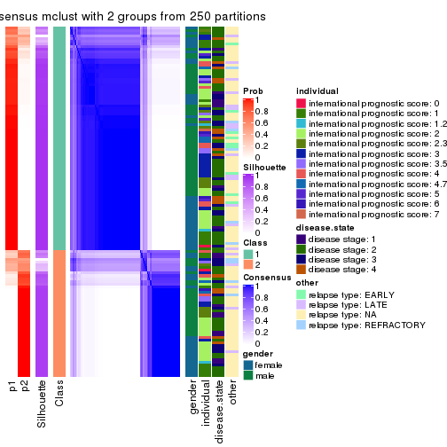</p>

</div>
<div id='tab-MAD-mclust-consensus-heatmap-2'>
<pre><code class="r">consensus_heatmap(res, k = 3)
</code></pre>

<p>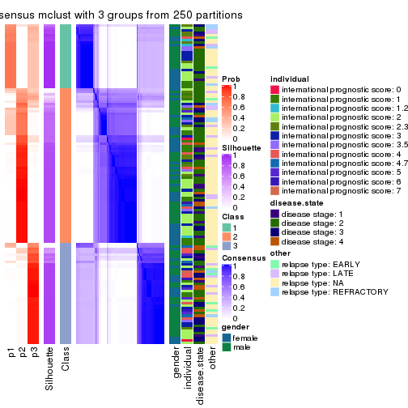</p>

</div>
<div id='tab-MAD-mclust-consensus-heatmap-3'>
<pre><code class="r">consensus_heatmap(res, k = 4)
</code></pre>

<p>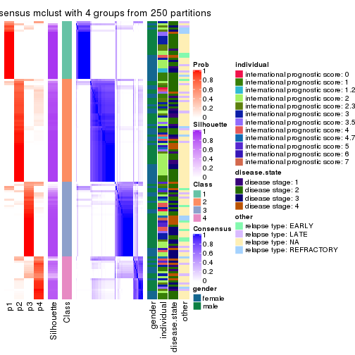</p>

</div>
<div id='tab-MAD-mclust-consensus-heatmap-4'>
<pre><code class="r">consensus_heatmap(res, k = 5)
</code></pre>

<p>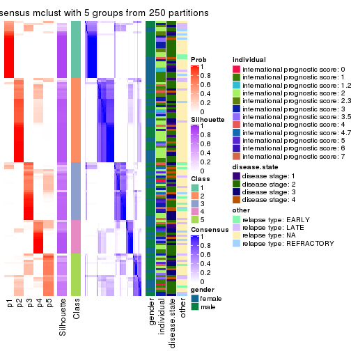</p>

</div>
<div id='tab-MAD-mclust-consensus-heatmap-5'>
<pre><code class="r">consensus_heatmap(res, k = 6)
</code></pre>

<p>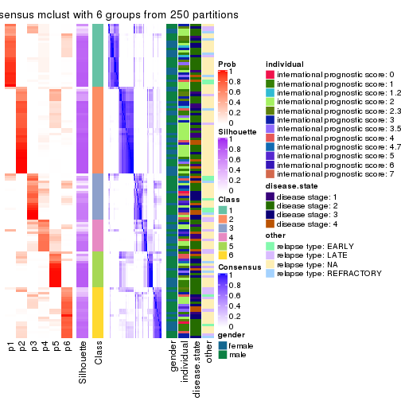</p>

</div>
</div>

Heatmaps for the membership of samples in all partitions to see how consistent they are:


<script>
$( function() {
	$( '#tabs-MAD-mclust-membership-heatmap' ).tabs();
} );
</script>
<div id='tabs-MAD-mclust-membership-heatmap'>
<ul>
<li><a href='#tab-MAD-mclust-membership-heatmap-1'>k = 2</a></li>
<li><a href='#tab-MAD-mclust-membership-heatmap-2'>k = 3</a></li>
<li><a href='#tab-MAD-mclust-membership-heatmap-3'>k = 4</a></li>
<li><a href='#tab-MAD-mclust-membership-heatmap-4'>k = 5</a></li>
<li><a href='#tab-MAD-mclust-membership-heatmap-5'>k = 6</a></li>
</ul>
<div id='tab-MAD-mclust-membership-heatmap-1'>
<pre><code class="r">membership_heatmap(res, k = 2)
</code></pre>

<p>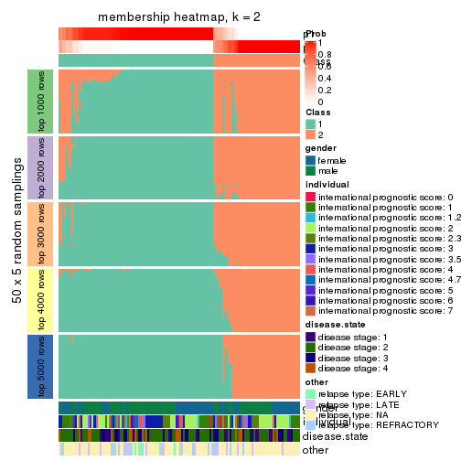</p>

</div>
<div id='tab-MAD-mclust-membership-heatmap-2'>
<pre><code class="r">membership_heatmap(res, k = 3)
</code></pre>

<p>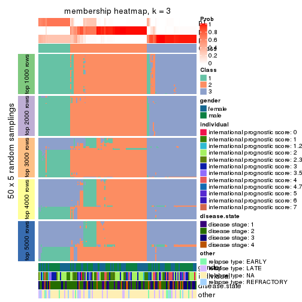</p>

</div>
<div id='tab-MAD-mclust-membership-heatmap-3'>
<pre><code class="r">membership_heatmap(res, k = 4)
</code></pre>

<p>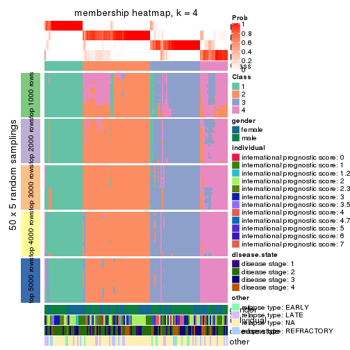</p>

</div>
<div id='tab-MAD-mclust-membership-heatmap-4'>
<pre><code class="r">membership_heatmap(res, k = 5)
</code></pre>

<p>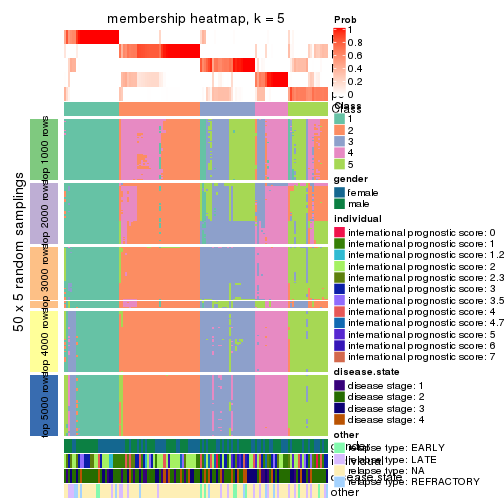</p>

</div>
<div id='tab-MAD-mclust-membership-heatmap-5'>
<pre><code class="r">membership_heatmap(res, k = 6)
</code></pre>

<p>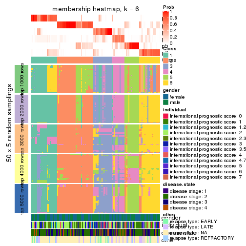</p>

</div>
</div>

As soon as we have had the classes for columns, we can look for signatures
which are significantly different between classes which can be candidate marks
for certain classes. Following are the heatmaps for signatures.


Signature heatmaps where rows are scaled:


<script>
$( function() {
	$( '#tabs-MAD-mclust-get-signatures' ).tabs();
} );
</script>
<div id='tabs-MAD-mclust-get-signatures'>
<ul>
<li><a href='#tab-MAD-mclust-get-signatures-1'>k = 2</a></li>
<li><a href='#tab-MAD-mclust-get-signatures-2'>k = 3</a></li>
<li><a href='#tab-MAD-mclust-get-signatures-3'>k = 4</a></li>
<li><a href='#tab-MAD-mclust-get-signatures-4'>k = 5</a></li>
<li><a href='#tab-MAD-mclust-get-signatures-5'>k = 6</a></li>
</ul>
<div id='tab-MAD-mclust-get-signatures-1'>
<pre><code class="r">get_signatures(res, k = 2)
</code></pre>

<p>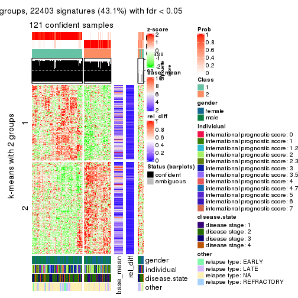</p>

</div>
<div id='tab-MAD-mclust-get-signatures-2'>
<pre><code class="r">get_signatures(res, k = 3)
</code></pre>

<p>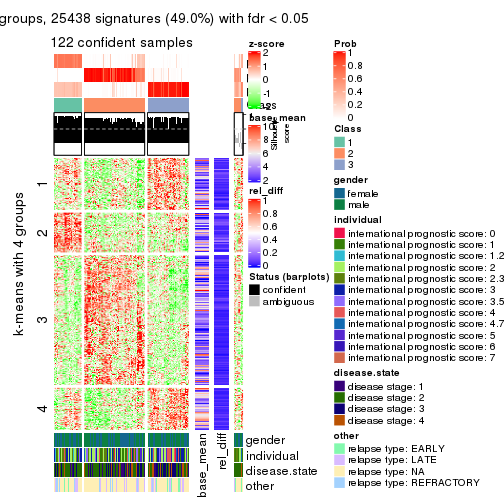</p>

</div>
<div id='tab-MAD-mclust-get-signatures-3'>
<pre><code class="r">get_signatures(res, k = 4)
</code></pre>

<p>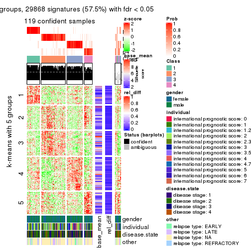</p>

</div>
<div id='tab-MAD-mclust-get-signatures-4'>
<pre><code class="r">get_signatures(res, k = 5)
</code></pre>

<pre><code>#&gt; Error: The width or height of the raster image is zero, maybe you forget to turn off the
#&gt; previous graphic device or it was corrupted. Run `dev.off()` to close it.
</code></pre>

<p></p>

</div>
<div id='tab-MAD-mclust-get-signatures-5'>
<pre><code class="r">get_signatures(res, k = 6)
</code></pre>

<pre><code>#&gt; Error: The width or height of the raster image is zero, maybe you forget to turn off the
#&gt; previous graphic device or it was corrupted. Run `dev.off()` to close it.
</code></pre>

<p></p>

</div>
</div>


Signature heatmaps where rows are not scaled:


<script>
$( function() {
	$( '#tabs-MAD-mclust-get-signatures-no-scale' ).tabs();
} );
</script>
<div id='tabs-MAD-mclust-get-signatures-no-scale'>
<ul>
<li><a href='#tab-MAD-mclust-get-signatures-no-scale-1'>k = 2</a></li>
<li><a href='#tab-MAD-mclust-get-signatures-no-scale-2'>k = 3</a></li>
<li><a href='#tab-MAD-mclust-get-signatures-no-scale-3'>k = 4</a></li>
<li><a href='#tab-MAD-mclust-get-signatures-no-scale-4'>k = 5</a></li>
<li><a href='#tab-MAD-mclust-get-signatures-no-scale-5'>k = 6</a></li>
</ul>
<div id='tab-MAD-mclust-get-signatures-no-scale-1'>
<pre><code class="r">get_signatures(res, k = 2, scale_rows = FALSE)
</code></pre>

<p>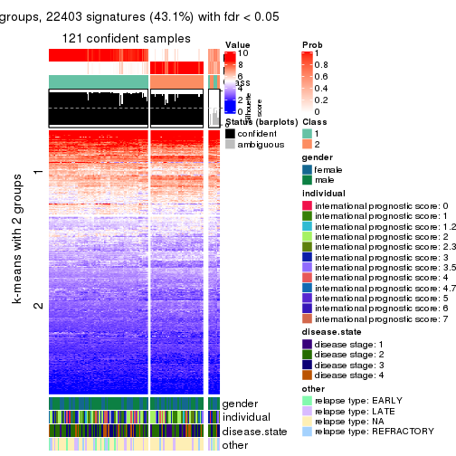</p>

</div>
<div id='tab-MAD-mclust-get-signatures-no-scale-2'>
<pre><code class="r">get_signatures(res, k = 3, scale_rows = FALSE)
</code></pre>

<p></p>

</div>
<div id='tab-MAD-mclust-get-signatures-no-scale-3'>
<pre><code class="r">get_signatures(res, k = 4, scale_rows = FALSE)
</code></pre>

<p>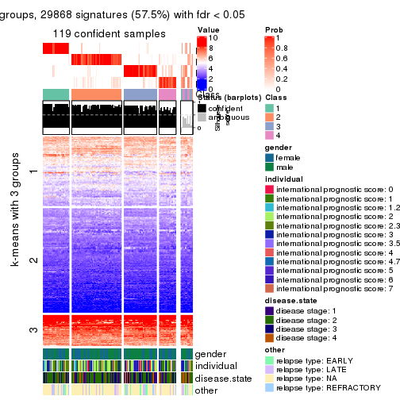</p>

</div>
<div id='tab-MAD-mclust-get-signatures-no-scale-4'>
<pre><code class="r">get_signatures(res, k = 5, scale_rows = FALSE)
</code></pre>

<p>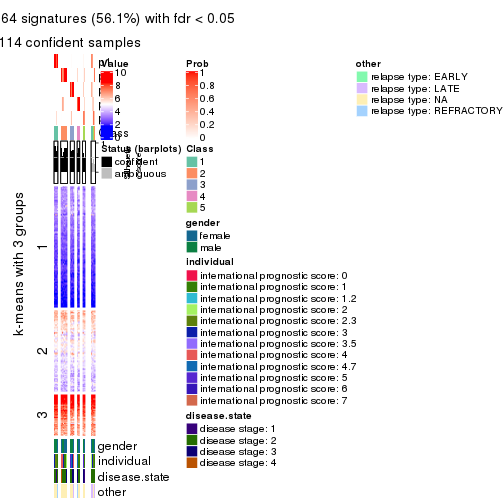</p>

</div>
<div id='tab-MAD-mclust-get-signatures-no-scale-5'>
<pre><code class="r">get_signatures(res, k = 6, scale_rows = FALSE)
</code></pre>

<p>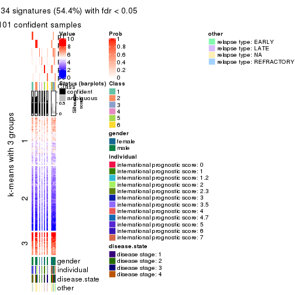</p>

</div>
</div>


Compare the overlap of signatures from different k:

```r
compare_signatures(res)
```

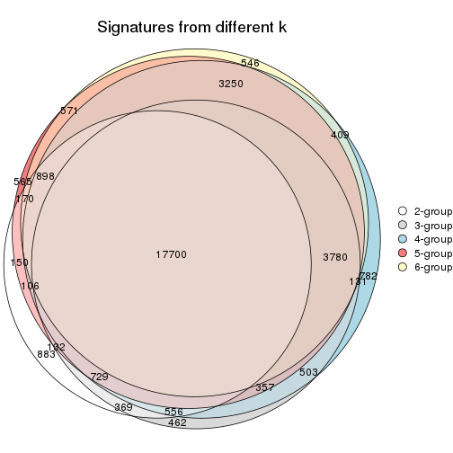

`get_signature()` returns a data frame invisibly. TO get the list of signatures, the function
call should be assigned to a variable explicitly. In following code, if `plot` argument is set
to `FALSE`, no heatmap is plotted while only the differential analysis is performed.

```r
# code only for demonstration
tb = get_signature(res, k = ..., plot = FALSE)
```

An example of the output of `tb` is:

```
#>   which_row         fdr    mean_1    mean_2 scaled_mean_1 scaled_mean_2 km
#> 1        38 0.042760348  8.373488  9.131774    -0.5533452     0.5164555  1
#> 2        40 0.018707592  7.106213  8.469186    -0.6173731     0.5762149  1
#> 3        55 0.019134737 10.221463 11.207825    -0.6159697     0.5749050  1
#> 4        59 0.006059896  5.921854  7.869574    -0.6899429     0.6439467  1
#> 5        60 0.018055526  8.928898 10.211722    -0.6204761     0.5791110  1
#> 6        98 0.009384629 15.714769 14.887706     0.6635654    -0.6193277  2
...
```

The columns in `tb` are:

1. `which_row`: row indices corresponding to the input matrix.
2. `fdr`: FDR for the differential test. 
3. `mean_x`: The mean value in group x.
4. `scaled_mean_x`: The mean value in group x after rows are scaled.
5. `km`: Row groups if k-means clustering is applied to rows.


UMAP plot which shows how samples are separated.


<script>
$( function() {
	$( '#tabs-MAD-mclust-dimension-reduction' ).tabs();
} );
</script>
<div id='tabs-MAD-mclust-dimension-reduction'>
<ul>
<li><a href='#tab-MAD-mclust-dimension-reduction-1'>k = 2</a></li>
<li><a href='#tab-MAD-mclust-dimension-reduction-2'>k = 3</a></li>
<li><a href='#tab-MAD-mclust-dimension-reduction-3'>k = 4</a></li>
<li><a href='#tab-MAD-mclust-dimension-reduction-4'>k = 5</a></li>
<li><a href='#tab-MAD-mclust-dimension-reduction-5'>k = 6</a></li>
</ul>
<div id='tab-MAD-mclust-dimension-reduction-1'>
<pre><code class="r">dimension_reduction(res, k = 2, method = &quot;UMAP&quot;)
</code></pre>

<p>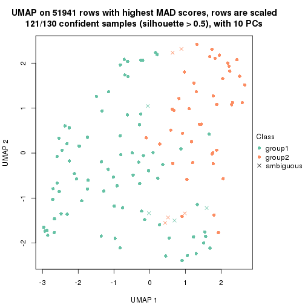</p>

</div>
<div id='tab-MAD-mclust-dimension-reduction-2'>
<pre><code class="r">dimension_reduction(res, k = 3, method = &quot;UMAP&quot;)
</code></pre>

<p>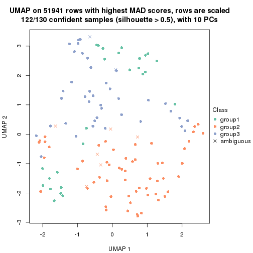</p>

</div>
<div id='tab-MAD-mclust-dimension-reduction-3'>
<pre><code class="r">dimension_reduction(res, k = 4, method = &quot;UMAP&quot;)
</code></pre>

<p>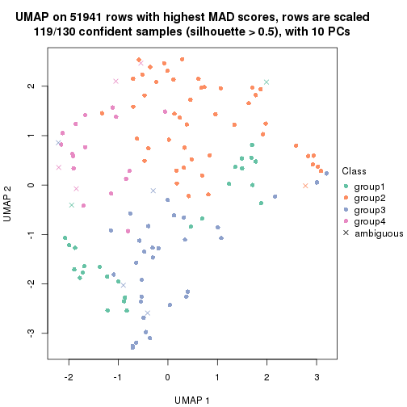</p>

</div>
<div id='tab-MAD-mclust-dimension-reduction-4'>
<pre><code class="r">dimension_reduction(res, k = 5, method = &quot;UMAP&quot;)
</code></pre>

<p>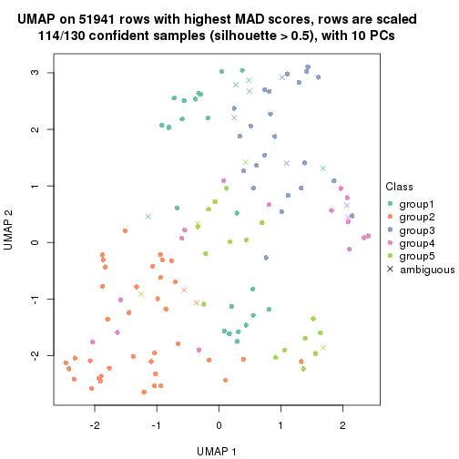</p>

</div>
<div id='tab-MAD-mclust-dimension-reduction-5'>
<pre><code class="r">dimension_reduction(res, k = 6, method = &quot;UMAP&quot;)
</code></pre>

<p>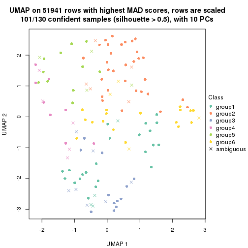</p>

</div>
</div>


Following heatmap shows how subgroups are split when increasing `k`:

```r
collect_classes(res)
```

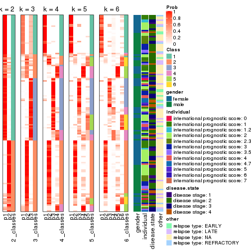


Test correlation between subgroups and known annotations. If the known
annotation is numeric, one-way ANOVA test is applied, and if the known
annotation is discrete, chi-squared contingency table test is applied.

```r
test_to_known_factors(res)
```

```
#>              n gender(p) individual(p) disease.state(p) other(p) k
#> MAD:mclust 121     0.576         0.793            0.241  0.07140 2
#> MAD:mclust 122     0.512         0.192            0.188  0.12437 3
#> MAD:mclust 119     0.250         0.325            0.176  0.12564 4
#> MAD:mclust 114     0.980         0.387            0.418  0.16139 5
#> MAD:mclust 101     0.673         0.217            0.172  0.00745 6
```


If matrix rows can be associated to genes, consider to use `GO_Enrichment(res,
...)` to perform function enrichment for the signature genes.


 

---------------------------------------------------


### MAD:NMF*


The object with results only for a single top-value method and a single partition method 
can be extracted as:

```r
res = res_list["MAD", "NMF"]
# you can also extract it by
# res = res_list["MAD:NMF"]
```

A summary of `res` and all the functions that can be applied to it:

```r
res
```

```
#> A 'ConsensusPartition' object with k = 2, 3, 4, 5, 6.
#>   On a matrix with 51941 rows and 130 columns.
#>   Top rows (1000, 2000, 3000, 4000, 5000) are extracted by 'MAD' method.
#>   Subgroups are detected by 'NMF' method.
#>   Performed in total 1250 partitions by row resampling.
#>   Best k for subgroups seems to be 2.
#> 
#> Following methods can be applied to this 'ConsensusPartition' object:
#>  [1] "cola_report"             "collect_classes"         "collect_plots"          
#>  [4] "collect_stats"           "colnames"                "compare_signatures"     
#>  [7] "consensus_heatmap"       "dimension_reduction"     "functional_enrichment"  
#> [10] "get_anno_col"            "get_anno"                "get_classes"            
#> [13] "get_consensus"           "get_matrix"              "get_membership"         
#> [16] "get_param"               "get_signatures"          "get_stats"              
#> [19] "is_best_k"               "is_stable_k"             "membership_heatmap"     
#> [22] "ncol"                    "nrow"                    "plot_ecdf"              
#> [25] "rownames"                "select_partition_number" "show"                   
#> [28] "suggest_best_k"          "test_to_known_factors"
```

`collect_plots()` function collects all the plots made from `res` for all `k` (number of partitions)
into one single page to provide an easy and fast comparison between different `k`.

```r
collect_plots(res)
```

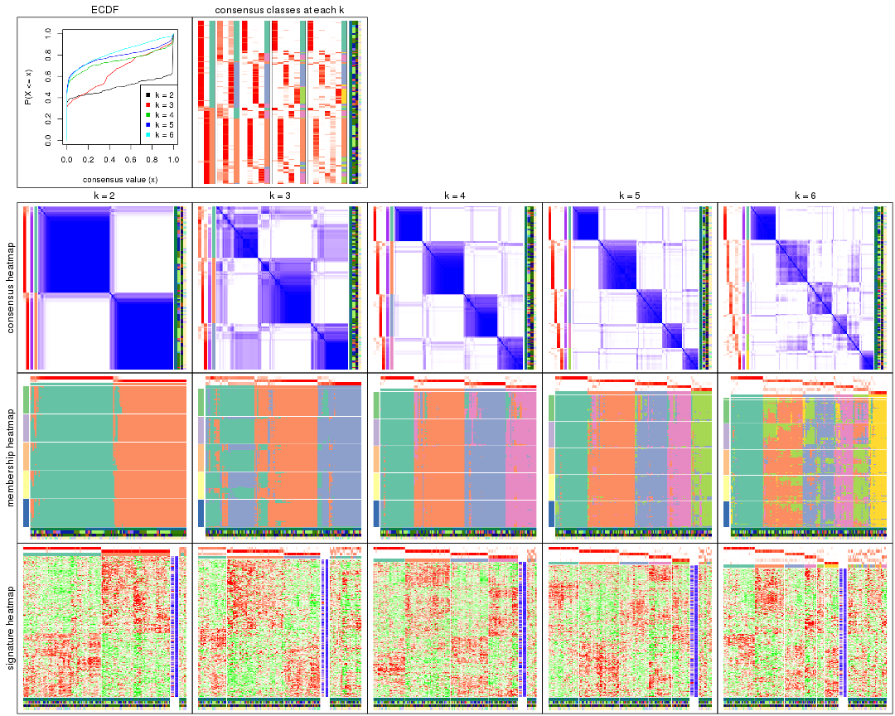

The plots are:

- The first row: a plot of the ECDF (Empirical cumulative distribution
  function) curves of the consensus matrix for each `k` and the heatmap of
  predicted classes for each `k`.
- The second row: heatmaps of the consensus matrix for each `k`.
- The third row: heatmaps of the membership matrix for each `k`.
- The fouth row: heatmaps of the signatures for each `k`.

All the plots in panels can be made by individual functions and they are
plotted later in this section.

`select_partition_number()` produces several plots showing different
statistics for choosing "optimized" `k`. There are following statistics:

- ECDF curves of the consensus matrix for each `k`;
- 1-PAC. [The PAC
  score](https://en.wikipedia.org/wiki/Consensus_clustering#Over-interpretation_potential_of_consensus_clustering)
  measures the proportion of the ambiguous subgrouping.
- Mean silhouette score.
- Concordance. The mean probability of fiting the consensus class ids in all
  partitions.
- Area increased. Denote $A_k$ as the area under the ECDF curve for current
  `k`, the area increased is defined as $A_k - A_{k-1}$.
- Rand index. The percent of pairs of samples that are both in a same cluster
  or both are not in a same cluster in the partition of k and k-1.
- Jaccard index. The ratio of pairs of samples are both in a same cluster in
  the partition of k and k-1 and the pairs of samples are both in a same
  cluster in the partition k or k-1.

The detailed explanations of these statistics can be found in [the cola
vignette](http://bioconductor.org/packages/devel/bioc/vignettes/cola/inst/doc/cola.html#toc_13).

Generally speaking, lower PAC score, higher mean silhouette score or higher
concordance corresponds to better partition. Rand index and Jaccard index
measure how similar the current partition is compared to partition with `k-1`.
If they are too similar, we won't accept `k` is better than `k-1`.

```r
select_partition_number(res)
```

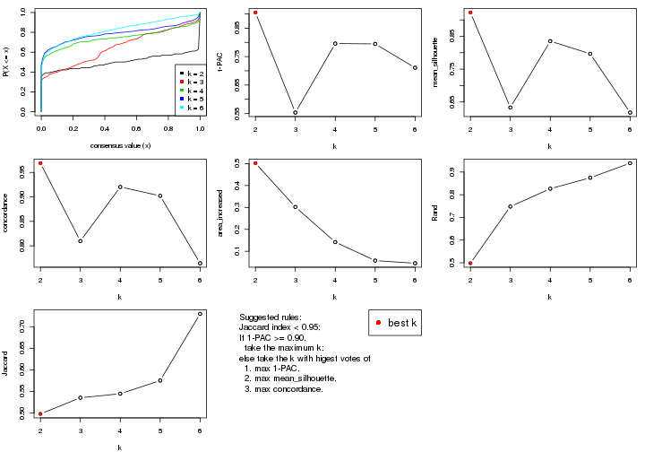

The numeric values for all these statistics can be obtained by `get_stats()`.

```r
get_stats(res)
```

```
#>   k 1-PAC mean_silhouette concordance area_increased  Rand Jaccard
#> 2 2 0.905           0.922       0.969         0.5020 0.498   0.498
#> 3 3 0.553           0.633       0.810         0.3022 0.748   0.535
#> 4 4 0.796           0.835       0.920         0.1418 0.826   0.545
#> 5 5 0.795           0.797       0.902         0.0574 0.875   0.575
#> 6 6 0.711           0.618       0.764         0.0454 0.939   0.730
```

`suggest_best_k()` suggests the best $k$ based on these statistics. The rules are as follows:

- All $k$ with Jaccard index larger than 0.95 are removed because the increase of
  the partition number does not provides enough extra information. If all $k$ are removed,
  the best $k$ is assigned by `NA`.
- For $k$ with 1-PAC larger than 0.9, the maximal $k$ is taken as the "best k". Other $k$ is called "optional k".
- If it does not fit the second rule. The $k$ with the highest vote of highest
  1-PAC, mean silhouette and concordance is taken as the "best k".

```r
suggest_best_k(res)
```

```
#> [1] 2
```


Following shows the table of the partitions (You need to click the **show/hide
code output** link to see it). The membership matrix (columns with name `p*`)
is inferred by
[`clue::cl_consensus()`](https://www.rdocumentation.org/link/cl_consensus?package=clue)
function with the `SE` method. Basically the value in the membership matrix
represents the probability to belong to a certain group. The finall class
label for an item is determined with the group with highest probability it
belongs to.

In `get_classes()` function, the entropy is calculated from the membership
matrix and the silhouette score is calculated from the consensus matrix.


<script>
$( function() {
	$( '#tabs-MAD-NMF-get-classes' ).tabs();
} );
</script>
<div id='tabs-MAD-NMF-get-classes'>
<ul>
<li><a href='#tab-MAD-NMF-get-classes-1'>k = 2</a></li>
<li><a href='#tab-MAD-NMF-get-classes-2'>k = 3</a></li>
<li><a href='#tab-MAD-NMF-get-classes-3'>k = 4</a></li>
<li><a href='#tab-MAD-NMF-get-classes-4'>k = 5</a></li>
<li><a href='#tab-MAD-NMF-get-classes-5'>k = 6</a></li>
</ul>

<div id='tab-MAD-NMF-get-classes-1'>
<p><a id='tab-MAD-NMF-get-classes-1-a' style='color:#0366d6' href='#'>show/hide code output</a></p>
<pre><code class="r">cbind(get_classes(res, k = 2), get_membership(res, k = 2))
</code></pre>

<pre><code>#&gt;           class entropy silhouette    p1    p2
#&gt; GSM447671     2  0.0000      0.966 0.000 1.000
#&gt; GSM447694     1  0.0000      0.968 1.000 0.000
#&gt; GSM447618     2  0.0000      0.966 0.000 1.000
#&gt; GSM447691     2  0.0000      0.966 0.000 1.000
#&gt; GSM447733     1  0.1633      0.948 0.976 0.024
#&gt; GSM447620     2  0.0000      0.966 0.000 1.000
#&gt; GSM447627     1  0.0000      0.968 1.000 0.000
#&gt; GSM447630     2  0.9815      0.252 0.420 0.580
#&gt; GSM447642     1  0.0000      0.968 1.000 0.000
#&gt; GSM447649     2  0.0000      0.966 0.000 1.000
#&gt; GSM447654     2  0.0000      0.966 0.000 1.000
#&gt; GSM447655     2  0.0000      0.966 0.000 1.000
#&gt; GSM447669     2  0.0000      0.966 0.000 1.000
#&gt; GSM447676     1  0.0000      0.968 1.000 0.000
#&gt; GSM447678     2  0.0000      0.966 0.000 1.000
#&gt; GSM447681     2  0.0000      0.966 0.000 1.000
#&gt; GSM447698     2  0.0000      0.966 0.000 1.000
#&gt; GSM447713     1  0.0000      0.968 1.000 0.000
#&gt; GSM447722     2  0.0000      0.966 0.000 1.000
#&gt; GSM447726     2  0.4690      0.869 0.100 0.900
#&gt; GSM447735     1  0.0000      0.968 1.000 0.000
#&gt; GSM447737     1  0.0000      0.968 1.000 0.000
#&gt; GSM447657     2  0.0000      0.966 0.000 1.000
#&gt; GSM447674     2  0.0000      0.966 0.000 1.000
#&gt; GSM447636     1  0.8081      0.663 0.752 0.248
#&gt; GSM447723     1  0.0000      0.968 1.000 0.000
#&gt; GSM447699     1  0.4815      0.868 0.896 0.104
#&gt; GSM447708     2  0.0000      0.966 0.000 1.000
#&gt; GSM447721     1  0.0000      0.968 1.000 0.000
#&gt; GSM447623     1  0.0000      0.968 1.000 0.000
#&gt; GSM447621     1  0.0000      0.968 1.000 0.000
#&gt; GSM447650     2  0.0000      0.966 0.000 1.000
#&gt; GSM447651     2  0.0000      0.966 0.000 1.000
#&gt; GSM447653     1  0.0000      0.968 1.000 0.000
#&gt; GSM447658     1  0.0000      0.968 1.000 0.000
#&gt; GSM447675     2  0.1414      0.949 0.020 0.980
#&gt; GSM447680     2  0.0000      0.966 0.000 1.000
#&gt; GSM447686     2  0.6623      0.781 0.172 0.828
#&gt; GSM447736     1  0.0000      0.968 1.000 0.000
#&gt; GSM447629     2  0.0000      0.966 0.000 1.000
#&gt; GSM447648     1  0.0000      0.968 1.000 0.000
#&gt; GSM447660     1  0.0000      0.968 1.000 0.000
#&gt; GSM447661     2  0.0000      0.966 0.000 1.000
#&gt; GSM447663     1  0.0000      0.968 1.000 0.000
#&gt; GSM447704     2  0.0000      0.966 0.000 1.000
#&gt; GSM447720     1  0.0000      0.968 1.000 0.000
#&gt; GSM447652     2  0.0000      0.966 0.000 1.000
#&gt; GSM447679     2  0.0000      0.966 0.000 1.000
#&gt; GSM447712     1  0.0000      0.968 1.000 0.000
#&gt; GSM447664     2  0.0672      0.959 0.008 0.992
#&gt; GSM447637     1  0.0000      0.968 1.000 0.000
#&gt; GSM447639     1  0.0938      0.958 0.988 0.012
#&gt; GSM447615     1  0.0000      0.968 1.000 0.000
#&gt; GSM447656     2  0.0000      0.966 0.000 1.000
#&gt; GSM447673     2  0.0000      0.966 0.000 1.000
#&gt; GSM447719     1  0.0000      0.968 1.000 0.000
#&gt; GSM447706     1  0.0000      0.968 1.000 0.000
#&gt; GSM447612     1  0.6438      0.795 0.836 0.164
#&gt; GSM447665     2  0.0000      0.966 0.000 1.000
#&gt; GSM447677     2  0.0000      0.966 0.000 1.000
#&gt; GSM447613     1  0.0000      0.968 1.000 0.000
#&gt; GSM447659     1  0.0000      0.968 1.000 0.000
#&gt; GSM447662     1  0.0000      0.968 1.000 0.000
#&gt; GSM447666     1  0.0672      0.961 0.992 0.008
#&gt; GSM447668     2  0.0000      0.966 0.000 1.000
#&gt; GSM447682     2  0.0000      0.966 0.000 1.000
#&gt; GSM447683     2  0.0000      0.966 0.000 1.000
#&gt; GSM447688     2  0.0000      0.966 0.000 1.000
#&gt; GSM447702     2  0.0000      0.966 0.000 1.000
#&gt; GSM447709     2  0.0000      0.966 0.000 1.000
#&gt; GSM447711     1  0.0000      0.968 1.000 0.000
#&gt; GSM447715     1  0.9170      0.498 0.668 0.332
#&gt; GSM447693     1  0.0000      0.968 1.000 0.000
#&gt; GSM447611     1  0.4022      0.893 0.920 0.080
#&gt; GSM447672     2  0.0000      0.966 0.000 1.000
#&gt; GSM447703     2  0.0000      0.966 0.000 1.000
#&gt; GSM447727     1  0.0000      0.968 1.000 0.000
#&gt; GSM447638     2  0.9909      0.213 0.444 0.556
#&gt; GSM447670     1  0.0000      0.968 1.000 0.000
#&gt; GSM447700     2  0.0000      0.966 0.000 1.000
#&gt; GSM447738     2  0.0000      0.966 0.000 1.000
#&gt; GSM447739     1  0.0000      0.968 1.000 0.000
#&gt; GSM447617     1  0.0000      0.968 1.000 0.000
#&gt; GSM447628     2  0.0000      0.966 0.000 1.000
#&gt; GSM447632     2  0.0000      0.966 0.000 1.000
#&gt; GSM447619     1  0.0000      0.968 1.000 0.000
#&gt; GSM447643     2  0.9710      0.342 0.400 0.600
#&gt; GSM447724     1  0.8909      0.561 0.692 0.308
#&gt; GSM447728     2  0.0000      0.966 0.000 1.000
#&gt; GSM447610     1  0.0000      0.968 1.000 0.000
#&gt; GSM447633     2  0.0000      0.966 0.000 1.000
#&gt; GSM447634     1  0.0000      0.968 1.000 0.000
#&gt; GSM447622     1  0.0000      0.968 1.000 0.000
#&gt; GSM447667     2  0.3114      0.915 0.056 0.944
#&gt; GSM447687     2  0.0000      0.966 0.000 1.000
#&gt; GSM447695     1  0.0000      0.968 1.000 0.000
#&gt; GSM447696     1  0.0000      0.968 1.000 0.000
#&gt; GSM447697     1  0.0000      0.968 1.000 0.000
#&gt; GSM447714     1  0.0000      0.968 1.000 0.000
#&gt; GSM447717     1  0.0000      0.968 1.000 0.000
#&gt; GSM447725     1  0.0000      0.968 1.000 0.000
#&gt; GSM447729     2  0.0000      0.966 0.000 1.000
#&gt; GSM447644     2  0.0000      0.966 0.000 1.000
#&gt; GSM447710     1  0.0000      0.968 1.000 0.000
#&gt; GSM447614     1  0.0000      0.968 1.000 0.000
#&gt; GSM447685     2  0.0000      0.966 0.000 1.000
#&gt; GSM447690     1  0.0000      0.968 1.000 0.000
#&gt; GSM447730     2  0.0000      0.966 0.000 1.000
#&gt; GSM447646     2  0.0000      0.966 0.000 1.000
#&gt; GSM447689     1  0.0000      0.968 1.000 0.000
#&gt; GSM447635     1  0.9427      0.449 0.640 0.360
#&gt; GSM447641     1  0.0000      0.968 1.000 0.000
#&gt; GSM447716     2  0.0000      0.966 0.000 1.000
#&gt; GSM447718     1  0.0672      0.962 0.992 0.008
#&gt; GSM447616     1  0.0000      0.968 1.000 0.000
#&gt; GSM447626     1  0.0000      0.968 1.000 0.000
#&gt; GSM447640     2  0.0000      0.966 0.000 1.000
#&gt; GSM447734     1  0.0000      0.968 1.000 0.000
#&gt; GSM447692     1  0.0000      0.968 1.000 0.000
#&gt; GSM447647     2  0.0000      0.966 0.000 1.000
#&gt; GSM447624     1  0.0000      0.968 1.000 0.000
#&gt; GSM447625     1  0.0000      0.968 1.000 0.000
#&gt; GSM447707     2  0.0000      0.966 0.000 1.000
#&gt; GSM447732     1  0.0000      0.968 1.000 0.000
#&gt; GSM447684     1  0.0000      0.968 1.000 0.000
#&gt; GSM447731     2  0.9129      0.518 0.328 0.672
#&gt; GSM447705     1  0.9944      0.176 0.544 0.456
#&gt; GSM447631     1  0.0000      0.968 1.000 0.000
#&gt; GSM447701     2  0.0000      0.966 0.000 1.000
#&gt; GSM447645     1  0.0000      0.968 1.000 0.000
</code></pre>

<script>
$('#tab-MAD-NMF-get-classes-1-a').parent().next().next().hide();
$('#tab-MAD-NMF-get-classes-1-a').click(function(){
  $('#tab-MAD-NMF-get-classes-1-a').parent().next().next().toggle();
  return(false);
});
</script>
</div>

<div id='tab-MAD-NMF-get-classes-2'>
<p><a id='tab-MAD-NMF-get-classes-2-a' style='color:#0366d6' href='#'>show/hide code output</a></p>
<pre><code class="r">cbind(get_classes(res, k = 3), get_membership(res, k = 3))
</code></pre>

<pre><code>#&gt;           class entropy silhouette    p1    p2    p3
#&gt; GSM447671     2  0.6235     0.2076 0.000 0.564 0.436
#&gt; GSM447694     3  0.0000     0.8305 0.000 0.000 1.000
#&gt; GSM447618     2  0.0747     0.8609 0.016 0.984 0.000
#&gt; GSM447691     2  0.0000     0.8642 0.000 1.000 0.000
#&gt; GSM447733     3  0.6330     0.3860 0.396 0.004 0.600
#&gt; GSM447620     2  0.5216     0.6141 0.000 0.740 0.260
#&gt; GSM447627     3  0.1964     0.7872 0.056 0.000 0.944
#&gt; GSM447630     2  0.6286     0.1066 0.000 0.536 0.464
#&gt; GSM447642     1  0.6026     0.6015 0.624 0.000 0.376
#&gt; GSM447649     2  0.0000     0.8642 0.000 1.000 0.000
#&gt; GSM447654     1  0.5058     0.2439 0.756 0.244 0.000
#&gt; GSM447655     2  0.0000     0.8642 0.000 1.000 0.000
#&gt; GSM447669     2  0.2711     0.8037 0.000 0.912 0.088
#&gt; GSM447676     1  0.5968     0.6083 0.636 0.000 0.364
#&gt; GSM447678     2  0.6062     0.5664 0.384 0.616 0.000
#&gt; GSM447681     2  0.0747     0.8609 0.016 0.984 0.000
#&gt; GSM447698     2  0.5058     0.7128 0.244 0.756 0.000
#&gt; GSM447713     1  0.5926     0.6102 0.644 0.000 0.356
#&gt; GSM447722     2  0.8875     0.4454 0.364 0.508 0.128
#&gt; GSM447726     2  0.0000     0.8642 0.000 1.000 0.000
#&gt; GSM447735     1  0.6168    -0.0737 0.588 0.000 0.412
#&gt; GSM447737     1  0.6215     0.5428 0.572 0.000 0.428
#&gt; GSM447657     2  0.2448     0.8363 0.076 0.924 0.000
#&gt; GSM447674     2  0.1031     0.8582 0.024 0.976 0.000
#&gt; GSM447636     1  0.7966     0.5232 0.652 0.220 0.128
#&gt; GSM447723     1  0.6045     0.5984 0.620 0.000 0.380
#&gt; GSM447699     3  0.0000     0.8305 0.000 0.000 1.000
#&gt; GSM447708     2  0.0000     0.8642 0.000 1.000 0.000
#&gt; GSM447721     1  0.5988     0.6067 0.632 0.000 0.368
#&gt; GSM447623     1  0.6095     0.5865 0.608 0.000 0.392
#&gt; GSM447621     1  0.6204     0.5471 0.576 0.000 0.424
#&gt; GSM447650     2  0.0000     0.8642 0.000 1.000 0.000
#&gt; GSM447651     2  0.0000     0.8642 0.000 1.000 0.000
#&gt; GSM447653     1  0.1753     0.4828 0.952 0.000 0.048
#&gt; GSM447658     1  0.5948     0.6096 0.640 0.000 0.360
#&gt; GSM447675     1  0.6309    -0.3959 0.504 0.496 0.000
#&gt; GSM447680     2  0.0000     0.8642 0.000 1.000 0.000
#&gt; GSM447686     1  0.5835     0.4070 0.660 0.340 0.000
#&gt; GSM447736     3  0.0000     0.8305 0.000 0.000 1.000
#&gt; GSM447629     2  0.0000     0.8642 0.000 1.000 0.000
#&gt; GSM447648     3  0.0000     0.8305 0.000 0.000 1.000
#&gt; GSM447660     1  0.5926     0.6102 0.644 0.000 0.356
#&gt; GSM447661     2  0.0000     0.8642 0.000 1.000 0.000
#&gt; GSM447663     3  0.0000     0.8305 0.000 0.000 1.000
#&gt; GSM447704     2  0.0237     0.8636 0.004 0.996 0.000
#&gt; GSM447720     3  0.4586     0.6851 0.096 0.048 0.856
#&gt; GSM447652     2  0.1411     0.8537 0.036 0.964 0.000
#&gt; GSM447679     2  0.0000     0.8642 0.000 1.000 0.000
#&gt; GSM447712     1  0.5948     0.6096 0.640 0.000 0.360
#&gt; GSM447664     1  0.5882    -0.0255 0.652 0.348 0.000
#&gt; GSM447637     3  0.0000     0.8305 0.000 0.000 1.000
#&gt; GSM447639     3  0.9537     0.1866 0.380 0.192 0.428
#&gt; GSM447615     1  0.6154     0.5694 0.592 0.000 0.408
#&gt; GSM447656     2  0.0000     0.8642 0.000 1.000 0.000
#&gt; GSM447673     2  0.5948     0.5947 0.360 0.640 0.000
#&gt; GSM447719     1  0.5882     0.1851 0.652 0.000 0.348
#&gt; GSM447706     3  0.0000     0.8305 0.000 0.000 1.000
#&gt; GSM447612     3  0.0000     0.8305 0.000 0.000 1.000
#&gt; GSM447665     2  0.0000     0.8642 0.000 1.000 0.000
#&gt; GSM447677     2  0.0000     0.8642 0.000 1.000 0.000
#&gt; GSM447613     1  0.6045     0.5984 0.620 0.000 0.380
#&gt; GSM447659     3  0.5835     0.4494 0.340 0.000 0.660
#&gt; GSM447662     3  0.0000     0.8305 0.000 0.000 1.000
#&gt; GSM447666     3  0.4842     0.5645 0.000 0.224 0.776
#&gt; GSM447668     2  0.0000     0.8642 0.000 1.000 0.000
#&gt; GSM447682     2  0.0237     0.8636 0.004 0.996 0.000
#&gt; GSM447683     2  0.0000     0.8642 0.000 1.000 0.000
#&gt; GSM447688     2  0.5948     0.5947 0.360 0.640 0.000
#&gt; GSM447702     2  0.0000     0.8642 0.000 1.000 0.000
#&gt; GSM447709     2  0.3192     0.7835 0.000 0.888 0.112
#&gt; GSM447711     1  0.5988     0.6067 0.632 0.000 0.368
#&gt; GSM447715     1  0.8013     0.4048 0.564 0.364 0.072
#&gt; GSM447693     3  0.0000     0.8305 0.000 0.000 1.000
#&gt; GSM447611     1  0.0424     0.4869 0.992 0.008 0.000
#&gt; GSM447672     2  0.0237     0.8636 0.004 0.996 0.000
#&gt; GSM447703     2  0.3192     0.8168 0.112 0.888 0.000
#&gt; GSM447727     1  0.6180     0.5576 0.584 0.000 0.416
#&gt; GSM447638     1  0.6286     0.1899 0.536 0.464 0.000
#&gt; GSM447670     1  0.6267     0.5014 0.548 0.000 0.452
#&gt; GSM447700     2  0.8009     0.2067 0.064 0.524 0.412
#&gt; GSM447738     2  0.3482     0.8070 0.128 0.872 0.000
#&gt; GSM447739     1  0.5948     0.6096 0.640 0.000 0.360
#&gt; GSM447617     1  0.6280     0.4857 0.540 0.000 0.460
#&gt; GSM447628     2  0.6095     0.5556 0.392 0.608 0.000
#&gt; GSM447632     2  0.2878     0.8260 0.096 0.904 0.000
#&gt; GSM447619     3  0.0000     0.8305 0.000 0.000 1.000
#&gt; GSM447643     1  0.6379     0.3821 0.624 0.368 0.008
#&gt; GSM447724     3  0.5968     0.4247 0.364 0.000 0.636
#&gt; GSM447728     2  0.0000     0.8642 0.000 1.000 0.000
#&gt; GSM447610     1  0.1643     0.4972 0.956 0.000 0.044
#&gt; GSM447633     3  0.6280     0.0811 0.000 0.460 0.540
#&gt; GSM447634     3  0.4555     0.5426 0.200 0.000 0.800
#&gt; GSM447622     3  0.0000     0.8305 0.000 0.000 1.000
#&gt; GSM447667     2  0.4555     0.6619 0.200 0.800 0.000
#&gt; GSM447687     2  0.3551     0.8041 0.132 0.868 0.000
#&gt; GSM447695     3  0.4291     0.5832 0.180 0.000 0.820
#&gt; GSM447696     1  0.6008     0.6042 0.628 0.000 0.372
#&gt; GSM447697     1  0.6045     0.5984 0.620 0.000 0.380
#&gt; GSM447714     3  0.0000     0.8305 0.000 0.000 1.000
#&gt; GSM447717     1  0.5926     0.6102 0.644 0.000 0.356
#&gt; GSM447725     1  0.5138     0.5875 0.748 0.000 0.252
#&gt; GSM447729     1  0.4452     0.3424 0.808 0.192 0.000
#&gt; GSM447644     2  0.4121     0.7258 0.000 0.832 0.168
#&gt; GSM447710     3  0.0000     0.8305 0.000 0.000 1.000
#&gt; GSM447614     1  0.6154    -0.0376 0.592 0.000 0.408
#&gt; GSM447685     2  0.0000     0.8642 0.000 1.000 0.000
#&gt; GSM447690     1  0.4750     0.5749 0.784 0.000 0.216
#&gt; GSM447730     2  0.0892     0.8596 0.020 0.980 0.000
#&gt; GSM447646     2  0.6026     0.5757 0.376 0.624 0.000
#&gt; GSM447689     3  0.0000     0.8305 0.000 0.000 1.000
#&gt; GSM447635     2  0.5992     0.5255 0.016 0.716 0.268
#&gt; GSM447641     1  0.5988     0.6067 0.632 0.000 0.368
#&gt; GSM447716     1  0.6308    -0.3828 0.508 0.492 0.000
#&gt; GSM447718     3  0.3038     0.7228 0.000 0.104 0.896
#&gt; GSM447616     3  0.0424     0.8235 0.008 0.000 0.992
#&gt; GSM447626     3  0.0000     0.8305 0.000 0.000 1.000
#&gt; GSM447640     2  0.0000     0.8642 0.000 1.000 0.000
#&gt; GSM447734     3  0.0000     0.8305 0.000 0.000 1.000
#&gt; GSM447692     3  0.4842     0.4869 0.224 0.000 0.776
#&gt; GSM447647     2  0.6008     0.5806 0.372 0.628 0.000
#&gt; GSM447624     3  0.4452     0.5625 0.192 0.000 0.808
#&gt; GSM447625     3  0.0000     0.8305 0.000 0.000 1.000
#&gt; GSM447707     2  0.0000     0.8642 0.000 1.000 0.000
#&gt; GSM447732     3  0.0000     0.8305 0.000 0.000 1.000
#&gt; GSM447684     3  0.5094     0.6610 0.136 0.040 0.824
#&gt; GSM447731     1  0.9773    -0.2240 0.412 0.352 0.236
#&gt; GSM447705     3  0.4399     0.6144 0.000 0.188 0.812
#&gt; GSM447631     3  0.0000     0.8305 0.000 0.000 1.000
#&gt; GSM447701     2  0.0000     0.8642 0.000 1.000 0.000
#&gt; GSM447645     3  0.0000     0.8305 0.000 0.000 1.000
</code></pre>

<script>
$('#tab-MAD-NMF-get-classes-2-a').parent().next().next().hide();
$('#tab-MAD-NMF-get-classes-2-a').click(function(){
  $('#tab-MAD-NMF-get-classes-2-a').parent().next().next().toggle();
  return(false);
});
</script>
</div>

<div id='tab-MAD-NMF-get-classes-3'>
<p><a id='tab-MAD-NMF-get-classes-3-a' style='color:#0366d6' href='#'>show/hide code output</a></p>
<pre><code class="r">cbind(get_classes(res, k = 4), get_membership(res, k = 4))
</code></pre>

<pre><code>#&gt;           class entropy silhouette    p1    p2    p3    p4
#&gt; GSM447671     3  0.7282      0.352 0.000 0.316 0.512 0.172
#&gt; GSM447694     3  0.1940      0.878 0.000 0.000 0.924 0.076
#&gt; GSM447618     2  0.4941      0.300 0.000 0.564 0.000 0.436
#&gt; GSM447691     2  0.1792      0.864 0.000 0.932 0.000 0.068
#&gt; GSM447733     4  0.0188      0.863 0.000 0.000 0.004 0.996
#&gt; GSM447620     2  0.3764      0.723 0.000 0.784 0.216 0.000
#&gt; GSM447627     3  0.3444      0.802 0.000 0.000 0.816 0.184
#&gt; GSM447630     2  0.4925      0.182 0.000 0.572 0.428 0.000
#&gt; GSM447642     1  0.0000      0.963 1.000 0.000 0.000 0.000
#&gt; GSM447649     2  0.0000      0.908 0.000 1.000 0.000 0.000
#&gt; GSM447654     4  0.1807      0.858 0.052 0.008 0.000 0.940
#&gt; GSM447655     2  0.0000      0.908 0.000 1.000 0.000 0.000
#&gt; GSM447669     2  0.1474      0.872 0.000 0.948 0.052 0.000
#&gt; GSM447676     1  0.0000      0.963 1.000 0.000 0.000 0.000
#&gt; GSM447678     4  0.0000      0.863 0.000 0.000 0.000 1.000
#&gt; GSM447681     2  0.0592      0.901 0.000 0.984 0.000 0.016
#&gt; GSM447698     4  0.0469      0.865 0.000 0.012 0.000 0.988
#&gt; GSM447713     1  0.0000      0.963 1.000 0.000 0.000 0.000
#&gt; GSM447722     4  0.0000      0.863 0.000 0.000 0.000 1.000
#&gt; GSM447726     2  0.0469      0.902 0.000 0.988 0.012 0.000
#&gt; GSM447735     4  0.1211      0.848 0.000 0.000 0.040 0.960
#&gt; GSM447737     1  0.5420      0.381 0.624 0.000 0.352 0.024
#&gt; GSM447657     2  0.2011      0.847 0.000 0.920 0.000 0.080
#&gt; GSM447674     2  0.0188      0.907 0.000 0.996 0.000 0.004
#&gt; GSM447636     1  0.0000      0.963 1.000 0.000 0.000 0.000
#&gt; GSM447723     1  0.0000      0.963 1.000 0.000 0.000 0.000
#&gt; GSM447699     3  0.3801      0.765 0.000 0.000 0.780 0.220
#&gt; GSM447708     2  0.0000      0.908 0.000 1.000 0.000 0.000
#&gt; GSM447721     1  0.0000      0.963 1.000 0.000 0.000 0.000
#&gt; GSM447623     1  0.0336      0.957 0.992 0.000 0.008 0.000
#&gt; GSM447621     1  0.1940      0.892 0.924 0.000 0.076 0.000
#&gt; GSM447650     2  0.0000      0.908 0.000 1.000 0.000 0.000
#&gt; GSM447651     2  0.0000      0.908 0.000 1.000 0.000 0.000
#&gt; GSM447653     4  0.2610      0.834 0.088 0.000 0.012 0.900
#&gt; GSM447658     1  0.0000      0.963 1.000 0.000 0.000 0.000
#&gt; GSM447675     4  0.0000      0.863 0.000 0.000 0.000 1.000
#&gt; GSM447680     2  0.0000      0.908 0.000 1.000 0.000 0.000
#&gt; GSM447686     1  0.0000      0.963 1.000 0.000 0.000 0.000
#&gt; GSM447736     3  0.1637      0.886 0.000 0.000 0.940 0.060
#&gt; GSM447629     2  0.0336      0.905 0.000 0.992 0.000 0.008
#&gt; GSM447648     3  0.0000      0.909 0.000 0.000 1.000 0.000
#&gt; GSM447660     1  0.0000      0.963 1.000 0.000 0.000 0.000
#&gt; GSM447661     2  0.0000      0.908 0.000 1.000 0.000 0.000
#&gt; GSM447663     3  0.0000      0.909 0.000 0.000 1.000 0.000
#&gt; GSM447704     2  0.0000      0.908 0.000 1.000 0.000 0.000
#&gt; GSM447720     3  0.3976      0.824 0.112 0.004 0.840 0.044
#&gt; GSM447652     2  0.0336      0.905 0.000 0.992 0.000 0.008
#&gt; GSM447679     2  0.0000      0.908 0.000 1.000 0.000 0.000
#&gt; GSM447712     1  0.0000      0.963 1.000 0.000 0.000 0.000
#&gt; GSM447664     4  0.4136      0.739 0.196 0.016 0.000 0.788
#&gt; GSM447637     3  0.0000      0.909 0.000 0.000 1.000 0.000
#&gt; GSM447639     4  0.0469      0.861 0.000 0.000 0.012 0.988
#&gt; GSM447615     1  0.0336      0.957 0.992 0.000 0.008 0.000
#&gt; GSM447656     2  0.0000      0.908 0.000 1.000 0.000 0.000
#&gt; GSM447673     4  0.2921      0.812 0.000 0.140 0.000 0.860
#&gt; GSM447719     4  0.5628      0.302 0.024 0.000 0.420 0.556
#&gt; GSM447706     3  0.0000      0.909 0.000 0.000 1.000 0.000
#&gt; GSM447612     3  0.0000      0.909 0.000 0.000 1.000 0.000
#&gt; GSM447665     2  0.0000      0.908 0.000 1.000 0.000 0.000
#&gt; GSM447677     2  0.0000      0.908 0.000 1.000 0.000 0.000
#&gt; GSM447613     1  0.0000      0.963 1.000 0.000 0.000 0.000
#&gt; GSM447659     3  0.4008      0.715 0.000 0.000 0.756 0.244
#&gt; GSM447662     3  0.0000      0.909 0.000 0.000 1.000 0.000
#&gt; GSM447666     3  0.1474      0.873 0.000 0.052 0.948 0.000
#&gt; GSM447668     2  0.0000      0.908 0.000 1.000 0.000 0.000
#&gt; GSM447682     2  0.0000      0.908 0.000 1.000 0.000 0.000
#&gt; GSM447683     2  0.0000      0.908 0.000 1.000 0.000 0.000
#&gt; GSM447688     4  0.0336      0.865 0.000 0.008 0.000 0.992
#&gt; GSM447702     2  0.0000      0.908 0.000 1.000 0.000 0.000
#&gt; GSM447709     2  0.0817      0.896 0.000 0.976 0.024 0.000
#&gt; GSM447711     1  0.0000      0.963 1.000 0.000 0.000 0.000
#&gt; GSM447715     1  0.3873      0.675 0.772 0.228 0.000 0.000
#&gt; GSM447693     3  0.0000      0.909 0.000 0.000 1.000 0.000
#&gt; GSM447611     4  0.3610      0.738 0.200 0.000 0.000 0.800
#&gt; GSM447672     2  0.0188      0.907 0.000 0.996 0.000 0.004
#&gt; GSM447703     4  0.4522      0.590 0.000 0.320 0.000 0.680
#&gt; GSM447727     1  0.0000      0.963 1.000 0.000 0.000 0.000
#&gt; GSM447638     2  0.3583      0.742 0.180 0.816 0.004 0.000
#&gt; GSM447670     1  0.0592      0.952 0.984 0.000 0.016 0.000
#&gt; GSM447700     3  0.4830      0.470 0.000 0.000 0.608 0.392
#&gt; GSM447738     4  0.3649      0.739 0.000 0.204 0.000 0.796
#&gt; GSM447739     1  0.0000      0.963 1.000 0.000 0.000 0.000
#&gt; GSM447617     1  0.2760      0.834 0.872 0.000 0.128 0.000
#&gt; GSM447628     4  0.2408      0.836 0.000 0.104 0.000 0.896
#&gt; GSM447632     2  0.4907      0.250 0.000 0.580 0.000 0.420
#&gt; GSM447619     3  0.0000      0.909 0.000 0.000 1.000 0.000
#&gt; GSM447643     1  0.0000      0.963 1.000 0.000 0.000 0.000
#&gt; GSM447724     4  0.1389      0.844 0.000 0.000 0.048 0.952
#&gt; GSM447728     2  0.0188      0.907 0.000 0.996 0.000 0.004
#&gt; GSM447610     4  0.4605      0.521 0.336 0.000 0.000 0.664
#&gt; GSM447633     2  0.4500      0.578 0.000 0.684 0.316 0.000
#&gt; GSM447634     3  0.4245      0.747 0.196 0.000 0.784 0.020
#&gt; GSM447622     3  0.0188      0.908 0.000 0.000 0.996 0.004
#&gt; GSM447667     2  0.4155      0.664 0.240 0.756 0.000 0.004
#&gt; GSM447687     4  0.4477      0.597 0.000 0.312 0.000 0.688
#&gt; GSM447695     3  0.3764      0.769 0.000 0.000 0.784 0.216
#&gt; GSM447696     1  0.0000      0.963 1.000 0.000 0.000 0.000
#&gt; GSM447697     1  0.0000      0.963 1.000 0.000 0.000 0.000
#&gt; GSM447714     3  0.0188      0.908 0.000 0.000 0.996 0.004
#&gt; GSM447717     1  0.0000      0.963 1.000 0.000 0.000 0.000
#&gt; GSM447725     1  0.0000      0.963 1.000 0.000 0.000 0.000
#&gt; GSM447729     4  0.2593      0.843 0.080 0.016 0.000 0.904
#&gt; GSM447644     2  0.0921      0.893 0.000 0.972 0.028 0.000
#&gt; GSM447710     3  0.0000      0.909 0.000 0.000 1.000 0.000
#&gt; GSM447614     4  0.1305      0.851 0.004 0.000 0.036 0.960
#&gt; GSM447685     2  0.0000      0.908 0.000 1.000 0.000 0.000
#&gt; GSM447690     1  0.0000      0.963 1.000 0.000 0.000 0.000
#&gt; GSM447730     2  0.0000      0.908 0.000 1.000 0.000 0.000
#&gt; GSM447646     4  0.0592      0.865 0.000 0.016 0.000 0.984
#&gt; GSM447689     3  0.0000      0.909 0.000 0.000 1.000 0.000
#&gt; GSM447635     2  0.5296      0.108 0.000 0.500 0.008 0.492
#&gt; GSM447641     1  0.0000      0.963 1.000 0.000 0.000 0.000
#&gt; GSM447716     4  0.1004      0.866 0.004 0.024 0.000 0.972
#&gt; GSM447718     3  0.3219      0.776 0.000 0.164 0.836 0.000
#&gt; GSM447616     3  0.1406      0.897 0.016 0.000 0.960 0.024
#&gt; GSM447626     3  0.0000      0.909 0.000 0.000 1.000 0.000
#&gt; GSM447640     2  0.0000      0.908 0.000 1.000 0.000 0.000
#&gt; GSM447734     3  0.0469      0.906 0.000 0.000 0.988 0.012
#&gt; GSM447692     3  0.4906      0.777 0.140 0.000 0.776 0.084
#&gt; GSM447647     4  0.3569      0.762 0.000 0.196 0.000 0.804
#&gt; GSM447624     3  0.3356      0.778 0.176 0.000 0.824 0.000
#&gt; GSM447625     3  0.0188      0.908 0.000 0.000 0.996 0.004
#&gt; GSM447707     2  0.0000      0.908 0.000 1.000 0.000 0.000
#&gt; GSM447732     3  0.0000      0.909 0.000 0.000 1.000 0.000
#&gt; GSM447684     2  0.6295      0.608 0.144 0.660 0.196 0.000
#&gt; GSM447731     4  0.5434      0.716 0.000 0.084 0.188 0.728
#&gt; GSM447705     3  0.0000      0.909 0.000 0.000 1.000 0.000
#&gt; GSM447631     3  0.0000      0.909 0.000 0.000 1.000 0.000
#&gt; GSM447701     2  0.0000      0.908 0.000 1.000 0.000 0.000
#&gt; GSM447645     3  0.0000      0.909 0.000 0.000 1.000 0.000
</code></pre>

<script>
$('#tab-MAD-NMF-get-classes-3-a').parent().next().next().hide();
$('#tab-MAD-NMF-get-classes-3-a').click(function(){
  $('#tab-MAD-NMF-get-classes-3-a').parent().next().next().toggle();
  return(false);
});
</script>
</div>

<div id='tab-MAD-NMF-get-classes-4'>
<p><a id='tab-MAD-NMF-get-classes-4-a' style='color:#0366d6' href='#'>show/hide code output</a></p>
<pre><code class="r">cbind(get_classes(res, k = 5), get_membership(res, k = 5))
</code></pre>

<pre><code>#&gt;           class entropy silhouette    p1    p2    p3    p4    p5
#&gt; GSM447671     3  0.2179     0.7976 0.000 0.112 0.888 0.000 0.000
#&gt; GSM447694     3  0.0162     0.8735 0.000 0.000 0.996 0.000 0.004
#&gt; GSM447618     3  0.2889     0.8236 0.000 0.044 0.872 0.084 0.000
#&gt; GSM447691     2  0.4310     0.3784 0.000 0.604 0.392 0.004 0.000
#&gt; GSM447733     4  0.0865     0.8547 0.000 0.000 0.004 0.972 0.024
#&gt; GSM447620     5  0.3086     0.6845 0.000 0.180 0.004 0.000 0.816
#&gt; GSM447627     3  0.1661     0.8618 0.000 0.000 0.940 0.036 0.024
#&gt; GSM447630     3  0.3109     0.7212 0.000 0.200 0.800 0.000 0.000
#&gt; GSM447642     1  0.0000     0.9560 1.000 0.000 0.000 0.000 0.000
#&gt; GSM447649     2  0.1965     0.8682 0.000 0.924 0.000 0.024 0.052
#&gt; GSM447654     4  0.0510     0.8562 0.000 0.000 0.000 0.984 0.016
#&gt; GSM447655     2  0.0162     0.8931 0.000 0.996 0.000 0.000 0.004
#&gt; GSM447669     3  0.3336     0.6909 0.000 0.228 0.772 0.000 0.000
#&gt; GSM447676     1  0.2280     0.8555 0.880 0.000 0.000 0.000 0.120
#&gt; GSM447678     4  0.1168     0.8482 0.000 0.008 0.032 0.960 0.000
#&gt; GSM447681     2  0.1012     0.8864 0.000 0.968 0.012 0.020 0.000
#&gt; GSM447698     2  0.6334     0.0916 0.000 0.452 0.160 0.388 0.000
#&gt; GSM447713     1  0.0000     0.9560 1.000 0.000 0.000 0.000 0.000
#&gt; GSM447722     3  0.2753     0.7969 0.000 0.008 0.856 0.136 0.000
#&gt; GSM447726     2  0.0451     0.8920 0.000 0.988 0.004 0.000 0.008
#&gt; GSM447735     3  0.1121     0.8649 0.000 0.000 0.956 0.044 0.000
#&gt; GSM447737     3  0.2127     0.8043 0.108 0.000 0.892 0.000 0.000
#&gt; GSM447657     2  0.1300     0.8804 0.000 0.956 0.016 0.028 0.000
#&gt; GSM447674     2  0.0451     0.8924 0.000 0.988 0.004 0.008 0.000
#&gt; GSM447636     1  0.0000     0.9560 1.000 0.000 0.000 0.000 0.000
#&gt; GSM447723     1  0.0000     0.9560 1.000 0.000 0.000 0.000 0.000
#&gt; GSM447699     3  0.0510     0.8730 0.000 0.000 0.984 0.016 0.000
#&gt; GSM447708     2  0.0162     0.8930 0.000 0.996 0.004 0.000 0.000
#&gt; GSM447721     1  0.0000     0.9560 1.000 0.000 0.000 0.000 0.000
#&gt; GSM447623     1  0.0000     0.9560 1.000 0.000 0.000 0.000 0.000
#&gt; GSM447621     1  0.4060     0.4199 0.640 0.000 0.360 0.000 0.000
#&gt; GSM447650     2  0.0324     0.8929 0.000 0.992 0.004 0.000 0.004
#&gt; GSM447651     2  0.0703     0.8874 0.000 0.976 0.000 0.000 0.024
#&gt; GSM447653     4  0.2914     0.7997 0.052 0.000 0.000 0.872 0.076
#&gt; GSM447658     1  0.0000     0.9560 1.000 0.000 0.000 0.000 0.000
#&gt; GSM447675     4  0.0162     0.8573 0.000 0.000 0.004 0.996 0.000
#&gt; GSM447680     2  0.0451     0.8920 0.000 0.988 0.004 0.000 0.008
#&gt; GSM447686     1  0.0290     0.9493 0.992 0.008 0.000 0.000 0.000
#&gt; GSM447736     3  0.0703     0.8705 0.000 0.000 0.976 0.000 0.024
#&gt; GSM447629     2  0.0566     0.8915 0.000 0.984 0.004 0.012 0.000
#&gt; GSM447648     5  0.1732     0.8321 0.000 0.000 0.080 0.000 0.920
#&gt; GSM447660     1  0.0000     0.9560 1.000 0.000 0.000 0.000 0.000
#&gt; GSM447661     2  0.0290     0.8926 0.000 0.992 0.000 0.000 0.008
#&gt; GSM447663     3  0.1117     0.8717 0.000 0.016 0.964 0.000 0.020
#&gt; GSM447704     2  0.2677     0.8217 0.000 0.872 0.000 0.112 0.016
#&gt; GSM447720     3  0.0290     0.8739 0.000 0.008 0.992 0.000 0.000
#&gt; GSM447652     2  0.0324     0.8930 0.000 0.992 0.004 0.004 0.000
#&gt; GSM447679     2  0.0162     0.8930 0.000 0.996 0.004 0.000 0.000
#&gt; GSM447712     1  0.0000     0.9560 1.000 0.000 0.000 0.000 0.000
#&gt; GSM447664     4  0.2516     0.7553 0.140 0.000 0.000 0.860 0.000
#&gt; GSM447637     5  0.1478     0.8353 0.000 0.000 0.064 0.000 0.936
#&gt; GSM447639     3  0.3661     0.6448 0.000 0.000 0.724 0.276 0.000
#&gt; GSM447615     5  0.3612     0.5287 0.268 0.000 0.000 0.000 0.732
#&gt; GSM447656     2  0.0162     0.8931 0.000 0.996 0.000 0.000 0.004
#&gt; GSM447673     4  0.0404     0.8562 0.000 0.012 0.000 0.988 0.000
#&gt; GSM447719     5  0.3266     0.6560 0.004 0.000 0.000 0.200 0.796
#&gt; GSM447706     5  0.1792     0.8311 0.000 0.000 0.084 0.000 0.916
#&gt; GSM447612     3  0.2929     0.7374 0.000 0.000 0.820 0.000 0.180
#&gt; GSM447665     2  0.0162     0.8930 0.000 0.996 0.004 0.000 0.000
#&gt; GSM447677     2  0.0404     0.8913 0.000 0.988 0.000 0.000 0.012
#&gt; GSM447613     1  0.0000     0.9560 1.000 0.000 0.000 0.000 0.000
#&gt; GSM447659     4  0.5144     0.5317 0.000 0.000 0.132 0.692 0.176
#&gt; GSM447662     3  0.4294     0.0722 0.000 0.000 0.532 0.000 0.468
#&gt; GSM447666     5  0.1012     0.8248 0.000 0.012 0.020 0.000 0.968
#&gt; GSM447668     2  0.0324     0.8929 0.000 0.992 0.004 0.000 0.004
#&gt; GSM447682     2  0.0794     0.8868 0.000 0.972 0.000 0.028 0.000
#&gt; GSM447683     2  0.0162     0.8930 0.000 0.996 0.004 0.000 0.000
#&gt; GSM447688     4  0.0290     0.8569 0.000 0.008 0.000 0.992 0.000
#&gt; GSM447702     2  0.0000     0.8933 0.000 1.000 0.000 0.000 0.000
#&gt; GSM447709     2  0.2329     0.8146 0.000 0.876 0.000 0.000 0.124
#&gt; GSM447711     1  0.0000     0.9560 1.000 0.000 0.000 0.000 0.000
#&gt; GSM447715     1  0.2561     0.7868 0.856 0.144 0.000 0.000 0.000
#&gt; GSM447693     5  0.1478     0.8353 0.000 0.000 0.064 0.000 0.936
#&gt; GSM447611     4  0.1012     0.8534 0.012 0.000 0.000 0.968 0.020
#&gt; GSM447672     2  0.0451     0.8923 0.000 0.988 0.000 0.008 0.004
#&gt; GSM447703     4  0.2377     0.7681 0.000 0.128 0.000 0.872 0.000
#&gt; GSM447727     1  0.0000     0.9560 1.000 0.000 0.000 0.000 0.000
#&gt; GSM447638     2  0.6402     0.1662 0.180 0.472 0.000 0.000 0.348
#&gt; GSM447670     1  0.2280     0.8526 0.880 0.000 0.000 0.000 0.120
#&gt; GSM447700     3  0.1082     0.8681 0.000 0.008 0.964 0.028 0.000
#&gt; GSM447738     2  0.4291     0.2149 0.000 0.536 0.000 0.464 0.000
#&gt; GSM447739     1  0.0000     0.9560 1.000 0.000 0.000 0.000 0.000
#&gt; GSM447617     1  0.0609     0.9392 0.980 0.000 0.020 0.000 0.000
#&gt; GSM447628     4  0.0162     0.8579 0.000 0.004 0.000 0.996 0.000
#&gt; GSM447632     2  0.4192     0.3811 0.000 0.596 0.000 0.404 0.000
#&gt; GSM447619     5  0.3366     0.6955 0.000 0.000 0.232 0.000 0.768
#&gt; GSM447643     1  0.0000     0.9560 1.000 0.000 0.000 0.000 0.000
#&gt; GSM447724     4  0.2020     0.8026 0.000 0.000 0.100 0.900 0.000
#&gt; GSM447728     2  0.0162     0.8930 0.000 0.996 0.004 0.000 0.000
#&gt; GSM447610     4  0.4138     0.3486 0.384 0.000 0.000 0.616 0.000
#&gt; GSM447633     2  0.2110     0.8513 0.000 0.912 0.072 0.000 0.016
#&gt; GSM447634     3  0.0566     0.8722 0.012 0.004 0.984 0.000 0.000
#&gt; GSM447622     3  0.1197     0.8616 0.000 0.000 0.952 0.000 0.048
#&gt; GSM447667     2  0.3779     0.6692 0.236 0.752 0.000 0.012 0.000
#&gt; GSM447687     4  0.3636     0.5738 0.000 0.272 0.000 0.728 0.000
#&gt; GSM447695     3  0.0162     0.8737 0.000 0.000 0.996 0.004 0.000
#&gt; GSM447696     1  0.0000     0.9560 1.000 0.000 0.000 0.000 0.000
#&gt; GSM447697     1  0.0000     0.9560 1.000 0.000 0.000 0.000 0.000
#&gt; GSM447714     3  0.4242     0.2192 0.000 0.000 0.572 0.000 0.428
#&gt; GSM447717     1  0.0000     0.9560 1.000 0.000 0.000 0.000 0.000
#&gt; GSM447725     1  0.0000     0.9560 1.000 0.000 0.000 0.000 0.000
#&gt; GSM447729     4  0.0000     0.8575 0.000 0.000 0.000 1.000 0.000
#&gt; GSM447644     2  0.1168     0.8816 0.000 0.960 0.032 0.000 0.008
#&gt; GSM447710     5  0.2929     0.7594 0.000 0.000 0.180 0.000 0.820
#&gt; GSM447614     4  0.3353     0.7123 0.008 0.000 0.196 0.796 0.000
#&gt; GSM447685     2  0.0451     0.8923 0.000 0.988 0.000 0.008 0.004
#&gt; GSM447690     1  0.0000     0.9560 1.000 0.000 0.000 0.000 0.000
#&gt; GSM447730     2  0.4930     0.6866 0.000 0.716 0.000 0.144 0.140
#&gt; GSM447646     4  0.0162     0.8577 0.000 0.000 0.000 0.996 0.004
#&gt; GSM447689     5  0.0794     0.8284 0.000 0.000 0.028 0.000 0.972
#&gt; GSM447635     3  0.1981     0.8463 0.000 0.048 0.924 0.028 0.000
#&gt; GSM447641     1  0.0000     0.9560 1.000 0.000 0.000 0.000 0.000
#&gt; GSM447716     4  0.4173     0.5015 0.012 0.300 0.000 0.688 0.000
#&gt; GSM447718     5  0.6796     0.1722 0.000 0.372 0.228 0.004 0.396
#&gt; GSM447616     3  0.0566     0.8734 0.004 0.000 0.984 0.000 0.012
#&gt; GSM447626     5  0.2179     0.8176 0.000 0.000 0.112 0.000 0.888
#&gt; GSM447640     2  0.0324     0.8929 0.000 0.992 0.000 0.004 0.004
#&gt; GSM447734     3  0.0404     0.8732 0.000 0.000 0.988 0.000 0.012
#&gt; GSM447692     3  0.0162     0.8738 0.004 0.000 0.996 0.000 0.000
#&gt; GSM447647     4  0.1124     0.8498 0.000 0.004 0.000 0.960 0.036
#&gt; GSM447624     1  0.4493     0.6920 0.756 0.000 0.108 0.000 0.136
#&gt; GSM447625     3  0.1851     0.8343 0.000 0.000 0.912 0.000 0.088
#&gt; GSM447707     2  0.2221     0.8605 0.000 0.912 0.000 0.052 0.036
#&gt; GSM447732     3  0.1502     0.8561 0.000 0.004 0.940 0.000 0.056
#&gt; GSM447684     2  0.4142     0.6408 0.252 0.728 0.004 0.000 0.016
#&gt; GSM447731     5  0.4225     0.3531 0.000 0.004 0.000 0.364 0.632
#&gt; GSM447705     5  0.2516     0.7980 0.000 0.000 0.140 0.000 0.860
#&gt; GSM447631     5  0.1121     0.8341 0.000 0.000 0.044 0.000 0.956
#&gt; GSM447701     2  0.0451     0.8920 0.000 0.988 0.004 0.000 0.008
#&gt; GSM447645     5  0.0609     0.8249 0.000 0.000 0.020 0.000 0.980
</code></pre>

<script>
$('#tab-MAD-NMF-get-classes-4-a').parent().next().next().hide();
$('#tab-MAD-NMF-get-classes-4-a').click(function(){
  $('#tab-MAD-NMF-get-classes-4-a').parent().next().next().toggle();
  return(false);
});
</script>
</div>

<div id='tab-MAD-NMF-get-classes-5'>
<p><a id='tab-MAD-NMF-get-classes-5-a' style='color:#0366d6' href='#'>show/hide code output</a></p>
<pre><code class="r">cbind(get_classes(res, k = 6), get_membership(res, k = 6))
</code></pre>

<pre><code>#&gt;           class entropy silhouette    p1    p2    p3    p4    p5    p6
#&gt; GSM447671     3  0.5056     0.2074 0.000 0.060 0.544 0.000 0.388 0.008
#&gt; GSM447694     3  0.1124     0.6852 0.000 0.000 0.956 0.000 0.036 0.008
#&gt; GSM447618     5  0.5046     0.2766 0.000 0.072 0.364 0.004 0.560 0.000
#&gt; GSM447691     3  0.5700     0.2171 0.000 0.320 0.516 0.000 0.160 0.004
#&gt; GSM447733     4  0.3629     0.4929 0.000 0.000 0.000 0.712 0.276 0.012
#&gt; GSM447620     6  0.5273     0.2418 0.000 0.212 0.000 0.000 0.184 0.604
#&gt; GSM447627     3  0.4327     0.4093 0.000 0.000 0.652 0.316 0.016 0.016
#&gt; GSM447630     3  0.6277     0.4265 0.000 0.216 0.488 0.024 0.272 0.000
#&gt; GSM447642     1  0.0146     0.9415 0.996 0.000 0.000 0.000 0.004 0.000
#&gt; GSM447649     2  0.3519     0.5573 0.000 0.752 0.000 0.008 0.232 0.008
#&gt; GSM447654     4  0.0260     0.7038 0.000 0.000 0.000 0.992 0.008 0.000
#&gt; GSM447655     2  0.2100     0.6719 0.000 0.884 0.000 0.000 0.112 0.004
#&gt; GSM447669     3  0.6371     0.2898 0.000 0.280 0.416 0.008 0.292 0.004
#&gt; GSM447676     1  0.3692     0.6702 0.736 0.000 0.000 0.008 0.012 0.244
#&gt; GSM447678     5  0.5133     0.2272 0.000 0.016 0.052 0.392 0.540 0.000
#&gt; GSM447681     2  0.3756     0.6071 0.000 0.712 0.020 0.000 0.268 0.000
#&gt; GSM447698     5  0.5892     0.6112 0.000 0.152 0.120 0.096 0.632 0.000
#&gt; GSM447713     1  0.0000     0.9419 1.000 0.000 0.000 0.000 0.000 0.000
#&gt; GSM447722     3  0.5029     0.1494 0.000 0.000 0.524 0.076 0.400 0.000
#&gt; GSM447726     2  0.3536     0.5991 0.000 0.736 0.008 0.000 0.252 0.004
#&gt; GSM447735     3  0.2302     0.6516 0.000 0.000 0.872 0.008 0.120 0.000
#&gt; GSM447737     3  0.3422     0.5902 0.168 0.000 0.792 0.000 0.040 0.000
#&gt; GSM447657     2  0.3592     0.6116 0.000 0.740 0.020 0.000 0.240 0.000
#&gt; GSM447674     2  0.2362     0.6804 0.000 0.860 0.004 0.000 0.136 0.000
#&gt; GSM447636     1  0.0622     0.9311 0.980 0.008 0.000 0.000 0.012 0.000
#&gt; GSM447723     1  0.0146     0.9410 0.996 0.000 0.004 0.000 0.000 0.000
#&gt; GSM447699     3  0.1663     0.6675 0.000 0.000 0.912 0.000 0.088 0.000
#&gt; GSM447708     2  0.3601     0.4657 0.000 0.684 0.000 0.000 0.312 0.004
#&gt; GSM447721     1  0.0000     0.9419 1.000 0.000 0.000 0.000 0.000 0.000
#&gt; GSM447623     1  0.0146     0.9415 0.996 0.000 0.000 0.000 0.004 0.000
#&gt; GSM447621     1  0.3464     0.5338 0.688 0.000 0.312 0.000 0.000 0.000
#&gt; GSM447650     2  0.3245     0.6190 0.000 0.764 0.008 0.000 0.228 0.000
#&gt; GSM447651     2  0.1391     0.6908 0.000 0.944 0.000 0.000 0.040 0.016
#&gt; GSM447653     4  0.1007     0.7045 0.008 0.000 0.004 0.968 0.004 0.016
#&gt; GSM447658     1  0.0146     0.9415 0.996 0.000 0.000 0.000 0.004 0.000
#&gt; GSM447675     4  0.3330     0.4863 0.000 0.000 0.000 0.716 0.284 0.000
#&gt; GSM447680     2  0.1349     0.6897 0.000 0.940 0.000 0.000 0.056 0.004
#&gt; GSM447686     1  0.3270     0.7526 0.820 0.060 0.000 0.000 0.120 0.000
#&gt; GSM447736     3  0.1829     0.6753 0.000 0.000 0.920 0.000 0.056 0.024
#&gt; GSM447629     5  0.4392     0.1852 0.016 0.476 0.000 0.004 0.504 0.000
#&gt; GSM447648     6  0.0458     0.8294 0.000 0.000 0.016 0.000 0.000 0.984
#&gt; GSM447660     1  0.0260     0.9404 0.992 0.000 0.000 0.000 0.008 0.000
#&gt; GSM447661     2  0.2624     0.6559 0.000 0.844 0.004 0.000 0.148 0.004
#&gt; GSM447663     3  0.4673     0.5700 0.000 0.080 0.648 0.000 0.272 0.000
#&gt; GSM447704     2  0.3859     0.4599 0.000 0.692 0.000 0.008 0.292 0.008
#&gt; GSM447720     3  0.5201     0.5510 0.000 0.096 0.616 0.012 0.276 0.000
#&gt; GSM447652     2  0.6592     0.1790 0.000 0.404 0.028 0.276 0.292 0.000
#&gt; GSM447679     2  0.1007     0.6929 0.000 0.956 0.000 0.000 0.044 0.000
#&gt; GSM447712     1  0.0146     0.9410 0.996 0.000 0.004 0.000 0.000 0.000
#&gt; GSM447664     4  0.2058     0.6920 0.056 0.000 0.000 0.908 0.036 0.000
#&gt; GSM447637     6  0.0692     0.8292 0.000 0.000 0.020 0.000 0.004 0.976
#&gt; GSM447639     3  0.5137     0.1355 0.000 0.004 0.508 0.416 0.072 0.000
#&gt; GSM447615     6  0.3187     0.6205 0.188 0.000 0.000 0.004 0.012 0.796
#&gt; GSM447656     2  0.3329     0.5734 0.004 0.756 0.000 0.000 0.236 0.004
#&gt; GSM447673     5  0.5329     0.2420 0.000 0.104 0.000 0.448 0.448 0.000
#&gt; GSM447719     4  0.3634     0.4769 0.000 0.000 0.000 0.696 0.008 0.296
#&gt; GSM447706     6  0.0508     0.8278 0.000 0.000 0.012 0.000 0.004 0.984
#&gt; GSM447612     3  0.3514     0.5539 0.000 0.000 0.752 0.000 0.020 0.228
#&gt; GSM447665     2  0.2006     0.6851 0.000 0.892 0.000 0.000 0.104 0.004
#&gt; GSM447677     2  0.1753     0.6820 0.000 0.912 0.000 0.000 0.084 0.004
#&gt; GSM447613     1  0.0291     0.9405 0.992 0.000 0.000 0.004 0.004 0.000
#&gt; GSM447659     4  0.4622     0.6100 0.000 0.000 0.080 0.724 0.024 0.172
#&gt; GSM447662     6  0.2527     0.7076 0.000 0.000 0.168 0.000 0.000 0.832
#&gt; GSM447666     6  0.0458     0.8208 0.000 0.000 0.000 0.000 0.016 0.984
#&gt; GSM447668     2  0.3248     0.6262 0.000 0.768 0.004 0.000 0.224 0.004
#&gt; GSM447682     2  0.2333     0.6734 0.000 0.884 0.000 0.024 0.092 0.000
#&gt; GSM447683     2  0.1863     0.6737 0.000 0.896 0.000 0.000 0.104 0.000
#&gt; GSM447688     5  0.5358     0.5244 0.000 0.112 0.012 0.276 0.600 0.000
#&gt; GSM447702     2  0.2260     0.6661 0.000 0.860 0.000 0.000 0.140 0.000
#&gt; GSM447709     2  0.4781     0.4961 0.000 0.672 0.000 0.000 0.140 0.188
#&gt; GSM447711     1  0.0000     0.9419 1.000 0.000 0.000 0.000 0.000 0.000
#&gt; GSM447715     1  0.3923     0.6908 0.772 0.144 0.004 0.000 0.080 0.000
#&gt; GSM447693     6  0.0692     0.8292 0.000 0.000 0.020 0.000 0.004 0.976
#&gt; GSM447611     4  0.0547     0.7031 0.000 0.000 0.000 0.980 0.020 0.000
#&gt; GSM447672     2  0.3298     0.5622 0.000 0.756 0.000 0.008 0.236 0.000
#&gt; GSM447703     5  0.5737     0.5727 0.000 0.248 0.000 0.236 0.516 0.000
#&gt; GSM447727     1  0.0000     0.9419 1.000 0.000 0.000 0.000 0.000 0.000
#&gt; GSM447638     2  0.5902     0.3051 0.204 0.536 0.000 0.000 0.012 0.248
#&gt; GSM447670     1  0.2389     0.8348 0.864 0.000 0.000 0.000 0.008 0.128
#&gt; GSM447700     3  0.2762     0.5947 0.000 0.000 0.804 0.000 0.196 0.000
#&gt; GSM447738     5  0.4729     0.5771 0.000 0.284 0.000 0.080 0.636 0.000
#&gt; GSM447739     1  0.0000     0.9419 1.000 0.000 0.000 0.000 0.000 0.000
#&gt; GSM447617     1  0.0260     0.9397 0.992 0.000 0.008 0.000 0.000 0.000
#&gt; GSM447628     4  0.1753     0.6902 0.000 0.004 0.000 0.912 0.084 0.000
#&gt; GSM447632     5  0.4371     0.5001 0.000 0.344 0.000 0.036 0.620 0.000
#&gt; GSM447619     6  0.1327     0.8099 0.000 0.000 0.064 0.000 0.000 0.936
#&gt; GSM447643     1  0.0363     0.9386 0.988 0.000 0.000 0.000 0.012 0.000
#&gt; GSM447724     5  0.5501     0.1793 0.000 0.004 0.360 0.120 0.516 0.000
#&gt; GSM447728     2  0.2562     0.6366 0.000 0.828 0.000 0.000 0.172 0.000
#&gt; GSM447610     4  0.4523     0.1276 0.452 0.000 0.000 0.516 0.032 0.000
#&gt; GSM447633     2  0.4050     0.6269 0.000 0.776 0.012 0.000 0.108 0.104
#&gt; GSM447634     3  0.3970     0.6028 0.000 0.028 0.692 0.000 0.280 0.000
#&gt; GSM447622     3  0.2231     0.6780 0.016 0.000 0.908 0.000 0.028 0.048
#&gt; GSM447667     5  0.5870     0.3510 0.232 0.292 0.000 0.000 0.476 0.000
#&gt; GSM447687     5  0.5763     0.4884 0.000 0.332 0.000 0.188 0.480 0.000
#&gt; GSM447695     3  0.1267     0.6766 0.000 0.000 0.940 0.000 0.060 0.000
#&gt; GSM447696     1  0.0000     0.9419 1.000 0.000 0.000 0.000 0.000 0.000
#&gt; GSM447697     1  0.1232     0.9186 0.956 0.000 0.004 0.016 0.024 0.000
#&gt; GSM447714     3  0.4101     0.2298 0.000 0.000 0.580 0.000 0.012 0.408
#&gt; GSM447717     1  0.0000     0.9419 1.000 0.000 0.000 0.000 0.000 0.000
#&gt; GSM447725     1  0.0000     0.9419 1.000 0.000 0.000 0.000 0.000 0.000
#&gt; GSM447729     4  0.2003     0.6738 0.000 0.000 0.000 0.884 0.116 0.000
#&gt; GSM447644     2  0.5208     0.4654 0.000 0.592 0.108 0.000 0.296 0.004
#&gt; GSM447710     6  0.5573    -0.0253 0.000 0.000 0.428 0.016 0.088 0.468
#&gt; GSM447614     4  0.4761     0.5193 0.012 0.000 0.212 0.688 0.088 0.000
#&gt; GSM447685     2  0.2994     0.5998 0.004 0.788 0.000 0.000 0.208 0.000
#&gt; GSM447690     1  0.0000     0.9419 1.000 0.000 0.000 0.000 0.000 0.000
#&gt; GSM447730     2  0.4913     0.4002 0.000 0.644 0.000 0.036 0.284 0.036
#&gt; GSM447646     4  0.2048     0.6714 0.000 0.000 0.000 0.880 0.120 0.000
#&gt; GSM447689     6  0.0146     0.8251 0.000 0.000 0.000 0.000 0.004 0.996
#&gt; GSM447635     3  0.4627     0.2554 0.000 0.044 0.560 0.000 0.396 0.000
#&gt; GSM447641     1  0.0146     0.9415 0.996 0.000 0.000 0.000 0.004 0.000
#&gt; GSM447716     5  0.5393     0.6168 0.080 0.184 0.012 0.044 0.680 0.000
#&gt; GSM447718     4  0.7924     0.1047 0.008 0.220 0.104 0.368 0.276 0.024
#&gt; GSM447616     3  0.2670     0.6655 0.052 0.000 0.884 0.000 0.044 0.020
#&gt; GSM447626     6  0.7213     0.2381 0.000 0.148 0.144 0.004 0.256 0.448
#&gt; GSM447640     2  0.3101     0.5501 0.000 0.756 0.000 0.000 0.244 0.000
#&gt; GSM447734     3  0.2431     0.6715 0.000 0.000 0.860 0.000 0.132 0.008
#&gt; GSM447692     3  0.1168     0.6854 0.016 0.000 0.956 0.000 0.028 0.000
#&gt; GSM447647     4  0.3915     0.4808 0.000 0.028 0.000 0.736 0.228 0.008
#&gt; GSM447624     1  0.3046     0.8392 0.860 0.000 0.084 0.004 0.016 0.036
#&gt; GSM447625     3  0.3776     0.6517 0.000 0.000 0.792 0.024 0.148 0.036
#&gt; GSM447707     2  0.3748     0.5771 0.000 0.760 0.000 0.028 0.204 0.008
#&gt; GSM447732     3  0.3983     0.6171 0.000 0.012 0.720 0.020 0.248 0.000
#&gt; GSM447684     2  0.6133     0.4275 0.124 0.556 0.044 0.000 0.272 0.004
#&gt; GSM447731     4  0.3104     0.6281 0.000 0.000 0.000 0.800 0.016 0.184
#&gt; GSM447705     6  0.0632     0.8291 0.000 0.000 0.024 0.000 0.000 0.976
#&gt; GSM447631     6  0.1218     0.8188 0.000 0.000 0.012 0.028 0.004 0.956
#&gt; GSM447701     2  0.3702     0.5800 0.000 0.720 0.012 0.000 0.264 0.004
#&gt; GSM447645     6  0.0551     0.8265 0.000 0.000 0.004 0.004 0.008 0.984
</code></pre>

<script>
$('#tab-MAD-NMF-get-classes-5-a').parent().next().next().hide();
$('#tab-MAD-NMF-get-classes-5-a').click(function(){
  $('#tab-MAD-NMF-get-classes-5-a').parent().next().next().toggle();
  return(false);
});
</script>
</div>
</div>

Heatmaps for the consensus matrix. It visualizes the probability of two
samples to be in a same group.


<script>
$( function() {
	$( '#tabs-MAD-NMF-consensus-heatmap' ).tabs();
} );
</script>
<div id='tabs-MAD-NMF-consensus-heatmap'>
<ul>
<li><a href='#tab-MAD-NMF-consensus-heatmap-1'>k = 2</a></li>
<li><a href='#tab-MAD-NMF-consensus-heatmap-2'>k = 3</a></li>
<li><a href='#tab-MAD-NMF-consensus-heatmap-3'>k = 4</a></li>
<li><a href='#tab-MAD-NMF-consensus-heatmap-4'>k = 5</a></li>
<li><a href='#tab-MAD-NMF-consensus-heatmap-5'>k = 6</a></li>
</ul>
<div id='tab-MAD-NMF-consensus-heatmap-1'>
<pre><code class="r">consensus_heatmap(res, k = 2)
</code></pre>

<p>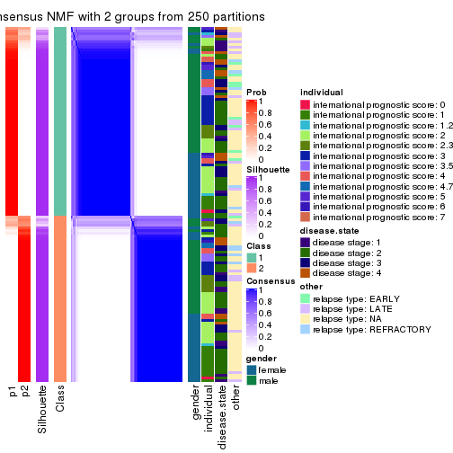</p>

</div>
<div id='tab-MAD-NMF-consensus-heatmap-2'>
<pre><code class="r">consensus_heatmap(res, k = 3)
</code></pre>

<p>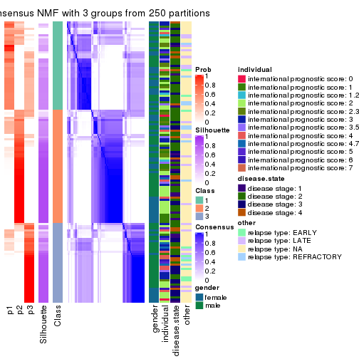</p>

</div>
<div id='tab-MAD-NMF-consensus-heatmap-3'>
<pre><code class="r">consensus_heatmap(res, k = 4)
</code></pre>

<p>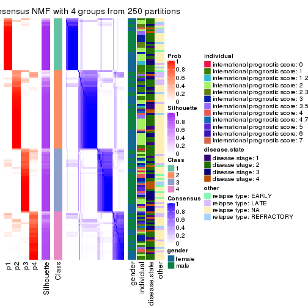</p>

</div>
<div id='tab-MAD-NMF-consensus-heatmap-4'>
<pre><code class="r">consensus_heatmap(res, k = 5)
</code></pre>

<p>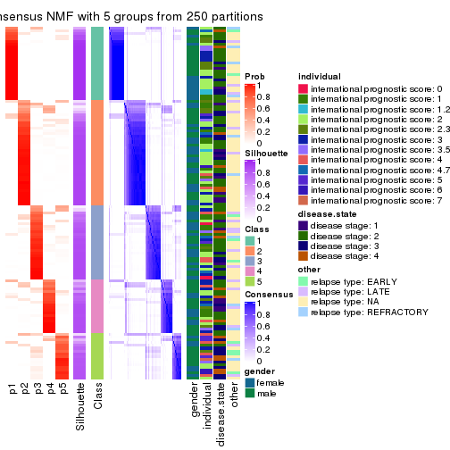</p>

</div>
<div id='tab-MAD-NMF-consensus-heatmap-5'>
<pre><code class="r">consensus_heatmap(res, k = 6)
</code></pre>

<p>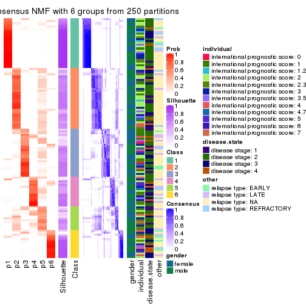</p>

</div>
</div>

Heatmaps for the membership of samples in all partitions to see how consistent they are:


<script>
$( function() {
	$( '#tabs-MAD-NMF-membership-heatmap' ).tabs();
} );
</script>
<div id='tabs-MAD-NMF-membership-heatmap'>
<ul>
<li><a href='#tab-MAD-NMF-membership-heatmap-1'>k = 2</a></li>
<li><a href='#tab-MAD-NMF-membership-heatmap-2'>k = 3</a></li>
<li><a href='#tab-MAD-NMF-membership-heatmap-3'>k = 4</a></li>
<li><a href='#tab-MAD-NMF-membership-heatmap-4'>k = 5</a></li>
<li><a href='#tab-MAD-NMF-membership-heatmap-5'>k = 6</a></li>
</ul>
<div id='tab-MAD-NMF-membership-heatmap-1'>
<pre><code class="r">membership_heatmap(res, k = 2)
</code></pre>

<p>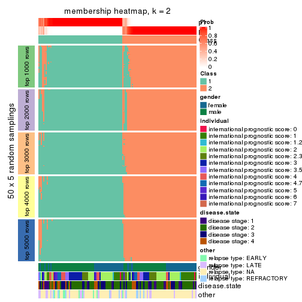</p>

</div>
<div id='tab-MAD-NMF-membership-heatmap-2'>
<pre><code class="r">membership_heatmap(res, k = 3)
</code></pre>

<p>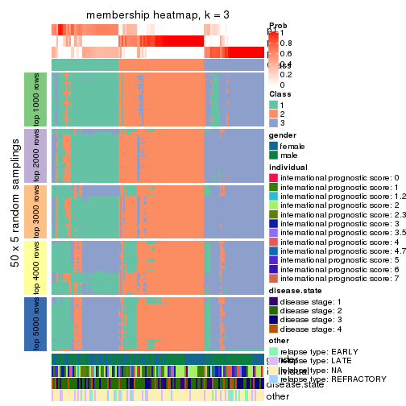</p>

</div>
<div id='tab-MAD-NMF-membership-heatmap-3'>
<pre><code class="r">membership_heatmap(res, k = 4)
</code></pre>

<p>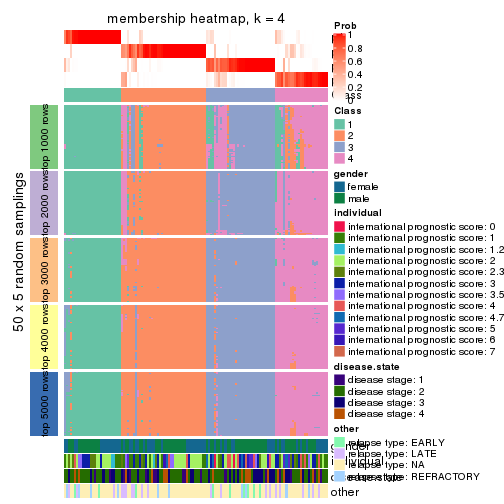</p>

</div>
<div id='tab-MAD-NMF-membership-heatmap-4'>
<pre><code class="r">membership_heatmap(res, k = 5)
</code></pre>

<p>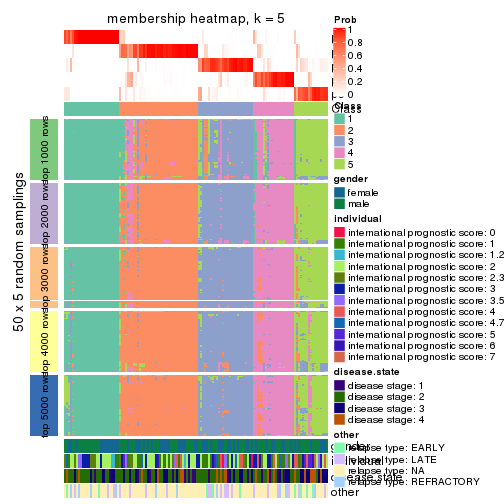</p>

</div>
<div id='tab-MAD-NMF-membership-heatmap-5'>
<pre><code class="r">membership_heatmap(res, k = 6)
</code></pre>

<p>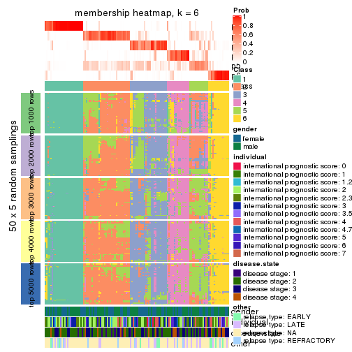</p>

</div>
</div>

As soon as we have had the classes for columns, we can look for signatures
which are significantly different between classes which can be candidate marks
for certain classes. Following are the heatmaps for signatures.


Signature heatmaps where rows are scaled:


<script>
$( function() {
	$( '#tabs-MAD-NMF-get-signatures' ).tabs();
} );
</script>
<div id='tabs-MAD-NMF-get-signatures'>
<ul>
<li><a href='#tab-MAD-NMF-get-signatures-1'>k = 2</a></li>
<li><a href='#tab-MAD-NMF-get-signatures-2'>k = 3</a></li>
<li><a href='#tab-MAD-NMF-get-signatures-3'>k = 4</a></li>
<li><a href='#tab-MAD-NMF-get-signatures-4'>k = 5</a></li>
<li><a href='#tab-MAD-NMF-get-signatures-5'>k = 6</a></li>
</ul>
<div id='tab-MAD-NMF-get-signatures-1'>
<pre><code class="r">get_signatures(res, k = 2)
</code></pre>

<p>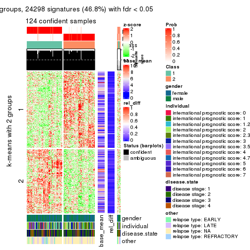</p>

</div>
<div id='tab-MAD-NMF-get-signatures-2'>
<pre><code class="r">get_signatures(res, k = 3)
</code></pre>

<p>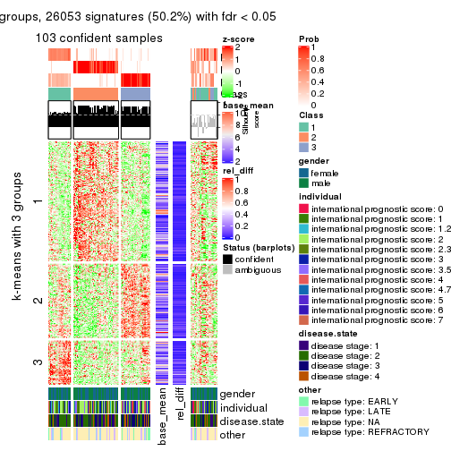</p>

</div>
<div id='tab-MAD-NMF-get-signatures-3'>
<pre><code class="r">get_signatures(res, k = 4)
</code></pre>

<p>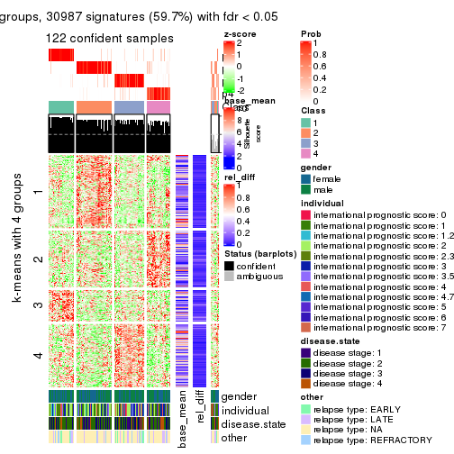</p>

</div>
<div id='tab-MAD-NMF-get-signatures-4'>
<pre><code class="r">get_signatures(res, k = 5)
</code></pre>

<pre><code>#&gt; Error: The width or height of the raster image is zero, maybe you forget to turn off the
#&gt; previous graphic device or it was corrupted. Run `dev.off()` to close it.
</code></pre>

<p></p>

</div>
<div id='tab-MAD-NMF-get-signatures-5'>
<pre><code class="r">get_signatures(res, k = 6)
</code></pre>

<pre><code>#&gt; Error: The width or height of the raster image is zero, maybe you forget to turn off the
#&gt; previous graphic device or it was corrupted. Run `dev.off()` to close it.
</code></pre>

<p></p>

</div>
</div>


Signature heatmaps where rows are not scaled:


<script>
$( function() {
	$( '#tabs-MAD-NMF-get-signatures-no-scale' ).tabs();
} );
</script>
<div id='tabs-MAD-NMF-get-signatures-no-scale'>
<ul>
<li><a href='#tab-MAD-NMF-get-signatures-no-scale-1'>k = 2</a></li>
<li><a href='#tab-MAD-NMF-get-signatures-no-scale-2'>k = 3</a></li>
<li><a href='#tab-MAD-NMF-get-signatures-no-scale-3'>k = 4</a></li>
<li><a href='#tab-MAD-NMF-get-signatures-no-scale-4'>k = 5</a></li>
<li><a href='#tab-MAD-NMF-get-signatures-no-scale-5'>k = 6</a></li>
</ul>
<div id='tab-MAD-NMF-get-signatures-no-scale-1'>
<pre><code class="r">get_signatures(res, k = 2, scale_rows = FALSE)
</code></pre>

<p>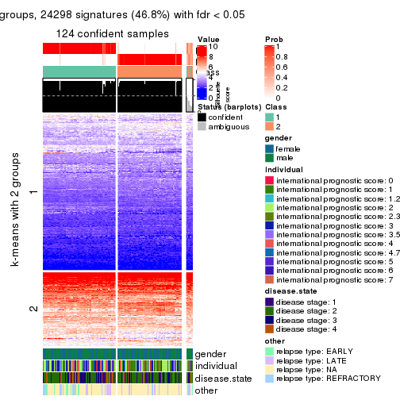</p>

</div>
<div id='tab-MAD-NMF-get-signatures-no-scale-2'>
<pre><code class="r">get_signatures(res, k = 3, scale_rows = FALSE)
</code></pre>

<p>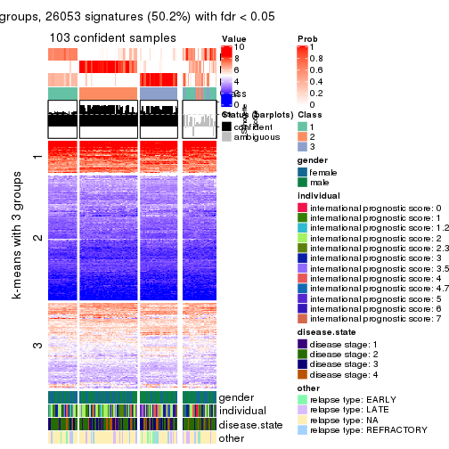</p>

</div>
<div id='tab-MAD-NMF-get-signatures-no-scale-3'>
<pre><code class="r">get_signatures(res, k = 4, scale_rows = FALSE)
</code></pre>

<p>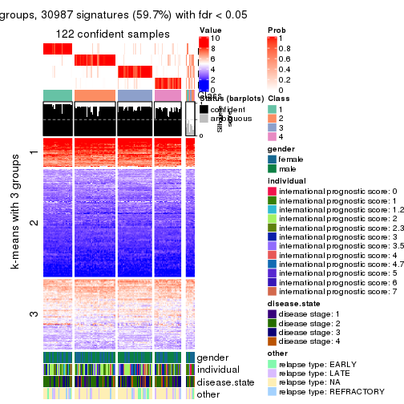</p>

</div>
<div id='tab-MAD-NMF-get-signatures-no-scale-4'>
<pre><code class="r">get_signatures(res, k = 5, scale_rows = FALSE)
</code></pre>

<p>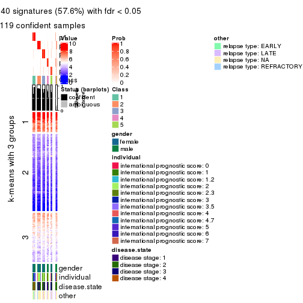</p>

</div>
<div id='tab-MAD-NMF-get-signatures-no-scale-5'>
<pre><code class="r">get_signatures(res, k = 6, scale_rows = FALSE)
</code></pre>

<pre><code>#&gt; Error in mat[ceiling(1:nr/h_ratio), ceiling(1:nc/w_ratio), drop = FALSE]: subscript out of bounds
</code></pre>

<p>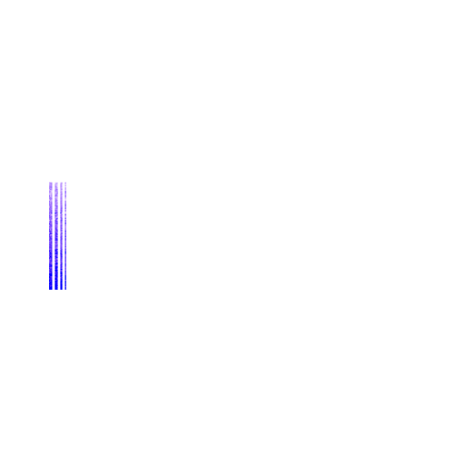</p>

</div>
</div>


Compare the overlap of signatures from different k:

```r
compare_signatures(res)
```

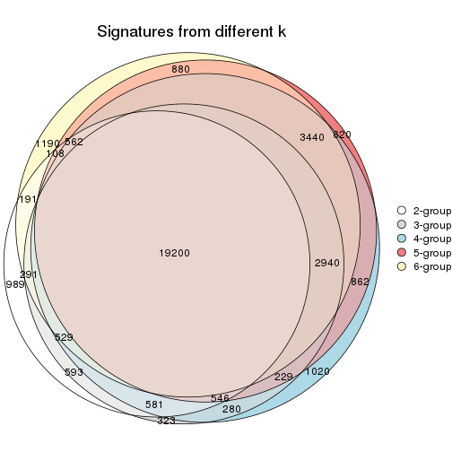

`get_signature()` returns a data frame invisibly. TO get the list of signatures, the function
call should be assigned to a variable explicitly. In following code, if `plot` argument is set
to `FALSE`, no heatmap is plotted while only the differential analysis is performed.

```r
# code only for demonstration
tb = get_signature(res, k = ..., plot = FALSE)
```

An example of the output of `tb` is:

```
#>   which_row         fdr    mean_1    mean_2 scaled_mean_1 scaled_mean_2 km
#> 1        38 0.042760348  8.373488  9.131774    -0.5533452     0.5164555  1
#> 2        40 0.018707592  7.106213  8.469186    -0.6173731     0.5762149  1
#> 3        55 0.019134737 10.221463 11.207825    -0.6159697     0.5749050  1
#> 4        59 0.006059896  5.921854  7.869574    -0.6899429     0.6439467  1
#> 5        60 0.018055526  8.928898 10.211722    -0.6204761     0.5791110  1
#> 6        98 0.009384629 15.714769 14.887706     0.6635654    -0.6193277  2
...
```

The columns in `tb` are:

1. `which_row`: row indices corresponding to the input matrix.
2. `fdr`: FDR for the differential test. 
3. `mean_x`: The mean value in group x.
4. `scaled_mean_x`: The mean value in group x after rows are scaled.
5. `km`: Row groups if k-means clustering is applied to rows.


UMAP plot which shows how samples are separated.


<script>
$( function() {
	$( '#tabs-MAD-NMF-dimension-reduction' ).tabs();
} );
</script>
<div id='tabs-MAD-NMF-dimension-reduction'>
<ul>
<li><a href='#tab-MAD-NMF-dimension-reduction-1'>k = 2</a></li>
<li><a href='#tab-MAD-NMF-dimension-reduction-2'>k = 3</a></li>
<li><a href='#tab-MAD-NMF-dimension-reduction-3'>k = 4</a></li>
<li><a href='#tab-MAD-NMF-dimension-reduction-4'>k = 5</a></li>
<li><a href='#tab-MAD-NMF-dimension-reduction-5'>k = 6</a></li>
</ul>
<div id='tab-MAD-NMF-dimension-reduction-1'>
<pre><code class="r">dimension_reduction(res, k = 2, method = &quot;UMAP&quot;)
</code></pre>

<p>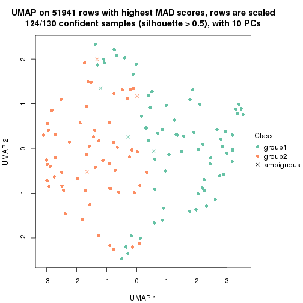</p>

</div>
<div id='tab-MAD-NMF-dimension-reduction-2'>
<pre><code class="r">dimension_reduction(res, k = 3, method = &quot;UMAP&quot;)
</code></pre>

<p>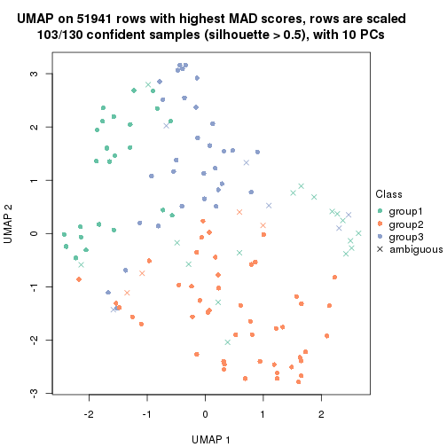</p>

</div>
<div id='tab-MAD-NMF-dimension-reduction-3'>
<pre><code class="r">dimension_reduction(res, k = 4, method = &quot;UMAP&quot;)
</code></pre>

<p>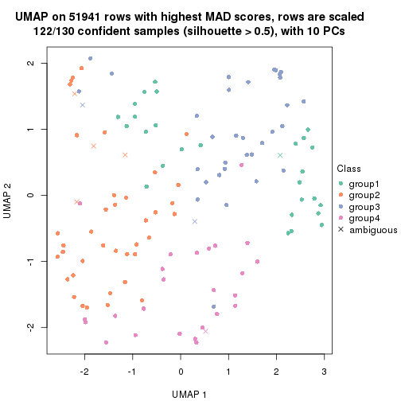</p>

</div>
<div id='tab-MAD-NMF-dimension-reduction-4'>
<pre><code class="r">dimension_reduction(res, k = 5, method = &quot;UMAP&quot;)
</code></pre>

<p>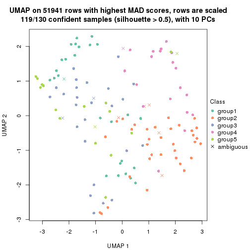</p>

</div>
<div id='tab-MAD-NMF-dimension-reduction-5'>
<pre><code class="r">dimension_reduction(res, k = 6, method = &quot;UMAP&quot;)
</code></pre>

<p>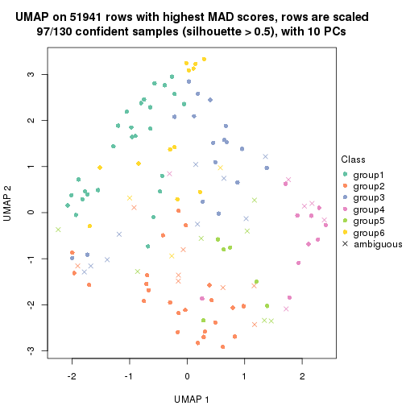</p>

</div>
</div>


Following heatmap shows how subgroups are split when increasing `k`:

```r
collect_classes(res)
```

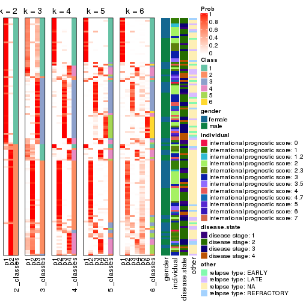


Test correlation between subgroups and known annotations. If the known
annotation is numeric, one-way ANOVA test is applied, and if the known
annotation is discrete, chi-squared contingency table test is applied.

```r
test_to_known_factors(res)
```

```
#>           n gender(p) individual(p) disease.state(p) other(p) k
#> MAD:NMF 124     0.404        0.8607           0.5666   0.0233 2
#> MAD:NMF 103     0.127        0.1158           0.0359   0.0941 3
#> MAD:NMF 122     0.267        0.2523           0.2630   0.0693 4
#> MAD:NMF 119     0.734        0.0913           0.0415   0.0791 5
#> MAD:NMF  97     0.717        0.3481           0.1105   0.2687 6
```


If matrix rows can be associated to genes, consider to use `GO_Enrichment(res,
...)` to perform function enrichment for the signature genes.


 

---------------------------------------------------


### ATC:hclust


The object with results only for a single top-value method and a single partition method 
can be extracted as:

```r
res = res_list["ATC", "hclust"]
# you can also extract it by
# res = res_list["ATC:hclust"]
```

A summary of `res` and all the functions that can be applied to it:

```r
res
```

```
#> A 'ConsensusPartition' object with k = 2, 3, 4, 5, 6.
#>   On a matrix with 51941 rows and 130 columns.
#>   Top rows (1000, 2000, 3000, 4000, 5000) are extracted by 'ATC' method.
#>   Subgroups are detected by 'hclust' method.
#>   Performed in total 1250 partitions by row resampling.
#>   Best k for subgroups seems to be 2.
#> 
#> Following methods can be applied to this 'ConsensusPartition' object:
#>  [1] "cola_report"             "collect_classes"         "collect_plots"          
#>  [4] "collect_stats"           "colnames"                "compare_signatures"     
#>  [7] "consensus_heatmap"       "dimension_reduction"     "functional_enrichment"  
#> [10] "get_anno_col"            "get_anno"                "get_classes"            
#> [13] "get_consensus"           "get_matrix"              "get_membership"         
#> [16] "get_param"               "get_signatures"          "get_stats"              
#> [19] "is_best_k"               "is_stable_k"             "membership_heatmap"     
#> [22] "ncol"                    "nrow"                    "plot_ecdf"              
#> [25] "rownames"                "select_partition_number" "show"                   
#> [28] "suggest_best_k"          "test_to_known_factors"
```

`collect_plots()` function collects all the plots made from `res` for all `k` (number of partitions)
into one single page to provide an easy and fast comparison between different `k`.

```r
collect_plots(res)
```

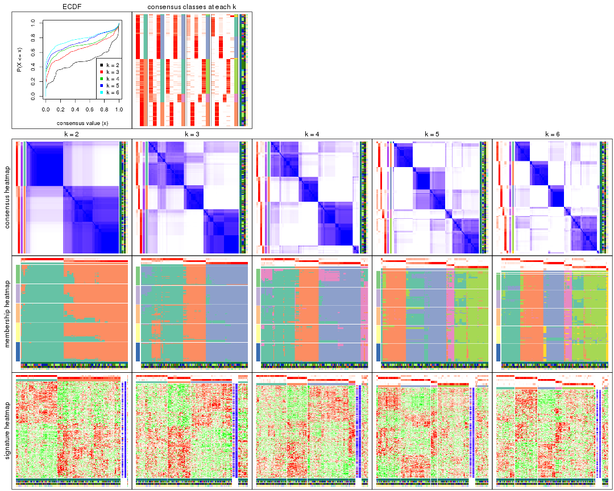

The plots are:

- The first row: a plot of the ECDF (Empirical cumulative distribution
  function) curves of the consensus matrix for each `k` and the heatmap of
  predicted classes for each `k`.
- The second row: heatmaps of the consensus matrix for each `k`.
- The third row: heatmaps of the membership matrix for each `k`.
- The fouth row: heatmaps of the signatures for each `k`.

All the plots in panels can be made by individual functions and they are
plotted later in this section.

`select_partition_number()` produces several plots showing different
statistics for choosing "optimized" `k`. There are following statistics:

- ECDF curves of the consensus matrix for each `k`;
- 1-PAC. [The PAC
  score](https://en.wikipedia.org/wiki/Consensus_clustering#Over-interpretation_potential_of_consensus_clustering)
  measures the proportion of the ambiguous subgrouping.
- Mean silhouette score.
- Concordance. The mean probability of fiting the consensus class ids in all
  partitions.
- Area increased. Denote $A_k$ as the area under the ECDF curve for current
  `k`, the area increased is defined as $A_k - A_{k-1}$.
- Rand index. The percent of pairs of samples that are both in a same cluster
  or both are not in a same cluster in the partition of k and k-1.
- Jaccard index. The ratio of pairs of samples are both in a same cluster in
  the partition of k and k-1 and the pairs of samples are both in a same
  cluster in the partition k or k-1.

The detailed explanations of these statistics can be found in [the cola
vignette](http://bioconductor.org/packages/devel/bioc/vignettes/cola/inst/doc/cola.html#toc_13).

Generally speaking, lower PAC score, higher mean silhouette score or higher
concordance corresponds to better partition. Rand index and Jaccard index
measure how similar the current partition is compared to partition with `k-1`.
If they are too similar, we won't accept `k` is better than `k-1`.

```r
select_partition_number(res)
```

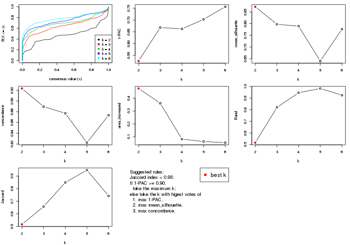

The numeric values for all these statistics can be obtained by `get_stats()`.

```r
get_stats(res)
```

```
#>   k 1-PAC mean_silhouette concordance area_increased  Rand Jaccard
#> 2 2 0.526           0.872       0.923         0.4752 0.516   0.516
#> 3 3 0.668           0.797       0.890         0.3598 0.821   0.657
#> 4 4 0.663           0.789       0.877         0.0824 0.947   0.849
#> 5 5 0.703           0.640       0.822         0.0639 0.984   0.947
#> 6 6 0.756           0.776       0.874         0.0547 0.925   0.742
```

`suggest_best_k()` suggests the best $k$ based on these statistics. The rules are as follows:

- All $k$ with Jaccard index larger than 0.95 are removed because the increase of
  the partition number does not provides enough extra information. If all $k$ are removed,
  the best $k$ is assigned by `NA`.
- For $k$ with 1-PAC larger than 0.9, the maximal $k$ is taken as the "best k". Other $k$ is called "optional k".
- If it does not fit the second rule. The $k$ with the highest vote of highest
  1-PAC, mean silhouette and concordance is taken as the "best k".

```r
suggest_best_k(res)
```

```
#> [1] 2
```


Following shows the table of the partitions (You need to click the **show/hide
code output** link to see it). The membership matrix (columns with name `p*`)
is inferred by
[`clue::cl_consensus()`](https://www.rdocumentation.org/link/cl_consensus?package=clue)
function with the `SE` method. Basically the value in the membership matrix
represents the probability to belong to a certain group. The finall class
label for an item is determined with the group with highest probability it
belongs to.

In `get_classes()` function, the entropy is calculated from the membership
matrix and the silhouette score is calculated from the consensus matrix.


<script>
$( function() {
	$( '#tabs-ATC-hclust-get-classes' ).tabs();
} );
</script>
<div id='tabs-ATC-hclust-get-classes'>
<ul>
<li><a href='#tab-ATC-hclust-get-classes-1'>k = 2</a></li>
<li><a href='#tab-ATC-hclust-get-classes-2'>k = 3</a></li>
<li><a href='#tab-ATC-hclust-get-classes-3'>k = 4</a></li>
<li><a href='#tab-ATC-hclust-get-classes-4'>k = 5</a></li>
<li><a href='#tab-ATC-hclust-get-classes-5'>k = 6</a></li>
</ul>

<div id='tab-ATC-hclust-get-classes-1'>
<p><a id='tab-ATC-hclust-get-classes-1-a' style='color:#0366d6' href='#'>show/hide code output</a></p>
<pre><code class="r">cbind(get_classes(res, k = 2), get_membership(res, k = 2))
</code></pre>

<pre><code>#&gt;           class entropy silhouette    p1    p2
#&gt; GSM447671     2  0.5737    0.87534 0.136 0.864
#&gt; GSM447694     1  0.0000    0.96455 1.000 0.000
#&gt; GSM447618     2  0.5737    0.87534 0.136 0.864
#&gt; GSM447691     2  0.5737    0.87534 0.136 0.864
#&gt; GSM447733     2  0.6247    0.84936 0.156 0.844
#&gt; GSM447620     2  0.5294    0.88222 0.120 0.880
#&gt; GSM447627     1  0.0000    0.96455 1.000 0.000
#&gt; GSM447630     1  0.7745    0.66349 0.772 0.228
#&gt; GSM447642     2  0.9460    0.59698 0.364 0.636
#&gt; GSM447649     2  0.0000    0.88577 0.000 1.000
#&gt; GSM447654     2  0.1633    0.89022 0.024 0.976
#&gt; GSM447655     2  0.0000    0.88577 0.000 1.000
#&gt; GSM447669     2  0.5737    0.87534 0.136 0.864
#&gt; GSM447676     2  0.9491    0.58951 0.368 0.632
#&gt; GSM447678     2  0.6048    0.86880 0.148 0.852
#&gt; GSM447681     2  0.0000    0.88577 0.000 1.000
#&gt; GSM447698     2  0.4815    0.88693 0.104 0.896
#&gt; GSM447713     1  0.0000    0.96455 1.000 0.000
#&gt; GSM447722     2  0.9393    0.61573 0.356 0.644
#&gt; GSM447726     2  0.5842    0.87327 0.140 0.860
#&gt; GSM447735     1  0.0000    0.96455 1.000 0.000
#&gt; GSM447737     1  0.0000    0.96455 1.000 0.000
#&gt; GSM447657     2  0.4815    0.88693 0.104 0.896
#&gt; GSM447674     2  0.0000    0.88577 0.000 1.000
#&gt; GSM447636     2  0.5629    0.87727 0.132 0.868
#&gt; GSM447723     2  0.9732    0.51582 0.404 0.596
#&gt; GSM447699     1  0.0000    0.96455 1.000 0.000
#&gt; GSM447708     2  0.0938    0.88876 0.012 0.988
#&gt; GSM447721     1  0.0000    0.96455 1.000 0.000
#&gt; GSM447623     1  0.0000    0.96455 1.000 0.000
#&gt; GSM447621     1  0.0000    0.96455 1.000 0.000
#&gt; GSM447650     2  0.0000    0.88577 0.000 1.000
#&gt; GSM447651     2  0.0000    0.88577 0.000 1.000
#&gt; GSM447653     1  0.1184    0.95271 0.984 0.016
#&gt; GSM447658     2  0.9000    0.67919 0.316 0.684
#&gt; GSM447675     2  0.5059    0.87921 0.112 0.888
#&gt; GSM447680     2  0.0000    0.88577 0.000 1.000
#&gt; GSM447686     2  0.5059    0.88466 0.112 0.888
#&gt; GSM447736     1  0.0376    0.96211 0.996 0.004
#&gt; GSM447629     2  0.4815    0.88693 0.104 0.896
#&gt; GSM447648     1  0.0000    0.96455 1.000 0.000
#&gt; GSM447660     2  0.9460    0.59698 0.364 0.636
#&gt; GSM447661     2  0.0000    0.88577 0.000 1.000
#&gt; GSM447663     1  0.1184    0.95302 0.984 0.016
#&gt; GSM447704     2  0.0000    0.88577 0.000 1.000
#&gt; GSM447720     2  0.9209    0.64875 0.336 0.664
#&gt; GSM447652     2  0.2236    0.89123 0.036 0.964
#&gt; GSM447679     2  0.0000    0.88577 0.000 1.000
#&gt; GSM447712     1  0.2778    0.92207 0.952 0.048
#&gt; GSM447664     2  0.5294    0.88353 0.120 0.880
#&gt; GSM447637     1  0.0000    0.96455 1.000 0.000
#&gt; GSM447639     1  0.5842    0.80790 0.860 0.140
#&gt; GSM447615     1  0.9866   -0.00514 0.568 0.432
#&gt; GSM447656     2  0.4815    0.88693 0.104 0.896
#&gt; GSM447673     2  0.0000    0.88577 0.000 1.000
#&gt; GSM447719     1  0.1184    0.95271 0.984 0.016
#&gt; GSM447706     1  0.0000    0.96455 1.000 0.000
#&gt; GSM447612     1  0.0672    0.95946 0.992 0.008
#&gt; GSM447665     2  0.5629    0.87727 0.132 0.868
#&gt; GSM447677     2  0.0000    0.88577 0.000 1.000
#&gt; GSM447613     1  0.0000    0.96455 1.000 0.000
#&gt; GSM447659     1  0.0672    0.95922 0.992 0.008
#&gt; GSM447662     1  0.0000    0.96455 1.000 0.000
#&gt; GSM447666     2  0.5842    0.87336 0.140 0.860
#&gt; GSM447668     2  0.0000    0.88577 0.000 1.000
#&gt; GSM447682     2  0.4690    0.88792 0.100 0.900
#&gt; GSM447683     2  0.0000    0.88577 0.000 1.000
#&gt; GSM447688     2  0.0938    0.88857 0.012 0.988
#&gt; GSM447702     2  0.0000    0.88577 0.000 1.000
#&gt; GSM447709     2  0.0938    0.88876 0.012 0.988
#&gt; GSM447711     1  0.0672    0.95934 0.992 0.008
#&gt; GSM447715     2  0.5842    0.87327 0.140 0.860
#&gt; GSM447693     1  0.0000    0.96455 1.000 0.000
#&gt; GSM447611     2  0.5059    0.87921 0.112 0.888
#&gt; GSM447672     2  0.0000    0.88577 0.000 1.000
#&gt; GSM447703     2  0.0000    0.88577 0.000 1.000
#&gt; GSM447727     2  0.9732    0.51582 0.404 0.596
#&gt; GSM447638     2  0.5294    0.88222 0.120 0.880
#&gt; GSM447670     1  0.0000    0.96455 1.000 0.000
#&gt; GSM447700     2  0.9248    0.64217 0.340 0.660
#&gt; GSM447738     2  0.0000    0.88577 0.000 1.000
#&gt; GSM447739     1  0.0000    0.96455 1.000 0.000
#&gt; GSM447617     1  0.0000    0.96455 1.000 0.000
#&gt; GSM447628     2  0.1633    0.89022 0.024 0.976
#&gt; GSM447632     2  0.0000    0.88577 0.000 1.000
#&gt; GSM447619     1  0.0000    0.96455 1.000 0.000
#&gt; GSM447643     2  0.5294    0.88222 0.120 0.880
#&gt; GSM447724     2  0.9393    0.61573 0.356 0.644
#&gt; GSM447728     2  0.0938    0.88876 0.012 0.988
#&gt; GSM447610     1  0.0000    0.96455 1.000 0.000
#&gt; GSM447633     2  0.5629    0.87727 0.132 0.868
#&gt; GSM447634     1  0.4431    0.87244 0.908 0.092
#&gt; GSM447622     1  0.0000    0.96455 1.000 0.000
#&gt; GSM447667     2  0.3733    0.89070 0.072 0.928
#&gt; GSM447687     2  0.0000    0.88577 0.000 1.000
#&gt; GSM447695     1  0.0000    0.96455 1.000 0.000
#&gt; GSM447696     1  0.0000    0.96455 1.000 0.000
#&gt; GSM447697     1  0.0000    0.96455 1.000 0.000
#&gt; GSM447714     1  0.0000    0.96455 1.000 0.000
#&gt; GSM447717     2  0.5629    0.87727 0.132 0.868
#&gt; GSM447725     1  0.2948    0.91810 0.948 0.052
#&gt; GSM447729     2  0.3733    0.88980 0.072 0.928
#&gt; GSM447644     2  0.5629    0.87727 0.132 0.868
#&gt; GSM447710     1  0.0000    0.96455 1.000 0.000
#&gt; GSM447614     1  0.0000    0.96455 1.000 0.000
#&gt; GSM447685     2  0.0000    0.88577 0.000 1.000
#&gt; GSM447690     1  0.0000    0.96455 1.000 0.000
#&gt; GSM447730     2  0.0000    0.88577 0.000 1.000
#&gt; GSM447646     2  0.1633    0.89022 0.024 0.976
#&gt; GSM447689     2  0.9635    0.55227 0.388 0.612
#&gt; GSM447635     2  0.5946    0.87036 0.144 0.856
#&gt; GSM447641     1  0.7376    0.69590 0.792 0.208
#&gt; GSM447716     2  0.4815    0.88693 0.104 0.896
#&gt; GSM447718     1  0.7745    0.66349 0.772 0.228
#&gt; GSM447616     1  0.0000    0.96455 1.000 0.000
#&gt; GSM447626     1  0.0000    0.96455 1.000 0.000
#&gt; GSM447640     2  0.0000    0.88577 0.000 1.000
#&gt; GSM447734     1  0.0000    0.96455 1.000 0.000
#&gt; GSM447692     1  0.0000    0.96455 1.000 0.000
#&gt; GSM447647     2  0.1414    0.88979 0.020 0.980
#&gt; GSM447624     1  0.0000    0.96455 1.000 0.000
#&gt; GSM447625     1  0.0000    0.96455 1.000 0.000
#&gt; GSM447707     2  0.0000    0.88577 0.000 1.000
#&gt; GSM447732     1  0.0000    0.96455 1.000 0.000
#&gt; GSM447684     2  0.7674    0.79744 0.224 0.776
#&gt; GSM447731     2  0.3584    0.88750 0.068 0.932
#&gt; GSM447705     2  0.9209    0.64875 0.336 0.664
#&gt; GSM447631     1  0.0000    0.96455 1.000 0.000
#&gt; GSM447701     2  0.0376    0.88682 0.004 0.996
#&gt; GSM447645     1  0.0000    0.96455 1.000 0.000
</code></pre>

<script>
$('#tab-ATC-hclust-get-classes-1-a').parent().next().next().hide();
$('#tab-ATC-hclust-get-classes-1-a').click(function(){
  $('#tab-ATC-hclust-get-classes-1-a').parent().next().next().toggle();
  return(false);
});
</script>
</div>

<div id='tab-ATC-hclust-get-classes-2'>
<p><a id='tab-ATC-hclust-get-classes-2-a' style='color:#0366d6' href='#'>show/hide code output</a></p>
<pre><code class="r">cbind(get_classes(res, k = 3), get_membership(res, k = 3))
</code></pre>

<pre><code>#&gt;           class entropy silhouette    p1    p2    p3
#&gt; GSM447671     1  0.1832     0.7885 0.956 0.036 0.008
#&gt; GSM447694     3  0.0000     0.9351 0.000 0.000 1.000
#&gt; GSM447618     1  0.1832     0.7885 0.956 0.036 0.008
#&gt; GSM447691     1  0.1832     0.7885 0.956 0.036 0.008
#&gt; GSM447733     1  0.7562     0.4859 0.628 0.308 0.064
#&gt; GSM447620     1  0.2096     0.7848 0.944 0.052 0.004
#&gt; GSM447627     3  0.1765     0.9203 0.040 0.004 0.956
#&gt; GSM447630     3  0.5529     0.6245 0.296 0.000 0.704
#&gt; GSM447642     1  0.5595     0.6604 0.756 0.016 0.228
#&gt; GSM447649     2  0.1031     0.9319 0.024 0.976 0.000
#&gt; GSM447654     1  0.6192     0.3053 0.580 0.420 0.000
#&gt; GSM447655     2  0.0237     0.9340 0.004 0.996 0.000
#&gt; GSM447669     1  0.1832     0.7885 0.956 0.036 0.008
#&gt; GSM447676     1  0.5639     0.6551 0.752 0.016 0.232
#&gt; GSM447678     1  0.1267     0.7814 0.972 0.024 0.004
#&gt; GSM447681     2  0.1753     0.9133 0.048 0.952 0.000
#&gt; GSM447698     1  0.3193     0.7689 0.896 0.100 0.004
#&gt; GSM447713     3  0.0000     0.9351 0.000 0.000 1.000
#&gt; GSM447722     1  0.4963     0.6849 0.792 0.008 0.200
#&gt; GSM447726     1  0.1999     0.7888 0.952 0.036 0.012
#&gt; GSM447735     3  0.1765     0.9203 0.040 0.004 0.956
#&gt; GSM447737     3  0.0000     0.9351 0.000 0.000 1.000
#&gt; GSM447657     1  0.3193     0.7689 0.896 0.100 0.004
#&gt; GSM447674     2  0.1529     0.9199 0.040 0.960 0.000
#&gt; GSM447636     1  0.1647     0.7876 0.960 0.036 0.004
#&gt; GSM447723     1  0.5956     0.6104 0.720 0.016 0.264
#&gt; GSM447699     3  0.1643     0.9325 0.044 0.000 0.956
#&gt; GSM447708     2  0.5529     0.5644 0.296 0.704 0.000
#&gt; GSM447721     3  0.2261     0.9280 0.068 0.000 0.932
#&gt; GSM447623     3  0.0000     0.9351 0.000 0.000 1.000
#&gt; GSM447621     3  0.0000     0.9351 0.000 0.000 1.000
#&gt; GSM447650     2  0.0592     0.9364 0.012 0.988 0.000
#&gt; GSM447651     2  0.0592     0.9364 0.012 0.988 0.000
#&gt; GSM447653     3  0.3272     0.8822 0.104 0.004 0.892
#&gt; GSM447658     1  0.4473     0.7206 0.828 0.008 0.164
#&gt; GSM447675     1  0.6445     0.4953 0.672 0.308 0.020
#&gt; GSM447680     2  0.0747     0.9360 0.016 0.984 0.000
#&gt; GSM447686     1  0.2400     0.7809 0.932 0.064 0.004
#&gt; GSM447736     3  0.2356     0.9268 0.072 0.000 0.928
#&gt; GSM447629     1  0.3193     0.7689 0.896 0.100 0.004
#&gt; GSM447648     3  0.0000     0.9351 0.000 0.000 1.000
#&gt; GSM447660     1  0.5595     0.6604 0.756 0.016 0.228
#&gt; GSM447661     2  0.0237     0.9340 0.004 0.996 0.000
#&gt; GSM447663     3  0.2625     0.9192 0.084 0.000 0.916
#&gt; GSM447704     2  0.1031     0.9319 0.024 0.976 0.000
#&gt; GSM447720     1  0.5219     0.6998 0.788 0.016 0.196
#&gt; GSM447652     1  0.6345     0.3803 0.596 0.400 0.004
#&gt; GSM447679     2  0.0592     0.9364 0.012 0.988 0.000
#&gt; GSM447712     3  0.3267     0.8906 0.116 0.000 0.884
#&gt; GSM447664     1  0.1860     0.7783 0.948 0.052 0.000
#&gt; GSM447637     3  0.0000     0.9351 0.000 0.000 1.000
#&gt; GSM447639     3  0.4654     0.7741 0.208 0.000 0.792
#&gt; GSM447615     1  0.6905     0.1883 0.544 0.016 0.440
#&gt; GSM447656     1  0.3193     0.7689 0.896 0.100 0.004
#&gt; GSM447673     2  0.2625     0.8829 0.084 0.916 0.000
#&gt; GSM447719     3  0.3272     0.8822 0.104 0.004 0.892
#&gt; GSM447706     3  0.2261     0.9280 0.068 0.000 0.932
#&gt; GSM447612     3  0.2448     0.9246 0.076 0.000 0.924
#&gt; GSM447665     1  0.1765     0.7876 0.956 0.040 0.004
#&gt; GSM447677     2  0.0747     0.9360 0.016 0.984 0.000
#&gt; GSM447613     3  0.2448     0.9249 0.076 0.000 0.924
#&gt; GSM447659     3  0.2200     0.9105 0.056 0.004 0.940
#&gt; GSM447662     3  0.2261     0.9280 0.068 0.000 0.932
#&gt; GSM447666     1  0.1711     0.7884 0.960 0.032 0.008
#&gt; GSM447668     2  0.0237     0.9340 0.004 0.996 0.000
#&gt; GSM447682     1  0.4834     0.6915 0.792 0.204 0.004
#&gt; GSM447683     2  0.0747     0.9360 0.016 0.984 0.000
#&gt; GSM447688     1  0.6309     0.0987 0.504 0.496 0.000
#&gt; GSM447702     2  0.0237     0.9340 0.004 0.996 0.000
#&gt; GSM447709     2  0.5529     0.5644 0.296 0.704 0.000
#&gt; GSM447711     3  0.2448     0.9244 0.076 0.000 0.924
#&gt; GSM447715     1  0.1999     0.7888 0.952 0.036 0.012
#&gt; GSM447693     3  0.0000     0.9351 0.000 0.000 1.000
#&gt; GSM447611     1  0.6445     0.4953 0.672 0.308 0.020
#&gt; GSM447672     2  0.0237     0.9340 0.004 0.996 0.000
#&gt; GSM447703     2  0.0592     0.9357 0.012 0.988 0.000
#&gt; GSM447727     1  0.5956     0.6104 0.720 0.016 0.264
#&gt; GSM447638     1  0.1989     0.7852 0.948 0.048 0.004
#&gt; GSM447670     3  0.2448     0.9249 0.076 0.000 0.924
#&gt; GSM447700     1  0.4755     0.7013 0.808 0.008 0.184
#&gt; GSM447738     2  0.0592     0.9362 0.012 0.988 0.000
#&gt; GSM447739     3  0.0000     0.9351 0.000 0.000 1.000
#&gt; GSM447617     3  0.0000     0.9351 0.000 0.000 1.000
#&gt; GSM447628     1  0.6192     0.3053 0.580 0.420 0.000
#&gt; GSM447632     2  0.0592     0.9362 0.012 0.988 0.000
#&gt; GSM447619     3  0.2261     0.9280 0.068 0.000 0.932
#&gt; GSM447643     1  0.2096     0.7848 0.944 0.052 0.004
#&gt; GSM447724     1  0.4963     0.6849 0.792 0.008 0.200
#&gt; GSM447728     2  0.5529     0.5644 0.296 0.704 0.000
#&gt; GSM447610     3  0.1765     0.9203 0.040 0.004 0.956
#&gt; GSM447633     1  0.1647     0.7876 0.960 0.036 0.004
#&gt; GSM447634     3  0.4002     0.8425 0.160 0.000 0.840
#&gt; GSM447622     3  0.0000     0.9351 0.000 0.000 1.000
#&gt; GSM447667     1  0.5845     0.5661 0.688 0.308 0.004
#&gt; GSM447687     2  0.0592     0.9357 0.012 0.988 0.000
#&gt; GSM447695     3  0.0000     0.9351 0.000 0.000 1.000
#&gt; GSM447696     3  0.0000     0.9351 0.000 0.000 1.000
#&gt; GSM447697     3  0.0000     0.9351 0.000 0.000 1.000
#&gt; GSM447714     3  0.2261     0.9280 0.068 0.000 0.932
#&gt; GSM447717     1  0.1647     0.7876 0.960 0.036 0.004
#&gt; GSM447725     3  0.3340     0.8869 0.120 0.000 0.880
#&gt; GSM447729     1  0.5760     0.4778 0.672 0.328 0.000
#&gt; GSM447644     1  0.1647     0.7876 0.960 0.036 0.004
#&gt; GSM447710     3  0.2261     0.9280 0.068 0.000 0.932
#&gt; GSM447614     3  0.1765     0.9203 0.040 0.004 0.956
#&gt; GSM447685     2  0.0747     0.9360 0.016 0.984 0.000
#&gt; GSM447690     3  0.0000     0.9351 0.000 0.000 1.000
#&gt; GSM447730     2  0.0892     0.9331 0.020 0.980 0.000
#&gt; GSM447646     1  0.6192     0.3053 0.580 0.420 0.000
#&gt; GSM447689     1  0.5803     0.6361 0.736 0.016 0.248
#&gt; GSM447635     1  0.2152     0.7881 0.948 0.036 0.016
#&gt; GSM447641     3  0.5431     0.6409 0.284 0.000 0.716
#&gt; GSM447716     1  0.3193     0.7689 0.896 0.100 0.004
#&gt; GSM447718     3  0.5529     0.6245 0.296 0.000 0.704
#&gt; GSM447616     3  0.0000     0.9351 0.000 0.000 1.000
#&gt; GSM447626     3  0.2261     0.9280 0.068 0.000 0.932
#&gt; GSM447640     2  0.0237     0.9340 0.004 0.996 0.000
#&gt; GSM447734     3  0.0000     0.9351 0.000 0.000 1.000
#&gt; GSM447692     3  0.0000     0.9351 0.000 0.000 1.000
#&gt; GSM447647     1  0.6302     0.1264 0.520 0.480 0.000
#&gt; GSM447624     3  0.0000     0.9351 0.000 0.000 1.000
#&gt; GSM447625     3  0.2261     0.9280 0.068 0.000 0.932
#&gt; GSM447707     2  0.0592     0.9357 0.012 0.988 0.000
#&gt; GSM447732     3  0.2261     0.9280 0.068 0.000 0.932
#&gt; GSM447684     1  0.3637     0.7634 0.892 0.024 0.084
#&gt; GSM447731     1  0.6896     0.3448 0.588 0.392 0.020
#&gt; GSM447705     1  0.5219     0.6998 0.788 0.016 0.196
#&gt; GSM447631     3  0.0000     0.9351 0.000 0.000 1.000
#&gt; GSM447701     2  0.5178     0.6381 0.256 0.744 0.000
#&gt; GSM447645     3  0.0000     0.9351 0.000 0.000 1.000
</code></pre>

<script>
$('#tab-ATC-hclust-get-classes-2-a').parent().next().next().hide();
$('#tab-ATC-hclust-get-classes-2-a').click(function(){
  $('#tab-ATC-hclust-get-classes-2-a').parent().next().next().toggle();
  return(false);
});
</script>
</div>

<div id='tab-ATC-hclust-get-classes-3'>
<p><a id='tab-ATC-hclust-get-classes-3-a' style='color:#0366d6' href='#'>show/hide code output</a></p>
<pre><code class="r">cbind(get_classes(res, k = 4), get_membership(res, k = 4))
</code></pre>

<pre><code>#&gt;           class entropy silhouette    p1    p2    p3    p4
#&gt; GSM447671     1  0.0188     0.8031 0.996 0.000 0.000 0.004
#&gt; GSM447694     3  0.0592     0.8830 0.000 0.000 0.984 0.016
#&gt; GSM447618     1  0.0000     0.8032 1.000 0.000 0.000 0.000
#&gt; GSM447691     1  0.0336     0.8027 0.992 0.000 0.000 0.008
#&gt; GSM447733     4  0.3695     0.7863 0.156 0.000 0.016 0.828
#&gt; GSM447620     1  0.1297     0.7927 0.964 0.016 0.000 0.020
#&gt; GSM447627     3  0.1637     0.8631 0.000 0.000 0.940 0.060
#&gt; GSM447630     3  0.6262     0.5841 0.280 0.000 0.628 0.092
#&gt; GSM447642     1  0.5141     0.6751 0.756 0.000 0.160 0.084
#&gt; GSM447649     2  0.0779     0.8880 0.004 0.980 0.000 0.016
#&gt; GSM447654     4  0.4188     0.8557 0.112 0.064 0.000 0.824
#&gt; GSM447655     2  0.0000     0.8912 0.000 1.000 0.000 0.000
#&gt; GSM447669     1  0.0188     0.8031 0.996 0.000 0.000 0.004
#&gt; GSM447676     1  0.5204     0.6716 0.752 0.000 0.160 0.088
#&gt; GSM447678     1  0.2281     0.7529 0.904 0.000 0.000 0.096
#&gt; GSM447681     2  0.1792     0.8537 0.068 0.932 0.000 0.000
#&gt; GSM447698     1  0.2413     0.7673 0.916 0.064 0.000 0.020
#&gt; GSM447713     3  0.0592     0.8830 0.000 0.000 0.984 0.016
#&gt; GSM447722     1  0.5874     0.6452 0.700 0.000 0.124 0.176
#&gt; GSM447726     1  0.0921     0.8006 0.972 0.000 0.000 0.028
#&gt; GSM447735     3  0.1637     0.8631 0.000 0.000 0.940 0.060
#&gt; GSM447737     3  0.0592     0.8830 0.000 0.000 0.984 0.016
#&gt; GSM447657     1  0.2413     0.7673 0.916 0.064 0.000 0.020
#&gt; GSM447674     2  0.1637     0.8617 0.060 0.940 0.000 0.000
#&gt; GSM447636     1  0.0188     0.8027 0.996 0.000 0.000 0.004
#&gt; GSM447723     1  0.5576     0.6417 0.720 0.000 0.184 0.096
#&gt; GSM447699     3  0.2586     0.8794 0.040 0.000 0.912 0.048
#&gt; GSM447708     2  0.5047     0.4973 0.316 0.668 0.000 0.016
#&gt; GSM447721     3  0.3885     0.8657 0.064 0.000 0.844 0.092
#&gt; GSM447623     3  0.0592     0.8830 0.000 0.000 0.984 0.016
#&gt; GSM447621     3  0.0188     0.8847 0.000 0.000 0.996 0.004
#&gt; GSM447650     2  0.0707     0.8910 0.020 0.980 0.000 0.000
#&gt; GSM447651     2  0.0707     0.8910 0.020 0.980 0.000 0.000
#&gt; GSM447653     3  0.3266     0.8368 0.000 0.000 0.832 0.168
#&gt; GSM447658     1  0.5063     0.7044 0.768 0.000 0.108 0.124
#&gt; GSM447675     4  0.3444     0.8334 0.184 0.000 0.000 0.816
#&gt; GSM447680     2  0.0817     0.8904 0.024 0.976 0.000 0.000
#&gt; GSM447686     1  0.1624     0.7860 0.952 0.028 0.000 0.020
#&gt; GSM447736     3  0.3885     0.8661 0.064 0.000 0.844 0.092
#&gt; GSM447629     1  0.2413     0.7673 0.916 0.064 0.000 0.020
#&gt; GSM447648     3  0.0592     0.8830 0.000 0.000 0.984 0.016
#&gt; GSM447660     1  0.5141     0.6751 0.756 0.000 0.160 0.084
#&gt; GSM447661     2  0.0000     0.8912 0.000 1.000 0.000 0.000
#&gt; GSM447663     3  0.4083     0.8595 0.068 0.000 0.832 0.100
#&gt; GSM447704     2  0.0779     0.8880 0.004 0.980 0.000 0.016
#&gt; GSM447720     1  0.4780     0.7083 0.788 0.000 0.116 0.096
#&gt; GSM447652     1  0.7003    -0.0243 0.508 0.368 0.000 0.124
#&gt; GSM447679     2  0.0707     0.8910 0.020 0.980 0.000 0.000
#&gt; GSM447712     3  0.4669     0.8313 0.104 0.000 0.796 0.100
#&gt; GSM447664     1  0.3743     0.6736 0.824 0.016 0.000 0.160
#&gt; GSM447637     3  0.0592     0.8830 0.000 0.000 0.984 0.016
#&gt; GSM447639     3  0.5747     0.7245 0.196 0.000 0.704 0.100
#&gt; GSM447615     1  0.6589     0.3558 0.556 0.000 0.352 0.092
#&gt; GSM447656     1  0.2413     0.7673 0.916 0.064 0.000 0.020
#&gt; GSM447673     2  0.2546     0.8389 0.028 0.912 0.000 0.060
#&gt; GSM447719     3  0.3266     0.8368 0.000 0.000 0.832 0.168
#&gt; GSM447706     3  0.3810     0.8673 0.060 0.000 0.848 0.092
#&gt; GSM447612     3  0.3948     0.8642 0.064 0.000 0.840 0.096
#&gt; GSM447665     1  0.0895     0.7978 0.976 0.004 0.000 0.020
#&gt; GSM447677     2  0.0817     0.8904 0.024 0.976 0.000 0.000
#&gt; GSM447613     3  0.4030     0.8621 0.072 0.000 0.836 0.092
#&gt; GSM447659     3  0.2149     0.8647 0.000 0.000 0.912 0.088
#&gt; GSM447662     3  0.3810     0.8673 0.060 0.000 0.848 0.092
#&gt; GSM447666     1  0.0707     0.8031 0.980 0.000 0.000 0.020
#&gt; GSM447668     2  0.0000     0.8912 0.000 1.000 0.000 0.000
#&gt; GSM447682     1  0.3946     0.6366 0.812 0.168 0.000 0.020
#&gt; GSM447683     2  0.0817     0.8904 0.024 0.976 0.000 0.000
#&gt; GSM447688     2  0.7446    -0.2698 0.172 0.432 0.000 0.396
#&gt; GSM447702     2  0.0000     0.8912 0.000 1.000 0.000 0.000
#&gt; GSM447709     2  0.5047     0.4973 0.316 0.668 0.000 0.016
#&gt; GSM447711     3  0.4030     0.8619 0.072 0.000 0.836 0.092
#&gt; GSM447715     1  0.0921     0.8006 0.972 0.000 0.000 0.028
#&gt; GSM447693     3  0.0592     0.8830 0.000 0.000 0.984 0.016
#&gt; GSM447611     4  0.3444     0.8334 0.184 0.000 0.000 0.816
#&gt; GSM447672     2  0.0000     0.8912 0.000 1.000 0.000 0.000
#&gt; GSM447703     2  0.0336     0.8901 0.000 0.992 0.000 0.008
#&gt; GSM447727     1  0.5576     0.6417 0.720 0.000 0.184 0.096
#&gt; GSM447638     1  0.1174     0.7937 0.968 0.012 0.000 0.020
#&gt; GSM447670     3  0.3959     0.8641 0.068 0.000 0.840 0.092
#&gt; GSM447700     1  0.5731     0.6597 0.712 0.000 0.116 0.172
#&gt; GSM447738     2  0.0376     0.8923 0.004 0.992 0.000 0.004
#&gt; GSM447739     3  0.0592     0.8830 0.000 0.000 0.984 0.016
#&gt; GSM447617     3  0.0592     0.8830 0.000 0.000 0.984 0.016
#&gt; GSM447628     4  0.4188     0.8557 0.112 0.064 0.000 0.824
#&gt; GSM447632     2  0.0376     0.8923 0.004 0.992 0.000 0.004
#&gt; GSM447619     3  0.3810     0.8673 0.060 0.000 0.848 0.092
#&gt; GSM447643     1  0.1406     0.7915 0.960 0.016 0.000 0.024
#&gt; GSM447724     1  0.5874     0.6452 0.700 0.000 0.124 0.176
#&gt; GSM447728     2  0.5047     0.4973 0.316 0.668 0.000 0.016
#&gt; GSM447610     3  0.1637     0.8631 0.000 0.000 0.940 0.060
#&gt; GSM447633     1  0.0336     0.8029 0.992 0.000 0.000 0.008
#&gt; GSM447634     3  0.5247     0.7878 0.148 0.000 0.752 0.100
#&gt; GSM447622     3  0.0592     0.8830 0.000 0.000 0.984 0.016
#&gt; GSM447667     1  0.4882     0.4615 0.708 0.272 0.000 0.020
#&gt; GSM447687     2  0.0336     0.8901 0.000 0.992 0.000 0.008
#&gt; GSM447695     3  0.0336     0.8847 0.000 0.000 0.992 0.008
#&gt; GSM447696     3  0.0592     0.8830 0.000 0.000 0.984 0.016
#&gt; GSM447697     3  0.0592     0.8830 0.000 0.000 0.984 0.016
#&gt; GSM447714     3  0.3810     0.8673 0.060 0.000 0.848 0.092
#&gt; GSM447717     1  0.0188     0.8027 0.996 0.000 0.000 0.004
#&gt; GSM447725     3  0.4727     0.8279 0.108 0.000 0.792 0.100
#&gt; GSM447729     4  0.3591     0.8527 0.168 0.008 0.000 0.824
#&gt; GSM447644     1  0.0336     0.8029 0.992 0.000 0.000 0.008
#&gt; GSM447710     3  0.3810     0.8673 0.060 0.000 0.848 0.092
#&gt; GSM447614     3  0.1637     0.8631 0.000 0.000 0.940 0.060
#&gt; GSM447685     2  0.0817     0.8904 0.024 0.976 0.000 0.000
#&gt; GSM447690     3  0.0592     0.8830 0.000 0.000 0.984 0.016
#&gt; GSM447730     2  0.0921     0.8804 0.000 0.972 0.000 0.028
#&gt; GSM447646     4  0.4188     0.8557 0.112 0.064 0.000 0.824
#&gt; GSM447689     1  0.5427     0.6615 0.736 0.000 0.164 0.100
#&gt; GSM447635     1  0.0657     0.8019 0.984 0.000 0.004 0.012
#&gt; GSM447641     3  0.6298     0.5918 0.268 0.000 0.632 0.100
#&gt; GSM447716     1  0.2413     0.7673 0.916 0.064 0.000 0.020
#&gt; GSM447718     3  0.6262     0.5841 0.280 0.000 0.628 0.092
#&gt; GSM447616     3  0.0188     0.8847 0.000 0.000 0.996 0.004
#&gt; GSM447626     3  0.3810     0.8673 0.060 0.000 0.848 0.092
#&gt; GSM447640     2  0.0000     0.8912 0.000 1.000 0.000 0.000
#&gt; GSM447734     3  0.0592     0.8830 0.000 0.000 0.984 0.016
#&gt; GSM447692     3  0.0592     0.8830 0.000 0.000 0.984 0.016
#&gt; GSM447647     4  0.7053     0.4119 0.132 0.356 0.000 0.512
#&gt; GSM447624     3  0.0592     0.8830 0.000 0.000 0.984 0.016
#&gt; GSM447625     3  0.3810     0.8673 0.060 0.000 0.848 0.092
#&gt; GSM447707     2  0.0336     0.8901 0.000 0.992 0.000 0.008
#&gt; GSM447732     3  0.3810     0.8673 0.060 0.000 0.848 0.092
#&gt; GSM447684     1  0.2915     0.7708 0.892 0.000 0.028 0.080
#&gt; GSM447731     4  0.4234     0.8632 0.132 0.052 0.000 0.816
#&gt; GSM447705     1  0.4780     0.7083 0.788 0.000 0.116 0.096
#&gt; GSM447631     3  0.0592     0.8830 0.000 0.000 0.984 0.016
#&gt; GSM447701     2  0.4690     0.5672 0.276 0.712 0.000 0.012
#&gt; GSM447645     3  0.0592     0.8830 0.000 0.000 0.984 0.016
</code></pre>

<script>
$('#tab-ATC-hclust-get-classes-3-a').parent().next().next().hide();
$('#tab-ATC-hclust-get-classes-3-a').click(function(){
  $('#tab-ATC-hclust-get-classes-3-a').parent().next().next().toggle();
  return(false);
});
</script>
</div>

<div id='tab-ATC-hclust-get-classes-4'>
<p><a id='tab-ATC-hclust-get-classes-4-a' style='color:#0366d6' href='#'>show/hide code output</a></p>
<pre><code class="r">cbind(get_classes(res, k = 5), get_membership(res, k = 5))
</code></pre>

<pre><code>#&gt;           class entropy silhouette    p1    p2    p3    p4    p5
#&gt; GSM447671     5  0.0566     0.8120 0.012 0.000 0.000 0.004 0.984
#&gt; GSM447694     3  0.0000     0.5673 0.000 0.000 1.000 0.000 0.000
#&gt; GSM447618     5  0.0510     0.8124 0.016 0.000 0.000 0.000 0.984
#&gt; GSM447691     5  0.0955     0.8103 0.028 0.000 0.000 0.004 0.968
#&gt; GSM447733     4  0.5137     0.6057 0.208 0.000 0.000 0.684 0.108
#&gt; GSM447620     5  0.0960     0.8021 0.004 0.016 0.000 0.008 0.972
#&gt; GSM447627     3  0.3816    -0.0972 0.304 0.000 0.696 0.000 0.000
#&gt; GSM447630     3  0.6784     0.2279 0.376 0.000 0.396 0.004 0.224
#&gt; GSM447642     5  0.4217     0.6589 0.280 0.000 0.012 0.004 0.704
#&gt; GSM447649     2  0.0693     0.9077 0.000 0.980 0.000 0.008 0.012
#&gt; GSM447654     4  0.0404     0.7045 0.000 0.000 0.000 0.988 0.012
#&gt; GSM447655     2  0.0000     0.9106 0.000 1.000 0.000 0.000 0.000
#&gt; GSM447669     5  0.0566     0.8120 0.012 0.000 0.000 0.004 0.984
#&gt; GSM447676     5  0.4240     0.6542 0.284 0.000 0.012 0.004 0.700
#&gt; GSM447678     5  0.2513     0.7668 0.116 0.000 0.000 0.008 0.876
#&gt; GSM447681     2  0.1544     0.8722 0.000 0.932 0.000 0.000 0.068
#&gt; GSM447698     5  0.1924     0.7796 0.004 0.064 0.000 0.008 0.924
#&gt; GSM447713     3  0.0000     0.5673 0.000 0.000 1.000 0.000 0.000
#&gt; GSM447722     5  0.4323     0.6231 0.332 0.000 0.012 0.000 0.656
#&gt; GSM447726     5  0.0992     0.8112 0.024 0.000 0.000 0.008 0.968
#&gt; GSM447735     3  0.3636    -0.0387 0.272 0.000 0.728 0.000 0.000
#&gt; GSM447737     3  0.0000     0.5673 0.000 0.000 1.000 0.000 0.000
#&gt; GSM447657     5  0.1924     0.7796 0.004 0.064 0.000 0.008 0.924
#&gt; GSM447674     2  0.1410     0.8805 0.000 0.940 0.000 0.000 0.060
#&gt; GSM447636     5  0.0162     0.8112 0.004 0.000 0.000 0.000 0.996
#&gt; GSM447723     5  0.4597     0.6206 0.300 0.000 0.024 0.004 0.672
#&gt; GSM447699     3  0.4087     0.5409 0.208 0.000 0.756 0.000 0.036
#&gt; GSM447708     2  0.4317     0.5349 0.004 0.668 0.000 0.008 0.320
#&gt; GSM447721     3  0.5113     0.5284 0.380 0.000 0.576 0.000 0.044
#&gt; GSM447623     3  0.0000     0.5673 0.000 0.000 1.000 0.000 0.000
#&gt; GSM447621     3  0.0963     0.5657 0.036 0.000 0.964 0.000 0.000
#&gt; GSM447650     2  0.0609     0.9106 0.000 0.980 0.000 0.000 0.020
#&gt; GSM447651     2  0.0609     0.9106 0.000 0.980 0.000 0.000 0.020
#&gt; GSM447653     1  0.3671     1.0000 0.756 0.000 0.236 0.008 0.000
#&gt; GSM447658     5  0.3766     0.6974 0.268 0.000 0.000 0.004 0.728
#&gt; GSM447675     4  0.4599     0.6874 0.156 0.000 0.000 0.744 0.100
#&gt; GSM447680     2  0.0703     0.9098 0.000 0.976 0.000 0.000 0.024
#&gt; GSM447686     5  0.1243     0.7961 0.004 0.028 0.000 0.008 0.960
#&gt; GSM447736     3  0.5143     0.5324 0.368 0.000 0.584 0.000 0.048
#&gt; GSM447629     5  0.1924     0.7796 0.004 0.064 0.000 0.008 0.924
#&gt; GSM447648     3  0.0000     0.5673 0.000 0.000 1.000 0.000 0.000
#&gt; GSM447660     5  0.4194     0.6620 0.276 0.000 0.012 0.004 0.708
#&gt; GSM447661     2  0.0000     0.9106 0.000 1.000 0.000 0.000 0.000
#&gt; GSM447663     3  0.5151     0.5144 0.396 0.000 0.560 0.000 0.044
#&gt; GSM447704     2  0.0693     0.9077 0.000 0.980 0.000 0.008 0.012
#&gt; GSM447720     5  0.3937     0.6908 0.252 0.000 0.008 0.004 0.736
#&gt; GSM447652     5  0.6195     0.0774 0.004 0.360 0.000 0.128 0.508
#&gt; GSM447679     2  0.0609     0.9106 0.000 0.980 0.000 0.000 0.020
#&gt; GSM447712     3  0.5420     0.4734 0.416 0.000 0.524 0.000 0.060
#&gt; GSM447664     5  0.3739     0.6975 0.052 0.008 0.000 0.116 0.824
#&gt; GSM447637     3  0.0000     0.5673 0.000 0.000 1.000 0.000 0.000
#&gt; GSM447639     3  0.6247     0.3361 0.420 0.000 0.436 0.000 0.144
#&gt; GSM447615     5  0.6056     0.3191 0.324 0.000 0.140 0.000 0.536
#&gt; GSM447656     5  0.1924     0.7796 0.004 0.064 0.000 0.008 0.924
#&gt; GSM447673     2  0.2451     0.8507 0.004 0.904 0.000 0.056 0.036
#&gt; GSM447719     1  0.3671     1.0000 0.756 0.000 0.236 0.008 0.000
#&gt; GSM447706     3  0.5113     0.5282 0.380 0.000 0.576 0.000 0.044
#&gt; GSM447612     3  0.5113     0.5280 0.380 0.000 0.576 0.000 0.044
#&gt; GSM447665     5  0.0613     0.8070 0.004 0.004 0.000 0.008 0.984
#&gt; GSM447677     2  0.0703     0.9098 0.000 0.976 0.000 0.000 0.024
#&gt; GSM447613     3  0.5215     0.5268 0.372 0.000 0.576 0.000 0.052
#&gt; GSM447659     3  0.4449    -0.4974 0.484 0.000 0.512 0.004 0.000
#&gt; GSM447662     3  0.5113     0.5282 0.380 0.000 0.576 0.000 0.044
#&gt; GSM447666     5  0.0671     0.8130 0.016 0.000 0.000 0.004 0.980
#&gt; GSM447668     2  0.0000     0.9106 0.000 1.000 0.000 0.000 0.000
#&gt; GSM447682     5  0.3250     0.6638 0.004 0.168 0.000 0.008 0.820
#&gt; GSM447683     2  0.0703     0.9098 0.000 0.976 0.000 0.000 0.024
#&gt; GSM447688     4  0.6474     0.1758 0.012 0.424 0.000 0.436 0.128
#&gt; GSM447702     2  0.0000     0.9106 0.000 1.000 0.000 0.000 0.000
#&gt; GSM447709     2  0.4317     0.5349 0.004 0.668 0.000 0.008 0.320
#&gt; GSM447711     3  0.5185     0.5221 0.384 0.000 0.568 0.000 0.048
#&gt; GSM447715     5  0.0992     0.8112 0.024 0.000 0.000 0.008 0.968
#&gt; GSM447693     3  0.0000     0.5673 0.000 0.000 1.000 0.000 0.000
#&gt; GSM447611     4  0.4599     0.6874 0.156 0.000 0.000 0.744 0.100
#&gt; GSM447672     2  0.0000     0.9106 0.000 1.000 0.000 0.000 0.000
#&gt; GSM447703     2  0.0290     0.9091 0.000 0.992 0.000 0.008 0.000
#&gt; GSM447727     5  0.4597     0.6206 0.300 0.000 0.024 0.004 0.672
#&gt; GSM447638     5  0.0854     0.8031 0.004 0.012 0.000 0.008 0.976
#&gt; GSM447670     3  0.5215     0.5267 0.372 0.000 0.576 0.000 0.052
#&gt; GSM447700     5  0.4403     0.6403 0.316 0.000 0.012 0.004 0.668
#&gt; GSM447738     2  0.0290     0.9118 0.000 0.992 0.000 0.000 0.008
#&gt; GSM447739     3  0.0000     0.5673 0.000 0.000 1.000 0.000 0.000
#&gt; GSM447617     3  0.0000     0.5673 0.000 0.000 1.000 0.000 0.000
#&gt; GSM447628     4  0.0404     0.7045 0.000 0.000 0.000 0.988 0.012
#&gt; GSM447632     2  0.0290     0.9118 0.000 0.992 0.000 0.000 0.008
#&gt; GSM447619     3  0.5113     0.5282 0.380 0.000 0.576 0.000 0.044
#&gt; GSM447643     5  0.1018     0.8014 0.000 0.016 0.000 0.016 0.968
#&gt; GSM447724     5  0.4323     0.6231 0.332 0.000 0.012 0.000 0.656
#&gt; GSM447728     2  0.4317     0.5349 0.004 0.668 0.000 0.008 0.320
#&gt; GSM447610     3  0.3774    -0.0811 0.296 0.000 0.704 0.000 0.000
#&gt; GSM447633     5  0.0324     0.8117 0.004 0.000 0.000 0.004 0.992
#&gt; GSM447634     3  0.5876     0.4189 0.412 0.000 0.488 0.000 0.100
#&gt; GSM447622     3  0.0000     0.5673 0.000 0.000 1.000 0.000 0.000
#&gt; GSM447667     5  0.4064     0.5082 0.004 0.272 0.000 0.008 0.716
#&gt; GSM447687     2  0.0290     0.9091 0.000 0.992 0.000 0.008 0.000
#&gt; GSM447695     3  0.2074     0.5549 0.104 0.000 0.896 0.000 0.000
#&gt; GSM447696     3  0.0000     0.5673 0.000 0.000 1.000 0.000 0.000
#&gt; GSM447697     3  0.0000     0.5673 0.000 0.000 1.000 0.000 0.000
#&gt; GSM447714     3  0.5080     0.5340 0.368 0.000 0.588 0.000 0.044
#&gt; GSM447717     5  0.0162     0.8112 0.004 0.000 0.000 0.000 0.996
#&gt; GSM447725     3  0.5425     0.4687 0.420 0.000 0.520 0.000 0.060
#&gt; GSM447729     4  0.3346     0.7123 0.092 0.000 0.000 0.844 0.064
#&gt; GSM447644     5  0.0324     0.8117 0.004 0.000 0.000 0.004 0.992
#&gt; GSM447710     3  0.5080     0.5340 0.368 0.000 0.588 0.000 0.044
#&gt; GSM447614     3  0.3774    -0.0811 0.296 0.000 0.704 0.000 0.000
#&gt; GSM447685     2  0.0703     0.9098 0.000 0.976 0.000 0.000 0.024
#&gt; GSM447690     3  0.0000     0.5673 0.000 0.000 1.000 0.000 0.000
#&gt; GSM447730     2  0.1043     0.8902 0.000 0.960 0.000 0.040 0.000
#&gt; GSM447646     4  0.0404     0.7045 0.000 0.000 0.000 0.988 0.012
#&gt; GSM447689     5  0.4449     0.6404 0.288 0.000 0.020 0.004 0.688
#&gt; GSM447635     5  0.1041     0.8103 0.032 0.000 0.000 0.004 0.964
#&gt; GSM447641     3  0.6747     0.2454 0.364 0.000 0.416 0.004 0.216
#&gt; GSM447716     5  0.1924     0.7796 0.004 0.064 0.000 0.008 0.924
#&gt; GSM447718     3  0.6784     0.2279 0.376 0.000 0.396 0.004 0.224
#&gt; GSM447616     3  0.0963     0.5657 0.036 0.000 0.964 0.000 0.000
#&gt; GSM447626     3  0.5113     0.5282 0.380 0.000 0.576 0.000 0.044
#&gt; GSM447640     2  0.0000     0.9106 0.000 1.000 0.000 0.000 0.000
#&gt; GSM447734     3  0.0000     0.5673 0.000 0.000 1.000 0.000 0.000
#&gt; GSM447692     3  0.0000     0.5673 0.000 0.000 1.000 0.000 0.000
#&gt; GSM447647     4  0.5960     0.4251 0.028 0.348 0.000 0.564 0.060
#&gt; GSM447624     3  0.0000     0.5673 0.000 0.000 1.000 0.000 0.000
#&gt; GSM447625     3  0.5030     0.5363 0.352 0.000 0.604 0.000 0.044
#&gt; GSM447707     2  0.0290     0.9091 0.000 0.992 0.000 0.008 0.000
#&gt; GSM447732     3  0.5080     0.5340 0.368 0.000 0.588 0.000 0.044
#&gt; GSM447684     5  0.2674     0.7718 0.140 0.000 0.000 0.004 0.856
#&gt; GSM447731     4  0.2659     0.7090 0.060 0.000 0.000 0.888 0.052
#&gt; GSM447705     5  0.3937     0.6908 0.252 0.000 0.008 0.004 0.736
#&gt; GSM447631     3  0.0000     0.5673 0.000 0.000 1.000 0.000 0.000
#&gt; GSM447701     2  0.3992     0.5986 0.004 0.712 0.000 0.004 0.280
#&gt; GSM447645     3  0.0000     0.5673 0.000 0.000 1.000 0.000 0.000
</code></pre>

<script>
$('#tab-ATC-hclust-get-classes-4-a').parent().next().next().hide();
$('#tab-ATC-hclust-get-classes-4-a').click(function(){
  $('#tab-ATC-hclust-get-classes-4-a').parent().next().next().toggle();
  return(false);
});
</script>
</div>

<div id='tab-ATC-hclust-get-classes-5'>
<p><a id='tab-ATC-hclust-get-classes-5-a' style='color:#0366d6' href='#'>show/hide code output</a></p>
<pre><code class="r">cbind(get_classes(res, k = 6), get_membership(res, k = 6))
</code></pre>

<pre><code>#&gt;           class entropy silhouette    p1    p2    p3    p4    p5    p6
#&gt; GSM447671     5  0.0837     0.7962 0.020 0.000 0.000 0.004 0.972 0.004
#&gt; GSM447694     3  0.0000     0.9148 0.000 0.000 1.000 0.000 0.000 0.000
#&gt; GSM447618     5  0.0858     0.7965 0.028 0.000 0.000 0.000 0.968 0.004
#&gt; GSM447691     5  0.1226     0.7968 0.040 0.000 0.000 0.004 0.952 0.004
#&gt; GSM447733     4  0.5388     0.6071 0.128 0.000 0.000 0.684 0.080 0.108
#&gt; GSM447620     5  0.1088     0.7928 0.024 0.016 0.000 0.000 0.960 0.000
#&gt; GSM447627     3  0.3563     0.4501 0.000 0.000 0.664 0.000 0.000 0.336
#&gt; GSM447630     1  0.3951     0.7089 0.768 0.000 0.056 0.004 0.168 0.004
#&gt; GSM447642     5  0.3905     0.6234 0.356 0.000 0.000 0.004 0.636 0.004
#&gt; GSM447649     2  0.0622     0.9102 0.000 0.980 0.000 0.008 0.012 0.000
#&gt; GSM447654     4  0.0146     0.6836 0.000 0.000 0.000 0.996 0.000 0.004
#&gt; GSM447655     2  0.0000     0.9133 0.000 1.000 0.000 0.000 0.000 0.000
#&gt; GSM447669     5  0.0837     0.7962 0.020 0.000 0.000 0.004 0.972 0.004
#&gt; GSM447676     5  0.3918     0.6177 0.360 0.000 0.000 0.004 0.632 0.004
#&gt; GSM447678     5  0.3165     0.7450 0.072 0.000 0.000 0.008 0.844 0.076
#&gt; GSM447681     2  0.1387     0.8786 0.000 0.932 0.000 0.000 0.068 0.000
#&gt; GSM447698     5  0.1471     0.7680 0.004 0.064 0.000 0.000 0.932 0.000
#&gt; GSM447713     3  0.0000     0.9148 0.000 0.000 1.000 0.000 0.000 0.000
#&gt; GSM447722     5  0.4798     0.6268 0.312 0.000 0.000 0.000 0.612 0.076
#&gt; GSM447726     5  0.1387     0.7933 0.068 0.000 0.000 0.000 0.932 0.000
#&gt; GSM447735     3  0.3351     0.5479 0.000 0.000 0.712 0.000 0.000 0.288
#&gt; GSM447737     3  0.0000     0.9148 0.000 0.000 1.000 0.000 0.000 0.000
#&gt; GSM447657     5  0.1471     0.7680 0.004 0.064 0.000 0.000 0.932 0.000
#&gt; GSM447674     2  0.1267     0.8866 0.000 0.940 0.000 0.000 0.060 0.000
#&gt; GSM447636     5  0.0937     0.7954 0.040 0.000 0.000 0.000 0.960 0.000
#&gt; GSM447723     5  0.3881     0.5774 0.396 0.000 0.000 0.004 0.600 0.000
#&gt; GSM447699     1  0.3563     0.6026 0.664 0.000 0.336 0.000 0.000 0.000
#&gt; GSM447708     2  0.3547     0.5471 0.000 0.668 0.000 0.000 0.332 0.000
#&gt; GSM447721     1  0.2003     0.9102 0.884 0.000 0.116 0.000 0.000 0.000
#&gt; GSM447623     3  0.0000     0.9148 0.000 0.000 1.000 0.000 0.000 0.000
#&gt; GSM447621     3  0.1204     0.8572 0.056 0.000 0.944 0.000 0.000 0.000
#&gt; GSM447650     2  0.0547     0.9132 0.000 0.980 0.000 0.000 0.020 0.000
#&gt; GSM447651     2  0.0547     0.9132 0.000 0.980 0.000 0.000 0.020 0.000
#&gt; GSM447653     6  0.0520     0.7122 0.008 0.000 0.008 0.000 0.000 0.984
#&gt; GSM447658     5  0.4364     0.6944 0.256 0.000 0.000 0.004 0.688 0.052
#&gt; GSM447675     4  0.4683     0.6765 0.060 0.000 0.000 0.744 0.076 0.120
#&gt; GSM447680     2  0.0632     0.9124 0.000 0.976 0.000 0.000 0.024 0.000
#&gt; GSM447686     5  0.0972     0.7854 0.008 0.028 0.000 0.000 0.964 0.000
#&gt; GSM447736     1  0.2320     0.9051 0.864 0.000 0.132 0.000 0.004 0.000
#&gt; GSM447629     5  0.1471     0.7680 0.004 0.064 0.000 0.000 0.932 0.000
#&gt; GSM447648     3  0.0000     0.9148 0.000 0.000 1.000 0.000 0.000 0.000
#&gt; GSM447660     5  0.3892     0.6269 0.352 0.000 0.000 0.004 0.640 0.004
#&gt; GSM447661     2  0.0000     0.9133 0.000 1.000 0.000 0.000 0.000 0.000
#&gt; GSM447663     1  0.1814     0.9052 0.900 0.000 0.100 0.000 0.000 0.000
#&gt; GSM447704     2  0.0622     0.9102 0.000 0.980 0.000 0.008 0.012 0.000
#&gt; GSM447720     5  0.3805     0.6602 0.328 0.000 0.000 0.004 0.664 0.004
#&gt; GSM447652     5  0.5769     0.0923 0.016 0.360 0.000 0.120 0.504 0.000
#&gt; GSM447679     2  0.0547     0.9132 0.000 0.980 0.000 0.000 0.020 0.000
#&gt; GSM447712     1  0.1531     0.8814 0.928 0.000 0.068 0.000 0.004 0.000
#&gt; GSM447664     5  0.3891     0.6767 0.028 0.008 0.000 0.108 0.808 0.048
#&gt; GSM447637     3  0.0000     0.9148 0.000 0.000 1.000 0.000 0.000 0.000
#&gt; GSM447639     1  0.3098     0.8072 0.844 0.000 0.064 0.000 0.088 0.004
#&gt; GSM447615     5  0.4758     0.2298 0.476 0.000 0.048 0.000 0.476 0.000
#&gt; GSM447656     5  0.1471     0.7680 0.004 0.064 0.000 0.000 0.932 0.000
#&gt; GSM447673     2  0.2295     0.8532 0.016 0.904 0.000 0.052 0.028 0.000
#&gt; GSM447719     6  0.0520     0.7122 0.008 0.000 0.008 0.000 0.000 0.984
#&gt; GSM447706     1  0.2003     0.9102 0.884 0.000 0.116 0.000 0.000 0.000
#&gt; GSM447612     1  0.2048     0.9088 0.880 0.000 0.120 0.000 0.000 0.000
#&gt; GSM447665     5  0.0146     0.7900 0.000 0.004 0.000 0.000 0.996 0.000
#&gt; GSM447677     2  0.0632     0.9124 0.000 0.976 0.000 0.000 0.024 0.000
#&gt; GSM447613     1  0.2257     0.9099 0.876 0.000 0.116 0.000 0.008 0.000
#&gt; GSM447659     6  0.3699     0.4239 0.004 0.000 0.336 0.000 0.000 0.660
#&gt; GSM447662     1  0.2003     0.9102 0.884 0.000 0.116 0.000 0.000 0.000
#&gt; GSM447666     5  0.1285     0.7966 0.052 0.000 0.000 0.004 0.944 0.000
#&gt; GSM447668     2  0.0000     0.9133 0.000 1.000 0.000 0.000 0.000 0.000
#&gt; GSM447682     5  0.2668     0.6561 0.004 0.168 0.000 0.000 0.828 0.000
#&gt; GSM447683     2  0.0632     0.9124 0.000 0.976 0.000 0.000 0.024 0.000
#&gt; GSM447688     4  0.6101     0.1674 0.020 0.424 0.000 0.432 0.116 0.008
#&gt; GSM447702     2  0.0000     0.9133 0.000 1.000 0.000 0.000 0.000 0.000
#&gt; GSM447709     2  0.3547     0.5471 0.000 0.668 0.000 0.000 0.332 0.000
#&gt; GSM447711     1  0.1910     0.9089 0.892 0.000 0.108 0.000 0.000 0.000
#&gt; GSM447715     5  0.1387     0.7933 0.068 0.000 0.000 0.000 0.932 0.000
#&gt; GSM447693     3  0.0000     0.9148 0.000 0.000 1.000 0.000 0.000 0.000
#&gt; GSM447611     4  0.4683     0.6765 0.060 0.000 0.000 0.744 0.076 0.120
#&gt; GSM447672     2  0.0000     0.9133 0.000 1.000 0.000 0.000 0.000 0.000
#&gt; GSM447703     2  0.0260     0.9117 0.000 0.992 0.000 0.008 0.000 0.000
#&gt; GSM447727     5  0.3881     0.5774 0.396 0.000 0.000 0.004 0.600 0.000
#&gt; GSM447638     5  0.0993     0.7935 0.024 0.012 0.000 0.000 0.964 0.000
#&gt; GSM447670     1  0.2257     0.9100 0.876 0.000 0.116 0.000 0.008 0.000
#&gt; GSM447700     5  0.4870     0.6396 0.296 0.000 0.000 0.004 0.624 0.076
#&gt; GSM447738     2  0.0260     0.9144 0.000 0.992 0.000 0.000 0.008 0.000
#&gt; GSM447739     3  0.0000     0.9148 0.000 0.000 1.000 0.000 0.000 0.000
#&gt; GSM447617     3  0.0000     0.9148 0.000 0.000 1.000 0.000 0.000 0.000
#&gt; GSM447628     4  0.0146     0.6836 0.000 0.000 0.000 0.996 0.000 0.004
#&gt; GSM447632     2  0.0260     0.9144 0.000 0.992 0.000 0.000 0.008 0.000
#&gt; GSM447619     1  0.2003     0.9102 0.884 0.000 0.116 0.000 0.000 0.000
#&gt; GSM447643     5  0.1448     0.7925 0.024 0.016 0.000 0.012 0.948 0.000
#&gt; GSM447724     5  0.4798     0.6268 0.312 0.000 0.000 0.000 0.612 0.076
#&gt; GSM447728     2  0.3547     0.5471 0.000 0.668 0.000 0.000 0.332 0.000
#&gt; GSM447610     3  0.3499     0.4887 0.000 0.000 0.680 0.000 0.000 0.320
#&gt; GSM447633     5  0.0603     0.7953 0.016 0.000 0.000 0.004 0.980 0.000
#&gt; GSM447634     1  0.2519     0.8545 0.884 0.000 0.068 0.000 0.044 0.004
#&gt; GSM447622     3  0.0000     0.9148 0.000 0.000 1.000 0.000 0.000 0.000
#&gt; GSM447667     5  0.3266     0.5179 0.000 0.272 0.000 0.000 0.728 0.000
#&gt; GSM447687     2  0.0260     0.9117 0.000 0.992 0.000 0.008 0.000 0.000
#&gt; GSM447695     3  0.2697     0.6568 0.188 0.000 0.812 0.000 0.000 0.000
#&gt; GSM447696     3  0.0000     0.9148 0.000 0.000 1.000 0.000 0.000 0.000
#&gt; GSM447697     3  0.0000     0.9148 0.000 0.000 1.000 0.000 0.000 0.000
#&gt; GSM447714     1  0.2178     0.9043 0.868 0.000 0.132 0.000 0.000 0.000
#&gt; GSM447717     5  0.0937     0.7954 0.040 0.000 0.000 0.000 0.960 0.000
#&gt; GSM447725     1  0.1674     0.8799 0.924 0.000 0.068 0.000 0.004 0.004
#&gt; GSM447729     4  0.3260     0.6911 0.040 0.000 0.000 0.848 0.036 0.076
#&gt; GSM447644     5  0.0603     0.7953 0.016 0.000 0.000 0.004 0.980 0.000
#&gt; GSM447710     1  0.2178     0.9043 0.868 0.000 0.132 0.000 0.000 0.000
#&gt; GSM447614     3  0.3499     0.4887 0.000 0.000 0.680 0.000 0.000 0.320
#&gt; GSM447685     2  0.0632     0.9124 0.000 0.976 0.000 0.000 0.024 0.000
#&gt; GSM447690     3  0.0000     0.9148 0.000 0.000 1.000 0.000 0.000 0.000
#&gt; GSM447730     2  0.0937     0.8925 0.000 0.960 0.000 0.040 0.000 0.000
#&gt; GSM447646     4  0.0146     0.6836 0.000 0.000 0.000 0.996 0.000 0.004
#&gt; GSM447689     5  0.3841     0.6007 0.380 0.000 0.000 0.004 0.616 0.000
#&gt; GSM447635     5  0.1296     0.7971 0.044 0.000 0.000 0.004 0.948 0.004
#&gt; GSM447641     1  0.3718     0.7083 0.780 0.000 0.052 0.004 0.164 0.000
#&gt; GSM447716     5  0.1471     0.7680 0.004 0.064 0.000 0.000 0.932 0.000
#&gt; GSM447718     1  0.3951     0.7089 0.768 0.000 0.056 0.004 0.168 0.004
#&gt; GSM447616     3  0.1204     0.8572 0.056 0.000 0.944 0.000 0.000 0.000
#&gt; GSM447626     1  0.2003     0.9102 0.884 0.000 0.116 0.000 0.000 0.000
#&gt; GSM447640     2  0.0000     0.9133 0.000 1.000 0.000 0.000 0.000 0.000
#&gt; GSM447734     3  0.0260     0.9079 0.008 0.000 0.992 0.000 0.000 0.000
#&gt; GSM447692     3  0.0000     0.9148 0.000 0.000 1.000 0.000 0.000 0.000
#&gt; GSM447647     4  0.5507     0.3993 0.028 0.348 0.000 0.568 0.036 0.020
#&gt; GSM447624     3  0.0000     0.9148 0.000 0.000 1.000 0.000 0.000 0.000
#&gt; GSM447625     1  0.2482     0.8894 0.848 0.000 0.148 0.000 0.000 0.004
#&gt; GSM447707     2  0.0260     0.9117 0.000 0.992 0.000 0.008 0.000 0.000
#&gt; GSM447732     1  0.2178     0.9043 0.868 0.000 0.132 0.000 0.000 0.000
#&gt; GSM447684     5  0.3043     0.7506 0.196 0.000 0.000 0.004 0.796 0.004
#&gt; GSM447731     4  0.2585     0.6905 0.016 0.000 0.000 0.888 0.048 0.048
#&gt; GSM447705     5  0.3805     0.6602 0.328 0.000 0.000 0.004 0.664 0.004
#&gt; GSM447631     3  0.0000     0.9148 0.000 0.000 1.000 0.000 0.000 0.000
#&gt; GSM447701     2  0.3351     0.6089 0.000 0.712 0.000 0.000 0.288 0.000
#&gt; GSM447645     3  0.0000     0.9148 0.000 0.000 1.000 0.000 0.000 0.000
</code></pre>

<script>
$('#tab-ATC-hclust-get-classes-5-a').parent().next().next().hide();
$('#tab-ATC-hclust-get-classes-5-a').click(function(){
  $('#tab-ATC-hclust-get-classes-5-a').parent().next().next().toggle();
  return(false);
});
</script>
</div>
</div>

Heatmaps for the consensus matrix. It visualizes the probability of two
samples to be in a same group.


<script>
$( function() {
	$( '#tabs-ATC-hclust-consensus-heatmap' ).tabs();
} );
</script>
<div id='tabs-ATC-hclust-consensus-heatmap'>
<ul>
<li><a href='#tab-ATC-hclust-consensus-heatmap-1'>k = 2</a></li>
<li><a href='#tab-ATC-hclust-consensus-heatmap-2'>k = 3</a></li>
<li><a href='#tab-ATC-hclust-consensus-heatmap-3'>k = 4</a></li>
<li><a href='#tab-ATC-hclust-consensus-heatmap-4'>k = 5</a></li>
<li><a href='#tab-ATC-hclust-consensus-heatmap-5'>k = 6</a></li>
</ul>
<div id='tab-ATC-hclust-consensus-heatmap-1'>
<pre><code class="r">consensus_heatmap(res, k = 2)
</code></pre>

<p>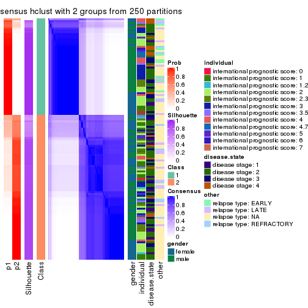</p>

</div>
<div id='tab-ATC-hclust-consensus-heatmap-2'>
<pre><code class="r">consensus_heatmap(res, k = 3)
</code></pre>

<p>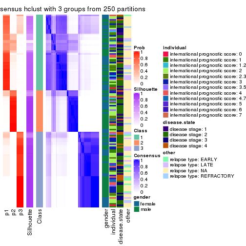</p>

</div>
<div id='tab-ATC-hclust-consensus-heatmap-3'>
<pre><code class="r">consensus_heatmap(res, k = 4)
</code></pre>

<p>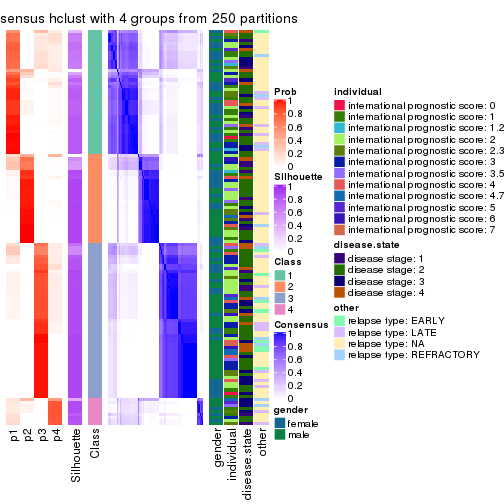</p>

</div>
<div id='tab-ATC-hclust-consensus-heatmap-4'>
<pre><code class="r">consensus_heatmap(res, k = 5)
</code></pre>

<p>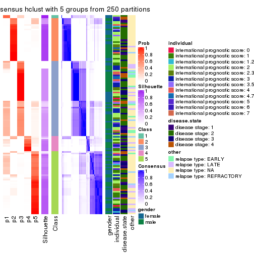</p>

</div>
<div id='tab-ATC-hclust-consensus-heatmap-5'>
<pre><code class="r">consensus_heatmap(res, k = 6)
</code></pre>

<p>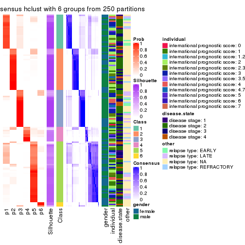</p>

</div>
</div>

Heatmaps for the membership of samples in all partitions to see how consistent they are:


<script>
$( function() {
	$( '#tabs-ATC-hclust-membership-heatmap' ).tabs();
} );
</script>
<div id='tabs-ATC-hclust-membership-heatmap'>
<ul>
<li><a href='#tab-ATC-hclust-membership-heatmap-1'>k = 2</a></li>
<li><a href='#tab-ATC-hclust-membership-heatmap-2'>k = 3</a></li>
<li><a href='#tab-ATC-hclust-membership-heatmap-3'>k = 4</a></li>
<li><a href='#tab-ATC-hclust-membership-heatmap-4'>k = 5</a></li>
<li><a href='#tab-ATC-hclust-membership-heatmap-5'>k = 6</a></li>
</ul>
<div id='tab-ATC-hclust-membership-heatmap-1'>
<pre><code class="r">membership_heatmap(res, k = 2)
</code></pre>

<p>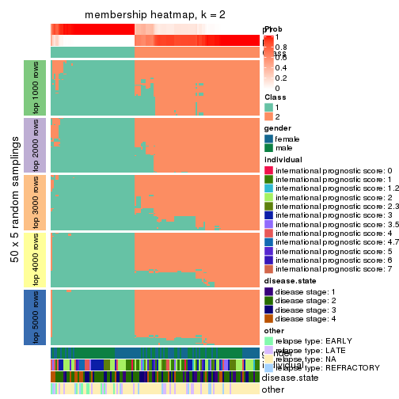</p>

</div>
<div id='tab-ATC-hclust-membership-heatmap-2'>
<pre><code class="r">membership_heatmap(res, k = 3)
</code></pre>

<p>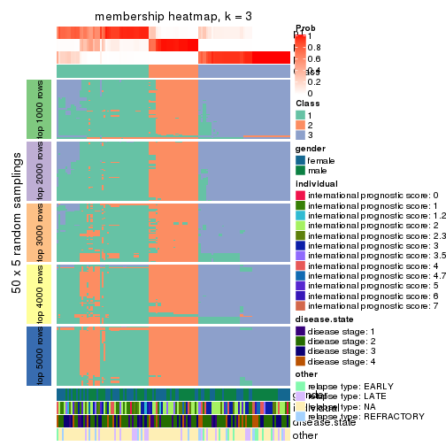</p>

</div>
<div id='tab-ATC-hclust-membership-heatmap-3'>
<pre><code class="r">membership_heatmap(res, k = 4)
</code></pre>

<p>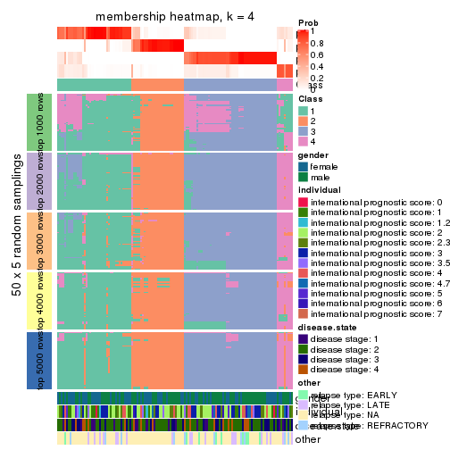</p>

</div>
<div id='tab-ATC-hclust-membership-heatmap-4'>
<pre><code class="r">membership_heatmap(res, k = 5)
</code></pre>

<p>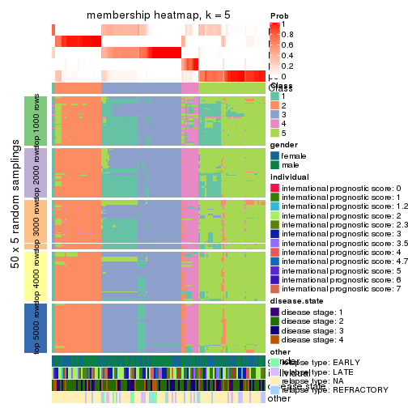</p>

</div>
<div id='tab-ATC-hclust-membership-heatmap-5'>
<pre><code class="r">membership_heatmap(res, k = 6)
</code></pre>

<p>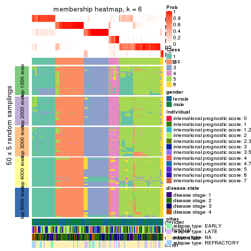</p>

</div>
</div>

As soon as we have had the classes for columns, we can look for signatures
which are significantly different between classes which can be candidate marks
for certain classes. Following are the heatmaps for signatures.


Signature heatmaps where rows are scaled:


<script>
$( function() {
	$( '#tabs-ATC-hclust-get-signatures' ).tabs();
} );
</script>
<div id='tabs-ATC-hclust-get-signatures'>
<ul>
<li><a href='#tab-ATC-hclust-get-signatures-1'>k = 2</a></li>
<li><a href='#tab-ATC-hclust-get-signatures-2'>k = 3</a></li>
<li><a href='#tab-ATC-hclust-get-signatures-3'>k = 4</a></li>
<li><a href='#tab-ATC-hclust-get-signatures-4'>k = 5</a></li>
<li><a href='#tab-ATC-hclust-get-signatures-5'>k = 6</a></li>
</ul>
<div id='tab-ATC-hclust-get-signatures-1'>
<pre><code class="r">get_signatures(res, k = 2)
</code></pre>

<p>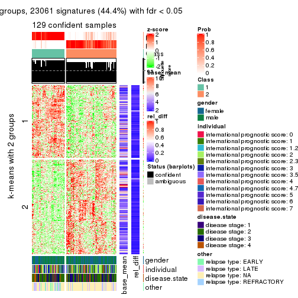</p>

</div>
<div id='tab-ATC-hclust-get-signatures-2'>
<pre><code class="r">get_signatures(res, k = 3)
</code></pre>

<p>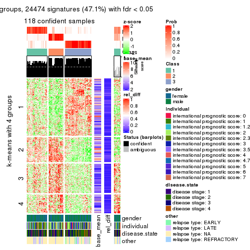</p>

</div>
<div id='tab-ATC-hclust-get-signatures-3'>
<pre><code class="r">get_signatures(res, k = 4)
</code></pre>

<p>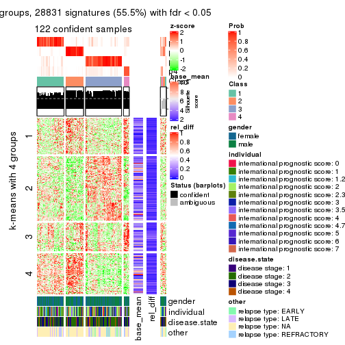</p>

</div>
<div id='tab-ATC-hclust-get-signatures-4'>
<pre><code class="r">get_signatures(res, k = 5)
</code></pre>

<pre><code>#&gt; Error: The width or height of the raster image is zero, maybe you forget to turn off the
#&gt; previous graphic device or it was corrupted. Run `dev.off()` to close it.
</code></pre>

<p></p>

</div>
<div id='tab-ATC-hclust-get-signatures-5'>
<pre><code class="r">get_signatures(res, k = 6)
</code></pre>

<pre><code>#&gt; Error: The width or height of the raster image is zero, maybe you forget to turn off the
#&gt; previous graphic device or it was corrupted. Run `dev.off()` to close it.
</code></pre>

<p></p>

</div>
</div>


Signature heatmaps where rows are not scaled:


<script>
$( function() {
	$( '#tabs-ATC-hclust-get-signatures-no-scale' ).tabs();
} );
</script>
<div id='tabs-ATC-hclust-get-signatures-no-scale'>
<ul>
<li><a href='#tab-ATC-hclust-get-signatures-no-scale-1'>k = 2</a></li>
<li><a href='#tab-ATC-hclust-get-signatures-no-scale-2'>k = 3</a></li>
<li><a href='#tab-ATC-hclust-get-signatures-no-scale-3'>k = 4</a></li>
<li><a href='#tab-ATC-hclust-get-signatures-no-scale-4'>k = 5</a></li>
<li><a href='#tab-ATC-hclust-get-signatures-no-scale-5'>k = 6</a></li>
</ul>
<div id='tab-ATC-hclust-get-signatures-no-scale-1'>
<pre><code class="r">get_signatures(res, k = 2, scale_rows = FALSE)
</code></pre>

<p>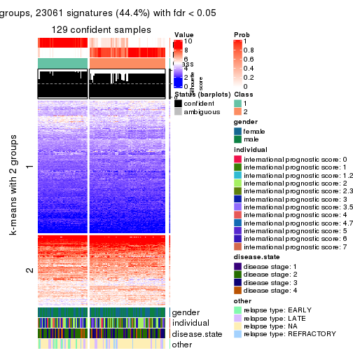</p>

</div>
<div id='tab-ATC-hclust-get-signatures-no-scale-2'>
<pre><code class="r">get_signatures(res, k = 3, scale_rows = FALSE)
</code></pre>

<p>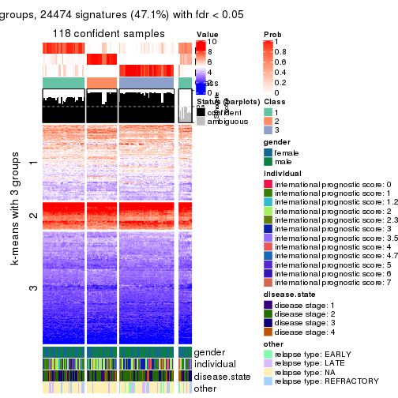</p>

</div>
<div id='tab-ATC-hclust-get-signatures-no-scale-3'>
<pre><code class="r">get_signatures(res, k = 4, scale_rows = FALSE)
</code></pre>

<p>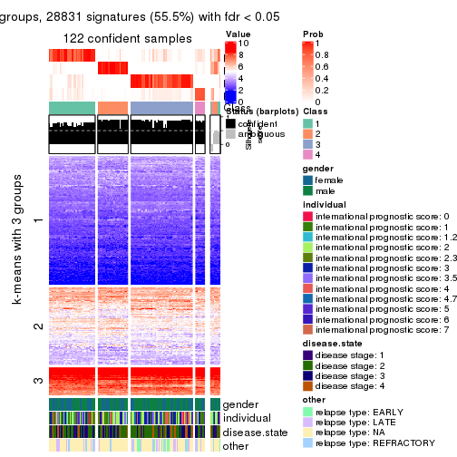</p>

</div>
<div id='tab-ATC-hclust-get-signatures-no-scale-4'>
<pre><code class="r">get_signatures(res, k = 5, scale_rows = FALSE)
</code></pre>

<pre><code>#&gt; Error in mat[ceiling(1:nr/h_ratio), ceiling(1:nc/w_ratio), drop = FALSE]: subscript out of bounds
</code></pre>

<p></p>

</div>
<div id='tab-ATC-hclust-get-signatures-no-scale-5'>
<pre><code class="r">get_signatures(res, k = 6, scale_rows = FALSE)
</code></pre>

<pre><code>#&gt; Error in mat[ceiling(1:nr/h_ratio), ceiling(1:nc/w_ratio), drop = FALSE]: subscript out of bounds
</code></pre>

<p>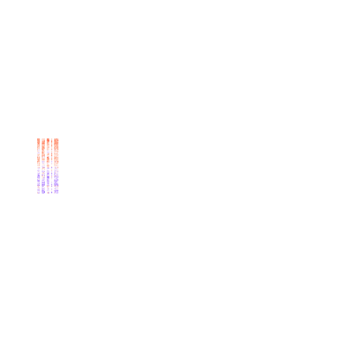</p>

</div>
</div>


Compare the overlap of signatures from different k:

```r
compare_signatures(res)
```

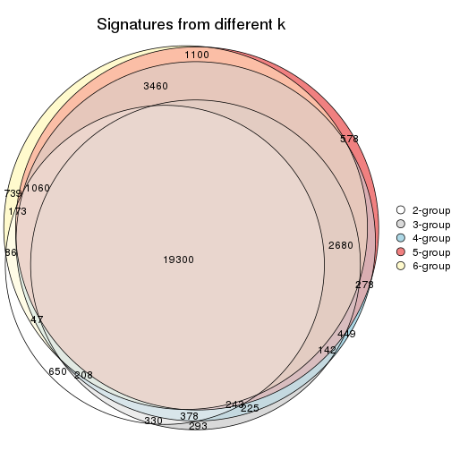

`get_signature()` returns a data frame invisibly. TO get the list of signatures, the function
call should be assigned to a variable explicitly. In following code, if `plot` argument is set
to `FALSE`, no heatmap is plotted while only the differential analysis is performed.

```r
# code only for demonstration
tb = get_signature(res, k = ..., plot = FALSE)
```

An example of the output of `tb` is:

```
#>   which_row         fdr    mean_1    mean_2 scaled_mean_1 scaled_mean_2 km
#> 1        38 0.042760348  8.373488  9.131774    -0.5533452     0.5164555  1
#> 2        40 0.018707592  7.106213  8.469186    -0.6173731     0.5762149  1
#> 3        55 0.019134737 10.221463 11.207825    -0.6159697     0.5749050  1
#> 4        59 0.006059896  5.921854  7.869574    -0.6899429     0.6439467  1
#> 5        60 0.018055526  8.928898 10.211722    -0.6204761     0.5791110  1
#> 6        98 0.009384629 15.714769 14.887706     0.6635654    -0.6193277  2
...
```

The columns in `tb` are:

1. `which_row`: row indices corresponding to the input matrix.
2. `fdr`: FDR for the differential test. 
3. `mean_x`: The mean value in group x.
4. `scaled_mean_x`: The mean value in group x after rows are scaled.
5. `km`: Row groups if k-means clustering is applied to rows.


UMAP plot which shows how samples are separated.


<script>
$( function() {
	$( '#tabs-ATC-hclust-dimension-reduction' ).tabs();
} );
</script>
<div id='tabs-ATC-hclust-dimension-reduction'>
<ul>
<li><a href='#tab-ATC-hclust-dimension-reduction-1'>k = 2</a></li>
<li><a href='#tab-ATC-hclust-dimension-reduction-2'>k = 3</a></li>
<li><a href='#tab-ATC-hclust-dimension-reduction-3'>k = 4</a></li>
<li><a href='#tab-ATC-hclust-dimension-reduction-4'>k = 5</a></li>
<li><a href='#tab-ATC-hclust-dimension-reduction-5'>k = 6</a></li>
</ul>
<div id='tab-ATC-hclust-dimension-reduction-1'>
<pre><code class="r">dimension_reduction(res, k = 2, method = &quot;UMAP&quot;)
</code></pre>

<p>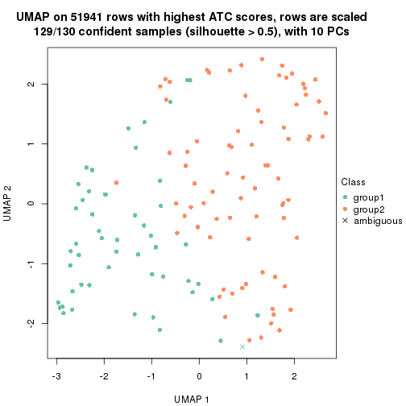</p>

</div>
<div id='tab-ATC-hclust-dimension-reduction-2'>
<pre><code class="r">dimension_reduction(res, k = 3, method = &quot;UMAP&quot;)
</code></pre>

<p>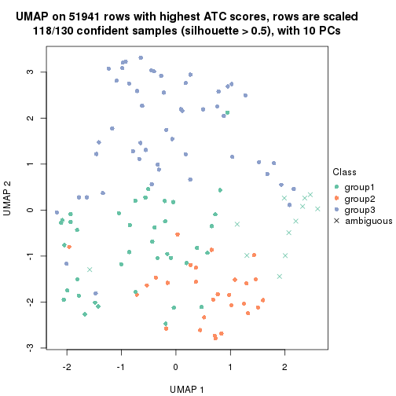</p>

</div>
<div id='tab-ATC-hclust-dimension-reduction-3'>
<pre><code class="r">dimension_reduction(res, k = 4, method = &quot;UMAP&quot;)
</code></pre>

<p>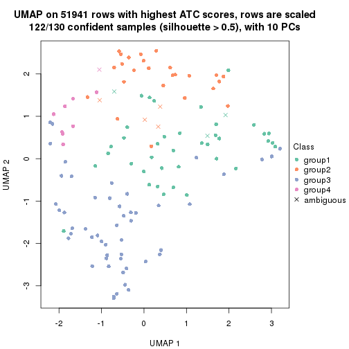</p>

</div>
<div id='tab-ATC-hclust-dimension-reduction-4'>
<pre><code class="r">dimension_reduction(res, k = 5, method = &quot;UMAP&quot;)
</code></pre>

<p>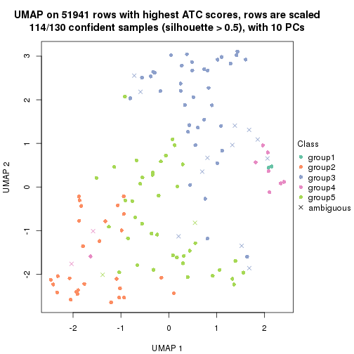</p>

</div>
<div id='tab-ATC-hclust-dimension-reduction-5'>
<pre><code class="r">dimension_reduction(res, k = 6, method = &quot;UMAP&quot;)
</code></pre>

<p>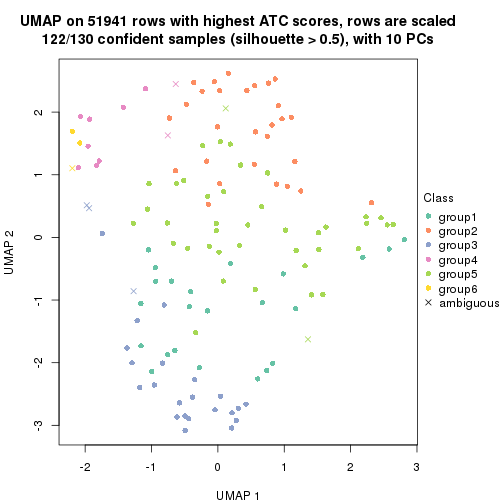</p>

</div>
</div>


Following heatmap shows how subgroups are split when increasing `k`:

```r
collect_classes(res)
```

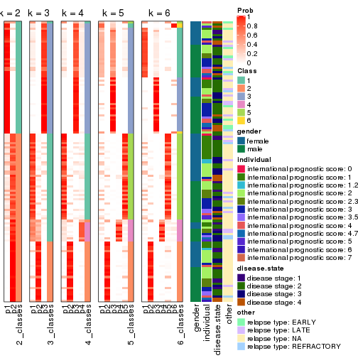


Test correlation between subgroups and known annotations. If the known
annotation is numeric, one-way ANOVA test is applied, and if the known
annotation is discrete, chi-squared contingency table test is applied.

```r
test_to_known_factors(res)
```

```
#>              n gender(p) individual(p) disease.state(p) other(p) k
#> ATC:hclust 129     0.338         0.374            0.227  0.00222 2
#> ATC:hclust 118     0.288         0.581            0.436  0.00924 3
#> ATC:hclust 122     0.387         0.778            0.609  0.04096 4
#> ATC:hclust 114     0.182         0.661            0.637  0.03667 5
#> ATC:hclust 122     0.354         0.768            0.590  0.12195 6
```


If matrix rows can be associated to genes, consider to use `GO_Enrichment(res,
...)` to perform function enrichment for the signature genes.


 

---------------------------------------------------


### ATC:kmeans**


The object with results only for a single top-value method and a single partition method 
can be extracted as:

```r
res = res_list["ATC", "kmeans"]
# you can also extract it by
# res = res_list["ATC:kmeans"]
```

A summary of `res` and all the functions that can be applied to it:

```r
res
```

```
#> A 'ConsensusPartition' object with k = 2, 3, 4, 5, 6.
#>   On a matrix with 51941 rows and 130 columns.
#>   Top rows (1000, 2000, 3000, 4000, 5000) are extracted by 'ATC' method.
#>   Subgroups are detected by 'kmeans' method.
#>   Performed in total 1250 partitions by row resampling.
#>   Best k for subgroups seems to be 2.
#> 
#> Following methods can be applied to this 'ConsensusPartition' object:
#>  [1] "cola_report"             "collect_classes"         "collect_plots"          
#>  [4] "collect_stats"           "colnames"                "compare_signatures"     
#>  [7] "consensus_heatmap"       "dimension_reduction"     "functional_enrichment"  
#> [10] "get_anno_col"            "get_anno"                "get_classes"            
#> [13] "get_consensus"           "get_matrix"              "get_membership"         
#> [16] "get_param"               "get_signatures"          "get_stats"              
#> [19] "is_best_k"               "is_stable_k"             "membership_heatmap"     
#> [22] "ncol"                    "nrow"                    "plot_ecdf"              
#> [25] "rownames"                "select_partition_number" "show"                   
#> [28] "suggest_best_k"          "test_to_known_factors"
```

`collect_plots()` function collects all the plots made from `res` for all `k` (number of partitions)
into one single page to provide an easy and fast comparison between different `k`.

```r
collect_plots(res)
```

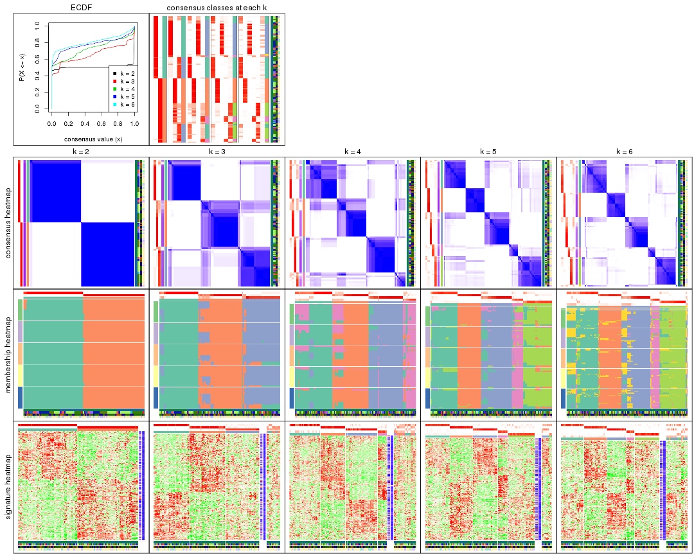

The plots are:

- The first row: a plot of the ECDF (Empirical cumulative distribution
  function) curves of the consensus matrix for each `k` and the heatmap of
  predicted classes for each `k`.
- The second row: heatmaps of the consensus matrix for each `k`.
- The third row: heatmaps of the membership matrix for each `k`.
- The fouth row: heatmaps of the signatures for each `k`.

All the plots in panels can be made by individual functions and they are
plotted later in this section.

`select_partition_number()` produces several plots showing different
statistics for choosing "optimized" `k`. There are following statistics:

- ECDF curves of the consensus matrix for each `k`;
- 1-PAC. [The PAC
  score](https://en.wikipedia.org/wiki/Consensus_clustering#Over-interpretation_potential_of_consensus_clustering)
  measures the proportion of the ambiguous subgrouping.
- Mean silhouette score.
- Concordance. The mean probability of fiting the consensus class ids in all
  partitions.
- Area increased. Denote $A_k$ as the area under the ECDF curve for current
  `k`, the area increased is defined as $A_k - A_{k-1}$.
- Rand index. The percent of pairs of samples that are both in a same cluster
  or both are not in a same cluster in the partition of k and k-1.
- Jaccard index. The ratio of pairs of samples are both in a same cluster in
  the partition of k and k-1 and the pairs of samples are both in a same
  cluster in the partition k or k-1.

The detailed explanations of these statistics can be found in [the cola
vignette](http://bioconductor.org/packages/devel/bioc/vignettes/cola/inst/doc/cola.html#toc_13).

Generally speaking, lower PAC score, higher mean silhouette score or higher
concordance corresponds to better partition. Rand index and Jaccard index
measure how similar the current partition is compared to partition with `k-1`.
If they are too similar, we won't accept `k` is better than `k-1`.

```r
select_partition_number(res)
```

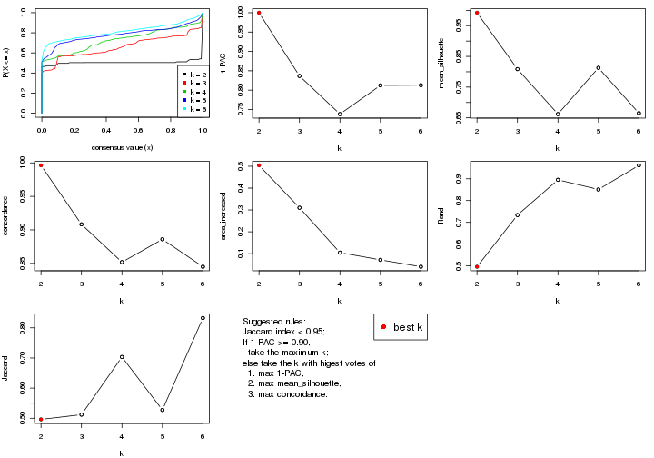

The numeric values for all these statistics can be obtained by `get_stats()`.

```r
get_stats(res)
```

```
#>   k 1-PAC mean_silhouette concordance area_increased  Rand Jaccard
#> 2 2 1.000           0.992       0.996         0.5041 0.496   0.496
#> 3 3 0.837           0.809       0.908         0.3101 0.733   0.512
#> 4 4 0.738           0.662       0.852         0.1047 0.895   0.703
#> 5 5 0.812           0.813       0.886         0.0716 0.851   0.527
#> 6 6 0.813           0.665       0.845         0.0402 0.962   0.833
```

`suggest_best_k()` suggests the best $k$ based on these statistics. The rules are as follows:

- All $k$ with Jaccard index larger than 0.95 are removed because the increase of
  the partition number does not provides enough extra information. If all $k$ are removed,
  the best $k$ is assigned by `NA`.
- For $k$ with 1-PAC larger than 0.9, the maximal $k$ is taken as the "best k". Other $k$ is called "optional k".
- If it does not fit the second rule. The $k$ with the highest vote of highest
  1-PAC, mean silhouette and concordance is taken as the "best k".

```r
suggest_best_k(res)
```

```
#> [1] 2
```


Following shows the table of the partitions (You need to click the **show/hide
code output** link to see it). The membership matrix (columns with name `p*`)
is inferred by
[`clue::cl_consensus()`](https://www.rdocumentation.org/link/cl_consensus?package=clue)
function with the `SE` method. Basically the value in the membership matrix
represents the probability to belong to a certain group. The finall class
label for an item is determined with the group with highest probability it
belongs to.

In `get_classes()` function, the entropy is calculated from the membership
matrix and the silhouette score is calculated from the consensus matrix.


<script>
$( function() {
	$( '#tabs-ATC-kmeans-get-classes' ).tabs();
} );
</script>
<div id='tabs-ATC-kmeans-get-classes'>
<ul>
<li><a href='#tab-ATC-kmeans-get-classes-1'>k = 2</a></li>
<li><a href='#tab-ATC-kmeans-get-classes-2'>k = 3</a></li>
<li><a href='#tab-ATC-kmeans-get-classes-3'>k = 4</a></li>
<li><a href='#tab-ATC-kmeans-get-classes-4'>k = 5</a></li>
<li><a href='#tab-ATC-kmeans-get-classes-5'>k = 6</a></li>
</ul>

<div id='tab-ATC-kmeans-get-classes-1'>
<p><a id='tab-ATC-kmeans-get-classes-1-a' style='color:#0366d6' href='#'>show/hide code output</a></p>
<pre><code class="r">cbind(get_classes(res, k = 2), get_membership(res, k = 2))
</code></pre>

<pre><code>#&gt;           class entropy silhouette    p1    p2
#&gt; GSM447671     2   0.000      0.997 0.000 1.000
#&gt; GSM447694     1   0.000      0.995 1.000 0.000
#&gt; GSM447618     2   0.000      0.997 0.000 1.000
#&gt; GSM447691     2   0.000      0.997 0.000 1.000
#&gt; GSM447733     1   0.000      0.995 1.000 0.000
#&gt; GSM447620     2   0.000      0.997 0.000 1.000
#&gt; GSM447627     1   0.000      0.995 1.000 0.000
#&gt; GSM447630     1   0.469      0.893 0.900 0.100
#&gt; GSM447642     1   0.000      0.995 1.000 0.000
#&gt; GSM447649     2   0.000      0.997 0.000 1.000
#&gt; GSM447654     2   0.000      0.997 0.000 1.000
#&gt; GSM447655     2   0.000      0.997 0.000 1.000
#&gt; GSM447669     2   0.000      0.997 0.000 1.000
#&gt; GSM447676     1   0.000      0.995 1.000 0.000
#&gt; GSM447678     2   0.000      0.997 0.000 1.000
#&gt; GSM447681     2   0.000      0.997 0.000 1.000
#&gt; GSM447698     2   0.000      0.997 0.000 1.000
#&gt; GSM447713     1   0.000      0.995 1.000 0.000
#&gt; GSM447722     1   0.000      0.995 1.000 0.000
#&gt; GSM447726     2   0.000      0.997 0.000 1.000
#&gt; GSM447735     1   0.000      0.995 1.000 0.000
#&gt; GSM447737     1   0.000      0.995 1.000 0.000
#&gt; GSM447657     2   0.000      0.997 0.000 1.000
#&gt; GSM447674     2   0.000      0.997 0.000 1.000
#&gt; GSM447636     2   0.000      0.997 0.000 1.000
#&gt; GSM447723     1   0.000      0.995 1.000 0.000
#&gt; GSM447699     1   0.000      0.995 1.000 0.000
#&gt; GSM447708     2   0.000      0.997 0.000 1.000
#&gt; GSM447721     1   0.000      0.995 1.000 0.000
#&gt; GSM447623     1   0.000      0.995 1.000 0.000
#&gt; GSM447621     1   0.000      0.995 1.000 0.000
#&gt; GSM447650     2   0.000      0.997 0.000 1.000
#&gt; GSM447651     2   0.000      0.997 0.000 1.000
#&gt; GSM447653     1   0.000      0.995 1.000 0.000
#&gt; GSM447658     2   0.000      0.997 0.000 1.000
#&gt; GSM447675     2   0.644      0.802 0.164 0.836
#&gt; GSM447680     2   0.000      0.997 0.000 1.000
#&gt; GSM447686     2   0.000      0.997 0.000 1.000
#&gt; GSM447736     1   0.000      0.995 1.000 0.000
#&gt; GSM447629     2   0.000      0.997 0.000 1.000
#&gt; GSM447648     1   0.000      0.995 1.000 0.000
#&gt; GSM447660     2   0.000      0.997 0.000 1.000
#&gt; GSM447661     2   0.000      0.997 0.000 1.000
#&gt; GSM447663     1   0.000      0.995 1.000 0.000
#&gt; GSM447704     2   0.000      0.997 0.000 1.000
#&gt; GSM447720     1   0.000      0.995 1.000 0.000
#&gt; GSM447652     2   0.000      0.997 0.000 1.000
#&gt; GSM447679     2   0.000      0.997 0.000 1.000
#&gt; GSM447712     1   0.000      0.995 1.000 0.000
#&gt; GSM447664     2   0.000      0.997 0.000 1.000
#&gt; GSM447637     1   0.000      0.995 1.000 0.000
#&gt; GSM447639     1   0.000      0.995 1.000 0.000
#&gt; GSM447615     1   0.000      0.995 1.000 0.000
#&gt; GSM447656     2   0.000      0.997 0.000 1.000
#&gt; GSM447673     2   0.000      0.997 0.000 1.000
#&gt; GSM447719     1   0.000      0.995 1.000 0.000
#&gt; GSM447706     1   0.000      0.995 1.000 0.000
#&gt; GSM447612     1   0.000      0.995 1.000 0.000
#&gt; GSM447665     2   0.000      0.997 0.000 1.000
#&gt; GSM447677     2   0.000      0.997 0.000 1.000
#&gt; GSM447613     1   0.000      0.995 1.000 0.000
#&gt; GSM447659     1   0.000      0.995 1.000 0.000
#&gt; GSM447662     1   0.000      0.995 1.000 0.000
#&gt; GSM447666     2   0.000      0.997 0.000 1.000
#&gt; GSM447668     2   0.000      0.997 0.000 1.000
#&gt; GSM447682     2   0.000      0.997 0.000 1.000
#&gt; GSM447683     2   0.000      0.997 0.000 1.000
#&gt; GSM447688     2   0.000      0.997 0.000 1.000
#&gt; GSM447702     2   0.000      0.997 0.000 1.000
#&gt; GSM447709     2   0.000      0.997 0.000 1.000
#&gt; GSM447711     1   0.000      0.995 1.000 0.000
#&gt; GSM447715     2   0.000      0.997 0.000 1.000
#&gt; GSM447693     1   0.000      0.995 1.000 0.000
#&gt; GSM447611     2   0.000      0.997 0.000 1.000
#&gt; GSM447672     2   0.000      0.997 0.000 1.000
#&gt; GSM447703     2   0.000      0.997 0.000 1.000
#&gt; GSM447727     1   0.000      0.995 1.000 0.000
#&gt; GSM447638     2   0.000      0.997 0.000 1.000
#&gt; GSM447670     1   0.000      0.995 1.000 0.000
#&gt; GSM447700     1   0.430      0.906 0.912 0.088
#&gt; GSM447738     2   0.000      0.997 0.000 1.000
#&gt; GSM447739     1   0.000      0.995 1.000 0.000
#&gt; GSM447617     1   0.000      0.995 1.000 0.000
#&gt; GSM447628     2   0.000      0.997 0.000 1.000
#&gt; GSM447632     2   0.000      0.997 0.000 1.000
#&gt; GSM447619     1   0.000      0.995 1.000 0.000
#&gt; GSM447643     2   0.000      0.997 0.000 1.000
#&gt; GSM447724     1   0.000      0.995 1.000 0.000
#&gt; GSM447728     2   0.000      0.997 0.000 1.000
#&gt; GSM447610     1   0.000      0.995 1.000 0.000
#&gt; GSM447633     2   0.000      0.997 0.000 1.000
#&gt; GSM447634     1   0.000      0.995 1.000 0.000
#&gt; GSM447622     1   0.000      0.995 1.000 0.000
#&gt; GSM447667     2   0.000      0.997 0.000 1.000
#&gt; GSM447687     2   0.000      0.997 0.000 1.000
#&gt; GSM447695     1   0.000      0.995 1.000 0.000
#&gt; GSM447696     1   0.000      0.995 1.000 0.000
#&gt; GSM447697     1   0.000      0.995 1.000 0.000
#&gt; GSM447714     1   0.000      0.995 1.000 0.000
#&gt; GSM447717     2   0.000      0.997 0.000 1.000
#&gt; GSM447725     1   0.000      0.995 1.000 0.000
#&gt; GSM447729     2   0.000      0.997 0.000 1.000
#&gt; GSM447644     2   0.000      0.997 0.000 1.000
#&gt; GSM447710     1   0.000      0.995 1.000 0.000
#&gt; GSM447614     1   0.000      0.995 1.000 0.000
#&gt; GSM447685     2   0.000      0.997 0.000 1.000
#&gt; GSM447690     1   0.000      0.995 1.000 0.000
#&gt; GSM447730     2   0.000      0.997 0.000 1.000
#&gt; GSM447646     2   0.000      0.997 0.000 1.000
#&gt; GSM447689     1   0.000      0.995 1.000 0.000
#&gt; GSM447635     2   0.000      0.997 0.000 1.000
#&gt; GSM447641     1   0.000      0.995 1.000 0.000
#&gt; GSM447716     2   0.000      0.997 0.000 1.000
#&gt; GSM447718     1   0.000      0.995 1.000 0.000
#&gt; GSM447616     1   0.000      0.995 1.000 0.000
#&gt; GSM447626     1   0.000      0.995 1.000 0.000
#&gt; GSM447640     2   0.000      0.997 0.000 1.000
#&gt; GSM447734     1   0.000      0.995 1.000 0.000
#&gt; GSM447692     1   0.000      0.995 1.000 0.000
#&gt; GSM447647     2   0.000      0.997 0.000 1.000
#&gt; GSM447624     1   0.000      0.995 1.000 0.000
#&gt; GSM447625     1   0.000      0.995 1.000 0.000
#&gt; GSM447707     2   0.000      0.997 0.000 1.000
#&gt; GSM447732     1   0.000      0.995 1.000 0.000
#&gt; GSM447684     1   0.469      0.893 0.900 0.100
#&gt; GSM447731     2   0.000      0.997 0.000 1.000
#&gt; GSM447705     1   0.184      0.969 0.972 0.028
#&gt; GSM447631     1   0.000      0.995 1.000 0.000
#&gt; GSM447701     2   0.000      0.997 0.000 1.000
#&gt; GSM447645     1   0.000      0.995 1.000 0.000
</code></pre>

<script>
$('#tab-ATC-kmeans-get-classes-1-a').parent().next().next().hide();
$('#tab-ATC-kmeans-get-classes-1-a').click(function(){
  $('#tab-ATC-kmeans-get-classes-1-a').parent().next().next().toggle();
  return(false);
});
</script>
</div>

<div id='tab-ATC-kmeans-get-classes-2'>
<p><a id='tab-ATC-kmeans-get-classes-2-a' style='color:#0366d6' href='#'>show/hide code output</a></p>
<pre><code class="r">cbind(get_classes(res, k = 3), get_membership(res, k = 3))
</code></pre>

<pre><code>#&gt;           class entropy silhouette    p1    p2    p3
#&gt; GSM447671     3  0.2796     0.8652 0.000 0.092 0.908
#&gt; GSM447694     1  0.0000     0.9450 1.000 0.000 0.000
#&gt; GSM447618     3  0.2796     0.8652 0.000 0.092 0.908
#&gt; GSM447691     3  0.2796     0.8652 0.000 0.092 0.908
#&gt; GSM447733     3  0.0237     0.8617 0.004 0.000 0.996
#&gt; GSM447620     2  0.4796     0.7016 0.000 0.780 0.220
#&gt; GSM447627     1  0.0000     0.9450 1.000 0.000 0.000
#&gt; GSM447630     3  0.2711     0.8915 0.088 0.000 0.912
#&gt; GSM447642     3  0.2711     0.8915 0.088 0.000 0.912
#&gt; GSM447649     2  0.0000     0.8826 0.000 1.000 0.000
#&gt; GSM447654     2  0.6168     0.4750 0.000 0.588 0.412
#&gt; GSM447655     2  0.0000     0.8826 0.000 1.000 0.000
#&gt; GSM447669     3  0.2796     0.8652 0.000 0.092 0.908
#&gt; GSM447676     3  0.2711     0.8915 0.088 0.000 0.912
#&gt; GSM447678     3  0.2261     0.8696 0.000 0.068 0.932
#&gt; GSM447681     2  0.0000     0.8826 0.000 1.000 0.000
#&gt; GSM447698     2  0.5733     0.5558 0.000 0.676 0.324
#&gt; GSM447713     1  0.0000     0.9450 1.000 0.000 0.000
#&gt; GSM447722     3  0.2711     0.8915 0.088 0.000 0.912
#&gt; GSM447726     3  0.2796     0.8652 0.000 0.092 0.908
#&gt; GSM447735     1  0.0000     0.9450 1.000 0.000 0.000
#&gt; GSM447737     1  0.0000     0.9450 1.000 0.000 0.000
#&gt; GSM447657     2  0.6154     0.3884 0.000 0.592 0.408
#&gt; GSM447674     2  0.0000     0.8826 0.000 1.000 0.000
#&gt; GSM447636     2  0.6168     0.3828 0.000 0.588 0.412
#&gt; GSM447723     3  0.2796     0.8906 0.092 0.000 0.908
#&gt; GSM447699     1  0.0000     0.9450 1.000 0.000 0.000
#&gt; GSM447708     2  0.6111     0.4165 0.000 0.604 0.396
#&gt; GSM447721     1  0.0000     0.9450 1.000 0.000 0.000
#&gt; GSM447623     1  0.0000     0.9450 1.000 0.000 0.000
#&gt; GSM447621     1  0.0000     0.9450 1.000 0.000 0.000
#&gt; GSM447650     2  0.0000     0.8826 0.000 1.000 0.000
#&gt; GSM447651     2  0.0000     0.8826 0.000 1.000 0.000
#&gt; GSM447653     1  0.2878     0.8660 0.904 0.000 0.096
#&gt; GSM447658     3  0.2261     0.8696 0.000 0.068 0.932
#&gt; GSM447675     3  0.0000     0.8595 0.000 0.000 1.000
#&gt; GSM447680     2  0.0000     0.8826 0.000 1.000 0.000
#&gt; GSM447686     3  0.6252     0.0985 0.000 0.444 0.556
#&gt; GSM447736     1  0.4452     0.7308 0.808 0.000 0.192
#&gt; GSM447629     2  0.6140     0.3979 0.000 0.596 0.404
#&gt; GSM447648     1  0.0000     0.9450 1.000 0.000 0.000
#&gt; GSM447660     3  0.2261     0.8696 0.000 0.068 0.932
#&gt; GSM447661     2  0.0000     0.8826 0.000 1.000 0.000
#&gt; GSM447663     3  0.3267     0.8694 0.116 0.000 0.884
#&gt; GSM447704     2  0.0000     0.8826 0.000 1.000 0.000
#&gt; GSM447720     3  0.2796     0.8906 0.092 0.000 0.908
#&gt; GSM447652     2  0.0237     0.8808 0.000 0.996 0.004
#&gt; GSM447679     2  0.0000     0.8826 0.000 1.000 0.000
#&gt; GSM447712     3  0.6295     0.0762 0.472 0.000 0.528
#&gt; GSM447664     2  0.6307     0.1985 0.000 0.512 0.488
#&gt; GSM447637     1  0.0000     0.9450 1.000 0.000 0.000
#&gt; GSM447639     3  0.2711     0.8915 0.088 0.000 0.912
#&gt; GSM447615     3  0.2878     0.8879 0.096 0.000 0.904
#&gt; GSM447656     2  0.6154     0.3884 0.000 0.592 0.408
#&gt; GSM447673     2  0.0000     0.8826 0.000 1.000 0.000
#&gt; GSM447719     1  0.2625     0.8719 0.916 0.000 0.084
#&gt; GSM447706     1  0.0000     0.9450 1.000 0.000 0.000
#&gt; GSM447612     1  0.6305     0.0587 0.516 0.000 0.484
#&gt; GSM447665     2  0.4750     0.7001 0.000 0.784 0.216
#&gt; GSM447677     2  0.0000     0.8826 0.000 1.000 0.000
#&gt; GSM447613     1  0.5529     0.5588 0.704 0.000 0.296
#&gt; GSM447659     1  0.0000     0.9450 1.000 0.000 0.000
#&gt; GSM447662     1  0.0000     0.9450 1.000 0.000 0.000
#&gt; GSM447666     3  0.2796     0.8652 0.000 0.092 0.908
#&gt; GSM447668     2  0.0000     0.8826 0.000 1.000 0.000
#&gt; GSM447682     2  0.0000     0.8826 0.000 1.000 0.000
#&gt; GSM447683     2  0.0000     0.8826 0.000 1.000 0.000
#&gt; GSM447688     2  0.1643     0.8605 0.000 0.956 0.044
#&gt; GSM447702     2  0.0000     0.8826 0.000 1.000 0.000
#&gt; GSM447709     2  0.0000     0.8826 0.000 1.000 0.000
#&gt; GSM447711     1  0.6305     0.0587 0.516 0.000 0.484
#&gt; GSM447715     3  0.2796     0.8652 0.000 0.092 0.908
#&gt; GSM447693     1  0.0000     0.9450 1.000 0.000 0.000
#&gt; GSM447611     3  0.0000     0.8595 0.000 0.000 1.000
#&gt; GSM447672     2  0.0000     0.8826 0.000 1.000 0.000
#&gt; GSM447703     2  0.0237     0.8809 0.000 0.996 0.004
#&gt; GSM447727     3  0.2796     0.8906 0.092 0.000 0.908
#&gt; GSM447638     2  0.5138     0.6622 0.000 0.748 0.252
#&gt; GSM447670     1  0.6204     0.2564 0.576 0.000 0.424
#&gt; GSM447700     3  0.2711     0.8915 0.088 0.000 0.912
#&gt; GSM447738     2  0.0000     0.8826 0.000 1.000 0.000
#&gt; GSM447739     1  0.0000     0.9450 1.000 0.000 0.000
#&gt; GSM447617     1  0.0000     0.9450 1.000 0.000 0.000
#&gt; GSM447628     2  0.2796     0.8246 0.000 0.908 0.092
#&gt; GSM447632     2  0.0000     0.8826 0.000 1.000 0.000
#&gt; GSM447619     1  0.0000     0.9450 1.000 0.000 0.000
#&gt; GSM447643     2  0.5968     0.4840 0.000 0.636 0.364
#&gt; GSM447724     3  0.2796     0.8906 0.092 0.000 0.908
#&gt; GSM447728     2  0.0000     0.8826 0.000 1.000 0.000
#&gt; GSM447610     1  0.0000     0.9450 1.000 0.000 0.000
#&gt; GSM447633     3  0.2796     0.8652 0.000 0.092 0.908
#&gt; GSM447634     3  0.2796     0.8906 0.092 0.000 0.908
#&gt; GSM447622     1  0.0000     0.9450 1.000 0.000 0.000
#&gt; GSM447667     2  0.0000     0.8826 0.000 1.000 0.000
#&gt; GSM447687     2  0.0237     0.8809 0.000 0.996 0.004
#&gt; GSM447695     1  0.0000     0.9450 1.000 0.000 0.000
#&gt; GSM447696     1  0.0000     0.9450 1.000 0.000 0.000
#&gt; GSM447697     1  0.0000     0.9450 1.000 0.000 0.000
#&gt; GSM447714     1  0.0000     0.9450 1.000 0.000 0.000
#&gt; GSM447717     3  0.2711     0.8665 0.000 0.088 0.912
#&gt; GSM447725     3  0.2711     0.8915 0.088 0.000 0.912
#&gt; GSM447729     2  0.5431     0.6915 0.000 0.716 0.284
#&gt; GSM447644     3  0.2796     0.8652 0.000 0.092 0.908
#&gt; GSM447710     1  0.0000     0.9450 1.000 0.000 0.000
#&gt; GSM447614     1  0.0000     0.9450 1.000 0.000 0.000
#&gt; GSM447685     2  0.0000     0.8826 0.000 1.000 0.000
#&gt; GSM447690     1  0.0000     0.9450 1.000 0.000 0.000
#&gt; GSM447730     2  0.0237     0.8809 0.000 0.996 0.004
#&gt; GSM447646     2  0.2878     0.8246 0.000 0.904 0.096
#&gt; GSM447689     3  0.2796     0.8906 0.092 0.000 0.908
#&gt; GSM447635     3  0.2711     0.8665 0.000 0.088 0.912
#&gt; GSM447641     3  0.2796     0.8906 0.092 0.000 0.908
#&gt; GSM447716     3  0.6308    -0.1001 0.000 0.492 0.508
#&gt; GSM447718     3  0.2711     0.8915 0.088 0.000 0.912
#&gt; GSM447616     1  0.0000     0.9450 1.000 0.000 0.000
#&gt; GSM447626     3  0.3267     0.8694 0.116 0.000 0.884
#&gt; GSM447640     2  0.0000     0.8826 0.000 1.000 0.000
#&gt; GSM447734     1  0.0000     0.9450 1.000 0.000 0.000
#&gt; GSM447692     1  0.0000     0.9450 1.000 0.000 0.000
#&gt; GSM447647     2  0.2448     0.8364 0.000 0.924 0.076
#&gt; GSM447624     1  0.0000     0.9450 1.000 0.000 0.000
#&gt; GSM447625     1  0.0000     0.9450 1.000 0.000 0.000
#&gt; GSM447707     2  0.0237     0.8809 0.000 0.996 0.004
#&gt; GSM447732     1  0.0000     0.9450 1.000 0.000 0.000
#&gt; GSM447684     3  0.2945     0.8913 0.088 0.004 0.908
#&gt; GSM447731     3  0.6291    -0.1742 0.000 0.468 0.532
#&gt; GSM447705     3  0.2796     0.8906 0.092 0.000 0.908
#&gt; GSM447631     1  0.0000     0.9450 1.000 0.000 0.000
#&gt; GSM447701     2  0.0000     0.8826 0.000 1.000 0.000
#&gt; GSM447645     1  0.0000     0.9450 1.000 0.000 0.000
</code></pre>

<script>
$('#tab-ATC-kmeans-get-classes-2-a').parent().next().next().hide();
$('#tab-ATC-kmeans-get-classes-2-a').click(function(){
  $('#tab-ATC-kmeans-get-classes-2-a').parent().next().next().toggle();
  return(false);
});
</script>
</div>

<div id='tab-ATC-kmeans-get-classes-3'>
<p><a id='tab-ATC-kmeans-get-classes-3-a' style='color:#0366d6' href='#'>show/hide code output</a></p>
<pre><code class="r">cbind(get_classes(res, k = 4), get_membership(res, k = 4))
</code></pre>

<pre><code>#&gt;           class entropy silhouette    p1    p2    p3    p4
#&gt; GSM447671     1  0.4564     0.5434 0.672 0.000 0.000 0.328
#&gt; GSM447694     3  0.0000     0.9285 0.000 0.000 1.000 0.000
#&gt; GSM447618     1  0.4661     0.5097 0.652 0.000 0.000 0.348
#&gt; GSM447691     1  0.4431     0.5755 0.696 0.000 0.000 0.304
#&gt; GSM447733     4  0.4679     0.3656 0.352 0.000 0.000 0.648
#&gt; GSM447620     2  0.7561     0.0936 0.200 0.452 0.000 0.348
#&gt; GSM447627     3  0.0188     0.9273 0.000 0.000 0.996 0.004
#&gt; GSM447630     1  0.0000     0.7647 1.000 0.000 0.000 0.000
#&gt; GSM447642     1  0.0000     0.7647 1.000 0.000 0.000 0.000
#&gt; GSM447649     2  0.0000     0.7588 0.000 1.000 0.000 0.000
#&gt; GSM447654     4  0.1637     0.7157 0.000 0.060 0.000 0.940
#&gt; GSM447655     2  0.0000     0.7588 0.000 1.000 0.000 0.000
#&gt; GSM447669     1  0.4564     0.5434 0.672 0.000 0.000 0.328
#&gt; GSM447676     1  0.0188     0.7636 0.996 0.000 0.000 0.004
#&gt; GSM447678     1  0.4522     0.5445 0.680 0.000 0.000 0.320
#&gt; GSM447681     2  0.0469     0.7562 0.000 0.988 0.000 0.012
#&gt; GSM447698     2  0.7889    -0.0515 0.288 0.364 0.000 0.348
#&gt; GSM447713     3  0.0000     0.9285 0.000 0.000 1.000 0.000
#&gt; GSM447722     1  0.0592     0.7597 0.984 0.000 0.000 0.016
#&gt; GSM447726     1  0.4477     0.5658 0.688 0.000 0.000 0.312
#&gt; GSM447735     3  0.0188     0.9273 0.000 0.000 0.996 0.004
#&gt; GSM447737     3  0.0000     0.9285 0.000 0.000 1.000 0.000
#&gt; GSM447657     2  0.7901    -0.0654 0.296 0.356 0.000 0.348
#&gt; GSM447674     2  0.0000     0.7588 0.000 1.000 0.000 0.000
#&gt; GSM447636     4  0.7876    -0.0130 0.280 0.352 0.000 0.368
#&gt; GSM447723     1  0.0000     0.7647 1.000 0.000 0.000 0.000
#&gt; GSM447699     3  0.2266     0.8792 0.084 0.000 0.912 0.004
#&gt; GSM447708     2  0.7896    -0.0576 0.292 0.360 0.000 0.348
#&gt; GSM447721     3  0.2654     0.8615 0.108 0.000 0.888 0.004
#&gt; GSM447623     3  0.0000     0.9285 0.000 0.000 1.000 0.000
#&gt; GSM447621     3  0.0188     0.9274 0.000 0.000 0.996 0.004
#&gt; GSM447650     2  0.0000     0.7588 0.000 1.000 0.000 0.000
#&gt; GSM447651     2  0.0000     0.7588 0.000 1.000 0.000 0.000
#&gt; GSM447653     4  0.6722     0.4285 0.200 0.000 0.184 0.616
#&gt; GSM447658     1  0.3649     0.6570 0.796 0.000 0.000 0.204
#&gt; GSM447675     4  0.2081     0.6865 0.084 0.000 0.000 0.916
#&gt; GSM447680     2  0.0592     0.7550 0.000 0.984 0.000 0.016
#&gt; GSM447686     1  0.7824    -0.1197 0.392 0.260 0.000 0.348
#&gt; GSM447736     3  0.5236     0.3590 0.432 0.000 0.560 0.008
#&gt; GSM447629     2  0.7896    -0.0576 0.292 0.360 0.000 0.348
#&gt; GSM447648     3  0.0000     0.9285 0.000 0.000 1.000 0.000
#&gt; GSM447660     1  0.3649     0.6570 0.796 0.000 0.000 0.204
#&gt; GSM447661     2  0.0000     0.7588 0.000 1.000 0.000 0.000
#&gt; GSM447663     1  0.0188     0.7629 0.996 0.000 0.000 0.004
#&gt; GSM447704     2  0.0000     0.7588 0.000 1.000 0.000 0.000
#&gt; GSM447720     1  0.0000     0.7647 1.000 0.000 0.000 0.000
#&gt; GSM447652     2  0.4916     0.2253 0.000 0.576 0.000 0.424
#&gt; GSM447679     2  0.0000     0.7588 0.000 1.000 0.000 0.000
#&gt; GSM447712     1  0.4673     0.4255 0.700 0.000 0.292 0.008
#&gt; GSM447664     4  0.6179     0.5042 0.188 0.140 0.000 0.672
#&gt; GSM447637     3  0.0000     0.9285 0.000 0.000 1.000 0.000
#&gt; GSM447639     1  0.0188     0.7636 0.996 0.000 0.000 0.004
#&gt; GSM447615     1  0.0188     0.7636 0.996 0.000 0.000 0.004
#&gt; GSM447656     2  0.7896    -0.0576 0.292 0.360 0.000 0.348
#&gt; GSM447673     2  0.0000     0.7588 0.000 1.000 0.000 0.000
#&gt; GSM447719     3  0.4996     0.1636 0.000 0.000 0.516 0.484
#&gt; GSM447706     3  0.2401     0.8739 0.092 0.000 0.904 0.004
#&gt; GSM447612     1  0.4535     0.4281 0.704 0.000 0.292 0.004
#&gt; GSM447665     2  0.7714     0.0612 0.236 0.432 0.000 0.332
#&gt; GSM447677     2  0.0592     0.7550 0.000 0.984 0.000 0.016
#&gt; GSM447613     1  0.4855     0.2865 0.644 0.000 0.352 0.004
#&gt; GSM447659     3  0.0188     0.9273 0.000 0.000 0.996 0.004
#&gt; GSM447662     3  0.3668     0.7862 0.188 0.000 0.808 0.004
#&gt; GSM447666     1  0.4331     0.5933 0.712 0.000 0.000 0.288
#&gt; GSM447668     2  0.0469     0.7562 0.000 0.988 0.000 0.012
#&gt; GSM447682     2  0.4406     0.4754 0.000 0.700 0.000 0.300
#&gt; GSM447683     2  0.1022     0.7474 0.000 0.968 0.000 0.032
#&gt; GSM447688     4  0.3907     0.5800 0.000 0.232 0.000 0.768
#&gt; GSM447702     2  0.0000     0.7588 0.000 1.000 0.000 0.000
#&gt; GSM447709     2  0.1940     0.7210 0.000 0.924 0.000 0.076
#&gt; GSM447711     1  0.4673     0.4255 0.700 0.000 0.292 0.008
#&gt; GSM447715     1  0.4193     0.6106 0.732 0.000 0.000 0.268
#&gt; GSM447693     3  0.0000     0.9285 0.000 0.000 1.000 0.000
#&gt; GSM447611     4  0.1940     0.6916 0.076 0.000 0.000 0.924
#&gt; GSM447672     2  0.0000     0.7588 0.000 1.000 0.000 0.000
#&gt; GSM447703     2  0.0000     0.7588 0.000 1.000 0.000 0.000
#&gt; GSM447727     1  0.0000     0.7647 1.000 0.000 0.000 0.000
#&gt; GSM447638     2  0.7693     0.0460 0.224 0.424 0.000 0.352
#&gt; GSM447670     1  0.4560     0.4208 0.700 0.000 0.296 0.004
#&gt; GSM447700     1  0.0469     0.7612 0.988 0.000 0.000 0.012
#&gt; GSM447738     2  0.0000     0.7588 0.000 1.000 0.000 0.000
#&gt; GSM447739     3  0.0000     0.9285 0.000 0.000 1.000 0.000
#&gt; GSM447617     3  0.0000     0.9285 0.000 0.000 1.000 0.000
#&gt; GSM447628     4  0.2281     0.7038 0.000 0.096 0.000 0.904
#&gt; GSM447632     2  0.0000     0.7588 0.000 1.000 0.000 0.000
#&gt; GSM447619     3  0.2401     0.8739 0.092 0.000 0.904 0.004
#&gt; GSM447643     2  0.7889    -0.0515 0.288 0.364 0.000 0.348
#&gt; GSM447724     1  0.0188     0.7636 0.996 0.000 0.000 0.004
#&gt; GSM447728     2  0.1022     0.7474 0.000 0.968 0.000 0.032
#&gt; GSM447610     3  0.0188     0.9273 0.000 0.000 0.996 0.004
#&gt; GSM447633     1  0.4564     0.5434 0.672 0.000 0.000 0.328
#&gt; GSM447634     1  0.0188     0.7636 0.996 0.000 0.000 0.004
#&gt; GSM447622     3  0.0188     0.9274 0.000 0.000 0.996 0.004
#&gt; GSM447667     2  0.4661     0.4029 0.000 0.652 0.000 0.348
#&gt; GSM447687     2  0.0000     0.7588 0.000 1.000 0.000 0.000
#&gt; GSM447695     3  0.0188     0.9274 0.000 0.000 0.996 0.004
#&gt; GSM447696     3  0.0000     0.9285 0.000 0.000 1.000 0.000
#&gt; GSM447697     3  0.0000     0.9285 0.000 0.000 1.000 0.000
#&gt; GSM447714     3  0.3626     0.7906 0.184 0.000 0.812 0.004
#&gt; GSM447717     1  0.3837     0.6431 0.776 0.000 0.000 0.224
#&gt; GSM447725     1  0.0188     0.7636 0.996 0.000 0.000 0.004
#&gt; GSM447729     4  0.1716     0.7148 0.000 0.064 0.000 0.936
#&gt; GSM447644     1  0.4477     0.5658 0.688 0.000 0.000 0.312
#&gt; GSM447710     3  0.2401     0.8739 0.092 0.000 0.904 0.004
#&gt; GSM447614     3  0.0188     0.9273 0.000 0.000 0.996 0.004
#&gt; GSM447685     2  0.0592     0.7550 0.000 0.984 0.000 0.016
#&gt; GSM447690     3  0.0188     0.9273 0.000 0.000 0.996 0.004
#&gt; GSM447730     2  0.0000     0.7588 0.000 1.000 0.000 0.000
#&gt; GSM447646     4  0.2281     0.7038 0.000 0.096 0.000 0.904
#&gt; GSM447689     1  0.0000     0.7647 1.000 0.000 0.000 0.000
#&gt; GSM447635     1  0.3764     0.6511 0.784 0.000 0.000 0.216
#&gt; GSM447641     1  0.0000     0.7647 1.000 0.000 0.000 0.000
#&gt; GSM447716     4  0.7914     0.0636 0.344 0.308 0.000 0.348
#&gt; GSM447718     1  0.0000     0.7647 1.000 0.000 0.000 0.000
#&gt; GSM447616     3  0.0188     0.9274 0.000 0.000 0.996 0.004
#&gt; GSM447626     1  0.0188     0.7629 0.996 0.000 0.000 0.004
#&gt; GSM447640     2  0.0000     0.7588 0.000 1.000 0.000 0.000
#&gt; GSM447734     3  0.0000     0.9285 0.000 0.000 1.000 0.000
#&gt; GSM447692     3  0.0000     0.9285 0.000 0.000 1.000 0.000
#&gt; GSM447647     4  0.4164     0.5529 0.000 0.264 0.000 0.736
#&gt; GSM447624     3  0.0000     0.9285 0.000 0.000 1.000 0.000
#&gt; GSM447625     3  0.4891     0.6230 0.308 0.000 0.680 0.012
#&gt; GSM447707     2  0.0000     0.7588 0.000 1.000 0.000 0.000
#&gt; GSM447732     3  0.3583     0.7947 0.180 0.000 0.816 0.004
#&gt; GSM447684     1  0.0000     0.7647 1.000 0.000 0.000 0.000
#&gt; GSM447731     4  0.1929     0.7182 0.024 0.036 0.000 0.940
#&gt; GSM447705     1  0.0000     0.7647 1.000 0.000 0.000 0.000
#&gt; GSM447631     3  0.0000     0.9285 0.000 0.000 1.000 0.000
#&gt; GSM447701     2  0.2149     0.7096 0.000 0.912 0.000 0.088
#&gt; GSM447645     3  0.0000     0.9285 0.000 0.000 1.000 0.000
</code></pre>

<script>
$('#tab-ATC-kmeans-get-classes-3-a').parent().next().next().hide();
$('#tab-ATC-kmeans-get-classes-3-a').click(function(){
  $('#tab-ATC-kmeans-get-classes-3-a').parent().next().next().toggle();
  return(false);
});
</script>
</div>

<div id='tab-ATC-kmeans-get-classes-4'>
<p><a id='tab-ATC-kmeans-get-classes-4-a' style='color:#0366d6' href='#'>show/hide code output</a></p>
<pre><code class="r">cbind(get_classes(res, k = 5), get_membership(res, k = 5))
</code></pre>

<pre><code>#&gt;           class entropy silhouette    p1    p2    p3    p4    p5
#&gt; GSM447671     5  0.2127      0.827 0.108 0.000 0.000 0.000 0.892
#&gt; GSM447694     3  0.0000      0.860 0.000 0.000 1.000 0.000 0.000
#&gt; GSM447618     5  0.2074      0.828 0.104 0.000 0.000 0.000 0.896
#&gt; GSM447691     5  0.2280      0.822 0.120 0.000 0.000 0.000 0.880
#&gt; GSM447733     4  0.4787      0.536 0.324 0.000 0.000 0.640 0.036
#&gt; GSM447620     5  0.2635      0.836 0.008 0.088 0.000 0.016 0.888
#&gt; GSM447627     3  0.3939      0.776 0.048 0.000 0.832 0.072 0.048
#&gt; GSM447630     1  0.1965      0.879 0.904 0.000 0.000 0.000 0.096
#&gt; GSM447642     1  0.1671      0.894 0.924 0.000 0.000 0.000 0.076
#&gt; GSM447649     2  0.0703      0.979 0.000 0.976 0.000 0.000 0.024
#&gt; GSM447654     4  0.2068      0.861 0.000 0.004 0.000 0.904 0.092
#&gt; GSM447655     2  0.0000      0.983 0.000 1.000 0.000 0.000 0.000
#&gt; GSM447669     5  0.2179      0.826 0.112 0.000 0.000 0.000 0.888
#&gt; GSM447676     1  0.1544      0.894 0.932 0.000 0.000 0.000 0.068
#&gt; GSM447678     5  0.2471      0.813 0.136 0.000 0.000 0.000 0.864
#&gt; GSM447681     2  0.0000      0.983 0.000 1.000 0.000 0.000 0.000
#&gt; GSM447698     5  0.2708      0.843 0.020 0.072 0.000 0.016 0.892
#&gt; GSM447713     3  0.1267      0.849 0.012 0.000 0.960 0.024 0.004
#&gt; GSM447722     1  0.1608      0.894 0.928 0.000 0.000 0.000 0.072
#&gt; GSM447726     5  0.2127      0.828 0.108 0.000 0.000 0.000 0.892
#&gt; GSM447735     3  0.1828      0.834 0.028 0.000 0.936 0.004 0.032
#&gt; GSM447737     3  0.0000      0.860 0.000 0.000 1.000 0.000 0.000
#&gt; GSM447657     5  0.2708      0.843 0.020 0.072 0.000 0.016 0.892
#&gt; GSM447674     2  0.0000      0.983 0.000 1.000 0.000 0.000 0.000
#&gt; GSM447636     5  0.2580      0.842 0.020 0.064 0.000 0.016 0.900
#&gt; GSM447723     1  0.1671      0.894 0.924 0.000 0.000 0.000 0.076
#&gt; GSM447699     3  0.4730      0.622 0.260 0.000 0.688 0.052 0.000
#&gt; GSM447708     5  0.2770      0.843 0.020 0.076 0.000 0.016 0.888
#&gt; GSM447721     3  0.5351      0.475 0.348 0.000 0.592 0.056 0.004
#&gt; GSM447623     3  0.0000      0.860 0.000 0.000 1.000 0.000 0.000
#&gt; GSM447621     3  0.0000      0.860 0.000 0.000 1.000 0.000 0.000
#&gt; GSM447650     2  0.0510      0.981 0.000 0.984 0.000 0.000 0.016
#&gt; GSM447651     2  0.0000      0.983 0.000 1.000 0.000 0.000 0.000
#&gt; GSM447653     4  0.4681      0.726 0.144 0.000 0.032 0.768 0.056
#&gt; GSM447658     1  0.4307     -0.150 0.504 0.000 0.000 0.000 0.496
#&gt; GSM447675     4  0.2580      0.850 0.044 0.000 0.000 0.892 0.064
#&gt; GSM447680     2  0.0510      0.975 0.000 0.984 0.000 0.000 0.016
#&gt; GSM447686     5  0.2654      0.842 0.040 0.044 0.000 0.016 0.900
#&gt; GSM447736     1  0.3357      0.805 0.852 0.000 0.092 0.048 0.008
#&gt; GSM447629     5  0.2770      0.843 0.020 0.076 0.000 0.016 0.888
#&gt; GSM447648     3  0.0000      0.860 0.000 0.000 1.000 0.000 0.000
#&gt; GSM447660     5  0.4126      0.469 0.380 0.000 0.000 0.000 0.620
#&gt; GSM447661     2  0.0000      0.983 0.000 1.000 0.000 0.000 0.000
#&gt; GSM447663     1  0.2196      0.889 0.916 0.000 0.004 0.024 0.056
#&gt; GSM447704     2  0.0703      0.979 0.000 0.976 0.000 0.000 0.024
#&gt; GSM447720     1  0.1671      0.894 0.924 0.000 0.000 0.000 0.076
#&gt; GSM447652     5  0.3281      0.767 0.000 0.092 0.000 0.060 0.848
#&gt; GSM447679     2  0.0000      0.983 0.000 1.000 0.000 0.000 0.000
#&gt; GSM447712     1  0.2072      0.844 0.928 0.000 0.036 0.020 0.016
#&gt; GSM447664     5  0.2920      0.754 0.016 0.000 0.000 0.132 0.852
#&gt; GSM447637     3  0.0000      0.860 0.000 0.000 1.000 0.000 0.000
#&gt; GSM447639     1  0.0955      0.873 0.968 0.000 0.000 0.004 0.028
#&gt; GSM447615     1  0.1697      0.893 0.932 0.000 0.000 0.008 0.060
#&gt; GSM447656     5  0.2770      0.843 0.020 0.076 0.000 0.016 0.888
#&gt; GSM447673     2  0.1124      0.968 0.000 0.960 0.000 0.004 0.036
#&gt; GSM447719     4  0.6321      0.288 0.056 0.000 0.336 0.552 0.056
#&gt; GSM447706     3  0.5159      0.347 0.400 0.000 0.556 0.044 0.000
#&gt; GSM447612     1  0.2645      0.837 0.888 0.000 0.068 0.044 0.000
#&gt; GSM447665     5  0.2519      0.830 0.000 0.100 0.000 0.016 0.884
#&gt; GSM447677     2  0.0510      0.975 0.000 0.984 0.000 0.000 0.016
#&gt; GSM447613     1  0.2946      0.818 0.868 0.000 0.088 0.044 0.000
#&gt; GSM447659     3  0.4273      0.758 0.056 0.000 0.812 0.076 0.056
#&gt; GSM447662     1  0.5114      0.339 0.608 0.000 0.340 0.052 0.000
#&gt; GSM447666     5  0.2471      0.811 0.136 0.000 0.000 0.000 0.864
#&gt; GSM447668     2  0.0000      0.983 0.000 1.000 0.000 0.000 0.000
#&gt; GSM447682     5  0.3492      0.729 0.000 0.188 0.000 0.016 0.796
#&gt; GSM447683     2  0.0510      0.975 0.000 0.984 0.000 0.000 0.016
#&gt; GSM447688     4  0.3905      0.745 0.004 0.012 0.000 0.752 0.232
#&gt; GSM447702     2  0.0000      0.983 0.000 1.000 0.000 0.000 0.000
#&gt; GSM447709     5  0.3707      0.650 0.000 0.284 0.000 0.000 0.716
#&gt; GSM447711     1  0.2853      0.831 0.880 0.000 0.076 0.040 0.004
#&gt; GSM447715     5  0.3895      0.593 0.320 0.000 0.000 0.000 0.680
#&gt; GSM447693     3  0.0000      0.860 0.000 0.000 1.000 0.000 0.000
#&gt; GSM447611     4  0.2491      0.855 0.036 0.000 0.000 0.896 0.068
#&gt; GSM447672     2  0.0000      0.983 0.000 1.000 0.000 0.000 0.000
#&gt; GSM447703     2  0.0794      0.976 0.000 0.972 0.000 0.000 0.028
#&gt; GSM447727     1  0.1671      0.894 0.924 0.000 0.000 0.000 0.076
#&gt; GSM447638     5  0.2611      0.842 0.016 0.072 0.000 0.016 0.896
#&gt; GSM447670     1  0.2804      0.839 0.884 0.000 0.068 0.044 0.004
#&gt; GSM447700     1  0.1965      0.879 0.904 0.000 0.000 0.000 0.096
#&gt; GSM447738     2  0.0510      0.981 0.000 0.984 0.000 0.000 0.016
#&gt; GSM447739     3  0.0960      0.852 0.016 0.000 0.972 0.008 0.004
#&gt; GSM447617     3  0.0000      0.860 0.000 0.000 1.000 0.000 0.000
#&gt; GSM447628     4  0.2233      0.859 0.000 0.004 0.000 0.892 0.104
#&gt; GSM447632     2  0.0703      0.979 0.000 0.976 0.000 0.000 0.024
#&gt; GSM447619     3  0.5016      0.467 0.348 0.000 0.608 0.044 0.000
#&gt; GSM447643     5  0.2644      0.843 0.020 0.068 0.000 0.016 0.896
#&gt; GSM447724     1  0.0955      0.873 0.968 0.000 0.000 0.004 0.028
#&gt; GSM447728     2  0.1478      0.920 0.000 0.936 0.000 0.000 0.064
#&gt; GSM447610     3  0.3805      0.782 0.044 0.000 0.840 0.068 0.048
#&gt; GSM447633     5  0.2074      0.828 0.104 0.000 0.000 0.000 0.896
#&gt; GSM447634     1  0.1082      0.886 0.964 0.000 0.000 0.008 0.028
#&gt; GSM447622     3  0.0000      0.860 0.000 0.000 1.000 0.000 0.000
#&gt; GSM447667     5  0.3141      0.775 0.000 0.152 0.000 0.016 0.832
#&gt; GSM447687     2  0.0794      0.976 0.000 0.972 0.000 0.000 0.028
#&gt; GSM447695     3  0.1800      0.837 0.020 0.000 0.932 0.048 0.000
#&gt; GSM447696     3  0.0000      0.860 0.000 0.000 1.000 0.000 0.000
#&gt; GSM447697     3  0.0000      0.860 0.000 0.000 1.000 0.000 0.000
#&gt; GSM447714     3  0.5334      0.267 0.436 0.000 0.512 0.052 0.000
#&gt; GSM447717     5  0.4304      0.165 0.484 0.000 0.000 0.000 0.516
#&gt; GSM447725     1  0.1205      0.875 0.956 0.000 0.000 0.004 0.040
#&gt; GSM447729     4  0.2284      0.860 0.004 0.004 0.000 0.896 0.096
#&gt; GSM447644     5  0.2179      0.826 0.112 0.000 0.000 0.000 0.888
#&gt; GSM447710     3  0.5084      0.492 0.332 0.000 0.616 0.052 0.000
#&gt; GSM447614     3  0.3805      0.782 0.044 0.000 0.840 0.068 0.048
#&gt; GSM447685     2  0.0510      0.975 0.000 0.984 0.000 0.000 0.016
#&gt; GSM447690     3  0.2067      0.831 0.028 0.000 0.928 0.012 0.032
#&gt; GSM447730     2  0.0771      0.978 0.000 0.976 0.000 0.004 0.020
#&gt; GSM447646     4  0.2124      0.860 0.000 0.004 0.000 0.900 0.096
#&gt; GSM447689     1  0.1671      0.894 0.924 0.000 0.000 0.000 0.076
#&gt; GSM447635     5  0.3999      0.547 0.344 0.000 0.000 0.000 0.656
#&gt; GSM447641     1  0.1608      0.894 0.928 0.000 0.000 0.000 0.072
#&gt; GSM447716     5  0.2568      0.843 0.032 0.048 0.000 0.016 0.904
#&gt; GSM447718     1  0.1671      0.894 0.924 0.000 0.000 0.000 0.076
#&gt; GSM447616     3  0.0290      0.858 0.000 0.000 0.992 0.008 0.000
#&gt; GSM447626     1  0.2196      0.889 0.916 0.000 0.004 0.024 0.056
#&gt; GSM447640     2  0.0000      0.983 0.000 1.000 0.000 0.000 0.000
#&gt; GSM447734     3  0.0000      0.860 0.000 0.000 1.000 0.000 0.000
#&gt; GSM447692     3  0.0000      0.860 0.000 0.000 1.000 0.000 0.000
#&gt; GSM447647     4  0.4613      0.778 0.004 0.120 0.000 0.756 0.120
#&gt; GSM447624     3  0.0000      0.860 0.000 0.000 1.000 0.000 0.000
#&gt; GSM447625     1  0.3781      0.771 0.840 0.000 0.064 0.064 0.032
#&gt; GSM447707     2  0.0794      0.976 0.000 0.972 0.000 0.000 0.028
#&gt; GSM447732     3  0.5325      0.291 0.428 0.000 0.520 0.052 0.000
#&gt; GSM447684     1  0.1965      0.879 0.904 0.000 0.000 0.000 0.096
#&gt; GSM447731     4  0.2068      0.861 0.000 0.004 0.000 0.904 0.092
#&gt; GSM447705     1  0.1671      0.894 0.924 0.000 0.000 0.000 0.076
#&gt; GSM447631     3  0.0000      0.860 0.000 0.000 1.000 0.000 0.000
#&gt; GSM447701     5  0.3752      0.644 0.000 0.292 0.000 0.000 0.708
#&gt; GSM447645     3  0.0000      0.860 0.000 0.000 1.000 0.000 0.000
</code></pre>

<script>
$('#tab-ATC-kmeans-get-classes-4-a').parent().next().next().hide();
$('#tab-ATC-kmeans-get-classes-4-a').click(function(){
  $('#tab-ATC-kmeans-get-classes-4-a').parent().next().next().toggle();
  return(false);
});
</script>
</div>

<div id='tab-ATC-kmeans-get-classes-5'>
<p><a id='tab-ATC-kmeans-get-classes-5-a' style='color:#0366d6' href='#'>show/hide code output</a></p>
<pre><code class="r">cbind(get_classes(res, k = 6), get_membership(res, k = 6))
</code></pre>

<pre><code>#&gt;           class entropy silhouette    p1    p2    p3    p4    p5    p6
#&gt; GSM447671     5  0.2670     0.8508 0.084 0.000 0.000 0.004 0.872 0.040
#&gt; GSM447694     3  0.0000     0.7508 0.000 0.000 1.000 0.000 0.000 0.000
#&gt; GSM447618     5  0.2451     0.8627 0.068 0.000 0.000 0.004 0.888 0.040
#&gt; GSM447691     5  0.3009     0.8297 0.112 0.000 0.000 0.004 0.844 0.040
#&gt; GSM447733     1  0.5771    -0.1207 0.444 0.000 0.000 0.380 0.000 0.176
#&gt; GSM447620     5  0.0260     0.8921 0.000 0.008 0.000 0.000 0.992 0.000
#&gt; GSM447627     3  0.4716     0.2582 0.004 0.000 0.552 0.040 0.000 0.404
#&gt; GSM447630     1  0.1864     0.6944 0.924 0.000 0.000 0.004 0.032 0.040
#&gt; GSM447642     1  0.1285     0.7085 0.944 0.000 0.000 0.000 0.004 0.052
#&gt; GSM447649     2  0.1918     0.9162 0.000 0.904 0.000 0.008 0.000 0.088
#&gt; GSM447654     4  0.1608     0.8471 0.004 0.004 0.000 0.940 0.036 0.016
#&gt; GSM447655     2  0.0632     0.9331 0.000 0.976 0.000 0.000 0.000 0.024
#&gt; GSM447669     5  0.2821     0.8420 0.096 0.000 0.000 0.004 0.860 0.040
#&gt; GSM447676     1  0.1349     0.7092 0.940 0.000 0.000 0.000 0.004 0.056
#&gt; GSM447678     5  0.4979     0.5977 0.276 0.000 0.000 0.012 0.636 0.076
#&gt; GSM447681     2  0.0935     0.9306 0.000 0.964 0.000 0.000 0.004 0.032
#&gt; GSM447698     5  0.0972     0.8877 0.000 0.008 0.000 0.000 0.964 0.028
#&gt; GSM447713     3  0.1285     0.7234 0.000 0.000 0.944 0.004 0.000 0.052
#&gt; GSM447722     1  0.1787     0.6997 0.920 0.000 0.000 0.004 0.008 0.068
#&gt; GSM447726     5  0.2364     0.8609 0.072 0.000 0.000 0.004 0.892 0.032
#&gt; GSM447735     3  0.2442     0.6414 0.004 0.000 0.852 0.000 0.000 0.144
#&gt; GSM447737     3  0.0000     0.7508 0.000 0.000 1.000 0.000 0.000 0.000
#&gt; GSM447657     5  0.0972     0.8877 0.000 0.008 0.000 0.000 0.964 0.028
#&gt; GSM447674     2  0.0632     0.9333 0.000 0.976 0.000 0.000 0.000 0.024
#&gt; GSM447636     5  0.1196     0.8844 0.008 0.000 0.000 0.000 0.952 0.040
#&gt; GSM447723     1  0.1074     0.7140 0.960 0.000 0.000 0.000 0.012 0.028
#&gt; GSM447699     3  0.5809    -0.2242 0.188 0.000 0.452 0.000 0.000 0.360
#&gt; GSM447708     5  0.0260     0.8921 0.000 0.008 0.000 0.000 0.992 0.000
#&gt; GSM447721     3  0.5879    -0.2402 0.208 0.000 0.448 0.000 0.000 0.344
#&gt; GSM447623     3  0.0000     0.7508 0.000 0.000 1.000 0.000 0.000 0.000
#&gt; GSM447621     3  0.0363     0.7450 0.000 0.000 0.988 0.000 0.000 0.012
#&gt; GSM447650     2  0.1610     0.9216 0.000 0.916 0.000 0.000 0.000 0.084
#&gt; GSM447651     2  0.0458     0.9340 0.000 0.984 0.000 0.000 0.000 0.016
#&gt; GSM447653     4  0.4982     0.2250 0.048 0.000 0.008 0.488 0.000 0.456
#&gt; GSM447658     1  0.4822     0.3119 0.620 0.000 0.000 0.004 0.308 0.068
#&gt; GSM447675     4  0.2326     0.8142 0.028 0.000 0.000 0.900 0.012 0.060
#&gt; GSM447680     2  0.1261     0.9203 0.000 0.952 0.000 0.000 0.024 0.024
#&gt; GSM447686     5  0.0436     0.8921 0.004 0.004 0.000 0.000 0.988 0.004
#&gt; GSM447736     1  0.3967     0.4656 0.632 0.000 0.012 0.000 0.000 0.356
#&gt; GSM447629     5  0.0260     0.8921 0.000 0.008 0.000 0.000 0.992 0.000
#&gt; GSM447648     3  0.0000     0.7508 0.000 0.000 1.000 0.000 0.000 0.000
#&gt; GSM447660     1  0.4988     0.1182 0.552 0.000 0.000 0.004 0.380 0.064
#&gt; GSM447661     2  0.0547     0.9329 0.000 0.980 0.000 0.000 0.000 0.020
#&gt; GSM447663     1  0.3748     0.5566 0.688 0.000 0.000 0.000 0.012 0.300
#&gt; GSM447704     2  0.1663     0.9198 0.000 0.912 0.000 0.000 0.000 0.088
#&gt; GSM447720     1  0.0964     0.7143 0.968 0.000 0.000 0.004 0.012 0.016
#&gt; GSM447652     5  0.2796     0.8238 0.000 0.008 0.000 0.044 0.868 0.080
#&gt; GSM447679     2  0.0363     0.9342 0.000 0.988 0.000 0.000 0.000 0.012
#&gt; GSM447712     1  0.2135     0.6817 0.872 0.000 0.000 0.000 0.000 0.128
#&gt; GSM447664     5  0.2461     0.8432 0.004 0.000 0.000 0.064 0.888 0.044
#&gt; GSM447637     3  0.0000     0.7508 0.000 0.000 1.000 0.000 0.000 0.000
#&gt; GSM447639     1  0.2053     0.6924 0.888 0.000 0.000 0.000 0.004 0.108
#&gt; GSM447615     1  0.1753     0.7071 0.912 0.000 0.000 0.000 0.004 0.084
#&gt; GSM447656     5  0.0260     0.8921 0.000 0.008 0.000 0.000 0.992 0.000
#&gt; GSM447673     2  0.4073     0.7963 0.000 0.772 0.000 0.012 0.088 0.128
#&gt; GSM447719     6  0.6024    -0.3381 0.008 0.000 0.188 0.352 0.000 0.452
#&gt; GSM447706     3  0.5943    -0.2958 0.224 0.000 0.432 0.000 0.000 0.344
#&gt; GSM447612     1  0.3925     0.5094 0.656 0.000 0.004 0.000 0.008 0.332
#&gt; GSM447665     5  0.0622     0.8915 0.000 0.008 0.000 0.000 0.980 0.012
#&gt; GSM447677     2  0.1261     0.9203 0.000 0.952 0.000 0.000 0.024 0.024
#&gt; GSM447613     1  0.3819     0.5201 0.672 0.000 0.012 0.000 0.000 0.316
#&gt; GSM447659     3  0.4767     0.1756 0.004 0.000 0.512 0.040 0.000 0.444
#&gt; GSM447662     1  0.5824    -0.0449 0.452 0.000 0.192 0.000 0.000 0.356
#&gt; GSM447666     5  0.3096     0.8289 0.108 0.000 0.000 0.004 0.840 0.048
#&gt; GSM447668     2  0.0865     0.9301 0.000 0.964 0.000 0.000 0.000 0.036
#&gt; GSM447682     5  0.2134     0.8556 0.000 0.044 0.000 0.000 0.904 0.052
#&gt; GSM447683     2  0.1261     0.9203 0.000 0.952 0.000 0.000 0.024 0.024
#&gt; GSM447688     4  0.4786     0.6644 0.000 0.016 0.000 0.700 0.184 0.100
#&gt; GSM447702     2  0.0547     0.9331 0.000 0.980 0.000 0.000 0.000 0.020
#&gt; GSM447709     5  0.2039     0.8403 0.000 0.076 0.000 0.000 0.904 0.020
#&gt; GSM447711     1  0.3240     0.6011 0.752 0.000 0.004 0.000 0.000 0.244
#&gt; GSM447715     5  0.4723     0.3293 0.408 0.000 0.000 0.004 0.548 0.040
#&gt; GSM447693     3  0.0000     0.7508 0.000 0.000 1.000 0.000 0.000 0.000
#&gt; GSM447611     4  0.2265     0.8162 0.028 0.000 0.000 0.904 0.012 0.056
#&gt; GSM447672     2  0.0547     0.9331 0.000 0.980 0.000 0.000 0.000 0.020
#&gt; GSM447703     2  0.2070     0.9154 0.000 0.892 0.000 0.008 0.000 0.100
#&gt; GSM447727     1  0.0964     0.7140 0.968 0.000 0.000 0.004 0.012 0.016
#&gt; GSM447638     5  0.0520     0.8918 0.000 0.008 0.000 0.000 0.984 0.008
#&gt; GSM447670     1  0.3738     0.5383 0.680 0.000 0.004 0.000 0.004 0.312
#&gt; GSM447700     1  0.1857     0.6974 0.924 0.000 0.000 0.004 0.028 0.044
#&gt; GSM447738     2  0.1387     0.9266 0.000 0.932 0.000 0.000 0.000 0.068
#&gt; GSM447739     3  0.0935     0.7351 0.000 0.000 0.964 0.004 0.000 0.032
#&gt; GSM447617     3  0.0000     0.7508 0.000 0.000 1.000 0.000 0.000 0.000
#&gt; GSM447628     4  0.1483     0.8467 0.000 0.008 0.000 0.944 0.036 0.012
#&gt; GSM447632     2  0.1556     0.9239 0.000 0.920 0.000 0.000 0.000 0.080
#&gt; GSM447619     3  0.5812    -0.2278 0.192 0.000 0.460 0.000 0.000 0.348
#&gt; GSM447643     5  0.0520     0.8918 0.000 0.008 0.000 0.000 0.984 0.008
#&gt; GSM447724     1  0.2191     0.6879 0.876 0.000 0.000 0.000 0.004 0.120
#&gt; GSM447728     2  0.3711     0.6277 0.000 0.720 0.000 0.000 0.260 0.020
#&gt; GSM447610     3  0.4685     0.2881 0.004 0.000 0.568 0.040 0.000 0.388
#&gt; GSM447633     5  0.2507     0.8574 0.072 0.000 0.000 0.004 0.884 0.040
#&gt; GSM447634     1  0.2070     0.6967 0.892 0.000 0.000 0.000 0.008 0.100
#&gt; GSM447622     3  0.0363     0.7450 0.000 0.000 0.988 0.000 0.000 0.012
#&gt; GSM447667     5  0.0622     0.8898 0.000 0.012 0.000 0.000 0.980 0.008
#&gt; GSM447687     2  0.2070     0.9154 0.000 0.892 0.000 0.008 0.000 0.100
#&gt; GSM447695     3  0.3244     0.4574 0.000 0.000 0.732 0.000 0.000 0.268
#&gt; GSM447696     3  0.0000     0.7508 0.000 0.000 1.000 0.000 0.000 0.000
#&gt; GSM447697     3  0.0000     0.7508 0.000 0.000 1.000 0.000 0.000 0.000
#&gt; GSM447714     1  0.6075    -0.3222 0.372 0.000 0.268 0.000 0.000 0.360
#&gt; GSM447717     1  0.4829     0.2077 0.584 0.000 0.000 0.004 0.356 0.056
#&gt; GSM447725     1  0.1387     0.7070 0.932 0.000 0.000 0.000 0.000 0.068
#&gt; GSM447729     4  0.1299     0.8470 0.004 0.004 0.000 0.952 0.036 0.004
#&gt; GSM447644     5  0.2670     0.8506 0.084 0.000 0.000 0.004 0.872 0.040
#&gt; GSM447710     3  0.5907    -0.2696 0.212 0.000 0.436 0.000 0.000 0.352
#&gt; GSM447614     3  0.4685     0.2881 0.004 0.000 0.568 0.040 0.000 0.388
#&gt; GSM447685     2  0.1261     0.9203 0.000 0.952 0.000 0.000 0.024 0.024
#&gt; GSM447690     3  0.2544     0.6413 0.004 0.000 0.852 0.004 0.000 0.140
#&gt; GSM447730     2  0.2384     0.9126 0.000 0.884 0.000 0.032 0.000 0.084
#&gt; GSM447646     4  0.1382     0.8470 0.000 0.008 0.000 0.948 0.036 0.008
#&gt; GSM447689     1  0.0725     0.7151 0.976 0.000 0.000 0.000 0.012 0.012
#&gt; GSM447635     1  0.4883    -0.1101 0.492 0.000 0.000 0.004 0.456 0.048
#&gt; GSM447641     1  0.1010     0.7141 0.960 0.000 0.000 0.000 0.004 0.036
#&gt; GSM447716     5  0.1003     0.8877 0.004 0.004 0.000 0.000 0.964 0.028
#&gt; GSM447718     1  0.1036     0.7104 0.964 0.000 0.000 0.004 0.008 0.024
#&gt; GSM447616     3  0.1007     0.7291 0.000 0.000 0.956 0.000 0.000 0.044
#&gt; GSM447626     1  0.3748     0.5566 0.688 0.000 0.000 0.000 0.012 0.300
#&gt; GSM447640     2  0.0547     0.9331 0.000 0.980 0.000 0.000 0.000 0.020
#&gt; GSM447734     3  0.0146     0.7491 0.000 0.000 0.996 0.000 0.000 0.004
#&gt; GSM447692     3  0.0000     0.7508 0.000 0.000 1.000 0.000 0.000 0.000
#&gt; GSM447647     4  0.5062     0.6884 0.000 0.052 0.000 0.708 0.116 0.124
#&gt; GSM447624     3  0.0000     0.7508 0.000 0.000 1.000 0.000 0.000 0.000
#&gt; GSM447625     1  0.3819     0.4519 0.624 0.000 0.004 0.000 0.000 0.372
#&gt; GSM447707     2  0.2070     0.9154 0.000 0.892 0.000 0.008 0.000 0.100
#&gt; GSM447732     6  0.6116    -0.0906 0.300 0.000 0.340 0.000 0.000 0.360
#&gt; GSM447684     1  0.2074     0.6904 0.912 0.000 0.000 0.004 0.036 0.048
#&gt; GSM447731     4  0.1666     0.8454 0.008 0.000 0.000 0.936 0.036 0.020
#&gt; GSM447705     1  0.1693     0.7060 0.932 0.000 0.000 0.004 0.020 0.044
#&gt; GSM447631     3  0.0000     0.7508 0.000 0.000 1.000 0.000 0.000 0.000
#&gt; GSM447701     5  0.2147     0.8357 0.000 0.084 0.000 0.000 0.896 0.020
#&gt; GSM447645     3  0.0000     0.7508 0.000 0.000 1.000 0.000 0.000 0.000
</code></pre>

<script>
$('#tab-ATC-kmeans-get-classes-5-a').parent().next().next().hide();
$('#tab-ATC-kmeans-get-classes-5-a').click(function(){
  $('#tab-ATC-kmeans-get-classes-5-a').parent().next().next().toggle();
  return(false);
});
</script>
</div>
</div>

Heatmaps for the consensus matrix. It visualizes the probability of two
samples to be in a same group.


<script>
$( function() {
	$( '#tabs-ATC-kmeans-consensus-heatmap' ).tabs();
} );
</script>
<div id='tabs-ATC-kmeans-consensus-heatmap'>
<ul>
<li><a href='#tab-ATC-kmeans-consensus-heatmap-1'>k = 2</a></li>
<li><a href='#tab-ATC-kmeans-consensus-heatmap-2'>k = 3</a></li>
<li><a href='#tab-ATC-kmeans-consensus-heatmap-3'>k = 4</a></li>
<li><a href='#tab-ATC-kmeans-consensus-heatmap-4'>k = 5</a></li>
<li><a href='#tab-ATC-kmeans-consensus-heatmap-5'>k = 6</a></li>
</ul>
<div id='tab-ATC-kmeans-consensus-heatmap-1'>
<pre><code class="r">consensus_heatmap(res, k = 2)
</code></pre>

<p>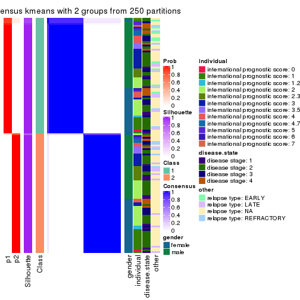</p>

</div>
<div id='tab-ATC-kmeans-consensus-heatmap-2'>
<pre><code class="r">consensus_heatmap(res, k = 3)
</code></pre>

<p>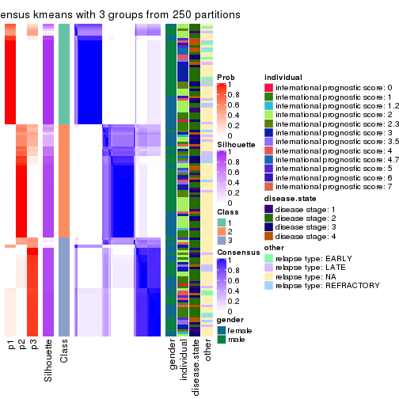</p>

</div>
<div id='tab-ATC-kmeans-consensus-heatmap-3'>
<pre><code class="r">consensus_heatmap(res, k = 4)
</code></pre>

<p>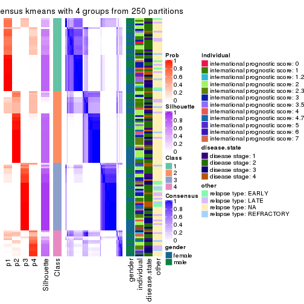</p>

</div>
<div id='tab-ATC-kmeans-consensus-heatmap-4'>
<pre><code class="r">consensus_heatmap(res, k = 5)
</code></pre>

<p>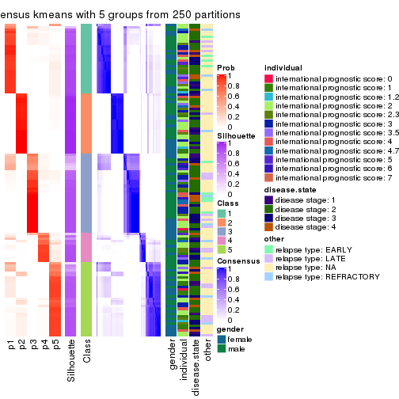</p>

</div>
<div id='tab-ATC-kmeans-consensus-heatmap-5'>
<pre><code class="r">consensus_heatmap(res, k = 6)
</code></pre>

<p>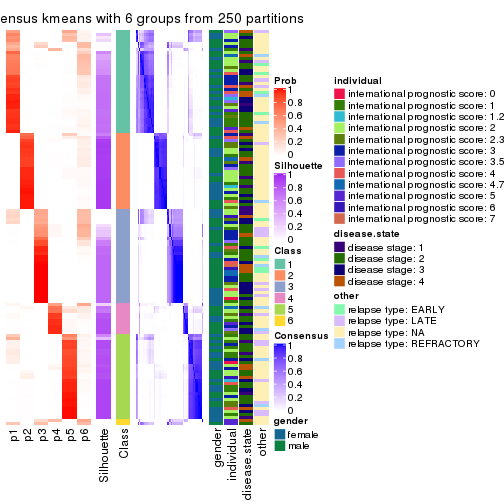</p>

</div>
</div>

Heatmaps for the membership of samples in all partitions to see how consistent they are:


<script>
$( function() {
	$( '#tabs-ATC-kmeans-membership-heatmap' ).tabs();
} );
</script>
<div id='tabs-ATC-kmeans-membership-heatmap'>
<ul>
<li><a href='#tab-ATC-kmeans-membership-heatmap-1'>k = 2</a></li>
<li><a href='#tab-ATC-kmeans-membership-heatmap-2'>k = 3</a></li>
<li><a href='#tab-ATC-kmeans-membership-heatmap-3'>k = 4</a></li>
<li><a href='#tab-ATC-kmeans-membership-heatmap-4'>k = 5</a></li>
<li><a href='#tab-ATC-kmeans-membership-heatmap-5'>k = 6</a></li>
</ul>
<div id='tab-ATC-kmeans-membership-heatmap-1'>
<pre><code class="r">membership_heatmap(res, k = 2)
</code></pre>

<p>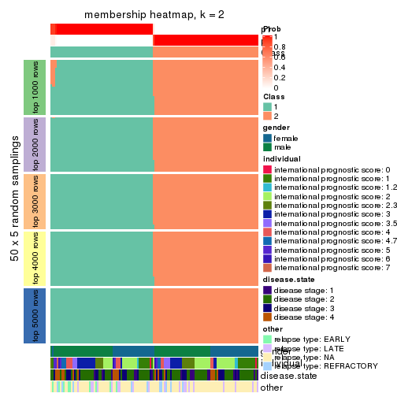</p>

</div>
<div id='tab-ATC-kmeans-membership-heatmap-2'>
<pre><code class="r">membership_heatmap(res, k = 3)
</code></pre>

<p>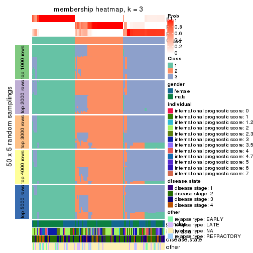</p>

</div>
<div id='tab-ATC-kmeans-membership-heatmap-3'>
<pre><code class="r">membership_heatmap(res, k = 4)
</code></pre>

<p>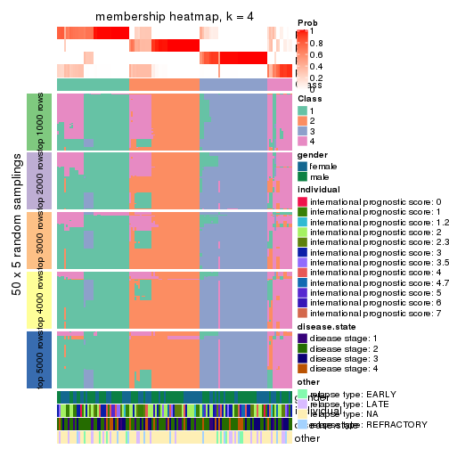</p>

</div>
<div id='tab-ATC-kmeans-membership-heatmap-4'>
<pre><code class="r">membership_heatmap(res, k = 5)
</code></pre>

<p>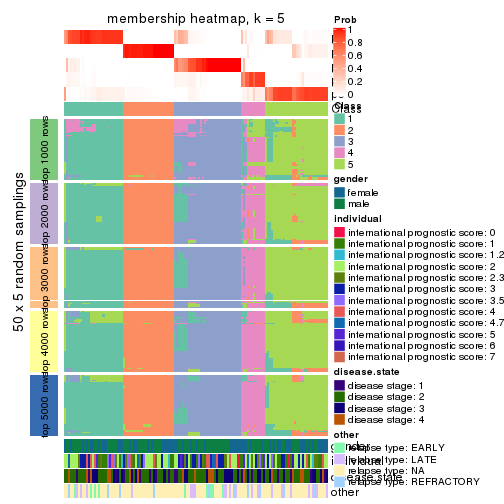</p>

</div>
<div id='tab-ATC-kmeans-membership-heatmap-5'>
<pre><code class="r">membership_heatmap(res, k = 6)
</code></pre>

<p>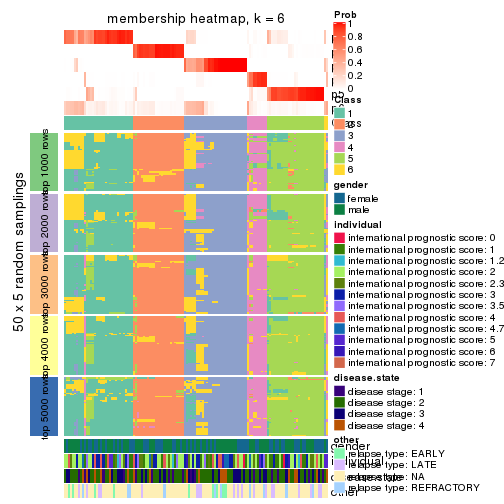</p>

</div>
</div>

As soon as we have had the classes for columns, we can look for signatures
which are significantly different between classes which can be candidate marks
for certain classes. Following are the heatmaps for signatures.


Signature heatmaps where rows are scaled:


<script>
$( function() {
	$( '#tabs-ATC-kmeans-get-signatures' ).tabs();
} );
</script>
<div id='tabs-ATC-kmeans-get-signatures'>
<ul>
<li><a href='#tab-ATC-kmeans-get-signatures-1'>k = 2</a></li>
<li><a href='#tab-ATC-kmeans-get-signatures-2'>k = 3</a></li>
<li><a href='#tab-ATC-kmeans-get-signatures-3'>k = 4</a></li>
<li><a href='#tab-ATC-kmeans-get-signatures-4'>k = 5</a></li>
<li><a href='#tab-ATC-kmeans-get-signatures-5'>k = 6</a></li>
</ul>
<div id='tab-ATC-kmeans-get-signatures-1'>
<pre><code class="r">get_signatures(res, k = 2)
</code></pre>

<p>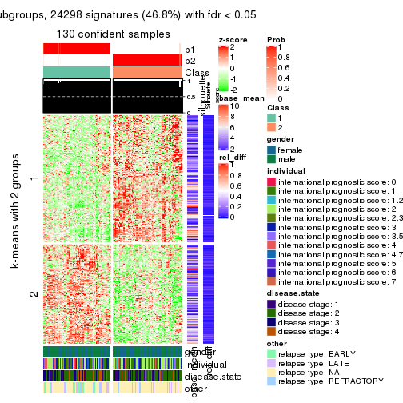</p>

</div>
<div id='tab-ATC-kmeans-get-signatures-2'>
<pre><code class="r">get_signatures(res, k = 3)
</code></pre>

<p>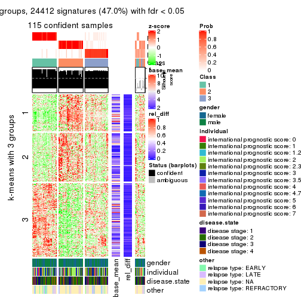</p>

</div>
<div id='tab-ATC-kmeans-get-signatures-3'>
<pre><code class="r">get_signatures(res, k = 4)
</code></pre>

<p>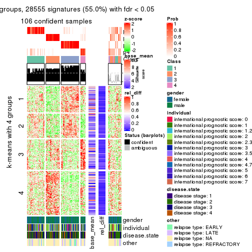</p>

</div>
<div id='tab-ATC-kmeans-get-signatures-4'>
<pre><code class="r">get_signatures(res, k = 5)
</code></pre>

<pre><code>#&gt; Error: The width or height of the raster image is zero, maybe you forget to turn off the
#&gt; previous graphic device or it was corrupted. Run `dev.off()` to close it.
</code></pre>

<p></p>

</div>
<div id='tab-ATC-kmeans-get-signatures-5'>
<pre><code class="r">get_signatures(res, k = 6)
</code></pre>

<pre><code>#&gt; Error: The width or height of the raster image is zero, maybe you forget to turn off the
#&gt; previous graphic device or it was corrupted. Run `dev.off()` to close it.
</code></pre>

<p></p>

</div>
</div>


Signature heatmaps where rows are not scaled:


<script>
$( function() {
	$( '#tabs-ATC-kmeans-get-signatures-no-scale' ).tabs();
} );
</script>
<div id='tabs-ATC-kmeans-get-signatures-no-scale'>
<ul>
<li><a href='#tab-ATC-kmeans-get-signatures-no-scale-1'>k = 2</a></li>
<li><a href='#tab-ATC-kmeans-get-signatures-no-scale-2'>k = 3</a></li>
<li><a href='#tab-ATC-kmeans-get-signatures-no-scale-3'>k = 4</a></li>
<li><a href='#tab-ATC-kmeans-get-signatures-no-scale-4'>k = 5</a></li>
<li><a href='#tab-ATC-kmeans-get-signatures-no-scale-5'>k = 6</a></li>
</ul>
<div id='tab-ATC-kmeans-get-signatures-no-scale-1'>
<pre><code class="r">get_signatures(res, k = 2, scale_rows = FALSE)
</code></pre>

<p>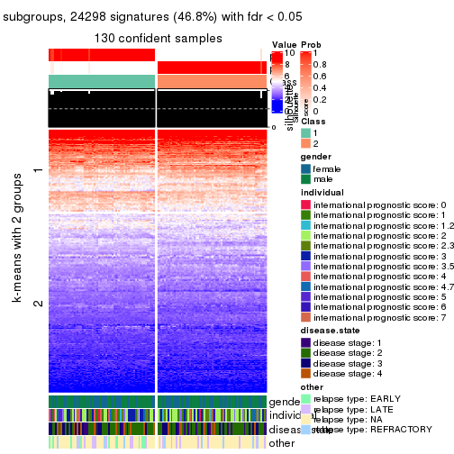</p>

</div>
<div id='tab-ATC-kmeans-get-signatures-no-scale-2'>
<pre><code class="r">get_signatures(res, k = 3, scale_rows = FALSE)
</code></pre>

<p>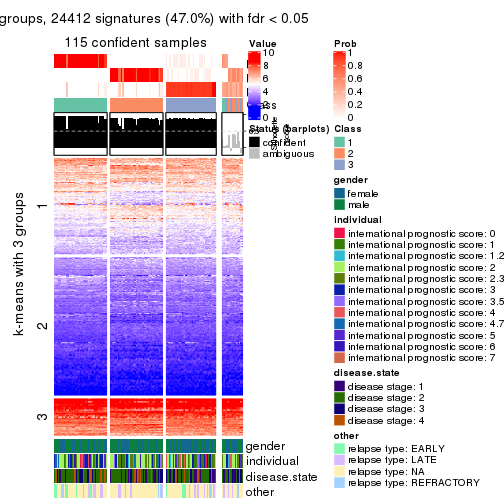</p>

</div>
<div id='tab-ATC-kmeans-get-signatures-no-scale-3'>
<pre><code class="r">get_signatures(res, k = 4, scale_rows = FALSE)
</code></pre>

<p>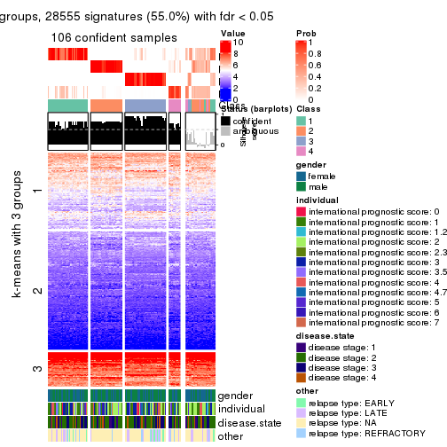</p>

</div>
<div id='tab-ATC-kmeans-get-signatures-no-scale-4'>
<pre><code class="r">get_signatures(res, k = 5, scale_rows = FALSE)
</code></pre>

<p>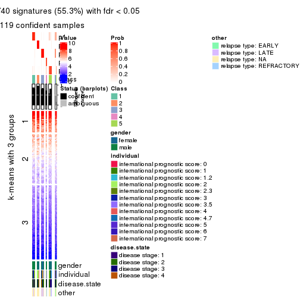</p>

</div>
<div id='tab-ATC-kmeans-get-signatures-no-scale-5'>
<pre><code class="r">get_signatures(res, k = 6, scale_rows = FALSE)
</code></pre>

<p>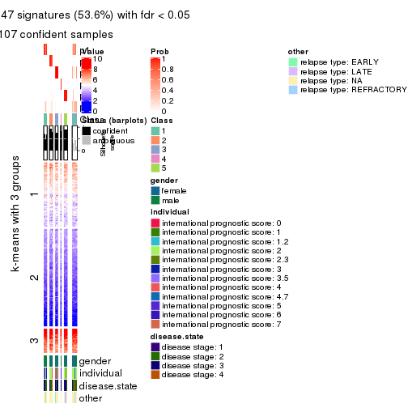</p>

</div>
</div>


Compare the overlap of signatures from different k:

```r
compare_signatures(res)
```

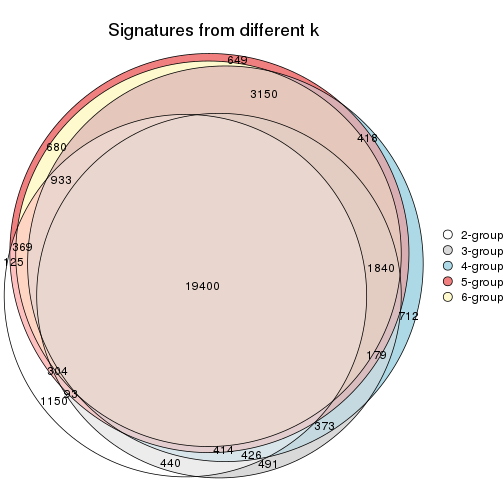

`get_signature()` returns a data frame invisibly. TO get the list of signatures, the function
call should be assigned to a variable explicitly. In following code, if `plot` argument is set
to `FALSE`, no heatmap is plotted while only the differential analysis is performed.

```r
# code only for demonstration
tb = get_signature(res, k = ..., plot = FALSE)
```

An example of the output of `tb` is:

```
#>   which_row         fdr    mean_1    mean_2 scaled_mean_1 scaled_mean_2 km
#> 1        38 0.042760348  8.373488  9.131774    -0.5533452     0.5164555  1
#> 2        40 0.018707592  7.106213  8.469186    -0.6173731     0.5762149  1
#> 3        55 0.019134737 10.221463 11.207825    -0.6159697     0.5749050  1
#> 4        59 0.006059896  5.921854  7.869574    -0.6899429     0.6439467  1
#> 5        60 0.018055526  8.928898 10.211722    -0.6204761     0.5791110  1
#> 6        98 0.009384629 15.714769 14.887706     0.6635654    -0.6193277  2
...
```

The columns in `tb` are:

1. `which_row`: row indices corresponding to the input matrix.
2. `fdr`: FDR for the differential test. 
3. `mean_x`: The mean value in group x.
4. `scaled_mean_x`: The mean value in group x after rows are scaled.
5. `km`: Row groups if k-means clustering is applied to rows.


UMAP plot which shows how samples are separated.


<script>
$( function() {
	$( '#tabs-ATC-kmeans-dimension-reduction' ).tabs();
} );
</script>
<div id='tabs-ATC-kmeans-dimension-reduction'>
<ul>
<li><a href='#tab-ATC-kmeans-dimension-reduction-1'>k = 2</a></li>
<li><a href='#tab-ATC-kmeans-dimension-reduction-2'>k = 3</a></li>
<li><a href='#tab-ATC-kmeans-dimension-reduction-3'>k = 4</a></li>
<li><a href='#tab-ATC-kmeans-dimension-reduction-4'>k = 5</a></li>
<li><a href='#tab-ATC-kmeans-dimension-reduction-5'>k = 6</a></li>
</ul>
<div id='tab-ATC-kmeans-dimension-reduction-1'>
<pre><code class="r">dimension_reduction(res, k = 2, method = &quot;UMAP&quot;)
</code></pre>

<p>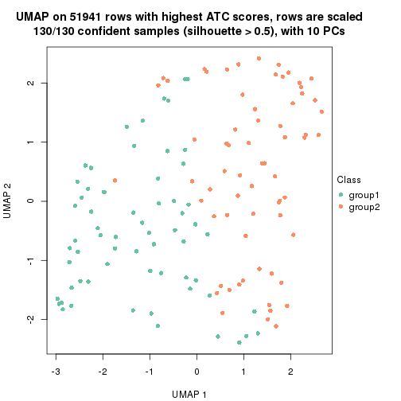</p>

</div>
<div id='tab-ATC-kmeans-dimension-reduction-2'>
<pre><code class="r">dimension_reduction(res, k = 3, method = &quot;UMAP&quot;)
</code></pre>

<p>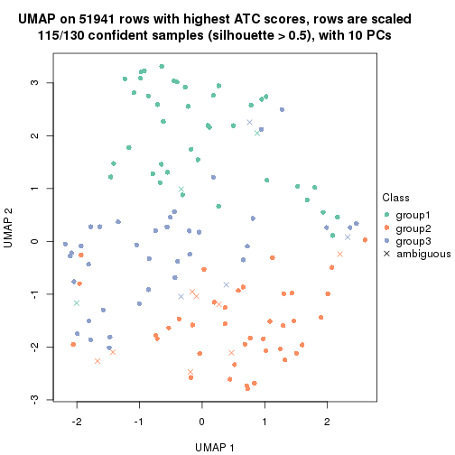</p>

</div>
<div id='tab-ATC-kmeans-dimension-reduction-3'>
<pre><code class="r">dimension_reduction(res, k = 4, method = &quot;UMAP&quot;)
</code></pre>

<p>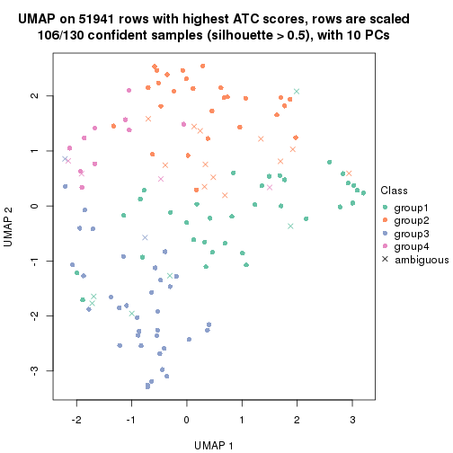</p>

</div>
<div id='tab-ATC-kmeans-dimension-reduction-4'>
<pre><code class="r">dimension_reduction(res, k = 5, method = &quot;UMAP&quot;)
</code></pre>

<p>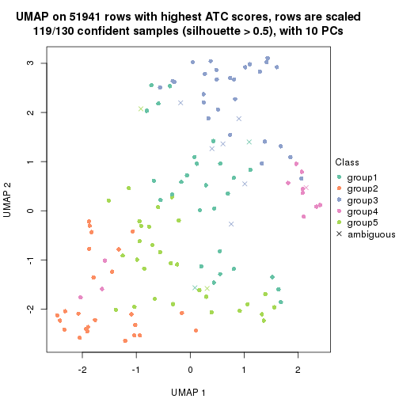</p>

</div>
<div id='tab-ATC-kmeans-dimension-reduction-5'>
<pre><code class="r">dimension_reduction(res, k = 6, method = &quot;UMAP&quot;)
</code></pre>

<p>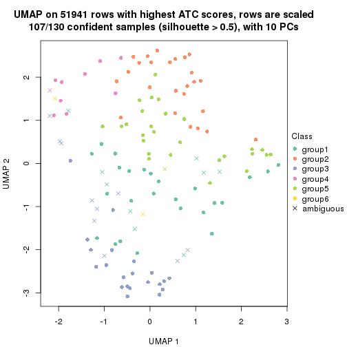</p>

</div>
</div>


Following heatmap shows how subgroups are split when increasing `k`:

```r
collect_classes(res)
```

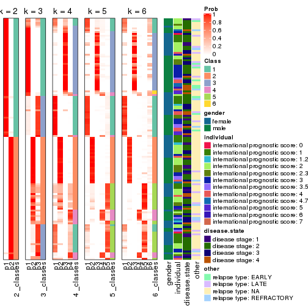


Test correlation between subgroups and known annotations. If the known
annotation is numeric, one-way ANOVA test is applied, and if the known
annotation is discrete, chi-squared contingency table test is applied.

```r
test_to_known_factors(res)
```

```
#>              n gender(p) individual(p) disease.state(p) other(p) k
#> ATC:kmeans 130     0.581         0.794            0.567   0.0176 2
#> ATC:kmeans 115     0.346         0.557            0.712   0.2598 3
#> ATC:kmeans 106     0.514         0.852            0.816   0.1850 4
#> ATC:kmeans 119     0.667         0.967            0.763   0.0845 5
#> ATC:kmeans 107     0.315         0.866            0.659   0.0740 6
```


If matrix rows can be associated to genes, consider to use `GO_Enrichment(res,
...)` to perform function enrichment for the signature genes.


 

---------------------------------------------------


### ATC:skmeans*


The object with results only for a single top-value method and a single partition method 
can be extracted as:

```r
res = res_list["ATC", "skmeans"]
# you can also extract it by
# res = res_list["ATC:skmeans"]
```

A summary of `res` and all the functions that can be applied to it:

```r
res
```

```
#> A 'ConsensusPartition' object with k = 2, 3, 4, 5, 6.
#>   On a matrix with 51941 rows and 130 columns.
#>   Top rows (1000, 2000, 3000, 4000, 5000) are extracted by 'ATC' method.
#>   Subgroups are detected by 'skmeans' method.
#>   Performed in total 1250 partitions by row resampling.
#>   Best k for subgroups seems to be 6.
#> 
#> Following methods can be applied to this 'ConsensusPartition' object:
#>  [1] "cola_report"             "collect_classes"         "collect_plots"          
#>  [4] "collect_stats"           "colnames"                "compare_signatures"     
#>  [7] "consensus_heatmap"       "dimension_reduction"     "functional_enrichment"  
#> [10] "get_anno_col"            "get_anno"                "get_classes"            
#> [13] "get_consensus"           "get_matrix"              "get_membership"         
#> [16] "get_param"               "get_signatures"          "get_stats"              
#> [19] "is_best_k"               "is_stable_k"             "membership_heatmap"     
#> [22] "ncol"                    "nrow"                    "plot_ecdf"              
#> [25] "rownames"                "select_partition_number" "show"                   
#> [28] "suggest_best_k"          "test_to_known_factors"
```

`collect_plots()` function collects all the plots made from `res` for all `k` (number of partitions)
into one single page to provide an easy and fast comparison between different `k`.

```r
collect_plots(res)
```

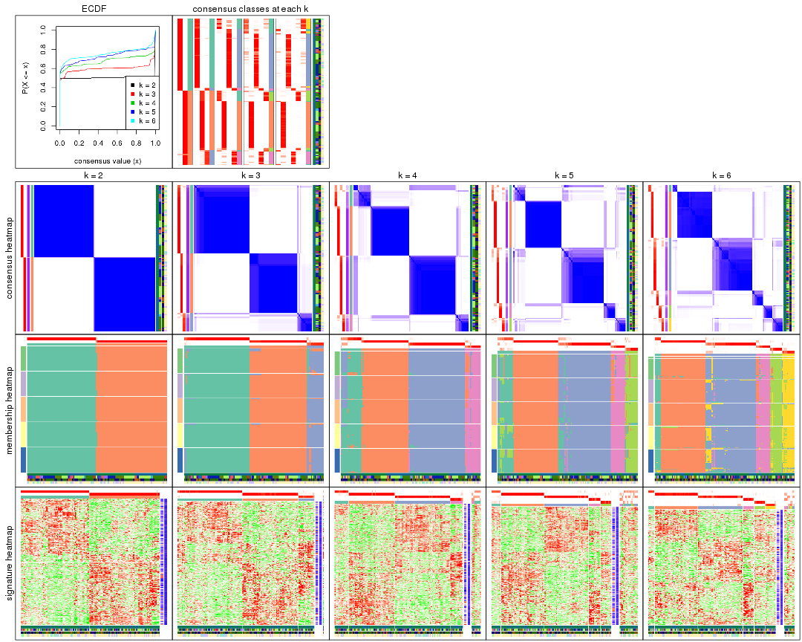

The plots are:

- The first row: a plot of the ECDF (Empirical cumulative distribution
  function) curves of the consensus matrix for each `k` and the heatmap of
  predicted classes for each `k`.
- The second row: heatmaps of the consensus matrix for each `k`.
- The third row: heatmaps of the membership matrix for each `k`.
- The fouth row: heatmaps of the signatures for each `k`.

All the plots in panels can be made by individual functions and they are
plotted later in this section.

`select_partition_number()` produces several plots showing different
statistics for choosing "optimized" `k`. There are following statistics:

- ECDF curves of the consensus matrix for each `k`;
- 1-PAC. [The PAC
  score](https://en.wikipedia.org/wiki/Consensus_clustering#Over-interpretation_potential_of_consensus_clustering)
  measures the proportion of the ambiguous subgrouping.
- Mean silhouette score.
- Concordance. The mean probability of fiting the consensus class ids in all
  partitions.
- Area increased. Denote $A_k$ as the area under the ECDF curve for current
  `k`, the area increased is defined as $A_k - A_{k-1}$.
- Rand index. The percent of pairs of samples that are both in a same cluster
  or both are not in a same cluster in the partition of k and k-1.
- Jaccard index. The ratio of pairs of samples are both in a same cluster in
  the partition of k and k-1 and the pairs of samples are both in a same
  cluster in the partition k or k-1.

The detailed explanations of these statistics can be found in [the cola
vignette](http://bioconductor.org/packages/devel/bioc/vignettes/cola/inst/doc/cola.html#toc_13).

Generally speaking, lower PAC score, higher mean silhouette score or higher
concordance corresponds to better partition. Rand index and Jaccard index
measure how similar the current partition is compared to partition with `k-1`.
If they are too similar, we won't accept `k` is better than `k-1`.

```r
select_partition_number(res)
```

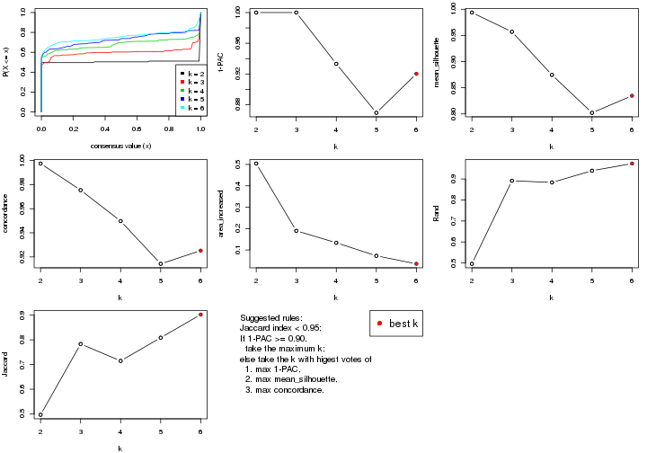

The numeric values for all these statistics can be obtained by `get_stats()`.

```r
get_stats(res)
```

```
#>   k 1-PAC mean_silhouette concordance area_increased  Rand Jaccard
#> 2 2 1.000           0.994       0.997         0.5043 0.496   0.496
#> 3 3 1.000           0.957       0.975         0.1896 0.891   0.783
#> 4 4 0.933           0.875       0.950         0.1336 0.883   0.715
#> 5 5 0.869           0.802       0.914         0.0726 0.939   0.809
#> 6 6 0.920           0.835       0.925         0.0352 0.973   0.902
```

`suggest_best_k()` suggests the best $k$ based on these statistics. The rules are as follows:

- All $k$ with Jaccard index larger than 0.95 are removed because the increase of
  the partition number does not provides enough extra information. If all $k$ are removed,
  the best $k$ is assigned by `NA`.
- For $k$ with 1-PAC larger than 0.9, the maximal $k$ is taken as the "best k". Other $k$ is called "optional k".
- If it does not fit the second rule. The $k$ with the highest vote of highest
  1-PAC, mean silhouette and concordance is taken as the "best k".

```r
suggest_best_k(res)
```

```
#> [1] 6
#> attr(,"optional")
#> [1] 2 3 4
```

There is also optional best $k$ = 2 3 4 that is worth to check.

Following shows the table of the partitions (You need to click the **show/hide
code output** link to see it). The membership matrix (columns with name `p*`)
is inferred by
[`clue::cl_consensus()`](https://www.rdocumentation.org/link/cl_consensus?package=clue)
function with the `SE` method. Basically the value in the membership matrix
represents the probability to belong to a certain group. The finall class
label for an item is determined with the group with highest probability it
belongs to.

In `get_classes()` function, the entropy is calculated from the membership
matrix and the silhouette score is calculated from the consensus matrix.


<script>
$( function() {
	$( '#tabs-ATC-skmeans-get-classes' ).tabs();
} );
</script>
<div id='tabs-ATC-skmeans-get-classes'>
<ul>
<li><a href='#tab-ATC-skmeans-get-classes-1'>k = 2</a></li>
<li><a href='#tab-ATC-skmeans-get-classes-2'>k = 3</a></li>
<li><a href='#tab-ATC-skmeans-get-classes-3'>k = 4</a></li>
<li><a href='#tab-ATC-skmeans-get-classes-4'>k = 5</a></li>
<li><a href='#tab-ATC-skmeans-get-classes-5'>k = 6</a></li>
</ul>

<div id='tab-ATC-skmeans-get-classes-1'>
<p><a id='tab-ATC-skmeans-get-classes-1-a' style='color:#0366d6' href='#'>show/hide code output</a></p>
<pre><code class="r">cbind(get_classes(res, k = 2), get_membership(res, k = 2))
</code></pre>

<pre><code>#&gt;           class entropy silhouette    p1    p2
#&gt; GSM447671     2   0.000      0.995 0.000 1.000
#&gt; GSM447694     1   0.000      1.000 1.000 0.000
#&gt; GSM447618     2   0.000      0.995 0.000 1.000
#&gt; GSM447691     2   0.000      0.995 0.000 1.000
#&gt; GSM447733     1   0.000      1.000 1.000 0.000
#&gt; GSM447620     2   0.000      0.995 0.000 1.000
#&gt; GSM447627     1   0.000      1.000 1.000 0.000
#&gt; GSM447630     1   0.000      1.000 1.000 0.000
#&gt; GSM447642     1   0.000      1.000 1.000 0.000
#&gt; GSM447649     2   0.000      0.995 0.000 1.000
#&gt; GSM447654     2   0.000      0.995 0.000 1.000
#&gt; GSM447655     2   0.000      0.995 0.000 1.000
#&gt; GSM447669     2   0.000      0.995 0.000 1.000
#&gt; GSM447676     1   0.000      1.000 1.000 0.000
#&gt; GSM447678     2   0.000      0.995 0.000 1.000
#&gt; GSM447681     2   0.000      0.995 0.000 1.000
#&gt; GSM447698     2   0.000      0.995 0.000 1.000
#&gt; GSM447713     1   0.000      1.000 1.000 0.000
#&gt; GSM447722     1   0.000      1.000 1.000 0.000
#&gt; GSM447726     2   0.000      0.995 0.000 1.000
#&gt; GSM447735     1   0.000      1.000 1.000 0.000
#&gt; GSM447737     1   0.000      1.000 1.000 0.000
#&gt; GSM447657     2   0.000      0.995 0.000 1.000
#&gt; GSM447674     2   0.000      0.995 0.000 1.000
#&gt; GSM447636     2   0.000      0.995 0.000 1.000
#&gt; GSM447723     1   0.000      1.000 1.000 0.000
#&gt; GSM447699     1   0.000      1.000 1.000 0.000
#&gt; GSM447708     2   0.000      0.995 0.000 1.000
#&gt; GSM447721     1   0.000      1.000 1.000 0.000
#&gt; GSM447623     1   0.000      1.000 1.000 0.000
#&gt; GSM447621     1   0.000      1.000 1.000 0.000
#&gt; GSM447650     2   0.000      0.995 0.000 1.000
#&gt; GSM447651     2   0.000      0.995 0.000 1.000
#&gt; GSM447653     1   0.000      1.000 1.000 0.000
#&gt; GSM447658     2   0.000      0.995 0.000 1.000
#&gt; GSM447675     2   0.913      0.512 0.328 0.672
#&gt; GSM447680     2   0.000      0.995 0.000 1.000
#&gt; GSM447686     2   0.000      0.995 0.000 1.000
#&gt; GSM447736     1   0.000      1.000 1.000 0.000
#&gt; GSM447629     2   0.000      0.995 0.000 1.000
#&gt; GSM447648     1   0.000      1.000 1.000 0.000
#&gt; GSM447660     2   0.000      0.995 0.000 1.000
#&gt; GSM447661     2   0.000      0.995 0.000 1.000
#&gt; GSM447663     1   0.000      1.000 1.000 0.000
#&gt; GSM447704     2   0.000      0.995 0.000 1.000
#&gt; GSM447720     1   0.000      1.000 1.000 0.000
#&gt; GSM447652     2   0.000      0.995 0.000 1.000
#&gt; GSM447679     2   0.000      0.995 0.000 1.000
#&gt; GSM447712     1   0.000      1.000 1.000 0.000
#&gt; GSM447664     2   0.000      0.995 0.000 1.000
#&gt; GSM447637     1   0.000      1.000 1.000 0.000
#&gt; GSM447639     1   0.000      1.000 1.000 0.000
#&gt; GSM447615     1   0.000      1.000 1.000 0.000
#&gt; GSM447656     2   0.000      0.995 0.000 1.000
#&gt; GSM447673     2   0.000      0.995 0.000 1.000
#&gt; GSM447719     1   0.000      1.000 1.000 0.000
#&gt; GSM447706     1   0.000      1.000 1.000 0.000
#&gt; GSM447612     1   0.000      1.000 1.000 0.000
#&gt; GSM447665     2   0.000      0.995 0.000 1.000
#&gt; GSM447677     2   0.000      0.995 0.000 1.000
#&gt; GSM447613     1   0.000      1.000 1.000 0.000
#&gt; GSM447659     1   0.000      1.000 1.000 0.000
#&gt; GSM447662     1   0.000      1.000 1.000 0.000
#&gt; GSM447666     2   0.000      0.995 0.000 1.000
#&gt; GSM447668     2   0.000      0.995 0.000 1.000
#&gt; GSM447682     2   0.000      0.995 0.000 1.000
#&gt; GSM447683     2   0.000      0.995 0.000 1.000
#&gt; GSM447688     2   0.000      0.995 0.000 1.000
#&gt; GSM447702     2   0.000      0.995 0.000 1.000
#&gt; GSM447709     2   0.000      0.995 0.000 1.000
#&gt; GSM447711     1   0.000      1.000 1.000 0.000
#&gt; GSM447715     2   0.000      0.995 0.000 1.000
#&gt; GSM447693     1   0.000      1.000 1.000 0.000
#&gt; GSM447611     2   0.000      0.995 0.000 1.000
#&gt; GSM447672     2   0.000      0.995 0.000 1.000
#&gt; GSM447703     2   0.000      0.995 0.000 1.000
#&gt; GSM447727     1   0.000      1.000 1.000 0.000
#&gt; GSM447638     2   0.000      0.995 0.000 1.000
#&gt; GSM447670     1   0.000      1.000 1.000 0.000
#&gt; GSM447700     1   0.000      1.000 1.000 0.000
#&gt; GSM447738     2   0.000      0.995 0.000 1.000
#&gt; GSM447739     1   0.000      1.000 1.000 0.000
#&gt; GSM447617     1   0.000      1.000 1.000 0.000
#&gt; GSM447628     2   0.000      0.995 0.000 1.000
#&gt; GSM447632     2   0.000      0.995 0.000 1.000
#&gt; GSM447619     1   0.000      1.000 1.000 0.000
#&gt; GSM447643     2   0.000      0.995 0.000 1.000
#&gt; GSM447724     1   0.000      1.000 1.000 0.000
#&gt; GSM447728     2   0.000      0.995 0.000 1.000
#&gt; GSM447610     1   0.000      1.000 1.000 0.000
#&gt; GSM447633     2   0.000      0.995 0.000 1.000
#&gt; GSM447634     1   0.000      1.000 1.000 0.000
#&gt; GSM447622     1   0.000      1.000 1.000 0.000
#&gt; GSM447667     2   0.000      0.995 0.000 1.000
#&gt; GSM447687     2   0.000      0.995 0.000 1.000
#&gt; GSM447695     1   0.000      1.000 1.000 0.000
#&gt; GSM447696     1   0.000      1.000 1.000 0.000
#&gt; GSM447697     1   0.000      1.000 1.000 0.000
#&gt; GSM447714     1   0.000      1.000 1.000 0.000
#&gt; GSM447717     2   0.000      0.995 0.000 1.000
#&gt; GSM447725     1   0.000      1.000 1.000 0.000
#&gt; GSM447729     2   0.000      0.995 0.000 1.000
#&gt; GSM447644     2   0.000      0.995 0.000 1.000
#&gt; GSM447710     1   0.000      1.000 1.000 0.000
#&gt; GSM447614     1   0.000      1.000 1.000 0.000
#&gt; GSM447685     2   0.000      0.995 0.000 1.000
#&gt; GSM447690     1   0.000      1.000 1.000 0.000
#&gt; GSM447730     2   0.000      0.995 0.000 1.000
#&gt; GSM447646     2   0.000      0.995 0.000 1.000
#&gt; GSM447689     1   0.000      1.000 1.000 0.000
#&gt; GSM447635     2   0.000      0.995 0.000 1.000
#&gt; GSM447641     1   0.000      1.000 1.000 0.000
#&gt; GSM447716     2   0.000      0.995 0.000 1.000
#&gt; GSM447718     1   0.000      1.000 1.000 0.000
#&gt; GSM447616     1   0.000      1.000 1.000 0.000
#&gt; GSM447626     1   0.000      1.000 1.000 0.000
#&gt; GSM447640     2   0.000      0.995 0.000 1.000
#&gt; GSM447734     1   0.000      1.000 1.000 0.000
#&gt; GSM447692     1   0.000      1.000 1.000 0.000
#&gt; GSM447647     2   0.000      0.995 0.000 1.000
#&gt; GSM447624     1   0.000      1.000 1.000 0.000
#&gt; GSM447625     1   0.000      1.000 1.000 0.000
#&gt; GSM447707     2   0.000      0.995 0.000 1.000
#&gt; GSM447732     1   0.000      1.000 1.000 0.000
#&gt; GSM447684     1   0.000      1.000 1.000 0.000
#&gt; GSM447731     2   0.000      0.995 0.000 1.000
#&gt; GSM447705     1   0.000      1.000 1.000 0.000
#&gt; GSM447631     1   0.000      1.000 1.000 0.000
#&gt; GSM447701     2   0.000      0.995 0.000 1.000
#&gt; GSM447645     1   0.000      1.000 1.000 0.000
</code></pre>

<script>
$('#tab-ATC-skmeans-get-classes-1-a').parent().next().next().hide();
$('#tab-ATC-skmeans-get-classes-1-a').click(function(){
  $('#tab-ATC-skmeans-get-classes-1-a').parent().next().next().toggle();
  return(false);
});
</script>
</div>

<div id='tab-ATC-skmeans-get-classes-2'>
<p><a id='tab-ATC-skmeans-get-classes-2-a' style='color:#0366d6' href='#'>show/hide code output</a></p>
<pre><code class="r">cbind(get_classes(res, k = 3), get_membership(res, k = 3))
</code></pre>

<pre><code>#&gt;           class entropy silhouette    p1    p2    p3
#&gt; GSM447671     2  0.1860      0.952 0.000 0.948 0.052
#&gt; GSM447694     1  0.0000      0.986 1.000 0.000 0.000
#&gt; GSM447618     2  0.1289      0.967 0.000 0.968 0.032
#&gt; GSM447691     2  0.1860      0.952 0.000 0.948 0.052
#&gt; GSM447733     3  0.1860      0.869 0.052 0.000 0.948
#&gt; GSM447620     2  0.0000      0.989 0.000 1.000 0.000
#&gt; GSM447627     1  0.0000      0.986 1.000 0.000 0.000
#&gt; GSM447630     1  0.2599      0.925 0.932 0.016 0.052
#&gt; GSM447642     1  0.0000      0.986 1.000 0.000 0.000
#&gt; GSM447649     2  0.0000      0.989 0.000 1.000 0.000
#&gt; GSM447654     3  0.1860      0.906 0.000 0.052 0.948
#&gt; GSM447655     2  0.0000      0.989 0.000 1.000 0.000
#&gt; GSM447669     2  0.1860      0.952 0.000 0.948 0.052
#&gt; GSM447676     1  0.0000      0.986 1.000 0.000 0.000
#&gt; GSM447678     3  0.2261      0.902 0.000 0.068 0.932
#&gt; GSM447681     2  0.0000      0.989 0.000 1.000 0.000
#&gt; GSM447698     2  0.0000      0.989 0.000 1.000 0.000
#&gt; GSM447713     1  0.0000      0.986 1.000 0.000 0.000
#&gt; GSM447722     1  0.4842      0.700 0.776 0.000 0.224
#&gt; GSM447726     2  0.1860      0.952 0.000 0.948 0.052
#&gt; GSM447735     1  0.0000      0.986 1.000 0.000 0.000
#&gt; GSM447737     1  0.0000      0.986 1.000 0.000 0.000
#&gt; GSM447657     2  0.0000      0.989 0.000 1.000 0.000
#&gt; GSM447674     2  0.0000      0.989 0.000 1.000 0.000
#&gt; GSM447636     2  0.0000      0.989 0.000 1.000 0.000
#&gt; GSM447723     1  0.0000      0.986 1.000 0.000 0.000
#&gt; GSM447699     1  0.0000      0.986 1.000 0.000 0.000
#&gt; GSM447708     2  0.0000      0.989 0.000 1.000 0.000
#&gt; GSM447721     1  0.0000      0.986 1.000 0.000 0.000
#&gt; GSM447623     1  0.0000      0.986 1.000 0.000 0.000
#&gt; GSM447621     1  0.0000      0.986 1.000 0.000 0.000
#&gt; GSM447650     2  0.0000      0.989 0.000 1.000 0.000
#&gt; GSM447651     2  0.0000      0.989 0.000 1.000 0.000
#&gt; GSM447653     3  0.4702      0.710 0.212 0.000 0.788
#&gt; GSM447658     3  0.5291      0.680 0.000 0.268 0.732
#&gt; GSM447675     3  0.2063      0.902 0.008 0.044 0.948
#&gt; GSM447680     2  0.0000      0.989 0.000 1.000 0.000
#&gt; GSM447686     2  0.0000      0.989 0.000 1.000 0.000
#&gt; GSM447736     1  0.0000      0.986 1.000 0.000 0.000
#&gt; GSM447629     2  0.0000      0.989 0.000 1.000 0.000
#&gt; GSM447648     1  0.0000      0.986 1.000 0.000 0.000
#&gt; GSM447660     3  0.5363      0.613 0.000 0.276 0.724
#&gt; GSM447661     2  0.0000      0.989 0.000 1.000 0.000
#&gt; GSM447663     1  0.0747      0.974 0.984 0.000 0.016
#&gt; GSM447704     2  0.0000      0.989 0.000 1.000 0.000
#&gt; GSM447720     1  0.0747      0.974 0.984 0.000 0.016
#&gt; GSM447652     2  0.0000      0.989 0.000 1.000 0.000
#&gt; GSM447679     2  0.0000      0.989 0.000 1.000 0.000
#&gt; GSM447712     1  0.0000      0.986 1.000 0.000 0.000
#&gt; GSM447664     3  0.2261      0.902 0.000 0.068 0.932
#&gt; GSM447637     1  0.0000      0.986 1.000 0.000 0.000
#&gt; GSM447639     1  0.0000      0.986 1.000 0.000 0.000
#&gt; GSM447615     1  0.0000      0.986 1.000 0.000 0.000
#&gt; GSM447656     2  0.0000      0.989 0.000 1.000 0.000
#&gt; GSM447673     2  0.0000      0.989 0.000 1.000 0.000
#&gt; GSM447719     3  0.6235      0.237 0.436 0.000 0.564
#&gt; GSM447706     1  0.0000      0.986 1.000 0.000 0.000
#&gt; GSM447612     1  0.0000      0.986 1.000 0.000 0.000
#&gt; GSM447665     2  0.0892      0.976 0.000 0.980 0.020
#&gt; GSM447677     2  0.0000      0.989 0.000 1.000 0.000
#&gt; GSM447613     1  0.0000      0.986 1.000 0.000 0.000
#&gt; GSM447659     1  0.3340      0.856 0.880 0.000 0.120
#&gt; GSM447662     1  0.0000      0.986 1.000 0.000 0.000
#&gt; GSM447666     2  0.1860      0.952 0.000 0.948 0.052
#&gt; GSM447668     2  0.0000      0.989 0.000 1.000 0.000
#&gt; GSM447682     2  0.0000      0.989 0.000 1.000 0.000
#&gt; GSM447683     2  0.0000      0.989 0.000 1.000 0.000
#&gt; GSM447688     3  0.2537      0.896 0.000 0.080 0.920
#&gt; GSM447702     2  0.0000      0.989 0.000 1.000 0.000
#&gt; GSM447709     2  0.0000      0.989 0.000 1.000 0.000
#&gt; GSM447711     1  0.0000      0.986 1.000 0.000 0.000
#&gt; GSM447715     2  0.1860      0.952 0.000 0.948 0.052
#&gt; GSM447693     1  0.0000      0.986 1.000 0.000 0.000
#&gt; GSM447611     3  0.1860      0.906 0.000 0.052 0.948
#&gt; GSM447672     2  0.0000      0.989 0.000 1.000 0.000
#&gt; GSM447703     2  0.0000      0.989 0.000 1.000 0.000
#&gt; GSM447727     1  0.0747      0.974 0.984 0.000 0.016
#&gt; GSM447638     2  0.0000      0.989 0.000 1.000 0.000
#&gt; GSM447670     1  0.0000      0.986 1.000 0.000 0.000
#&gt; GSM447700     1  0.1860      0.942 0.948 0.000 0.052
#&gt; GSM447738     2  0.0000      0.989 0.000 1.000 0.000
#&gt; GSM447739     1  0.0000      0.986 1.000 0.000 0.000
#&gt; GSM447617     1  0.0000      0.986 1.000 0.000 0.000
#&gt; GSM447628     3  0.1860      0.906 0.000 0.052 0.948
#&gt; GSM447632     2  0.0000      0.989 0.000 1.000 0.000
#&gt; GSM447619     1  0.0000      0.986 1.000 0.000 0.000
#&gt; GSM447643     2  0.0000      0.989 0.000 1.000 0.000
#&gt; GSM447724     1  0.0000      0.986 1.000 0.000 0.000
#&gt; GSM447728     2  0.0000      0.989 0.000 1.000 0.000
#&gt; GSM447610     1  0.0000      0.986 1.000 0.000 0.000
#&gt; GSM447633     2  0.1860      0.952 0.000 0.948 0.052
#&gt; GSM447634     1  0.0000      0.986 1.000 0.000 0.000
#&gt; GSM447622     1  0.0000      0.986 1.000 0.000 0.000
#&gt; GSM447667     2  0.0000      0.989 0.000 1.000 0.000
#&gt; GSM447687     2  0.0000      0.989 0.000 1.000 0.000
#&gt; GSM447695     1  0.0000      0.986 1.000 0.000 0.000
#&gt; GSM447696     1  0.0000      0.986 1.000 0.000 0.000
#&gt; GSM447697     1  0.0000      0.986 1.000 0.000 0.000
#&gt; GSM447714     1  0.0000      0.986 1.000 0.000 0.000
#&gt; GSM447717     2  0.0000      0.989 0.000 1.000 0.000
#&gt; GSM447725     1  0.0000      0.986 1.000 0.000 0.000
#&gt; GSM447729     3  0.1860      0.906 0.000 0.052 0.948
#&gt; GSM447644     2  0.1860      0.952 0.000 0.948 0.052
#&gt; GSM447710     1  0.0000      0.986 1.000 0.000 0.000
#&gt; GSM447614     1  0.0000      0.986 1.000 0.000 0.000
#&gt; GSM447685     2  0.0000      0.989 0.000 1.000 0.000
#&gt; GSM447690     1  0.0000      0.986 1.000 0.000 0.000
#&gt; GSM447730     2  0.0000      0.989 0.000 1.000 0.000
#&gt; GSM447646     3  0.1860      0.906 0.000 0.052 0.948
#&gt; GSM447689     1  0.0747      0.974 0.984 0.000 0.016
#&gt; GSM447635     2  0.1860      0.952 0.000 0.948 0.052
#&gt; GSM447641     1  0.0000      0.986 1.000 0.000 0.000
#&gt; GSM447716     2  0.0000      0.989 0.000 1.000 0.000
#&gt; GSM447718     1  0.0000      0.986 1.000 0.000 0.000
#&gt; GSM447616     1  0.0000      0.986 1.000 0.000 0.000
#&gt; GSM447626     1  0.0747      0.974 0.984 0.000 0.016
#&gt; GSM447640     2  0.0000      0.989 0.000 1.000 0.000
#&gt; GSM447734     1  0.0000      0.986 1.000 0.000 0.000
#&gt; GSM447692     1  0.0000      0.986 1.000 0.000 0.000
#&gt; GSM447647     3  0.2537      0.896 0.000 0.080 0.920
#&gt; GSM447624     1  0.0000      0.986 1.000 0.000 0.000
#&gt; GSM447625     1  0.0000      0.986 1.000 0.000 0.000
#&gt; GSM447707     2  0.0000      0.989 0.000 1.000 0.000
#&gt; GSM447732     1  0.0000      0.986 1.000 0.000 0.000
#&gt; GSM447684     1  0.5207      0.768 0.824 0.124 0.052
#&gt; GSM447731     3  0.1860      0.906 0.000 0.052 0.948
#&gt; GSM447705     1  0.1860      0.942 0.948 0.000 0.052
#&gt; GSM447631     1  0.0000      0.986 1.000 0.000 0.000
#&gt; GSM447701     2  0.0000      0.989 0.000 1.000 0.000
#&gt; GSM447645     1  0.0000      0.986 1.000 0.000 0.000
</code></pre>

<script>
$('#tab-ATC-skmeans-get-classes-2-a').parent().next().next().hide();
$('#tab-ATC-skmeans-get-classes-2-a').click(function(){
  $('#tab-ATC-skmeans-get-classes-2-a').parent().next().next().toggle();
  return(false);
});
</script>
</div>

<div id='tab-ATC-skmeans-get-classes-3'>
<p><a id='tab-ATC-skmeans-get-classes-3-a' style='color:#0366d6' href='#'>show/hide code output</a></p>
<pre><code class="r">cbind(get_classes(res, k = 4), get_membership(res, k = 4))
</code></pre>

<pre><code>#&gt;           class entropy silhouette    p1    p2    p3    p4
#&gt; GSM447671     1  0.3266     0.5936 0.832 0.168 0.000 0.000
#&gt; GSM447694     3  0.0000     0.9864 0.000 0.000 1.000 0.000
#&gt; GSM447618     2  0.3688     0.7237 0.208 0.792 0.000 0.000
#&gt; GSM447691     1  0.1118     0.7168 0.964 0.036 0.000 0.000
#&gt; GSM447733     4  0.0336     0.7780 0.000 0.000 0.008 0.992
#&gt; GSM447620     2  0.0000     0.9863 0.000 1.000 0.000 0.000
#&gt; GSM447627     3  0.0000     0.9864 0.000 0.000 1.000 0.000
#&gt; GSM447630     1  0.0000     0.7117 1.000 0.000 0.000 0.000
#&gt; GSM447642     3  0.1022     0.9588 0.032 0.000 0.968 0.000
#&gt; GSM447649     2  0.0000     0.9863 0.000 1.000 0.000 0.000
#&gt; GSM447654     4  0.0000     0.7825 0.000 0.000 0.000 1.000
#&gt; GSM447655     2  0.0000     0.9863 0.000 1.000 0.000 0.000
#&gt; GSM447669     1  0.1940     0.6983 0.924 0.076 0.000 0.000
#&gt; GSM447676     3  0.0000     0.9864 0.000 0.000 1.000 0.000
#&gt; GSM447678     4  0.2530     0.7299 0.000 0.112 0.000 0.888
#&gt; GSM447681     2  0.0000     0.9863 0.000 1.000 0.000 0.000
#&gt; GSM447698     2  0.0000     0.9863 0.000 1.000 0.000 0.000
#&gt; GSM447713     3  0.0000     0.9864 0.000 0.000 1.000 0.000
#&gt; GSM447722     3  0.4840     0.6242 0.028 0.000 0.732 0.240
#&gt; GSM447726     1  0.2081     0.6949 0.916 0.084 0.000 0.000
#&gt; GSM447735     3  0.0000     0.9864 0.000 0.000 1.000 0.000
#&gt; GSM447737     3  0.0000     0.9864 0.000 0.000 1.000 0.000
#&gt; GSM447657     2  0.0000     0.9863 0.000 1.000 0.000 0.000
#&gt; GSM447674     2  0.0000     0.9863 0.000 1.000 0.000 0.000
#&gt; GSM447636     2  0.0000     0.9863 0.000 1.000 0.000 0.000
#&gt; GSM447723     3  0.1792     0.9223 0.068 0.000 0.932 0.000
#&gt; GSM447699     3  0.0000     0.9864 0.000 0.000 1.000 0.000
#&gt; GSM447708     2  0.0000     0.9863 0.000 1.000 0.000 0.000
#&gt; GSM447721     3  0.0000     0.9864 0.000 0.000 1.000 0.000
#&gt; GSM447623     3  0.0000     0.9864 0.000 0.000 1.000 0.000
#&gt; GSM447621     3  0.0000     0.9864 0.000 0.000 1.000 0.000
#&gt; GSM447650     2  0.0000     0.9863 0.000 1.000 0.000 0.000
#&gt; GSM447651     2  0.0000     0.9863 0.000 1.000 0.000 0.000
#&gt; GSM447653     4  0.1637     0.7320 0.000 0.000 0.060 0.940
#&gt; GSM447658     4  0.5998     0.5438 0.088 0.248 0.000 0.664
#&gt; GSM447675     4  0.0000     0.7825 0.000 0.000 0.000 1.000
#&gt; GSM447680     2  0.0000     0.9863 0.000 1.000 0.000 0.000
#&gt; GSM447686     2  0.0000     0.9863 0.000 1.000 0.000 0.000
#&gt; GSM447736     3  0.0000     0.9864 0.000 0.000 1.000 0.000
#&gt; GSM447629     2  0.0000     0.9863 0.000 1.000 0.000 0.000
#&gt; GSM447648     3  0.0000     0.9864 0.000 0.000 1.000 0.000
#&gt; GSM447660     1  0.5924     0.1065 0.556 0.040 0.000 0.404
#&gt; GSM447661     2  0.0000     0.9863 0.000 1.000 0.000 0.000
#&gt; GSM447663     1  0.4972     0.2922 0.544 0.000 0.456 0.000
#&gt; GSM447704     2  0.0000     0.9863 0.000 1.000 0.000 0.000
#&gt; GSM447720     1  0.4948     0.3306 0.560 0.000 0.440 0.000
#&gt; GSM447652     2  0.0000     0.9863 0.000 1.000 0.000 0.000
#&gt; GSM447679     2  0.0000     0.9863 0.000 1.000 0.000 0.000
#&gt; GSM447712     3  0.0000     0.9864 0.000 0.000 1.000 0.000
#&gt; GSM447664     4  0.3873     0.6479 0.000 0.228 0.000 0.772
#&gt; GSM447637     3  0.0000     0.9864 0.000 0.000 1.000 0.000
#&gt; GSM447639     3  0.0000     0.9864 0.000 0.000 1.000 0.000
#&gt; GSM447615     3  0.0469     0.9778 0.012 0.000 0.988 0.000
#&gt; GSM447656     2  0.0000     0.9863 0.000 1.000 0.000 0.000
#&gt; GSM447673     2  0.0000     0.9863 0.000 1.000 0.000 0.000
#&gt; GSM447719     4  0.4994     0.0272 0.000 0.000 0.480 0.520
#&gt; GSM447706     3  0.0336     0.9810 0.008 0.000 0.992 0.000
#&gt; GSM447612     3  0.0469     0.9769 0.012 0.000 0.988 0.000
#&gt; GSM447665     2  0.4164     0.6335 0.264 0.736 0.000 0.000
#&gt; GSM447677     2  0.0000     0.9863 0.000 1.000 0.000 0.000
#&gt; GSM447613     3  0.0336     0.9810 0.008 0.000 0.992 0.000
#&gt; GSM447659     3  0.0000     0.9864 0.000 0.000 1.000 0.000
#&gt; GSM447662     3  0.0188     0.9838 0.004 0.000 0.996 0.000
#&gt; GSM447666     1  0.1022     0.7174 0.968 0.032 0.000 0.000
#&gt; GSM447668     2  0.0000     0.9863 0.000 1.000 0.000 0.000
#&gt; GSM447682     2  0.0000     0.9863 0.000 1.000 0.000 0.000
#&gt; GSM447683     2  0.0000     0.9863 0.000 1.000 0.000 0.000
#&gt; GSM447688     4  0.4941     0.3367 0.000 0.436 0.000 0.564
#&gt; GSM447702     2  0.0000     0.9863 0.000 1.000 0.000 0.000
#&gt; GSM447709     2  0.0000     0.9863 0.000 1.000 0.000 0.000
#&gt; GSM447711     3  0.0336     0.9810 0.008 0.000 0.992 0.000
#&gt; GSM447715     1  0.1792     0.7035 0.932 0.068 0.000 0.000
#&gt; GSM447693     3  0.0000     0.9864 0.000 0.000 1.000 0.000
#&gt; GSM447611     4  0.0000     0.7825 0.000 0.000 0.000 1.000
#&gt; GSM447672     2  0.0000     0.9863 0.000 1.000 0.000 0.000
#&gt; GSM447703     2  0.0000     0.9863 0.000 1.000 0.000 0.000
#&gt; GSM447727     1  0.4989     0.2429 0.528 0.000 0.472 0.000
#&gt; GSM447638     2  0.0000     0.9863 0.000 1.000 0.000 0.000
#&gt; GSM447670     3  0.0921     0.9628 0.028 0.000 0.972 0.000
#&gt; GSM447700     1  0.0000     0.7117 1.000 0.000 0.000 0.000
#&gt; GSM447738     2  0.0000     0.9863 0.000 1.000 0.000 0.000
#&gt; GSM447739     3  0.0000     0.9864 0.000 0.000 1.000 0.000
#&gt; GSM447617     3  0.0000     0.9864 0.000 0.000 1.000 0.000
#&gt; GSM447628     4  0.0000     0.7825 0.000 0.000 0.000 1.000
#&gt; GSM447632     2  0.0000     0.9863 0.000 1.000 0.000 0.000
#&gt; GSM447619     3  0.0188     0.9838 0.004 0.000 0.996 0.000
#&gt; GSM447643     2  0.0000     0.9863 0.000 1.000 0.000 0.000
#&gt; GSM447724     3  0.0000     0.9864 0.000 0.000 1.000 0.000
#&gt; GSM447728     2  0.0000     0.9863 0.000 1.000 0.000 0.000
#&gt; GSM447610     3  0.0000     0.9864 0.000 0.000 1.000 0.000
#&gt; GSM447633     1  0.1940     0.6983 0.924 0.076 0.000 0.000
#&gt; GSM447634     3  0.0000     0.9864 0.000 0.000 1.000 0.000
#&gt; GSM447622     3  0.0000     0.9864 0.000 0.000 1.000 0.000
#&gt; GSM447667     2  0.0000     0.9863 0.000 1.000 0.000 0.000
#&gt; GSM447687     2  0.0000     0.9863 0.000 1.000 0.000 0.000
#&gt; GSM447695     3  0.0000     0.9864 0.000 0.000 1.000 0.000
#&gt; GSM447696     3  0.0000     0.9864 0.000 0.000 1.000 0.000
#&gt; GSM447697     3  0.0000     0.9864 0.000 0.000 1.000 0.000
#&gt; GSM447714     3  0.0000     0.9864 0.000 0.000 1.000 0.000
#&gt; GSM447717     2  0.1211     0.9413 0.040 0.960 0.000 0.000
#&gt; GSM447725     3  0.0000     0.9864 0.000 0.000 1.000 0.000
#&gt; GSM447729     4  0.0000     0.7825 0.000 0.000 0.000 1.000
#&gt; GSM447644     1  0.1557     0.7103 0.944 0.056 0.000 0.000
#&gt; GSM447710     3  0.0000     0.9864 0.000 0.000 1.000 0.000
#&gt; GSM447614     3  0.0000     0.9864 0.000 0.000 1.000 0.000
#&gt; GSM447685     2  0.0000     0.9863 0.000 1.000 0.000 0.000
#&gt; GSM447690     3  0.0000     0.9864 0.000 0.000 1.000 0.000
#&gt; GSM447730     2  0.0000     0.9863 0.000 1.000 0.000 0.000
#&gt; GSM447646     4  0.0000     0.7825 0.000 0.000 0.000 1.000
#&gt; GSM447689     1  0.4955     0.3218 0.556 0.000 0.444 0.000
#&gt; GSM447635     1  0.0707     0.7165 0.980 0.020 0.000 0.000
#&gt; GSM447641     3  0.1940     0.9096 0.076 0.000 0.924 0.000
#&gt; GSM447716     2  0.0000     0.9863 0.000 1.000 0.000 0.000
#&gt; GSM447718     3  0.2281     0.8880 0.096 0.000 0.904 0.000
#&gt; GSM447616     3  0.0000     0.9864 0.000 0.000 1.000 0.000
#&gt; GSM447626     1  0.4967     0.3022 0.548 0.000 0.452 0.000
#&gt; GSM447640     2  0.0000     0.9863 0.000 1.000 0.000 0.000
#&gt; GSM447734     3  0.0000     0.9864 0.000 0.000 1.000 0.000
#&gt; GSM447692     3  0.0000     0.9864 0.000 0.000 1.000 0.000
#&gt; GSM447647     4  0.4898     0.3883 0.000 0.416 0.000 0.584
#&gt; GSM447624     3  0.0000     0.9864 0.000 0.000 1.000 0.000
#&gt; GSM447625     3  0.0000     0.9864 0.000 0.000 1.000 0.000
#&gt; GSM447707     2  0.0000     0.9863 0.000 1.000 0.000 0.000
#&gt; GSM447732     3  0.0000     0.9864 0.000 0.000 1.000 0.000
#&gt; GSM447684     1  0.0000     0.7117 1.000 0.000 0.000 0.000
#&gt; GSM447731     4  0.0000     0.7825 0.000 0.000 0.000 1.000
#&gt; GSM447705     1  0.0000     0.7117 1.000 0.000 0.000 0.000
#&gt; GSM447631     3  0.0000     0.9864 0.000 0.000 1.000 0.000
#&gt; GSM447701     2  0.0000     0.9863 0.000 1.000 0.000 0.000
#&gt; GSM447645     3  0.0000     0.9864 0.000 0.000 1.000 0.000
</code></pre>

<script>
$('#tab-ATC-skmeans-get-classes-3-a').parent().next().next().hide();
$('#tab-ATC-skmeans-get-classes-3-a').click(function(){
  $('#tab-ATC-skmeans-get-classes-3-a').parent().next().next().toggle();
  return(false);
});
</script>
</div>

<div id='tab-ATC-skmeans-get-classes-4'>
<p><a id='tab-ATC-skmeans-get-classes-4-a' style='color:#0366d6' href='#'>show/hide code output</a></p>
<pre><code class="r">cbind(get_classes(res, k = 5), get_membership(res, k = 5))
</code></pre>

<pre><code>#&gt;           class entropy silhouette    p1    p2    p3    p4    p5
#&gt; GSM447671     5  0.1121     0.7664 0.000 0.044 0.000 0.000 0.956
#&gt; GSM447694     3  0.0000     0.9119 0.000 0.000 1.000 0.000 0.000
#&gt; GSM447618     5  0.4126     0.4212 0.000 0.380 0.000 0.000 0.620
#&gt; GSM447691     5  0.0324     0.7755 0.004 0.004 0.000 0.000 0.992
#&gt; GSM447733     4  0.0404     0.8241 0.000 0.000 0.012 0.988 0.000
#&gt; GSM447620     2  0.0000     0.9884 0.000 1.000 0.000 0.000 0.000
#&gt; GSM447627     3  0.0162     0.9107 0.004 0.000 0.996 0.000 0.000
#&gt; GSM447630     1  0.4182     0.3671 0.600 0.000 0.000 0.000 0.400
#&gt; GSM447642     1  0.4562    -0.1730 0.500 0.000 0.492 0.000 0.008
#&gt; GSM447649     2  0.0000     0.9884 0.000 1.000 0.000 0.000 0.000
#&gt; GSM447654     4  0.0000     0.8335 0.000 0.000 0.000 1.000 0.000
#&gt; GSM447655     2  0.0000     0.9884 0.000 1.000 0.000 0.000 0.000
#&gt; GSM447669     5  0.0404     0.7776 0.000 0.012 0.000 0.000 0.988
#&gt; GSM447676     3  0.3160     0.7374 0.188 0.000 0.808 0.000 0.004
#&gt; GSM447678     4  0.1845     0.7918 0.000 0.016 0.000 0.928 0.056
#&gt; GSM447681     2  0.0000     0.9884 0.000 1.000 0.000 0.000 0.000
#&gt; GSM447698     2  0.0000     0.9884 0.000 1.000 0.000 0.000 0.000
#&gt; GSM447713     3  0.0162     0.9107 0.004 0.000 0.996 0.000 0.000
#&gt; GSM447722     3  0.6210    -0.0106 0.360 0.000 0.492 0.148 0.000
#&gt; GSM447726     5  0.3876     0.5763 0.032 0.192 0.000 0.000 0.776
#&gt; GSM447735     3  0.0162     0.9107 0.004 0.000 0.996 0.000 0.000
#&gt; GSM447737     3  0.0000     0.9119 0.000 0.000 1.000 0.000 0.000
#&gt; GSM447657     2  0.0000     0.9884 0.000 1.000 0.000 0.000 0.000
#&gt; GSM447674     2  0.0000     0.9884 0.000 1.000 0.000 0.000 0.000
#&gt; GSM447636     2  0.0162     0.9846 0.004 0.996 0.000 0.000 0.000
#&gt; GSM447723     1  0.2690     0.6015 0.844 0.000 0.156 0.000 0.000
#&gt; GSM447699     3  0.0000     0.9119 0.000 0.000 1.000 0.000 0.000
#&gt; GSM447708     2  0.0000     0.9884 0.000 1.000 0.000 0.000 0.000
#&gt; GSM447721     3  0.0000     0.9119 0.000 0.000 1.000 0.000 0.000
#&gt; GSM447623     3  0.0000     0.9119 0.000 0.000 1.000 0.000 0.000
#&gt; GSM447621     3  0.0000     0.9119 0.000 0.000 1.000 0.000 0.000
#&gt; GSM447650     2  0.0000     0.9884 0.000 1.000 0.000 0.000 0.000
#&gt; GSM447651     2  0.0000     0.9884 0.000 1.000 0.000 0.000 0.000
#&gt; GSM447653     4  0.2338     0.7012 0.004 0.000 0.112 0.884 0.000
#&gt; GSM447658     5  0.7010     0.2073 0.396 0.024 0.000 0.176 0.404
#&gt; GSM447675     4  0.0000     0.8335 0.000 0.000 0.000 1.000 0.000
#&gt; GSM447680     2  0.0000     0.9884 0.000 1.000 0.000 0.000 0.000
#&gt; GSM447686     2  0.0000     0.9884 0.000 1.000 0.000 0.000 0.000
#&gt; GSM447736     3  0.0000     0.9119 0.000 0.000 1.000 0.000 0.000
#&gt; GSM447629     2  0.0290     0.9802 0.000 0.992 0.000 0.000 0.008
#&gt; GSM447648     3  0.0000     0.9119 0.000 0.000 1.000 0.000 0.000
#&gt; GSM447660     5  0.3039     0.6606 0.192 0.000 0.000 0.000 0.808
#&gt; GSM447661     2  0.0000     0.9884 0.000 1.000 0.000 0.000 0.000
#&gt; GSM447663     1  0.3710     0.6677 0.808 0.000 0.048 0.000 0.144
#&gt; GSM447704     2  0.0000     0.9884 0.000 1.000 0.000 0.000 0.000
#&gt; GSM447720     1  0.3649     0.6650 0.808 0.000 0.040 0.000 0.152
#&gt; GSM447652     2  0.0162     0.9844 0.000 0.996 0.000 0.004 0.000
#&gt; GSM447679     2  0.0000     0.9884 0.000 1.000 0.000 0.000 0.000
#&gt; GSM447712     3  0.1851     0.8429 0.088 0.000 0.912 0.000 0.000
#&gt; GSM447664     4  0.3730     0.5538 0.000 0.288 0.000 0.712 0.000
#&gt; GSM447637     3  0.0000     0.9119 0.000 0.000 1.000 0.000 0.000
#&gt; GSM447639     3  0.0162     0.9107 0.004 0.000 0.996 0.000 0.000
#&gt; GSM447615     3  0.4397     0.2873 0.432 0.000 0.564 0.000 0.004
#&gt; GSM447656     2  0.0000     0.9884 0.000 1.000 0.000 0.000 0.000
#&gt; GSM447673     2  0.0000     0.9884 0.000 1.000 0.000 0.000 0.000
#&gt; GSM447719     3  0.4276     0.4185 0.004 0.000 0.616 0.380 0.000
#&gt; GSM447706     3  0.3913     0.4971 0.324 0.000 0.676 0.000 0.000
#&gt; GSM447612     3  0.3966     0.4385 0.336 0.000 0.664 0.000 0.000
#&gt; GSM447665     5  0.3074     0.6406 0.000 0.196 0.000 0.000 0.804
#&gt; GSM447677     2  0.0000     0.9884 0.000 1.000 0.000 0.000 0.000
#&gt; GSM447613     3  0.4015     0.4544 0.348 0.000 0.652 0.000 0.000
#&gt; GSM447659     3  0.0162     0.9107 0.004 0.000 0.996 0.000 0.000
#&gt; GSM447662     3  0.1908     0.8369 0.092 0.000 0.908 0.000 0.000
#&gt; GSM447666     5  0.0324     0.7755 0.004 0.004 0.000 0.000 0.992
#&gt; GSM447668     2  0.0000     0.9884 0.000 1.000 0.000 0.000 0.000
#&gt; GSM447682     2  0.0000     0.9884 0.000 1.000 0.000 0.000 0.000
#&gt; GSM447683     2  0.0000     0.9884 0.000 1.000 0.000 0.000 0.000
#&gt; GSM447688     4  0.4088     0.4641 0.000 0.368 0.000 0.632 0.000
#&gt; GSM447702     2  0.0000     0.9884 0.000 1.000 0.000 0.000 0.000
#&gt; GSM447709     2  0.0000     0.9884 0.000 1.000 0.000 0.000 0.000
#&gt; GSM447711     3  0.3876     0.5157 0.316 0.000 0.684 0.000 0.000
#&gt; GSM447715     1  0.6351     0.2334 0.500 0.184 0.000 0.000 0.316
#&gt; GSM447693     3  0.0000     0.9119 0.000 0.000 1.000 0.000 0.000
#&gt; GSM447611     4  0.0000     0.8335 0.000 0.000 0.000 1.000 0.000
#&gt; GSM447672     2  0.0000     0.9884 0.000 1.000 0.000 0.000 0.000
#&gt; GSM447703     2  0.0000     0.9884 0.000 1.000 0.000 0.000 0.000
#&gt; GSM447727     1  0.3141     0.6591 0.852 0.000 0.040 0.000 0.108
#&gt; GSM447638     2  0.0000     0.9884 0.000 1.000 0.000 0.000 0.000
#&gt; GSM447670     3  0.4397     0.2750 0.432 0.000 0.564 0.000 0.004
#&gt; GSM447700     1  0.4307     0.1372 0.504 0.000 0.000 0.000 0.496
#&gt; GSM447738     2  0.0000     0.9884 0.000 1.000 0.000 0.000 0.000
#&gt; GSM447739     3  0.0162     0.9107 0.004 0.000 0.996 0.000 0.000
#&gt; GSM447617     3  0.0000     0.9119 0.000 0.000 1.000 0.000 0.000
#&gt; GSM447628     4  0.0000     0.8335 0.000 0.000 0.000 1.000 0.000
#&gt; GSM447632     2  0.0000     0.9884 0.000 1.000 0.000 0.000 0.000
#&gt; GSM447619     3  0.1792     0.8437 0.084 0.000 0.916 0.000 0.000
#&gt; GSM447643     2  0.0000     0.9884 0.000 1.000 0.000 0.000 0.000
#&gt; GSM447724     3  0.0162     0.9107 0.004 0.000 0.996 0.000 0.000
#&gt; GSM447728     2  0.0000     0.9884 0.000 1.000 0.000 0.000 0.000
#&gt; GSM447610     3  0.0162     0.9107 0.004 0.000 0.996 0.000 0.000
#&gt; GSM447633     5  0.0290     0.7774 0.000 0.008 0.000 0.000 0.992
#&gt; GSM447634     3  0.0000     0.9119 0.000 0.000 1.000 0.000 0.000
#&gt; GSM447622     3  0.0000     0.9119 0.000 0.000 1.000 0.000 0.000
#&gt; GSM447667     2  0.0000     0.9884 0.000 1.000 0.000 0.000 0.000
#&gt; GSM447687     2  0.0000     0.9884 0.000 1.000 0.000 0.000 0.000
#&gt; GSM447695     3  0.0000     0.9119 0.000 0.000 1.000 0.000 0.000
#&gt; GSM447696     3  0.0162     0.9107 0.004 0.000 0.996 0.000 0.000
#&gt; GSM447697     3  0.0000     0.9119 0.000 0.000 1.000 0.000 0.000
#&gt; GSM447714     3  0.0000     0.9119 0.000 0.000 1.000 0.000 0.000
#&gt; GSM447717     2  0.4473     0.3242 0.412 0.580 0.000 0.000 0.008
#&gt; GSM447725     3  0.1792     0.8533 0.084 0.000 0.916 0.000 0.000
#&gt; GSM447729     4  0.0000     0.8335 0.000 0.000 0.000 1.000 0.000
#&gt; GSM447644     5  0.0324     0.7755 0.004 0.004 0.000 0.000 0.992
#&gt; GSM447710     3  0.0000     0.9119 0.000 0.000 1.000 0.000 0.000
#&gt; GSM447614     3  0.0162     0.9107 0.004 0.000 0.996 0.000 0.000
#&gt; GSM447685     2  0.0000     0.9884 0.000 1.000 0.000 0.000 0.000
#&gt; GSM447690     3  0.0162     0.9107 0.004 0.000 0.996 0.000 0.000
#&gt; GSM447730     2  0.0000     0.9884 0.000 1.000 0.000 0.000 0.000
#&gt; GSM447646     4  0.0000     0.8335 0.000 0.000 0.000 1.000 0.000
#&gt; GSM447689     1  0.3521     0.6675 0.820 0.000 0.040 0.000 0.140
#&gt; GSM447635     5  0.0000     0.7715 0.000 0.000 0.000 0.000 1.000
#&gt; GSM447641     1  0.4562    -0.1730 0.500 0.000 0.492 0.000 0.008
#&gt; GSM447716     2  0.0000     0.9884 0.000 1.000 0.000 0.000 0.000
#&gt; GSM447718     1  0.2843     0.6108 0.848 0.000 0.144 0.000 0.008
#&gt; GSM447616     3  0.0000     0.9119 0.000 0.000 1.000 0.000 0.000
#&gt; GSM447626     1  0.3551     0.6684 0.820 0.000 0.044 0.000 0.136
#&gt; GSM447640     2  0.0000     0.9884 0.000 1.000 0.000 0.000 0.000
#&gt; GSM447734     3  0.0000     0.9119 0.000 0.000 1.000 0.000 0.000
#&gt; GSM447692     3  0.0000     0.9119 0.000 0.000 1.000 0.000 0.000
#&gt; GSM447647     4  0.4114     0.4533 0.000 0.376 0.000 0.624 0.000
#&gt; GSM447624     3  0.0000     0.9119 0.000 0.000 1.000 0.000 0.000
#&gt; GSM447625     3  0.0000     0.9119 0.000 0.000 1.000 0.000 0.000
#&gt; GSM447707     2  0.0000     0.9884 0.000 1.000 0.000 0.000 0.000
#&gt; GSM447732     3  0.0000     0.9119 0.000 0.000 1.000 0.000 0.000
#&gt; GSM447684     1  0.3774     0.5398 0.704 0.000 0.000 0.000 0.296
#&gt; GSM447731     4  0.0000     0.8335 0.000 0.000 0.000 1.000 0.000
#&gt; GSM447705     1  0.3266     0.6213 0.796 0.000 0.004 0.000 0.200
#&gt; GSM447631     3  0.0162     0.9107 0.004 0.000 0.996 0.000 0.000
#&gt; GSM447701     2  0.0000     0.9884 0.000 1.000 0.000 0.000 0.000
#&gt; GSM447645     3  0.0000     0.9119 0.000 0.000 1.000 0.000 0.000
</code></pre>

<script>
$('#tab-ATC-skmeans-get-classes-4-a').parent().next().next().hide();
$('#tab-ATC-skmeans-get-classes-4-a').click(function(){
  $('#tab-ATC-skmeans-get-classes-4-a').parent().next().next().toggle();
  return(false);
});
</script>
</div>

<div id='tab-ATC-skmeans-get-classes-5'>
<p><a id='tab-ATC-skmeans-get-classes-5-a' style='color:#0366d6' href='#'>show/hide code output</a></p>
<pre><code class="r">cbind(get_classes(res, k = 6), get_membership(res, k = 6))
</code></pre>

<pre><code>#&gt;           class entropy silhouette    p1    p2    p3    p4    p5    p6
#&gt; GSM447671     5  0.0260     0.8681 0.000 0.008 0.000 0.000 0.992 0.000
#&gt; GSM447694     3  0.0000     0.9014 0.000 0.000 1.000 0.000 0.000 0.000
#&gt; GSM447618     5  0.3046     0.6215 0.012 0.188 0.000 0.000 0.800 0.000
#&gt; GSM447691     5  0.0146     0.8682 0.000 0.000 0.000 0.000 0.996 0.004
#&gt; GSM447733     4  0.1268     0.7483 0.036 0.000 0.000 0.952 0.004 0.008
#&gt; GSM447620     2  0.0692     0.9805 0.004 0.976 0.000 0.000 0.020 0.000
#&gt; GSM447627     3  0.1788     0.8735 0.040 0.000 0.928 0.000 0.004 0.028
#&gt; GSM447630     6  0.2964     0.6543 0.004 0.000 0.000 0.000 0.204 0.792
#&gt; GSM447642     1  0.1616     0.8968 0.932 0.000 0.048 0.000 0.000 0.020
#&gt; GSM447649     2  0.0146     0.9869 0.004 0.996 0.000 0.000 0.000 0.000
#&gt; GSM447654     4  0.0000     0.7754 0.000 0.000 0.000 1.000 0.000 0.000
#&gt; GSM447655     2  0.0000     0.9878 0.000 1.000 0.000 0.000 0.000 0.000
#&gt; GSM447669     5  0.0146     0.8699 0.000 0.004 0.000 0.000 0.996 0.000
#&gt; GSM447676     1  0.1714     0.8377 0.908 0.000 0.092 0.000 0.000 0.000
#&gt; GSM447678     4  0.3478     0.6924 0.024 0.084 0.000 0.836 0.052 0.004
#&gt; GSM447681     2  0.0260     0.9862 0.008 0.992 0.000 0.000 0.000 0.000
#&gt; GSM447698     2  0.0260     0.9862 0.008 0.992 0.000 0.000 0.000 0.000
#&gt; GSM447713     3  0.0291     0.9003 0.004 0.000 0.992 0.000 0.000 0.004
#&gt; GSM447722     3  0.6625     0.1695 0.040 0.000 0.496 0.112 0.028 0.324
#&gt; GSM447726     5  0.3626     0.7452 0.012 0.084 0.000 0.000 0.812 0.092
#&gt; GSM447735     3  0.1716     0.8754 0.036 0.000 0.932 0.000 0.004 0.028
#&gt; GSM447737     3  0.0146     0.9018 0.000 0.000 0.996 0.000 0.000 0.004
#&gt; GSM447657     2  0.0260     0.9862 0.008 0.992 0.000 0.000 0.000 0.000
#&gt; GSM447674     2  0.0000     0.9878 0.000 1.000 0.000 0.000 0.000 0.000
#&gt; GSM447636     2  0.0260     0.9854 0.008 0.992 0.000 0.000 0.000 0.000
#&gt; GSM447723     6  0.1398     0.7969 0.008 0.000 0.052 0.000 0.000 0.940
#&gt; GSM447699     3  0.0146     0.9018 0.000 0.000 0.996 0.000 0.000 0.004
#&gt; GSM447708     2  0.0909     0.9767 0.012 0.968 0.000 0.000 0.020 0.000
#&gt; GSM447721     3  0.0520     0.8993 0.008 0.000 0.984 0.000 0.000 0.008
#&gt; GSM447623     3  0.0146     0.9018 0.000 0.000 0.996 0.000 0.000 0.004
#&gt; GSM447621     3  0.0146     0.9018 0.000 0.000 0.996 0.000 0.000 0.004
#&gt; GSM447650     2  0.0000     0.9878 0.000 1.000 0.000 0.000 0.000 0.000
#&gt; GSM447651     2  0.0000     0.9878 0.000 1.000 0.000 0.000 0.000 0.000
#&gt; GSM447653     4  0.3751     0.5954 0.052 0.000 0.100 0.816 0.004 0.028
#&gt; GSM447658     1  0.1854     0.8791 0.932 0.004 0.000 0.020 0.028 0.016
#&gt; GSM447675     4  0.0146     0.7741 0.004 0.000 0.000 0.996 0.000 0.000
#&gt; GSM447680     2  0.0603     0.9828 0.004 0.980 0.000 0.000 0.016 0.000
#&gt; GSM447686     2  0.0820     0.9795 0.012 0.972 0.000 0.000 0.016 0.000
#&gt; GSM447736     3  0.0146     0.9018 0.000 0.000 0.996 0.000 0.000 0.004
#&gt; GSM447629     2  0.1225     0.9624 0.012 0.952 0.000 0.000 0.036 0.000
#&gt; GSM447648     3  0.0146     0.9018 0.000 0.000 0.996 0.000 0.000 0.004
#&gt; GSM447660     1  0.2053     0.8434 0.888 0.000 0.000 0.000 0.108 0.004
#&gt; GSM447661     2  0.0000     0.9878 0.000 1.000 0.000 0.000 0.000 0.000
#&gt; GSM447663     6  0.1296     0.8168 0.004 0.000 0.032 0.000 0.012 0.952
#&gt; GSM447704     2  0.0146     0.9869 0.004 0.996 0.000 0.000 0.000 0.000
#&gt; GSM447720     6  0.0993     0.8175 0.000 0.000 0.024 0.000 0.012 0.964
#&gt; GSM447652     2  0.0717     0.9718 0.008 0.976 0.000 0.016 0.000 0.000
#&gt; GSM447679     2  0.0000     0.9878 0.000 1.000 0.000 0.000 0.000 0.000
#&gt; GSM447712     3  0.1719     0.8692 0.060 0.000 0.924 0.000 0.000 0.016
#&gt; GSM447664     4  0.4004     0.4614 0.012 0.368 0.000 0.620 0.000 0.000
#&gt; GSM447637     3  0.0146     0.9018 0.000 0.000 0.996 0.000 0.000 0.004
#&gt; GSM447639     3  0.1793     0.8749 0.036 0.000 0.928 0.000 0.004 0.032
#&gt; GSM447615     3  0.5462     0.0794 0.400 0.000 0.476 0.000 0.000 0.124
#&gt; GSM447656     2  0.0909     0.9767 0.012 0.968 0.000 0.000 0.020 0.000
#&gt; GSM447673     2  0.0146     0.9869 0.004 0.996 0.000 0.000 0.000 0.000
#&gt; GSM447719     3  0.5472     0.2913 0.052 0.000 0.528 0.388 0.004 0.028
#&gt; GSM447706     3  0.3741     0.5391 0.008 0.000 0.672 0.000 0.000 0.320
#&gt; GSM447612     6  0.3996    -0.0565 0.004 0.000 0.484 0.000 0.000 0.512
#&gt; GSM447665     5  0.0937     0.8433 0.000 0.040 0.000 0.000 0.960 0.000
#&gt; GSM447677     2  0.0603     0.9828 0.004 0.980 0.000 0.000 0.016 0.000
#&gt; GSM447613     3  0.3711     0.6311 0.020 0.000 0.720 0.000 0.000 0.260
#&gt; GSM447659     3  0.1989     0.8662 0.052 0.000 0.916 0.000 0.004 0.028
#&gt; GSM447662     3  0.3652     0.5323 0.004 0.000 0.672 0.000 0.000 0.324
#&gt; GSM447666     5  0.0790     0.8558 0.000 0.000 0.000 0.000 0.968 0.032
#&gt; GSM447668     2  0.0603     0.9828 0.004 0.980 0.000 0.000 0.016 0.000
#&gt; GSM447682     2  0.0000     0.9878 0.000 1.000 0.000 0.000 0.000 0.000
#&gt; GSM447683     2  0.0692     0.9805 0.004 0.976 0.000 0.000 0.020 0.000
#&gt; GSM447688     4  0.4116     0.4162 0.012 0.416 0.000 0.572 0.000 0.000
#&gt; GSM447702     2  0.0000     0.9878 0.000 1.000 0.000 0.000 0.000 0.000
#&gt; GSM447709     2  0.0692     0.9805 0.004 0.976 0.000 0.000 0.020 0.000
#&gt; GSM447711     3  0.2512     0.8423 0.060 0.000 0.880 0.000 0.000 0.060
#&gt; GSM447715     5  0.5644     0.0930 0.020 0.088 0.000 0.000 0.468 0.424
#&gt; GSM447693     3  0.0146     0.9018 0.000 0.000 0.996 0.000 0.000 0.004
#&gt; GSM447611     4  0.0000     0.7754 0.000 0.000 0.000 1.000 0.000 0.000
#&gt; GSM447672     2  0.0000     0.9878 0.000 1.000 0.000 0.000 0.000 0.000
#&gt; GSM447703     2  0.0146     0.9869 0.004 0.996 0.000 0.000 0.000 0.000
#&gt; GSM447727     6  0.1036     0.8151 0.008 0.000 0.024 0.000 0.004 0.964
#&gt; GSM447638     2  0.0508     0.9845 0.004 0.984 0.000 0.000 0.012 0.000
#&gt; GSM447670     3  0.5421     0.2719 0.132 0.000 0.528 0.000 0.000 0.340
#&gt; GSM447700     6  0.3499     0.4674 0.000 0.000 0.000 0.000 0.320 0.680
#&gt; GSM447738     2  0.0000     0.9878 0.000 1.000 0.000 0.000 0.000 0.000
#&gt; GSM447739     3  0.0806     0.8952 0.020 0.000 0.972 0.000 0.000 0.008
#&gt; GSM447617     3  0.0146     0.9018 0.000 0.000 0.996 0.000 0.000 0.004
#&gt; GSM447628     4  0.0260     0.7750 0.008 0.000 0.000 0.992 0.000 0.000
#&gt; GSM447632     2  0.0146     0.9869 0.004 0.996 0.000 0.000 0.000 0.000
#&gt; GSM447619     3  0.3508     0.5886 0.004 0.000 0.704 0.000 0.000 0.292
#&gt; GSM447643     2  0.0603     0.9828 0.004 0.980 0.000 0.000 0.016 0.000
#&gt; GSM447724     3  0.1719     0.8774 0.032 0.000 0.932 0.000 0.004 0.032
#&gt; GSM447728     2  0.0622     0.9837 0.008 0.980 0.000 0.000 0.012 0.000
#&gt; GSM447610     3  0.1788     0.8733 0.040 0.000 0.928 0.000 0.004 0.028
#&gt; GSM447633     5  0.0146     0.8699 0.000 0.004 0.000 0.000 0.996 0.000
#&gt; GSM447634     3  0.0260     0.9005 0.008 0.000 0.992 0.000 0.000 0.000
#&gt; GSM447622     3  0.0146     0.9018 0.000 0.000 0.996 0.000 0.000 0.004
#&gt; GSM447667     2  0.0260     0.9868 0.000 0.992 0.000 0.000 0.008 0.000
#&gt; GSM447687     2  0.0146     0.9869 0.004 0.996 0.000 0.000 0.000 0.000
#&gt; GSM447695     3  0.0146     0.9018 0.000 0.000 0.996 0.000 0.000 0.004
#&gt; GSM447696     3  0.0291     0.9003 0.004 0.000 0.992 0.000 0.000 0.004
#&gt; GSM447697     3  0.0291     0.9003 0.004 0.000 0.992 0.000 0.000 0.004
#&gt; GSM447714     3  0.0146     0.9018 0.000 0.000 0.996 0.000 0.000 0.004
#&gt; GSM447717     1  0.1719     0.8470 0.924 0.060 0.000 0.000 0.000 0.016
#&gt; GSM447725     3  0.3621     0.7386 0.192 0.000 0.772 0.000 0.004 0.032
#&gt; GSM447729     4  0.0260     0.7750 0.008 0.000 0.000 0.992 0.000 0.000
#&gt; GSM447644     5  0.0146     0.8682 0.000 0.000 0.000 0.000 0.996 0.004
#&gt; GSM447710     3  0.0713     0.8921 0.000 0.000 0.972 0.000 0.000 0.028
#&gt; GSM447614     3  0.1788     0.8733 0.040 0.000 0.928 0.000 0.004 0.028
#&gt; GSM447685     2  0.0405     0.9858 0.004 0.988 0.000 0.000 0.008 0.000
#&gt; GSM447690     3  0.1716     0.8755 0.036 0.000 0.932 0.000 0.004 0.028
#&gt; GSM447730     2  0.0146     0.9869 0.004 0.996 0.000 0.000 0.000 0.000
#&gt; GSM447646     4  0.0260     0.7750 0.008 0.000 0.000 0.992 0.000 0.000
#&gt; GSM447689     6  0.1053     0.8163 0.004 0.000 0.020 0.000 0.012 0.964
#&gt; GSM447635     5  0.0260     0.8646 0.008 0.000 0.000 0.000 0.992 0.000
#&gt; GSM447641     1  0.2030     0.8874 0.908 0.000 0.064 0.000 0.000 0.028
#&gt; GSM447716     2  0.0260     0.9862 0.008 0.992 0.000 0.000 0.000 0.000
#&gt; GSM447718     6  0.1408     0.8037 0.020 0.000 0.036 0.000 0.000 0.944
#&gt; GSM447616     3  0.0146     0.9018 0.000 0.000 0.996 0.000 0.000 0.004
#&gt; GSM447626     6  0.1218     0.8177 0.004 0.000 0.028 0.000 0.012 0.956
#&gt; GSM447640     2  0.0000     0.9878 0.000 1.000 0.000 0.000 0.000 0.000
#&gt; GSM447734     3  0.0146     0.9018 0.000 0.000 0.996 0.000 0.000 0.004
#&gt; GSM447692     3  0.0291     0.9003 0.004 0.000 0.992 0.000 0.000 0.004
#&gt; GSM447647     4  0.4123     0.4065 0.012 0.420 0.000 0.568 0.000 0.000
#&gt; GSM447624     3  0.0146     0.9018 0.000 0.000 0.996 0.000 0.000 0.004
#&gt; GSM447625     3  0.0260     0.9007 0.008 0.000 0.992 0.000 0.000 0.000
#&gt; GSM447707     2  0.0146     0.9869 0.004 0.996 0.000 0.000 0.000 0.000
#&gt; GSM447732     3  0.0547     0.8960 0.000 0.000 0.980 0.000 0.000 0.020
#&gt; GSM447684     6  0.3288     0.5556 0.000 0.000 0.000 0.000 0.276 0.724
#&gt; GSM447731     4  0.0000     0.7754 0.000 0.000 0.000 1.000 0.000 0.000
#&gt; GSM447705     6  0.0865     0.7989 0.000 0.000 0.000 0.000 0.036 0.964
#&gt; GSM447631     3  0.0000     0.9014 0.000 0.000 1.000 0.000 0.000 0.000
#&gt; GSM447701     2  0.0909     0.9767 0.012 0.968 0.000 0.000 0.020 0.000
#&gt; GSM447645     3  0.0000     0.9014 0.000 0.000 1.000 0.000 0.000 0.000
</code></pre>

<script>
$('#tab-ATC-skmeans-get-classes-5-a').parent().next().next().hide();
$('#tab-ATC-skmeans-get-classes-5-a').click(function(){
  $('#tab-ATC-skmeans-get-classes-5-a').parent().next().next().toggle();
  return(false);
});
</script>
</div>
</div>

Heatmaps for the consensus matrix. It visualizes the probability of two
samples to be in a same group.


<script>
$( function() {
	$( '#tabs-ATC-skmeans-consensus-heatmap' ).tabs();
} );
</script>
<div id='tabs-ATC-skmeans-consensus-heatmap'>
<ul>
<li><a href='#tab-ATC-skmeans-consensus-heatmap-1'>k = 2</a></li>
<li><a href='#tab-ATC-skmeans-consensus-heatmap-2'>k = 3</a></li>
<li><a href='#tab-ATC-skmeans-consensus-heatmap-3'>k = 4</a></li>
<li><a href='#tab-ATC-skmeans-consensus-heatmap-4'>k = 5</a></li>
<li><a href='#tab-ATC-skmeans-consensus-heatmap-5'>k = 6</a></li>
</ul>
<div id='tab-ATC-skmeans-consensus-heatmap-1'>
<pre><code class="r">consensus_heatmap(res, k = 2)
</code></pre>

<p>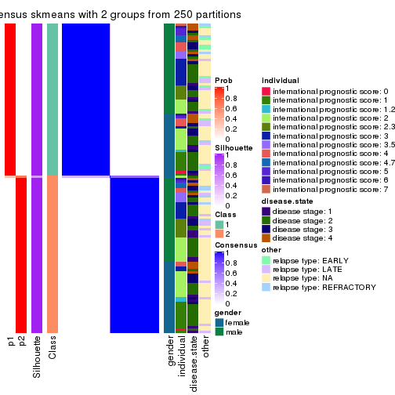</p>

</div>
<div id='tab-ATC-skmeans-consensus-heatmap-2'>
<pre><code class="r">consensus_heatmap(res, k = 3)
</code></pre>

<p></p>

</div>
<div id='tab-ATC-skmeans-consensus-heatmap-3'>
<pre><code class="r">consensus_heatmap(res, k = 4)
</code></pre>

<p>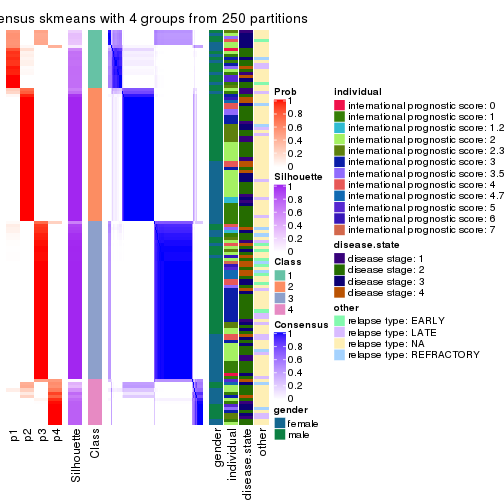</p>

</div>
<div id='tab-ATC-skmeans-consensus-heatmap-4'>
<pre><code class="r">consensus_heatmap(res, k = 5)
</code></pre>

<p>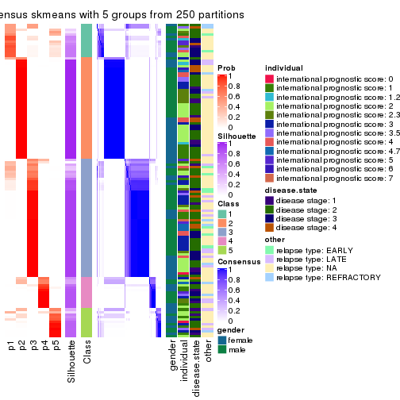</p>

</div>
<div id='tab-ATC-skmeans-consensus-heatmap-5'>
<pre><code class="r">consensus_heatmap(res, k = 6)
</code></pre>

<p>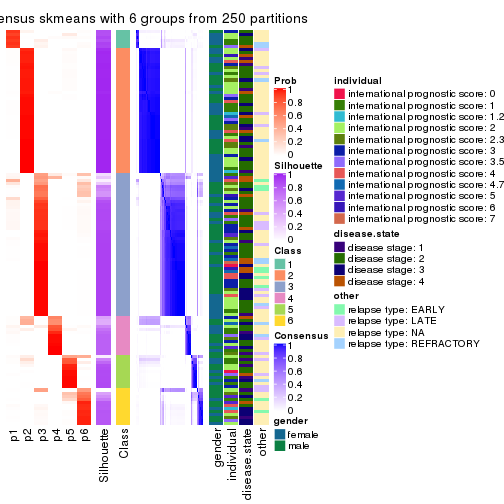</p>

</div>
</div>

Heatmaps for the membership of samples in all partitions to see how consistent they are:


<script>
$( function() {
	$( '#tabs-ATC-skmeans-membership-heatmap' ).tabs();
} );
</script>
<div id='tabs-ATC-skmeans-membership-heatmap'>
<ul>
<li><a href='#tab-ATC-skmeans-membership-heatmap-1'>k = 2</a></li>
<li><a href='#tab-ATC-skmeans-membership-heatmap-2'>k = 3</a></li>
<li><a href='#tab-ATC-skmeans-membership-heatmap-3'>k = 4</a></li>
<li><a href='#tab-ATC-skmeans-membership-heatmap-4'>k = 5</a></li>
<li><a href='#tab-ATC-skmeans-membership-heatmap-5'>k = 6</a></li>
</ul>
<div id='tab-ATC-skmeans-membership-heatmap-1'>
<pre><code class="r">membership_heatmap(res, k = 2)
</code></pre>

<p>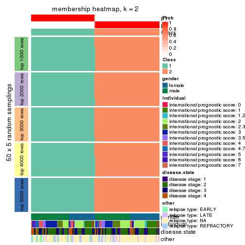</p>

</div>
<div id='tab-ATC-skmeans-membership-heatmap-2'>
<pre><code class="r">membership_heatmap(res, k = 3)
</code></pre>

<p>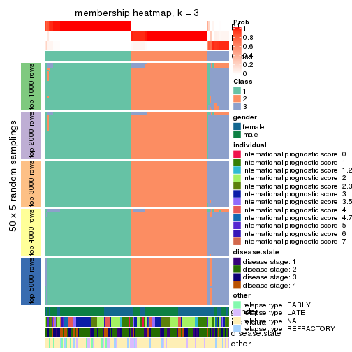</p>

</div>
<div id='tab-ATC-skmeans-membership-heatmap-3'>
<pre><code class="r">membership_heatmap(res, k = 4)
</code></pre>

<p>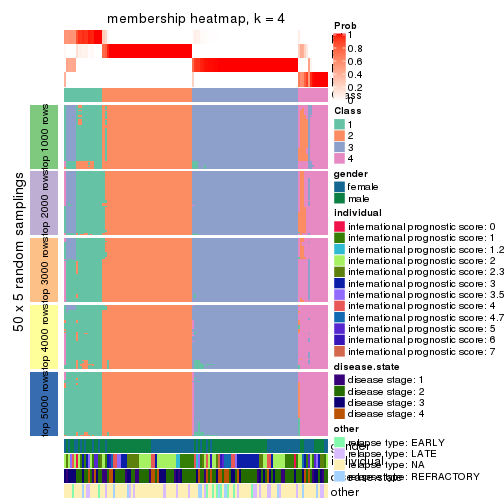</p>

</div>
<div id='tab-ATC-skmeans-membership-heatmap-4'>
<pre><code class="r">membership_heatmap(res, k = 5)
</code></pre>

<p>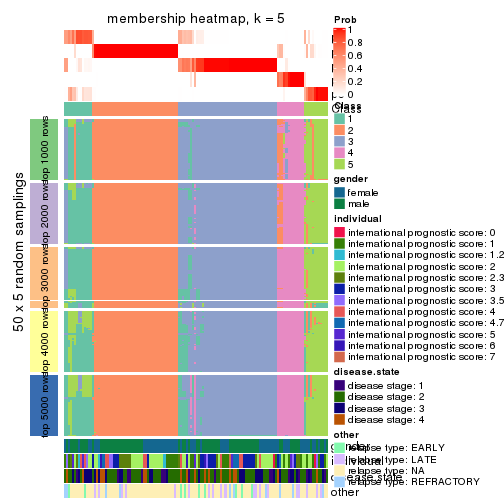</p>

</div>
<div id='tab-ATC-skmeans-membership-heatmap-5'>
<pre><code class="r">membership_heatmap(res, k = 6)
</code></pre>

<p>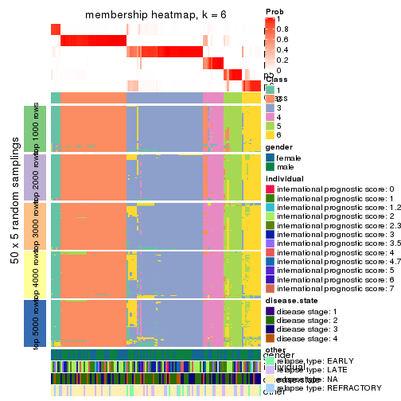</p>

</div>
</div>

As soon as we have had the classes for columns, we can look for signatures
which are significantly different between classes which can be candidate marks
for certain classes. Following are the heatmaps for signatures.


Signature heatmaps where rows are scaled:


<script>
$( function() {
	$( '#tabs-ATC-skmeans-get-signatures' ).tabs();
} );
</script>
<div id='tabs-ATC-skmeans-get-signatures'>
<ul>
<li><a href='#tab-ATC-skmeans-get-signatures-1'>k = 2</a></li>
<li><a href='#tab-ATC-skmeans-get-signatures-2'>k = 3</a></li>
<li><a href='#tab-ATC-skmeans-get-signatures-3'>k = 4</a></li>
<li><a href='#tab-ATC-skmeans-get-signatures-4'>k = 5</a></li>
<li><a href='#tab-ATC-skmeans-get-signatures-5'>k = 6</a></li>
</ul>
<div id='tab-ATC-skmeans-get-signatures-1'>
<pre><code class="r">get_signatures(res, k = 2)
</code></pre>

<p>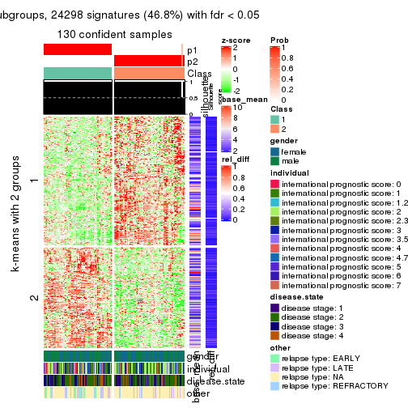</p>

</div>
<div id='tab-ATC-skmeans-get-signatures-2'>
<pre><code class="r">get_signatures(res, k = 3)
</code></pre>

<p>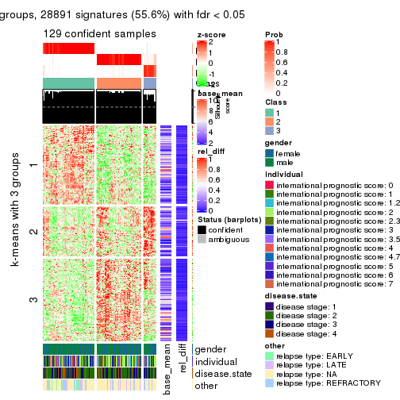</p>

</div>
<div id='tab-ATC-skmeans-get-signatures-3'>
<pre><code class="r">get_signatures(res, k = 4)
</code></pre>

<p>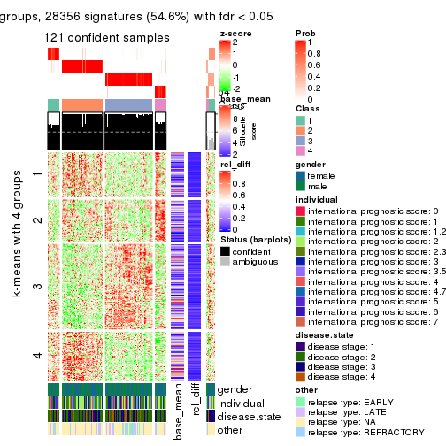</p>

</div>
<div id='tab-ATC-skmeans-get-signatures-4'>
<pre><code class="r">get_signatures(res, k = 5)
</code></pre>

<pre><code>#&gt; Error: The width or height of the raster image is zero, maybe you forget to turn off the
#&gt; previous graphic device or it was corrupted. Run `dev.off()` to close it.
</code></pre>

<p></p>

</div>
<div id='tab-ATC-skmeans-get-signatures-5'>
<pre><code class="r">get_signatures(res, k = 6)
</code></pre>

<pre><code>#&gt; Error: The width or height of the raster image is zero, maybe you forget to turn off the
#&gt; previous graphic device or it was corrupted. Run `dev.off()` to close it.
</code></pre>

<p></p>

</div>
</div>


Signature heatmaps where rows are not scaled:


<script>
$( function() {
	$( '#tabs-ATC-skmeans-get-signatures-no-scale' ).tabs();
} );
</script>
<div id='tabs-ATC-skmeans-get-signatures-no-scale'>
<ul>
<li><a href='#tab-ATC-skmeans-get-signatures-no-scale-1'>k = 2</a></li>
<li><a href='#tab-ATC-skmeans-get-signatures-no-scale-2'>k = 3</a></li>
<li><a href='#tab-ATC-skmeans-get-signatures-no-scale-3'>k = 4</a></li>
<li><a href='#tab-ATC-skmeans-get-signatures-no-scale-4'>k = 5</a></li>
<li><a href='#tab-ATC-skmeans-get-signatures-no-scale-5'>k = 6</a></li>
</ul>
<div id='tab-ATC-skmeans-get-signatures-no-scale-1'>
<pre><code class="r">get_signatures(res, k = 2, scale_rows = FALSE)
</code></pre>

<p>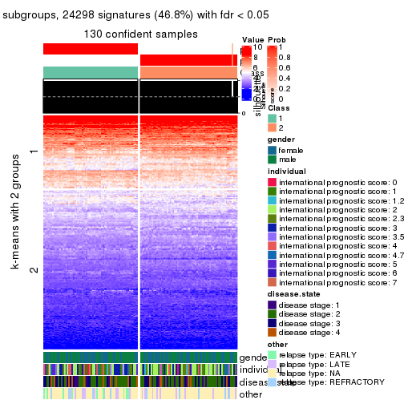</p>

</div>
<div id='tab-ATC-skmeans-get-signatures-no-scale-2'>
<pre><code class="r">get_signatures(res, k = 3, scale_rows = FALSE)
</code></pre>

<p>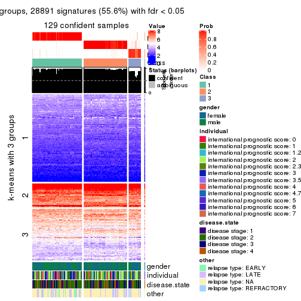</p>

</div>
<div id='tab-ATC-skmeans-get-signatures-no-scale-3'>
<pre><code class="r">get_signatures(res, k = 4, scale_rows = FALSE)
</code></pre>

<p>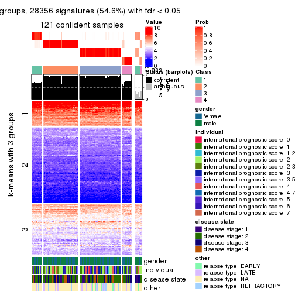</p>

</div>
<div id='tab-ATC-skmeans-get-signatures-no-scale-4'>
<pre><code class="r">get_signatures(res, k = 5, scale_rows = FALSE)
</code></pre>

<p>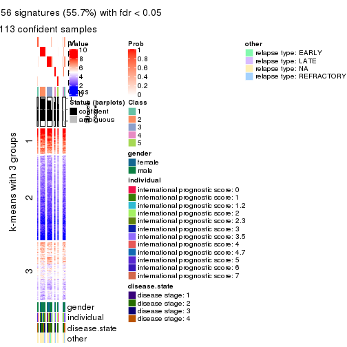</p>

</div>
<div id='tab-ATC-skmeans-get-signatures-no-scale-5'>
<pre><code class="r">get_signatures(res, k = 6, scale_rows = FALSE)
</code></pre>

<pre><code>#&gt; Error in mat[ceiling(1:nr/h_ratio), ceiling(1:nc/w_ratio), drop = FALSE]: subscript out of bounds
</code></pre>

<p></p>

</div>
</div>


Compare the overlap of signatures from different k:

```r
compare_signatures(res)
```

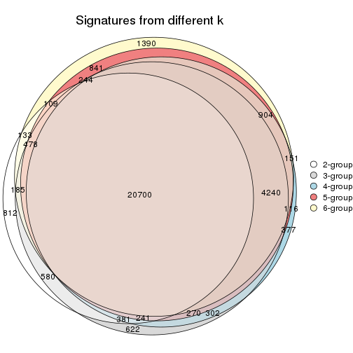

`get_signature()` returns a data frame invisibly. TO get the list of signatures, the function
call should be assigned to a variable explicitly. In following code, if `plot` argument is set
to `FALSE`, no heatmap is plotted while only the differential analysis is performed.

```r
# code only for demonstration
tb = get_signature(res, k = ..., plot = FALSE)
```

An example of the output of `tb` is:

```
#>   which_row         fdr    mean_1    mean_2 scaled_mean_1 scaled_mean_2 km
#> 1        38 0.042760348  8.373488  9.131774    -0.5533452     0.5164555  1
#> 2        40 0.018707592  7.106213  8.469186    -0.6173731     0.5762149  1
#> 3        55 0.019134737 10.221463 11.207825    -0.6159697     0.5749050  1
#> 4        59 0.006059896  5.921854  7.869574    -0.6899429     0.6439467  1
#> 5        60 0.018055526  8.928898 10.211722    -0.6204761     0.5791110  1
#> 6        98 0.009384629 15.714769 14.887706     0.6635654    -0.6193277  2
...
```

The columns in `tb` are:

1. `which_row`: row indices corresponding to the input matrix.
2. `fdr`: FDR for the differential test. 
3. `mean_x`: The mean value in group x.
4. `scaled_mean_x`: The mean value in group x after rows are scaled.
5. `km`: Row groups if k-means clustering is applied to rows.


UMAP plot which shows how samples are separated.


<script>
$( function() {
	$( '#tabs-ATC-skmeans-dimension-reduction' ).tabs();
} );
</script>
<div id='tabs-ATC-skmeans-dimension-reduction'>
<ul>
<li><a href='#tab-ATC-skmeans-dimension-reduction-1'>k = 2</a></li>
<li><a href='#tab-ATC-skmeans-dimension-reduction-2'>k = 3</a></li>
<li><a href='#tab-ATC-skmeans-dimension-reduction-3'>k = 4</a></li>
<li><a href='#tab-ATC-skmeans-dimension-reduction-4'>k = 5</a></li>
<li><a href='#tab-ATC-skmeans-dimension-reduction-5'>k = 6</a></li>
</ul>
<div id='tab-ATC-skmeans-dimension-reduction-1'>
<pre><code class="r">dimension_reduction(res, k = 2, method = &quot;UMAP&quot;)
</code></pre>

<p></p>

</div>
<div id='tab-ATC-skmeans-dimension-reduction-2'>
<pre><code class="r">dimension_reduction(res, k = 3, method = &quot;UMAP&quot;)
</code></pre>

<p>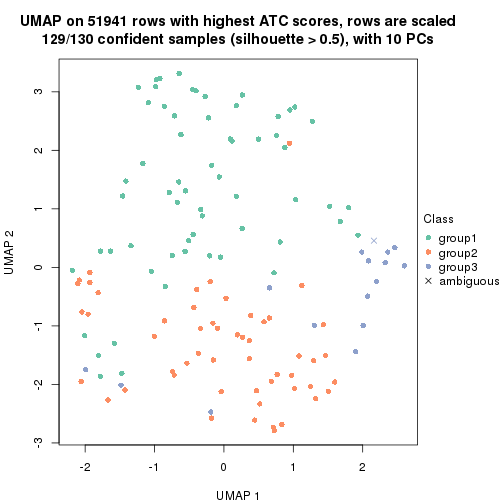</p>

</div>
<div id='tab-ATC-skmeans-dimension-reduction-3'>
<pre><code class="r">dimension_reduction(res, k = 4, method = &quot;UMAP&quot;)
</code></pre>

<p>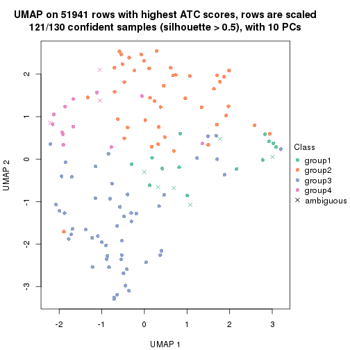</p>

</div>
<div id='tab-ATC-skmeans-dimension-reduction-4'>
<pre><code class="r">dimension_reduction(res, k = 5, method = &quot;UMAP&quot;)
</code></pre>

<p>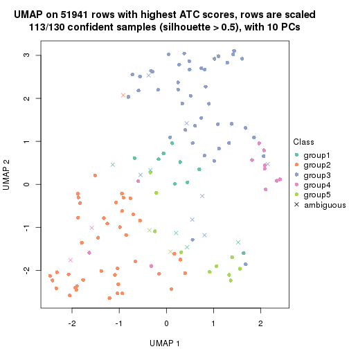</p>

</div>
<div id='tab-ATC-skmeans-dimension-reduction-5'>
<pre><code class="r">dimension_reduction(res, k = 6, method = &quot;UMAP&quot;)
</code></pre>

<p>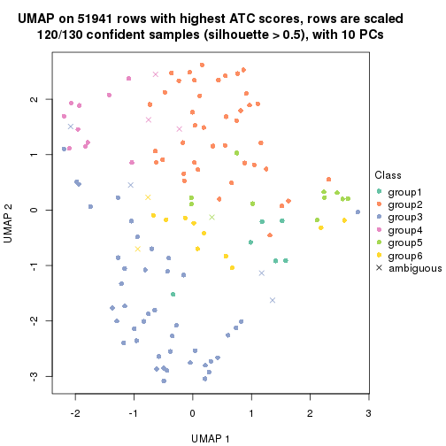</p>

</div>
</div>


Following heatmap shows how subgroups are split when increasing `k`:

```r
collect_classes(res)
```

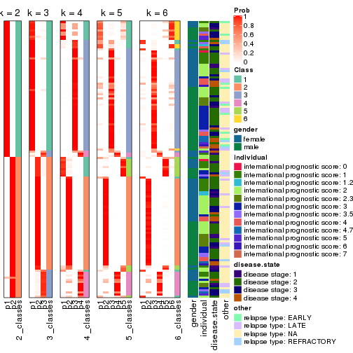


Test correlation between subgroups and known annotations. If the known
annotation is numeric, one-way ANOVA test is applied, and if the known
annotation is discrete, chi-squared contingency table test is applied.

```r
test_to_known_factors(res)
```

```
#>               n gender(p) individual(p) disease.state(p) other(p) k
#> ATC:skmeans 130     0.581         0.794            0.567   0.0176 2
#> ATC:skmeans 129     0.424         0.958            0.587   0.0587 3
#> ATC:skmeans 121     0.560         0.658            0.912   0.3357 4
#> ATC:skmeans 113     0.627         0.343            0.401   0.4259 5
#> ATC:skmeans 120     0.633         0.482            0.356   0.0711 6
```


If matrix rows can be associated to genes, consider to use `GO_Enrichment(res,
...)` to perform function enrichment for the signature genes.


 

---------------------------------------------------


### ATC:pam**


The object with results only for a single top-value method and a single partition method 
can be extracted as:

```r
res = res_list["ATC", "pam"]
# you can also extract it by
# res = res_list["ATC:pam"]
```

A summary of `res` and all the functions that can be applied to it:

```r
res
```

```
#> A 'ConsensusPartition' object with k = 2, 3, 4, 5, 6.
#>   On a matrix with 51941 rows and 130 columns.
#>   Top rows (1000, 2000, 3000, 4000, 5000) are extracted by 'ATC' method.
#>   Subgroups are detected by 'pam' method.
#>   Performed in total 1250 partitions by row resampling.
#>   Best k for subgroups seems to be 5.
#> 
#> Following methods can be applied to this 'ConsensusPartition' object:
#>  [1] "cola_report"             "collect_classes"         "collect_plots"          
#>  [4] "collect_stats"           "colnames"                "compare_signatures"     
#>  [7] "consensus_heatmap"       "dimension_reduction"     "functional_enrichment"  
#> [10] "get_anno_col"            "get_anno"                "get_classes"            
#> [13] "get_consensus"           "get_matrix"              "get_membership"         
#> [16] "get_param"               "get_signatures"          "get_stats"              
#> [19] "is_best_k"               "is_stable_k"             "membership_heatmap"     
#> [22] "ncol"                    "nrow"                    "plot_ecdf"              
#> [25] "rownames"                "select_partition_number" "show"                   
#> [28] "suggest_best_k"          "test_to_known_factors"
```

`collect_plots()` function collects all the plots made from `res` for all `k` (number of partitions)
into one single page to provide an easy and fast comparison between different `k`.

```r
collect_plots(res)
```

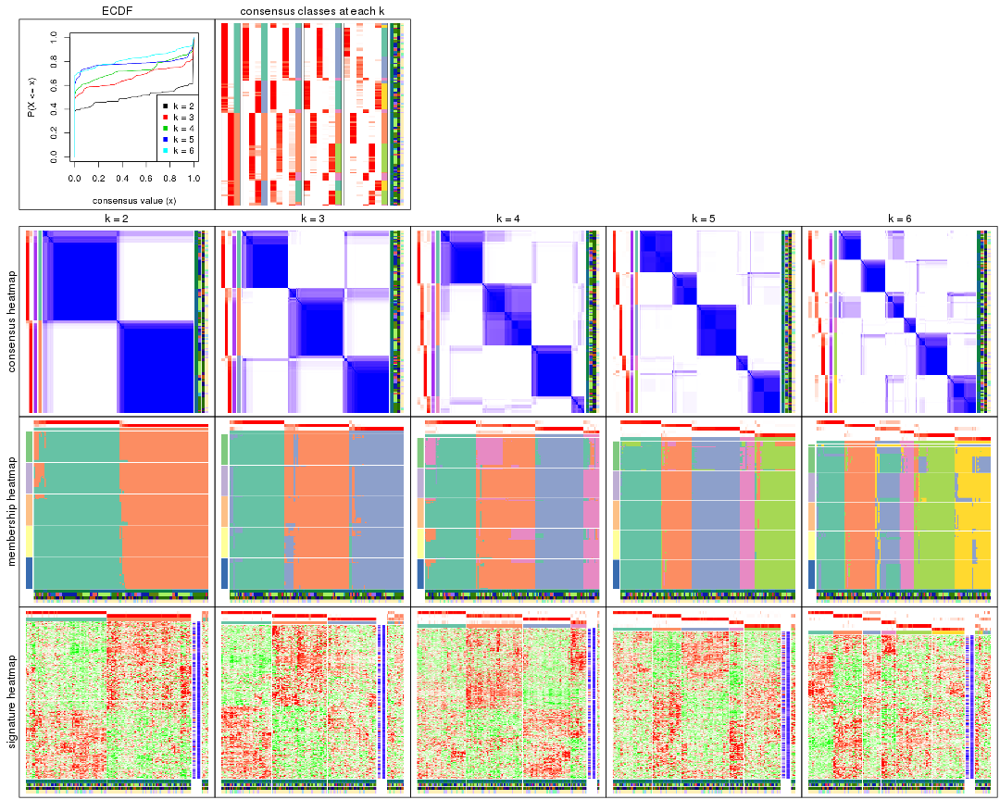

The plots are:

- The first row: a plot of the ECDF (Empirical cumulative distribution
  function) curves of the consensus matrix for each `k` and the heatmap of
  predicted classes for each `k`.
- The second row: heatmaps of the consensus matrix for each `k`.
- The third row: heatmaps of the membership matrix for each `k`.
- The fouth row: heatmaps of the signatures for each `k`.

All the plots in panels can be made by individual functions and they are
plotted later in this section.

`select_partition_number()` produces several plots showing different
statistics for choosing "optimized" `k`. There are following statistics:

- ECDF curves of the consensus matrix for each `k`;
- 1-PAC. [The PAC
  score](https://en.wikipedia.org/wiki/Consensus_clustering#Over-interpretation_potential_of_consensus_clustering)
  measures the proportion of the ambiguous subgrouping.
- Mean silhouette score.
- Concordance. The mean probability of fiting the consensus class ids in all
  partitions.
- Area increased. Denote $A_k$ as the area under the ECDF curve for current
  `k`, the area increased is defined as $A_k - A_{k-1}$.
- Rand index. The percent of pairs of samples that are both in a same cluster
  or both are not in a same cluster in the partition of k and k-1.
- Jaccard index. The ratio of pairs of samples are both in a same cluster in
  the partition of k and k-1 and the pairs of samples are both in a same
  cluster in the partition k or k-1.

The detailed explanations of these statistics can be found in [the cola
vignette](http://bioconductor.org/packages/devel/bioc/vignettes/cola/inst/doc/cola.html#toc_13).

Generally speaking, lower PAC score, higher mean silhouette score or higher
concordance corresponds to better partition. Rand index and Jaccard index
measure how similar the current partition is compared to partition with `k-1`.
If they are too similar, we won't accept `k` is better than `k-1`.

```r
select_partition_number(res)
```

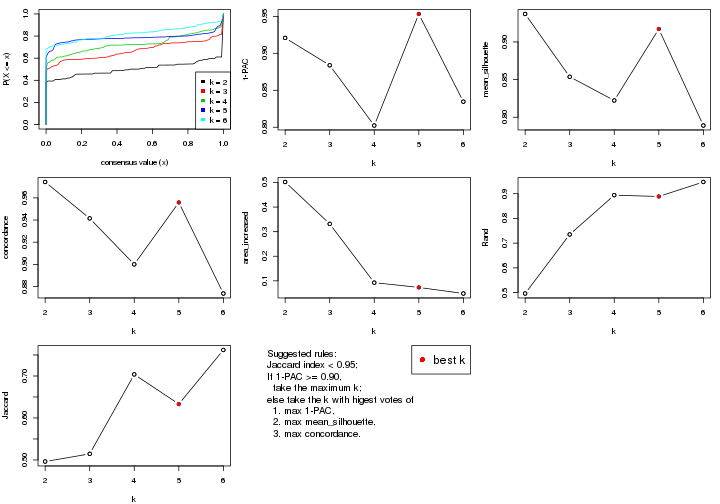

The numeric values for all these statistics can be obtained by `get_stats()`.

```r
get_stats(res)
```

```
#>   k 1-PAC mean_silhouette concordance area_increased  Rand Jaccard
#> 2 2 0.921           0.937       0.974         0.5021 0.496   0.496
#> 3 3 0.884           0.854       0.941         0.3316 0.735   0.515
#> 4 4 0.802           0.822       0.900         0.0926 0.894   0.704
#> 5 5 0.953           0.917       0.956         0.0732 0.889   0.633
#> 6 6 0.835           0.789       0.874         0.0484 0.947   0.762
```

`suggest_best_k()` suggests the best $k$ based on these statistics. The rules are as follows:

- All $k$ with Jaccard index larger than 0.95 are removed because the increase of
  the partition number does not provides enough extra information. If all $k$ are removed,
  the best $k$ is assigned by `NA`.
- For $k$ with 1-PAC larger than 0.9, the maximal $k$ is taken as the "best k". Other $k$ is called "optional k".
- If it does not fit the second rule. The $k$ with the highest vote of highest
  1-PAC, mean silhouette and concordance is taken as the "best k".

```r
suggest_best_k(res)
```

```
#> [1] 5
#> attr(,"optional")
#> [1] 2
```

There is also optional best $k$ = 2 that is worth to check.

Following shows the table of the partitions (You need to click the **show/hide
code output** link to see it). The membership matrix (columns with name `p*`)
is inferred by
[`clue::cl_consensus()`](https://www.rdocumentation.org/link/cl_consensus?package=clue)
function with the `SE` method. Basically the value in the membership matrix
represents the probability to belong to a certain group. The finall class
label for an item is determined with the group with highest probability it
belongs to.

In `get_classes()` function, the entropy is calculated from the membership
matrix and the silhouette score is calculated from the consensus matrix.


<script>
$( function() {
	$( '#tabs-ATC-pam-get-classes' ).tabs();
} );
</script>
<div id='tabs-ATC-pam-get-classes'>
<ul>
<li><a href='#tab-ATC-pam-get-classes-1'>k = 2</a></li>
<li><a href='#tab-ATC-pam-get-classes-2'>k = 3</a></li>
<li><a href='#tab-ATC-pam-get-classes-3'>k = 4</a></li>
<li><a href='#tab-ATC-pam-get-classes-4'>k = 5</a></li>
<li><a href='#tab-ATC-pam-get-classes-5'>k = 6</a></li>
</ul>

<div id='tab-ATC-pam-get-classes-1'>
<p><a id='tab-ATC-pam-get-classes-1-a' style='color:#0366d6' href='#'>show/hide code output</a></p>
<pre><code class="r">cbind(get_classes(res, k = 2), get_membership(res, k = 2))
</code></pre>

<pre><code>#&gt;           class entropy silhouette    p1    p2
#&gt; GSM447671     2  0.0000     0.9797 0.000 1.000
#&gt; GSM447694     1  0.0000     0.9655 1.000 0.000
#&gt; GSM447618     2  0.0000     0.9797 0.000 1.000
#&gt; GSM447691     2  0.0000     0.9797 0.000 1.000
#&gt; GSM447733     1  0.0376     0.9624 0.996 0.004
#&gt; GSM447620     2  0.0000     0.9797 0.000 1.000
#&gt; GSM447627     1  0.0000     0.9655 1.000 0.000
#&gt; GSM447630     2  0.9977     0.0509 0.472 0.528
#&gt; GSM447642     1  0.5629     0.8426 0.868 0.132
#&gt; GSM447649     2  0.0000     0.9797 0.000 1.000
#&gt; GSM447654     2  0.0000     0.9797 0.000 1.000
#&gt; GSM447655     2  0.0000     0.9797 0.000 1.000
#&gt; GSM447669     2  0.0000     0.9797 0.000 1.000
#&gt; GSM447676     1  0.0000     0.9655 1.000 0.000
#&gt; GSM447678     2  0.9881     0.1834 0.436 0.564
#&gt; GSM447681     2  0.0000     0.9797 0.000 1.000
#&gt; GSM447698     2  0.0000     0.9797 0.000 1.000
#&gt; GSM447713     1  0.0000     0.9655 1.000 0.000
#&gt; GSM447722     1  0.6343     0.8068 0.840 0.160
#&gt; GSM447726     2  0.0000     0.9797 0.000 1.000
#&gt; GSM447735     1  0.0000     0.9655 1.000 0.000
#&gt; GSM447737     1  0.0000     0.9655 1.000 0.000
#&gt; GSM447657     2  0.0000     0.9797 0.000 1.000
#&gt; GSM447674     2  0.0000     0.9797 0.000 1.000
#&gt; GSM447636     2  0.0000     0.9797 0.000 1.000
#&gt; GSM447723     1  0.0000     0.9655 1.000 0.000
#&gt; GSM447699     1  0.0000     0.9655 1.000 0.000
#&gt; GSM447708     2  0.0000     0.9797 0.000 1.000
#&gt; GSM447721     1  0.0000     0.9655 1.000 0.000
#&gt; GSM447623     1  0.0000     0.9655 1.000 0.000
#&gt; GSM447621     1  0.0000     0.9655 1.000 0.000
#&gt; GSM447650     2  0.0000     0.9797 0.000 1.000
#&gt; GSM447651     2  0.0000     0.9797 0.000 1.000
#&gt; GSM447653     1  0.0000     0.9655 1.000 0.000
#&gt; GSM447658     2  0.4161     0.8945 0.084 0.916
#&gt; GSM447675     1  0.8386     0.6455 0.732 0.268
#&gt; GSM447680     2  0.0000     0.9797 0.000 1.000
#&gt; GSM447686     2  0.0000     0.9797 0.000 1.000
#&gt; GSM447736     1  0.0000     0.9655 1.000 0.000
#&gt; GSM447629     2  0.0000     0.9797 0.000 1.000
#&gt; GSM447648     1  0.0000     0.9655 1.000 0.000
#&gt; GSM447660     2  0.6247     0.8019 0.156 0.844
#&gt; GSM447661     2  0.0000     0.9797 0.000 1.000
#&gt; GSM447663     1  0.0000     0.9655 1.000 0.000
#&gt; GSM447704     2  0.0000     0.9797 0.000 1.000
#&gt; GSM447720     1  0.0000     0.9655 1.000 0.000
#&gt; GSM447652     2  0.0000     0.9797 0.000 1.000
#&gt; GSM447679     2  0.0000     0.9797 0.000 1.000
#&gt; GSM447712     1  0.0000     0.9655 1.000 0.000
#&gt; GSM447664     2  0.0000     0.9797 0.000 1.000
#&gt; GSM447637     1  0.0000     0.9655 1.000 0.000
#&gt; GSM447639     1  0.0000     0.9655 1.000 0.000
#&gt; GSM447615     1  0.0000     0.9655 1.000 0.000
#&gt; GSM447656     2  0.0000     0.9797 0.000 1.000
#&gt; GSM447673     2  0.0000     0.9797 0.000 1.000
#&gt; GSM447719     1  0.0000     0.9655 1.000 0.000
#&gt; GSM447706     1  0.0000     0.9655 1.000 0.000
#&gt; GSM447612     1  0.0000     0.9655 1.000 0.000
#&gt; GSM447665     2  0.0000     0.9797 0.000 1.000
#&gt; GSM447677     2  0.0000     0.9797 0.000 1.000
#&gt; GSM447613     1  0.0000     0.9655 1.000 0.000
#&gt; GSM447659     1  0.0000     0.9655 1.000 0.000
#&gt; GSM447662     1  0.0000     0.9655 1.000 0.000
#&gt; GSM447666     2  0.0000     0.9797 0.000 1.000
#&gt; GSM447668     2  0.0000     0.9797 0.000 1.000
#&gt; GSM447682     2  0.0000     0.9797 0.000 1.000
#&gt; GSM447683     2  0.0000     0.9797 0.000 1.000
#&gt; GSM447688     2  0.0000     0.9797 0.000 1.000
#&gt; GSM447702     2  0.0000     0.9797 0.000 1.000
#&gt; GSM447709     2  0.0000     0.9797 0.000 1.000
#&gt; GSM447711     1  0.0000     0.9655 1.000 0.000
#&gt; GSM447715     2  0.0000     0.9797 0.000 1.000
#&gt; GSM447693     1  0.0000     0.9655 1.000 0.000
#&gt; GSM447611     1  0.9491     0.4490 0.632 0.368
#&gt; GSM447672     2  0.0000     0.9797 0.000 1.000
#&gt; GSM447703     2  0.0000     0.9797 0.000 1.000
#&gt; GSM447727     1  0.6048     0.8249 0.852 0.148
#&gt; GSM447638     2  0.0000     0.9797 0.000 1.000
#&gt; GSM447670     1  0.0000     0.9655 1.000 0.000
#&gt; GSM447700     1  0.9491     0.4490 0.632 0.368
#&gt; GSM447738     2  0.0000     0.9797 0.000 1.000
#&gt; GSM447739     1  0.0000     0.9655 1.000 0.000
#&gt; GSM447617     1  0.0000     0.9655 1.000 0.000
#&gt; GSM447628     2  0.0000     0.9797 0.000 1.000
#&gt; GSM447632     2  0.0000     0.9797 0.000 1.000
#&gt; GSM447619     1  0.0000     0.9655 1.000 0.000
#&gt; GSM447643     2  0.0000     0.9797 0.000 1.000
#&gt; GSM447724     1  0.0000     0.9655 1.000 0.000
#&gt; GSM447728     2  0.0000     0.9797 0.000 1.000
#&gt; GSM447610     1  0.0000     0.9655 1.000 0.000
#&gt; GSM447633     2  0.0000     0.9797 0.000 1.000
#&gt; GSM447634     1  0.0000     0.9655 1.000 0.000
#&gt; GSM447622     1  0.0000     0.9655 1.000 0.000
#&gt; GSM447667     2  0.0000     0.9797 0.000 1.000
#&gt; GSM447687     2  0.0000     0.9797 0.000 1.000
#&gt; GSM447695     1  0.0000     0.9655 1.000 0.000
#&gt; GSM447696     1  0.0000     0.9655 1.000 0.000
#&gt; GSM447697     1  0.0000     0.9655 1.000 0.000
#&gt; GSM447714     1  0.0000     0.9655 1.000 0.000
#&gt; GSM447717     2  0.0376     0.9762 0.004 0.996
#&gt; GSM447725     1  0.0000     0.9655 1.000 0.000
#&gt; GSM447729     2  0.0000     0.9797 0.000 1.000
#&gt; GSM447644     2  0.0000     0.9797 0.000 1.000
#&gt; GSM447710     1  0.0000     0.9655 1.000 0.000
#&gt; GSM447614     1  0.0000     0.9655 1.000 0.000
#&gt; GSM447685     2  0.0000     0.9797 0.000 1.000
#&gt; GSM447690     1  0.0000     0.9655 1.000 0.000
#&gt; GSM447730     2  0.0000     0.9797 0.000 1.000
#&gt; GSM447646     2  0.0000     0.9797 0.000 1.000
#&gt; GSM447689     1  0.5059     0.8638 0.888 0.112
#&gt; GSM447635     2  0.2778     0.9339 0.048 0.952
#&gt; GSM447641     1  0.0000     0.9655 1.000 0.000
#&gt; GSM447716     2  0.0000     0.9797 0.000 1.000
#&gt; GSM447718     1  0.6438     0.8054 0.836 0.164
#&gt; GSM447616     1  0.0000     0.9655 1.000 0.000
#&gt; GSM447626     1  0.0000     0.9655 1.000 0.000
#&gt; GSM447640     2  0.0000     0.9797 0.000 1.000
#&gt; GSM447734     1  0.0000     0.9655 1.000 0.000
#&gt; GSM447692     1  0.0000     0.9655 1.000 0.000
#&gt; GSM447647     2  0.0000     0.9797 0.000 1.000
#&gt; GSM447624     1  0.0000     0.9655 1.000 0.000
#&gt; GSM447625     1  0.0000     0.9655 1.000 0.000
#&gt; GSM447707     2  0.0000     0.9797 0.000 1.000
#&gt; GSM447732     1  0.0000     0.9655 1.000 0.000
#&gt; GSM447684     2  0.2603     0.9380 0.044 0.956
#&gt; GSM447731     2  0.0000     0.9797 0.000 1.000
#&gt; GSM447705     1  0.9460     0.4582 0.636 0.364
#&gt; GSM447631     1  0.0000     0.9655 1.000 0.000
#&gt; GSM447701     2  0.0000     0.9797 0.000 1.000
#&gt; GSM447645     1  0.0000     0.9655 1.000 0.000
</code></pre>

<script>
$('#tab-ATC-pam-get-classes-1-a').parent().next().next().hide();
$('#tab-ATC-pam-get-classes-1-a').click(function(){
  $('#tab-ATC-pam-get-classes-1-a').parent().next().next().toggle();
  return(false);
});
</script>
</div>

<div id='tab-ATC-pam-get-classes-2'>
<p><a id='tab-ATC-pam-get-classes-2-a' style='color:#0366d6' href='#'>show/hide code output</a></p>
<pre><code class="r">cbind(get_classes(res, k = 3), get_membership(res, k = 3))
</code></pre>

<pre><code>#&gt;           class entropy silhouette    p1    p2    p3
#&gt; GSM447671     3  0.2448      0.878 0.000 0.076 0.924
#&gt; GSM447694     1  0.0000      0.945 1.000 0.000 0.000
#&gt; GSM447618     3  0.2796      0.856 0.000 0.092 0.908
#&gt; GSM447691     3  0.0000      0.942 0.000 0.000 1.000
#&gt; GSM447733     3  0.0000      0.942 0.000 0.000 1.000
#&gt; GSM447620     2  0.0424      0.916 0.000 0.992 0.008
#&gt; GSM447627     1  0.0000      0.945 1.000 0.000 0.000
#&gt; GSM447630     3  0.0000      0.942 0.000 0.000 1.000
#&gt; GSM447642     3  0.0000      0.942 0.000 0.000 1.000
#&gt; GSM447649     2  0.0000      0.920 0.000 1.000 0.000
#&gt; GSM447654     2  0.4654      0.713 0.000 0.792 0.208
#&gt; GSM447655     2  0.0000      0.920 0.000 1.000 0.000
#&gt; GSM447669     3  0.0424      0.937 0.000 0.008 0.992
#&gt; GSM447676     3  0.0000      0.942 0.000 0.000 1.000
#&gt; GSM447678     3  0.0000      0.942 0.000 0.000 1.000
#&gt; GSM447681     2  0.0000      0.920 0.000 1.000 0.000
#&gt; GSM447698     2  0.5859      0.515 0.000 0.656 0.344
#&gt; GSM447713     1  0.0000      0.945 1.000 0.000 0.000
#&gt; GSM447722     3  0.0000      0.942 0.000 0.000 1.000
#&gt; GSM447726     3  0.1163      0.923 0.000 0.028 0.972
#&gt; GSM447735     1  0.0000      0.945 1.000 0.000 0.000
#&gt; GSM447737     1  0.0000      0.945 1.000 0.000 0.000
#&gt; GSM447657     2  0.6095      0.417 0.000 0.608 0.392
#&gt; GSM447674     2  0.0000      0.920 0.000 1.000 0.000
#&gt; GSM447636     2  0.2537      0.860 0.000 0.920 0.080
#&gt; GSM447723     3  0.0000      0.942 0.000 0.000 1.000
#&gt; GSM447699     1  0.0000      0.945 1.000 0.000 0.000
#&gt; GSM447708     2  0.6079      0.426 0.000 0.612 0.388
#&gt; GSM447721     1  0.0000      0.945 1.000 0.000 0.000
#&gt; GSM447623     1  0.0000      0.945 1.000 0.000 0.000
#&gt; GSM447621     1  0.0000      0.945 1.000 0.000 0.000
#&gt; GSM447650     2  0.0000      0.920 0.000 1.000 0.000
#&gt; GSM447651     2  0.0000      0.920 0.000 1.000 0.000
#&gt; GSM447653     1  0.5529      0.554 0.704 0.000 0.296
#&gt; GSM447658     3  0.0000      0.942 0.000 0.000 1.000
#&gt; GSM447675     3  0.0000      0.942 0.000 0.000 1.000
#&gt; GSM447680     2  0.0000      0.920 0.000 1.000 0.000
#&gt; GSM447686     2  0.6180      0.359 0.000 0.584 0.416
#&gt; GSM447736     1  0.2878      0.875 0.904 0.000 0.096
#&gt; GSM447629     2  0.5988      0.469 0.000 0.632 0.368
#&gt; GSM447648     1  0.0000      0.945 1.000 0.000 0.000
#&gt; GSM447660     3  0.0000      0.942 0.000 0.000 1.000
#&gt; GSM447661     2  0.0000      0.920 0.000 1.000 0.000
#&gt; GSM447663     3  0.0000      0.942 0.000 0.000 1.000
#&gt; GSM447704     2  0.0000      0.920 0.000 1.000 0.000
#&gt; GSM447720     3  0.0000      0.942 0.000 0.000 1.000
#&gt; GSM447652     2  0.0000      0.920 0.000 1.000 0.000
#&gt; GSM447679     2  0.0000      0.920 0.000 1.000 0.000
#&gt; GSM447712     3  0.5859      0.391 0.344 0.000 0.656
#&gt; GSM447664     3  0.6309     -0.111 0.000 0.496 0.504
#&gt; GSM447637     1  0.0000      0.945 1.000 0.000 0.000
#&gt; GSM447639     3  0.0000      0.942 0.000 0.000 1.000
#&gt; GSM447615     3  0.5835      0.401 0.340 0.000 0.660
#&gt; GSM447656     2  0.6095      0.417 0.000 0.608 0.392
#&gt; GSM447673     2  0.0000      0.920 0.000 1.000 0.000
#&gt; GSM447719     1  0.0000      0.945 1.000 0.000 0.000
#&gt; GSM447706     1  0.2165      0.901 0.936 0.000 0.064
#&gt; GSM447612     3  0.0424      0.936 0.008 0.000 0.992
#&gt; GSM447665     2  0.4931      0.693 0.000 0.768 0.232
#&gt; GSM447677     2  0.0000      0.920 0.000 1.000 0.000
#&gt; GSM447613     1  0.6308      0.120 0.508 0.000 0.492
#&gt; GSM447659     1  0.0000      0.945 1.000 0.000 0.000
#&gt; GSM447662     1  0.2448      0.892 0.924 0.000 0.076
#&gt; GSM447666     3  0.2261      0.886 0.000 0.068 0.932
#&gt; GSM447668     2  0.0000      0.920 0.000 1.000 0.000
#&gt; GSM447682     2  0.0000      0.920 0.000 1.000 0.000
#&gt; GSM447683     2  0.0000      0.920 0.000 1.000 0.000
#&gt; GSM447688     2  0.0000      0.920 0.000 1.000 0.000
#&gt; GSM447702     2  0.0000      0.920 0.000 1.000 0.000
#&gt; GSM447709     2  0.0000      0.920 0.000 1.000 0.000
#&gt; GSM447711     1  0.6308      0.120 0.508 0.000 0.492
#&gt; GSM447715     3  0.0000      0.942 0.000 0.000 1.000
#&gt; GSM447693     1  0.0000      0.945 1.000 0.000 0.000
#&gt; GSM447611     3  0.1031      0.925 0.000 0.024 0.976
#&gt; GSM447672     2  0.0000      0.920 0.000 1.000 0.000
#&gt; GSM447703     2  0.0000      0.920 0.000 1.000 0.000
#&gt; GSM447727     3  0.0000      0.942 0.000 0.000 1.000
#&gt; GSM447638     2  0.0424      0.916 0.000 0.992 0.008
#&gt; GSM447670     1  0.6008      0.451 0.628 0.000 0.372
#&gt; GSM447700     3  0.0000      0.942 0.000 0.000 1.000
#&gt; GSM447738     2  0.0000      0.920 0.000 1.000 0.000
#&gt; GSM447739     1  0.0000      0.945 1.000 0.000 0.000
#&gt; GSM447617     1  0.0000      0.945 1.000 0.000 0.000
#&gt; GSM447628     2  0.0000      0.920 0.000 1.000 0.000
#&gt; GSM447632     2  0.0000      0.920 0.000 1.000 0.000
#&gt; GSM447619     1  0.2165      0.901 0.936 0.000 0.064
#&gt; GSM447643     2  0.0424      0.916 0.000 0.992 0.008
#&gt; GSM447724     3  0.0000      0.942 0.000 0.000 1.000
#&gt; GSM447728     2  0.0000      0.920 0.000 1.000 0.000
#&gt; GSM447610     1  0.0000      0.945 1.000 0.000 0.000
#&gt; GSM447633     3  0.2356      0.882 0.000 0.072 0.928
#&gt; GSM447634     3  0.0000      0.942 0.000 0.000 1.000
#&gt; GSM447622     1  0.0000      0.945 1.000 0.000 0.000
#&gt; GSM447667     2  0.0424      0.916 0.000 0.992 0.008
#&gt; GSM447687     2  0.0000      0.920 0.000 1.000 0.000
#&gt; GSM447695     1  0.0000      0.945 1.000 0.000 0.000
#&gt; GSM447696     1  0.0000      0.945 1.000 0.000 0.000
#&gt; GSM447697     1  0.0000      0.945 1.000 0.000 0.000
#&gt; GSM447714     1  0.2356      0.895 0.928 0.000 0.072
#&gt; GSM447717     3  0.0000      0.942 0.000 0.000 1.000
#&gt; GSM447725     3  0.0000      0.942 0.000 0.000 1.000
#&gt; GSM447729     2  0.3267      0.822 0.000 0.884 0.116
#&gt; GSM447644     3  0.1411      0.916 0.000 0.036 0.964
#&gt; GSM447710     1  0.0000      0.945 1.000 0.000 0.000
#&gt; GSM447614     1  0.0000      0.945 1.000 0.000 0.000
#&gt; GSM447685     2  0.0000      0.920 0.000 1.000 0.000
#&gt; GSM447690     1  0.0000      0.945 1.000 0.000 0.000
#&gt; GSM447730     2  0.0000      0.920 0.000 1.000 0.000
#&gt; GSM447646     2  0.0000      0.920 0.000 1.000 0.000
#&gt; GSM447689     3  0.0000      0.942 0.000 0.000 1.000
#&gt; GSM447635     3  0.0000      0.942 0.000 0.000 1.000
#&gt; GSM447641     3  0.0000      0.942 0.000 0.000 1.000
#&gt; GSM447716     3  0.6235      0.105 0.000 0.436 0.564
#&gt; GSM447718     3  0.0000      0.942 0.000 0.000 1.000
#&gt; GSM447616     1  0.0000      0.945 1.000 0.000 0.000
#&gt; GSM447626     3  0.0000      0.942 0.000 0.000 1.000
#&gt; GSM447640     2  0.0000      0.920 0.000 1.000 0.000
#&gt; GSM447734     1  0.0000      0.945 1.000 0.000 0.000
#&gt; GSM447692     1  0.0000      0.945 1.000 0.000 0.000
#&gt; GSM447647     2  0.0000      0.920 0.000 1.000 0.000
#&gt; GSM447624     1  0.0000      0.945 1.000 0.000 0.000
#&gt; GSM447625     1  0.2711      0.882 0.912 0.000 0.088
#&gt; GSM447707     2  0.0000      0.920 0.000 1.000 0.000
#&gt; GSM447732     1  0.0000      0.945 1.000 0.000 0.000
#&gt; GSM447684     3  0.0000      0.942 0.000 0.000 1.000
#&gt; GSM447731     2  0.6299      0.102 0.000 0.524 0.476
#&gt; GSM447705     3  0.0000      0.942 0.000 0.000 1.000
#&gt; GSM447631     1  0.0000      0.945 1.000 0.000 0.000
#&gt; GSM447701     2  0.1031      0.904 0.000 0.976 0.024
#&gt; GSM447645     1  0.0000      0.945 1.000 0.000 0.000
</code></pre>

<script>
$('#tab-ATC-pam-get-classes-2-a').parent().next().next().hide();
$('#tab-ATC-pam-get-classes-2-a').click(function(){
  $('#tab-ATC-pam-get-classes-2-a').parent().next().next().toggle();
  return(false);
});
</script>
</div>

<div id='tab-ATC-pam-get-classes-3'>
<p><a id='tab-ATC-pam-get-classes-3-a' style='color:#0366d6' href='#'>show/hide code output</a></p>
<pre><code class="r">cbind(get_classes(res, k = 4), get_membership(res, k = 4))
</code></pre>

<pre><code>#&gt;           class entropy silhouette    p1    p2    p3    p4
#&gt; GSM447671     1  0.7121      0.400 0.564 0.220 0.000 0.216
#&gt; GSM447694     3  0.0000      0.968 0.000 0.000 1.000 0.000
#&gt; GSM447618     2  0.7665      0.180 0.360 0.424 0.000 0.216
#&gt; GSM447691     1  0.5809      0.603 0.692 0.092 0.000 0.216
#&gt; GSM447733     4  0.4564      0.606 0.328 0.000 0.000 0.672
#&gt; GSM447620     2  0.3764      0.782 0.000 0.784 0.000 0.216
#&gt; GSM447627     3  0.0000      0.968 0.000 0.000 1.000 0.000
#&gt; GSM447630     1  0.0000      0.894 1.000 0.000 0.000 0.000
#&gt; GSM447642     1  0.0000      0.894 1.000 0.000 0.000 0.000
#&gt; GSM447649     2  0.2530      0.789 0.000 0.888 0.000 0.112
#&gt; GSM447654     4  0.0188      0.723 0.004 0.000 0.000 0.996
#&gt; GSM447655     2  0.2216      0.798 0.000 0.908 0.000 0.092
#&gt; GSM447669     1  0.5923      0.594 0.684 0.100 0.000 0.216
#&gt; GSM447676     1  0.0000      0.894 1.000 0.000 0.000 0.000
#&gt; GSM447678     1  0.5332      0.651 0.736 0.080 0.000 0.184
#&gt; GSM447681     2  0.0000      0.810 0.000 1.000 0.000 0.000
#&gt; GSM447698     2  0.3945      0.780 0.004 0.780 0.000 0.216
#&gt; GSM447713     3  0.0000      0.968 0.000 0.000 1.000 0.000
#&gt; GSM447722     1  0.0000      0.894 1.000 0.000 0.000 0.000
#&gt; GSM447726     1  0.5809      0.603 0.692 0.092 0.000 0.216
#&gt; GSM447735     3  0.0000      0.968 0.000 0.000 1.000 0.000
#&gt; GSM447737     3  0.0000      0.968 0.000 0.000 1.000 0.000
#&gt; GSM447657     2  0.4086      0.777 0.008 0.776 0.000 0.216
#&gt; GSM447674     2  0.2216      0.798 0.000 0.908 0.000 0.092
#&gt; GSM447636     2  0.6984      0.526 0.184 0.580 0.000 0.236
#&gt; GSM447723     1  0.0000      0.894 1.000 0.000 0.000 0.000
#&gt; GSM447699     3  0.0000      0.968 0.000 0.000 1.000 0.000
#&gt; GSM447708     2  0.4086      0.777 0.008 0.776 0.000 0.216
#&gt; GSM447721     3  0.0000      0.968 0.000 0.000 1.000 0.000
#&gt; GSM447623     3  0.0000      0.968 0.000 0.000 1.000 0.000
#&gt; GSM447621     3  0.0000      0.968 0.000 0.000 1.000 0.000
#&gt; GSM447650     2  0.2216      0.798 0.000 0.908 0.000 0.092
#&gt; GSM447651     2  0.2216      0.798 0.000 0.908 0.000 0.092
#&gt; GSM447653     4  0.6170      0.678 0.136 0.000 0.192 0.672
#&gt; GSM447658     1  0.0000      0.894 1.000 0.000 0.000 0.000
#&gt; GSM447675     4  0.4543      0.612 0.324 0.000 0.000 0.676
#&gt; GSM447680     2  0.0592      0.811 0.000 0.984 0.000 0.016
#&gt; GSM447686     2  0.4904      0.751 0.040 0.744 0.000 0.216
#&gt; GSM447736     3  0.4040      0.644 0.248 0.000 0.752 0.000
#&gt; GSM447629     2  0.3945      0.780 0.004 0.780 0.000 0.216
#&gt; GSM447648     3  0.0000      0.968 0.000 0.000 1.000 0.000
#&gt; GSM447660     1  0.0000      0.894 1.000 0.000 0.000 0.000
#&gt; GSM447661     2  0.2216      0.798 0.000 0.908 0.000 0.092
#&gt; GSM447663     1  0.0000      0.894 1.000 0.000 0.000 0.000
#&gt; GSM447704     2  0.2530      0.789 0.000 0.888 0.000 0.112
#&gt; GSM447720     1  0.0000      0.894 1.000 0.000 0.000 0.000
#&gt; GSM447652     2  0.3266      0.801 0.000 0.832 0.000 0.168
#&gt; GSM447679     2  0.2216      0.798 0.000 0.908 0.000 0.092
#&gt; GSM447712     1  0.0188      0.891 0.996 0.000 0.004 0.000
#&gt; GSM447664     4  0.1792      0.666 0.000 0.068 0.000 0.932
#&gt; GSM447637     3  0.0000      0.968 0.000 0.000 1.000 0.000
#&gt; GSM447639     1  0.0000      0.894 1.000 0.000 0.000 0.000
#&gt; GSM447615     1  0.0188      0.891 0.996 0.000 0.004 0.000
#&gt; GSM447656     2  0.4086      0.777 0.008 0.776 0.000 0.216
#&gt; GSM447673     2  0.2704      0.792 0.000 0.876 0.000 0.124
#&gt; GSM447719     4  0.4564      0.501 0.000 0.000 0.328 0.672
#&gt; GSM447706     3  0.1637      0.909 0.060 0.000 0.940 0.000
#&gt; GSM447612     1  0.0000      0.894 1.000 0.000 0.000 0.000
#&gt; GSM447665     2  0.3945      0.780 0.004 0.780 0.000 0.216
#&gt; GSM447677     2  0.0817      0.811 0.000 0.976 0.000 0.024
#&gt; GSM447613     1  0.0817      0.871 0.976 0.000 0.024 0.000
#&gt; GSM447659     3  0.0000      0.968 0.000 0.000 1.000 0.000
#&gt; GSM447662     3  0.2973      0.806 0.144 0.000 0.856 0.000
#&gt; GSM447666     1  0.6240      0.566 0.664 0.136 0.000 0.200
#&gt; GSM447668     2  0.0000      0.810 0.000 1.000 0.000 0.000
#&gt; GSM447682     2  0.3764      0.782 0.000 0.784 0.000 0.216
#&gt; GSM447683     2  0.1302      0.812 0.000 0.956 0.000 0.044
#&gt; GSM447688     2  0.4500      0.776 0.000 0.684 0.000 0.316
#&gt; GSM447702     2  0.2216      0.798 0.000 0.908 0.000 0.092
#&gt; GSM447709     2  0.3764      0.782 0.000 0.784 0.000 0.216
#&gt; GSM447711     1  0.0817      0.871 0.976 0.000 0.024 0.000
#&gt; GSM447715     1  0.1474      0.855 0.948 0.000 0.000 0.052
#&gt; GSM447693     3  0.0000      0.968 0.000 0.000 1.000 0.000
#&gt; GSM447611     4  0.3942      0.709 0.236 0.000 0.000 0.764
#&gt; GSM447672     2  0.2216      0.798 0.000 0.908 0.000 0.092
#&gt; GSM447703     2  0.2530      0.789 0.000 0.888 0.000 0.112
#&gt; GSM447727     1  0.0000      0.894 1.000 0.000 0.000 0.000
#&gt; GSM447638     2  0.3764      0.782 0.000 0.784 0.000 0.216
#&gt; GSM447670     1  0.3219      0.688 0.836 0.000 0.164 0.000
#&gt; GSM447700     1  0.0000      0.894 1.000 0.000 0.000 0.000
#&gt; GSM447738     2  0.2216      0.798 0.000 0.908 0.000 0.092
#&gt; GSM447739     3  0.0000      0.968 0.000 0.000 1.000 0.000
#&gt; GSM447617     3  0.0000      0.968 0.000 0.000 1.000 0.000
#&gt; GSM447628     4  0.3486      0.702 0.000 0.188 0.000 0.812
#&gt; GSM447632     2  0.2216      0.798 0.000 0.908 0.000 0.092
#&gt; GSM447619     3  0.1637      0.909 0.060 0.000 0.940 0.000
#&gt; GSM447643     2  0.3764      0.782 0.000 0.784 0.000 0.216
#&gt; GSM447724     1  0.0000      0.894 1.000 0.000 0.000 0.000
#&gt; GSM447728     2  0.3764      0.782 0.000 0.784 0.000 0.216
#&gt; GSM447610     3  0.0000      0.968 0.000 0.000 1.000 0.000
#&gt; GSM447633     1  0.6373      0.544 0.648 0.136 0.000 0.216
#&gt; GSM447634     1  0.0000      0.894 1.000 0.000 0.000 0.000
#&gt; GSM447622     3  0.0000      0.968 0.000 0.000 1.000 0.000
#&gt; GSM447667     2  0.3764      0.782 0.000 0.784 0.000 0.216
#&gt; GSM447687     2  0.2530      0.789 0.000 0.888 0.000 0.112
#&gt; GSM447695     3  0.0000      0.968 0.000 0.000 1.000 0.000
#&gt; GSM447696     3  0.0000      0.968 0.000 0.000 1.000 0.000
#&gt; GSM447697     3  0.0000      0.968 0.000 0.000 1.000 0.000
#&gt; GSM447714     3  0.2704      0.833 0.124 0.000 0.876 0.000
#&gt; GSM447717     1  0.0469      0.886 0.988 0.000 0.000 0.012
#&gt; GSM447725     1  0.0000      0.894 1.000 0.000 0.000 0.000
#&gt; GSM447729     4  0.0707      0.728 0.000 0.020 0.000 0.980
#&gt; GSM447644     1  0.5867      0.598 0.688 0.096 0.000 0.216
#&gt; GSM447710     3  0.0000      0.968 0.000 0.000 1.000 0.000
#&gt; GSM447614     3  0.0000      0.968 0.000 0.000 1.000 0.000
#&gt; GSM447685     2  0.1118      0.812 0.000 0.964 0.000 0.036
#&gt; GSM447690     3  0.0000      0.968 0.000 0.000 1.000 0.000
#&gt; GSM447730     2  0.2216      0.798 0.000 0.908 0.000 0.092
#&gt; GSM447646     4  0.3123      0.723 0.000 0.156 0.000 0.844
#&gt; GSM447689     1  0.0000      0.894 1.000 0.000 0.000 0.000
#&gt; GSM447635     1  0.0000      0.894 1.000 0.000 0.000 0.000
#&gt; GSM447641     1  0.0000      0.894 1.000 0.000 0.000 0.000
#&gt; GSM447716     2  0.4986      0.749 0.044 0.740 0.000 0.216
#&gt; GSM447718     1  0.0000      0.894 1.000 0.000 0.000 0.000
#&gt; GSM447616     3  0.0000      0.968 0.000 0.000 1.000 0.000
#&gt; GSM447626     1  0.0000      0.894 1.000 0.000 0.000 0.000
#&gt; GSM447640     2  0.2216      0.798 0.000 0.908 0.000 0.092
#&gt; GSM447734     3  0.0000      0.968 0.000 0.000 1.000 0.000
#&gt; GSM447692     3  0.0000      0.968 0.000 0.000 1.000 0.000
#&gt; GSM447647     4  0.3219      0.718 0.000 0.164 0.000 0.836
#&gt; GSM447624     3  0.0000      0.968 0.000 0.000 1.000 0.000
#&gt; GSM447625     3  0.3942      0.664 0.236 0.000 0.764 0.000
#&gt; GSM447707     2  0.2530      0.789 0.000 0.888 0.000 0.112
#&gt; GSM447732     3  0.0000      0.968 0.000 0.000 1.000 0.000
#&gt; GSM447684     1  0.0000      0.894 1.000 0.000 0.000 0.000
#&gt; GSM447731     4  0.3123      0.758 0.156 0.000 0.000 0.844
#&gt; GSM447705     1  0.0000      0.894 1.000 0.000 0.000 0.000
#&gt; GSM447631     3  0.0000      0.968 0.000 0.000 1.000 0.000
#&gt; GSM447701     2  0.3764      0.782 0.000 0.784 0.000 0.216
#&gt; GSM447645     3  0.0000      0.968 0.000 0.000 1.000 0.000
</code></pre>

<script>
$('#tab-ATC-pam-get-classes-3-a').parent().next().next().hide();
$('#tab-ATC-pam-get-classes-3-a').click(function(){
  $('#tab-ATC-pam-get-classes-3-a').parent().next().next().toggle();
  return(false);
});
</script>
</div>

<div id='tab-ATC-pam-get-classes-4'>
<p><a id='tab-ATC-pam-get-classes-4-a' style='color:#0366d6' href='#'>show/hide code output</a></p>
<pre><code class="r">cbind(get_classes(res, k = 5), get_membership(res, k = 5))
</code></pre>

<pre><code>#&gt;           class entropy silhouette    p1    p2    p3    p4    p5
#&gt; GSM447671     5  0.0290     0.9146 0.008 0.000 0.000 0.000 0.992
#&gt; GSM447694     3  0.0000     0.9779 0.000 0.000 1.000 0.000 0.000
#&gt; GSM447618     5  0.0290     0.9146 0.008 0.000 0.000 0.000 0.992
#&gt; GSM447691     5  0.0290     0.9146 0.008 0.000 0.000 0.000 0.992
#&gt; GSM447733     4  0.3012     0.8578 0.104 0.000 0.000 0.860 0.036
#&gt; GSM447620     5  0.0963     0.9278 0.000 0.036 0.000 0.000 0.964
#&gt; GSM447627     3  0.0510     0.9759 0.000 0.000 0.984 0.016 0.000
#&gt; GSM447630     1  0.0963     0.9697 0.964 0.000 0.000 0.000 0.036
#&gt; GSM447642     1  0.0000     0.9719 1.000 0.000 0.000 0.000 0.000
#&gt; GSM447649     2  0.0963     0.9080 0.000 0.964 0.000 0.036 0.000
#&gt; GSM447654     4  0.0613     0.9283 0.004 0.008 0.000 0.984 0.004
#&gt; GSM447655     2  0.0290     0.9279 0.000 0.992 0.000 0.000 0.008
#&gt; GSM447669     5  0.0290     0.9146 0.008 0.000 0.000 0.000 0.992
#&gt; GSM447676     1  0.0000     0.9719 1.000 0.000 0.000 0.000 0.000
#&gt; GSM447678     5  0.3661     0.5743 0.276 0.000 0.000 0.000 0.724
#&gt; GSM447681     2  0.1121     0.9047 0.000 0.956 0.000 0.000 0.044
#&gt; GSM447698     5  0.0963     0.9278 0.000 0.036 0.000 0.000 0.964
#&gt; GSM447713     3  0.0510     0.9759 0.000 0.000 0.984 0.016 0.000
#&gt; GSM447722     1  0.0963     0.9697 0.964 0.000 0.000 0.000 0.036
#&gt; GSM447726     5  0.0290     0.9146 0.008 0.000 0.000 0.000 0.992
#&gt; GSM447735     3  0.0000     0.9779 0.000 0.000 1.000 0.000 0.000
#&gt; GSM447737     3  0.0000     0.9779 0.000 0.000 1.000 0.000 0.000
#&gt; GSM447657     5  0.0963     0.9278 0.000 0.036 0.000 0.000 0.964
#&gt; GSM447674     2  0.0290     0.9279 0.000 0.992 0.000 0.000 0.008
#&gt; GSM447636     5  0.1251     0.9048 0.000 0.008 0.000 0.036 0.956
#&gt; GSM447723     1  0.0703     0.9717 0.976 0.000 0.000 0.000 0.024
#&gt; GSM447699     3  0.0671     0.9751 0.004 0.000 0.980 0.016 0.000
#&gt; GSM447708     5  0.0963     0.9278 0.000 0.036 0.000 0.000 0.964
#&gt; GSM447721     3  0.0671     0.9751 0.004 0.000 0.980 0.016 0.000
#&gt; GSM447623     3  0.0000     0.9779 0.000 0.000 1.000 0.000 0.000
#&gt; GSM447621     3  0.0290     0.9770 0.000 0.000 0.992 0.008 0.000
#&gt; GSM447650     2  0.0290     0.9279 0.000 0.992 0.000 0.000 0.008
#&gt; GSM447651     2  0.0290     0.9279 0.000 0.992 0.000 0.000 0.008
#&gt; GSM447653     4  0.2561     0.8832 0.096 0.000 0.020 0.884 0.000
#&gt; GSM447658     1  0.0162     0.9722 0.996 0.000 0.000 0.000 0.004
#&gt; GSM447675     4  0.1661     0.9172 0.024 0.000 0.000 0.940 0.036
#&gt; GSM447680     2  0.4273     0.0872 0.000 0.552 0.000 0.000 0.448
#&gt; GSM447686     5  0.0963     0.9278 0.000 0.036 0.000 0.000 0.964
#&gt; GSM447736     3  0.3299     0.7994 0.152 0.000 0.828 0.016 0.004
#&gt; GSM447629     5  0.0963     0.9278 0.000 0.036 0.000 0.000 0.964
#&gt; GSM447648     3  0.0000     0.9779 0.000 0.000 1.000 0.000 0.000
#&gt; GSM447660     1  0.0162     0.9722 0.996 0.000 0.000 0.000 0.004
#&gt; GSM447661     2  0.0290     0.9279 0.000 0.992 0.000 0.000 0.008
#&gt; GSM447663     1  0.0000     0.9719 1.000 0.000 0.000 0.000 0.000
#&gt; GSM447704     2  0.0963     0.9080 0.000 0.964 0.000 0.036 0.000
#&gt; GSM447720     1  0.0963     0.9697 0.964 0.000 0.000 0.000 0.036
#&gt; GSM447652     2  0.3309     0.7986 0.000 0.836 0.000 0.036 0.128
#&gt; GSM447679     2  0.0290     0.9279 0.000 0.992 0.000 0.000 0.008
#&gt; GSM447712     1  0.0290     0.9671 0.992 0.000 0.000 0.008 0.000
#&gt; GSM447664     4  0.1331     0.9128 0.000 0.008 0.000 0.952 0.040
#&gt; GSM447637     3  0.0000     0.9779 0.000 0.000 1.000 0.000 0.000
#&gt; GSM447639     1  0.0963     0.9697 0.964 0.000 0.000 0.000 0.036
#&gt; GSM447615     1  0.0000     0.9719 1.000 0.000 0.000 0.000 0.000
#&gt; GSM447656     5  0.0963     0.9278 0.000 0.036 0.000 0.000 0.964
#&gt; GSM447673     2  0.1469     0.9046 0.000 0.948 0.000 0.036 0.016
#&gt; GSM447719     4  0.3086     0.7674 0.004 0.000 0.180 0.816 0.000
#&gt; GSM447706     3  0.0671     0.9751 0.004 0.000 0.980 0.016 0.000
#&gt; GSM447612     1  0.1386     0.9638 0.952 0.000 0.000 0.016 0.032
#&gt; GSM447665     5  0.0963     0.9278 0.000 0.036 0.000 0.000 0.964
#&gt; GSM447677     5  0.4256     0.2848 0.000 0.436 0.000 0.000 0.564
#&gt; GSM447613     1  0.0510     0.9619 0.984 0.000 0.000 0.016 0.000
#&gt; GSM447659     3  0.0671     0.9751 0.004 0.000 0.980 0.016 0.000
#&gt; GSM447662     3  0.2046     0.9125 0.068 0.000 0.916 0.016 0.000
#&gt; GSM447666     5  0.0290     0.9146 0.008 0.000 0.000 0.000 0.992
#&gt; GSM447668     2  0.0290     0.9279 0.000 0.992 0.000 0.000 0.008
#&gt; GSM447682     5  0.0963     0.9278 0.000 0.036 0.000 0.000 0.964
#&gt; GSM447683     5  0.3305     0.7331 0.000 0.224 0.000 0.000 0.776
#&gt; GSM447688     5  0.2411     0.8527 0.000 0.008 0.000 0.108 0.884
#&gt; GSM447702     2  0.0290     0.9279 0.000 0.992 0.000 0.000 0.008
#&gt; GSM447709     5  0.0963     0.9278 0.000 0.036 0.000 0.000 0.964
#&gt; GSM447711     1  0.0290     0.9671 0.992 0.000 0.000 0.008 0.000
#&gt; GSM447715     1  0.1544     0.9400 0.932 0.000 0.000 0.000 0.068
#&gt; GSM447693     3  0.0000     0.9779 0.000 0.000 1.000 0.000 0.000
#&gt; GSM447611     4  0.1469     0.9192 0.016 0.000 0.000 0.948 0.036
#&gt; GSM447672     2  0.0290     0.9279 0.000 0.992 0.000 0.000 0.008
#&gt; GSM447703     2  0.0963     0.9080 0.000 0.964 0.000 0.036 0.000
#&gt; GSM447727     1  0.0963     0.9697 0.964 0.000 0.000 0.000 0.036
#&gt; GSM447638     5  0.0963     0.9278 0.000 0.036 0.000 0.000 0.964
#&gt; GSM447670     1  0.3011     0.7747 0.844 0.000 0.140 0.016 0.000
#&gt; GSM447700     1  0.0963     0.9697 0.964 0.000 0.000 0.000 0.036
#&gt; GSM447738     2  0.2230     0.8255 0.000 0.884 0.000 0.000 0.116
#&gt; GSM447739     3  0.0000     0.9779 0.000 0.000 1.000 0.000 0.000
#&gt; GSM447617     3  0.0000     0.9779 0.000 0.000 1.000 0.000 0.000
#&gt; GSM447628     4  0.1197     0.9062 0.000 0.048 0.000 0.952 0.000
#&gt; GSM447632     2  0.0290     0.9279 0.000 0.992 0.000 0.000 0.008
#&gt; GSM447619     3  0.0671     0.9751 0.004 0.000 0.980 0.016 0.000
#&gt; GSM447643     5  0.0963     0.9278 0.000 0.036 0.000 0.000 0.964
#&gt; GSM447724     1  0.0880     0.9701 0.968 0.000 0.000 0.000 0.032
#&gt; GSM447728     5  0.0963     0.9278 0.000 0.036 0.000 0.000 0.964
#&gt; GSM447610     3  0.0671     0.9751 0.004 0.000 0.980 0.016 0.000
#&gt; GSM447633     5  0.0290     0.9146 0.008 0.000 0.000 0.000 0.992
#&gt; GSM447634     1  0.0000     0.9719 1.000 0.000 0.000 0.000 0.000
#&gt; GSM447622     3  0.0000     0.9779 0.000 0.000 1.000 0.000 0.000
#&gt; GSM447667     5  0.0963     0.9278 0.000 0.036 0.000 0.000 0.964
#&gt; GSM447687     2  0.0963     0.9080 0.000 0.964 0.000 0.036 0.000
#&gt; GSM447695     3  0.0671     0.9751 0.004 0.000 0.980 0.016 0.000
#&gt; GSM447696     3  0.0000     0.9779 0.000 0.000 1.000 0.000 0.000
#&gt; GSM447697     3  0.0000     0.9779 0.000 0.000 1.000 0.000 0.000
#&gt; GSM447714     3  0.1845     0.9261 0.056 0.000 0.928 0.016 0.000
#&gt; GSM447717     1  0.0162     0.9722 0.996 0.000 0.000 0.000 0.004
#&gt; GSM447725     1  0.0000     0.9719 1.000 0.000 0.000 0.000 0.000
#&gt; GSM447729     4  0.0579     0.9269 0.000 0.008 0.000 0.984 0.008
#&gt; GSM447644     5  0.0290     0.9146 0.008 0.000 0.000 0.000 0.992
#&gt; GSM447710     3  0.0671     0.9751 0.004 0.000 0.980 0.016 0.000
#&gt; GSM447614     3  0.0671     0.9751 0.004 0.000 0.980 0.016 0.000
#&gt; GSM447685     5  0.4045     0.4950 0.000 0.356 0.000 0.000 0.644
#&gt; GSM447690     3  0.0000     0.9779 0.000 0.000 1.000 0.000 0.000
#&gt; GSM447730     2  0.0290     0.9279 0.000 0.992 0.000 0.000 0.008
#&gt; GSM447646     4  0.0510     0.9254 0.000 0.016 0.000 0.984 0.000
#&gt; GSM447689     1  0.0162     0.9722 0.996 0.000 0.000 0.000 0.004
#&gt; GSM447635     1  0.0963     0.9697 0.964 0.000 0.000 0.000 0.036
#&gt; GSM447641     1  0.0000     0.9719 1.000 0.000 0.000 0.000 0.000
#&gt; GSM447716     5  0.0290     0.9146 0.008 0.000 0.000 0.000 0.992
#&gt; GSM447718     1  0.0963     0.9697 0.964 0.000 0.000 0.000 0.036
#&gt; GSM447616     3  0.0510     0.9759 0.000 0.000 0.984 0.016 0.000
#&gt; GSM447626     1  0.0290     0.9671 0.992 0.000 0.000 0.008 0.000
#&gt; GSM447640     2  0.0290     0.9279 0.000 0.992 0.000 0.000 0.008
#&gt; GSM447734     3  0.0000     0.9779 0.000 0.000 1.000 0.000 0.000
#&gt; GSM447692     3  0.0000     0.9779 0.000 0.000 1.000 0.000 0.000
#&gt; GSM447647     2  0.4691     0.5885 0.000 0.680 0.000 0.276 0.044
#&gt; GSM447624     3  0.0000     0.9779 0.000 0.000 1.000 0.000 0.000
#&gt; GSM447625     3  0.3011     0.8207 0.140 0.000 0.844 0.016 0.000
#&gt; GSM447707     2  0.0963     0.9080 0.000 0.964 0.000 0.036 0.000
#&gt; GSM447732     3  0.0671     0.9751 0.004 0.000 0.980 0.016 0.000
#&gt; GSM447684     1  0.0963     0.9697 0.964 0.000 0.000 0.000 0.036
#&gt; GSM447731     4  0.0579     0.9281 0.008 0.008 0.000 0.984 0.000
#&gt; GSM447705     1  0.0963     0.9697 0.964 0.000 0.000 0.000 0.036
#&gt; GSM447631     3  0.0000     0.9779 0.000 0.000 1.000 0.000 0.000
#&gt; GSM447701     5  0.0963     0.9278 0.000 0.036 0.000 0.000 0.964
#&gt; GSM447645     3  0.0000     0.9779 0.000 0.000 1.000 0.000 0.000
</code></pre>

<script>
$('#tab-ATC-pam-get-classes-4-a').parent().next().next().hide();
$('#tab-ATC-pam-get-classes-4-a').click(function(){
  $('#tab-ATC-pam-get-classes-4-a').parent().next().next().toggle();
  return(false);
});
</script>
</div>

<div id='tab-ATC-pam-get-classes-5'>
<p><a id='tab-ATC-pam-get-classes-5-a' style='color:#0366d6' href='#'>show/hide code output</a></p>
<pre><code class="r">cbind(get_classes(res, k = 6), get_membership(res, k = 6))
</code></pre>

<pre><code>#&gt;           class entropy silhouette    p1    p2    p3    p4    p5    p6
#&gt; GSM447671     5  0.2340     0.8197 0.000 0.000 0.000 0.000 0.852 0.148
#&gt; GSM447694     1  0.0000     0.9030 1.000 0.000 0.000 0.000 0.000 0.000
#&gt; GSM447618     5  0.1957     0.8461 0.000 0.000 0.000 0.000 0.888 0.112
#&gt; GSM447691     5  0.2340     0.8197 0.000 0.000 0.000 0.000 0.852 0.148
#&gt; GSM447733     4  0.2378     0.8271 0.000 0.000 0.000 0.848 0.000 0.152
#&gt; GSM447620     5  0.0000     0.9117 0.000 0.000 0.000 0.000 1.000 0.000
#&gt; GSM447627     3  0.2562     0.6545 0.172 0.000 0.828 0.000 0.000 0.000
#&gt; GSM447630     6  0.0000     0.8567 0.000 0.000 0.000 0.000 0.000 1.000
#&gt; GSM447642     6  0.2340     0.8618 0.000 0.000 0.148 0.000 0.000 0.852
#&gt; GSM447649     2  0.0000     0.9401 0.000 1.000 0.000 0.000 0.000 0.000
#&gt; GSM447654     4  0.0000     0.9227 0.000 0.000 0.000 1.000 0.000 0.000
#&gt; GSM447655     2  0.0000     0.9401 0.000 1.000 0.000 0.000 0.000 0.000
#&gt; GSM447669     5  0.2340     0.8197 0.000 0.000 0.000 0.000 0.852 0.148
#&gt; GSM447676     6  0.3531     0.7158 0.000 0.000 0.328 0.000 0.000 0.672
#&gt; GSM447678     5  0.5690     0.1972 0.000 0.000 0.160 0.000 0.452 0.388
#&gt; GSM447681     2  0.0937     0.9113 0.000 0.960 0.000 0.000 0.040 0.000
#&gt; GSM447698     5  0.0000     0.9117 0.000 0.000 0.000 0.000 1.000 0.000
#&gt; GSM447713     1  0.1863     0.7894 0.896 0.000 0.104 0.000 0.000 0.000
#&gt; GSM447722     6  0.2631     0.6944 0.000 0.000 0.180 0.000 0.000 0.820
#&gt; GSM447726     5  0.0000     0.9117 0.000 0.000 0.000 0.000 1.000 0.000
#&gt; GSM447735     1  0.3175     0.6187 0.744 0.000 0.256 0.000 0.000 0.000
#&gt; GSM447737     1  0.0000     0.9030 1.000 0.000 0.000 0.000 0.000 0.000
#&gt; GSM447657     5  0.0000     0.9117 0.000 0.000 0.000 0.000 1.000 0.000
#&gt; GSM447674     2  0.0000     0.9401 0.000 1.000 0.000 0.000 0.000 0.000
#&gt; GSM447636     5  0.0000     0.9117 0.000 0.000 0.000 0.000 1.000 0.000
#&gt; GSM447723     6  0.1141     0.8642 0.000 0.000 0.052 0.000 0.000 0.948
#&gt; GSM447699     3  0.3578     0.7196 0.340 0.000 0.660 0.000 0.000 0.000
#&gt; GSM447708     5  0.0000     0.9117 0.000 0.000 0.000 0.000 1.000 0.000
#&gt; GSM447721     3  0.5774     0.4958 0.364 0.000 0.456 0.000 0.000 0.180
#&gt; GSM447623     1  0.0000     0.9030 1.000 0.000 0.000 0.000 0.000 0.000
#&gt; GSM447621     1  0.1387     0.8440 0.932 0.000 0.068 0.000 0.000 0.000
#&gt; GSM447650     2  0.0000     0.9401 0.000 1.000 0.000 0.000 0.000 0.000
#&gt; GSM447651     2  0.0000     0.9401 0.000 1.000 0.000 0.000 0.000 0.000
#&gt; GSM447653     4  0.1908     0.8819 0.000 0.000 0.056 0.916 0.000 0.028
#&gt; GSM447658     6  0.2340     0.8618 0.000 0.000 0.148 0.000 0.000 0.852
#&gt; GSM447675     4  0.1327     0.8943 0.000 0.000 0.000 0.936 0.000 0.064
#&gt; GSM447680     2  0.3828     0.1335 0.000 0.560 0.000 0.000 0.440 0.000
#&gt; GSM447686     5  0.0000     0.9117 0.000 0.000 0.000 0.000 1.000 0.000
#&gt; GSM447736     3  0.3699     0.7190 0.336 0.000 0.660 0.000 0.000 0.004
#&gt; GSM447629     5  0.0000     0.9117 0.000 0.000 0.000 0.000 1.000 0.000
#&gt; GSM447648     1  0.0000     0.9030 1.000 0.000 0.000 0.000 0.000 0.000
#&gt; GSM447660     6  0.2340     0.8618 0.000 0.000 0.148 0.000 0.000 0.852
#&gt; GSM447661     2  0.0000     0.9401 0.000 1.000 0.000 0.000 0.000 0.000
#&gt; GSM447663     6  0.3823     0.4248 0.000 0.000 0.436 0.000 0.000 0.564
#&gt; GSM447704     2  0.0000     0.9401 0.000 1.000 0.000 0.000 0.000 0.000
#&gt; GSM447720     6  0.0000     0.8567 0.000 0.000 0.000 0.000 0.000 1.000
#&gt; GSM447652     2  0.2562     0.7648 0.000 0.828 0.000 0.000 0.172 0.000
#&gt; GSM447679     2  0.0000     0.9401 0.000 1.000 0.000 0.000 0.000 0.000
#&gt; GSM447712     6  0.2340     0.8618 0.000 0.000 0.148 0.000 0.000 0.852
#&gt; GSM447664     4  0.1501     0.8759 0.000 0.000 0.000 0.924 0.076 0.000
#&gt; GSM447637     1  0.0000     0.9030 1.000 0.000 0.000 0.000 0.000 0.000
#&gt; GSM447639     6  0.1075     0.8312 0.000 0.000 0.048 0.000 0.000 0.952
#&gt; GSM447615     6  0.2378     0.8607 0.000 0.000 0.152 0.000 0.000 0.848
#&gt; GSM447656     5  0.0000     0.9117 0.000 0.000 0.000 0.000 1.000 0.000
#&gt; GSM447673     2  0.0713     0.9193 0.000 0.972 0.000 0.000 0.028 0.000
#&gt; GSM447719     4  0.5066     0.5144 0.116 0.000 0.276 0.608 0.000 0.000
#&gt; GSM447706     3  0.3647     0.6950 0.360 0.000 0.640 0.000 0.000 0.000
#&gt; GSM447612     3  0.3647     0.3612 0.000 0.000 0.640 0.000 0.000 0.360
#&gt; GSM447665     5  0.0000     0.9117 0.000 0.000 0.000 0.000 1.000 0.000
#&gt; GSM447677     5  0.3833     0.2365 0.000 0.444 0.000 0.000 0.556 0.000
#&gt; GSM447613     6  0.3706     0.6085 0.000 0.000 0.380 0.000 0.000 0.620
#&gt; GSM447659     3  0.2562     0.6545 0.172 0.000 0.828 0.000 0.000 0.000
#&gt; GSM447662     3  0.3578     0.7196 0.340 0.000 0.660 0.000 0.000 0.000
#&gt; GSM447666     5  0.0458     0.9042 0.000 0.000 0.000 0.000 0.984 0.016
#&gt; GSM447668     2  0.0000     0.9401 0.000 1.000 0.000 0.000 0.000 0.000
#&gt; GSM447682     5  0.0000     0.9117 0.000 0.000 0.000 0.000 1.000 0.000
#&gt; GSM447683     5  0.2941     0.7092 0.000 0.220 0.000 0.000 0.780 0.000
#&gt; GSM447688     5  0.1610     0.8576 0.000 0.000 0.000 0.084 0.916 0.000
#&gt; GSM447702     2  0.0000     0.9401 0.000 1.000 0.000 0.000 0.000 0.000
#&gt; GSM447709     5  0.0000     0.9117 0.000 0.000 0.000 0.000 1.000 0.000
#&gt; GSM447711     6  0.2340     0.8618 0.000 0.000 0.148 0.000 0.000 0.852
#&gt; GSM447715     6  0.0363     0.8510 0.000 0.000 0.000 0.000 0.012 0.988
#&gt; GSM447693     1  0.0000     0.9030 1.000 0.000 0.000 0.000 0.000 0.000
#&gt; GSM447611     4  0.0000     0.9227 0.000 0.000 0.000 1.000 0.000 0.000
#&gt; GSM447672     2  0.0000     0.9401 0.000 1.000 0.000 0.000 0.000 0.000
#&gt; GSM447703     2  0.0000     0.9401 0.000 1.000 0.000 0.000 0.000 0.000
#&gt; GSM447727     6  0.0865     0.8622 0.000 0.000 0.036 0.000 0.000 0.964
#&gt; GSM447638     5  0.0000     0.9117 0.000 0.000 0.000 0.000 1.000 0.000
#&gt; GSM447670     3  0.3857    -0.3618 0.000 0.000 0.532 0.000 0.000 0.468
#&gt; GSM447700     6  0.0000     0.8567 0.000 0.000 0.000 0.000 0.000 1.000
#&gt; GSM447738     2  0.1910     0.8339 0.000 0.892 0.000 0.000 0.108 0.000
#&gt; GSM447739     1  0.0000     0.9030 1.000 0.000 0.000 0.000 0.000 0.000
#&gt; GSM447617     1  0.0000     0.9030 1.000 0.000 0.000 0.000 0.000 0.000
#&gt; GSM447628     4  0.0547     0.9131 0.000 0.020 0.000 0.980 0.000 0.000
#&gt; GSM447632     2  0.0000     0.9401 0.000 1.000 0.000 0.000 0.000 0.000
#&gt; GSM447619     3  0.3578     0.7196 0.340 0.000 0.660 0.000 0.000 0.000
#&gt; GSM447643     5  0.0000     0.9117 0.000 0.000 0.000 0.000 1.000 0.000
#&gt; GSM447724     6  0.3684     0.4177 0.000 0.000 0.372 0.000 0.000 0.628
#&gt; GSM447728     5  0.0000     0.9117 0.000 0.000 0.000 0.000 1.000 0.000
#&gt; GSM447610     3  0.2562     0.6545 0.172 0.000 0.828 0.000 0.000 0.000
#&gt; GSM447633     5  0.0000     0.9117 0.000 0.000 0.000 0.000 1.000 0.000
#&gt; GSM447634     3  0.3847    -0.4500 0.000 0.000 0.544 0.000 0.000 0.456
#&gt; GSM447622     1  0.0632     0.8813 0.976 0.000 0.024 0.000 0.000 0.000
#&gt; GSM447667     5  0.0000     0.9117 0.000 0.000 0.000 0.000 1.000 0.000
#&gt; GSM447687     2  0.0000     0.9401 0.000 1.000 0.000 0.000 0.000 0.000
#&gt; GSM447695     3  0.3578     0.7196 0.340 0.000 0.660 0.000 0.000 0.000
#&gt; GSM447696     1  0.0000     0.9030 1.000 0.000 0.000 0.000 0.000 0.000
#&gt; GSM447697     1  0.0000     0.9030 1.000 0.000 0.000 0.000 0.000 0.000
#&gt; GSM447714     3  0.3578     0.7196 0.340 0.000 0.660 0.000 0.000 0.000
#&gt; GSM447717     6  0.2340     0.8618 0.000 0.000 0.148 0.000 0.000 0.852
#&gt; GSM447725     6  0.2340     0.8618 0.000 0.000 0.148 0.000 0.000 0.852
#&gt; GSM447729     4  0.0000     0.9227 0.000 0.000 0.000 1.000 0.000 0.000
#&gt; GSM447644     5  0.2092     0.8382 0.000 0.000 0.000 0.000 0.876 0.124
#&gt; GSM447710     3  0.3578     0.7196 0.340 0.000 0.660 0.000 0.000 0.000
#&gt; GSM447614     3  0.2562     0.6545 0.172 0.000 0.828 0.000 0.000 0.000
#&gt; GSM447685     5  0.3634     0.4656 0.000 0.356 0.000 0.000 0.644 0.000
#&gt; GSM447690     1  0.2730     0.6724 0.808 0.000 0.192 0.000 0.000 0.000
#&gt; GSM447730     2  0.0000     0.9401 0.000 1.000 0.000 0.000 0.000 0.000
#&gt; GSM447646     4  0.0000     0.9227 0.000 0.000 0.000 1.000 0.000 0.000
#&gt; GSM447689     6  0.2340     0.8618 0.000 0.000 0.148 0.000 0.000 0.852
#&gt; GSM447635     6  0.0000     0.8567 0.000 0.000 0.000 0.000 0.000 1.000
#&gt; GSM447641     6  0.2340     0.8618 0.000 0.000 0.148 0.000 0.000 0.852
#&gt; GSM447716     5  0.0000     0.9117 0.000 0.000 0.000 0.000 1.000 0.000
#&gt; GSM447718     6  0.0000     0.8567 0.000 0.000 0.000 0.000 0.000 1.000
#&gt; GSM447616     1  0.3647     0.1615 0.640 0.000 0.360 0.000 0.000 0.000
#&gt; GSM447626     6  0.3515     0.7038 0.000 0.000 0.324 0.000 0.000 0.676
#&gt; GSM447640     2  0.0000     0.9401 0.000 1.000 0.000 0.000 0.000 0.000
#&gt; GSM447734     1  0.3684     0.0685 0.628 0.000 0.372 0.000 0.000 0.000
#&gt; GSM447692     1  0.0000     0.9030 1.000 0.000 0.000 0.000 0.000 0.000
#&gt; GSM447647     2  0.4522     0.5691 0.000 0.672 0.000 0.252 0.076 0.000
#&gt; GSM447624     1  0.0000     0.9030 1.000 0.000 0.000 0.000 0.000 0.000
#&gt; GSM447625     3  0.3547     0.7194 0.332 0.000 0.668 0.000 0.000 0.000
#&gt; GSM447707     2  0.0000     0.9401 0.000 1.000 0.000 0.000 0.000 0.000
#&gt; GSM447732     3  0.3578     0.7196 0.340 0.000 0.660 0.000 0.000 0.000
#&gt; GSM447684     6  0.0000     0.8567 0.000 0.000 0.000 0.000 0.000 1.000
#&gt; GSM447731     4  0.0000     0.9227 0.000 0.000 0.000 1.000 0.000 0.000
#&gt; GSM447705     6  0.0000     0.8567 0.000 0.000 0.000 0.000 0.000 1.000
#&gt; GSM447631     1  0.0000     0.9030 1.000 0.000 0.000 0.000 0.000 0.000
#&gt; GSM447701     5  0.0000     0.9117 0.000 0.000 0.000 0.000 1.000 0.000
#&gt; GSM447645     1  0.0000     0.9030 1.000 0.000 0.000 0.000 0.000 0.000
</code></pre>

<script>
$('#tab-ATC-pam-get-classes-5-a').parent().next().next().hide();
$('#tab-ATC-pam-get-classes-5-a').click(function(){
  $('#tab-ATC-pam-get-classes-5-a').parent().next().next().toggle();
  return(false);
});
</script>
</div>
</div>

Heatmaps for the consensus matrix. It visualizes the probability of two
samples to be in a same group.


<script>
$( function() {
	$( '#tabs-ATC-pam-consensus-heatmap' ).tabs();
} );
</script>
<div id='tabs-ATC-pam-consensus-heatmap'>
<ul>
<li><a href='#tab-ATC-pam-consensus-heatmap-1'>k = 2</a></li>
<li><a href='#tab-ATC-pam-consensus-heatmap-2'>k = 3</a></li>
<li><a href='#tab-ATC-pam-consensus-heatmap-3'>k = 4</a></li>
<li><a href='#tab-ATC-pam-consensus-heatmap-4'>k = 5</a></li>
<li><a href='#tab-ATC-pam-consensus-heatmap-5'>k = 6</a></li>
</ul>
<div id='tab-ATC-pam-consensus-heatmap-1'>
<pre><code class="r">consensus_heatmap(res, k = 2)
</code></pre>

<p>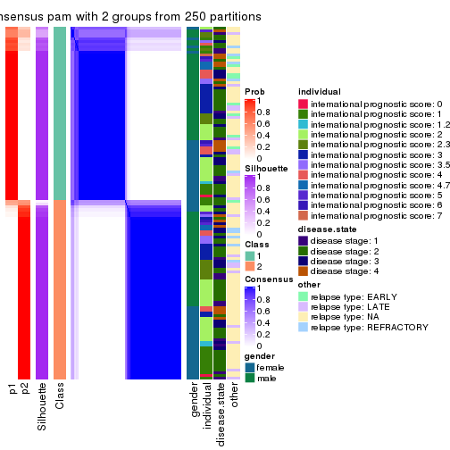</p>

</div>
<div id='tab-ATC-pam-consensus-heatmap-2'>
<pre><code class="r">consensus_heatmap(res, k = 3)
</code></pre>

<p>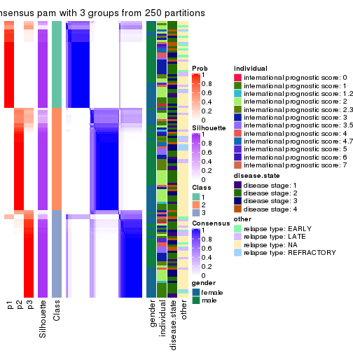</p>

</div>
<div id='tab-ATC-pam-consensus-heatmap-3'>
<pre><code class="r">consensus_heatmap(res, k = 4)
</code></pre>

<p>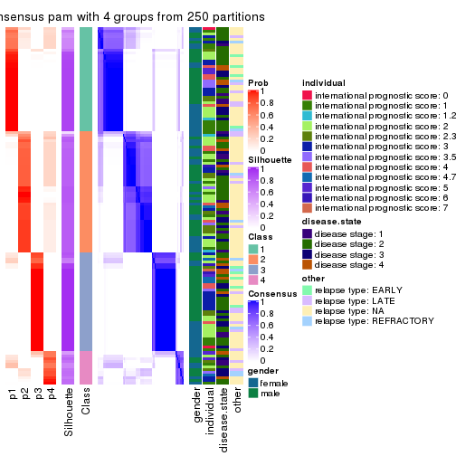</p>

</div>
<div id='tab-ATC-pam-consensus-heatmap-4'>
<pre><code class="r">consensus_heatmap(res, k = 5)
</code></pre>

<p>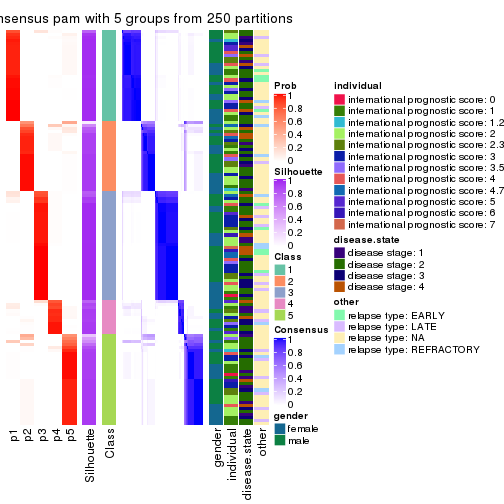</p>

</div>
<div id='tab-ATC-pam-consensus-heatmap-5'>
<pre><code class="r">consensus_heatmap(res, k = 6)
</code></pre>

<p>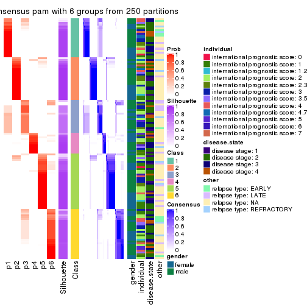</p>

</div>
</div>

Heatmaps for the membership of samples in all partitions to see how consistent they are:


<script>
$( function() {
	$( '#tabs-ATC-pam-membership-heatmap' ).tabs();
} );
</script>
<div id='tabs-ATC-pam-membership-heatmap'>
<ul>
<li><a href='#tab-ATC-pam-membership-heatmap-1'>k = 2</a></li>
<li><a href='#tab-ATC-pam-membership-heatmap-2'>k = 3</a></li>
<li><a href='#tab-ATC-pam-membership-heatmap-3'>k = 4</a></li>
<li><a href='#tab-ATC-pam-membership-heatmap-4'>k = 5</a></li>
<li><a href='#tab-ATC-pam-membership-heatmap-5'>k = 6</a></li>
</ul>
<div id='tab-ATC-pam-membership-heatmap-1'>
<pre><code class="r">membership_heatmap(res, k = 2)
</code></pre>

<p>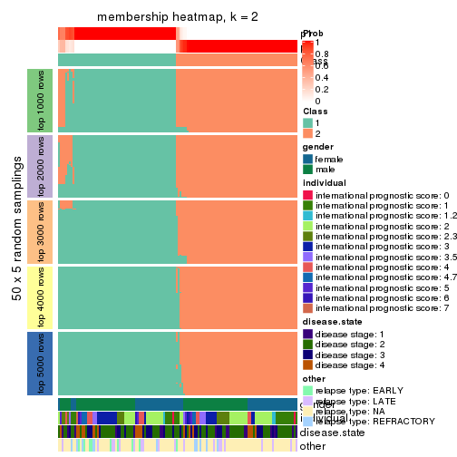</p>

</div>
<div id='tab-ATC-pam-membership-heatmap-2'>
<pre><code class="r">membership_heatmap(res, k = 3)
</code></pre>

<p>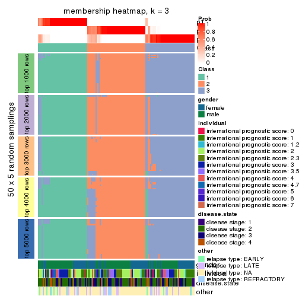</p>

</div>
<div id='tab-ATC-pam-membership-heatmap-3'>
<pre><code class="r">membership_heatmap(res, k = 4)
</code></pre>

<p>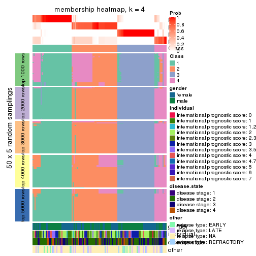</p>

</div>
<div id='tab-ATC-pam-membership-heatmap-4'>
<pre><code class="r">membership_heatmap(res, k = 5)
</code></pre>

<p>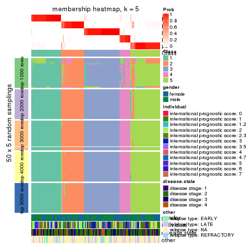</p>

</div>
<div id='tab-ATC-pam-membership-heatmap-5'>
<pre><code class="r">membership_heatmap(res, k = 6)
</code></pre>

<p>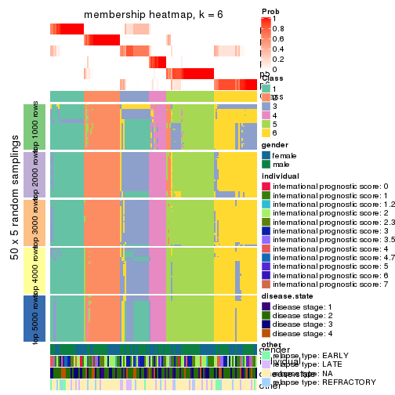</p>

</div>
</div>

As soon as we have had the classes for columns, we can look for signatures
which are significantly different between classes which can be candidate marks
for certain classes. Following are the heatmaps for signatures.


Signature heatmaps where rows are scaled:


<script>
$( function() {
	$( '#tabs-ATC-pam-get-signatures' ).tabs();
} );
</script>
<div id='tabs-ATC-pam-get-signatures'>
<ul>
<li><a href='#tab-ATC-pam-get-signatures-1'>k = 2</a></li>
<li><a href='#tab-ATC-pam-get-signatures-2'>k = 3</a></li>
<li><a href='#tab-ATC-pam-get-signatures-3'>k = 4</a></li>
<li><a href='#tab-ATC-pam-get-signatures-4'>k = 5</a></li>
<li><a href='#tab-ATC-pam-get-signatures-5'>k = 6</a></li>
</ul>
<div id='tab-ATC-pam-get-signatures-1'>
<pre><code class="r">get_signatures(res, k = 2)
</code></pre>

<p>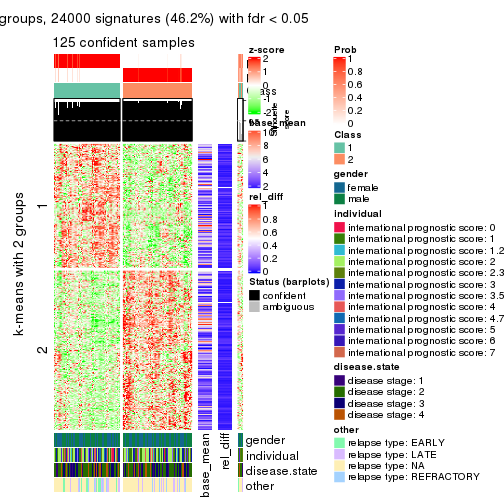</p>

</div>
<div id='tab-ATC-pam-get-signatures-2'>
<pre><code class="r">get_signatures(res, k = 3)
</code></pre>

<p>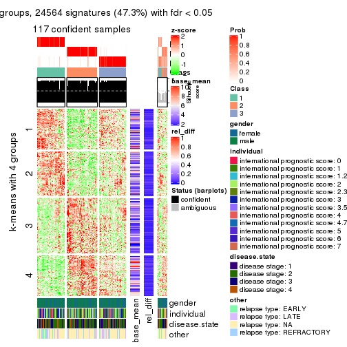</p>

</div>
<div id='tab-ATC-pam-get-signatures-3'>
<pre><code class="r">get_signatures(res, k = 4)
</code></pre>

<p>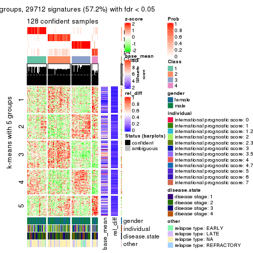</p>

</div>
<div id='tab-ATC-pam-get-signatures-4'>
<pre><code class="r">get_signatures(res, k = 5)
</code></pre>

<pre><code>#&gt; Error: The width or height of the raster image is zero, maybe you forget to turn off the
#&gt; previous graphic device or it was corrupted. Run `dev.off()` to close it.
</code></pre>

<p></p>

</div>
<div id='tab-ATC-pam-get-signatures-5'>
<pre><code class="r">get_signatures(res, k = 6)
</code></pre>

<pre><code>#&gt; Error: The width or height of the raster image is zero, maybe you forget to turn off the
#&gt; previous graphic device or it was corrupted. Run `dev.off()` to close it.
</code></pre>

<p></p>

</div>
</div>


Signature heatmaps where rows are not scaled:


<script>
$( function() {
	$( '#tabs-ATC-pam-get-signatures-no-scale' ).tabs();
} );
</script>
<div id='tabs-ATC-pam-get-signatures-no-scale'>
<ul>
<li><a href='#tab-ATC-pam-get-signatures-no-scale-1'>k = 2</a></li>
<li><a href='#tab-ATC-pam-get-signatures-no-scale-2'>k = 3</a></li>
<li><a href='#tab-ATC-pam-get-signatures-no-scale-3'>k = 4</a></li>
<li><a href='#tab-ATC-pam-get-signatures-no-scale-4'>k = 5</a></li>
<li><a href='#tab-ATC-pam-get-signatures-no-scale-5'>k = 6</a></li>
</ul>
<div id='tab-ATC-pam-get-signatures-no-scale-1'>
<pre><code class="r">get_signatures(res, k = 2, scale_rows = FALSE)
</code></pre>

<p>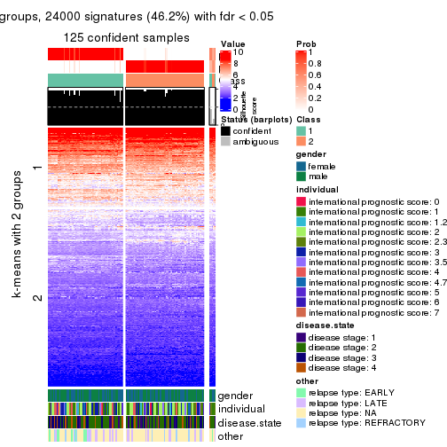</p>

</div>
<div id='tab-ATC-pam-get-signatures-no-scale-2'>
<pre><code class="r">get_signatures(res, k = 3, scale_rows = FALSE)
</code></pre>

<p>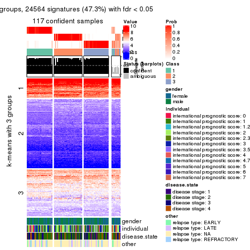</p>

</div>
<div id='tab-ATC-pam-get-signatures-no-scale-3'>
<pre><code class="r">get_signatures(res, k = 4, scale_rows = FALSE)
</code></pre>

<p>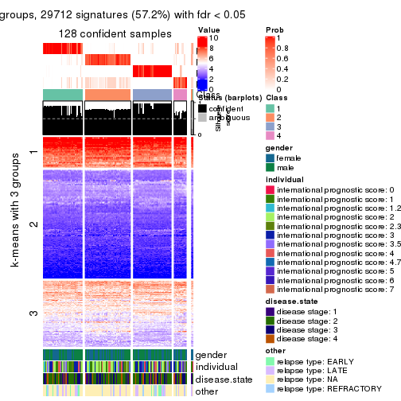</p>

</div>
<div id='tab-ATC-pam-get-signatures-no-scale-4'>
<pre><code class="r">get_signatures(res, k = 5, scale_rows = FALSE)
</code></pre>

<pre><code>#&gt; Error in mat[ceiling(1:nr/h_ratio), ceiling(1:nc/w_ratio), drop = FALSE]: subscript out of bounds
</code></pre>

<p>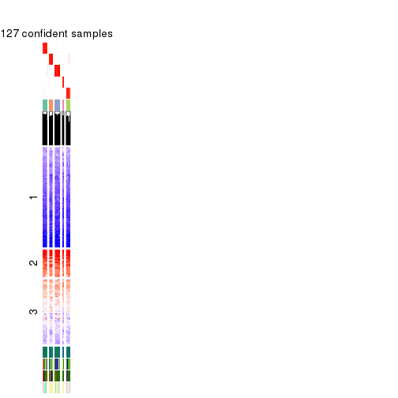</p>

</div>
<div id='tab-ATC-pam-get-signatures-no-scale-5'>
<pre><code class="r">get_signatures(res, k = 6, scale_rows = FALSE)
</code></pre>

<p>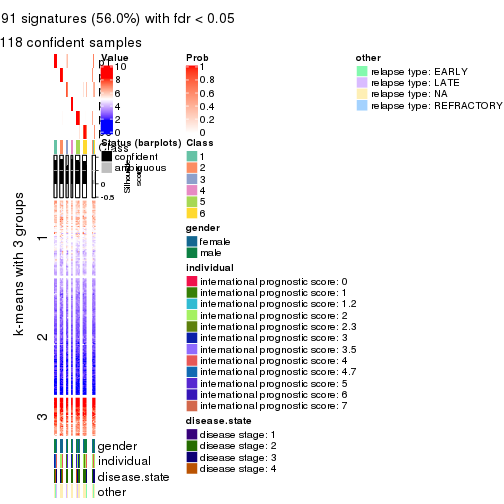</p>

</div>
</div>


Compare the overlap of signatures from different k:

```r
compare_signatures(res)
```

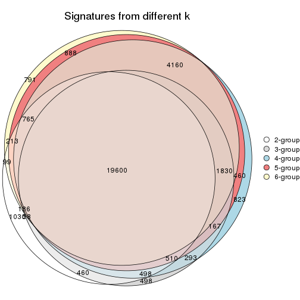

`get_signature()` returns a data frame invisibly. TO get the list of signatures, the function
call should be assigned to a variable explicitly. In following code, if `plot` argument is set
to `FALSE`, no heatmap is plotted while only the differential analysis is performed.

```r
# code only for demonstration
tb = get_signature(res, k = ..., plot = FALSE)
```

An example of the output of `tb` is:

```
#>   which_row         fdr    mean_1    mean_2 scaled_mean_1 scaled_mean_2 km
#> 1        38 0.042760348  8.373488  9.131774    -0.5533452     0.5164555  1
#> 2        40 0.018707592  7.106213  8.469186    -0.6173731     0.5762149  1
#> 3        55 0.019134737 10.221463 11.207825    -0.6159697     0.5749050  1
#> 4        59 0.006059896  5.921854  7.869574    -0.6899429     0.6439467  1
#> 5        60 0.018055526  8.928898 10.211722    -0.6204761     0.5791110  1
#> 6        98 0.009384629 15.714769 14.887706     0.6635654    -0.6193277  2
...
```

The columns in `tb` are:

1. `which_row`: row indices corresponding to the input matrix.
2. `fdr`: FDR for the differential test. 
3. `mean_x`: The mean value in group x.
4. `scaled_mean_x`: The mean value in group x after rows are scaled.
5. `km`: Row groups if k-means clustering is applied to rows.


UMAP plot which shows how samples are separated.


<script>
$( function() {
	$( '#tabs-ATC-pam-dimension-reduction' ).tabs();
} );
</script>
<div id='tabs-ATC-pam-dimension-reduction'>
<ul>
<li><a href='#tab-ATC-pam-dimension-reduction-1'>k = 2</a></li>
<li><a href='#tab-ATC-pam-dimension-reduction-2'>k = 3</a></li>
<li><a href='#tab-ATC-pam-dimension-reduction-3'>k = 4</a></li>
<li><a href='#tab-ATC-pam-dimension-reduction-4'>k = 5</a></li>
<li><a href='#tab-ATC-pam-dimension-reduction-5'>k = 6</a></li>
</ul>
<div id='tab-ATC-pam-dimension-reduction-1'>
<pre><code class="r">dimension_reduction(res, k = 2, method = &quot;UMAP&quot;)
</code></pre>

<p>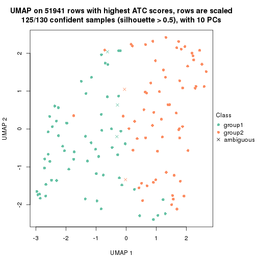</p>

</div>
<div id='tab-ATC-pam-dimension-reduction-2'>
<pre><code class="r">dimension_reduction(res, k = 3, method = &quot;UMAP&quot;)
</code></pre>

<p>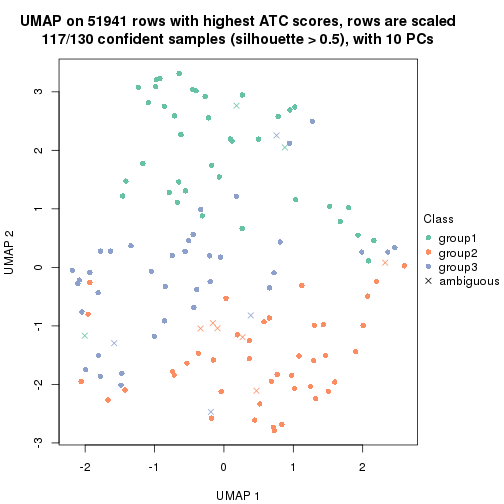</p>

</div>
<div id='tab-ATC-pam-dimension-reduction-3'>
<pre><code class="r">dimension_reduction(res, k = 4, method = &quot;UMAP&quot;)
</code></pre>

<p>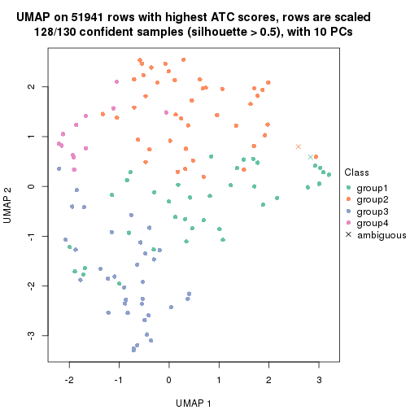</p>

</div>
<div id='tab-ATC-pam-dimension-reduction-4'>
<pre><code class="r">dimension_reduction(res, k = 5, method = &quot;UMAP&quot;)
</code></pre>

<p>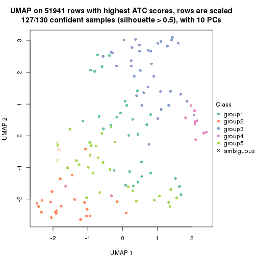</p>

</div>
<div id='tab-ATC-pam-dimension-reduction-5'>
<pre><code class="r">dimension_reduction(res, k = 6, method = &quot;UMAP&quot;)
</code></pre>

<p>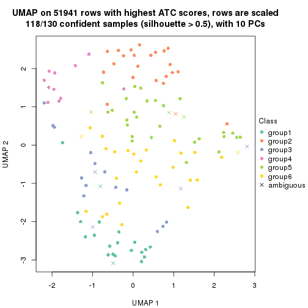</p>

</div>
</div>


Following heatmap shows how subgroups are split when increasing `k`:

```r
collect_classes(res)
```

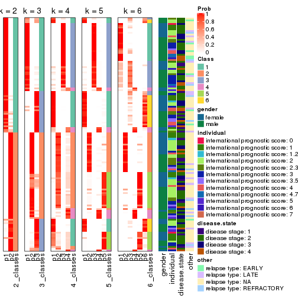


Test correlation between subgroups and known annotations. If the known
annotation is numeric, one-way ANOVA test is applied, and if the known
annotation is discrete, chi-squared contingency table test is applied.

```r
test_to_known_factors(res)
```

```
#>           n gender(p) individual(p) disease.state(p) other(p) k
#> ATC:pam 125     0.902         0.946            0.764   0.0256 2
#> ATC:pam 117     0.596         0.542            0.618   0.2994 3
#> ATC:pam 128     0.764         0.560            0.875   0.2907 4
#> ATC:pam 127     0.675         0.746            0.953   0.4170 5
#> ATC:pam 118     0.801         0.739            0.857   0.4558 6
```


If matrix rows can be associated to genes, consider to use `GO_Enrichment(res,
...)` to perform function enrichment for the signature genes.


 

---------------------------------------------------


### ATC:mclust


The object with results only for a single top-value method and a single partition method 
can be extracted as:

```r
res = res_list["ATC", "mclust"]
# you can also extract it by
# res = res_list["ATC:mclust"]
```

A summary of `res` and all the functions that can be applied to it:

```r
res
```

```
#> A 'ConsensusPartition' object with k = 2, 3, 4, 5, 6.
#>   On a matrix with 51941 rows and 130 columns.
#>   Top rows (1000, 2000, 3000, 4000, 5000) are extracted by 'ATC' method.
#>   Subgroups are detected by 'mclust' method.
#>   Performed in total 1250 partitions by row resampling.
#>   Best k for subgroups seems to be 3.
#> 
#> Following methods can be applied to this 'ConsensusPartition' object:
#>  [1] "cola_report"             "collect_classes"         "collect_plots"          
#>  [4] "collect_stats"           "colnames"                "compare_signatures"     
#>  [7] "consensus_heatmap"       "dimension_reduction"     "functional_enrichment"  
#> [10] "get_anno_col"            "get_anno"                "get_classes"            
#> [13] "get_consensus"           "get_matrix"              "get_membership"         
#> [16] "get_param"               "get_signatures"          "get_stats"              
#> [19] "is_best_k"               "is_stable_k"             "membership_heatmap"     
#> [22] "ncol"                    "nrow"                    "plot_ecdf"              
#> [25] "rownames"                "select_partition_number" "show"                   
#> [28] "suggest_best_k"          "test_to_known_factors"
```

`collect_plots()` function collects all the plots made from `res` for all `k` (number of partitions)
into one single page to provide an easy and fast comparison between different `k`.

```r
collect_plots(res)
```

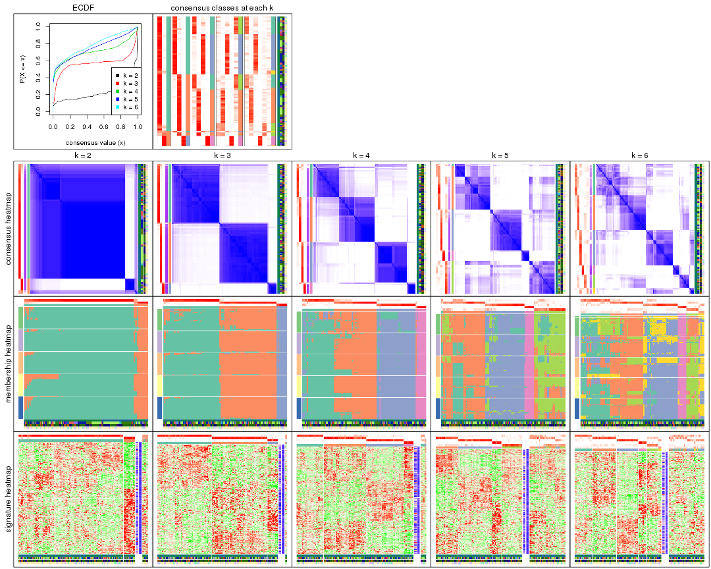

The plots are:

- The first row: a plot of the ECDF (Empirical cumulative distribution
  function) curves of the consensus matrix for each `k` and the heatmap of
  predicted classes for each `k`.
- The second row: heatmaps of the consensus matrix for each `k`.
- The third row: heatmaps of the membership matrix for each `k`.
- The fouth row: heatmaps of the signatures for each `k`.

All the plots in panels can be made by individual functions and they are
plotted later in this section.

`select_partition_number()` produces several plots showing different
statistics for choosing "optimized" `k`. There are following statistics:

- ECDF curves of the consensus matrix for each `k`;
- 1-PAC. [The PAC
  score](https://en.wikipedia.org/wiki/Consensus_clustering#Over-interpretation_potential_of_consensus_clustering)
  measures the proportion of the ambiguous subgrouping.
- Mean silhouette score.
- Concordance. The mean probability of fiting the consensus class ids in all
  partitions.
- Area increased. Denote $A_k$ as the area under the ECDF curve for current
  `k`, the area increased is defined as $A_k - A_{k-1}$.
- Rand index. The percent of pairs of samples that are both in a same cluster
  or both are not in a same cluster in the partition of k and k-1.
- Jaccard index. The ratio of pairs of samples are both in a same cluster in
  the partition of k and k-1 and the pairs of samples are both in a same
  cluster in the partition k or k-1.

The detailed explanations of these statistics can be found in [the cola
vignette](http://bioconductor.org/packages/devel/bioc/vignettes/cola/inst/doc/cola.html#toc_13).

Generally speaking, lower PAC score, higher mean silhouette score or higher
concordance corresponds to better partition. Rand index and Jaccard index
measure how similar the current partition is compared to partition with `k-1`.
If they are too similar, we won't accept `k` is better than `k-1`.

```r
select_partition_number(res)
```

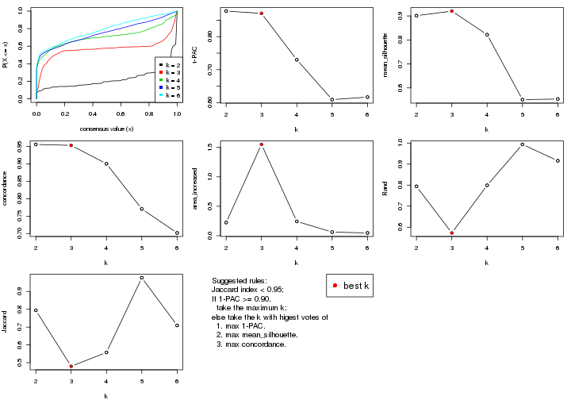

The numeric values for all these statistics can be obtained by `get_stats()`.

```r
get_stats(res)
```

```
#>   k 1-PAC mean_silhouette concordance area_increased  Rand Jaccard
#> 2 2 0.878           0.901       0.956         0.2237 0.794   0.794
#> 3 3 0.871           0.920       0.953         1.5508 0.573   0.480
#> 4 4 0.730           0.822       0.900         0.2427 0.799   0.558
#> 5 5 0.609           0.551       0.771         0.0618 0.993   0.977
#> 6 6 0.617           0.554       0.702         0.0465 0.916   0.709
```

`suggest_best_k()` suggests the best $k$ based on these statistics. The rules are as follows:

- All $k$ with Jaccard index larger than 0.95 are removed because the increase of
  the partition number does not provides enough extra information. If all $k$ are removed,
  the best $k$ is assigned by `NA`.
- For $k$ with 1-PAC larger than 0.9, the maximal $k$ is taken as the "best k". Other $k$ is called "optional k".
- If it does not fit the second rule. The $k$ with the highest vote of highest
  1-PAC, mean silhouette and concordance is taken as the "best k".

```r
suggest_best_k(res)
```

```
#> [1] 3
```


Following shows the table of the partitions (You need to click the **show/hide
code output** link to see it). The membership matrix (columns with name `p*`)
is inferred by
[`clue::cl_consensus()`](https://www.rdocumentation.org/link/cl_consensus?package=clue)
function with the `SE` method. Basically the value in the membership matrix
represents the probability to belong to a certain group. The finall class
label for an item is determined with the group with highest probability it
belongs to.

In `get_classes()` function, the entropy is calculated from the membership
matrix and the silhouette score is calculated from the consensus matrix.


<script>
$( function() {
	$( '#tabs-ATC-mclust-get-classes' ).tabs();
} );
</script>
<div id='tabs-ATC-mclust-get-classes'>
<ul>
<li><a href='#tab-ATC-mclust-get-classes-1'>k = 2</a></li>
<li><a href='#tab-ATC-mclust-get-classes-2'>k = 3</a></li>
<li><a href='#tab-ATC-mclust-get-classes-3'>k = 4</a></li>
<li><a href='#tab-ATC-mclust-get-classes-4'>k = 5</a></li>
<li><a href='#tab-ATC-mclust-get-classes-5'>k = 6</a></li>
</ul>

<div id='tab-ATC-mclust-get-classes-1'>
<p><a id='tab-ATC-mclust-get-classes-1-a' style='color:#0366d6' href='#'>show/hide code output</a></p>
<pre><code class="r">cbind(get_classes(res, k = 2), get_membership(res, k = 2))
</code></pre>

<pre><code>#&gt;           class entropy silhouette    p1    p2
#&gt; GSM447671     1  0.0000      0.961 1.000 0.000
#&gt; GSM447694     1  0.1843      0.942 0.972 0.028
#&gt; GSM447618     1  0.0000      0.961 1.000 0.000
#&gt; GSM447691     1  0.0000      0.961 1.000 0.000
#&gt; GSM447733     2  0.9977      0.167 0.472 0.528
#&gt; GSM447620     1  0.0000      0.961 1.000 0.000
#&gt; GSM447627     1  0.8713      0.585 0.708 0.292
#&gt; GSM447630     1  0.0000      0.961 1.000 0.000
#&gt; GSM447642     1  0.2778      0.935 0.952 0.048
#&gt; GSM447649     1  0.2236      0.942 0.964 0.036
#&gt; GSM447654     2  0.0000      0.866 0.000 1.000
#&gt; GSM447655     1  0.0000      0.961 1.000 0.000
#&gt; GSM447669     1  0.0000      0.961 1.000 0.000
#&gt; GSM447676     1  0.2778      0.935 0.952 0.048
#&gt; GSM447678     1  0.5842      0.837 0.860 0.140
#&gt; GSM447681     1  0.0000      0.961 1.000 0.000
#&gt; GSM447698     1  0.0000      0.961 1.000 0.000
#&gt; GSM447713     1  0.0000      0.961 1.000 0.000
#&gt; GSM447722     1  0.2778      0.935 0.952 0.048
#&gt; GSM447726     1  0.0000      0.961 1.000 0.000
#&gt; GSM447735     1  0.6048      0.832 0.852 0.148
#&gt; GSM447737     1  0.0000      0.961 1.000 0.000
#&gt; GSM447657     1  0.0000      0.961 1.000 0.000
#&gt; GSM447674     1  0.0000      0.961 1.000 0.000
#&gt; GSM447636     1  0.2778      0.935 0.952 0.048
#&gt; GSM447723     1  0.0000      0.961 1.000 0.000
#&gt; GSM447699     1  0.0000      0.961 1.000 0.000
#&gt; GSM447708     1  0.0000      0.961 1.000 0.000
#&gt; GSM447721     1  0.0000      0.961 1.000 0.000
#&gt; GSM447623     1  0.0000      0.961 1.000 0.000
#&gt; GSM447621     1  0.0000      0.961 1.000 0.000
#&gt; GSM447650     1  0.0000      0.961 1.000 0.000
#&gt; GSM447651     1  0.0000      0.961 1.000 0.000
#&gt; GSM447653     2  0.0000      0.866 0.000 1.000
#&gt; GSM447658     1  0.0000      0.961 1.000 0.000
#&gt; GSM447675     2  0.0672      0.864 0.008 0.992
#&gt; GSM447680     1  0.2778      0.935 0.952 0.048
#&gt; GSM447686     1  0.0000      0.961 1.000 0.000
#&gt; GSM447736     1  0.0000      0.961 1.000 0.000
#&gt; GSM447629     1  0.0000      0.961 1.000 0.000
#&gt; GSM447648     1  0.0000      0.961 1.000 0.000
#&gt; GSM447660     1  0.0000      0.961 1.000 0.000
#&gt; GSM447661     1  0.0000      0.961 1.000 0.000
#&gt; GSM447663     1  0.0000      0.961 1.000 0.000
#&gt; GSM447704     1  0.0000      0.961 1.000 0.000
#&gt; GSM447720     1  0.0000      0.961 1.000 0.000
#&gt; GSM447652     1  0.2948      0.932 0.948 0.052
#&gt; GSM447679     1  0.0000      0.961 1.000 0.000
#&gt; GSM447712     1  0.2236      0.942 0.964 0.036
#&gt; GSM447664     1  0.7674      0.707 0.776 0.224
#&gt; GSM447637     1  0.0376      0.959 0.996 0.004
#&gt; GSM447639     1  0.2778      0.935 0.952 0.048
#&gt; GSM447615     1  0.2778      0.935 0.952 0.048
#&gt; GSM447656     1  0.0000      0.961 1.000 0.000
#&gt; GSM447673     1  0.8608      0.588 0.716 0.284
#&gt; GSM447719     2  0.0000      0.866 0.000 1.000
#&gt; GSM447706     1  0.2778      0.935 0.952 0.048
#&gt; GSM447612     1  0.0000      0.961 1.000 0.000
#&gt; GSM447665     1  0.0000      0.961 1.000 0.000
#&gt; GSM447677     1  0.2778      0.935 0.952 0.048
#&gt; GSM447613     1  0.0000      0.961 1.000 0.000
#&gt; GSM447659     2  0.0938      0.863 0.012 0.988
#&gt; GSM447662     1  0.0000      0.961 1.000 0.000
#&gt; GSM447666     1  0.2778      0.935 0.952 0.048
#&gt; GSM447668     1  0.0376      0.959 0.996 0.004
#&gt; GSM447682     1  0.0000      0.961 1.000 0.000
#&gt; GSM447683     1  0.0000      0.961 1.000 0.000
#&gt; GSM447688     2  0.9977      0.186 0.472 0.528
#&gt; GSM447702     1  0.0000      0.961 1.000 0.000
#&gt; GSM447709     1  0.0000      0.961 1.000 0.000
#&gt; GSM447711     1  0.0000      0.961 1.000 0.000
#&gt; GSM447715     1  0.0000      0.961 1.000 0.000
#&gt; GSM447693     1  0.4431      0.898 0.908 0.092
#&gt; GSM447611     2  0.0000      0.866 0.000 1.000
#&gt; GSM447672     1  0.0000      0.961 1.000 0.000
#&gt; GSM447703     1  0.9286      0.441 0.656 0.344
#&gt; GSM447727     1  0.0000      0.961 1.000 0.000
#&gt; GSM447638     1  0.2778      0.935 0.952 0.048
#&gt; GSM447670     1  0.2778      0.935 0.952 0.048
#&gt; GSM447700     1  0.0000      0.961 1.000 0.000
#&gt; GSM447738     1  0.2603      0.938 0.956 0.044
#&gt; GSM447739     1  0.3879      0.913 0.924 0.076
#&gt; GSM447617     1  0.0000      0.961 1.000 0.000
#&gt; GSM447628     2  0.0000      0.866 0.000 1.000
#&gt; GSM447632     1  0.0000      0.961 1.000 0.000
#&gt; GSM447619     1  0.0000      0.961 1.000 0.000
#&gt; GSM447643     1  0.0672      0.957 0.992 0.008
#&gt; GSM447724     1  0.2778      0.935 0.952 0.048
#&gt; GSM447728     1  0.0000      0.961 1.000 0.000
#&gt; GSM447610     1  0.9427      0.414 0.640 0.360
#&gt; GSM447633     1  0.0000      0.961 1.000 0.000
#&gt; GSM447634     1  0.0000      0.961 1.000 0.000
#&gt; GSM447622     1  0.0000      0.961 1.000 0.000
#&gt; GSM447667     1  0.0376      0.959 0.996 0.004
#&gt; GSM447687     1  0.9732      0.255 0.596 0.404
#&gt; GSM447695     1  0.0000      0.961 1.000 0.000
#&gt; GSM447696     1  0.4298      0.903 0.912 0.088
#&gt; GSM447697     1  0.0000      0.961 1.000 0.000
#&gt; GSM447714     1  0.0000      0.961 1.000 0.000
#&gt; GSM447717     1  0.2423      0.940 0.960 0.040
#&gt; GSM447725     1  0.2778      0.935 0.952 0.048
#&gt; GSM447729     2  0.0376      0.865 0.004 0.996
#&gt; GSM447644     1  0.0000      0.961 1.000 0.000
#&gt; GSM447710     1  0.0000      0.961 1.000 0.000
#&gt; GSM447614     1  0.7674      0.718 0.776 0.224
#&gt; GSM447685     1  0.0000      0.961 1.000 0.000
#&gt; GSM447690     1  0.6048      0.833 0.852 0.148
#&gt; GSM447730     2  0.8661      0.617 0.288 0.712
#&gt; GSM447646     2  0.0000      0.866 0.000 1.000
#&gt; GSM447689     1  0.0000      0.961 1.000 0.000
#&gt; GSM447635     1  0.0000      0.961 1.000 0.000
#&gt; GSM447641     1  0.0000      0.961 1.000 0.000
#&gt; GSM447716     1  0.0000      0.961 1.000 0.000
#&gt; GSM447718     1  0.0000      0.961 1.000 0.000
#&gt; GSM447616     1  0.0000      0.961 1.000 0.000
#&gt; GSM447626     1  0.2778      0.935 0.952 0.048
#&gt; GSM447640     1  0.0000      0.961 1.000 0.000
#&gt; GSM447734     1  0.0000      0.961 1.000 0.000
#&gt; GSM447692     1  0.0938      0.953 0.988 0.012
#&gt; GSM447647     2  0.4939      0.807 0.108 0.892
#&gt; GSM447624     1  0.0000      0.961 1.000 0.000
#&gt; GSM447625     1  0.0000      0.961 1.000 0.000
#&gt; GSM447707     2  0.9635      0.428 0.388 0.612
#&gt; GSM447732     1  0.0000      0.961 1.000 0.000
#&gt; GSM447684     1  0.2778      0.935 0.952 0.048
#&gt; GSM447731     2  0.0000      0.866 0.000 1.000
#&gt; GSM447705     1  0.0000      0.961 1.000 0.000
#&gt; GSM447631     1  0.4562      0.894 0.904 0.096
#&gt; GSM447701     1  0.0000      0.961 1.000 0.000
#&gt; GSM447645     1  0.2423      0.940 0.960 0.040
</code></pre>

<script>
$('#tab-ATC-mclust-get-classes-1-a').parent().next().next().hide();
$('#tab-ATC-mclust-get-classes-1-a').click(function(){
  $('#tab-ATC-mclust-get-classes-1-a').parent().next().next().toggle();
  return(false);
});
</script>
</div>

<div id='tab-ATC-mclust-get-classes-2'>
<p><a id='tab-ATC-mclust-get-classes-2-a' style='color:#0366d6' href='#'>show/hide code output</a></p>
<pre><code class="r">cbind(get_classes(res, k = 3), get_membership(res, k = 3))
</code></pre>

<pre><code>#&gt;           class entropy silhouette    p1    p2    p3
#&gt; GSM447671     2  0.0747      0.956 0.016 0.984 0.000
#&gt; GSM447694     1  0.0424      0.943 0.992 0.008 0.000
#&gt; GSM447618     2  0.1289      0.955 0.032 0.968 0.000
#&gt; GSM447691     2  0.1289      0.955 0.032 0.968 0.000
#&gt; GSM447733     1  0.4744      0.834 0.836 0.028 0.136
#&gt; GSM447620     2  0.0892      0.955 0.020 0.980 0.000
#&gt; GSM447627     1  0.1636      0.936 0.964 0.016 0.020
#&gt; GSM447630     2  0.6260      0.134 0.448 0.552 0.000
#&gt; GSM447642     1  0.1643      0.937 0.956 0.044 0.000
#&gt; GSM447649     2  0.0747      0.959 0.016 0.984 0.000
#&gt; GSM447654     3  0.0000      0.952 0.000 0.000 1.000
#&gt; GSM447655     2  0.0747      0.959 0.016 0.984 0.000
#&gt; GSM447669     2  0.1031      0.954 0.024 0.976 0.000
#&gt; GSM447676     1  0.1031      0.943 0.976 0.024 0.000
#&gt; GSM447678     2  0.2955      0.919 0.080 0.912 0.008
#&gt; GSM447681     2  0.1031      0.959 0.024 0.976 0.000
#&gt; GSM447698     2  0.1031      0.959 0.024 0.976 0.000
#&gt; GSM447713     1  0.0000      0.942 1.000 0.000 0.000
#&gt; GSM447722     1  0.4110      0.832 0.844 0.152 0.004
#&gt; GSM447726     2  0.1411      0.958 0.036 0.964 0.000
#&gt; GSM447735     1  0.1337      0.940 0.972 0.012 0.016
#&gt; GSM447737     1  0.0424      0.943 0.992 0.008 0.000
#&gt; GSM447657     2  0.0892      0.958 0.020 0.980 0.000
#&gt; GSM447674     2  0.1031      0.959 0.024 0.976 0.000
#&gt; GSM447636     2  0.3412      0.865 0.124 0.876 0.000
#&gt; GSM447723     1  0.2356      0.919 0.928 0.072 0.000
#&gt; GSM447699     1  0.2165      0.924 0.936 0.064 0.000
#&gt; GSM447708     2  0.0892      0.958 0.020 0.980 0.000
#&gt; GSM447721     1  0.0424      0.944 0.992 0.008 0.000
#&gt; GSM447623     1  0.0000      0.942 1.000 0.000 0.000
#&gt; GSM447621     1  0.0000      0.942 1.000 0.000 0.000
#&gt; GSM447650     2  0.0747      0.959 0.016 0.984 0.000
#&gt; GSM447651     2  0.0892      0.959 0.020 0.980 0.000
#&gt; GSM447653     3  0.0000      0.952 0.000 0.000 1.000
#&gt; GSM447658     2  0.4121      0.813 0.168 0.832 0.000
#&gt; GSM447675     3  0.1585      0.934 0.028 0.008 0.964
#&gt; GSM447680     2  0.0892      0.955 0.020 0.980 0.000
#&gt; GSM447686     2  0.1411      0.958 0.036 0.964 0.000
#&gt; GSM447736     1  0.2261      0.920 0.932 0.068 0.000
#&gt; GSM447629     2  0.1031      0.958 0.024 0.976 0.000
#&gt; GSM447648     1  0.0000      0.942 1.000 0.000 0.000
#&gt; GSM447660     2  0.3038      0.893 0.104 0.896 0.000
#&gt; GSM447661     2  0.0424      0.956 0.008 0.992 0.000
#&gt; GSM447663     1  0.4002      0.839 0.840 0.160 0.000
#&gt; GSM447704     2  0.0747      0.959 0.016 0.984 0.000
#&gt; GSM447720     1  0.4121      0.824 0.832 0.168 0.000
#&gt; GSM447652     2  0.1315      0.958 0.020 0.972 0.008
#&gt; GSM447679     2  0.1031      0.959 0.024 0.976 0.000
#&gt; GSM447712     1  0.0747      0.943 0.984 0.016 0.000
#&gt; GSM447664     2  0.1337      0.956 0.016 0.972 0.012
#&gt; GSM447637     1  0.0000      0.942 1.000 0.000 0.000
#&gt; GSM447639     1  0.1529      0.939 0.960 0.040 0.000
#&gt; GSM447615     1  0.1411      0.940 0.964 0.036 0.000
#&gt; GSM447656     2  0.1289      0.958 0.032 0.968 0.000
#&gt; GSM447673     2  0.1453      0.958 0.024 0.968 0.008
#&gt; GSM447719     3  0.0000      0.952 0.000 0.000 1.000
#&gt; GSM447706     1  0.1031      0.942 0.976 0.024 0.000
#&gt; GSM447612     1  0.3482      0.864 0.872 0.128 0.000
#&gt; GSM447665     2  0.0592      0.955 0.012 0.988 0.000
#&gt; GSM447677     2  0.0592      0.958 0.012 0.988 0.000
#&gt; GSM447613     1  0.0892      0.943 0.980 0.020 0.000
#&gt; GSM447659     3  0.2711      0.881 0.088 0.000 0.912
#&gt; GSM447662     1  0.2066      0.932 0.940 0.060 0.000
#&gt; GSM447666     2  0.2448      0.914 0.076 0.924 0.000
#&gt; GSM447668     2  0.0424      0.956 0.008 0.992 0.000
#&gt; GSM447682     2  0.1163      0.959 0.028 0.972 0.000
#&gt; GSM447683     2  0.0747      0.959 0.016 0.984 0.000
#&gt; GSM447688     2  0.2297      0.938 0.020 0.944 0.036
#&gt; GSM447702     2  0.0747      0.959 0.016 0.984 0.000
#&gt; GSM447709     2  0.0747      0.959 0.016 0.984 0.000
#&gt; GSM447711     1  0.0747      0.944 0.984 0.016 0.000
#&gt; GSM447715     2  0.2448      0.928 0.076 0.924 0.000
#&gt; GSM447693     1  0.0747      0.937 0.984 0.016 0.000
#&gt; GSM447611     3  0.0000      0.952 0.000 0.000 1.000
#&gt; GSM447672     2  0.0892      0.959 0.020 0.980 0.000
#&gt; GSM447703     2  0.1170      0.956 0.016 0.976 0.008
#&gt; GSM447727     1  0.2625      0.907 0.916 0.084 0.000
#&gt; GSM447638     2  0.1753      0.936 0.048 0.952 0.000
#&gt; GSM447670     1  0.1411      0.940 0.964 0.036 0.000
#&gt; GSM447700     1  0.6180      0.357 0.584 0.416 0.000
#&gt; GSM447738     2  0.0747      0.959 0.016 0.984 0.000
#&gt; GSM447739     1  0.0424      0.940 0.992 0.008 0.000
#&gt; GSM447617     1  0.0000      0.942 1.000 0.000 0.000
#&gt; GSM447628     3  0.0000      0.952 0.000 0.000 1.000
#&gt; GSM447632     2  0.0747      0.959 0.016 0.984 0.000
#&gt; GSM447619     1  0.1031      0.943 0.976 0.024 0.000
#&gt; GSM447643     2  0.0747      0.957 0.016 0.984 0.000
#&gt; GSM447724     1  0.3038      0.888 0.896 0.104 0.000
#&gt; GSM447728     2  0.1031      0.959 0.024 0.976 0.000
#&gt; GSM447610     1  0.1482      0.937 0.968 0.012 0.020
#&gt; GSM447633     2  0.0747      0.956 0.016 0.984 0.000
#&gt; GSM447634     1  0.2165      0.925 0.936 0.064 0.000
#&gt; GSM447622     1  0.0000      0.942 1.000 0.000 0.000
#&gt; GSM447667     2  0.0592      0.958 0.012 0.988 0.000
#&gt; GSM447687     2  0.1170      0.956 0.016 0.976 0.008
#&gt; GSM447695     1  0.1031      0.942 0.976 0.024 0.000
#&gt; GSM447696     1  0.0424      0.940 0.992 0.008 0.000
#&gt; GSM447697     1  0.0000      0.942 1.000 0.000 0.000
#&gt; GSM447714     1  0.1289      0.941 0.968 0.032 0.000
#&gt; GSM447717     2  0.4291      0.796 0.180 0.820 0.000
#&gt; GSM447725     1  0.0592      0.944 0.988 0.012 0.000
#&gt; GSM447729     3  0.1015      0.944 0.012 0.008 0.980
#&gt; GSM447644     2  0.0747      0.956 0.016 0.984 0.000
#&gt; GSM447710     1  0.1163      0.943 0.972 0.028 0.000
#&gt; GSM447614     1  0.1620      0.936 0.964 0.012 0.024
#&gt; GSM447685     2  0.1031      0.959 0.024 0.976 0.000
#&gt; GSM447690     1  0.0475      0.940 0.992 0.004 0.004
#&gt; GSM447730     2  0.3826      0.854 0.008 0.868 0.124
#&gt; GSM447646     3  0.0000      0.952 0.000 0.000 1.000
#&gt; GSM447689     1  0.2261      0.919 0.932 0.068 0.000
#&gt; GSM447635     2  0.2356      0.919 0.072 0.928 0.000
#&gt; GSM447641     1  0.1643      0.933 0.956 0.044 0.000
#&gt; GSM447716     2  0.1163      0.959 0.028 0.972 0.000
#&gt; GSM447718     1  0.2959      0.894 0.900 0.100 0.000
#&gt; GSM447616     1  0.0000      0.942 1.000 0.000 0.000
#&gt; GSM447626     1  0.2796      0.906 0.908 0.092 0.000
#&gt; GSM447640     2  0.0747      0.959 0.016 0.984 0.000
#&gt; GSM447734     1  0.1031      0.942 0.976 0.024 0.000
#&gt; GSM447692     1  0.0000      0.942 1.000 0.000 0.000
#&gt; GSM447647     3  0.6445      0.509 0.020 0.308 0.672
#&gt; GSM447624     1  0.0000      0.942 1.000 0.000 0.000
#&gt; GSM447625     1  0.1529      0.941 0.960 0.040 0.000
#&gt; GSM447707     2  0.1491      0.954 0.016 0.968 0.016
#&gt; GSM447732     1  0.1289      0.941 0.968 0.032 0.000
#&gt; GSM447684     2  0.3038      0.889 0.104 0.896 0.000
#&gt; GSM447731     3  0.0000      0.952 0.000 0.000 1.000
#&gt; GSM447705     1  0.5254      0.675 0.736 0.264 0.000
#&gt; GSM447631     1  0.0237      0.942 0.996 0.004 0.000
#&gt; GSM447701     2  0.0892      0.958 0.020 0.980 0.000
#&gt; GSM447645     1  0.0237      0.942 0.996 0.004 0.000
</code></pre>

<script>
$('#tab-ATC-mclust-get-classes-2-a').parent().next().next().hide();
$('#tab-ATC-mclust-get-classes-2-a').click(function(){
  $('#tab-ATC-mclust-get-classes-2-a').parent().next().next().toggle();
  return(false);
});
</script>
</div>

<div id='tab-ATC-mclust-get-classes-3'>
<p><a id='tab-ATC-mclust-get-classes-3-a' style='color:#0366d6' href='#'>show/hide code output</a></p>
<pre><code class="r">cbind(get_classes(res, k = 4), get_membership(res, k = 4))
</code></pre>

<pre><code>#&gt;           class entropy silhouette    p1    p2    p3    p4
#&gt; GSM447671     1  0.2965     0.8359 0.892 0.072 0.036 0.000
#&gt; GSM447694     3  0.0592     0.9143 0.016 0.000 0.984 0.000
#&gt; GSM447618     1  0.6268    -0.1107 0.496 0.448 0.056 0.000
#&gt; GSM447691     1  0.2892     0.8375 0.896 0.068 0.036 0.000
#&gt; GSM447733     3  0.5250     0.4752 0.024 0.000 0.660 0.316
#&gt; GSM447620     2  0.4790     0.5489 0.380 0.620 0.000 0.000
#&gt; GSM447627     3  0.0188     0.9141 0.004 0.000 0.996 0.000
#&gt; GSM447630     1  0.2546     0.8389 0.912 0.028 0.060 0.000
#&gt; GSM447642     1  0.1716     0.8194 0.936 0.000 0.064 0.000
#&gt; GSM447649     2  0.0000     0.8739 0.000 1.000 0.000 0.000
#&gt; GSM447654     4  0.0000     0.9178 0.000 0.000 0.000 1.000
#&gt; GSM447655     2  0.0000     0.8739 0.000 1.000 0.000 0.000
#&gt; GSM447669     1  0.2928     0.8396 0.896 0.052 0.052 0.000
#&gt; GSM447676     3  0.4730     0.5478 0.364 0.000 0.636 0.000
#&gt; GSM447678     2  0.4483     0.7362 0.104 0.808 0.088 0.000
#&gt; GSM447681     2  0.0707     0.8749 0.020 0.980 0.000 0.000
#&gt; GSM447698     2  0.1767     0.8612 0.044 0.944 0.012 0.000
#&gt; GSM447713     3  0.1867     0.9161 0.072 0.000 0.928 0.000
#&gt; GSM447722     3  0.4468     0.6497 0.232 0.016 0.752 0.000
#&gt; GSM447726     1  0.2401     0.8285 0.904 0.092 0.004 0.000
#&gt; GSM447735     3  0.0592     0.9143 0.016 0.000 0.984 0.000
#&gt; GSM447737     3  0.0000     0.9139 0.000 0.000 1.000 0.000
#&gt; GSM447657     2  0.1118     0.8698 0.036 0.964 0.000 0.000
#&gt; GSM447674     2  0.0000     0.8739 0.000 1.000 0.000 0.000
#&gt; GSM447636     2  0.4204     0.8136 0.192 0.788 0.020 0.000
#&gt; GSM447723     1  0.1557     0.8353 0.944 0.000 0.056 0.000
#&gt; GSM447699     3  0.0592     0.9143 0.016 0.000 0.984 0.000
#&gt; GSM447708     2  0.4304     0.7354 0.284 0.716 0.000 0.000
#&gt; GSM447721     3  0.1940     0.9145 0.076 0.000 0.924 0.000
#&gt; GSM447623     3  0.1867     0.9161 0.072 0.000 0.928 0.000
#&gt; GSM447621     3  0.0592     0.9143 0.016 0.000 0.984 0.000
#&gt; GSM447650     2  0.0000     0.8739 0.000 1.000 0.000 0.000
#&gt; GSM447651     2  0.2868     0.8515 0.136 0.864 0.000 0.000
#&gt; GSM447653     4  0.0000     0.9178 0.000 0.000 0.000 1.000
#&gt; GSM447658     1  0.2443     0.8251 0.916 0.060 0.024 0.000
#&gt; GSM447675     4  0.0188     0.9158 0.000 0.004 0.000 0.996
#&gt; GSM447680     2  0.3649     0.8106 0.204 0.796 0.000 0.000
#&gt; GSM447686     2  0.4406     0.7043 0.300 0.700 0.000 0.000
#&gt; GSM447736     3  0.1867     0.8816 0.072 0.000 0.928 0.000
#&gt; GSM447629     2  0.4164     0.7615 0.264 0.736 0.000 0.000
#&gt; GSM447648     3  0.1867     0.9161 0.072 0.000 0.928 0.000
#&gt; GSM447660     1  0.2271     0.8388 0.916 0.076 0.008 0.000
#&gt; GSM447661     2  0.0188     0.8745 0.004 0.996 0.000 0.000
#&gt; GSM447663     1  0.2281     0.8300 0.904 0.000 0.096 0.000
#&gt; GSM447704     2  0.0000     0.8739 0.000 1.000 0.000 0.000
#&gt; GSM447720     1  0.2281     0.8297 0.904 0.000 0.096 0.000
#&gt; GSM447652     2  0.0188     0.8725 0.004 0.996 0.000 0.000
#&gt; GSM447679     2  0.0469     0.8755 0.012 0.988 0.000 0.000
#&gt; GSM447712     3  0.2081     0.9104 0.084 0.000 0.916 0.000
#&gt; GSM447664     2  0.0336     0.8733 0.008 0.992 0.000 0.000
#&gt; GSM447637     3  0.1867     0.9161 0.072 0.000 0.928 0.000
#&gt; GSM447639     3  0.1389     0.9009 0.048 0.000 0.952 0.000
#&gt; GSM447615     1  0.2011     0.8089 0.920 0.000 0.080 0.000
#&gt; GSM447656     2  0.4134     0.7636 0.260 0.740 0.000 0.000
#&gt; GSM447673     2  0.0000     0.8739 0.000 1.000 0.000 0.000
#&gt; GSM447719     4  0.0000     0.9178 0.000 0.000 0.000 1.000
#&gt; GSM447706     1  0.3649     0.6852 0.796 0.000 0.204 0.000
#&gt; GSM447612     1  0.4907     0.3413 0.580 0.000 0.420 0.000
#&gt; GSM447665     2  0.4585     0.6585 0.332 0.668 0.000 0.000
#&gt; GSM447677     2  0.3569     0.8173 0.196 0.804 0.000 0.000
#&gt; GSM447613     1  0.4843     0.2733 0.604 0.000 0.396 0.000
#&gt; GSM447659     4  0.3975     0.6758 0.000 0.000 0.240 0.760
#&gt; GSM447662     1  0.3764     0.7277 0.784 0.000 0.216 0.000
#&gt; GSM447666     1  0.2125     0.8348 0.920 0.076 0.004 0.000
#&gt; GSM447668     2  0.3400     0.8287 0.180 0.820 0.000 0.000
#&gt; GSM447682     2  0.1022     0.8747 0.032 0.968 0.000 0.000
#&gt; GSM447683     2  0.3528     0.8196 0.192 0.808 0.000 0.000
#&gt; GSM447688     2  0.1247     0.8628 0.004 0.968 0.016 0.012
#&gt; GSM447702     2  0.0000     0.8739 0.000 1.000 0.000 0.000
#&gt; GSM447709     2  0.3528     0.8212 0.192 0.808 0.000 0.000
#&gt; GSM447711     1  0.4981     0.0295 0.536 0.000 0.464 0.000
#&gt; GSM447715     1  0.2401     0.8294 0.904 0.092 0.004 0.000
#&gt; GSM447693     3  0.1792     0.9166 0.068 0.000 0.932 0.000
#&gt; GSM447611     4  0.0000     0.9178 0.000 0.000 0.000 1.000
#&gt; GSM447672     2  0.0000     0.8739 0.000 1.000 0.000 0.000
#&gt; GSM447703     2  0.0000     0.8739 0.000 1.000 0.000 0.000
#&gt; GSM447727     1  0.0817     0.8396 0.976 0.000 0.024 0.000
#&gt; GSM447638     2  0.3975     0.7884 0.240 0.760 0.000 0.000
#&gt; GSM447670     1  0.1302     0.8291 0.956 0.000 0.044 0.000
#&gt; GSM447700     1  0.2882     0.8360 0.892 0.024 0.084 0.000
#&gt; GSM447738     2  0.0000     0.8739 0.000 1.000 0.000 0.000
#&gt; GSM447739     3  0.1940     0.9145 0.076 0.000 0.924 0.000
#&gt; GSM447617     3  0.1867     0.9161 0.072 0.000 0.928 0.000
#&gt; GSM447628     4  0.0000     0.9178 0.000 0.000 0.000 1.000
#&gt; GSM447632     2  0.0000     0.8739 0.000 1.000 0.000 0.000
#&gt; GSM447619     3  0.3975     0.7184 0.240 0.000 0.760 0.000
#&gt; GSM447643     2  0.3837     0.8009 0.224 0.776 0.000 0.000
#&gt; GSM447724     3  0.2546     0.8567 0.092 0.008 0.900 0.000
#&gt; GSM447728     2  0.3074     0.8445 0.152 0.848 0.000 0.000
#&gt; GSM447610     3  0.0592     0.9143 0.016 0.000 0.984 0.000
#&gt; GSM447633     1  0.2408     0.8171 0.896 0.104 0.000 0.000
#&gt; GSM447634     3  0.2408     0.8581 0.104 0.000 0.896 0.000
#&gt; GSM447622     3  0.1867     0.9161 0.072 0.000 0.928 0.000
#&gt; GSM447667     2  0.2589     0.8593 0.116 0.884 0.000 0.000
#&gt; GSM447687     2  0.0000     0.8739 0.000 1.000 0.000 0.000
#&gt; GSM447695     3  0.0592     0.9143 0.016 0.000 0.984 0.000
#&gt; GSM447696     3  0.1940     0.9145 0.076 0.000 0.924 0.000
#&gt; GSM447697     3  0.1867     0.9161 0.072 0.000 0.928 0.000
#&gt; GSM447714     3  0.0592     0.9143 0.016 0.000 0.984 0.000
#&gt; GSM447717     1  0.3384     0.7768 0.860 0.116 0.024 0.000
#&gt; GSM447725     3  0.2704     0.8889 0.124 0.000 0.876 0.000
#&gt; GSM447729     4  0.0188     0.9158 0.000 0.004 0.000 0.996
#&gt; GSM447644     1  0.2730     0.8289 0.896 0.088 0.016 0.000
#&gt; GSM447710     3  0.0592     0.9143 0.016 0.000 0.984 0.000
#&gt; GSM447614     3  0.0592     0.9143 0.016 0.000 0.984 0.000
#&gt; GSM447685     2  0.3123     0.8421 0.156 0.844 0.000 0.000
#&gt; GSM447690     3  0.1940     0.9145 0.076 0.000 0.924 0.000
#&gt; GSM447730     2  0.1004     0.8657 0.004 0.972 0.000 0.024
#&gt; GSM447646     4  0.0000     0.9178 0.000 0.000 0.000 1.000
#&gt; GSM447689     1  0.0707     0.8399 0.980 0.000 0.020 0.000
#&gt; GSM447635     1  0.2830     0.8397 0.900 0.060 0.040 0.000
#&gt; GSM447641     1  0.1716     0.8245 0.936 0.000 0.064 0.000
#&gt; GSM447716     2  0.1474     0.8700 0.052 0.948 0.000 0.000
#&gt; GSM447718     1  0.1520     0.8477 0.956 0.024 0.020 0.000
#&gt; GSM447616     3  0.0921     0.9163 0.028 0.000 0.972 0.000
#&gt; GSM447626     1  0.0592     0.8411 0.984 0.000 0.016 0.000
#&gt; GSM447640     2  0.0000     0.8739 0.000 1.000 0.000 0.000
#&gt; GSM447734     3  0.0592     0.9143 0.016 0.000 0.984 0.000
#&gt; GSM447692     3  0.1867     0.9161 0.072 0.000 0.928 0.000
#&gt; GSM447647     4  0.5168     0.0687 0.004 0.492 0.000 0.504
#&gt; GSM447624     3  0.1867     0.9161 0.072 0.000 0.928 0.000
#&gt; GSM447625     3  0.0592     0.9143 0.016 0.000 0.984 0.000
#&gt; GSM447707     2  0.0188     0.8725 0.004 0.996 0.000 0.000
#&gt; GSM447732     3  0.0592     0.9143 0.016 0.000 0.984 0.000
#&gt; GSM447684     1  0.1576     0.8455 0.948 0.048 0.004 0.000
#&gt; GSM447731     4  0.0000     0.9178 0.000 0.000 0.000 1.000
#&gt; GSM447705     1  0.2660     0.8433 0.908 0.036 0.056 0.000
#&gt; GSM447631     3  0.1867     0.9161 0.072 0.000 0.928 0.000
#&gt; GSM447701     2  0.4072     0.7724 0.252 0.748 0.000 0.000
#&gt; GSM447645     3  0.1940     0.9145 0.076 0.000 0.924 0.000
</code></pre>

<script>
$('#tab-ATC-mclust-get-classes-3-a').parent().next().next().hide();
$('#tab-ATC-mclust-get-classes-3-a').click(function(){
  $('#tab-ATC-mclust-get-classes-3-a').parent().next().next().toggle();
  return(false);
});
</script>
</div>

<div id='tab-ATC-mclust-get-classes-4'>
<p><a id='tab-ATC-mclust-get-classes-4-a' style='color:#0366d6' href='#'>show/hide code output</a></p>
<pre><code class="r">cbind(get_classes(res, k = 5), get_membership(res, k = 5))
</code></pre>

<pre><code>#&gt;           class entropy silhouette    p1    p2    p3    p4    p5
#&gt; GSM447671     5  0.4697      0.287 0.032 0.320 0.000 0.000 0.648
#&gt; GSM447694     3  0.1557      0.852 0.052 0.000 0.940 0.000 0.008
#&gt; GSM447618     5  0.4900     -0.156 0.024 0.464 0.000 0.000 0.512
#&gt; GSM447691     5  0.2685      0.653 0.028 0.092 0.000 0.000 0.880
#&gt; GSM447733     3  0.7738      0.355 0.232 0.000 0.480 0.120 0.168
#&gt; GSM447620     2  0.4119      0.590 0.036 0.752 0.000 0.000 0.212
#&gt; GSM447627     3  0.1768      0.845 0.072 0.000 0.924 0.000 0.004
#&gt; GSM447630     5  0.1124      0.687 0.000 0.036 0.004 0.000 0.960
#&gt; GSM447642     5  0.5442      0.470 0.380 0.004 0.056 0.000 0.560
#&gt; GSM447649     2  0.4383     -0.346 0.424 0.572 0.000 0.000 0.004
#&gt; GSM447654     4  0.0000      0.940 0.000 0.000 0.000 1.000 0.000
#&gt; GSM447655     2  0.0290      0.523 0.008 0.992 0.000 0.000 0.000
#&gt; GSM447669     5  0.4498      0.385 0.032 0.280 0.000 0.000 0.688
#&gt; GSM447676     3  0.5045      0.635 0.108 0.000 0.696 0.000 0.196
#&gt; GSM447678     1  0.6803      0.449 0.468 0.200 0.012 0.000 0.320
#&gt; GSM447681     2  0.2629      0.591 0.004 0.860 0.000 0.000 0.136
#&gt; GSM447698     2  0.4763      0.380 0.076 0.712 0.000 0.000 0.212
#&gt; GSM447713     3  0.0579      0.858 0.008 0.000 0.984 0.000 0.008
#&gt; GSM447722     3  0.5497      0.510 0.056 0.012 0.604 0.000 0.328
#&gt; GSM447726     5  0.3193      0.622 0.028 0.132 0.000 0.000 0.840
#&gt; GSM447735     3  0.2136      0.839 0.088 0.000 0.904 0.000 0.008
#&gt; GSM447737     3  0.1522      0.852 0.044 0.000 0.944 0.000 0.012
#&gt; GSM447657     2  0.4822      0.453 0.032 0.616 0.000 0.000 0.352
#&gt; GSM447674     2  0.0451      0.528 0.008 0.988 0.000 0.000 0.004
#&gt; GSM447636     2  0.5524      0.535 0.152 0.664 0.004 0.000 0.180
#&gt; GSM447723     5  0.3043      0.648 0.024 0.008 0.104 0.000 0.864
#&gt; GSM447699     3  0.2576      0.852 0.056 0.008 0.900 0.000 0.036
#&gt; GSM447708     2  0.4867      0.323 0.024 0.544 0.000 0.000 0.432
#&gt; GSM447721     3  0.1701      0.854 0.048 0.000 0.936 0.000 0.016
#&gt; GSM447623     3  0.1106      0.857 0.024 0.000 0.964 0.000 0.012
#&gt; GSM447621     3  0.2209      0.855 0.056 0.000 0.912 0.000 0.032
#&gt; GSM447650     2  0.0162      0.528 0.004 0.996 0.000 0.000 0.000
#&gt; GSM447651     2  0.2732      0.620 0.000 0.840 0.000 0.000 0.160
#&gt; GSM447653     4  0.0000      0.940 0.000 0.000 0.000 1.000 0.000
#&gt; GSM447658     5  0.6151      0.578 0.140 0.144 0.056 0.000 0.660
#&gt; GSM447675     4  0.1282      0.921 0.044 0.000 0.004 0.952 0.000
#&gt; GSM447680     2  0.2891      0.619 0.000 0.824 0.000 0.000 0.176
#&gt; GSM447686     2  0.4696      0.454 0.024 0.616 0.000 0.000 0.360
#&gt; GSM447736     3  0.3493      0.827 0.060 0.000 0.832 0.000 0.108
#&gt; GSM447629     2  0.4878      0.307 0.024 0.536 0.000 0.000 0.440
#&gt; GSM447648     3  0.1211      0.857 0.024 0.000 0.960 0.000 0.016
#&gt; GSM447660     5  0.3400      0.675 0.072 0.076 0.004 0.000 0.848
#&gt; GSM447661     2  0.1410      0.575 0.000 0.940 0.000 0.000 0.060
#&gt; GSM447663     5  0.1686      0.684 0.028 0.008 0.020 0.000 0.944
#&gt; GSM447704     2  0.1831      0.441 0.076 0.920 0.000 0.000 0.004
#&gt; GSM447720     5  0.1251      0.687 0.000 0.036 0.008 0.000 0.956
#&gt; GSM447652     2  0.4542     -0.383 0.456 0.536 0.000 0.000 0.008
#&gt; GSM447679     2  0.2690      0.620 0.000 0.844 0.000 0.000 0.156
#&gt; GSM447712     3  0.3506      0.788 0.132 0.000 0.824 0.000 0.044
#&gt; GSM447664     2  0.4593     -0.431 0.480 0.512 0.004 0.000 0.004
#&gt; GSM447637     3  0.1195      0.857 0.028 0.000 0.960 0.000 0.012
#&gt; GSM447639     3  0.3914      0.764 0.048 0.000 0.788 0.000 0.164
#&gt; GSM447615     5  0.5535      0.448 0.392 0.000 0.072 0.000 0.536
#&gt; GSM447656     2  0.4639      0.478 0.024 0.632 0.000 0.000 0.344
#&gt; GSM447673     2  0.4538     -0.404 0.452 0.540 0.000 0.000 0.008
#&gt; GSM447719     4  0.0000      0.940 0.000 0.000 0.000 1.000 0.000
#&gt; GSM447706     5  0.6158      0.401 0.384 0.000 0.136 0.000 0.480
#&gt; GSM447612     5  0.3814      0.548 0.012 0.012 0.192 0.000 0.784
#&gt; GSM447665     2  0.4989      0.348 0.032 0.552 0.000 0.000 0.416
#&gt; GSM447677     2  0.2929      0.618 0.000 0.820 0.000 0.000 0.180
#&gt; GSM447613     5  0.5938      0.210 0.112 0.000 0.376 0.000 0.512
#&gt; GSM447659     4  0.5216      0.541 0.080 0.000 0.248 0.668 0.004
#&gt; GSM447662     5  0.5812      0.185 0.100 0.000 0.372 0.000 0.528
#&gt; GSM447666     5  0.4675      0.507 0.360 0.016 0.004 0.000 0.620
#&gt; GSM447668     2  0.2732      0.620 0.000 0.840 0.000 0.000 0.160
#&gt; GSM447682     2  0.3488      0.616 0.024 0.808 0.000 0.000 0.168
#&gt; GSM447683     2  0.2773      0.620 0.000 0.836 0.000 0.000 0.164
#&gt; GSM447688     2  0.5116     -0.467 0.472 0.500 0.004 0.020 0.004
#&gt; GSM447702     2  0.0290      0.524 0.008 0.992 0.000 0.000 0.000
#&gt; GSM447709     2  0.3602      0.612 0.024 0.796 0.000 0.000 0.180
#&gt; GSM447711     5  0.6224      0.144 0.144 0.000 0.388 0.000 0.468
#&gt; GSM447715     5  0.2193      0.674 0.028 0.060 0.000 0.000 0.912
#&gt; GSM447693     3  0.0865      0.858 0.024 0.000 0.972 0.000 0.004
#&gt; GSM447611     4  0.0566      0.936 0.012 0.000 0.004 0.984 0.000
#&gt; GSM447672     2  0.0404      0.519 0.012 0.988 0.000 0.000 0.000
#&gt; GSM447703     2  0.4410     -0.375 0.440 0.556 0.000 0.000 0.004
#&gt; GSM447727     5  0.2082      0.692 0.032 0.024 0.016 0.000 0.928
#&gt; GSM447638     2  0.4550      0.594 0.064 0.744 0.004 0.000 0.188
#&gt; GSM447670     5  0.5808      0.430 0.392 0.000 0.096 0.000 0.512
#&gt; GSM447700     5  0.1043      0.685 0.000 0.040 0.000 0.000 0.960
#&gt; GSM447738     2  0.4196     -0.211 0.356 0.640 0.000 0.000 0.004
#&gt; GSM447739     3  0.1571      0.845 0.060 0.000 0.936 0.000 0.004
#&gt; GSM447617     3  0.1106      0.857 0.024 0.000 0.964 0.000 0.012
#&gt; GSM447628     4  0.0290      0.938 0.008 0.000 0.000 0.992 0.000
#&gt; GSM447632     2  0.4341     -0.310 0.404 0.592 0.000 0.000 0.004
#&gt; GSM447619     3  0.4961      0.124 0.028 0.000 0.524 0.000 0.448
#&gt; GSM447643     2  0.3769      0.614 0.028 0.796 0.004 0.000 0.172
#&gt; GSM447724     3  0.5160      0.630 0.064 0.008 0.672 0.000 0.256
#&gt; GSM447728     2  0.2773      0.620 0.000 0.836 0.000 0.000 0.164
#&gt; GSM447610     3  0.2136      0.839 0.088 0.000 0.904 0.000 0.008
#&gt; GSM447633     5  0.4329      0.450 0.032 0.252 0.000 0.000 0.716
#&gt; GSM447634     3  0.4793      0.685 0.056 0.004 0.704 0.000 0.236
#&gt; GSM447622     3  0.4697      0.467 0.032 0.000 0.648 0.000 0.320
#&gt; GSM447667     2  0.3536      0.617 0.032 0.812 0.000 0.000 0.156
#&gt; GSM447687     2  0.4420     -0.390 0.448 0.548 0.000 0.000 0.004
#&gt; GSM447695     3  0.1800      0.853 0.048 0.000 0.932 0.000 0.020
#&gt; GSM447696     3  0.0671      0.856 0.016 0.000 0.980 0.000 0.004
#&gt; GSM447697     3  0.0290      0.858 0.008 0.000 0.992 0.000 0.000
#&gt; GSM447714     3  0.2491      0.852 0.068 0.000 0.896 0.000 0.036
#&gt; GSM447717     5  0.6257      0.573 0.160 0.136 0.056 0.000 0.648
#&gt; GSM447725     3  0.4069      0.759 0.112 0.000 0.792 0.000 0.096
#&gt; GSM447729     4  0.1282      0.921 0.044 0.000 0.004 0.952 0.000
#&gt; GSM447644     5  0.3321      0.616 0.032 0.136 0.000 0.000 0.832
#&gt; GSM447710     3  0.5245      0.474 0.064 0.000 0.608 0.000 0.328
#&gt; GSM447614     3  0.2017      0.843 0.080 0.000 0.912 0.000 0.008
#&gt; GSM447685     2  0.2732      0.620 0.000 0.840 0.000 0.000 0.160
#&gt; GSM447690     3  0.1502      0.847 0.056 0.000 0.940 0.000 0.004
#&gt; GSM447730     2  0.4860     -0.403 0.440 0.540 0.000 0.016 0.004
#&gt; GSM447646     4  0.0000      0.940 0.000 0.000 0.000 1.000 0.000
#&gt; GSM447689     5  0.3343      0.680 0.068 0.028 0.040 0.000 0.864
#&gt; GSM447635     5  0.2046      0.673 0.016 0.068 0.000 0.000 0.916
#&gt; GSM447641     5  0.4266      0.631 0.120 0.000 0.104 0.000 0.776
#&gt; GSM447716     2  0.4966      0.366 0.032 0.564 0.000 0.000 0.404
#&gt; GSM447718     5  0.1893      0.690 0.024 0.012 0.028 0.000 0.936
#&gt; GSM447616     3  0.1836      0.856 0.036 0.000 0.932 0.000 0.032
#&gt; GSM447626     5  0.4734      0.506 0.344 0.008 0.016 0.000 0.632
#&gt; GSM447640     2  0.0324      0.531 0.004 0.992 0.000 0.000 0.004
#&gt; GSM447734     3  0.2012      0.853 0.060 0.000 0.920 0.000 0.020
#&gt; GSM447692     3  0.0404      0.857 0.012 0.000 0.988 0.000 0.000
#&gt; GSM447647     1  0.6530      0.375 0.464 0.380 0.004 0.148 0.004
#&gt; GSM447624     3  0.1106      0.857 0.024 0.000 0.964 0.000 0.012
#&gt; GSM447625     3  0.2149      0.851 0.048 0.000 0.916 0.000 0.036
#&gt; GSM447707     2  0.4415     -0.381 0.444 0.552 0.000 0.000 0.004
#&gt; GSM447732     3  0.5495      0.182 0.064 0.000 0.500 0.000 0.436
#&gt; GSM447684     5  0.2264      0.687 0.060 0.024 0.004 0.000 0.912
#&gt; GSM447731     4  0.0000      0.940 0.000 0.000 0.000 1.000 0.000
#&gt; GSM447705     5  0.1043      0.686 0.000 0.040 0.000 0.000 0.960
#&gt; GSM447631     3  0.0671      0.857 0.016 0.000 0.980 0.000 0.004
#&gt; GSM447701     2  0.4243      0.561 0.024 0.712 0.000 0.000 0.264
#&gt; GSM447645     3  0.0992      0.857 0.024 0.000 0.968 0.000 0.008
</code></pre>

<script>
$('#tab-ATC-mclust-get-classes-4-a').parent().next().next().hide();
$('#tab-ATC-mclust-get-classes-4-a').click(function(){
  $('#tab-ATC-mclust-get-classes-4-a').parent().next().next().toggle();
  return(false);
});
</script>
</div>

<div id='tab-ATC-mclust-get-classes-5'>
<p><a id='tab-ATC-mclust-get-classes-5-a' style='color:#0366d6' href='#'>show/hide code output</a></p>
<pre><code class="r">cbind(get_classes(res, k = 6), get_membership(res, k = 6))
</code></pre>

<pre><code>#&gt;           class entropy silhouette    p1    p2    p3    p4    p5    p6
#&gt; GSM447671     2  0.5762   -0.10426 0.380 0.464 0.000 0.000 0.004 0.152
#&gt; GSM447694     3  0.1082    0.63378 0.000 0.000 0.956 0.000 0.004 0.040
#&gt; GSM447618     2  0.5283    0.32691 0.264 0.588 0.000 0.000 0.000 0.148
#&gt; GSM447691     1  0.5396    0.49336 0.564 0.284 0.000 0.000 0.000 0.152
#&gt; GSM447733     6  0.7238    0.48081 0.160 0.000 0.212 0.080 0.040 0.508
#&gt; GSM447620     2  0.2649    0.61614 0.072 0.880 0.000 0.000 0.012 0.036
#&gt; GSM447627     3  0.4097   -0.66445 0.000 0.000 0.504 0.000 0.008 0.488
#&gt; GSM447630     1  0.3977    0.64726 0.760 0.096 0.000 0.000 0.000 0.144
#&gt; GSM447642     1  0.5884    0.50441 0.640 0.004 0.112 0.000 0.084 0.160
#&gt; GSM447649     5  0.3766    0.74219 0.012 0.304 0.000 0.000 0.684 0.000
#&gt; GSM447654     4  0.0000    0.94090 0.000 0.000 0.000 1.000 0.000 0.000
#&gt; GSM447655     2  0.2697    0.60426 0.000 0.812 0.000 0.000 0.188 0.000
#&gt; GSM447669     1  0.5784    0.22462 0.432 0.412 0.000 0.000 0.004 0.152
#&gt; GSM447676     3  0.4774    0.40362 0.336 0.000 0.612 0.000 0.020 0.032
#&gt; GSM447678     5  0.6633    0.37109 0.096 0.160 0.016 0.000 0.576 0.152
#&gt; GSM447681     2  0.4859    0.60510 0.016 0.692 0.000 0.000 0.188 0.104
#&gt; GSM447698     2  0.5633    0.51579 0.116 0.660 0.000 0.000 0.088 0.136
#&gt; GSM447713     3  0.2445    0.64946 0.000 0.000 0.872 0.000 0.108 0.020
#&gt; GSM447722     3  0.6425    0.10979 0.344 0.000 0.468 0.000 0.056 0.132
#&gt; GSM447726     1  0.5350    0.48388 0.564 0.296 0.000 0.000 0.000 0.140
#&gt; GSM447735     6  0.4096    0.63396 0.000 0.000 0.484 0.000 0.008 0.508
#&gt; GSM447737     3  0.1088    0.64906 0.000 0.000 0.960 0.000 0.016 0.024
#&gt; GSM447657     2  0.5822    0.47218 0.180 0.624 0.000 0.000 0.060 0.136
#&gt; GSM447674     2  0.2793    0.59612 0.000 0.800 0.000 0.000 0.200 0.000
#&gt; GSM447636     2  0.4690    0.48519 0.112 0.736 0.000 0.000 0.116 0.036
#&gt; GSM447723     1  0.2604    0.63103 0.856 0.004 0.132 0.000 0.004 0.004
#&gt; GSM447699     3  0.1749    0.63874 0.036 0.000 0.932 0.000 0.008 0.024
#&gt; GSM447708     2  0.4745    0.47067 0.188 0.676 0.000 0.000 0.000 0.136
#&gt; GSM447721     3  0.3192    0.65253 0.024 0.000 0.836 0.000 0.120 0.020
#&gt; GSM447623     3  0.1957    0.65241 0.000 0.000 0.888 0.000 0.112 0.000
#&gt; GSM447621     3  0.0767    0.65119 0.012 0.000 0.976 0.000 0.008 0.004
#&gt; GSM447650     2  0.2980    0.59727 0.008 0.800 0.000 0.000 0.192 0.000
#&gt; GSM447651     2  0.2706    0.62559 0.008 0.832 0.000 0.000 0.160 0.000
#&gt; GSM447653     4  0.2454    0.86325 0.000 0.000 0.000 0.840 0.000 0.160
#&gt; GSM447658     1  0.6125    0.54889 0.616 0.220 0.080 0.000 0.052 0.032
#&gt; GSM447675     4  0.2325    0.89577 0.000 0.000 0.000 0.892 0.048 0.060
#&gt; GSM447680     2  0.3065    0.61736 0.008 0.812 0.000 0.000 0.172 0.008
#&gt; GSM447686     2  0.4145    0.50331 0.252 0.700 0.000 0.000 0.000 0.048
#&gt; GSM447736     3  0.3596    0.49744 0.232 0.000 0.748 0.000 0.004 0.016
#&gt; GSM447629     2  0.4801    0.46133 0.196 0.668 0.000 0.000 0.000 0.136
#&gt; GSM447648     3  0.1957    0.65241 0.000 0.000 0.888 0.000 0.112 0.000
#&gt; GSM447660     1  0.5112    0.51736 0.652 0.252 0.004 0.000 0.020 0.072
#&gt; GSM447661     2  0.2631    0.61261 0.000 0.820 0.000 0.000 0.180 0.000
#&gt; GSM447663     1  0.4304    0.61522 0.760 0.020 0.152 0.000 0.004 0.064
#&gt; GSM447704     2  0.3564    0.47341 0.012 0.724 0.000 0.000 0.264 0.000
#&gt; GSM447720     1  0.4039    0.65503 0.788 0.032 0.064 0.000 0.000 0.116
#&gt; GSM447652     5  0.4032    0.65734 0.000 0.420 0.000 0.000 0.572 0.008
#&gt; GSM447679     2  0.2703    0.61888 0.004 0.824 0.000 0.000 0.172 0.000
#&gt; GSM447712     3  0.5050    0.43975 0.276 0.000 0.640 0.000 0.052 0.032
#&gt; GSM447664     5  0.4491    0.66435 0.008 0.372 0.012 0.000 0.600 0.008
#&gt; GSM447637     3  0.2445    0.64367 0.000 0.000 0.872 0.000 0.108 0.020
#&gt; GSM447639     3  0.4368    0.47534 0.212 0.000 0.716 0.000 0.008 0.064
#&gt; GSM447615     1  0.6344    0.46124 0.568 0.000 0.188 0.000 0.084 0.160
#&gt; GSM447656     2  0.3744    0.56029 0.200 0.756 0.000 0.000 0.000 0.044
#&gt; GSM447673     5  0.3460    0.77251 0.020 0.220 0.000 0.000 0.760 0.000
#&gt; GSM447719     4  0.2454    0.86325 0.000 0.000 0.000 0.840 0.000 0.160
#&gt; GSM447706     1  0.6457    0.28805 0.568 0.008 0.184 0.000 0.068 0.172
#&gt; GSM447612     1  0.3731    0.56704 0.756 0.000 0.212 0.000 0.008 0.024
#&gt; GSM447665     2  0.4865    0.47382 0.176 0.676 0.000 0.000 0.004 0.144
#&gt; GSM447677     2  0.3065    0.61736 0.008 0.812 0.000 0.000 0.172 0.008
#&gt; GSM447613     1  0.3911    0.48006 0.720 0.000 0.252 0.000 0.008 0.020
#&gt; GSM447659     6  0.5703   -0.09180 0.000 0.000 0.168 0.360 0.000 0.472
#&gt; GSM447662     1  0.5644    0.36322 0.576 0.008 0.312 0.000 0.024 0.080
#&gt; GSM447666     1  0.6254    0.48892 0.540 0.184 0.000 0.000 0.044 0.232
#&gt; GSM447668     2  0.2668    0.62289 0.004 0.828 0.000 0.000 0.168 0.000
#&gt; GSM447682     2  0.1230    0.62728 0.028 0.956 0.000 0.000 0.008 0.008
#&gt; GSM447683     2  0.2896    0.62873 0.016 0.824 0.000 0.000 0.160 0.000
#&gt; GSM447688     5  0.6302    0.53976 0.000 0.128 0.012 0.164 0.608 0.088
#&gt; GSM447702     2  0.2883    0.56724 0.000 0.788 0.000 0.000 0.212 0.000
#&gt; GSM447709     2  0.1088    0.63335 0.024 0.960 0.000 0.000 0.000 0.016
#&gt; GSM447711     1  0.5507    0.01771 0.492 0.000 0.420 0.000 0.052 0.036
#&gt; GSM447715     1  0.4570    0.55496 0.672 0.264 0.000 0.000 0.008 0.056
#&gt; GSM447693     3  0.3017    0.61239 0.000 0.000 0.840 0.000 0.108 0.052
#&gt; GSM447611     4  0.0858    0.93236 0.000 0.000 0.000 0.968 0.004 0.028
#&gt; GSM447672     2  0.2793    0.58104 0.000 0.800 0.000 0.000 0.200 0.000
#&gt; GSM447703     5  0.3314    0.77292 0.012 0.224 0.000 0.000 0.764 0.000
#&gt; GSM447727     1  0.2533    0.66425 0.892 0.044 0.052 0.000 0.008 0.004
#&gt; GSM447638     2  0.3641    0.55693 0.120 0.812 0.000 0.000 0.028 0.040
#&gt; GSM447670     1  0.4411    0.51400 0.744 0.012 0.008 0.000 0.064 0.172
#&gt; GSM447700     1  0.4388    0.65565 0.748 0.084 0.020 0.000 0.000 0.148
#&gt; GSM447738     5  0.3940    0.65820 0.012 0.348 0.000 0.000 0.640 0.000
#&gt; GSM447739     3  0.5084    0.12222 0.000 0.000 0.612 0.000 0.124 0.264
#&gt; GSM447617     3  0.1957    0.65241 0.000 0.000 0.888 0.000 0.112 0.000
#&gt; GSM447628     4  0.0000    0.94090 0.000 0.000 0.000 1.000 0.000 0.000
#&gt; GSM447632     5  0.3802    0.73614 0.012 0.312 0.000 0.000 0.676 0.000
#&gt; GSM447619     3  0.4907    0.04676 0.404 0.000 0.544 0.000 0.012 0.040
#&gt; GSM447643     2  0.1546    0.62675 0.020 0.944 0.000 0.000 0.020 0.016
#&gt; GSM447724     3  0.4774    0.40836 0.272 0.000 0.660 0.000 0.024 0.044
#&gt; GSM447728     2  0.2946    0.62914 0.012 0.824 0.000 0.000 0.160 0.004
#&gt; GSM447610     6  0.4097    0.63302 0.000 0.000 0.488 0.000 0.008 0.504
#&gt; GSM447633     1  0.5578    0.45489 0.536 0.316 0.000 0.000 0.004 0.144
#&gt; GSM447634     3  0.3915    0.45667 0.272 0.000 0.704 0.000 0.004 0.020
#&gt; GSM447622     3  0.2776    0.65271 0.032 0.000 0.860 0.000 0.104 0.004
#&gt; GSM447667     2  0.0862    0.62699 0.004 0.972 0.000 0.000 0.016 0.008
#&gt; GSM447687     5  0.3287    0.77314 0.012 0.220 0.000 0.000 0.768 0.000
#&gt; GSM447695     3  0.1401    0.64222 0.020 0.000 0.948 0.000 0.004 0.028
#&gt; GSM447696     3  0.5133   -0.01915 0.000 0.000 0.592 0.000 0.116 0.292
#&gt; GSM447697     3  0.2680    0.64163 0.000 0.000 0.860 0.000 0.108 0.032
#&gt; GSM447714     3  0.1801    0.63687 0.056 0.000 0.924 0.000 0.004 0.016
#&gt; GSM447717     1  0.5857    0.33519 0.504 0.384 0.004 0.000 0.060 0.048
#&gt; GSM447725     3  0.5945    0.34134 0.300 0.000 0.552 0.000 0.048 0.100
#&gt; GSM447729     4  0.1863    0.91167 0.000 0.000 0.000 0.920 0.044 0.036
#&gt; GSM447644     1  0.5587    0.48395 0.548 0.292 0.000 0.000 0.004 0.156
#&gt; GSM447710     3  0.1672    0.64041 0.048 0.000 0.932 0.000 0.004 0.016
#&gt; GSM447614     6  0.3997    0.62941 0.000 0.000 0.488 0.000 0.004 0.508
#&gt; GSM447685     2  0.2706    0.62559 0.008 0.832 0.000 0.000 0.160 0.000
#&gt; GSM447690     6  0.5368    0.48693 0.000 0.000 0.400 0.000 0.112 0.488
#&gt; GSM447730     5  0.4083    0.73328 0.000 0.304 0.000 0.028 0.668 0.000
#&gt; GSM447646     4  0.0000    0.94090 0.000 0.000 0.000 1.000 0.000 0.000
#&gt; GSM447689     1  0.3117    0.66650 0.864 0.072 0.028 0.000 0.012 0.024
#&gt; GSM447635     1  0.5102    0.53150 0.624 0.228 0.000 0.000 0.000 0.148
#&gt; GSM447641     1  0.3913    0.60984 0.788 0.008 0.152 0.000 0.020 0.032
#&gt; GSM447716     2  0.5663    0.45240 0.204 0.624 0.000 0.000 0.040 0.132
#&gt; GSM447718     1  0.3906    0.55592 0.744 0.008 0.224 0.000 0.012 0.012
#&gt; GSM447616     3  0.1053    0.65578 0.020 0.000 0.964 0.000 0.012 0.004
#&gt; GSM447626     1  0.4056    0.53690 0.764 0.024 0.000 0.000 0.040 0.172
#&gt; GSM447640     2  0.2597    0.61375 0.000 0.824 0.000 0.000 0.176 0.000
#&gt; GSM447734     3  0.0881    0.64598 0.008 0.000 0.972 0.000 0.008 0.012
#&gt; GSM447692     3  0.2954    0.62781 0.000 0.000 0.844 0.000 0.108 0.048
#&gt; GSM447647     5  0.5964    0.55003 0.000 0.156 0.012 0.224 0.588 0.020
#&gt; GSM447624     3  0.2100    0.65347 0.004 0.000 0.884 0.000 0.112 0.000
#&gt; GSM447625     3  0.3409    0.52772 0.184 0.000 0.788 0.000 0.004 0.024
#&gt; GSM447707     5  0.3446    0.73823 0.000 0.308 0.000 0.000 0.692 0.000
#&gt; GSM447732     3  0.1801    0.63697 0.056 0.000 0.924 0.000 0.004 0.016
#&gt; GSM447684     1  0.2384    0.64999 0.896 0.040 0.000 0.000 0.008 0.056
#&gt; GSM447731     4  0.0000    0.94090 0.000 0.000 0.000 1.000 0.000 0.000
#&gt; GSM447705     1  0.3908    0.64941 0.768 0.100 0.000 0.000 0.000 0.132
#&gt; GSM447631     3  0.5058   -0.00426 0.000 0.000 0.600 0.000 0.108 0.292
#&gt; GSM447701     2  0.4240    0.55216 0.140 0.736 0.000 0.000 0.000 0.124
#&gt; GSM447645     3  0.2445    0.64558 0.000 0.000 0.872 0.000 0.108 0.020
</code></pre>

<script>
$('#tab-ATC-mclust-get-classes-5-a').parent().next().next().hide();
$('#tab-ATC-mclust-get-classes-5-a').click(function(){
  $('#tab-ATC-mclust-get-classes-5-a').parent().next().next().toggle();
  return(false);
});
</script>
</div>
</div>

Heatmaps for the consensus matrix. It visualizes the probability of two
samples to be in a same group.


<script>
$( function() {
	$( '#tabs-ATC-mclust-consensus-heatmap' ).tabs();
} );
</script>
<div id='tabs-ATC-mclust-consensus-heatmap'>
<ul>
<li><a href='#tab-ATC-mclust-consensus-heatmap-1'>k = 2</a></li>
<li><a href='#tab-ATC-mclust-consensus-heatmap-2'>k = 3</a></li>
<li><a href='#tab-ATC-mclust-consensus-heatmap-3'>k = 4</a></li>
<li><a href='#tab-ATC-mclust-consensus-heatmap-4'>k = 5</a></li>
<li><a href='#tab-ATC-mclust-consensus-heatmap-5'>k = 6</a></li>
</ul>
<div id='tab-ATC-mclust-consensus-heatmap-1'>
<pre><code class="r">consensus_heatmap(res, k = 2)
</code></pre>

<p>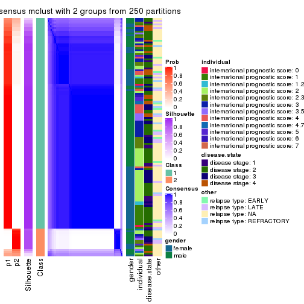</p>

</div>
<div id='tab-ATC-mclust-consensus-heatmap-2'>
<pre><code class="r">consensus_heatmap(res, k = 3)
</code></pre>

<p>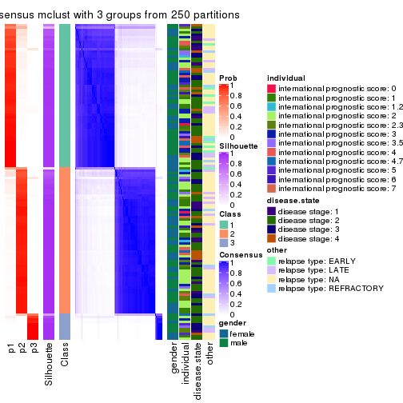</p>

</div>
<div id='tab-ATC-mclust-consensus-heatmap-3'>
<pre><code class="r">consensus_heatmap(res, k = 4)
</code></pre>

<p>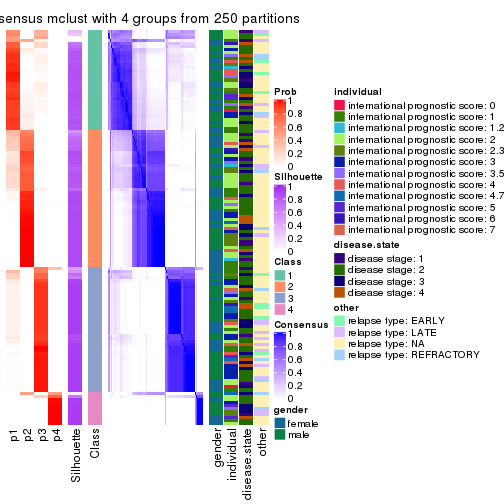</p>

</div>
<div id='tab-ATC-mclust-consensus-heatmap-4'>
<pre><code class="r">consensus_heatmap(res, k = 5)
</code></pre>

<p>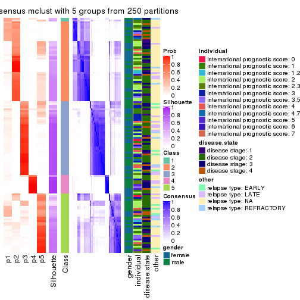</p>

</div>
<div id='tab-ATC-mclust-consensus-heatmap-5'>
<pre><code class="r">consensus_heatmap(res, k = 6)
</code></pre>

<p>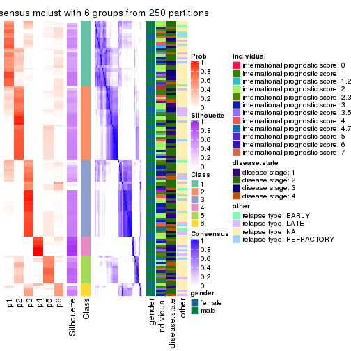</p>

</div>
</div>

Heatmaps for the membership of samples in all partitions to see how consistent they are:


<script>
$( function() {
	$( '#tabs-ATC-mclust-membership-heatmap' ).tabs();
} );
</script>
<div id='tabs-ATC-mclust-membership-heatmap'>
<ul>
<li><a href='#tab-ATC-mclust-membership-heatmap-1'>k = 2</a></li>
<li><a href='#tab-ATC-mclust-membership-heatmap-2'>k = 3</a></li>
<li><a href='#tab-ATC-mclust-membership-heatmap-3'>k = 4</a></li>
<li><a href='#tab-ATC-mclust-membership-heatmap-4'>k = 5</a></li>
<li><a href='#tab-ATC-mclust-membership-heatmap-5'>k = 6</a></li>
</ul>
<div id='tab-ATC-mclust-membership-heatmap-1'>
<pre><code class="r">membership_heatmap(res, k = 2)
</code></pre>

<p>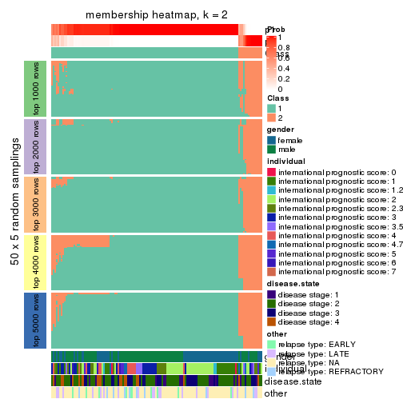</p>

</div>
<div id='tab-ATC-mclust-membership-heatmap-2'>
<pre><code class="r">membership_heatmap(res, k = 3)
</code></pre>

<p>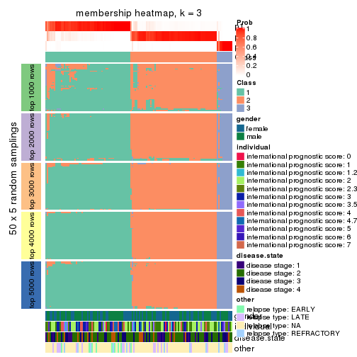</p>

</div>
<div id='tab-ATC-mclust-membership-heatmap-3'>
<pre><code class="r">membership_heatmap(res, k = 4)
</code></pre>

<p>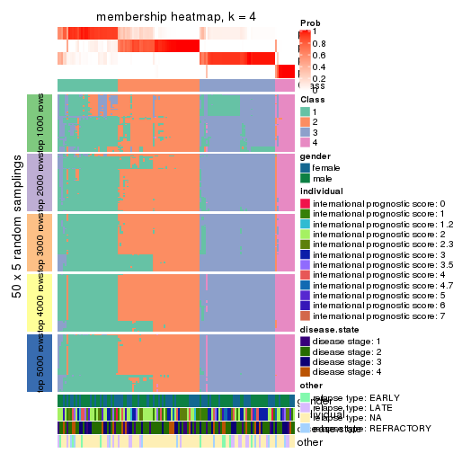</p>

</div>
<div id='tab-ATC-mclust-membership-heatmap-4'>
<pre><code class="r">membership_heatmap(res, k = 5)
</code></pre>

<p>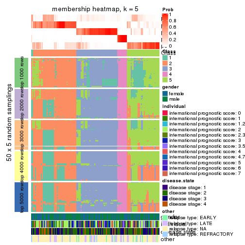</p>

</div>
<div id='tab-ATC-mclust-membership-heatmap-5'>
<pre><code class="r">membership_heatmap(res, k = 6)
</code></pre>

<p>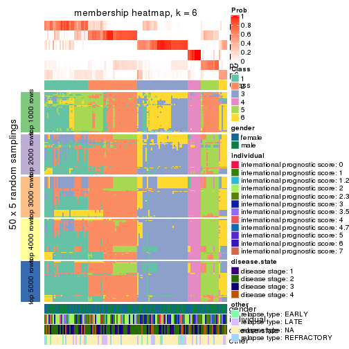</p>

</div>
</div>

As soon as we have had the classes for columns, we can look for signatures
which are significantly different between classes which can be candidate marks
for certain classes. Following are the heatmaps for signatures.


Signature heatmaps where rows are scaled:


<script>
$( function() {
	$( '#tabs-ATC-mclust-get-signatures' ).tabs();
} );
</script>
<div id='tabs-ATC-mclust-get-signatures'>
<ul>
<li><a href='#tab-ATC-mclust-get-signatures-1'>k = 2</a></li>
<li><a href='#tab-ATC-mclust-get-signatures-2'>k = 3</a></li>
<li><a href='#tab-ATC-mclust-get-signatures-3'>k = 4</a></li>
<li><a href='#tab-ATC-mclust-get-signatures-4'>k = 5</a></li>
<li><a href='#tab-ATC-mclust-get-signatures-5'>k = 6</a></li>
</ul>
<div id='tab-ATC-mclust-get-signatures-1'>
<pre><code class="r">get_signatures(res, k = 2)
</code></pre>

<p>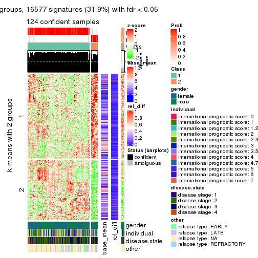</p>

</div>
<div id='tab-ATC-mclust-get-signatures-2'>
<pre><code class="r">get_signatures(res, k = 3)
</code></pre>

<p>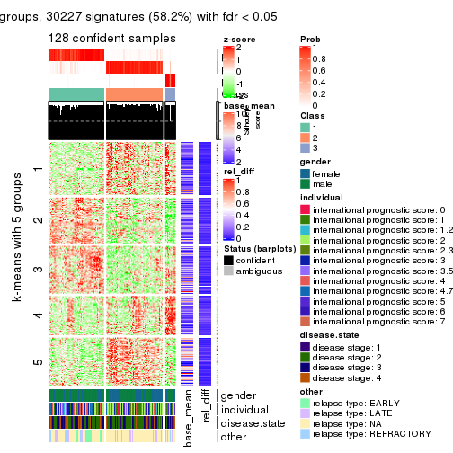</p>

</div>
<div id='tab-ATC-mclust-get-signatures-3'>
<pre><code class="r">get_signatures(res, k = 4)
</code></pre>

<p>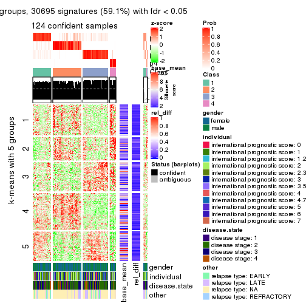</p>

</div>
<div id='tab-ATC-mclust-get-signatures-4'>
<pre><code class="r">get_signatures(res, k = 5)
</code></pre>

<p>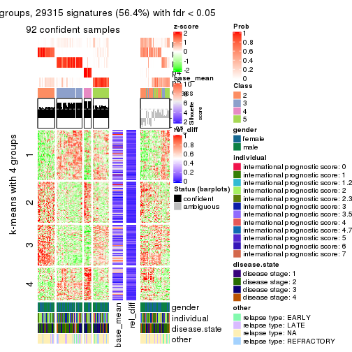</p>

</div>
<div id='tab-ATC-mclust-get-signatures-5'>
<pre><code class="r">get_signatures(res, k = 6)
</code></pre>

<pre><code>#&gt; Error: The width or height of the raster image is zero, maybe you forget to turn off the
#&gt; previous graphic device or it was corrupted. Run `dev.off()` to close it.
</code></pre>

<p></p>

</div>
</div>


Signature heatmaps where rows are not scaled:


<script>
$( function() {
	$( '#tabs-ATC-mclust-get-signatures-no-scale' ).tabs();
} );
</script>
<div id='tabs-ATC-mclust-get-signatures-no-scale'>
<ul>
<li><a href='#tab-ATC-mclust-get-signatures-no-scale-1'>k = 2</a></li>
<li><a href='#tab-ATC-mclust-get-signatures-no-scale-2'>k = 3</a></li>
<li><a href='#tab-ATC-mclust-get-signatures-no-scale-3'>k = 4</a></li>
<li><a href='#tab-ATC-mclust-get-signatures-no-scale-4'>k = 5</a></li>
<li><a href='#tab-ATC-mclust-get-signatures-no-scale-5'>k = 6</a></li>
</ul>
<div id='tab-ATC-mclust-get-signatures-no-scale-1'>
<pre><code class="r">get_signatures(res, k = 2, scale_rows = FALSE)
</code></pre>

<p>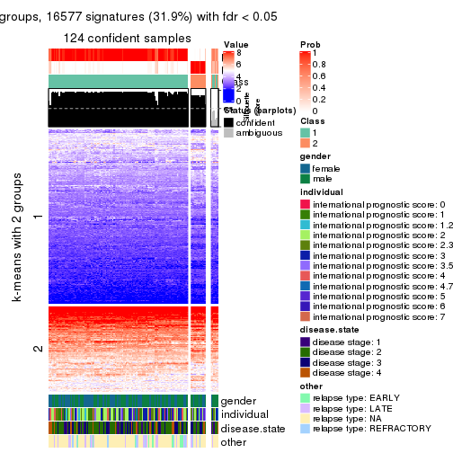</p>

</div>
<div id='tab-ATC-mclust-get-signatures-no-scale-2'>
<pre><code class="r">get_signatures(res, k = 3, scale_rows = FALSE)
</code></pre>

<p>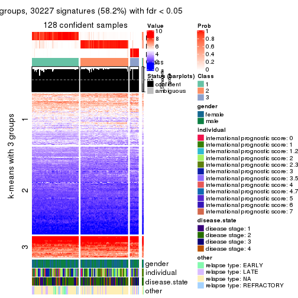</p>

</div>
<div id='tab-ATC-mclust-get-signatures-no-scale-3'>
<pre><code class="r">get_signatures(res, k = 4, scale_rows = FALSE)
</code></pre>

<p>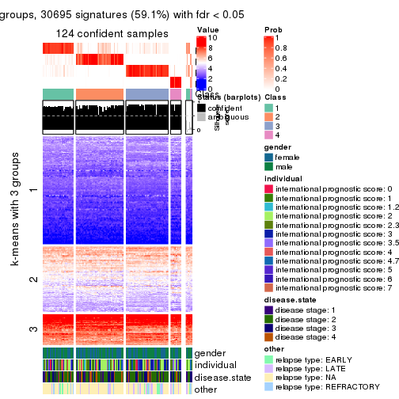</p>

</div>
<div id='tab-ATC-mclust-get-signatures-no-scale-4'>
<pre><code class="r">get_signatures(res, k = 5, scale_rows = FALSE)
</code></pre>

<p>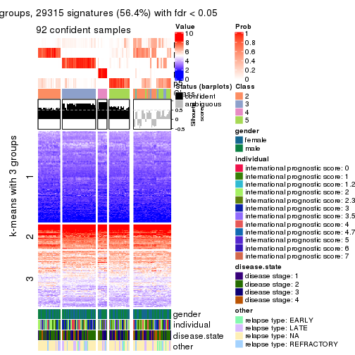</p>

</div>
<div id='tab-ATC-mclust-get-signatures-no-scale-5'>
<pre><code class="r">get_signatures(res, k = 6, scale_rows = FALSE)
</code></pre>

<pre><code>#&gt; Error in mat[ceiling(1:nr/h_ratio), ceiling(1:nc/w_ratio), drop = FALSE]: subscript out of bounds
</code></pre>

<p>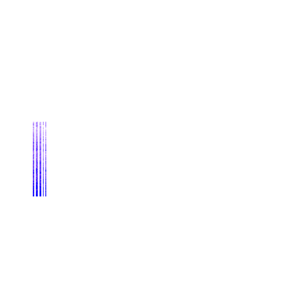</p>

</div>
</div>


Compare the overlap of signatures from different k:

```r
compare_signatures(res)
```

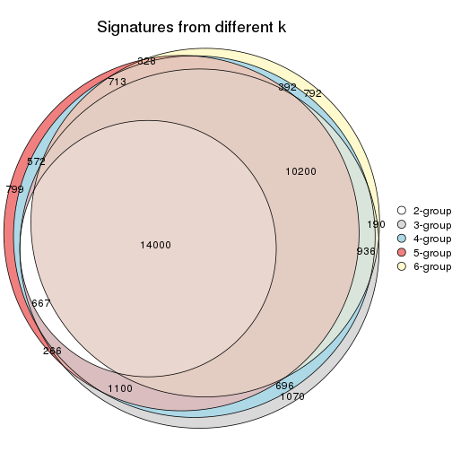

`get_signature()` returns a data frame invisibly. TO get the list of signatures, the function
call should be assigned to a variable explicitly. In following code, if `plot` argument is set
to `FALSE`, no heatmap is plotted while only the differential analysis is performed.

```r
# code only for demonstration
tb = get_signature(res, k = ..., plot = FALSE)
```

An example of the output of `tb` is:

```
#>   which_row         fdr    mean_1    mean_2 scaled_mean_1 scaled_mean_2 km
#> 1        38 0.042760348  8.373488  9.131774    -0.5533452     0.5164555  1
#> 2        40 0.018707592  7.106213  8.469186    -0.6173731     0.5762149  1
#> 3        55 0.019134737 10.221463 11.207825    -0.6159697     0.5749050  1
#> 4        59 0.006059896  5.921854  7.869574    -0.6899429     0.6439467  1
#> 5        60 0.018055526  8.928898 10.211722    -0.6204761     0.5791110  1
#> 6        98 0.009384629 15.714769 14.887706     0.6635654    -0.6193277  2
...
```

The columns in `tb` are:

1. `which_row`: row indices corresponding to the input matrix.
2. `fdr`: FDR for the differential test. 
3. `mean_x`: The mean value in group x.
4. `scaled_mean_x`: The mean value in group x after rows are scaled.
5. `km`: Row groups if k-means clustering is applied to rows.


UMAP plot which shows how samples are separated.


<script>
$( function() {
	$( '#tabs-ATC-mclust-dimension-reduction' ).tabs();
} );
</script>
<div id='tabs-ATC-mclust-dimension-reduction'>
<ul>
<li><a href='#tab-ATC-mclust-dimension-reduction-1'>k = 2</a></li>
<li><a href='#tab-ATC-mclust-dimension-reduction-2'>k = 3</a></li>
<li><a href='#tab-ATC-mclust-dimension-reduction-3'>k = 4</a></li>
<li><a href='#tab-ATC-mclust-dimension-reduction-4'>k = 5</a></li>
<li><a href='#tab-ATC-mclust-dimension-reduction-5'>k = 6</a></li>
</ul>
<div id='tab-ATC-mclust-dimension-reduction-1'>
<pre><code class="r">dimension_reduction(res, k = 2, method = &quot;UMAP&quot;)
</code></pre>

<p>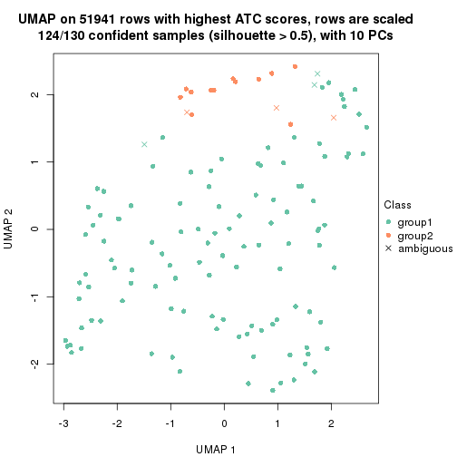</p>

</div>
<div id='tab-ATC-mclust-dimension-reduction-2'>
<pre><code class="r">dimension_reduction(res, k = 3, method = &quot;UMAP&quot;)
</code></pre>

<p>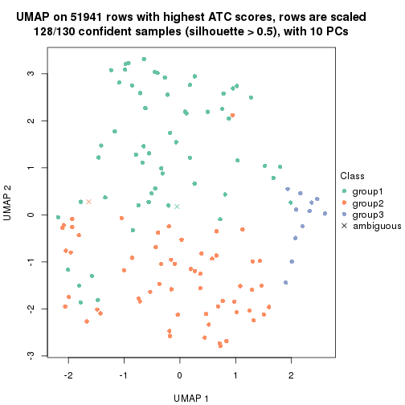</p>

</div>
<div id='tab-ATC-mclust-dimension-reduction-3'>
<pre><code class="r">dimension_reduction(res, k = 4, method = &quot;UMAP&quot;)
</code></pre>

<p>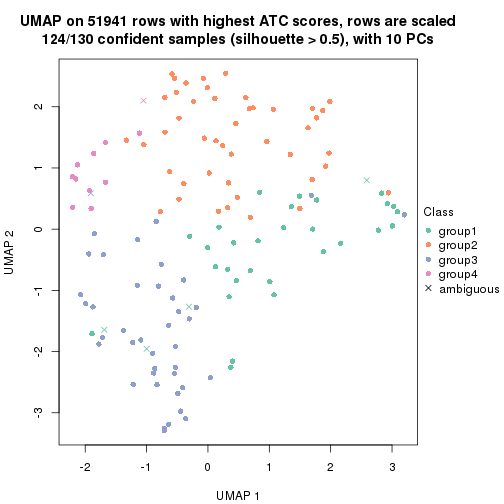</p>

</div>
<div id='tab-ATC-mclust-dimension-reduction-4'>
<pre><code class="r">dimension_reduction(res, k = 5, method = &quot;UMAP&quot;)
</code></pre>

<p>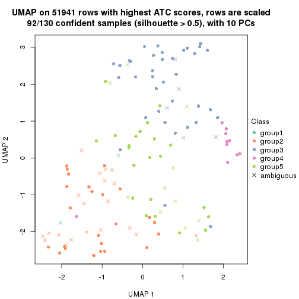</p>

</div>
<div id='tab-ATC-mclust-dimension-reduction-5'>
<pre><code class="r">dimension_reduction(res, k = 6, method = &quot;UMAP&quot;)
</code></pre>

<p>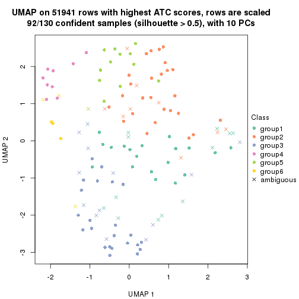</p>

</div>
</div>


Following heatmap shows how subgroups are split when increasing `k`:

```r
collect_classes(res)
```

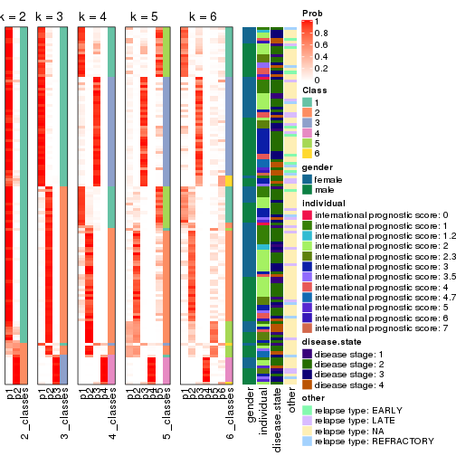


Test correlation between subgroups and known annotations. If the known
annotation is numeric, one-way ANOVA test is applied, and if the known
annotation is discrete, chi-squared contingency table test is applied.

```r
test_to_known_factors(res)
```

```
#>              n gender(p) individual(p) disease.state(p) other(p) k
#> ATC:mclust 124     0.575         0.305            0.813   0.5224 2
#> ATC:mclust 128     0.512         0.713            0.790   0.0348 3
#> ATC:mclust 124     0.859         0.462            0.950   0.2203 4
#> ATC:mclust  92     0.945         0.373            0.644   0.7916 5
#> ATC:mclust  92     0.974         0.591            0.600   0.3352 6
```


If matrix rows can be associated to genes, consider to use `GO_Enrichment(res,
...)` to perform function enrichment for the signature genes.


 

---------------------------------------------------


### ATC:NMF**


The object with results only for a single top-value method and a single partition method 
can be extracted as:

```r
res = res_list["ATC", "NMF"]
# you can also extract it by
# res = res_list["ATC:NMF"]
```

A summary of `res` and all the functions that can be applied to it:

```r
res
```

```
#> A 'ConsensusPartition' object with k = 2, 3, 4, 5, 6.
#>   On a matrix with 51941 rows and 130 columns.
#>   Top rows (1000, 2000, 3000, 4000, 5000) are extracted by 'ATC' method.
#>   Subgroups are detected by 'NMF' method.
#>   Performed in total 1250 partitions by row resampling.
#>   Best k for subgroups seems to be 2.
#> 
#> Following methods can be applied to this 'ConsensusPartition' object:
#>  [1] "cola_report"             "collect_classes"         "collect_plots"          
#>  [4] "collect_stats"           "colnames"                "compare_signatures"     
#>  [7] "consensus_heatmap"       "dimension_reduction"     "functional_enrichment"  
#> [10] "get_anno_col"            "get_anno"                "get_classes"            
#> [13] "get_consensus"           "get_matrix"              "get_membership"         
#> [16] "get_param"               "get_signatures"          "get_stats"              
#> [19] "is_best_k"               "is_stable_k"             "membership_heatmap"     
#> [22] "ncol"                    "nrow"                    "plot_ecdf"              
#> [25] "rownames"                "select_partition_number" "show"                   
#> [28] "suggest_best_k"          "test_to_known_factors"
```

`collect_plots()` function collects all the plots made from `res` for all `k` (number of partitions)
into one single page to provide an easy and fast comparison between different `k`.

```r
collect_plots(res)
```

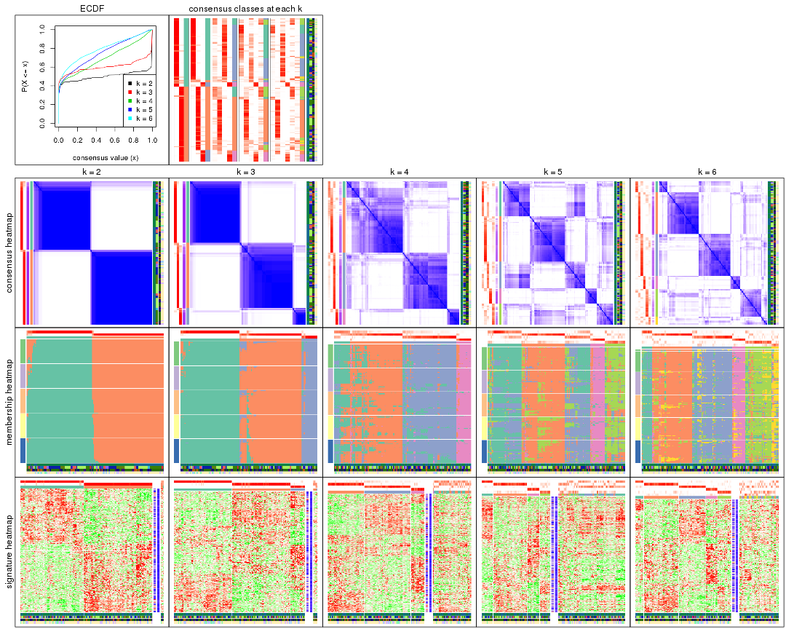

The plots are:

- The first row: a plot of the ECDF (Empirical cumulative distribution
  function) curves of the consensus matrix for each `k` and the heatmap of
  predicted classes for each `k`.
- The second row: heatmaps of the consensus matrix for each `k`.
- The third row: heatmaps of the membership matrix for each `k`.
- The fouth row: heatmaps of the signatures for each `k`.

All the plots in panels can be made by individual functions and they are
plotted later in this section.

`select_partition_number()` produces several plots showing different
statistics for choosing "optimized" `k`. There are following statistics:

- ECDF curves of the consensus matrix for each `k`;
- 1-PAC. [The PAC
  score](https://en.wikipedia.org/wiki/Consensus_clustering#Over-interpretation_potential_of_consensus_clustering)
  measures the proportion of the ambiguous subgrouping.
- Mean silhouette score.
- Concordance. The mean probability of fiting the consensus class ids in all
  partitions.
- Area increased. Denote $A_k$ as the area under the ECDF curve for current
  `k`, the area increased is defined as $A_k - A_{k-1}$.
- Rand index. The percent of pairs of samples that are both in a same cluster
  or both are not in a same cluster in the partition of k and k-1.
- Jaccard index. The ratio of pairs of samples are both in a same cluster in
  the partition of k and k-1 and the pairs of samples are both in a same
  cluster in the partition k or k-1.

The detailed explanations of these statistics can be found in [the cola
vignette](http://bioconductor.org/packages/devel/bioc/vignettes/cola/inst/doc/cola.html#toc_13).

Generally speaking, lower PAC score, higher mean silhouette score or higher
concordance corresponds to better partition. Rand index and Jaccard index
measure how similar the current partition is compared to partition with `k-1`.
If they are too similar, we won't accept `k` is better than `k-1`.

```r
select_partition_number(res)
```

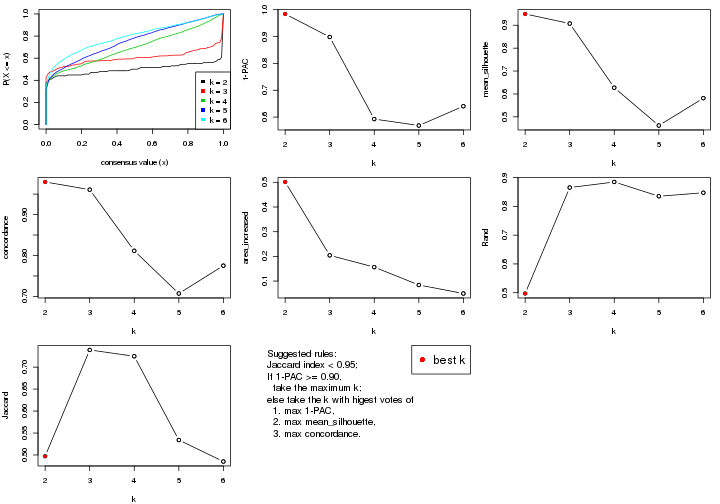

The numeric values for all these statistics can be obtained by `get_stats()`.

```r
get_stats(res)
```

```
#>   k 1-PAC mean_silhouette concordance area_increased  Rand Jaccard
#> 2 2 0.984           0.949       0.980         0.5014 0.497   0.497
#> 3 3 0.898           0.907       0.961         0.2041 0.865   0.739
#> 4 4 0.593           0.627       0.812         0.1565 0.885   0.725
#> 5 5 0.569           0.462       0.707         0.0841 0.835   0.534
#> 6 6 0.641           0.582       0.775         0.0495 0.847   0.485
```

`suggest_best_k()` suggests the best $k$ based on these statistics. The rules are as follows:

- All $k$ with Jaccard index larger than 0.95 are removed because the increase of
  the partition number does not provides enough extra information. If all $k$ are removed,
  the best $k$ is assigned by `NA`.
- For $k$ with 1-PAC larger than 0.9, the maximal $k$ is taken as the "best k". Other $k$ is called "optional k".
- If it does not fit the second rule. The $k$ with the highest vote of highest
  1-PAC, mean silhouette and concordance is taken as the "best k".

```r
suggest_best_k(res)
```

```
#> [1] 2
```


Following shows the table of the partitions (You need to click the **show/hide
code output** link to see it). The membership matrix (columns with name `p*`)
is inferred by
[`clue::cl_consensus()`](https://www.rdocumentation.org/link/cl_consensus?package=clue)
function with the `SE` method. Basically the value in the membership matrix
represents the probability to belong to a certain group. The finall class
label for an item is determined with the group with highest probability it
belongs to.

In `get_classes()` function, the entropy is calculated from the membership
matrix and the silhouette score is calculated from the consensus matrix.


<script>
$( function() {
	$( '#tabs-ATC-NMF-get-classes' ).tabs();
} );
</script>
<div id='tabs-ATC-NMF-get-classes'>
<ul>
<li><a href='#tab-ATC-NMF-get-classes-1'>k = 2</a></li>
<li><a href='#tab-ATC-NMF-get-classes-2'>k = 3</a></li>
<li><a href='#tab-ATC-NMF-get-classes-3'>k = 4</a></li>
<li><a href='#tab-ATC-NMF-get-classes-4'>k = 5</a></li>
<li><a href='#tab-ATC-NMF-get-classes-5'>k = 6</a></li>
</ul>

<div id='tab-ATC-NMF-get-classes-1'>
<p><a id='tab-ATC-NMF-get-classes-1-a' style='color:#0366d6' href='#'>show/hide code output</a></p>
<pre><code class="r">cbind(get_classes(res, k = 2), get_membership(res, k = 2))
</code></pre>

<pre><code>#&gt;           class entropy silhouette    p1    p2
#&gt; GSM447671     2  0.0000    0.98558 0.000 1.000
#&gt; GSM447694     1  0.0000    0.97114 1.000 0.000
#&gt; GSM447618     2  0.0000    0.98558 0.000 1.000
#&gt; GSM447691     2  0.0000    0.98558 0.000 1.000
#&gt; GSM447733     1  0.8763    0.59991 0.704 0.296
#&gt; GSM447620     2  0.0000    0.98558 0.000 1.000
#&gt; GSM447627     1  0.0000    0.97114 1.000 0.000
#&gt; GSM447630     2  0.9323    0.43791 0.348 0.652
#&gt; GSM447642     1  0.2778    0.93161 0.952 0.048
#&gt; GSM447649     2  0.0000    0.98558 0.000 1.000
#&gt; GSM447654     2  0.0000    0.98558 0.000 1.000
#&gt; GSM447655     2  0.0000    0.98558 0.000 1.000
#&gt; GSM447669     2  0.0000    0.98558 0.000 1.000
#&gt; GSM447676     1  0.0000    0.97114 1.000 0.000
#&gt; GSM447678     2  0.0000    0.98558 0.000 1.000
#&gt; GSM447681     2  0.0000    0.98558 0.000 1.000
#&gt; GSM447698     2  0.0000    0.98558 0.000 1.000
#&gt; GSM447713     1  0.0000    0.97114 1.000 0.000
#&gt; GSM447722     1  0.7453    0.74024 0.788 0.212
#&gt; GSM447726     2  0.0000    0.98558 0.000 1.000
#&gt; GSM447735     1  0.0000    0.97114 1.000 0.000
#&gt; GSM447737     1  0.0000    0.97114 1.000 0.000
#&gt; GSM447657     2  0.0000    0.98558 0.000 1.000
#&gt; GSM447674     2  0.0000    0.98558 0.000 1.000
#&gt; GSM447636     2  0.0000    0.98558 0.000 1.000
#&gt; GSM447723     1  0.0376    0.96812 0.996 0.004
#&gt; GSM447699     1  0.0000    0.97114 1.000 0.000
#&gt; GSM447708     2  0.0000    0.98558 0.000 1.000
#&gt; GSM447721     1  0.0000    0.97114 1.000 0.000
#&gt; GSM447623     1  0.0000    0.97114 1.000 0.000
#&gt; GSM447621     1  0.0000    0.97114 1.000 0.000
#&gt; GSM447650     2  0.0000    0.98558 0.000 1.000
#&gt; GSM447651     2  0.0000    0.98558 0.000 1.000
#&gt; GSM447653     1  0.0000    0.97114 1.000 0.000
#&gt; GSM447658     2  0.2043    0.95496 0.032 0.968
#&gt; GSM447675     2  0.1184    0.97123 0.016 0.984
#&gt; GSM447680     2  0.0000    0.98558 0.000 1.000
#&gt; GSM447686     2  0.0000    0.98558 0.000 1.000
#&gt; GSM447736     1  0.0000    0.97114 1.000 0.000
#&gt; GSM447629     2  0.0000    0.98558 0.000 1.000
#&gt; GSM447648     1  0.0000    0.97114 1.000 0.000
#&gt; GSM447660     2  0.1184    0.97115 0.016 0.984
#&gt; GSM447661     2  0.0000    0.98558 0.000 1.000
#&gt; GSM447663     1  0.0000    0.97114 1.000 0.000
#&gt; GSM447704     2  0.0000    0.98558 0.000 1.000
#&gt; GSM447720     1  0.2043    0.94547 0.968 0.032
#&gt; GSM447652     2  0.0000    0.98558 0.000 1.000
#&gt; GSM447679     2  0.0000    0.98558 0.000 1.000
#&gt; GSM447712     1  0.0000    0.97114 1.000 0.000
#&gt; GSM447664     2  0.0000    0.98558 0.000 1.000
#&gt; GSM447637     1  0.0000    0.97114 1.000 0.000
#&gt; GSM447639     1  0.0000    0.97114 1.000 0.000
#&gt; GSM447615     1  0.0000    0.97114 1.000 0.000
#&gt; GSM447656     2  0.0000    0.98558 0.000 1.000
#&gt; GSM447673     2  0.0000    0.98558 0.000 1.000
#&gt; GSM447719     1  0.0000    0.97114 1.000 0.000
#&gt; GSM447706     1  0.0000    0.97114 1.000 0.000
#&gt; GSM447612     1  0.0000    0.97114 1.000 0.000
#&gt; GSM447665     2  0.0000    0.98558 0.000 1.000
#&gt; GSM447677     2  0.0000    0.98558 0.000 1.000
#&gt; GSM447613     1  0.0000    0.97114 1.000 0.000
#&gt; GSM447659     1  0.0000    0.97114 1.000 0.000
#&gt; GSM447662     1  0.0000    0.97114 1.000 0.000
#&gt; GSM447666     2  0.0000    0.98558 0.000 1.000
#&gt; GSM447668     2  0.0000    0.98558 0.000 1.000
#&gt; GSM447682     2  0.0000    0.98558 0.000 1.000
#&gt; GSM447683     2  0.0000    0.98558 0.000 1.000
#&gt; GSM447688     2  0.0000    0.98558 0.000 1.000
#&gt; GSM447702     2  0.0000    0.98558 0.000 1.000
#&gt; GSM447709     2  0.0000    0.98558 0.000 1.000
#&gt; GSM447711     1  0.0000    0.97114 1.000 0.000
#&gt; GSM447715     2  0.0376    0.98209 0.004 0.996
#&gt; GSM447693     1  0.0000    0.97114 1.000 0.000
#&gt; GSM447611     2  0.0000    0.98558 0.000 1.000
#&gt; GSM447672     2  0.0000    0.98558 0.000 1.000
#&gt; GSM447703     2  0.0000    0.98558 0.000 1.000
#&gt; GSM447727     1  0.5059    0.86659 0.888 0.112
#&gt; GSM447638     2  0.0000    0.98558 0.000 1.000
#&gt; GSM447670     1  0.0000    0.97114 1.000 0.000
#&gt; GSM447700     1  0.9977    0.13455 0.528 0.472
#&gt; GSM447738     2  0.0000    0.98558 0.000 1.000
#&gt; GSM447739     1  0.0000    0.97114 1.000 0.000
#&gt; GSM447617     1  0.0000    0.97114 1.000 0.000
#&gt; GSM447628     2  0.0000    0.98558 0.000 1.000
#&gt; GSM447632     2  0.0000    0.98558 0.000 1.000
#&gt; GSM447619     1  0.0000    0.97114 1.000 0.000
#&gt; GSM447643     2  0.0000    0.98558 0.000 1.000
#&gt; GSM447724     1  0.0000    0.97114 1.000 0.000
#&gt; GSM447728     2  0.0000    0.98558 0.000 1.000
#&gt; GSM447610     1  0.0000    0.97114 1.000 0.000
#&gt; GSM447633     2  0.0000    0.98558 0.000 1.000
#&gt; GSM447634     1  0.0000    0.97114 1.000 0.000
#&gt; GSM447622     1  0.0000    0.97114 1.000 0.000
#&gt; GSM447667     2  0.0000    0.98558 0.000 1.000
#&gt; GSM447687     2  0.0000    0.98558 0.000 1.000
#&gt; GSM447695     1  0.0000    0.97114 1.000 0.000
#&gt; GSM447696     1  0.0000    0.97114 1.000 0.000
#&gt; GSM447697     1  0.0000    0.97114 1.000 0.000
#&gt; GSM447714     1  0.0000    0.97114 1.000 0.000
#&gt; GSM447717     2  0.0000    0.98558 0.000 1.000
#&gt; GSM447725     1  0.0000    0.97114 1.000 0.000
#&gt; GSM447729     2  0.0000    0.98558 0.000 1.000
#&gt; GSM447644     2  0.0000    0.98558 0.000 1.000
#&gt; GSM447710     1  0.0000    0.97114 1.000 0.000
#&gt; GSM447614     1  0.0000    0.97114 1.000 0.000
#&gt; GSM447685     2  0.0000    0.98558 0.000 1.000
#&gt; GSM447690     1  0.0000    0.97114 1.000 0.000
#&gt; GSM447730     2  0.0000    0.98558 0.000 1.000
#&gt; GSM447646     2  0.0000    0.98558 0.000 1.000
#&gt; GSM447689     1  0.2948    0.92793 0.948 0.052
#&gt; GSM447635     2  0.1414    0.96726 0.020 0.980
#&gt; GSM447641     1  0.0000    0.97114 1.000 0.000
#&gt; GSM447716     2  0.0000    0.98558 0.000 1.000
#&gt; GSM447718     1  0.8016    0.69182 0.756 0.244
#&gt; GSM447616     1  0.0000    0.97114 1.000 0.000
#&gt; GSM447626     1  0.0000    0.97114 1.000 0.000
#&gt; GSM447640     2  0.0000    0.98558 0.000 1.000
#&gt; GSM447734     1  0.0000    0.97114 1.000 0.000
#&gt; GSM447692     1  0.0000    0.97114 1.000 0.000
#&gt; GSM447647     2  0.0000    0.98558 0.000 1.000
#&gt; GSM447624     1  0.0000    0.97114 1.000 0.000
#&gt; GSM447625     1  0.0000    0.97114 1.000 0.000
#&gt; GSM447707     2  0.0000    0.98558 0.000 1.000
#&gt; GSM447732     1  0.0000    0.97114 1.000 0.000
#&gt; GSM447684     2  0.9993    0.00676 0.484 0.516
#&gt; GSM447731     2  0.0000    0.98558 0.000 1.000
#&gt; GSM447705     1  0.8081    0.68527 0.752 0.248
#&gt; GSM447631     1  0.0000    0.97114 1.000 0.000
#&gt; GSM447701     2  0.0000    0.98558 0.000 1.000
#&gt; GSM447645     1  0.0000    0.97114 1.000 0.000
</code></pre>

<script>
$('#tab-ATC-NMF-get-classes-1-a').parent().next().next().hide();
$('#tab-ATC-NMF-get-classes-1-a').click(function(){
  $('#tab-ATC-NMF-get-classes-1-a').parent().next().next().toggle();
  return(false);
});
</script>
</div>

<div id='tab-ATC-NMF-get-classes-2'>
<p><a id='tab-ATC-NMF-get-classes-2-a' style='color:#0366d6' href='#'>show/hide code output</a></p>
<pre><code class="r">cbind(get_classes(res, k = 3), get_membership(res, k = 3))
</code></pre>

<pre><code>#&gt;           class entropy silhouette    p1    p2    p3
#&gt; GSM447671     2  0.0000     0.9339 0.000 1.000 0.000
#&gt; GSM447694     1  0.0000     0.9816 1.000 0.000 0.000
#&gt; GSM447618     2  0.0237     0.9336 0.000 0.996 0.004
#&gt; GSM447691     2  0.0000     0.9339 0.000 1.000 0.000
#&gt; GSM447733     3  0.0000     0.9215 0.000 0.000 1.000
#&gt; GSM447620     2  0.0000     0.9339 0.000 1.000 0.000
#&gt; GSM447627     1  0.0592     0.9721 0.988 0.000 0.012
#&gt; GSM447630     2  0.4062     0.7422 0.164 0.836 0.000
#&gt; GSM447642     1  0.0000     0.9816 1.000 0.000 0.000
#&gt; GSM447649     2  0.1964     0.9049 0.000 0.944 0.056
#&gt; GSM447654     3  0.0000     0.9215 0.000 0.000 1.000
#&gt; GSM447655     2  0.0892     0.9282 0.000 0.980 0.020
#&gt; GSM447669     2  0.0000     0.9339 0.000 1.000 0.000
#&gt; GSM447676     1  0.0000     0.9816 1.000 0.000 0.000
#&gt; GSM447678     2  0.6154     0.3525 0.000 0.592 0.408
#&gt; GSM447681     2  0.0237     0.9337 0.000 0.996 0.004
#&gt; GSM447698     2  0.0424     0.9328 0.000 0.992 0.008
#&gt; GSM447713     1  0.0000     0.9816 1.000 0.000 0.000
#&gt; GSM447722     1  0.1860     0.9236 0.948 0.052 0.000
#&gt; GSM447726     2  0.0000     0.9339 0.000 1.000 0.000
#&gt; GSM447735     1  0.0000     0.9816 1.000 0.000 0.000
#&gt; GSM447737     1  0.0000     0.9816 1.000 0.000 0.000
#&gt; GSM447657     2  0.0747     0.9300 0.000 0.984 0.016
#&gt; GSM447674     2  0.0747     0.9300 0.000 0.984 0.016
#&gt; GSM447636     2  0.3686     0.8262 0.000 0.860 0.140
#&gt; GSM447723     1  0.1643     0.9371 0.956 0.044 0.000
#&gt; GSM447699     1  0.0000     0.9816 1.000 0.000 0.000
#&gt; GSM447708     2  0.0000     0.9339 0.000 1.000 0.000
#&gt; GSM447721     1  0.0000     0.9816 1.000 0.000 0.000
#&gt; GSM447623     1  0.0000     0.9816 1.000 0.000 0.000
#&gt; GSM447621     1  0.0000     0.9816 1.000 0.000 0.000
#&gt; GSM447650     2  0.0424     0.9328 0.000 0.992 0.008
#&gt; GSM447651     2  0.0000     0.9339 0.000 1.000 0.000
#&gt; GSM447653     3  0.0592     0.9143 0.012 0.000 0.988
#&gt; GSM447658     2  0.1643     0.8979 0.044 0.956 0.000
#&gt; GSM447675     3  0.0000     0.9215 0.000 0.000 1.000
#&gt; GSM447680     2  0.0000     0.9339 0.000 1.000 0.000
#&gt; GSM447686     2  0.0000     0.9339 0.000 1.000 0.000
#&gt; GSM447736     1  0.0000     0.9816 1.000 0.000 0.000
#&gt; GSM447629     2  0.0000     0.9339 0.000 1.000 0.000
#&gt; GSM447648     1  0.0000     0.9816 1.000 0.000 0.000
#&gt; GSM447660     2  0.2261     0.8748 0.068 0.932 0.000
#&gt; GSM447661     2  0.0424     0.9328 0.000 0.992 0.008
#&gt; GSM447663     1  0.0237     0.9784 0.996 0.004 0.000
#&gt; GSM447704     2  0.0892     0.9282 0.000 0.980 0.020
#&gt; GSM447720     1  0.3752     0.8079 0.856 0.144 0.000
#&gt; GSM447652     2  0.5621     0.5841 0.000 0.692 0.308
#&gt; GSM447679     2  0.0237     0.9337 0.000 0.996 0.004
#&gt; GSM447712     1  0.0000     0.9816 1.000 0.000 0.000
#&gt; GSM447664     3  0.6062     0.3075 0.000 0.384 0.616
#&gt; GSM447637     1  0.0000     0.9816 1.000 0.000 0.000
#&gt; GSM447639     1  0.0000     0.9816 1.000 0.000 0.000
#&gt; GSM447615     1  0.0000     0.9816 1.000 0.000 0.000
#&gt; GSM447656     2  0.0000     0.9339 0.000 1.000 0.000
#&gt; GSM447673     2  0.4452     0.7660 0.000 0.808 0.192
#&gt; GSM447719     3  0.3686     0.8042 0.140 0.000 0.860
#&gt; GSM447706     1  0.0000     0.9816 1.000 0.000 0.000
#&gt; GSM447612     1  0.0000     0.9816 1.000 0.000 0.000
#&gt; GSM447665     2  0.0000     0.9339 0.000 1.000 0.000
#&gt; GSM447677     2  0.0000     0.9339 0.000 1.000 0.000
#&gt; GSM447613     1  0.0000     0.9816 1.000 0.000 0.000
#&gt; GSM447659     3  0.4702     0.7083 0.212 0.000 0.788
#&gt; GSM447662     1  0.0000     0.9816 1.000 0.000 0.000
#&gt; GSM447666     2  0.0000     0.9339 0.000 1.000 0.000
#&gt; GSM447668     2  0.0000     0.9339 0.000 1.000 0.000
#&gt; GSM447682     2  0.0237     0.9337 0.000 0.996 0.004
#&gt; GSM447683     2  0.0000     0.9339 0.000 1.000 0.000
#&gt; GSM447688     3  0.1031     0.9055 0.000 0.024 0.976
#&gt; GSM447702     2  0.0892     0.9282 0.000 0.980 0.020
#&gt; GSM447709     2  0.0000     0.9339 0.000 1.000 0.000
#&gt; GSM447711     1  0.0000     0.9816 1.000 0.000 0.000
#&gt; GSM447715     2  0.0000     0.9339 0.000 1.000 0.000
#&gt; GSM447693     1  0.0000     0.9816 1.000 0.000 0.000
#&gt; GSM447611     3  0.0000     0.9215 0.000 0.000 1.000
#&gt; GSM447672     2  0.1163     0.9237 0.000 0.972 0.028
#&gt; GSM447703     2  0.4887     0.7172 0.000 0.772 0.228
#&gt; GSM447727     1  0.4750     0.6984 0.784 0.216 0.000
#&gt; GSM447638     2  0.0747     0.9300 0.000 0.984 0.016
#&gt; GSM447670     1  0.0000     0.9816 1.000 0.000 0.000
#&gt; GSM447700     2  0.5968     0.4051 0.364 0.636 0.000
#&gt; GSM447738     2  0.2066     0.9017 0.000 0.940 0.060
#&gt; GSM447739     1  0.0000     0.9816 1.000 0.000 0.000
#&gt; GSM447617     1  0.0000     0.9816 1.000 0.000 0.000
#&gt; GSM447628     3  0.0000     0.9215 0.000 0.000 1.000
#&gt; GSM447632     2  0.1964     0.9049 0.000 0.944 0.056
#&gt; GSM447619     1  0.0000     0.9816 1.000 0.000 0.000
#&gt; GSM447643     2  0.0000     0.9339 0.000 1.000 0.000
#&gt; GSM447724     1  0.0000     0.9816 1.000 0.000 0.000
#&gt; GSM447728     2  0.0237     0.9337 0.000 0.996 0.004
#&gt; GSM447610     1  0.0424     0.9754 0.992 0.000 0.008
#&gt; GSM447633     2  0.0000     0.9339 0.000 1.000 0.000
#&gt; GSM447634     1  0.0000     0.9816 1.000 0.000 0.000
#&gt; GSM447622     1  0.0000     0.9816 1.000 0.000 0.000
#&gt; GSM447667     2  0.0892     0.9282 0.000 0.980 0.020
#&gt; GSM447687     2  0.4399     0.7707 0.000 0.812 0.188
#&gt; GSM447695     1  0.0000     0.9816 1.000 0.000 0.000
#&gt; GSM447696     1  0.0000     0.9816 1.000 0.000 0.000
#&gt; GSM447697     1  0.0000     0.9816 1.000 0.000 0.000
#&gt; GSM447714     1  0.0000     0.9816 1.000 0.000 0.000
#&gt; GSM447717     2  0.0237     0.9337 0.000 0.996 0.004
#&gt; GSM447725     1  0.0000     0.9816 1.000 0.000 0.000
#&gt; GSM447729     3  0.0000     0.9215 0.000 0.000 1.000
#&gt; GSM447644     2  0.0000     0.9339 0.000 1.000 0.000
#&gt; GSM447710     1  0.0000     0.9816 1.000 0.000 0.000
#&gt; GSM447614     1  0.0424     0.9754 0.992 0.000 0.008
#&gt; GSM447685     2  0.0237     0.9337 0.000 0.996 0.004
#&gt; GSM447690     1  0.0000     0.9816 1.000 0.000 0.000
#&gt; GSM447730     3  0.4702     0.6866 0.000 0.212 0.788
#&gt; GSM447646     3  0.0000     0.9215 0.000 0.000 1.000
#&gt; GSM447689     1  0.4750     0.6995 0.784 0.216 0.000
#&gt; GSM447635     2  0.0000     0.9339 0.000 1.000 0.000
#&gt; GSM447641     1  0.0237     0.9784 0.996 0.004 0.000
#&gt; GSM447716     2  0.0237     0.9337 0.000 0.996 0.004
#&gt; GSM447718     1  0.2796     0.8724 0.908 0.092 0.000
#&gt; GSM447616     1  0.0000     0.9816 1.000 0.000 0.000
#&gt; GSM447626     1  0.0237     0.9784 0.996 0.004 0.000
#&gt; GSM447640     2  0.0892     0.9282 0.000 0.980 0.020
#&gt; GSM447734     1  0.0000     0.9816 1.000 0.000 0.000
#&gt; GSM447692     1  0.0000     0.9816 1.000 0.000 0.000
#&gt; GSM447647     3  0.0000     0.9215 0.000 0.000 1.000
#&gt; GSM447624     1  0.0000     0.9816 1.000 0.000 0.000
#&gt; GSM447625     1  0.0000     0.9816 1.000 0.000 0.000
#&gt; GSM447707     2  0.4750     0.7342 0.000 0.784 0.216
#&gt; GSM447732     1  0.0000     0.9816 1.000 0.000 0.000
#&gt; GSM447684     2  0.2537     0.8549 0.080 0.920 0.000
#&gt; GSM447731     3  0.0000     0.9215 0.000 0.000 1.000
#&gt; GSM447705     2  0.6308     0.0168 0.492 0.508 0.000
#&gt; GSM447631     1  0.0000     0.9816 1.000 0.000 0.000
#&gt; GSM447701     2  0.0000     0.9339 0.000 1.000 0.000
#&gt; GSM447645     1  0.0000     0.9816 1.000 0.000 0.000
</code></pre>

<script>
$('#tab-ATC-NMF-get-classes-2-a').parent().next().next().hide();
$('#tab-ATC-NMF-get-classes-2-a').click(function(){
  $('#tab-ATC-NMF-get-classes-2-a').parent().next().next().toggle();
  return(false);
});
</script>
</div>

<div id='tab-ATC-NMF-get-classes-3'>
<p><a id='tab-ATC-NMF-get-classes-3-a' style='color:#0366d6' href='#'>show/hide code output</a></p>
<pre><code class="r">cbind(get_classes(res, k = 4), get_membership(res, k = 4))
</code></pre>

<pre><code>#&gt;           class entropy silhouette    p1    p2    p3    p4
#&gt; GSM447671     1  0.4624     0.4070 0.660 0.340 0.000 0.000
#&gt; GSM447694     3  0.2345     0.8127 0.100 0.000 0.900 0.000
#&gt; GSM447618     2  0.4193     0.5813 0.268 0.732 0.000 0.000
#&gt; GSM447691     2  0.4877     0.3132 0.408 0.592 0.000 0.000
#&gt; GSM447733     4  0.0859     0.8841 0.004 0.008 0.008 0.980
#&gt; GSM447620     1  0.4989     0.2450 0.528 0.472 0.000 0.000
#&gt; GSM447627     3  0.1118     0.8232 0.000 0.000 0.964 0.036
#&gt; GSM447630     2  0.7426    -0.1451 0.376 0.452 0.172 0.000
#&gt; GSM447642     1  0.5339     0.3877 0.624 0.020 0.356 0.000
#&gt; GSM447649     2  0.0469     0.7617 0.012 0.988 0.000 0.000
#&gt; GSM447654     4  0.1022     0.8823 0.032 0.000 0.000 0.968
#&gt; GSM447655     2  0.0336     0.7617 0.008 0.992 0.000 0.000
#&gt; GSM447669     1  0.4356     0.4247 0.708 0.292 0.000 0.000
#&gt; GSM447676     1  0.5537     0.1723 0.544 0.004 0.440 0.012
#&gt; GSM447678     2  0.7318     0.3614 0.300 0.580 0.056 0.064
#&gt; GSM447681     2  0.1302     0.7557 0.044 0.956 0.000 0.000
#&gt; GSM447698     2  0.2760     0.7101 0.128 0.872 0.000 0.000
#&gt; GSM447713     3  0.1867     0.8082 0.072 0.000 0.928 0.000
#&gt; GSM447722     3  0.8698     0.1727 0.324 0.228 0.404 0.044
#&gt; GSM447726     2  0.4356     0.5201 0.292 0.708 0.000 0.000
#&gt; GSM447735     3  0.3443     0.7972 0.136 0.000 0.848 0.016
#&gt; GSM447737     3  0.2760     0.8112 0.128 0.000 0.872 0.000
#&gt; GSM447657     2  0.2469     0.7262 0.108 0.892 0.000 0.000
#&gt; GSM447674     2  0.0707     0.7603 0.020 0.980 0.000 0.000
#&gt; GSM447636     2  0.5894     0.2128 0.392 0.568 0.000 0.040
#&gt; GSM447723     3  0.2111     0.8109 0.024 0.044 0.932 0.000
#&gt; GSM447699     3  0.3726     0.7507 0.212 0.000 0.788 0.000
#&gt; GSM447708     2  0.1940     0.7454 0.076 0.924 0.000 0.000
#&gt; GSM447721     3  0.2011     0.8048 0.080 0.000 0.920 0.000
#&gt; GSM447623     3  0.0592     0.8204 0.016 0.000 0.984 0.000
#&gt; GSM447621     3  0.1474     0.8228 0.052 0.000 0.948 0.000
#&gt; GSM447650     2  0.0188     0.7618 0.004 0.996 0.000 0.000
#&gt; GSM447651     2  0.1474     0.7477 0.052 0.948 0.000 0.000
#&gt; GSM447653     4  0.0336     0.8863 0.008 0.000 0.000 0.992
#&gt; GSM447658     2  0.7776    -0.2543 0.340 0.412 0.248 0.000
#&gt; GSM447675     4  0.0592     0.8840 0.016 0.000 0.000 0.984
#&gt; GSM447680     2  0.4454     0.4232 0.308 0.692 0.000 0.000
#&gt; GSM447686     2  0.0707     0.7608 0.020 0.980 0.000 0.000
#&gt; GSM447736     3  0.3726     0.7587 0.212 0.000 0.788 0.000
#&gt; GSM447629     2  0.2469     0.7303 0.108 0.892 0.000 0.000
#&gt; GSM447648     3  0.0188     0.8218 0.004 0.000 0.996 0.000
#&gt; GSM447660     1  0.5742     0.4418 0.596 0.368 0.036 0.000
#&gt; GSM447661     2  0.1022     0.7564 0.032 0.968 0.000 0.000
#&gt; GSM447663     1  0.4624     0.1924 0.660 0.000 0.340 0.000
#&gt; GSM447704     2  0.0336     0.7614 0.008 0.992 0.000 0.000
#&gt; GSM447720     3  0.5579     0.6578 0.252 0.060 0.688 0.000
#&gt; GSM447652     2  0.4905     0.4307 0.004 0.632 0.000 0.364
#&gt; GSM447679     2  0.0592     0.7619 0.016 0.984 0.000 0.000
#&gt; GSM447712     3  0.2760     0.7781 0.128 0.000 0.872 0.000
#&gt; GSM447664     2  0.6232     0.3380 0.072 0.596 0.000 0.332
#&gt; GSM447637     3  0.0707     0.8218 0.020 0.000 0.980 0.000
#&gt; GSM447639     3  0.3695     0.7968 0.156 0.000 0.828 0.016
#&gt; GSM447615     1  0.4916     0.2647 0.576 0.000 0.424 0.000
#&gt; GSM447656     2  0.0336     0.7626 0.008 0.992 0.000 0.000
#&gt; GSM447673     2  0.3198     0.7135 0.080 0.880 0.000 0.040
#&gt; GSM447719     4  0.0000     0.8862 0.000 0.000 0.000 1.000
#&gt; GSM447706     3  0.4992     0.0218 0.476 0.000 0.524 0.000
#&gt; GSM447612     3  0.4331     0.6933 0.288 0.000 0.712 0.000
#&gt; GSM447665     2  0.4933     0.1904 0.432 0.568 0.000 0.000
#&gt; GSM447677     2  0.4585     0.3698 0.332 0.668 0.000 0.000
#&gt; GSM447613     3  0.2081     0.8059 0.084 0.000 0.916 0.000
#&gt; GSM447659     4  0.0707     0.8762 0.000 0.000 0.020 0.980
#&gt; GSM447662     3  0.4761     0.4816 0.372 0.000 0.628 0.000
#&gt; GSM447666     1  0.5138     0.4075 0.600 0.392 0.008 0.000
#&gt; GSM447668     2  0.3486     0.6298 0.188 0.812 0.000 0.000
#&gt; GSM447682     2  0.0469     0.7622 0.012 0.988 0.000 0.000
#&gt; GSM447683     2  0.3688     0.6099 0.208 0.792 0.000 0.000
#&gt; GSM447688     4  0.4744     0.6171 0.012 0.284 0.000 0.704
#&gt; GSM447702     2  0.0921     0.7591 0.028 0.972 0.000 0.000
#&gt; GSM447709     2  0.3024     0.6731 0.148 0.852 0.000 0.000
#&gt; GSM447711     3  0.2469     0.7908 0.108 0.000 0.892 0.000
#&gt; GSM447715     2  0.1545     0.7586 0.040 0.952 0.008 0.000
#&gt; GSM447693     3  0.1637     0.8181 0.060 0.000 0.940 0.000
#&gt; GSM447611     4  0.0188     0.8859 0.004 0.000 0.000 0.996
#&gt; GSM447672     2  0.0707     0.7607 0.020 0.980 0.000 0.000
#&gt; GSM447703     2  0.1584     0.7512 0.036 0.952 0.000 0.012
#&gt; GSM447727     3  0.4049     0.6123 0.008 0.212 0.780 0.000
#&gt; GSM447638     2  0.4989    -0.0289 0.472 0.528 0.000 0.000
#&gt; GSM447670     1  0.4804     0.3441 0.616 0.000 0.384 0.000
#&gt; GSM447700     2  0.7222     0.2189 0.300 0.528 0.172 0.000
#&gt; GSM447738     2  0.1118     0.7543 0.036 0.964 0.000 0.000
#&gt; GSM447739     3  0.2530     0.7865 0.112 0.000 0.888 0.000
#&gt; GSM447617     3  0.1211     0.8174 0.040 0.000 0.960 0.000
#&gt; GSM447628     4  0.1256     0.8836 0.028 0.008 0.000 0.964
#&gt; GSM447632     2  0.0188     0.7620 0.004 0.996 0.000 0.000
#&gt; GSM447619     3  0.2345     0.8142 0.100 0.000 0.900 0.000
#&gt; GSM447643     1  0.4989     0.2336 0.528 0.472 0.000 0.000
#&gt; GSM447724     3  0.5985     0.6375 0.284 0.020 0.660 0.036
#&gt; GSM447728     2  0.0707     0.7596 0.020 0.980 0.000 0.000
#&gt; GSM447610     3  0.5063     0.7463 0.108 0.000 0.768 0.124
#&gt; GSM447633     1  0.4907     0.3167 0.580 0.420 0.000 0.000
#&gt; GSM447634     3  0.4564     0.6502 0.328 0.000 0.672 0.000
#&gt; GSM447622     3  0.0592     0.8222 0.016 0.000 0.984 0.000
#&gt; GSM447667     2  0.5070     0.1104 0.416 0.580 0.000 0.004
#&gt; GSM447687     2  0.1489     0.7496 0.044 0.952 0.000 0.004
#&gt; GSM447695     3  0.3219     0.7858 0.164 0.000 0.836 0.000
#&gt; GSM447696     3  0.2345     0.7922 0.100 0.000 0.900 0.000
#&gt; GSM447697     3  0.1792     0.8098 0.068 0.000 0.932 0.000
#&gt; GSM447714     3  0.3311     0.7836 0.172 0.000 0.828 0.000
#&gt; GSM447717     2  0.7191     0.0238 0.352 0.500 0.148 0.000
#&gt; GSM447725     3  0.3924     0.7693 0.124 0.008 0.840 0.028
#&gt; GSM447729     4  0.0779     0.8836 0.016 0.004 0.000 0.980
#&gt; GSM447644     1  0.4679     0.4088 0.648 0.352 0.000 0.000
#&gt; GSM447710     3  0.2589     0.8083 0.116 0.000 0.884 0.000
#&gt; GSM447614     3  0.4700     0.7686 0.124 0.000 0.792 0.084
#&gt; GSM447685     2  0.2760     0.6962 0.128 0.872 0.000 0.000
#&gt; GSM447690     3  0.2334     0.8008 0.088 0.000 0.908 0.004
#&gt; GSM447730     4  0.5957     0.4226 0.048 0.364 0.000 0.588
#&gt; GSM447646     4  0.1489     0.8778 0.044 0.004 0.000 0.952
#&gt; GSM447689     3  0.6886     0.2742 0.200 0.204 0.596 0.000
#&gt; GSM447635     2  0.6356     0.3640 0.308 0.604 0.088 0.000
#&gt; GSM447641     3  0.4830     0.3490 0.392 0.000 0.608 0.000
#&gt; GSM447716     2  0.2216     0.7342 0.092 0.908 0.000 0.000
#&gt; GSM447718     3  0.4713     0.6184 0.052 0.172 0.776 0.000
#&gt; GSM447616     3  0.1118     0.8223 0.036 0.000 0.964 0.000
#&gt; GSM447626     1  0.4888     0.3357 0.588 0.000 0.412 0.000
#&gt; GSM447640     2  0.0469     0.7611 0.012 0.988 0.000 0.000
#&gt; GSM447734     3  0.3024     0.7977 0.148 0.000 0.852 0.000
#&gt; GSM447692     3  0.1474     0.8151 0.052 0.000 0.948 0.000
#&gt; GSM447647     4  0.5311     0.5407 0.024 0.328 0.000 0.648
#&gt; GSM447624     3  0.0817     0.8198 0.024 0.000 0.976 0.000
#&gt; GSM447625     3  0.1389     0.8217 0.048 0.000 0.952 0.000
#&gt; GSM447707     2  0.2002     0.7492 0.044 0.936 0.000 0.020
#&gt; GSM447732     3  0.2281     0.8135 0.096 0.000 0.904 0.000
#&gt; GSM447684     1  0.6351     0.4771 0.588 0.332 0.080 0.000
#&gt; GSM447731     4  0.1302     0.8783 0.044 0.000 0.000 0.956
#&gt; GSM447705     3  0.7289     0.3177 0.212 0.252 0.536 0.000
#&gt; GSM447631     3  0.0000     0.8218 0.000 0.000 1.000 0.000
#&gt; GSM447701     2  0.1474     0.7581 0.052 0.948 0.000 0.000
#&gt; GSM447645     3  0.1792     0.8087 0.068 0.000 0.932 0.000
</code></pre>

<script>
$('#tab-ATC-NMF-get-classes-3-a').parent().next().next().hide();
$('#tab-ATC-NMF-get-classes-3-a').click(function(){
  $('#tab-ATC-NMF-get-classes-3-a').parent().next().next().toggle();
  return(false);
});
</script>
</div>

<div id='tab-ATC-NMF-get-classes-4'>
<p><a id='tab-ATC-NMF-get-classes-4-a' style='color:#0366d6' href='#'>show/hide code output</a></p>
<pre><code class="r">cbind(get_classes(res, k = 5), get_membership(res, k = 5))
</code></pre>

<pre><code>#&gt;           class entropy silhouette    p1    p2    p3    p4    p5
#&gt; GSM447671     5  0.5602     0.6277 0.000 0.164 0.196 0.000 0.640
#&gt; GSM447694     3  0.4367     0.1590 0.416 0.000 0.580 0.000 0.004
#&gt; GSM447618     3  0.6584    -0.2882 0.000 0.380 0.412 0.000 0.208
#&gt; GSM447691     3  0.6804    -0.3005 0.000 0.304 0.372 0.000 0.324
#&gt; GSM447733     4  0.1764     0.8274 0.000 0.012 0.036 0.940 0.012
#&gt; GSM447620     5  0.3884     0.5552 0.000 0.288 0.004 0.000 0.708
#&gt; GSM447627     1  0.5268     0.3769 0.588 0.000 0.360 0.048 0.004
#&gt; GSM447630     5  0.6847     0.5763 0.024 0.208 0.248 0.000 0.520
#&gt; GSM447642     5  0.5451     0.2413 0.424 0.032 0.016 0.000 0.528
#&gt; GSM447649     2  0.0703     0.7723 0.000 0.976 0.000 0.000 0.024
#&gt; GSM447654     4  0.1582     0.8249 0.000 0.000 0.028 0.944 0.028
#&gt; GSM447655     2  0.1502     0.7677 0.000 0.940 0.000 0.004 0.056
#&gt; GSM447669     5  0.5748     0.5825 0.000 0.140 0.252 0.000 0.608
#&gt; GSM447676     5  0.6638     0.3697 0.200 0.000 0.120 0.072 0.608
#&gt; GSM447678     2  0.7462     0.1551 0.004 0.428 0.364 0.060 0.144
#&gt; GSM447681     2  0.1281     0.7634 0.000 0.956 0.012 0.000 0.032
#&gt; GSM447698     2  0.4073     0.6582 0.000 0.792 0.104 0.000 0.104
#&gt; GSM447713     1  0.1892     0.5459 0.916 0.000 0.080 0.000 0.004
#&gt; GSM447722     3  0.5455     0.2958 0.000 0.112 0.720 0.044 0.124
#&gt; GSM447726     2  0.4961     0.0162 0.004 0.520 0.020 0.000 0.456
#&gt; GSM447735     3  0.4620     0.2409 0.372 0.000 0.612 0.004 0.012
#&gt; GSM447737     1  0.4182     0.3510 0.600 0.000 0.400 0.000 0.000
#&gt; GSM447657     2  0.2853     0.7241 0.004 0.880 0.040 0.000 0.076
#&gt; GSM447674     2  0.0880     0.7634 0.000 0.968 0.000 0.000 0.032
#&gt; GSM447636     2  0.6592     0.1396 0.180 0.492 0.000 0.008 0.320
#&gt; GSM447723     1  0.5090     0.4919 0.712 0.036 0.212 0.000 0.040
#&gt; GSM447699     3  0.3282     0.4264 0.188 0.000 0.804 0.000 0.008
#&gt; GSM447708     2  0.3242     0.6567 0.000 0.784 0.000 0.000 0.216
#&gt; GSM447721     1  0.1117     0.5257 0.964 0.000 0.020 0.000 0.016
#&gt; GSM447623     1  0.4252     0.4347 0.652 0.000 0.340 0.000 0.008
#&gt; GSM447621     1  0.4403     0.2695 0.560 0.000 0.436 0.000 0.004
#&gt; GSM447650     2  0.0510     0.7716 0.000 0.984 0.000 0.000 0.016
#&gt; GSM447651     2  0.2605     0.7184 0.000 0.852 0.000 0.000 0.148
#&gt; GSM447653     4  0.0740     0.8322 0.004 0.000 0.008 0.980 0.008
#&gt; GSM447658     1  0.6514    -0.1733 0.516 0.236 0.004 0.000 0.244
#&gt; GSM447675     4  0.3457     0.7906 0.008 0.000 0.080 0.848 0.064
#&gt; GSM447680     2  0.4219     0.2506 0.000 0.584 0.000 0.000 0.416
#&gt; GSM447686     2  0.2685     0.7526 0.028 0.880 0.000 0.000 0.092
#&gt; GSM447736     3  0.4730     0.4080 0.260 0.000 0.688 0.000 0.052
#&gt; GSM447629     2  0.3789     0.5825 0.000 0.768 0.020 0.000 0.212
#&gt; GSM447648     1  0.4436     0.3578 0.596 0.000 0.396 0.000 0.008
#&gt; GSM447660     5  0.3368     0.6545 0.024 0.156 0.000 0.000 0.820
#&gt; GSM447661     2  0.2389     0.7409 0.000 0.880 0.000 0.004 0.116
#&gt; GSM447663     3  0.4182     0.2417 0.000 0.000 0.600 0.000 0.400
#&gt; GSM447704     2  0.0162     0.7710 0.000 0.996 0.000 0.000 0.004
#&gt; GSM447720     3  0.5161     0.4684 0.056 0.052 0.736 0.000 0.156
#&gt; GSM447652     4  0.4451    -0.0351 0.000 0.492 0.004 0.504 0.000
#&gt; GSM447679     2  0.0290     0.7692 0.000 0.992 0.000 0.000 0.008
#&gt; GSM447712     1  0.0703     0.5187 0.976 0.000 0.000 0.000 0.024
#&gt; GSM447664     2  0.7483     0.2744 0.004 0.540 0.136 0.196 0.124
#&gt; GSM447637     1  0.4727     0.2053 0.532 0.000 0.452 0.000 0.016
#&gt; GSM447639     1  0.5432     0.3672 0.608 0.016 0.340 0.008 0.028
#&gt; GSM447615     5  0.5695    -0.0297 0.460 0.020 0.040 0.000 0.480
#&gt; GSM447656     2  0.1704     0.7705 0.004 0.928 0.000 0.000 0.068
#&gt; GSM447673     2  0.3473     0.6906 0.000 0.840 0.040 0.008 0.112
#&gt; GSM447719     4  0.0798     0.8308 0.016 0.000 0.000 0.976 0.008
#&gt; GSM447706     1  0.6808    -0.0210 0.360 0.000 0.300 0.000 0.340
#&gt; GSM447612     3  0.3282     0.4706 0.008 0.000 0.804 0.000 0.188
#&gt; GSM447665     5  0.5636     0.3593 0.000 0.372 0.084 0.000 0.544
#&gt; GSM447677     2  0.4138     0.3401 0.000 0.616 0.000 0.000 0.384
#&gt; GSM447613     1  0.2588     0.5333 0.892 0.000 0.048 0.000 0.060
#&gt; GSM447659     4  0.1774     0.8098 0.016 0.000 0.052 0.932 0.000
#&gt; GSM447662     3  0.5145     0.4117 0.056 0.000 0.612 0.000 0.332
#&gt; GSM447666     5  0.3602     0.6641 0.004 0.140 0.036 0.000 0.820
#&gt; GSM447668     2  0.3969     0.5072 0.000 0.692 0.000 0.004 0.304
#&gt; GSM447682     2  0.0960     0.7695 0.008 0.972 0.004 0.000 0.016
#&gt; GSM447683     2  0.3774     0.5423 0.000 0.704 0.000 0.000 0.296
#&gt; GSM447688     4  0.5436     0.5210 0.000 0.292 0.032 0.640 0.036
#&gt; GSM447702     2  0.2179     0.7511 0.000 0.896 0.000 0.004 0.100
#&gt; GSM447709     2  0.3684     0.5741 0.000 0.720 0.000 0.000 0.280
#&gt; GSM447711     1  0.0404     0.5251 0.988 0.000 0.000 0.000 0.012
#&gt; GSM447715     2  0.3597     0.7227 0.044 0.832 0.008 0.000 0.116
#&gt; GSM447693     1  0.4830     0.0727 0.492 0.000 0.488 0.000 0.020
#&gt; GSM447611     4  0.0798     0.8307 0.000 0.000 0.016 0.976 0.008
#&gt; GSM447672     2  0.1571     0.7667 0.000 0.936 0.000 0.004 0.060
#&gt; GSM447703     2  0.1731     0.7504 0.000 0.932 0.004 0.004 0.060
#&gt; GSM447727     1  0.6645     0.3070 0.588 0.208 0.160 0.000 0.044
#&gt; GSM447638     5  0.5816     0.0196 0.020 0.452 0.032 0.008 0.488
#&gt; GSM447670     5  0.4394     0.5216 0.100 0.000 0.136 0.000 0.764
#&gt; GSM447700     3  0.4916     0.3140 0.000 0.124 0.716 0.000 0.160
#&gt; GSM447738     2  0.1518     0.7575 0.000 0.944 0.004 0.004 0.048
#&gt; GSM447739     1  0.0898     0.5351 0.972 0.000 0.020 0.000 0.008
#&gt; GSM447617     1  0.4298     0.4224 0.640 0.000 0.352 0.000 0.008
#&gt; GSM447628     4  0.0854     0.8339 0.000 0.008 0.012 0.976 0.004
#&gt; GSM447632     2  0.0865     0.7724 0.000 0.972 0.000 0.004 0.024
#&gt; GSM447619     3  0.5551     0.3648 0.284 0.000 0.612 0.000 0.104
#&gt; GSM447643     5  0.4306     0.4668 0.012 0.328 0.000 0.000 0.660
#&gt; GSM447724     3  0.5419     0.3705 0.072 0.044 0.748 0.020 0.116
#&gt; GSM447728     2  0.1952     0.7581 0.000 0.912 0.000 0.004 0.084
#&gt; GSM447610     1  0.6335     0.3361 0.560 0.000 0.324 0.052 0.064
#&gt; GSM447633     5  0.4333     0.6325 0.000 0.212 0.048 0.000 0.740
#&gt; GSM447634     3  0.3355     0.4497 0.012 0.000 0.804 0.000 0.184
#&gt; GSM447622     1  0.4815     0.1817 0.524 0.000 0.456 0.000 0.020
#&gt; GSM447667     5  0.4602     0.4601 0.000 0.340 0.004 0.016 0.640
#&gt; GSM447687     2  0.1892     0.7385 0.000 0.916 0.004 0.000 0.080
#&gt; GSM447695     3  0.4264     0.2660 0.376 0.000 0.620 0.000 0.004
#&gt; GSM447696     1  0.2583     0.5457 0.864 0.000 0.132 0.000 0.004
#&gt; GSM447697     1  0.2074     0.5472 0.896 0.000 0.104 0.000 0.000
#&gt; GSM447714     3  0.4135     0.3220 0.340 0.000 0.656 0.000 0.004
#&gt; GSM447717     1  0.5584    -0.1476 0.532 0.392 0.000 0.000 0.076
#&gt; GSM447725     1  0.1087     0.5169 0.968 0.008 0.008 0.000 0.016
#&gt; GSM447729     4  0.3619     0.7932 0.008 0.008 0.064 0.848 0.072
#&gt; GSM447644     5  0.4797     0.6527 0.000 0.172 0.104 0.000 0.724
#&gt; GSM447710     3  0.4380     0.2550 0.376 0.000 0.616 0.000 0.008
#&gt; GSM447614     3  0.6060    -0.0264 0.432 0.000 0.484 0.056 0.028
#&gt; GSM447685     2  0.3659     0.6378 0.012 0.768 0.000 0.000 0.220
#&gt; GSM447690     1  0.1329     0.5360 0.956 0.000 0.032 0.004 0.008
#&gt; GSM447730     4  0.6180     0.2891 0.000 0.372 0.028 0.528 0.072
#&gt; GSM447646     4  0.1753     0.8225 0.000 0.000 0.032 0.936 0.032
#&gt; GSM447689     5  0.7448    -0.0907 0.100 0.104 0.388 0.000 0.408
#&gt; GSM447635     2  0.6752    -0.2181 0.000 0.404 0.280 0.000 0.316
#&gt; GSM447641     1  0.4341     0.0686 0.592 0.000 0.004 0.000 0.404
#&gt; GSM447716     2  0.3427     0.6989 0.004 0.844 0.056 0.000 0.096
#&gt; GSM447718     1  0.7289     0.0176 0.468 0.200 0.044 0.000 0.288
#&gt; GSM447616     3  0.4561    -0.0996 0.488 0.000 0.504 0.000 0.008
#&gt; GSM447626     5  0.4212     0.4767 0.024 0.004 0.236 0.000 0.736
#&gt; GSM447640     2  0.1571     0.7667 0.000 0.936 0.000 0.004 0.060
#&gt; GSM447734     3  0.4201     0.3341 0.328 0.000 0.664 0.000 0.008
#&gt; GSM447692     1  0.2966     0.5321 0.816 0.000 0.184 0.000 0.000
#&gt; GSM447647     2  0.5259     0.4939 0.004 0.688 0.004 0.216 0.088
#&gt; GSM447624     1  0.4610     0.3632 0.596 0.000 0.388 0.000 0.016
#&gt; GSM447625     3  0.4522     0.0781 0.440 0.000 0.552 0.000 0.008
#&gt; GSM447707     2  0.2511     0.7620 0.000 0.892 0.000 0.028 0.080
#&gt; GSM447732     3  0.4547     0.2109 0.400 0.000 0.588 0.000 0.012
#&gt; GSM447684     5  0.3512     0.6583 0.012 0.160 0.012 0.000 0.816
#&gt; GSM447731     4  0.1750     0.8232 0.000 0.000 0.036 0.936 0.028
#&gt; GSM447705     3  0.6603     0.4106 0.064 0.112 0.600 0.000 0.224
#&gt; GSM447631     1  0.4299     0.3761 0.608 0.000 0.388 0.000 0.004
#&gt; GSM447701     2  0.1478     0.7685 0.000 0.936 0.000 0.000 0.064
#&gt; GSM447645     1  0.4599     0.4092 0.624 0.000 0.356 0.000 0.020
</code></pre>

<script>
$('#tab-ATC-NMF-get-classes-4-a').parent().next().next().hide();
$('#tab-ATC-NMF-get-classes-4-a').click(function(){
  $('#tab-ATC-NMF-get-classes-4-a').parent().next().next().toggle();
  return(false);
});
</script>
</div>

<div id='tab-ATC-NMF-get-classes-5'>
<p><a id='tab-ATC-NMF-get-classes-5-a' style='color:#0366d6' href='#'>show/hide code output</a></p>
<pre><code class="r">cbind(get_classes(res, k = 6), get_membership(res, k = 6))
</code></pre>

<pre><code>#&gt;           class entropy silhouette    p1    p2    p3    p4    p5    p6
#&gt; GSM447671     5  0.4149     0.5554 0.008 0.044 0.012 0.000 0.760 0.176
#&gt; GSM447694     3  0.0767     0.7438 0.008 0.000 0.976 0.000 0.004 0.012
#&gt; GSM447618     6  0.6523     0.1571 0.004 0.196 0.044 0.000 0.248 0.508
#&gt; GSM447691     5  0.5242     0.4142 0.008 0.040 0.040 0.000 0.636 0.276
#&gt; GSM447733     4  0.3033     0.7697 0.012 0.004 0.032 0.856 0.000 0.096
#&gt; GSM447620     5  0.4504     0.2332 0.000 0.432 0.004 0.000 0.540 0.024
#&gt; GSM447627     3  0.2344     0.7370 0.076 0.000 0.892 0.028 0.004 0.000
#&gt; GSM447630     5  0.7349     0.2400 0.020 0.136 0.196 0.000 0.484 0.164
#&gt; GSM447642     5  0.4588     0.1876 0.420 0.000 0.008 0.000 0.548 0.024
#&gt; GSM447649     2  0.1082     0.8363 0.004 0.956 0.000 0.000 0.000 0.040
#&gt; GSM447654     4  0.1555     0.7822 0.004 0.000 0.000 0.932 0.004 0.060
#&gt; GSM447655     2  0.0520     0.8377 0.000 0.984 0.000 0.000 0.008 0.008
#&gt; GSM447669     5  0.4181     0.5291 0.008 0.028 0.016 0.000 0.744 0.204
#&gt; GSM447676     5  0.4797     0.5370 0.080 0.000 0.036 0.112 0.752 0.020
#&gt; GSM447678     6  0.5177     0.3680 0.072 0.096 0.008 0.076 0.012 0.736
#&gt; GSM447681     2  0.0713     0.8380 0.000 0.972 0.000 0.000 0.000 0.028
#&gt; GSM447698     2  0.2730     0.7818 0.012 0.836 0.000 0.000 0.000 0.152
#&gt; GSM447713     1  0.3890     0.3413 0.596 0.000 0.400 0.000 0.000 0.004
#&gt; GSM447722     6  0.4592     0.5081 0.008 0.024 0.200 0.016 0.020 0.732
#&gt; GSM447726     5  0.4513     0.3087 0.004 0.396 0.000 0.000 0.572 0.028
#&gt; GSM447735     3  0.2884     0.7129 0.032 0.000 0.864 0.004 0.008 0.092
#&gt; GSM447737     3  0.2937     0.7243 0.100 0.000 0.852 0.000 0.004 0.044
#&gt; GSM447657     2  0.2771     0.7939 0.032 0.852 0.000 0.000 0.000 0.116
#&gt; GSM447674     2  0.1531     0.8292 0.004 0.928 0.000 0.000 0.000 0.068
#&gt; GSM447636     1  0.5849     0.2296 0.568 0.228 0.000 0.000 0.184 0.020
#&gt; GSM447723     3  0.6947    -0.1577 0.356 0.028 0.380 0.000 0.216 0.020
#&gt; GSM447699     3  0.3935     0.4879 0.012 0.000 0.692 0.000 0.008 0.288
#&gt; GSM447708     2  0.1082     0.8329 0.000 0.956 0.000 0.000 0.040 0.004
#&gt; GSM447721     1  0.3012     0.7098 0.796 0.000 0.196 0.000 0.000 0.008
#&gt; GSM447623     3  0.2482     0.7013 0.148 0.000 0.848 0.000 0.004 0.000
#&gt; GSM447621     3  0.2230     0.7379 0.084 0.000 0.892 0.000 0.000 0.024
#&gt; GSM447650     2  0.0713     0.8375 0.000 0.972 0.000 0.000 0.000 0.028
#&gt; GSM447651     2  0.0717     0.8363 0.000 0.976 0.000 0.000 0.016 0.008
#&gt; GSM447653     4  0.0622     0.7974 0.012 0.000 0.000 0.980 0.000 0.008
#&gt; GSM447658     5  0.4380     0.2447 0.436 0.008 0.000 0.000 0.544 0.012
#&gt; GSM447675     4  0.4212     0.6398 0.048 0.000 0.000 0.688 0.000 0.264
#&gt; GSM447680     2  0.3853     0.5309 0.000 0.680 0.000 0.000 0.304 0.016
#&gt; GSM447686     2  0.4303     0.7041 0.128 0.752 0.000 0.000 0.108 0.012
#&gt; GSM447736     3  0.1959     0.7175 0.020 0.000 0.924 0.000 0.032 0.024
#&gt; GSM447629     5  0.5910     0.1788 0.004 0.408 0.000 0.000 0.412 0.176
#&gt; GSM447648     3  0.2307     0.7338 0.068 0.000 0.896 0.000 0.032 0.004
#&gt; GSM447660     5  0.2195     0.6130 0.068 0.016 0.000 0.000 0.904 0.012
#&gt; GSM447661     2  0.0508     0.8380 0.000 0.984 0.000 0.000 0.012 0.004
#&gt; GSM447663     5  0.5532     0.2810 0.012 0.000 0.196 0.000 0.604 0.188
#&gt; GSM447704     2  0.1082     0.8358 0.004 0.956 0.000 0.000 0.000 0.040
#&gt; GSM447720     3  0.6381     0.2123 0.020 0.044 0.564 0.000 0.124 0.248
#&gt; GSM447652     4  0.4483     0.1445 0.004 0.428 0.000 0.548 0.004 0.016
#&gt; GSM447679     2  0.0937     0.8366 0.000 0.960 0.000 0.000 0.000 0.040
#&gt; GSM447712     1  0.2527     0.7256 0.876 0.000 0.084 0.000 0.040 0.000
#&gt; GSM447664     6  0.7186     0.0720 0.112 0.132 0.000 0.232 0.024 0.500
#&gt; GSM447637     3  0.1592     0.7455 0.032 0.000 0.940 0.000 0.020 0.008
#&gt; GSM447639     3  0.6497     0.4346 0.232 0.016 0.560 0.016 0.020 0.156
#&gt; GSM447615     5  0.7237     0.0107 0.164 0.040 0.352 0.000 0.400 0.044
#&gt; GSM447656     2  0.4512     0.6389 0.028 0.708 0.000 0.000 0.224 0.040
#&gt; GSM447673     2  0.3938     0.6771 0.044 0.728 0.000 0.000 0.000 0.228
#&gt; GSM447719     4  0.1465     0.7952 0.020 0.000 0.004 0.948 0.004 0.024
#&gt; GSM447706     3  0.5369     0.4417 0.076 0.000 0.632 0.000 0.252 0.040
#&gt; GSM447612     3  0.5201     0.2349 0.020 0.000 0.576 0.000 0.060 0.344
#&gt; GSM447665     5  0.4787     0.5210 0.000 0.184 0.000 0.000 0.672 0.144
#&gt; GSM447677     2  0.3483     0.6742 0.000 0.764 0.000 0.000 0.212 0.024
#&gt; GSM447613     1  0.4011     0.5978 0.736 0.000 0.060 0.000 0.204 0.000
#&gt; GSM447659     4  0.2872     0.6542 0.000 0.000 0.152 0.832 0.004 0.012
#&gt; GSM447662     3  0.4207     0.5801 0.024 0.000 0.764 0.000 0.148 0.064
#&gt; GSM447666     5  0.2664     0.6079 0.004 0.056 0.020 0.000 0.888 0.032
#&gt; GSM447668     2  0.3136     0.7117 0.000 0.796 0.000 0.000 0.188 0.016
#&gt; GSM447682     2  0.3294     0.8040 0.040 0.848 0.000 0.000 0.064 0.048
#&gt; GSM447683     2  0.3802     0.5104 0.000 0.676 0.000 0.000 0.312 0.012
#&gt; GSM447688     2  0.4696     0.3905 0.012 0.592 0.000 0.364 0.000 0.032
#&gt; GSM447702     2  0.0993     0.8340 0.000 0.964 0.000 0.000 0.024 0.012
#&gt; GSM447709     2  0.1049     0.8326 0.000 0.960 0.000 0.000 0.032 0.008
#&gt; GSM447711     1  0.3005     0.7336 0.848 0.000 0.108 0.000 0.036 0.008
#&gt; GSM447715     2  0.6326     0.1979 0.192 0.492 0.000 0.000 0.284 0.032
#&gt; GSM447693     3  0.1620     0.7444 0.024 0.000 0.940 0.000 0.024 0.012
#&gt; GSM447611     4  0.2633     0.7687 0.032 0.000 0.000 0.864 0.000 0.104
#&gt; GSM447672     2  0.0405     0.8381 0.000 0.988 0.000 0.000 0.004 0.008
#&gt; GSM447703     2  0.1531     0.8283 0.004 0.928 0.000 0.000 0.000 0.068
#&gt; GSM447727     3  0.7799    -0.0468 0.248 0.144 0.380 0.000 0.208 0.020
#&gt; GSM447638     2  0.7110     0.2533 0.028 0.500 0.000 0.092 0.256 0.124
#&gt; GSM447670     5  0.3904     0.5621 0.064 0.000 0.092 0.000 0.804 0.040
#&gt; GSM447700     6  0.6127     0.3654 0.008 0.032 0.324 0.000 0.112 0.524
#&gt; GSM447738     2  0.1814     0.8181 0.000 0.900 0.000 0.000 0.000 0.100
#&gt; GSM447739     1  0.3161     0.7004 0.776 0.000 0.216 0.000 0.000 0.008
#&gt; GSM447617     3  0.2400     0.7191 0.116 0.000 0.872 0.000 0.008 0.004
#&gt; GSM447628     4  0.1349     0.7977 0.000 0.004 0.000 0.940 0.000 0.056
#&gt; GSM447632     2  0.2019     0.8275 0.000 0.900 0.000 0.000 0.012 0.088
#&gt; GSM447619     3  0.2734     0.7013 0.020 0.000 0.872 0.000 0.088 0.020
#&gt; GSM447643     5  0.3419     0.6065 0.072 0.096 0.000 0.000 0.824 0.008
#&gt; GSM447724     3  0.5317     0.1578 0.056 0.024 0.536 0.000 0.000 0.384
#&gt; GSM447728     2  0.0972     0.8334 0.000 0.964 0.000 0.000 0.028 0.008
#&gt; GSM447610     6  0.6923    -0.0216 0.172 0.000 0.368 0.080 0.000 0.380
#&gt; GSM447633     5  0.2998     0.6071 0.004 0.068 0.000 0.000 0.852 0.076
#&gt; GSM447634     6  0.5482     0.0949 0.004 0.000 0.100 0.004 0.372 0.520
#&gt; GSM447622     3  0.1777     0.7465 0.044 0.000 0.928 0.000 0.024 0.004
#&gt; GSM447667     5  0.3690     0.4895 0.000 0.288 0.000 0.000 0.700 0.012
#&gt; GSM447687     2  0.2121     0.8130 0.012 0.892 0.000 0.000 0.000 0.096
#&gt; GSM447695     3  0.1606     0.7320 0.004 0.000 0.932 0.000 0.008 0.056
#&gt; GSM447696     3  0.4246     0.2312 0.408 0.000 0.576 0.000 0.008 0.008
#&gt; GSM447697     3  0.3989     0.0520 0.468 0.000 0.528 0.000 0.000 0.004
#&gt; GSM447714     3  0.1635     0.7288 0.020 0.000 0.940 0.000 0.020 0.020
#&gt; GSM447717     1  0.3125     0.6310 0.852 0.040 0.004 0.000 0.092 0.012
#&gt; GSM447725     1  0.1757     0.7123 0.916 0.000 0.076 0.000 0.000 0.008
#&gt; GSM447729     4  0.5330     0.5874 0.088 0.028 0.000 0.628 0.000 0.256
#&gt; GSM447644     5  0.3166     0.5892 0.004 0.032 0.008 0.000 0.840 0.116
#&gt; GSM447710     3  0.1180     0.7351 0.016 0.000 0.960 0.000 0.012 0.012
#&gt; GSM447614     3  0.5680     0.4534 0.060 0.000 0.624 0.092 0.000 0.224
#&gt; GSM447685     2  0.2237     0.8040 0.004 0.896 0.000 0.000 0.080 0.020
#&gt; GSM447690     1  0.3595     0.6087 0.704 0.000 0.288 0.000 0.000 0.008
#&gt; GSM447730     2  0.5283     0.3629 0.004 0.576 0.000 0.332 0.008 0.080
#&gt; GSM447646     4  0.1897     0.7733 0.004 0.000 0.000 0.908 0.004 0.084
#&gt; GSM447689     5  0.4330     0.4814 0.036 0.012 0.192 0.000 0.744 0.016
#&gt; GSM447635     5  0.5016     0.3519 0.004 0.040 0.016 0.000 0.584 0.356
#&gt; GSM447641     5  0.3354     0.5459 0.240 0.000 0.004 0.000 0.752 0.004
#&gt; GSM447716     2  0.3651     0.7294 0.048 0.772 0.000 0.000 0.000 0.180
#&gt; GSM447718     3  0.6999     0.1085 0.068 0.256 0.460 0.000 0.208 0.008
#&gt; GSM447616     3  0.0777     0.7467 0.024 0.000 0.972 0.000 0.000 0.004
#&gt; GSM447626     5  0.2058     0.5933 0.008 0.000 0.072 0.000 0.908 0.012
#&gt; GSM447640     2  0.0363     0.8386 0.000 0.988 0.000 0.000 0.000 0.012
#&gt; GSM447734     3  0.1806     0.7279 0.020 0.000 0.928 0.000 0.008 0.044
#&gt; GSM447692     3  0.3586     0.5488 0.280 0.000 0.712 0.000 0.004 0.004
#&gt; GSM447647     2  0.4233     0.7218 0.036 0.772 0.000 0.064 0.000 0.128
#&gt; GSM447624     3  0.2069     0.7373 0.068 0.000 0.908 0.000 0.020 0.004
#&gt; GSM447625     3  0.0964     0.7423 0.012 0.000 0.968 0.000 0.004 0.016
#&gt; GSM447707     2  0.0858     0.8389 0.000 0.968 0.000 0.000 0.004 0.028
#&gt; GSM447732     3  0.2216     0.7334 0.016 0.000 0.908 0.000 0.024 0.052
#&gt; GSM447684     5  0.2547     0.6177 0.036 0.080 0.000 0.000 0.880 0.004
#&gt; GSM447731     4  0.1949     0.7711 0.004 0.000 0.000 0.904 0.004 0.088
#&gt; GSM447705     3  0.4853     0.5558 0.020 0.108 0.752 0.000 0.068 0.052
#&gt; GSM447631     3  0.2056     0.7354 0.080 0.000 0.904 0.000 0.012 0.004
#&gt; GSM447701     2  0.1003     0.8386 0.000 0.964 0.000 0.000 0.020 0.016
#&gt; GSM447645     3  0.3092     0.7151 0.088 0.000 0.852 0.000 0.044 0.016
</code></pre>

<script>
$('#tab-ATC-NMF-get-classes-5-a').parent().next().next().hide();
$('#tab-ATC-NMF-get-classes-5-a').click(function(){
  $('#tab-ATC-NMF-get-classes-5-a').parent().next().next().toggle();
  return(false);
});
</script>
</div>
</div>

Heatmaps for the consensus matrix. It visualizes the probability of two
samples to be in a same group.


<script>
$( function() {
	$( '#tabs-ATC-NMF-consensus-heatmap' ).tabs();
} );
</script>
<div id='tabs-ATC-NMF-consensus-heatmap'>
<ul>
<li><a href='#tab-ATC-NMF-consensus-heatmap-1'>k = 2</a></li>
<li><a href='#tab-ATC-NMF-consensus-heatmap-2'>k = 3</a></li>
<li><a href='#tab-ATC-NMF-consensus-heatmap-3'>k = 4</a></li>
<li><a href='#tab-ATC-NMF-consensus-heatmap-4'>k = 5</a></li>
<li><a href='#tab-ATC-NMF-consensus-heatmap-5'>k = 6</a></li>
</ul>
<div id='tab-ATC-NMF-consensus-heatmap-1'>
<pre><code class="r">consensus_heatmap(res, k = 2)
</code></pre>

<p>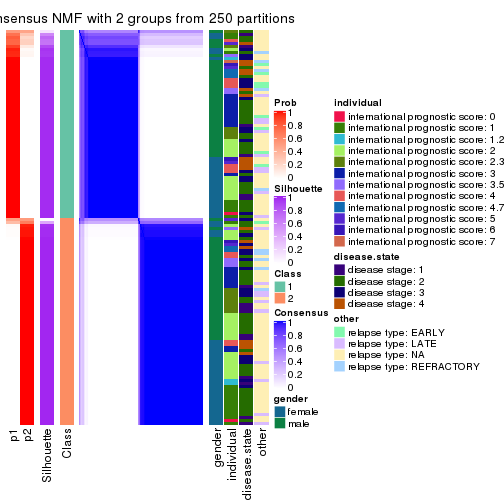</p>

</div>
<div id='tab-ATC-NMF-consensus-heatmap-2'>
<pre><code class="r">consensus_heatmap(res, k = 3)
</code></pre>

<p>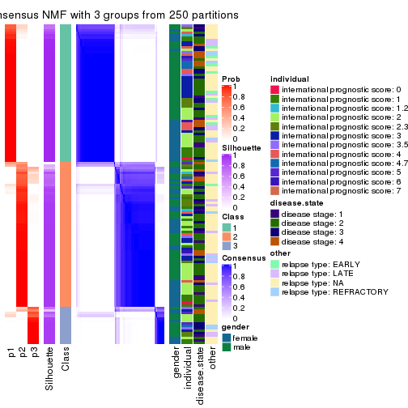</p>

</div>
<div id='tab-ATC-NMF-consensus-heatmap-3'>
<pre><code class="r">consensus_heatmap(res, k = 4)
</code></pre>

<p>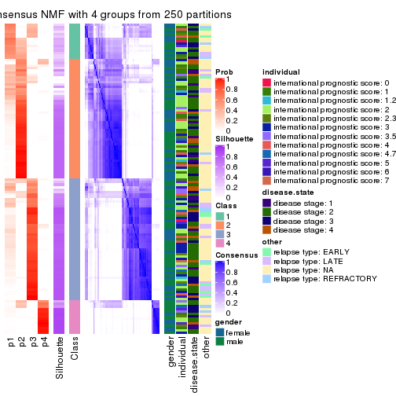</p>

</div>
<div id='tab-ATC-NMF-consensus-heatmap-4'>
<pre><code class="r">consensus_heatmap(res, k = 5)
</code></pre>

<p>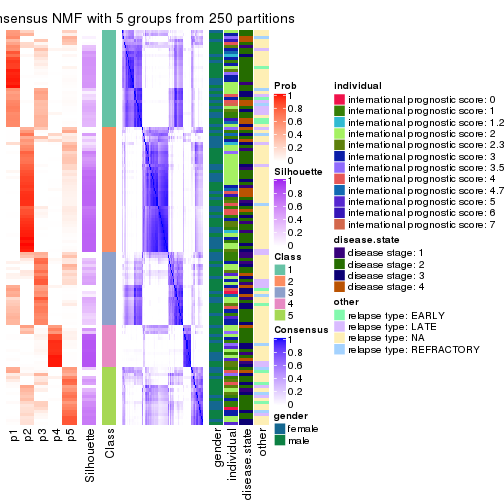</p>

</div>
<div id='tab-ATC-NMF-consensus-heatmap-5'>
<pre><code class="r">consensus_heatmap(res, k = 6)
</code></pre>

<p>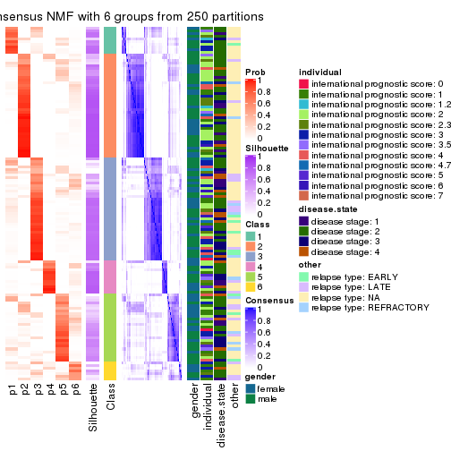</p>

</div>
</div>

Heatmaps for the membership of samples in all partitions to see how consistent they are:


<script>
$( function() {
	$( '#tabs-ATC-NMF-membership-heatmap' ).tabs();
} );
</script>
<div id='tabs-ATC-NMF-membership-heatmap'>
<ul>
<li><a href='#tab-ATC-NMF-membership-heatmap-1'>k = 2</a></li>
<li><a href='#tab-ATC-NMF-membership-heatmap-2'>k = 3</a></li>
<li><a href='#tab-ATC-NMF-membership-heatmap-3'>k = 4</a></li>
<li><a href='#tab-ATC-NMF-membership-heatmap-4'>k = 5</a></li>
<li><a href='#tab-ATC-NMF-membership-heatmap-5'>k = 6</a></li>
</ul>
<div id='tab-ATC-NMF-membership-heatmap-1'>
<pre><code class="r">membership_heatmap(res, k = 2)
</code></pre>

<p>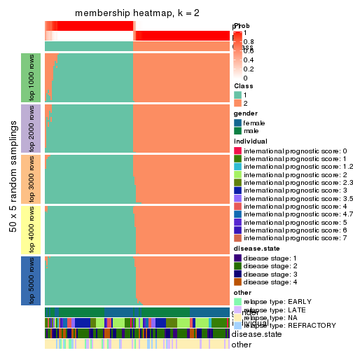</p>

</div>
<div id='tab-ATC-NMF-membership-heatmap-2'>
<pre><code class="r">membership_heatmap(res, k = 3)
</code></pre>

<p>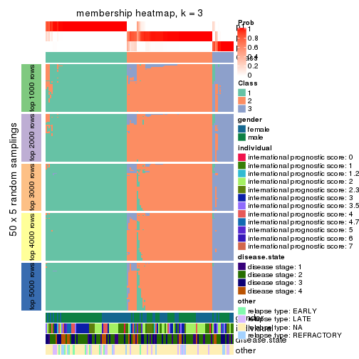</p>

</div>
<div id='tab-ATC-NMF-membership-heatmap-3'>
<pre><code class="r">membership_heatmap(res, k = 4)
</code></pre>

<p>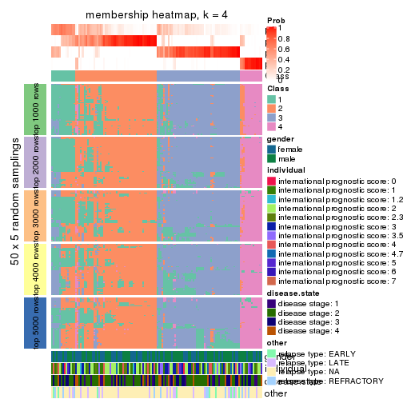</p>

</div>
<div id='tab-ATC-NMF-membership-heatmap-4'>
<pre><code class="r">membership_heatmap(res, k = 5)
</code></pre>

<p>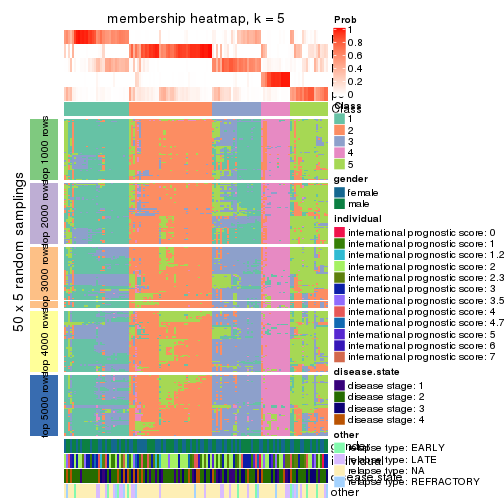</p>

</div>
<div id='tab-ATC-NMF-membership-heatmap-5'>
<pre><code class="r">membership_heatmap(res, k = 6)
</code></pre>

<p>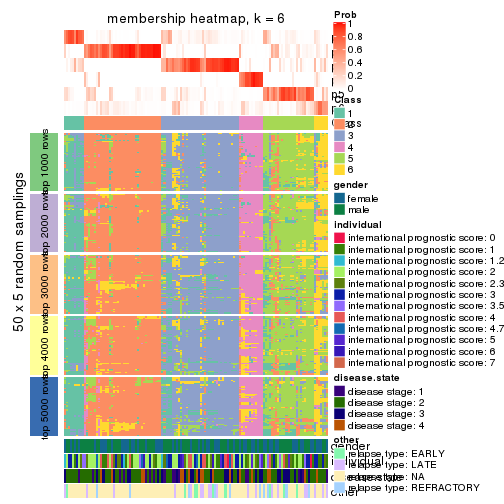</p>

</div>
</div>

As soon as we have had the classes for columns, we can look for signatures
which are significantly different between classes which can be candidate marks
for certain classes. Following are the heatmaps for signatures.


Signature heatmaps where rows are scaled:


<script>
$( function() {
	$( '#tabs-ATC-NMF-get-signatures' ).tabs();
} );
</script>
<div id='tabs-ATC-NMF-get-signatures'>
<ul>
<li><a href='#tab-ATC-NMF-get-signatures-1'>k = 2</a></li>
<li><a href='#tab-ATC-NMF-get-signatures-2'>k = 3</a></li>
<li><a href='#tab-ATC-NMF-get-signatures-3'>k = 4</a></li>
<li><a href='#tab-ATC-NMF-get-signatures-4'>k = 5</a></li>
<li><a href='#tab-ATC-NMF-get-signatures-5'>k = 6</a></li>
</ul>
<div id='tab-ATC-NMF-get-signatures-1'>
<pre><code class="r">get_signatures(res, k = 2)
</code></pre>

<p>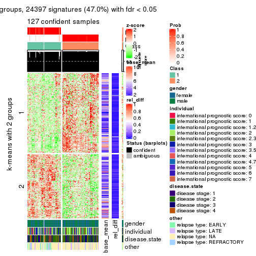</p>

</div>
<div id='tab-ATC-NMF-get-signatures-2'>
<pre><code class="r">get_signatures(res, k = 3)
</code></pre>

<p>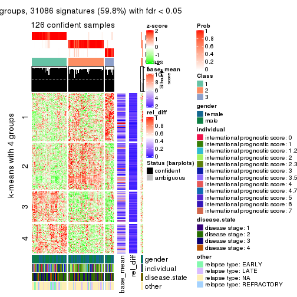</p>

</div>
<div id='tab-ATC-NMF-get-signatures-3'>
<pre><code class="r">get_signatures(res, k = 4)
</code></pre>

<p></p>

</div>
<div id='tab-ATC-NMF-get-signatures-4'>
<pre><code class="r">get_signatures(res, k = 5)
</code></pre>

<p>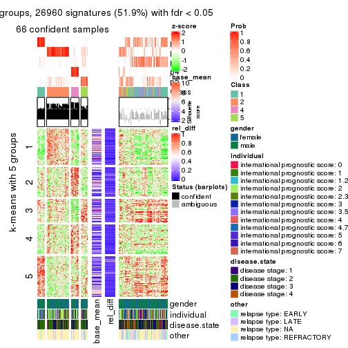</p>

</div>
<div id='tab-ATC-NMF-get-signatures-5'>
<pre><code class="r">get_signatures(res, k = 6)
</code></pre>

<pre><code>#&gt; Error: The width or height of the raster image is zero, maybe you forget to turn off the
#&gt; previous graphic device or it was corrupted. Run `dev.off()` to close it.
</code></pre>

<p></p>

</div>
</div>


Signature heatmaps where rows are not scaled:


<script>
$( function() {
	$( '#tabs-ATC-NMF-get-signatures-no-scale' ).tabs();
} );
</script>
<div id='tabs-ATC-NMF-get-signatures-no-scale'>
<ul>
<li><a href='#tab-ATC-NMF-get-signatures-no-scale-1'>k = 2</a></li>
<li><a href='#tab-ATC-NMF-get-signatures-no-scale-2'>k = 3</a></li>
<li><a href='#tab-ATC-NMF-get-signatures-no-scale-3'>k = 4</a></li>
<li><a href='#tab-ATC-NMF-get-signatures-no-scale-4'>k = 5</a></li>
<li><a href='#tab-ATC-NMF-get-signatures-no-scale-5'>k = 6</a></li>
</ul>
<div id='tab-ATC-NMF-get-signatures-no-scale-1'>
<pre><code class="r">get_signatures(res, k = 2, scale_rows = FALSE)
</code></pre>

<p>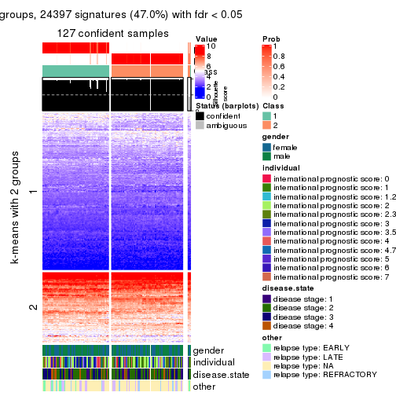</p>

</div>
<div id='tab-ATC-NMF-get-signatures-no-scale-2'>
<pre><code class="r">get_signatures(res, k = 3, scale_rows = FALSE)
</code></pre>

<p>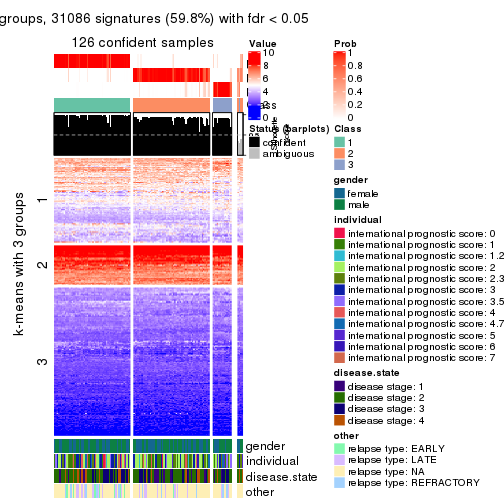</p>

</div>
<div id='tab-ATC-NMF-get-signatures-no-scale-3'>
<pre><code class="r">get_signatures(res, k = 4, scale_rows = FALSE)
</code></pre>

<p>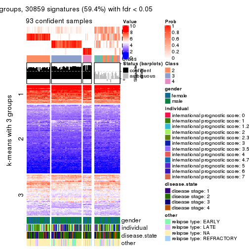</p>

</div>
<div id='tab-ATC-NMF-get-signatures-no-scale-4'>
<pre><code class="r">get_signatures(res, k = 5, scale_rows = FALSE)
</code></pre>

<p>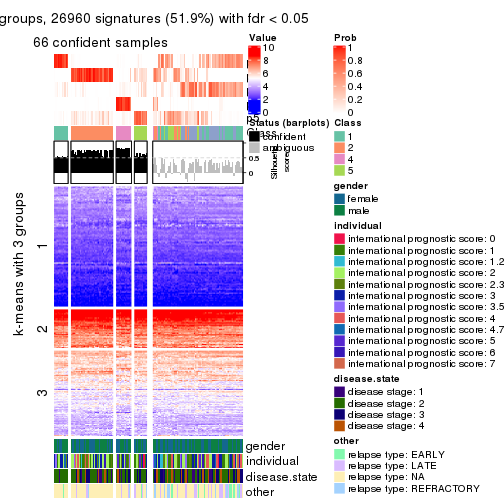</p>

</div>
<div id='tab-ATC-NMF-get-signatures-no-scale-5'>
<pre><code class="r">get_signatures(res, k = 6, scale_rows = FALSE)
</code></pre>

<p>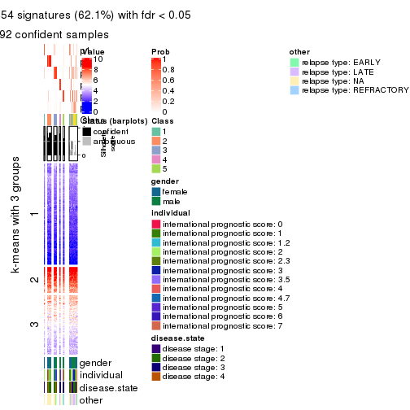</p>

</div>
</div>


Compare the overlap of signatures from different k:

```r
compare_signatures(res)
```

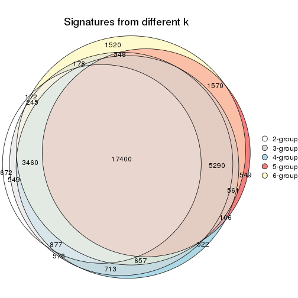

`get_signature()` returns a data frame invisibly. TO get the list of signatures, the function
call should be assigned to a variable explicitly. In following code, if `plot` argument is set
to `FALSE`, no heatmap is plotted while only the differential analysis is performed.

```r
# code only for demonstration
tb = get_signature(res, k = ..., plot = FALSE)
```

An example of the output of `tb` is:

```
#>   which_row         fdr    mean_1    mean_2 scaled_mean_1 scaled_mean_2 km
#> 1        38 0.042760348  8.373488  9.131774    -0.5533452     0.5164555  1
#> 2        40 0.018707592  7.106213  8.469186    -0.6173731     0.5762149  1
#> 3        55 0.019134737 10.221463 11.207825    -0.6159697     0.5749050  1
#> 4        59 0.006059896  5.921854  7.869574    -0.6899429     0.6439467  1
#> 5        60 0.018055526  8.928898 10.211722    -0.6204761     0.5791110  1
#> 6        98 0.009384629 15.714769 14.887706     0.6635654    -0.6193277  2
...
```

The columns in `tb` are:

1. `which_row`: row indices corresponding to the input matrix.
2. `fdr`: FDR for the differential test. 
3. `mean_x`: The mean value in group x.
4. `scaled_mean_x`: The mean value in group x after rows are scaled.
5. `km`: Row groups if k-means clustering is applied to rows.


UMAP plot which shows how samples are separated.


<script>
$( function() {
	$( '#tabs-ATC-NMF-dimension-reduction' ).tabs();
} );
</script>
<div id='tabs-ATC-NMF-dimension-reduction'>
<ul>
<li><a href='#tab-ATC-NMF-dimension-reduction-1'>k = 2</a></li>
<li><a href='#tab-ATC-NMF-dimension-reduction-2'>k = 3</a></li>
<li><a href='#tab-ATC-NMF-dimension-reduction-3'>k = 4</a></li>
<li><a href='#tab-ATC-NMF-dimension-reduction-4'>k = 5</a></li>
<li><a href='#tab-ATC-NMF-dimension-reduction-5'>k = 6</a></li>
</ul>
<div id='tab-ATC-NMF-dimension-reduction-1'>
<pre><code class="r">dimension_reduction(res, k = 2, method = &quot;UMAP&quot;)
</code></pre>

<p>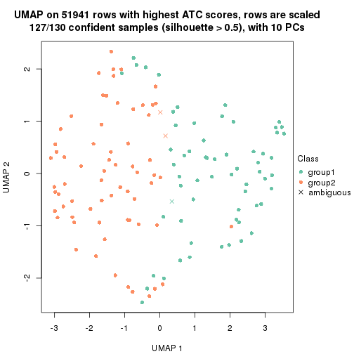</p>

</div>
<div id='tab-ATC-NMF-dimension-reduction-2'>
<pre><code class="r">dimension_reduction(res, k = 3, method = &quot;UMAP&quot;)
</code></pre>

<p>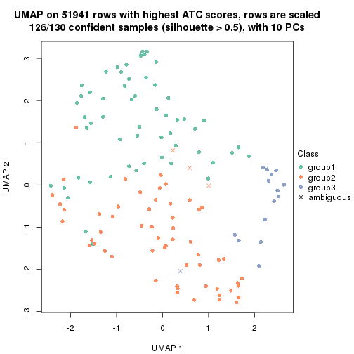</p>

</div>
<div id='tab-ATC-NMF-dimension-reduction-3'>
<pre><code class="r">dimension_reduction(res, k = 4, method = &quot;UMAP&quot;)
</code></pre>

<p>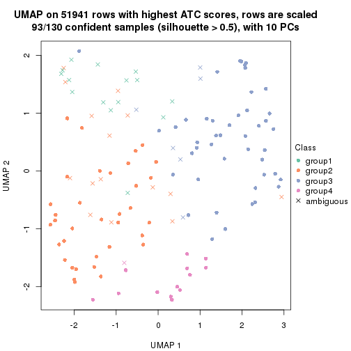</p>

</div>
<div id='tab-ATC-NMF-dimension-reduction-4'>
<pre><code class="r">dimension_reduction(res, k = 5, method = &quot;UMAP&quot;)
</code></pre>

<p>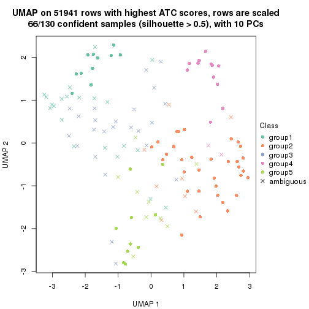</p>

</div>
<div id='tab-ATC-NMF-dimension-reduction-5'>
<pre><code class="r">dimension_reduction(res, k = 6, method = &quot;UMAP&quot;)
</code></pre>

<p>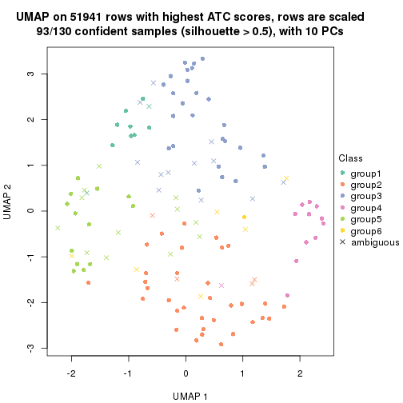</p>

</div>
</div>


Following heatmap shows how subgroups are split when increasing `k`:

```r
collect_classes(res)
```

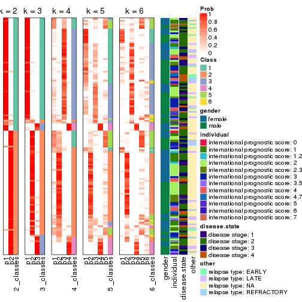


Test correlation between subgroups and known annotations. If the known
annotation is numeric, one-way ANOVA test is applied, and if the known
annotation is discrete, chi-squared contingency table test is applied.

```r
test_to_known_factors(res)
```

```
#>           n gender(p) individual(p) disease.state(p) other(p) k
#> ATC:NMF 127     0.617         0.808            0.556   0.0236 2
#> ATC:NMF 126     0.425         0.586            0.832   0.1311 3
#> ATC:NMF  93     0.348         0.523            0.933   0.0486 4
#> ATC:NMF  66     0.639         0.515            0.394   0.3148 5
#> ATC:NMF  93     0.568         0.959            0.431   0.1608 6
```


If matrix rows can be associated to genes, consider to use `GO_Enrichment(res,
...)` to perform function enrichment for the signature genes.


 

## Session info


```r
sessionInfo()
```

```
#> R version 3.6.0 (2019-04-26)
#> Platform: x86_64-pc-linux-gnu (64-bit)
#> Running under: CentOS Linux 7 (Core)
#> 
#> Matrix products: default
#> BLAS:   /usr/lib64/libblas.so.3.4.2
#> LAPACK: /usr/lib64/liblapack.so.3.4.2
#> 
#> locale:
#>  [1] LC_CTYPE=en_GB.UTF-8       LC_NUMERIC=C               LC_TIME=en_GB.UTF-8       
#>  [4] LC_COLLATE=en_GB.UTF-8     LC_MONETARY=en_GB.UTF-8    LC_MESSAGES=en_GB.UTF-8   
#>  [7] LC_PAPER=en_GB.UTF-8       LC_NAME=C                  LC_ADDRESS=C              
#> [10] LC_TELEPHONE=C             LC_MEASUREMENT=en_GB.UTF-8 LC_IDENTIFICATION=C       
#> 
#> attached base packages:
#> [1] grid      parallel  stats     graphics  grDevices utils     datasets  methods   base     
#> 
#> other attached packages:
#>  [1] genefilter_1.66.0     ComplexHeatmap_2.1.1  markdown_1.1          knitr_1.26           
#>  [5] preprocessCore_1.46.0 cola_1.3.2            GEOquery_2.52.0       Biobase_2.44.0       
#>  [9] BiocGenerics_0.30.0   GetoptLong_0.1.7     
#> 
#> loaded via a namespace (and not attached):
#>  [1] bitops_1.0-6         matrixStats_0.55.0   bit64_0.9-7          doParallel_1.0.15   
#>  [5] RColorBrewer_1.1-2   httr_1.4.1           tools_3.6.0          backports_1.1.5     
#>  [9] R6_2.4.1             DBI_1.0.0            lazyeval_0.2.2       colorspace_1.4-1    
#> [13] withr_2.1.2          tidyselect_0.2.5     gridExtra_2.3        bit_1.1-14          
#> [17] compiler_3.6.0       xml2_1.2.2           microbenchmark_1.4-7 pkgmaker_0.28       
#> [21] slam_0.1-46          scales_1.1.0         readr_1.3.1          NMF_0.23.6          
#> [25] stringr_1.4.0        digest_0.6.23        pkgconfig_2.0.3      bibtex_0.4.2        
#> [29] highr_0.8            limma_3.40.6         rlang_0.4.2          GlobalOptions_0.1.1 
#> [33] RSQLite_2.1.2        impute_1.58.0        shape_1.4.4          mclust_5.4.5        
#> [37] dendextend_1.12.0    dplyr_0.8.3          RCurl_1.95-4.12      magrittr_1.5        
#> [41] Matrix_1.2-17        Rcpp_1.0.3           munsell_0.5.0        S4Vectors_0.22.1    
#> [45] viridis_0.5.1        lifecycle_0.1.0      stringi_1.4.3        plyr_1.8.4          
#> [49] blob_1.2.0           crayon_1.3.4         lattice_0.20-38      splines_3.6.0       
#> [53] annotate_1.62.0      circlize_0.4.9       hms_0.5.2            zeallot_0.1.0       
#> [57] pillar_1.4.2         rjson_0.2.20         rngtools_1.4         reshape2_1.4.3      
#> [61] codetools_0.2-16     stats4_3.6.0         XML_3.98-1.20        glue_1.3.1          
#> [65] evaluate_0.14        png_0.1-7            vctrs_0.2.0          foreach_1.4.7       
#> [69] polyclip_1.10-0      gtable_0.3.0         purrr_0.3.3          tidyr_1.0.0         
#> [73] clue_0.3-57          assertthat_0.2.1     ggplot2_3.2.1        xfun_0.11           
#> [77] gridBase_0.4-7       eulerr_6.0.0         xtable_1.8-4         skmeans_0.2-11      
#> [81] survival_2.44-1.1    viridisLite_0.3.0    tibble_2.1.3         iterators_1.0.12    
#> [85] AnnotationDbi_1.46.1 registry_0.5-1       memoise_1.1.0        IRanges_2.18.3      
#> [89] cluster_2.1.0        brew_1.0-6
```


